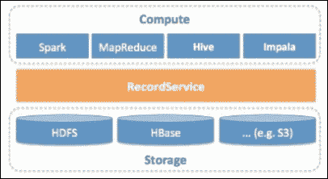

# 第十三章。安全数据

在这本书里，我们访问了数据科学的许多领域，经常误入那些传统上与数据科学家的核心工作知识无关的领域。特别是，我们专门用了一整章[第 2 章](02.html "Chapter 2. Data Acquisition")、*数据采集*来讨论数据摄取，解释了如何解决一个一直存在但很少得到充分承认或解决的问题。在本章中，我们将访问另一个经常被忽略的领域，安全数据。更具体地说，如何在数据生命周期的所有阶段保护您的数据和分析结果。这包括从摄取到呈现，始终考虑到自然形成 Spark 范例的重要架构和可伸缩性需求。

在本章中，我们将涵盖以下主题:

*   如何使用 HDFS ACL 实现粗粒度数据访问控制
*   细粒度安全性指南，使用 Hadoop 生态系统进行解释
*   如何确保数据始终加密，使用 Java KeyStore 的示例
*   混淆、屏蔽和标记数据的技术
*   Spark 如何实现 Kerberos
*   数据安全-伦理和技术问题

# 数据安全

我们的数据架构的最后一块是安全性，在本章中我们将发现数据安全性总是很重要的，以及其原因。考虑到由许多因素导致的数据量和种类的巨大增长，但在很大程度上由于互联网和相关技术的普及，越来越需要提供完全可扩展和安全的解决方案。我们将探讨这些解决方案，以及与数据存储、处理和处理相关的保密性、隐私性和法律问题；我们将把这些与前面章节中介绍的工具和技术联系起来。

我们将继续解释大规模保护数据所涉及的技术问题，并介绍使用各种访问、分类和混淆策略解决这些问题的想法和技术。与前几章一样，通过使用 Hadoop 生态系统的示例展示了这些想法，还将展示公共云基础架构策略。

## 问题

在前几章中，我们已经探讨了许多不同的主题，通常集中在特定问题的具体细节以及解决这些问题的方法上。在所有这些情况下，都有一种隐含的想法，即正在使用的数据和收集的见解内容不需要以任何方式进行保护；或者至少在操作系统级别提供的保护，例如登录凭证，就足够了。

在任何环境中，无论是家庭还是商业环境，数据安全都是一个必须始终考虑的巨大问题。也许，在少数情况下，将数据写入本地硬盘就足够了，无需采取进一步措施；这很少是一个可以接受的行动过程，当然应该是一个有意识的决定，而不是默认的行为。在商业环境中，计算资源通常具有内置的安全性。在这种情况下，用户理解这些含义并决定是否应该采取进一步措施仍然很重要；数据安全不仅仅是针对恶意实体或意外删除的保护，还包括两者之间的一切。

举个例子，如果你在一个安全的、受监管的、商业的、没有互联网接入的环境中工作，并且在一个由志同道合的数据科学家组成的团队中工作，那么个人的安全责任仍然和不存在任何安全的环境一样重要；您可能可以访问任何同行都不能查看的数据，并且您可能需要生成可供不同和多样化的用户组使用的分析结果，所有这些用户组都不能看到彼此的数据。重点可能会明确或隐含地放在您身上，以确保数据不会受到损害；因此，深入了解软件堆栈中的安全层是必不可少的。

## 基础

安全考虑无处不在，甚至在你可能从未想过的地方。例如，当 Spark 在群集上运行并行作业时，您知道在该生命周期中数据可能接触物理磁盘的点吗？如果您认为一切都是在内存中完成的，那么您就有潜在的安全问题，因为数据可能会溢出到磁盘。本章将进一步阐述这一点的含义。这里的要点是，您不能总是将安全责任委托给您正在使用的框架。事实上，您使用的软件越多样化，用户和数据相关的安全问题就越多。

安全性可以大致分为三个方面:

*   **认证**:确定用户身份的合法性
*   **授权**:用户拥有的执行特定动作的权限
*   **访问**:用于保护数据的安全机制，包括传输中的数据和静态数据

这几点之间有重要的区别。用户可能拥有访问和编辑文件的完全权限，但如果文件已在用户安全领域之外加密，则该文件可能仍然不可读；用户授权介入。同样，在返回结果之前，用户可以通过安全链接发送数据，以便在远程服务器上进行处理，但这不能保证数据没有在该远程服务器上留下足迹；安全机制未知。

# 认证和授权

身份验证与用于确保用户是他们所说的那个人的机制相关，并且在两个关键级别上运行，即本地和远程。

身份验证可以采取各种形式，最常见的是用户登录，但其他示例包括指纹读取、虹膜扫描和个人识别码输入。用户登录可以在本地进行管理，例如在您的个人计算机上，也可以使用诸如**轻量级目录访问协议** ( **LDAP** 等工具在远程进行管理。远程管理用户提供了独立于任何特定硬件的漫游用户配置文件，并且可以独立于用户进行管理。所有这些方法都在操作系统级别执行。还有其他位于应用层并为服务提供身份验证的机制，如谷歌 OAuth。

可选的身份验证方法各有利弊，在声明安全系统之前，应彻底了解特定的实现；例如，指纹系统可能看起来非常安全，但情况并非总是如此。更多信息，请参考[http://www . CSE . MSU . edu/rg groups/biometrics/Publications/指纹/CaoJain _ hackingmobileephnesusing 2d printed edfingerprint _ MSU-CSE-16-2 . pdf](http://www.cse.msu.edu/rgroups/biometrics/Publications/Fingerprint/CaoJain_HackingMobilePhonesUsing2DPrintedFingerprint_MSU-CSE-16-2.pdf)。我们不打算在这里进一步探讨身份验证，因为我们假设大多数系统将只实现用户登录；顺便说一句，一个特性本身通常不是一个安全的解决方案，事实上，在许多情况下，它根本不提供安全性。更多信息，请参考[。](http://www.cs.arizona.edu/~collberg/Teaching/466-566/2012/Resources/presentations/2012/topic7-final/report.pdf)

授权是我们非常感兴趣的一个领域，因为它构成了基本安全的关键部分，是我们最常拥有最大控制权的领域，也是我们可以在任何现代操作系统中本机使用的东西。实现资源授权有各种不同的方式，主要有两种:

*   **访问控制列表** ( **ACL** )
*   **基于角色的访问控制** ( **RBAC** )

我们将依次讨论这些。

## 访问控制列表

在 Unix 中，ACL 在整个文件系统中使用。如果我们在命令行列出目录内容:

```scala
drwxr-xr-x 6 mrh mygroup 204 16 Jun 2015 resources

```

我们可以看到有一个名为 resources 的目录，它有一个指定的所有者(`mrh`)和组(`mygroup`)，有`6`链接，大小为`204`字节，最后一次修改是在`16 June 2015`上。ACL`drwxr-xr-x`指示:

*   `d`这是一个目录(-如果不是)
*   `rwx`所有者(`mrh`)拥有读取、写入和执行权限
*   `r-x`组中的任何人(`mygroup`)都具有读取和执行权限
*   `r-x`其他所有人都拥有读取和执行权限

使用 ACL 是保护我们的数据安全的第一步。它应该永远是考虑的第一件事，应该永远是正确的；如果我们不能确保这些设置在任何时候都是正确的，那么我们可能会让其他用户更容易访问这些数据，并且我们不一定知道系统上的其他用户是谁。始终避免在 ACL 的所有*部分提供完全访问:*

```scala
-rwx---rwx 6 mrh mygroup 204 16 Jun 2015 secretFile.txt

```

无论我们的系统有多安全，任何有权访问文件系统的用户都可以读取、写入和删除该文件！更合适的设置是:

```scala
-rwxr----- 6 mrh mygroup 204 16 Jun 2015 secretFile.txt

```

它为组提供了完全所有者访问权限和只读访问权限。

HDFS 本土实施 ACLs 这些可以使用命令行管理:

```scala
hdfs dfs -chmod 777 /path/to/my/file.txt

```

假设文件已经有足够的权限让我们进行更改，这就给了每个人在 HDFS 对文件的完全权限。

### 注

当 Apache 在 2008 年发布 Hadoop 时，人们通常不理解集群设置的所有默认值都不进行任何用户身份验证。如果没有正确配置集群，任何用户都可以通过在客户端机器(`sudo useradd hdfs`)上创建一个`hdfs`用户来访问 Hadoop 中的超级用户`hdfs`。

## 基于角色的访问控制(RBAC)

RBAC 采取了不同的方法，为用户分配一个或多个角色。这些角色与常见任务或工作职能相关，因此可以根据用户的职责轻松添加或删除它们。例如，在公司中，可能有许多角色，包括帐户、股票和交货。会计可以被赋予这三个角色，这样他们就可以编制年终财务，而预订交付的管理员只能担任交付角色。这使得当用户更换部门或离开组织时，添加新用户和管理用户变得更加容易。

为 RBAC 定义了三个关键规则:

*   **角色分配**:只有用户选择或被分配了角色，用户才能行使权限
*   **角色授权**:必须为用户授权用户的活动角色
*   **权限授权**:只有用户的活动角色的权限被授权，用户才能行使权限

用户和角色之间的关系可以总结如下:

*   **角色-权限**:特定角色授予用户特定权限。
*   **用户-角色**:用户类型与特定角色的关系。
*   **角色-角色**:角色之间的关系。这些可以是分层的，所以*角色 1 = >角色 2* 可能意味着，如果用户拥有*角色 1* ，那么他们自动拥有*角色 2* ，但是如果他们拥有*角色 2* ，这并不一定意味着他们拥有*角色 1* 。

RBAC 是通过 Apache Sentry 在 Hadoop 中实现的。组织可以定义数据集的权限，这些权限将从多个访问路径强制实施，包括 HDFS、阿帕奇蜂巢、英帕拉，以及通过 HCatalog 的阿帕奇 Pig 和阿帕奇 MapReduce/shate。例如，每个 Spark 应用都作为请求用户运行，并要求访问底层文件。Spark 不能直接强制访问控制，因为它是作为请求用户运行的，不受信任。因此，它仅限于文件系统权限(ACL)。在这种情况下，Apache Sentry 为资源提供基于角色的控制。

# 访问

到目前为止，我们只专注于确保用户是他们所说的那个人，并且只有正确的用户才能查看和使用数据的具体想法。但是，一旦我们采取了适当的步骤并确认了这些细节，我们仍然需要确保当用户实际使用时，这些数据是安全的；有许多方面需要考虑:

*   是否允许用户查看数据中的所有信息？也许它们将被限制在某些行，甚至某些行的某些部分。
*   当用户对数据进行分析时，数据是否安全？我们需要确保数据不会以纯文本形式传输，因此容易受到中间人攻击。
*   一旦用户完成任务，数据是否安全？确保数据在所有阶段都超级安全是没有意义的，只是将纯文本结果写入不安全的区域。
*   能否从数据的聚合中得出结论？例如，即使用户只能访问数据集的某些行，假设在这种情况下为了保护个人的匿名性，有时也可能在明显不相关的信息之间建立链接。如果用户知道 *A= > B* 和 *B= > C* ，他们可以猜测，很可能， *A= > C* ，即使不允许他们在数据中看到这个。实际上，这种问题很难避免，因为数据聚合问题可能非常微妙，发生在不可预见的情况下，并且通常涉及长时间收集的信息。

我们可以使用许多机制来帮助我们防范上述情况。

# 加密

可以说，保护数据最明显、最广为人知的方法是加密。无论我们的数据是在传输中还是在静止中，我们都会使用它，所以，除了数据实际上是在内存中处理的时候，几乎所有的时间都是这样。加密机制因数据状态而异。

## 静止数据

我们的数据总是需要存储在某个地方，无论是 HDFS、S3 还是本地磁盘。如果我们已经采取了所有预防措施来确保用户得到授权和验证，那么磁盘上仍然存在纯文本的问题。通过直接访问磁盘，无论是物理访问还是通过现场视察堆栈中的较低层访问，流传输整个内容并收集纯文本数据都是相当简单的。

如果我们加密数据，那么我们就可以免受这种类型的攻击。加密也可以存在于不同的级别，或者通过使用软件在应用层加密数据，或者通过在硬件级别(即磁盘本身)加密数据。

在应用层加密数据是最常见的途径，因为它使用户能够对需要做出的权衡决策做出明智的选择，从而根据自己的情况做出正确的产品选择。因为加密增加了额外的处理开销(数据需要在写入时加密，在读取时解密)，所以需要就处理器时间与安全强度之间的权衡做出关键决定。需要考虑的主要决定是:

*   **加密算法类型**:用于执行加密的算法，即 AES、RSA 等
*   **加密密钥位长**:加密密钥的大小大致等同于破解的难度，但也会影响结果的大小(可能的存储考虑)，即 64 位、128 位等等
*   **允许的处理器时间**:加密密钥越长一般意味着处理时间越长；如果数据量足够大，这可能会对处理产生严重影响

一旦我们为我们的用例决定了正确的因素组合，记住一些算法密钥长度组合不再被认为是安全的，我们就需要软件来实际进行加密。这可能是一个定制的 Hadoop 插件或商业应用。如上所述，Hadoop 现在有了一个原生的 HDFS 加密插件，所以你不需要自己写了！这个插件使用 Java KeyStore 来安全地存储加密密钥，可以通过 Apache Ranger 访问。加密完全在 HDFS 境内进行，本质上与文件上的访问控制列表相关联。因此，当在 Spark 中访问 HDFS 文件时，该过程是无缝的(除了一些额外的时间来加密/解密文件)。

如果您希望在 Spark 中实现加密，将数据写入上述场景中没有涉及的地方，那么可以使用 Java javax.crypto 包。这里最薄弱的一环现在是，钥匙本身必须被记录在某个地方；因此，我们可能只是将我们的安全问题转移到其他地方。使用合适的密钥库，如 Java 密钥库，可以解决这个问题。

在编写时，从 Spark 写入本地磁盘时，没有明显的数据加密方式。在下一节，我们将写我们自己的！

这个想法是用尽可能接近原始的东西来代替`rdd.saveAsTextFile(filePath)`功能，并具有进一步加密数据的能力。然而，这还不是全部，因为我们还需要能够读回数据。为此，我们将利用`rdd.saveAsTextFile(filePath)`函数的替代函数，该函数也接受压缩编解码器参数:

```scala
saveAsTextFile(filePath, Class<? extends
     org.apache.hadoop.io.compress.CompressionCodec> codec)
```

从表面上看，Spark 使用压缩编解码器的方式似乎类似于我们想要的数据加密方式。因此，让我们根据我们的目的修改一个现有的 Hadoop 压缩实现。查看几个不同的现有实现(`GzipCodec`、`BZip2Codec`)，我们发现我们必须扩展`CompressionCodec`接口来导出我们的加密编解码器，从这里开始命名为`CryptoCodec`。让我们看看 Java 中的一个实现:

```scala
import org.apache.hadoop.io.compress.crypto.CryptoCompressor;
import org.apache.hadoop.io.compress.crypto.CryptoDecompressor;

public class CryptoCodec implements CompressionCodec, Configurable {

    public static final String CRYPTO_DEFAULT_EXT = ".crypto";
    private Configuration config;

    @Override
    public Compressor createCompressor() {
        return new CryptoCompressor();
    }
    @Override
    public Decompressor createDecompressor() {
        return new CryptoDecompressor();
    }
    @Override
    public CompressionInputStream createInputStream(InputStream in)
          throws IOException {
        return createInputStream(in, createDecompressor());
    }
    @Override
    public CompressionInputStream createInputStream(InputStream in,
          Decompressor decomp) throws IOException {
        return new DecompressorStream(in, decomp);
    }
    @Override
    public CompressionOutputStream createOutputStream(OutputStream out)
          throws IOException {
        return createOutputStream(out, createCompressor());
    }
    @Override
    public CompressionOutputStream createOutputStream(OutputStream out,
          Compressor comp) throws IOException {
        return new CompressorStream(out, comp);
    }
    @Override
    public Class<? extends Compressor> getCompressorType() {
        return CryptoCompressor.class;
    }
    @Override
    public Class<? extends Decompressor> getDecompressorType() {
        return CryptoDecompressor.class;
    }
    @Override
    public String getDefaultExtension() {
        return CRYPTO_DEFAULT_EXT;
    }
    @Override
    public Configuration getConf() {
        return this.config;
    }
    @Override
    public void setConf(Configuration config) {
        this.config = config;
    }
}
```

这里值得注意的是，这个编解码器类只是作为一个包装器，用于将我们的加密和解密例程与 Hadoop API 集成在一起；这个类为调用加密编解码器时使用的 Hadoop 框架提供了入口点。感兴趣的两个主要方法是`createCompressor`和`createDeompressor`，它们都执行相同的初始化:

```scala
public CryptoCompressor() { 
    crypto = new EncryptionUtils(); } 

```

我们使用纯文本密码使事情变得更简单。使用此代码时，应该从安全存储中提取加密密钥；本章将进一步详细讨论这一点:

```scala
public EncryptionUtils() {
    this.setupCrypto(getPassword());
}

private String getPassword() {
    // Use a Java KeyStore as per the below code, a Database or any other secure mechanism to obtain a password
    // TODO We will return a hard coded String for simplicity
    return "keystorepassword";
}

private void setupCrypto(String password) {
    IvParameterSpec paramSpec = new IvParameterSpec(generateIV());
    skeySpec = new SecretKeySpec(password.getBytes("UTF-8"), "AES");
    ecipher = Cipher.getInstance(encoding);
    ecipher.init(Cipher.ENCRYPT_MODE, skeySpec, paramSpec);
    dcipher = Cipher.getInstance(encoding);
}

private byte[] generateIV() {
    SecureRandom random = new SecureRandom();
    byte bytes[] = new byte[16];
    random.nextBytes(bytes);
    return bytes;
}

```

接下来，我们定义加密方法本身:

```scala
public byte[] encrypt(byte[] plainBytes, boolean addIV) 
        throws InvalidAlgorithmParameterException,
               InvalidKeyException {

    byte[] iv = "".getBytes("UTF-8");
    if (!addIV) {
        iv = ecipher.getParameters()
                    .getParameterSpec(IvParameterSpec.class)
                    .getIV();
    }
    byte[] ciphertext = ecipher.update(
           plainBytes, 0, plainBytes.length);
    byte[] result = new byte[iv.length + ciphertext.length];
    System.arraycopy(iv, 0, result, 0, iv.length);
    System.arraycopy(ciphertext, 0,
                     result, iv.length, ciphertext.length);
    return result;
}

public byte[] decrypt(byte[] ciphertext, boolean useIV)
        throws InvalidAlgorithmParameterException,
               InvalidKeyException {

    byte[] deciphered;
    if (useIV) {
        byte[] iv = Arrays.copyOfRange(ciphertext, 0, 16);
        IvParameterSpec paramSpec = new IvParameterSpec(iv);
        dcipher.init(Cipher.DECRYPT_MODE, skeySpec, paramSpec);
        deciphered = dcipher.update(
            ciphertext, 16, ciphertext.length - 16);
    } else {
        deciphered = dcipher.update(
            ciphertext, 0, ciphertext.length);
    }
    return deciphered;

}

public byte[] doFinal() {
    try {
        byte[] ciphertext = ecipher.doFinal();
        return ciphertext;
    } catch (Exception e) {
        log.error(e.getStackTrace());
        return null;
    }
}
```

### 注

每次加密文件时，*初始化向量* (IV)应该是随机的。随机化对于加密方案实现语义安全至关重要，这是一种在同一密钥下重复使用该方案不允许攻击者推断加密消息各段之间关系的特性。

实现加密范例时的主要问题是字节数组处理不当。正确加密的文件大小通常是使用填充时密钥大小的倍数，在这种情况下为 16(字节)。如果文件大小不正确，加密/解密过程将因填充异常而失败。在以前使用的 Java 库中，数据被分阶段馈送到内部加密例程，大小为`ciphertext.length`，以 16 字节的块加密。如果有余数，它将被添加到下一次更新的数据中。如果进行`doFinal`调用，余数再次被前置，数据在加密前被填充到 16 字节块的末尾，从而例程完成。

我们现在可以继续完成剩下的`CryptoCodec`，也就是说，将实现前面代码的压缩和解压缩实现。这些方法位于`CryptoCompressor`和`CryptoDecompressor`类中，由 Hadoop 框架调用:

```scala
@Override
public synchronized int compress(byte[] buf, int off, int len) throws IOException {
    finished = false;
    if (remain != null && remain.remaining() > 0) {
        int size = Math.min(len, remain.remaining());
        remain.get(buf, off, size);
        wrote += size;
        if (!remain.hasRemaining()) {
            remain = null;
            setFinished();
        }
        return size;
    }
    if (in == null || in.remaining() <= 0) {
        setFinished();
        return 0;
    }
    byte[] w = new byte[in.remaining()];
    in.get(w);
    byte[] b = crypto.encrypt(w, addedIV);
    if (!addedIV)
        addedIV = true;
    int size = Math.min(len, b.length);
    remain = ByteBuffer.wrap(b);
    remain.get(buf, off, size);
    wrote += size;
    if (remain.remaining() <= 0)
        setFinished();
    return size;
}

```

您可以在我们的代码库中看到`CryptoCodec`类的完整实现。

既然我们已经有了工作的`CryptoCodec`类，那么 Spark 驱动程序代码就很简单了:

```scala
val conf = new SparkConf() 
val sc = new SparkContext(conf.setAppName("crypto encrypt")) 
val writeRDD = sc.parallelize(List(1, 2, 3, 4), 2) 
writeRDD.saveAsTextFile("file:///encrypted/data/path",classOf[CryptoCodec]) 

```

而且我们有本地磁盘加密！要读取加密文件，我们只需在配置中定义`codec`类:

```scala
val conf = new SparkConf() 
conf.set("spark.hadoop.io.compression.codecs", 
         "org.apache.hadoop.io.compress.CryptoCodec") 
val sc = new SparkContext(conf.setAppName("crypto decrypt")) 
val readRDD = sc.textFile("file:///encrypted/data/path") 
readRDD.collect().foreach(println) 

```

Spark 将在识别适当的文件时自动使用`CryptoCodec`类，我们的实现确保每个文件使用唯一的 IV；IV 是从加密文件的开头读取的。

### Java KeyStore

根据您的环境，上述代码可能足以保护您的数据安全。但是，有一个缺陷，用于加密/解密数据的密钥必须以纯文本形式提供。我们可以通过创建一个 Java KeyStore 来解决这个问题。这可以通过命令行或编程来完成。我们可以实现一个创建`JCEKS`密钥库并添加密钥的函数:

```scala
public static void createJceksStoreAddKey() {

       KeyStore keyStore = KeyStore.getInstance("JCEKS");
       keyStore.load(null, null);

       KeyGenerator kg = KeyGenerator.getInstance("AES");
       kg.init(128); // 16 bytes = 128 bit
       SecretKey sk = kg.generateKey();
       System.out.println(sk.getEncoded().toString());

       keyStore.setKeyEntry("secretKeyAlias", sk,
            "keystorepassword".toCharArray(), null);

       keyStore.store(new FileOutputStream("keystore.jceks"),
                  "keystorepassword".toCharArray());
}
```

我们可以通过命令行实现同样的目的:

```scala
keytool -genseckey-alias secretKeyAlias /
        -keyalg AES /
        -keystore keystore.jceks /
        -keysize 128 /
        -storeType JCEKS

```

并检查它是否存在:

```scala
keytool -v -list -storetype JCEKS -keystore keystore.jceks

```

要从此密钥库中检索密钥:

```scala
public static SecretKey retrieveKey()
        throws KeyStoreException,
               IOException,
               CertificateException,
               NoSuchAlgorithmException,
               UnrecoverableKeyException {

    KeyStore keyStore = KeyStore.getInstance("JCEKS");
    keyStore.load(new FileInputStream("keystore.jceks"),
        "keystorepassword".toCharArray());

    SecretKey key = (SecretKey) keyStore.getKey("secretKeyAlias",
        "keystorepassword".toCharArray());

    System.out.println(key.getEncoded().toString());
    return key;
}
```

### 注

为了便于阅读，我们已经对细节进行了硬编码，但实际上不应该这样做，因为 Java 字节码反向工程相对简单，因此恶意第三方很容易获得这些秘密信息。

我们的密钥现在在密钥库中受到保护，只能使用密钥库密码和密钥别名进行访问。这些仍然需要保护，但通常存储在数据库中，只有授权用户才能访问。

我们现在可以修改我们的`EncryptionUtils.getPassword`方法来检索`JCEKS`键，而不是纯文本版本，如下所示:

```scala
private String getPassword(){
    return retrieveKey();
}
```

现在我们有了`CryptoCodec`类，我们可以在任何需要数据加密的时候，在 Spark 中使用它来保护数据。例如，如果我们将Spark配置`spark.shuffle.spill.compress`设置为真，将`spark.io.compression.codec`设置为`org.apache.hadoop.io.compress.CryptoCodec`，那么任何溢出到磁盘的内容都将被加密。

### S3 加密

HDFS 加密非常适合提供本质上是托管服务的服务。如果我们现在看看 S3，它也可以做到这一点，但它也提供了通过以下方式提供服务器端加密的能力:

*   AWS KMS-托管密钥(上交所-KMS)
*   客户提供的钥匙

如果您处于需要显式管理加密密钥的环境中，服务器端加密可以提供更大的灵活性。

硬件加密在物理磁盘体系结构中处理。一般来说，这具有更快的优势(由于指定用于加密的定制硬件)，并且更容易保护，因为需要物理访问机器才能绕过。缺点是写入磁盘的所有数据都是加密的，这可能会导致利用率高的磁盘的输入/输出性能下降。

## 在途数据

如果端到端安全性是您的目标，那么一个经常受到关注的领域就是传输中的数据。这可能是在分析处理期间从磁盘读取/写入数据或在网络上传输数据。在所有情况下，意识到环境的弱点是很重要的。假设框架或网络管理员已经为您解决了这些潜在问题是不够的，即使您的环境不允许直接进行更改。

一个常见的错误是，当数据不可读时，就认为它是安全的。虽然二进制数据本身不是人类可读的，但它通常很容易被翻译成可读的内容，并且可以使用 Wireshark([www.wireshark.org](http://www.wireshark.org))等工具通过网络捕获。所以，永远不要假设网络上的数据是安全的，不管它是否是人类可读的。

正如我们之前看到的，即使对磁盘上的数据进行加密，我们也不能认为它一定是安全的。例如，如果数据在硬件级别加密，那么它一离开磁盘本身就不加密。换句话说，纯文本在通过网络传输到任何机器时都是可读的，因此，在传输过程中的任何时候都完全可以被未知实体读取。在软件级别加密的数据通常在被分析使用之前不会被解密，因此，如果网络拓扑未知，这通常是更安全的选择。

当考虑处理系统本身的安全性时，比如 Spark，这里也有问题。数据在节点之间不断移动，用户无法直接控制。因此，重要的是我们要了解在任何给定的时间，数据在哪里可以以纯文本的形式获得。考虑下图，该图显示了Spark纱作业期间实体之间的相互作用:


我们可以看到，每个连接都传输和接收数据。Spark 输入数据通过广播变量传输，除了 UI 和本地洗牌/缓存文件之外，所有通道都支持加密(更多信息请参见 JIRA SPARK-5682)。

此外，这里还有一个弱点，缓存文件以纯文本存储。解决方法是实现前面的解决方案，或者设置 SHARE 本地目录指向本地加密磁盘。为此，我们需要确保所有数据节点上的`yarn.nodemanager.local-dirs`都是加密目录，要么使用商业产品，要么将这些目录托管在加密磁盘上。

既然我们已经将数据视为一个整体，我们就应该处理数据本身的各个部分。数据很可能包含敏感信息，例如姓名、地址和信用卡号。有许多方法可以处理这类信息。

## 混淆/匿名化

通过混淆，数据的敏感部分被转换成永远无法链接回原始内容的东西——通过模糊提供安全性。例如，包含字段:`Forename`、`Surname`、`Address line 1`、`Address line 2`、`Postcode`、`Phone Number`、`Credit Card Number`的 CSV 文件可能会这样混淆:

*   原创

    ```scala
            John,Smith,3 New Road,London,E1 2AA,0207 123456,4659 4234 5678 
            9999
    ```

*   Obfuscated

    ```scala
            John,XXXXXX,X New Road,London,XX 2AA,XXXX 123456,4659 
            XXXXXXXXXXXXXX
    ```

    混淆数据对于分析非常有用，因为它可以保护敏感数据，同时仍然允许进行有用的计算，例如计算已完成的字段。为了在保护其他人的同时保留某些细节，我们还可以对混淆数据的方式保持警惕。例如，一个信用卡号:`4659 42XX XXXX XXXX`可以给我们提供惊人的信息量，作为支付卡的前六位数字，称为**银行识别号** ( **BIN** ，告诉我们以下内容:

*   BIN 465942
*   卡片品牌:VISA
*   发行银行:汇丰银行
*   卡类型:借记卡
*   卡片级别:经典
*   国际标准化组织国家编号 826(英国)

数据混淆不一定是随机的，而是应该仔细定制，以确保敏感数据被明确删除。敏感的定义将完全取决于要求。在前面的示例中，能够按类型汇总客户支付卡的分布可能非常有用，或者可以将其视为应删除的敏感信息。

在这里需要注意的另一个现象是数据聚合，您可能会想起前面的章节。例如，如果我们知道这个人的名字是约翰·史密斯，他的信用卡以 465942 开头，那么我们就知道约翰·史密斯在英国的汇丰银行有一个账户，这对一个恶意实体来说是一个很好的信息。因此，必须小心确保应用正确的混淆量，记住我们永远无法恢复原始数据，除非我们在其他地方存储了另一个副本。数据无法恢复可能是一个代价高昂的事件，因此应该明智地实施数据混淆。事实上，如果存储允许，想要存储几个版本的数据并不是没有道理的，每个版本都有不同的混淆级别和不同的访问级别。

当考虑在 Spark 中实现这一点时，最有可能的情况是，我们将有许多需要转换的输入记录。因此，我们的出发点是写一些可以在单个记录上工作的东西，然后把它包装在一个 RDD 中，这样函数就可以在多个记录上并行运行。

以我们前面的例子为例，让我们用 Scala 作为枚举来表达它的模式。除了定义之外，我们还将在`Enumeration`类中包含任何特定字段应该如何混淆的信息:

*   *x* 、 *y* 掩盖从 *x* 到 *y* 的字符位置
*   `0`、`len`将整个字段从 0 屏蔽到字段文本的长度
*   `prefix`屏蔽最后一个空格字符之前的所有内容
*   `suffix`屏蔽第一个空格字符后的所有内容
*   `""`什么都不做

该信息在枚举中编码如下:

```scala
object RecordField extends Enumeration {
 type Obfuscation = Value
 val FIRSTNAME        = Value(0, "")
 val SURNAME          = Value(1, "0,len")
 val ADDRESS1         = Value(2, "0,1")
 val ADDRESS2         = Value(3, "")
 val POSTCODE        = Value(4, "prefix")
 val TELNUMBER       = Value(5, "prefix")
 val CCNUMBER         = Value(6, "suffix")
}
```

接下来，我们可以拆分输入字符串，并编写一个函数，将正确的混淆参数应用于正确的字段:

```scala
def getObfuscationResult(text: String): String = {
   text
    .split(",")
    .zipWithIndex
    .map { case (field, idx) =>
      field match {
        case s: String if idx >= 0 && idx <= 6 => 
           stringObfuscator(s,RecordField(idx).toString, 'X')
        case _ => "Unknown field"
      }
    }
    .mkString(",")
 }
```

为了简单起见，我们对一些您以后可能想要更改的项目进行了硬编码，例如 split 参数(`,`)，并且还在所有情况下使模糊符号保持不变(`X`)。

最后，实际的混淆代码:

```scala
def stringObfuscator(text: String,
                     maskArgs: String,
                     maskChar: Char):String = {
 var start = 0
 var end = 0

 if (maskArgs.equals("")) {
   text
 }

 if (maskArgs.contains(",")) {
   start = maskArgs.split(',')(0).toInt
   if (maskArgs.split(',')(1) == "len")
     end = text.length
   else
     end = maskArgs.split(',')(1).toInt
 }

 if (maskArgs.contains("prefix")){
   end = text.indexOf(" ")
 }

 if (maskArgs.contains("suffix")){
   start = text.indexOf(" ") + 1
   end = text.length
 }

 if (start > end)
   maskChar

 val maskLength: Int = end - start

 if (maskLength == 0)
   text

 var sbMasked: StringBuilder  = new StringBuilder(
         text.substring(0, start))

 for(i <- 1 to maskLength) {
   sbMasked.append(maskChar)
 }
 sbMasked.append(text.substring(start + maskLength)).toString
}
```

同样，我们保持了事情的简单性，并没有花大力气去检查异常或边缘情况。这里有一个实际的例子:

```scala
getObfuscationResult(
  "John,Smith,3 New Road,London,E1 2AA,0207 123456,4659 4234 5678 9999")
```

它提供了所需的结果:

```scala
John,XXXXXX,X New Road,London,XX 2AA,XXXX 123456,4659 XXXXXXXXXXXXXX

```

这段方便的代码为大规模混淆提供了很好的基础。我们可以很容易地将其扩展到更复杂的场景，例如同一字段不同部分的混淆。例如，通过更改`StringObfuscator`，我们可以在`Address Line 1`字段中以不同的方式屏蔽门牌号和道路名称:

```scala
val ADDRESS1 = Value(2, "0,1;2,len")

```

当然，如果您希望针对许多不同的用例进行扩展，您也可以在`StringObfuscator`上应用策略模式，以允许在运行时提供混淆功能。

一个关键的软件工程技术，策略模式描述如下:[https://sourcemaking.com/design_patterns/strategy](https://sourcemaking.com/design_patterns/strategy)。

在这一点上，值得考虑使用一种算法来混淆数据，例如单向散列函数或摘要，而不是简单地用字符(`XXX`)替换。这是一种通用技术，适用于广泛的用例。它依赖于对某些计算执行逆计算的计算复杂性，例如寻找因子和模平方，这意味着一旦应用它们就不切实际。然而，在使用散列时应该小心，因为尽管摘要计算是 NP 完全的，但是在某些情况下，散列仍然容易受到使用隐含知识的损害。例如，信用卡号码的可预测性意味着它们已经被证明可以通过暴力方法快速破解，甚至使用 MD5 或 SHA-1 哈希。

更多信息，请参考[https://www . integrigy . com/security-resources/hashing-credit-card-numbers-unsafe-application-practices](https://www.integrigy.com/security-resources/hashing-credit-card-numbers-unsafe-application-practices)。

## 掩蔽

数据屏蔽是指创建数据的功能替代，同时确保重要内容被隐藏。这是另一种匿名化方法，一旦屏蔽过程发生，原始内容就会丢失。因此，重要的是要确保变更经过仔细规划，因为它们实际上是最终的。当然，原始版本的数据可以在紧急情况下存储，但这会给安全考虑增加额外的负担。

屏蔽是一个简单的过程，它依赖于生成随机数据来替换任何敏感数据。例如，将蒙版应用于我们前面的示例会给出:

```scala
Simon,Jones,2 The Mall,London,NW1 2JT,0171 123890,1545 3146 6273 6262
```

我们现在有一行，它在功能上等同于原始数据。我们有全名、地址、电话号码和信用卡号，但它们是*不同的*，因此无法链接到原件。

部分屏蔽对于处理非常有用，因为我们可以在屏蔽其余数据的同时保留一些数据。通过这种方式，我们可以执行许多数据审计任务，这些任务不一定可以使用模糊处理。例如，我们可以屏蔽实际存在的数据，从而保证填充的字段始终有效，同时还能够检测空字段。

还可以使用完全屏蔽来生成模拟数据，而完全不需要看到原始数据。在这种情况下，可以完全生成数据，例如，用于测试或分析目的。

无论使用哪种情况，在使用屏蔽时都应该小心，因为有可能无意中将真实信息插入到记录中。例如，`Simon Jones`实际上可能是一个真人。在这种情况下，存储数据来源，即所有数据的来源和历史记录，无疑是一个好主意。因此，如果真正的“`Simon, Jones`”根据《数据保护法》提交了一份**信息请求** ( **RFI** )，您就拥有了提供相关正当理由所需的信息。

让我们扩展之前构建的代码，使用完全随机的选择来实现基本的屏蔽方法。我们已经看到，屏蔽方法要求我们用一些有意义的替换来替换字段。为了让某些东西快速发挥作用，我们可以简单地提供一系列替代方案:

```scala
val forenames = Array("John","Fred","Jack","Simon")
val surnames = Array("Smith","Jones","Hall","West")
val streets = Array("17 Bound Mews","76 Byron Place",
    "2 The Mall","51 St James")
```

稍后，我们可以将这些扩展为从包含更多选项的文件中读取。我们甚至可以使用复合遮罩一次性替换多个字段:

```scala
val composite = Array("London,NW1 2JT,0171 123890",
                      "Newcastle, N23 2FD,0191 567000",
                      "Bristol,BS1 2AA,0117 934098",
                      "Manchester,M56 9JH,0121 111672")
```

然后，处理代码很简单:

```scala
def getMaskedResult(): String = {

  Array(
    forenames(scala.util.Random.nextInt(forenames.length)),
    surnames(scala.util.Random.nextInt(surnames.length)),
    streets(scala.util.Random.nextInt(streets.length)),
    composite(scala.util.Random.nextInt(composite.length)).split(","),
    RandomCCNumber)
  .flatMap {
    case s:String => Seq(s)
    case a:Array[String] => a
  }
  .mkString(",")
}
```

我们可以定义一个`RandomCCNumber`函数来生成一个随机的信用卡号。这里有一个简单的函数，它使用递归提供了四组随机生成的整数:

```scala
def RandomCCNumber(): String = {

    def appendDigits(ccn:Array[String]): Array[String] = {
       if (ccn.length < 4) {
         appendDigits(ccn :+ (for (i <- 1 to 4) 
           yield scala.util.Random.nextInt(9)).mkString)
       }
       else {
         ccn
       }
     }
     appendDigits(Array()).mkString(" ")
}
```

将这段代码放在一起，并在原始示例的基础上运行，得到如下结果:

```scala
getMaskedResult(
  "John,Smith,3 New Road,London,E1 2AA,0207 123456,4659 4234 5678 9999")
```

前面代码的输出如下:

```scala
Jack,Hall,76 Byron Place,Newcastle, N23 2FD,0191 567000,7533 8606 6465 6040
```

或者:

```scala
John,West,2 The Mall,Manchester,M56 9JH,0121 111672,3884 0242 3212 4704
```

同样，我们有很多方法可以开发这段代码。例如，我们可以生成一个在 BIN 方案下有效的信用卡号，或者我们可以确保名称选择不会随机选择它试图替换的同一个名称。然而，这里给出的概要框架是作为该技术的演示，可以很容易地扩展和概括，以考虑到您可能有任何额外的需求。

## 标记化

**令牌化**是将敏感信息替换为令牌的过程，如果需要，该令牌可在以后用于检索实际数据，但需经过相关的身份验证和授权。使用我们前面的示例，标记化文本可能看起来像:

```scala
 John,Smith,[25AJZ99P],[78OPL45K],[72GRT55N],[54CPW59D],[32DOI01F]
```

其中括号内的值是令牌，当请求用户满足正确的安全标准时，这些令牌可以被交换为实际值。这种方法是所讨论的方法中最安全的，并且允许我们恢复精确的原始底层数据。但是，对数据进行标记化和去标记化会带来巨大的处理开销，当然，标记器系统需要管理和小心维护。

这也意味着令牌化系统本身存在单点故障，因此，必须遵守我们讨论过的重要安全流程:审核、身份验证和授权。

由于令牌化的复杂性和安全性问题，最流行的实现是拥有大量专利的商业产品。这种类型的系统(尤其是大数据系统)的主要工作是确保令牌化系统能够以非常高的吞吐量水平提供完整、完全安全、强健且可扩展的服务。然而，我们可以使用 Accumulo 构建一个简单的标记器。在[第 7 章](07.html "Chapter 7. Building Communities")、*建设社区*中，有一节是关于设置 Apache Accumulo，这样我们就可以使用小区级安全。Apache Accumulo 是 Google BigTable 论文的一个实现，但是它增加了额外的安全功能。这意味着用户可以拥有并行和大规模加载和检索数据的所有优势，而且还能够非常精细地控制数据的可见性。本章描述了设置实例、为多个用户配置实例以及加载和检索具有所需安全标签的数据(通过累积突变实现)所需的所有信息。

出于我们的目的，我们希望获取一个字段并创建一个令牌；这可能是一个 GUID、散列或其他对象。然后，我们可以使用令牌作为行标识，字段数据本身作为内容，向 Accumulo 写入一个条目:

```scala
val uuid: String = java.util.UUID.randomUUID.toString
val rowID: Text = new Text("[" + uuid + "]")
val colFam: Text = new Text("myColFam")
val colQual: Text = new Text("myColQual")
val colVis: ColumnVisibility = new ColumnVisibility("private")
val timestamp: long = System.currentTimeMillis()
val value: Value = new Value(field..getBytes())
val mutation: Mutation = new Mutation(rowID)

mutation.put(colFam, colQual, colVis, timestamp, value)
```

然后我们将`uuid`写入输出数据中的相关字段。当令牌化数据被读回时，以`[`开头的任何内容都被认为是令牌，并使用累积读取过程来获取原始字段数据，假设调用累积读取的用户具有正确的权限:

```scala
val conn: Connector = inst.getConnector("user", "passwd")
val auths: Authorizations = new Authorizations("private")
val scan: Scanner = conn.createScanner("table", auths)

scan.setRange(new Range("harry","john"))
scan.fetchFamily("attributes")

for(Entry<Key,Value> entry : scan) {
    val row: String = e.getKey().getRow()
    val value: Value = e.getValue()
}
```

### 使用混合方法

混淆和屏蔽可以非常有效地结合使用，以最大限度地发挥两种方法的优势。使用这种混合方法，我们的示例可能会变成:

```scala
Andrew Jones, 17 New Road London XXXXXX, 0207XXXXXX, 4659XXXXXXXXXXXX
```

使用屏蔽和令牌化的组合是保护信用卡交易安全的新兴银行标准。**主账号** ( **PAN** )被替换为由唯一的、随机生成的数字序列、字母数字字符或截短的 PAN 和随机字母数字序列的组合组成的令牌。这使得信息可以像实际数据一样进行处理，例如审计检查或数据质量报告，但它不允许真实信息以纯文本形式存在。如果需要原始信息，可以使用令牌来请求它，只有当用户满足授权和身份验证要求时，他们才能成功。

我们可以重构代码来执行这个任务；我们将定义一个混合混淆和屏蔽的新函数:

```scala
def getHybridResult(text: String): String = {

  Array(
    forenames(scala.util.Random.nextInt(forenames.length)),
    RecordField.SURNAME,
    streets(scala.util.Random.nextInt(streets.length)),
    RecordField.ADDRESS2,
    RecordField.POSTCODE,
    RecordField.TELNUMBER,
    RandomCCNumber,
    "Unknown field")
  .zip(text.split(","))
  .map { case (m, field) =>
    m match {
      case m:String => m
      case rf:RecordField.Obfuscation =>
         stringObfuscator(field,rf.toString,'X')
    }
  }
  .mkString(",")
}
```

我们的例子再次变成:

```scala
Simon,XXXXXX,51 St James,London,XX 2AA,XXXX 123456,0264 1755 2288 6600
```

与所有标记化一样，您需要小心避免生成数据的副作用，例如，`0264`不是真正的 BIN 代码。同样，需求将决定这是否是一个问题，也就是说，如果我们只是试图确保字段以正确的格式填充，这就不是问题。

为了大规模运行这些过程，我们只需将它们包装在 RDD:

```scala
val data = dataset.map { case record =>
     getMixedResult(record)
}
data.saveAsTextFile("/output/data/path", classOf[CryptoCodec])
```

# 数据处理

安全数据应该有一个约定的生命周期。当在商业环境中工作时，这将由数据权威机构设置，并且它将规定数据在该生命周期的任何给定点应该处于什么状态。例如，特定数据集可能被标记为*敏感-在其生命的第一年需要加密*，其次是*私有-不加密*，最后是*处置*。时间长度和应用的规则将完全取决于组织和数据本身——一些数据仅在几天后过期，一些在 50 年后过期。生命周期确保每个人都确切知道应该如何处理数据，还确保旧数据不会不必要地占用宝贵的磁盘空间或违反任何数据保护法。

正确处理来自安全系统的数据可能是数据安全中最容易被误解的领域之一。有趣的是，它并不总是包括一个完整的和/或破坏性的清除过程。不需要采取行动的例子包括:

*   如果数据只是过时，它可能不再具有任何内在价值——一个很好的例子是到期后向公众公布的政府记录；第二次世界大战期间的最高机密，由于时间的流逝，现在已经不再敏感。
*   如果数据已经加密，并且不再需要，只需扔掉密钥！

与需要一些努力才能导致可能出错的例子相反:

*   **物理破坏**:我们经常听到用锤子或类似工具破坏磁盘的情况，即使这种情况如果没有彻底完成也是不安全的。
*   **多次写入**:依靠多次写入数据块来确保原始数据被物理覆盖。Linux 上的粉碎和擦洗等实用程序可以实现这一点；但是，根据底层文件系统的不同，它们的有效性仍然有限。例如，RAID 和高速缓存类型的系统不一定会被覆盖，超过这些工具的所有检索范围。覆盖工具应谨慎对待，并且仅在完全了解其局限性的情况下使用。

当您保护您的数据时，开始考虑您的处置策略。即使您不知道存在任何组织规则(在商业环境中)，您仍然应该考虑如何确保在不再需要访问时数据不可恢复。

# Kerberos 身份验证

Apache Spark 的许多安装使用 Kerberos 为 HDFS 和卡夫卡等服务提供安全性和身份验证。当与第三方数据库和遗留系统集成时，这也是特别常见的。作为一名商业数据科学家，在某个时候，您可能会发现自己不得不在一个 Kerberos 化的环境中处理数据，因此，在本章的这一部分，我们将介绍 Kerberos 的基础知识——它是什么，它是如何工作的，以及如何使用它。

Kerberos 是一种第三方身份验证技术，在主要通信形式是通过网络的情况下特别有用，这使得它非常适合 Apache Spark。它优先于其他身份验证方法使用，例如用户名和密码，因为它提供了以下好处:

*   应用配置文件中没有以纯文本形式存储的密码
*   促进服务、身份和权限的集中管理
*   建立相互信任，从而确定两个实体
*   防止欺骗-信任只是暂时建立的，只是针对定时会话，这意味着重放攻击是不可能的，但是为了方便起见，会话是可更新的

让我们看看它是如何与 Apache Spark 一起工作的。

## 用例 1: Apache Spark 在安全的 HDFS 访问数据

在最基本的用例中，一旦您登录到安全 Hadoop 集群的边缘节点(或类似节点)，并且在运行您的 Spark 程序之前，必须初始化 Kerberos。这是通过使用 Hadoop 附带的`kinit`命令并在出现提示时输入用户密码来完成的:

```scala
> kinit 
Password for user: 
> spark-shell 
Spark session available as 'spark'. 
Welcome to 
      ____              __ 
     / __/__  ___ _____/ /__ 
    _\ \/ _ \/ _ `/ __/  '_/ 
   /___/ .__/\_,_/_/ /_/\_\   version 2.0.1 
      /_/ 

Using Scala version 2.11.8 (Java HotSpot(TM) 64-Bit Server VM, Java 1.8.0_101) 
Type in expressions to have them evaluated. 
Type :help for more information. 

scala> val file = sc.textFile("hdfs://...") 
scala> file.count 

```

此时，您将完全通过身份验证，并且能够访问 HDFS 境内的任何数据，这取决于标准权限模型。

所以，这个过程似乎很简单，让我们更深入地看看这里发生了什么:

1.  当`kinit`命令运行时，它立即向 Kerberos **密钥分发中心** ( **KDC** )发送请求，以获取**票证授予票证** ( **TGT** )。请求是以纯文本形式发送的，它本质上包含了所谓的**主体**，在这种情况下基本上就是“username@kerberosdomain”(您可以使用`klist`命令找到这个字符串)。**认证服务器(AS)** 响应该请求，使用已经使用客户端私钥签名的 TGT，该私钥是提前共享的，并且已经为 AS 所知。这确保了 TGT 的安全转移。
2.  TGT 缓存在客户端本地，还有一个 **Keytab** 文件，这是一个 Kerberos 密钥的容器，任何以同一用户身份运行的 Spark 进程都可以访问它。
3.  接下来，当启动 spark-shell 时，spark 使用缓存的 TGT 请求**票证授予服务器** ( **TGS** )提供用于访问 HDFS 服务的**会话票证**。此票证使用 HDFS 名称节点的私钥签名。这样，就保证了票证的安全传输，确保只有名称节点可以读取它。
4.  带着一张票，Spark试图从名称节点取回一个委托。这个令牌的目的是防止当执行者开始读取数据时，大量的请求涌入 TGT(因为 TGT 的设计没有考虑到大数据！)，但它也有助于克服 Spark 在延迟执行时间和票证会话到期方面的问题。
5.  Spark 通过将委托令牌放在分布式缓存中，确保所有执行器都可以访问委托令牌，这样它就可以作为一个纱本地文件使用。
6.  当每个执行器向名称节点请求访问存储在 HDFS 的块时，它会传递先前给出的委托令牌。名称节点回复块的位置，以及由名称节点用私有秘密签名的**块令牌**。该密钥由群集中的所有数据节点共享，并且只有它们知道。添加此数据块令牌的目的是确保访问完全安全，因此，它仅颁发给经过身份验证的用户，并且只能由经过验证的数据节点读取。
7.  最后一步是执行者向相关的数据节点提供块标记，并接收请求的数据块。


## 用例 2:扩展到自动身份验证

默认情况下，Kerberos 票证会持续 10 个小时，然后过期，这使得它们在此时间后不再有用，但可以续订。因此，当执行长时间运行的 Spark 作业或 Spark 流作业(或用户不直接参与且`kinit`不能手动运行的作业)时，可以在启动 Spark 过程时传递足够的信息，以便自动更新在前面讨论的握手过程中发出的票证。

这是通过使用提供的命令行选项传入 keytab 文件和相关主体的位置来完成的，如下所示:

```scala
spark-submit 
   --master yarn-client
   --class SparkDriver
   --files keytab.file
   --keytab keytab.file
   --principal username@domain
ApplicationName
```

当作为本地用户尝试执行长时间运行的作业时，可以使用`klist`找到主体名称，否则，可以使用`ktutils`和`ktadmin`在 Kerberos 中配置专用的**服务主体**。

## 用例 3:从 Spark 连接到安全数据库

在公司环境中工作时，可能需要连接到使用 Kerberos 保护的第三方数据库，如 PostgreSQL 或 Microsoft SQLServer。

在这种情况下，可以使用 JDBC·RDD 直接连接到数据库，并让 Spark 发出一个 SQL 查询来并行接收数据。使用这种方法时应该小心，因为传统的数据库不是为高水平的并行性而构建的，但是如果使用得当，它有时是一种非常有用的技术，特别适合快速的数据探索。

首先，您需要特定数据库的本地 JDBC 驱动程序——这里我们使用了微软的 SQLServer 作为例子，但是驱动程序应该适用于所有支持 Kerberos 的现代数据库(参见 RFC 1964)。

您需要将 spark-shell 配置为在启动时使用 JDBC 驱动程序，如下所示:

```scala
> JDBC_DRIVER_JAR=sqljdbc.jar 
> spark-shell  
  --master yarn-client  
  --driver-class-path $JDBC_DRIVER_JAR  
  --files keytab.file   --conf spark.driver.extraClassPath=$JDBC_DRIVER_JAR 
  --conf spark.executor.extraClassPath=$JDBC_DRIVER_JAR 
  --jars $JDBC_DRIVER_JAR 

```

然后，在 shell 中，键入或粘贴以下内容(替换突出显示的环境特定变量):

```scala
import org.apache.spark.rdd.JdbcRDD 

new JdbcRDD(sc, ()=>{ 
        import org.apache.hadoop.security.UserGroupInformation 
        import UserGroupInformation.AuthenticationMethod 
        import org.apache.hadoop.conf.Configuration 
        import org.apache.spark.SparkFiles 
        import java.sql.DriverManager 
        import java.security.PrivilegedAction 
        import java.sql.Connection 

        val driverClassName = "com.microsoft.sqlserver.jdbc.SQLServerDriver" 
        val url = "jdbc:sqlserver://" + 
                  "host:port;instanceName=DB;" + 
                  "databaseName=mydb;" +  
                  "integratedSecurity=true;" +  
                  "authenticationScheme=JavaKerberos" 

        Class.forName(driverClassName) 
        val conf = new Configuration 
        conf.addResource("/etc/hadoop/conf/core-site.xml") 
        conf.addResource("/etc/hadoop/conf/mapred-site.xml") 
        conf.addResource("/etc/hadoop/conf/hdfs-site.xml") 
        UserGroupInformation.setConfiguration(conf) 

        UserGroupInformation 
           .getCurrentUser 
           .setAuthenticationMethod(AuthenticationMethod.KERBEROS) 
        UserGroupInformation 
           .loginUserFromKeytabAndReturnUGI(principal, keytab.file) 
           .doAs(new PrivilegedAction[Connection] { 
             override def run(): Connection =  
                  DriverManager.getConnection(url) 
           }) 

},  
"SELECT * FROM books WHERE id <= ? and id >= ?",  
1,           // lowerBound    - the minimum value of the first placeholder 
20,          // upperBound    - the maximum value of the second placeholder 
4)           // numPartitions - the number of partitions 

```

Spark 运行传递到`JdbcRDD`构造函数中的 SQL，但它不是作为单个查询运行，而是能够使用最后三个参数作为指导来对其进行分块。

因此，在这个例子中，实际上，四个查询将并行运行:

```scala
SELECT * FROM books WHERE id <= 1 and id >= 5 
SELECT * FROM books WHERE id <= 6 and id >= 10 
SELECT * FROM books WHERE id <= 11 and id >= 15 
SELECT * FROM books WHERE id <= 16 and id >= 20 

```

如您所见，Kerberos 是一个庞大而复杂的主题。数据科学家所需的知识水平可能因角色而异。一些组织将会有一个 DevOps 团队来确保所有的事情都被正确地实现。然而，在当前市场技能严重短缺的情况下，数据科学家很可能不得不自己解决这些问题。

# 安全生态系统

最后，我们将简要介绍在使用 Apache Spark 开发时可能会遇到的一些流行的安全工具，以及一些关于何时使用它们的建议。

## 阿帕奇哨兵

随着 Hadoop 生态系统变得越来越大，Hive、HBase、HDFS、Sqoop 和 Spark 等产品都有不同的安全实现。这意味着，为了给用户提供无缝的体验，以及实施总体安全清单，在整个产品堆栈中通常需要重复的策略。这可能会很快变得复杂和耗时，这通常会导致错误甚至安全漏洞(无论是有意还是无意)。Apache Sentry 将许多主流的 Hadoop 产品整合在一起，尤其是 Hive/HS2，以提供细粒度(最大到列级别)控制。

使用 ACLs 很简单，但是维护成本很高。为大量新文件设置权限和修改 umasks 是非常麻烦和耗时的。随着抽象的创建，授权变得更加复杂。例如，文件和目录的融合可以成为表、列和分区。因此，我们需要一个可信的实体来实施访问控制。Hive 有一个可信的服务-**hive server 2**(**HS2**)，该服务解析查询并确保用户可以访问他们请求的数据。HS2 作为可访问整个数据仓库的可信用户运行。用户不会在 HS2 直接运行代码，因此代码不会绕过访问检查。

为了桥接 Hive 和 HDFS 数据，我们可以使用 Sentry HDFS 插件，它将 HDFS 文件权限与更高级别的抽象进行同步。例如，读取表的权限=读取表文件的权限，同样，创建表的权限=写入数据库目录的权限。我们仍然使用 HDFS ACL 来获得细粒度的用户权限，但是我们受限于世界的文件系统视图，因此不能提供列级和行级访问，这是“全有或全无”。如前所述，当这个场景很重要时，伏隔提供了一个很好的选择。然而，有一个产品也解决了这个问题——参见记录服务部分。

实现 Apache Sentry 最快最简单的方法就是使用 Apache Hue。Apache Hue 在过去几年中得到了发展，从简单的图形用户界面开始，汇集了一些基本的 Hadoop 服务，如 HDFS，并已发展成为 Hadoop 堆栈中许多关键构建块的中心；HDFS。蜂巢、小猪、HBase、Sqoop、动物园管理员和 Oozie 都与集成的哨兵一起处理安全问题。色相的演示可以在[http://demo.gethue.com/](http://demo.gethue.com/)找到，为特性集提供了很好的介绍。我们还可以在实践中看到本章中讨论的许多想法，包括 HDFS ACL、RBACs 和 Hive HS2 访问。

## 记录服务

Hadoop 生态系统的一个关键方面是分离存储管理器(例如，HDFS 和 Apache HBase)和计算框架(例如，MapReduce、Impala 和 Apache Spark)。虽然这种解耦允许更大的灵活性，从而允许用户选择他们的框架组件，但由于需要妥协来确保所有的东西无缝地工作，这导致了过度的复杂性。随着 Hadoop 成为用户越来越重要的基础架构组件，对兼容性、性能和安全性的期望也越来越高。

RecordService 是 Hadoop 的一个新的核心安全层，位于存储管理器和计算框架之间，提供统一的数据访问路径、细粒度的数据权限以及跨堆栈的强制实施。



RecordService 仅与 Cloudera 5.4 或更高版本兼容，因此不能以独立的身份使用，也不能与 Hortonworks 兼容，尽管 HDP 使用 Ranger 来实现相同的目标。更多信息可以在 [www.recordservice.io](http://www.recordservice.io) 上找到。

## 阿帕奇游侠

Apache ranger 的目标与 RecordService 大致相同，主要目标是:

*   集中安全管理，在中央用户界面或使用 REST APIs 管理所有与安全相关的任务
*   使用 Hadoop 组件/工具执行特定操作的细粒度授权，并通过中央管理工具进行管理
*   跨所有 Hadoop 组件标准化授权方法
*   增强了对不同授权方法的支持，包括基于角色的访问控制和基于属性的访问控制
*   对 Hadoop 所有组件中的用户访问和管理操作(安全相关)进行集中审核

在撰写本文时，Ranger 是一个 Apache 孵化器项目，因此还没有发布。尽管如此，它完全集成了霍顿工程 HDP 公司，支持 HDFS、Hive、HBase、Storm、诺克斯、Solr、Kafka、NiFi、TYEN，最关键的是，它还是一个可扩展的 HDFS 加密密钥管理服务。详细信息可以在[http://ranger.incubator.apache.org/](http://ranger.incubator.apache.org/)和[http://hortonworks.com/apache/ranger/](http://hortonworks.com/apache/ranger/)找到。

## Apache Knox

我们已经讨论了 Spark/Hadoop 堆栈的许多安全领域，但它们都与保护单个系统或数据有关。没有详细提及的一个领域是保护集群本身免受未经授权的外部访问。Apache Knox 通过“隔离”集群并提供所有外部事务都必须通过的 REST API Gateway 来实现这一角色。

加上 Kerberos 安全的 Hadoop 集群，诺克斯提供了身份验证和授权，保护了集群部署的细节。许多公共服务都得到了满足，包括 HDFS(通过 WEBHDFS)、纱线资源管理器和 Hive。

诺克斯是霍顿工程公司大力资助的另一个项目，因此完全融入了霍顿工程公司的 HDP 平台。虽然诺克斯可以部署到几乎任何 Hadoop 集群中，但它可以在 HDP 以完全集成的方式完成。更多信息可以在[knox.apache.org](http://knox.apache.org)找到。

# 你的安全责任

既然我们已经介绍了常见的安全用例，并讨论了数据科学家在日常活动中需要注意的一些工具，那么还有最后一个重要事项需要注意。*在他们保管期间，数据的责任，包括其安全性和完整性，由数据科学家*承担。不管你是否被明确告知，这通常是真的。因此，在处理和处理数据时，认真对待这一责任并采取所有必要的预防措施至关重要。如果需要，也要准备好向他人传达他们的责任。我们都需要确保我们不对场外的违规负责；这可以通过突出问题来实现，或者甚至与场外服务提供商签订书面合同来概述他们的安全安排。要查看当您没有适当注意尽职调查时会出错的真实示例，请在此查看关于 Ashley-Madison 黑客攻击的一些安全说明:[http://blog . erratasec . com/2015/08/notes-on-Ashley-Madison-dump . html #。V-AGgT4rIUv](http://blog.erratasec.com/2015/08/notes-on-ashley-madison-dump.html#.V-AGgT4rIUv) 。

另一个感兴趣的领域是可移动媒体，最常见的是 DVD 和记忆棒。应该像对待硬盘驱动器一样对待这些数据，但要假设这些数据总是不安全且有风险的。这些类型的介质也有相同的选项，这意味着数据可以在应用级别或硬件级别得到保护(光盘除外，例如 DVD/CD)。对于 USB 密钥存储，存在实现硬件加密的例子。数据写入时总是安全的，因此免除了用户的大部分责任。这些类型的驱动器应始终符合**联邦信息处理标准**(**FIPS**)；一般来说，FIPS 140(密码模块)或 FIPS 197 (AES 密码)。

如果不需要 FIPS 标准，或者介质本质上是光学的，那么数据可以在应用层加密，即通过软件加密。有许多方法可以做到这一点，包括加密分区、加密文件或原始数据加密。所有这些方法都涉及使用第三方软件在读/写时执行加密/解密功能。因此，需要密码，介绍了密码强度、安全性等问题。作者经历过一个加密盘从一家公司交给另一家公司，手写密码同时上交的情况！除了对数据安全的风险之外，对有关个人的纪律处分也可能产生后果。如果数据有风险，检查最佳实践和突出问题总是值得的；在这方面很容易变得松懈，迟早数据会被泄露，必须有人承担责任——失去媒体本身的可能不一定是个人。

# 总结

在本章中，我们探讨了数据安全的主题，并解释了一些相关的问题。我们发现，不仅需要掌握技术知识，数据安全心态也同样重要。数据安全经常被忽视，因此，采取系统的方法，教育他人，是掌握数据科学的关键责任。

我们已经解释了数据安全生命周期，并概述了最重要的责任领域，包括授权、身份验证和访问，以及相关的示例和用例。我们还探索了 Hadoop 安全生态系统，并描述了当前可用的重要开源解决方案。

本章的很大一部分致力于构建一个 Hadoop `InputFormat` *压缩器*，它作为一个数据加密实用程序运行，可以与 Spark 一起使用。适当的配置允许编解码器在各种关键领域使用，尤其是当将混洗的记录溢出到本地磁盘时*目前没有解决方案*。

在下一章中，我们将探索可扩展算法，展示我们可以掌握的关键技术，以实现真正的“大数据”规模的性能。