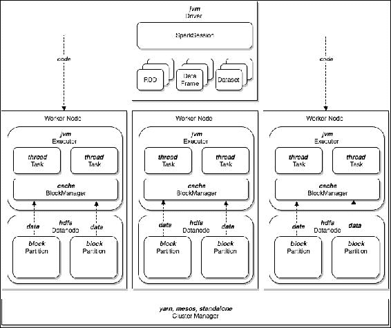
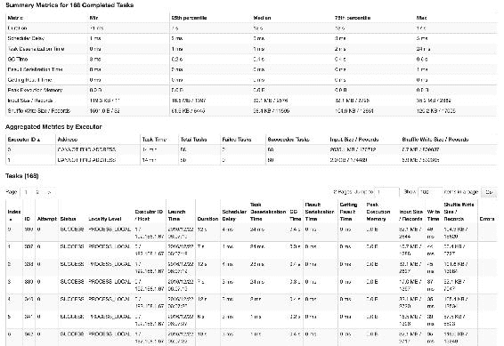
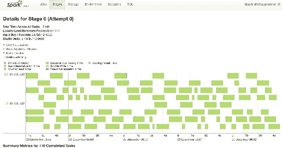
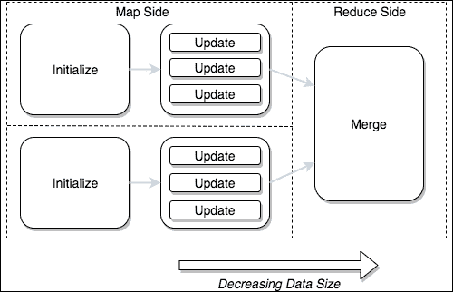

# 十四、可扩展算法

在本章中，我们将讨论在 Spark 上编写高效且可扩展的分析所面临的挑战。我们将首先向读者介绍分布式并行化和可伸缩性的一般概念，以及它们与 Spark 的关系。我们将回顾 Spark 的分布式体系结构，让读者了解它的基本原理以及它如何支持并行处理范式。我们将了解可扩展分析的特性以及支撑这些特性的 Spark 元素(例如，`RDD`、`combineByKey`和`GraphX`)。

接下来，我们将了解为什么有时即使是基本算法，尽管在小规模下工作，也会在大数据中经常失败。我们将看到如何避免在编写在海量数据集上运行的 Spark 作业时出现问题，包括一个使用均值/方差的示例。读者将了解算法的结构，以及如何编写可扩展到千兆字节数据的定制数据科学分析。

稍后，我们将继续讨论 Spark 内存模型的一些限制(例如过度的内存使用，传统数据模型的缺陷，包括面向对象方法[OOP]和第三范式[3NF]，非规范化数据表示的好处，以及固定精度数字表示的危险)，以及这些与编写高效 Spark 作业的关系。

本章最后描述了在 Spark 中促进高效运行时处理的主要性能相关特性和模式，并展示了何时利用它们。我们将介绍并行化策略、缓存、洗牌策略、垃圾收集优化和概率模型等特性；并解释这些如何帮助您充分利用 Spark。

本章还强调了在进行分析创作时，对开发过程有一个好的整体方法的重要性。它揭示了专业人士的提示和技巧，将确保您的算法编写体验成功。

# 一般原则

在本书中，我们展示了许多数据科学技术，通过使用 Spark 的力量，这些技术将扩展到数十亿字节的数据。希望你已经发现这些技术足够有用，以至于你想在自己的分析中开始使用它们，事实上，你已经受到了创建自己的数据科学管道的启发。

写自己的分析绝对是一个挑战！有时会很有趣，当他们工作得很好的时候就很棒了。但有时让它们大规模高效运行(甚至完全运行)似乎是一项艰巨的任务。

有时候，在缺乏反馈的情况下，你会陷入一个看似无止境的循环，等待一个又一个任务完成，甚至不知道你的工作是否会在最后一关失败。让我们面对现实吧，在 20 小时的工作结束时看到一个可怕的`OutOfMemoryError`对任何人来说都不好玩！当然，一定有更好的方法来开发在 Spark 上运行良好且不会导致时间浪费和代码执行不佳的分析？

写得好的 Spark 作业的主要特征之一是*可伸缩性*的概念。可伸缩性是与性能截然不同的概念。虽然性能是计算响应速度的度量，但可伸缩性是当您增加需求时(或者在 Spark 的情况下，增加数据量时)计算性能的度量。

可扩展性的圣杯被称为*线性可扩展性*。这是指当向集群添加额外资源时，对可伸缩性没有性能限制的理想情况。在这种情况下，将集群中的计算机数量增加一倍将导致性能增加一倍，或者同样，将数据量增加一倍将在两倍大小的集群上产生相同的性能。

本章将作为写作分析的入门，试图利用这种线性可伸缩性。它将展示最大化可伸缩性的最佳实践，并解释实现可伸缩性的障碍。虽然它不会提供优化技术的详尽描述，但它会让您开始了解如何编写高效的 Spark 作业。

在深入细节之前，让我们确立一些基本原则，这些原则将有助于并贯穿始终:

1.  **尽可能保留数据局部性**:移动数据的成本很高。通过将处理转移到数据，就地处理数据通常要快得多。在 Spark 中，这被称为*数据位置*。事实上，Spark 旨在充分利用这一点。因此，您可能认为您不需要太担心它，因为框架会为您处理它。虽然这是部分正确的，但谨慎的做法是在每个阶段测试这一假设，以确保它的行为符合预期。如果没有，使用 Spark 提供的杠杆，以防止在不必要时移动数据。事实上，数据局部性原则非常重要，我们甚至需要在整个开发过程中考虑它。在每个阶段，考虑是否真的有必要移动数据。在某些情况下，有可能以不同的方式分解问题，以最小化或完全避免移动。如果是这样，那么总是值得考虑传输较少数据的方法。
2.  **确保数据的均匀分布**:运行 Spark 作业时，最理想的情况是让你所有的执行者都得到平等的利用。当选定的几个人做所有的工作时，让执行者无所事事，表明工作表现不佳。通过在执行器之间均匀分布数据，可以确保最大限度地利用集群资源。
3.  **Favor faster stores**: Not all methods of randomly accessing data are the same. The following snippet shows the approximate time taken to reference data in various states:

    L1 高速缓存 0.5 ns

    7ns L2 快取记忆体

    主存储器 100 ns

    磁盘(随机寻道)2000000 纳秒

    幸运的是，Spark 提供了内存处理功能，包括许多利用可用快速缓存(L1/L2/L3 缓存)的优化。因此，它可以避免不必要的从主内存读取或溢出到磁盘。重要的是，您的分析充分利用这些效率。这是作为钨项目的一部分推出的。

4.  **观察后才优化**:传说中的计算机科学家、作者唐纳德·克努特有句名言:*过早优化是万恶之源*。虽然这听起来很极端，但他的意思是，所有与性能相关的调整或优化都应该基于经验证据，而不是先发制人的直觉。因为这样的预测经常不能正确识别性能问题，反而会导致糟糕的设计选择，这在后来是令人遗憾的。但与你可能想的相反，这里的建议并不是说直到最后你才忘记表现，事实上恰恰相反。在一个环境中，数据的大小以及任何操作所需的时间长度决定了一切，在分析设计过程的早期就开始优化是最基本的。但这难道不是克努特定律的矛盾吗？嗯，不是。就性能而言，简单往往是关键。这种方法应该是基于证据的，所以从简单开始，在运行时仔细观察您的分析的性能(通过使用分析调优和代码分析，请参见下一节)，执行有针对性的优化来纠正发现的问题，然后重复。在性能不佳的分析中，过度设计通常和选择慢算法一样受到指责，但要彻底解决这个问题可能要困难得多。
5.  **Start small and scale-up**: Start with small data samples. While an analytic may *eventually* be required to run over a petabyte of data, starting with a small dataset is definitely advisable. Sometimes only a handful of rows are required to determine whether an analytic is working as expected. And more rows can be added to prove out the various test and edge cases. It's more about breadth of coverage here rather than volume. The analytic design process is extremely iterative and judicious use of data sampling will pay dividends during this phase; while even a small dataset will allow you to measure the impact on performance as you incrementally increase the size of the data.

    底线是写分析，特别是对你不熟悉的数据，需要时间，而且没有捷径。

现在我们有了一些指导方针，让我们关注它们如何应用于 Spark。

# Spark架构

Apache Spark 旨在简化高度并行化的分布式计算这一费力且有时容易出错的任务。为了理解它是如何做到这一点的，让我们探索一下它的历史，并确定 Spark 带来了什么。

## Spark的历史

Apache Spark 实现了一种*数据并行*，旨在改进 Apache Hadoop 普及的 MapReduce 范式。它在四个关键领域扩展了 MapReduce:

*   **改进的编程模型** : Spark 通过其 API 提供了比 Hadoop 更高层次的抽象；创建一个大大减少必须编写的代码量的编程模型。通过引入一个流畅的、无副作用的、面向函数的应用编程接口，Spark 可以根据分析的转换和动作进行推理，而不仅仅是映射器和缩减器的序列。这使得理解和调试更加容易。
*   **引入工作流**:Spark 不像传统的 MapReduce 那样将作业链接在一起(通过将结果保存到磁盘并使用第三方工作流调度器)，而是允许将分析分解为任务并表示为**有向无环图** ( **DAGs** )。这立即消除了对物化数据的需求，但也意味着它可以更好地控制分析的运行方式，包括实现基于成本的查询优化等效率(参见 catalyst 查询规划器)。
*   **更好的内存利用率** : Spark 利用每个节点上的内存对数据集进行内存缓存。它允许在操作之间访问缓存，以提高基本 MapReduce 的性能。这对于迭代工作负载尤其有效，例如**随机梯度下降** ( **SGD** )，在这种情况下通常可以观察到性能的显著提高。
*   **集成方法**:通过支持流、SQL 执行、图形处理、机器学习、数据库集成等等，它提供了一个工具来统治它们！在 Spark 之前，需要专门的工具，例如，Storm、Pig、Giraph、Mahout 等等。尽管在某些情况下，专业工具可以提供更好的结果，但是 Spark 对集成的持续承诺令人印象深刻。

除了这些一般性的改进，Spark 还提供了许多其他功能。让我们看看盒子里面。

## 运动部件

在概念层面，Apache Spark 内部有许多关键组件，其中许多您可能已经知道，但是让我们在我们概述的可伸缩性原则的背景下回顾一下它们:



### 驾驶员

**驱动**是 Spark 的主要切入点。它是您启动的程序，它在单个 JVM 中运行，它启动并控制您工作中的所有操作。

就性能而言，您可能希望避免将大型数据集带回驱动程序，因为运行此类操作(如`rdd.collect`)通常会导致`OutOfMemoryError`。当返回的数据大小超过驱动程序的 JVM 堆大小时，就会出现这种情况，如`--driver-memory`所指定的。

### Spark感应

当驱动程序启动时，`SparkSession`类被初始化。`SparkSession`类通过相关上下文提供对 Spark 所有服务的访问，如`SQLContext`、`SparkContext`和`StreamingContext`类。

这也是调整 Spark 运行时性能相关属性的地方。

### 弹性分布式数据集

弹性分布式数据集(**【RDD】**)是表示一组分布式同质记录的底层抽象。

虽然数据可能物理上存储在集群中的许多机器上，但分析人员有意不知道它们的实际位置:他们只处理关系数据库。在封面下，rdd 由分区或连续的数据块组成，就像蛋糕的切片。每个分区都有一个或多个副本，Spark 能够确定这些副本的物理位置，以便决定在哪里运行转换任务来确保数据的局部性。

### 注

有关如何确定副本物理位置的示例，请参见:[中的`getPreferredLocations`。](https://github.com/apache/spark/blob/master/core/src/main/scala/org/apache/spark/rdd/NewHadoopRDD.scala)

rdd 还负责确保从底层数据块存储(例如 HDFS)中适当地缓存数据。

### 执行人

**执行器**是在集群的工作节点上运行的进程。当启动时，每个执行器连接回驱动程序，并等待指令对数据运行操作。

你决定你的分析需要多少个执行器，这就成为你的最大并行度。

### 注

除非使用动态分配。在这种情况下，最大并行度为无穷大，直到使用`spark.dynamicAllocation.maxExecutors`进行配置。详见Spark配置。

### 洗牌操作

**shuffle** 是执行器之间数据传输的名称，每当数据必须物理移动以计算计算时，该名称作为操作的一部分出现。这通常发生在对数据进行分组时，以便具有相同关键字的所有记录都在一台机器上，但也可以有策略地使用它来对数据进行重新分区，以获得更高的并行度。

但是，由于它涉及(I)数据在网络上的移动和(ii)数据在磁盘上的持久性，因此通常被认为是一种缓慢的操作。因此，洗牌是一个对以后的可伸缩性非常重要的领域。

### 集群管理器

**集群管理器**位于 Spark 之外，充当集群的资源协商者。它控制物理资源的初始分配，因此 Spark 能够在具有必要数量的内核和内存的机器上启动它的执行器。

尽管每个集群管理器的工作方式不同，但您的选择不太可能对算法性能产生任何可衡量的影响。

### 任务

一个**任务**代表在单个数据分区上运行一组操作的指令。驱动程序将每个任务序列化为一个执行器，实际上就是将处理转移到数据的表达式所引用的内容。

### 天

一个 **DAG** 代表一个动作执行中涉及的所有转换的逻辑执行计划。它的优化是分析性能的基础。在 SparkSQL 和数据集的情况下，优化由 catalyst 优化器代表您执行。

### 天调度器

**DAG 调度器**通过将 DAG 划分为阶段并为每个阶段创建一组相应的任务(每个分区一个)来创建物理计划。


### 转换

**转换**是一种操作。他们通常对 RDD 的每条记录应用用户定义的函数。改造有两种，*窄*和*宽*。

窄转换是本地应用于分区的操作，因此不需要移动数据来正确计算。它们包括:`filter`、`map`、`mapValues`、`flatMap`、`flatMapValues`、`glom`、`pipe`、`zipWithIndex`、`cartesian`、`union`、`mapPartitionsWithInputSplit`、`mapPartitions`、`mapPartitionsWithIndex`、`mapPartitionsWithContext`、`sample`、`randomSplit`。

相比之下，宽转换是需要移动数据才能正确计算的操作。换句话说，它们需要洗牌。它们包括:`sortByKey`、`reduceByKey`、`groupByKey`、`join`、`cartesian`、`combineByKey`、`partitionBy`、`repartition`、`repartitionAndSortWithinPartitions`、`coalesce`、`subtractByKey`、`cogroup`。

### 注

`coalesce`、`subtractByKey`和`cogroup`转换可能会很窄，这取决于数据的物理位置。

为了编写可伸缩的分析，了解您正在使用哪种类型的转换非常重要。

### 阶段

一个**阶段**代表一组可以物理映射到一个任务的操作(每个分区一个)。关于阶段，有几件事需要注意:

*   在 DAG 中连续出现的任何窄变换序列被一起流水线化为单个阶段。换句话说，它们在同一个执行器上按顺序执行，因此对着同一个分区执行，不需要洗牌。
*   每当在 DAG 中遇到宽转换时，就会引入阶段边界。现在存在两个阶段(或者在连接的情况下更多)，第二个阶段在第一个阶段完成之前不能开始(更多细节见`ShuffledRDD`类)。

### 行动

**动作**是Spark内部的另一种操作。它们通常用于执行并行写入或将数据传输回驱动程序。当其他转换被延迟评估时，触发 DAG 执行的是动作。

在调用一个动作时，它的父 RDD 被提交给驱动程序中的`SparkSession`或`SparkContext`类，并且 DAG 调度器生成一个 DAG 来执行。

### 任务计划程序

**任务调度器**接收由 DAG 调度器确定的一组任务(每个分区一个任务)，并结合数据局部性调度每个任务在适当的执行器上运行。

# 挑战

现在我们已经了解了 Spark 体系结构，让我们通过介绍一些挑战来为编写可扩展分析做准备，或者如果不小心可能会遇到的*陷阱*。没有这些预先的知识，你可能会浪费时间去自己解决它们！

## 算法复杂度

除了数据大小的明显影响之外，分析的性能还高度依赖于您试图解决的问题的性质。即使是一些看似简单的问题，比如图的深度优先搜索，也没有在分布式环境中高效执行的定义良好的算法。在这种情况下，在设计分析时应该非常小心，以确保它们利用易于并行化的处理模式。在开始之前花点时间去了解你的问题的复杂性，从长远来看是有回报的。在下一节中，我们将向您展示如何做到这一点。

### 注

一般来说， *NC-complete* 问题是可并行的，而 P-complete 问题则不是:[https://en . Wikipedia . org/wiki/NC _(复杂度)](https://en.wikipedia.org/wiki/NC_(complexity))。

另一件需要注意的事情是，当在小数据上运行时，分布式算法通常比单线程应用慢得多。值得记住的是，在所有数据都放在一台机器上的情况下，Spark 的开销:生成进程、传输数据以及进程间通信引入的延迟很少会有回报。对这种方法的投资只有在数据集足够大以至于无法舒适地放入内存的情况下才真正开始有所帮助，然后您会注意到吞吐量的增加，也就是使用 Spark 可以在单位时间内处理的数据量。

## 数值异常

当处理大量数据时，您可能会注意到数字的一些奇怪效果。这些奇怪之处与现代机器的通用数字表示有关，特别是*精度*的概念。

为了演示效果，请考虑以下几点:

```scala
scala> val i = Integer.MAX_VALUE
i: Int = 2147483647

scala> i + 1
res1: Int = -2147483648
```

请注意，一个正数是如何通过简单地加一就变成负数的。这种现象被称为**数溢出**，当计算得出的数字对于其类型来说太大时，就会出现这种现象。在这种情况下，一个`Int`有 32 位的固定宽度，所以当我们试图存储一个 33 位的数字时，我们得到一个溢出，导致一个负数。这种类型的行为可以在任何数值类型中演示，并且是任何算术运算的结果。

### 注

这是由于大多数现代处理器制造商(以及 Java 和 Scala)采用了带符号的固定宽度二进制补码表示法。

虽然在正常编程过程中会发生溢出，但在处理大型数据集时，溢出会更加明显。即使在执行相对简单的计算(如求和或求平均值)时，也会出现这种情况。让我们考虑最基本的例子:

```scala
scala> val distanceBetweenStars = Seq(2147483647, 2147483647)
distanceBetweenStars: Seq[Int] = List(2147483647, 2147483647)

scala> val rdd = spark.sparkContext.parallelize(distanceBetweenStars)
rdd: org.apache.spark.rdd.RDD[Int] =  ...

scala> rdd.reduce(_+_)
res1: Int = -2
```

数据集也不能幸免:

```scala
scala> distanceBetweenStars.toDS.reduce(_+_)
res2: Int = -2
```

当然，有处理这种情况的策略；例如通过使用替代算法、不同的数据类型或改变测量单位。然而，在您的设计中应该始终考虑解决这些类型问题的计划。

另一个类似的影响是由计算中的舍入误差引起的显著性损失，这些误差受到其精度的限制。出于说明的目的，考虑一下这真的很基本(而且不是很复杂！)示例:

```scala
scala> val bigNumber = Float.MaxValue
bigNumber: Float = 3.4028235E38

scala> val verySmall = Int.MaxValue / bigNumber
verySmall: Float = 6.310888E-30

scala> val almostAsBig = bigNumber - verySmall
almostAsBig: Float = 3.4028235E38

scala> bigNumber - almostAsBig
res2: Float = 0.0
```

在这里，我们期待答案`6.310887552645619145394993304824655E-30`，但是我们得到的却是零。这是精度和重要性的明显损失，展示了设计分析时需要注意的另一种行为。

为了解决这些问题，威尔福德和陈设计了一个在线算法来计算`mean`和`variance`。它试图精确地避免问题。在封面下，Spark 实现了这个算法，在 PySpark StatCounter 中可以看到一个例子:

```scala
   def merge(self, value):
        delta = value - self.mu
        self.n += 1
        self.mu += delta / self.n
        self.m2 += delta * (value - self.mu)
        self.maxValue = maximum(self.maxValue, value)
        self.minValue = minimum(self.minValue, value)
```

让我们深入了解一下它是如何计算均值和方差的:

*   `delta`:`delta`是 mu(当前运行平均值)与考虑中的新值之间的差值。它测量数据点之间的值的变化，因此它总是很小。这基本上是一个神奇的数字，确保计算永远不会涉及所有值的求和，因为这可能会导致溢出。
*   `mu`:mu 代表当前运行平均值。在任何给定的时间，它是迄今为止看到的值的总和，超过这些值的计数。`mu`通过连续应用增量来递增计算。
*   `m2`:`m2`为均方差之和。它通过在计算过程中调整精度来帮助算法避免重要性的损失。这减少了因舍入误差而丢失的信息量。

碰巧的是，这种特殊的在线算法专门用于计算统计数据，但在线方法可以被任何分析设计所采用。

## 洗牌

正如我们在前面关于原则的章节中所指出的，移动数据是昂贵的，这意味着在编写任何可扩展的分析时，最大限度地减少数据传输是一个主要的挑战。此时此刻，管理和处理数据传输的开销仍然是一项非常昂贵的操作。我们将在本章的后面讨论如何解决这个问题，但是现在我们将了解围绕数据局部性的挑战；了解哪些操作可以使用，哪些应该避免，同时还要了解替代方法。一些主要的违规者是:

*   `cartesian()`
*   `reduce()`
*   `PairRDDFunctions.groupByKey()`

但是要知道，稍微深谋远虑，使用这些是完全可以避免的。

## 数据方案

为您的数据选择模式对于您的分析设计至关重要。显然，通常你对数据的格式没有选择；要么将模式强加给你，要么你的数据可能没有模式。无论哪种方式，使用“临时表”和读取时模式等技术(详见[第 3 章](03.html "Chapter 3. Input Formats and Schema")、*输入格式和模式*，您仍然可以控制数据如何呈现给您的分析——您应该利用这一点。这里有大量的选择，选择正确的是挑战的一部分。让我们讨论一些常见的方法，并从一些不太好的方法开始:

*   **OOP** : **面向对象编程** ( **OOP** )是通过将问题分解为模拟现实世界概念的类来进行编程的一般概念。通常，定义会对数据和行为进行分组，这使得它们成为确保代码简洁易懂的流行方式。然而，在 Spark 的上下文中，创建复杂的对象结构，尤其是包含丰富行为的对象结构，在可读性或维护方面不太可能对您的分析有所帮助。相反，它可能会大大增加需要垃圾收集的对象的数量，并限制代码重用的范围。Spark 是使用*函数方法*设计的，虽然您应该小心完全放弃对象，但是您应该努力保持它们的简单，并在安全的情况下重用对象引用。
*   **3NF** :几十年来，数据库已经针对特定类型的模式进行了优化——关系型、星型、雪花型等等。而**第三范式** ( **3NF** )等技术很好的保证了传统数据模型的正确性。然而，在 Spark 的上下文中，强制动态表连接，或者/和将事实与维度连接，会导致洗牌，可能是许多洗牌，这最终会对性能不利。
*   **反规格化**:反规格化是一种实用的方法，可以确保您的分析拥有所需的所有数据，而不必求助于洗牌。可以排列数据，以便一起处理的记录也一起存储。这增加了必须存储大量数据副本的成本，但这通常是一种有回报的权衡。特别是因为有一些技术可以帮助克服复制的成本，例如面向列的存储、列修剪等等。稍后将对此进行更多介绍。

现在，我们已经了解了您在设计分析时可能会遇到的一些困难，让我们详细了解如何应用模式来解决这些问题，并确保您的分析运行良好。

# 规划你的路线

当你全神贯注于最新技术和数据的实验时，很容易忽视计划和准备！然而，如何编写可伸缩算法的*过程*和算法本身一样重要。因此，理解计划在项目中的作用并选择一个允许您响应目标需求的操作框架是至关重要的。第一个建议是采用*敏捷开发方法论*。

分析创作的独特起伏可能意味着项目没有自然的结束。通过对您的方法进行规范和系统化，您可以避免导致项目执行不足和代码执行不佳的许多陷阱。相反，再多创新的开源软件或丰富的语料库也无法拯救一个没有结构的项目。

由于每个数据科学项目都略有不同，因此在整体管理方面没有对错之分。在这里，我们根据经验提供了一套指导方针或最佳实践，应该有助于穿越数据雷区。

当处理大量数据时，即使是计算中的小错误也可能导致许多时间损失——等待作业处理，而不确定作业何时或是否会完成。因此，一般来说，一个人应该以类似于实验设计的严谨程度来对待分析创作。这里的重点应该放在实用性上，并且应该尽一切努力预测更改对处理时间的影响。

这里有一些在开发过程中避免麻烦的提示。

## 迭代

在日常工作中采用迭代方法，并逐步构建您的分析。按需添加功能，并使用单元测试来确保在添加更多功能之前拥有坚实的基础。对于您所做的每个代码更改，请考虑采用一个迭代循环，如下图所示:


让我们依次讨论这些步骤。

### 数据准备

和往常一样，第一步是了解您将要处理的数据。如前所述，很可能你必须关注语料库中的所有边缘案例。您应该考虑从一个基本的数据概要开始，以便了解数据在准确性和质量方面是否符合您的期望，潜在的风险在哪里，以及您可以如何将其划分为类，以便对其进行处理。在[第 4 章](04.html "Chapter 4. Exploratory Data Analysis")、*探索性数据分析*中对此进行了详细描述。

除了**探索性数据分析** ( **EDA** )之外，了解数据的形状将允许您对分析设计进行推理，并预测可能需要满足的额外需求。

例如，这里有一个快速的数据概要，显示了某一天 GDELT 新闻文章下载的完整性:

```scala
content
  .as[Content]
  .map{
    _.body match {
      case b if b.isEmpty  => ("NOT FOUND",1)
      case _ => ("FOUND",1)
    }
  }
  .groupByKey(_._1)
  .reduceGroups {
     (v1,v2) => (v1._1, v1._2 + v2._2)
  }
  .toDF("NEWS ARTICLE","COUNT")
  .show
```

结果如下表所示:

```scala
+------------+------+
|NEWS ARTICLE| COUNT|
+------------+------+
|       FOUND|154572|
|   NOT FOUND|190285|
+------------+------+
```

在这个特殊的日子里，你会在这里看到，事实上大多数被调查的 GKG 记录都没有相关的新闻文章内容。尽管这可能有多种原因，但需要注意的是，这些缺失的文章形成了一类新的记录，需要进行不同的处理。我们将不得不为这些记录编写一个替代流，该流可能具有不同的性能特征。

### 慢慢放大

在数据方面，*从小处着手，放大*很重要。不要害怕从语料库的子集开始。考虑选择在数据概要阶段确定为重要的子集，或者在许多情况下，在每个子集中使用少量记录是有益的。这里重要的是，你选择的子集足够有代表性来证明特定的用例、功能或特性，但又足够小来允许*及时迭代*。

在前面的 GDELT 例子中，我们可以暂时忽略没有内容的记录，只处理包含新闻文章的子集。这样，我们将过滤掉任何麻烦的案例，并在以后的迭代中处理它们。

话虽如此，最终你肯定会想要重新引入你的语料库中存在的所有子集和边缘案例。虽然以零敲碎打的方式做到这一点很好，首先包含更重要的类，然后留下边缘案例，但最终理解数据集中每条记录的行为是必要的，即使是异常值，因为它们很可能不是一次性的。您还需要了解任何数据在生产中出现时对您的分析的影响，无论其出现的频率如何，以避免由于单个恶意记录而导致整个运行失败。

### 评估绩效

当您编写每个转换时，请注意复杂性方面的时间成本。例如，问问自己“如果我将输入增加一倍，运行时间会受到什么影响？”。考虑到这一点，按照**大 O 符号**来思考是有帮助的。大 O 不会给你一个确切的业绩数字；它没有考虑实际因素，如内核数量、可用内存或网络速度。然而，为了获得处理复杂性的指示性度量，它可以用作指南。

提醒一下，以下是一些常见的符号，按时间复杂度排序(首选优先):

<colgroup class="calibre13"><col class="calibre14"> <col class="calibre14"> <col class="calibre14"></colgroup> 
| 符号 | **描述** | **示例操作** |
| O(1) | 恒定(快速)不依赖于大小 | `broadcast.value``printSchema` |
| o(对数 n) | 对数的*以 n 节点平衡树的高度生长* | `pregel``connectedComponents` |
| O(n) | 线性的*与 n(行)成比例增长* | `map``filter``count``reduceByKey``reduceGroups` |
| O(n + m) | 线性的*与 n 和 m(其他数据集)成比例增长* | `join``joinWith``groupWith``cogroup``fullOuterJoin` |
| O(n <sup class="calibre78">2</sup> ) | 二次的*成长为 n 的平方* | `cartesian` |
| O(n <sup class="calibre78">2</sup> c) | 多项式(慢)*与 n 和 c(柱)一起生长* | `LogisticRegression.fit` |

使用这种符号可以帮助您在分析的设计阶段选择最有效的操作。有关如何将`cartesian`连接【O(n2)】替换为`connectedComponents`【O(log n)】的示例，请参见[第 10 章](10.html "Chapter 10. Story De-duplication and Mutation")、*故事去重和突变*。

它还允许您在执行工作之前估计您的分析性能特征。您可以将此信息与集群的并行性和配置结合使用，以确保在您的作业需要完全运行时，可以利用最大的资源。

### 小心走过

Spark 的奇妙、流畅、面向功能的应用编程接口被设计成允许将转换的*链接在一起。事实上，这是它的主要好处之一，正如我们所看到的，它对于构建数据科学管道特别方便。然而，正是因为这种便利性，编写一串命令然后在一次运行中执行它们是相当诱人的。正如您可能已经发现的那样，如果出现故障或者您没有得到预期的结果，那么到那时为止的所有处理都将丢失，必须重新执行。由于开发过程的特点是迭代的，这导致了过度延长的周期，这往往会导致时间损失。*

为了避免这个问题，在每次迭代中能够**快速失败**是很重要的。因此，在继续之前，考虑养成对小样本数据一步一步运行的习惯。通过在每次转换之后发出一个动作，比如一个计数或者一个小的取值，您可以检查正确性，并确保在进入下一步之前每一步都成功。通过投资一些前期的关心和关注，你会更好地利用你的时间，你的发展周期也会更快。

除此之外，在开发生命周期中，尽可能考虑将中间数据集保存到磁盘，以避免重复重新计算，特别是如果它们计算量很大，或者可能是可重用的。这是磁盘缓存的一种形式，类似于*检查点*(存储状态时用于Spark流)。事实上，在编写 CPU 密集型分析时，这是一个常见的权衡，在开发运行在大型数据集上的分析时，这尤其有用。但是，这是一种权衡，因此要决定是否值得，请评估从头开始计算数据集所需的时间，以及从磁盘读取数据集所需的时间。

如果您决定坚持，请确保使用`ds.write.save`并将格式设置为`parquet`(默认)，以避免定制类和序列化版本问题的激增。这样，您将保留模式在读取时的优势。

此外，当您迭代分析开发生命周期，编写自己的高性能函数时，维护一个**回归测试包**是一个好主意。这有几个好处:

1.  它允许您确保在引入新的数据类时，不会破坏现有的功能。
2.  它给了你一定程度的信心，你的代码在你正在进行的步骤中是正确的。

您可以使用单元测试轻松创建回归测试包。有许多单元测试框架可以帮助实现这一点。一种流行的方法是通过将实际结果与您期望的结果进行比较来测试每个函数。通过这种方式，您可以随着时间的推移，通过指定测试以及每个函数的相应数据来构建一个包。让我们用一个简单的例子来解释如何做到这一点。假设我们有以下模型，取自 GDELT GKG 数据集:

```scala
case class PersonTone(article: String, name: String, tone: Double)

object Brexit {
  def averageNewsSentiment(df: DataFrame): Dataset[(String,Double)] = ???
}
```

我们想要测试给定一个`PersonTone`的数据帧，`averageNewsSentiment`函数正确计算了从所有文章中获取的不同人的平均音调。为了编写这个单元测试，我们对函数如何工作不太感兴趣，只是希望它能像*期望的那样工作*。因此，我们将遵循以下步骤:

1.  导入所需的单元测试框架。在这种情况下，让我们使用`ScalaTest`和一个方便的数据框架式解析框架`product-collections` :

    ```scala
            <dependency>
              <groupId>com.github.marklister</groupId>
              <artifactId>product-
              collections_${scala.binary.version}</artifactId>
              <version>1.4.5</version>
            <scope>test</scope>
            </dependency>

            <dependency>
             <groupId>org.scalatest</groupId>
             <artifactId>scalatest_${scala.binary.version}  </artifactId>
             <scope>test</scope>
            </dependency>
    ```

2.  我们还将使用名为`SparkFunSuite`的`ScalaTest FunSuite`的自定义扩展，这是我们在[第 3 章](03.html "Chapter 3. Input Formats and Schema")、*输入格式和模式*中介绍的，您可以在代码库中找到。
3.  接下来，模拟一些输入数据并定义*预期的*结果。
4.  然后，使用对输入数据运行该功能，并收集*实际*结果。注意:这在本地运行，不需要群集。
5.  最后，*验证*实际结果与预期结果匹配，如果不匹配，则测试失败。

完整的单元测试如下所示:

```scala
import java.io.StringReader
import io.gzet.test.SparkFunSuite
import org.scalatest.Matchers
import com.github.marklister.collections.io._

class RegressionTest extends SparkFunSuite with Matchers {

  localTest("should compute average sentiment") { spark =>

    // given
    val input = CsvParser(PersonTone)
                  .parse(new StringReader(
"""http://www.ibtimes.co.uk/...,Nigel Farage,-2.4725485679183
http://www.computerweekly.co.uk/...,Iain Duncan-Smith,1.95886385896181
http://www.guardian.com/...,Nigel Farage,3.79346680716544
http://nbc-2.com/...,David Cameron,0.195886385896181
http://dailyamerican.com/...,David Cameron,-5.82329317269076"""))

    val expectedOutput = Array(
      ("Nigel Farage", 1.32091823925),
      ("Iain Duncan-Smith",1.95886385896181),
      ("David Cameron",-5.62740678679))

    // when
    val actualOutput =
             Brexit.averageNewsSentiment(input.toDS).collect()

    // test
    actualOutput should have length expectedOutput.length
    actualOutput.toSet should be (expectedOutput.toSet)
  }
}
```

### 调整你的分析

分析调优的目的是在集群的实际限制范围内确保分析的平稳运行和最大效率。大多数情况下，这意味着尝试确认所有机器上的内存都得到有效利用，您的集群得到了充分利用，并确保您的分析没有过度地受到 IO、CPU 或网络的限制。由于处理的分布性和涉及的机器数量，这在集群上很难实现。

值得庆幸的是，Spark用户界面是为帮助你完成这项任务而设计的。它集中并提供了关于运行时性能和分析状态的有用信息的一站式服务。它可以帮助指出资源瓶颈，甚至告诉你你的代码大部分时间都花在哪里了。

让我们仔细看看:

*   **输入大小或随机读取大小/记录**:用于窄变换和宽变换，无论哪种情况，这都是任务读取的数据总量，而不管其来源(远程或本地)。如果您看到大的输入大小或记录数量，请考虑重新分区或增加执行器的数量。



*   **Duration**: The amount of time the task has been running. Although entirely dependent on the type of computational task underway, if you're seeing small input sizes and long durations, you may be CPU-bound, consider using thread-dump to determine what the time is being spent.

    特别注意持续时间的任何变化。Spark用户界面提供显示在**阶段**页面上的最小值、25%、中值、75%和最大值。由此可以确定集群利用率的概况。换句话说，数据是否均匀地分布在任务中，这意味着计算责任的公平分配，或者数据分布是否严重倾斜，这意味着任务长尾的扭曲处理。如果是后者，请查看处理数据分发一节。

*   **混洗写入大小/记录**:混洗过程中要传输的数据量。不同的任务可能会有所不同，但通常您会希望确保总值尽可能低。
*   **位置级别**:数据位置的度量出现在**阶段**页面。最佳情况下，这应该是 PROCESS_LOCAL。但是，您会看到，在洗牌或大范围转换后，它会变成任何。这通常是没办法的。但是，如果您看到大量`NODE_LOCAL`或`RACK_LOCAL`进行狭窄的转换:考虑增加执行器的数量，或者在极端情况下确认您的存储系统块大小和复制因子，或者重新平衡您的数据。
*   **GC 时间**:每个任务进行垃圾收集，即清理内存中不再使用的对象所花费的时间。应该不超过总时间的 10%左右(由**时长**显示)。如果过高，可能是潜在问题的迹象。然而，在尝试调优垃圾收集器之前，有必要回顾一下您的分析中与数据分布相关的其他方面(即执行器的数量、JVM 堆的大小、分区的数量、并行性、偏斜等)。
*   **Thread dump (per executor)**: Shown on the **Executors** page, the thread dump option allows you to take a peek at the inner workings of any of your executors, at any time. This can be invaluable when trying to gain an understanding of your analytic's behavior. Helpfully, the thread dump is sorted and lists most interesting threads at the top of the list look for threads labeled **Executor task launch worker** as these are the threads that run your code.

    通过反复刷新这个视图，并查看单个线程的堆栈跟踪，可以大致了解它在哪里花费时间，从而确定关注的领域。

    ### 注

    或者，您可以使用火焰图，详细信息请参见[https://www . paypal-engineering . com/2016/09/08/fire-in-fire-profiling-spark-applications-use-fire-graph/](https://www.paypal-engineering.com/2016/09/08/spark-in-flames-profiling-spark-applications-using-flame-graphs/)。

    

*   **Skipped Stages**: The stages that were not required to run. Typically, when a stage is shown in this section on the Stages page, it means that a complete set of data for this section of the RDD lineage was found in the *cache*, which the DAG scheduler did not need to re-compute and instead skipped to the next stage. Generally, it is the sign of a good caching strategy.

    

*   **事件时间线**:同样，在**阶段**页面上显示的事件时间线提供了运行任务的可视化表示。查看并行度以及在任何给定时间每个执行器上执行多少任务是很有用的。

如果在初步调查后，您需要比 Spark UI 提供的更深入的信息，您可以使用操作系统提供的任何监控工具来调查基础架构的底层条件。以下是为此目的而选择的常见 Linux 工具的列表:

<colgroup class="calibre13"><col class="calibre14"> <col class="calibre14"> <col class="calibre14"> <col class="calibre14"></colgroup> 
| **考虑中的区域** | **工具** | **描述** | **示例用法** |
| 通用/中央处理器 | 快上来 | 进程活动监视器，刷新以显示每个进程接近实时的 CPU、内存和交换(以及其他)利用率 | htop-p〔t0〕 |
|  | dstat(统计数据) | 高度可配置的系统资源利用率报告 | dstat -t -l -c -y -i -p -m -g -d -r -n 3 |
|  | 神经中枢 | 为分布式系统设计的聚合系统资源监视器 | 基于网络 |
| Java 虚拟机 | jvmtop | 关于 JVM 的统计数据，包括资源利用率和线程的实时视图 | JVM top〔t0〕 |
|  | 日本药理学会 | 列出所有 JVM 进程 | jps -l |
|  | jmap | JVM 内部内存映射，包括堆上分配的所有对象的分解 | jmap -histo <pid>&#124; head -20</pid> |
|  | jstack(jstack) | JVM 快照，包括完整的线程转储 | jstack<pid>的缩写形式</pid> |
| 记忆 | 自由的 | 内存利用基本指南 | 自由-m |
|  | vmstat | 基于采样的详细系统资源统计，包括内存分配的细分 | vmstat -s |
| 磁盘输入输出 | iostat | 提供磁盘输入/输出统计信息，包括输入/输出等待 | iostat -x 2 5 |
|  | iotop | 磁盘输入/输出监视器，与顶部样式相似。在进程级别显示的输入/输出 | iotop |
| 网络 | 网 | 网络连接活动监视器，包括实时输入/输出 | webp -Pd |
|  | wireshark | 交互式网络流量分析器 | wireshark -i <iface>-k</iface>tshark-I〔t0〕 |

# 设计模式和技术

在本节中，我们将概述一些设计模式和通用技术，供您编写自己的分析时使用。这些是提示和提示的集合，代表了使用 Spark 的经验积累。它们是作为有效的Spark分析创作的指导方针提供的。当您遇到不可避免的可伸缩性问题并且不知道该做什么时，它们也可以作为参考。

## Spark原料药

### 问题

有这么多不同的应用编程接口和函数可供选择，很难知道哪一个性能最好。

### 溶液

Apache Spark 目前有一千多名贡献者，其中许多是经验丰富的世界级软件专业人员。这是一个已经发展了六年多的成熟框架。在此期间，他们专注于完善和优化框架的几乎每一部分，从数据框架友好的应用编程接口，通过基于 Netty 的洗牌机制，到 catalyst 查询计划优化器。好消息是，这一切都是“免费”的——只要你使用 Spark 2.0 中最新的 API。

最近的优化(由*项目钨*引入)，如堆外显式内存管理、缓存未命中改进和动态阶段生成，仅在较新的`DataFrame`和`Dataset`API 中可用，目前不受 RDD API 的支持。此外，新引入的编码器比 Kryo 序列化或 Java 序列化要快得多，空间效率也更高。

在很大程度上，这意味着数据集通常优于关系数据库。

#### 示例

让我们用一个非正式的例子来说明文章中提到的基本人数:

```scala
personDS                             personRDD
  .groupBy($"name")                    .map(p => (p.person,1)) 
  .count                               .reduceByKey(_+_)
  .sort($"count".desc)                 .sortBy(_._2,false)
  .show

36 seconds (Dataset API)             99 seconds (RDD API)
```

前面的代码片段显示了两个应用编程接口之间的相对性能差异。对于这个测试，在每种情况下，在 200 MB 未压缩文本上执行 20 次迭代，运行在 20 x 1 GB 的单核执行器和商用硬件上。因此，在性能方面，学习和使用数据集 API 是一个好主意，只有当您需要灵活性来计算更高级别的 API 上没有的东西时，才求助于`RDDs`(使用`ds.rdd`)。

## 总结模式

### 问题

我的时间序列分析必须在严格的**服务级别协议** ( **服务级别协议**内运行，没有足够的时间来计算整个数据集所需的结果。

### 溶液

对于实时分析或具有严格 SLA 的分析，在大型数据集上运行冗长的计算可能是不切实际的。有时有必要使用两遍算法设计分析，以便及时计算结果。为此，我们需要引入*概要*模式的概念。

汇总模式是一种两遍算法，最终结果仅从汇总中重建。虽然仅使用汇总，并且从未直接处理过整个数据集，但聚合的结果与在整个原始数据集上运行的结果相同。

基本步骤是:

1.  在适当的时间间隔内(每分钟、每天、每周等)计算摘要。
2.  保留汇总数据以备后用。
3.  计算较大时间间隔(每月、每年等)内的总和。

在为流分析设计增量或在线算法时，这是一种特别有用的方法。

#### 示例

GDELT GKG 数据集是汇总数据集的一个很好的例子。

当然，对每 15 分钟一个月的全球媒体新闻文章进行情绪分析或命名实体识别是不切实际的。幸运的是，GDELT 产生了 15 分钟的总结，我们能够汇总，使这完全可能。

## 扩展和征服模式

### 问题

我的分析有相对较少的任务，每个任务都有很高的*输入/洗牌大小(字节)*。这些任务需要很长时间才能完成，而有时会有闲置的执行者。

### 溶液

*扩展和征服*模式通过允许您增加并行性来标记记录，以实现更高效的并行执行。通过分解或解包每个记录，您可以以不同的方式组合它们，分布在集群中，并由不同的执行者处理。

在这种模式下，`flatMap`通常与 shuffle 或`repartition`一起使用，*增加*任务的数量，减少每个任务正在处理的数据量。这就产生了一种最佳情况，即足够多的任务被排队，这样就不会有执行器闲置。它还可以帮助您处理一台机器内存中的大量数据，从而收到内存不足错误*。*

 *这种有用且通用的技术在几乎所有拥有大型数据集的情况下都会派上用场。它促进了简单数据结构的使用，并允许您充分利用 Spark 的分布式特性。

然而，需要注意的是`flatMap`也会导致性能问题，因为它有可能增加*分析的时间复杂度。通过使用`flatMap`，您为每一行生成了许多记录，因此潜在地增加了另一个需要处理的数据维度。因此，您应该始终考虑这种模式对算法复杂性的影响，使用大 O 符号。*

## 轻量级洗牌

### 问题

我的分析的*无序读取阻塞时间*占总处理时间的很大一部分(> 5%)。我可以做些什么来避免必须等待洗牌完成？

### 溶液

尽管 Spark 的 shuffle 经过精心设计，通过使用数据压缩和合并文件整合等技术来最大限度地减少网络和磁盘输入/输出，但它有以下两个基本问题，这意味着它通常会成为性能瓶颈:

*   **It's I/O Intensive**: The shuffle relies on (i) moving data over a network and (ii) writing that data to disk on the target machine. Therefore, it's much slower than local transformations. To illustrate how much slower, here are the relative timings for reading 1 MB sequentially from various devices: It's I/O intensive: The shuffle relies on (i) moving data over a network and (ii) writing that data to disk on the target machine. Therefore, it's much slower than local transformations. To illustrate how much slower, here are the relative timings for reading 1 MB sequentially from various devices:

    *内存 0.25 毫秒*

    *10g be10ms*

    *盘面 20m*

    在本例中，由于洗牌操作同时使用网络和磁盘，它将比在缓存的本地分区上执行的操作慢大约 120 倍。显然，计时会因所用设备的物理类型和速度而异，这里提供的数字是相对的指导原则。

*   **是并发的同步点**:一个阶段的每一个任务必须完成，下一个阶段才能开始。考虑到阶段边界包含一个混洗(见`ShuffleMapStage`)，它标志着一个执行点，否则准备开始的任务必须等待，直到该阶段的所有任务都完成。这就产生了同步障碍，可能会对性能产生重大影响。

出于这些原因，尽量避免洗牌，或者至少尽量减少它的影响。

有时完全避免洗牌是可能的，事实上有一些模式，如*广播变量*或*宽表模式*，提供了如何做到这一点的建议，但通常这是不可避免的，所能做的就是减少传输的数据量，从而减少洗牌的影响。

在这种情况下，尝试构建一个*轻量级洗牌*专门最小化数据传输-只有必要的字节应该被传输。

同样，如果您使用`Dataset`和`DataFrame` API，当 catalyst 生成逻辑查询计划时，它将执行 50 多项优化，包括*自动修剪*任何未使用的列或分区(参见[https://github . com/Apache/spark/blob/master/SQL/catalyst/src/main/Scala/org/Apache/spark/SQL/catalyst/optimizer . Scala](https://github.com/apache/spark/blob/master/sql/catalyst/src/main/scala/org/apache/spark/sql/catalyst/optimizer/Optimizer.scala))。但是如果你使用 RDDs，你必须自己做。您可以尝试以下几种技巧:

*   **使用地图减少数据**:在洗牌之前立即调用数据`map`，以清除后续处理中未使用的任何数据。
*   **只使用键**:当你有键值对时，考虑使用`rdd.keys`而不是`rdd`。对于计数或成员测试等操作，这应该足够了。同样，在适当的时候考虑使用`values`。
*   **调整阶段顺序**:是加入然后`groupBy`还是`groupBy`然后加入？在 Spark 中，这主要是关于数据集的大小。使用每次转换前后的记录数量进行基于成本的评估应该是相当简单的。尝试找出哪一个对你的数据集更有效。
*   **Filter first**: Generally speaking, filtering rows prior to a shuffle is an advantage as it reduces the number of rows transferred. Consider filtering as early as possible, provided your revised analytic is functionally equivalent.

    在某些情况下，您还可以过滤掉整个分区，如下所示:

    ```scala
            val sortedPairs = rdd.sortByKey() 
            sortedPairs.filterByRange(lower, upper) 

    ```

*   **使用组**:如果你有两个或更多的 rdd 都被同一个键分组，那么`CoGroup`可能能够加入它们而不引起洗牌。这个巧妙的小技巧奏效了，因为任何使用相同类型的`K`作为键并使用`HashPartitioner`分组的`RDD[(K,V)]`将总是停留在同一个节点上。因此，通过`K`键加入时，不需要移动数据。
*   **Try a different codec**: Another tip for decreasing the amount of bytes transferred is to change the compression algorithm.

    Spark 提供了三个选项:`lz4`、`lzf`和`snappy`。考虑查看每一个，以确定哪一个最适合您的特定数据类型:

    ```scala
            SparkSession
              .builder()
              .config("spark.io.compression.codec", "lzf")
    ```

## 宽表模式

### 问题

我的数据集中的一对多或多对多关系产生了许多混乱，破坏了我的所有分析性能。

### 溶液

为了优化您的数据结构，我们提倡将您的数据反规范化为对您的特定处理类型有用的形式。这种方法，在这里被描述为*宽表模式*，包括将经常使用的数据结构组合在一起，这样它们就组成了一条记录。这保持了数据的局部性，并且不需要执行昂贵的连接。关系使用得越频繁，您就越能从这种数据局部性中获益。

该过程包括构建一个数据表示、视图或表，其中包含后续处理所需的所有内容。您可以通过编程或标准的*连接* SparkSQL 语句来构造它。然后提前将其具体化，并在需要时直接在您的分析中使用。

必要时，数据会在每一行中复制，以确保自给自足。您应该抵制将额外的表(如第三范式或雪花设计中的表)排除在外的冲动，而是依赖柱状数据格式(如 Parquet 和 ORC)来提供高效的存储机制，而不牺牲快速的顺序访问。他们可以通过按列排列数据并压缩每列中的数据来做到这一点，这有助于减轻复制数据时的顾虑。

类似地，嵌套类型、类或数组通常可以用来在记录中很好地表示子类或复合数据类。同样，避免在分析运行时进行必要的动态连接。

#### 示例

有关如何使用反规范化数据结构(包括嵌套类型)的示例，请参见 *[第 3 章](03.html "Chapter 3. Input Formats and Schema")、输入格式和模式*。

## 广播变量模式

### 问题

我的分析需要许多紧凑的参考数据集和维度表，尽管它们的大小较小，但会导致所有数据的高成本洗牌。

### 溶液

虽然有些数据集——如事务日志或推文——理论上是无限大的，但其他数据集有自然的限制，永远不会超过一定的规模。这些被称为*有界数据集*。虽然它们可能会随着时间的推移偶尔发生变化，但它们相当稳定，可以说是被保持在有限的空间内。例如，英国所有邮政编码的列表可以被认为是一个有界数据集。

当连接到有界数据集或任何小集合时，就有机会利用 Spark 提供的效率模式。与其像通常那样使用 join，这会引发可能会传输所有数据的洗牌，不如考虑使用 broadcast 变量。分配后，广播变量将被分发，并在本地提供给集群中的所有执行者。您可以这样使用广播变量:

#### 创建广播变量

```scala
val toBeBroadcast = smallDataset.collect
val bv = spark.sparkContext.broadcast(toBeBroadcast)
```

### 注

请确保您收集了要广播的任何数据。

#### 访问广播变量

```scala
ds.mapPartitions { partition =>

    val smallDataset = bv.value
    partition map { r => f(r, bv.value) }
}
```

#### 移除广播变量

```scala
bv.destroy() 

```

广播变量可以由`RDD`应用编程接口或`Dataset`应用编程接口使用。此外，您仍然可以利用 SparkSQL 中的广播变量——它将自动处理它。只需确保阈值设置在要连接的表的大小之上，如下所示:

```scala
SparkSession
  .builder()
  .config("spark.sql.autoBroadcastJoinThreshold", "50MB")
```

#### 示例

有关如何使用广播变量实现高效连接和过滤的示例，请参见[第 9 章](09.html "Chapter 9.  News Dictionary and Real-Time Tagging System") *、新闻字典和实时标记系统*。

## 组合器模式

### 问题

我的分析是基于一组键执行聚合，因此，必须为所有键洗牌*所有数据。因此，它非常慢。*

### 溶液

Apache Spark 洗牌能力的核心是一个强大而灵活的模式，这里称为*组合器*模式，它提供了一种大大减少洗牌数据量的机制。组合器模式非常重要，它的例子可以在 Spark 代码的多个位置找到——下面是一些例子:

*   `ExternalAppendOnlyMap`
*   `CoGroupedRDD`
*   `DeclarativeAggregate`
*   `ReduceAggregator`

事实上，所有使用洗牌操作的高级应用编程接口，如`groupBy`、`reduceByKey`、`combineByKey`等，都使用这种模式作为其处理的核心。然而，在前面提到的实现中有一些变化，尽管基本概念是相同的。让我们仔细看看。

组合器模式提供了一种有效的方法来并行计算多组记录的函数，然后组合它们的输出以获得整体结果。



通常，它由调用者必须提供的三个功能组成:

*   **Initialize ***(e) -> C<sub class="calibre86">0</sub>: *Creates the initial *container*, otherwise known as `createCombiner`, `type` constructor, or `zero`.

    在此函数中，您应该创建并初始化一个实例，该实例将作为所有其他组合值的容器。有时，每个键的第一个值也被提供来预填充容器，该容器将最终保存该键的所有组合值。在这种情况下，该功能被称为*单元*。

    值得注意的是，这个函数在数据集中的每个分区上每个键只执行一次。因此，它可能会为每个键调用多次，因此如果数据集分布不同，则不得引入任何会产生不一致结果的副作用。

*   **Update***(C<sub class="calibre86">0</sub>, e) -> C<sub class="calibre86">i</sub>: *Adds an element to the container. Otherwise known as `mergeValue`, `bind` *function*, or `reduce`.

    在此功能中，您应该将来自始发 RDD 的记录添加到容器中。这通常涉及以某种方式转换或聚合值，并且只有该计算的输出在容器内被转发。

    由于更新以任何顺序并行执行，该函数必须是可交换的和关联的。

*   **Merge***(C<sub class="calibre86">i</sub>, C<sub class="calibre86">j</sub>) -> C<sub class="calibre86">k</sub>: *Combines together two containers. Otherwise known as `mergeCombiners` or `merge`.

    在这个函数中，您应该将每个容器表示的值组合起来，形成一个新值，然后再进行处理。

    同样，因为没有合并顺序的保证，这个函数应该是可交换的和关联的。

你可能已经注意到这个模式和*单子*的概念有相似之处。如果你还没有遇到单子，它们代表一个抽象的数学概念，在函数式编程中作为一种表达函数的方式，这样它们就可以以一种通用的方式进行组合。它们支持许多特性，如合成、无副作用执行、可重复性、一致性、惰性评估、不变性，并提供许多其他好处。我们在这里不会给出单子的完整解释，已经有很多很棒的介绍了，例如[http://www . simononsoftware . com/a-monads 简介/相反，我们将解释组合器模式的不同之处，以及它如何帮助理解 Spark。](http://www.simononsoftware.com/a-short-introduction-to-monads/)

Spark 对数据集中的每条记录执行`update`函数。由于其分布性，这可以并行发生。它还运行*合并*功能来合并每个分区输出的结果。同样，因为该函数是并行应用的，因此可以以任何顺序组合，Spark 要求这些函数是*可交换的*，这意味着它们的应用顺序应该不会影响整体答案。正是这个可交换的合并步骤真正提供了定义的基础。

理解这种模式对于推理任何分布式聚合的行为都是有用的。如果你有兴趣进一步了解这个模式，可以在[https://github . com/Apache/spark/blob/master/SQL/core/src/main/Scala/org/Apache/spark/SQL/expressions/aggregator . Scala](https://github.com/apache/spark/blob/master/sql/core/src/main/scala/org/apache/spark/sql/expressions/Aggregator.scala)中找到一个不错的实现。

除此之外，当试图确定使用哪个高级应用编程接口时，这也很有用。有这么多选择，有时很难知道选择哪一个。通过将对*类型*的理解应用于前面的描述，我们可以决定最合适和性能最好的应用编程接口。比如 *e* 和*C<sub class="calibre86">n</sub>T9】类型相同的地方，就要考虑使用`reduceByKey`。但是 *e* 的类型与 *C <sub class="calibre86">n</sub>* 不同的地方，就要考虑`combineByKey`这样的操作。*

为了说明，让我们考虑一些不同的方法，使用`RDD` API 上可用的四种最常见的操作。

#### 示例

为了提供一些上下文，假设我们有一个代表新闻文章中提到的人的键值对的 RDD，其中键是文章中提到的人的名字，值是文章的预过滤、标记化、单词包、文本版本:

```scala
// (person:String, article:Array[String])
val rdd:RDD[(String,Array[String])] = ...
```

现在假设我们想找到一些关于文章中提到一个人的统计数据，例如，最小和最大长度，最常用的词(不包括停止词)，等等。在这种情况下，我们的结果将是`(person:String,stats:ArticleStats)`形式，其中`ArticleStats`是一个案例类，用于保存所需的统计数据:

```scala
case class ArticleStats(minLength:Long,maxLength:Long,mfuWord:(String,Int))
```

让我们从三个组合函数的定义开始，如前所述:

```scala
val init = (a:Array[String]) => {
  ArticleStats(a)
}

val update = (stats:ArticleStats, a:Array[String]) => {
  stats |+| ArticleStats(a)
}

val merge = (s1:ArticleStats,s2:ArticleStats) => {
  s1 |+| s2
}
```

正如你可能注意到的，这些函数实际上只是我们模式的语法糖；真正的逻辑隐藏在伴随类和半群中:

```scala
object ArticleStats {
  def apply(a:Array[String]) =
    new ArticleStats(calcMin(a),calcMax(a),findMFUWord(a))
 ...
}

implicit object statsSemiGroup extends SemiGroup[ArticleStats] {
  def append(a: ArticleStats, b: ArticleStats) : ArticleStats = ???
}
```

出于我们的目的，我们将不详细讨论这些，让我们假设计算统计所需的任何计算都是由支持代码执行的，包括用于找到两个先前计算的度量的极端的逻辑，而是专注于解释我们不同的方法。

**组合键方法**:

我们的第一种方法显然是最慢的选择，因为`groupByKey`没有使用`update`功能。尽管有这个明显的缺点，我们仍然可以实现我们的结果——通过将`groupByKey`夹在地图之间，其中第一个地图用于转换为所需的类型，最后一个地图用于执行简化端聚合:

```scala
rdd.mapValues { case value => init(value) }
   .groupByKey()
   .mapValues { case list => list.fold(merge) } // note: update not used
```

但是，您会注意到，为了提高效率，它不会执行任何地图端组合，而是更喜欢在缩减端组合所有值，这意味着所有值都将作为洗牌的一部分在网络上复制。

因此，在采用这种方法之前，您应该始终考虑以下替代方案。

**通过按键方式减少**:

要对此进行改进，我们可以使用`reduceByKey`。与`groupByKey`不同，`reduceByKey`通过使用`update`功能提供地图侧组合以提高效率。就性能而言，它提供了一种最佳方法。但是，它仍然要求在调用之前将每个值手动转换为正确的类型:

```scala
rdd.map(init(_._2)).reduceByKey(merge)
```

通过将记录从起始`RDD`映射到所需类型，分两步实现结果。

**AggregateByKey 进场**:

同样，`aggregateByKey`通过实现地图侧合并提供了与`reduceByKey`相同的性能特征，但这次是作为一个操作:

```scala
rdd.aggregateByKey(ArticleStats())(update,merge) 

```

在前面的片段中，我们看到`update`和`merge`被调用，但是`init`没有被直接使用。取而代之的是，为了初始化的目的，以空白`ArticleStats`对象的形式明确提供了一个空容器。这个语法更接近于`fold`的语法，所以如果你更熟悉这种风格，它会很有用。

**组合双向接近**:

一般来说，`combineByKey`被认为是最灵活的基于键的操作，让您完全控制组合器模式中的所有三个功能:

```scala
rdd.combineByKey(init,update,merge)
```

虽然提供`init`作为*函数*而不仅仅是一个单一的值可能会在选择场景中给你更多的灵活性，但实际上对于大多数问题来说，`init`、`update`和`merge`之间的关系是这样的，在这两种方法之间，你在功能或性能方面并没有真正得到什么。不管怎样，这三个都是由`combineByKeyWithClassTag`支持的，所以在这种情况下，请随意选择更适合您的问题的语法，或者只选择您喜欢的。

## 优化聚类

### 问题

我想知道如何配置我的 Spark 作业的执行器，以便充分利用我的集群的资源，但是有这么多选项，我很困惑。

### 溶液

由于 Spark 旨在横向扩展，一般来说，您应该更喜欢拥有更多的*执行器，而不是更大的*执行器。但是每个执行器都会带来一个 JVM 的开销，所以最好通过在每个执行器中运行多个*任务来充分利用它们。由于这似乎有点矛盾，让我们看看如何配置 Spark 来实现这一点。***

Spark 提供以下选项(在命令行或配置中指定):

```scala
--num-executors (YARN-only setting [as of Spark 2.0])
--executor-cores
--executor-memory
--total-executor-cores
```

可以使用以下公式估计执行者的数量:

*执行器数量=(总内核数-集群开销)/每个执行器的内核数*

例如，当使用基于纱的集群访问 HDFS 并在纱客户端模式下运行时，等式如下:

*((T - (2*N + 6)) / 5)*

其中:

`T`:集群中的核心总数。

`N`:集群中的节点总数。

`2`:移除 HDFS 和纱的每个节点的*开销。*

假设每个节点上有两个 HDFS 进程- `DataNode`和`NodeManager`。

`6`:移除 HDFS 和纱的*主流程*开销。

假设六个过程的平均值- `NameNode`、`ResourceManager`、`SecondaryNameNode`、`ProxyServer`、`HistoryServer`等等。显然，这是一个例子，实际上它取决于集群中运行的其他服务，以及其他因素，如 Zookeeper 仲裁大小、HA 策略等。

`5`:坊间说法，每个执行器的最佳内核数量，以确保最佳的任务并发性，而不会出现令人望而却步的磁盘 I/O 争用。

可以使用以下公式估计内存分配:

*每个执行器的内存=(每个节点的内存/每个节点的执行器数量)*安全分数*

例如，当使用以纱客户端模式运行、每个节点 64 GB 的基于纱的集群时，等式如下:

*(64 / E)* 0.9 = > 57.6 / E*

其中:

`E`:每个节点的执行器数量(如前例计算)。

`0.9`:减去堆外后分配给堆的实际内存的分数。

开销(`spark.yarn.executor.memoryOverhead`，默认 10%)。

值得注意的是，虽然为执行器分配更多内存(允许更多空间用于排序、缓存等)通常是有益的，但增加内存也会增加*垃圾收集压力*。垃圾收集器必须在整个堆中寻找不可到达的对象引用，因此它必须分析的内存区域越大，它必须消耗的资源就越多，并且在某个时候这将导致收益递减。虽然没有绝对的数字来说明在什么时候会发生这种情况，但作为一般的经验法则，将每个执行器的内存保持在 64 GB 以下以避免问题。

前面的等式应该为集群的规模估算提供了一个很好的起点。为了进一步调优，您可能希望通过调整这些设置并使用Spark用户界面测量对性能的影响来进行实验。

## 再分配模式

### 问题

我的分析总是在相同的几个执行者身上运行。如何提高并行度？

### 溶液

当`Datasets`和`RDDs`开始相对较小时，即使您随后使用`flatMap`扩展它们，谱系中的任何孩子都将采用父母的分区数。

因此，如果您的一些执行器空闲，调用`repartition`函数可以提高您的并行度。移动数据会立即产生成本，但总体而言这是有回报的。

使用以下命令确定数据的分区数量，从而确定并行度:

```scala
ds.rdd.getNumPartitions()
```

如果分区数量少于集群上允许的最大任务数量，那么您没有充分利用执行器。

相反，如果你有大量的任务(10，000+)并且它们没有运行很长时间，那么你可能应该调用`coalesce`来更好地利用你的资源——启动和停止任务是相对昂贵的！

#### 示例

这里，我们增加一个`Dataset`到`400`的平行度。物理计划将显示为`RoundRobinPartitioning(400)`，像这样:

```scala
ds.repartition(400)
  .groupByKey($"key")
  .reduceGroups(f)
  .explain

...

+- Exchange RoundRobinPartitioning(400)
                  +- *BatchedScan parquet
```

这里是`RDD`的等效重新分区，通过简单地指定要在`reduceByKey`函数中使用的分区数量来执行:

```scala
rdd.reduceByKey(f,400)
    .toDebugString

res1: String =
(400) ShuffledRDD[11] at reduceByKey at <console>:26 []
  +-(7) MapPartitionsRDD[10] at map at <console>:26 []
     |  MapPartitionsRDD[6] at rdd at <console>:26 []
     |  MapPartitionsRDD[5] at rdd at <console>:26 []
     |  MapPartitionsRDD[4] at rdd at <console>:26 []
     |  FileScanRDD[3] at rdd at <console>:26 []
```

## 腌制关键图案

### 问题

我的大多数任务都在合理的时间内完成，但总有一两个任务需要更长的时间(> 10 倍)，重新分区似乎没有任何有益的效果。

### 溶液

如果您不得不等待一些缓慢的任务，那么您的数据分布可能会出现偏差。这种情况的症状是，你看到一些任务比其他任务花费的时间长得多，或者一些任务有更多的输入或输出。

如果是这种情况，首先要做的是检查键的数量是否大于执行器的数量，因为粗粒度分组会限制并行性。一个快速找到你的`RDD`中的键数的方法是使用`rdd.keys.count`。如果这个值低于执行者的数量，那么重新考虑你的关键策略。像*扩展和征服*这样的模式可能会有所帮助。

如果前面的事情是有序的，那么接下来要复习的就是密钥分发。如果您发现少量键具有大量关联值，请考虑*盐键*模式。在这种模式中，流行的键通过附加一个随机元素来细分。例如:

```scala
rdd filter {
   case (k,v) => isPopular(k)
}
.map {
   case (k,v) => (k + r.nextInt(n), v)
}
```

这导致了更平衡的密钥分配，因为在洗牌期间，`HashPartitioner`将新密钥发送给不同的执行者。您可以选择 n 的值来适应您需要的并行性-数据中更大的偏斜需要更大范围的盐。

当然，所有这些盐析确实意味着您需要重新聚合回旧的密钥，以确保您最终计算出正确的答案。但是，根据数据中的偏差量，两阶段聚合可能仍然更快。

您可以将这种盐析应用于所有键，也可以像前面的示例一样过滤掉。由示例中的`isPopular`决定的过滤阈值也完全由您选择。

## 二级排序模式

### 问题

当按键分组时，我的分析必须在对值进行分组后对值进行明确排序。这种排序发生在内存中，因此大的值集需要很长时间，它们可能会溢出到磁盘，有时会给出`OutOfMemoryError`。这是一个有问题的方法的例子:

```scala
rdd.reduceByKey(_+_).sortBy(_._2,false) // inefficient for large groups
```

相反，当按键分组时，值应该在每个键中预先排序，以便立即有效地进行后续处理。

### 溶液

使用*二级排序*模式，通过使用洗牌机有效地对一组中的项目列表进行排序。即使在处理最大的数据集时，这种方法也可以扩展。

为了有效地分类，这种模式利用了三个概念:

1.  **组合键**:包含要按*分组的元素和要按*排序的元素。
2.  **分组分割器**:了解组合键的哪些部分与*分组*相关。
3.  **组合键排序**:了解组合键的哪些部分与*排序*相关。

其中的每一个都被注入到 Spark 中，以便最终的数据集被分组和排序。

请注意，为了执行二次排序，您需要使用`RDDs`，因为目前不支持新的`Dataset`应用编程接口。跟踪以下 JIRA[https://issues.apache.org/jira/browse/SPARK-3655](https://issues.apache.org/jira/browse/SPARK-3655)的进度。

#### 示例

考虑以下模型:

```scala
case class Mention(name:String, article:String, published:Long) 

```

在这里，我们有一个实体，代表新闻文章中提到人的场合，包括人的名字、提到他们的文章及其出版日期。

假设我们想把所有提到的同名同姓的人分组，按时间排序。让我们看看我们需要的三种机制:

**组合键**:

```scala
case class SortKey(name:String, published:Long)
```

*包含名称和发布日期。*

**分组分割器**:

```scala
class GroupingPartitioner(partitions: Int) extends Partitioner {

    override def numPartitions: Int = partitions

    override def getPartition(key: Any): Int = {

      val groupBy = key.asInstanceOf[SortKey]
      groupBy.name.hashCode() % numPartitions
    }
  }
```

*只是按名字分组。*

**组合键排序**:

```scala
implicit val sortBy: Ordering[SortKey] = Ordering.by(m => m.published)
```

*只是按发表日期排序。*

一旦我们定义了这些，我们就可以在 API 中使用它们，如下所示:

```scala
val pairs = mentions.rdd.keyBy(m => SortKey(m.name, m.published))
pairs.repartitionAndSortWithinPartitions(new GroupingPartitioner(n))
```

这里`SortKey`用于对数据进行配对，`GroupingPartitioner`用于对数据进行分区，`Ordering`用于合并，当然是通过 Scala 的`implicit`机制找到的，基于类型进行匹配。

## 过滤过度杀伤模式

### 问题

我的分析使用*白名单*来过滤相关数据进行处理。过滤发生在管道的早期，所以我的分析只需要处理我感兴趣的数据，以获得最大的效率。然而，白名单经常变化，这意味着我的分析必须根据新的列表重新执行。

### 溶液

与您将在这里读到的其他一些建议相反，在某些情况下，通过移除过滤器来计算所有数据的结果，实际上可以提高分析的整体效率。

如果您经常在数据集的不同部分重新运行您的分析，那么考虑使用一种流行的方法，这里描述为*过滤过度杀伤模式*。这包括省略 Spark 中的所有过滤器，并处理整个语料库。这种一次性处理的结果将比过滤后的版本大得多，但它可以很容易地在表格数据存储中建立索引，并在查询时动态过滤。这避免了必须在多次运行中应用不同的过滤器，以及当过滤器改变时必须重新计算历史数据。

## 概率算法

### 问题

在我的数据集上计算统计数据花费的时间太长，因为它太大。当收到回复时，它已经过时或不再相关。因此，得到一个及时的答复，或者至少提供一个时间复杂性的最大限度，比一个完整或正确的答案更重要。事实上，在运行时间未知的情况下，即使有很小的误差概率*，也将优先选择正确答案。*

 *### 溶液

概率算法使用*随机化*来提高其算法的时间复杂度并保证最坏情况下的性能。如果你对时间很敏感，并且恰到好处就足够了，你应该考虑使用概率算法。

此外，内存使用问题也是如此。有一组概率算法在有限的空间复杂度内提供估计。例子包括:

*   **Bloom Filter** 是一个成员资格测试，保证永远不会遗漏集合中的某个元素，但是可能会给你一个假阳性，也就是说，当某个元素不是集合的成员时，确定它是集合的成员。在进行更精确的计算之前，快速减少问题空间中的数据量非常有用。
*   **HyperLogLog** 统计一列中不同值的数量，使用固定的内存占用提供非常合理的估计。
*   **countinmsketch**提供了一个频率表，用于统计数据流中事件的发生。在Spark流中特别有用，因为固定的内存占用消除了内存溢出的可能性。

Spark 在`org.apache.spark.sql.DataFrameStatFunctions`中提供了这些的实现，它们可以通过访问`df.stat`来使用。Spark 还包括一些通过`RDD`应用编程接口的访问:

```scala
rdd.countApprox() 
rdd.countByValueApprox() 
rdd.countApproxDistinct() 

```

#### 示例

关于如何使用**布隆过滤器**的示例，请参见[第 11 章](11.html "Chapter 11. Anomaly Detection on Sentiment Analysis")、*情感分析上的异常检测*。

## 选择性缓存

### 问题

我的分析是缓存数据集，但如果说有什么不同的话，那就是它的运行速度比以前慢了。

### 溶液

缓存是从 Spark 中获得最大性能的关键；但是，如果使用不当，可能会产生有害影响。每当您打算多次使用 RDD 时，缓存特别有用。这通常发生在以下情况下:(I)跨阶段使用数据，(ii)数据出现在多个子数据集的谱系中，或者(iii)在迭代过程中，例如随机梯度下降。

当您不加选择地缓存而不考虑重用时，就会出现这个问题。这是因为缓存在创建、更新和刷新时会增加开销，然后在不使用时必须进行垃圾收集。因此，不适当的缓存实际上会*减缓你的工作*。因此，改进缓存最简单的方法是停止这样做(当然是选择性的)。

另一个需要考虑的问题是，是否有足够的内存来有效地缓存您的 RDD。如果您的数据集不适合内存，Spark 将抛出一个`OutOfMemoryError`或将数据交换到磁盘(取决于存储级别，这将在稍后讨论)。在后一种情况下，这可能会对性能产生影响，因为(I)将额外数据移入和移出内存所花费的时间，以及(ii)必须等待磁盘的可用性(I/O 等待)。

为了确定是否有足够的内存分配给执行器，首先按如下方式缓存数据集:

```scala
ds.cache 
ds.count 

```

然后，看Spark界面的*存储*页面。对于每个 RDD，这会提供缓存的部分、大小和溢出到磁盘的数量。


这应该使您能够调整分配给每个执行器的内存，以确保您的数据适合内存。还有以下可用的缓存选项:

*   **无**:无缓存(默认)
*   **记忆**:调用`cache`时使用
*   **磁盘**:溢出到磁盘
*   **SER** :与 MEMORY 相同，但对象存储在字节数组中
*   **2** ( **复制的**):在两个不同的节点上保留一个缓存副本

上述选项可以任意组合使用，例如:

*   如果您遇到`OutOfMemoryError`错误，请尝试更改为`MEMORY_AND_DISK`以允许缓存溢出到磁盘
*   如果您遇到高垃圾收集时间，考虑尝试一种序列化字节缓冲区形式的缓存，如`MEMORY_AND_SER`，因为这将完全绕过垃圾收集(以增加序列化为代价)

这里的目标是确保缓存的*分数*为 100%，并且在可能的情况下，最小化磁盘上的*大小*，以建立数据集的有效内存缓存。

## 垃圾收集

### 问题

我的分析的*气相色谱时间*占总处理时间的很大一部分(> 15%)。

### 溶液

Spark 的垃圾收集器开箱后工作效率相当高，因此只有当您确定这是问题的原因而非*症状*时，才应该尝试对其进行调整。在更改气相色谱设置之前，您应该确保已经检查了分析的所有其他方面。有时，除了垃圾收集配置不佳之外，您可能会在Spark用户界面中看到高垃圾收集时间。很多时候，首先调查这些是值得的。

如果您看到频繁或冗长的垃圾收集时间，首先要做的是确认您的代码行为合理，并确保它不是过量/不规则内存消耗的根源。例如，检查您的缓存策略(参见上一节)或使用`unpersist`函数显式删除不再需要的关系数据库或数据集。

另一个需要考虑的因素是您在工作中分配的对象数量。通过(I)简化您的域模型，或者(ii)重用实例，或者(iii)尽可能地首选原语，来尽量减少您实例化的对象数量。

最后，如果您仍然看到冗长的垃圾收集时间，请尝试调整垃圾收集。甲骨文提供了一些很好的信息来说明如何做到这一点(https://docs . Oracle . com/javase/8/docs/technotes/guides/VM/gctuning/G1 _ GC _ tuning . html，但具体来说，有证据表明 Spark 使用 G1 GC 可以表现良好。可以通过在 Spark 命令行中添加`XX:UseG1GC`来切换到这个 GC。

调整 G1 气相色谱时，有两个主要选项:

*   **在垃圾收集触发循环之前，堆应该有多满的阈值百分比。百分比越低，垃圾收集运行的频率越高，但每次运行需要做的工作越少。因此，如果您将其设置为小于 45%(默认值)的*，您可能会看到更少的暂停。可以使用`-XX:InitiatingHeapOccupancyPercent`在命令行上进行配置。***
*   **并发线程**:后台运行的并发垃圾收集线程的数量。线程越多，垃圾收集完成得越快。但这是一种权衡，因为更多的垃圾收集线程意味着更多的 CPU 资源分配。可以使用`-XX:ConcGCThread`在命令行上进行配置。

总之，这是一个实验这些设置和调整您的分析，以找到最佳配置的问题。

## 图的遍历

### 问题

我的分析有一个迭代步骤，只有在满足全局条件时才完成，例如所有键都不再报告要处理的值，因此运行时间可能很慢并且难以预测。

### 溶液

一般来说，基于图的算法的效率是这样的，如果您可以将您的问题表示为标准的图遍历问题，那么您可能应该这样做。基于图的解决方案的问题示例包括:最短路径、深度优先搜索和页面排名。

### 示例

关于如何在`GraphX`中使用 *Pregel* 算法以及如何从图遍历的角度解释问题的示例，请参见[第 7 章](07.html "Chapter 7. Building Communities")、*构建社区*。

# 总结

在本章中，我们通过讨论分布式计算性能的各个方面，以及在编写自己的可扩展分析时应该利用什么来结束我们的旅程。希望你已经了解了其中的一些挑战，并更好地理解了 Spark 在幕后是如何工作的。

Apache Spark 是一个不断发展的框架，每天都在增加新的特性和改进。毫无疑问，随着不断的调整和细化被智能地应用到框架中，它将变得越来越容易使用，自动化了今天必须手动完成的许多工作。

就接下来会发生什么而言，谁知道会发生什么？但是，随着 Spark 再次击败竞争对手，赢得 2016 年 CloudSort Benchmark([http://sortbenchmark.org/](http://sortbenchmark.org/))和每四个月发布一次的新版本，有一点是肯定的，这将是快节奏的。并且希望，凭借你在本章中学到的坚实的原则和有条不紊的指导方针，你将在未来的许多年里开发可扩展的、高性能的算法！**