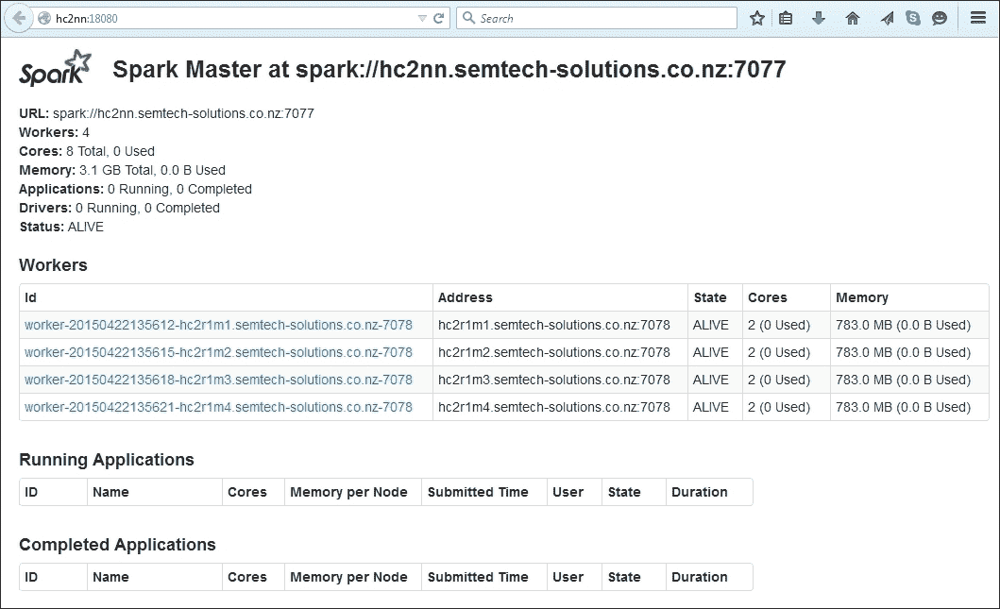
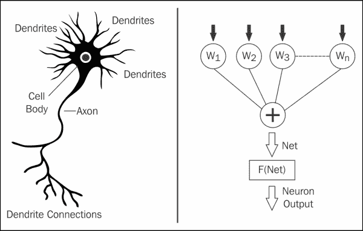
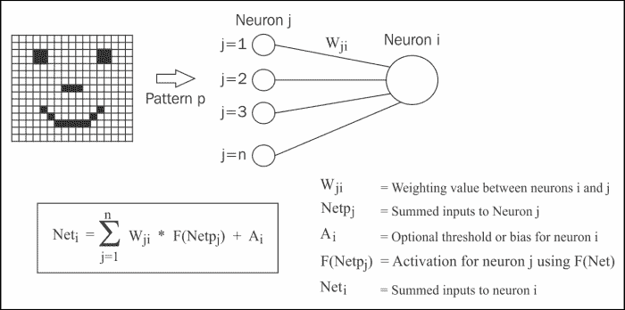
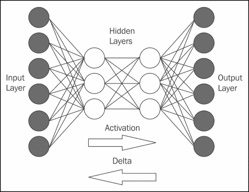
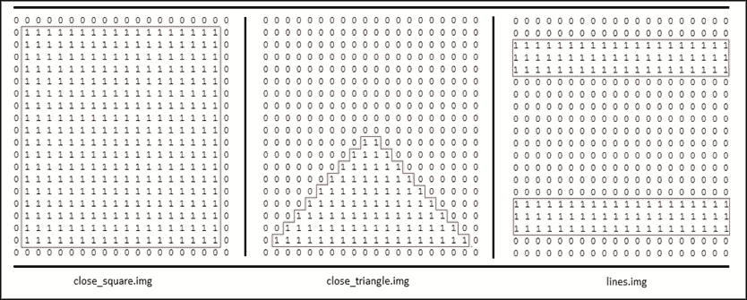
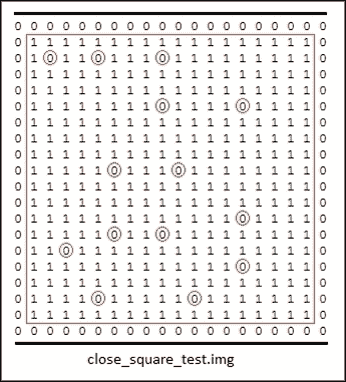
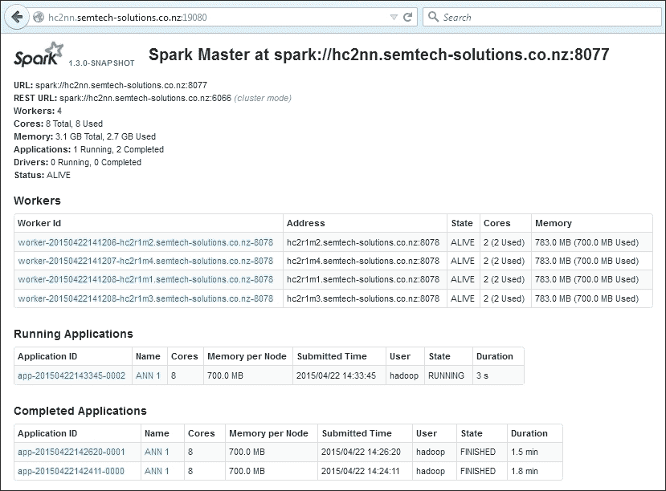
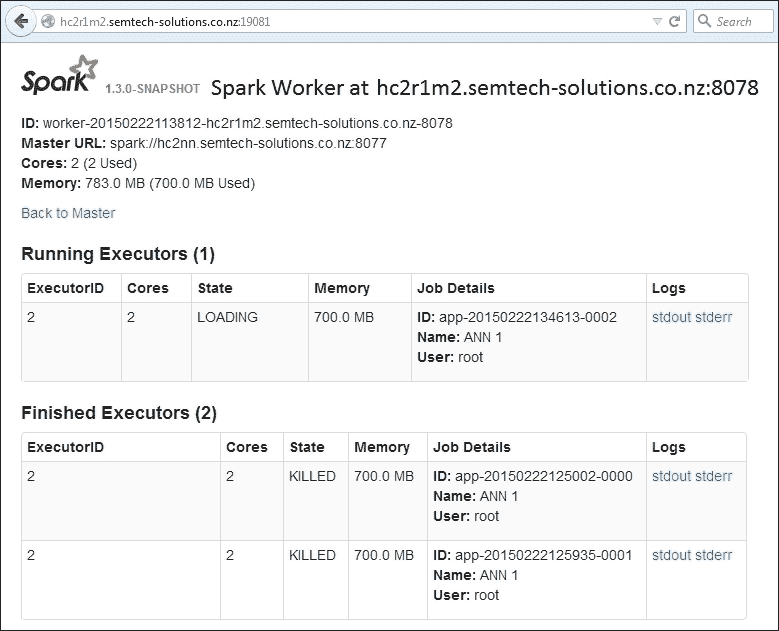

# 二、Apache Spark MLlib

MLlib 是 Apache Spark 提供的机器学习库，Apache Spark 是基于内存集群的开源数据处理系统。 在本章中，我将研究MLlib 库在回归、分类和神经处理等方面提供的功能。 在提供解决实际问题的工作示例之前，我将研究每个算法背后的理论。 Web 上的示例代码和文档可能稀疏且令人困惑。 我将采取循序渐进的方法来描述如何使用以下算法，以及它们能够做什么：

*   基于朴素贝叶斯的分类
*   基于 K-均值的聚类算法
*   人工神经网络在神经网络处理中的应用

决定学习 Apache Spark 之后，我假设您熟悉 Hadoop。 在我继续之前，我将简单解释一下我的环境。 我的 Hadoop 集群安装在一组 CentOS 6.5 Linux 64 位服务器上。 以下部分将详细描述该体系结构。

# 环境配置

在深入研究 Apache Spark 模块之前，我想解释一下我将在本书中使用的 Hadoop 和 Spark 集群的结构和版本。 我将使用 Cloudera CDH 5.1.3 版本的 Hadoop 进行存储，在本章中我将使用两个版本的 Spark：1.0 和 1.3。

较早的版本与 Cloudera 软件兼容，并且已经过他们的测试和打包。 它是使用 yum 命令从 Cloudera 存储库作为一组 Linux 服务安装的。 因为我想研究尚未发布的神经网络技术，所以我还将从 GitHub 下载并运行 Spark 1.3 的开发版本。 这一点将在本章后面部分进行说明。

## 架构

下面的图解释了我将在本章中使用的小型 Hadoop 集群的结构：


上图显示了一个五节点 Hadoop 群集，其中 NameNode 名为**hc2nn**，DataNodes**hc2r1m1**到**hc2r1m4**。 它还显示了一个具有一个主节点和四个从节点的 Apache Spark 集群。 Hadoop 集群提供物理 CentOS 6 Linux 机器，而 Spark 集群在相同的主机上运行。 例如，Spark 主服务器运行在 Hadoop name Node 机器**hc2nn**上，而 Spark**lave1**工作器运行在主机**hc2r1m1**上。

应该解释更高层使用的 Linux 服务器命名标准。 例如，Hadoop NameNode 服务器称为 hc2nn。 该服务器名称中的**h**表示 Hadoop，**c**表示集群，**nn**表示 NameNode。 因此，hc2nn 表示 Hadoop 群集 2 NameNode。 类似地，对于服务器 hc2r1m1，h 表示 Hadoop，**c**表示集群，**r**表示机架，**m**表示机器。 因此，该名称代表 Hadoop 集群 2 机架 1 机器 1。在大型 Hadoop 集群中，机器将被组织到机架中，因此该命名标准意味着服务器将很容易定位。

您可以按照您认为合适的方式安排 Spark 和 Hadoop 集群，它们不需要位于同一主机上。 出于撰写本书的目的，我可用的机器有限，因此将 Hadoop 和 Spark 集群放在一起是有意义的。 您可以为每个集群使用完全独立的机器，只要 Spark 能够访问 Hadoop(如果您想将其用于分布式存储)。

请记住，尽管 Spark 用于其内存中分布式处理的速度，但它不提供存储。 您可以使用主机文件系统来读写数据，但是如果您的数据卷大到足以描述为大数据，那么使用 Hadoop 这样的分布式存储系统是有意义的。

还要记住，Apache Spark 可能只是**ETL**(**Extract**，**Transform**，**Load**)链中的处理步骤。 它没有提供 Hadoop 生态系统包含的丰富工具集。 您可能仍然需要 Nutch/Gora/Solr 来获取数据；需要 Sqoop 和 Flume 来移动数据；需要 Oozie 来调度；需要 HBase 或 Have 来存储。 我要指出的是，尽管 Apache Spark 是一个非常强大的处理系统，但它应该被视为更广泛的 Hadoop 生态系统的一部分。

在描述了本章将使用的环境之后，我将继续描述 Apache Spark**MLlib**(**机器学习库**)的功能。

## 开发环境

本书中的示例将使用 Scala 语言进行编码。 这是因为作为一种脚本语言，它生成的代码比 Java 少。 它还可以用于 Spark shell，也可以用 Apache Spark 应用编译。 我将使用 SBT 工具编译 Scala 代码，我已经按如下方式安装了该代码：

```scala
[hadoop@hc2nn ~]# su -
[root@hc2nn ~]# cd /tmp
[root@hc2nn ~]#wget http://repo.scala-sbt.org/scalasbt/sbt-native-packages/org/scala-sbt/sbt/0.13.1/sbt.rpm
[root@hc2nn ~]# rpm -ivh sbt.rpm

```

为方便起见，在撰写本书时，我在 Hadoop NameNode 服务器`hc2nn`上使用了名为**Hadoop**的通用 Linux 帐户。 正如前面的命令显示的那样，我需要以 root 帐户的身份安装`sbt`，我已经通过`su`(切换用户)访问了该帐户。 然后，我使用`wget`将`sbt.rpm`文件从名为`repo.scala-sbt.org`的基于 Web 的服务器下载到`/tmp`目录。 最后，我使用`rpm`命令安装了`rpm`文件，其中`i`选项用于安装，`v`用于验证，`h`用于在安装包时打印散列标记。

### 提示

**下载示例代码**

您可以从您的帐户[http://www.packtpub.com](http://www.packtpub.com)为您购买的所有 Packt Publishing 图书下载示例代码文件。 如果您在其他地方购买了本书，您可以访问[http://www.packtpub.com/support](http://www.packtpub.com/support)并注册，以便将文件通过电子邮件直接发送给您。

在本章中，我已经使用 Linux Hadoop 帐户在 Linux 服务器`hc2nn`上开发了 Apache Spark 的所有 Scala 代码。 我已经将每组代码放在`/home/hadoop/spark`下的一个子目录中。 例如，下面的 SBT 结构图显示 MLlib 朴素贝叶斯代码存储在名为`nbayes`的子目录中，该目录位于`spark`目录下。 该图还显示，Scala 代码是在名为`src/main/scala`的子目录结构中开发的，位于`nbayes`目录下。 名为`bayes1.scala`和`convert.scala`的文件包含将在下一节中使用的朴素贝叶斯代码：


`bayes.sbt`文件是 SBT 工具使用的配置文件，它描述了如何编译`Scala`目录中的 Scala 文件(还要注意，如果您使用 Java 进行开发，您将使用形式为`nbayes/src/main/java`的路径)。 下面显示了`bayes.sbt`文件的内容。 `pwd`和`cat`Linux 命令会提醒您文件位置，还会提醒您转储文件内容。

Name、version 和`scalaVersion`选项设置项目的详细信息，以及要使用的 Scala 版本。 `libraryDependencies`选项定义 Hadoop 和 Spark 库的位置。 在本例中，CDH5 是使用 Cloudera 包安装的，包库可以位于标准位置，即 Hadoop 的`/usr/lib/hadoop`和 Spark 的`/usr/lib/spark`。 解析器的选项为其他依赖项指定 Cloudera 存储库的位置：

```scala
[hadoop@hc2nn nbayes]$ pwd
/home/hadoop/spark/nbayes
[hadoop@hc2nn nbayes]$ cat bayes.sbt

name := "Naive Bayes"

version := "1.0"

scalaVersion := "2.10.4"

libraryDependencies += "org.apache.hadoop" % "hadoop-client" % "2.3.0"

libraryDependencies += "org.apache.spark" %% "spark-core"  % "1.0.0"

libraryDependencies += "org.apache.spark" %% "spark-mllib" % "1.0.0"

// If using CDH, also add Cloudera repo
resolvers += "Cloudera Repository" at https://repository.cloudera.com/artifactory/cloudera-repos/

```

可以使用以下命令从`nbayes`子目录编译 Scala nbayes项目代码：

```scala
[hadoop@hc2nn nbayes]$ sbt compile

```

`sbt compile`命令用于将代码编译成类。 然后，这些类被放置在`nbayes/target/scala-2.10/classes`目录中。 可以使用以下命令将编译后的类打包到 JAR 文件中：

```scala
[hadoop@hc2nn nbayes]$ sbt package

```

`sbt package`命令将在目录`nbayes/target/scala-2.10`下创建一个 JAR 文件。 如*SBT 结构图*中的示例所示，名为`naive-bayes_2.10-1.0.jar`的 JAR 文件是在成功编译和打包后创建的。 然后可以在`spark-submit`命令中使用该 JAR 文件及其包含的类。 稍后将在探索 Apache Spark MLlib 模块中的功能时对此进行描述。

## 安装Spark

最后，在描述本书使用的环境时，我想谈谈安装和运行 Apache Spark 的方法。 我不会详细说明 Hadoop CDH5 的安装，只想说我是使用 Cloudera 包安装的。 但是，我使用 Linux`yum`命令从 Cloudera 存储库手动安装了 Apache Spark 1.0 版。 我安装了基于服务的包，因为我想要灵活性，使我能够根据需要从 Cloudera 安装多个版本的 Spark 作为服务。

在准备 CDH Hadoop 版本时，Cloudera 采用 Apache Spark 团队开发的代码和 Apache bigtop 项目发布的代码。 它们执行集成测试，以确保其作为代码堆栈工作。 它们还将代码和二进制文件重新组织为服务和包。 这意味着库、日志和二进制文件可以位于 Linux 下定义的位置，即`/var/log/spark`、`/usr/lib/spark`。 这还意味着，在服务的情况下，可以使用 linux`yum`命令安装组件，并通过 linux`service`命令进行管理。

不过，在本章后面介绍的神经网络代码的情况下，使用了不同的方法。 以下是安装 Apache Spark 1.0 以与 Hadoop CDH5 配合使用的方式：

```scala
[root@hc2nn ~]# cd /etc/yum.repos.d
[root@hc2nn yum.repos.d]# cat  cloudera-cdh5.repo

[cloudera-cdh5]
# Packages for Cloudera's Distribution for Hadoop, Version 5, on RedHat or CentOS 6 x86_64
name=Cloudera's Distribution for Hadoop, Version 5
baseurl=http://archive.cloudera.com/cdh5/redhat/6/x86_64/cdh/5/
gpgkey = http://archive.cloudera.com/cdh5/redhat/6/x86_64/cdh/RPM-GPG-KEY-cloudera
gpgcheck = 1

```

第一步是确保在服务器`hc2nn`和所有其他 Hadoop 集群服务器上的`/etc/yum.repos.d`目录下存在 Cloudera 存储库文件。 该文件名为`cloudera-cdh5.repo`，指定 yum 命令可以在何处找到 Hadoop CDH5 集群的软件。 在所有 Hadoop 集群节点上，我以 root 身份使用 Linux yum 命令安装 Apache Spark 组件 core、master、worker、History-server 和 python：

```scala
[root@hc2nn ~]# yum install spark-core spark-master spark-worker spark-history-server spark-python

```

这使我可以灵活地在将来以任何我想要的方式配置 Spark。 请注意，我已经在所有节点上安装了主组件，尽管我目前只计划从 Name Node 使用它。 现在，需要在所有节点上配置 Spark 安装。 配置文件存储在`/etc/spark/conf`下。 要做的第一件事是设置个`slaves`文件，该文件指定 Spark 将在哪些主机上运行其工作组件：

```scala
[root@hc2nn ~]# cd /etc/spark/conf

[root@hc2nn conf]# cat slaves
# A Spark Worker will be started on each of the machines listed below.
hc2r1m1
hc2r1m2
hc2r1m3
hc2r1m4

```

从 Spark 上面的`slaves`文件的内容中可以看到，它将在 Hadoop CDH5 集群(数据节点)上运行四个工作进程，从`hc2r1m1`到`hc2r1m4`。 接下来，它将更改`spark-env.sh`文件的内容以指定 Spark 环境选项。 将`SPARK_MASTER_IP`值定义为服务器全名：

```scala
export STANDALONE_SPARK_MASTER_HOST=hc2nn.semtech-solutions.co.nz
export SPARK_MASTER_IP=$STANDALONE_SPARK_MASTER_HOST

export SPARK_MASTER_WEBUI_PORT=18080
export SPARK_MASTER_PORT=7077
export SPARK_WORKER_PORT=7078
export SPARK_WORKER_WEBUI_PORT=18081

```

为主进程和辅助进程指定 Web 用户界面端口号，以及操作端口号。 然后，可以从 NameNode 服务器以 root 身份启动 Spark 服务。 我使用以下脚本：

```scala
echo "hc2r1m1 - start worker"
ssh   hc2r1m1 'service spark-worker start'

echo "hc2r1m2 - start worker"
ssh   hc2r1m2 'service spark-worker start'

echo "hc2r1m3 - start worker"
ssh   hc2r1m3 'service spark-worker start'

echo "hc2r1m4 - start worker"
ssh   hc2r1m4 'service spark-worker start'

echo "hc2nn - start master server"
service spark-master         start
service spark-history-server start

```

这将在所有从属服务器上启动 Spark Worker 服务，并在名称节点`hc2nn`上启动主服务器和历史服务器。 现在，可以使用`http://hc2nn:18080`URL 访问 Spark 用户界面。

下图显示了 Spark 1.0 主 Web 用户界面的示例。 它显示有关 Spark 安装、工作进程和正在运行或完成的应用的详细信息。 给出了主机和工人的状态。 在这种情况下，所有人都活着。 已使用的内存和可用性是按工作人员提供的总内存和可用性。 尽管目前没有正在运行的应用，但是可以选择每个 Worker 链接来查看每个 Worker 节点上运行的 Executor 进程，因为每个应用运行的工作量分布在 Spark 集群中。

另请注意，当运行 Spark 应用(如`spark-shell`和`spark-submit`)时，将使用 Spark URL`spark://hc2nn.semtech-solutions.co.nz:7077`。 使用此 URL，可以确保外壳或应用针对此 Spark 集群运行。



这将快速概述使用服务的 Apache Spark 安装、其配置、如何启动它，以及如何监视它。 现在，是解决 MLlib 功能区域的第一个问题的时候了，即使用朴素贝叶斯算法进行分类。 随着 Scala 脚本的开发和结果应用的监控，Spark 的使用将变得更加清晰。

# 朴素贝叶斯分类

本节将提供 Apache SparkMLlib 朴素贝叶斯算法的工作示例。 它将描述该算法背后的理论，并将在 Scala 中提供一个循序渐进的示例来说明如何使用该算法。

## 理论

为了使用朴素贝叶斯算法对数据集进行分类，数据必须是线性可分的，也就是说，数据中的个类必须是类边界线性可分的。 下图通过虚线显示的三个数据集和两个类边界直观地说明了这一点：


朴素贝叶斯假设数据集中的特征(或维度)彼此独立，也就是说，它们彼此不起作用。 在[http://hernan.amiune.com/](http://hernan.amiune.com/)的Hernan Amiune 的帮助下提供了一个朴素贝叶斯的例子。 以下示例将电子邮件分类为垃圾邮件。 如果您有 100 封电子邮件，请执行以下操作：

```scala
60% of emails are spam
 80% of spam emails contain the word buy
 20% of spam emails don't contain the word buy
40% of emails are not spam
 10% of non spam emails contain the word buy
 90% of non spam emails don't contain the word buy

```

因此，将此示例转换为概率，这样就可以创建朴素贝叶斯方程。

```scala
P(Spam) = the probability that an email is spam = 0.6
P(Not Spam) = the probability that an email is not spam = 0.4
P(Buy|Spam) = the probability that an email that is spam has the word buy = 0.8
P(Buy|Not Spam) = the probability that an email that is not spam has the word buy = 0.1

```

那么，包含单词 Buy 的电子邮件是垃圾邮件的概率是多少呢？ 嗯，这可以写成作为**P(Spam|Buy)**。 朴素贝叶斯说，它是由下图中的等式描述的：


因此，使用前面的百分比数字，我们得到以下结果：

```scala
P(Spam|Buy) = ( 0.8 * 0.6 ) / (( 0.8 * 0.6 )  + ( 0.1 * 0.4 )  )  = ( .48 ) / ( .48 + .04 )
= .48 / .52 = .923

```

这意味着包含单词 Buy 的电子邮件是垃圾邮件的可能性增加了 92%。 这是对理论的回顾；现在，是时候尝试使用 Apache Spark MLlib 朴素贝叶斯算法的实际示例了。

## 实践中的朴素贝叶斯

第一步是选择一些将用于分类的数据。 我从英国政府数据网站上选择了一些数据，网址是：[http://data.gov.uk/dataset/road-accidents-safety-data](http://data.gov.uk/dataset/road-accidents-safety-data)。

该数据集被称为“道路安全-数字呼吸测试数据 2013”，它下载一个名为`DigitalBreathTestData2013.txt`的压缩文本文件。 该文件包含大约 50 万行。 数据如下所示：

```scala
Reason,Month,Year,WeekType,TimeBand,BreathAlcohol,AgeBand,Gender
Suspicion of Alcohol,Jan,2013,Weekday,12am-4am,75,30-39,Male
Moving Traffic Violation,Jan,2013,Weekday,12am-4am,0,20-24,Male
Road Traffic Collision,Jan,2013,Weekend,12pm-4pm,0,20-24,Female

```

为了对数据进行分类，我修改了列布局和列数。 我已经简单地使用 Excel 给出了数据量。 然而，如果我的数据大小在大数据范围内，我将不得不使用 Scala，或者像 Apache Pig 这样的工具。 如以下命令所示，数据现在驻留在 HDFS 上的名为`/data/spark/nbayes`的目录中。 文件名称为`DigitalBreathTestData2013- MALE2.csv`。 此外，Linux`wc`命令的行数显示有 467,000 行。 最后，下面的数据示例显示我已经选择了要分类的列：Gender、Reason、WeekType、TimeBand、BreathAlcohol 和 AgeBand。 我将尝试使用其他栏目作为特征对性别栏目进行分类：

```scala
[hadoop@hc2nn ~]$ hdfs dfs -cat /data/spark/nbayes/DigitalBreathTestData2013-MALE2.csv | wc -l
467054

[hadoop@hc2nn ~]$ hdfs dfs -cat /data/spark/nbayes/DigitalBreathTestData2013-MALE2.csv | head -5
Male,Suspicion of Alcohol,Weekday,12am-4am,75,30-39
Male,Moving Traffic Violation,Weekday,12am-4am,0,20-24
Male,Suspicion of Alcohol,Weekend,4am-8am,12,40-49
Male,Suspicion of Alcohol,Weekday,12am-4am,0,50-59
Female,Road Traffic Collision,Weekend,12pm-4pm,0,20-24

```

Apache Spark MLlib 分类函数使用名为`LabeledPoint`的数据结构，它是在[http://spark.apache.org/docs/1.0.0/api/scala/index.html#org.apache.spark.mllib.regression.LabeledPoint](http://spark.apache.org/docs/1.0.0/api/scala/index.html#org.apache.spark.mllib.regression.LabeledPoint)中定义的通用数据表示。

此结构只接受双精度值，这意味着需要对前面数据中的文本值进行数字分类。 幸运的是，数据中的所有列都将转换为数字类别，我在本书附带的软件包中提供了两个程序，分别位于目录`chapter2\naive bayes`下。 第一个称为`convTestData.pl`，它是将前面的文本文件转换为 Linux 的 Perl 脚本。 这里将研究的第二个文件名为`convert.scala`。 它获取`DigitalBreathTestData2013- MALE2.csv`文件的内容，并将每条记录转换为双向量。

前面已经描述了基于 SBT Scala 的开发环境的目录结构和文件。 我使用 Linux 帐户 Hadoop 在 Linux 服务器`hc2nn`上开发我的 Scala 代码。 接下来，Linux`pwd`和`ls`命令显示了我的顶级`nbayes`开发目录和`bayes.sbt`配置文件，其内容已经过检查：

```scala
[hadoop@hc2nn nbayes]$ pwd
/home/hadoop/spark/nbayes
[hadoop@hc2nn nbayes]$ ls
bayes.sbt     target   project   src

```

运行朴素贝叶斯示例的 Scala 代码如下所示，位于`nbayes`目录下的`src/main/scala`子目录中：

```scala
[hadoop@hc2nn scala]$ pwd
/home/hadoop/spark/nbayes/src/main/scala
[hadoop@hc2nn scala]$ ls
bayes1.scala  convert.scala

```

我们稍后将检查`bayes1.scala`文件，但首先，必须将 HDFS 上的基于文本的数据转换为数字双精度值。 这是使用`convert.scala`文件的地方。 代码如下所示：

```scala
import org.apache.spark.SparkContext
import org.apache.spark.SparkContext._
import org.apache.spark.SparkConf

```

这些行导入 Spark 上下文、到 Apache Spark 集群的连接和 Spark 配置的类。 正在创建的对象称为`convert1`。 它是一个应用，因为它扩展了类`App`：

```scala
object convert1 extends App
{

```

下一行创建一个名为`enumerateCsvRecord`的函数。 它有一个名为`colData`的参数，这是一个字符串数组，并返回一个字符串：

```scala
def enumerateCsvRecord( colData:Array[String]): String =
{

```

然后，该函数枚举每列中的文本值，因此对于一个实例，`Male`变为`0`。 这些数值存储在类似`colVal1`的值中：

```scala
 val colVal1 =
 colData(0) match
 {
 case "Male"                          => 0
 case "Female"                        => 1
 case "Unknown"                       => 2
 case _                               => 99
 }

 val colVal2 =
 colData(1) match
 {
 case "Moving Traffic Violation"      => 0
 case "Other"                         => 1
 case "Road Traffic Collision"        => 2
 case "Suspicion of Alcohol"          => 3
 case _                               => 99
 }

 val colVal3 =
 colData(2) match
 {
 case "Weekday"                       => 0
 case "Weekend"                       => 0
 case _                               => 99
 }

 val colVal4 =
 colData(3) match
 {
 case "12am-4am"                      => 0
 case "4am-8am"                       => 1
 case "8am-12pm"                      => 2
 case "12pm-4pm"                      => 3
 case "4pm-8pm"                       => 4
 case "8pm-12pm"                      => 5
 case _                               => 99
 }

 val colVal5 = colData(4)

 val colVal6 =
 colData(5) match
 {
 case "16-19"                         => 0
 case "20-24"                         => 1
 case "25-29"                         => 2
 case "30-39"                         => 3
 case "40-49"                         => 4
 case "50-59"                         => 5
 case "60-69"                         => 6
 case "70-98"                         => 7
 case "Other"                         => 8
 case _                               => 99
 }

```

从数字列值创建名为`lineString`的逗号分隔字符串，然后返回该字符串。 该函数以最后一个大括号字符`}`结束。 请注意，接下来创建的数据行从第一列的标签值开始，后跟表示数据的向量。 向量是空格分隔的，而标签与向量之间用逗号分隔。 通过使用这两种分隔符类型，我可以在后面的两个简单步骤中同时处理标签和向量：

```scala
 val lineString = colVal1+","+colVal2+" "+colVal3+" "+colVal4+" "+colVal5+" "+colVal6

 return lineString
}

```

主脚本定义 HDFS 服务器名称和路径。 它根据这些值定义输入文件和输出路径。 它使用 Spark URL 和应用名称创建新配置。 然后，它使用以下详细信息创建到 Spark 的新上下文或连接：

```scala
val hdfsServer = "hdfs://hc2nn.semtech-solutions.co.nz:8020"
val hdfsPath   = "/data/spark/nbayes/"
val inDataFile  = hdfsServer + hdfsPath + "DigitalBreathTestData2013-MALE2.csv"
val outDataFile = hdfsServer + hdfsPath + "result"

val sparkMaster = "spark://hc2nn.semtech-solutions.co.nz:7077"
val appName = "Convert 1"
val sparkConf = new SparkConf()

sparkConf.setMaster(sparkMaster)
sparkConf.setAppName(appName)

val sparkCxt = new SparkContext(sparkConf)

```

基于 CSV 的原始数据文件是使用 Spark Context`textFile`方法从 HDFS 加载的。 然后，打印数据行计数：

```scala
val csvData = sparkCxt.textFile(inDataFile)
println("Records in  : "+ csvData.count() )

```

CSV 原始数据逐行传递到`enumerateCsvRecord`函数。 返回的基于字符串的数字数据存储在`enumRddData`变量中：

```scala
 val enumRddData = csvData.map
 {
 csvLine =>
 val colData = csvLine.split(',')

 enumerateCsvRecord(colData)

 }

```

最后，打印`enumRddData`变量中的记录数，并将枚举数据保存到 HDFS：

```scala
 println("Records out : "+ enumRddData.count() )

 enumRddData.saveAsTextFile(outDataFile)

} // end object

```

为了将此脚本作为针对 Spark 的应用运行，必须对其进行编译。 这是通过`sbt`Package 命令执行的，该命令也会编译代码。 以下命令是从`nbayes`目录运行的：

```scala
[hadoop@hc2nn nbayes]$ sbt package
Loading /usr/share/sbt/bin/sbt-launch-lib.bash
....
[info] Done packaging.
[success] Total time: 37 s, completed Feb 19, 2015 1:23:55 PM

```

这会导致创建的编译类被打包到 JAR 库中，如下所示：

```scala
[hadoop@hc2nn nbayes]$ pwd
/home/hadoop/spark/nbayes
[hadoop@hc2nn nbayes]$ ls -l target/scala-2.10
total 24
drwxrwxr-x 2 hadoop hadoop  4096 Feb 19 13:23 classes
-rw-rw-r-- 1 hadoop hadoop 17609 Feb 19 13:23 naive-bayes_2.10-1.0.jar

```

现在可以使用应用名称、Spark URL 和创建的 JAR 文件的完整路径针对 Spark 运行应用`convert1`。 一些额外的参数指定了应该使用的内存和最大核心数：

```scala
spark-submit \
 --class convert1 \
 --master spark://hc2nn.semtech-solutions.co.nz:7077  \
 --executor-memory 700M \
 --total-executor-cores 100 \
 /home/hadoop/spark/nbayes/target/scala-2.10/naive-bayes_2.10-1.0.jar

```

这将在 HDFS 上创建一个名为`/data/spark/nbayes/`的数据目录，后跟包含零件文件的结果，其中包含已处理的数据：

```scala
[hadoop@hc2nn nbayes]$  hdfs dfs -ls /data/spark/nbayes
Found 2 items
-rw-r--r--   3 hadoop supergroup   24645166 2015-01-29 21:27 /data/spark/nbayes/DigitalBreathTestData2013-MALE2.csv
drwxr-xr-x   - hadoop supergroup          0 2015-02-19 13:36 /data/spark/nbayes/result

[hadoop@hc2nn nbayes]$ hdfs dfs -ls /data/spark/nbayes/result
Found 3 items
-rw-r--r--   3 hadoop supergroup          0 2015-02-19 13:36 /data/spark/nbayes/result/_SUCCESS
-rw-r--r--   3 hadoop supergroup    2828727 2015-02-19 13:36 /data/spark/nbayes/result/part-00000
-rw-r--r--   3 hadoop supergroup    2865499 2015-02-19 13:36 /data/spark/nbayes/result/part-00001

```

在下面的 HDFS`cat`命令中，我将部品文件数据连接到一个名为`DigitalBreathTestData2013-MALE2a.csv`的文件中。 然后，我使用`head`命令检查了文件的前五行，显示它是数字。 最后，我使用`put`命令将其加载到 HDFS 中：

```scala
[hadoop@hc2nn nbayes]$ hdfs dfs -cat /data/spark/nbayes/result/part* > ./DigitalBreathTestData2013-MALE2a.csv

[hadoop@hc2nn nbayes]$ head -5 DigitalBreathTestData2013-MALE2a.csv
0,3 0 0 75 3
0,0 0 0 0 1
0,3 0 1 12 4
0,3 0 0 0 5
1,2 0 3 0 1

[hadoop@hc2nn nbayes]$ hdfs dfs -put ./DigitalBreathTestData2013-MALE2a.csv /data/spark/nbayes

```

以下 hdfs`ls`命令现在显示存储在 HDFS 上的`nbayes`目录中的数字数据文件：

```scala
[hadoop@hc2nn nbayes]$ hdfs dfs -ls /data/spark/nbayes
Found 3 items
-rw-r--r--   3 hadoop supergroup   24645166 2015-01-29 21:27 /data/spark/nbayes/DigitalBreathTestData2013-MALE2.csv
-rw-r--r--   3 hadoop supergroup    5694226 2015-02-19 13:39 /data/spark/nbayes/DigitalBreathTestData2013-MALE2a.csv
drwxr-xr-x   - hadoop supergroup          0 2015-02-19 13:36 /data/spark/nbayes/result

```

现在数据已经转换为数字形式，可以使用 MLlib 朴素贝叶斯算法进行处理；这就是 Scala 文件`bayes1.scala`所做的事情。 此文件导入与前面相同的配置和上下文类。 它还为朴素贝叶斯、向量和 LabeledPoint 结构导入 MLlib 类。 这次创建的应用类称为`bayes1`：

```scala
import org.apache.spark.SparkContext
import org.apache.spark.SparkContext._
import org.apache.spark.SparkConf
import org.apache.spark.mllib.classification.NaiveBayes
import org.apache.spark.mllib.linalg.Vectors
import org.apache.spark.mllib.regression.LabeledPoint

object bayes1 extends App
{

```

再次定义 HDFS 数据文件，并像前面一样创建 Spark 上下文：

```scala
 val hdfsServer = "hdfs://hc2nn.semtech-solutions.co.nz:8020"
 val hdfsPath   = "/data/spark/nbayes/"

 val dataFile = hdfsServer+hdfsPath+"DigitalBreathTestData2013-MALE2a.csv"

 val sparkMaster = "spark://hc2nn.semtech-solutions.co.nz:7077"
 val appName = "Naive Bayes 1"
 val conf = new SparkConf()
 conf.setMaster(sparkMaster)
 conf.setAppName(appName)

 val sparkCxt = new SparkContext(conf)

```

原始 CSV 数据通过分隔符加载和拆分。 第一列成为将对数据进行分类的标签(`Male/Female`)。 由空格分隔的最后一列成为分类功能：

```scala
 val csvData = sparkCxt.textFile(dataFile)

 val ArrayData = csvData.map
 {
 csvLine =>
 val colData = csvLine.split(',')
 LabeledPoint(colData(0).toDouble, Vectors.dense(colData(1).split(' ').map(_.toDouble)))
 }

```

然后将数据随机分为训练(70%)和测试(30%)数据集：

```scala
 val divData = ArrayData.randomSplit(Array(0.7, 0.3), seed = 13L)

 val trainDataSet = divData(0)
 val testDataSet  = divData(1)

```

现在可以使用先前的训练集来训练朴素贝叶斯 MLlib 函数。 训练好的朴素贝叶斯模型保存在变量`nbTrained`中，然后可以用来根据测试数据预测`Male/Female`结果标签：

```scala
 val nbTrained = NaiveBayes.train(trainDataSet)
 val nbPredict = nbTrained.predict(testDataSet.map(_.features))

```

假设所有数据都已包含标签，则可以比较测试数据的原始标签和预测标签。 然后，通过将原始标签与预测值进行比较，可以计算精确度系数以确定预测的精确度：

```scala
 val predictionAndLabel = nbPredict.zip(testDataSet.map(_.label))
 val accuracy = 100.0 * predictionAndLabel.filter(x => x._1 == x._2).count() / testDataSet.count()
 println( "Accuracy : " + accuracy );
}

```

这就解释了 Scala 朴素贝叶斯代码示例。 现在是使用`spark-submit`运行编译的`bayes1`应用并确定分类准确性的时候了。 这些参数是相同的。 只是更改了类名：

```scala
spark-submit \
 --class bayes1 \
 --master spark://hc2nn.semtech-solutions.co.nz:7077  \
 --executor-memory 700M \
 --total-executor-cores 100 \
 /home/hadoop/spark/nbayes/target/scala-2.10/naive-bayes_2.10-1.0.jar

```

Spark 集群给出的结果准确率只有`43`%，这似乎意味着这个数据不适合朴素贝叶斯：

```scala
Accuracy: 43.30

```

在下一个示例中，我将使用 K-Means 来尝试确定数据中存在哪些群集。 记住，朴素贝叶斯需要数据类沿着类边界线性可分。 使用 K-Means，可以同时确定数据中群集的成员资格和质心位置。

# K-均值聚类

此示例将使用与上一个示例相同的测试数据，但将尝试使用 MLlib K-Means 算法在数据中查找群集。

## 理论

K-Means 算法通过最小化群集中心向量的平均值和新的候选群集成员向量之间的距离来迭代地尝试确定测试数据内的群集。 下面的等式假设数据集成员的范围从**X1**到**Xn**；它还假设**K**簇集的范围从**S1**到**Sk**，其中**K<=n**。


## 实践中的 K-均值

同样，K-Means MLlib 功能使用 LabeledPoint 结构来处理其数据，因此，它需要个数字输入数据。 由于上一节中的相同数据正在被重用，我将不再重新解释数据转换。 在本节中，在数据方面所做的唯一更改是，HDFS 下的处理现在将在`/data/spark/kmeans/`目录**下进行。** 此外，K-Means 示例的转换 Scala 脚本会生成一个全部用逗号分隔的记录。

K-Means 示例的开发和处理在`/home/hadoop/spark/kmeans`目录下进行，以将工作与其他开发分开。 SBT 配置文件现在称为`kmeans.sbt`，除了项目名称之外，它与上一个示例完全相同：

```scala
name := "K-Means"

```

此部分的代码可在`chapter2\K-Means`下的软件包中找到。 因此，查看存储在`kmeans/src/main/scala`下的`kmeans1.scala`的代码，会发生一些类似的操作。 导入语句引用 Spark 上下文和配置。 然而，这一次，K-Means 功能也是从 MLlib 导入的。 此外，本例的应用类名称已更改为`kmeans1`：

```scala
import org.apache.spark.SparkContext
import org.apache.spark.SparkContext._
import org.apache.spark.SparkConf

import org.apache.spark.mllib.linalg.Vectors
import org.apache.spark.mllib.clustering.{KMeans,KMeansModel}

object kmeans1 extends App
{

```

定义数据文件的最后一个示例采用与相同的操作-定义 Spark 配置并创建 Spark Context：

```scala
 val hdfsServer = "hdfs://hc2nn.semtech-solutions.co.nz:8020"
 val hdfsPath   = "/data/spark/kmeans/"

 val dataFile   = hdfsServer + hdfsPath + "DigitalBreathTestData2013-MALE2a.csv"

 val sparkMaster = "spark://hc2nn.semtech-solutions.co.nz:7077"
 val appName = "K-Means 1"
 val conf = new SparkConf()

 conf.setMaster(sparkMaster)
 conf.setAppName(appName)

 val sparkCxt = new SparkContext(conf)

```

接下来，从数据文件加载 CSV 数据，并用逗号将其分割为变量`VectorData`：

```scala
 val csvData = sparkCxt.textFile(dataFile)
 val VectorData = csvData.map
 {
 csvLine =>
 Vectors.dense( csvLine.split(',').map(_.toDouble))
 }

```

初始化 K-Means 对象，并设置参数以定义簇数和确定它们的最大迭代次数：

```scala
 val kMeans = new KMeans
 val numClusters         = 3
 val maxIterations       = 50

```

一些默认值是为初始化模式、运行次数和 Epsilon 定义的，这是 K-Means 调用所需的，但在处理过程中没有变化。 最后，针对 K-Means 对象设置以下参数：

```scala
 val initializationMode  = KMeans.K_MEANS_PARALLEL
 val numRuns             = 1
 val numEpsilon          = 1e-4

 kMeans.setK( numClusters )
 kMeans.setMaxIterations( maxIterations )
 kMeans.setInitializationMode( initializationMode )
 kMeans.setRuns( numRuns )
 kMeans.setEpsilon( numEpsilon )

```

我缓存了训练矢量数据以提高性能，并使用矢量数据训练 K-Means 对象以创建训练的 K-Means 模型：

```scala
 VectorData.cache
 val kMeansModel = kMeans.run( VectorData )

```

我已经计算了 K-Means成本、输入数据行数，并通过打印行语句输出结果。 成本值表示群集的排列紧密程度，以及群集的分隔程度：

```scala
 val kMeansCost = kMeansModel.computeCost( VectorData )

 println( "Input data rows : " + VectorData.count() )
 println( "K-Means Cost    : " + kMeansCost )

```

接下来，我使用 K-Means 模型将群集中心打印为计算出的三个群集中的每个群集的向量：

```scala
 kMeansModel.clusterCenters.foreach{ println }

```

最后，我使用 K-Means Model`predict`函数创建了一个集群成员预测列表。 然后，我按值对这些预测进行计数，以给出每个集群中数据点的计数。 这将显示哪些群集较大，以及是否确实存在三个群集：

```scala
 val clusterRddInt = kMeansModel.predict( VectorData )

 val clusterCount = clusterRddInt.countByValue

 clusterCount.toList.foreach{ println }

} // end object kmeans1

```

因此，为了运行该应用，必须从`kmeans`子目录编译和打包，如linux`pwd`命令所示：

```scala
[hadoop@hc2nn kmeans]$ pwd
/home/hadoop/spark/kmeans
[hadoop@hc2nn kmeans]$ sbt package

Loading /usr/share/sbt/bin/sbt-launch-lib.bash
[info] Set current project to K-Means (in build file:/home/hadoop/spark/kmeans/)
[info] Compiling 2 Scala sources to /home/hadoop/spark/kmeans/target/scala-2.10/classes...
[info] Packaging /home/hadoop/spark/kmeans/target/scala-2.10/k-means_2.10-1.0.jar ...
[info] Done packaging.
[success] Total time: 20 s, completed Feb 19, 2015 5:02:07 PM

```

打包成功后，我检查 HDFS 以确保测试数据准备就绪。 与上一个示例一样，我使用软件包中提供的`convert.scala`文件将数据转换为数字形式。 我将处理 HDFS 目录/`data/spark/kmeans`中的数据文件`DigitalBreathTestData2013-MALE2a.csv`，如下所示：

```scala
[hadoop@hc2nn nbayes]$ hdfs dfs -ls /data/spark/kmeans
Found 3 items
-rw-r--r--   3 hadoop supergroup   24645166 2015-02-05 21:11 /data/spark/kmeans/DigitalBreathTestData2013-MALE2.csv
-rw-r--r--   3 hadoop supergroup    5694226 2015-02-05 21:48 /data/spark/kmeans/DigitalBreathTestData2013-MALE2a.csv
drwxr-xr-x   - hadoop supergroup          0 2015-02-05 21:46 /data/spark/kmeans/result

```

`spark-submit`工具用于运行 K-Means 应用。 如下所示，此命令中唯一的更改是类现在为`kmeans1`：

```scala
spark-submit \
 --class kmeans1 \
 --master spark://hc2nn.semtech-solutions.co.nz:7077  \
 --executor-memory 700M \
 --total-executor-cores 100 \
 /home/hadoop/spark/kmeans/target/scala-2.10/k-means_2.10-1.0.jar

```

Spark 群集运行的输出如下所示：

```scala
Input data rows : 467054
K-Means Cost    : 5.40312223450789E7

```

前面的输出显示了输入数据量，看起来是正确的，另外它还显示了 K-Means 成本值。 接下来是三个向量，它们用正确的维度描述数据集群中心。 请记住，这些簇质心向量将具有与原始向量数据相同的列数：

```scala
[0.24698249738061878,1.3015883142472253,0.005830116872250263,2.9173747788555207,1.156645130895448,3.4400290524342454]

[0.3321793984152627,1.784137241326256,0.007615970459266097,2.5831987075928917,119.58366028156011,3.8379106085083468]

[0.25247226760684494,1.702510963969387,0.006384899819416975,2.231404248000688,52.202897927594805,3.551509158139135]

```

最后，给出集群 1 到 3 的集群成员资格，其中集群 1(索引 0)在`407,539`成员向量处具有最大的成员资格。

```scala
(0,407539)
(1,12999)
(2,46516)

```

因此，这两个例子显示了如何使用朴素贝叶斯和 K-均值对数据进行分类和聚类。 但是，如果我想对图像或更复杂的模式进行分类，并使用黑盒方法进行分类，该怎么办呢？ 下一节使用**ANN 的**或**人工神经网络的**检验基于 Spark 的分类。 为了做到这一点，我需要下载最新的 Spark 代码，并为 Spark 1.3 构建一个服务器，因为它还没有正式发布(在撰写本文时)。

# 人工神经网络

为了研究 Apache Spark 中的**ANN**(人工神经网络)功能，我需要从 GitHub 网站获得最新的源代码。 ANN 功能是由 Bert Greevenbosch([http://www.bertgreevenbosch.nl/](http://www.bertgreevenbosch.nl/))开发的，并将在 Apache Spark1.3 中发布。 在撰写本文时，当前的 Spark 发行版是 1.2.1，CDH 5.x 附带了 Spark 1.0。 因此，为了检查这个未发布的 ANN 功能，需要获取源代码并将其构建到 Spark 服务器中。 这就是我在简单解释一下 Ann 背后的理论之后要做的事情。

## 理论

下图在左边显示了一个简单的生物神经元。 神经元有树突，可以接收其他神经元发出的信号。 细胞体控制激活，轴突将电脉冲传送到其他神经元的树突。 右侧的人工神经元有一系列加权输入：对输入进行分组的求和函数，以及确定输入是否达到阈值的触发机制(**F(Net)**)，如果达到阈值，神经元将触发：



神经网络可以容忍噪声图像和失真，因此当需要对潜在退化图像使用黑盒分类方法时，神经网络非常有用。 下一个要考虑的领域是神经元输入的求和函数。 下图显示了神经元**i**的名为**Net**的求和函数。 具有加权值的神经元之间的连接包含存储的网络知识。 通常，网络将有输入层、输出层和多个隐藏层。 如果神经元的输入之和超过阈值，它就会被激发。



在前面的等式中，图和键显示来自模式**P**的输入值被传递到网络输入层中的神经元。 这些值成为输入层神经元激活值；它们是特例。 神经元**i**的输入是神经元连接**i-j**的加权值乘以来自神经元**j**的激活的和。 在神经元**j**(如果它不是输入层神经元)处的激活由下面将描述的挤压函数**F(Net)**给出。

模拟神经元需要一个触发机制，该机制决定神经元的输入是否达到阈值。 然后，它启动以创建该神经元的激活值。 此激发或挤压函数可由下图所示的广义 Sigmoid 函数描述：


此函数有两个常量：**A**和**B**；**B**影响激活曲线的形状，如上图所示。 该值越大，函数就越类似于开/关步骤。 **A**的值设置返回激活的最小值。 在上图中，它是零。

因此，这提供了一种机制来模拟神经元，创建加权矩阵作为神经元连接，并管理神经元的激活。 但这些网络是如何组织起来的呢？ 下图显示了建议的神经元体系结构-神经网络具有神经元的输入层、输出层和一个或多个隐藏层。 每层中的所有神经元都与相邻层中的每个神经元相连。



在训练期间，激活从输入层通过网络传递到输出层。 然后，预期或实际输出之间的误差或差异导致误差增量通过网络传回，从而改变加权矩阵值。 一旦达到个期望的输出层向量，则将知识存储在加权矩阵中，并且网络可以进一步训练或用于分类。

因此，神经网络背后的理论已经从反向传播的角度进行了描述。 现在是获取 Apache Spark 代码的开发版本并构建 Spark 服务器的时候了，这样就可以运行 Ann Scala 代码了。

## 搭建 Spark 服务器

我通常不会建议在 Spark 发布或 Cloudera 打包(用于 CDH)之前下载和使用 Apache Spark 代码，但是我希望检查 Ann功能，以及本书允许的时间范围，这意味着我需要这样做。 我从以下路径提取了完整的 Spark 代码树：

```scala
https://github.com/apache/spark/pull/1290.

```

我将此代码存储在 Linux 服务器`hc2nn`上的目录`/home/hadoop/spark/spark`下。 然后，我从 Bert Greevenbosch 的 GitHub 开发区获得了 ANN 代码：

```scala
https://github.com/bgreeven/spark/blob/master/mllib/src/main/scala/org/apache/spark/mllib/ann/ArtificialNeuralNetwork.scala
https://github.com/bgreeven/spark/blob/master/mllib/src/main/scala/org/apache/spark/mllib/classification/ANNClassifier.scala

```

`ANNClassifier.scala`文件包含要调用的公共函数。 `ArtificialNeuralNetwork.scala`文件包含`ANNClassifier.scala`调用的私有 MLlib ANN 函数。 我的服务器上已经安装了 Java open JDK，因此下一步是在`/home/hadoop/spark/spark/conf`下设置`spark-env.sh`环境配置文件。 我的文件是这样的：

```scala
export STANDALONE_SPARK_MASTER_HOST=hc2nn.semtech-solutions.co.nz
export SPARK_MASTER_IP=$STANDALONE_SPARK_MASTER_HOST
export SPARK_HOME=/home/hadoop/spark/spark
export SPARK_LAUNCH_WITH_SCALA=0
export SPARK_MASTER_WEBUI_PORT=19080
export SPARK_MASTER_PORT=8077
export SPARK_WORKER_PORT=8078
export SPARK_WORKER_WEBUI_PORT=19081
export SPARK_WORKER_DIR=/var/run/spark/work
export SPARK_LOG_DIR=/var/log/spark
export SPARK_HISTORY_SERVER_LOG_DIR=/var/log/spark
export SPARK_PID_DIR=/var/run/spark/
export HADOOP_CONF_DIR=/etc/hadoop/conf
export SPARK_JAR_PATH=${SPARK_HOME}/assembly/target/scala-2.10/
export SPARK_JAR=${SPARK_JAR_PATH}/spark-assembly-1.3.0-SNAPSHOT-hadoop2.3.0-cdh5.1.2.jar
export JAVA_HOME=/usr/lib/jvm/java-1.7.0
export SPARK_LOCAL_IP=192.168.1.103

```

变量`SPARK_MASTER_IP`告诉集群哪个服务器是主服务器。 端口变量定义主端口值、工作端口值和工作端口值。 这里定义了一些日志和 JAR 文件路径，以及`JAVA_HOME`和本地服务器 IP 地址。 有关使用 Apache Maven 构建 Spark 的详细信息，请访问：

```scala
http://spark.apache.org/docs/latest/building-spark.html

```

同一目录中的从属文件将像以前一样使用从`hc2r1m1`到`hc2r1m4`的四个工作服务器的名称进行设置。

为了使用 Apache Maven 进行构建，我必须在我的 Linux 服务器`hc2nn`上安装`mvn`，我将在其中运行 Spark 构建。 我是以 root 用户的身份执行此操作的，首先使用`wget`获取 Maven 存储库文件：

```scala
wget http://repos.fedorapeople.org/repos/dchen/apache-maven/epel-apache-maven.repo -O /etc/yum.repos.d/epel-apache-maven.repo

```

然后，检查新的存储库文件是否具有`ls`长清单。

```scala
[root@hc2nn ~]# ls -l /etc/yum.repos.d/epel-apache-maven.repo
-rw-r--r-- 1 root root 445 Mar  4  2014 /etc/yum.repos.d/epel-apache-maven.repo

```

然后可以使用 Linux`yum`命令安装 Maven，下面的示例显示了 install 命令，并通过`ls`检查`mvn`命令是否存在。

```scala
[root@hc2nn ~]# yum install apache-maven
[root@hc2nn ~]# ls -l /usr/share/apache-maven/bin/mvn
-rwxr-xr-x 1 root root 6185 Dec 15 06:30 /usr/share/apache-maven/bin/mvn

```

这里显示了我用来构建 Spark 源树的命令以及成功的输出。 首先，设置环境，然后使用`mvn`命令启动构建。 为 Hadoop2.3/yer 添加了构建选项，并且跳过了测试。 构建每次都使用`clean`和`package`选项删除旧的构建文件，然后创建 JAR 文件。 最后，通过`tee`命令将构建输出复制到名为`build.log`的文件中：

```scala
cd /home/hadoop/spark/spark/conf ; . ./spark-env.sh ; cd ..

mvn  -Pyarn -Phadoop-2.3  -Dhadoop.version=2.3.0-cdh5.1.2 -DskipTests clean package | tee build.log 2>&1

[INFO] ----------------------------------------------------------
[INFO] BUILD SUCCESS
[INFO] ----------------------------------------------------------
[INFO] Total time: 44:20 min
[INFO] Finished at: 2015-02-16T12:20:28+13:00
[INFO] Final Memory: 76M/925M
[INFO] ----------------------------------------------------------

```

您使用的实际构建命令将取决于您是否拥有 Hadoop 以及 Hadoop 的版本。 查看前面的*建筑 Spark*以了解详细信息，在我的服务器上构建大约需要 40 分钟。

鉴于此内部版本将被打包并复制到 Spark 集群中的其他服务器，因此所有服务器使用相同版本的 Java 非常重要，否则将出现如下错误：

```scala
15/02/15 12:41:41 ERROR executor.Executor: Exception in task 0.1 in stage 0.0 (TID 2)
java.lang.VerifyError: class org.apache.hadoop.hdfs.protocol.proto.ClientNamenodeProtocolProtos$GetBlockLocationsRequestProto overrides final method getUnknownFields.()Lcom/google/protobuf/UnknownFieldSet;
 at java.lang.ClassLoader.defineClass1(Native Method)

```

既然已经构建了源树，现在需要将其捆绑并发布到 Spark 集群中的每个服务器。 假设这些服务器也是 CDH 集群的成员，并且设置了无密码的 SSH 访问，我可以使用`scp`命令发布构建的软件。 以下命令显示`/home/hadoop/spark`路径下的 Spark 目录被打包到一个名为`spark_bld.tar`的 tar 文件中。 然后使用 Linux`scp`命令将 tar 文件复制到每个从服务器；下面的示例显示了`hc2r1m1`：

```scala
[hadoop@hc2nn spark]$ cd /home/hadoop/spark
[hadoop@hc2nn spark]$ tar cvf spark_bld.tar spark
[hadoop@hc2nn spark]$ scp ./spark_bld.tar hadoop@hc2r1m1:/home/hadoop/spark/spark_bld.tar

```

既然柏油 Spark 构建位于从节点上，则需要将其解包。 以下命令显示了服务器`hc2r1m1`的进程。 TAR 文件被解压缩到与构建服务器`hc2nn`相同的目录，即`/home/hadoop/spark`：

```scala
[hadoop@hc2r1m1 ~]$ mkdir spark ; mv spark_bld.tar spark
[hadoop@hc2r1m1 ~]$ cd spark ; ls
spark_bld.tar
[hadoop@hc2r1m1 spark]$ tar xvf spark_bld.tar

```

一旦构建成功运行，并将构建的代码发布到从服务器，就可以从主服务器**hc2nn**启动 Spark 的构建版本。 请注意，我从安装在这些服务器上的 Spark Version 1.0 中选择了不同的端口号。 还要注意，我将以 root 身份启动 Spark，因为 Spark 1.0 安装是作为 root 帐户下的 Linux 服务进行管理的。 由于两个安装将共享日志和`.pid`文件位置等设施，因此 root 用户将确保访问权限。 这是我用来启动 Apache Spark 1.3 的脚本：

```scala
cd /home/hadoop/spark/spark/conf ;  . ./spark-env.sh ; cd ../sbin
echo "hc2nn - start master server"
./start-master.sh
echo "sleep 5000 ms"
sleep 5
echo "hc2nn - start history server"
./start-history-server.sh
echo "Start Spark slaves workers"
./start-slaves.sh

```

它执行`spark-env.sh`文件来设置环境，然后使用 Spark`sbin`目录中的脚本来启动服务。 它首先在`hc2nn`上启动主服务器和历史服务器，然后启动从服务器。 我在启动从属程序之前添加了延迟，因为我发现它们正试图在主程序准备就绪之前连接到主程序。 现在可以通过以下 URL 访问 Spark 1.3 Web 用户界面：

```scala
http://hc2nn.semtech-solutions.co.nz:19080/

```

允许应用连接到 Spark 的 Spark URL 如下：

```scala
Spark Master at spark://hc2nn.semtech-solutions.co.nz:8077

```

正如 Spark 环境配置文件中的端口号所定义的那样，Spark 现在可以与 ANN 功能一起使用。 下一节将介绍 Ann Scala 脚本和数据，以说明如何使用这种基于 Spark 的功能。

## 实践中的人工神经网络

为了开始ANN 训练，需要测试数据。 鉴于这种分类方法被认为擅长对失真或噪声图像进行分类，我决定尝试在此对图像进行分类：



它们是手工创建的文本文件，其中包含由字符 1 和 0 创建的定形块。 当它们存储在 HDFS 上时，回车符被删除，因此图像显示为单行矢量。 因此，人工神经网络将对一系列形状图像进行分类，然后将其与添加了噪声的相同图像进行测试，以确定分类是否仍然有效。 有 6 个训练图像，每个图像都将被赋予从 0.1 到 0.6 的任意训练标签。 因此，如果 ANN 显示一个闭合正方形，它应该返回标签 0.1。 下图显示了添加了噪波的测试图像示例。 通过在图像中添加额外的零(0)个字符产生的噪波已突出显示：



由于 Apache Spark 服务器与前面的示例不同，Spark 库位置也已更改，因此用于编译示例 Ann Scala 代码的`sbt`配置文件也必须更改。 与前面一样，ANN 代码是使用名为`spark/ann`的子目录中的 Linux Hadoop 帐户开发的。 `ann.sbt`文件存在于`ann`目录中：

```scala
 [hadoop@hc2nn ann]$ pwd
/home/hadoop/spark/ann

 [hadoop@hc2nn ann]$ ls
ann.sbt    project  src  target

```

`ann.sbt`文件的内容已更改为使用 Spark 依赖项的 JAR 库文件的完整路径。 这是因为 Build 1.3 的新 Apache Spark 代码现在位于`/home/hadoop/spark/spark`下。 此外，项目名称已更改为`A N N`：

```scala
name := "A N N"
version := "1.0"
scalaVersion := "2.10.4"
libraryDependencies += "org.apache.hadoop" % "hadoop-client" % "2.3.0"
libraryDependencies += "org.apache.spark" % "spark-core"  % "1.3.0" from "file:///home/hadoop/spark/spark/core/target/spark-core_2.10-1.3.0-SNAPSHOT.jar"
libraryDependencies += "org.apache.spark" % "spark-mllib" % "1.3.0" from "file:///home/hadoop/spark/spark/mllib/target/spark-mllib_2.10-1.3.0-SNAPSHOT.jar"
libraryDependencies += "org.apache.spark" % "akka" % "1.3.0" from "file:///home/hadoop/spark/spark/assembly/target/scala-2.10/spark-assembly-1.3.0-SNAPSHOT-hadoop2.3.0-cdh5.1.2.jar"

```

与前面的示例一样，要编译的实际 Scala 代码存在于名为`src/main/scala`的子目录中，如下所示。 我已经创建了两个 Scala 程序。 首先使用输入数据进行训练，然后用相同的输入数据测试 ANN 模型。 第二种方法是用带噪声的数据对训练好的模型进行测试，以测试失真数据分类：

```scala
[hadoop@hc2nn scala]$ pwd
/home/hadoop/spark/ann/src/main/scala

[hadoop@hc2nn scala]$ ls
test_ann1.scala  test_ann2.scala

```

我将完整地研究第一个 Scala 文件，然后我将只展示第二个文件的额外功能，因为这两个示例在训练 ANN 方面非常相似。 此处显示的代码示例可以在本书提供的软件包中找到，路径为`chapter2\ANN`。 因此，为了研究第一个 Scala 示例，import 语句类似于前面的示例。 正在导入 Spark Context、Configuration、Vector 和`LabeledPoint`。 这次将导入用于 RDD 处理的 RDD 类，以及新的 ANN 类`ANNClassifier`。 请注意，`MLlib/classification`例程广泛使用输入数据的`LabeledPoint`结构，该结构将包含应该针对以下内容进行训练的特征和标签：

```scala
import org.apache.spark.SparkContext
import org.apache.spark.SparkContext._
import org.apache.spark.SparkConf

import org.apache.spark.mllib.classification.ANNClassifier
import org.apache.spark.mllib.regression.LabeledPoint
import org.apache.spark.mllib.linalg.Vectors
import org.apache.spark.mllib.linalg._
import org.apache.spark.rdd.RDD

object testann1 extends App
{

```

本例中的应用类被称为`testann1`。 要处理的 HDFS 文件已经根据 HDFS 服务器、路径和文件名定义了：

```scala
 val server = "hdfs://hc2nn.semtech-solutions.co.nz:8020"
 val path   = "/data/spark/ann/"

 val data1 = server + path + "close_square.img"
 val data2 = server + path + "close_triangle.img"
 val data3 = server + path + "lines.img"
 val data4 = server + path + "open_square.img"
 val data5 = server + path + "open_triangle.img"
 val data6 = server + path + "plus.img"

```

已经使用 Spark 实例的 URL 创建了 Spark 上下文，该实例现在有一个不同的端口号-`8077`。 应用名称为`ANN 1`。 当应用运行时，这将出现在 Spark Web 用户界面上：

```scala
 val sparkMaster = "spark://hc2nn.semtech-solutions.co.nz:8077"
 val appName = "ANN 1"
 val conf = new SparkConf()

 conf.setMaster(sparkMaster)
 conf.setAppName(appName)

 val sparkCxt = new SparkContext(conf)

```

加载基于 HDFS 的输入训练和测试数据文件。 每行上的值由空格字符分隔，数值已转换为双精度。 然后，包含该数据的变量被存储在一个称为 INPUTS 的数组中。 同时，将创建一个名为 Output 的数组，其中包含从 0.1 到 0.6 的标签。 这些值将用于对输入模式进行分类：

```scala
 val rData1 = sparkCxt.textFile(data1).map(_.split(" ").map(_.toDouble)).collect
 val rData2 = sparkCxt.textFile(data2).map(_.split(" ").map(_.toDouble)).collect
 val rData3 = sparkCxt.textFile(data3).map(_.split(" ").map(_.toDouble)).collect
 val rData4 = sparkCxt.textFile(data4).map(_.split(" ").map(_.toDouble)).collect
 val rData5 = sparkCxt.textFile(data5).map(_.split(" ").map(_.toDouble)).collect
 val rData6 = sparkCxt.textFile(data6).map(_.split(" ").map(_.toDouble)).collect

 val inputs = Array[Array[Double]] (
 rData1(0), rData2(0), rData3(0), rData4(0), rData5(0), rData6(0) )

 val outputs = Array[Double]( 0.1, 0.2, 0.3, 0.4, 0.5, 0.6 )

```

然后，表示输入数据特征和标签的输入和输出数据被组合并转换成`LabeledPoint`结构。 最后，对数据进行并行化，以便对其进行分区以实现最佳并行处理：

```scala
 val ioData = inputs.zip( outputs )
 val lpData = ioData.map{ case(features,label) =>

 LabeledPoint( label, Vectors.dense(features) )
 }
 val rddData = sparkCxt.parallelize( lpData )

```

创建变量以定义 ANN 的隐含层拓扑。 在这种情况下，我选择了两个隐藏层，每个隐藏层有 100 个神经元。 定义了最大迭代次数，以及批次大小(六种模式)和收敛容差。 容忍度是指在我们认为训练已经奏效之前，训练误差可以达到多大。 然后，使用以下配置参数和输入数据创建 ANN 模型：

```scala
 val hiddenTopology : Array[Int] = Array( 100, 100 )
 val maxNumIterations = 1000
 val convTolerance    = 1e-4
 val batchSize        = 6

 val annModel = ANNClassifier.train(rddData,
 batchSize,
 hiddenTopology,
 maxNumIterations,
 convTolerance)

```

为了对训练好的 ANN 模型进行测试，使用相同的输入训练数据作为测试数据来获得预测标签。 首先，创建一个名为`rPredictData`的输入数据变量。 然后对数据进行分割，最后利用训练好的神经网络模型进行预测。 要使此模型正常工作，它必须输出标签 0.1 到 0.6：

```scala
 val rPredictData = inputs.map{ case(features) =>

 ( Vectors.dense(features) )
 }
 val rddPredictData = sparkCxt.parallelize( rPredictData )
 val predictions = annModel.predict( rddPredictData )

```

将打印标签预测，脚本以右括号结束：

```scala
 predictions.toArray().foreach( value => println( "prediction > " + value ) )
} // end ann1

```

因此，为了运行此代码示例，必须首先对其进行编译和打包。 至此，您一定熟悉了从`ann`子目录执行的`sbt`命令：

```scala
[hadoop@hc2nn ann]$ pwd
/home/hadoop/spark/ann
[hadoop@hc2nn ann]$ sbt package

```

然后在新的`spark/spark`路径内使用端口 8077 处的新的基于 Spark 的 URL 来运行应用`testann1`，从而使用命令：

```scala
/home/hadoop/spark/spark/bin/spark-submit \
 --class testann1 \
 --master spark://hc2nn.semtech-solutions.co.nz:8077  \
 --executor-memory 700M \
 --total-executor-cores 100 \
 /home/hadoop/spark/ann/target/scala-2.10/a-n-n_2.10-1.0.jar

```

通过检查位于`http://hc2nn.semtech-solutions.co.nz:19080/`的 Apache Spark web URL，现在可以看到应用正在运行。 下图显示了正在运行的应用**ANN 1**以及之前完成的执行：



通过选择群集主机工作进程实例之一，可以查看实际为该工作进程执行群集处理的执行器列表：


最后，通过选择其中一个执行器，可以查看其历史记录和配置(如)以及指向日志文件的链接和错误信息。 在此级别，有了提供的日志信息，就可以进行调试。 可以检查这些日志文件以处理错误消息。



**ANN 1**应用提供以下输出，以表明它已正确地对相同的输入数据进行了重新分类。 重新分类是成功的，因为每个输入模式都被赋予了与其训练时相同的标签：

```scala
prediction > 0.1
prediction > 0.2
prediction > 0.3
prediction > 0.4
prediction > 0.5
prediction > 0.6

```

因此，这表明ANN 训练和测试预测将使用相同的数据。 现在，我将使用相同的数据进行训练，但使用失真或有噪声的数据进行测试，我已经演示了一个例子。 此示例可以在软件包中名为`test_ann2.scala`的文件中找到。 它与第一个示例非常相似，所以我将只演示更改后的代码。 该应用现在称为`testann2`：

```scala
object testann2 extends App

```

在使用训练数据创建了 ANN 模型之后，创建了一组额外的测试数据。 此测试数据包含噪声：

```scala
 val tData1 = server + path + "close_square_test.img"
 val tData2 = server + path + "close_triangle_test.img"
 val tData3 = server + path + "lines_test.img"
 val tData4 = server + path + "open_square_test.img"
 val tData5 = server + path + "open_triangle_test.img"
 val tData6 = server + path + "plus_test.img"

```

该数据被处理到输入数组中，并被分区用于集群处理：

```scala
 val rtData1 = sparkCxt.textFile(tData1).map(_.split(" ").map(_.toDouble)).collect
 val rtData2 = sparkCxt.textFile(tData2).map(_.split(" ").map(_.toDouble)).collect
 val rtData3 = sparkCxt.textFile(tData3).map(_.split(" ").map(_.toDouble)).collect
 val rtData4 = sparkCxt.textFile(tData4).map(_.split(" ").map(_.toDouble)).collect
 val rtData5 = sparkCxt.textFile(tData5).map(_.split(" ").map(_.toDouble)).collect
 val rtData6 = sparkCxt.textFile(tData6).map(_.split(" ").map(_.toDouble)).collect

 val tInputs = Array[Array[Double]] (
 rtData1(0), rtData2(0), rtData3(0), rtData4(0), rtData5(0), rtData6(0) )

 val rTestPredictData = tInputs.map{ case(features) => ( Vectors.dense(features) ) }
 val rddTestPredictData = sparkCxt.parallelize( rTestPredictData )

```

然后使用它以与第一个示例相同的方式生成标签预测。 如果模型正确地对数据进行了分类，则应打印 0.1 到 0.6 之间的相同标签值：

```scala
 val testPredictions = annModel.predict( rddTestPredictData )
 testPredictions.toArray().foreach( value => println( "test prediction > " + value ) )

```

代码已经编译，因此可以使用`spark-submit`命令运行：

```scala
/home/hadoop/spark/spark/bin/spark-submit \
 --class testann2 \
 --master spark://hc2nn.semtech-solutions.co.nz:8077  \
 --executor-memory 700M \
 --total-executor-cores 100 \
 /home/hadoop/spark/ann/target/scala-2.10/a-n-n_2.10-1.0.jar

```

下面是来自该脚本的集群输出，它显示了使用训练好的 ANN 模型进行的成功分类，以及一些有噪声的测试数据。 对含有噪声的数据进行了正确的分类。 例如，如果训练的模型变得混乱，它可能会为位置 1 中有噪声的`close_square_test.img`测试图像指定值`0.15`，而不是像它那样返回`0.1`：

```scala
test prediction > 0.1
test prediction > 0.2
test prediction > 0.3
test prediction > 0.4
test prediction > 0.5
test prediction > 0.6

```

# 摘要

本章试图向您概述 Apache Spark MLlib 模块中提供的一些功能。 它还展示了即将在 Spark 1.3 中发布的人工神经网络(ANN)功能。 由于本章所允许的时间和空间，不可能涵盖 MLlib 的所有领域。

您已经了解了如何为朴素贝叶斯分类、K-Means 聚类和人工神经网络开发基于 Scala 的示例。 您已经了解了如何为这些 Spark MLlib 例程准备测试数据。 还向您展示了它们都接受 LabeledPoint 结构，该结构包含要素和标签。 此外，每种方法都采用训练和预测方法，使用不同的数据集来训练和测试模型。 使用本章中介绍的方法，您现在可以研究 MLlib 库中的其余功能。 您应该参考[http://spark.apache.org/](http://spark.apache.org/)网站，并确保在检查文档时参考的是正确的版本，即版本 1.0.0 的[http://spark.apache.org/docs/1.0.0/](http://spark.apache.org/docs/1.0.0/)。

在研究了 Apache Spark MLlib 机器学习库之后，在本章中，现在是时候考虑 Apache Spark 的流处理能力了。 下一章将使用 Spark 和基于 Scala 的示例代码研究流处理。