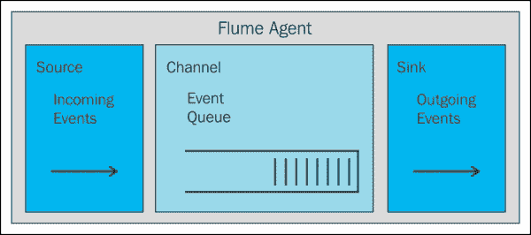
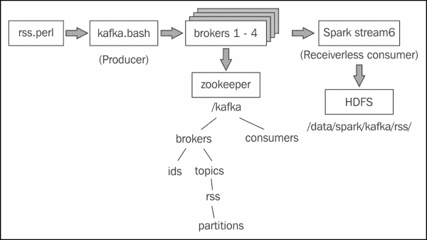

# 第 11-13 章 3.Apache 火花流

Apache 流模块是 Apache Spark 中基于流处理的模块。 它使用 Spark 群集提供高度扩展的能力。 它基于 Spark，具有高度的容错性，能够通过对正在处理的数据流设置检查点来重新运行失败的任务。 在第一节之后，本章将涵盖以下方面，它将提供 Apache Spark 如何处理基于流的数据的实际概述：

*   错误恢复和检查点
*   基于 TCP 的流处理
*   文件流文件流
*   水槽流源
*   卡夫卡流源

对于每个主题，我将用 Scala 提供一个工作示例，并展示如何设置和测试基于流的架构。

# 概述

在给出 Apache Spark Streaming 模块的概述时，我建议您查看[http://spark.apache.org/](http://spark.apache.org/)网站，了解最新信息，就像和基于 Spark 的用户组(如`<[user@spark.apache.org](mailto:user@spark.apache.org)>`)一样。 我这么说的原因是，这些是可以获得 Spark 信息的主要地方。 此外，极快(且不断增加)的变化速度意味着，当你阅读这一新的 Spark 功能和版本时，将会有新的 Spark 功能和版本可用。 因此，根据这一点，在进行概述时，我将尝试概括一下。


上图显示了 Apache 流的潜在数据源，例如，如**Kafka**、**Flume**和**HDFS**。 这些馈送到火花流模块，作为离散流处理。 该图还显示，可以使用其他 Spark 模块功能(如机器学习)来处理基于流的数据。 然后，完全处理的数据可以是**HDFS**、**数据库**或**仪表板**的输出。 这个图表是基于 Spark 流媒体网站上的图表，但我想将其扩展到这两个方面-表达 Spark 模块的功能，以及仪表板选项。 上图显示了从 Spark 馈送到 Graphite 的 MetricSystems 提要。 此外，还可以将基于 Solr 的数据提供给 LucidWorks 香蕉(卡巴纳港)。 这里还值得一提的是，Databricks(参见[第 8 章](8.html "Chapter 8. Spark Databricks")、*Spark Databricks*和[第 9 章](9.html "Chapter 9. Databricks Visualization")、*Databricks Visualization*)还可以将 Spark 流数据显示为仪表板。


在讨论 Spark 离散流时，前面的图也取自 Spark 网站的[http://spark.apache.org/](http://spark.apache.org/)，这是我喜欢使用的图表。 上图中的绿色方框显示了发送到 Spark 的连续数据流，该数据流被分解为一个**离散流**(**DStream**)。 然后，流中每个元素的大小基于批处理时间，可能是两秒。 还可以在 DStream 上创建一个表示为前一个红色框的窗口。 例如，在进行实时趋势分析时，可能需要在 10 分钟的时间内确定十大基于 Twitter 的标签。

那么，假设 Spark可以用于流处理，那么如何创建流呢？ 以下基于 Scala 的代码展示了如何创建 Twitter 流。 这个示例被简化了，因为没有包括 Twitter 授权，但是您了解其中的意思(完整的示例代码在*检查点*部分)。 称为`ssc`的火花流上下文是使用火花上下文`sc`创建的。 批处理时间在创建时指定；在本例中为 5 秒。 然后，使用 60 秒的窗口从`Streamingcontext`创建一个名为`stream`的基于 Twitter 的 DStream：

```scala
 val ssc    = new StreamingContext(sc, Seconds(5) )
 val stream = TwitterUtils.createStream(ssc,None).window( Seconds(60) )

```

流处理可以通过流上下文开始方法(如下所示)开始，并且`awaitTermination`方法指示它应该处理直到停止。 因此，如果此代码嵌入到基于库的应用程序中，它将一直运行到会话终止，可能会使用*Crtl*+*C*：

```scala
 ssc.start()
 ssc.awaitTermination()

```

这解释了 Spark Streaming 是什么，以及它做了什么，但没有解释错误处理，也没有解释在基于流的应用程序失败时该怎么做。 下一节将研究火花流错误管理和恢复。

# 错误和恢复

通常，您的应用程序需要问的问题是：接收和处理所有数据是否至关重要？ 如果不是，那么在出现故障时，您可能只需要就能够重新启动应用程序，并丢弃丢失或丢失的数据。 如果不是这样，那么您将需要使用检查点，这将在下一节中介绍。

还值得注意的是，您的应用程序的错误管理应该是健壮的和自给自足的。 我这样说的意思是：如果异常不是关键的，那么管理该异常，或许记录它，然后继续处理。 例如，当任务达到最大失败次数(由`spark.task.maxFailures`指定)时，它将终止处理。

## 检查点

可以设置基于 HDFS 的检查点目录来存储基于 Apache Spark 的流信息。 在这个 Scala 示例中，数据将存储在 HDFS 中的`/data/spark/checkpoint`下。 以下 HDFS 文件系统`ls`命令显示，在启动之前，该目录不存在：

```scala
[hadoop@hc2nn stream]$ hdfs dfs -ls /data/spark/checkpoint
ls: `/data/spark/checkpoint': No such file or directory

```

下面给出的基于 Twitter 的 Scala 代码示例首先定义应用程序的包名，然后导入 Spark、流、上下文和基于 Twitter 的功能。 然后，它定义一个名为`stream1`的应用程序对象：

```scala
package nz.co.semtechsolutions

import org.apache.spark._
import org.apache.spark.SparkContext._
import org.apache.spark.streaming._
import org.apache.spark.streaming.twitter._
import org.apache.spark.streaming.StreamingContext._

object stream1 {

```

接下来，定义一个名为`createContext`的方法，该方法将用于创建 Spark 和流上下文。 它还将使用流上下文检查点方法将流检查点设置到基于 HDFS 的目录，该方法采用目录路径作为参数。 目录路径是传入`createContext`方法的值(`cpDir`)：

```scala
 def createContext( cpDir : String ) : StreamingContext = {

 val appName = "Stream example 1"
 val conf    = new SparkConf()

 conf.setAppName(appName)

 val sc = new SparkContext(conf)

 val ssc    = new StreamingContext(sc, Seconds(5) )

 ssc.checkpoint( cpDir )

 ssc
 }

```

现在，定义了 main 方法、`HDFS`目录以及 Twitter 访问权限和参数。 火花流上下文`ssc`是通过`StreamingContext`方法-`getOrCreate`使用 HDFS`checkpoint`目录检索或创建的。 如果目录不存在，则调用前面名为`createContext`的方法，该方法将创建上下文和检查点。 显然，我已经删减了我自己的推特授权。 出于安全原因，本例中的密钥：

```scala
 def main(args: Array[String]) {

 val hdfsDir = "/data/spark/checkpoint"

 val consumerKey       = "QQpxx"
 val consumerSecret    = "0HFzxx"
 val accessToken       = "323xx"
 val accessTokenSecret = "IlQxx"

 System.setProperty("twitter4j.oauth.consumerKey", consumerKey)
 System.setProperty("twitter4j.oauth.consumerSecret", consumerSecret)
 System.setProperty("twitter4j.oauth.accessToken", accessToken)
 System.setProperty("twitter4j.oauth.accessTokenSecret", accessTokenSecret)

 val ssc = StreamingContext.getOrCreate(hdfsDir,
 () => { createContext( hdfsDir ) })

 val stream = TwitterUtils.createStream(ssc,None).window( Seconds(60) )

 // do some processing

 ssc.start()
 ssc.awaitTermination()

 } // end main

```

运行了这段没有实际处理的代码后，可以再次检查 HDFS`checkpoint`目录。 这一次显然已经创建了`checkpoint`目录，并且已经存储了数据：

```scala
[hadoop@hc2nn stream]$ hdfs dfs -ls /data/spark/checkpoint
Found 1 items
drwxr-xr-x   - hadoop supergroup          0 2015-07-02 13:41 /data/spark/checkpoint/0fc3d94e-6f53-40fb-910d-1eef044b12e9

```

此示例取自 Apache Spark 网站，展示了如何设置和使用检查点存储。 但是检查点多久进行一次呢？ 元数据在每个流批次期间存储。 实际数据使用一个周期存储，该周期是批处理间隔的最大值，即 10 秒。 这可能不太适合您，因此您可以使用以下方法重置值：

```scala
DStream.checkpoint( newRequiredInterval )

```

其中`newRequiredInterval`是您需要的新检查点间隔值，通常您的目标应该是批处理间隔的五到十倍。

检查点同时保存流批次和元数据(有关数据的数据)。 如果应用程序失败，则当它重新启动时，将在开始处理时使用检查点数据。 重新处理故障时正在处理的批处理数据，以及故障后的批处理数据。

记住监视用于检查点的 HDFS 磁盘空间。 在下一节中，我将开始研究流源，并提供每种类型的一些示例。

# 流媒体源

我不能涵盖本节中所有的流类型和实际示例，但是如果本章太小而不能包含代码，我至少会提供一个描述。 在本章中，我将介绍 TCP 和文件流，以及 Flume、Kafka 和 Twitter 流。 我将从一个基于 TCP 的实际示例开始。

本章研究流处理体系结构。 例如，在流数据传输速率超过潜在数据处理速率的情况下会发生什么情况？ 像 Kafka 这样的系统通过提供使用多个数据主题和消费者的能力，提供了解决这个问题的可能性。

## TCP 流

通过指定主机名和端口号，可以使用称为`socketTextStream`的 Spark流上下文方法通过 TCP/IP 流传输数据。 本节中基于 Scala 的代码示例将在端口`10777`上接收使用`netcat`Linux 命令提供的数据。 代码示例首先定义包名，然后导入 Spark、Context 和 Streaming 类。 定义了名为`stream2`的对象类，因为它是带参数的 Main 方法：

```scala
package nz.co.semtechsolutions

import org.apache.spark._
import org.apache.spark.SparkContext._
import org.apache.spark.streaming._
import org.apache.spark.streaming.StreamingContext._

object stream2 {

 def main(args: Array[String]) {

```

检查传递给类的参数数量，以确保它是主机名和端口号。 使用定义的应用程序名称创建火花配置对象。 然后创建 Spark 和流上下文。 然后，设置 10 秒的流批时间：

```scala
 if ( args.length < 2 )
 {
 System.err.println("Usage: stream2 <host> <port>")
 System.exit(1)
 }

 val hostname = args(0).trim
 val portnum  = args(1).toInt

 val appName = "Stream example 2"
 val conf    = new SparkConf()

 conf.setAppName(appName)

 val sc  = new SparkContext(conf)
 val ssc = new StreamingContext(sc, Seconds(10) )

```

通过使用主机和端口名称参数调用流上下文的`socketTextStream`方法来创建名为`rawDstream`的 DStream。

```scala
 val rawDstream = ssc.socketTextStream( hostname, portnum )

```

通过按间距拆分单词，从原始流数据创建前十个单词计数。 然后，(键，值)对被创建为`(word,1)`，减去键值，这就是单词。 现在，这里有一个单词及其相关计数的列表。 现在，键和值被交换，因此列表变成(`count`和`word`)。 然后，对键进行排序，现在是计数。 最后，在 DStream 中获取并打印出`rdd`中的前 10 个项目：

```scala
 val wordCount = rawDstream
 .flatMap(line => line.split(" "))
 .map(word => (word,1))
 .reduceByKey(_+_)
 .map(item => item.swap)
 .transform(rdd => rdd.sortByKey(false))
 .foreachRDD( rdd =>
 { rdd.take(10).foreach(x=>println("List : " + x)) })

```

代码以 Spark Streaming 开始结束，并调用`awaitTermination`方法开始流处理并等待进程终止：

```scala
 ssc.start()
 ssc.awaitTermination()

 } // end main

} // end stream2

```

如前所述，此应用程序的数据由 Linux`netcat`(`nc`)命令提供。 Linux`cat`命令转储日志文件的内容，该文件通过管道传输到`nc`。 `lk`选项强制`netcat`侦听连接，并在连接丢失时继续侦听。 此示例显示正在使用的端口为`10777`：

```scala
[root@hc2nn log]# pwd
/var/log
[root@hc2nn log]# cat ./anaconda.storage.log | nc -lk 10777

```

此处显示了此基于 TCP 的流处理的输出。 实际输出并不像演示的方法那样重要。 然而，不出所料，数据显示了一个由 10 个日志文件字组成的列表，该列表按递减计数顺序排列。 请注意，最上面的单词是空的，因为流中没有筛选空单词：

```scala
List : (17104,)
List : (2333,=)
List : (1656,:)
List : (1603,;)
List : (1557,DEBUG)
List : (564,True)
List : (495,False)
List : (411,None)
List : (356,at)
List : (335,object)

```

如果您想使用 Apache Spark Streaming(基于主机和端口的 TCP/IP)流式传输数据，这是很有趣的。 但是更具异国情调的方法呢？ 如果您希望从消息传递系统或通过基于内存的通道流式传输数据，该怎么办？ 如果您想要使用目前可用的一些大数据工具，如 Flume 和 Kafka，该怎么办？ 下一节将研究这些选项，但首先我将演示流如何基于文件。

## Колибриобработается

我在上一节修改了基于 Scala 的代码示例，通过调用名为`textFileStream`的 Spark Streaming 上下文方法监视基于 HDFS 的目录。 考虑到这个小小的变化，我不会显示所有的代码。 应用程序类现在称为`stream3`，它只接受一个参数-`HDFS`目录。 目录路径可以在 NFS 或 AWS S3 上(本书将提供所有代码示例)：

```scala
 val rawDstream = ssc.textFileStream( directory )

```

流处理与以前相同。 流被分成单词，并打印前十个单词列表。 这次唯一的不同之处在于，数据必须在应用程序运行时放入`HDFS`目录。 这是通过此处的 hdfs file system`put`命令实现的：

```scala
[root@hc2nn log]# hdfs dfs -put ./anaconda.storage.log /data/spark/stream

```

如您所见，使用的`HDFS`目录是`/data/spark/stream/`，基于文本的源日志文件是`anaconda.storage.log`(在`/var/log/`下)。 不出所料，打印了相同的单词列表和计数：

```scala
List : (17104,)
List : (2333,=)
……..
List : (564,True)
List : (495,False)
List : (411,None)
List : (356,at)
List : (335,object)

```

这些是基于 TCP 和文件系统数据的简单流方法。 但如果我想使用 Spark Streaming 中的一些内置流媒体功能呢？ 接下来我们将对此进行研究。 我们将以火花流式水槽库为例。

## 水槽

Flume是一个 Apache开源项目和产品，旨在以大数据规模移动大量数据。 它具有高度可伸缩性、分布式和可靠性，基于数据源、数据宿和数据通道工作，如此处的图表(取自[http://flume.apache.org/](http://flume.apache.org/)网站的所示)：


Flume 使用代理来处理数据流。 如上图所示，代理具有数据源、数据处理通道和数据接收器。 更清楚地描述这一点的方式是通过下图。 通道充当源数据的队列，接收器将数据传递到链中的下一个链路。



Flume 代理可以形成 Flume 体系结构；一个代理的接收器的输出可以是第二个代理的输入。 Apache Spark 允许两种使用 Apache Flume 的方法。 第一种是基于 Avro 推送的内存方法，而第二种仍然基于 Avro，是基于拉的系统，使用定制的 Spark Sink 库。

我通过Cloudera CDH5.3 集群管理器安装了 Flume，它只安装一个代理。 检查 Linux 命令行，我可以看到 Flume 版本 1.5 现在可用：

```scala
[root@hc2nn ~]# flume-ng version
Flume 1.5.0-cdh5.3.3
Source code repository: https://git-wip-us.apache.org/repos/asf/flume.git
Revision: b88ce1fd016bc873d817343779dfff6aeea07706
Compiled by jenkins on Wed Apr  8 14:57:43 PDT 2015
From source with checksum 389d91c718e03341a2367bf4ef12428e

```

我最初将在这里实现的基于 Flume 的Spark 示例是基于 Flume 的推送方法，Spark 充当接收器，Flume 将数据推送到 Spark。 下图表示我将在单个节点上实现的结构：


消息数据将使用 Linux`netcat`(`nc`)命令发送到名为`hc2r1m1`的主机上的端口`10777`。 这将充当 Flume 代理(`agent1`)的源(`source1`)，它将有一个名为`channel1`的内存通道。 `agent1`使用的接收器将基于 Apache Avro，同样是在名为`hc2r1m1`的主机上，但这一次，端口号将是`11777`。 Apache Spark Flume 应用程序`stream4`(我稍后将对其进行描述)将侦听此端口上的 Flume 流数据。

接下来，我针对`10777`端口执行`netcat`(`nc`)命令，以开始流处理。 现在，当我在此窗口中键入文本时，它将被用作 Flume 源，数据将被发送到 Spark 应用程序：

```scala
[hadoop@hc2nn ~]$ nc  hc2r1m1.semtech-solutions.co.nz  10777

```

为了运行我的 Flume代理`agent1`，我创建了一个名为`agent1.flume.cfg`的 Flume 配置文件，它描述了代理的源、通道和接收器。 该文件的内容如下所示。 第一部分定义`agent1`源、通道和接收器名称。

```scala
agent1.sources  = source1
agent1.channels = channel1
agent1.sinks    = sink1

```

下一节将`source1`定义为基于 Netcat，在名为`hc2r1m1`的主机上运行，端口为`10777`：

```scala
agent1.sources.source1.channels=channel1
agent1.sources.source1.type=netcat
agent1.sources.source1.bind=hc2r1m1.semtech-solutions.co.nz
agent1.sources.source1.port=10777

```

`agent1`通道`channel1`定义为基于存储器的通道，最大事件容量为 1000 个事件：

```scala
agent1.channels.channel1.type=memory
agent1.channels.channel1.capacity=1000

```

最后，将`agent1`接收器`sink1`定义为名为`hc2r1m1`和`11777`端口的主机上的 Apache Avro 接收器：

```scala
agent1.sinks.sink1.type=avro
agent1.sinks.sink1.hostname=hc2r1m1.semtech-solutions.co.nz
agent1.sinks.sink1.port=11777
agent1.sinks.sink1.channel=channel1

```

我已经创建了一个名为`flume.bash`的 Bash 脚本来运行 Flume 代理`agent1`。 它看起来是这样的：

```scala
[hadoop@hc2r1m1 stream]$ more flume.bash

#!/bin/bash

# run the bash agent

flume-ng agent \
 --conf /etc/flume-ng/conf \
 --conf-file ./agent1.flume.cfg \
 -Dflume.root.logger=DEBUG,INFO,console  \
 -name agent1

```

脚本调用Flume 可执行文件`flume-ng`，传递`agent1`配置文件。 呼叫指定名为`agent1`的座席。 它还将 Flume 配置目录指定为默认值`/etc/flume-ng/conf/`。 首先，我将使用`netcat`Flume 源代码和一个基于 Scala 的示例来展示如何将数据发送到 Apache Spark 应用程序。 然后，我将展示如何以类似的方式处理基于 RSS 的数据提要。 因此，最初，将接收`netcat`数据的 Scala 代码如下所示。 定义了类包名和应用程序类名。 将导入 Spark 和 Flume 所需的类。 最后，定义了主要方法：

```scala
package nz.co.semtechsolutions

import org.apache.spark._
import org.apache.spark.SparkContext._
import org.apache.spark.streaming._
import org.apache.spark.streaming.StreamingContext._
import org.apache.spark.streaming.flume._

object stream4 {

 def main(args: Array[String]) {

```

检查并提取数据流的主机和端口名参数：

```scala
 if ( args.length < 2 )
 {
 System.err.println("Usage: stream4 <host> <port>")
 System.exit(1)
 }
 val hostname = args(0).trim
 val portnum  = args(1).toInt

 println("hostname : " + hostname)
 println("portnum  : " + portnum)

```

将创建 Spark 和 Streaming 上下文。 然后，使用流上下文主机和端口号创建基于 Flume 的数据流。 基于 Flume 的类`FlumeUtils`通过调用它的`createStream`方法来实现这一点：

```scala
 val appName = "Stream example 4"
 val conf    = new SparkConf()

 conf.setAppName(appName)

 val sc  = new SparkContext(conf)
 val ssc = new StreamingContext(sc, Seconds(10) )

 val rawDstream = FlumeUtils.createStream(ssc,hostname,portnum)

```

最后，打印一个流事件计数，并且(在我们测试流时出于调试目的)转储流内容。 在此之后，流上下文被启动并配置为运行，直到通过应用程序终止：

```scala
 rawDstream.count()
 .map(cnt => ">>>> Received events : " + cnt )
 .print()

 rawDstream.map(e => new String(e.event.getBody.array() ))
 .print

 ssc.start()
 ssc.awaitTermination()

 } // end main
} // end stream4

```

编译它之后，我将使用`spark-submit`运行此应用程序。 在本书的其他章节中，我将使用一个名为`run_stream.bash`的基于 Bash 的脚本来执行该作业。 脚本如下所示：

```scala
[hadoop@hc2r1m1 stream]$ more run_stream.bash

#!/bin/bash

SPARK_HOME=/usr/local/spark
SPARK_BIN=$SPARK_HOME/bin
SPARK_SBIN=$SPARK_HOME/sbin

JAR_PATH=/home/hadoop/spark/stream/target/scala-2.10/streaming_2.10-1.0.jar
CLASS_VAL=$1
CLASS_PARAMS="${*:2}"

STREAM_JAR=/usr/local/spark/lib/spark-examples-1.3.1-hadoop2.3.0.jar

cd $SPARK_BIN

./spark-submit \
 --class $CLASS_VAL \
 --master spark://hc2nn.semtech-solutions.co.nz:7077  \
 --executor-memory 100M \
 --total-executor-cores 50 \
 --jars $STREAM_JAR \
 $JAR_PATH \
 $CLASS_PARAMS

```

因此，该脚本为该作业设置了一些基于 Spark 的变量和一个 JAR 库路径。 它将运行哪个 Spark 类作为其第一个参数。 它将所有其他变量作为参数传递给 Spark 应用程序类作业。 因此，应用程序的执行如下所示：

```scala
[hadoop@hc2r1m1 stream]$ ./run_stream.bash  \
 nz.co.semtechsolutions.stream4 \
 hc2r1m1.semtech-solutions.co.nz  \
 11777

```

这意味着 Spark 应用程序已就绪，并在端口`11777`上作为 Flume 接收器运行。 Flume 输入已就绪，在端口`10777`上作为 Netcat 任务运行。 现在，可以使用名为`flume.bash`的 Flume 脚本启动 Flume 代理`agent1`，以将基于 Netcat 源的数据发送到基于 Apache Spark Flume 的接收器：

```scala
[hadoop@hc2r1m1 stream]$ ./flume.bash

```

现在，当文本传递到 Netcat 会话时，它应该流经 Flume，并由 Spark 作为流进行处理。 我们来试试吧：

```scala
[hadoop@hc2nn ~]$ nc  hc2r1m1.semtech-solutions.co.nz 10777
I hope that Apache Spark will print this
OK
I hope that Apache Spark will print this
OK
I hope that Apache Spark will print this
OK

```

Netcat 会话中添加了三段简单的文本，并使用`OK`进行确认，因此可以将它们传递给 Flume。 Flume 会话中的调试输出显示已接收并处理事件(每行一个)：

```scala
2015-07-06 18:13:18,699 (netcat-handler-0) [DEBUG - org.apache.flume.source.NetcatSource$NetcatSocketHandler.run(NetcatSource.java:318)] Chars read = 41
2015-07-06 18:13:18,700 (netcat-handler-0) [DEBUG - org.apache.flume.source.NetcatSource$NetcatSocketHandler.run(NetcatSource.java:322)] Events processed = 1
2015-07-06 18:13:18,990 (netcat-handler-0) [DEBUG - org.apache.flume.source.NetcatSource$NetcatSocketHandler.run(NetcatSource.java:318)] Chars read = 41
2015-07-06 18:13:18,991 (netcat-handler-0) [DEBUG - org.apache.flume.source.NetcatSource$NetcatSocketHandler.run(NetcatSource.java:322)] Events processed = 1
2015-07-06 18:13:19,270 (netcat-handler-0) [DEBUG - org.apache.flume.source.NetcatSource$NetcatSocketHandler.run(NetcatSource.java:318)] Chars read = 41
2015-07-06 18:13:19,271 (netcat-handler-0) [DEBUG - org.apache.flume.source.NetcatSource$NetcatSocketHandler.run(NetcatSource.java:322)] Events processed = 1

```

最后，在 Spark`stream4`应用程序会话中，接收并处理了三个事件。 在这种情况下，转储到会话以证明数据已到达。 当然，这不是您通常会做的事情，但我想证明数据是通过此配置传输的：

```scala
-------------------------------------------
Time: 1436163210000 ms
-------------------------------------------
>>> Received events : 3
-------------------------------------------
Time: 1436163210000 ms
-------------------------------------------
I hope that Apache Spark will print this
I hope that Apache Spark will print this
I hope that Apache Spark will print this

```

这很有趣，但它不是一个真正值得生产的 Spark Flume 数据处理示例。 因此，为了演示一种潜在的实际数据处理方法，我将更改 Flume配置文件源详细信息，使其使用 Perl 脚本，该脚本可执行如下所示：

```scala
agent1.sources.source1.type=exec
agent1.sources.source.command=./rss.perl

```

前面引用的 Perl 脚本`rss.perl`只是作为路透社科学新闻的来源。 它接收 XML 格式的新闻，并将其转换为 JSON 格式。 它还清除数据中不需要的噪声。 首先，它导入像 lwp 和`XML::XPath`这样的包来启用 XML 处理。 然后，它指定一个基于科学的路透社新闻数据源，并创建一个新的 LWP 代理来处理数据，如下所示：

```scala
#!/usr/bin/perl

use strict;
use LWP::UserAgent;
use XML::XPath;

my $urlsource="http://feeds.reuters.com/reuters/scienceNews" ;

my  $agent = LWP::UserAgent->new;

```

然后打开一个无限的 While 循环，并对 URL 执行 HTTP`GET`请求。 请求已配置，代理通过调用请求方法发出请求：

```scala
while()
{
 my  $req = HTTP::Request->new(GET => ($urlsource));

 $req->header('content-type' => 'application/json');
 $req->header('Accept'       => 'application/json');

 my $resp = $agent->request($req);

```

如果请求成功，则返回的 XML 数据被定义为请求的解码内容。 通过 XPath 调用，使用名为`/rss/channel/item/title`的路径从 XML 提取标题信息：

```scala
 if ( $resp->is_success )
 {
 my $xmlpage = $resp -> decoded_content;

 my $xp = XML::XPath->new( xml => $xmlpage );
 my $nodeset = $xp->find( '/rss/channel/item/title' );

 my @titles = () ;
 my $index = 0 ;

```

对于提取的标题数据 Title XML 串中的每个节点，提取数据。 清除不需要的 XML 标记，并将其添加到基于 Perl 的名为`titles`的数组中：

```scala
 foreach my $node ($nodeset->get_nodelist)
 {
 my $xmlstring = XML::XPath::XMLParser::as_string($node) ;

 $xmlstring =~ s/<title>//g;
 $xmlstring =~ s/<\/title>//g;
 $xmlstring =~ s/"//g;
 $xmlstring =~ s/,//g;

 $titles[$index] = $xmlstring ;
 $index = $index + 1 ;

 } # foreach find node

```

对请求响应 XML 中基于描述的数据执行相同的处理。 这次使用的 XPath 值是`/rss/channel/item/description/`。 有更多的标记需要从描述数据中清除，因此有更多的 Perl 搜索，以及作用于该数据的行替换(`s///g`)：

```scala
 my $nodeset = $xp->find( '/rss/channel/item/description' );

 my @desc = () ;
 $index = 0 ;

 foreach my $node ($nodeset->get_nodelist)
 {
 my $xmlstring = XML::XPath::XMLParser::as_string($node) ;

 $xmlstring =~ s///g;
 $xmlstring =~ s/href=".+"//g;
 $xmlstring =~ s/src=".+"//g;
 $xmlstring =~ s/src='.+'//g;
 $xmlstring =~ s/<br.+\/>//g;
 $xmlstring =~ s/<\/div>//g;
 $xmlstring =~ s/<\/a>//g;
 $xmlstring =~ s/<a >\n//g;
 $xmlstring =~ s///g;
 $xmlstring =~ s///g;
 $xmlstring =~ s/<div.+>//g;
 $xmlstring =~ s/<title>//g;
 $xmlstring =~ s/<\/title>//g;
 $xmlstring =~ s/<description>//g;
 $xmlstring =~ s/<\/description>//g;
 $xmlstring =~ s/&lt;.+>//g;
 $xmlstring =~ s/"//g;
 $xmlstring =~ s/,//g;
 $xmlstring =~ s/\r|\n//g;

 $desc[$index] = $xmlstring ;
 $index = $index + 1 ;

 } # foreach find node

```

最后，使用`print`命令以 RSS JSON 格式输出基于 XML 的标题和描述数据。 然后该脚本休眠 30 秒，并请求更多 RSS 新闻信息进行处理：

```scala
 my $newsitems = $index ;
 $index = 0 ;

 for ($index=0; $index < $newsitems; $index++) {

 print "{\"category\": \"science\","
 . " \"title\": \"" .  $titles[$index] . "\","
 . " \"summary\": \"" .  $desc[$index] . "\""
 . "}\n";

 } # for rss items

 } # success ?

 sleep(30) ;

} # while

```

我已经创建了第二个基于 Scala 的流处理代码示例，名为`stream5`。 它类似于`stream4`示例，但它现在处理来自流的`rss`项数据。 接下来定义一个案例类来处理 XML`rss`信息中的类别、标题和摘要。 定义一个 html 位置来存储来自 Flume 通道的结果数据：

```scala
 case class RSSItem(category : String, title : String, summary : String)

 val now: Long = System.currentTimeMillis

 val hdfsdir = "hdfs://hc2nn:8020/data/spark/flume/rss/"

```

来自基于 Flume 的事件的`rss`流数据被转换为字符串。 然后使用名为`RSSItem`的 Case 类对其进行格式化。 如果存在事件数据，则使用前面的`hdfsdir`路径将其写入 HDFS 目录：

```scala
 rawDstream.map(record => {
 implicit val formats = DefaultFormats
 read[RSSItem](new String(record.event.getBody().array()))
 })
 .foreachRDD(rdd => {
 if (rdd.count() > 0) {
 rdd.map(item => {
 implicit val formats = DefaultFormats
 write(item)
 }).saveAsTextFile(hdfsdir+"file_"+now.toString())
 }
 })

```

运行此代码示例，可以看到 Perl`rss`脚本正在生成数据，因为 Flume 脚本输出表明已经接受和接收了 80 个事件：

```scala
2015-07-07 14:14:24,017 (agent-shutdown-hook) [DEBUG - org.apache.flume.source.ExecSource.stop(ExecSource.java:219)] Exec source with command:./news_rss_collector.py stopped. Metrics:SOURCE:source1{src.events.accepted=80, src.events.received=80, src.append.accepted=0, src.append-batch.accepted=0, src.open-connection.count=0, src.append-batch.received=0, src.append.received=0}

```

Scala Spark 应用程序`stream5`分两批处理了 80 个事件：

```scala
>>>> Received events : 73
>>>> Received events : 7

```

事件已存储在 HDFS 上的预期目录下，如 hadoop file system`ls`命令所示：

```scala
[hadoop@hc2r1m1 stream]$ hdfs dfs -ls /data/spark/flume/rss/
Found 2 items
drwxr-xr-x   - hadoop supergroup          0 2015-07-07 14:09 /data/spark/flume/rss/file_1436234439794
drwxr-xr-x   - hadoop supergroup          0 2015-07-07 14:14 /data/spark/flume/rss/file_1436235208370

```

此外，使用hadoop file system`cat`命令，可以证明 HDFS 上的文件包含基于 RSS 提要新闻的数据，如下所示：

```scala
[hadoop@hc2r1m1 stream]$  hdfs dfs -cat /data/spark/flume/rss/file_1436235208370/part-00000 | head -1

{"category":"healthcare","title":"BRIEF-Aetna CEO says has not had specific conversations with DOJ on Humana - CNBC","summary":"* Aetna CEO Says Has Not Had Specific Conversations With Doj About Humana Acquisition - CNBC"}

```

这个基于 Spark 流的示例使用 Apache Flume 通过 Flume 将数据从 RSS 源通过 Spark 使用者传输到 HDFS。 这是一个很好的例子，但是如果您想要将数据发布给一组消费者，该怎么办呢？ 在下一节中，我将研究 Apache Kafka-一个发布订阅消息传递系统，并确定如何将其与 Spark 一起使用。

## ==同步，由 Elderman 更正==@ELDER_MAN

Apache Kafka([http://kafka.apache.org/](http://kafka.apache.org/))是 Apache 中的顶级开源项目。 它是一个大数据发布/订阅消息传递系统，具有快速和高度可伸缩性。 它使用消息代理进行数据管理，使用 ZooKeeper 进行配置，因此可以将数据组织到消费者组和主题中。 Kafka 中的数据被拆分成多个分区。 在这个例子中，我将展示一个基于 Spark 的无接收器的 Kafka 消费者，这样在与我的 Kafka 数据进行比较时，我就不需要担心配置 Spark 数据分区了。

为了演示基于 Kafka 的消息生产和使用，我将使用上一节中的 Perl RSS 脚本作为数据源。 传入 Kafka 和 Spark 的数据将是 JSON 格式的路透社 RSS 新闻数据。

由于主题消息是由消息生成器创建的，因此它们将按消息顺序放置在分区中。 分区中的消息将保留一段可配置的时间段。 然后，Kafka 存储每个消费者的偏移值，即该消费者在该分区中的位置(就消息消耗而言)。

我目前使用的是Cloudera 的 CDH5.3 Hadoop 集群。 为了安装 Kafka，我需要从[http://archive.cloudera.com/csds/kafka/](http://archive.cloudera.com/csds/kafka/)下载一个 Kafka JAR库文件。

下载该文件后，如果我使用的是 CDH 集群管理器，则需要将该文件复制到我的 NameNode CentOS 服务器上的`/opt/cloudera/csd/`目录，以便可以安装：

```scala
[root@hc2nn csd]# pwd
/opt/cloudera/csd

[root@hc2nn csd]# ls -l KAFKA-1.2.0.jar
-rw-r--r-- 1 hadoop hadoop 5670 Jul 11 14:56 KAFKA-1.2.0.jar

```

然后，我需要重新启动 NameNode 或主服务器上的 Cloudera 集群管理器服务器，以便识别更改。 这是以 root 用户身份使用 service 命令完成的，如下所示：

```scala
[root@hc2nn hadoop]# service cloudera-scm-server restart
Stopping cloudera-scm-server:                              [  OK  ]
Starting cloudera-scm-server:                              [  OK  ]

```

现在，应该可以在 CDH 管理器中的**Hosts**|**Parcels**下看到 Kafka 地块，如下图所示。 您可以按照 CDH 包安装的通常下载、分发和激活周期进行操作：


我在集群中的每个数据节点或 Spark Slave 机器上都安装了 Kafka 消息代理。 然后，我为每个 Kafka Broker 服务器设置 Kafka Broker ID 值，给它们一个从 1 到 4 的`broker.id`号。因为 Kafka 使用 ZooKeeper 进行集群数据配置，所以我希望将所有 Kafka 数据保存在 ZooKeeper 中名为`kafka`的顶级节点中。 为了这样做，我将 Kafka ZooKeeper 根值(称为`zookeeper.chroot`)设置为`/kafka`。 进行这些更改后，我重新启动了 CDH Kafka 服务器以使更改生效。

安装了 Kafka 后，我可以检查可供测试的脚本。 下面的清单显示了用于消息生产者和消费者的基于 Kafka 的脚本，以及用于管理主题和检查消费者偏移量的脚本。 本节将使用这些脚本来演示 Kafka 功能：

```scala
[hadoop@hc2nn ~]$ ls /usr/bin/kafka*

/usr/bin/kafka-console-consumer         /usr/bin/kafka-run-class
/usr/bin/kafka-console-producer         /usr/bin/kafka-topics
/usr/bin/kafka-consumer-offset-checker

```

为了运行已安装的Kafka 服务器，我需要设置代理服务器 ID(`broker.id`)的值，否则将出现错误。 一旦卡夫卡安装并运行，我将需要准备一个消息制作人脚本。 下面给出的简单 Bash 脚本称为`kafka.bash`，它定义了一个逗号分隔的主机和端口代理列表。 它还定义了一个称为`rss`的主题。 然后它调用 Perl 脚本`rss.perl`来生成基于 RSS 的数据。 然后，这些数据被输送到名为`kafka-console-producer`的卡夫卡生产者脚本中，发送给卡夫卡。

```scala
[hadoop@hc2r1m1 stream]$ more kafka.bash

#!/bin/bash

BROKER_LIST="hc2r1m1:9092,hc2r1m2:9092,hc2r1m3:9092,hc2r1m4:9092"
TOPIC="rss"

./rss.perl | /usr/bin/kafka-console-producer --broker-list $BROKER_LIST --topic $TOPIC

```

请注意，我在这一点上没有提到卡夫卡主题。 在 Kafka 中创建主题时，可以指定个分区的数量。 在下面的示例中，使用`create`选项调用了`kafka-topics`脚本。 分区数已设置为`5`，数据复制系数已设置为`3`。 ZooKeeper 服务器字符串已定义为端口号为`2181`的`hc2r1m2-4`。 另请注意，顶级 ZooKeeper Kafka 节点已在 ZooKeeper 字符串中定义为`/kafka`：

```scala
/usr/bin/kafka-topics \
 --create  \
 --zookeeper hc2r1m2:2181,hc2r1m3:2181,hc2r1m4:2181/kafka \
 --replication-factor 3  \
 --partitions 5  \
 --topic rss

```

我还创建了一个名为`kafka_list.bash`的 Bash 脚本，用于在测试期间使用，它检查所有已创建的 Kafka主题，以及 Kafka 消费者偏移量。 它调用带有`list`选项和`ZooKeeper`字符串的`kafka-topics`命令来获取已创建主题的列表。 然后，它使用`ZooKeeper`字符串(主题名称和组名)调用名为`kafka-consumer-offset-checker`的 Kafka 脚本，以获得消费者偏移值的列表。 使用此脚本，我可以检查主题是否已创建，主题数据是否正确使用：

```scala
[hadoop@hc2r1m1 stream]$ cat kafka_list.bash

#!/bin/bash

ZOOKEEPER="hc2r1m2:2181,hc2r1m3:2181,hc2r1m4:2181/kafka"
TOPIC="rss"
GROUP="group1"

echo ""
echo "================================"
echo " Kafka Topics "
echo "================================"

/usr/bin/kafka-topics --list --zookeeper $ZOOKEEPER

echo ""
echo "================================"
echo " Kafka Offsets "
echo "================================"

```

```scala
/usr/bin/kafka-consumer-offset-checker \
 --group $GROUP \
 --topic $TOPIC \
 --zookeeper $ZOOKEEPER

```

接下来，我需要创建基于 Apache Spark Scala 的 Kafka 消费者代码。 正如我所说的，我将创建一个无接收器的示例，以便 Kafka 数据分区在 Kafka 和 Spark 中都匹配。 示例是名为`stream6`的。 首先，定义包，并为 Kafka、Spark、Context 和 Streaming 导入类。 然后，定义了名为`stream6`的对象类和 Main 方法。 代码如下所示：

```scala
package nz.co.semtechsolutions

import kafka.serializer.StringDecoder

import org.apache.spark._
import org.apache.spark.SparkContext._
import org.apache.spark.streaming._
import org.apache.spark.streaming.StreamingContext._
import org.apache.spark.streaming.kafka._

object stream6 {

 def main(args: Array[String]) {

```

接下来，检查并处理类参数(代理字符串、组 ID 和主题)。 如果类参数不正确，则打印错误并停止执行，否则定义参数变量：

```scala
 if ( args.length < 3 )
 {
 System.err.println("Usage: stream6 <brokers> <groupid> <topics>\n")
 System.err.println("<brokers> = host1:port1,host2:port2\n")
 System.err.println("<groupid> = group1\n")
 System.err.println("<topics>  = topic1,topic2\n")
 System.exit(1)
 }

 val brokers = args(0).trim
 val groupid = args(1).trim
 val topics  = args(2).trim

 println("brokers : " + brokers)
 println("groupid : " + groupid)
 println("topics  : " + topics)

```

根据应用程序名称定义火花上下文。 同样，Spark URL 被保留为默认 URL。 已经使用 Spark 上下文创建了流上下文。 我将流批量间隔保留为 10 秒，这与上一个示例相同。 但是，您可以使用您选择的参数设置它：

```scala
 val appName = "Stream example 6"
 val conf    = new SparkConf()

 conf.setAppName(appName)

 val sc  = new SparkContext(conf)
 val ssc = new StreamingContext(sc, Seconds(10) )

```

接下来，将代理列表和组 ID 设置为参数。 然后使用这些值创建名为`rawDStream`的基于 Kafka 的 Spark 流：

```scala
 val topicsSet = topics.split(",").toSet
 val kafkaParams : Map[String, String] =
 Map("metadata.broker.list" -> brokers,
 "group.id" -> groupid )

 val rawDstream = KafkaUtils.createDirectStream[String, String, StringDecoder, StringDecoder](ssc, kafkaParams, topicsSet)

```

出于调试目的，我再次打印了流事件计数，以便我知道应用程序何时接收并处理数据：

```scala
 rawDstream.count().map(cnt => ">>>>>>>>>>>>>>> Received events : " + cnt ).print()

```

Kafka 数据的 HDSF 位置定义为`/data/spark/kafka/rss/`。 它已从 DStream 映射到变量行。 使用`foreachRDD`方法，在使用`saveAsTextFile`方法将数据保存到 HDFS 之前，对`lines`变量执行数据计数检查：

```scala
 val now: Long = System.currentTimeMillis

 val hdfsdir = "hdfs://hc2nn:8020/data/spark/kafka/rss/"

 val lines = rawDstream.map(record => record._2)

 lines.foreachRDD(rdd => {
 if (rdd.count() > 0) {
 rdd.saveAsTextFile(hdfsdir+"file_"+now.toString())
 }
 })

```

最后，Scala 脚本结束，开始流处理，并将应用程序类设置为运行，直到使用`awaitTermination`终止：

```scala
 ssc.start()
 ssc.awaitTermination()

 } // end main

} // end stream6

```

解释完所有脚本并运行 Kafka CDH 代理后，现在是检查 Kafka 配置的时候了，如果您还记得的话，它是由 Apache zooKeeper 维护的(到目前为止描述的所有代码示例都将随书一起发布)。 我将使用`zookeeper-client`工具，并连接到`2181`端口上名为`hc2r1m2`的主机上的`zookeeper`服务器。 正如您在这里看到的，我收到了来自`client`会话的连接消息：

```scala
[hadoop@hc2r1m1 stream]$ /usr/bin/zookeeper-client -server hc2r1m2:2181

[zk: hc2r1m2:2181(CONNECTED) 0]

```

如果您还记得，我将 Kafka 的顶级 ZooKeeper 目录指定为`/kafka`。 如果我现在通过客户端会话检查这一点，我可以看到 Kafka 动物园管理员结构。 我将对`brokers`(CDH Kafka 代理服务器)和`consumers`(以前的 Spark Scala 代码)感兴趣。 ZooKeeper`ls`命令显示四个 Kafka 服务器已向 ZooKeeper 注册，并按其`broker.id`配置值从 1 到 4 列出：

```scala
[zk: hc2r1m2:2181(CONNECTED) 2] ls /kafka
[consumers, config, controller, admin, brokers, controller_epoch]

[zk: hc2r1m2:2181(CONNECTED) 3] ls /kafka/brokers
[topics, ids]

[zk: hc2r1m2:2181(CONNECTED) 4] ls /kafka/brokers/ids
[3, 2, 1, 4]

```

我将使用带有`create`标志的 Kafka 脚本`kafka-topics`创建要用于此测试的主题。 我手动执行，因为我可以在执行此操作时演示数据分区的定义。 注意，我已经将 Kafka`topic rss`中的分区设置为 5，如下面的代码片段所示。 还要注意，该命令的 ZooKeeper 连接字符串有一个逗号分隔的 ZooKeeper 服务器列表，该列表由名为`/kafka`的顶级 ZooKeeper Kafka 目录终止。 这意味着该命令会将新主题放在适当的位置：

```scala
[hadoop@hc2nn ~]$ /usr/bin/kafka-topics \
>   --create  \
>   --zookeeper hc2r1m2:2181,hc2r1m3:2181,hc2r1m4:2181/kafka \
>   --replication-factor 3  \
>   --partitions 5  \
>   --topic rss

Created topic "rss".

```

现在，当我使用 ZooKeeper 客户端检查 Kafka 主题配置时，我可以看到正确的主题名称，以及预期的分区数量：

```scala
[zk: hc2r1m2:2181(CONNECTED) 5] ls /kafka/brokers/topics
[rss]

[zk: hc2r1m2:2181(CONNECTED) 6] ls /kafka/brokers/topics/rss
[partitions]

[zk: hc2r1m2:2181(CONNECTED) 7] ls /kafka/brokers/topics/rss/partitions
[3, 2, 1, 0, 4]

```

这描述了 ZooKeeper 中 Kafka 代理服务器的配置，但是数据消费者呢？ 好的，下面的清单显示了数据将保存在哪里。 不过，请记住，此时没有使用者在运行，因此 ZooKeeper 中没有表示它：

```scala
[zk: hc2r1m2:2181(CONNECTED) 9]  ls /kafka/consumers
[]
[zk: hc2r1m2:2181(CONNECTED) 10] quit

```

为了开始测试，我将运行我的 Kafka 数据生成器和消费者脚本。 我还将检查 Spark应用程序类的输出，并需要检查 Kafka 分区偏移量和 HDFS 以确保数据已经到达。 这相当复杂，所以我将在下图中添加一个图表来解释测试体系结构。

名为`rss.perl`的 Perl 脚本将用于为 Kafka 数据生成器提供数据源，后者将将数据提供给 CDH Kafka 代理服务器。 数据将存储在 ZooKeeper 中，采用刚刚检查过的结构，位于名为`/kafka`的顶级节点下。 然后，基于 Apache Spark Scala 的应用程序将充当 Kafka 消费者，并读取它将存储在 HDFS 下的数据。



为了尝试并解释这里的复杂性，我还将检查我运行 Apache Spark 类的方法。 它将通过`spark-submit`命令启动。 请再次记住，所有这些脚本都将随本书一起发布，这样您就可以在自己的时间内研究它们。 我总是使用脚本进行服务器测试管理，因此我封装了复杂性，并且命令执行可以快速重复。 脚本`run_stream.bash`与本章和本书中已经使用过的许多示例脚本类似。 它接受类名和类参数，并通过 Spark-Submit 运行类：

```scala
[hadoop@hc2r1m1 stream]$ more run_stream.bash

#!/bin/bash

SPARK_HOME=/usr/local/spark
SPARK_BIN=$SPARK_HOME/bin
SPARK_SBIN=$SPARK_HOME/sbin

JAR_PATH=/home/hadoop/spark/stream/target/scala-2.10/streaming_2.10-1.0.jar
CLASS_VAL=$1
CLASS_PARAMS="${*:2}"

STREAM_JAR=/usr/local/spark/lib/spark-examples-1.3.1-hadoop2.3.0.jar
cd $SPARK_BIN

./spark-submit \
 --class $CLASS_VAL \
 --master spark://hc2nn.semtech-solutions.co.nz:7077  \
 --executor-memory 100M \
 --total-executor-cores 50 \
 --jars $STREAM_JAR \
 $JAR_PATH \
 $CLASS_PARAMS

```

然后，我使用了第二个脚本，它调用`run_kafka_example.bash`脚本来执行前一个`stream6`应用程序类中的 Kafka Consumer代码。 请注意，此脚本设置完整的应用程序类名称-代理服务器列表。 它还设置称为`rss`的主题名称，以用于数据消费。 最后，它定义了一个称为`group1`的消费群体。 请记住，Kafka 是一个发布/订阅消息代理系统。 可能有许多生产者和消费者按主题、组和分区进行组织：

```scala
[hadoop@hc2r1m1 stream]$ more run_kafka_example.bash

#!/bin/bash

RUN_CLASS=nz.co.semtechsolutions.stream6
BROKERS="hc2r1m1:9092,hc2r1m2:9092,hc2r1m3:9092,hc2r1m4:9092"
GROUPID=group1
TOPICS=rss

# run the Apache Spark Kafka example

./run_stream.bash $RUN_CLASS \
 $BROKERS \
 $GROUPID \
 $TOPICS

```

因此，我将通过运行`run_kafka_example.bash`脚本启动 Kafka 消费者，该脚本将使用 Spark-Submit 运行前面的`stream6`Scala 代码。 在使用名为`kafka_list.bash`的脚本监视 Kafka 数据消耗时，我能够让`kafka-consumer-offset-checker`脚本列出基于 Kafka 的主题，但由于某些原因，在检查偏移量时(在 ZooKeeper 中的`/kafka`下)不会检查正确的路径，如下所示：

```scala
[hadoop@hc2r1m1 stream]$ ./kafka_list.bash

================================
 Kafka Topics
================================
__consumer_offsets
rss

================================
 Kafka Offsets
================================
Exiting due to: org.apache.zookeeper.KeeperException$NoNodeException: KeeperErrorCode = NoNode for /consumers/group1/offsets/rss/4.

```

通过使用脚本`kafka.bash`启动 Kafka Producer RSS 提要，我现在可以开始通过 Kafka 将基于 RSS 的数据馈送到 Spark，然后再馈送到 HDFS。 定期检查`spark-submit`会话输出，可以看到事件正在通过基于 Spark 的 Kafka DStream。 以下输出来自 Scala 代码中的流计数，显示当时处理了 28 个事件：

```scala
-------------------------------------------
Time: 1436834440000 ms
-------------------------------------------
>>>>>>>>>>>>>>> Received events : 28

```

通过 hadoop file system`ls`命令检查`/data/spark/kafka/rss/`目录下的 HDFS，可以看到 HDFS 上现在存储了数据：

```scala
[hadoop@hc2r1m1 stream]$ hdfs dfs -ls /data/spark/kafka/rss
Found 1 items
drwxr-xr-x   - hadoop supergroup          0 2015-07-14 12:40 /data/spark/kafka/rss/file_1436833769907

```

通过检查此目录的内容，可以看到存在 HDFS 部件数据文件，其中应该包含路透提供的基于 RSS 的数据：

```scala
[hadoop@hc2r1m1 stream]$ hdfs dfs -ls /data/spark/kafka/rss/file_1436833769907
Found 2 items
-rw-r--r--   3 hadoop supergroup          0 2015-07-14 12:40 /data/spark/kafka/rss/file_1436833769907/_SUCCESS
-rw-r--r--   3 hadoop supergroup       8205 2015-07-14 12:40 /data/spark/kafka/rss/file_1436833769907/part-00001

```

使用下面的 Hadoop filesystem`cat`命令，我可以转储这个基于 HDFS 的文件的内容以检查其内容。 我已经使用了linux`head`命令来限制数据以节省空间。 显然，这是基于 RSS Reuters 的科学信息，Perl 脚本`rss.perl`已将其从 XML 转换为 RSS JSON 格式。

```scala
[hadoop@hc2r1m1 stream]$ hdfs dfs -cat /data/spark/kafka/rss/file_1436833769907/part-00001 | head -2

{"category": "science", "title": "Bear necessities: low metabolism lets pandas survive on bamboo", "summary": "WASHINGTON (Reuters) - Giant pandas eat vegetables even though their bodies are better equipped to eat meat. So how do these black-and-white bears from the remote misty mountains of central China survive on a diet almost exclusively of a low-nutrient food like bamboo?"}

{"category": "science", "title": "PlanetiQ tests sensor for commercial weather satellites", "summary": "CAPE CANAVERAL (Reuters) - PlanetiQ a privately owned company is beginning a key test intended to pave the way for the first commercial weather satellites."}

```

这个卡夫卡的例子到此为止。 可以看到，卡夫卡经纪人已经安装并配置完毕。 它显示，一家基于 RSS 数据的卡夫卡生产商已经向经纪人提供了数据。 使用 ZooKeeper 客户端已经证明，已经在 ZooKeeper 中设置了匹配代理、主题和分区的 Kafka 架构。 最后，在`stream6`应用程序中，使用基于 Apache Spark 的 Scala 代码显示了 Kafka 数据已被使用并保存到 HDFS。

# 摘要

我本可以提供像 Kinesis 这样的系统以及排队系统的流式示例，但是本章没有篇幅。 Twitter 流已经在检查点部分通过示例进行了研究。

本章提供了在 Spark Streaming 中通过检查点进行数据恢复的实际示例。 本文还讨论了检查点的性能限制，并说明检查点间隔应该设置为 Spark 流批处理间隔的 5 到 10 倍。 检查点在 Spark 应用程序出现故障时提供了基于流的恢复机制。

本章提供了基于 TCP、文件、Flume 和基于 Kafka 的 Spark 流编码的一些基于流的工作示例。 这里的所有示例都是基于 Scala 的，并且都是用`sbt`编译的。 所有的代码都将随这本书一起发布。 在示例架构变得过于复杂的地方，我提供了一个架构图(我在这里想的是 Kafka 示例)。

我很清楚，Apache Spark 流媒体模块包含丰富的功能源，应该可以满足您的大多数需求，并且随着 Spark 未来版本的发布，它还会不断增长。 请记住查看 Apache Spark 网站([http://spark.apache.org/](http://spark.apache.org/))，并通过`<[user@spark.apache.org](mailto:user@spark.apache.org)>`加入 Spark 用户列表。 不要害怕提问或犯错，因为在我看来，错误比成功教得更多。

下一章将研究 Spark SQL 模块，并将提供 SQL、数据帧和访问配置单元等主题的工作示例。