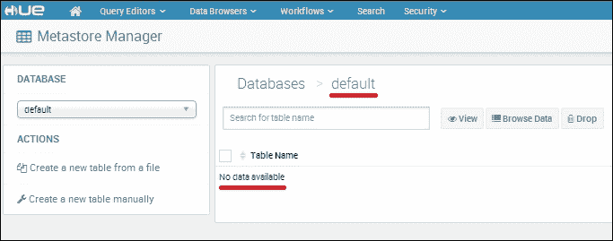
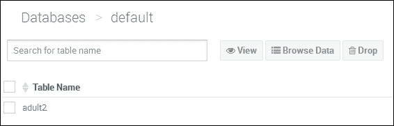
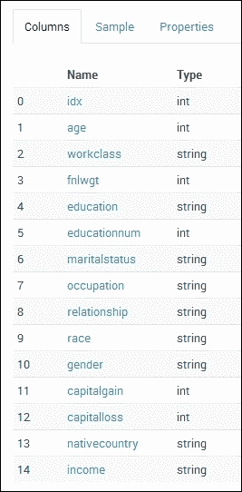
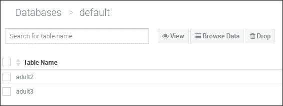

# 四、Spark SQL

在这一章中，我想研究一下 Apache Spark SQL、Apache Have with Spark 和 DataFrames 的用法。 DataFrames是在 Spark 1.3 中引入的，它们是柱状数据存储结构，大致相当于关系数据库表。 本书中的章节没有按顺序展开，因此前面的章节可能会使用比后面的版本更老的 Spark 版本。 我还想研究 Spark SQL 的用户定义函数。 查找有关 Spark 类 API 的信息的一个好地方是：`spark.apache.org/docs/<version>/api/scala/index.html`。

我更喜欢使用 Scala，但是 API 信息也有 Java 和 Python 格式。 `<version>`值表示您将使用的 Spark 版本-1.3.1。 本章将介绍以下主题：

*   SQL 上下文
*   导入和保存数据
*   数据帧
*   使用 SQL
*   用户定义函数
*   使用蜂窝

在直接进入 SQL 和 DataFrames 之前，我将概述一下 SQL 上下文。

# SQL 上下文

SQL 上下文是在 Apache Spark 中处理列数据的起点。 它是从 Spark 上下文创建的，它提供了加载和保存不同类型的数据文件的方法，包括使用 DataFrames 和使用 SQL 操作列数据等。 它可用于以下用途：

*   通过 SQL 方法执行 SQL
*   通过 UDF 方法注册用户定义函数
*   缓存
*   配置 / 构造 / 布局 / 外形
*   数据帧
*   数据源访问
*   DDL 操作

我确信还有个其他领域，但你明白我的意思。 本章中的示例是用 Scala 编写的，只是因为我更喜欢这种语言，但是你也可以用 Python 和 Java 进行开发。 如前所述，SQL 上下文是从 Spark 上下文创建的。 隐式导入 SQL 上下文允许您隐式将 RDDS 转换为 DataFrame：

```scala
val sqlContext = new org.apache.spark.sql.SQLContext(sc)
import sqlContext.implicits._

```

例如，使用前面的`implicits`调用，可以导入 CSV 文件并用分隔符将其拆分。 然后，它可以使用`toDF`方法将包含数据的 RDD 转换为数据帧。

还可以定义一个配置单元上下文，用于访问和操作 Apache 配置单元数据库表数据(配置单元是属于 Hadoop 生态系统的 Apache 数据仓库，它使用 HDFS 进行存储)。 与 Spark 上下文相比，配置单元上下文允许 SQL 功能的超集。 带Spark的蜂巢的用法将在本章后面的小节中介绍。

接下来，我将研究一些可用于导入和保存数据的受支持文件格式。

# 数据导入和保存

我想在这里添加关于导入和保存数据的这一节，即使它不是纯粹关于 Spark SQL 的，所以我可以介绍一些概念，如**Parquet**和**JSON**文件格式。 这一节还允许我介绍如何在一个地方方便地访问和保存松散文本格式的数据，以及 CSV、Parquet 和 JSON 格式。

## 处理文本文件

使用 Spark上下文，可以使用`textFile`方法将文本文件加载到 RDD 中。 此外，`wholeTextFile`方法可以将目录的内容读取到 RDD 中。 以下示例显示如何将基于本地文件系统(`file://`)或 HDFS(`hdfs://`)的文件读入 Spark RDD。 这些示例显示，为了提高性能，数据将被划分为六个部分。 前两个示例是相同的，因为它们都操作 Linux 文件系统上的文件：

```scala
sc.textFile("/data/spark/tweets.txt",6)
sc.textFile("file:///data/spark/tweets.txt",6)
sc.textFile("hdfs://server1:4014/data/spark/tweets.txt",6)

```

## 正在处理 JSON 文件

JSON 是从 Javascript 开发的一种数据交换格式。 **JSON**实际上代表**JavaScript****Object****符号**。 它是一种基于文本的格式，例如可以表示为 XML。 下面的示例使用名为`jsonFile`的 SQL 上下文方法加载名为`device.json`的基于 HDFS 的 JSON 数据文件。 生成的数据将创建为数据框：

```scala
val dframe = sqlContext.jsonFile("hdfs:///data/spark/device.json")

```

可以使用 Data Frame`toJSON`方法将数据保存为 JSON 格式，如下例所示。 首先，导入 Apache Spark 和 Spark SQL 类：

```scala
import org.apache.spark._
import org.apache.spark.SparkContext._
import org.apache.spark.sql.Row;
import org.apache.spark.sql.types.{StructType,StructField,StringType};

```

接下来，将名为`sql1`的对象类定义为带参数的 Main 方法。 定义了用于创建Spark上下文的配置对象。 主 Spark URL 保留为默认值，因此 Spark 需要本地模式、本地主机和`7077`端口：

```scala
object sql1 {

 def main(args: Array[String]) {

 val appName = "sql example 1"
 val conf    = new SparkConf()

 conf.setAppName(appName)

 val sc = new SparkContext(conf)

```

从 Spark 上下文创建一个 SQL 上下文，并使用`textFile`方法加载一个名为`adult.test.data_1x`的 CSV 格式的原始文本文件。 然后创建一个架构字符串，该字符串包含数据列名以及通过其间距拆分该字符串并使用`StructType`和`StructField`方法将每个架构列定义为字符串值而创建的架构：

```scala
 val sqlContext = new org.apache.spark.sql.SQLContext(sc)

 val rawRdd = sc.textFile("hdfs:///data/spark/sql/adult.test.data_1x")

 val schemaString = "age workclass fnlwgt education " +   "educational-num  marital-status occupation relationship " +
"race gender capital-gain capital-loss hours-per-week " +
"native-country income"

 val schema =
 StructType(
 schemaString.split(" ").map(fieldName => StructField(fieldName, StringType, true)))

```

然后，通过使用逗号作为行分隔符将原始 CSV 数据拆分，从而从原始 CSV 数据创建每个数据行，然后将元素添加到`Row()`结构中。 从模式创建数据框，然后使用`toJSON`方法将行数据转换为 JSON 格式。 最后，使用`saveAsTextFile`方法将数据保存到 HDFS：

```scala
 val rowRDD = rawRdd.map(_.split(","))
 .map(p => Row( p(0),p(1),p(2),p(3),p(4),p(5),p(6),p(7),p(8),
 p(9),p(10),p(11),p(12),p(13),p(14) ))

 val adultDataFrame = sqlContext.createDataFrame(rowRDD, schema)

 val jsonData = adultDataFrame.toJSON

 jsonData.saveAsTextFile("hdfs:///data/spark/sql/adult.json")

 } // end main

} // end sql1

```

因此可以在HDFS 上看到结果数据，下面的 Hadoop file system`ls`命令显示数据作为一个成功文件和两个部分文件驻留在`target`目录中。

```scala
[hadoop@hc2nn sql]$ hdfs dfs -ls /data/spark/sql/adult.json

Found 3 items
-rw-r--r--   3 hadoop supergroup          0 2015-06-20 17:17 /data/spark/sql/adult.json/_SUCCESS
-rw-r--r--   3 hadoop supergroup       1731 2015-06-20 17:17 /data/spark/sql/adult.json/part-00000
-rw-r--r--   3 hadoop supergroup       1724 2015-06-20 17:17 /data/spark/sql/adult.json/part-00001

```

使用 Hadoop 文件系统的`cat`命令，可以显示 JSON 数据的内容。 为了节省空间，我只展示一个示例：

```scala
[hadoop@hc2nn sql]$ hdfs dfs -cat /data/spark/sql/adult.json/part-00000 | more

{"age":"25","workclass":" Private","fnlwgt":" 226802","education":" 11th","educational-num":"
 7","marital-status":" Never-married","occupation":" Machine-op-inspct","relationship":" Own-
child","race":" Black","gender":" Male","capital-gain":" 0","capital-loss":" 0","hours-per-we
ek":" 40","native-country":" United-States","income":" <=50K"}

```

处理镶木地板数据非常相似，我将在下面展示。

## 处理拼花地板文件

Apache Parquet 是 Hadoop 工具集中用于文件 I/O 的另一种基于列的数据格式，例如 Have、Pig 和 Impala。 它通过使用高效的压缩和编码例程提高了性能。

拼花处理示例与 JSON Scala 代码非常相似。 创建 DataFrame，然后使用类型为 Parquet 的 save 方法将其保存为 Parquet 格式：

```scala
 val adultDataFrame = sqlContext.createDataFrame(rowRDD, schema)
 adultDataFrame.save("hdfs:///data/spark/sql/adult.parquet","parquet")

 } // end main

} // end sql2

```

这将生成一个基于 HDFS 的目录，其中包含三个基于 Parquet 的文件：一个公共元数据文件、一个元数据文件和一个临时文件：

```scala
[hadoop@hc2nn sql]$ hdfs dfs -ls /data/spark/sql/adult.parquet
Found 3 items
-rw-r--r--   3 hadoop supergroup       1412 2015-06-21 13:17 /data/spark/sql/adult.parquet/_common_metadata
-rw-r--r--   3 hadoop supergroup       1412 2015-06-21 13:17 /data/spark/sql/adult.parquet/_metadata
drwxr-xr-x   - hadoop supergroup          0 2015-06-21 13:17 /data/spark/sql/adult.parquet/_temporary

```

通过使用 Hadoop 文件系统的`cat`命令列出元数据文件的内容，可以了解数据格式。 但是拼图标题是二进制的，因此，它不会与`more`和`cat`一起显示：

```scala
[hadoop@hc2nn sql]$ hdfs dfs -cat /data/spark/sql/adult.parquet/_metadata | more
s%
ct","fields":[{"name":"age","type":"string","nullable":true,"metadata":{}},{"name":"workclass
","type":"string","nullable":true,"metadata":{}},{"name":"fnlwgt","type":"string","nullable":
true,"metadata":{}},

```

有关可能的 Spark 和 SQL 上下文方法的更多信息，请使用 Apache Spark API 路径检查名为`org.apache.spark.SparkContext`和`org.apache.spark.sql.SQLContext`的类的内容，了解您感兴趣的 Spark 的特定`<version>`：

```scala
spark.apache.org/docs/<version>/api/scala/index.html

```

在下一节中，我将研究 Spark 1.3 中引入的 Apache Spark DataFrames。

# 数据帧

我已经提到，DataFrame 是基于列格式的。 可以从它创建临时表，但我将在下一节详细说明这一点。 有许多方法可用于数据帧，这些方法允许数据操作和处理。 我已经将这里使用的 Scala 代码基于上一节中的代码，所以我将只向您展示工作行和输出。 可以显示如下所示的数据框架构：

```scala
adultDataFrame.printSchema()

root
 |-- age: string (nullable = true)
 |-- workclass: string (nullable = true)
 |-- fnlwgt: string (nullable = true)
 |-- education: string (nullable = true)
 |-- educational-num: string (nullable = true)
 |-- marital-status: string (nullable = true)
 |-- occupation: string (nullable = true)
 |-- relationship: string (nullable = true)
 |-- race: string (nullable = true)
 |-- gender: string (nullable = true)
 |-- capital-gain: string (nullable = true)
 |-- capital-loss: string (nullable = true)
 |-- hours-per-week: string (nullable = true)
 |-- native-country: string (nullable = true)
 |-- income: string (nullable = true)

```

可以使用`select`方法从数据中筛选列。 我在这里以行为单位限制了输出，但是您明白了：

```scala
adultDataFrame.select("workclass","age","education","income").show()

workclass         age education     income
 Private          25   11th          <=50K
 Private          38   HS-grad       <=50K
 Local-gov        28   Assoc-acdm    >50K
 Private          44   Some-college  >50K
 none             18   Some-college  <=50K
 Private          34   10th          <=50K
 none             29   HS-grad       <=50K
 Self-emp-not-inc 63   Prof-school   >50K
 Private          24   Some-college  <=50K
 Private          55   7th-8th       <=50K

```

可以使用`filter`方法过滤从 DataFrame 返回的数据。 在这里，我将职业列添加到输出中，并按工人年龄进行过滤：

```scala
 adultDataFrame
 .select("workclass","age","education","occupation","income")
 .filter( adultDataFrame("age") > 30 )
 .show()

workclass         age education     occupation         income
 Private          38   HS-grad       Farming-fishing    <=50K
 Private          44   Some-college  Machine-op-inspct  >50K
 Private          34   10th          Other-service      <=50K
 Self-emp-not-inc 63   Prof-school   Prof-specialty     >50K
 Private          55   7th-8th       Craft-repair       <=50K

```

还有一种`group by`方法，用于确定数据集中的体积计数。 由于这是一个基于收入的数据集，我认为工资范围内的交易量会很有趣。 我还使用了更大的数据集来提供更有意义的结果：

```scala
 adultDataFrame
 .groupBy("income")
 .count()
 .show()

income count
 <=50K 24720
 >50K  7841

```

这很有趣，但如果我想将`income`括号与`occupation`进行比较，并对结果进行排序以便更好地理解，该怎么办呢？ 下面的示例显示了如何做到这一点，并给出了示例数据卷。 这表明，与其他职业相比，管理职位的数量很大。 此示例还按职业列对输出进行排序：

```scala
 adultDataFrame
 .groupBy("income","occupation")
 .count()
 .sort("occupation")
 .show()

income occupation         count
 >50K   Adm-clerical      507
 <=50K  Adm-clerical      3263
 <=50K  Armed-Forces      8
 >50K   Armed-Forces      1
 <=50K  Craft-repair      3170
 >50K   Craft-repair      929
 <=50K  Exec-managerial   2098
 >50K   Exec-managerial   1968
 <=50K  Farming-fishing   879
 >50K   Farming-fishing   115
 <=50K  Handlers-cleaners 1284
 >50K   Handlers-cleaners 86
 >50K   Machine-op-inspct 250
 <=50K  Machine-op-inspct 1752
 >50K   Other-service     137
 <=50K  Other-service     3158
 >50K   Priv-house-serv   1
 <=50K  Priv-house-serv   148
 >50K   Prof-specialty    1859
 <=50K  Prof-specialty    2281

```

因此，可以对 DataFrames 执行类似 SQL 的操作，包括`select`、`filter`、Sort`group by`和`print`。 下一节将展示如何从 DataFrames 创建表，以及如何对它们执行基于 SQL 的操作。

# 使用 SQL

在使用前面的Scala 示例从 HDFS 上基于 CSV 的数据输入文件创建了一个数据框之后，我现在可以基于该数据框定义一个临时表，并对其运行 SQL。 下面的示例显示正在定义名为`adult`的临时表，并使用`COUNT(*)`创建行计数：

```scala
 adultDataFrame.registerTempTable("adult")

 val resRDD = sqlContext.sql("SELECT COUNT(*) FROM adult")

 resRDD.map(t => "Count - " + t(0)).collect().foreach(println)

```

这给出了超过 32,000 行的行数：

```scala
Count – 32561

```

还可以使用`LIMIT`SQL 选项限制从表中选择的数据量，如下例所示。 前 10 行已从数据中选择，如果我只想检查数据类型和质量，这将非常有用：

```scala
 val resRDD = sqlContext.sql("SELECT * FROM adult LIMIT 10")

 resRDD.map(t => t(0)  + " " + t(1)  + " " + t(2)  + " " + t(3)  + " " +
 t(4)  + " " + t(5)  + " " + t(6)  + " " + t(7)  + " " +
 t(8)  + " " + t(9)  + " " + t(10) + " " + t(11) + " " +
 t(12) + " " + t(13) + " " + t(14)
 )
 .collect().foreach(println)

```

数据示例如下所示：

```scala
50  Private  283676  Some-college  10  Married-civ-spouse  Craft-repair  Husband  White  Male  0  0  40  United-States  >50K

```

在上一节基于 Scala 的数据框示例中创建该数据的模式时，所有列都被创建为字符串。 但是，如果我想要使用`WHERE`子句过滤 SQL 中的数据，拥有正确的数据类型会很有用。 例如，如果 AGE 列存储整数值，则应将其存储为整数，以便我可以对其执行数字比较。 我已经更改了我的 Scala 代码，以包括所有可能的类型：

```scala
import org.apache.spark.sql.types._

```

现在，我还使用不同的类型定义了我的模式，以便更好地匹配数据，并且我已经根据实际数据类型定义了行数据，在必要时将原始数据字符串值转换为整数值：

```scala
 val schema =
 StructType(
 StructField("age",                IntegerType, false) ::
 StructField("workclass",          StringType,  false) ::
 StructField("fnlwgt",             IntegerType, false) ::
 StructField("education",          StringType,  false) ::
 StructField("educational-num",    IntegerType, false) ::
 StructField("marital-status",     StringType,  false) ::
 StructField("occupation",         StringType,  false) ::
 StructField("relationship",       StringType,  false) ::
 StructField("race",               StringType,  false) ::
 StructField("gender",             StringType,  false) ::
 StructField("capital-gain",       IntegerType, false) ::
 StructField("capital-loss",       IntegerType, false) ::
 StructField("hours-per-week",     IntegerType, false) ::
 StructField("native-country",     StringType,  false) ::
 StructField("income",             StringType,  false) ::
 Nil)

 val rowRDD = rawRdd.map(_.split(","))
 .map(p => Row( p(0).trim.toInt,p(1),p(2).trim.toInt,p(3),
 p(4).trim.toInt,p(5),p(6),p(7),p(8),
 p(9),p(10).trim.toInt,p(11).trim.toInt,
 p(12).trim.toInt,p(13),p(14) ))

```

SQL 现在可以在`WHERE`子句中正确使用数字筛选器。 如果`age`列是字符串，这将不起作用。 现在您可以看到，数据已经过筛选，提供了低于 60 岁的年龄值：

```scala
 val resRDD = sqlContext.sql("SELECT COUNT(*) FROM adult WHERE age < 60")
 resRDD.map(t => "Count - " + t(0)).collect().foreach(println)

```

这给出了大约 30,000 行的行数：

```scala
Count – 29917

```

可以在基于`WHERE`的筛选子句中使用布尔逻辑。 下面的示例指定数据的年龄范围。 请注意，我已经使用变量来描述 SQL 语句的`select`和`filter`组件。 这使我可以在语句变大时将其分解为不同的部分：

```scala
 val selectClause = "SELECT COUNT(*) FROM adult "
 val filterClause = "WHERE age > 25 AND age < 60"
 val resRDD = sqlContext.sql( selectClause + filterClause )
 resRDD.map(t => "Count - " + t(0)).collect().foreach(println)

```

给出了大约 23,000 行的数据计数：

```scala
Count – 23506

```

我可以使用布尔术语(如`AND`、`OR`)以及括号创建复合筛选子句：

```scala
 val selectClause = "SELECT COUNT(*) FROM adult "
 val filterClause =
 "WHERE ( age > 15 AND age < 25 ) OR ( age > 30 AND age < 45 ) "

 val resRDD = sqlContext.sql( selectClause + filterClause )
 resRDD.map(t => "Count - " + t(0)).collect().foreach(println)

```

这为我提供了 17,000 行的行数，并表示数据中两个年龄范围的计数：

```scala
Count – 17198

```

还可以在 Apache Spark SQL 中使用子查询。 在下面的示例中可以看到，我通过从表`adult`中选择三列`age`、`education`和`occupation`创建了一个名为`t1`的子查询。 然后，我使用名为`t1`的表来创建行计数。 我还添加了一个作用于表`t1`中的 AGE 列的筛选子句。 还请注意，我已经在我的 SQL 中添加了`group by`和`order by`子句，尽管它们目前是空的：

```scala
 val selectClause = "SELECT COUNT(*) FROM "
 val tableClause = " ( SELECT age,education,occupation from adult) t1 "
 val filterClause = "WHERE ( t1.age > 25 ) "
 val groupClause = ""
 val orderClause = ""

 val resRDD = sqlContext.sql( selectClause + tableClause +
 filterClause +
 groupClause + orderClause
 )

 resRDD.map(t => "Count - " + t(0)).collect().foreach(println)

```

为了检查表连接，我创建了一个名为`adult.train.data2`的成人 CSV 数据文件版本，它与原始版本的唯一不同之处在于它增加了一个名为`idx`的第一列，这是一个唯一的索引。 Hadoop 文件系统的`cat`命令在这里显示了一个数据示例。 使用 Linux`head`命令限制了文件的输出：

```scala
[hadoop@hc2nn sql]$ hdfs dfs -cat /data/spark/sql/adult.train.data2 | head -2

1,39, State-gov, 77516, Bachelors, 13, Never-married, Adm-clerical, Not-in-family, White, Male, 2174, 0, 40, United-States, <=50K
2,50, Self-emp-not-inc, 83311, Bachelors, 13, Married-civ-spouse, Exec-managerial, Husband, White, Male, 0, 0, 13, United-States, <=50K

```

该架构现在已重新定义为索引的第一个基于整数的列`idx`，如下所示：

```scala
 val schema =
 StructType(
 StructField("idx",                IntegerType, false) ::
 StructField("age",                IntegerType, false) ::
 StructField("workclass",          StringType,  false) ::
 StructField("fnlwgt",             IntegerType, false) ::
 StructField("education",          StringType,  false) ::
 StructField("educational-num",    IntegerType, false) ::
 StructField("marital-status",     StringType,  false) ::
 StructField("occupation",         StringType,  false) ::
 StructField("relationship",       StringType,  false) ::
 StructField("race",               StringType,  false) ::
 StructField("gender",             StringType,  false) ::
 StructField("capital-gain",       IntegerType, false) ::
 StructField("capital-loss",       IntegerType, false) ::
 StructField("hours-per-week",     IntegerType, false) ::
 StructField("native-country",     StringType,  false) ::
 StructField("income",             StringType,  false) ::
 Nil)

```

Scala 示例中的原始行RDD 现在处理新的初始列，并将字符串值转换为整数：

```scala
 val rowRDD = rawRdd.map(_.split(","))
 .map(p => Row( p(0).trim.toInt,
 p(1).trim.toInt,
 p(2),
 p(3).trim.toInt,
 p(4),
 p(5).trim.toInt,
 p(6),
 p(7),
 p(8),
 p(9),
 p(10),
 p(11).trim.toInt,
 p(12).trim.toInt,
 p(13).trim.toInt,
 p(14),
 p(15)
 ))

 val adultDataFrame = sqlContext.createDataFrame(rowRDD, schema)

```

我们已经了解了子查询。 现在，我想考虑表连接。 下一个示例将使用刚刚创建的索引。 它使用它来联接两个派生表。 这个示例有点做作，因为它连接了来自同一基础表的两个数据集，但是您明白了。 两个派生表作为子查询创建，并在公共索引列联接。

表连接的 SQL 现在如下所示。 已经从称为`t1`和`t2`的临时表`adult`创建了两个派生表作为子查询。 名为`idx`的新行索引列已用于连接表`t1`和`t2`中的数据。 Main`SELECT`语句输出复合数据集中的所有七列。 我添加了一个`LIMIT`子句来最小化数据输出：

```scala
 val selectClause = "SELECT t1.idx,age,education,occupation,workclass,race,gender FROM "
 val tableClause1 = " ( SELECT idx,age,education,occupation FROM adult) t1 JOIN "
 val tableClause2 = " ( SELECT idx,workclass,race,gender FROM adult) t2 "
 val joinClause = " ON (t1.idx=t2.idx) "
 val limitClause = " LIMIT 10"

 val resRDD = sqlContext.sql( selectClause +
 tableClause1 + tableClause2 +
 joinClause   + limitClause
 )

 resRDD.map(t => t(0) + " " + t(1) + " " + t(2) + " " +
 t(3) + " " + t(4) + " " + t(5) + " " + t(6)
 )
 .collect().foreach(println)

```

请注意，在主`SELECT`语句中，我必须定义索引列的来源，因此我使用`t1.idx`。 所有其他列对于`t1`和`t2`数据集都是唯一的，因此我不需要使用别名来引用它们(即`t1.age`)。 因此，现在输出的数据如下所示：

```scala
33 45  Bachelors  Exec-managerial  Private  White  Male
233 25  Some-college  Adm-clerical  Private  White  Male
433 40  Bachelors  Prof-specialty  Self-emp-not-inc  White  Female
633 43  Some-college  Craft-repair  Private  White  Male
833 26  Some-college  Handlers-cleaners  Private  White  Male
1033 27  Some-college  Sales  Private  White  Male
1233 27  Bachelors  Adm-clerical  Private  White  Female
1433 32  Assoc-voc  Sales  Private  White  Male
1633 40  Assoc-acdm  Adm-clerical  State-gov  White  Male
1833 46  Some-college  Prof-specialty  Local-gov  White  Male

```

这让我们对 Apache Spark 中基于 SQL 的功能有了一些了解，但是如果我发现我需要的方法不可用怎么办？ 也许，我需要一个新的功能。 这就是**用户定义函数**(**UDF**)有用的地方。 我将在下一节介绍它们。

# 用户定义函数

为了在 Scala 中创建一些用户定义函数，我需要检查前一个成人数据集中的数据。 我计划创建一个将枚举 Education 列的 UDF，这样我就可以将该列转换为整数值。 如果我需要使用数据进行机器学习，从而创建一个 LabelPoint 结构，这将非常有用。 所使用的代表每条记录的向量需要是数字的。 我将首先确定存在哪些独特的教育值，然后创建一个函数来枚举它们，最后在 SQL 中使用它。

我已经创建了一些 Scala 代码来显示教育价值的排序列表。 关键字`DISTINCT`确保每个值只有一个实例。 我选择了数据作为子表，对数据列使用名为`edu_dist`的别名，以确保`ORDER BY`子句有效：

```scala
 val selectClause = "SELECT t1.edu_dist FROM "
 val tableClause  = " ( SELECT DISTINCT education AS edu_dist FROM adult ) t1 "
 val orderClause  = " ORDER BY t1.edu_dist "

 val resRDD = sqlContext.sql( selectClause + tableClause  + orderClause )

 resRDD.map(t => t(0)).collect().foreach(println)

```

数据如下所示。 为了节省空间，我去掉了一些值，但是您应该明白了：

```scala
 10th
 11th
 12th
 1st-4th
 ………..
 Preschool
 Prof-school
 Some-college

```

我在 Scala 中定义了一个方法来接受基于字符串的教育值，并返回表示它的枚举整数值。 如果未识别任何值，则返回名为`9999`的特殊值：

```scala
 def enumEdu( education:String ) : Int =
 {
 var enumval = 9999

 if ( education == "10th" )         { enumval = 0 }
 else if ( education == "11th" )         { enumval = 1 }
 else if ( education == "12th" )         { enumval = 2 }
 else if ( education == "1st-4th" )      { enumval = 3 }
 else if ( education == "5th-6th" )      { enumval = 4 }
 else if ( education == "7th-8th" )      { enumval = 5 }
 else if ( education == "9th" )          { enumval = 6 }
 else if ( education == "Assoc-acdm" )   { enumval = 7 }
 else if ( education == "Assoc-voc" )    { enumval = 8 }
 else if ( education == "Bachelors" )    { enumval = 9 }
 else if ( education == "Doctorate" )    { enumval = 10 }
 else if ( education == "HS-grad" )      { enumval = 11 }
 else if ( education == "Masters" )      { enumval = 12 }
 else if ( education == "Preschool" )    { enumval = 13 }
 else if ( education == "Prof-school" )  { enumval = 14 }
 else if ( education == "Some-college" ) { enumval = 15 }

 return enumval
 }

```

我现在可以在 Scala 中使用 SQL 上下文注册这个函数，这样就可以在 SQL 语句中使用它：

```scala
 sqlContext.udf.register( "enumEdu", enumEdu _ )

```

SQL 和枚举数据的 Scala 代码如下所示。 在`SELECT`语句中使用名为`enumEdu`的新注册函数。 它将教育类型作为参数，并返回整数枚举。 该值形成的列的别名为名称`idx`：

```scala
 val selectClause = "SELECT enumEdu(t1.edu_dist) as idx,t1.edu_dist FROM "
 val tableClause  = " ( SELECT DISTINCT education AS edu_dist FROM adult ) t1 "
 val orderClause  = " ORDER BY t1.edu_dist "

 val resRDD = sqlContext.sql( selectClause + tableClause  + orderClause )

 resRDD.map(t => t(0) + " " + t(1) ).collect().foreach(println)

```

作为教育值及其枚举列表的结果数据输出如下所示：

```scala
0  10th
1  11th
2  12th
3  1st-4th
4  5th-6th
5  7th-8th
6  9th
7  Assoc-acdm
8  Assoc-voc
9  Bachelors
10  Doctorate
11  HS-grad
12  Masters
13  Preschool
14  Prof-school
15  Some-college

```

另一个名为`ageBracket`的示例函数接受成人整数年龄值，并返回枚举的年龄范围：

```scala
 def ageBracket( age:Int ) : Int =
 {
 var bracket = 9999

 if ( age >= 0  && age < 20  ) { bracket = 0 }
 else if ( age >= 20 && age < 40  ) { bracket = 1 }
 else if ( age >= 40 && age < 60  ) { bracket = 2 }
 else if ( age >= 60 && age < 80  ) { bracket = 3 }
 else if ( age >= 80 && age < 100 ) { bracket = 4 }
 else if ( age > 100 )              { bracket = 5 }

 return bracket
 }

```

同样，函数是使用 SQL 上下文注册的，因此可以在 SQL 语句中使用它：

```scala
 sqlContext.udf.register( "ageBracket", ageBracket _ )

```

然后，基于 Scala 的 SQL 使用它从成人数据集中选择年龄、年龄段和受教育程度值：

```scala
 val selectClause = "SELECT age, ageBracket(age) as bracket,education FROM "
 val tableClause  = " adult "
 val limitClause  = " LIMIT 10 "

 val resRDD = sqlContext.sql( selectClause + tableClause  +
 limitClause )

 resRDD.map(t => t(0) + " " + t(1) + " " + t(2) ).collect().foreach(println)

```

假设我已经使用`LIMIT`子句将输出限制为 10 行，则结果数据如下所示：

```scala
39 1  Bachelors
50 2  Bachelors
38 1  HS-grad
53 2  11th
28 1  Bachelors
37 1  Masters
49 2  9th
52 2  HS-grad
31 1  Masters
42 2  Bachelors

```

还可以在 UDF 注册期间使用 SQL 上下文内联定义在 SQL 中使用的函数。 下面的示例定义了一个名为`dblAge`的函数，该函数将成年人的年龄乘以 2。 登记是这样的。 它接受整数参数(`age`)，并返回其值的两倍：

```scala
 sqlContext.udf.register( "dblAge", (a:Int) => 2*a )

```

使用它的 SQL 现在选择`age`和称为`dblAge(age)`的`age`值的两倍：

```scala
 val selectClause = "SELECT age,dblAge(age) FROM "
 val tableClause  = " adult "
 val limitClause  = " LIMIT 10 "

 val resRDD = sqlContext.sql( selectClause + tableClause  + limitClause )

 resRDD.map(t => t(0) + " " + t(1) ).collect().foreach(println)

```

输出数据的两列现在包含年龄及其加倍的值，现在看起来如下所示：

```scala
39 78
50 100
38 76
53 106
28 56
37 74
49 98
52 104
31 62
42 84

```

到目前为止，我们已经研究了 DataFrames、SQL 和用户定义函数，但是，如果您使用的是 Hadoop 堆栈集群，并且有可用的 Apache Have，那该怎么办呢？ 到目前为止，我定义的成人表是一个临时表，但是如果我使用 Apache Spark SQL 访问配置单元，我就可以访问静态数据库表。 下一节将研究执行此操作所需的步骤。

# 使用配置单元

如果您有一个具有低延迟要求和多用户的商业智能类型的工作负载，那么您可以考虑使用 Impala 进行数据库访问。 配置单元上的 Apache Spark 用于批处理和 ETL 链。 本节将用于说明如何将 Spark 连接到配置单元，以及如何使用此配置。 首先，我将开发一个使用本地配置单元元存储的应用程序，并展示它不在配置单元本身中存储和持久化表数据。 然后，我将设置 Apache Spark 以连接到配置单元元存储服务器，并将表和数据存储在配置单元中。 我将从本地 Metastore 服务器开始。

## 本地配置单元元存储区服务器

下面的示例 Scala 代码显示如何创建配置单元上下文，以及如何使用 Apache Spark 创建基于配置单元的表。 首先，导入 Spark Configuration、Context、SQL 和 Have 类。 然后，定义了名为`hive_ex1`的对象类和 Main 方法。 将定义应用程序名称，并创建 Spark 配置对象。 然后从 Configuration 对象创建 Spark 上下文：

```scala
import org.apache.spark.{SparkConf, SparkContext}
import org.apache.spark.sql._
import org.apache.spark.sql.hive.HiveContext

object hive_ex1 {

 def main(args: Array[String]) {

 val appName = "Hive Spark Ex 1"
 val conf    = new SparkConf()

 conf.setAppName(appName)

 val sc = new SparkContext(conf)

```

接下来，我从 Spark 上下文创建一个新的配置单元上下文，并导入配置单元隐含和配置单元上下文 SQL。 `implicits`允许隐式转换，SQL include 允许我运行基于配置单元上下文的 SQL：

```scala
 val hiveContext = new HiveContext(sc)

 import hiveContext.implicits._
 import hiveContext.sql

```

下一条语句在配置单元中创建一个名为`adult2`的空表。 您将从本章中已经使用过的成人数据中识别出该模式：

```scala
 hiveContext.sql( " 
 CREATE TABLE IF NOT EXISTS adult2
 (
 idx             INT,
 age             INT,
 workclass       STRING,
 fnlwgt          INT,
 education       STRING,
 educationnum    INT,
 maritalstatus   STRING,
 occupation      STRING,
 relationship    STRING,
 race            STRING,
 gender          STRING,
 capitalgain     INT,
 capitalloss     INT,
 nativecountry   STRING,
 income          STRING
 )

 ")

```

接下来，通过`COUNT(*)`从名为`adult2`的表中获取行计数，并打印输出值：

```scala
 val resRDD = hiveContext.sql("SELECT COUNT(*) FROM adult2")

 resRDD.map(t => "Count : " + t(0) ).collect().foreach(println)

```

不出所料，表中没有行。

```scala
Count : 0

```

还可以在 Apache Spark Hve 中创建基于配置单元的外部表。 以下 HDFS 文件列表显示名为`adult.train.data2`的 CSV 文件存在于名为`/data/spark/hive`的 HDFS 目录中，并且它包含数据：

```scala
[hadoop@hc2nn hive]$ hdfs dfs -ls /data/spark/hive
Found 1 items
-rw-r--r--   3 hadoop supergroup    4171350 2015-06-24 15:18 /data/spark/hive/adult.train.data2

```

现在，我调整了基于 Scala 的配置单元 SQL，以创建一个名为`adult3`的外部表(如果它不存在)，该表的结构与前面的表相同。 此 TABLE-CREATE 语句中的行格式将逗号指定为行列分隔符，这与 CSV 数据的预期相同。 此语句中的 Location 选项为数据指定 HDFS 上的`/data/spark/hive`目录。 因此，HDFS 上的此位置可以有多个文件来填充此表。 每个文件都需要具有与该表结构匹配的相同数据结构：

```scala
 hiveContext.sql("

 CREATE EXTERNAL TABLE IF NOT EXISTS adult3
 (
 idx             INT,
 age             INT,
 workclass       STRING,
 fnlwgt          INT,
 education       STRING,
 educationnum    INT,
 maritalstatus   STRING,
 occupation      STRING,
 relationship    STRING,
 race            STRING,
 gender          STRING,
 capitalgain     INT,
 capitalloss     INT,
 nativecountry   STRING,
 income          STRING
 )
 ROW FORMAT DELIMITED FIELDS TERMINATED BY ','
 LOCATION '/data/spark/hive'

 ")

```

然后对`adult3`表进行行计数，并打印该计数：

```scala
 val resRDD = hiveContext.sql("SELECT COUNT(*) FROM adult3")

 resRDD.map(t => "Count : " + t(0) ).collect().foreach(println)

```

如您所见，该表现在包含大约 32,000 行。 由于这是一个外部表，因此基于 HDFS 的数据尚未移动，行计算是从基于 CSV 的底层数据派生而来的。

```scala
Count : 32561

```

我突然想到，我想要开始从外部`adult3`表中基于 CSV 的原始数据中剥离维度数据。 毕竟，配置单元是一个数据仓库，所以使用基于 CSV 的原始数据的常规 ETL 链的一部分将从数据中剥离维度和对象，并创建新的表。 如果我考虑教育维度，并尝试确定存在哪些唯一值，例如，SQL 将如下所示：

```scala
 val resRDD = hiveContext.sql("

 SELECT DISTINCT education AS edu FROM adult3
 ORDER BY edu

 ")

 resRDD.map(t => t(0) ).collect().foreach(println)

```

排序后的数据与本章前面使用 Spark SQL 导出的值相匹配：

```scala
 10th
 11th
 12th
 1st-4th
 5th-6th
 7th-8th
 9th
 Assoc-acdm
 Assoc-voc
 Bachelors
 Doctorate
 HS-grad
 Masters
 Preschool
 Prof-school
 Some-college

```

这很有用，但是如果我想要创建维度值，然后将整数索引值分配给前面的每个教育维度值，该怎么办呢？ 例如，`10th`将是`0`，`11th`将是`1`。 我已经在 HDFS 上为教育维度设置了一个维度 CSV 文件，如所示。 内容仅包含唯一值列表和索引：

```scala
[hadoop@hc2nn hive]$ hdfs dfs -ls /data/spark/dim1/
Found 1 items
-rw-r--r--   3 hadoop supergroup        174 2015-06-25 14:08 /data/spark/dim1/education.csv
[hadoop@hc2nn hive]$ hdfs dfs -cat /data/spark/dim1/education.csv
1,10th
2,11th
3,12th

```

现在，我可以在 Apache 应用程序中运行一些配置单元 QL 来创建教育维度表。 首先，我删除 Education 表(如果它已经存在)，然后通过解析 HDFS CSV 文件来创建表：

```scala
 hiveContext.sql("  DROP TABLE IF EXISTS education ")
 hiveContext.sql("

 CREATE TABLE IF NOT EXISTS  education
 (
 idx        INT,
 name       STRING
 )
 ROW FORMAT DELIMITED FIELDS TERMINATED BY ','
 LOCATION '/data/spark/dim1/'
 ")

```

然后，我可以选择新的 Education 表的内容，以确保它看起来是正确的。

```scala
val resRDD = hiveContext.sql(" SELECT * FROM education ")
resRDD.map( t => t(0)+" "+t(1) ).collect().foreach(println)

```

这将提供预期的索引列表和教育维度值：

```scala
1 10th
2 11th
3 12th
………
16 Some-college

```

所以，我有了 ETL 管道的开端。 原始 CSV 数据用作外部表，并且正在创建维度表，然后可以使用维度表将原始数据中的维度转换为数字索引。 现在，我已经成功创建了一个 Spark 应用程序，它使用配置单元上下文连接到配置单元元存储服务器，从而允许我创建和填充表。

我在 Linux 服务器上安装了 Hadoop堆栈 Cloudera CDH 5.3。 在写这本书的同时，我正在使用它来访问 HDFS，我还安装并运行了蜂窝和色调(可以在Cloudera 网站[http://cloudera.com/content/cloudera/en/documentation.html](http://cloudera.com/content/cloudera/en/documentation.html)上找到 cdh 安装信息)。 当我检查`adult3`表的 HDFS 时，它应该是在`/user/hive/warehouse`下创建的，我看到以下内容：

```scala
[hadoop@hc2nn hive]$ hdfs dfs -ls /user/hive/warehouse/adult3
ls: `/user/hive/warehouse/adult3': No such file or directory

```

基于配置单元的表不存在于配置单元的预期位置。 我可以通过检查色调元存储管理器来确认这一点，以查看默认数据库中存在哪些表。 下图显示我的默认数据库当前为空。 我添加了红线，以表明我当前查看的是默认数据库，并且没有数据。 显然，当我使用配置单元上下文运行基于 Apache Spark 的应用程序时，我正在连接到配置单元元存储服务器。 我之所以知道这一点，是因为日志表明情况确实如此，而且，在重新启动 Apache Spark 时，以这种方式创建的表会持续存在。



刚刚运行的应用程序中的配置单元上下文使用了本地配置单元元存储服务器，并将数据存储到本地位置；在本例中，实际上存储在 HDFS 上的`/tmp`下。 现在我想使用基于配置单元的 Metastore 服务器，这样我就可以直接在配置单元中创建表和数据。 下一节将说明如何做到这一点。

## 一种基于蜂窝的元存储服务器

我已经提到我正在使用 Cloudera 的 CDH5.3 Hadoop 堆栈。 我正在运行蜂窝、HDFS、Hue 和 ZooKeeper。 我使用安装在`/usr/local/spark`下的 ApacheSpark 1.3.1 来创建和运行应用程序(我知道 CDH 5.3 是随 Spark 1.2 一起发布的，但我想在本例中使用 Spark 1.3.x 中提供的 DataFrames)。

要配置 Apache Spark 以连接到配置单元，我需要做的第一件事是将名为`hive-site.xml`的配置单元配置文件放入安装了 Spark 的所有服务器上的 Spark 配置目录中：

```scala
[hadoop@hc2nn bin]# cp /var/run/cloudera-scm-agent/process/1237-hive-HIVEMETASTORE/hive-site.xml /usr/local/spark/conf

```

然后，假设我已经通过专用宿主机管理器安装了 Apache Have 才能使用 PostgreSQL，所以我需要为 Spark 安装一个 PostgreSQL 连接器 JAR，否则它将不知道如何连接到 Have，并且会出现这样的错误：

```scala
15/06/25 16:32:24 WARN DataNucleus.Connection: BoneCP specified but not present in CLASSPATH (s)
Caused by: java.lang.RuntimeException: Unable to instantiate org.apache.hadoop.hive.metastore.
Caused by: java.lang.reflect.InvocationTargetException
Caused by: javax.jdo.JDOFatalInternalException: Error creating transactional connection factor
Caused by: org.datanucleus.exceptions.NucleusException: Attempt to invoke the "dbcp-builtin" pnectionPool gave an 
error : The specified datastore driver ("org.postgresql.Driver") was not f. Please check your CLASSPATH
specification, and the name of the driver.
Caused by: org.datanucleus.store.rdbms.connectionpool.DatastoreDriverNotFoundException: The spver
("org.postgresql.Driver") was not found in the CLASSPATH. Please check your CLASSPATH specme of the driver.

```

我已经将该错误消息精简为相关部分，否则它将长达数页。 我已经确定了我安装的 PostgreSQL 的版本，如下所示。 它似乎是版本 9.0，由 Cloudera 基于包的 JAR 文件确定：

```scala
[root@hc2nn jars]# pwd ; ls postgresql*
/opt/cloudera/parcels/CDH/jars
postgresql-9.0-801.jdbc4.jar

```

接下来，我已经使用[PostgreSQL](https://jdbc.postgresql.org/)网站下载了必要的https://jdbc.postgresql.org/连接器库。 我已确定我的 Java 版本为 1.7，如下所示，这会影响要使用的库的版本：

```scala
[hadoop@hc2nn spark]$ java -version
java version "1.7.0_75"
OpenJDK Runtime Environment (rhel-2.5.4.0.el6_6-x86_64 u75-b13)
OpenJDK 64-Bit Server VM (build 24.75-b04, mixed mode)

```

该网站说，如果你使用的是 Java 1.7 或 1.8，那么你应该使用 JDBC41 版本的库。 所以，我已经获取了`postgresql-9.4-1201.jdbc41.jar`文件。 下一步是将该文件复制到 Apache Spark Install`lib`目录，如下所示：

```scala
[hadoop@hc2nn lib]$ pwd ; ls -l postgresql*
/usr/local/spark/lib
-rw-r--r-- 1 hadoop hadoop 648487 Jun 26 13:20 postgresql-9.4-1201.jdbc41.jar

```

现在，必须将 PostgreSQL 库添加到 Spark`bin`目录中名为`compute-classpath.sh`的文件中，如下所示：

```scala
[hadoop@hc2nn bin]$ pwd ; tail compute-classpath.sh
/usr/local/spark/bin

# add postgresql connector to classpath
appendToClasspath "${assembly_folder}"/postgresql-9.4-1201.jdbc41.jar

echo "$CLASSPATH"

```

在我的例子中，我遇到了一个关于 CDH5.3 配置单元和 Apache Spark 之间的配置单元版本的错误，如下所示。 我认为这两个版本太接近了，我应该可以忽略这个错误：

```scala
Caused by: MetaException(message:Hive Schema version 0.13.1aa does not match metastore's schema version 0.13.0

Metastore is not upgraded or corrupt)

```

在本例中，我决定关闭 Spark 版本的`hive-site.xml`文件中的模式验证。 必须在该文件的所有基于 Spark 的实例中执行此操作，然后重新启动 Spark。 更改如下所示；值设置为`false`：

```scala
 <property>
 <name>hive.metastore.schema.verification</name>
 <value>false</value>
 </property>

```

现在，当我运行与上一节相同的基于应用程序的 SQL 集时，我可以在 Apache Have 默认数据库中创建对象。 首先，我将使用基于 Spark 的配置单元上下文创建名为`adult2`的空表：

```scala
 hiveContext.sql( "

 CREATE TABLE IF NOT EXISTS adult2
 (
 idx             INT,
 age             INT,
 workclass       STRING,
 fnlwgt          INT,
 education       STRING,
 educationnum    INT,
 maritalstatus   STRING,
 occupation      STRING,
 relationship    STRING,
 race            STRING,
 gender          STRING,
 capitalgain     INT,
 capitalloss     INT,
 nativecountry   STRING,
 income          STRING
 )

 ")

```

如您所见，当我运行应用程序并检查色调元存储浏览器时，表`adult2`现在存在：



我之前已经展示了表条目，它的结构是通过在色调默认数据库浏览器中选择名为`adult2`的表条目获得的：



现在可以执行基于 Spark 的外部表`adult3`配置单元 QL，并从色调确认数据访问。 在最后一节中，必要的配置单元 QL 如下：

```scala
 hiveContext.sql("

 CREATE EXTERNAL TABLE IF NOT EXISTS adult3
 (
 idx             INT,
 age             INT,
 workclass       STRING,
 fnlwgt          INT,
 education       STRING,
 educationnum    INT,
 maritalstatus   STRING,
 occupation      STRING,
 relationship    STRING,
 race            STRING,
 gender          STRING,
 capitalgain     INT,
 capitalloss     INT,
 nativecountry   STRING,
 income          STRING
 )
 ROW FORMAT DELIMITED FIELDS TERMINATED BY ','
 LOCATION '/data/spark/hive'

 ")

```

正如您现在看到的，Spark 已经在默认数据库中创建了名为`adult3`的基于配置单元的表。 下图再次从色调元存储浏览器生成：



已从色调配置单元查询编辑器执行以下配置单元 QL。 它表明可以从配置单元访问`adult3`表。 我已经限制了行，以使图像看起来更像样。 我担心的不是数据，而是我可以访问它的事实：


在本节中，我将提到的最后一件事是在使用 Spark 中的配置单元 QL 来对抗配置单元时有用的，它将是用户定义的函数或UDF。作为示例，我将考虑在以下基于 Scala 的代码中使用的`row_sequence`函数：

```scala
hiveContext.sql("

ADD JAR /opt/cloudera/parcels/CDH-5.3.3-1.cdh5.3.3.p0.5/jars/hive-contrib-0.13.1-cdh5.3.3.jar

 ")

hiveContext.sql("

CREATE TEMPORARY FUNCTION row_sequence as 'org.apache.hadoop.hive.contrib.udf.UDFRowSequence';

 ")

 val resRDD = hiveContext.sql("

 SELECT row_sequence(),t1.edu FROM
 ( SELECT DISTINCT education AS edu FROM adult3 ) t1
 ORDER BY t1.edu

 ")

```

现有的或您自己的基于 JAR 的库都可以通过`ADD JAR`命令提供给您的 Spark Have 会话。 然后，可以使用基于包的类名使用`CREATE TEMPORARY FUNCTION`将该库中的功能注册为临时函数。 然后，可以将新函数名合并到配置单元 QL 语句中。

本章已经成功地将基于 Apache Spark 的应用程序连接到配置单元，并针对配置单元运行配置单元 QL，因此表和数据更改在配置单元中持续存在。 但是为什么这很重要呢？ 嗯，Spark 是一个内存中的并行处理系统。 在处理速度上，它比基于 Hadoop 的 Map Reduce 快一个订单。 Apache Spark 现在可以用作处理引擎，而配置单元数据仓库可以用于存储。 基于 Spark 的快速内存处理速度，以及配置单元提供的大数据规模结构化数据仓库存储。

# 摘要

本章首先解释 Spark SQL 上下文和文件 I/O 方法。 然后，它展示了 Spark 和基于 HDFS 的数据都可以操作，因为 DataFrame 使用类似 SQL 的方法，而 Spark SQL 则通过注册临时表来操作。 接下来，介绍了用户定义函数，以说明 Spark SQL 的功能可以通过创建新函数来满足您的需要进行扩展，将它们注册为 UDF，然后在 SQL 中调用它们来处理数据。

最后，介绍了在 Apache Spark 中使用的配置单元上下文。 请记住，Spark 中的配置单元上下文提供了 SQL 上下文的超集功能。 我知道，随着时间的推移，SQL 上下文将被扩展以匹配配置单元上下文功能。 Spark 中使用配置单元上下文的配置单元 QL 数据处理显示了使用本地配置单元和基于配置单元的 Metastore 服务器。 我认为后一种配置更好，因为创建了表，并且数据更改在您的配置单元实例中持续存在。

在我的例子中，我使用的是 Cloudera CDH5.3，它使用了配置单元 0.13、PostgreSQL、ZooKeeper 和 Hue。 我还使用了 Apache Spark 版本 1.3.1。 我向您展示的配置设置纯粹是针对此配置的。 例如，如果您想使用 MySQL，则需要研究必要的更改。 最好从`<[user@spark.apache.org](mailto:user@spark.apache.org)>`邮件列表开始。

最后，我想说的是，使用基于配置单元的存储的 Apache Spark Have 上下文配置非常有用。 它允许您使用配置单元作为大数据规模的数据仓库，并使用 Apache Spark 进行快速内存处理。 它不仅提供了使用基于 Spark 的模块(MLlib、SQL、GraphX 和 Stream)操作数据的能力，而且还提供了其他基于 Hadoop 的工具，使创建 ETL 链变得更容易。

下一章将研究 Spark 图形处理模块 GraphX，还将研究 Neo4J 图形数据库和 MazeRunner 应用程序。