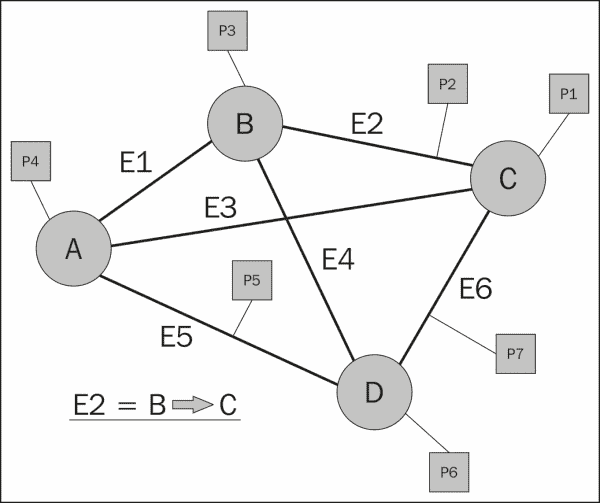
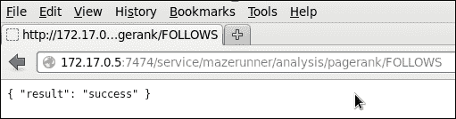
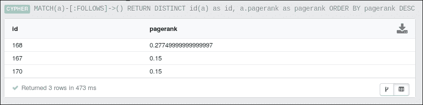
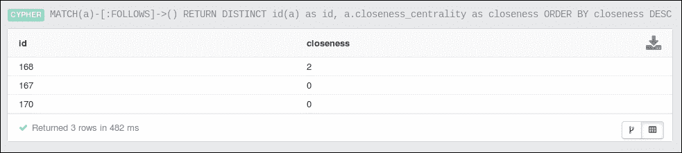
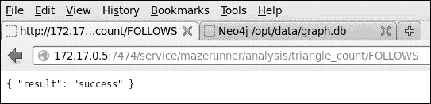
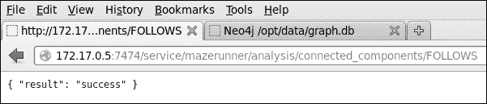
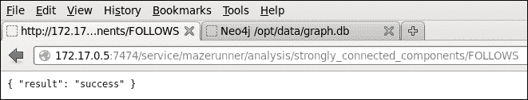

# 第五章：Apache Spark GraphX

在本章中，我想研究一下 Apache Spark GraphX 模块，以及一般的图形处理。 我还想通过查看名为 Neo4j 的图形数据库来简要介绍一下基于图形的存储。 因此，本章将涵盖以下主题：

*   GraphX 编码
*   Neo4j 的 MazerRunner

用 Scala 编写的 GraphX 编码部分将提供一系列图形编码示例。 Kenny Bastani 在Kenny Bastani 的实验产品 MazerRunner 上进行的工作将这两个主题结合在一个实际示例中。 它提供了一个示例原型-基于 Docker 在 Apache Spark GraphX 和 Neo4j 存储之间复制数据。

在用 Scala 编写使用 Spark GraphX 模块的代码之前，我认为从图形处理的角度概述一下图形的实际情况会很有用。 以下部分使用几个简单的图表作为示例进行简要介绍。

# 概述

图可以被认为是一种数据结构，它由一组顶点和连接这些顶点的边组成。 图中的顶点或节点可以是对象，也可以是人，边是它们之间的关系。 边可以是方向性的，这意味着关系从一个节点操作到下一个节点。 例如，节点 A 是节点 B 的父亲。

在下图中，圆表示顶点或节点(**A**到**D**)，而粗线表示边或边之间的关系(**E1**到**E6**)。 每个节点或边可以具有属性，并且这些值由关联的灰色方块(**P1**到**P7**)表示。

因此，如果图表示用于路线查找的物理路线图，则边可能表示次要道路或高速公路。 这些节点将是高速公路交叉口或道路交叉口。 节点和边缘属性可能是道路类型、速度限制、距离以及成本和栅格位置。

有许多类型的图形实现，但是一些例子是欺诈建模、金融货币交易建模、社交建模(就像 Facebook 上的朋友对朋友的连接)、地图处理、网页处理和页面排名。



上图显示了具有关联属性的图形的一般示例。 它还表明边关系可以是定向的，即**E2**边从节点**B**作用到节点**C**。 但是，下面的示例使用族成员及其之间的关系来创建图表。 请注意，两个节点或顶点之间可以有多条边。 例如，**Mike**和**Sarah**之间的夫妻关系。 此外，一个节点或边可能有多个属性。


因此，在前面的示例中，**Sister**属性从节点 6**Flo**作用到节点 1**Mike**。 这些是简单的图表，用来解释图表的结构和元素性质。 真实的图形应用程序可以达到极限大小，并且需要分布式处理和存储来使它们能够被操纵。 Facebook能够使用**Apache Giraph**处理包含超过 1 万亿条边的图形(来源：Avery Ching-Facebook)。 Giraph 是一个用于图形处理的 Apache Hadoop 生态系统工具，历史上它的处理基于 Map Reduce，但现在使用 TinkerPop，这将在[第 6 章](6.html "Chapter 6. Graph-based Storage")，*基于图形的存储*中介绍。 虽然这本书集中在 Apache Spark 上，但边的数量提供了一个非常令人印象深刻的指示器，表明一个图可以达到的大小。

在下一节中，我将研究如何使用 Scala 使用 Apache Spark GraphX 模块。

# 图形 X 编码

本节将使用上一节中显示的家庭关系图数据示例研究 Scala 中的 Apache Spark GraphX 编程。 此数据将存储在 HDFS 上，并将作为顶点和边的列表进行访问。 虽然这个数据集很小，但是您用这种方式构建的图可能非常大。 我将 HDFS 用于存储，因为如果您的图形扩展到大数据规模，那么您将需要某种类型的分布式冗余存储。 如本章示例所示，这可能是 HDFS。 使用 Apache Spark SQL 模块，存储也可以是 Apache Have；有关详细信息，请参阅[第 4 章](4.html "Chapter 4. Apache Spark SQL")、*Apache Spark SQL*。

## 环境

我已经使用服务器`hc2nn`上的 Hadoop Linux 帐户来开发基于 Scala 的 GraphX 代码。 SBT 编译的结构遵循与前面示例相同的模式，代码树位于名为`graphx`的子目录中，其中驻留有名为`graph.sbt`的`sbt`配置文件：

```scala
[hadoop@hc2nn graphx]$ pwd
/home/hadoop/spark/graphx

[hadoop@hc2nn graphx]$ ls
 src   graph.sbt          project     target

```

不出所料，源代码位于该级别的子树`src/main/scala`下，并包含五个代码示例：

```scala
[hadoop@hc2nn scala]$ pwd
/home/hadoop/spark/graphx/src/main/scala

[hadoop@hc2nn scala]$ ls
graph1.scala  graph2.scala  graph3.scala  graph4.scala  graph5.scala

```

在每个基于图形的示例中，Scala 文件使用相同的代码从 HDFS 加载数据并创建图形；但是，每个文件提供了基于 GraphX 的图形处理的不同方面。 由于本章使用的是不同的 Spark 模块，因此已更改`sbt`配置文件`graph.sbt`以支持此工作：

```scala
[hadoop@hc2nn graphx]$ more graph.sbt

name := "Graph X"

version := "1.0"

scalaVersion := "2.10.4"

libraryDependencies += "org.apache.hadoop" % "hadoop-client" % "2.3.0"

libraryDependencies += "org.apache.spark" %% "spark-core"  % "1.0.0"

libraryDependencies += "org.apache.spark" %% "spark-graphx" % "1.0.0"

// If using CDH, also add Cloudera repo
resolvers += "Cloudera Repository" at https://repository.cloudera.com/artifactory/cloudera-repos/

```

前面通过 linux`more`命令显示了`graph.sbt`文件的内容。 在前面的示例中，这里只有两处需要注意的更改-Name 的值已更改以表示内容。 此外，更重要的是，Spark GraphX 1.0.0 库被添加为库依赖项。

在 HDFS 上的`/data/spark/graphx/`目录下放置了两个数据文件。 它们包含将用于此部分的数据(根据顶点和构成图形的边)。 如 hadoop file system`ls`命令接下来所示，这些文件名为`graph1_edges.cvs`和`graph1_vertex.csv`：

```scala
[hadoop@hc2nn scala]$ hdfs dfs -ls /data/spark/graphx
Found 2 items
-rw-r--r--   3 hadoop supergroup        129 2015-03-01 13:52 /data/spark/graphx/graph1_edges.csv
-rw-r--r--   3 hadoop supergroup         59 2015-03-01 13:52 /data/spark/graphx/graph1_vertex.csv

```

下面通过 Hadoop file system`cat`命令显示的`vertex`文件只包含 6 行，表示上一节中使用的图形。 每个顶点代表一个人，并且有一个顶点 ID 号、一个名字和一个年龄值：

```scala
[hadoop@hc2nn scala]$ hdfs dfs -cat /data/spark/graphx/graph1_vertex.csv
1,Mike,48
2,Sarah,45
3,John,25
4,Jim,53
5,Kate,22
6,Flo,52

```

边文件包含源顶点 ID、目标顶点 ID 和关系形式的一组有向边值。 因此，记录一在`Flo`和`Mike`之间形成姐妹关系：

```scala
[hadoop@hc2nn scala]$  hdfs dfs -cat /data/spark/graphx/graph1_edges.csv
6,1,Sister
1,2,Husband
2,1,Wife
5,1,Daughter
5,2,Daughter
3,1,Son
3,2,Son
4,1,Friend
1,5,Father
1,3,Father
2,5,Mother
2,3,Mother

```

在解释了 SBT 环境和基于 HDFS 的数据之后，我们现在准备研究一些 GraphX 代码示例。 与前面的示例一样，可以从`graphx`子目录编译和打包代码，如下所示。 这将创建一个名为`graph-x_2.10-1.0.jar`的 JAR，可以在其中运行示例应用程序：

```scala
[hadoop@hc2nn graphx]$ pwd
/home/hadoop/spark/graphx

[hadoop@hc2nn graphx]$  sbt package

Loading /usr/share/sbt/bin/sbt-launch-lib.bash
[info] Set current project to Graph X (in build file:/home/hadoop/spark/graphx/)
[info] Compiling 5 Scala sources to /home/hadoop/spark/graphx/target/scala-2.10/classes...
[info] Packaging /home/hadoop/spark/graphx/target/scala-2.10/graph-x_2.10-1.0.jar ...
[info] Done packaging.
[success] Total time: 30 s, completed Mar 3, 2015 5:27:10 PM

```

## 创建图表

本节将解释从基于 HDFS 的数据创建 GraphX 图形之前的通用 Scala 代码。 这将节省时间，因为在每个示例中都重用了相同的代码。 解释完这一点后，我将重点介绍每个代码示例中的实际基于图形的操作：

通用代码首先导入 Spark 上下文、Graphx 和 RDD 功能，以便在 Scala 代码中使用：

```scala
import org.apache.spark.SparkContext
import org.apache.spark.SparkContext._
import org.apache.spark.SparkConf

import org.apache.spark.graphx._
import org.apache.spark.rdd.RDD
```

然后，定义了一个应用程序，它扩展了`App`类，并且对于每个示例，应用程序名称从`graph1`更改为`graph5`。 使用`spark-submit`运行应用程序时将使用此应用程序名称：

```scala
object graph1 extends App
{
```

数据文件是根据 HDFS 服务器和端口、它们在 HDFS 中所在的路径以及它们的文件名来定义的。 如前所述，有两个数据文件包含`vertex`和`edge`信息：

```scala
  val hdfsServer = "hdfs://hc2nn.semtech-solutions.co.nz:8020"
  val hdfsPath   = "/data/spark/graphx/"
  val vertexFile = hdfsServer + hdfsPath + "graph1_vertex.csv"
  val edgeFile   = hdfsServer + hdfsPath + "graph1_edges.csv"
```

Spark Master URL 已定义，应用程序名称也是如此，当应用程序运行时，它将出现在 Spark 用户界面中。 将创建一个新的 Spark 配置对象，并为其分配 URL 和名称：

```scala
  val sparkMaster = "spark://hc2nn.semtech-solutions.co.nz:7077"
  val appName = "Graph 1"
  val conf = new SparkConf()
  conf.setMaster(sparkMaster)
  conf.setAppName(appName)
```

使用刚才定义的配置创建新的 Spark Context：

```scala
  val sparkCxt = new SparkContext(conf)
```

然后，使用`sparkCxt.textFile`方法将基于 HDFS 的文件中的顶点信息加载到名为`vertices`的基于 RDD 的结构中。 数据存储为长`VertexId`和表示人名和年龄的字符串。 数据行用逗号分隔，因为这是基于 CSV 的数据：

```scala
  val vertices: RDD[(VertexId, (String, String))] =
      sparkCxt.textFile(vertexFile).map { line =>
        val fields = line.split(",")
        ( fields(0).toLong, ( fields(1), fields(2) ) )
  }
```

类似地，基于 HDFS 的边缘数据被加载到称为`edges`的基于 RDD 的数据结构中。 基于 CSV 的数据再次按逗号拆分。 前两个数据值被转换为长值，因为它们表示源和目标顶点 ID。最后一个值表示边的关系，保留为字符串。 请注意，RDD 结构边中的每条记录现在实际上是`Edge`条记录：

```scala
  val edges: RDD[Edge[String]] =
      sparkCxt.textFile(edgeFile).map { line =>
        val fields = line.split(",")
        Edge(fields(0).toLong, fields(1).toLong, fields(2))
  }
```

如果连接或顶点缺失，则定义默认值，然后根据基于 RDD 的结构-`vertices`、`edges`和`default`记录构建图形：

```scala
  val default = ("Unknown", "Missing")
  val graph = Graph(vertices, edges, default)
```

这将创建一个名为`graph`的基于 GraphX 的结构，现在每个示例都可以使用该结构。 请记住，尽管这些数据样本很小，但您可以使用此方法创建非常大的图表。 这些算法中有许多是迭代应用程序，例如 PageRank 和 Triangle Count，因此，程序将生成许多迭代 Spark 作业。

## 示例 1-计数

图已经加载，我们知道数据文件中的数据量，但是实际图本身中的顶点和边的数据内容又如何呢？ 使用顶点和边计数函数提取此信息非常简单，如下所示：

```scala
  println( "vertices : " + graph.vertices.count )
  println( "edges    : " + graph.edges.count )
```

使用示例名称和前面创建的 JAR 文件运行`graph1`示例将提供计数信息。 提供主 URL 以连接到 Spark 集群，并为 Executor 内存提供一些默认参数，以及 Executor 内核总数：

```scala
spark-submit \
  --class graph1 \
  --master spark://hc2nn.semtech-solutions.co.nz:7077  \
  --executor-memory 700M \
  --total-executor-cores 100 \
 /home/hadoop/spark/graphx/target/scala-2.10/graph-x_2.10-1.0.jar
```

名为`graph1`的 Spark 群集作业提供以下输出，这与预期不谋而合，而且它与数据文件相匹配：

```scala
vertices : 6
edges    : 12

```

## 示例 2-过滤

如果我们需要从主图创建子图，并根据人的年龄或关系进行过滤，会发生什么情况呢？ 第二个示例 Scala 文件`graph2`中的示例代码展示了如何做到这一点：

```scala
  val c1 = graph.vertices.filter { case (id, (name, age)) => age.toLong > 40 }.count

  val c2 = graph.edges.filter { case Edge(from, to, property)
    => property == "Father" | property == "Mother" }.count

  println( "Vertices count : " + c1 )
  println( "Edges    count : " + c2 )
```

这两个示例计数是从主图创建的。 第一种算法根据年龄对基于人的顶点进行过滤，只对年龄大于 40 岁的人进行过滤。 请注意，存储为字符串的`age`值已转换为长整型进行比较。 上一个第二个示例过滤`Mother`或`Father`的 Relationship 属性上的边。 将创建两个计数值`c1`和`c2`，并将其打印为如下所示的 Spark 输出：

```scala
Vertices count : 4
Edges    count : 4

```

## 示例 3-PageRank

PageRank 算法为图中的每个顶点提供排名值。 它假设连接到最多边的个顶点是最重要的顶点。 搜索引擎使用 PageRank 为 Web 搜索期间的页面显示提供排序：

```scala
  val tolerance = 0.0001
  val ranking = graph.pageRank(tolerance).vertices
  val rankByPerson = vertices.join(ranking).map {
    case (id, ( (person,age) , rank )) => (rank, id, person)
  }
```

前面的示例代码创建了一个`tolerance`值，并使用它调用 graph`pageRank`方法。 然后将顶点排序到新的值排序中。 为了使排序更有意义，将排名值与原始顶点 RDD 连接。 然后，`rankByPerson`值包含排名、顶点 ID 和人名。

保存在`rankByPerson`中的 PageRank 结果随后被逐条记录打印，使用 CASE 语句标识记录内容，并使用 FORMAT 语句打印内容。 我这样做是因为我想定义排名值的格式，该格式可能会有所不同：

```scala
  rankByPerson.collect().foreach {
    case (rank, id, person) =>
      println ( f"Rank $rank%1.2f id $id person $person")
  }
```

应用程序的输出随后显示在此处。 不出所料，`Mike`和`Sarah`的排名最高，因为它们拥有最多的关系：

```scala
Rank 0.15 id 4 person Jim
Rank 0.15 id 6 person Flo
Rank 1.62 id 2 person Sarah
Rank 1.82 id 1 person Mike
Rank 1.13 id 3 person John
Rank 1.13 id 5 person Kate

```

## 示例 4-三角计数

三角形计数算法提供与该顶点相关联的三角形数量的基于顶点的计数。 例如，顶点`Mike`(1)连接到`Kate`(5)，后者连接到`Sarah`(2)；`Sarah`连接到`Mike`(1)，因此形成三角形。 这对于路径查找非常有用，因为需要生成最小的、无三角形的生成树图来进行路径规划。

执行三角形计数并打印它的代码很简单，如下所示。 对图形顶点执行 graph`triangleCount`方法。 结果保存在值`tCount`中，然后打印：

```scala
  val tCount = graph.triangleCount().vertices
  println( tCount.collect().mkString("\n") )
```

应用程序作业的结果显示，名为`Flo`(4)和`Jim`(6)的顶点没有三角形，而`Mike`(1)和`Sarah`(2)具有最多的三角形，因为它们具有最多的关系：

```scala
(4,0)
(6,0)
(2,4)
(1,4)
(3,2)
(5,2)

```

## 示例 5-连接的组件

当从数据创建一个大图时，它可能包含未连接的子图，即相互隔离的子图，并且它们之间不包含桥接或连接边。 该算法提供了这种连通性的度量。 根据您的处理情况，了解所有顶点都已连接可能很重要。

在本例中，Scala 代码调用两个 graph 方法：`connectedComponents`和`stronglyConnectedComponents`。 强方法需要最大迭代计数，该计数已设置为`1000`。 这些计数作用于图形顶点：

```scala
  val iterations = 1000
  val connected  = graph.connectedComponents().vertices
  val connectedS = graph.stronglyConnectedComponents(iterations).vertices
```

然后，将顶点计数与原始顶点记录相结合，以便连接计数可以与顶点信息相关联，例如人名：

```scala
  val connByPerson = vertices.join(connected).map {
    case (id, ( (person,age) , conn )) => (conn, id, person)
  }

  val connByPersonS = vertices.join(connectedS).map {
    case (id, ( (person,age) , conn )) => (conn, id, person)
  }
The results are then output using a case statement, and formatted printing:
  connByPerson.collect().foreach {
    case (conn, id, person) =>
      println ( f"Weak $conn  $id $person" )
  }
```

正如`connectedComponents`算法所预期的那样，结果显示，对于每个顶点，只有一个分量。 这意味着所有顶点都是单个图形的成员，如本章前面的图表所示：

```scala
Weak 1  4 Jim
Weak 1  6 Flo
Weak 1  2 Sarah
Weak 1  1 Mike
Weak 1  3 John
Weak 1  5 Kate

```

`stronglyConnectedComponents`方法考虑到它们之间关系的方向，给出了图中连通性的度量。 `stronglyConnectedComponents`算法输出的结果如下：

```scala
  connByPersonS.collect().foreach {
    case (conn, id, person) =>
      println ( f"Strong $conn  $id $person" )
  }
```

您可能从图中注意到，关系`Sister`和`Friend`从顶点`Flo`(6)和`Jim`(4)到`Mike`(1)起作用，如下面的边和顶点数据所示：

```scala
6,1,Sister
4,1,Friend

1,Mike,48
4,Jim,53
6,Flo,52

```

因此，强方法的输出显示，对于大多数顶点，第二列中只有一个由`1`表示的图组件。 但是，由于顶点`4`和`6`的关系方向，它们是不可达的，因此它们具有顶点 ID 而不是组件 ID：

```scala
Strong 4  4 Jim
Strong 6  6 Flo
Strong 1  2 Sarah
Strong 1  1 Mike
Strong 1  3 John
Strong 1  5 Kate

```

# Neo4j 的 MazerRunner

在前面的小节中，我们已经向您展示了如何用 Scala 编写 Apache Spark Graphx 代码来处理基于 HDFS 的图形数据。 您已经能够执行基于图形的算法，例如 PageRank 和三角形计数。 然而，这种方法有其局限性。 Spark 没有存储空间，将基于图形的数据存储在 HDFS 上的平面文件中不允许您在其存储位置操作它。 例如，如果您的数据存储在关系数据库中，则可以使用 SQL 就地查询它。 像 Neo4j 这样的数据库是图形数据库。 这意味着它们的存储机制和数据访问语言作用于图形。 在本节中，我想看看在 Mazerunner 上所做的工作，Mazerunner 是由 Kenny Bastani 创建的 GraphX Neo4j 处理原型。

下图描述了 MazerRunner 架构。 它显示 Neo4j 中的数据被导出到 HDFS，并由 GraphX 通过通知过程进行处理。 然后，GraphX 数据更新将作为键值更新列表保存回 HDFS。 然后将这些更改传播到 Neo4j 进行存储。 此原型体系结构中的算法通过基于 REST 的 HTTP URL 进行访问，稍后将进行说明。 不过，这里的重点是，算法可以通过在 Graphx 中进行处理来运行，但是数据更改可以通过 Neo4j 数据库密码语言查询来检查。 肯尼的工作和更多细节可以在：[http://www.kennybastani.com/2014/11/using-apache-spark-and-neo4j-for-big.html](http://www.kennybastani.com/2014/11/using-apache-spark-and-neo4j-for-big.html)上找到。

本节将致力于解释 MazerRunner 架构，并通过一个示例说明如何使用它。 此体系结构提供了基于 GraphX 的处理和基于图形的存储的独特示例。


## 安装 Docker

通过[https://github.com/kbastani/neo4j-mazerunner](https://github.com/kbastani/neo4j-mazerunner)描述了安装 MazerRunner 示例代码的过程。

我使用 64 位 LinuxCentOS 6.5 计算机`hc1r1m1`进行安装。 Mazerunner 示例使用 Docker 工具，该工具创建占用空间较小的虚拟容器，用于运行本例中的 HDFS、Neo4j 和 Mazerunner。 首先，我必须安装 Docker。 我已经通过`yum`命令使用 Linux root 用户完成了这项工作，如下所示。 第一个命令安装`docker-io`模块(扩展坞名称已被另一个应用程序用于CentOS 6.5)：

```scala
[root@hc1r1m1 bin]# yum -y install docker-io

```

我需要启用`public_ol6_latest`存储库，并安装`device-mapper-event-libs`包，因为我发现我安装的当前 lib-device-mapper 没有导出 Docker 所需的符号库。 我以`root`的身份执行了以下命令：

```scala
[root@hc1r1m1 ~]# yum-config-manager --enable public_ol6_latest
[root@hc1r1m1 ~]# yum install device-mapper-event-libs

```

我遇到的实际错误如下：

```scala
/usr/bin/docker: relocation error: /usr/bin/docker: symbol dm_task_get_info_with_deferred_remove, version Base not defined in file libdevmapper.so.1.02 with link time reference

```

然后，我可以通过使用以下调用检查 Docker 版本号来检查 Docker 是否会运行：

```scala
[root@hc1r1m1 ~]# docker version
Client version: 1.4.1
Client API version: 1.16
Go version (client): go1.3.3
Git commit (client): 5bc2ff8/1.4.1
OS/Arch (client): linux/amd64
Server version: 1.4.1
Server API version: 1.16
Go version (server): go1.3.3
Git commit (server): 5bc2ff8/1.4.1

```

我可以使用以下服务命令启动 Linux docker 服务。 我还可以使用以下`chkconfig`命令强制 Docker 在 Linux 服务器启动时启动：

```scala
[root@hc1r1m1 bin]# service docker start
[root@hc1r1m1 bin]# chkconfig docker on

```

然后可以下载三个 Docker 映像(HDFS、Mazerunner 和 Neo4j)。 它们很大，因此这可能需要一些时间：

```scala
[root@hc1r1m1 ~]# docker pull sequenceiq/hadoop-docker:2.4.1
Status: Downloaded newer image for sequenceiq/hadoop-docker:2.4.1

[root@hc1r1m1 ~]# docker pull kbastani/docker-neo4j:latest
Status: Downloaded newer image for kbastani/docker-neo4j:latest

[root@hc1r1m1 ~]# docker pull kbastani/neo4j-graph-analytics:latest
Status: Downloaded newer image for kbastani/neo4j-graph-analytics:latest

```

下载后，可以按以下顺序启动 Docker容器：HDFS、Mazerunner，然后是 Neo4j。 将加载默认的 Neo4j 电影数据库，并使用该数据运行 MazerRunner 算法。 HDFS 容器按如下方式启动：

```scala
[root@hc1r1m1 ~]# docker run -i -t --name hdfs sequenceiq/hadoop-docker:2.4.1 /etc/bootstrap.sh –bash

Starting sshd:                                [  OK  ]
Starting namenodes on [26d939395e84]
26d939395e84: starting namenode, logging to /usr/local/hadoop/logs/hadoop-root-namenode-26d939395e84.out
localhost: starting datanode, logging to /usr/local/hadoop/logs/hadoop-root-datanode-26d939395e84.out
Starting secondary namenodes [0.0.0.0]
0.0.0.0: starting secondarynamenode, logging to /usr/local/hadoop/logs/hadoop-root-secondarynamenode-26d939395e84.out
starting yarn daemons
starting resourcemanager, logging to /usr/local/hadoop/logs/yarn--resourcemanager-26d939395e84.out
localhost: starting nodemanager, logging to /usr/local/hadoop/logs/yarn-root-nodemanager-26d939395e84.out

```

Mazerunner 服务容器按如下方式启动：

```scala
[root@hc1r1m1 ~]# docker run -i -t --name mazerunner --link hdfs:hdfs kbastani/neo4j-graph-analytics

```

输出很长，所以我不会在这里全部介绍，但是您不会看到任何错误。 还会出现一行信息，表示安装程序正在等待消息：

```scala
[*] Waiting for messages. To exit press CTRL+C

```

为了启动 Neo4j 容器，我需要安装程序为我创建一个新的 Neo4j 数据库，因为这是第一次安装。 否则，在重新启动时，我将只提供数据库目录的路径。 使用`link`命令，Neo4j 容器链接到 HDFS 和 Mazerunner 容器：

```scala
[root@hc1r1m1 ~]# docker run -d -P -v /home/hadoop/neo4j/data:/opt/data --name graphdb --link mazerunner:mazerunner --link hdfs:hdfs kbastani/docker-neo4j

```

通过检查`neo4j/data`路径，我现在可以看到已经创建了一个名为`graph.db`的数据库目录：

```scala
[root@hc1r1m1 data]# pwd
/home/hadoop/neo4j/data

[root@hc1r1m1 data]# ls
graph.db

```

然后，我可以使用下面的`docker inspect`命令，基于容器的 IP 地址和基于 Docker 的 Neo4j 容器使其可用。 `inspect`命令为我提供访问 Neo4j 容器所需的本地 IP 地址。 `curl`命令以及端口号(我从 Kenny 的网站了解到)将默认为`7474`，它向我显示 REST 接口正在运行：

```scala
[root@hc1r1m1 data]# docker inspect --format="{{.NetworkSettings.IPAddress}}" graphdb
172.17.0.5

[root@hc1r1m1 data]# curl  172.17.0.5:7474
{
 "management" : "http://172.17.0.5:7474/db/manage/",
 "data" : "http://172.17.0.5:7474/db/data/"
}

```

## Neo4j 浏览器

本部分的其余工作现在将使用 Neo4j 浏览器 URL执行，如下所示：

`http://172.17.0.5:7474/browser`。

这是可从`hc1r1m1`服务器访问的基于 Docker 的本地 IP地址。 如果没有进一步的网络配置，它将在本地 Intranet 的其余部分不可见。

这将显示默认的 Neo4j 浏览器页面。 可以按照此处的电影链接，选择 Cypher 查询并执行它来安装 Movie 图形。


然后可以使用 Cypher 查询来查询数据，这将在下一章中进行更深入的研究。 下面的图与它们相关联的 Cypher 查询一起提供，目的是说明数据可以以图形的形式访问，这些图形以可视方式显示。 第一个图表显示了一个简单的 Person to Movie 关系，关系详细信息显示在连接边上。


第二个图是 Neo4j 功能的可视化示例，它显示了一个复杂得多的密码查询和结果图。 此图说明它包含 135 个节点和 180 个关系。 从处理的角度来看，这些数字相对较小，但很明显，图表正在变得复杂。


下图显示了通过 HTTP REST URL 调用的 Mazerunner 示例算法。 调用由要调用的算法和它将作用于图中的属性定义：

`http://localhost:7474/service/mazerunner/analysis/{algorithm}/{attribute}`。

例如，如下一节所示，这个通用 URL 可以通过设置`algorithm=pagerank`来运行 PageRank 算法。 该算法将通过设置`attribute=FOLLOWS`来对`follows`关系进行操作。 下一节将通过 Cypher 输出的示例展示如何运行每个 Mazerunner 算法。

## MazerRunner 算法

本节展示如何使用基于 REST 的 HTTP URL 运行Mazerunner 示例算法，如上一节所示。 其中许多算法已经在本章中进行了研究和编码。 请记住，本节中发生的有趣之处在于，数据从 Neo4j 开始，在 Spark 上使用 GraphX 进行处理，然后更新回 Neo4j。 这看起来很简单，但是所有的工作都是由底层流程完成的。 在每个示例中，算法添加到图中的属性都是通过 Cypher 查询来查询的。 因此，每个示例都不是关于查询的，而是发生了对 Neo4j 的数据更新。

### PageRank 算法

第一个调用显示了PageRank 算法，并将 PageRank 属性添加到电影图形中。 与前面的一样，PageRank 算法根据每个顶点有多少个边连接来给它一个排名。 在本例中，它使用`FOLLOWS`关系进行处理。



下图显示了 PageRank 算法结果的屏幕截图。 图像顶部的文本(以`MATCH`开头)显示了 Cypher 查询，这证明 PageRank 属性已添加到图形中。



### 贴近中心性算法

贴近度算法试图确定图中最重要的顶点。 在本例中，`closeness`属性已添加到图形中。


下图显示了 Closeess 算法结果的屏幕截图。 图像顶部的文本(以`MATCH`开始)显示Cypher 查询，这证明已将`closeness_centrality`属性添加到图形中。 请注意，在此 Cypher 查询中使用了名为`closeness`的别名来表示`closeness_centrality`属性，因此输出更加直观。



### 三角形计数算法

`triangle_count`算法被用来计算与顶点相关联的三角形。 使用了`FOLLOWS`关系，并将`triangle_count`属性添加到图形中。



下图显示了三角形算法结果的屏幕截图。 图像顶部的文本(以`MATCH`开始)显示了 Cypher 查询，这证明已经将`triangle_count`属性添加到了图形中。 请注意，在这个密码查询中使用了名为**tcount**的别名来表示`triangle_count`属性，因此输出更加直观。


### 连通分量算法

Connected Components算法是对图形数据中存在多少实际组件的度量。 例如，数据可能包含两个之间没有路由的子图。 在本例中，`connected_components`属性已添加到图形中。



下图显示了连通分量算法结果的屏幕截图。 图像顶部的文本(以`MATCH`开始)显示了 Cypher 查询，这证明`connected_components`属性已添加到图形中。 注意，这个循环查询中使用了别名**ccomp**来表示`connected_components`属性，因此输出更加直观。


### 强连通分量算法

强连通分量算法与连通分量算法非常相似。 子图形是使用方向`FOLLOWS`关系从图形数据创建的。 将创建多个子图，直到使用完所有图形组件。 这些子图形成强连通分量。 如下所示，`strongly_connected_components`属性已添加到图形中：



下图显示了强连接分量算法结果的屏幕截图。 图像顶部的文本(以`MATCH`开始)显示了圆号查询，这证明已将`strongly_connected_components`连接组件特性添加到图形中。 注意，这个循环查询中使用了别名**sccomp**来表示`strongly_connected_components`属性，因此输出更加直观。


# 摘要

本章通过示例说明了如何在 Apache Spark 中使用基于 Scala 的代码调用 GraphX 算法。 之所以使用 Scala，是因为它开发示例所需的代码更少，从而节省了时间。 可以使用基于 Scala 的 shell，并且可以将代码编译成 Spark 应用程序。 使用 SBT 工具提供了应用程序编译和配置的示例。 本章中的配置和代码示例也可随书下载。

最后，介绍了针对 Neo4j 和 Apache Spark 的 Mazerunner 示例架构(由 Kenny Bastani 在 Neo 开发)。 为什么 MazerRunner 很重要？ 它提供了一个示例，说明如何将基于图形的数据库用于图形存储，而将 Apache Spark 用于图形处理。 我现在并不建议在生产场景中使用 MazerRunner。 显然，要使该架构为发布做好准备，还需要做更多的工作。 然而，当基于图的存储与分布式环境中的基于图的处理相关联时，它提供了使用查询语言(如来自 Neo4j 的 Cypher)查询数据的选项。

我希望你觉得这一章很有用。 下一章将更深入地研究基于图形的存储。 现在，您可以深入研究 GraphX 编码，尝试运行提供的示例，并尝试修改代码，以便熟悉开发过程。