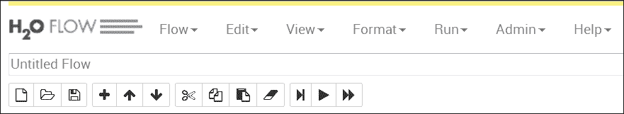
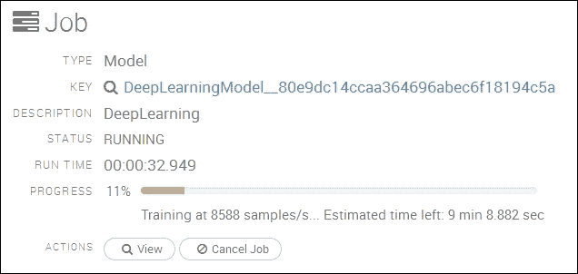
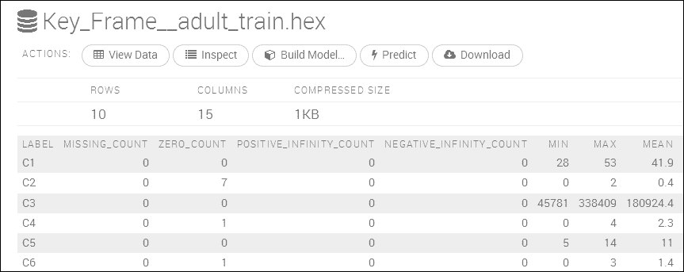
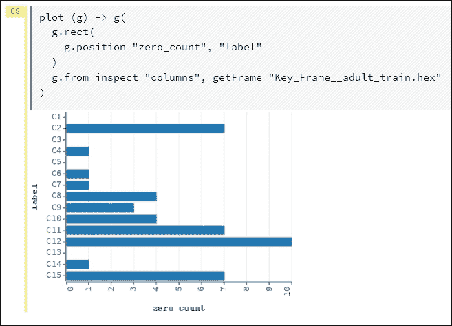
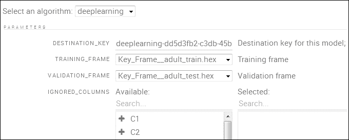
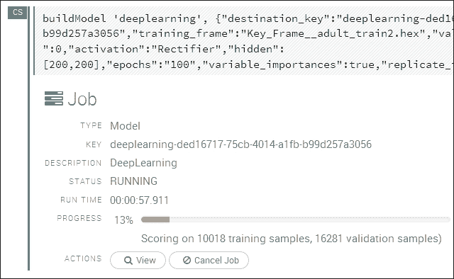
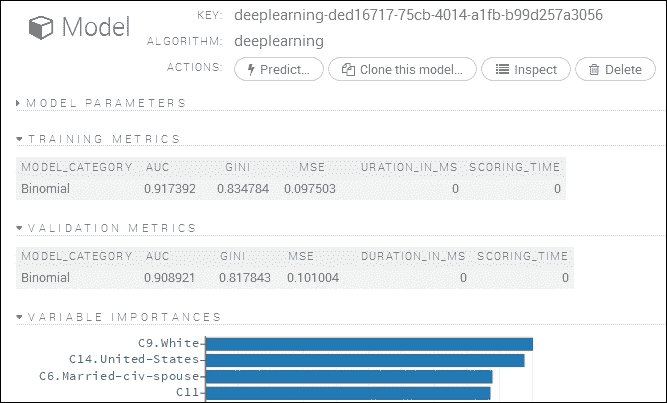
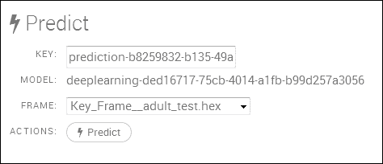

# 七、使用H2O 扩展Spark

H2O 是一个开源的源代码系统，由[http://h2o.ai/](http://h2o.ai/)用 Java 语言开发，用于机器学习。 它提供了一套丰富的机器学习算法，以及一个基于网络的数据处理用户界面。 它提供了使用多种语言进行开发的能力：Java、Scala、Python 和 R。它还能够与 Spark、HDFS、Amazon S3、SQL 和 NoSQL 数据库接口。 本章将集中讨论 H2O 与 Apache Spark 的集成，使用 H2O 的**闪光水**组件。 将使用一个用 Scala 开发的简单示例，基于真实数据创建深度学习模型。 本章将：

*   检查 H2O 功能
*   考虑必要的Spark H2O 环境
*   审视波光粼粼的水建筑
*   介绍和使用 H2O 流动界面
*   举例介绍深度学习
*   考虑性能调整
*   检查数据质量

下一步将概述 H2O 功能，以及本章将使用的闪亮水架构。

# 概述

由于在本章中只能检查和使用少量的 H2O 功能，我认为提供一个它涵盖的所有功能领域的列表会很有用。 此列表取自[http://h2o.ai/](http://h2o.ai/)网站[http://h2o.ai/product/algorithms/](http://h2o.ai/product/algorithms/)，基于对数据进行管理/争论、使用数据进行建模以及对生成的模型进行评分：

<colgroup><col style="text-align: left"> <col style="text-align: left"> <col style="text-align: left"></colgroup> 
| 

对…进行加工 / 审核 / 检查

 | 

模型 / 模式 / 模范 / 时装模特儿

 | 

评分工具

 |
| --- | --- | --- |
| 数据分析 | 广义线性模型(GLM) | 断言 / 预言 / 预计 / 预知 |
| 汇总统计信息 | 决策树 | 混淆矩阵 |
| 聚合、筛选、绑定和派生列 | 梯度增压(GBM) | 罗马纪元 |
| 切片、日志转换和匿名化 | K-均值 | 命中率 |
| 变量创建 | 异常检测 | PCA 评分 |
| 主成分分析 | 深度学习 | 多模型评分 |
| 培训和验证抽样计划 | Naïve Bayes |   |
|   | 网格搜索 |   |

下一节将解释本章中 Spark 和 H2O 示例所使用的环境，还将解释遇到的一些问题。

# 加工环境

如果你们中的任何人看过我的基于 Web 的博客，或者读过我的第一本书*Big Data Make Easy*，你们就会看到我对大数据集成以及大数据工具如何连接感兴趣。 这些系统都不是孤立存在的。 数据将从上游开始，在 Spark Plus H2O 中处理，然后结果将被存储，或移动到 ETL 链的下一步。 根据本例中的这个想法，我将使用 Cloudera CDH HDFS 进行存储，并从那里获取我的数据。 我可以很容易地使用 S3，一个 SQL 或 NoSQL 数据库。

在开始本章的开发工作时，我已经安装并运行了 Cloudera CDH 4.1.3 集群。 我还安装了各种 Spark 版本，并且可以使用。 这些建议如下：

*   作为 CentOS 服务安装的 Spark 1.0
*   下载并安装 Spark 1.2 二进制文件
*   从源快照构建的 Spark 1.3

我想我应该尝试一下，看看 Spark 和 Hadoop 的哪种组合可以一起工作。 我在[http://h2o-release.s3.amazonaws.com/sparkling-water/master/98/index.html](http://h2o-release.s3.amazonaws.com/sparkling-water/master/98/index.html)下载了苏打水，并使用了 0.2.12-95 版本。 我发现 1.0 版的 Spark 支持 H2O，但缺少 Spark 库。 许多闪亮的基于水的示例中使用的一些功能都是可用的。 Spark 版本 1.2 和 1.3 导致出现以下错误：

```scala
15/04/25 17:43:06 ERROR netty.NettyTransport: failed to bind to /192.168.1.103:0, shutting down Netty transport
15/04/25 17:43:06 WARN util.Utils: Service 'sparkDriver' could not bind on port 0\. Attempting port 1.

```

Spark 主端口号虽然在 Spark 中配置正确，但没有被提取，因此基于 H2O 的应用无法连接到 Spark。 在与 H2O 的人讨论了这个问题后，我决定升级到 H2O认证版本的 Hadoop 和 Spark。 应使用的推荐系统版本可在[http://h2o.ai/product/recommended-systems-for-h2o/](http://h2o.ai/product/recommended-systems-for-h2o/)上找到。

我使用 Cloudera Manager 界面 Parcels 页面将 CDH 集群从版本 5.1.3 升级到版本 5.3。 这会自动提供 Spark 1.2-已集成到 CDH 集群中的版本。 这解决了所有与 H2O 相关的问题，并为我提供了 H2O 认证的 Hadoop 和 Spark 环境。

# 安装 H2O

为完整起见，我将向您展示我是如何下载、安装和使用 H2O 的。 虽然我最终选择了 0.2.12-95 版本，但我首先下载并使用了 0.2.12-92。 本部分基于较早的安装，但用于获取软件的方法是相同的。 下载链接会随着时间的推移而变化，因此请按照[http://h2o.ai/download/](http://h2o.ai/download/)上的苏泉水下载选项进行操作。

这将是压缩汽水释放的来源，如此处的 CentOS Linux 长文件清单所示：

```scala
[hadoop@hc2r1m2 h2o]$ pwd ; ls -l
/home/hadoop/h2o
total 15892
-rw-r--r-- 1 hadoop hadoop 16272364 Apr 11 12:37 sparkling-water-0.2.12-92.zip

```

使用 Linux`unzip`命令解压此压缩版本文件，它将生成一个闪闪发光的水版本文件树：

```scala
[hadoop@hc2r1m2 h2o]$ unzip sparkling-water-0.2.12-92.zip

[hadoop@hc2r1m2 h2o]$ ls -d sparkling-water*
sparkling-water-0.2.12-92  sparkling-water-0.2.12-92.zip

```

我已经使用 root 帐户将发布树移动到`/usr/local/`区域，并创建了一个名为`h2o`的简单符号链接。 这意味着我的基于 H2O 的构建可以引用这个链接，它不需要随着新版本的苏打水的来源而改变。 我还使用 linux`chmod`命令确保我的开发帐户 hadoop 有权访问该版本：

```scala
[hadoop@hc2r1m2 h2o]$ su -
[root@hc2r1m2 ~]# cd /home/hadoop/h2o
[root@hc2r1m2 h2o]# mv sparkling-water-0.2.12-92 /usr/local
[root@hc2r1m2 h2o]# cd /usr/local

[root@hc2r1m2 local]# chown -R hadoop:hadoop sparkling-water-0.2.12-92
[root@hc2r1m2 local]#  ln –s sparkling-water-0.2.12-92 h2o

[root@hc2r1m2 local]# ls –lrt  | grep sparkling
total 52
drwxr-xr-x   6 hadoop hadoop 4096 Mar 28 02:27 sparkling-water-0.2.12-92
lrwxrwxrwx   1 root   root     25 Apr 11 12:43 h2o -> sparkling-water-0.2.12-92

```

该版本已经安装在我的 Hadoop CDH 集群的所有节点上。

# 构建环境

从过去的示例中，您将知道我更喜欢将 SBT 作为开发 Scala 源代码示例的构建工具。 我已经使用 Hadoop 开发帐户在 Linux CentOS 6.5 服务器上创建了一个名为`hc2r1m2`的开发环境。 开发目录称为`h2o_spark_1_2`：

```scala
[hadoop@hc2r1m2 h2o_spark_1_2]$ pwd
/home/hadoop/spark/h2o_spark_1_2

```

我的名为`h2o.sbt`的 SBT 构建配置文件位于此处；它包含以下内容：

```scala
[hadoop@hc2r1m2 h2o_spark_1_2]$ more h2o.sbt

name := "H 2 O"

version := "1.0"

scalaVersion := "2.10.4"

libraryDependencies += "org.apache.hadoop" % "hadoop-client" % "2.3.0"

libraryDependencies += "org.apache.spark" % "spark-core"  % "1.2.0" from "file:///opt/cloudera/parcels/CDH-5.3.3-1.cdh5.3.3.p0.5/jars/spark-assembly-1.2.0-cdh5.3.3-hadoop2.5.0-cdh5.3.3.jar"

libraryDependencies += "org.apache.spark" % "mllib"  % "1.2.0" from "file:///opt/cloudera/parcels/CDH-5.3-1.cdh5.3.3.p0.5/jars/spark-assembly-1.2.0-cdh5.3.3-hadoop2.5.0-cdh5.3.3.jar"

libraryDependencies += "org.apache.spark" % "sql"  % "1.2.0" from "file:///opt/cloudera/parcels/CDH-5.3.3-1.cdh5.3.3.p0.5/jars/spark-assembly-1.2.0-cdh5.3.3-hadoop2.5.0-cdh5.3.3.jar"

libraryDependencies += "org.apache.spark" % "h2o"  % "0.2.12-95" from "file:///usr/local/h2o/assembly/build/libs/sparkling-water-assembly-0.2.12-95-all.jar"

libraryDependencies += "hex.deeplearning" % "DeepLearningModel"  % "0.2.12-95" from "file:///usr/local/h2o/assembly/build/libs/sparkling-water-assembly-0.2.12-95-all.jar"

libraryDependencies += "hex" % "ModelMetricsBinomial"  % "0.2.12-95" from "file:///usr/local/h2o/assembly/build/libs/sparkling-water-assembly-0.2.12-95-all.jar"

libraryDependencies += "water" % "Key"  % "0.2.12-95" from "file:///usr/local/h2o/assembly/build/libs/sparkling-water-assembly-0.2.12-95-all.jar"

libraryDependencies += "water" % "fvec"  % "0.2.12-95" from "file:///usr/local/h2o/assembly/build/libs/sparkling-water-assembly-0.2.12-95-all.jar"

```

在前面的章节中，我已经提供了 SBT 配置示例，因此我不会在这里逐行详细介绍。 我使用了基于文件的 URL 来定义库依赖关系，并从 Cloudera 包路径获取了用于 CDH 安装的 Hadoop JAR 文件。 闪亮的水罐路径被定义为刚刚创建的`/usr/local/h2o/`。

我在这个开发目录中使用一个名为`run_h2o.bash`的 Bash 脚本来执行我的基于 H2O 的示例代码。 它以应用类名称为参数，如下图所示：

```scala
[hadoop@hc2r1m2 h2o_spark_1_2]$ more run_h2o.bash

#!/bin/bash

SPARK_HOME=/opt/cloudera/parcels/CDH
SPARK_LIB=$SPARK_HOME/lib
SPARK_BIN=$SPARK_HOME/bin
SPARK_SBIN=$SPARK_HOME/sbin
SPARK_JAR=$SPARK_LIB/spark-assembly-1.2.0-cdh5.3.3-hadoop2.5.0-cdh5.3.3.jar

H2O_PATH=/usr/local/h2o/assembly/build/libs
H2O_JAR=$H2O_PATH/sparkling-water-assembly-0.2.12-95-all.jar

PATH=$SPARK_BIN:$PATH
PATH=$SPARK_SBIN:$PATH
export PATH

cd $SPARK_BIN

./spark-submit \
 --class $1 \
 --master spark://hc2nn.semtech-solutions.co.nz:7077  \
 --executor-memory 85m \
 --total-executor-cores 50 \
 --jars $H2O_JAR \
 /home/hadoop/spark/h2o_spark_1_2/target/scala-2.10/h-2-o_2.10-1.0.jar

```

这个 Spark 应用提交的示例已经介绍过了，所以我再一次不再详细介绍了。 将执行器内存设置为正确的值对于避免内存不足问题和性能问题至关重要。 这将在*性能调整*部分进行研究。

与前面的示例一样，应用 Scala 代码位于`development`目录级下的`src/main/scala`子目录中。 下一节将研究 Apache Spark 和 H2O 架构。

# 架构

本节中的图表来源于[http://h2o.ai/](http://h2o.ai/)网站[http://h2o.ai/blog/2014/09/how-sparkling-water-brings-h2o-to-spark/](http:// http://h2o.ai/blog/2014/09/how-sparkling-water-brings-h2o-to-spark/)，以提供一个清晰的方法来描述如何使用 H2O 苏打水来扩展 Apache Spark 的功能。 H2O 和 Spark 都是开源系统。 Spark MLlib 包含大量功能，而 H2O 对其进行了扩展，增加了一系列额外功能，包括深度学习。 它提供了用于*转换*(转换)、对数据进行建模和评分的工具。 它还提供了一个基于 Web 的用户界面来进行交互。

下一个图表借用了[http://h2o.ai/](http://h2o.ai/)中的，展示了 H2O 如何与 Spark 集成。 正如我们已经知道的，Spark 有主服务器和工作者服务器；工作者创建执行器来执行实际工作。 要运行闪闪发光的水基应用，需要执行以下步骤：

1.  Spark 的`submit`命令将汽水罐发送给 Spark 主机。
2.  Spark master 启动工作进程，并分发 JAR 文件。
3.  Spark 工人启动 Executor JVM 来执行工作。
4.  Spark Executor 启动一个 H2O 实例。

H2O 实例嵌入了 Executor JVM，因此它与 Spark 共享 JVM 堆空间。 当所有 H2O 实例都启动后，H2O 会形成一个集群，然后 H2O Flow Web 界面就可用了。


上图解释了 H2O 如何适应 Apache Spark 架构，以及它是如何开始的，但是数据共享呢？ Spark 和 H2O 之间的数据是如何传递的？ 下图说明了这一点：


为 H2O 和汽水创建了一个新的 H2O RDD 数据结构。 它是一个基于 H2O 帧顶部的层，其每一列代表一个数据项，并且被独立地压缩以提供最佳压缩比。

在深度学习示例中，您将看到本章后面介绍的 Scala 代码已经从 Spark 模式 RDD 隐式创建了一个数据框，并枚举了一个列式数据项 Income。 我现在不会详述这一点，因为稍后将对其进行解释，但这是上述体系结构的一个实际示例：

```scala
  val testFrame:DataFrame = schemaRddTest
  testFrame.replace( testFrame.find("income"), testFrame.vec("income").toEnum)
```

在本章将介绍的基于 Scala 的示例中，将执行以下操作：

1.  数据来自 HDFS，并存储在 Spark RDD 中。
2.  Spark SQL 用于过滤数据。
3.  Spark 模式 RDD 被转换为 H2O RDD。
4.  发生了基于 H2O 的处理和建模。
5.  结果被传递回 Spark 以进行准确性检查。

至此，我们已经研究了 H2O 的总体架构，并且已经为该产品提供了可供使用的资源。 解释了开发环境，考虑了 H2O 和 Spark的集成过程。 现在，是深入研究水使用的实际例子的时候了。 不过，首先必须为建模目的提供一些真实世界的数据。

# 数据来源

由于我已经使用了[第 2 章](2.html "Chapter 2. Apache Spark MLlib")，*Apache Spark MLlib*中的**人工神经网络**(**ANN**)功能来对图像进行分类，因此在本章中使用 H2O 深度学习来对数据进行分类似乎是最合适的。 为此，我需要获取适合分类的数据集。 我需要具有相关图像标签的图像数据，或者包含矢量和标签的数据，以便我可以强制 H2O 使用其分类算法。

MNIST 测试和训练图像数据来自[ann.lecun.com/exdb/mnist/](http://ann.lecun.com/exdb/mnist/)。 它包含 50,000 个训练行和 10,000 行用于测试。 它包含数字 0 到 9 的数字图像和相关标签。

我无法使用这个数据，因为在写这篇文章的时候，H2O 汽水中有一个错误，将记录大小限制在 128 个元素。 MNIST 数据的记录大小为图像加上标签的*28 x 28+1*个元素：

```scala
15/05/14 14:05:27 WARN TaskSetManager: Lost task 0.0 in stage 9.0 (TID 256, hc2r1m4.semtech-solutions.co.nz): java.lang.ArrayIndexOutOfBoundsException: -128
```

在您阅读本文时，这个问题应该已经修复并发布了，但在短期内，我从[http://www.cs.toronto.edu/~delve/data/datasets.html](http://www.cs.toronto.edu/~delve/data/datasets.html)获得了另一个名为 Income from的数据集，其中包含加拿大员工的收入数据。 以下信息显示了属性和数据量。 它还显示数据中的列列表和数据的一个示例行：

```scala
Number of attributes: 16
Number of cases: 45,225

age workclass fnlwgt education educational-num marital-status occupation relationship race gender capital-gain capital-loss hours-per-week native-country income

39, State-gov, 77516, Bachelors, 13, Never-married, Adm-clerical, Not-in-family, White, Male, 2174, 0, 40, United-States, <=50K

```

我将枚举数据中的最后一列-收入等级，因此`<=50k`将枚举到`0`。 这将允许我强制 H2O 深度学习算法进行分类，而不是回归。 我还将使用 Spark SQL 来限制数据列，并过滤数据。

在创建本章所述的基于 H2O 的示例时，数据质量绝对至关重要。 下一节将研究可以采取哪些步骤来提高数据质量，从而节省时间。

# 数据质量

当我将 CSV 数据文件从 HDFS 导入到我的 Spark Scala H2O 示例代码中时，我可以过滤传入的数据。 下面的示例代码包含两个筛选行；第一行检查数据行是否不为空，第二行检查将枚举的每个数据行(Income)中的最后一列是否不为空：

```scala
val testRDD  = rawTestData
  .filter(!_.isEmpty)
  .map(_.split(","))
  .filter( rawRow => ! rawRow(14).trim.isEmpty )
```

我还需要清理我的原始数据。 有两个数据集，一个用于训练，一个用于测试。 重要的是，培训和测试数据具有以下内容：

*   列数相同
*   相同的数据类型
*   代码中必须允许使用空值
*   枚举类型值必须匹配-尤其是对于标签

我遇到了一个与枚举标签列 Income 及其包含的值相关的错误。 我发现我的测试数据集行在处理时以句号字符“`.`”结束，这导致枚举时训练和测试数据值不匹配。

因此，我认为应该花时间和精力来维护数据质量，作为培训和测试机器学习功能的前一步，这样就不会浪费时间，也不会产生额外的成本。

# 性能调整

如果您看到如下错误，监控 Spark Web 用户界面中的 Spark 应用错误和标准输出日志非常重要：

```scala
05-15 13:55:38.176 192.168.1.105:54321   6375   Thread-10 ERRR: Out of Memory and no swap space left from hc2r1m1.semtech-solutions.co.nz/192.168.1.105:54321

```

如果遇到应用执行器似乎挂起而没有响应的情况，则可能需要调优执行器内存。 如果在执行器日志中看到类似以下内容的错误，则需要执行此操作：

```scala
05-19 13:46:57.300 192.168.1.105:54321   10044  Thread-11 WARN: Unblock allocations; cache emptied but memory is low:  OOM but cache is emptied:  MEM_MAX = 89.5 MB, DESIRED_CACHE = 96.4 MB, CACHE = N/A, POJO = N/A, this request bytes = 36.4 MB

```

这可能会导致循环，因为应用请求的内存超过了可用内存，因此会等待下一次迭代重试。 应用似乎会挂起，直到杀死执行器，并在备用节点上重新执行任务。 由于此类问题，短任务的运行时间可能会大大延长。

监视 Spark 日志中是否有这些类型的错误。 在前面的示例中，更改`spark-submit`命令中的执行器内存设置可以消除错误，并大大缩短运行时间。 请求的内存值已减少到低于可用值的数字。

```scala
 --executor-memory 85m

```

# 深度学习

神经网络在[第 2 章](2.html "Chapter 2. Apache Spark MLlib")，*Apache Spark MLlib*中介绍。 本章以这种理解为基础，介绍使用深度神经网络的深度学习。 这些是功能丰富的神经网络，并且包含额外的隐藏层，因此它们提取数据特征的能力增强了。 这些网络通常是前馈网络，其中特征特征是输入层神经元的输入。 这些神经元随后被激发，并通过隐藏层神经元将激活传播到输出层，输出层应该呈现特征标签值。 然后，输出中的错误通过网络传回(至少在反向传播中)，调整神经元连接权重矩阵，以便在训练期间减少分类错误。


前面的示例图像在 H2O 小册子中的[https://leanpub.com/deeplearning/read](https://leanpub.com/deeplearning/read)处描述了，显示了一个深度学习网络，该网络左侧有四个输入神经元，中间有两个隐藏层，以及两个输出神经元。 箭头既显示了神经元之间的连接，也显示了激活通过网络的方向。

这些网络功能丰富，因为它们提供以下选项：

*   多种训练算法
*   自动网络配置
*   能够配置多个选项
    *   Structure

        隐藏层结构

    *   Training

        学习率、退火期和动量

因此，在简要介绍了深度学习之后，现在是时候看看一些基于 Scala 的示例代码了。 H2O 提供了大量功能；构建和运行网络所需的类已经为您开发好了。 您只需执行以下操作：

*   准备数据和参数
*   创建和培训模型
*   使用第二个数据集验证模型
*   对验证数据集输出进行评分

在给你的模型打分时，你必须希望有一个很高的百分比值。 您的模型必须能够准确预测和分类您的数据。

## 示例代码-收入

本节使用以前的加拿大收入数据来源研究了基于 Scala 的 H2O 闪亮水深度学习示例。 首先，导入 Spark(`Context`、`Conf`、`mllib`和`RDD`)和 H2O(`h2o`、`deeplearning`和`water`)类：

```scala
import org.apache.spark.SparkContext
import org.apache.spark.SparkContext._
import org.apache.spark.SparkConf

import hex.deeplearning.{DeepLearningModel, DeepLearning}
import hex.deeplearning.DeepLearningModel.DeepLearningParameters
import org.apache.spark.h2o._
import org.apache.spark.mllib
import org.apache.spark.mllib.feature.{IDFModel, IDF, HashingTF}
import org.apache.spark.rdd.RDD
import water.Key
```

接下来，定义一个名为`h2o_spark_dl2`的应用类，创建主 URL，然后根据该 URL 和应用名称创建一个 Configuration 对象。 然后使用 Configuration 对象创建 Spark 上下文：

```scala
object h2o_spark_dl2  extends App
{
  val sparkMaster = "spark://hc2nn.semtech-solutions.co.nz:7077"
  val appName = "Spark h2o ex1"
  val conf = new SparkConf()

  conf.setMaster(sparkMaster)
  conf.setAppName(appName)

  val sparkCxt = new SparkContext(conf)
```

从 Spark 上下文和 SQL 上下文创建 H2O 上下文：

```scala
  import org.apache.spark.h2o._
  implicit val h2oContext = new org.apache.spark.h2o.H2OContext(sparkCxt).start()

  import h2oContext._
  import org.apache.spark.sql._

  implicit val sqlContext = new SQLContext(sparkCxt)
```

使用`openFlow`命令启动 H2O Flow 用户界面：

```scala
  import sqlContext._
  openFlow
```

现在使用服务器 URL、路径和文件名定义数据文件的培训和测试(在 HDFS 上)：

```scala
  val server    = "hdfs://hc2nn.semtech-solutions.co.nz:8020"
  val path      = "/data/spark/h2o/"

  val train_csv =  server + path + "adult.train.data" // 32,562 rows
  val test_csv  =  server + path + "adult.test.data"  // 16,283 rows
```

使用 Spark Context 的`textFile`方法加载基于 CSV 的培训和测试数据：

```scala
  val rawTrainData = sparkCxt.textFile(train_csv)
  val rawTestData  = sparkCxt.textFile(test_csv)
```

现在，模式是根据属性字符串定义的。 然后，根据每列使用一系列`StructField`拆分字符串来创建模式变量。 数据类型保留为字符串，并且 TRUE 值允许数据中的空值：

```scala
  val schemaString = "age workclass fnlwgt education “ + 
“educationalnum maritalstatus " + "occupation relationship race 
gender “ + “capitalgain capitalloss " + hoursperweek nativecountry income"

  val schema = StructType( schemaString.split(" ")
      .map(fieldName => StructField(fieldName, StringType, true)))
```

现在，原始 CSV 行`training`和测试数据被逗号分割成列。 在空行上过滤数据，以确保最后一列(`income`)不为空。 实际数据行是从原始 CSV 数据中的十五(0-14)个修剪后的元素创建的。 同时处理训练和测试数据集：

```scala
  val trainRDD  = rawTrainData
         .filter(!_.isEmpty)
         .map(_.split(","))
         .filter( rawRow => ! rawRow(14).trim.isEmpty )
         .map(rawRow => Row(
               rawRow(0).toString.trim,  rawRow(1).toString.trim,
               rawRow(2).toString.trim,  rawRow(3).toString.trim,
               rawRow(4).toString.trim,  rawRow(5).toString.trim,
               rawRow(6).toString.trim,  rawRow(7).toString.trim,
               rawRow(8).toString.trim,  rawRow(9).toString.trim,
               rawRow(10).toString.trim, rawRow(11).toString.trim,
               rawRow(12).toString.trim, rawRow(13).toString.trim,
               rawRow(14).toString.trim
                           )
             )

  val testRDD  = rawTestData
         .filter(!_.isEmpty)
         .map(_.split(","))
         .filter( rawRow => ! rawRow(14).trim.isEmpty )
         .map(rawRow => Row(
               rawRow(0).toString.trim,  rawRow(1).toString.trim,
               rawRow(2).toString.trim,  rawRow(3).toString.trim,
               rawRow(4).toString.trim,  rawRow(5).toString.trim,
               rawRow(6).toString.trim,  rawRow(7).toString.trim,
               rawRow(8).toString.trim,  rawRow(9).toString.trim,
               rawRow(10).toString.trim, rawRow(11).toString.trim,
               rawRow(12).toString.trim, rawRow(13).toString.trim,
               rawRow(14).toString.trim
                           )
             )
```

现在，通过应用之前使用 Spark Context 的`applySchema`方法为数据创建的 SCHEMA变量，可以为训练和测试数据集创建 Spark Schema RDD 变量：

```scala
  val trainSchemaRDD = sqlContext.applySchema(trainRDD, schema)
  val testSchemaRDD  = sqlContext.applySchema(testRDD,  schema)
```

为培训和测试数据创建临时表：

```scala
  trainSchemaRDD.registerTempTable("trainingTable")
  testSchemaRDD.registerTempTable("testingTable")
```

现在，对这些临时表运行 SQL，既是为了过滤列数，也是为了潜在地限制数据。 我本可以添加一个`WHERE`或`LIMIT`子句。 这是一种有用的方法，使我能够同时操作基于列和基于行的数据：

```scala
  val schemaRddTrain = sqlContext.sql(
    """SELECT
         |age,workclass,education,maritalstatus,
         |occupation,relationship,race,
         |gender,hoursperweek,nativecountry,income
         |FROM trainingTable """.stripMargin)

  val schemaRddTest = sqlContext.sql(
    """SELECT
         |age,workclass,education,maritalstatus,
         |occupation,relationship,race,
         |gender,hoursperweek,nativecountry,income
         |FROM testingTable """.stripMargin)
```

现在，已根据数据创建 H2O 数据框。 枚举每个数据集(Income)中的最后一列，因为这一列将形成数据的深度学习标签。 此外，枚举此列会强制深度学习模型执行分类，而不是回归：

```scala
  val trainFrame:DataFrame = schemaRddTrain
  trainFrame.replace( trainFrame.find("income"),        trainFrame.vec("income").toEnum)
  trainFrame.update(null)

  val testFrame:DataFrame = schemaRddTest
  testFrame.replace( testFrame.find("income"),        testFrame.vec("income").toEnum)
  testFrame.update(null)
```

现在保存枚举的结果数据收入列，以便该列中的值可用于对测试的模型预测值进行评分：

```scala
  val testResArray = schemaRddTest.collect()
  val sizeResults  = testResArray.length
  var resArray     = new Array[Double](sizeResults)

  for ( i <- 0 to ( resArray.length - 1)) {
     resArray(i) = testFrame.vec("income").at(i)
  }
```

现在，深度学习模型参数是根据历元或迭代的数量来设置的-用于训练和验证的数据集以及将用于对数据进行分类的标签列 Income。 此外，我们选择使用变量重要性来确定数据中哪些数据列最重要。 然后创建深度学习模型：

```scala
  val dlParams = new DeepLearningParameters()

  dlParams._epochs               = 100
  dlParams._train                = trainFrame
  dlParams._valid                = testFrame
  dlParams._response_column      = 'income
  dlParams._variable_importances = true
  val dl = new DeepLearning(dlParams)
  val dlModel = dl.trainModel.get
```

然后根据测试数据集对模型进行评分以进行预测，并将这些收入预测与先前存储的枚举测试数据收入值进行比较。 最后，从测试数据中输出准确率百分比：

```scala
  val testH2oPredict  = dlModel.score(schemaRddTest )('predict)
  val testPredictions  = toRDD[DoubleHolder](testH2oPredict)
          .collect.map(_.result.getOrElse(Double.NaN))
  var resAccuracy = 0
  for ( i <- 0 to ( resArray.length - 1)) {
    if (  resArray(i) == testPredictions(i) )
      resAccuracy = resAccuracy + 1
  }

  println()
  println( ">>>>>>>>>>>>>>>>>>>>>>>>>>>>>>>>>>>>>" )
  println( ">>>>>> Model Test Accuracy = "
       + 100*resAccuracy / resArray.length  + " % " )
  println( ">>>>>>>>>>>>>>>>>>>>>>>>>>>>>>>>>>>>>" )
  println()
```

在最后一步中，停止应用，通过`shutdown`调用终止 H2O 功能，然后停止 Spark 上下文：

```scala
  water.H2O.shutdown()
  sparkCxt.stop()

  println( " >>>>> Script Finished <<<<< " )

} // end application
```

基于 32,000 个训练数据集和 16,000 个收入记录的测试数据集，这个深度学习模型相当准确。 它达到了`83`%的精确度水平，这对于几行代码、小数据集和仅 100 个历元来说是令人印象深刻的，如运行输出所示：

```scala
>>>>>>>>>>>>>>>>>>>>>>>>>>>>>>>>>>>>>
>>>>>> Model Test Accuracy = 83 %
>>>>>>>>>>>>>>>>>>>>>>>>>>>>>>>>>>>>>

```

在下一节中，我将研究处理 MNIST 数据所需的一些编码，尽管该示例由于编码时的 H2O 限制而无法完成。

## 示例代码-MNIST

由于 MNIST 图像数据记录太大，因此在创建 SparkSQL 模式和处理数据记录时会出现问题。 此数据中的记录为 CSV 格式，由 28 x 28 位图像组成。 然后，每行以图像的标签值结束。 我通过定义一个函数来创建模式字符串来表示记录，然后调用它来创建我的模式：

```scala
  def getSchema(): String = {

    var schema = ""
    val limit = 28*28

    for (i <- 1 to limit){
      schema += "P" + i.toString + " "
    }
    schema += "Label"

    schema // return value
  }

  val schemaString = getSchema()
  val schema = StructType( schemaString.split(" ")
      .map(fieldName => StructField(fieldName, IntegerType, false)))
```

除了实际处理原始 CSV 数据之外，深度学习的通用方法也可以用于数据处理。 列太多，无法单独处理，它们都需要转换为整数以表示其数据类型。 这可以通过以下两种方式之一来完成。 在第一个示例中，`var args`可用于处理行中的所有元素：

```scala
val trainRDD  = rawTrainData.map( rawRow => Row( rawRow.split(",").map(_.toInt): _* ))
```

第二个示例使用`fromSeq`方法处理行元素：

```scala
  val trainRDD  = rawTrainData.map(rawRow => Row.fromSeq(rawRow.split(",") .map(_.toInt)))
```

在下一节中，我们将研究 H2O Flow 用户界面，以了解如何使用它来监控 H2O 和处理数据。

# H2O 流量

H2O Flow 是一个基于 Web 的开源 H2O 用户界面，并且考虑到它正在与 Spark，Sphing Water 一起使用。 它是一个功能齐全的 H2O 网络界面，用于监控 H2O 闪光水集群加作业，也用于处理数据和培训模型。 我已经创建了一些简单的示例代码来启动 H2O 界面。 与前面的基于 Scala 的代码示例一样，我所需要做的就是创建一个 Spark、一个 H2O 上下文，然后调用`openFlow`命令，该命令将启动流界面。

下面的 Scala 代码示例只导入 Spark Context、Configuration 和 H2O 的类。 然后，它根据应用名称和 Spark 集群 URL 定义配置。 然后使用 Configuration 对象创建 Spark 上下文：

```scala
import org.apache.spark.SparkContext
import org.apache.spark.SparkContext._
import org.apache.spark.SparkConf
import org.apache.spark.h2o._

object h2o_spark_ex2  extends App
{
  val sparkMaster = "spark://hc2nn.semtech-solutions.co.nz:7077"
  val appName = "Spark h2o ex2"
  val conf = new SparkConf()

  conf.setMaster(sparkMaster)
  conf.setAppName(appName)

  val sparkCxt = new SparkContext(conf)
```

然后创建 H2O 上下文，并开始使用 Spark 上下文。 导入 H2O 上下文类，并使用`openFlow`命令启动 Flow 用户界面：

```scala
  implicit val h2oContext = new org.apache.spark.h2o.H2OContext(sparkCxt).start()

  import h2oContext._

  // Open H2O UI

  openFlow
```

注意，出于本例的目的并使我能够使用 Flow 应用，我注释掉了 H2O 关闭和 Spark 上下文停止选项。 我通常不会这样做，但我想让这个应用长期运行，这样我就有足够的时间使用界面：

```scala
  // shutdown h20

//  water.H2O.shutdown()
//  sparkCxt.stop()

  println( " >>>>> Script Finished <<<<< " )

} // end application
```

我使用我的 Bash 脚本`run_h2o.bash`，并将名为`h2o_spark_ex2`的应用类名作为参数。 此脚本包含对`spark-submit`命令的调用，该命令将执行编译后的应用：

```scala
[hadoop@hc2r1m2 h2o_spark_1_2]$ ./run_h2o.bash h2o_spark_ex2

```

当应用运行时，它会列出 H2O 群集的状态，并提供一个 URL，通过该 URL 可以访问 H2O Flow Browser：

```scala
15/05/20 13:00:21 INFO H2OContext: Sparkling Water started, status of context:
Sparkling Water Context:
 * number of executors: 4
 * list of used executors:
 (executorId, host, port)
 ------------------------
 (1,hc2r1m4.semtech-solutions.co.nz,54321)
 (3,hc2r1m2.semtech-solutions.co.nz,54321)
 (0,hc2r1m3.semtech-solutions.co.nz,54321)
 (2,hc2r1m1.semtech-solutions.co.nz,54321)
 ------------------------

 Open H2O Flow in browser: http://192.168.1.108:54323 (CMD + click in Mac OSX)

```

前面的示例显示，我可以使用主机 IP 地址`192.168.1.108`上的端口号`54323`访问 H2O 接口。 我只需检查主机的文件即可确认主机名为`hc2r1m2`：

```scala
[hadoop@hc2nn ~]$ cat /etc/hosts | grep hc2
192.168.1.103 hc2nn.semtech-solutions.co.nz   hc2nn
192.168.1.105 hc2r1m1.semtech-solutions.co.nz   hc2r1m1
192.168.1.108 hc2r1m2.semtech-solutions.co.nz   hc2r1m2
192.168.1.109 hc2r1m3.semtech-solutions.co.nz   hc2r1m3
192.168.1.110 hc2r1m4.semtech-solutions.co.nz   hc2r1m4

```

因此，我可以使用`hc2r1m2:54323`URL 访问该界面。 下面的屏幕截图显示了没有加载数据的流界面。 页面顶部有数据处理和管理菜单选项和按钮。 在右侧，有帮助选项可让您更多地了解 H2O：


下面的屏幕截图更详细地显示了菜单选项和按钮。 在接下来的几节中，我将用一个实际的例子来解释其中的一些选项，但是本章没有足够的篇幅来涵盖所有的功能。 请查看[http://h2o.ai/](http://h2o.ai/)网站，详细了解 Flow 应用，请访问[http://h2o.ai/product/flow/](http://h2o.ai/product/flow/)：



从更高的定义来看，您可以看到前面的菜单选项和按钮既允许您管理 H2O Spark簇，也允许您操作您希望处理的数据。 下面的屏幕截图显示了可用帮助选项的重新格式化列表，因此，如果您遇到问题，您可以从同一界面研究解决问题的方法：


如果我使用菜单选项**Admin**|**Cluster Status**，我将获得以下屏幕截图，其中显示了每个集群服务器在内存、磁盘、负载和核心方面的状态。 这是一个有用的快照，它为我提供了状态的颜色编码指示：


菜单选项**Admin**|**Jobs，**提供当前集群作业的详细信息，包括开始、结束和运行时间，以及和状态。 单击作业名称将提供更多详细信息(如下所示)，包括数据处理详细信息和估计的运行时间，这很有用。 此外，如果选择**刷新**按钮，显示屏将持续刷新，直到取消选择：



**Admin**|**Water Meter**选项提供群集中每个节点上的 CPU 使用情况的直观显示。 正如您在以下屏幕截图中看到的，我的计量器显示我的集群处于空闲状态：


使用菜单选项**Flow**|**Upload File**，我已经上传了上一个基于深度学习 Scala 的示例中使用的一些训练数据。 数据已加载到数据预览窗格中；我可以查看已组织到单元格中的数据示例。 此外，已经对数据类型进行了准确的猜测，这样我就可以看到哪些列可以枚举。 如果我要考虑分类，这很有用：


加载数据后，我现在看到一个**帧**显示，它使我能够查看、检查、构建模型、创建预测或下载数据。 数据显示显示最小值、最大值和平均值等信息。 它显示数据类型、标签和零数据计数，如以下屏幕截图所示：



我认为基于这些数据创建一个深度学习分类模型，将基于 Scala 的方法与这个 H2O 用户界面进行比较会很有用。 使用查看和检查选项，可以直观地、交互地检查数据，以及创建与数据相关的绘图。 例如，使用前面的检查选项，然后使用 Plot Columns 选项，我可以创建一个数据标签与列数据中零计数的关系图。 以下屏幕截图显示了结果：



通过选择 Build模型选项，将提供一个菜单选项，让我选择模型类型。 我将选择深度学习，因为我已经知道该数据适合这种分类方法。 以前的基于 Scala 的模型的准确率为 83%：


我已选择深度学习选项。 选择了这个选项之后，我就可以设置模型参数了，比如训练和验证数据集，以及选择我的模型应该使用的数据列(显然，这两个数据集应该包含相同的列)。 以下屏幕截图显示了数据集和选定的模型列：



有大量的基本和高级型号可供选择。 下面的屏幕截图显示了其中的一部分。 我已经将回答栏设置为 15 作为收入栏。 我还设置了**Variable_Importance**选项。 请注意，我不需要枚举 Response 列，因为它是自动完成的：


还要注意，Epochs或 Iterations 选项与前面一样设置为**100**。 此外，隐藏层的数字`200,200`表示网络有两个隐藏层，每个隐藏层有 200 个神经元。 选择构建模型选项会导致从这些参数创建模型。 下面的屏幕截图显示了正在训练的模型，包括对训练时间的估计和到目前为止处理的数据的指示。



查看培训后的模型，将显示培训和验证指标，以及重要培训参数的列表：



选择**预测**选项允许指定替代验证数据集。 使用新数据集选择**预测**选项会使已训练的模型根据新的测试数据集进行验证：



选择**预测**选项将显示深度学习模型和数据集的预测详细信息，如以下屏幕截图所示：


前面的屏幕截图显示了测试数据框和模型类别，以及 AUC、GINI 和 MSE 方面的验证统计数据。

曲线下的 AUC 值或面积与 ROC 或接收器操作员特性曲线有关，该曲线也显示在下面的屏幕截图中。 TPR 表示**真阳性率**，FPR 表示**假阳性率**。 AUC 是精度的度量，值为 1 表示完美。 因此，蓝线比红线显示出更高的精确度：


这个界面中有很多我没有解释的功能，但我希望我已经让您感受到了它的威力和潜力。 您可以使用此界面检查数据，并在尝试开发代码之前创建报告，或者将其作为应用来深入研究您的数据。

# 摘要

在研究 Apache Hadoop 和 Spark 时，我的后续主题是，这些系统都不是独立的。 它们需要集成在一起，以形成基于 ETL 的处理系统。 数据需要在 Spark 中获取和处理，然后传递到 ETL 链中的下一个环节，或存储。 我希望这一章已经向你展示了 Spark 的功能可以通过额外的库和像 H2O 这样的系统来扩展。

虽然 Apache Spark MLlib(机器学习库)有很多功能，但 H2O Spark Water 和 Flow Web 界面的结合提供了额外丰富的数据分析建模选项。 使用 Flow，您还可以可视化、交互式地处理数据。 我希望这一章能向您展示，尽管它不能涵盖 H2O 提供的所有功能，但 Spark 和 H2O 的结合将拓宽您处理数据的可能性。

我希望你觉得这一章很有用。 下一步，您可以考虑查看[http://h2o.ai/](http://h2o.ai/)网站或 H2O 谷歌小组(可在[https://groups.google.com/forum/#！forum/h2ostream](https://groups.google.com/forum/#!forum/h2ostream)获得)。

下一章将研究基于 Spark 的服务[https://databricks.com/](https://databricks.com/)，它将使用 Amazon AWS 存储在云中创建 Spark 集群。