# 九、数据库可视化

本章以[章](8.html "Chapter 8. Spark Databricks")，*Spark Databricks*中所做的工作为基础，继续研究[https://databricks.com/](https://databricks.com/)中基于 Apache Spark 的服务的功能。 虽然在本章中我将使用基于 Scala 的代码示例，但我希望重点介绍Databricks 功能，而不是传统的 Spark 处理模块：MLlib、GraphX、Streaming 和 SQL。 本章将介绍以下 Databricks 方面的内容：

*   使用仪表板进行数据可视化
*   一份基于 RDD 的报告
*   基于数据流的报告
*   Databricks REST 接口
*   使用 Databricks 移动数据

因此，本章将研究 Databricks 中通过报告和仪表板分析可视化数据的功能。 它还将研究 REST 接口，因为我相信它对于远程访问和集成都是一个有用的工具。 最后，本文将研究将数据和库移动到 Databricks 云实例中的选项。

# 数据可视化

Databricks 提供了访问 S3 和基于本地文件系统的文件的工具。 它提供了将数据导入到表中的功能，如前所述。 在上一章中，原始数据被导入到 SPORTH表中，以提供可以对其运行 SQL 的基于表的数据，根据行和列进行筛选，允许对数据进行排序，然后聚合。 这非常有用，但当图像和报告呈现更容易、更直观地解释信息时，我们仍然需要查看原始数据输出。

Databricks 基于 SQL 会话生成的表格结果数据提供可视化界面。 下面的屏幕截图显示了一些已经运行的 SQL。 结果数据和数据下的可视化下拉菜单显示了可能的选项。


这里有一系列可视化选项，从更熟悉的**条形图**、**Pie**图表到**分位数**和**框**图。 我将更改我的 SQL，以便有更多选项来绘制图形，如下所示：

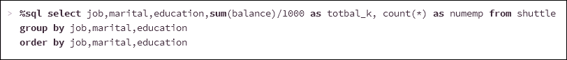

然后，在选择了可视化选项**条形图**之后，我将选择**Plot**选项，这将允许我为图形顶点选择数据。 它还允许我选择要旋转的数据列。 下面的屏幕截图显示了我选择的值。

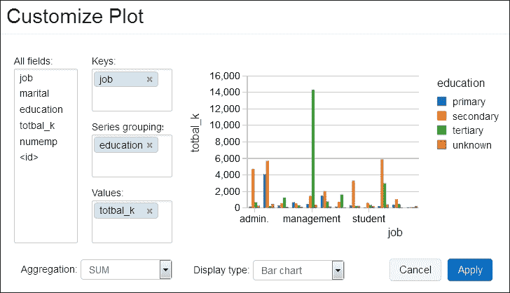

**Plot**选项显示的所有字段部分显示了 SQL 语句结果数据中可用于图形显示的所有字段。 **键**和**值**部分定义将形成图形轴的数据字段。 **系列分组**字段允许我定义一个值，教育，并以此为基础。 通过选择**Apply**，我现在可以创建一个针对职务类型的总余额图表，该图表按教育类型分组，如下面的屏幕截图所示：

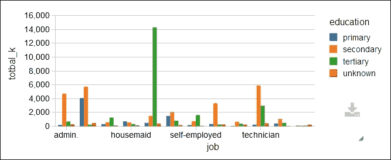

如果我是一名会计，试图确定影响工资成本的因素，以及公司内部成本最高的员工群体，我就会看到上图中的绿色尖峰。 这似乎表明，在数据中，受过高等教育的**管理层**员工是成本最高的群体。 可以通过将 SQL 更改为在**高等教育**上过滤、按平衡降序对结果进行排序并创建新的条形图来确认这一点。


显然，**管理**分组大约为**1400 万**。 将显示选项更改为**Pie**将数据表示为饼图，具有清晰大小的线段和颜色，直观而清晰地呈现数据和最重要的项目。

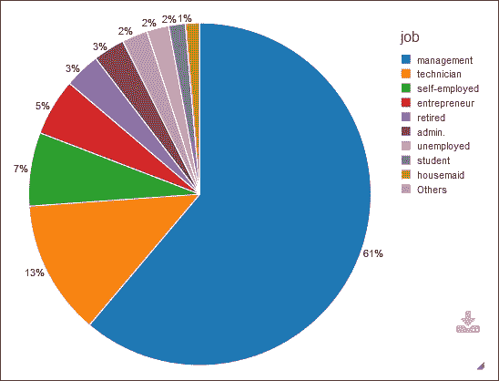

我不能分析这一小章中的所有显示选项，但我确实想展示的是可以使用地理信息创建的世界地图图形。 我已经从[http://download.geonames.org/export/dump/](http://download.geonames.org/export/dump/)下载了`Countries.zip`文件。

这将提供一个相当大的数据集，压缩后约为 281MB，可用于创建新表。 它显示为世界地图图形。 我还获取了一组 ISO2 到 ISO3 的映射数据，并将其存储在一个名为`cmap`的 Databricks 表中。 这使我可以将上述数据中的 ISO2 国家代码(即“AU”)转换为 ISO3 国家代码(即“AUS”)(这是我即将使用的地图图形所需要的)。 我们将用于地图图形的数据中的第一列必须包含地理位置数据。 在本例中，国家代码为 ISO 3 格式。 因此，根据国家/地区数据，我将按 ISO3 代码创建每个国家/地区的记录计数。 确保按键和值正确设置绘图选项也很重要。 我已经将下载的基于国家/地区的数据存储在一个名为`geo1`的表中。 使用的 SQL 如以下截图所示：

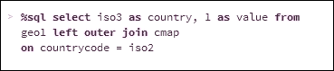

如前所述，这个给出了两列数据，一个是基于 ISO3 的值`country`，另一个是一个称为`value`的数字计数。 将显示选项设置为`Map`将创建颜色编码的世界地图，如以下屏幕截图所示：


这些图表显示了如何以各种形式直观地表示数据，但如果外部客户端需要报告或需要仪表板，该怎么办呢？所有这些都将在下一节中介绍。

## 仪表板

在本节中，我将使用名为`geo1`的表中的数据，该表是在上一节中为地图显示创建的。 它的目的是创建一个简单的仪表板，并将仪表板发布到外部客户端。 从**Workspace**菜单中，我创建了一个名为`dash1`的新仪表板。 如果我编辑这个仪表板的 Controls 选项卡，我可以开始输入 SQL，并创建图形，如下面的屏幕截图所示。 每个图形都表示为一个视图，并且可以通过 SQL 定义。 它可以根据各个图形使用绘图选项调整大小和配置。 使用**添加**下拉菜单添加视图。 下面的屏幕截图显示已经创建了`view1`，并将其添加到`dash1`。 `view2`正在定义中。


添加、定位所有视图并调整其大小后，可以选择编辑选项卡来显示最终的仪表板。 下面的屏幕截图现在显示了名为`dash1`的最终仪表板，其中有三个不同形式的不同图形和数据段：

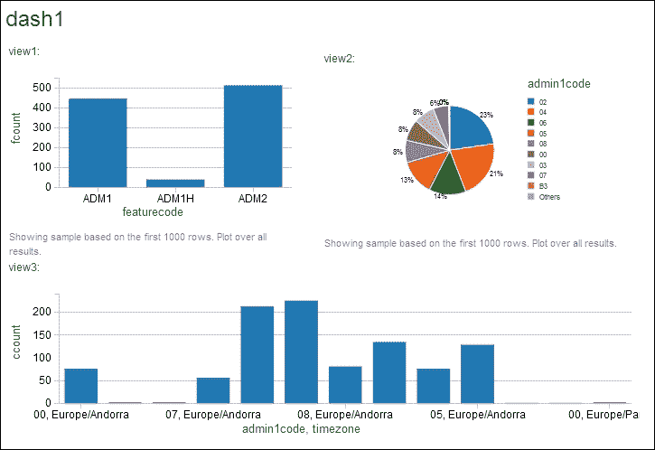

这对于提供数据视图非常有用，但此仪表板位于 Databricks 云环境中。 如果我想让客户看到这个怎么办？ 仪表板屏幕右上角有一个**Publish**菜单选项，允许您发布仪表板。 这将在一个新的公开发布的 URL 下显示仪表板，如下面的屏幕截图所示。 请注意以下屏幕截图顶部的新 URL。 现在，您可以与客户共享此 URL 以显示结果。 还可以选择定期更新显示以表示基础数据中的更新。


这让您对可用的显示选项有了一个概念。 到目前为止创建的所有报告和仪表板都是基于 SQL 的，并返回数据。 在下一节中，我将展示如何使用基于 Scala 的 Spark RDD 以编程方式创建报告，并流式传输数据。

## 基于 RDD 的报告

下面的基于 Scala 的示例根据鸟的名称和遇到的卷使用名为`birdType`的用户定义的类类型。 创建鸟类类型记录的 RDD，然后将其转换为数据帧。 然后显示数据框。 Databricks 允许将显示的数据显示为表格或使用绘图选项作为图形。 下图显示了使用的 Scala：


下面的屏幕截图显示了这个Scala 示例允许创建的条形图。 前面的 Scala 代码和下面的屏幕截图不如使用数据框以编程方式创建此图这一事实重要：

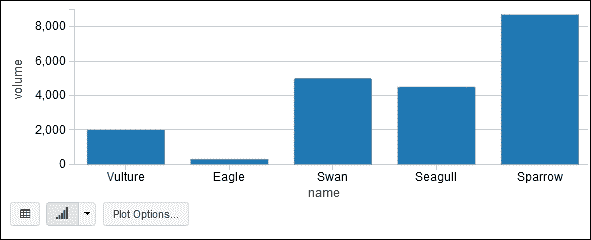

这为以编程方式从基于计算的数据源创建数据框和临时表提供了可能。 它还允许处理流数据，并使用仪表板的刷新功能不断呈现流数据窗口。 下一节将研究一个基于流的报告生成示例。

## 基于流的报告

在本节中，我将使用 Databricks 功能上传一个基于 JAR 的库，这样我们就可以运行一个基于 Twitter 的流式 Apache Spark 示例。 为此，我必须首先在[https://apps.twitter.com/](https://apps.twitter.com/)上创建一个 twitter 帐户和一个样例应用。

下面的屏幕截图显示我已经创建了一个名为`My example app`的应用。 这是必要的，因为我需要创建必要的访问键和令牌来创建基于 Scala 的 Twitter 提要。

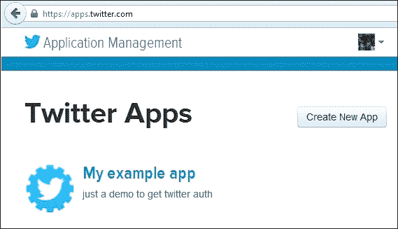

如果我现在选择应用名称，我可以看到应用的详细信息。 这提供了一个菜单选项，该选项提供对应用详细信息、设置、访问令牌和权限的访问。 还有一个按钮显示**Test OAuth**，这将允许测试将要创建的访问密钥和令牌密钥。 以下屏幕截图显示了应用菜单选项：

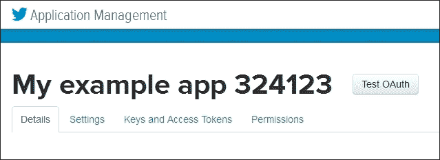

通过选择**密钥和访问令牌**菜单选项，可以为应用生成访问密钥和访问令牌。 本节中的每个应用设置和令牌都有一个 API 密钥和一个密钥。 在下面的屏幕截图中，表单的顶部显示了消费者密钥和消费者机密(当然，出于安全原因，密钥和帐户详细信息已从这些图像中删除)。

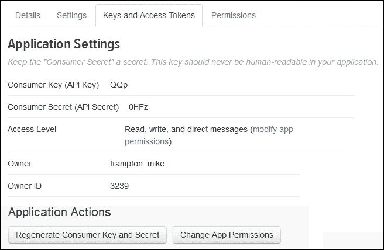

在前面的屏幕截图中还有选项用于重新生成密钥和设置权限。 下一个屏幕截图显示了应用访问令牌的详细信息。 有一个访问令牌和一个访问令牌密码。 它还具有重新生成值和撤销访问权限的选项：


使用这四个字母数值字符串，可以编写一个 Scala 示例来访问 Twitter 流。 需要的值如下所示：

*   消费者密钥
*   消费者秘诀
*   访问令牌
*   访问令牌密码

在下面的代码示例中，出于安全原因，我将删除我自己的密钥值。 您只需添加您自己的值即可使代码正常工作。 我已经开发了我的库，并在本地运行代码以检查它是否可以工作。 在将其加载到 Databricks 之前，我这样做是为了减少调试所需的时间和成本。 我的 Scala 代码示例类似于以下代码。 首先，我定义一个包，导入 Spark Streaming 和 Twitter 资源。 然后，我定义了一个名为`twitter1`的对象类，并创建了一个 main 函数：

```scala
package nz.co.semtechsolutions

import org.apache.spark._
import org.apache.spark.SparkContext._
import org.apache.spark.streaming._
import org.apache.spark.streaming.twitter._
import org.apache.spark.streaming.StreamingContext._
import org.apache.spark.sql._
import org.apache.spark.sql.types.{StructType,StructField,StringType}

object twitter1 {

  def main(args: Array[String]) {
```

接下来，我使用应用名称创建一个 Spark Configuration 对象。 我没有使用 Spark Master URL，因为我会让、`spark-submit`和 Databricks 都分配默认 URL。 在此基础上，我将创建 Spark 上下文，并定义 Twitter 消费者和访问值：

```scala
    val appName = "Twitter example 1"
    val conf    = new SparkConf()

    conf.setAppName(appName)
    val sc = new SparkContext(conf)

    val consumerKey       = "QQpl8xx"
    val consumerSecret    = "0HFzxx"
    val accessToken       = "323xx"
    val accessTokenSecret = "Ilxx"
```

我使用`System.setProperty`调用设置 Twitter 访问属性，并使用前面生成的访问键设置四个`twitter4j``oauth`访问属性：

```scala
    System.setProperty("twitter4j.oauth.consumerKey", consumerKey)
    System.setProperty("twitter4j.oauth.consumerSecret",
       consumerSecret)
    System.setProperty("twitter4j.oauth.accessToken", accessToken)
    System.setProperty("twitter4j.oauth.accessTokenSecret",
       accessTokenSecret)
```

从 Spark 上下文创建流上下文，Spark 上下文用于创建基于 Twitter 的 Spark DStream。 流按空格拆分以创建单词，并按以`#`开头的单词进行筛选，以选择散列标签：

```scala
    val ssc    = new StreamingContext(sc, Seconds(5) )
    val stream = TwitterUtils.createStream(ssc,None)
       .window( Seconds(60) )

    // split out the hash tags from the stream

    val hashTags = stream.flatMap( status => status.getText.split(" ").filter(_.startsWith("#")))
```

下面用于获取单例 SQL 上下文的函数在本例的末尾定义。 因此，对于散列标记流中的每个 RDD，都会创建一个 SQL 上下文。 这用于导入隐式请求，该隐式请求允许使用`toDF`将 RDD 隐式转换为数据帧。 从每个称为`dfHashTags`的`rdd`创建一个数据帧，然后使用该数据帧注册一个临时表。 然后，我对该表运行了一些 SQL，以获得行数。 然后打印行数。 代码中的水平横幅仅用于在使用`spark-submit`时更容易地查看结果输出：

```scala
hashTags.foreachRDD{ rdd =>

val sqlContext = SQLContextSingleton.getInstance(rdd.sparkContext)
import sqlContext.implicits._

val dfHashTags = rdd.map(hashT => hashRow(hashT) ).toDF()

dfHashTags.registerTempTable("tweets")

val tweetcount = sqlContext.sql("select count(*) from tweets")

println("\n============================================")
println(  "============================================\n")

println("Count of hash tags in stream table : "
   + tweetcount.toString )

tweetcount.map(c => "Count of hash tags in stream table : "
   + c(0).toString ).collect().foreach(println)

println("\n============================================")
println(  "============================================\n")

} // for each hash tags rdd
```

我还在当前的 tweet 流数据窗口中输出了按音量排名前五位的 tweet 列表。 您可能会认出下面的代码示例。 它来自 GitHub 上的 Spark 示例。 同样，我已经使用横幅帮助处理将在输出中看到的结果：

```scala
val topCounts60 = hashTags.map((_, 1))
   .reduceByKeyAndWindow(_ + _, Seconds(60))
.map{case (topic, count) => (count, topic)}
.transform(_.sortByKey(false))

topCounts60.foreachRDD(rdd => {

  val topList = rdd.take(5)

  println("\n===========================================")
  println(  "===========================================\n")
  println("\nPopular topics in last 60 seconds (%s total):"
     .format(rdd.count()))
  topList.foreach{case (count, tag) => println("%s (%s tweets)"
     .format(tag, count))}
  println("\n===========================================")
  println(  "==========================================\n")
})
```

然后，我通过 Spark stream 上下文`ssc`使用`start`和`awaitTermination`来启动应用，并保持其运行直到停止：

```scala
    ssc.start()
    ssc.awaitTermination()

  } // end main
} // end twitter1
```

最后，我为散列标记数据流`rdd`中的每一行定义了单例 SQL 上下文函数和`dataframe``case``class`：

```scala
object SQLContextSingleton {
  @transient private var instance: SQLContext = null

  def getInstance(sparkContext: SparkContext):
    SQLContext = synchronized {
    if (instance == null) {
      instance = new SQLContext(sparkContext)
    }
    instance
  }
}
case class hashRow( hashTag: String)
```

我使用 SBT 将这段 Scala应用代码编译成一个名为`data-bricks_2.10-1.0.jar`的 JAR 文件。 我的`SBT`文件如下所示：

```scala
[hadoop@hc2nn twitter1]$  cat twitter.sbt

name := "Databricks"
version := "1.0"
scalaVersion := "2.10.4"
libraryDependencies += "org.apache.spark" % "streaming" % "1.3.1" from "file:///usr/local/spark/lib/spark-assembly-1.3.1-hadoop2.3.0.jar"
libraryDependencies += "org.apache.spark" % "sql" % "1.3.1" from "file:///usr/local/spark/lib/spark-assembly-1.3.1-hadoop2.3.0.jar"
libraryDependencies += "org.apache.spark.streaming" % "twitter" % "1.3.1" from file:///usr/local/spark/lib/spark-examples-1.3.1-hadoop2.3.0.jar

```

我将 Apache Spark 的正确版本下载到我的集群中，以匹配 Databricks 目前使用的当前版本(1.3.1)。 然后，我在集群中的每个节点上将其安装在`/usr/local/`下，并以本地模式运行它，将 Spark 作为集群管理器。 我的`spark-submit`脚本如下所示：

```scala
[hadoop@hc2nn twitter1]$ more run_twitter.bash
#!/bin/bash

SPARK_HOME=/usr/local/spark
SPARK_BIN=$SPARK_HOME/bin
SPARK_SBIN=$SPARK_HOME/sbin

JAR_PATH=/home/hadoop/spark/twitter1/target/scala-2.10/data-bricks_2.10-1.0.jar
CLASS_VAL=nz.co.semtechsolutions.twitter1

TWITTER_JAR=/usr/local/spark/lib/spark-examples-1.3.1-hadoop2.3.0.jar

cd $SPARK_BIN

./spark-submit \
 --class $CLASS_VAL \
 --master spark://hc2nn.semtech-solutions.co.nz:7077  \
 --executor-memory 100M \
 --total-executor-cores 50 \
 --jars $TWITTER_JAR \
 $JAR_PATH

```

我不会详细介绍细节，因为它已经被介绍过很多次了，只需要注意到 class 的值现在是`nz.co.semtechsolutions.twitter1`。 这是包类名称，加上应用对象类名。 因此，当我在本地运行它时，我得到如下输出：

```scala
======================================
Count of hash tags in stream table : 707
======================================
Popular topics in last 60 seconds (704 total):
#KCAMÉXICO (139 tweets)
#BE3 (115 tweets)
#Fallout4 (98 tweets)
#OrianaSabatini (69 tweets)
#MartinaStoessel (61 tweets)
======================================

```

这告诉我应用库可以工作。 它连接到 Twitter，创建数据流，能够将数据过滤成散列标签，并使用数据创建临时表。 因此，在为 Twitter 数据流创建了一个 JAR 库并证明其工作之后，我现在可以将其加载到 Databricks 云中。 下面的屏幕截图显示已经从 Databricks 云作业菜单创建了一个名为`joblib1`的作业。 **set Jar**选项用于上传刚刚创建的 JAR 库。 已指定`twitter1`应用对象类的基于包的完整名称。

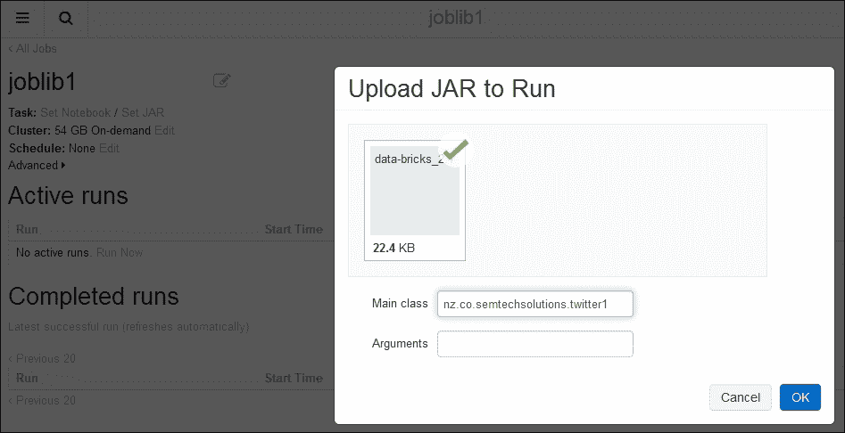

下面的屏幕截图显示了可以运行的`joblib1`作业。 使用**Active Runs**部分下的**Run Now**选项执行作业后，将立即按需创建基于 Spark 的集群。 虽然可以将作业定义为在给定日期和时间运行，但尚未指定计划选项。


我选择了**Run Now**选项来启动作业运行，如下面的屏幕截图所示。 这表明该作业现在有一个名为`Run 1`的活动运行。 它已经运行了六秒钟。 它是手动启动的，在创建按需集群时处于挂起状态。 通过选择运行名称`Run 1`，我可以查看有关作业的详细信息，特别是记录的输出。


下面的屏幕截图显示了`joblib1`的`Run 1`的输出示例。 它显示启动时间和持续时间，还按照类和 JAR 文件显示运行状态和作业详细信息。 它将显示类参数，但在本例中没有。 它还显示了 54 GB 按需群集的详细信息。 更重要的是，它显示了前五个 tweet 散列标记值的列表。


下面的屏幕截图显示了 Databricks 云实例中相同的作业运行输出窗口。 但是这显示了 SQL`count(*)`的输出，显示了来自临时表的当前数据流 tweet 窗口中 tweet 散列标签的数量。

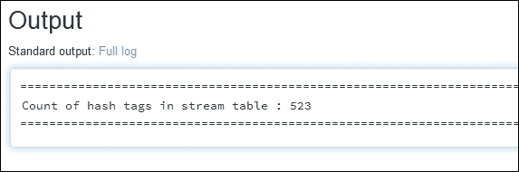

因此，这证明 i可以使用基于 Twitter 的 Apache Spark Streaming 在本地创建应用库，并将数据流转换为数据帧和临时表。 它表明我可以通过本地开发来降低成本，然后将我的库移植到我的 Databricks 云中。 我知道我没有将临时表或本例中的 DataFrame 可视化到 Databricks 图中，但是时间刻度不允许我这样做。 另外，如果我有时间，我会做的另一件事是设置检查点，或者在应用失败的情况下定期将流保存到文件中。 但是，这个主题在[第 3 章](3.html "Chapter 3. Apache Spark Streaming")，*Apache Spark Streaming*中用一个示例进行了介绍，所以如果您感兴趣，可以去那里看看。 在下一节中，我将研究 Databricks rest API，它将允许更好地集成外部应用和 Databricks 云实例。

# REST 接口

Databricks 为基于 Spark 集群的操作提供了REST 接口。 它允许集群管理、库管理、命令执行和上下文执行。 要能够访问 REST API，您的实例必须可以在基于 AWS EC2 的 Databricks 云中访问端口`34563`。 以下 Telnet 命令显示试图访问我的 Databricks 云实例的端口`34563`。 请注意，Telnet 尝试已成功：

```scala
[hadoop@hc2nn ~]$ telnet dbc-bff687af-08b7.cloud.databricks.com 34563
Trying 52.6.229.109...
Connected to dbc-bff687af-08b7.cloud.databricks.com.
Escape character is '^]'.

```

如果您没有收到 Telnet 会话，请通过`<[help@databricks.com](mailto:help@databricks.com)>`联系 Databricks。 接下来的部分提供了对 Databricks 云上的实例的 REST 接口访问示例。

## 发文：2013 年 2 月 10 日星期日晚上 8：00

为了使用接口，我需要将用于访问 Databricks 集群实例的 IP 地址列入白名单。 这是我将从其运行 rest API 命令的计算机的 IP 地址。 通过将 IP 地址列入白名单，Databricks 可以确保访问每个 Databricks 云实例的用户的安全列表。

我通过前面的帮助电子邮件地址联系了 Databricks 支持部门，但在云实例的**Workspace**菜单中也有一份白名单 IP 指南：

**工作区**|**Databricks_GUIDE**|**DevOps Utility**s|**白名单 IP**。

现在可以使用 Linux`curl`命令从 Linux 命令行将 rest API 调用提交给我的 Databricks 云实例。 下面使用 my Databricks 云实例用户名、密码、云实例 URL、rest API 路径和参数显示了`curl`命令的一般示例形式。

Databricks 论坛和以前的帮助电子邮件地址可以用来获取更多信息。 以下各节将提供一些 REST API 工作示例：

```scala
curl –u  '<user>:<paswd>' <dbc url> -d "<parameters>"

```

## 集群管理

您仍然需要从云实例用户界面创建 Databricks Spark 集群。 List rest API 命令如下所示：

```scala
/api/1.0/clusters/list

```

它不需要参数。 此命令将提供群集的列表、它们的状态、IP 地址、名称和运行它们的端口号。 以下输出显示群集`semclust1`在创建过程中处于挂起状态：

```scala
curl -u 'xxxx:yyyyy' 'https://dbc-bff687af-08b7.cloud.databricks.com:34563/api/1.0/clusters/list'

 [{"id":"0611-014057-waist9","name":"semclust1","status":"Pending","driverIp":"","jdbcPort":10000,"numWorkers":0}]

```

当集群可用时，运行相同的 rest API 命令，显示名为`semcust1`的集群正在运行，并且有一个工作进程：

```scala
[{"id":"0611-014057-waist9","name":"semclust1","status":"Running","driverIp":"10.0.196.161","jdbcPort":10000,"numWorkers":1}]

```

终止此集群并创建名为`semclust`的新集群会更改 REST API 调用的结果，如下所示：

```scala
curl -u 'xxxx:yyyy' 'https://dbc-bff687af-08b7.cloud.databricks.com:34563/api/1.0/clusters/list'

[{"id":"0611-023105-moms10","name":"semclust", "status":"Pending","driverIp":"","jdbcPort":10000,"numWorkers":0},
 {"id":"0611-014057-waist9","name":"semclust1","status":"Terminated","driverIp":"10.0.196.161","jdbcPort":10000,"numWorkers":1}]

```

## 执行上下文

通过这些 API 调用，您可以创建、显示或删除执行上下文。 REST API 调用如下：

*   `/api/1.0/contexts/create`
*   `/api/1.0/contexts/status`
*   `/api/1.0/contexts/destroy`

在下面通过`curl`提交的 rest API 调用示例中，已经为由集群 ID 标识的集群`semclust`创建了 Scala 上下文。

```scala
curl -u 'xxxx:yyyy' https://dbc-bff687af-08b7.cloud.databricks.com:34563/api/1.0/contexts/create -d "language=scala&clusterId=0611-023105-moms10"

```

返回的结果要么是错误，要么是 Context ID。以下三个示例返回值显示了无效 URL 导致的错误，以及两次成功的调用返回 Context ID：

```scala
{"error":"ClusterNotFoundException: Cluster not found: semclust1"}
{"id":"8689178710930730361"}
{"id":"2876384417314129043"}

```

## 命令执行

这些命令允许您运行命令、列出命令状态、取消命令或显示命令结果。 REST API 调用如下：

*   /api/1.0/Commands/Execute
*   /api/1.0/Commands/Cancel
*   /api/1.0/Commands/Status

下面的示例显示了对名为`cmap`的现有表运行的 SQL 语句。 上下文必须存在，并且必须是 SQL 类型。 参数已通过`–d`选项传递给 HTTP get 调用。 这些参数包括语言、集群 ID、上下文 ID 和 SQL 命令。 返回命令 ID 如下：

```scala
curl -u 'admin:FirmWare1$34' https://dbc-bff687af-08b7.cloud.databricks.com:34563/api/1.0/commands/execute -d
"language=sql&clusterId=0611-023105-moms10&contextId=7690632266172649068&command=select count(*) from cmap"

{"id":"d8ec4989557d4a4ea271d991a603a3af"}

```

## 图书馆

Rest API 还允许将库上载到集群并检查它们的状态。 REST API 调用路径如下：

*   `/api/1.0/libraries/upload`
*   `/api/1.0/libraries/list`

接下来给出了一个名为`semclust`的库上载到集群实例的示例。 通过`–d`选项传递给 HTTP get API 调用的参数是语言、集群 ID、库名和 URI。 调用成功会得到库的名称和 URI，如下所示：

```scala
curl -u 'xxxx:yyyy' https://dbc-bff687af-08b7.cloud.databricks.com:34563/api/1.0/libraries/upload
 -d "language=scala&clusterId=0611-023105-moms10&name=lib1&uri=file:///home/hadoop/spark/ann/target/scala-2.10/a-n-n_2.10-1.0.jar"

{"name":"lib1","uri":"file:///home/hadoop/spark/ann/target/scala-2.10/a-n-n_2.10-1.0.jar"}

```

请注意，此 REST API 可能会因内容和版本超时而改变，因此请查看 Databricks 论坛，并使用之前的帮助电子邮件地址与 Databricks 支持部门一起检查 API 详细信息。 我确实认为，通过这些简单的示例调用，很明显，这个 REST API 可以用来集成 Databricks 与外部系统和 ETL 链。 在下一节中，我将概述 Databricks 云中的数据移动。

# 移动数据

在[第 8 章](8.html "Chapter 8. Spark Databricks")，*Spark Databricks*和[第 9 章](9.html "Chapter 9. Databricks Visualization")，*数据库可视化*中已经解释了将数据移入和移出 Databricks 的一些方法。 我想在本节中做的是提供所有可用于移动数据的方法的概述。 我将检查表、工作区、作业和 Spark 代码的选项。

## 表数据

Databricks 云的表导入功能允许从 AWS**S3**存储桶、从**Databricks 文件系统**(**dBFS**)、通过 JDBC 以及最终从本地文件导入数据。 本节概述了每种类型的导入，从**S3**开始。 从 AWS**S3**导入表数据需要 AWS 密钥、AWS 密钥和**S3**存储桶名称。 下面的屏幕截图显示了一个示例。 我已经提供了创建**s3**存储桶的示例，包括添加访问策略，因此我将不再介绍它。


添加表单详细信息后，您将能够浏览**S3**存储桶中的数据源。 选择`DBFS`作为表数据源可以浏览您的`DBFS`文件夹和文件。 选择数据源后，它可以显示预览，如以下屏幕截图所示：

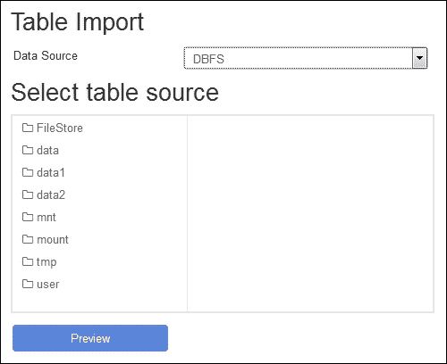

选择`JDBC`作为表数据源允许您将远程 SQL 数据库指定为数据源。 只需添加访问**URL**、**用户名**和**密码**。 另外，添加一些 SQL 来定义表，并将列添加到源。 还可以通过**Add Property**按钮向调用添加额外属性，如下面的屏幕截图所示：

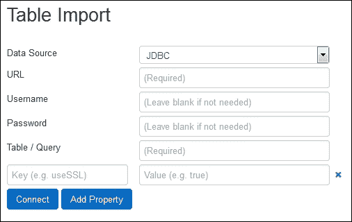

选择**文件**选项以从文件填充 Databricks 云实例表，将创建一个下拉列表或浏览。 这种上载方法以前使用将基于 CSV 的数据上载到表中。 一旦指定了数据源，就可以指定数据分隔符字符串或标题行，定义列名或列类型，并在创建表之前预览数据。


## 文件夹导入

可以从工作区或文件夹下拉菜单导入项目。 下面的屏幕截图显示了来自**导入项目**菜单选项的复合图像：


这将创建一个文件放置或浏览窗口，单击该窗口后，您可以浏览本地服务器以查找要导入的项目。 选择`All Supported Types`选项显示要导入的项可以是 JAR 文件、DBC 存档、Scala、Python 或 SQL 文件。

## 库导入

下面的屏幕截图显示了工作区和文件夹菜单选项中的**新库**功能。 这允许将外部创建和测试的库加载到 Databricks 云实例。 该库可以是 Java 或 Scala JAR 文件的形式，也可以是 Python Egg 或 Maven 坐标的形式，用于存储库访问。 在下面的屏幕截图中，通过浏览窗口从本地服务器选择了一个 JAR 文件。 本章使用此功能测试基于流的 Scala编程：

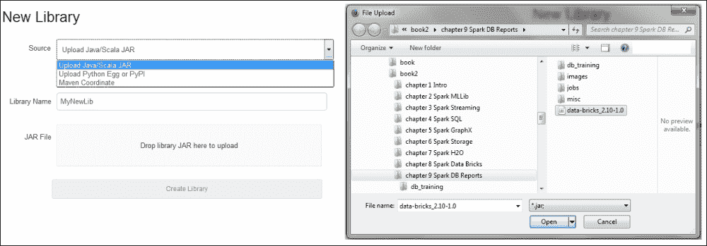

# 进一步阅读

在总结本章(也就是在 Databricks 中使用基于云的 Apache Spark 的最后一章)之前，我想提到一些资源，用于获取有关 Apache Spark 和 Databricks 的额外信息。 首先，可以在[forums.database ricks.com/](http://forums.databricks.com/)上找到 Databricks 论坛，了解与使用[https://databricks.com/](https://databricks.com/)相关的问题和答案。 此外，在 Databricks 实例中的 Workspace 菜单选项下，将有一个 Databricks 指南，其中包含许多有用的信息。 Apache Spark 网站[API](http://spark.apache.org/)也包含了很多有用的信息，以及基于模块的 http://spark.apache.org/文档。 最后是 Spark 邮件列表`<[user@spark.apache.org](mailto:user@spark.apache.org)>`，它提供了大量的 Spark 使用信息和问题解决方案。

# 摘要

[第 8 章](8.html "Chapter 8. Spark Databricks")、*Spark Databricks*和[第 9 章](9.html "Chapter 9. Databricks Visualization")、*Databricks Visualization*介绍了 Databricks 的云安装以及笔记本和文件夹的使用。 研究了帐户和群集管理。 此外，还研究了创造就业机会、创建远程库和导入的想法。 Databricks`dbutils`包和 Databricks 文件系统的功能在[章](8.html "Chapter 8. Spark Databricks")，*Spark Databricks*中进行了说明。 表，还显示了一个数据导入示例，以便可以针对数据集运行 SQL。

研究了数据可视化的思想，并创建了各种图表。 我们已经制作了仪表板，以显示创建和共享这种数据表示是多么容易。 Databricks REST 接口已经通过工作示例进行了演示，以帮助远程使用 Databricks 云实例，并将其与外部系统集成。 最后，从工作区、文件夹和表的角度分析了数据和库移动选项。

你可能会问，为什么我要写两章来介绍像 Databricks 这样的基于云的服务。 原因是 Databricks 似乎是来自 Apache Spark 的一种合乎逻辑的、基于云的进步。 它得到了最初开发 Apache Spark 的人员的支持，虽然它还处于服务的初级阶段，并且可能会发生变化，但它仍然能够提供基于 Spark 云的生产服务。 这意味着希望使用 Spark 的公司可以使用 Databricks 并随着需求的增长而扩展其云，并且可以访问基于 Spark 的动态机器学习、图形处理、SQL、流媒体和可视化功能。

与以往一样，Databricks 的这些章节只是触及了可用功能的皮毛。 下一步是自己创建 AWS 和 Databricks 帐户，并使用此处提供的信息获取实践经验。

由于这是最后一章，我将再次提供我的联系方式。 我会对人们使用 Apache Spark 的方式感兴趣。 我会对您正在创建的集群的大小以及您正在处理的数据感兴趣。 您是否使用 Spark 作为处理引擎？ 或者，您是在它的基础上构建系统？ 你可以通过 LinkedIn 联系我：[linkedin.com/profile/view？id=73219349](http://linkedin.com/profile/view?id=73219349)。

您可以通过我的网站`semtech-solutions.co.nz`联系我，最后也可以通过电子邮件联系我：`<[info@semtech-solutions.co.nz](mailto:info@semtech-solutions.co.nz)>`。

最后，当我有时间时，我会维护一份与开源软件相关的演示文稿列表。 任何人都可以免费使用和下载它们。 它们可以在幻灯片共享上找到：[http://www.slideshare.net/mikejf12/presentations](http://www.slideshare.net/mikejf12/presentations)。

如果您有任何具有挑战性的机会或问题，请随时使用前面的详细信息与我联系。