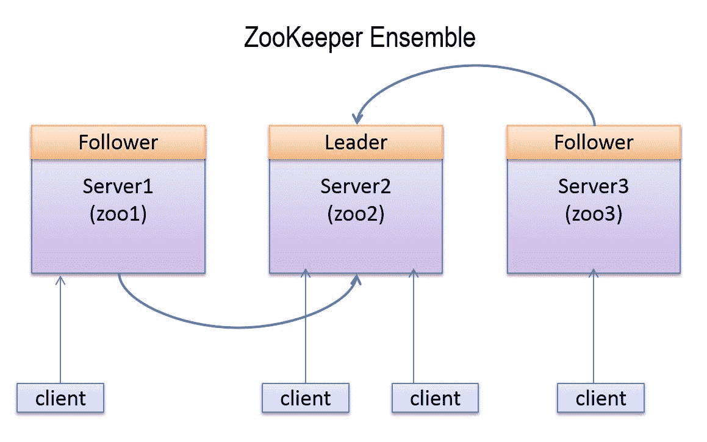
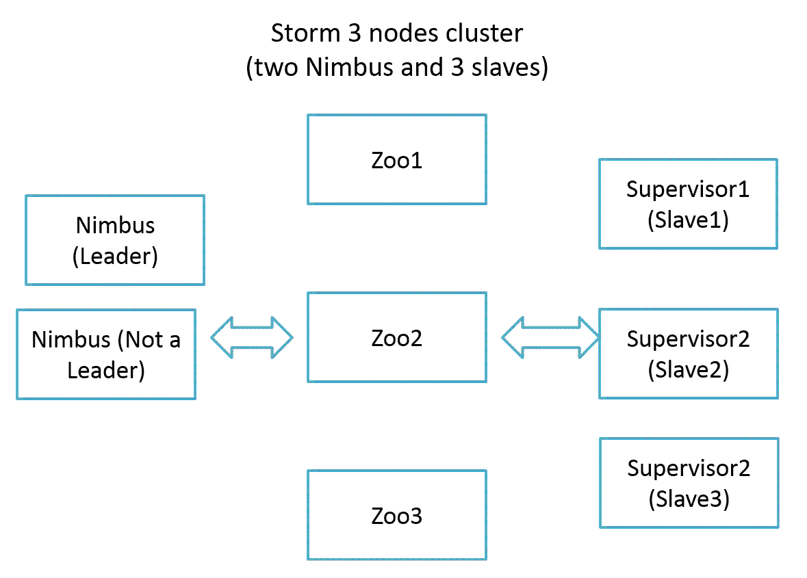
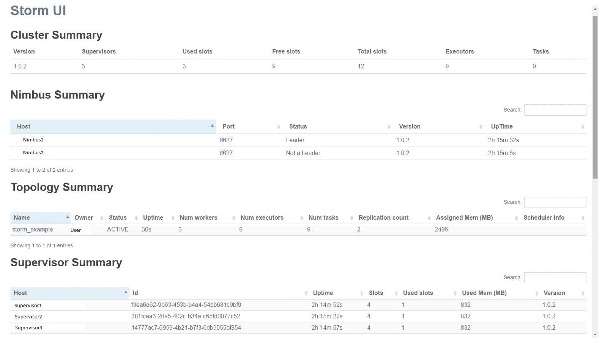
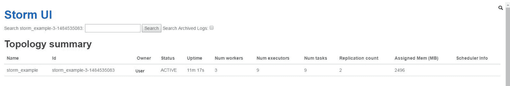
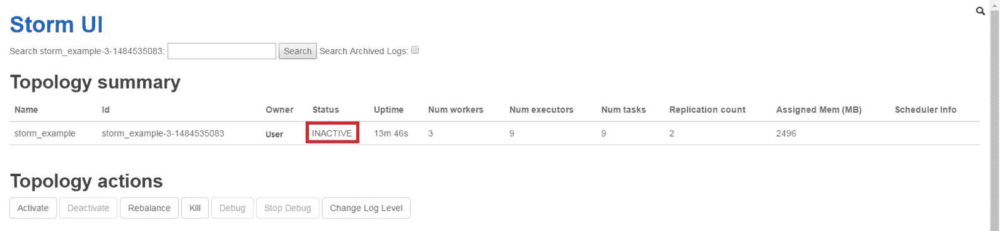
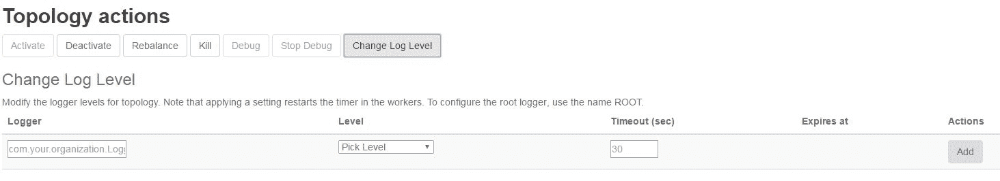
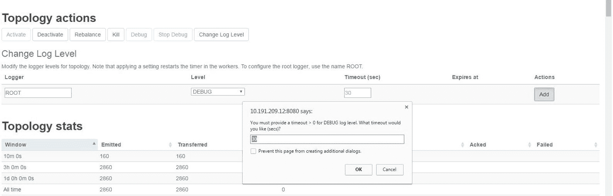

# 风暴部署、拓扑开发和拓扑选项

在本章中，我们将从在多个节点(三个 Storm 和三个 ZooKeeper)群集上部署 Storm 开始。 本章非常重要，因为它重点介绍如何设置生产 Storm 集群，以及为什么我们需要 Storm Supervisor、Nimbus 和 ZooKeeper 的高可用性(因为 Storm 使用 ZooKeeper 来存储集群、拓扑等的元数据)？

以下是我们将在本章中介绍的关键点：

*   部署 Storm 群集
*   编写并部署字数统计示例
*   Storm UI 的不同选项--取消、活动、非活动和重新平衡
*   Storm UI 演练
*   动态日志级别设置
*   验证 Nimbus 高可用性

# 暴风雨的先决条件

在开始部署 Storm 集群之前，您应该已经安装了 Java JDK 和 ZooKeeper 组合。

# 安装 Java SDK 7

执行以下步骤在您的计算机上安装 Java SDK 7。 您还可以使用 JDK 1.8：

1.  从 Oracle 网站([http://www.oracle.com/technetwork/java/javase/downloads/index.html](http://www.oracle.com/technetwork/java/javase/downloads/index.html))下载 Java SDK7RPM。
2.  使用以下命令在 CentOS 计算机上安装 Java`jdk-7u<version>-linux-x64.rpm`文件：

```scala
sudo rpm -ivh jdk-7u<version>-linux-x64.rpm 
```

3.  在`~/.bashrc`文件中添加以下环境变量：

```scala
export JAVA_HOME=/usr/java/jdk<version>
```

4.  将 JDK 的`bin`目录路径添加到`PATH`系统环境变量到`~/.bashrc`文件：

```scala
export PATH=$JAVA_HOME/bin:$PATH 
```

5.  运行以下命令，在当前登录终端上重新加载`bashrc`文件：

```scala
source ~/.bashrc
```

6.  按如下方式检查 Java 安装：

```scala
java -version  
```

前面命令的输出如下所示：

```scala
java version "1.7.0_71"
Java(TM) SE Runtime Environment (build 1.7.0_71-b14)
Java HotSpot(TM) 64-Bit Server VM (build 24.71-b01, mixed mode) 
```

# ZooKeeper 集群的部署

在任何分布式应用中，各个进程都需要相互协调，共享配置信息。 ZooKeeper 是一个以可靠的方式提供所有这些服务的应用程序。 作为一个分布式应用程序，Storm 还使用 ZooKeeper 集群来协调各种进程。 与集群相关的所有状态和提交给 Storm 的各种任务都存储在 ZooKeeper 中。 本节介绍如何设置 ZooKeeper 集群。 我们将部署一个由三个节点组成的 ZooKeeper 集合来处理一个节点故障。 以下是三节点动物园饲养员组合的部署图：



在动物园饲养员群体中，集群中的一个节点充当领导者，而其余的节点则是跟随者。 如果 ZooKeeper 集群的引导者节点死亡，则在剩余的活动节点中选举新的引导者，并选举新的引导者。 来自客户端的所有写请求都被转发到引导者节点，而追随者节点只处理读请求。 此外，我们不能通过增加节点数量来提高 ZooKeeper 集合的写入性能，因为所有写入操作都要经过引导者节点。

建议运行奇数个 ZooKeeper 节点，因为只要大多数节点(活动节点的数量大于*n/2*，其中*n*是部署的节点数量)在运行，ZooKeeper 集群就会继续工作。 因此，如果我们有一个由四个 ZooKeeper 节点(*3>4/2*；只有一个节点可以死亡)组成的集群，那么我们只能处理一个节点故障，而如果集群中有五个节点(*3>5/2*；两个节点可以死亡)，那么我们可以处理两个节点故障。

需要在每个节点上执行步骤 1 到 4 以部署 ZooKeeper 系综：

1.  从 ZooKeeper 站点([http://zookeeper.apache.org/releases.html](http://zookeeper.apache.org/releases.html))下载最新稳定的 ZooKeeper 版本。 在撰写本文时，最新版本是 ZooKeeper 3.4.6。
2.  下载最新版本后，将其解压缩。 现在，我们设置了`ZK_HOME`环境变量以简化设置。
3.  将`ZK_HOME`环境变量指向解压缩目录。 使用以下命令在`$ZK_HOME/conf`目录创建配置文件`zoo.cfg`：

```scala
cd $ZK_HOME/conf 
touch zoo.cfg 
```

4.  将以下属性添加到`zoo.cfg`文件：

```scala
tickTime=2000 
dataDir=/var/zookeeper 
clientPort=2181 
initLimit=5 
syncLimit=2 
server.1=zoo1:2888:3888 
server.2=zoo2:2888:3888 
server.3=zoo3.2888.3888  
```

这里，`zoo1`、`zoo2`和`zoo3`是动物园饲养员节点的 IP 地址。 以下是每个属性的定义：

`server.id=host:port:port`格式的最后三行指定在集合中有三个节点。 在集合中，每个动物园管理员节点必须有一个介于 1 和 255 之间的唯一 ID 号。 此 ID 是通过在每个节点的`dataDir`目录中创建名为`myid`的文件来定义的。 例如，ID 为 1(`server.1=zoo1:2888:3888`)的节点将在目录`/var/zookeeper`中有一个`myid`文件，其中包含`text 1`。

对于该集群，在三个位置创建`myid`文件，如下图所示：

```scala
At zoo1 /var/zookeeper/myid contains 1 
At zoo2 /var/zookeeper/myid contains 2 
At zoo3 /var/zookeeper/myid contains 3  
```

5.  在每台计算机上运行以下命令以启动 ZooKeeper 集群：

```scala
bin/zkServer.sh start  
```

通过执行以下步骤检查 ZooKeeper 节点的状态：

6.  在`zoo1`节点上运行以下命令以检查第一个节点的状态：

```scala
bin/zkServer.sh status 
```

将显示以下信息：

```scala
JMX enabled by default 
Using config: /home/root/zookeeper-3.4.6/bin/../conf/zoo.cfg 
Mode: follower   
```

第一个节点在`follower`模式下运行。

7.  通过执行以下命令检查第二个节点的状态：

```scala
bin/zkServer.sh status  
```

将显示以下信息：

```scala
JMX enabled by default 
Using config: /home/root/zookeeper-3.4.6/bin/../conf/zoo.cfg 
Mode: leader  
```

第二个节点在`leader`模式下运行。

8.  通过执行以下命令检查第三个节点的状态：

```scala
bin/zkServer.sh status

```

将显示以下信息：

```scala
JMX enabled by default 
Using config: /home/root/zookeeper-3.4.6/bin/../conf/zoo.cfg 
Mode: follower  
```

第三个节点在`follower`模式下运行。

9.  在引线计算机上运行以下命令以停止引线节点：

```scala
bin/zkServer.sh stop  
```

现在，通过执行以下步骤检查其余两个节点的状态：

10.  使用以下命令检查第一个节点的状态：

```scala
bin/zkServer.sh status  
```

将显示以下信息：

```scala
JMX enabled by default 
Using config: /home/root/zookeeper-3.4.6/bin/../conf/zoo.cfg 
Mode: follower   
```

第一个节点再次在`follower`模式下运行。

11.  使用以下命令检查第二个节点的状态：

```scala
bin/zkServer.sh status   
```

将显示以下信息：

```scala
JMX enabled by default 
Using config: /home/root/zookeeper-3.4.6/bin/../conf/zoo.cfg 
Mode: leader  
```

第三个节点被选举为新的领导者。

12.  现在，使用以下命令重新启动第三个节点：

```scala
bin/zkServer.sh status  
```

这是对设置可用于开发的动物园管理员的快速介绍；但是，它不适合生产。 有关 ZooKeeper 管理和维护的完整参考，请参阅 ZooKeeper 网站[http://zookeeper.apache.org/doc/trunk/zookeeperAdmin.html](http://zookeeper.apache.org/doc/trunk/zookeeperAdmin.html)上的在线文档。

# 设置 Storm 群集

在本章中，我们将学习如何设置一个三节点 Storm 集群，其中一个节点将是活动的主节点(Nimbus)，另外两个节点将是工作节点(主管)。

以下是我们的三节点 Storm 群集的部署图：



以下是设置三节点 Storm 群集需要执行的步骤：

1.  安装并运行 ZooKeeper 集群。 上一节提到了安装 ZooKeeper 的步骤。
2.  从[https://storm.apache.org/downloads.html](https://storm.apache.org/downloads.html)下载最新稳定的 Storm 发行版；撰写本文时，最新版本是 Storm1.0.2。

3.  下载最新版本后，在所有三台机器上复制并解压缩。 现在，我们将在每台计算机上设置`$STORM_HOME`环境变量，以简化设置。 `$STORM_HOME`环境包含 Storm`home`文件夹的路径(例如，EXPORT`STORM_HOME=/home/user/storm-1.0.2`)。
4.  转到主节点中的`$STORM_HOME/conf`目录，并将以下行添加到`storm.yaml`文件中：

```scala
storm.zookeeper.servers: 
- "zoo1" 
- "zoo2" 
- "zoo3" 
storm.zookeeper.port: 2181 
nimbus.seeds: "nimbus1,nimbus2" 
storm.local.dir: "/tmp/storm-data"  
```

We are installing two master nodes.

5.  转到每个工作节点的`$STORM_HOME/conf`目录，并将以下行添加到`storm.yaml`文件：

```scala
storm.zookeeper.servers: 
- "zoo1" 
- "zoo2" 
- "zoo3" 
storm.zookeeper.port: 2181 
nimbus.seeds: "nimbus1,nimbus2" 
storm.local.dir: "/tmp/storm-data" 
supervisor.slots.ports: 
- 6700 
- 6701 
- 6702 
- 6703  
```

If you are planning to execute the Nimbus and supervisor on the same machine, then add the `supervisor.slots.ports` property to the Nimbus machine too.

6.  转到主节点上的`$STORM_HOME`目录，并执行以下命令以启动主守护程序：

```scala
$> bin/storm nimbus &  
```

7.  转到每个 Worker 节点(或主管节点)的`$STORM_HOME`目录，并执行以下命令以启动 Worker 守护程序：

```scala
$> bin/storm supervisor &  
```

# 开发 hello world 示例

在开始开发之前，您应该在项目中安装 Eclipse 和 Maven。 这里解释的示例拓扑将介绍如何创建一个基本的 Storm 项目，包括管口和螺栓，以及如何构建和执行它们。

使用`com.stormadvance`作为`groupId`，使用`storm-example`作为`artifactId`创建一个 Maven 项目。

将以下 Maven 依赖项添加到`pom.xml`文件：

```scala
<dependency> 
  <groupId>org.apache.storm</groupId> 
  <artifactId>storm-core</artifactId> 
  <version>1.0.2</version> 
  <scope>provided<scope> 
</dependency> 
```

Make sure the scope of the Storm dependency is provided, otherwise you will not be able to deploy the topology on the Storm cluster.

在`pom.xml`文件中添加以下 Maven`build`插件：

```scala
<build> 
  <plugins> 
    <plugin> 
      <artifactId>maven-assembly-plugin</artifactId> 
      <version>2.2.1</version> 
      <configuration> 
        <descriptorRefs> 
          <descriptorRef>jar-with-dependencies 
          </descriptorRef> 
        </descriptorRefs> 
        <archive> 
          <manifest> 
            <mainClass /> 
          </manifest> 
        </archive> 
      </configuration> 
      <executions> 
        <execution> 
          <id>make-assembly</id> 
          <phase>package</phase> 
          <goals> 
            <goal>single</goal> 
          </goals> 
        </execution> 
      </executions> 
    </plugin> 
  </plugins> 
</build> 
```

通过在`com.stormadvance.storm_example`包中创建`SampleSpout`类来编写第一个示例输出。 `SampleSpout`类扩展了序列化的`BaseRichSpout`类。 该接口不连接到外部源来获取数据，而是随机生成数据并发出连续的记录流。 下面是`SampleSpout`类的源代码及其说明：

```scala
public class SampleSpout extends BaseRichSpout { 
  private static final long serialVersionUID = 1L; 

  private static final Map<Integer, String> map = new HashMap<Integer, String>(); 
  static { 
    map.put(0, "google"); 
    map.put(1, "facebook"); 
    map.put(2, "twitter"); 
    map.put(3, "youtube"); 
    map.put(4, "linkedin"); 
  } 
  private SpoutOutputCollector spoutOutputCollector; 

  public void open(Map conf, TopologyContext context, SpoutOutputCollector spoutOutputCollector) { 
    // Open the spout 
    this.spoutOutputCollector = spoutOutputCollector; 
  } 

  public void nextTuple() { 
    // Storm cluster repeatedly calls this method to emita continuous 
    // stream of tuples. 
    final Random rand = new Random(); 
    // generate the random number from 0 to 4\. 
    int randomNumber = rand.nextInt(5); 
    spoutOutputCollector.emit(new Values(map.get(randomNumber))); 
    try{ 
      Thread.sleep(5000); 
    }catch(Exception e) { 
      System.out.println("Failed to sleep the thread"); 
    } 
  } 

  public void declareOutputFields(OutputFieldsDeclarer declarer) { 

  // emit the tuple with field "site" 
  declarer.declare(new Fields("site")); 
  } 
} 
```

通过在同一个包中创建一个`SampleBolt`类来编写您的第一个示例螺栓。 `SampleBolt`类扩展了序列化的`BaseRichBolt`类。 此螺栓将消耗`SampleSpout`喷嘴发出的元组，并在控制台上打印字段`site`的值。 下面是`SampleStormBolt`类的源代码及其说明：

```scala
public class SampleBolt extends BaseBasicBolt { 
  private static final long serialVersionUID = 1L; 

  public void execute(Tuple input, BasicOutputCollector collector) { 
    // fetched the field "site" from input tuple. 
    String test = input.getStringByField("site"); 
    // print the value of field "site" on console. 
    System.out.println("######### Name of input site is : " + test); 
  } 

  public void declareOutputFields(OutputFieldsDeclarer declarer) { 
  } 
} 
```

在同一个包中创建一个主`SampleStormTopology`类。 该类创建了管口和螺栓的实例以及类，并使用`TopologyBuilder`类将它们链接在一起。 此类使用`org.apache.storm.LocalCluster`模拟暴风簇。 `LocalCluster`模式用于在开发人员计算机上调试/测试拓扑，然后再将其部署到 Storm 集群上。 下面是 Main 类的实现：

```scala
public class SampleStormTopology { 
  public static void main(String[] args) throws AlreadyAliveException, InvalidTopologyException { 
    // create an instance of TopologyBuilder class 
    TopologyBuilder builder = new TopologyBuilder(); 
    // set the spout class 
    builder.setSpout("SampleSpout", new SampleSpout(), 2); 
    // set the bolt class 
    builder.setBolt("SampleBolt", new SampleBolt(), 4).shuffleGrouping("SampleSpout"); 
    Config conf = new Config(); 
    conf.setDebug(true); 
    // create an instance of LocalCluster class for 
    // executing topology in local mode. 
    LocalCluster cluster = new LocalCluster(); 
    // SampleStormTopology is the name of submitted topology 
    cluster.submitTopology("SampleStormTopology", conf, builder.createTopology()); 
    try { 
      Thread.sleep(100000); 
    } catch (Exception exception) { 
      System.out.println("Thread interrupted exception : " + exception); 
    } 
    // kill the SampleStormTopology 
    cluster.killTopology("SampleStormTopology"); 
    // shutdown the storm test cluster 
    cluster.shutdown(); 
  } 
} 
```

转到项目的主目录并运行以下命令以在本地模式下执行拓扑：

```scala
$> cd $STORM_EXAMPLE_HOME 
$> mvn compile exec:java -Dexec.classpathScope=compile -Dexec.mainClass=com.stormadvance.storm_example.SampleStormTopology 
```

现在创建一个新的拓扑类，用于在实际的 Storm 集群上部署拓扑。 在同一个包中创建一个主`SampleStormClusterTopology`类。 此类还创建了管口和螺栓的实例以及类，并使用`TopologyBuilder`类将它们链接在一起：

```scala
public class SampleStormClusterTopology { 
  public static void main(String[] args) throws AlreadyAliveException, InvalidTopologyException { 
    // create an instance of TopologyBuilder class 
    TopologyBuilder builder = new TopologyBuilder(); 
    // set the spout class 
    builder.setSpout("SampleSpout", new SampleSpout(), 2); 
    // set the bolt class 
    builder.setBolt("SampleBolt", new SampleBolt(), 4).shuffleGrouping("SampleSpout"); 
    Config conf = new Config(); 
    conf.setNumWorkers(3); 
    // This statement submit the topology on remote 
    // args[0] = name of topology 
    try { 
      StormSubmitter.submitTopology(args[0], conf, builder.createTopology()); 
    } catch (AlreadyAliveException alreadyAliveException) { 
      System.out.println(alreadyAliveException); 
    } catch (InvalidTopologyException invalidTopologyException) { 
      System.out.println(invalidTopologyException); 
    } catch (AuthorizationException e) { 
      // TODO Auto-generated catch block 
      e.printStackTrace(); 
    } 
  } 
} 
```

通过在项目主目录上运行以下命令来构建 Maven 项目：

```scala
mvn clean install  
```

前面命令的输出如下所示：

```scala
    ------------------------------------------------------------------ ----- 
    [INFO] ----------------------------------------------------------- ----- 
    [INFO] BUILD SUCCESS 
    [INFO] ----------------------------------------------------------- ----- 
    [INFO] Total time: 58.326s 
    [INFO] Finished at: 
    [INFO] Final Memory: 14M/116M 
    [INFO] ----------------------------------------------------------- ----

```

我们可以使用以下 Storm 客户端命令将拓扑部署到群集：

```scala
bin/storm jar jarName.jar [TopologyMainClass] [Args] 
```

前面的命令使用参数`arg1`和`arg2`运行`TopologyMainClass`。 `TopologyMainClass`的主要功能是定义拓扑并将其提交给 Nimbus 机器。 `storm jar`部分负责连接到 Nimbus 机器并上传 JAR 部分。

登录 Storm Nimbus 计算机并执行以下命令：

```scala
$> cd $STORM_HOME
$> bin/storm jar ~/storm_example-0.0.1-SNAPSHOT-jar-with-dependencies.jar com.stormadvance.storm_example.SampleStormClusterTopology storm_example  
```

在前面的代码中，`~/storm_example-0.0.1-SNAPSHOT-jar-with-dependencies.jar`是我们在 Storm 集群上部署的`SampleStormClusterTopology`JAR 的路径。

将显示以下信息：

```scala
702  [main] INFO  o.a.s.StormSubmitter - Generated ZooKeeper secret payload for MD5-digest: -8367952358273199959:-5050558042400210383
793  [main] INFO  o.a.s.s.a.AuthUtils - Got AutoCreds []
856  [main] INFO  o.a.s.StormSubmitter - Uploading topology jar /home/USER/storm_example-0.0.1-SNAPSHOT-jar-with-dependencies.jar to assigned location: /tmp/storm-data/nimbus/inbox/stormjar-d3007821-f87d-48af-8364-cff7abf8652d.jar
867  [main] INFO  o.a.s.StormSubmitter - Successfully uploaded topology jar to assigned location: /tmp/storm-data/nimbus/inbox/stormjar-d3007821-f87d-48af-8364-cff7abf8652d.jar
868  [main] INFO  o.a.s.StormSubmitter - Submitting topology storm_example in distributed mode with conf {"storm.zookeeper.topology.auth.scheme":"digest","storm.zookeeper.topology.auth.payload":"-8367952358273199959:-5050558042400210383","topology.workers":3}
 1007 [main] INFO  o.a.s.StormSubmitter - Finished submitting topology: storm_example  
```

运行`jps`命令查看正在运行的 JVM 进程数，如下所示：

```scala
jps   
```

前面命令的输出为：

```scala
26827 worker 
26530 supervisor 
26824 worker 
26468 nimbus 
26822 worker  
```

在前面的代码中，`worker`是为`SampleStormClusterTopology`拓扑启动的 JVM。

# Storm 拓扑的不同选项

本节介绍用户可以在 Storm 群集上执行的以下操作：

*   停用
*   已激活
*   为…修复平衡 / 换位平衡 / 调整
*   杀死 / 消磨 / 使终止
*   动态日志级别设置

# 停用

Storm 支持停用拓扑。 在停用状态下，SPOUT 不会向流水线发出任何新的元组，但对已经发出的元组的处理将继续。 以下是停用正在运行的拓扑的命令：

```scala
$> bin/storm deactivate topologyName 
```

使用以下命令停用`SampleStormClusterTopology`：

```scala
bin/storm deactivate SampleStormClusterTopology 
```

将显示以下信息：

```scala
0 [main] INFO backtype.storm.thrift - Connecting to Nimbus at localhost:6627 
76 [main] INFO backtype.storm.command.deactivate - Deactivated topology: SampleStormClusterTopology  
```

# 已激活

Storm 还支持激活拓扑。 当拓扑被激活时，喷嘴将再次开始发射元组。 以下是激活拓扑的命令：

```scala
$> bin/storm activate topologyName  
```

使用以下命令激活`SampleStormClusterTopology`：

```scala
bin/storm activate SampleStormClusterTopology
```

将显示以下信息：

```scala
0 [main] INFO backtype.storm.thrift - Connecting to Nimbus at localhost:6627 
65 [main] INFO backtype.storm.command.activate - Activated topology: SampleStormClusterTopology  
```

# 为…修复平衡 / 换位平衡 / 调整

在运行时更新拓扑并行性的过程称为**重新平衡**。 有关此操作的更详细信息，请参见[第 3 章](03.html#1LCVG0-6149dd15e07b443593cc93f2eb31ee7b)，*风暴并行性和数据分区*。

# 杀死 / 消磨 / 使终止

风暴拓扑是永无止境的过程。 要停止拓扑，我们需要终止它。 取消时，拓扑首先进入停用状态，处理已发送到其中的所有元组，然后停止。 运行以下命令终止`SampleStormClusterTopology`：

```scala
$> bin/storm kill SampleStormClusterTopology  
```

将显示以下信息：

```scala
0 [main] INFO backtype.storm.thrift - Connecting to Nimbus at localhost:6627 
80 [main] INFO backtype.storm.command.kill-topology - Killed topology: SampleStormClusterTopology

```

现在，再次运行`jps`命令以查看剩余的 JVM 进程，如下所示：

```scala
jps  
```

前面命令的输出为：

```scala
26530 supervisor 
27193 Jps 
26468 nimbus  
```

# 动态日志级别设置

这允许用户在运行时更改拓扑的日志级别，而无需停止拓扑。 有关此操作的详细信息，请参阅本章末尾。

# Storm UI 演练

本节将向您展示如何启动 Storm UI 守护进程。 但是，在启动 Storm UI 守护进程之前，我们假设您有一个正在运行的 Storm 集群。 本章前面几节提到了 Storm 群集部署步骤。 现在，转到 Leader Nimbus 计算机上的 Storm 主目录(`cd $STORM_HOME`)，并运行以下命令以启动 Storm UI 守护进程：

```scala
$> cd $STORM_HOME
$> bin/storm ui &  
```

默认情况下，Storm UI 在启动它的计算机的`8080`端口上启动。 现在，我们将浏览到`http://nimbus-node:8080`页面以查看 Storm UI，其中 Nimbus 节点是 Nimbus 机器的 IP 地址或主机名。

以下是 Storm 主页的屏幕截图：


# 群集摘要部分

Storm UI 的这一部分显示集群中部署的 Storm 的版本、Nimbus 节点的正常运行时间、可用工作插槽的数量、已使用的工作插槽的数量等等。 向集群提交拓扑时，用户首先需要确保空闲插槽列的值不应为零；否则，拓扑不会获得任何工作进程进行处理，并将在队列中等待，直到某个工作进程空闲。

# Nimbus 摘要部分

Storm UI 的这一部分显示在 Storm 集群中运行的 Nimbus 进程的数量。 该部分还显示 Nimbus 节点的状态。 状态为`Leader`的节点是主动主机，而状态为`Not a Leader`的节点是被动主机。

# 主管摘要部分

Storm UI 的此部分显示群集中运行的管理节点列表，以及它们的 ID、主机、正常运行时间、插槽和已用插槽列。

# Nimbus 配置节

Storm UI 的这一部分显示了 Nimbus 节点的配置。 其中一些重要属性包括：

*   `supervisor.slots.ports`
*   `storm.zookeeper.port`
*   `storm.zookeeper.servers`
*   `storm.zookeeper.retry.interval`
*   `worker.childopts`
*   `supervisor.childopts`

以下是 Nimbus 配置的屏幕截图：


# 拓扑摘要部分

Storm UI 的这一部分显示在 Storm 群集中运行的拓扑列表，以及它们的 ID、分配给拓扑的工作进程数、执行器数、任务数、正常运行时间等。

让我们通过运行以下命令在远程 Storm 群集中部署示例拓扑(如果尚未运行)：

```scala
$> cd $STORM_HOME
$> bin/storm jar ~/storm_example-0.0.1-SNAPSHOT-jar-with-dependencies.jar com.stormadvance.storm_example.SampleStormClusterTopology storm_example  
```

我们通过定义三个工作进程、两个`SampleSpout`执行器和四个`SampleBolt`执行器创建了`SampleStormClusterTopology`拓扑。

在 Storm 集群上提交`SampleStormClusterTopology`后，用户必须刷新 Storm 主页。

下面的屏幕截图显示在 Topology Summary 部分中为`SampleStormClusterTopology`添加了行。 拓扑部分包含拓扑名称、拓扑的唯一 ID、拓扑状态、正常运行时间、分配给拓扑的工作进程数等。 状态字段的可能值为`ACTIVE`、`KILLED`和`INACTIVE`。



让我们点击`SampleStormClusterTopology`查看其详细统计数据。 这里有两张截图。 第一个包含有关分配给`SampleStormClusterTopology`拓扑的工作进程、执行器和任务数量的信息：



下一个屏幕截图包含有关喷嘴和螺栓的信息，包括分配给每个喷嘴和螺栓的执行器数量和任务：


前面截图中显示的信息如下：

*   拓扑统计信息：本节将提供有关在 10 分钟、3 小时、1 天窗口内以及自拓扑开始以来发出、传输和确认的元组数量、容量延迟等信息
*   喷嘴(始终)：此部分显示拓扑中运行的所有喷嘴的统计信息
*   螺栓(始终)：此部分显示拓扑中运行的所有螺栓的统计信息
*   拓扑操作：此部分允许我们直接通过 Storm UI 对拓扑执行激活、停用、重新平衡、终止和其他操作：
    *   停用：单击停用可停用拓扑。 取消激活拓扑后，喷嘴将停止发射元组，并且拓扑的状态在 Storm UI 上更改为非活动。



Deactivating the topology does not free the Storm resource.


让我们转到 Storm UI 的主页查看`SampleStormClusterToplogy`的状态，如以下截图所示：


# 动态日志级别设置

动态日志级别允许我们从 Storm CLI 和 Storm UI 更改运行时拓扑的日志级别设置。

# 从 Storm UI 更新日志级别

要从 Storm UI 更新日志级别，请执行以下步骤：

1.  如果 Storm 群集未运行，请再次在该群集上部署`SampleStormClusterTopology`。
2.  在`http://nimbus-node:8080/`浏览 Storm UI。
3.  单击`storm_example`拓扑。

4.  现在点击 Change Log Level(更改日志级别)按钮更改拓扑的`ROOT`记录器，如下图所示：



5.  配置以下屏幕截图中提到的条目，将`ROOT`记录器更改为 ERROR：


6.  如果计划将日志记录级别更改为调试，则必须指定该日志级别的超时(过期时间)，如以下屏幕截图所示：



7.  一旦到达到期时间中提到的时间，日志级别将恢复为默认值：


8.  操作列中提到的清除按钮将清除日志设置，应用程序将再次设置默认日志设置。

# 从 Storm CLI 更新日志级别

我们可以从 Storm CLI 修改日志级别。 以下是用户必须从 Storm 目录执行的命令，以更新运行时的日志设置：

```scala
bin/storm set_log_level [topology name] -l [logger name]=[LEVEL]:[TIMEOUT] 
```

在前面的代码中，`topology name`是拓扑的名称，`logger name`是我们要更改的记录器。 如果要更改`ROOT`记录器，则使用`ROOT`作为`logger name`的值。 `LEVEL`是要应用的日志级别。 可能的值是`DEBUG`、`INFO`、`ERROR`、`TRACE`、`ALL`、`WARN`、`FATAL`和`OFF`。

`TIMEOUT`是以秒为单位的时间。 超时后，日志级别将恢复正常。 如果要将日志级别设置为`DEBUG`/`ALL`，则`TIMEOUT`的值是必需的。

以下是更改`storm_example`拓扑的日志级别设置的命令：

```scala
$> bin/storm set_log_level storm_example -l ROOT=DEBUG:30  
```

以下是清除日志级别设置的命令：

```scala
$> ./bin/storm set_log_level storm_example -r ROOT 
```

# 简略的 / 概括的 / 简易判罪的 / 简易的

在本章中，我们介绍了 Storm 和 ZooKeeper 集群的安装、Storm 集群上拓扑的部署、Nimbus 节点的高可用性，以及通过 Storm UI 进行拓扑监控。 我们还介绍了用户可以对运行拓扑执行的不同操作。 最后，我们重点介绍了如何更改运行拓扑的日志级别。

在下一章中，我们将重点介绍多台 Storm 机器/节点上的拓扑分布。