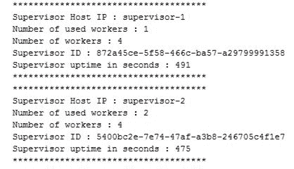
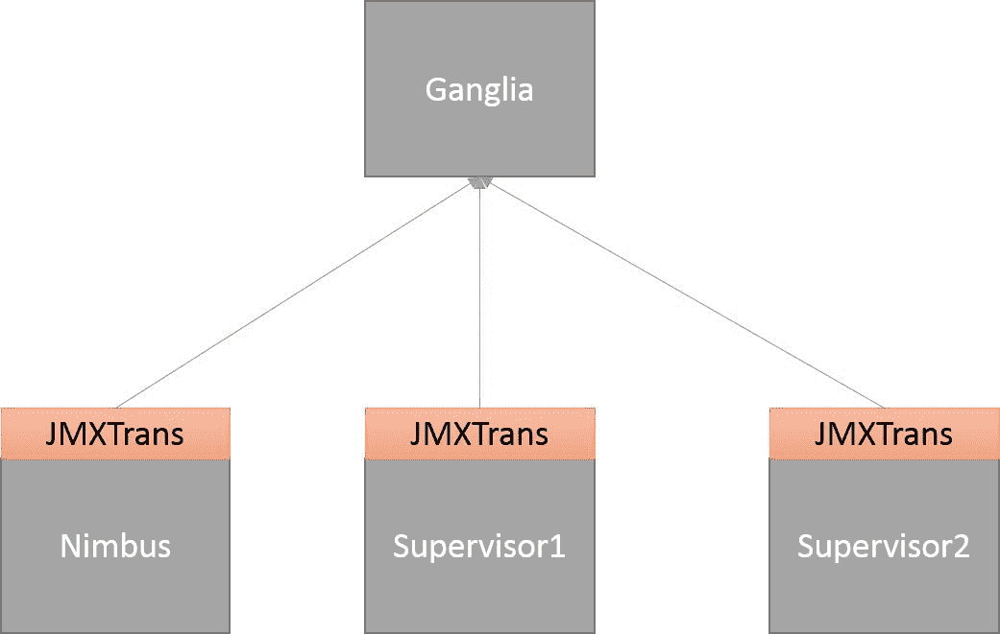
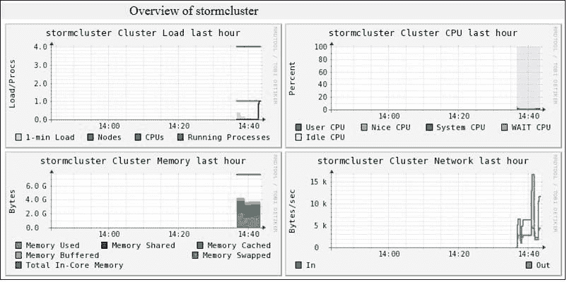
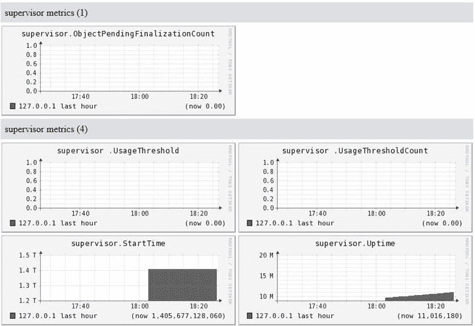

# 七、Storm集群监测

在前面的章节中，我们了解了如何在远程 Storm 群集上部署拓扑、如何配置拓扑的并行性、不同类型的流分组等。 在本章中，我们将重点介绍如何监视和收集 Storm 群集上运行的拓扑的统计信息。

在本章中，我们将介绍以下主题：

*   通过 Nimbus 节约端口收集Storm指标
*   Storm与神经节的融合
*   石墨的安装

# 使用 Nimbus Thrift 客户端的集群统计信息

本节介绍如何使用 Nimbus Thrift 客户端收集集群详细信息(类似于 Storm UI 页面上显示的详细信息)。 通过 Nimbus Thrift 客户端提取/收集信息允许我们可视化数据。

Nimbus Thrift API 非常丰富，它公开了监视 Storm 集群所需的所有必要信息。

# 使用 Nimbus Thrift 获取信息

在本节中，我们将创建一个 Java 项目，该项目将包含使用 Nimbus SARIFT 客户端执行以下操作的类：

*   收集 Nimbus 配置
*   收集主管统计数据
*   收集拓扑统计信息
*   收集给定拓扑的喷嘴统计信息
*   收集给定拓扑的螺栓统计信息
*   终止给定的拓扑

以下是使用 Nimbus Thrift 客户端获取群集详细信息的步骤：

1.  使用`com.stormadvance`作为`groupId`，使用`stormmonitoring`作为`artifactId`创建一个 Maven 项目。
2.  将以下依赖项添加到`pom.xml`文件：

```scala
<dependency> 
  <groupId>org.apache.storm</groupId> 
  <artifactId>storm-core</artifactId> 
  <version>1.0.2</version> 
  <scope>provided</scope> 
</dependency> 

```

3.  在`com.stormadvance`包中创建实用程序类`ThriftClient`。 `ThriftClient`类包含与 Nimbus saft 服务器建立连接并返回 Nimbus 客户端的逻辑：

```scala
public class ThriftClient { 
  // IP of the Storm UI node 
  private static final String STORM_UI_NODE = "127.0.0.1"; 
  public Client getClient() { 
    // Set the IP and port of thrift server. 
    // By default, the thrift server start on port 6627 
    TSocket socket = new TSocket(STORM_UI_NODE, 6627); 
    TFramedTransport tFramedTransport = new TFramedTransport(socket); 
    TBinaryProtocol tBinaryProtocol = new TBinaryProtocol(tFramedTransport); 
    Client client = new Client(tBinaryProtocol); 
    try { 
      // Open the connection with thrift client. 
      tFramedTransport.open(); 
    }catch(Exception exception) { 
      throw new RuntimeException("Error occurs while making connection with Nimbus thrift server"); 
    } 
    // return the Nimbus Thrift client. 
    return client;           
  } 
} 
```

4.  让我们在`com.stormadvance`包中创建一个类`NimbusConfiguration`。 此类包含使用 Nimbus 客户端收集 Nimbus 配置的逻辑：

```scala
public class NimbusConfiguration { 

  public void printNimbusStats() { 
    try { 
      ThriftClient thriftClient = new ThriftClient(); 
      Client client = thriftClient.getClient(); 
      String nimbusConiguration = client.getNimbusConf(); 
      System.out.println("*************************************"); 
      System.out.println("Nimbus Configuration : "+nimbusConiguration); 
      System.out.println("*************************************"); 
    }catch(Exception exception) { 
      throw new RuntimeException("Error occure while fetching the Nimbus statistics : "); 
    } 
  }

  public static void main(String[] args) { 
    new NimbusConfiguration().printNimbusStats(); 
  }      
}
```

前面的代码使用类`org.apache.storm.generated.Nimbus.Client`的`getNimbusConf()`方法来获取 Nimbus 配置。

5.  在`com.stormadvance`包中创建一个类`SupervisorStatistics`，以收集 Storm 集群中运行的所有管理节点的信息：

```scala
public class SupervisorStatistics { 

  public void printSupervisorStatistics()  { 
    try { 
      ThriftClient thriftClient = new ThriftClient(); 
      Client client = thriftClient.getClient(); 
      // Get the cluster information. 
      ClusterSummary clusterSummary = client.getClusterInfo(); 
      // Get the SupervisorSummary iterator 
      Iterator<SupervisorSummary> supervisorsIterator = clusterSummary.get_supervisors_iterator(); 

      while (supervisorsIterator.hasNext()) { 
        // Print the information of supervisor node 
        SupervisorSummary supervisorSummary = (SupervisorSummary) supervisorsIterator.next();

        System.out.println("*************************************"); 
        System.out.println("Supervisor Host IP : "+supervisorSummary.get_host()); 
        System.out.println("Number of used workers : "+supervisorSummary.get_num_used_workers()); 
        System.out.println("Number of workers : "+supervisorSummary.get_num_workers()); 
        System.out.println("Supervisor ID : "+supervisorSummary.get_supervisor_id()); 
        System.out.println("Supervisor uptime in seconds : "+supervisorSummary.get_uptime_secs());

        System.out.println("*************************************"); 
      } 

    }catch (Exception e) { 
      throw new RuntimeException("Error occure while getting cluster info : "); 
    } 
  } 

} 
```

`SupervisorStatistics`类使用`org.apache.storm.generated.Nimbus.Client`类的`getClusterInfo()`方法收集集群摘要，然后调用`org.apache.storm.generated.ClusterSummary`类的`get_supervisors_iterator()`方法获取`org.apache.storm.generated.SupervisorSummary`类的迭代器。

有关`SupervisorStatistics`类的输出，请参见以下内容：

****

6.  在`com.stormadvance`包中创建一个类`TopologyStatistics`，以收集 Storm 集群中运行的所有拓扑的信息：

```scala
public class TopologyStatistics { 

  public void printTopologyStatistics() { 
    try { 
      ThriftClient thriftClient = new ThriftClient(); 
      // Get the thrift client 
      Client client = thriftClient.getClient(); 
      // Get the cluster info 
      ClusterSummary clusterSummary = client.getClusterInfo(); 
      // Get the iterator over TopologySummary class 
      Iterator<TopologySummary> topologiesIterator = clusterSummary.get_topologies_iterator(); 
      while (topologiesIterator.hasNext()) { 
        TopologySummary topologySummary = topologiesIterator.next();

        System.out.println("*************************************"); 
        System.out.println("ID of topology: " + topologySummary.get_id()); 
        System.out.println("Name of topology: " + topologySummary.get_name()); 
        System.out.println("Number of Executors: " + topologySummary.get_num_executors()); 
        System.out.println("Number of Tasks: " + topologySummary.get_num_tasks()); 
        System.out.println("Number of Workers: " + topologySummary.get_num_workers()); 
        System.out.println("Status of toplogy: " + topologySummary.get_status()); 
        System.out.println("Topology uptime in seconds: " + topologySummary.get_uptime_secs());

        System.out.println("*************************************"); 
      } 
    }catch (Exception exception) { 
      throw new RuntimeException("Error occure while fetching the topolgies  information"); 
    } 
  }      
} 
```

`TopologyStatistics`类使用`org.apache.storm.generated.ClusterSummary`类的`get_topologies_iterator()`方法来获取类`org.apache.storm.generated.TopologySummary`上的迭代器。 类`TopologyStatistics`将打印执行器数量、任务数量和分配给每个拓扑的工作进程数量的值。

7.  在`com.stormadvance`包中创建一个类`SpoutStatistics`以获取喷嘴的统计信息。 类`SpoutStatistics`包含一个方法`printSpoutStatistics(String topologyId)`，用于打印给定拓扑服务的所有喷嘴的详细信息：

```scala
public class SpoutStatistics { 

  private static final String DEFAULT = "default"; 
  private static final String ALL_TIME = ":all-time"; 

  public void printSpoutStatistics(String topologyId) { 
    try { 
      ThriftClient thriftClient = new ThriftClient(); 
      // Get the nimbus thrift client 
      Client client = thriftClient.getClient(); 
      // Get the information of given topology  
      TopologyInfo topologyInfo = client.getTopologyInfo(topologyId);          
      Iterator<ExecutorSummary> executorSummaryIterator = topologyInfo.get_executors_iterator(); 
      while (executorSummaryIterator.hasNext()) { 
        ExecutorSummary executorSummary = executorSummaryIterator.next(); 
        ExecutorStats executorStats = executorSummary.get_stats(); 
        if(executorStats !=null) { 
          ExecutorSpecificStats executorSpecificStats = executorStats.get_specific(); 
          String componentId = executorSummary.get_component_id(); 
          //  
          if (executorSpecificStats.is_set_spout()) { 
            SpoutStats spoutStats = executorSpecificStats.get_spout();

             System.out.println("*************************************"); 
            System.out.println("Component ID of Spout:- " + componentId); 
            System.out.println("Transferred:- " + getAllTimeStat(executorStats.get_transferred(),ALL_TIME)); 
            System.out.println("Total tuples emitted:- " + getAllTimeStat(executorStats.get_emitted(), ALL_TIME)); 
            System.out.println("Acked: " + getAllTimeStat(spoutStats.get_acked(), ALL_TIME)); 
            System.out.println("Failed: " + getAllTimeStat(spoutStats.get_failed(), ALL_TIME));
             System.out.println("*************************************"); 
          } 
        } 
      } 
    }catch (Exception exception) { 
      throw new RuntimeException("Error occure while fetching the spout information : "+exception); 
    } 
  } 

  private static Long getAllTimeStat(Map<String, Map<String, Long>> map, String statName) { 
    if (map != null) { 
      Long statValue = null; 
      Map<String, Long> tempMap = map.get(statName); 
      statValue = tempMap.get(DEFAULT); 
      return statValue; 
    } 
    return 0L; 
  } 

  public static void main(String[] args) { 
    new SpoutStatistics().printSpoutStatistics("StormClusterTopology-1-1393847956"); 
  } 
}      
```

前面的类使用类`org.apache.storm.generated.Nimbus.Client`的`getTopologyInfo(topologyId)`方法来获取给定拓扑的信息。 `SpoutStatistics`类打印喷嘴的以下统计信息：

8.  在`com.stormadvance`包中创建一个类`BoltStatistics`，以获取螺栓的统计信息。 类`BoltStatistics`包含一个方法`printBoltStatistics(String topologyId)`，用于打印给定拓扑所使用的所有螺栓的信息：

```scala
public class BoltStatistics { 

  private static final String DEFAULT = "default"; 
  private static final String ALL_TIME = ":all-time"; 

  public void printBoltStatistics(String topologyId) { 

    try { 
      ThriftClient thriftClient = new ThriftClient(); 
      // Get the Nimbus thrift server client 
      Client client = thriftClient.getClient(); 

      // Get the information of given topology 
      TopologyInfo topologyInfo = client.getTopologyInfo(topologyId); 
      Iterator<ExecutorSummary> executorSummaryIterator = topologyInfo.get_executors_iterator(); 
      while (executorSummaryIterator.hasNext()) { 
        // get the executor 
        ExecutorSummary executorSummary = executorSummaryIterator.next(); 
        ExecutorStats executorStats = executorSummary.get_stats(); 
        if (executorStats != null) { 
          ExecutorSpecificStats executorSpecificStats = executorStats.get_specific(); 
          String componentId = executorSummary.get_component_id(); 
          if (executorSpecificStats.is_set_bolt()) { 
            BoltStats boltStats = executorSpecificStats.get_bolt();

            System.out.println("*************************************"); 
            System.out.println("Component ID of Bolt " + componentId); 
            System.out.println("Transferred: " + getAllTimeStat(executorStats.get_transferred(), ALL_TIME)); 
            System.out.println("Emitted: " + getAllTimeStat(executorStats.get_emitted(), ALL_TIME)); 
            System.out.println("Acked: " + getBoltStats(boltStats.get_acked(), ALL_TIME)); 
            System.out.println("Failed: " + getBoltStats(boltStats.get_failed(), ALL_TIME)); 
            System.out.println("Executed : " + getBoltStats(boltStats.get_executed(), ALL_TIME));
            System.out.println("*************************************"); 
          } 
        } 
      } 
    } catch (Exception exception) { 
      throw new RuntimeException("Error occure while fetching the bolt information :"+exception); 
    } 
  } 

  private static Long getAllTimeStat(Map<String, Map<String, Long>> map, String statName) { 
    if (map != null) { 
      Long statValue = null; 
      Map<String, Long> tempMap = map.get(statName); 
      statValue = tempMap.get(DEFAULT); 
      return statValue; 
    } 
    return 0L; 
  } 

  public static Long getBoltStats(Map<String, Map<GlobalStreamId, Long>> map, String statName) { 
    if (map != null) { 
      Long statValue = null; 
      Map<GlobalStreamId, Long> tempMap = map.get(statName); 
      Set<GlobalStreamId> key = tempMap.keySet(); 
      if (key.size() > 0) { 
        Iterator<GlobalStreamId> iterator = key.iterator(); 
        statValue = tempMap.get(iterator.next()); 
      } 
      return statValue; 
    } 
    return 0L; 
  }
```

```scala

  public static void main(String[] args) { new BoltStatistics().printBoltStatistics("StormClusterTopology-1-1393847956"); 
}  
```

前面的类使用类`backtype.storm.generated.Nimbus.Client`的`getTopologyInfo(topologyId)`方法来获取给定拓扑的信息。 类`BoltStatistics`打印以下有关螺栓的统计信息：

9.  在`com.stormadvance`包中创建一个类`killTopology`，并定义一个方法`kill`，如下所述：

```scala
public void kill(String topologyId) { 
  try { 
    ThriftClient thriftClient = new ThriftClient(); 
    // Get the Nimbus thrift client 
    Client client = thriftClient.getClient(); 
    // kill the given topology 
    client.killTopology(topologyId); 

  }catch (Exception exception) { 
    throw new RuntimeException("Error occure while fetching the spout information : "+exception); 
  } 
} 

public static void main(String[] args) { 
  new killTopology().kill("topologyId"); 
} 
```

前面的类使用类`org.apache.storm.generated.Nimbus.Client`的`killTopology(topologyId)`方法终止拓扑。

在这一节中，我们介绍了使用 Nimbus Thrift 客户端收集 Storm 集群指标/详细信息的几种方法。

# 使用 JMX 监视 Storm 集群

本节将解释如何使用**Java Management Extensions**(**JMX**)监视 Storm 集群。 JMX 是一组规范，用于管理和监视在 JVM 中运行的应用程序。 我们可以在 JMX 控制台上收集或显示 Storm 指标，例如堆大小、非堆大小、线程数量、加载的类数量、堆和非堆内存、虚拟机参数和托管对象。 以下是使用 JMX 监视 Storm 群集需要执行的步骤：

1.  我们需要在每个管理节点的`storm.yaml`文件中添加以下行，以便在每个管理节点上启用 JMX：

```scala
supervisor.childopts: -verbose:gc -XX:+PrintGCTimeStamps - XX:+PrintGCDetails -Dcom.sun.management.jmxremote - Dcom.sun.management.jmxremote.ssl=false - Dcom.sun.management.jmxremote.authenticate=false - Dcom.sun.management.jmxremote.port=12346   
```

这里，`12346`是用于通过 JMX 收集管理程序 JVM 指标的端口号。

2.  在 Nimbus 机器的`storm.yaml`文件中添加以下行，以在 Nimbus 节点上启用 JMX：

```scala
nimbus.childopts: -verbose:gc -XX:+PrintGCTimeStamps - XX:+PrintGCDetails -Dcom.sun.management.jmxremote - Dcom.sun.management.jmxremote.ssl=false - Dcom.sun.management.jmxremote.authenticate=false - Dcom.sun.management.jmxremote.port=12345
```

这里，`12345`是用于通过 JMX 收集 Nimbus JVM 指标的端口号。

3.  此外，您还可以通过在每个主管节点的`storm.yaml`文件中添加以下行来收集工作进程的 JVM 指标：

```scala
worker.childopts: -verbose:gc -XX:+PrintGCTimeStamps - XX:+PrintGCDetails -Dcom.sun.management.jmxremote - Dcom.sun.management.jmxremote.ssl=false - Dcom.sun.management.jmxremote.authenticate=false - Dcom.sun.management.jmxremote.port=2%ID%   
```

这里，`%ID%`表示工作进程的端口号。 如果工作进程的端口是`6700`，则其 JVM 指标发布在端口号`26700`(`2%ID%`)上。

4.  现在，在任何安装了 Java 的计算机上运行以下命令以启动 JConsole：

```scala
cd $JAVA_HOME ./bin/jconsole
```

以下屏幕截图显示了如何使用 JConsole 连接到 Supervisor JMX 端口：


如果在管理程序计算机以外的计算机上打开 JMX 控制台，则需要在前面的屏幕截图中使用管理程序计算机的 IP 地址，而不是`127.0.0.1`。

现在，单击 Connect 按钮查看主管节点的指标。 以下屏幕截图显示了Storm主管节点在 JMX 控制台上的指标：


类似地，您可以通过在 JMX 控制台上指定 Nimbus 机器的 IP 地址和 JMX 端口来收集 Nimbus 节点的 JVM 指标。

以下部分将解释如何在 Ganglia 上显示 Storm 集群指标。

# 使用 Ganglia 监视 Storm 群集

Ganglia 是一个监视工具，用于收集集群上运行的不同类型进程的指标。 在大多数应用程序中，Ganglia 被用作集中监视工具，以显示集群上运行的所有进程的指标。 因此，您必须通过 Ganglia 启用 Storm 集群的监控。

Ganglia 有三个重要组件：

*   **gmond**：这是 Ganglia 的一个监视守护进程，它收集节点的指标并将此信息发送到 Gmetad 服务器。 要收集每个 Storm 节点的指标，您需要在每个节点上安装 gmond 守护进程。
*   **gmetad**：这将从所有 Gmond 节点收集指标并将其存储在循环数据库中。
*   **Ganglia Web 界面**：它以图形形式显示指标信息。

Storm 没有内置支持来使用 Ganglia 监控 Storm 集群。 但是，通过 JMXTrans，您可以使用 Ganglia 启用 Storm 监视。 JMXTrans 工具允许您连接到任何 JVM，无需编写任何代码即可获取其 JVM 指标。 通过 JMX 公开的 JVM 指标可以使用 JMXTrans 显示在 Ganglia 上。 因此，JMXTrans 充当 Storm 和 Ganglia 之间的桥梁。

下图显示了如何在 Storm 节点和 Ganglia 之间使用 JMXTrans：



执行以下步骤设置 JMXTrans 和 Ganglia：

1.  运行以下命令，在每个 Storm 节点上下载并安装 JMXTrans 工具：

```scala
wget https://jmxtrans.googlecode.com/files/jmxtrans-239-0.noarch. rpm sudo rpm -i jmxtrans-239-0.noarch.rpm
```

2.  运行以下命令在网络中的任何计算机上安装 Ganglia、Gmond 和 Gmetad 包。 您可以在不属于 Storm 群集的计算机上部署 Gmetad 和 Gmond 进程：

```scala
sudo yum -q -y install rrdtool sudo yum -q -y install ganglia-gmond sudo yum -q -y install ganglia-gmetad sudo yum -q -y install ganglia-web
```

1.  编辑`gmetad.conf`配置文件中的以下行，该文件位于 Gmetad 进程中的`/etc/ganglia`位置。 我们正在编辑此文件，以指定数据源的名称和 Ganglia Gmetad 计算机的 IP 地址：

```scala
data_source "stormcluster" 127.0.0.1
```

您可以用 Ganglia Gmetad 机器的 IP 地址替换`127.0.0.1`。

4.  在 Gmond 进程中编辑位于`/etc/ganglia`的`gmond.conf`配置文件中的以下行：

```scala
cluster { 
  name = "stormcluster" 
  owner = "clusterOwner" 
  latlong = "unspecified" 
  url = "unspecified" 
  }
  host { 
    location = "unspecified" 
  }
  udp_send_channel { 
    host = 127.0.0.1 
    port = 8649 
    ttl = 1 
  }
  udp_recv_channel { 
    port = 8649 
  }
```

这里，`127.0.0.1`是 Storm 节点的 IP 地址。 您需要用机器的实际 IP 地址替换`127.0.0.1`。 我们主要编辑了 Gmond 配置文件中的以下条目：

5.  编辑位于`/etc/ httpd/conf.d`的`ganglia.conf`文件中的以下行。 我们正在编辑`ganglia.conf`文件，以允许从所有计算机访问 Ganglia UI：

```scala
Alias /ganglia /usr/share/ganglia <Location /ganglia>Allow from all</Location>
```

可以在安装 Ganglia Web 前端应用程序的节点上找到`ganglia.conf`文件。 在我们的示例中，Ganglia Web 界面和 Gmetad 服务器安装在同一台机器上。

6.  运行以下命令以启动 Ganglia Gmond、Gmetad 和 Web UI 进程：

```scala
sudo service gmond start setsebool -P httpd_can_network_connect 1 sudo service gmetad start sudo service httpd stop sudo service httpd start
```

7.  现在，转到`http://127.0.0.1/ganglia`以验证 Ganglia 的安装，并将`127.0.0.1`替换为 Ganglia Web 接口机的 IP 地址。
8.  现在，您需要在每个 Supervisor 节点上编写一个`supervisor.json`文件，以使用 JMXTrans 收集 Storm Supervisor 节点的 JVM 指标，然后使用`com.googlecode.jmxtrans.model. output.GangliaWriter OutputWriters`类将它们发布到 Ganglia 上。 `com.googlecode. jmxtrans.model.output.GangliaWriter OutputWriters`类用于处理输入的 JVM 指标，并将其转换为 Ganglia 使用的格式。 以下是`supervisor.json`JSON 文件的内容：

```scala
{ 
  "servers" : [ { 
    "port" : "12346", 
    "host" : "IP_OF_SUPERVISOR_MACHINE", 
    "queries" : [ { 
      "outputWriters": [{ 
        "@class": 
        "com.googlecode.jmxtrans.model.output.GangliaWriter", "settings": { 
          "groupName": "supervisor", 
          "host": "IP_OF_GANGLIA_GMOND_SERVER", 
          "port": "8649" } 
      }], 
      "obj": "java.lang:type=Memory", 
      "resultAlias": "supervisor", 
      "attr": ["ObjectPendingFinalizationCount"] 
    }, 
    { 
      "outputWriters": [{ 
        "@class": 
        "com.googlecode.jmxtrans.model.output.GangliaWriter", "settings" { 
          "groupName": " supervisor ", 
          "host": "IP_OF_GANGLIA_GMOND_SERVER", 
          "port": "8649" 
        } 
      }], 
      "obj": "java.lang:name=Copy,type=GarbageCollector", 
      "resultAlias": " supervisor ", 
      "attr": [ 
        "CollectionCount", 
        "CollectionTime"  
      ] 
    }, 
    { 
      "outputWriters": [{ 
        "@class": 
        "com.googlecode.jmxtrans.model.output.GangliaWriter", "settings": { 
          "groupName": "supervisor ", 
          "host": "IP_OF_GANGLIA_GMOND_SERVER", 
          "port": "8649" 
        } 
      }], 
      "obj": "java.lang:name=Code Cache,type=MemoryPool", 
      "resultAlias": "supervisor ", 
      "attr": [ 
        "CollectionUsageThreshold", 
        "CollectionUsageThresholdCount", 
        "UsageThreshold", 
        "UsageThresholdCount" 
      ] 
    }, 
    { 
      "outputWriters": [{ 
        "@class": 
        "com.googlecode.jmxtrans.model.output.GangliaWriter", "settings": { 
          "groupName": "supervisor ", 
          "host": "IP_OF_GANGLIA_GMOND_SERVER", 
          "port": "8649" 
        } 
      }], 
      "obj": "java.lang:type=Runtime", 
      "resultAlias": "supervisor", 
      "attr": [ 
        "StartTime", 
        "Uptime" 
      ] 
    }
    ], 
    "numQueryThreads" : 2 
  }] 
} 
```

这里，`12346`是`storm.yaml`文件中指定的监控器的 JMX 端口。

您需要将`IP_OF_SUPERVISOR_MACHINE`值替换为管理计算机的 IP 地址。 如果群集中有两个主控引擎，则节点 1 的`supervisor.json`文件包含节点 1 的 IP 地址，节点 2 的`supervisor.json`文件包含节点 2 的 IP 地址。

您需要将`IP_OF_GANGLIA_GMOND_SERVER`值替换为 Ganglia Gmond 服务器的 IP 地址。

9.  在 Nimbus 节点上创建`nimbus.json`文件。 使用 JMXTrans，收集 Storm Nimbus 的流程 JVM 指标，并使用`com.googlecode.jmxtrans.model.output.GangliaWriter OutputWriters`类将它们发布到 Ganglia 上。 以下是`nimbus.json`文件的内容：

```scala
{ 
  "servers" : [{ 
    "port" : "12345", 
    "host" : "IP_OF_NIMBUS_MACHINE", 
    "queries" : [ 
      { "outputWriters": [{ 
        "@class": 
        "com.googlecode.jmxtrans.model.output.GangliaWriter", 
        "settings": { 
          "groupName": "nimbus", 
          "host": "IP_OF_GANGLIA_GMOND_SERVER", 
          "port": "8649" 
        } 
      }], 
      "obj": "java.lang:type=Memory", 
      "resultAlias": "nimbus", 
      "attr": ["ObjectPendingFinalizationCount"] 
      }, 
      { 
        "outputWriters": [{ 
          "@class": 
          "com.googlecode.jmxtrans.model.output.GangliaWriter", "settings": { 
            "groupName": "nimbus", 
            "host": "IP_OF_GANGLIA_GMOND_SERVER", 
            "port": "8649" 
          } 
        }], 
        "obj": "java.lang:name=Copy,type=GarbageCollector", 
        "resultAlias": "nimbus", 
        "attr": [ 
          "CollectionCount", 
          "CollectionTime" 
        ] 
      }, 
      { 
        "outputWriters": [{ 
          "@class": 
          "com.googlecode.jmxtrans.model.output.GangliaWriter", 
          "settings": { 
            "groupName": "nimbus", 
            "host": "IP_OF_GANGLIA_GMOND_SERVER", 
            "port": "8649" 
          } 
        }], 
        "obj": "java.lang:name=Code Cache,type=MemoryPool", 
        "resultAlias": "nimbus", 
        "attr": [ 
          "CollectionUsageThreshold", 
          "CollectionUsageThresholdCount", 
          "UsageThreshold", 
          "UsageThresholdCount" 
        ] 
      }, 
      { 
        "outputWriters": [{ 
          "@class": 
          "com.googlecode.jmxtrans.model.output.GangliaWriter", "settings": {    
           "groupName": "nimbus", 
            "host": "IP_OF_GANGLIA_GMOND_SERVER", 
            "port": "8649" 
          } 
        }], 
        "obj": "java.lang:type=Runtime",
        "resultAlias": "nimbus", 
        "attr": [ 
          "StartTime", 
          "Uptime" 
        ] 
      }
    ] 
    "numQueryThreads" : 2 
  } ] 
} 
```

这里，`12345`是在`storm.yaml`文件中指定的 Nimbus 机器的 JMX 端口。

您需要用 Nimbus 机器的 IP 地址替换`IP_OF_NIMBUS_MACHINE`值。

您需要将`IP_OF_GANGLIA_GMOND_SERVER`值替换为 Ganglia Gmond 服务器的 IP 地址。

10.  在每个 Storm 节点上运行以下命令以启动 JMXTrans 进程：

```scala
cd /usr/share/jmxtrans/ sudo ./jmxtrans.sh start PATH_OF_JSON_FILES
```

这里，`PATH_OF_JSON_FILE`是`supervisor.json`和`nimbus.json`文件的位置。

11.  现在，转到位于`http://127.0.0.1/ganglia`的 Ganglia 页面查看 Storm 指标。 以下屏幕截图显示了 Storm 指标的外观：



执行以下步骤以查看在 Ganglia UI 上处理的 Storm Nimbus 和 Supervisor 的指标：

1.  打开 Ganglia 页面。
2.  现在单击`stormcluster`链接以查看 Storm 群集的指标。

以下屏幕截图显示了 Storm Supervisor 节点的指标：



以下屏幕截图显示了 Storm Nimbus 节点的指标：


# 简略的 / 概括的 / 简易判罪的 / 简易的

在本章中，我们介绍了通过 Nimbus 节约客户端监视 Storm 集群--类似于我们通过 Storm UI 介绍的内容。 我们还介绍了如何配置 Storm 以发布 JMX 指标以及 Storm 与 Ganglia 的集成。

在下一章中，我们将介绍 Storm 与 Kafka 的集成，并查看一些示例来说明该过程。