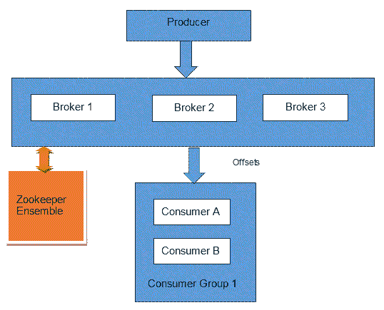
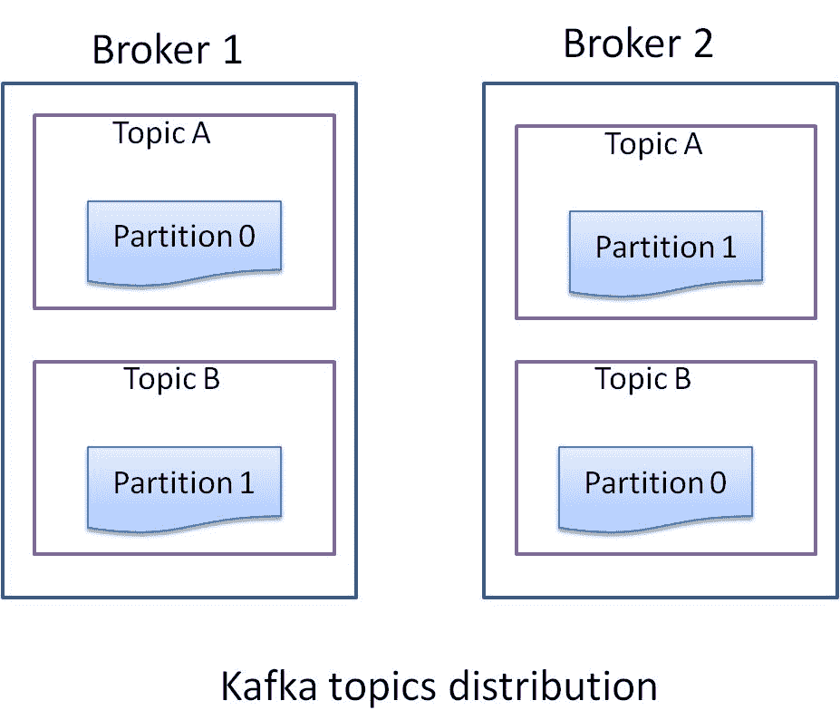
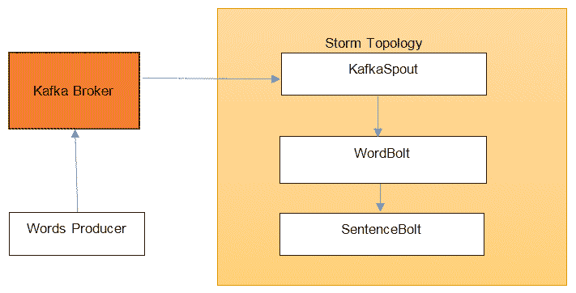

# 八、Storm 与 Kafka 集成

Apache Kafka 是最先由 LinkedIn 开发的高吞吐量、分布式、容错和复制的消息传递系统。 Kafka 的使用案例多种多样，从日志聚合到流处理，再到替换其他消息传递系统。

与 Storm 相结合，Kafka 已经成为实时处理流水线的重要组成部分之一。 Kafka 可以作为 Storm 需要处理的消息的缓冲区或馈送器。 Kafka 还可以用作 Storm 拓扑发出的结果的输出接收器。

在本章中，我们将介绍以下主题：

*   Kafka 建筑--经纪人、生产者和消费者
*   安装 Kafka 集群
*   Kafka 分享生产者和消费者
*   用 Kafka 消费者作为 Storm 喷口的 Storm 拓扑开发
*   部署 Kafka 和 Storm 集成拓扑

# Kafka 简介

在本节中，我们将介绍 Kafka 的体系结构--代理、消费者和生产者。

# Kafka 建筑

Kafka 的体系结构与其他消息传递系统有很大不同。 Kafka 是一个对等系统(集群中的每个节点都有相同的角色)，其中每个节点被称为**代理**。 经纪人在动物园管理员的帮助下协调他们的行动。 由 ZooKeeper 合奏管理的 Kafka 元数据在 Storm 和 Kafka 之间共享 ZooKeeper 一节*中提到*：



Figure 8.1: A Kafka cluster

以下是 Kafka 的重要组成部分：

# 生产者 / 种植者 / 供应者 / 制片主任

生产者是使用 Kafka 客户端 API 将消息发布到 Kafka 集群的实体。 在 Kafka 代理中，消息由生产者实体发布到名为**主题**的命名实体。 主题是持久队列(存储在主题中的数据持久保存到磁盘)。

为了并行性，一个 Kafka 主题可以有多个分区。 每个分区数据在不同的文件中表示。 此外，可以在不同的代理上分配单个主题的两个分区，从而提高吞吐量，因为所有分区彼此独立。 分区中的每条消息都有一个与其关联的唯一序列号，称为**偏移量**：



Figure 8.2: Kafka topic distribution

# 复制

Kafka 支持主题分区复制，支持容错。 Kafka 会自动处理分区的复制，并确保将分区的副本分配给不同的 Broker。 Kafka 选举一个代理作为分区的领导者，所有的读写操作都必须交给该分区领导者。 Kafka 8.0.0 版本引入了复制功能。

Kafka 集群管理同步副本(**ISR**)中的**列表--与分区引导者同步进入 ZooKeeper 的副本。 如果分区引导者关闭，则 ISR 列表中存在的跟随者/副本仅有资格获得故障分区的下一个引导者。**

# 消费者 / 用户 / 食用者 / 消耗者

消费者从经纪人那里阅读一系列消息。 每个消费者都有一个分配的组 ID。具有相同组 ID 的所有消费者都充当单个逻辑消费者。 主题的每条消息都从一个消费组(具有相同的组 ID)传递给一个消费者。 特定主题的不同消费者组可以按照自己的速度处理消息，因为消息在消费后不会立即从主题中删除。 事实上，消费者有责任跟踪他们消费了多少消息。

如前所述，分区中的每个消息都有一个与其关联的唯一序列号，称为偏移量。 正是通过这个偏移量，消费者才知道他们已经处理了多少流。 如果消费者决定重播已经处理过的消息，它只需在消费来自 Kafka 的消息之前将偏移量的值设置为较早的值即可。

# 经纪人 / 掮客 / 代理人 / 中间人

代理接收来自生产者的消息(推送机制)，并将消息传递给消费者(拉取机制)。 代理还管理文件中消息的持久性。 Kafka 代理非常轻量级：它们只打开队列(主题分区)上的文件指针并管理 TCP 连接。

# 数据保留

Kafka 中的每个主题都有关联的保留时间。 当该时间到期时，Kafka 会删除该特定主题的过期数据文件。 这是一个非常高效的操作，因为它是一个文件删除操作。

# 安装 Kafka 经纪人

在撰写本文时，Kafka 的稳定版本是 0.9.x。

运行 Kafka 的先决条件是 ZooKeeper 合奏和 Java 版本 1.7 或更高版本。 Kafka 附带了一个方便的脚本，可以启动单节点 ZooKeeper，但不建议在生产环境中使用它。 我们将使用我们在[第 2 章](02.html#10DJ40-6149dd15e07b443593cc93f2eb31ee7b)、*Storm Deployment、Topology Development 和 Topology Options*中部署的 ZooKeeper 集群。

我们将看到如何先设置一个单节点 Kafka 集群，然后再向其中添加两个节点，以运行一个成熟的三节点 Kafka 集群并启用复制。

# 设置单节点 Kafka 群集

以下是设置单节点 Kafka 集群的步骤：

1.  从[http://apache.claz.org/kafka/0.9.0.1/kafka_2.10-0.9.0.1.tgz](http://apache.claz.org/kafka/0.9.0.1/kafka_2.10-0.9.0.1.tgz)下载名为`kafka_2.10-0.9.0.1.tar.gz`的 Kafka 0.9.x 二进制发行版。

2.  使用以下命令将归档解压到您要安装 Kafka 的位置：

```scala
tar -xvzf kafka_2.10-0.9.0.1.tgz
cd kafka_2.10-0.9.0.1  
```

从现在开始，我们将 Kafka 安装目录称为`$KAFKA_HOME`。

3.  更改`$KAFKA_HOME/config/server.properties`文件中的以下属性：

```scala
log.dirs=/var/kafka-logszookeeper.connect=zoo1:2181,zoo2:2181,zoo3:2181
```

这里，`zoo1`、`zoo2`和`zoo3`表示 ZooKeeper 节点的主机名。

以下是`server.properties`文件中重要属性的定义：

4.  通过运行以下命令启动 Kafka 服务器：

```scala

> ./bin/kafka-server-start.sh config/server.properties 

[2017-04-23 17:44:36,667] INFO New leader is 0 (kafka.server.ZookeeperLeaderElector$LeaderChangeListener)
[2017-04-23 17:44:36,668] INFO Kafka version : 0.9.0.1 (org.apache.kafka.common.utils.AppInfoParser)
[2017-04-23 17:44:36,668] INFO Kafka commitId : a7a17cdec9eaa6c5 (org.apache.kafka.common.utils.AppInfoParser)
[2017-04-23 17:44:36,670] INFO [Kafka Server 0], started (kafka.server.KafkaServer)  
```

如果您在控制台上看到类似于前三行的内容，则您的 Kafka Broker 已启动并运行，我们可以继续对其进行测试。

5.  现在我们将通过发送和接收一些测试消息来验证 Kafka Broker 是否设置正确。 首先，我们通过执行以下命令创建一个验证主题进行测试：

```scala

> bin/kafka-topics.sh --zookeeper zoo1:2181 --replication-factor 1 --partition 1 --topic verification-topic --create

Created topic "verification-topic".  
```

6.  现在，让我们通过列出所有主题来验证主题创建是否成功：

```scala

> bin/kafka-topics.sh --zookeeper zoo1:2181 --list

verification-topic  
```

7.  主题已经创建；让我们为 Kafka 集群生成一些示例消息。 Kafka 附带了一个命令行生成器，我们可以用它来生成消息：

```scala

> bin/kafka-console-producer.sh --broker-list localhost:9092 --topic verification-topic    

```

8.  在您的控制台上写下以下消息：

```scala
Message 1
Test Message 2
Message 3  
```

9.  让我们通过在新的控制台窗口上启动一个新的控制台使用者来使用这些消息：

```scala
> bin/kafka-console-consumer.sh --zookeeper localhost:2181 --topic verification-topic --from-beginning

Message 1
Test Message 2
Message 3  
```

现在，如果我们在生产者控制台上输入任何消息，它将自动被该消费者消费并显示在命令行上。

**Using Kafka's single node ZooKeeper** If you don't want to use an external ZooKeeper ensemble, you can use the single node ZooKeeper instance that comes with Kafka for quick and dirty development. To start using it, first modify the `$KAFKA_HOME/config/zookeeper.properties` file to specify the data directory by supplying following property:
`dataDir=/var/zookeeper`
Now, you can start the Zookeeper instance with the following command:
`> ./bin/zookeeper-server-start.sh config/zookeeper.properties`

# 设置三节点 Kafka 集群

到目前为止，我们只有一个单节点 Kafka 集群。 按照以下步骤部署 Kafka 集群：

1.  创建一个三节点虚拟机或三台物理机。
2.  执行*节中提到的步骤 1 和 2，设置单节点 Kafka 集群*。
3.  更改文件`$KAFKA_HOME/config/server.properties`中的以下属性：

```scala
broker.id=0
port=9092
host.name=kafka1
log.dirs=/var/kafka-logs
zookeeper.connect=zoo1:2181,zoo2:2181,zoo3:2181
```

确保`broker.id`属性的值对于每个 Kafka 代理是唯一的，并且在所有节点上`zookeeper.connect`的值必须相同。

4.  通过在所有三个机器上执行以下命令来启动 Kafka 代理：

```scala
> ./bin/kafka-server-start.sh config/server.properties
```

5.  现在让我们验证一下设置。 首先，我们使用以下命令创建一个主题：

```scala
> bin/kafka-topics.sh --zookeeper zoo1:2181 --replication-factor 4 --partition 1 --topic verification --create

    Created topic "verification-topic".  
```

6.  现在，我们将列出主题，看看主题是否创建成功：

```scala
> bin/kafka-topics.sh --zookeeper zoo1:2181 --list

                topic: verification     partition: 0      leader: 0   replicas: 0             isr: 0
                topic: verification     partition: 1      leader: 1   replicas: 1             isr: 1
                topic: verification     partition: 2      leader: 2   replicas: 2             isr: 2  
```

7.  现在，我们将使用*设置单节点 Kafka 群集*部分中的 Kafka 控制台生产者和消费者来验证设置：

```scala
> bin/kafka-console-producer.sh --broker-list kafka1:9092,kafka2:9092,kafka3:9092 --topic verification  
```

8.  在您的控制台上写下以下消息：

```scala
First
Second
Third  
```

9.  让我们通过在新的控制台窗口上启动一个新的控制台使用者来使用这些消息：

```scala
> bin/kafka-console-consumer.sh --zookeeper localhost:2181 --topic verification --from-beginning

First
Second
Third 
```

到目前为止，我们在 Kafka 集群上有三个经纪人在工作。 在下一节中，我们将看到如何编写一个可以向 Kafka 生成消息的生产者：

# 单个节点上有多个 Kafka 代理

如果您希望在单个节点上运行多个 Kafka 代理，请执行以下步骤：

1.  复制`config/server.properties`以创建`config/server1.properties`和`config/server2.properties`。

2.  在`config/server.properties`中填充以下属性：

```scala
broker.id=0 
port=9092 
log.dirs=/var/kafka-logs 
zookeeper.connect=zoo1:2181,zoo2:2181,zoo3:2181 
```

3.  在`config/server1.properties`中填充以下属性：

```scala
broker.id=1 
port=9093 
log.dirs=/var/kafka-1-logs 
zookeeper.connect=zoo1:2181,zoo2:2181,zoo3:2181 
```

4.  在`config/server2.properties`中填充以下属性：

```scala
broker.id=2 
port=9094 
log.dirs=/var/kafka-2-logs 
zookeeper.connect=zoo1:2181,zoo2:2181,zoo3:2181 
```

5.  在三个不同的终端上运行以下命令启动 Kafka Broker：

```scala
> ./bin/kafka-server-start.sh config/server.properties
> ./bin/kafka-server-start.sh config/server1.properties
> ./bin/kafka-server-start.sh config/server2.properties

```

# 斯托姆和 Kafka 共享动物园饲养员

我们可以在 Kafka 和 Storm 之间共享相同的 ZooKeeper 集合，因为两者都在不同的 znode(ZooKeeper)中存储元数据(ZooKeeper 使用共享的分层名称空间在分布式进程之间进行协调，该名称空间的组织类似于标准文件系统。 在 ZooKeeper 中，由数据寄存器组成的名称空间称为 znode)。

我们需要打开 ZooKeeper 客户端控制台来查看为 Kafka 和 Storm 创建的 znode(共享名称空间)。

转到`ZK_HOME`并执行以下命令以打开 ZooKeeper 控制台：

```scala
> bin/zkCli.sh  
```

执行以下命令以查看 znode 列表：

```scala
> [zk: localhost:2181(CONNECTED) 0] ls /

**[storm, consumers, isr_change_notification, zookeeper, admin, brokers]**
```

在这里，消费者、`isr_change_notification`和经纪人是 znode，而 Kafka 在这个位置将其元数据信息管理到 ZooKeeper 中。

Storm 在 ZooKeeper 的 Storm znode 中管理其元数据。

# Kafka 生产者和将数据发布到 Kafka

在这一节中，我们将编写一个 Kafka 制作人，它将把事件发布到 Kafka 主题中。

执行以下步骤以创建生产者：

1.  使用`com.stormadvance`作为`groupId`，使用`kafka-producer`作为`artifactId`创建一个 Maven 项目。
2.  在`pom.xml`文件中为 Kafka 添加以下依赖关系：

```scala
<dependency> 
  <groupId>org.apache.kafka</groupId> 
  <artifactId>kafka_2.10</artifactId> 
  <version>0.9.0.1</version> 
  <exclusions> 
    <exclusion> 
      <groupId>com.sun.jdmk</groupId> 
      <artifactId>jmxtools</artifactId> 
    </exclusion> 
    <exclusion> 
      <groupId>com.sun.jmx</groupId> 
      <artifactId>jmxri</artifactId> 
    </exclusion> 
  </exclusions> 
</dependency> 
<dependency> 
  <groupId>org.apache.logging.log4j</groupId> 
  <artifactId>log4j-slf4j-impl</artifactId> 
  <version>2.0-beta9</version> 
</dependency> 
<dependency> 
  <groupId>org.apache.logging.log4j</groupId> 
  <artifactId>log4j-1.2-api</artifactId> 
  <version>2.0-beta9</version> 
</dependency>  
```

3.  将以下`build`插件添加到`pom.xml`文件。 它将允许我们使用 Maven 执行生产者：

```scala
<build> 
  <plugins> 
    <plugin> 
      <groupId>org.codehaus.mojo</groupId> 
      <artifactId>exec-maven-plugin</artifactId> 
      <version>1.2.1</version> 
      <executions> 
        <execution> 
          <goals> 
            <goal>exec</goal> 
          </goals> 
        </execution> 
      </executions> 
      <configuration> 
        <executable>java</executable
        <includeProjectDependencies>true</includeProjectDependencies
        <includePluginDependencies>false</includePluginDependencies> 
        <classpathScope>compile</classpathScope> 
        <mainClass>com.stormadvance.kafka_producer. KafkaSampleProducer 
        </mainClass> 
      </configuration> 
    </plugin> 
  </plugins> 
</build> 
```

4.  现在，我们将在`com.stormadvance.kafka_producer`包中创建`KafkaSampleProducer`类。 本课程将把 Kafka《变形记》第一段中的每一个单词作为一条信息产生到 Kafka 的`new_topic`主题中。 以下是`KafkaSampleProducer`类的代码及其解释：

```scala
public class KafkaSampleProducer { 
  public static void main(String[] args) { 
    // Build the configuration required for connecting to Kafka 
    Properties props = new Properties(); 

    // List of kafka borkers. Complete list of brokers is not required as 
    // the producer will auto discover the rest of the brokers. 
    props.put("bootstrap.servers", "Broker1-IP:9092"); 
    props.put("batch.size", 1); 
    // Serializer used for sending data to kafka. Since we are sending string, 
    // we are using StringSerializer. 
    props.put("key.serializer", "org.apache.kafka.common.serialization.StringSerializer"); 
    props.put("value.serializer", "org.apache.kafka.common.serialization.StringSerializer"); 

    props.put("producer.type", "sync"); 

    // Create the producer instance 
    Producer<String, String> producer = new KafkaProducer<String, String>(props); 

    // Now we break each word from the paragraph 
    for (String word : METAMORPHOSIS_OPENING_PARA.split("\\s")) { 
      System.out.println("word : " + word); 
      // Create message to be sent to "new_topic" topic with the word 
      ProducerRecord<String, String> data = new ProducerRecord<String, String>("new_topic",word, word); 
      // Send the message 
      producer.send(data); 
    } 

    // close the producer 
    producer.close(); 
    System.out.println("end : "); 
  } 

  // First paragraph from Franz Kafka's Metamorphosis 
  private static String METAMORPHOSIS_OPENING_PARA = "One morning, when Gregor Samsa woke from troubled dreams, he found " 
               + "himself transformed in his bed into a horrible vermin.  He lay on " 
               + "his armour-like back, and if he lifted his head a little he could " 
               + "see his brown belly, slightly domed and divided by arches into stiff " 
               + "sections.  The bedding was hardly able to cover it and seemed ready " 
               + "to slide off any moment.  His many legs, pitifully thin compared " 
               + "with the size of the rest of him, waved about helplessly as he " 
               + "looked."; 

}  
```

5.  现在，在运行生成器之前，我们需要在 Kafka 中创建`new_topic`。 为此，请执行以下命令：

```scala

> bin/kafka-topics.sh --zookeeper ZK1:2181 --replication-factor 1 --partition 1 --topic new_topic --create 

Created topic "new_topic1".    

```

6.  现在，我们可以通过执行以下命令来运行生成器：

```scala
> mvn compile exec:java
......
103  [com.learningstorm.kafka.WordsProducer.main()] INFO                kafka.client.ClientUti
ls$  - Fetching metadata from broker                                    id:0,host:kafka1,port:9092 with correlation id 0 for 1                  topic(s) Set(words_topic)
110  [com.learningstorm.kafka.WordsProducer.main()] INFO                kafka.producer.SyncProducer  - Connected to kafka1:9092 for             producing
140  [com.learningstorm.kafka.WordsProducer.main()] INFO                kafka.producer.SyncProducer  - Disconnecting from                       kafka1:9092
177  [com.learningstorm.kafka.WordsProducer.main()] INFO                kafka.producer.SyncProducer  - Connected to kafka1:9092 for             producing
378  [com.learningstorm.kafka.WordsProducer.main()] INFO                kafka.producer.Producer  - Shutting down producer
378  [com.learningstorm.kafka.WordsProducer.main()] INFO                kafka.producer.ProducerPool  - Closing all sync producers
381  [com.learningstorm.kafka.WordsProducer.main()] INFO                kafka.producer.SyncProducer  - Disconnecting from                       kafka1:9092
```

7.  现在，让我们通过使用 Kafka 的控制台消费者并执行以下命令来验证该消息是否已生成：

```scala
> bin/kafka-console-consumer.sh --zookeeper ZK:2181 --topic verification --from-beginning

                One
                morning,
                when
                Gregor
                Samsa
                woke
                from
                troubled
                dreams,
                he
                found
                himself
                transformed
                in
                his
                bed
                into
                a
                horrible
                vermin.
                ......
```

因此，我们能够向 Kafka 发出信息。 在下一节中，我们将了解如何使用`KafkaSpout`从 Kafka 读取消息并在 Storm 拓扑中处理它们。

# KafkaStorm 集成

现在，我们将创建一个 Storm 拓扑，它将使用来自 Kafka 主题`new_topic`的消息，并将单词聚合成句子。

完整的消息流如下所示：



我们已经看到了`KafkaSampleProducer`，它将单词生成到 Kafka 代理中。 现在，我们将创建一个 Storm 拓扑，它将读取 Kafka 中的那些单词以将它们聚合成句子。 为此，我们在应用中有一个`KafkaSpout`将读取来自 Kafka 的消息，以及两个 bolts`WordBolt`，它们从`KafkaSpout`接收单词，然后将它们聚合成句子，然后将它们传递到`SentenceBolt`，后者只需在输出流上打印它们。 我们将在本地模式下运行此拓扑。

按照以下步骤创建 Storm 拓扑：

1.  创建一个新的 Maven 项目，将`groupId`作为`com.stormadvance`，将`artifactId`作为`kafka-storm-topology`。
2.  在`pom.xml`文件中为 Kafka-Storm 和 Storm 添加以下依赖项：

```scala
<dependency> 
  <groupId>org.apache.storm</groupId> 
  <artifactId>storm-kafka</artifactId> 
  <version>1.0.2</version> 
  <exclusions> 
    <exclusion> 
      <groupId>org.apache.kafka</groupId> 
      <artifactId>kafka-clients</artifactId> 
    </exclusion> 
  </exclusions> 
</dependency> 

<dependency> 
  <groupId>org.apache.kafka</groupId> 
  <artifactId>kafka_2.10</artifactId> 
  <version>0.9.0.1</version> 
  <exclusions> 
    <exclusion> 
      <groupId>com.sun.jdmk</groupId> 
      <artifactId>jmxtools</artifactId> 
    </exclusion> 
    <exclusion> 
      <groupId>com.sun.jmx</groupId> 
      <artifactId>jmxri</artifactId> 
    </exclusion> 
  </exclusions> 
</dependency> 

<dependency> 
  <groupId>org.apache.storm</groupId> 
  <artifactId>storm-core</artifactId> 
  <version>1.0.2</version> 
  <scope>provided</scope> 
</dependency> 
<dependency> 
  <groupId>commons-collections</groupId> 
  <artifactId>commons-collections</artifactId> 
  <version>3.2.1</version> 
</dependency> 

<dependency> 
  <groupId>com.google.guava</groupId> 
  <artifactId>guava</artifactId> 
  <version>15.0</version> 
</dependency>  
```

3.  将以下 Maven 插件添加到`pom.xml`文件中，以便我们能够从命令行运行它，还可以打包要在 Storm 中执行的拓扑：

```scala
<build> 
  <plugins> 
    <plugin> 
      <artifactId>maven-assembly-plugin</artifactId> 
      <configuration> 
        <descriptorRefs> 
          descriptorRef>jar-with-dependencies</descriptorRef> 
        </descriptorRefs> 
        <archive> 
          <manifest> 
            <mainClass></mainClass> 
          </manifest> 
        </archive> 
      </configuration> 
      <executions> 
        <execution> 
          <id>make-assembly</id> 
          <phase>package</phase> 
          <goals> 
            <goal>single</goal> 
          </goals> 
        </execution> 
      </executions> 
    </plugin> 

    <plugin> 
      <groupId>org.codehaus.mojo</groupId> 
      <artifactId>exec-maven-plugin</artifactId> 
      <version>1.2.1</version> 
      <executions> 
        <execution> 
          <goals> 
            <goal>exec</goal> 
          </goals> 
        </execution> 
      </executions> 
      <configuration> 
        <executable>java</executable
        <includeProjectDependencies>true</includeProjectDependencies
        <includePluginDependencies>false</includePluginDependencies> 
        <classpathScope>compile</classpathScope> 
        <mainClass>${main.class}</mainClass> 
      </configuration> 
    </plugin> 

    <plugin> 
      <groupId>org.apache.maven.plugins</groupId> 
      <artifactId>maven-compiler-plugin</artifactId> 
    </plugin> 

  </plugins> 
</build> 
```

4.  现在，我们将首先创建`WordBolt`，它将把单词聚合成句子。 为此，在`com.stormadvance.kafka`包中创建一个名为`WordBolt`的类。 `WordBolt`的代码如下，并附有说明：

```scala
public class WordBolt extends BaseBasicBolt { 

  private static final long serialVersionUID = -5353547217135922477L; 

  // list used for aggregating the words 
  private List<String> words = new ArrayList<String>(); 

  public void execute(Tuple input, BasicOutputCollector collector) { 
    System.out.println("called"); 
    // Get the word from the tuple 
    String word = input.getString(0); 

    if (StringUtils.isBlank(word)) { 
      // ignore blank lines 
      return; 
    } 

    System.out.println("Received Word:" + word); 

    // add word to current list of words 
    words.add(word); 

    if (word.endsWith(".")) { 
      // word ends with '.' which means this is // the end of the sentence 
      // publish a sentence tuple 
      collector.emit(ImmutableList.of((Object) StringUtils.join(words, ' '))); 

      // reset the words list. 
      words.clear(); 
    } 
  } 

  public void declareOutputFields(OutputFieldsDeclarer declarer) { 
    // here we declare we will be emitting tuples with 
    // a single field called "sentence" 
    declarer.declare(new Fields("sentence")); 
  } 
} 
```

5.  接下来是`SentenceBolt`，它只打印收到的句子。 在`com.stormadvance.kafka`包中创建`SentenceBolt`。 代码如下，并附有说明：

```scala
public class SentenceBolt extends BaseBasicBolt { 

  private static final long serialVersionUID = 7104400131657100876L; 

  public void execute(Tuple input, BasicOutputCollector collector) { 
    // get the sentence from the tuple and print it 
    System.out.println("Recieved Sentence:"); 
    String sentence = input.getString(0); 
    System.out.println("Recieved Sentence:" + sentence); 
  } 

  public void declareOutputFields(OutputFieldsDeclarer declarer) { 
         // we don't emit anything 
  } 
} 
```

6.  现在，我们将创建定义`KafkaSpout`的`KafkaTopology`，并将其与`WordBolt`和`SentenceBolt`连接。 在`com.stormadvance.kafka`包中创建一个名为`KafkaTopology`的新类。 代码如下，并附有说明：

```scala
public class KafkaTopology { 
  public static void main(String[] args) { 
    try { 
      // ZooKeeper hosts for the Kafka cluster 
      BrokerHosts zkHosts = new ZkHosts("ZKIP:PORT"); 

      // Create the KafkaSpout configuartion 
      // Second argument is the topic name 
      // Third argument is the zookeepr root for Kafka 
      // Fourth argument is consumer group id 
      SpoutConfig kafkaConfig = new SpoutConfig(zkHosts, "new_topic", "", "id1"); 

      // Specify that the kafka messages are String 
      // We want to consume all the first messages in the topic everytime 
      // we run the topology to help in debugging. In production, this 
      // property should be false 
      kafkaConfig.scheme = new SchemeAsMultiScheme(new StringScheme()); 
      kafkaConfig.startOffsetTime = kafka.api.OffsetRequest.EarliestTime(); 

      // Now we create the topology 
      TopologyBuilder builder = new TopologyBuilder(); 

      // set the kafka spout class 
      builder.setSpout("KafkaSpout", new KafkaSpout(kafkaConfig), 2); 

      // set the word and sentence bolt class 
      builder.setBolt("WordBolt", new WordBolt(), 1).globalGrouping("KafkaSpout"); 
      builder.setBolt("SentenceBolt", new SentenceBolt(), 1).globalGrouping("WordBolt"); 

      // create an instance of LocalCluster class for executing topology 
      // in local mode. 
      LocalCluster cluster = new LocalCluster(); 
      Config conf = new Config(); 
      conf.setDebug(true); 
      if (args.length > 0) { 
        conf.setNumWorkers(2); 
        conf.setMaxSpoutPending(5000); 
        StormSubmitter.submitTopology("KafkaToplogy1", conf, builder.createTopology()); 

      } else { 
        // Submit topology for execution 
        cluster.submitTopology("KafkaToplogy1", conf, builder.createTopology()); 
        System.out.println("called1"); 
        Thread.sleep(1000000); 
        // Wait for sometime before exiting 
        System.out.println("Waiting to consume from kafka"); 

        System.out.println("called2"); 
        // kill the KafkaTopology 
        cluster.killTopology("KafkaToplogy1"); 
        System.out.println("called3"); 
        // shutdown the storm test cluster 
        cluster.shutdown(); 
      } 

    } catch (Exception exception) { 
      System.out.println("Thread interrupted exception : " + exception); 
    } 
  } 
} 
```

7.  现在我们将运行拓扑。 请确保 Kafka 集群正在运行，并且您已经执行了上一节中的 Producer，以便在 Kafka 中有消息可供消费。
8.  通过执行以下命令运行拓扑：

```scala
> mvn clean compile exec:java  -Dmain.class=com.stormadvance.kafka.KafkaTopology 
```

这将执行拓扑。 您应该会在输出中看到类似以下内容的消息：

```scala
Recieved Word:One
Recieved Word:morning,
Recieved Word:when
Recieved Word:Gregor
Recieved Word:Samsa
Recieved Word:woke
Recieved Word:from
Recieved Word:troubled
Recieved Word:dreams,
Recieved Word:he
Recieved Word:found
Recieved Word:himself
Recieved Word:transformed
Recieved Word:in
Recieved Word:his
Recieved Word:bed
Recieved Word:into
Recieved Word:a
Recieved Word:horrible
Recieved Word:vermin.
Recieved Sentence:One morning, when Gregor Samsa woke from              troubled dreams, he found himself transformed in his bed                   into a horrible vermin.  
```

因此，我们能够使用来自 Kafka 的消息，并在 Storm 拓扑中处理它们。

# 在 Storm 集群上部署 Kafka 拓扑

在 Storm 集群上部署 Kafka 和 Storm 集成拓扑与部署其他拓扑类似。 我们需要设置工作进程数和最大输出挂起 Storm 配置，并且需要使用`StormSubmitter`的`submitTopology`方法在 Storm 集群上提交拓扑。

现在，我们需要构建如下步骤中提到的拓扑代码，以创建 Kafka Storm 集成拓扑的 jar：

1.  转到项目主页。
2.  执行命令：

```scala
mvn clean install
```

前面命令的输出如下所示：

```scala
------------------------------------------------------------------ ----- [INFO] ----------------------------------------------------------- ----- [INFO] BUILD SUCCESS [INFO] ----------------------------------------------------------- ----- [INFO] Total time: 58.326s [INFO] Finished at: [INFO] Final Memory: 14M/116M [INFO] ----------------------------------------------------------- -----
```

3.  现在，复制 Nimbus 机器上的 Kafka Storm 拓扑，并执行以下命令以提交 Storm 集群上的拓扑：

```scala
bin/storm jar jarName.jar [TopologyMainClass] [Args]
```

前面的命令使用参数运行`TopologyMainClass`。 `TopologyMainClass`的主要功能是定义拓扑并将其提交给 Nimbus。 Storm JAR 部件负责连接到 Nimbus 并上传 JAR 部件。

4.  登录 Storm Nimbus 计算机并执行以下命令：

```scala
$> cd $STORM_HOME
$> bin/storm jar ~/storm-kafka-topology-0.0.1-SNAPSHOT-jar-with-dependencies.jar com.stormadvance.kafka.KafkaTopology KafkaTopology1
```

这里，`~/ storm-kafka-topology-0.0.1-SNAPSHOT-jar-with-dependencies.jar`是我们在 Storm 集群上部署的`KafkaTopology`JAR 的路径。

# 简略的 / 概括的 / 简易判罪的 / 简易的

在本章中，我们了解了 Apache Kafka 的基础知识，以及如何将其用作 Storm 构建的实时流处理管道的一部分。 我们了解了 Apache Kafka 的架构，以及如何使用`KafkaSpout`将其集成到 Storm 处理中。

在下一章中，我们将介绍 Storm 与 Hadoop 和 YAR 的集成。 我们还将介绍此操作的示例。