# 二、机器学习的数学

机器学习用户需要对机器学习概念和算法有一个合理的理解。 熟悉数学是机器学习的一个重要方面。 我们通过理解语言的基本概念和结构来学习编程。 同样，我们通过使用数学来理解概念和算法来学习机器学习，数学用于解决复杂的计算问题，是一门理解和欣赏许多计算机科学概念的学科。 数学在掌握理论概念和选择正确的算法方面起着基础性的作用。 本章涵盖**线性代数**和**微积分**的基础知识，用于**机器学习**。

在本章中，我们将介绍以下主题：

*   线性代数
*   环境设置
    *   在 IntelliJ 中设置 Scala 环境
    *   在命令行上设置 Scala 环境
*   菲尔茨 （人名）
*   向量
    *   向量空间
    *   矢量类型：
        *   稠密向量
        *   稀疏向量
        *   Spark 中的矢量
    *   向量运算
    *   超平面
    *   机器学习中的向量
*   矩阵 / 模型（matrix 的复数）
    *   采用 / 介绍 / 引进
    *   矩阵类型：
        *   稠密矩阵
        *   CSC 矩阵
        *   Spark 中的矩阵
    *   矩阵运算
    *   决定性的
    *   特征值和特征向量
    *   奇异值分解
    *   机器学习中的矩阵
*   功能
    *   定义
    *   函数类型：
        *   线性函数
        *   多项式函数
        *   单位函数
        *   常量函数
        *   概率分布函数
        *   高斯函数
    *   功能成分
    *   假设 / 前提
    *   梯度下降
    *   先验、可能和后验
*   微积分 / 演算 / 结石
    *   微分 / 微分学
    *   积分学 / 比较 differential calculus .
    *   拉格朗日乘子
*   阴谋 / 情节 / 小块地 / 图表

# 线性代数

线性代数是研究解线性方程组和变换的学科。 向量、矩阵和行列式是线性代数的基本工具。 我们将使用**Breeze**详细了解其中的每一个。 Breeze 是用于数值处理的底层线性代数库。 各个 Spark 对象都是 Breeze 的包装器，并充当公共接口以确保 Spark ML 库的一致性，即使 Breeze 在内部更改也是如此。

# 在 IntelliJ 中设置 Scala 环境

最好使用像 IntelliJ 这样的 IDE 来编辑 Scala 代码，它提供了更快的开发工具和编码帮助。 代码完成和检查使编码和调试变得更快、更简单，确保您专注于机器学习的数学学习这一最终目标。

IntelliJ 2016.3 将 Akka、Scala.meta、内存视图、Scala.js 和迁移程序作为 Scala 插件的一部分引入 IntelliJ IDE。 现在，让我们在 IntelliJ 中设置 Scala 环境，如下所示：

1.  转到 Preferences|Plugins 下，验证是否安装了 Scala 插件。 SBT 是 Scala 的构建工具，默认配置如以下屏幕截图所示：


2.  选择文件|新建|基于现有资源的项目|$GIT_REPO/第 02 章/微风或$GIT_REPO/第 02 章/Spark。 这里，$git_repo 是您克隆图书源代码的存储库路径。
3.  通过选择 SBT 选项导入项目：

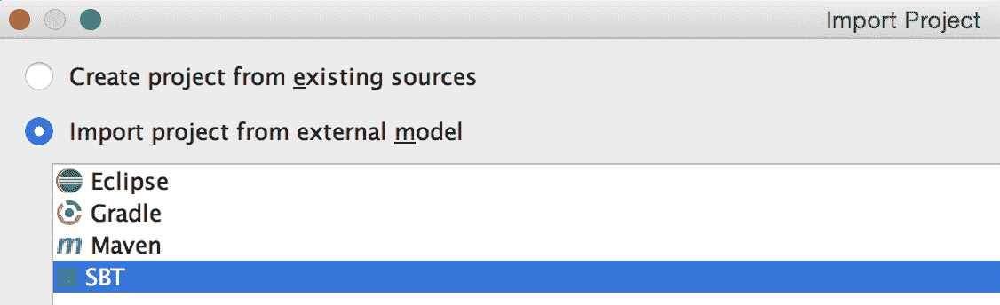

4.  保留 SBT 的默认选项，然后单击 Finish。
5.  SBT 需要一段时间才能从`build.sbt`导入引用。

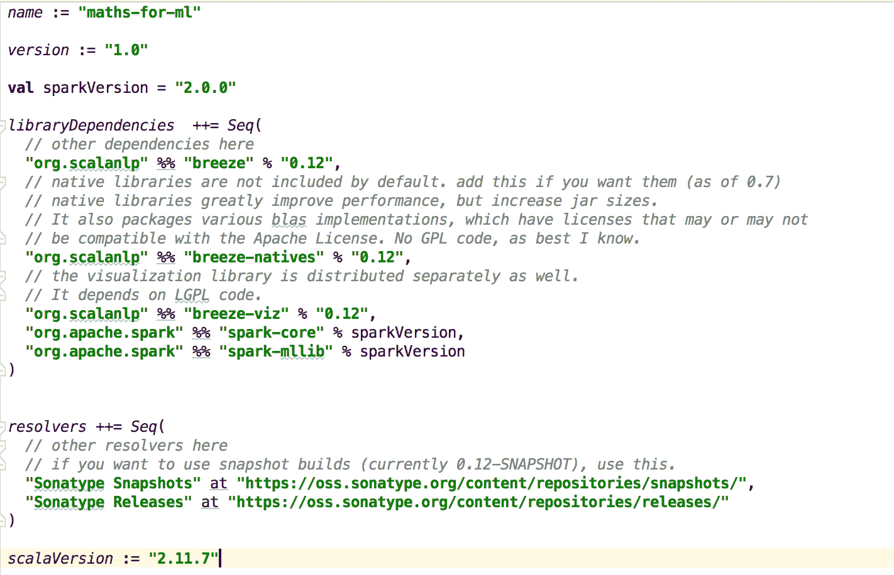

6.  最后，右键单击源文件并选择 Run‘Vector’。

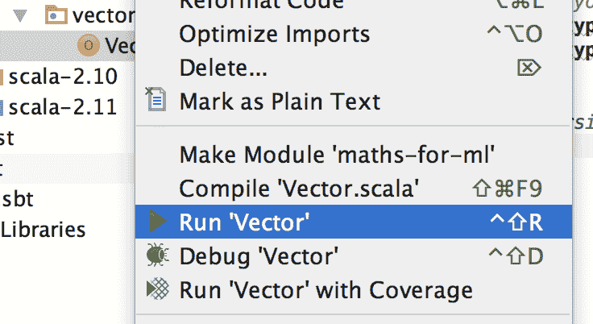

# 在命令行上设置 Scala 环境

要在本地设置环境，请执行下面列出的步骤：

1.  进入`Chapter 2`的根目录，选择合适的文件夹。

```scala
 $ cd /PATH/spark-ml/Chapter_02/breeze

```

Alternatively, choose the following:

```scala
 $ cd /PATH/spark-ml/Chapter_02/spark

```

2.  编译代码。

```scala
      $ sbt compile

```

3.  运行编译后的代码，并选择要运行的程序(显示的类取决于是在 Spark 还是 Breeze 文件夹中执行`sbt run`)。

```scala
 $ sbt run

 Multiple main classes detected, select one to run:
 ....
 Enter number:

```

# 菲尔茨 （人名）

域是以许多不同方式定义的数学的基本结构。 我们现在来看一下最基本的类型。

# 实数

实数是我们能想到的任何数；实数包括整数(0，1，2，3)、有理数(2/6，0.768，0.222...，3.4.)和无理数(π，&Sqrt;3)。 实数可以是正数、负数或零。 另一方面，虚数类似于&Sqrt;−1(负 1 的平方根)；请注意，无穷大不是实数。

# 复数

我们的理解是，一个数字的平方永远不能是负的。 在这种情况下，我们如何求解*x2*=*-9*？ 在数学中，我们有 i 的概念，作为解，也就是*x*=*3i*。 像 i、-i、3i 和 2.27i 这样的数字称为虚数。 “一个实数”+“一个虚数”构成一个“复数”。

*复数=(实部)+(虚部)i*

以下示例显示了使用 Breeze 数学库表示的复数：

```scala
import breeze.linalg.DenseVector 
import breeze.math.Complex 
val i = Complex.i 

// add 
println((1 + 2 * i) + (2 + 3 * i)) 

// sub 
println((1 + 2 * i) - (2 + 3 * i)) 

// divide 
println((5 + 10 * i) / (3 - 4 * i)) 

// mul 
println((1 + 2 * i) * (-3 + 6 * i)) 
println((1 + 5 * i) * (-3 + 2 * i)) 

// neg 
println(-(1 + 2 * i)) 

// sum of complex numbers 
val x = List((5 + 7 * i), (1 + 3 * i), (13 + 17 * i)) 
println(x.sum) 
// product of complex numbers 
val x1 = List((5 + 7 * i), (1 + 3 * i), (13 + 17 * i)) 
println(x1.product) 
// sort list of complex numbers 
val x2 = List((5 + 7 * i), (1 + 3 * i), (13 + 17 * i)) 
println(x2.sorted) 

```

上述代码为我们提供了以下结果：

```scala
3.0 + 5.0i
-1.0 + -1.0i -1.0 + 2.0i
-15.0 + 0.0i
-13.0 + -13.0i
-1.0 + -2.0i
19.0 + 27.0i
-582.0 + 14.0i
List(1.0 + 3.0i, 5.0 + 7.0i, 13.0 + 17.0i)

```

# 向量

矢量是描述为一组有序数字的数学对象。 它类似于集合，不同之处在于顺序是以矢量形式保持的。 所有成员都是实数的一部分。 维数为 n 的向量在几何上表示为*n*维空间中的一点。 向量的原点从零开始。

示例：

```scala
[2, 4, 5, 9, 10]
[3.14159, 2.718281828, −1.0, 2.0]
[1.0, 1.1, 2.0]

```

# 向量空间

线性代数是众所周知的向量空间代数。 通过将矢量与标量数*α*相乘，可以将场类型为实数或复数的矢量对象相加和缩放。

向量空间是向量对象的集合，这些向量对象可以相加和相乘在一起。 可以组合两个向量以产生向量空间中的第三个向量或另一个对象。 向量空间的公理具有有用的性质。 向量空间中的空间有助于研究物理空间的属性，例如，找出一个物体的距离有多近或多远。 向量空间的一个例子是三维欧几里得空间中的向量集合。 域*F*上的向量空间*V*具有以下性质：

*   矢量加法：用*v+w*表示，其中*v*和*w*是空间*V*的元素
*   标量乘法：用*α*v*表示，其中*α*是*F*的元素
*   结合性：表示为*u+(v+w)=(u+v)+w*，其中*u*、*v*和*w*是空间*V*的元素
*   可交换的：由*v+w=w+v*表示
*   分布：表示为*α*(v+w)=α*v+α*w*

在机器学习中，特征是向量空间的维度。

# 矢量类型

在 Scala 中，我们将使用 Breeze 库来表示向量。 向量可以表示为密集向量或稀疏向量。

# 微风中的媒介

Breeze 使用两种基本矢量类型-`breeze.linalg.DenseVector`和`breeze.linalg.SparseVector`-来表示前面显示的两种矢量类型。

是支持数值运算的数组的包装器。 让我们首先看一下密集向量计算；我们将使用 Breeze 创建密集向量对象，然后将索引 3 更新为新值。

```scala
import breeze.linalg.DenseVector 
val v = DenseVector(2f, 0f, 3f, 2f, -1f) 
v.update(3, 6f) 
println(v) 

```

这给我们提供了以下结果：`DenseVector (2.0, 0.0, 3.0, 6.0, -1.0)`

是一个大多数值为零的向量，并且支持数值运算。 让我们看一下稀疏向量计算；我们将使用 Breeze 创建一个稀疏向量对象，然后按 1 更新值。

```scala
import breeze.linalg.SparseVectorval sv:SparseVector[Double] = 
SparseVector(5)() 
sv(0) = 1 
sv(2) = 3 
sv(4) = 5 
val m:SparseVector[Double] = sv.mapActivePairs((i,x) => x+1) 
println(m) 

```

这给我们提供了以下结果：`SparseVector((0,2.0), (2,4.0), (4,6.0))`

# Spark 中的矢量

Spark MLlib 使用 Breeze 和 JBlas 进行内部线性代数运算。 它使用自己的类来表示使用`org.apache.spark.mllib.linalg.Vector`工厂定义的向量。 局部向量具有整数类型和从 0 开始的索引。 它的值存储为双类型。 本地向量存储在一台机器上，不能分发。 Spark MLlib 支持两种类型的局部向量，密集和稀疏，使用工厂方法创建。

下面的代码片段显示了如何在 Spark 中创建基本的稀疏和密集向量：

```scala
val dVectorOne: Vector = Vectors.dense(1.0, 0.0, 2.0) 
println("dVectorOne:" + dVectorOne) 
//  Sparse vector (1.0, 0.0, 2.0, 3.0) 
// corresponding to nonzero entries. 
val sVectorOne: Vector = Vectors.sparse(4,  Array(0, 2,3), 
   Array(1.0, 2.0, 3.0)) 
// Create a sparse vector (1.0, 0.0, 2.0, 2.0) by specifying its 
// nonzero entries. 
val sVectorTwo: Vector = Vectors.sparse(4, Seq((0, 1.0), (2, 2.0), 
  (3, 3.0))) 

```

前面的代码生成以下输出：

```scala
dVectorOne:[1.0,0.0,2.0]
sVectorOne:(4,[0,2,3],[1.0,2.0,3.0])
sVectorTwo:(4,[0,2,3],[1.0,2.0,3.0])

```

Spark 提供了多种访问和发现向量值的方法，如下所示：

```scala
val sVectorOneMax = sVectorOne.argmax
val sVectorOneNumNonZeros = sVectorOne.numNonzeros
val sVectorOneSize = sVectorOne.size
val sVectorOneArray = sVectorOne.toArray
val sVectorOneJson = sVectorOne.toJson

println("sVectorOneMax:" + sVectorOneMax)
println("sVectorOneNumNonZeros:" + sVectorOneNumNonZeros)
println("sVectorOneSize:" + sVectorOneSize)
println("sVectorOneArray:" + sVectorOneArray)
println("sVectorOneJson:" + sVectorOneJson)
val dVectorOneToSparse = dVectorOne.toSparse

```

前面的代码生成以下输出：

```scala
sVectorOneMax:3
sVectorOneNumNonZeros:3
sVectorOneSize:4
sVectorOneArray:[D@38684d54
sVectorOneJson:{"type":0,"size":4,"indices":[0,2,3],"values":
  [1.0,2.0,3.0]}
dVectorOneToSparse:(3,[0,2],[1.0,2.0])

```

# 向量运算

向量可以加、减、乘标量。 对向量的其他操作包括求平均值、归一化、比较和几何表示。

*   **Add 操作**：此代码显示了对矢量对象的按元素添加操作：

```scala
        // vector's 
        val v1 = DenseVector(3, 7, 8.1, 4, 5) 
        val v2 = DenseVector(1, 9, 3, 2.3, 8) 
        // elementwise add operation 
        def add(): Unit = { 
          println(v1 + v2) 
        } 

```

最后这段代码给出了如下结果：`DenseVector(4.0, 16.0, 11.1, 6.3, 13.0)` 

*   **乘法和点运算**：它是一种代数运算，它接受两个长度相等的数字序列，然后返回一个数字；从代数上讲，它是两个数字序列对应项的乘积之和。 它在数学上表示如下：


```scala
        a   b = |a| × |b| × cos(θ) OR a   b = ax × bx + ay × by 

        import breeze.linalg.{DenseVector, SparseVector} 
        val a = DenseVector(0.56390, 0.36231, 0.14601, 0.60294, 
           0.14535) 
        val b = DenseVector(0.15951, 0.83671, 0.56002, 0.57797, 
           0.54450) 
       println(a.t * b) 
       println(a dot b) 

```

上述代码为我们提供了以下结果：

```scala
 0.9024889161, 0.9024889161

```

```scala
        import breeze.linalg.{DenseVector, SparseVector} 
        val sva = 
           SparseVector(0.56390,0.36231,0.14601,0.60294,0.14535) 
        val svb = 
           SparseVector(0.15951,0.83671,0.56002,0.57797,0.54450) 
        println(sva.t * svb) 
        println(sva dot svb) 

```

最后一段代码给出了如下结果：`0.9024889161, 0.9024889161`

*   **查找****意味着：**此操作返回沿第一个数组维度的向量元素的平均值，其大小不等于`1`。 它在数学上表示如下：

```scala
        import breeze.linalg.{DenseVector, SparseVector} 
        import breeze.stats.mean 
        val mean = mean(DenseVector(0.0,1.0,2.0)) 
        println(mean) 

```

This gives us the result as follows: `1.0`

```scala
        import breeze.linalg.{DenseVector, SparseVector} 
        import breeze.stats.mean 
        val svm = mean(SparseVector(0.0,1.0,2.0)) 
        val svm1 = mean(SparseVector(0.0,3.0)) 
        println(svm, svm1) 

```

This gives us the result as follows: ` (1.0,1.5)`

*   **归一化向量**：每个向量都有一个量级，用毕达哥拉斯定理计算为*|v|=sqrt(x^2+y^2+z^2)；*这个量级是从原点(`0,0,0`)到向量所指示的点的一条直线的长度。 如果一个向量的量级是`1`，则它是正规的。 归一化一个向量意味着改变它，使它指向同一个方向(从原点开始)，但它的大小是 1。因此，归一化后的向量是一个方向相同的向量，但具有 Norm(Length)`1`。 它由^X 表示，并由以下公式给出：


Where 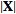 is the norm of . It is also called a unit vector.

```scala
        import breeze.linalg.{norm, DenseVector, SparseVector} 
        import breeze.stats.mean 
        val v = DenseVector(-0.4326, -1.6656, 0.1253, 0.2877, -
          1.1465) 
        val nm = norm(v, 1) 

        //Normalizes the argument such that its norm is 1.0 
        val nmlize = normalize(v) 

        // finally check if the norm of normalized vector is 1 or not 
        println(norm(nmlize)) 

```

This gives us the following result:

```scala
 Norm(of dense vector) = 3.6577

 Normalized vector is = DenseVector(-0.2068389122442966,  
      -0.7963728438143791, 0.05990965257561341, 0.1375579173663526,     
      -0.5481757117154094)

 Norm(of normalized vector) = 0.9999999999999999

```

*   **显示矢量**中的最小和最大元素：

```scala
        import breeze.linalg._ 
        val v1 = DenseVector(2, 0, 3, 2, -1) 
        println(argmin(v1)) 
        println(argmax(v1)) 
        println(min(v1)) 
        println(max(v1)) 

```

This gives us the result as follows: `4, 2, -1, 3`

*   **比较运算**：这将比较两个向量是否相等，以及是否存在小于或大于的运算：

```scala
        import breeze.linalg._ 
        val a1 = DenseVector(1, 2, 3) 
        val b1 = DenseVector(1, 4, 1) 
        println((a1 :== b1)) 
        println((a1 :<= b1)) 
        println((a1 :>= b1)) 
        println((a1 :< b1)) 
        println((a1 :> b1)) 

```

这为我们提供了以下结果：

```scala
 BitVector(0), BitVector(0, 1), BitVector(0, 2),   
      BitVector(1),    
      BitVector(2)

```

*   ****向量**的几何表示：**

 **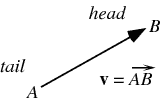

# 超平面

如果*n*不是 1、2 或 3，则很难看到字段类型实数的向量。对于*n*的任何值，熟悉的对象(如直线和平面)都是有意义的。 沿着由矢量*v*定义的方向通过由矢量 u 标记的点*P*的线*L*可以写成如下：

*L={u+tv|t**&in；R}*

给定两个非零矢量*u*和*v*，如果这两个矢量不在同一条线上，并且其中一个矢量是另一个矢量的标量倍数，则它们确定一个平面。 两个矢量的相加是通过将矢量首尾相接地放置在序列中以创建一个三角形来完成的。 如果 u 和*v*位于同一平面内，则它们的和位于*u*和*v*的平面内。 由两个矢量*u*和*v*表示的平面可以数学表示如下：

*{P+su+tv|s，t**&in；R}*

我们可以将平面的概念推广为一组*x+1*向量和*P，v1，.。 。 。 ，*R*中的 Vx*，n 与*x≤n*确定 x 维超平面：

*(P+X x i=1λivi|λi**&in；**R)*

# 机器学习中的向量

机器学习中的特征用 n 维向量表示。 在机器学习中，数据对象需要以数字格式表示，以便进行处理和统计分析。 例如，使用像素向量来表示图像。

# 母体 / 发源地 / 模板 / 唱片母版

域*F*上的矩阵是一个二维数组，其条目是*F*的元素。 实数域上的矩阵示例如下：

*1 2 3*

*10 20 30*

前面的矩阵有两行三列，我们称它为*2×3*矩阵。 传统上是用数字来指代行和列。 行 1 是(*1 2 3*)，行 2 是(*10 20 30*)；列 1 是(*110*)，列 2 是(*220*)，列 3 是(*330*)。 通常，m 行 n 列的矩阵称为*m×n*矩阵。 对于矩阵*A*，元素(*i，j*)被定义为第 i 行和第 j 列中的元素，并且使用 Ai、j 或 Aij 记法进行索引。 我们将经常使用蟒蛇符号，*A[i，j]*。 行*i*是向量(*A[i，0]，A[i，1]，A[i，2]，A[i，m−1]*)，列 j 是向量(*A[0，j]，A[1，j]，A[2，j]，A[n−1，j]*)。

# 矩阵的类型

在 Scala 中，我们将使用 Breeze 库来表示矩阵。 矩阵可以表示为稠密矩阵或 CSC 矩阵。

*   **密集矩阵**：通过构造函数方法调用创建密集矩阵。 它的元素可以访问和更新。 它是列主调，可以换位转换为行主调。

```scala
        val a = DenseMatrix((1,2),(3,4)) 
          println("a : n" + a) 
         val m = DenseMatrix.zeros[Int](5,5) 

        The columns of a matrix can be accessed as Dense Vectors, and    
        the rows as  Dense Matrices. 

          println( "m.rows :" + m.rows + " m.cols : "  + m.cols) 
          m(::,1) 
         println("m : n" + m) 

```

*   **转置矩阵**：转置矩阵意味着交换它的行和列。 P×Q 矩阵的转置(记为 MT)是 Q×P 矩阵，使得(MT)j，i=Mi，j 对于每个 i&in；P，j&in；Q.向量转置以创建矩阵行。

```scala
        m(4,::) := DenseVector(5,5,5,5,5).t 
        println(m) 

```

The output of the preceding program is as follows:

```scala

 a : 
 1  2 
 3  4 
 Created a 5x5 matrix
 0  0  0  0  0 
 0  0  0  0  0 
 0  0  0  0  0 
 0  0  0  0  0 
 0  0  0  0  0 
 m.rows :5 m.cols : 5
 First Column of m : 
            DenseVector(0, 0, 0, 0, 0)
            Assigned 5,5,5,5,5 to last row of m.

 0  0  0  0  0 
 0  0  0  0  0 
 0  0  0  0  0 
      0  0  0  0  0 
      5  5  5  5  5 

```

*   **CSC 矩阵：****CSC**矩阵称为**压缩稀疏列**矩阵。 CSC 矩阵内的每一列表示一个稀疏向量。 CSC 矩阵支持所有矩阵运算，并使用`Builder`构造。

```scala
        val builder = new CSCMatrix.Builder[Double](rows=10, 
           cols=10) 
        builder.add(3,4, 1.0) 
        // etc. 
        val myMatrix = builder.result() 

```

# Spark 中的矩阵

Spark 中的局部矩阵具有整数类型的行和列索引。 值是双类型的。 所有值都存储在一台机器上。 MLlib 支持以下矩阵类型：

*   **密集矩阵**：条目值存储在以列为主的单、双数组中的矩阵。
*   **稀疏矩阵**：以列为主的 CSC 格式存储非零条目值的矩阵。 例如，下面的密集矩阵存储在矩阵大小(3，2)的一维数组[`2.0, 3.0, 4.0, 1.0, 4.0, 5.0`]中：

`2.0 3.0` `4.0 1.0` `4.0 5.0`

这是一个密集稀疏矩阵的示例：

```scala
       val dMatrix: Matrix = Matrices.dense(2, 2, Array(1.0, 2.0, 3.0, 
          4.0)) 
        println("dMatrix: n" + dMatrix) 

        val sMatrixOne: Matrix = Matrices.sparse(3, 2, Array(0, 1, 3), 
           Array(0, 2, 1), Array(5, 6, 7)) 
        println("sMatrixOne: n" + sMatrixOne) 

        val sMatrixTwo: Matrix = Matrices.sparse(3, 2, Array(0, 1, 3), 
           Array(0, 1, 2), Array(5, 6, 7)) 
        println("sMatrixTwo: n" + sMatrixTwo) 

```

上述代码的输出如下所示：

```scala
 [info] Running linalg.matrix.SparkMatrix 
 dMatrix: 
 1.0  3.0 
 2.0  4.0 
 sMatrixOne: 
 3 x 2 CSCMatrix
 (0,0) 5.0
 (2,1) 6.0
 (1,1) 7.0
 sMatrixTwo: 
 3 x 2 CSCMatrix
 (0,0) 5.0
 (1,1) 6.0
 (2,1) 7.0

```

# Spark 中的分布式矩阵

分布式矩阵具有长型行和列索引。 它具有双类型的值，以分布式方式存储在一个或多个 RDDS 中。 在 Spark 中实现了四种不同类型的分布式矩阵。 它们都是`DistributedMatrix`的子类。


`RowMatrix`：A`RowMatrix`是面向行的分布式矩阵，没有有意义的行索引。 (在面向行的矩阵中，数组的行的连续元素在存储器中是连续的)。 `RowMatrix`被实现为其行的 RDD。 每行都是一个局部向量。 对于`RowMatrix`，列数必须小于或等于*2^31*，以便将单个本地向量传递给驱动程序，并且还可以使用单个节点存储或操作该向量。

下面的示例显示如何从`Vectors`类创建行矩阵(密集和稀疏)：

```scala
val spConfig = (new 
    SparkConf).setMaster("local").setAppName("SparkApp") 
     val sc = new SparkContext(spConfig) 
     val denseData = Seq( 
       Vectors.dense(0.0, 1.0, 2.1), 
       Vectors.dense(3.0, 2.0, 4.0), 
       Vectors.dense(5.0, 7.0, 8.0), 
       Vectors.dense(9.0, 0.0, 1.1) 
     ) 
     val sparseData = Seq( 
       Vectors.sparse(3, Seq((1, 1.0), (2, 2.1))), 
       Vectors.sparse(3, Seq((0, 3.0), (1, 2.0), (2, 4.0))), 
       Vectors.sparse(3, Seq((0, 5.0), (1, 7.0), (2, 8.0))), 
       Vectors.sparse(3, Seq((0, 9.0), (2, 1.0))) 
     ) 

val denseMat = new RowMatrix(sc.parallelize(denseData, 2)) 
val sparseMat = new RowMatrix(sc.parallelize(sparseData, 2)) 

println("Dense Matrix - Num of Rows :" + denseMat.numRows()) 
println("Dense Matrix - Num of Cols:" + denseMat.numCols()) 
println("Sparse Matrix - Num of Rows :" + sparseMat.numRows()) 
println("Sparse Matrix - Num of Cols:" + sparseMat.numCols()) 

sc.stop() 

```

上述代码的输出如下：

```scala
Using Spark's default log4j profile: 
org/apache/spark/log4j-  
defaults.properties
16/01/27 04:51:59 INFO SparkContext: Running Spark version 
1.6.0
Dense Matrix - Num of Rows :4
Dense Matrix - Num of Cols:3
...
Sparse Matrix - Num of Rows :4
Sparse Matrix - Num of Cols :3

```

`IndexedRowMatrix`：`IndexedRowMatrix`类似于`RowMatrix`，但具有行索引，可用于标识行和执行联接。 在下面的代码清单中，我们创建了一个具有适当行索引的 4x3`IndexedMatrix`：

```scala
val data = Seq(
(0L, Vectors.dense(0.0, 1.0, 2.0)),
(1L, Vectors.dense(3.0, 4.0, 5.0)),
(3L, Vectors.dense(9.0, 0.0, 1.0))
).map(x => IndexedRow(x._1, x._2))
val indexedRows: RDD[IndexedRow] = sc.parallelize(data, 2)
val indexedRowsMat = new IndexedRowMatrix(indexedRows)
 println("Indexed Row Matrix - No of Rows: " + 
indexedRowsMat.numRows())
 println("Indexed Row Matrix - No of Cols: " + 
indexedRowsMat.numCols())

```

上述代码清单的输出如下所示：

```scala
Indexed Row Matrix - No of Rows: 4
Indexed Row Matrix - No of Cols: 3

```

`CoordinateMatrix`：这是一个以坐标列表(COO)格式存储的分布式矩阵，由其条目的 RDD 支持。

COO 格式存储(行、列、值)元组列表。 对条目进行排序(先是行索引，然后是列索引)，以缩短随机访问时间。 这种格式非常适合增量矩阵构造。

```scala
val entries = sc.parallelize(Seq( 
      (0, 0, 1.0), 
      (0, 1, 2.0), 
      (1, 1, 3.0), 
      (1, 2, 4.0), 
      (2, 2, 5.0), 
      (2, 3, 6.0), 
      (3, 0, 7.0), 
      (3, 3, 8.0), 
      (4, 1, 9.0)), 3).map { case (i, j, value) => 
      MatrixEntry(i, j, value) 
    } 
val coordinateMat = new CoordinateMatrix(entries) 
println("Coordinate Matrix - No of Rows: " + 
  coordinateMat.numRows()) 
println("Coordinate Matrix - No of Cols: " + 
  coordinateMat.numCols()) 

```

上述代码的输出如下所示：

```scala
Coordinate Matrix - No of Rows: 5
Coordinate - No of Cols: 4

```

# 矩阵运算

可以对矩阵执行不同类型的运算。

*   **元素加法**：给定两个矩阵 a 和 b，两个(a+b)的相加意味着将两个矩阵的每个元素相加。

Breeze

```scala
        val a = DenseMatrix((1,2),(3,4)) 
        val b = DenseMatrix((2,2),(2,2)) 
        val c = a + b 
        println("a: n" + a) 
        println("b: n" + b) 
        println("a + b : n" + c) 

```

最后一个代码的输出如下：

```scala
 a:1  2 
 3  4 
 b: 2  2 
 2  2 
 a + b : 
 3  4 
 5  6 

```

*   **元素乘法**：在此运算中，矩阵*a*的每个元素与矩阵相乘

==引用=外部链接==

```scala
        a :* b  
        val d = a*b 
        println("Dot product a*b : n" + d) 

```

上述代码的输出如下：

```scala
 Dot product a*b :
 6   6 
 14  14

```

*   **元素比较**：在此操作中，将 a 的每个元素与 b 进行比较。Breeze 中的代码如下：

Breeze

```scala
        a :< b 

```

上述代码的输出如下所示：

```scala
 a :< b 
 false  false 
 false  false

```

*   **就地加法**：这意味着将 a 的每个元素加 1。

Breeze The following is the output of the preceding code:

```scala
 Inplace Addition : a :+= 1
 2  3 
 4  5 
      value = a :+= 1
 println("Inplace Addition : a :+= 1n" + e)

```

*   **逐元素求和**：用于将矩阵的所有元素相加。 Breeze 中的代码如下：

==引用=外部链接==

```scala
        val sumA = sum(a) 
        println("sum(a):n" + sumA) 

```

以下是前面代码的输出：

```scala
 sum(a):
 14

```

*   **基于元素的 max**：要从矩阵中的所有元素中找出最大值，我们使用

```scala
        a.max

```

Breeze The code in Breeze can be written as follows:

```scala
        println("a.max:n" + a.max) 

```

*   **基于元素的 argmax**：用于获取具有最大值的元素的位置。

==引用=外部链接==

Code:

```scala
        println("argmax(a):n" + argmax(a)) 

```

前面命令的输出如下所示：

```scala
 argmax(a):
 (1,1)

```

*   **CELING**：这会将矩阵的每个元素舍入到下一个整数。

Breeze Code:

```scala
        val g = DenseMatrix((1.1, 1.2), (3.9, 3.5)) 
        println("g: n" + g) 
        val gCeil =ceil(g) 
        println("ceil(g)n " + gCeil) 

```

上述代码的输出如下所示：

```scala
 g: 
          1.1  1.2 
          3.9  3.5 

 ceil(g)
          2.0  2.0 
          4.0  4.0 

```

*   **Floor**：Floor 将每个元素的值四舍五入为较小值的最接近整数。

Breeze Code:

```scala
        val gFloor =floor(g) 
        println("floor(g)n" + gFloor) 

```

输出将如下所示：

```scala
 floor(g)
 1.0  1.0
 3.0  3.0

```

# 决定性的

`tr`M 表示矩阵*M*的迹；它是沿对角线的元素之和。 矩阵的迹通常用来衡量矩阵的“大小”。 行列式称为元素沿其对角线的乘积。


行列式主要用于线性方程组；它指示列是否线性相关，也有助于求矩阵的逆矩阵。 对于大型矩阵，使用拉普拉斯展开计算行列式。

```scala
val detm: Matrix = Matrices.dense(3, 3, Array(1.0, 3.0, 5.0, 2.0, 
  4.0, 6.0, 2.0, 4.0, 5.0)) 
print(det(detm)) 

```

# 特征值和特征向量

*Ax=b*是从静态问题中产生的线性方程。 另一方面，特征值用于动力学问题。 让我们假设 A 是一个以 x 为向量的矩阵；现在我们将解线性代数中的新方程*Ax=λx*。

当*A*乘以*x*时，矢量*x*改变其方向。 但有一些矢量与*Ax*方向相同-这些矢量称为**特征矢量，对于这些特征矢量，下面的方程适用于**：

*Ax=λx*

在最后一个方程中，向量*Ax*是向量*x*的λ倍，*λ*称为特征值。 特征值*λ*给出了向量的方向-如果它是相反的，或者方向相同。

*Ax=λx*还表示*det(A-λi)=0*，其中*i*是单位矩阵。 这确定了*n*个特征值。

特征值问题定义如下：

0

0

*A x-λi x=0*

*(A-λI)x=0*

如果 x 不为零，则前面的方程只有在*|A-λi|=0*时才有解。 利用这个方程，我们可以求出特征值。

```scala
val A = DenseMatrix((9.0,0.0,0.0),(0.0,82.0,0.0),(0.0,0.0,25.0)) 
val es = eigSym(A) 
val lambda = es.eigenvalues 
val evs = es.eigenvectors 
println("lambda is : " + lambda) 
println("evs is : " + evs) 

```

最后这段代码给我们提供了以下结果：

```scala
lambda is : DenseVector(9.0, 25.0, 82.0)
evs is : 1.0  0.0  0.0 
0.0  0.0  1.0 
0.0  1.0  -0.0 

```

# 奇异值分解

矩阵*M*：*m×n*(实数或复数)的奇异值分解是形式为*UΣV**的因式分解，其中*U*是*m×R*矩阵。 *Σ*是对角线上非负实数的*RxR*矩形对角阵，*V*是*nxr*酉阵。 *R*等于矩阵*M*的秩。

Sigma 的对角条目*ΣII*称为*M*的奇异值。 *U*的列和*V*的列分别称为*M*的左奇异向量和右奇异向量。

以下是 Apache Spark 中的 SVD 示例：

```scala
package linalg.svd 

import org.apache.spark.{SparkConf, SparkContext} 
import org.apache.spark.mllib.linalg.distributed.RowMatrix 
import org.apache.spark.mllib.linalg.{Matrix,       
SingularValueDecomposition, Vector, Vectors} 
object SparkSVDExampleOne { 

  def main(args: Array[String]) { 
    val denseData = Seq( 
      Vectors.dense(0.0, 1.0, 2.0, 1.0, 5.0, 3.3, 2.1), 
      Vectors.dense(3.0, 4.0, 5.0, 3.1, 4.5, 5.1, 3.3), 
      Vectors.dense(6.0, 7.0, 8.0, 2.1, 6.0, 6.7, 6.8), 
      Vectors.dense(9.0, 0.0, 1.0, 3.4, 4.3, 1.0, 1.0) 
    ) 
    val spConfig = (new 
      SparkConf).setMaster("local").setAppName("SparkSVDDemo") 
    val sc = new SparkContext(spConfig) 
    val mat: RowMatrix = new RowMatrix(sc.parallelize(denseData, 2)) 

     // Compute the top 20 singular values and corresponding    
       singular vectors. 
    val svd: SingularValueDecomposition[RowMatrix, Matrix] = 
    mat.computeSVD(7, computeU = true) 
    val U: RowMatrix = svd.U // The U factor is a RowMatrix. 
    val s: Vector = svd.s // The singular values are stored in a 
      local dense  vector. 
    val V: Matrix = svd.V // The V factor is a local dense matrix. 
    println("U:" + U) 
    println("s:" + s) 
    println("V:" + V) 
    sc.stop() 
  } 
}

```

# 机器学习中的矩阵

矩阵被用作表示图像的数学对象、用于真实世界机器学习应用(如人脸或文本识别、医学成像、主成分分析、数值精度等)的数据集。

作为一个例子，这里解释了本征分解。 通过将许多数学对象分解成几个组成部分，或者通过寻找具有普遍性的性质，可以更好地理解它们。

就像整数被分解成素因数一样，矩阵分解被称为特征分解，我们将矩阵分解成特征向量和特征值。

矩阵*A*的特征向量*v*使得乘以*A*仅改变*v*的比例，如下所示：

_

标量*λ*被称为与该特征向量相对应的特征值。 然后，*A*的本征分解如下所示：

Можетбольшесыра，тембольшеврешки.

矩阵的特征分解具有许多关于矩阵的事实。 当且仅当任一特征值为 0 时，该矩阵是奇异的。 实对称矩阵的特征分解还可用于优化二次表达式等。 特征向量和特征值用于**主成分分析**。

以下示例显示如何使用`DenseMatrix`获取特征值和特征向量：

```scala
// The data 
val msData = DenseMatrix( 
  (2.5,2.4), (0.5,0.7), (2.2,2.9), (1.9,2.2), (3.1,3.0), 
  (2.3,2.7), (2.0,1.6), (1.0,1.1), (1.5,1.6), (1.1,0.9)) 

def main(args: Array[String]): Unit = { 
       val pca = breeze.linalg.princomp(msData) 

       print("Center" , msData(*,::) - pca.center) 

       //the covariance matrix of the data 

       print("covariance matrix", pca.covmat) 

       // the eigenvalues of the covariance matrix, IN SORTED ORDER 
       print("eigen values",pca.eigenvalues) 

       // eigenvectors 
       print("eigen vectors",pca.loadings) 
       print(pca.scores) 
} 

```

这为我们提供了以下结果：

```scala
eigen values = DenseVector(1.2840277121727839, 0.04908339893832732)
eigen vectors = -0.6778733985280118  -0.735178655544408 

```

# 功能

要定义一个像函数一样的数学对象，我们必须首先理解什么是集合。

集合是对象的无序集合，如 S={-4，4，-3，3，-2，2，-1，1，0}。 如果集合 S 不是无限的，我们使用|S|来表示元素的数量，这称为集合的基数。 如果*A*和*B*是有限集，则*|A**&rarrb；**B|=|A|**&rrb；**|B|*，称为笛卡尔积。

对于集合 A 中的每个输入元素，函数分配另一个集合 B 中的单个输出元素。A 称为函数的域，B 称为余域。 函数是一组配对*(x，y)*，这些配对中没有一个具有相同的第一元素。

示例：域为{1，2，3，.。 。 .}，其输入加倍是集合{(1，2)，(2，4)，(3，6)，(4，8)，...}

示例：域为{1，2，3，.。 。 .}&rarrb;{1，2，3，.。 。 .}，它乘以构成其输入的数字是{(1，1)，1)，((1，2)，2)，...，((2，1)，2)，((2，2)，4)，((2，3)，6)，...((3，1)，3)，((3，2)，6)，((3，3)，9)，...

给定输入的输出称为该输入的图像。 Q 在函数 f 下的像由*f(Q)*表示。 如果*f(Q)=s*，我们说 q 映射到 f 下的 s，我们记为*q->s*。 从中选择所有输出的集合是一个上域。

当我们想说 f 是一个有域 D 和余域*F*的函数时，我们把它写成*f：D->F*。

# 函数类型

**过程与函数**：

过程是对给定输入即产生输出的计算的描述。

函数或计算问题并不指示如何计算给定输入的输出。

对于同一规范，可能存在许多方法。

计算问题可能允许每个输入有几个可能的输出。

我们将用 Breeze 编写过程；通常，这些过程称为函数，但我们将该术语保留为数学对象。

*   **一对一功能**：

*f：d->F*是一对一的，如果*f(X)=f(Y)*隐含*x=y；*，即*x*和*y*都在*D 中。*

*   **到函数**：

*F：D->F*是指对*F*的每个*z*元素，在*D*中存在一个元素 a，使得*f(A)=z*。

如果一个函数是一对一的，那么它是可逆的。

*   **线性函数**：线性函数是图形为直线的函数。 线性函数的形式为*z=f(X)=a+bx*。 线性函数有一个因变量和一个自变量。 因变量为*z*，自变量为*x*。

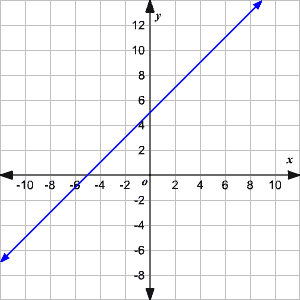

*   **多项式函数**：多项式函数仅涉及 x 的非负整数次幂，如二次、三次、四次等。 我们可以给出多项式的一般定义，并定义它的次数。 N 次多项式是形式为*f(X)=anxn+an−1xn−1+的函数。 。 。 +a2x2+a1x+a0*，其中 a 是实数，也称为多项式的系数。

例如：*f(X)=4x 3−3x 2+2*

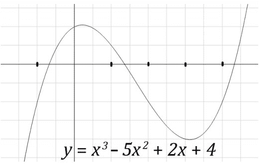

*   **标识函数**：对于任何域*D*，*IDD：D->D*将每个域元素*d*映射到其自身。

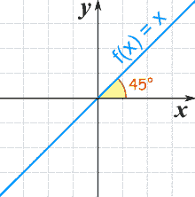

*   **常量函数**：这是一个用水平线表示的特殊函数。


*   **概率分布函数**：用于定义特定实验不同结果的相对可能性。 它为每个潜在的结果分配一个概率。 所有结果的概率之和必须等于 1。通常，概率分布是均匀分布。 这意味着，它为每个结果分配了相同的概率。 当我们掷骰子时，可能的结果是 1，2，3，4，5，概率定义为*Pr(1)=Pr(2)=Pr(3)=Pr(4)=Pr(5)=1/5*。

*   **高斯函数**：当事件数量较大时，可以使用高斯函数来描述事件。 高斯分布被描述为连续函数，也称为正态分布。 正态分布的平均值等于中位数，且关于中心具有对称性。

# 功能成分

对于函数*f：A->B*和*g：B->C*，函数 f 和函数*g*的函数组成是函数*(Gof)：A->C*，由*(Gof)(X)=g(f(X))*定义。 例如，如果*f：{1，2，3}->{A，B，C，D}*和*g：{A，B，C，D}->{4，5}*，*g(Y)=y2*和*f(X)=x+1*的组成为*(Gof)(X)=(x+1)2[T17*

函数组合是将一个函数应用于另一个函数的结果。 因此，在*(Gof)(X)=g(f(X))*中，首先应用*f()*，然后应用*g()*。 有些函数可以分解成两个(或更多)更简单的函数。

# 假设 / 前提

*x*表示输入变量，也称为输入特征，*y*表示我们试图预测的输出或目标变量。 对*(x，y)*称为训练样本，用于学习的数据集是*m*训练样本的列表，其中*{(x，y)}*是训练集。 我们还将使用*X*表示输入值空间，使用*Y*表示输出值空间。 对于训练集，要学习函数，*h：x→Y*，以便*h(X)*是*y*的值的预测器。 函数*h*称为**假设**。

当待预测的目标变量是连续的时，我们称学习问题为回归问题。 当*y*可以取少量离散值时，我们称之为分类问题。

假设我们选择将*y*近似为*x*的线性函数。

假设函数如下：

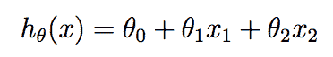

在最后一个假设函数中，*θi*是参数，也称为权重，它将从*X*到*Y*的线性函数空间参数化。为了简化表示法，我们还引入了让*X0=1*(这是截取项)的约定，使得：


在 RHS 上，我们将*θ*和*x*都看作向量，n 是输入变量的数量。

在我们继续之前，重要的是要注意，我们现在将从数学基础过渡到学习算法。 优化代价函数并学习*θ*将为理解机器学习算法奠定基础。

给定一个训练集，我们如何学习参数*θ*？ 一种看起来可能的方法是使给定训练示例的*h(X)*接近*y*。 我们将定义一个函数，为*θ*s 的每个值测量*h(x(I))*s 与相应的*y(I)*s 的距离。我们将其定义为成本函数。

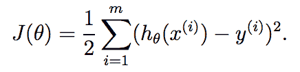

# 梯度下降

梯度下降的 SGD 实现使用数据示例的简单分布式采样。 损失是最优化问题的一部分，因此是一个真正的次梯度。


这需要访问完整的数据集，而这并不是最优的。

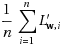

参数*MiniBatchFraction*指定要使用的完整数据的分数。 这个子集上的梯度的平均值

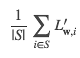

是一个随机梯度。 *S*是大小为*|S|=mini BatchFraction*的采样子集。

在下面的代码中，我们展示了如何在小批量上使用随机顺势下降来计算重量和损失。 这个程序的输出是重量和损失的向量。

```scala
object SparkSGD { 
 def main(args: Array[String]): Unit = { 
    val m = 4 
    val n = 200000 
    val sc = new SparkContext("local[2]", "") 
    val points = sc.parallelize(0 until m, 
      2).mapPartitionsWithIndex { (idx, iter) => 
      val random = new Random(idx) 
      iter.map(i => (1.0, 
       Vectors.dense(Array.fill(n)(random.nextDouble())))) 
    }.cache() 
    val (weights, loss) = GradientDescent.runMiniBatchSGD( 
      points, 
      new LogisticGradient, 
      new SquaredL2Updater, 
      0.1, 
      2, 
      1.0, 
      1.0, 
      Vectors.dense(new Array[Double](n))) 
    println("w:"  + weights(0)) 
    println("loss:" + loss(0)) 
    sc.stop() 
  } 

```

# 先验、可能和后验

贝叶斯定理陈述如下：

*后验=先验*似然*

这也可以表示为*P(A|B)=(P(B|A)*P(A))/P(B)*，其中*P(A|B)*是给定*B*时*A*的概率，也称为后验概率。

**之前**：表示数据对象在观察之前或之前的知识或不确定性的概率分布

**后验**：表示观察数据对象后可能有哪些参数的条件概率分布

**可能性**：属于某一特定类别或类别的概率。

这表示如下：


# 微积分 / 演算 / 结石

微积分是一种有助于研究事物如何变化的数学工具。 它提供了一个对发生变化的系统进行建模的框架，并提供了一种推断此类模型预测的方法。

# 微分 / 微分学

微积分的核心是导数，导数定义为给定函数相对于其一个变量的瞬时变化率。 求导数的研究称为微分。 在几何上，已知点处的导数由函数图形的切线的斜率给出，前提是导数存在，并且定义在该点处。

差异化是整合的反面。 微分有几个应用，就像在物理学中，位移的导数是速度，速度的导数是加速度。 导数主要用来求函数的最大值或最小值。

在机器学习中，我们处理对数百或更多维的变量或特征进行运算的函数。 我们计算函数在变量每一维上的导数，并将这些偏导数组合成一个向量，这就是所谓的梯度。 同样，取梯度的二阶导数得到一个称为**Hessian**的矩阵。

梯度和黑森的知识帮助我们定义了下降方向和下降速率，这告诉我们应该如何在我们的函数空间中旅行，以便到达最底点，以便使函数最小化。

下面是一个简单目标函数的示例(权重为*x*、*N*个数据点和*D*个维度的线性回归，采用矢量化表示法：

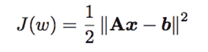

拉格朗日乘子法是微积分中的一种标准方法，用于在涉及约束的情况下最大化或最小化函数。

# 积分学 / 比较 differential calculus .

积分学将颗粒状碎片连接(集成)在一起，得出总和。 它也被称为反差分，其中差分是将其分成小块，并研究它是如何改变的，如上一节所述。

积分通常用来求函数图形下的面积。

# 拉格朗日乘子

在数学优化问题中，利用拉格朗日乘子法求解等式约束下函数的局部极小值和极大值。 一个很好的例子是，找到在给定约束下的最大熵分布。

这最好用一个例子来解释。 假设我们必须在 y=x+1 的条件下最大化*K(x，y)=-x2-y2。*

约束函数为*g(x，y)=x-y+1=0*。 然后，*L*乘数变为：

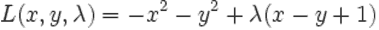

对*x*、*y*和λ进行微分，并设置为*0*，我们得到以下结果：


解前面的方程，我们得到*x=-0.5*，*y=0.5*，*lambda=-1*。

# 阴谋 / 情节 / 小块地 / 图表

在本部分中，我们将了解如何使用 Breeze 从 Breeze`DenseVector`创建一个简单的线条图。

Breze 使用了 Scala 绘图工具的大部分功能，尽管 API 有所不同。 在下面的示例中，我们使用一些值创建两个矢量`x1`和`y`，并绘制一条线并将其保存到 PNG 文件中：

```scala
package linalg.plot 
import breeze.linalg._ 
import breeze.plot._ 

object BreezePlotSampleOne { 
  def main(args: Array[String]): Unit = { 

    val f = Figure() 
    val p = f.subplot(0) 
    val x = DenseVector(0.0,0.1,0.2,0.3,0.4,0.5,0.6,0.7,0.8) 
    val y = DenseVector(1.1, 2.1, 0.5, 1.0,3.0, 1.1, 0.0, 0.5,2.5) 
    p += plot(x,  y) 
    p.xlabel = "x axis" 
    p.ylabel = "y axis" 
    f.saveas("lines-graph.png") 
  } 
 } 

```

上面的代码生成以下线条图：

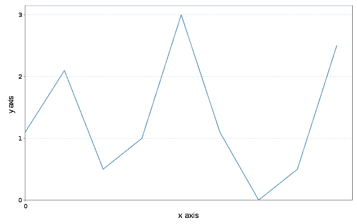

微风还支持直方图。 这是针对不同样本大小的`100,000`和`100,0000`正态分布的随机数绘制到`100`桶中的。

```scala
package linalg.plot 
import breeze.linalg._ 
import breeze.plot._ 

object BreezePlotGaussian { 
  def main(args: Array[String]): Unit = { 
    val f = Figure() 
    val p = f.subplot(2, 1, 1) 
    val g = breeze.stats.distributions.Gaussian(0, 1) 
    p += hist(g.sample(100000), 100) 
    p.title = "A normal distribution" 
    f.saveas("plot-gaussian-100000.png") 
  } 
 } 

```


下图显示了包含 1000000 个元素的高斯分布：


A Gaussian distribution with 100 elements

# 简略的 / 概括的 / 简易判罪的 / 简易的

在本章中，您学习了对机器学习有用的线性代数的基础知识，以及向量和矩阵等基本结构。 您还学习了如何使用 Spark 和 Breeze 对这些构造进行基本操作。 我们研究了像奇异值分解(SVD)这样的技术来转换数据。 我们还研究了线性代数中函数类型的重要性。 最后，您学习了如何使用微风绘制基本图表。 在下一章中，我们将概述机器学习系统、组件和体系结构。**