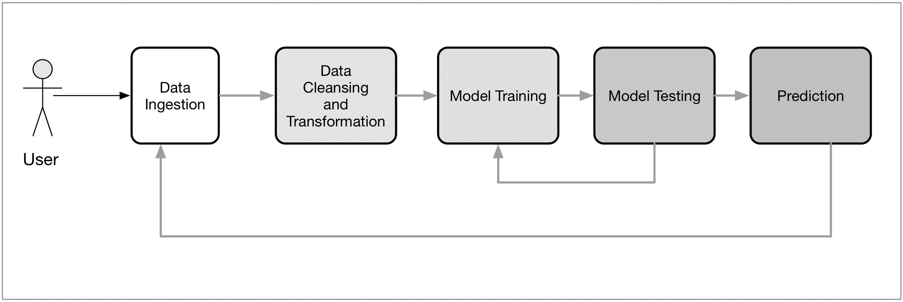
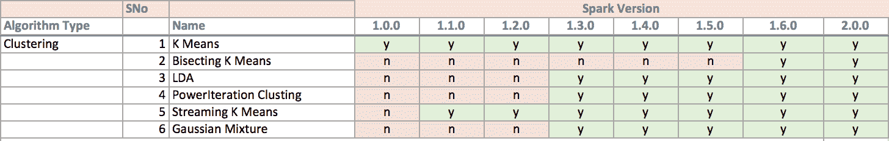
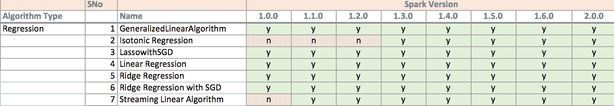

# 三、机器学习系统的设计

在本章中，我们将为一个以 Spark 为核心计算引擎的智能分布式机器学习系统设计一个高层架构。 我们将关注的问题将是利用基于网络的企业的现有架构，并对其进行重新设计，以使用自动机器学习系统为企业的关键领域提供动力。

在我们更深入地研究我们的场景之前，我们将花一些时间来理解什么是机器学习。

然后我们将：

*   介绍一个假设的业务场景
*   提供当前架构的概述
*   探索机器学习系统可以增强或取代某些业务功能的各种方式
*   基于这些想法提供一个新的体系结构

现代大规模数据环境包括以下要求：

*   它必须与系统的其他组件集成，特别是与数据收集和存储系统、分析和报告以及前端应用集成
*   它应该很容易扩展，并且独立于体系结构的其余部分。 理想情况下，这应该是水平和垂直可伸缩性的形式
*   它应该允许针对所考虑的工作负载类型(即机器学习和迭代分析应用)进行有效的计算
*   如果可能，它应该同时支持批处理和实时工作负载

作为一个框架，Spark 符合这些标准。 然而，我们必须确保在 Spark 上设计的机器学习系统也符合这一标准。 如果一个算法最终会出现瓶颈，导致我们的系统在这些需求中的一个或多个方面失败，那么实现算法是没有好处的。

# 什么是机器学习？

机器学习是数据挖掘的一个子领域。 虽然数据挖掘已经存在了 50 多年，但机器学习是一个子集，它使用一大群机器来分析和提取大数据集中的知识。

机器学习与计算统计学密切相关。 它与数学优化有很强的联系；它为该领域提供了方法、理论和应用领域。 机器学习被用于各种类型的计算任务，在这些任务中，设计和编程显式算法是不可行的。 示例应用有垃圾邮件过滤、**光学字符识别**(**OCR**)、搜索引擎和计算机视觉。 机器学习有时与数据挖掘相结合，后者更注重探索性数据分析，被称为无监督学习。

根据学习系统可用的学习信号的性质，机器学习系统可以分为三类。 学习算法从提供的输入中发现结构。 它可以有一个目标(隐藏模式)，也可以是一种试图找到特征的手段。

*   **无监督学习**：不给学习系统提供输出标签。 它自己从给出的输入中找到结构
*   **监督学习**：系统由人提供输入和期望输出，目标是学习一个将输入映射到输出的模型
*   **强化学习**：系统与环境交互，在该环境中，系统执行指定的目标，而无需人工明确告知它是否已接近目标

在后面的章节中，我们将把有监督和无监督学习映射到各个章节。

# MovieStream 简介

为了更好地说明我们架构的设计，我们将介绍一个实际场景。 让我们假设我们刚刚被任命领导 MovieStream 的数据科学团队，MovieStream 是一家虚构的互联网公司，向其用户提供流媒体电影和电视节目。

MovieStream 系统如下图所示：

MovieStream's current architecture

正如我们在上图中看到的，目前，MovieStream 的内容编辑团队负责决定在网站的各个部分推广和播放哪些电影和节目。 他们还负责为 MovieStream 的批量营销活动创建内容，包括电子邮件和其他直接营销渠道。 目前，MovieStream 收集用户累计观看哪些电影的基本数据，并可以访问用户在注册该服务时从他们那里收集的一些人口统计数据。 此外，他们还可以访问有关其目录中书目的一些基本元数据。

MovieStream 可以自动处理目前由内容团队处理的许多功能。

# 机器学习系统的业务用例

也许我们应该回答的第一个问题是，**到底为什么要使用机器学习？**

 *为什么 MovieStream 不干脆继续人类主导的决策呢？ 使用机器学习的原因有很多(当然还有一些不使用的原因)，但这里提到了最重要的几个：

*   涉及的数据规模意味着，随着 MovieStream 的增长，完全人工参与很快变得不可行
*   模型驱动的方法，如机器学习和统计，通常可以从发现人类看不到的模式中受益(由于数据集的大小和复杂性)
*   模型驱动的方法可以避免人为和情感上的偏差(只要仔细应用正确的流程)

然而，没有理由说模型驱动和人工驱动的流程和决策不能共存。 例如，许多机器学习系统依靠接收标记数据来训练模型。 通常，标记这类数据既昂贵又耗时，并且需要人工输入。 这方面的一个很好的例子是将文本数据分类，或者给文本分配一个情感指示器。 许多真实世界的系统使用某种形式的人工驱动系统来生成此类数据(或至少部分数据)的标签，以向模型提供训练数据。 然后，这些模型被用来在更大范围内对实时系统进行预测。

在 MovieStream 的背景下，我们不必担心我们的机器学习系统会让内容团队变得多余。 事实上，我们将看到，我们的目标是减轻机器学习可能能够更好地执行的耗时任务的负担，同时提供工具，使团队能够更好地理解用户和内容。 例如，这可以帮助他们选择为目录获取哪些新内容(这涉及大量成本，因此是业务的关键方面)。

# 个性化

也许机器学习在 MovieStream 业务中最重要的潜在应用之一就是个性化。 一般来说，个性化是指基于各种因素调整用户体验和呈现给他们的内容，这些因素可能包括用户行为数据以及外部因素。

**推荐**本质上是个性化的子集。 推荐通常指的是向用户展示我们希望用户感兴趣的项目列表。 推荐可以用于网页(例如，与推荐相关的产品)、通过电子邮件或其他直接营销渠道、通过移动应用等。

个性化与推荐非常相似，但是虽然推荐通常侧重于向用户显式地呈现产品或内容，但个性化更通用，而且通常更隐式。 例如，将个性化应用于 MovieStream 站点上的搜索可能允许我们根据给定用户的可用数据调整该用户的搜索结果。 这可能包括基于推荐的数据(在搜索产品或内容的情况下)，但也可能包括各种其他因素，如地理位置和过去的搜索历史。 对于用户来说，搜索结果是否适合他们的特定配置文件可能并不明显；这就是个性化倾向于更隐含的原因。

# 有针对性的营销和客户细分

以类似于推荐的方式，目标营销使用一个模型来选择针对用户的目标。 虽然推荐和个性化通常集中在一对一的情况下，但细分方法可能会尝试根据特征(可能还包括行为数据)将用户分配到组中。 该方法可能相当简单，也可能涉及尝试根据特征(可能还包括行为数据)将用户分配到组中的方法。 该方法可能相当简单，也可能涉及机器学习模型，如集群。 无论哪种方式，结果都是一组细分任务，这可能会让我们了解每一组用户的广泛特征，是什么让他们在一个组内彼此相似，又是什么让他们与不同组中的其他人不同。

这可以帮助 MovieStream 更好地了解用户行为的驱动因素，还可能允许更广泛的目标定位方法，即以群体为目标，而不是(或更有可能是)通过个性化直接一对一定位。

当我们不一定有可用的标签数据时(某些用户和内容配置文件数据就是这种情况)，这些方法也会有所帮助，但我们仍然希望执行比完全一刀切的方法更有针对性的目标。

# 预测建模和分析

第三个可以应用机器学习的领域是预测分析。 这是一个非常宽泛的术语，在某些方面，它还包括推荐、个性化和针对性。 在这种情况下，由于推荐和细分在某种程度上是不同的，我们使用术语**预测建模**来指代寻求进行预测的其他模型。 这方面的一个例子可以是这样的模型，该模型在关于新书可能有多受欢迎的任何数据可用之前预测新书的潜在观看活动和收入。 MovieStream 可以使用过去的活动和收入数据以及内容属性来创建回归模型，该模型可用于预测全新的标题。

作为另一个例子，我们可以使用**分类模型**自动将标签、关键字或类别分配给我们只有部分数据的新书目。

# 机器学习模型的类型

虽然我们只有一个例子，但还有很多其他例子，当我们介绍每个机器学习任务时，我们将在相关章节中涉及其中一些。

但是，我们可以大致将前面的用例和方法分为两类机器学习：

*   **监督学习**：这些类型的模型使用标记数据进行学习。 推荐引擎、回归和分类都是有监督的学习方法的例子。 这些模型中的标签可以是用户--电影评级(用于推荐)、电影标签(在前面的分类示例中)或收入数字(用于回归)。 我们将在[第 4 章](05.html)，*使用 Spark*构建推荐引擎，[第 6 章](06.html)，*使用 Spark*构建分类模型，以及[第 7 章](07.html)，*使用 Spark*构建回归模型中介绍监督学习模型。
*   **无监督学习**：当模型不需要标记数据时，我们称为无监督学习。 这些类型的模型试图学习或提取数据中的一些底层结构，或者将数据精简为其最重要的特征。 聚类、降维和某些形式的特征提取(如文本处理)都是无监督技术，将在[第 8 章](08.html)、*使用 Spark*、[第 9 章](09.html)、*使用 Spark*降维以及[第 10 章](10.html)、*使用 Spark*进行高级文本处理中讨论。

# 数据驱动的机器学习系统的组成

我们的机器学习系统的高级组件如下图所示。 此图说明了我们从中获取数据和存储数据的机器学习管道。 然后，我们将其转换为可用作机器学习模型输入的形式；训练、测试和改进我们的模型；然后，将最终模型部署到我们的生产系统中。 然后，在生成新数据时重复该过程。

A general machine-learning pipeline

# 数据接收和存储

我们的机器学习管道的第一步将是获取我们训练模型所需的数据。 与许多其他业务一样，MovieStream 的数据通常由用户活动、其他系统(通常称为机器生成的数据)和外部来源(例如，特定用户访问站点期间的时间和天气)生成。

这些数据可以通过各种方式获取，例如，从浏览器和移动应用事件日志收集用户活动数据，或访问外部 Web API 以收集有关地理位置或天气的数据。

一旦收集机制就位，通常需要存储数据。 这包括原始数据、中间处理产生的数据以及要在生产中使用的最终模型结果。

数据存储可能很复杂，涉及多种系统，包括 HDFS、Amazon S3 和其他文件系统；SQL 数据库(如 MySQL 或 PostgreSQL)；分布式 NoSQL 数据存储(如 HBase、Cassandra 和 DynamoDB)；以及搜索引擎(如 Solr 或 Elasticsearch)以流式传输数据系统(如 Kafka、Flume 或 Amazon Kinesis)。

出于本书的目的，我们将假设相关数据可供我们使用，因此我们将重点介绍以下管道中的处理和建模步骤。

# 数据清理和转换

大多数机器学习算法对特征进行操作，这些特征通常是将用于模型的输入变量的数字表示。

虽然我们可能希望将大部分时间花在探索机器学习模型上，但在大多数情况下，在前面的摄取步骤中通过各种系统和来源收集的数据都是原始形式的。 例如，我们可能会记录用户事件，例如用户何时查看电影信息页面、何时观看电影或何时提供一些其他反馈的详细信息。 我们还可能收集外部信息，如用户的位置(例如，通过他们的 IP 地址提供的信息)。 这些事件日志通常包含有关事件的文本和数字信息的某种组合(也可能包含其他形式的数据，如图像或音频)。

为了在我们的模型中使用这些原始数据，几乎在所有情况下，我们都需要执行预处理，这可能包括：

*   **过滤数据**：让我们假设我们想要从原始数据的子集创建一个模型，比如只有最近几个月的活动数据，或者只有符合特定条件的事件。
*   **处理丢失、不完整或损坏的数据**：许多实际数据集在某种程度上是不完整的。 这可能包括丢失的数据(例如，由于缺少用户输入)或不正确或有缺陷的数据(例如，由于数据接收或存储中的错误、技术问题或错误，或者软件或硬件故障)。 我们可能需要过滤掉坏数据，或者决定一种方法来填充丢失的数据点(例如，使用数据集中的平均值来填充丢失的数据点)。
*   **处理潜在的异常、错误和离群值**：错误或离群值数据可能会扭曲模型训练的结果，因此我们可能希望过滤掉这些情况或使用能够处理离群值的技术。
*   **将不同的数据源**连接在一起：例如，我们可能需要将每个用户的事件数据与不同的内部数据源(如用户配置文件)以及外部数据(如地理位置、天气和经济数据)进行匹配。
*   **聚合数据**：某些模型可能需要以某种方式聚合的输入数据，例如计算每个用户的许多不同事件类型的总和。

一旦我们对数据执行了初始预处理，我们通常需要将数据转换为适合机器学习模型的表示形式。 对于许多模型类型，此表示将采用包含数值数据的矢量或矩阵结构的形式。 数据转换和特征提取过程中的常见挑战包括：

*   获取分类数据(例如用于地理位置的国家或用于电影的类别)，并将其编码为数字表示。
*   从文本数据中提取有用的特征。
*   处理图像或音频数据。
*   将数值数据转换为分类数据，以减少变量可以采用的值的数量。 例如，将年龄变量转换为存储桶(如 25-35、45-55 等)。
*   转换数值特征；例如，对数值变量应用对数转换可以帮助处理具有非常大范围值的变量。
*   对数值特征进行标准化和标准化可确保模型的所有不同输入变量具有一致的尺度。 许多机器学习模型需要标准化输入才能正常工作。
*   特征工程，这是组合或转换现有变量以创建新特征的过程。 例如，我们可以创建一个新变量，该变量是其他一些数据的平均值，例如用户观看电影的平均次数。

我们将通过本书中的示例介绍所有这些技术。

这种数据清理、探索、聚合和转换步骤可以使用 Spark 的核心 API 函数和 SparkSQL 引擎来执行，更不用说其他外部 Scala、Java 或 Python 库了。 我们可以利用 Spark 的 Hadoop 兼容性从前面提到的各种存储系统读取数据和向其中写入数据。

如果涉及到流输入，我们还可以利用 Spark 流。

# 模型训练和测试循环

一旦我们有了适合我们模型的形式的训练数据，我们就可以继续模型的训练和测试阶段。 在这一阶段，我们主要关注模型选择。 这可以参考为我们的任务选择最佳的建模方法，或者为给定的模型选择最佳的参数设置。 事实上，术语模型选择通常指的是这两个过程，因为在许多情况下，我们可能希望尝试各种模型并选择性能最佳的模型(每个模型的参数设置都是最佳的)。 在这一阶段，探索不同模型的组合(称为集合方法)的应用也是很常见的。

这通常是一个相当简单的过程，即在我们的训练数据集上运行我们选择的模型，并在测试数据集上测试其性能(即，模型在训练阶段没有看到的一组用于评估模型的数据)。 这个过程被称为交叉验证。

有时，模型往往过度拟合或不完全收敛，这取决于数据集的类型和使用的迭代次数。

在 ML 和 Spark 中使用了集成方法，如梯度增强树和随机森林，以避免过度拟合。

然而，由于我们通常使用的数据规模很大，在整个数据集的较小代表性样本上执行初始训练测试循环或在可能的情况下使用并行方法执行模型选择通常是有用的。

对于这一部分，Spark 的内置机器学习库 MLlib 非常适合。 在这本书中，我们将把大部分注意力集中在各种机器学习技术的模型训练、评估和交叉验证步骤上，使用 MLlib 和 Spark 的核心功能。

# 模型部署和集成

一旦我们找到了最优的列车测试循环，我们可能仍然面临着将模型部署到生产系统以使其能够用于做出可操作的预测的任务。

通常，该过程涉及将训练好的模型导出到中央数据存储，生产服务系统可以从该中央数据存储获得最新版本。 因此，随着新模型的训练，现场系统*周期性地刷新*模型。

# 模型监控和反馈

监控我们的机器学习系统在生产中的性能至关重要。 一旦我们部署了我们的最佳训练模型，我们希望了解它在“野外”中的表现。 在新的、看不见的数据上，它的表现是否与我们预期的一样？ 它的准确性够好吗？ 现实情况是，无论我们在前几个阶段尝试进行多少模型选择和调整，衡量真正性能的唯一方法是观察我们的生产系统中发生的情况。

除了批处理模式模型创建之外，还有一些使用 Spark Streaming 构建的模型，这些模型本质上是实时的。

此外，请记住，模型准确性和预测性能只是真实系统的一个方面。 通常，我们关心的是与业务绩效(例如，收入和盈利能力)或用户体验(例如，在我们网站上花费的时间以及我们的用户总体活跃程度)相关的其他指标。 在大多数情况下，我们不能轻松地将模型预测性能映射到这些业务指标。 推荐或目标系统的准确性可能很重要，但它只与我们关心的真正指标间接相关，即我们是否正在改善用户体验、活跃度以及最终的收入。

因此，在现实系统中，我们应该同时监控模型准确性指标和业务指标。 如果可能，我们应该能够试验在生产中运行的不同模型，以允许我们通过更改模型来针对这些业务度量进行优化。 这通常是使用实时剥离测试来完成的。 然而，正确地做到这一点并不是一件容易的事情，现场测试和实验的成本也很高，因为错误、性能不佳和使用基线模型(它们提供了我们测试生产模型所依据的控制)可能会对用户体验和收入产生负面影响。

这个阶段的另一个重要方面是**模型反馈**。 在这个过程中，我们模型的预测将反馈到用户行为中；这反过来又会反馈到我们的模型中。 在现实世界的系统中，我们的模型通过影响决策和潜在的用户行为，本质上影响着它们自己未来的训练数据。

例如，如果我们部署了推荐系统，那么通过提供推荐，我们可能会影响用户行为，因为我们只允许用户选择有限的选项。 我们希望这个选择与我们的模型相关；然而，这个反馈循环反过来会影响我们模型的训练数据。 这反过来又会反馈给现实世界的表现。 可能会陷入不断缩小的反馈循环；最终，这会对模型准确性和我们重要的业务指标产生负面影响。

幸运的是，我们可以尝试通过一些机制来限制这种反馈循环的潜在负面影响。 其中包括提供一些公正的训练数据，让一小部分数据来自没有接触到我们的模型的用户，或者在我们平衡探索的方式上保持原则，了解更多关于我们的数据，并利用我们所学到的知识来改进我们的系统的性能。

我们将在[第 11 章](11.html)，*中简要介绍使用 Spark 流技术的实时机器学习*。

# 批量与实时

在前面的小节中，我们概述了常见的批处理方法，其中使用所有数据或所有数据的子集定期重新训练模型。 由于前面的管道需要一些时间才能完成，因此可能无法使用此方法在新数据到达时立即更新模型。

虽然我们将在本书中主要介绍批处理机器学习方法，但有一类机器学习算法称为**在线学习**；当新数据输入模型时，它们会立即更新，从而实现实时系统。 一个常见的例子是线性模型的在线优化算法，例如随机梯度下降。 我们可以用例子来学习这个算法。 这些方法的优点在于，系统可以非常快速地对新信息做出反应，并且系统可以适应底层行为的变化(即，如果输入数据的特征和分布随着时间的推移而改变，这在现实世界中几乎总是如此)。

然而，在线学习模式在生产环境中也面临着自己独特的挑战。 例如，实时接收和转换数据可能很困难。 在纯在线设置中正确执行模型选择也可能很复杂。 在线培训以及模型选择和部署阶段的延迟可能太高，无法满足真正的实时要求(例如，在在线广告中，延迟要求以一位数毫秒来衡量)。 最后，面向批处理的框架可能会使处理流性质的实时进程变得很笨拙。

幸运的是，Spark 的实时流处理非常适合实时机器学习工作流。 我们将在[第 11 章](11.html)、*使用 Spark Streaming 的实时机器学习*中探讨 Spark Streaming 和在线学习

由于真正的实时机器学习系统固有的复杂性，在实践中，许多系统的目标是接近实时的操作。 这本质上是一种混合方法，模型不一定在新数据到达时立即更新；相反，新数据被收集到一小组训练数据的小批次中。 这些小批次可以提供给在线学习算法。 在许多情况下，此方法与周期性批处理过程相结合，该过程可能会重新计算整个数据集上的模型，并执行更复杂的处理和模型选择。 这有助于确保实时模型不会随着时间的推移而降级。

另一种类似的方法涉及在新数据到达时对更复杂的模型进行近似更新，同时定期在批处理过程中重新计算整个模型。 通过这种方式，模型可以从新数据中学习，只有很短的延迟(通常以秒或几分钟为单位)，但随着时间的推移，由于应用的近似，模型将变得越来越不准确。 定期重新计算通过对所有可用数据重新训练模型来解决这一问题。

# Apache Spark 中的数据管道

正如我们已经看到的电影镜头用例，运行一系列机器学习算法来处理数据并从中学习是很常见的。 另一个示例是简单的文本文档处理工作流，它可以包括几个阶段：

*   将文档文本拆分为单词
*   将文档的单词转换为数字特征向量
*   从要素向量和标注学习预测模型

Spark MLlib 将这样的工作流表示为管道；它由按特定顺序运行的管道阶段(Transformers 和 Estimators)组成。

管道被指定为一系列阶段。 每一级都是一个变形金刚或估计器。 变换将一个数据帧转换为另一个数据帧。 另一方面，估计器是一种学习算法。 管道阶段按顺序运行，输入 DataFrame 在经过每个阶段时进行转换。

在 Transformer Stages 中，在 DataFrame 上调用`transform()`方法。 对于 Estimator 阶段，调用`fit()`方法来生成 Transformer(它成为 PipelineModel 或 Fitted Pipeline 的一部分)。 转换器的`transform()`方法在 DataFrame 上执行。

# 一种机器学习系统的体系结构

既然我们已经探索了我们的机器学习系统如何在 MovieStream 环境中工作，我们可以为我们的系统勾勒出一个可能的体系结构：

MovieStream's future architecture

正如我们所看到的，我们的系统结合了上图中概述的机器学习管道；该系统还包括：

*   收集有关用户、他们的行为和我们的内容标题的数据
*   将此数据转换为要素
*   培训我们的模型，包括我们的培训-测试和模型选择阶段
*   将训练好的模型部署到我们的实时模型服务系统，并将这些模型用于离线流程
*   通过推荐和目标页面将模型结果反馈到 MovieStream 网站
*   将模型结果反馈到 MovieStream 的个性化营销渠道
*   使用离线模型为 MovieStream 的各个团队提供工具，以便更好地了解用户行为、内容目录的特征以及业务收入的驱动因素

在下一节中，我们将稍微偏离 Movie Stream，并概述 MLlib-Spark 的机器学习模块。

# Spark MLlib

Apache Spark 是一个用于处理大型数据集的开源平台。 它非常适合迭代机器学习任务，因为它利用了内存中的数据结构，如 RDDS。 MLlib 是 Spark 的机器学习库。 MLlib 提供了各种学习算法的功能-有监督的和无监督的。 它包括各种统计和线性代数优化。 它与 Apache Spark 一起提供，因此可以像其他库一样省去安装麻烦。 MLlib 支持几种更高级的语言，如 Scala、Java、Python 和 R。它还提供了一个高级 API 来构建机器学习管道。

MLlib 与 Spark 的集成有很多好处。 Spark 是为迭代计算周期设计的；它为大型机器学习算法提供了高效的实现平台，因为这些算法本身就是迭代的。

Spark 数据结构的任何改进都会给 MLlib 带来直接收益。 Spark 的大量社区贡献帮助将新算法更快地引入 MLlib。

Spark 还有其他 API，比如 Pipeline APIs GraphX，可以与 MLlib 结合使用；它使得在 MLlib 之上构建有趣的用例变得更容易。

# 与 Spark MLlib 相比，Spark ML 的性能改进

Spark 2.0 使用钨引擎，它是利用现代编译器和 MPP 数据库的思想构建的。 它在运行时发出优化的字节码，从而将查询压缩为单个函数。 因此，不需要执行虚拟函数调用。 它还使用 CPU 寄存器来存储中间数据。 这种技术被称为整个阶段代码生成。

Reference : https://databricks.com/blog/2016/05/11/apache-spark-2-0-technical-preview-easier-faster-and-smarter.htmlSource: https://databricks.com/blog/2016/05/11/apache-spark-2-0-technical-preview-easier-faster-and-smarter.html

接下来的表格和图表显示了 Spark 1.6 和 Spark 2.0 之间的单一功能改进：

Chart comparing Performance improvements in Single line functions between Spark 1.6 and Spark 2.0

Table comparing Performance improvements in Single line functions between Spark 1.6 and Spark 2.0.

# 比较 MLlib 支持的算法

在本节中，我们将介绍 MLlib 版本支持的各种算法。

# 分类 / 同 taxonomy / 种类 / 类别，等级

在 1.6 中，支持分类的算法超过 10 种，而在 Spark MLVersion 1.0 发布时，只支持 3 种算法。

# 聚类

在集群算法上有相当多的投资，从 1.0.0 中的 1 个算法支持转移到 1.6.0 中的 6 个实现。

# 回归 / 后退 / 逆行 / 复原

传统上，回归不是主要关注的领域，但最近从 1.2.0 版本到 1.3.0 版本已经有了 3-4 个新算法。

# MLlib 支持的方法和开发人员 API

MLlib 提供快速和分布式的学习算法实现，包括用于分类和回归问题的各种线性模型、朴素贝叶斯、支持向量机和决策树集成(也称为随机森林)，交替进行。

**最小二乘法**(显式和隐式反馈)用于协作过滤。 它还支持 k-均值聚类和**主成分分析**(**PCA**)进行聚类和降维。

该库为凸优化([LIBSVM](http://spark.apache.org/docs/latest/mllib-optimization.html))、分布式线性代数(支持向量和矩阵)、统计分析(使用 BREEZE 以及本机函数)和特征提取提供了一些低级原语和基本实用程序，并支持各种 I/O 格式，包括对 http://spark.apache.org/docs/latest/mllib-optimization.html 格式的本机支持。

它还支持通过 Spark SQL 和 PMML([https://en.wikipedia.org/wiki/Predictive_Model_Markup_Language](https://en.wikipedia.org/wiki/Predictive_Model_Markup_Language))进行数据集成(Guazzelli 等人，2009 年)。 您可以在此链接中找到有关 https://spark.apache.org/docs/1.6.0/mllib-pmml-model-export.html 支持的更多信息：[PMML](https://spark.apache.org/docs/1.6.0/mllib-pmml-model-export.html)。

**算法优化**涉及 MLlib，其中包括许多优化以支持高效的分布式学习和预测。

ALS 推荐算法利用阻塞来减少 JVM 垃圾收集开销，并利用更高级的线性代数运算。 决策树使用 PLANET 项目(参考：[http://dl.acm.org/citation.cfm?id=1687569](http://dl.acm.org/citation.cfm?id=1687569))中的想法，例如依赖于数据的特征离散化以降低通信成本，而树集成可以在树内和跨树并行学习。

使用基于 C++的快速线性代数函数库，通过优化算法学习广义线性模型，该算法可并行进行梯度计算。

**计算**。 算法受益于高效的通信原语。 特别是，树形结构的聚合可防止驱动程序成为瓶颈。

模型更新在一小部分执行器上进行部分合并。 然后将这些信息发送给司机。 此实现减少了驱动程序必须处理的负载。 测试表明，这些函数将聚合时间减少了一个数量级，特别是在具有大量分区的数据集上。

(参考：[https://databricks.com/blog/2014/09/22/spark-1-1-mllib-performance-improvements.html](https://databricks.com/blog/2014/09/22/spark-1-1-mllib-performance-improvements.html))

**管道 API**包括实际的机器学习管道，通常涉及一系列数据预处理、特征提取、模型拟合和验证阶段。

大多数机器学习库不提供对管道构建的各种功能集的本地支持。 在处理大规模数据集时，从网络开销的角度来看，将端到端管道布线在一起的过程既费力又昂贵。

**利用 Spark 的生态系统**：MLlib 包含一个旨在解决这些问题的包。

`spark.ml`包通过提供一组统一的高级 API([http://arxiv.org/pdf/1505.06807.pdf](http://arxiv.org/pdf/1505.06807.pdf))简化了多级学习管道的开发和调优。 它包括一些 API，使用户可以用标准的学习方法代替他们的专用算法。

# Spark 集成

MLlib 受益于 Spark 生态系统中的组件。 Spark Core 提供了一个包含 80 多个运算符的执行引擎，用于转换数据(数据清理和特色化)。

MLlib 使用与 Spark 类 Spark SQL 打包在一起的其他高级库。 它提供集成数据功能、SQL 和结构化数据处理，简化了数据清理和预处理。 它支持 DataFrame 抽象，这是`spark.ml`包的基础。

**GraphX**([https://www.usenix.org/system/files/conference/osdi14/osdi14-paper-gonzalez.pdf](https://www.usenix.org/system/files/conference/osdi14/osdi14-paper-gonzalez.pdf))支持大规模的图形处理，并且有一个强大的 API 来实现可以被视为大型稀疏图问题的学习算法，例如 LDA。

**Spark 流**([https://www.cs.berkeley.edu/~matei/papers/2013/sosp_spark_streaming.pdf](https://www.cs.berkeley.edu/~matei/papers/2013/sosp_spark_streaming.pdf))允许处理实时数据流，并允许开发在线学习算法，如弗里曼(2015 年)所述。 我们将在本书后面的一些章节中介绍流媒体。

# MLlib 视觉

MLlib 的愿景是提供一个可伸缩的机器学习平台，与 Hadoop 等现有系统相比，该平台可以大规模处理大型数据集，并且处理时间最快。

它还努力在监督和非监督学习分类、回归(如分类、回归和聚类)领域为尽可能多的算法提供支持。

# MLlib 版本比较

在本节中，我们将比较 MLlib 的各种版本和新增的功能。

# Spark 1.6 到 2.0

基于 DataFrame 的 API 将成为主要 API。

基于 RDD 的 API 正在进入维护模式。 MLlib 指南([http://spark.apache.org/docs/2.0.0/ml-guide.html](http://spark.apache.org/docs/2.0.0/ml-guide.html))提供了更多详细信息。

以下是 Spark 2.0 中引入的新功能：

*   **ML 持久性**：基于 DataFrames 的 API 支持在 Scala、Java、Python 和 R 中保存和加载 ML 模型和管道
*   **R**中的 MLlib：在此版本中，SparkR 提供了用于广义线性模型、朴素贝叶斯、k-均值聚类和生存回归的 MLlib API
*   **Python**：PySpark 在 2.0 中支持新的 MLlib 算法，包括 LDA、广义线性回归、高斯混合模型等

添加到基于 DataFrames 的 API 中的算法有 GMM、二等分 K-Means 聚类、MaxAbsScaler 特征转换器。

# 简略的 / 概括的 / 简易判罪的 / 简易的

在本章中，我们学习了数据驱动的自动机器学习系统中固有的组件。 我们还概述了这样一个系统的可能的高级体系结构在实际情况下可能是什么样子。 我们还获得了 MLlib-Spark 的机器学习库的概述-从性能角度与其他机器学习实现进行了比较。 最后，我们研究了从 Spark 1.6 到 Spark 2.0 的不同版本中的新功能。

在下一章中，我们将讨论如何为常见的机器学习任务获得公开可用的数据集。 我们还将探索处理、清理和转换数据的一般概念，以便它可以用于训练机器学习模型。*