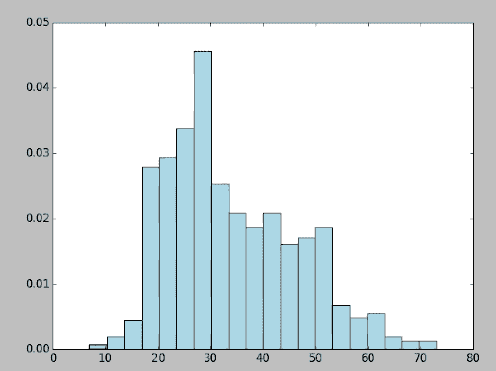
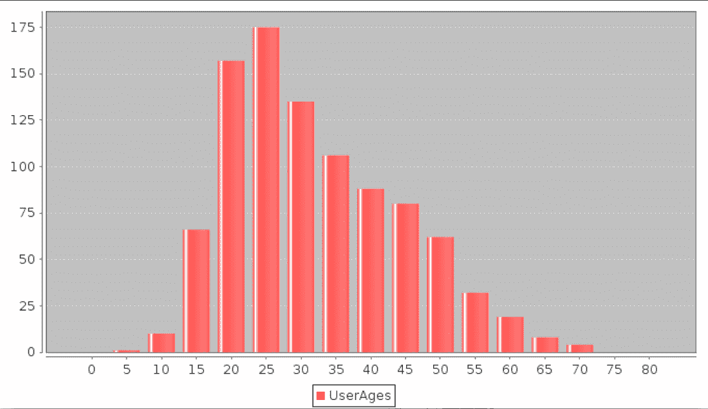
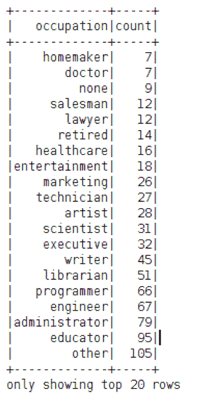
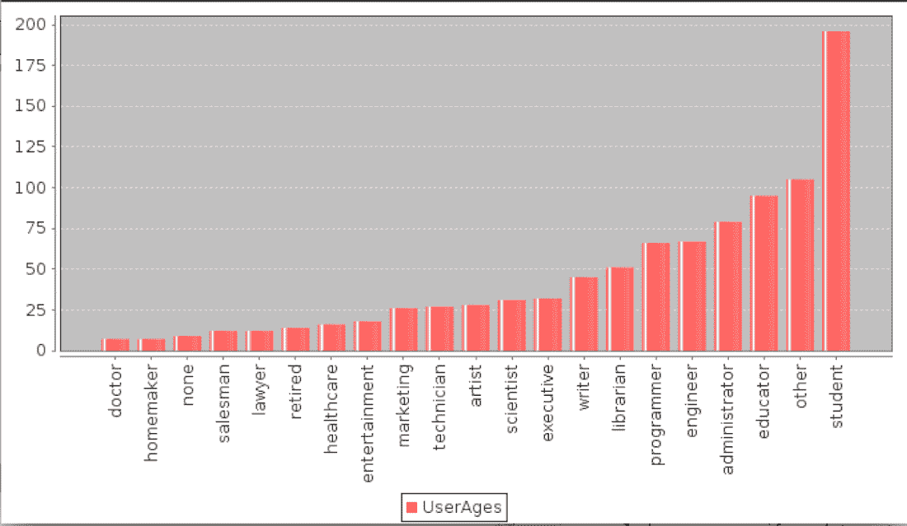
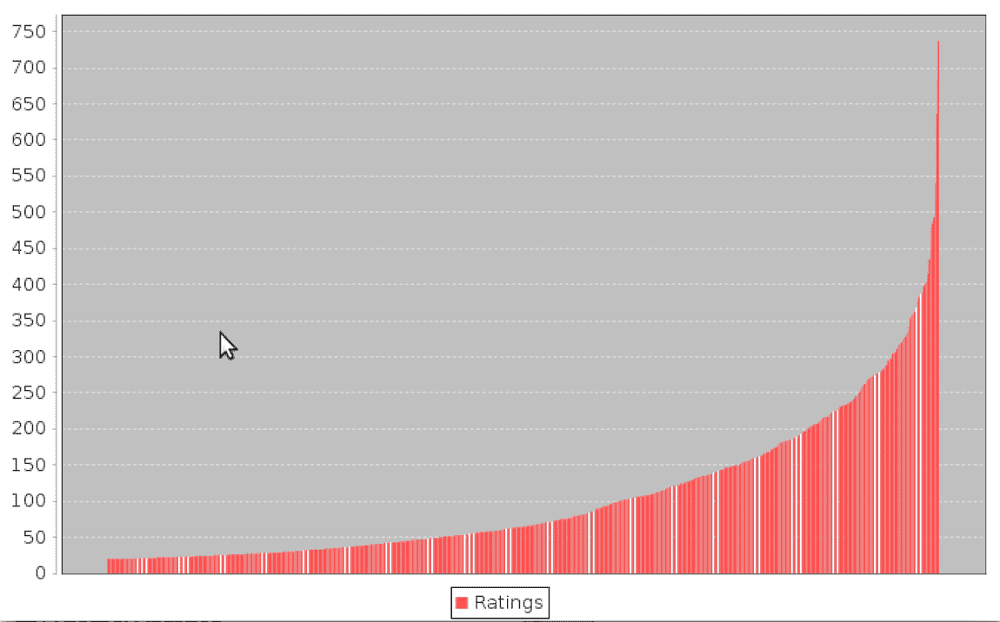
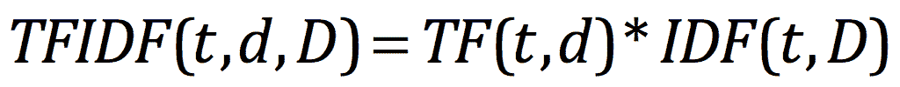
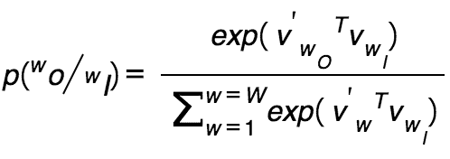

# 使用 Spark 获取、处理和准备数据

机器学习是一个极其广泛的领域，如今，应用程序遍及各个领域，包括网络和移动应用程序、物联网和传感器网络、金融服务、医疗保健和各种科学领域，仅举几例。

因此，可用于机器学习的潜在数据范围是巨大的。 在本书中，我们将主要关注业务应用程序。 在这种情况下，可用的数据通常由组织内部的数据(如金融服务公司的交易数据)和外部数据源(如同一金融服务公司的金融资产价格数据)组成。

例如，您会记得在[第 3 章](03.html)，*设计机器学习系统*中，我们假设的互联网业务 Movie Stream 的主要内部数据来源包括网站上可用的电影、服务用户及其行为的数据。 这包括有关电影和其他内容的数据(例如，标题、类别、描述、图像、演员和导演)、用户信息(例如，人口统计数据、位置等)和用户活动数据(例如，网页浏览量、标题预览和查看、评级、评论和社交数据，如*喜欢*、*分享*，以及服务(包括 Facebook 和 Twitter)上的社交网络配置文件)。

本例中的外部数据源可能包括天气和地理位置服务、第三方电影评级和评论站点，如*IMDB*和*烂番茄*等。

一般来说，很难获得真实服务和业务的内部性质的数据，因为它是商业敏感的(特别是关于购买活动、用户或客户行为和收入的数据)，并且对相关组织具有巨大的潜在价值。 这就是为什么它通常也是应用机器学习的最有用和最有趣的数据--一个可以做出准确预测的好的机器学习模型可能非常有价值(看看机器学习竞赛的成功，比如*Netflix 奖*和*Kaggle*)。

在这本书中，我们将使用公开可用的数据集来说明有关数据处理和机器学习模型训练的概念。

在本章中，我们将：

*   简要介绍机器学习中通常使用的数据类型。
*   提供在哪里可以获得有趣的数据集的例子，这些数据集通常可以在互联网上公开获得。 我们将在整本书中使用其中一些数据集来说明我们介绍的模型的使用。
*   了解如何处理、清理、探索和可视化我们的数据。
*   介绍各种技术，将原始数据转换为可用作机器学习算法输入的特征。
*   了解如何使用外部库和 Spark 的内置功能标准化输入功能。

# 访问公开可用的数据集

幸运的是，虽然商业敏感数据可能很难获得，但仍有许多有用的数据集可供公开使用。 其中许多经常被用作特定类型的机器学习问题的基准数据集。 常见数据源的示例包括：

*   **UCI 机器学习存储库**：这是近 300 个各种类型和大小的任务数据集的集合，包括分类、回归、聚类和推荐系统。 该列表可在[http://archive.ics.uci.edu/ml/](http://archive.ics.uci.edu/ml/)获得。
*   **Amazon AWS 公共数据集**：这是一组通常非常大的数据集，可以通过 Amazon S3 访问。 这些数据集包括人类基因组计划、公共爬虫网络语料库、维基百科数据和 Google Books Ngram。 有关这些数据集的信息，请参阅[http://aws.amazon.com/publicdatasets/](http://aws.amazon.com/publicdatasets/)。
*   **Kaggle**：这是 Kaggle 举办的机器学习竞赛中使用的数据集的集合。 领域包括分类、回归、排名、推荐系统和图像分析。 这些数据集可以在[http://www.kaggle.com/competitions](http://www.kaggle.com/competitions)的竞赛部分下找到。
*   **KDnuggets**：这有一个公共数据集的详细列表，包括前面提到的一些数据集。 该列表可在[http://www.kdnuggets.com/datasets/index.html](http://www.kdnuggets.com/datasets/index.html)获得。

There are many other resources to find public datasets depending on the specific domain and machine-learning task. Hopefully, you might also have exposure to some interesting academic or commercial data of your own!

为了说明与 Spark 中的数据处理、转换和特征提取相关的几个关键概念，我们将下载一个用于电影推荐的常用数据集；该数据集称为**MovieLens**数据集。 由于它适用于推荐系统以及潜在的其他机器学习任务，因此它是一个有用的示例数据集。

# MovieLens 100k 数据集

MovieLens 100k 数据集是一组包含 100,000 个数据点的数据点，这些数据点与一组用户对一组电影的评分相关。 它还包含电影元数据和用户配置文件。 虽然它是一个很小的数据集，但您可以快速下载它并在其上运行 Spark 代码。 这使得它非常适合用于说明目的。

您可以从[http://files.grouplens.org/datasets/movielens/ml-100k.zip](http://files.grouplens.org/datasets/movielens/ml-100k.zip)下载数据集。

下载数据后，使用您的终端将其解压缩：

```scala
>unzip ml-100k.zip
inflating: ml-100k/allbut.pl 
inflating: ml-100k/mku.sh 
inflating: ml-100k/README
 ...
inflating: ml-100k/ub.base 
inflating: ml-100k/ub.test

```

这将创建一个名为`ml-100k`的目录。 切换到此目录并检查其内容。 重要的文件是`u.user`(用户配置文件)、`u.item`(电影元数据)和`u.data`(用户对电影的评分)：

```scala
 >cd ml-100k

```

`README`文件包含有关数据集的更多信息，包括每个数据文件中存在的变量。 我们可以使用 head 命令来检查各种文件的内容。

例如，我们可以看到`u.user`文件包含用户 ID、年龄、性别、职业和邮政编码字段，以竖线(`|`字符)分隔：

```scala
$ head -5 u.user
 1|24|M|technician|85711
 2|53|F|other|94043
 3|23|M|writer|32067
 4|24|M|technician|43537
 5|33|F|other|15213

```

`u.item`文件包含电影 ID、标题、发行数据和 IMDB 链接字段以及一组与电影类别数据相关的字段。 它还由`|`字符分隔：

```scala
$head -5 u.item
 1|Toy Story (1995)|01-Jan-1995||http://us.imdb.com/M/title-
 exact?Toy%20Story%20(1995)|0|0|0|1|1|1|0|0|0|0|0|0|0|0|0|0|0|0|0
 2|GoldenEye (1995)|01-Jan-1995||http://us.imdb.com/M/title-
 exact?GoldenEye%20(1995)|0|1|1|0|0|0|0|0|0|0|0|0|0|0|0|0|1|0|0
 3|Four Rooms (1995)|01-Jan-1995||http://us.imdb.com/M/title-
 exact?Four%20Rooms%20(1995)|0|0|0|0|0|0|0|0|0|0|0|0|0|0|0|0|1|0|0
 4|Get Shorty (1995)|01-Jan-1995||http://us.imdb.com/M/title-
 exact?Get%20Shorty%20(1995)|0|1|0|0|0|1|0|0|1|0|0|0|0|0|0|0|0|0|0
 5|Copycat (1995)|01-Jan-1995||http://us.imdb.com/M/title-
 exact?Copycat%20(1995)|0|0|0|0|0|0|1|0|1|0|0|0|0|0|0|0|1|0|0

```

前面列出的数据格式如下：

```scala
movie id | movie title | release date | video release date | IMDb 
 URL | unknown | Action | Adventure | Animation | Children's | 
 Comedy | Crime | Documentary | Drama | Fantasy | Film-Noir | 
 Horror | Musical | Mystery | Romance | Sci-Fi | Thriller | War | 
 Western |

```

最后 19 个字段是类型，1 表示电影属于该类型，0 表示不是；电影可以同时属于多个类型。

电影 ID 是在`u.data`数据集中使用的 ID。 它包含了 943 名用户对 1682 个项目的 10 万个评分。 每个用户至少评价了 20 部电影。 用户和项目从 1 开始连续编号。数据是随机排序的。 这是以下字段的制表符分隔列表：

```scala
user id | item id | rating | timestamp

```

时间戳是自 1970 年 1 月 1 日 UTC 以来的 Unix 秒。

让我们看一下来自 U.S.data 文件的一些数据：

```scala
>head -5 u.data
1962423881250949
1863023891717742
223771878887116
244512880606923
1663461886397596

```

# 浏览和可视化您的数据

本章的源代码可在`PATH/spark-ml/Chapter04`中找到：

*   Python 代码可从`/MYPATH/spark-ml/Chapter_04/python`获得
*   Scala 代码可从`/MYPATH/spark-ml/Chapter_04/scala`获得

Pythons 示例可用于版本 1.6.2 和 2.0.0；在本书中，我们将重点介绍 2.0.0：

```scala
├── 1.6.2
│   ├── com
│   │   ├── __init__.py
│   │   └── sparksamples
│   │       ├── __init__.py
│   │       ├── movie_data.py
│   │       ├── plot_user_ages.py
│   │       ├── plot_user_occupations.py
│   │       ├── rating_data.py
│   │       ├── user_data.py
│   │       ├── util.py
│   │       
│   └── __init__.py
├── 2.0.0
│   └── com
│       ├── __init__.py
│       └── sparksamples
│           ├── __init__.py
│           ├── movie_data.py
│           ├── plot_user_ages.py
│           ├── plot_user_occupations.py
│           ├── rating_data.py
│           ├── spark-warehouse
│           ├── user_data.py
│           ├── util.py
│           

```

Scala 示例的结构如下所示：

```scala
├── 1.6.2
│   ├── build.sbt
│   ├── spark-warehouse
│   ├── src
│   │   └── main
│   │       └── scala
│   │           └── org
│   │               └── sparksamples
│   │                   ├── CountByRatingChart.scala
│   │                   ├── exploredataset
│   │                   │   ├── explore_movies.scala
│   │                   │   ├── explore_ratings.scala
│   │                   │   └── explore_users.scala
│   │                   ├── featureext
│   │                   │   ├── ConvertWordsToVectors.scala
│   │                   │   ├── StandardScalarSample.scala
│   │                   │   └── TfIdfSample.scala
│   │                   ├── MovieAgesChart.scala
│   │                   ├── MovieDataFillingBadValues.scala
│   │                   ├── MovieData.scala
│   │                   ├── RatingData.scala
│   │                   ├── UserAgesChart.scala
│   │                   ├── UserData.scala
│   │                   ├── UserOccupationChart.scala
│   │                   ├── UserRatingsChart.scala
│   │                   └── Util.scala

```

比例 2.0.0 示例：

```scala
├── 2.0.0
│   ├── build.sbt
│   ├── src
│   │   └── main
│   │       └── scala
│   │           └── org
│   │               └── sparksamples
│   │                   ├── CountByRatingChart.scala
│   │                   ├── df
│   │                   ├── exploredataset
│   │                   │   ├── explore_movies.scala
│   │                   │   ├── explore_ratings.scala
│   │                   │   └── explore_users.scala
│   │                   ├── featureext
│   │                   │   ├── ConvertWordsToVectors.scala
│   │                   │   ├── StandardScalarSample.scala
│   │                   │   └── TfIdfSample.scala
│   │                   ├── MovieAgesChart.scala
│   │                   ├── MovieDataFillingBadValues.scala
│   │                   ├── MovieData.scala
│   │                   ├── RatingData.scala
│   │                   ├── UserAgesChart.scala
│   │                   ├── UserData.scala
│   │                   ├── UserOccupationChart.scala
│   │                   ├── UserRatingsChart.scala
│   │                   └── Util.scala

```

转到以下目录并运行以下命令以运行示例：

```scala
 $ cd /MYPATH/spark-ml/Chapter_04/scala/2.0.0
 $ sbt compile
 $ sbt run

```

# 浏览用户数据集

首先，我们将分析 MovieLens 用户的特征。

我们使用`custom_schema`将`|`分隔的数据加载到 DataFrame 中。 此 Python 代码位于`com/sparksamples/Util.py`中：

```scala
def get_user_data(): 
  custom_schema = StructType([ 
  StructField("no", StringType(), True), 
  StructField("age", IntegerType(), True), 
  StructField("gender", StringType(), True), 
  StructField("occupation", StringType(), True), 
  StructField("zipCode", StringType(), True) 
]) 
frompyspark.sql import SQLContext 
frompyspark.sql.types import * 

sql_context = SQLContext(sc) 

user_df = sql_context.read  
  .format('com.databricks.spark.csv')  
  .options(header='false', delimiter='|')  
  .load("%s/ml-100k/u.user"% PATH, schema =  
custom_schema) 
returnuser_df

```

此函数从`user_data.py`调用，如下所示：

```scala
user_data = get_user_data() 
print(user_data.first)

```

您应该会看到类似以下内容的输出：

```scala
u'1|24|M|technician|85711'

```

代码清单：

*   [https：//github.com/ml-resources/spark-ml/blob/branch-ed2/Chapter_04/python/2.0.0/com/sparksamples/user_data.py](https://github.com/ml-resources/spark-ml/blob/branch-ed2/Chapter_04/python/2.0.0/com/sparksamples/user_data.py)
*   [https：//github.com/ml-resources/spark-ml/blob/branch-ed2/Chapter_04/python/2.0.0/com/sparksamples/util.py](https://github.com/ml-resources/spark-ml/blob/branch-ed2/Chapter_04/python/2.0.0/com/sparksamples/util.py)

Scala 中用于将数据加载到 DataFrame 的类似代码如下所示。 此代码位于`Util.scala`中：

```scala

val customSchema = StructType(Array( 
StructField("no", IntegerType, true), 
StructField("age", StringType, true), 
StructField("gender", StringType, true), 
StructField("occupation", StringType, true), 
StructField("zipCode", StringType, true))); 
val spConfig = (new 
 SparkConf).setMaster("local").setAppName("SparkApp") 
val spark = SparkSession 
  .builder() 
  .appName("SparkUserData").config(spConfig) 
  .getOrCreate() 

val user_df = spark.read.format("com.databricks.spark.csv") 
  .option("delimiter", "|").schema(customSchema) 
  .load("/home/ubuntu/work/ml-resources/spark-ml/data/ml-
 100k/u.user") 
val first = user_df.first() 
println("First Record : " + first)

```

您应该会看到类似以下内容的输出：

```scala
u'1|24|M|technician|85711'

```

The code listing is at : [https://github.com/ml-resources/spark-ml/blob/branch-ed2/Chapter_04/scala/2.0.0/src/main/scala/org/sparksamples/UserData.scala](https://github.com/ml-resources/spark-ml/blob/branch-ed2/Chapter_04/scala/2.0.0/src/main/scala/org/sparksamples/UserData.scala)

正如我们所看到的，这是我们的用户数据文件的第一行，由`"|"`字符分隔。

The `first` function is similar to `collect`, but it only returns the first element of the RDD to the driver. We can also use `take(k)` to collect only the first *k* elements of the RDD to the driver.

我们将使用前面创建的 DataFrame，并使用`groupBy`函数，后跟`count()`和`collect()`来计算用户数、性别、邮政编码和职业。 然后，我们将统计用户、性别、职业和邮政编码的数量。 我们可以通过运行以下代码来实现这一点。 请注意，我们不缓存数据，因为对于这种小尺寸来说，这是不必要的：

```scala
num_users = user_data.count() 
num_genders = 
 len(user_data.groupBy("gender").count().collect()) 
num_occupation = 
 len(user_data.groupBy("occupation").count().collect()) 
num_zipcodes = 
 len(user_data.groupby("zipCode").count().collect()) 
print("Users: "+ str(num_users)) 
print("Genders: "+ str(num_genders)) 
print("Occupation: "+ str(num_occupation)) 
print("ZipCodes: "+ str(num_zipcodes))

```

您将看到以下输出：

```scala
Users: 943
Genders: 2
Occupations: 21
ZIPCodes: 795

```

同样，我们可以使用 Scala 实现获取用户数、性别、职业和邮政编码的逻辑。

```scala
val num_genders = user_df.groupBy("gender").count().count() 
val num_occupations = 
 user_df.groupBy("occupation").count().count() 
val num_zipcodes = user_df.groupBy("zipCode").count().count() 

println("num_users : "+ user_df.count()) 
println("num_genders : "+ num_genders) 
println("num_occupations : "+ num_occupations) 
println("num_zipcodes: "+ num_zipcodes) 
println("Distribution by Occupation") 
println(user_df.groupBy("occupation").count().show())

```

您将看到以下输出：

```scala
num_users: 943
num_genders: 2
num_occupations: 21
num_zipcodes: 795

```

Find the code listing at: [https://github.com/ml-resources/spark-ml/blob/branch-ed2/Chapter_04/scala/2.0.0/src/main/scala/org/sparksamples/UserData.scala](https://github.com/ml-resources/spark-ml/blob/branch-ed2/Chapter_04/scala/2.0.0/src/main/scala/org/sparksamples/UserData.scala)

接下来，我们将创建一个直方图来分析用户年龄的分布。

在 Python 中，我们首先将`DatFrame`放入变量`user_data`。 接下来，我们将调用`select('age')`并将结果收集到 Row 对象列表中。 然后，我们迭代并提取年龄参数并填充`user_ages_list`。

我们将使用 Python matplotlib 库的`hist`函数。

```scala
user_data = get_user_data() 
user_ages = user_data.select('age').collect() 
user_ages_list = [] 
user_ages_len = len(user_ages) 
for i in range(0, (user_ages_len - 1)): 
    user_ages_list.append(user_ages[i].age) 
plt.hist(user_ages_list, bins=20, color='lightblue', normed=True) 
fig = matplotlib.pyplot.gcf() 
fig.set_size_inches(16, 10) 
plt.show()

```

Find the code listing at:[ https://github.com/ml-resources/spark-ml/blob/branch-ed2/Chapter_04/python/2.0.0/com/sparksamples/plot_user_ages.py](https://github.com/ml-resources/spark-ml/blob/branch-ed2/Chapter_04/python/2.0.0/com/sparksamples/plot_user_ages.py)

我们将`user_ages_list`与直方图的条柱数(在本例中为 20 个)一起传递给`hist`函数。 使用`normed=True`参数，我们还指定希望对直方图进行标准化，以便每个存储桶表示落入该存储桶的总数据的百分比。

您将看到一个包含直方图的图像，如此处所示。 正如我们所看到的，MovieLens 用户的年龄在某种程度上向年轻观众倾斜。 大量用户年龄在 15 岁到 35 岁之间。



Distribution of user ages

对于 Scala 直方图，我们使用基于 JFreeChart 的库。 为了显示数据的分布，我们将数据分成 16 个箱。

我们使用[scala](https://github.com/wookietreiber/scala-chart)库从 https://github.com/wookietreiber/scala-chart 图`m_sorted`创建条形图。

首先，我们使用`select("age")`函数从`userDataFrame`中提取`ages_array`。

然后，我们填充`mx`地图，它是用于显示的存储箱。 我们对 MX 映射进行排序以创建`ListMap`，然后使用它填充`DefaultCategorySet ds`：

```scala
val userDataFrame = Util.getUserFieldDataFrame() 
val ages_array = userDataFrame.select("age").collect() 

val min = 0 
val max = 80 
val bins = 16 
val step = (80/bins).toInt 
var mx = Map(0 ->0) 
for (i <- step until (max + step) by step) { 
  mx += (i -> 0) 
} 
for( x <- 0 until ages_array.length) { 
  val age = Integer.parseInt( 
    ages_array(x)(0).toString) 
  for(j <- 0 until (max + step) by step) { 
    if(age >= j && age < (j + step)){ 
      mx = mx + (j -> (mx(j) + 1)) 
    } 
  } 
} 

val mx_sorted =  ListMap(mx.toSeq.sortBy(_._1):_*) 
val ds = new org.jfree.data.category.DefaultCategoryDataset 
mx_sorted.foreach{ case (k,v) => ds.addValue(v,"UserAges", k)} 
val chart = ChartFactories.BarChart(ds) 
chart.show() 
Util.sc.stop()

```

完整的代码可以在`UserAgesChart.scala`文件中找到，如下所示：

Find the code listing at: [https://github.com/ml-resources/spark-ml/blob/branch-ed2/Chapter_04/scala/2.0.0/src/main/scala/org/sparksamples/UserAgesChart.scala](https://github.com/ml-resources/spark-ml/blob/branch-ed2/Chapter_04/scala/2.0.0/src/main/scala/org/sparksamples/UserAgesChart.scala)



# 按职业统计

我们统计了我们用户的各种职业的数量。

实现了以下步骤来获取职业 DataFrame 并填充列表，该列表是使用 Matplotlib 显示的。

1.  获取`user_data`。
2.  使用`groupby("occupation")`并调用`count()`提取占用计数。
3.  从行列表中提取`tuple("occupation","count")`的列表。
4.  创建`x_axis`和`y_axis`中值的`numpy`数组。
5.  创建 BAR 类型的绘图。
6.  显示图表。

完整的代码清单可以在下面找到：

```scala
user_data = get_user_data() 
user_occ = user_data.groupby("occupation").count().collect() 

user_occ_len = len(user_occ) 
user_occ_list = [] 
for i in range(0, (user_occ_len - 1)): 
element = user_occ[i] 
count = element. __getattr__('count') 
tup = (element.occupation, count) 
    user_occ_list.append(tup) 

x_axis1 = np.array([c[0] for c in user_occ_list]) 
y_axis1 = np.array([c[1] for c in user_occ_list]) 
x_axis = x_axis1[np.argsort(y_axis1)] 
y_axis = y_axis1[np.argsort(y_axis1)] 

pos = np.arange(len(x_axis)) 
width = 1.0 

ax = plt.axes() 
ax.set_xticks(pos + (width / 2)) 
ax.set_xticklabels(x_axis) 

plt.bar(pos, y_axis, width, color='lightblue') 
plt.xticks(rotation=30) 
fig = matplotlib.pyplot.gcf() 
fig.set_size_inches(20, 10) 
plt.show()

```

您生成的图像应该与这里的图像类似。 似乎最普遍的职业是**学生**、**其他**、**教育工作者**、**管理员**、**工程师**和**程序员**。


Distribution of user occupations Find the code listing at: [https://github.com/ml-resources/spark-ml/blob/branch-ed2/Chapter_04/python/2.0.0/com/sparksamples/plot_user_occupations.py](https://github.com/ml-resources/spark-ml/blob/branch-ed2/Chapter_04/python/2.0.0/com/sparksamples/plot_user_occupations.py)

在 Scala 中，我们遵循以下步骤：

1.  首先获取`userDataFrame`
2.  我们摘录职业专栏：

```scala
        userDataFrame.select("occupation")

```

3.  按职业对行进行分组：

```scala
        val occupation_groups =
          userDataFrame.groupBy("occupation").count()

```

4.  按计数对行进行排序：

```scala
        val occupation_groups_sorted = 
          occupation_groups.sort("count")

```

5.  从以下位置填充默认类别集 DS：`occupation_groups_collection`
6.  显示 Jfree 条形图

完整的代码清单如下所示：

```scala
        val userDataFrame = Util.getUserFieldDataFrame() 
        val occupation = userDataFrame.select("occupation") 
        val occupation_groups = 
         userDataFrame.groupBy("occupation").count() 
        val occupation_groups_sorted = occupation_groups.sort("count") 
        occupation_groups_sorted.show() 
        val occupation_groups_collection = 
         occupation_groups_sorted.collect() 

        val ds = new org.jfree.data.category.DefaultCategoryDataset 
        val mx = scala.collection.immutable.ListMap() 

        for( x <- 0 until occupation_groups_collection.length) { 
          val occ = occupation_groups_collection(x)(0) 
          val count = Integer.parseInt(
            occupation_groups_collection(x)(1).toString) 
          ds.addValue(count,"UserAges", occ.toString) 
        } 

        val chart = ChartFactories.BarChart(ds) 
        val font = new Font("Dialog", Font.PLAIN,5); 

        chart.peer.getCategoryPlot.getDomainAxis(). 
        setCategoryLabelPositions(CategoryLabelPositions.UP_90); 
        chart.peer.getCategoryPlot.getDomainAxis.setLabelFont(font) 
        chart.show() 
        Util.sc.stop()

```

此代码的输出如下所示：



下图显示了由前面的源代码生成的 JFreeChart：



Find the code listing at: [https://github.com/ml-resources/spark-ml/blob/branched2/Chapter_04/scala/2.0.0/src/main/scala/org/sparksamples/UserOccupationChart.scala](https://github.com/ml-resources/spark-ml/blob/branched2/Chapter_04/scala/2.0.0/src/main/scala/org/sparksamples/UserOccupationChart.scala)

# 电影数据集

接下来，我们将研究电影目录的几个属性。 我们可以检查电影数据文件的一行，就像前面对用户数据所做的那样，然后计算电影的数量：

我们将通过使用格式`com.databrick.spark.csv`进行解析并给出一个`|`分隔符来创建电影数据的 DataFrame。 然后，我们使用`CustomSchema`填充 DataFrame 并返回它：

```scala
def getMovieDataDF() : DataFrame = { 
  val customSchema = StructType(Array( 
  StructField("id", StringType, true), 
  StructField("name", StringType, true), 
  StructField("date", StringType, true), 
  StructField("url", StringType, true))); 
  val movieDf = spark.read.format(
    "com.databricks.spark.csv") 
     .option("delimiter", "|").schema(customSchema) 
     .load(PATH_MOVIES) 
  return movieDf 
}

```

然后从`MovieData`Scala 对象调用此方法。

实现以下步骤以筛选日期并将其格式化为`Year`：

1.  在临时视图中创建。
2.  使用`SparkSession`将函数`Util.convertYear`注册为 UDF。 `Util.spark`(这是我们的自定义类)。
3.  在此`SparkSession`上执行 SQL，如下所示。
4.  按`Year`对生成的 DataFrame 进行分组，并调用`count()`函数。

该逻辑的完整代码清单如下所示：

```scala
def getMovieYearsCountSorted(): scala.Array[(Int,String)] = { 
  val movie_data_df = Util.getMovieDataDF() 
  movie_data_df.createOrReplaceTempView("movie_data") 
  movie_data_df.printSchema() 

  Util.spark.udf.register("convertYear", Util.convertYear _) 
  movie_data_df.show(false) 

  val movie_years = Util.spark.sql(
    "select convertYear(date) as year from movie_data") 
  val movie_years_count = movie_years.groupBy("year").count() 
  movie_years_count.show(false) 
  val movie_years_count_rdd = movie_years_count.rdd.map(
   row => (Integer.parseInt(row(0).toString), row(1).toString)) 
  val movie_years_count_collect = movie_years_count_rdd.collect() 
  val movie_years_count_collect_sort = 
  movie_years_count_collect.sortBy(_._1) 
} 

def main(args: Array[String]) { 
  val movie_years = MovieData.getMovieYearsCountSorted() 
  for( a <- 0 to (movie_years.length -1)){ 
    print(movie_years(a)) 
  } 
}

```

输出将如下所示：

```scala
(1900,1)
(1922,1)
(1926,1)
(1930,1)
(1931,1)
(1932,1)
(1933,2)
(1934,4)
(1935,4)
(1936,2)
(1937,4)
(1938,3)
(1939,7)
(1940,8)
(1941,5)
(1942,2)
(1943,4)
(1944,5)
(1945,4)
(1946,5)
(1947,5)
(1948,3)
(1949,4)
(1950,7)
(1951,5)
(1952,3)
(1953,2)
(1954,7)
(1955,5)
(1956,4)
(1957,8)
(1958,9)
(1959,4)
(1960,5)
(1961,3)
(1962,5)
(1963,6)
(1964,2)
(1965,5)
(1966,2)
(1967,5)
(1968,6)
(1969,4)
(1970,3)
(1971,7)
(1972,3)
(1973,4)
(1974,8)
(1975,6)
(1976,5)
(1977,4)
(1978,4)
(1979,9)
(1980,8)
(1981,12)
(1982,13)
(1983,5)
(1984,8)
(1985,7)
(1986,15)
(1987,13)
(1988,11)
(1989,15)
(1990,24)
(1991,22)
(1992,37)
(1993,126)
(1994,214)
(1995,219)
(1996,355)
(1997,286)
(1998,65)

```

Find the code listing at: [https://github.com/ml-resources/spark-ml/blob/branch-ed2/Chapter_04/scala/2.0.0/src/main/scala/org/sparksamples/MovieData.scala](https://github.com/ml-resources/spark-ml/blob/branch-ed2/Chapter_04/scala/2.0.0/src/main/scala/org/sparksamples/MovieData.scala)

接下来，我们绘制前面创建的电影集合的年龄图。 我们在 Scala 中使用 JFreeChart，并从`MovieData.getMovieYearsCountSorted()`创建的集合填充`org.jfree.data.category.DefaultCategoryDataset`。

```scala
object MovieAgesChart { 
  def main(args: Array[String]) { 
    val movie_years_count_collect_sort =            
    MovieData.getMovieYearsCountSorted() 

    val ds = new 
      org.jfree.data.category.DefaultCategoryDataset 
    for(i <- movie_years_count_collect_sort){ 
      ds.addValue(i._2.toDouble,"year", i._1) 
    } 
    val  chart = ChartFactories.BarChart(ds) 
    chart.show() 
    Util.sc.stop() 
  } 
}

```

请注意，大多数电影都是 1996 年的。 创建的图表如下所示：


Distribution of movie ages Find the code listing at: [https://github.com/ml-resources/spark-ml/blob/branch-ed2/Chapter_04/scala/2.0.0/src/main/scala/org/sparksamples/MovieAgesChart.scala](https://github.com/ml-resources/spark-ml/blob/branch-ed2/Chapter_04/scala/2.0.0/src/main/scala/org/sparksamples/MovieAgesChart.scala)

# 浏览评级数据集

下面我们来看一下评级数据：

代码位于`RatingData`下：

```scala
object RatingData { 
  def main(args: Array[String]) { 
    val customSchema = StructType(Array( 
      StructField("user_id", IntegerType, true), 
      StructField("movie_id", IntegerType, true), 
      StructField("rating", IntegerType, true), 
      StructField("timestamp", IntegerType, true))) 

    val spConfig = (new SparkConf).setMaster("local").
      setAppName("SparkApp") 
    val spark = SparkSession.builder() 
      .appName("SparkRatingData").config(spConfig) 
      .getOrCreate() 

    val rating_df = spark.read.format("com.databricks.spark.csv") 
     .option("delimiter", "t").schema(customSchema) 
     .load("../../data/ml-100k/u.data") 
    rating_df.createOrReplaceTempView("df") 
    val num_ratings = rating_df.count() 
    val num_movies = Util.getMovieDataDF().count() 
    val first = rating_df.first() 
    println("first:" + first) 
    println("num_ratings:" + num_ratings) 
  } 
}

```

下面列出了前面代码的输出：

```scala
First: 196 242 3 881250949
num_ratings:100000

```

有 100,000 个评分，与用户和电影数据集不同，这些记录用制表符(`"t"`)拆分。 正如您可能已经猜到的那样，我们可能希望计算一些基本的汇总统计数据和评分值的频率直方图。 我们现在就开始吧。

数据是分开的。 正如您可能已经猜到的那样，我们可能希望计算一些基本的汇总统计数据和评分值的频率直方图。 现在让我们这样做：)。 正如您可能已经猜到的那样，我们可能希望为评分值计算一些基本的汇总统计信息和频率直方图。 我们现在就开始吧：

我们将计算最高、最低和平均评分。 我们还将计算每个用户的收视率和每部电影的收视率。 我们使用 Spark SQL 来提取电影评分的最大值、最小值和平均值。

```scala
val max = Util.spark.sql("select max(rating)  from df") 
max.show() 

val min = Util.spark.sql("select min(rating)  from df") 
min.show() 

val avg = Util.spark.sql("select avg(rating)  from df") 
avg.show()

```

下面列出了前面代码的输出：

```scala
+----------------+
|.  max(rating)  |
+----------------+
|              5 |
+----------------+

+----------------+
|.  min(rating)  |
+----------------+
|              1 |
+----------------+

+-----------------+
|.  avg(rating)   |
+-----------------+
|         3.52986 |
+-----------------+

```

Find the code listing at: [https://github.com/ml-resources/spark-ml/blob/branch-ed2/Chapter_04/scala/2.0.0/src/main/scala/org/sparksamples/RatingData.scala](https://github.com/ml-resources/spark-ml/blob/branch-ed2/Chapter_04/scala/2.0.0/src/main/scala/org/sparksamples/RatingData.scala)

# 评级计数条形图

从结果上看，用户对一部电影的平均评分在 3.5 左右，所以我们可能会认为评分的分布会向稍微高一点的评分倾斜。 让我们看看这是不是真的，通过创建一个评分值的条形图，使用与我们对职业所做的类似的程序。

绘制评级与计数的代码如下所示。 这在文件`CountByRatingChart.scala`中提供：

```scala
object CountByRatingChart { 
  def main(args: Array[String]) { 
    val customSchema = StructType(Array( 
      StructField("user_id", IntegerType, true), 
      StructField("movie_id", IntegerType, true), 
      StructField("rating", IntegerType, true), 
      StructField("timestamp", IntegerType, true))) 

   val  spConfig = (new SparkConf).setMaster("local").
     setAppName("SparkApp") 
   val  spark = SparkSession 
      .builder() 
      .appName("SparkRatingData").config(spConfig) 
      .getOrCreate() 
   val rating_df = spark.read.format("com.databricks.spark.csv") 
      .option("delimiter", "t").schema(customSchema) 

   val rating_df_count = rating_df.groupBy("rating").
     count().sort("rating") 

   rating_df_count.show() 
   val rating_df_count_collection = rating_df_count.collect() 

   val ds = new org.jfree.data.category.DefaultCategoryDataset 
   val mx = scala.collection.immutable.ListMap() 

   for( x <- 0 until rating_df_count_collection.length) { 
      val occ = rating_df_count_collection(x)(0) 
      val count = Integer.parseInt( 
        rating_df_count_collection(x)(1).toString) 
      ds.addValue(count,"UserAges", occ.toString) 
    } 

    val chart = ChartFactories.BarChart(ds) 
    val font = new Font("Dialog", Font.PLAIN,5); 
    chart.peer.getCategoryPlot.getDomainAxis(). 
    setCategoryLabelPositions(CategoryLabelPositions.UP_90); 
    chart.peer.getCategoryPlot.getDomainAxis.setLabelFont(font) 
    chart.show() 
    Util.sc.stop() 
  } 
}

```

在执行前面的代码时，您将获得如下条形图：


# 数字评级的分布

我们还可以查看每个用户的评分数量的分布情况。 回想一下，我们之前通过用制表符拆分评级来计算前面代码中使用的`rating_data`RDD。 现在，我们将在以下代码中再次使用`rating_data`变量。

代码驻留在类`UserRatingChart`中。 我们将从`u.data`文件创建一个 DataFrame，该文件以制表符分隔，然后是`groupbyuser_id`，并按每个用户给出的评分计数按升序排序。

```scala
object UserRatingsChart { 
  def main(args: Array[String]) { 

  } 
}

```

让我们先来看看收视率。

```scala
val customSchema = StructType(Array( 
  StructField("user_id", IntegerType, true), 
  StructField("movie_id", IntegerType, true), 
  StructField("rating", IntegerType, true), 
  StructField("timestamp", IntegerType, true))) 

val spConfig = (new      
    SparkConf).setMaster("local").setAppName("SparkApp") 
val spark = SparkSession 
   .builder() 
   .appName("SparkRatingData").config(spConfig) 
   .getOrCreate() 

val rating_df = spark.read.format("com.databricks.spark.csv") 
   .option("delimiter", "t").schema(customSchema) 
   .load("../../data/ml-100k/u.data") 

val rating_nos_by_user =       
    rating_df.groupBy("user_id").count().sort("count") 
val ds = new org.jfree.data.category.DefaultCategoryDataset 
  rating_nos_by_user.show(rating_nos_by_user.collect().length)

```

下面列出了前面代码的输出：

```scala
+-------+-----+
|user_id|count|
+-------+-----+
|    636|   20|
|    572|   20|
|    926|   20|
|    824|   20|
|    166|   20|
|    685|   20|
|    812|   20|
|    418|   20|
|    732|   20|
|    364|   20|
....
 222|  387|
|    293|  388|
|     92|  388|
|    308|  397|
|    682|  399|
|     94|  400|
|      7|  403|
|    846|  405|
|    429|  414|
|    279|  434|
|    181|  435|
|    393|  448|
|    234|  480|
|    303|  484|
|    537|  490|
|    416|  493|
|    276|  518|
|    450|  540|
|     13|  636|
|    655|  685|
|    405|  737|
+-------+-----+

```

以文本形式显示数据之后，让我们使用 JFreeChart 通过加载来自`rating_nos_by_user DataFrame`的数据来显示它。

```scala
val step = (max/bins).toInt 
for(i <- step until (max + step) by step) { 
  mx += (i -> 0); 
} 
for( x <- 0 until rating_nos_by_user_collect.length) { 
  val user_id =
    Integer.parseInt(rating_nos_by_user_collect(x)(0).toString) 
  val count = 
    Integer.parseInt(rating_nos_by_user_collect(x)(1).toString) 
  ds.addValue(count,"Ratings", user_id) 
} 

val chart = ChartFactories.BarChart(ds) 
chart.peer.getCategoryPlot.getDomainAxis().setVisible(false) 

chart.show() 
Util.sc.stop()

```



在上图中，x 轴是用户 ID，y 轴是评分数量，从最小评分 20 到最大评分 737 不等。

# 处理和转换您的数据

为了使原始数据在机器学习算法中可用，在从转换后的数据中提取有用的特征之前，我们首先需要对其进行清理，并可能以各种方式对其进行转换。 变换和特征提取步骤紧密相连，在某些情况下，某些变换本身就是特征提取的情况。

我们已经看到了需要清理电影数据集中数据的示例。 通常，真实数据集包含错误数据、丢失的数据点和离群值。 理想情况下，我们会纠正错误数据；但是，这通常是不可能的，因为许多数据集都是从某种形式的收集过程中派生出来的，这些收集过程不能重复(例如，在 Web 活动数据和传感器数据中就是这种情况)。 缺失值和离群值也很常见，可以采用类似于坏数据的方式进行处理。 总体而言，广泛的选择如下：

*   **过滤或删除具有错误或缺少值的记录**：这有时是不可避免的；但是，这意味着丢失错误或缺少记录的好部分。
*   **填充错误或丢失的数据**：我们可以尝试根据现有的其余数据为错误或丢失的数据赋值。 方法可以包括分配零值、分配全局平均值或中位数、插值附近或相似的数据点(通常在时间序列数据集中)等等。 决定正确的方法通常是一项棘手的任务，取决于数据、情况和自己的经验。
*   **对异常值应用健壮的技术**：异常值的主要问题是它们可能是正确的值，即使它们是极端的。 它们也可能是错误的。 通常很难知道你在处理哪一个案件。 也可以删除或填充离群值，不过幸运的是，有统计技术(如稳健回归)来处理离群值和极值。
*   **对潜在异常值应用变换**：异常值或极值的另一种方法是对具有潜在异常值或显示大范围潜在值的要素应用变换，如对数或高斯核变换。 这些类型的转换具有抑制变量规模大变化的影响，并将非线性关系转变为线性关系的效果。

# 填写错误或丢失的数据

让我们回顾一下这一年的影评，把它清理干净。

我们已经看到了过滤不良数据的例子。 在前面代码的基础上，下面的代码片断将填充方法应用于错误的发布日期记录，方法是将一个空字符串的值指定为 1900(稍后将由中间值替换)：

```scala
Util.spark.udf.register("convertYear", Util.convertYear _) 
movie_data_df.show(false) 

val movie_years = Util.spark.sql("select convertYear(date) as year from   movie_data") 

movie_years.createOrReplaceTempView("movie_years") 
Util.spark.udf.register("replaceEmptyStr", replaceEmptyStr _) 

val years_replaced =  Util.spark.sql("select replaceEmptyStr(year) 
  as r_year from movie_years")

```

在前面的代码中，我们使用了下面描述的`replaceEmtryStr`函数：

```scala
def replaceEmptyStr(v : Int): Int = { 
  try { 
    if(v.equals("") ) { 
      return 1900 
    } else { 
      returnv 
    } 
  }catch{ 
    case e: Exception => println(e) 
     return 1900 
  } 
}

```

接下来，我们提取不是 1900 年的过滤年份，用`Array[int]`替换`Array[Row]`，并计算各种度量：

*   条目总数
*   参赛作品总数：
*   年平均值
*   年份中值
*   折算后的总年数
*   1900 年的伯爵

```scala
val movie_years_filtered = movie_years.filter(x =>(x == 1900) ) 
val years_filtered_valid = years_replaced.filter(x => (x != 
  1900)).collect() 
val years_filtered_valid_int = new 
  Array[Int](years_filtered_valid.length) 
for( i <- 0 until years_filtered_valid.length -1){ 
val x = Integer.parseInt(years_filtered_valid(i)(0).toString) 
  years_filtered_valid_int(i) = x 
} 
val years_filtered_valid_int_sorted = 
  years_filtered_valid_int.sorted 

val years_replaced_int = new Array[Int] 
  (years_replaced.collect().length) 

val years_replaced_collect = years_replaced.collect() 

for( i <- 0 until years_replaced.collect().length -1){ 
  val x = Integer.parseInt(years_replaced_collect(i)(0).toString) 
  years_replaced_int(i) = x 
} 

val years_replaced_rdd = Util.sc.parallelize(years_replaced_int) 

val num = years_filtered_valid.length 
var sum_y = 0 
years_replaced_int.foreach(sum_y += _) 
println("Total sum of Entries:"+ sum_y) 
println("Total No of Entries:"+ num) 
val mean = sum_y/num 
val median_v = median(years_filtered_valid_int_sorted) 
Util.sc.broadcast(mean) 
println("Mean value of Year:"+ mean) 
println("Median value of Year:"+ median_v) 
val years_x = years_replaced_rdd.map(v => replace(v , median_v)) 
println("Total Years after conversion:"+ years_x.count()) 
var count = 0 
Util.sc.broadcast(count) 
val years_with1900 = years_x.map(x => (if(x == 1900) {count +=1})) 
println("Count of 1900: "+ count)

```

下面列出了前面代码的输出；用 Medium 替换后带有`1900`的值表示我们的处理成功

```scala
Total sum of Entries:3344062
Total No of Entries:1682
Mean value of Year:1988
Median value of Year:1995
Total Years after conversion:1682
Count of 1900: 0
Count of 1900: 0

```

Find the code listing at: [https://github.com/ml-resources/spark-ml/blob/branch-ed2/Chapter_04/scala/2.0.0/src/main/scala/org/sparksamples/MovieDataFillingBadValues.scala](https://github.com/ml-resources/spark-ml/blob/branch-ed2/Chapter_04/scala/2.0.0/src/main/scala/org/sparksamples/MovieDataFillingBadValues.scala)

我们在这里计算了平均释放年和中位数释放年。 从产量可以看出，由于年份分布的扭曲，发行年份的中位数要高得多。 虽然在给定情况下准确决定使用哪个填充值并不总是一目了然，但在这种情况下，由于这种偏差，使用中位数肯定是可行的。

Note that the preceding code example is, strictly speaking, not very scalable, as it requires collecting all the data to the driver. We can use Spark's `mean` function for numeric RDDs to compute the mean, but there is no median function available currently. We can solve this by creating our own or by computing the median on a sample of the dataset created using the `sample` function (we will see more of this in the upcoming chapters).

# 从数据中提取有用要素

一旦我们完成了对数据的全面清理，我们就可以开始着手从数据中提取实际特征的业务，利用这些特征可以训练我们的机器学习模型。

**特性**指的是我们用来训练模型的变量。 每行数据都包含我们希望提取到训练示例中的信息。

几乎所有的机器学习模型最终都以向量的形式进行数值表示；因此，我们需要将原始数据转换为数字。

功能大致分为几个类别，如下所示：

*   **数字特征**：这些特征通常是实数或整数，例如，我们在前面的示例中使用的用户年龄。
*   **分类特征**：这些特征指的是可以在任何给定时间采取一组可能状态之一的变量。 我们数据集中的示例可能包括用户的性别、职业或电影类别。
*   **文本特征**：这些特征派生自数据中的文本内容，例如电影标题、描述或评论。
*   **其他特征**：大多数其他类型的特征最终都是用数字表示的。 例如，图像、视频和音频可以表示为数字数据集。 地理位置可以表示为纬度和经度或 Geohash 数据。

在这里，我们将介绍数字、分类和文本功能。

# 数字特征

任何旧数字和数字特征之间有什么不同？ 那么在现实中，任何数字数据都可以作为输入变量。 然而，在机器学习模型中，您可以了解到每个特征的权重向量。 权重在将特征值映射到结果或目标变量(在有监督的学习模型的情况下)中起作用。

因此，我们希望使用有意义的特性，即模型可以了解特征值和目标变量之间的关系。 例如，年龄可能是一个合理的特征。 也许年龄增长与某种结果有直接关系。 同样，高度是可以直接使用的数字特征的一个很好的例子。

我们经常会看到，原始形式的数字特征用处较小，但可以转化为更有用的表示形式。 地点就是这种情况的一个例子。

使用原始位置(比如纬度和经度)可能没有那么有用，除非我们的数据确实非常密集，因为我们的模型可能无法了解原始位置和结果之间的有用关系。 但是，位置(例如，城市或国家)的某些聚合或分类表示与结果之间可能存在关系。

# 范畴特征

分类特征不能用作原始形式的输入，因为它们不是数字；相反，它们是变量可以接受的一组可能值的成员。 在前面提到的示例中，用户职业是一个类别变量，可以取学生、程序员等的值。

要将分类变量转换为数值表示，我们可以使用一种常见的方法，称为**1-of-k**编码。 需要诸如 k 取 1 编码之类的方法来表示。

需要使用诸如 k 取 1 编码之类的方法来以对机器学习任务有意义的方式表示标称变量。 序数变量可能以其原始形式使用，但其编码方式通常与名义变量相同。

假设变量可以取 k 个可能的值。 如果我们为每个可能的值分配一个从 1 到 k 的集合的索引，那么我们可以使用长度为 k 的二进制向量来表示变量的给定状态；在这里，除了对应于变量的给定状态的索引处的条目之外，所有条目都是零。 此条目设置为 1。

例如，学生是[0]，程序员是[1]

因此，价值在于：

学生成为[1，0]

程序员变为[0，1]

提取两个职业的二进制编码，然后创建长度为 21 的二进制特征向量：

```scala
val ratings_grouped = rating_df.groupBy("rating") 
ratings_grouped.count().show() 
val ratings_byuser_local = rating_df.groupBy("user_id").count() 
val count_ratings_byuser_local = ratings_byuser_local.count() 
ratings_byuser_local.show(ratings_byuser_local.collect().length) 
val movie_fields_df = Util.getMovieDataDF() 
val user_data_df = Util.getUserFieldDataFrame() 
val occupation_df = user_data_df.select("occupation").distinct() 
occupation_df.sort("occupation").show() 
val occupation_df_collect = occupation_df.collect() 

var all_occupations_dict_1:Map[String, Int] = Map() 
var idx = 0; 
// for loop execution with a range 
for( idx <- 0 to (occupation_df_collect.length -1)){ 
  all_occupations_dict_1 += 
    occupation_df_collect(idx)(0).toString() -> idx 
} 

println("Encoding of 'doctor : " + 
 all_occupations_dict_1("doctor")) 
println("Encoding of 'programmer' : " + 
 all_occupations_dict_1("programmer"))

```

下面列出了前面`println`语句的输出：

```scala
Encoding of 'doctor : 20
Encoding of 'programmer' : 5

```

```scala
var k = all_occupations_dict_1.size 
var binary_x = DenseVector.zeros[Double](k) 
var k_programmer = all_occupations_dict_1("programmer") 
binary_x(k_programmer) = 1 
println("Binary feature vector: %s" + binary_x) 
println("Length of binary vector: " + k)

```

上述命令的输出显示了二进制特征向量和二进制向量的长度，如下所示：

```scala
Binary feature vector: %sDenseVector(0.0, 0.0, 0.0, 0.0, 0.0, 1.0, 0.0, 0.0, 0.0, 0.0, 0.0, 0.0, 0.0, 0.0, 0.0, 0.0, 0.0, 0.0, 0.0, 0.0, 0.0)
Length of binary vector: 21

```

Find the code listing at: [https://github.com/ml-resources/spark-ml/blob/branch-ed2/Chapter_04/scala/2.0.0/src/main/scala/org/sparksamples/RatingData.scala](https://github.com/ml-resources/spark-ml/blob/branch-ed2/Chapter_04/scala/2.0.0/src/main/scala/org/sparksamples/RatingData.scala)

# 派生特征

正如我们前面提到的，从一个或多个可用变量计算派生特征通常很有用。 我们希望派生的特征可以添加更多的信息，而不仅仅是使用原始形式的变量可用变量。 我们希望派生的特征可以添加更多的信息，而不仅仅是使用原始形式的变量。

例如，我们可以计算每个用户对他们评分的所有电影的平均评分。 这将是一个特性，可以在我们的模型中提供特定于*个用户的*拦截(事实上，这是推荐模型中常用的方法)。 我们获取了原始评级数据，并创建了一个新功能，使我们能够学习更好的模型。

从原始数据导出的特征的示例包括计算平均值、中值、方差、和、差、最大值或最小值以及计数。 当我们从电影上映的年份和当年制作了一个新的`movie age`故事片时，我们已经看到了一个这样的案例。 通常，使用这些转换背后的想法是以某种方式总结数字数据，这可能会使模型更容易学习特征，例如，通过对特征进行装箱。 常见的例子包括年龄、地理位置和时间等变量。

# 将时间戳转换为分类特征

#### 提取一天中的时间

为了说明如何从数字数据中得出分类特征，我们将使用用户对电影的评分次数。 从时间戳中提取日期和时间，然后提取当天的`hour`。

我们需要一个函数来提取评级时间戳的`datetime`表示(以秒为单位)；我们现在将创建此函数：从时间戳中提取日期和时间，然后再提取当天的`hour`。 这将为每个评级生成当天小时的 RDD。

斯卡拉

首先，我们定义一个从日期字符串中提取`currentHour`的函数：

```scala
def getCurrentHour(dateStr: String) : Integer = { 
  var currentHour = 0 
  try { 
    val date = new Date(dateStr.toLong) 
    return int2Integer(date.getHours) 
  } catch { 
    case _ => return currentHour 
  } 
  return 1 
}

```

下面列出了前面代码的输出：

```scala
Timestamps DataFrame is extracted from rating_df by creating a TempView df and running a select statement.

```

相关代码清单：

```scala
val customSchema = StructType(Array( 
StructField("user_id", IntegerType, true), 
StructField("movie_id", IntegerType, true), 
StructField("rating", IntegerType, true), 
StructField("timestamp", IntegerType, true))) 

val spConfig = (new 
 SparkConf).setMaster("local").setAppName("SparkApp") 
val spark = SparkSession 
  .builder() 
  .appName("SparkRatingData").config(spConfig) 
  .getOrCreate() 

val rating_df = spark.read.format("com.databricks.spark.csv") 
  .option("delimiter", "t").schema(customSchema) 
  .load("../../data/ml-100k/u.data") 
rating_df.createOrReplaceTempView("df") 
Util.spark.udf.register("getCurrentHour", getCurrentHour _) 

val timestamps_df = 
 Util.spark.sql("select getCurrentHour(timestamp) as hour from 
 df") 
timestamps_df.show()

```

Find the code listing at: [https://github.com/ml-resources/spark-ml/blob/branch-ed2/Chapter_04/scala/2.0.0/src/main/scala/org/sparksamples/RatingData.scala](https://github.com/ml-resources/spark-ml/blob/branch-ed2/Chapter_04/scala/2.0.0/src/main/scala/org/sparksamples/RatingData.scala)

# 提取一天中的时间

我们已经将原始时间数据转换为一个分类特征，该特征表示给出评级的一天中的哪个小时。

现在，假设我们认为这是一个太粗略的表示。 也许我们想要进一步完善这种转变。 我们可以将每个小时值分配到一个定义的存储桶中，该存储桶表示一天中的某个时间。

例如，我们可以说早上是从早上 7 点开始。 到上午 11 点，午餐从上午 11 点开始。 到凌晨 1 点，以此类推。 使用这些存储桶，我们可以创建一个函数来分配一天中的某个时间，给定一天中的小时作为输入。

斯卡拉

在 Scala 中，我们定义了一个函数，它将 inputer 作为 24 小时格式的绝对 HR，并返回一天中的时间：`morning`、`lunch`、`afternoon`、`evening`或`night`：

```scala
def assignTod(hr : Integer) : String = { 
if(hr >= 7 && hr < 12){ 
return"morning" 
}else if ( hr >= 12 && hr < 14) { 
return"lunch" 
  } else if ( hr>= 14 && hr < 18) { 
return"afternoon" 
  } else if ( hr>= 18 && hr.<(23)) { 
return"evening" 
  } else if ( hr>= 23 && hr <= 24) { 
return"night" 
  } else if (  hr< 7) { 
return"night" 
  } else { 
return"error" 
  } 
}

```

我们将此函数注册为 UDF，并在 SELECT 调用内的临时视图时间戳上调用它。

```scala
Util.spark.udf.register("assignTod", assignTod _) 
timestamps_df.createOrReplaceTempView("timestamps") 
val tod = Util.spark.sql("select assignTod(hour) as tod from 
 timestamps") 
tod.show()

```

Find the code listing at: [https://github.com/ml-resources/spark-ml/blob/branch-ed2/Chapter_04/scala/2.0.0/src/main/scala/org/sparksamples/RatingData.scala](https://github.com/ml-resources/spark-ml/blob/branch-ed2/Chapter_04/scala/2.0.0/src/main/scala/org/sparksamples/RatingData.scala)

我们现在已经将时间戳变量(可以采用数千个值，对于原始形式的模型可能没有用处)转换为小时(采用 24 个值)，然后转换为一天中的时间(采用 5 个可能的值)。 现在我们有了一个分类特征，我们可以使用前面概述的相同的 1-of-k 编码方法来生成二进制特征向量。

# 文本特征

在某种程度上，文本特征是范畴特征和派生特征的一种形式。 让我们以一部电影的描述为例(我们的数据集中没有该描述)。 在这里，原始文本不能被直接使用，甚至不能作为分类特征，因为如果每段文本是可能的值`true`，则可能出现的单词组合实际上是无限的，如果每段文本是可能的值，则可能出现的单词组合几乎是无限的。 我们的模型几乎永远不会看到同一功能的两次出现，并且不能有效地学习。 因此，我们希望将原始文本转换为一种更适合机器学习的形式，因为如果每段文本都是一个可能的值，那么几乎可以出现无限种可能的单词组合。

处理文本的方法有很多种，自然语言处理领域致力于处理、表示和建模文本内容。 完整的处理超出了本书的范围，但我们将介绍一种简单而标准的文本特征提取方法；这种方法称为词袋表示法。

词袋方法将一段文本内容视为文本中的一组词(可能还有数字)(这些词通常称为术语)。 词袋教学法的过程如下：

*   **标记化**：首先，对文本应用某种形式的标记化，将其分割成一组标记符(通常是单词、数字等)。 这方面的一个例子是简单的空格标记化，它在每个空格上拆分文本，并可能删除标点符号和其他非字母或数字的字符。
*   **停止单词删除**：接下来，通常会删除非常常见的单词，如“the”、“and”和“But”(这些单词称为停止单词)。
*   **词干处理**：下一步可以包括词干处理，这指的是提取一个术语并将其缩减为其基本形式或词干。 一个常见的例子是复数词变成单数(例如，狗变成狗，以此类推)。 词干处理方法有很多种，文本处理库通常包含各种词干处理算法，例如 OpenNLP、NLTK 等。 有关词根的详细介绍超出了本书的范围，但您可以自由探索这些库。
*   **矢量化**：最后一步是将处理后的术语转换为向量表示。 最简单的形式可能是二进制向量表示，如果文本中存在术语，则赋值为 1，如果不存在，则赋值为 0。 这基本上与我们之前遇到的分类 1-of-k 编码相同。 与 k 中 1 编码类似，这需要将给定术语映射到索引号的术语字典。 您可能已经猜到了，可能有数百万个单独的可能术语(即使在删除停用词和词干之后也是如此)。 因此，使用稀疏矢量表示计算`time.computetime.computetime.compute`时间变得至关重要。

In [Chapter 10](10.html), *Advanced Text Processing with Spark*, we will cover more complex text processing and feature extraction, including methods to weight terms; these methods go beyond the basic binary encoding we saw earlier.

# 简单文本特征提取

要显示提取二进制向量表示中的文本特征的示例，我们可以使用可用的电影标题。

首先，我们将创建一个函数来剔除每部电影的发行年份(如果存在年份)，只留下电影的标题。

我们将使用正则表达式来搜索电影片名中括号之间的年份。 如果找到与该正则表达式匹配的内容，我们将只提取标题，直到第一个匹配的索引为止(即，左圆括号的标题字符串中的索引)。

斯卡拉

首先，我们创建一个函数，该函数接受输入字符串并使用正则表达式过滤输出。

```scala
def processRegex(input:String):String= { 
  val pattern = "^[^(]*".r 
  val output = pattern.findFirstIn(input) 
  return output.get 
}

```

提取仅包含原始标题的 DataFrame，并创建临时视图`titles`。 使用 Spark 注册上面创建的函数，然后在`select`语句内的 DataFrame 上运行它。

```scala
val raw_title = 
 org.sparksamples.Util.getMovieDataDF().select("name"
 raw_title.show() 
raw_title.createOrReplaceTempView("titles") 
Util.spark.udf.register("processRegex", processRegex _) 
val processed_titles = Util.spark.sql( 
"select processRegex(name) from titles") 
processed_titles.show() 
val titles_rdd = processed_titles.rdd.map(r => r(0).toString) 
titles_rdd.take(5).foreach(println)

```

下面列出了前面代码的输出：

```scala
//Output of raw_title.show()
+--------------------+
|           UDF(name)|
+--------------------+
|          Toy Story |
|          GoldenEye |
|         Four Rooms |
|         Get Shorty |
|            Copycat |
|     Shanghai Triad |
|     Twelve Monkeys |
|               Babe |
|   Dead Man Walking |
|        Richard III |
|              Seven |
|Usual Suspects, The |
|   Mighty Aphrodite |
|        Postino, Il |
| Mr. Holland's Opus |
|       French Twist |
|From Dusk Till Dawn |
| White Balloon, The |
|     Antonia's Line |
| Angels and Insects |
+--------------------+

//titles_rdd.take(5).foreach(println)
Toy Story
GoldenEye
Four Rooms
Get Shorty
Copycat

```

然后，要将我们的函数应用于原始标题，并将标记化方案应用于提取的标题以将其转换为术语，我们将使用前面介绍的简单空格标记化：

接下来，我们将`titles`分成单个单词

```scala
val title_terms = titles_rdd.map(x => x.split("")) 
title_terms.take(5).foreach(_.foreach(println)) 
println(title_terms.count())

```

应用此简单的标记化会产生以下结果：

```scala
Toy
Story
GoldenEye
Four
Rooms
Get
Shorty
Copycat

```

然后，我们转换单词的 RDD 并求出总单词数--我们得到总单词的集合以及`"Dead"`和`"Rooms"`的索引。

```scala
val all_terms_dic = new ListBuffer[String]() 
val all_terms = title_terms.flatMap(title_terms => title_terms).distinct().collect() 
for (term <- all_terms){ 
  all_terms_dic += term 
} 

println(all_terms_dic.length) 
println(all_terms_dic.indexOf("Dead")) 
println(all_terms_dic.indexOf("Rooms"))

```

这将产生以下输出：

```scala
Total number of terms: 2645
Index of term 'Dead': 147
Index of term 'Rooms': 1963

```

我们也可以使用 Spark 的`zipWithIndex`函数更有效地实现相同的结果。 此函数获取值的 RDD 并将它们与索引合并在一起，以创建新的键-值对 RDD，其中键将是术语，值将是术语字典中的索引。 我们将使用`collectAsMap`将键值 RDD 收集到驱动程序，作为 Python`dict`方法：

斯卡拉

```scala
val all_terms_withZip = title_terms.flatMap(title_terms =>
  title_terms).distinct().zipWithIndex().collectAsMap() 
println(all_terms_withZip.get("Dead")) 
println(all_terms_withZip.get("Rooms"))

```

输出如下：

```scala
Index of term 'Dead': 147
Index of term 'Rooms': 1963

```

# 标题中的稀疏向量

最后一步是创建一个将一组术语转换为稀疏向量表示的函数。 为此，我们将创建一个空的稀疏矩阵，其中一行和列数等于词典中的术语总数。 然后，我们将遍历输入术语列表中的每个术语，并检查该术语是否在我们的术语词典中。 如果是，我们为与字典映射中的术语对应的索引处的向量赋值`1`：

提取的术语：

斯卡拉

```scala
def create_vector(title_terms:Array[String], 
  all_terms_dic:ListBuffer[String]): CSCMatrix[Int] = { 
  var idx = 0 
  val x = CSCMatrix.zeros[Int](1, all_terms_dic.length) 
  title_terms.foreach(i => { 
    if (all_terms_dic.contains(i)) { 
      idx = all_terms_dic.indexOf(i) 
      x.update(0, idx, 1) 
    } 
  }) 
  return x 
} 

val term_vectors = title_terms.map(title_terms =>
 create_vector(title_terms, all_terms_dic)) 
term_vectors.take(5).foreach(println)

```

然后，我们可以检查稀疏向量的新 RDD 的前几条记录：

```scala
1 x 2453 CSCMatrix
(0,622) 1
(0,1326) 1
1 x 2453 CSCMatrix
(0,418) 1
1 x 2453 CSCMatrix
(0,729) 1
(0,996) 1
1 x 2453 CSCMatrix
(0,433) 1
(0,1414) 1
1 x 2453 CSCMatrix
(0,1559) 1

```

Find the code listing at: [https://github.com/ml-resources/spark-ml/blob/branch-ed2/Chapter_04/scala/2.0.0/src/main/scala/org/sparksamples/exploredataset/explore_movies.scala](https://github.com/ml-resources/spark-ml/blob/branch-ed2/Chapter_04/scala/2.0.0/src/main/scala/org/sparksamples/exploredataset/explore_movies.scala)

我们可以看到，每个电影标题现在都被转换为稀疏向量。 我们可以看到，我们提取了两个术语的标题在向量中有两个非零条目，在我们只提取一个术语的标题中有一个非零条目，依此类推。

Note the use of Spark's `broadcast` method in the preceding example code to create a broadcast variable that contains the term dictionary. In real-world applications, such term dictionaries can be extremely large, so using a broadcast variable is not advisable.

# 归一化要素

一旦特征被提取成矢量的形式，常见的预处理步骤就是对数值数据进行归一化。 这背后的想法是以一种将其缩放到标准大小的方式来转换每个数字要素。 我们可以执行不同类型的归一化，如下所示：

*   归一化特征：这通常是应用于数据集中的单个特征的变换，例如，减去平均值(使特征居中)或应用标准正态变换(使得特征的平均值为零，标准差为 1)。
*   归一化特征向量：这通常是应用于数据集中给定行中的所有特征的转换，以便得到的特征向量具有归一化长度。 也就是说，我们将确保对矢量中的每个要素进行缩放，以使矢量的范数为 1(通常在 L1 或 L2 范数上)。

我们将以第二个案例为例。 我们可以使用`numpy`的`norm`函数来实现向量归一化，方法是首先计算随机向量的 L2 范数，然后将向量中的每个元素除以该范数来创建归一化向量：

```scala
//val vector = DenseVector.rand(10) 
val vector = DenseVector(0.49671415, -0.1382643, 
0.64768854,1.52302986, -0.23415337, -0.23413696, 1.57921282, 
  0.76743473, -0.46947439, 0.54256004) 
val norm_fact = norm(vector) 
val vec = vector/norm_fact 
println(norm_fact) 
println(vec)

```

下面列出了前面代码的输出：

```scala
2.5908023998401077
DenseVector(0.19172212826059407, -0.053367366036303286, 
 0.24999534508690138, 0.5878602938201672, -0.09037870661786127, -
 0.09037237267282516, 0.6095458380374597, 0.2962150760889223, -
 0.18120810372453483, 0.20941776186153152)

```

# 使用 ML 进行要素归一化

Spark 在其机器学习库中提供了一些用于功能缩放和标准化的内置函数。 它们包括应用标准法线变换的`StandardScaler`和应用我们在前面的示例代码中向您展示的相同特征向量规格化的`Normalizer,`。我们在前面的示例代码中向您展示的实例化。我们在前面的示例代码中向您展示的实例化。

我们将在接下来的章节中探索这些方法的使用，但现在，让我们简单地将使用 MLlib 的`Normalizer`的结果与我们自己的结果进行比较：

```scala
from pyspark.mllib.feature import Normalizer 
normalizer = Normalizer() 
vector = sc.parallelize([x])

```

在导入所需的类之后，我们将实例化`Normalizer`(默认情况下，它将像前面一样使用 L2 规范)。 注意，与 Spark 中的大多数情况一样，我们需要向`Normalizer`提供 RDD 作为输入(它包含`numpy`个数组或 MLlib 向量)；因此，出于说明目的，我们将从向量`x`创建一个单元素 RDD。

然后，我们将在 RDD 上使用`Normalizer`的`transform`函数。 由于 RDD 中只有一个向量，我们将通过调用`first`将向量返回给驱动程序，最后调用`toArray`函数将向量转换回`numpy`数组：

```scala
normalized_x_mllib = 
  normalizer.transform(vector).first().toArray()

```

最后，我们可以打印出与之前相同的详细信息，比较结果：

```scala
print"x:n%s" % x 
print"2-Norm of x: %2.4f" % norm_x_2 
print"Normalized x MLlib:n%s" % normalized_x_mllib 
print"2-Norm of normalized_x_mllib: %2.4f" % 
 np.linalg.norm(normalized_x_mllib)

```

您最终将得到与我们使用自己的代码完全相同的规格化向量。 然而，使用 MLlib 的内置方法肯定比编写我们自己的函数更方便、更高效！ 等价的 Scala 实现如下所示：

```scala
object FeatureNormalizer { 
  def main(args: Array[String]): Unit = { 
    val v = Vectors.dense(0.49671415, -0.1382643, 0.64768854, 
      1.52302986, -0.23415337, -0.23413696, 1.57921282, 
      0.76743473, -0.46947439, 0.54256004) 
    val normalizer = new Normalizer(2) 
    val norm_op = normalizer.transform(v) 
    println(norm_op) 
  } 
}

```

下面列出了上述代码的输出：

```scala
[0.19172212826059407,-
 0.053367366036303286,0.24999534508690138,0.5878602938201672,-
 0.09037870661786127,-
 0.09037237267282516,0.6095458380374597,0.2962150760889223,-
 0.18120810372453483,0.20941776186153152]

```

# 使用软件包进行特征提取

而每一次都从这些常见的任务中脱颖而出。 当然，我们可以为此创建自己的可重用代码库；不过，幸运的是，我们可以依赖现有的工具和包。 由于 Spark 支持 Scala、Java 和 Python 绑定，因此我们可以使用这些语言提供的包，这些包提供复杂的工具来处理和提取特性，并将它们表示为向量。 一些用于特征提取的包的示例包括 Python 中的`scikit-learn`、`gensim`、`scikit-image`、`matplotlib`和`NLTK`，Java 中的`OpenNLP`，以及 Scala 中的`Breeze`和`Chalk`。 事实上，`Breeze`从 1.0 版开始就是 Spark MLlib 的一部分，我们将在后面的章节中了解如何将一些 Breeze 功能用于线性代数。

# TFID

**tf-idf**是**术语频率的缩写-反向文档频率**。 它是一个数字统计数据，旨在反映一个单词对集合或语料库中的文档的重要性。 它被用作信息检索和文本挖掘的权重因子。 TF-IDF 值与单词在文档中出现的次数成比例增加。 它被语料库中单词的频率所抵消，这有助于对一些通常出现频率较高的单词进行调整。

TF-IDF 被搜索引擎或文本处理引擎用作对文档与用户查询的相关性进行评分和排名的工具。

最简单的排序函数是通过对每个查询项的 TF-IDF 求和来计算的；更复杂的排序函数是这个简单模型的变体。

在术语频率`tf(t,d)`计算中，一种选择是使用文档中术语的原始频率：术语 t 在文档`d`中出现的次数。 如果`t`的原始频率是`f(t,d)`，则简单的`tf`方案是`tf(t,d) = ft,d`。

Spark 的`tf(t.d)`实现使用散列。 通过应用哈希函数将原始单词映射到索引(术语)中，并使用映射的索引计算术语频率。

参考资料：

*   [https：//spark.apache.org/docs/1.6.0/api/scala/index.html#org.apache.spark.mllib.feature.HashingTF](https://spark.apache.org/docs/1.6.0/api/scala/index.html#org.apache.spark.mllib.feature.HashingTF)
*   [https：//en.wikipedia.org/wiki/Tf%E2%80%93idf](https://en.wikipedia.org/wiki/Tf%E2%80%93idf)
*   [https：//spark.apache.org/docs/1.6.0/mllib-feature-extraction.html](https://spark.apache.org/docs/1.6.0/mllib-feature-extraction.html)

# 以色列国防军

**倒数文档频率**(**IDF**)表示单词提供的信息量：术语在整个语料库中是常见的还是罕见的。 它是包含该单词的文档的对数比例反分数，计算方法是将文档总数除以包含术语**TF-IDF**的文档数量

TF-IDF 通过将 TF 与 IDF 相乘来计算。



下面的示例为 Apache Spark`README.md`文件中的每个术语计算 TFIDF：

```scala
object TfIdfSample{ 
  def main(args: Array[String]) { 
    // TODO replace with path specific to your machine 
    val file = Util.SPARK_HOME + "/README.md" 
    val spConfig = (new        
      SparkConf).setMaster("local").setAppName("SparkApp") 
    val sc = new SparkContext(spConfig) 
    val documents: RDD[Seq[String]] =      
      sc.textFile(file).map(_.split("").toSeq) 
    print("Documents Size:" + documents.count) 
    val hashingTF = new HashingTF() 
    val tf = hashingTF.transform(documents) 
    for(tf_ <- tf) { 
      println(s"$tf_") 
    } 
    tf.cache() 
    val idf = new IDF().fit(tf) 
    val tfidf = idf.transform(tf) 
    println("tfidf size : " + tfidf.count) 
    for(tfidf_ <- tfidf) { 
      println(s"$tfidf_") 
    } 
  } 
}

```

Find the code listing at: [https://github.com/ml-resources/spark-ml/blob/branch-ed2/Chapter_04/scala2.0.0/src/main/scala/org/sparksamples/featureext/TfIdfSample.scala](https://github.com/ml-resources/spark-ml/blob/branch-ed2/Chapter_04/scala2.0.0/src/main/scala/org/sparksamples/featureext/TfIdfSample.scala)

# 字 2 矢量

Word2vec 工具将文本数据作为输入，并生成单词向量作为输出。 该工具从训练文本数据中构建词汇表，并学习单词的向量表示。 所得到的单词向量文件可以用作许多自然语言处理和机器学习应用的特征。

研究学习的表示法最简单的方法是为用户指定的单词找到最接近的单词。

Apache Spark 中的 word2vec 实现计算单词的分布式矢量表示。 与 Google 提供的单机 word2vec 实现相比，Apache Spark 的实现是一种更具伸缩性的方法)。

([https：//code.google.com/archive/p/word2vec/](https://code.google.com/archive/p/word2vec/))

Word2vec 可以使用两种学习算法来实现：连续词袋和连续跳过文法。

# 跳跃语法模型

跳过语法模型的训练目标是找到对预测文档或句子中的周围单词有用的单词表示。 给定单词序列*w1，**w2，w3，.。 。 ，WT*，跳过图模型使平均对数概率最大化，如下所示：


*c*是训练上下文的大小(其可以是中心词*wt*的函数)。 较大的*c*会导致更多的训练示例，从而以牺牲训练时间为代价获得更高的准确率。 基本跳过文法公式使用`softmax`函数定义*p(wt+j|wt)*：



*v<sub>w</sub>*、*v‘、*和*w*是*输入*和*输出*向量表示*w*，*W*是词汇表中的词数

在 Spark 中，使用分层软极大值方法来预测给定单词*Wj*的单词*wi*。

下面的示例显示如何使用 Apache Spark 创建单词矢量。

```scala
object ConvertWordsToVectors{ 
  def main(args: Array[String]) { 
    val file =  
      "/home/ubuntu/work/ml-resources/" + 
      "spark-ml/Chapter_04/data/text8_10000" 
    val conf = new SparkConf().setMaster("local").
      setAppName("Word2Vector") 
    val sc = new SparkContext(conf) 
    val input = sc.textFile(file).map(line => line.split("").toSeq) 
    val word2vec = new Word2Vec() 
    val model = word2vec.fit(input) 
    val vectors = model.getVectors 
    vectors foreach (  
      (t2) =>println (t2._1 + "-->" + t2._2.mkString("")) 
    ) 
  } 
}

```

Find the code listing at: [https://github.com/ml-resources/spark-ml/blob/branch-ed2/Chapter_04/scala/2.0.0/src/main/scala/org/sparksamples/featureext/ConvertWordsToVectors.scala](https://github.com/ml-resources/spark-ml/blob/branch-ed2/Chapter_04/scala/2.0.0/src/main/scala/org/sparksamples/featureext/ConvertWordsToVectors.scala)

前面代码的输出：

```scala
ideas-->0.0036772825 -9.474439E-4 0.0018383651 -6.24215E-4 -
 0.0042944895 -5.839545E-4 -0.004661157 -0.0024960344 0.0046632644 -
 0.00237432 -5.5691406E-5 -0.0033026629 0.0032463844 -0.0019799764 -
 0.0016042799 0.0016129494 -4.099998E-4 0.0031266063 -0.0051537985 
 0.004354736 -8.4361364E-4 0.0016157745 -0.006367187 0.0037806155 -
 4.4071436E-4 8.62155E-4 0.0051918332 0.004437387 -0.0012511226 -
 8.7162864E-4 -0.0035564564 -4.2263913E-4 -0.0020519749 -
 0.0034343079 0.0035128237 -0.0014698022 -7.263344E-4 -0.0030510207 
 -1.05513E-4 0.003316195 0.001853326 -0.003090298 -7.3562167E-4 -
 0.004879414 -0.007057088 1.1937474E-4 -0.0017973455 0.0034448127 
 0.005289607 9.6152216E-4 0.002103868 0.0016721261 -9.6310966E-4 
 0.0041839285 0.0035658625 -0.0038187192 0.005523701 -1.8146896E-4 -
 0.006257453 6.5041234E-4 -0.006894542 -0.0013860351 -4.7463065E-4 
 0.0044280654 -7.142674E-4 -0.005085546 -2.7047616E-4 0.0026938762 -
 0.0020157609 0.0051508015 -0.0027767695 0.003554946 -0.0052921847 
 0.0020432177 -0.002188367 -0.0010223344 -0.0031813548 -0.0032866944 
 0.0020323955 -0.0015844131 -0.0041034482 0.0044767153 -2.5071128E-4 
 0.0022343954 0.004051373 -0.0021706335 8.161181E-4 0.0042591896 
 0.0036099665 -0.0024891358 -0.0043153367 -0.0037649528 -
 0.0033249175 -9.5358933E-4 -0.0041675125 0.0029751007 -0.0017840122 
 -5.3287676E-4 1.983675E-4 -1.9737136E-5

```

# 标准标量

标准标量通过缩放到单位方差并使用训练集中样本的列汇总统计信息去除平均值(可选)来标准化数据集的特征。

此过程是非常常见的预处理步骤。

标准化提高了优化过程中的收敛速度。 它还可以防止方差较大的特征在模型训练期间产生过大的影响。

`StandardScaler`类在构造函数中具有以下参数：

新的 StandardScaler(with Mean：boolean，with Std：boolean)

*   `withMean`：默认情况下为`False`。 缩放前以 Mean 居中显示数据。 它将生成密集输出，不适用于稀疏输入，并将引发异常。
*   `withStd`：默认情况下为`True`。 它将数据缩放到单位标准差。

注解

Available@Self(“1.1.0”)

```scala
object StandardScalarSample { 
  def main(args: Array[String]) { 
    val conf = new SparkConf().setMaster("local"). 
     setAppName("Word2Vector") 
    val sc = new SparkContext(conf) 
    val data = MLUtils.loadLibSVMFile( sc, 
      org.sparksamples.Util.SPARK_HOME +         
      "/data/mllib/sample_libsvm_data.txt") 

    val scaler1 = new StandardScaler().fit(data.map(x => x.features) 
    val scaler2 = new StandardScaler(withMean = true, 
      withStd = true).fit(data.map(x => x.features)) 
    // scaler3 is an identical model to scaler2, and will produce   
    //identical transformations 
    val scaler3 = new StandardScalerModel(scaler2.std, scaler2.mean) 

    // data1 will be unit variance. 
    val data1 = data.map(x => 
      (x.label, scaler1.transform(x.features))) 
    println(data1.first())
    // Without converting the features into dense vectors, 
    //transformation with zero mean will raise 
    // exception on sparse vector. 
    // data2 will be unit variance and zero mean. 
    val data2 = data.map(x => (x.label,       
      scaler2.transform(Vectors.dense(x.features.toArray)))) 
    println(data2.first()) 
  } 
}

```

Find the code listing at: [https://github.com/ml-resources/spark-ml/blob/branch-ed2/Chapter_04/scala/2.0.0/src/main/scala/org/sparksamples/featureext/StandardScalarSample.scala](https://github.com/ml-resources/spark-ml/blob/branch-ed2/Chapter_04/scala/2.0.0/src/main/scala/org/sparksamples/featureext/StandardScalarSample.scala)

# 简略的 / 概括的 / 简易判罪的 / 简易的

在本章中，我们了解了如何找到公共的、可用于测试各种机器学习模型的数据集。 您了解了如何加载、处理和清理数据，以及如何应用常用技术将原始数据转换为可用作模型训练示例的特征向量。

在下一章中，您将学习推荐系统的基础知识，并探索如何创建推荐模型、使用模型进行预测和评估模型。