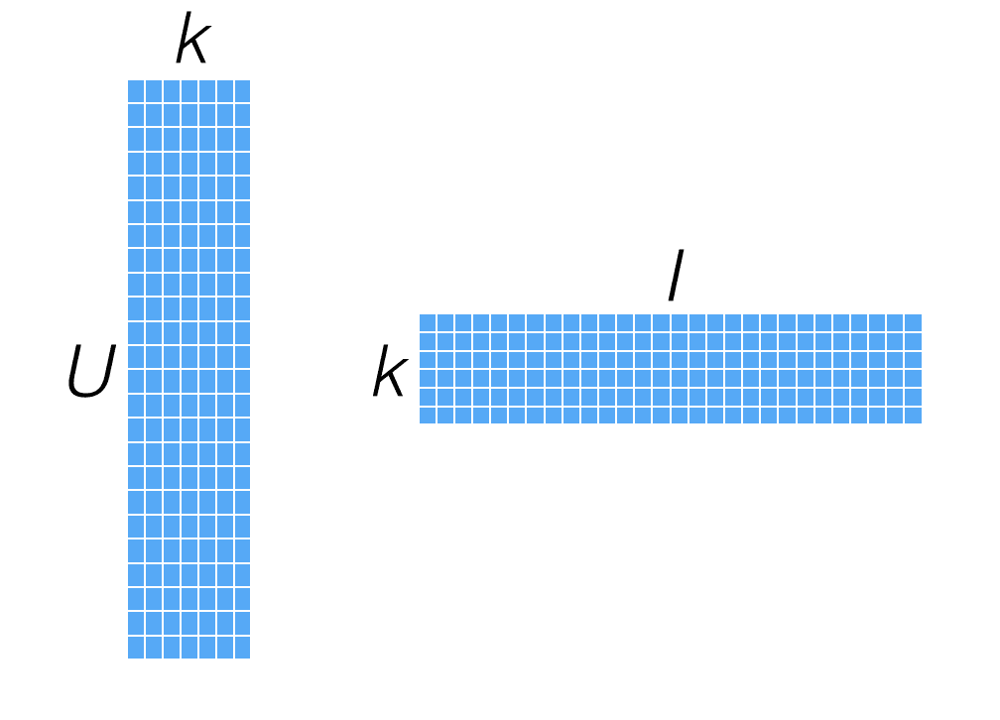
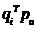
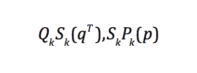
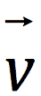
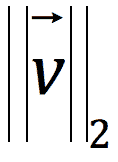

# 五、使用 Spark 构建推荐引擎

既然您已经了解了数据处理和特征提取的基础知识，我们将从推荐引擎开始，详细探讨各个机器学习模型。

推荐引擎可能是公众所知的最好的机器学习模型之一。 即使人们不知道什么是推荐引擎，但他们很可能通过使用流行的网站(如亚马逊、Netflix、YouTube、Twitter、LinkedIn 和 Facebook)体验过推荐引擎。 推荐是所有这些业务的核心部分，在某些情况下，它们推动了收入的很大比例。

推荐引擎背后的想法是预测人们可能喜欢什么，并发现项目之间的关系，以帮助发现过程；在这种情况下，它们非常相似，实际上往往是对搜索引擎的补充，搜索引擎在发现过程中也发挥着作用。 然而，与搜索引擎不同的是，推荐引擎试图向人们呈现他们不一定搜索或甚至可能从未听说过的相关内容。

通常，推荐引擎会尝试对用户和某类项目之间的连接进行建模。 例如，在[第 3 章](03.html)，*设计机器学习系统*中的电影流场景中，我们可以使用推荐引擎向我们的用户展示他们可能喜欢的电影。 如果我们能做好这一点，我们就可以让我们的用户继续使用我们的服务，这对我们的用户和我们都有好处。 同样，如果我们能很好地向用户展示与给定电影相关的电影，我们就可以在我们的网站上帮助发现和导航，再次改善我们用户的体验、参与度以及我们的内容与他们的相关性。

然而，推荐引擎并不局限于电影、书籍或产品。 我们将在本章中探讨的技术几乎可以应用于任何用户到项目的关系以及用户到用户的联系，例如在社交网络上找到的那些，使我们能够提出建议，例如您可能认识的人或要关注的人。

推荐引擎在两种不相互排斥的一般情况下最有效。 下面对它们进行说明：

*   **为用户提供大量可用选项**：当有非常大量的可用项目时，用户找到他们想要的东西变得越来越困难。 当用户知道他们要找的是什么时，搜索会有所帮助，但通常情况下，正确的项目可能是他们以前不知道的。 在这种情况下，推荐用户可能还不知道的相关项目可以帮助他们发现新项目。
*   **很大程度上涉及到个人品味**：当个人品味在选择中发挥重要作用时，通常采用群体智慧方法的推荐模型有助于根据其他品味相似的人的行为来发现商品。

在本章中，我们将介绍以下主题：

*   介绍各种类型的推荐引擎
*   使用有关用户偏好的数据构建推荐模型
*   使用训练好的模型来计算给定用户的推荐，以及计算给定项目(即相关项目)的相似项目
*   将标准评估指标应用于我们创建的模型，以衡量其在预测能力方面的表现

# 推荐模型的类型

推荐系统得到了广泛的研究，使用的方法也很多，但其中最流行的可能有两种：基于内容的过滤和协作过滤。 最近，其他方法，如对模型进行排名，也越来越受欢迎。 在实践中，许多方法是混合的，将许多不同方法的元素合并到一个模型或模型组合中。

# 基于内容的过滤

基于内容的方法尝试使用项目的内容或属性，以及两个内容之间的某些相似性概念来生成与给定项目相似的项目。 这些属性通常是文本内容，例如附加到项目的标题、名称、标签和其他元数据，或者在媒体的情况下，它们可以包括项目的其他特征，例如从音频和视频内容中提取的属性。

以类似的方式，可以基于用户或用户简档的属性来生成用户推荐，然后使用相同的相似性度量将其与项目属性相匹配。 例如，用户可以由他们与之交互的项目的组合属性来表示。 这将成为他们的用户配置文件，然后将其与项目属性进行比较，以查找与用户配置文件匹配的项目。

以下是为每个用户或项目创建配置文件以描述其性质的几个示例：

*   电影配置文件包括有关演员、类型、受欢迎程度等的属性。
*   用户配置文件包括针对特定问题提供的人口统计信息或答案。
*   内容过滤使用配置文件来关联用户或项目。
*   根据使用骰子系数的关键字重叠示例计算新项目与用户配置文件的相似度。 还有其他方法。

# 协同过滤

协作过滤仅依赖于过去的行为，例如以前的评级或交易。 这背后的理念是相似的概念。

其基本思想是用户隐式或显式地对项目进行评级。 过去有相似口味的用户，未来也会有类似的口味。

在基于用户的方法中，如果两个用户表现出相似的偏好，即以大致相同的方式与相同项目交互的模式，那么我们将假设他们在品味方面彼此相似。 要为给定用户生成未知项目的推荐，我们可以使用表现出类似行为的其他用户的已知偏好。 我们可以通过选择一组相似的用户并根据他们表现出的偏好项目计算某种形式的组合分数来实现这一点。 总体逻辑是，如果其他人的口味与一组食物相似，这些食物往往是很好的推荐对象。

我们还可以采用基于项目的方法来计算项目之间的一些相似性度量。 这通常基于现有的用户项目首选项或评级。 在这种方法下，倾向于被相似用户评为相同的项目将被归类为相似。 一旦我们有了这些相似性，我们就可以用他们与之交互的项目来表示用户，并找到与这些已知项目相似的项目，然后我们可以向用户推荐这些项目。 同样，与已知项目相似的一组项目被用来生成组合得分以估计未知项目。

基于用户和基于项目的方法通常被称为最近邻模型，因为估计分数是基于最相似的用户或项目的集合(即，他们的邻居)来计算的。

传统的协同过滤算法将用户表示为项目的 N 维向量，其中 N 是不同项目的数量。 向量的分量是正数或负数。 为了计算最佳项目，该算法通常将向量分量乘以倒数频率，即，对项目进行评分的用户数的倒数，从而使不太知名的项目更加相关。 对于大多数用户来说，此向量非常稀疏。 该算法基于与该用户最相似的几个用户来生成推荐。 它可以测量两个用户*X*和*Y*的相似度，使用一种称为两个向量之间夹角的余弦的常用方法：


最后，有许多基于模型的方法试图对用户-项目偏好本身建模，以便可以通过将模型应用于未知的用户-项目组合来直接估计新的偏好。

协同过滤的两种主要建模方法如下：

*   **邻域方法**：
    *   面向用户的方法以计算用户之间的关系为中心
    *   面向项目的方法基于同一用户对相邻项目的评级来评估用户对项目的偏好
    *   使用中心余弦距离计算相似度，也称为**皮尔逊相关系数**
*   **潜在因素模型**：
    *   **潜在因素模型**(**LFM**)方法通过表征用户和项目以发现隐藏的潜在特征来解释评级
    *   在电影中，动作或戏剧、演员类型等特征是潜在的因素。
    *   在用户中，喜欢电影评分等功能就是潜在因素的一个例子
    *   类型有神经网络、潜在 Dirichlet 分配、矩阵分解

在下一节中，我们将讨论矩阵分解模型。

# 矩阵分解

由于 Spark 的推荐模型目前只包括矩阵因式分解的实现，我们将把注意力集中在这类模型上。 这种关注是有充分理由的；然而，这些类型的模型一直被证明在协作过滤中表现得非常好，并在 Netflix 奖等知名比赛中跻身于最佳模型之列。

矩阵分解假设：

*   每个用户可以由 n 个属性或特征来描述。 例如，功能一可能是一个数字，表示每个用户有多喜欢动作片。
*   每一项都可以由一组 n 个属性或特征来描述。 为了与前面的例子联系起来，电影的第一个特征可能是一个数字，它表示电影离纯动作有多近。
*   如果我们将用户的每个特征乘以项目的相应特征，然后将所有内容加在一起，这将是用户对该项目的评分的一个很好的近似值。

有关 Netflix 奖最佳算法性能的更多信息和简要概述，请参阅[http://techblog.netflix.com/2012/04/netflix-recommendations-beyond-5-stars.html](http://techblog.netflix.com/2012/04/netflix-recommendations-beyond-5-stars.html)。

# 显式矩阵分解

当我们处理由用户自己提供的用户偏好组成的数据时，我们指的是显式的偏好数据。 例如，这包括用户对项目的评分、竖起大拇指、点赞等。

我们可以把这些评分，形成一个以用户为行，以项目为列的二维矩阵。 每个条目代表用户对某一项目给予的评级。 因为在大多数情况下，每个用户只与相对较小的项目集交互，所以该矩阵只有几个非零条目，也就是说，它是非常稀疏的。

举个简单的例子，我们假设一组电影的用户评分如下：

汤姆：《星球大战 5》

简：泰坦尼克号，4

比尔：蝙蝠侠，3。

简：“星球大战 2”

比尔：泰坦尼克号，3

我们将形成以下评级矩阵：


A simple movie-rating matrix

矩阵分解(或矩阵完成)试图通过将该用户项矩阵表示为两个较小的低维矩阵的乘积来直接对其建模。 因此，它是一种降维技术。 如果我们有**U**个用户和**i**个项目，则我们的用户-项目矩阵的维度为 U x i，可能如下图所示：


A sparse ratings matrix

如果我们想要找到维度为**k**的用户项矩阵的低维(低秩)近似，我们最终将得到两个矩阵：一个用于大小为 U x k 的用户，另一个用于大小为 i x k 的项；这些矩阵称为因子矩阵。 如果我们将这两个因素矩阵相乘，我们将不会重建原始评级矩阵的近似版本。 请注意，虽然原始评级矩阵通常非常稀疏，但每个因素矩阵都是密集的，如下图所示：



The user- and item-factor matrices

这些模型通常也称为潜在特征模型，因为我们试图发现某种形式的隐藏特征(由因素矩阵表示)，这些隐藏特征解释了用户-项目评级矩阵中固有的行为结构。 虽然潜在的特征或因素不能直接解释，但它们可能代表了一些东西，比如用户喜欢某一导演、类型、风格或演员群体的电影的倾向。

由于我们直接对用户-项目矩阵进行建模，因此这些模型中的预测相对简单：要计算用户和项目的预测评分，我们将计算用户因素矩阵的相关行(即用户的因素向量)和项目因素矩阵的相关行(即项目的因素向量)之间的向量点积。

下图中突出显示的向量说明了这一点：


Computing recommendations from user- and item-factor vectors

要找出两个项目之间的相似性，我们可以使用与在最近邻模型中使用的相同的相似性度量，只是我们可以通过计算两个项目-系数向量之间的相似性来直接使用系数向量，如下图所示：


Computing similarity with item-factor vectors

因子分解模型的好处是在创建模型后相对容易地计算推荐。 然而，对于非常大的用户和项目集，这可能会成为一个挑战，因为它需要跨越潜在数百万个用户和项目因素向量的存储和计算。 如前所述，另一个优点是它们往往提供非常好的性能。

Projects such as Oryx ([https://github.com/OryxProject/oryx](https://github.com/OryxProject/oryx)) and Prediction.io ([https://github.com/PredictionIO/PredictionIO](https://github.com/PredictionIO/PredictionIO)) focus on model serving for large-scale models, including recommenders based on matrix factorization.

不利的一面是，与最近邻模型相比，因子分解模型相对更难理解和解释，而且在模型的训练阶段通常需要更多的计算。

# 隐式矩阵分解

到目前为止，我们已经处理了评级等明确的偏好。 然而，我们可能能够收集的大部分偏好数据都是隐式反馈，其中用户和物品之间的偏好不会被提供给我们，而是从他们可能与物品进行的交互中隐含出来。 示例包括二进制数据(如用户是否观看了电影、是否购买了产品等)以及计数数据(如用户观看电影的次数)。

有许多不同的方法来处理隐式数据。 MLlib 实现了一种特殊的方法，该方法将输入评级矩阵视为两个矩阵：二元偏好矩阵**P**和置信度权重矩阵**C**。

例如，让我们假设我们之前看到的用户电影评分实际上是每个用户观看该电影的次数。 这两个矩阵看起来与下面的屏幕截图中显示的类似。 这里，矩阵**P**告诉我们用户观看了一部电影，矩阵**C**以观看计数的形式表示置信度加权--通常，用户看电影越多，他们真正喜欢它的置信度就越高。


Representation of an implicit preference and confidence matrix

隐式模型仍会创建用户和项目因素矩阵。 然而，在这种情况下，模型试图逼近的矩阵不是总体评级矩阵，而是偏好矩阵**P**。 如果我们通过计算用户和项目因子向量的点积来计算推荐，分数将不会直接作为评分的估计值。 更确切地说，它是对用户对某一项目的偏好的估计；尽管严格来说不是在 0 到 1 之间，但这些分数通常会相当接近 0 到 1 的范围。

简而言之，矩阵分解方法通过从评级模式推断的因素向量来表征用户和项目。 用户和项目因素之间的高度置信度或一致性导致推荐。 两种主要的数据类型是显式反馈，例如评级(由稀疏矩阵表示)和隐式反馈，例如购买历史、搜索模式、浏览历史和点击流数据(由密集矩阵表示)。

# 矩阵分解的基本模型

用户和项目都被映射到维度的联合潜在因子空间*f*，其中用户-项目交互被建模为该空间中的内积。 项*i*与向量*q*相关联，其中*q*测量项具有潜在因素的程度，并且用户*u*与向量*p*相关联，其中*p*测量用户对项的兴趣程度。

*q*和*p*之间的点积捕捉了用户 u 和项目 i 之间的交互，即用户对项目的兴趣。 建模的关键是找到向量*q*和*p*。

在设计模型时，首先要得到用户与物品之间的潜在关系。 生成评级矩阵的低维表示形式。 对评级矩阵进行奇异值分解，得到*Q*，*S*，*P*。 将矩阵*S*降维为维数*k*，得到*q*和*p*。

****

现在，计算一下建议：


优化函数(在观察到的评级上)如下图所示；学习潜在因子向量*q*和*p*，系统会最小化评级集上的正则化平方误差。


使用的学习算法是**随机梯度下降**(**SGD**)或**交替最小二乘**(**ALS**)。

# 交替最小二乘法

ALS 是一种解决矩阵分解问题的优化技术；该技术功能强大，性能良好，并且已被证明是相对容易并行实现的。 因此，它非常适合 Spark 这样的平台。 在撰写本书时，它是 Spark ML 中实现的唯一推荐模型。

ALS 通过迭代求解一系列最小二乘回归问题来工作。 在每次迭代中，用户因素矩阵或项目因素矩阵中的一个被视为固定的，而另一个则使用固定因素和评级数据进行更新。 然后，求解的因子矩阵依次被视为固定的，而另一个因子矩阵被更新。 此过程将一直持续到模型收敛(或固定迭代次数)：


目标函数不是凸的，因为*q*和*p*都是未知的，但如果我们固定其中一个，未知的优化是可以解决的。 ALS 在固定*q*和固定*p*之间旋转，如前所述。

Spark's documentation for collaborative filtering contains references to the papers that underlie the ALS algorithms implemented each component of explicit and implicit data. You can view the documentation at http://spark.apache.org/docs/latest/ml-collaborative-filtering.html.

以下代码解释了如何从头开始实现 ALS 算法。

让我们举一个例子，展示它是如何实现的，并查看一个由 3 部电影和 3 个用户组成的真实矩阵：

```scala
Array2DRowRealMatrix 
{{0.5306513708,0.5144338501,0.5183049}, 
{0.0612665269,0.0595122885,0.0611548878}, 
{0.3215637836,0.2964382622,0.1439834964}}

```

电影矩阵的第一次迭代是随机选择的：

```scala
ms = {RealVector[3]@3600} 
 0 = {ArrayRealVector@3605} "{0.489603683; 0.5979051631}" 
 1 = {ArrayRealVector@3606} "{0.2069873135; 0.4887559609}" 
 2 = {ArrayRealVector@3607} "{0.5286582698; 0.6787608323}"

```

用户矩阵的第一次迭代是随机选择的：

```scala
us = {RealVector[3]@3602} 
 0 = {ArrayRealVector@3611} "{0.7964247309; 0.091570682}" 
 1 = {ArrayRealVector@3612} "{0.4509758768; 0.0684475614}" 
 2 = {ArrayRealVector@3613} "{0.7812240904; 0.4180722562}"

```

选取用户矩阵`us`的第一行，计算`XtX`(矩阵)和`Xty`(向量)，如以下代码所示：

```scala
m: {0.489603683; 0.5979051631} 
us: [Lorg.apache.commons.math3.linear.RealVector;@75961f16 
 XtX: Array2DRowRealMatrix{{0.0,0.0},{0.0,0.0}} 
 Xty: {0; 0}

```

J：0

```scala
u: {0.7964247309; 0.091570682} 
u.outerProduct(u): 
   Array2DRowRealMatrix{{0.634292352,0.0729291558},
   {0.0729291558,0.0083851898}} 
XtX = XtX.add(u.outerProduct(u)): 
   Array2DRowRealMatrix{{0.634292352,0.0729291558},
   {0.0729291558,0.0083851898}} 
R.getEntry(i, j)):0.5306513708051035 
u.mapMultiply(R.getEntry(i, j): {0.4226238752; 0.0485921079} 
Xty = Xty.add(u.mapMultiply(R.getEntry(i, j))): {0.4226238752; 
   0.0485921079}

```

选取用户矩阵`us`的第二行，向`XtX`(矩阵)和`Xty`(向量)相加，如下图代码所示：

J：1

```scala
u: {0.4509758768; 0.0684475614} 
u.outerProduct(u): Array2DRowRealMatrix{{0.2033792414,0.030868199},{0.030868199,0.0046850687}} 
XtX = XtX.add(u.outerProduct(u)): Array2DRowRealMatrix{{0.8376715935,0.1037973548},{0.1037973548,0.0130702585}} 
R.getEntry(i, j)):0.5144338501354986 
u.mapMultiply(R.getEntry(i, j): {0.2319972566; 0.0352117425} 
Xty = Xty.add(u.mapMultiply(R.getEntry(i, j))): {0.6546211318; 0.0838038505}

```

J：2

```scala
u: {0.7812240904; 0.4180722562} 
u.outerProduct(u): 
   Array2DRowRealMatrix{{0.6103110794,0.326608118},
   {0.326608118,0.1747844114}} 
XtX = XtX.add(u.outerProduct(u)): 
   Array2DRowRealMatrix{{1.4479826729,0.4304054728},
   {0.4304054728,0.1878546698}} 
R.getEntry(i, j)):0.5183049000396933 
u.mapMultiply(R.getEntry(i, j): {0.4049122741; 0.2166888989} 
Xty = Xty.add(u.mapMultiply(R.getEntry(i, j))): {1.0595334059; 
   0.3004927494} 
After Regularization XtX: 
   Array2DRowRealMatrix{{1.4779826729,0.4304054728},
   {0.4304054728,0.1878546698}} 
After Regularization XtX: Array2DRowRealMatrix{{1.4779826729,0.4304054728},{0.4304054728,0.2178546698}}

```

计算`ms`第一行的值(使用`XtX`和`XtY`的 Cholesky 分解的电影矩阵：

```scala
CholeskyDecomposition{0.7422344051; -0.0870718111}

```

经过我们每一排人的检查，按照上面的步骤，我们得出了以下结论：

```scala
ms = {RealVector[3]@5078} 
 0 = {ArrayRealVector@5125} "{0.7422344051; -0.0870718111}" 
 1 = {ArrayRealVector@5126} "{0.0856607011; -0.007426896}" 
 2 = {ArrayRealVector@5127} "{0.4542083563; -0.392747909}"

```

列出前面解释的数学实现的以下源代码：

```scala
object AlternatingLeastSquares { 

  var movies = 0 
  var users = 0 
  var features = 0 
  var ITERATIONS = 0 
  val LAMBDA = 0.01 // Regularization coefficient 

  private def vector(n: Int): RealVector = 
    new ArrayRealVector(Array.fill(n)(math.random)) 

  private def matrix(rows: Int, cols: Int): RealMatrix = 
    new Array2DRowRealMatrix(Array.fill(rows, cols)(math.random)) 

  def rSpace(): RealMatrix = { 
    val mh = matrix(movies, features) 
    val uh = matrix(users, features) 
    mh.multiply(uh.transpose()) 
  } 

  def rmse(targetR: RealMatrix, ms: Array[RealVector], us: 
   Array[RealVector]): Double = { 
    val r = new Array2DRowRealMatrix(movies, users) 
    for (i <- 0 until movies; j <- 0 until users) { 
      r.setEntry(i, j, ms(i).dotProduct(us(j))) 
    } 
    val diffs = r.subtract(targetR) 
    var sumSqs = 0.0 
    for (i <- 0 until movies; j <- 0 until users) { 
      val diff = diffs.getEntry(i, j) 
      sumSqs += diff * diff 
    } 
    math.sqrt(sumSqs / (movies.toDouble * users.toDouble)) 
  } 

  def update(i: Int, m: RealVector, us: Array[RealVector], R: 
   RealMatrix) : RealVector = { 
    val U = us.length 
    val F = us(0).getDimension 
    var XtX: RealMatrix = new Array2DRowRealMatrix(F, F) 
    var Xty: RealVector = new ArrayRealVector(F) 
    // For each user that rated the movie 
    for (j <- 0 until U) { 
      val u = us(j) 
      // Add u * u^t to XtX 
      XtX = XtX.add(u.outerProduct(u)) 
      // Add u * rating to Xty 
      Xty = Xty.add(u.mapMultiply(R.getEntry(i, j))) 
    } 
    // Add regularization coefs to diagonal terms 
    for (d <- 0 until F) { 
      XtX.addToEntry(d, d, LAMBDA * U) 
    } 
    // Solve it with Cholesky 
    new CholeskyDecomposition(XtX).getSolver.solve(Xty) 
  } 

  def main(args: Array[String]) { 

    movies = 100 
    users = 500 
    features = 10 
    ITERATIONS = 5 
    var slices = 2 

    val spark = 
     SparkSession.builder.master("local[2]").
     appName("AlternatingLeastS
   quares").getOrCreate() 
    val sc = spark.sparkContext 

    val r_space = rSpace() 

    // Initialize m and u randomly 
    var ms = Array.fill(movies)(vector(features)) 
    var us = Array.fill(users)(vector(features)) 

    // Iteratively update movies then users 
    val Rc = sc.broadcast(r_space) 
    var msb = sc.broadcast(ms) 
    var usb = sc.broadcast(us) 
    for (iter <- 1 to ITERATIONS) { 
      println(s"Iteration $iter:") 
      ms = sc.parallelize(0 until movies, slices) 
        .map(i => update(i, msb.value(i), usb.value, Rc.value)) 
        .collect() 
      msb = sc.broadcast(ms) // Re-broadcast ms because it was 
   updated 
      us = sc.parallelize(0 until users, slices) 
        .map(i => update(i, usb.value(i), msb.value, 
   Rc.value.transpose())) 
        .collect() 
      usb = sc.broadcast(us) // Re-broadcast us because it was 
   updated 
      println("RMSE = " + rmse(r_space, ms, us)) 
      println() 
    } 

    spark.stop() 
  } 
}

```

You can find the code listing at: [https://github.com/ml-resources/spark-ml/blob/branch-ed2/Chapter_05/2.0.0/scala-spark-app/src/main/scala/com/spark/recommendation/AlternatingLeastSquares.scala](https://github.com/ml-resources/spark-ml/blob/branch-ed2/Chapter_05/2.0.0/scala-spark-app/src/main/scala/com/spark/recommendation/AlternatingLeastSquares.scala)

# 从数据中提取正确的要素

在本节中，我们将使用显式评分数据，而不使用额外的用户、项目元数据或其他与用户与项目交互相关的信息。 因此，我们需要作为输入的功能仅仅是用户 ID、电影 ID 以及分配给每个用户和电影对的评级。

# 从 MovieLens 100k 数据集中提取要素

在本例中，我们将使用与上一章相同的 MovieLens 数据集。 在下面的代码中，使用放置 MovieLens 100k 数据集的目录作为输入路径。

首先，让我们检查原始评级数据集：

```scala
object FeatureExtraction { 

def getFeatures(): Dataset[FeatureExtraction.Rating] = { 
  val spark = SparkSession.builder.master("local[2]").appName("FeatureExtraction").getOrCreate() 

  import spark.implicits._ 
  val ratings = spark.read.textFile("/data/ml-100k 2/u.data").map(parseRating) 
  println(ratings.first()) 

  return ratings 
} 

case class Rating(userId: Int, movieId: Int, rating: Float) 
def parseRating(str: String): Rating = { 
  val fields = str.split("t") 
  Rating(fields(0).toInt, fields(1).toInt, fields(2).toFloat) 
}

```

You can find the code listing at: [https://github.com/ml-resources/spark-ml/blob/branch-ed2/Chapter_05/2.0.0/scala-spark-app/src/main/scala/com/spark/recommendation/FeatureExtraction.scala](https://github.com/ml-resources/spark-ml/blob/branch-ed2/Chapter_05/2.0.0/scala-spark-app/src/main/scala/com/spark/recommendation/FeatureExtraction.scala)

您将看到类似于以下代码行的输出：

```scala
16/09/07 11:23:38 INFO CodeGenerator: Code generated in 7.029838 ms
16/09/07 11:23:38 INFO Executor: Finished task 0.0 in stage 0.0 (TID 
   0). 1276 bytes result sent to driver
16/09/07 11:23:38 INFO TaskSetManager: Finished task 0.0 in stage 0.0 
   (TID 0) in 82 ms on localhost (1/1)
16/09/07 11:23:38 INFO TaskSchedulerImpl: Removed TaskSet 0.0, whose 
   tasks have all completed, from pool
16/09/07 11:23:38 INFO DAGScheduler: ResultStage 0 (first at 
   FeatureExtraction.scala:25) finished in 0.106 s
16/09/07 11:23:38 INFO DAGScheduler: Job 0 finished: first at 
   FeatureExtraction.scala:25, took 0.175165 s
16/09/07 11:23:38 INFO CodeGenerator: Code generated in 6.834794 ms
Rating(196,242,3.0)

```

回想一下，这个数据集(使用 CASE 映射到`Rating`类)由用制表符(`"t"`)分隔的`userID`、`movieID`、`rating`和`timestamp`字段组成。 我们不需要进行评级时的时间来训练我们的模型，因此在下面的代码片段中，我们简单地提取了前三个字段：

```scala
case class Rating(userId: Int, movieId: Int, rating: Float) 
def parseRating(str: String): Rating = { 
  val fields = str.split("t") 
  Rating(fields(0).toInt, fields(1).toInt, fields(2).toFloat) 
}

```

You can find the code listing at: [https://github.com/ml-resources/spark-ml/blob/branch-ed2/Chapter_05/2.0.0/scala-spark-app/src/main/scala/com/spark/recommendation/FeatureExtraction.scala](https://github.com/ml-resources/spark-ml/blob/branch-ed2/Chapter_05/2.0.0/scala-spark-app/src/main/scala/com/spark/recommendation/FeatureExtraction.scala)

我们将首先在`"t"`字符上拆分每条记录，这给我们提供了一个`String[]`数组。 然后，我们将使用 case 类来映射和保留数组的前`3`个元素，它们分别对应于`userID`、`movieID`和`rating`。

# 培训推荐模型

一旦我们从原始数据中提取了这些简单的特征，我们就可以继续进行模型训练了；ML 会为我们做好这方面的工作。 我们所要做的就是提供我们刚刚创建的正确解析的输入数据集以及我们选择的模型参数。

将数据集按 80：20 的比例分为训练集和测试集，如以下代码行所示：

```scala
def createALSModel() { 
  val ratings = FeatureExtraction.getFeatures(); 

  val Array(training, test) = ratings.randomSplit(Array(0.8, 0.2)) 
  println(training.first()) 
}

```

You can find the code listing at: [https://github.com/ml-resources/spark-ml/blob/branch-ed2/Chapter_05/2.0.0/scala-spark-app/src/main/scala/com/spark/recommendation/ALSModeling.scala](https://github.com/ml-resources/spark-ml/blob/branch-ed2/Chapter_05/2.0.0/scala-spark-app/src/main/scala/com/spark/recommendation/ALSModeling.scala)

您将看到以下输出：

```scala
16/09/07 13:23:28 INFO Executor: Finished task 0.0 in stage 1.0 (TID 
   1). 1768 bytes result sent to driver
16/09/07 13:23:28 INFO TaskSetManager: Finished task 0.0 in stage 1.0 
   (TID 1) in 459 ms on localhost (1/1)
16/09/07 13:23:28 INFO TaskSchedulerImpl: Removed TaskSet 1.0, whose 
   tasks have all completed, from pool
16/09/07 13:23:28 INFO DAGScheduler: ResultStage 1 (first at 
   FeatureExtraction.scala:34) finished in 0.459 s
16/09/07 13:23:28 INFO DAGScheduler: Job 1 finished: first at 
   FeatureExtraction.scala:34, took 0.465730 s
Rating(1,1,5.0)

```

# 在 MovieLens 100k 数据集上训练模型

我们现在准备好训练我们的模特了！ 我们的模型需要的其他输入如下：

*   `rank`：这指的是我们的 ALS 模型中的因子数量，也就是我们的低秩近似矩阵中隐藏的特征的数量。 一般来说，因素的数量越多越好，但这会直接影响内存的使用，无论是用于计算的内存还是用于服务的存储模型，尤其是对于大量的用户或项目而言。 因此，在现实世界的用例中，这通常是一种权衡。 它还会影响所需的培训数据量。
*   排名在 10 至 200 之间通常是合理的。
*   `iterations`：这指的是要运行的迭代次数。 虽然 ALS 的每一次迭代都能保证减小评级矩阵的重构误差，但 ALS 模型在相对较少的迭代后就会收敛到一个合理的好解。 因此，在大多数情况下，我们不需要运行太多迭代--大约 10 次通常是一个很好的缺省值。
*   `numBlocks`：这是为了并行计算而将用户和项目划分成的块数(缺省值为 10)。 该数量取决于群集节点的数量以及数据的分区方式。
*   `regParam`：指定 ALS 中的正则化参数(默认为 1.0)。 常量*λ*被称为正则化参数，如果用户和项目矩阵的组件变得太大(在大小上)，它实际上会对它们造成不利影响。 这对于数值稳定性很重要，并且几乎总是使用某种正则化。
*   `implicitPrefs`：指定是使用显式反馈 ALS 变量还是使用适用于隐式反馈数据的 ALS 变量；默认为 FALSE，表示使用显式反馈。
*   `alpha`：这是一个适用于 ALS 的隐式反馈变量的参数，该变量控制偏好观察中的*基线*置信度(默认为 1.0)。
*   `nonnegative`：指定是否对最小二乘使用非负约束(默认为`false`)。

我们将使用默认的`rank`、`5``maxIter`和`0.01`的`regParam`参数来说明如何训练我们的模型，如以下代码所示：

```scala
// Build the recommendation model using ALS on the training data 
val als = new ALS() 
  .setMaxIter(5) 
  .setRegParam(0.01) 
  .setUserCol("userId") 
  .setItemCol("movieId") 
  .setRatingCol("rating") 

val model = als.fit(training)

```

You can find the code listing at [https://github.com/ml-resources/spark-ml/blob/branch-ed2/Chapter_05/2.0.0/scala-spark-app/src/main/scala/com/spark/recommendation/ALSModeling.scala](https://github.com/ml-resources/spark-ml/blob/branch-ed2/Chapter_05/2.0.0/scala-spark-app/src/main/scala/com/spark/recommendation/ALSModeling.scala).

这将返回一个`ALSModel`对象，其中包含用户和项目因子。 它们分别称为`userFactors`和`itemFactors`。

例如，`model.userFactors`。

您将看到如下输出：

```scala
16/09/07 13:08:16 INFO MapPartitionsRDD: Removing RDD 16 from 
   persistence list
16/09/07 13:08:16 INFO BlockManager: Removing RDD 16
16/09/07 13:08:16 INFO Instrumentation: ALS-als_1ca69e2ffef7-
   10603412-1: training finished
16/09/07 13:08:16 INFO SparkContext: Invoking stop() from shutdown 
   hook
[id: int, features: array<float>]

```

我们可以看到，这些因素是以`Array[float]`的形式出现的。

请注意，MLlib 的 ALS 实现中使用的操作是惰性转换，因此只有在我们对用户和项目因子的结果 DataFrame 调用某种操作时，才会执行实际计算。 在下面的代码中，我们可以使用 Spark 操作(如`count`)强制计算：

```scala
model.userFactors.count()

```

这将触发计算，我们将看到相当多类似于以下代码行的输出文本：

```scala
16/09/07 13:21:54 INFO Executor: Running task 0.0 in stage 53.0 (TID 
   166)
16/09/07 13:21:54 INFO ShuffleBlockFetcherIterator: Getting 10 non-
   empty blocks out of 10 blocks
16/09/07 13:21:54 INFO ShuffleBlockFetcherIterator: Started 0 remote 
   fetches in 0 ms
16/09/07 13:21:54 INFO Executor: Finished task 0.0 in stage 53.0 (TID 
   166). 1873 bytes result sent to driver
16/09/07 13:21:54 INFO TaskSetManager: Finished task 0.0 in stage 
   53.0 (TID 166) in 12 ms on localhost (1/1)
16/09/07 13:21:54 INFO TaskSchedulerImpl: Removed TaskSet 53.0, whose 
   tasks have all completed, from pool
16/09/07 13:21:54 INFO DAGScheduler: ResultStage 53 (count at 
   ALSModeling.scala:25) finished in 0.012 s
16/09/07 13:21:54 INFO DAGScheduler: Job 7 finished: count at 
   ALSModeling.scala:25, took 0.123073 s
16/09/07 13:21:54 INFO CodeGenerator: Code generated in 11.162514 ms
943

```

如果我们调用电影因子的`count`，它将在以下代码的帮助下完成：

```scala
model.itemFactors.count()

```

这将触发计算，我们将得到以下输出：

```scala
16/09/07 13:23:32 INFO TaskSetManager: Starting task 0.0 in stage 
   68.0 (TID 177, localhost, partition 0, ANY, 5276 bytes)
16/09/07 13:23:32 INFO Executor: Running task 0.0 in stage 68.0 (TID 
   177)
16/09/07 13:23:32 INFO ShuffleBlockFetcherIterator: Getting 10 non-
   empty blocks out of 10 blocks
16/09/07 13:23:32 INFO ShuffleBlockFetcherIterator: Started 0 remote 
   fetches in 0 ms
16/09/07 13:23:32 INFO Executor: Finished task 0.0 in stage 68.0 (TID 
   177). 1873 bytes result sent to driver
16/09/07 13:23:32 INFO TaskSetManager: Finished task 0.0 in stage 
   68.0 (TID 177) in 3 ms on localhost (1/1)
16/09/07 13:23:32 INFO TaskSchedulerImpl: Removed TaskSet 68.0, whose 
   tasks have all completed, from pool
16/09/07 13:23:32 INFO DAGScheduler: ResultStage 68 (count at 
   ALSModeling.scala:26) finished in 0.003 s
16/09/07 13:23:32 INFO DAGScheduler: Job 8 finished: count at 
   ALSModeling.scala:26, took 0.072450 s

1651

```

不出所料，我们为每个用户(`943`个因子)和每个电影(`1651`个因子)都有一个因子数组。

# 使用隐式反馈数据训练模型

MLlib 中的标准矩阵分解方法处理显式评级。 要处理隐式数据，可以使用`trainImplicit`方法。 它的调用方式类似于标准的`train`方法。 还有一个可以设置的附加参数`alpha`(同样，正则化参数`lambda`应该通过测试和交叉验证方法来选择)。

`alpha`参数控制应用的基准置信度水平和权重。 较高级别的`alpha`往往会使模型更加确信这样一个事实，即丢失数据等同于没有对相关用户-项目对的偏好。

从 Spark 2.0 版开始，如果评级矩阵来自另一个信息源，即从其他信号推断，则可以从`setImplicitPrefs`到`true`来获得更好的结果，如下例所示：

```scala
val als = new ALS() 
  .setMaxIter(5) 
  .setRegParam(0.01) 
  .setImplicitPrefs(true) 
  .setUserCol("userId") 
  .setItemCol("movieId") 
  .setRatingCol("rating")

```

As an exercise, try to take the existing MovieLens dataset and convert it into an implicit dataset. One possible approach is to convert it to binary feedback (0s and 1s) by applying a threshold on the ratings at some level. Another approach could be to convert the ratings' values into confidence weights (for example, perhaps, low ratings could imply zero weights, or even negative weights, which are supported by MLlib's implementation). Train a model on this dataset and compare the results of the following section with those generated by your implicit model.

# 使用推荐模型

既然我们有了经过训练的模型，我们就可以使用它进行预测了。

# ALS 模型建议

从 Spark v2.0 开始，`org.apache.spark.ml.recommendation.ALS`建模是因子分解算法的阻塞实现，该算法将“用户”和“产品”因子分组为块，并通过在每次迭代中仅将每个用户向量的一个副本发送到每个乘积块来减少通信，并且仅针对需要该用户的特征向量的乘积块。

在这里，我们将从 Movies 数据集中加载评级数据，其中每一行都由用户、电影、评级和时间戳组成。 然后，我们将训练 ALS 模型，默认情况下，该模型按照显式首选项工作(`implicitPrefs`为`false`)。 我们将通过测量评级预测的均方根误差来评估推荐模型，具体如下：

```scala
object ALSModeling { 

  def createALSModel() { 
    val ratings = FeatureExtraction.getFeatures(); 

    val Array(training, test) = ratings.randomSplit(Array(0.8, 
   0.2)) 
    println(training.first()) 

    // Build the recommendation model using ALS on the training 
   data 
    val als = new ALS() 
      .setMaxIter(5) 
      .setRegParam(0.01) 
      .setUserCol("userId") 
      .setItemCol("movieId") 
      .setRatingCol("rating") 

    val model = als.fit(training) 
    println(model.userFactors.count()) 
    println(model.itemFactors.count()) 

    val predictions = model.transform(test) 
    println(predictions.printSchema()) 

}

```

You can find the code listing at: [https://github.com/ml-resources/spark-ml/blob/branch-ed2/Chapter_05/2.0.0/scala-spark-app/src/main/scala/com/spark/recommendation/ALSModeling.scala](https://github.com/ml-resources/spark-ml/blob/branch-ed2/Chapter_05/2.0.0/scala-spark-app/src/main/scala/com/spark/recommendation/ALSModeling.scala)

以下是前面代码的输出：

```scala
16/09/07 17:58:42 INFO SparkContext: Created broadcast 26 from 
   broadcast at DAGScheduler.scala:1012
16/09/07 17:58:42 INFO DAGScheduler: Submitting 1 missing tasks from 
   ResultStage 67 (MapPartitionsRDD[138] at count at 
   ALSModeling.scala:31)
16/09/07 17:58:42 INFO TaskSchedulerImpl: Adding task set 67.0 with 1 
   tasks
16/09/07 17:58:42 INFO TaskSetManager: Starting task 0.0 in stage 
   67.0 (TID 176, localhost, partition 0, ANY, 5276 bytes)
16/09/07 17:58:42 INFO Executor: Running task 0.0 in stage 67.0 (TID 
   176)
16/09/07 17:58:42 INFO ShuffleBlockFetcherIterator: Getting 10 non-
   empty blocks out of 10 blocks
16/09/07 17:58:42 INFO ShuffleBlockFetcherIterator: Started 0 remote 
   fetches in 0 ms
16/09/07 17:58:42 INFO Executor: Finished task 0.0 in stage 67.0 (TID 
   176). 1960 bytes result sent to driver
16/09/07 17:58:42 INFO TaskSetManager: Finished task 0.0 in stage 
   67.0 (TID 176) in 3 ms on localhost (1/1)
16/09/07 17:58:42 INFO TaskSchedulerImpl: Removed TaskSet 67.0, whose 
   tasks have all completed, from pool
16/09/07 17:58:42 INFO DAGScheduler: ResultStage 67 (count at 
   ALSModeling.scala:31) finished in 0.003 s
16/09/07 17:58:42 INFO DAGScheduler: Job 7 finished: count at 
   ALSModeling.scala:31, took 0.060748 s
100
root
 |-- userId: integer (nullable = true)
 |-- movieId: integer (nullable = true)
 |-- rating: float (nullable = true)
 |-- timestamp: long (nullable = true)
 |-- prediction: float (nullable = true)

```

Before we proceed further, please note that the following examples for User and Item recommendations use MLlib from Spark v1.6\. Kindly follow the code listing to get the details of creating recommendation models using `org.apache.spark.mllib.recommendation.ALS`.

# 用户推荐

在这种情况下，我们希望为给定用户生成推荐项目。 这通常采用*top-K*列表的形式，也就是说，我们的模型预测的*K*项将具有最高的用户喜欢概率。 这是通过计算每个项目的预测得分并基于该得分对列表进行排名来实现的。

执行此计算的确切方法取决于所涉及的模型。 例如，在基于用户的方法中，使用相似用户对项目的评分来计算对用户的推荐；而在基于项目的方法中，计算基于用户已经评分的项目与候选项目的相似度。

在矩阵因式分解中，因为我们直接对评分矩阵建模，所以预测分数可以作为用户因素向量和项目因素向量之间的向量点积来计算。

# 从 MovieLens 100k 数据集生成电影推荐

由于 MLlib 的推荐模型是基于矩阵分解的，我们可以使用我们的模型计算出的因子矩阵来计算用户的预测得分(或评级)。 我们将重点介绍使用 MovieLens 数据的显式评级情况；但是，使用隐式模型时的方法是相同的。

`MatrixFactorizationModel`类有一个方便的`predict`方法，该方法将计算给定用户和项目组合的预测得分，如以下代码所示：

```scala
val predictedRating = model.predict(789, 123)

```

输出如下：

```scala
14/03/30 16:10:10 INFO SparkContext: Starting job: lookup at 
   MatrixFactorizationModel.scala:45
14/03/30 16:10:10 INFO DAGScheduler: Got job 30 (lookup at 
   MatrixFactorizationModel.scala:45) with 1 output partitions 
   (allowLocal=false)
...
14/03/30 16:10:10 INFO SparkContext: Job finished: lookup at 
   MatrixFactorizationModel.scala:46, took 0.023077 s
predictedRating: Double = 3.128545693368485

```

正如我们所看到的，该模型预测用户`789`和电影`123`的评级为`3.12`。

Note that you might see different results than those shown in this section because the ALS model is initialized randomly. So, different runs of the model will lead to different solutions.

`predict`方法还可以接受`(user, item)`个 ID 的 RDD 作为输入，并将为每个 ID 生成预测。 我们可以使用此方法同时对多个用户和项目进行预测。

为了为用户生成*TOP-K*推荐项目，`MatrixFactorizationModel`提供了一种称为`recommendProducts`的方便方法。 它有两个参数：`user`和`num`，其中`user`是用户 ID，`num`是要推荐的项目数。

它返回按预测分数顺序排序的前`num`个项目。 这里，分数计算为用户因素向量和每个项目因素向量之间的点积。

让我们为用户`789`生成排名前`10`的推荐项目，如下所示：

```scala
val userId = 789 
val K = 10 
val topKRecs = model.recommendProducts(userId, K)

```

我们现在有一组用户`789`的每部电影的预测评分。 如果我们将其打印出来，通过编写以下代码行，我们可以检查针对该用户的 10 大推荐：

```scala
println(topKRecs.mkString("n"))

```

您应该会在控制台上看到以下输出：

```scala
Rating(789,715,5.931851273771102)
Rating(789,12,5.582301095666215)
Rating(789,959,5.516272981542168)
Rating(789,42,5.458065302395629)
Rating(789,584,5.449949837103569)
Rating(789,750,5.348768847643657)
Rating(789,663,5.30832117499004)
Rating(789,134,5.278933936827717)
Rating(789,156,5.250959077906759)
Rating(789,432,5.169863417126231)

```

# 检查建议

我们可以通过快速查看用户评分的电影标题和推荐的电影来对这些推荐进行感觉检查。 首先，我们需要加载电影数据，这是我们在上一章中探索的数据集之一。 在下面的代码中，我们将收集此数据作为`Map[Int, String]`方法，将电影 ID 映射到标题：

```scala
val movies = sc.textFile("/PATH/ml-100k/u.item") 
val titles = movies.map(line => 
   line.split("|").take(2)).map(array => (array(0).toInt,
   array(1))).collectAsMap() 
titles(123)

```

前面的代码将产生以下输出：

```scala
res68: String = Frighteners, The (1996)

```

对于我们的用户`789`，我们可以找出他们评过什么电影，选择评分最高的`10`部电影，然后检查片名。 现在，我们将首先使用`keyBy`Spark 函数从我们的`ratings`RDD 创建键-值对的 RDD，其中键将是用户 ID。然后，我们将使用`lookup`函数将该键(即特定用户 ID)的评级仅返回给驱动程序，如下所述：

```scala
val moviesForUser = ratings.keyBy(_.user).lookup(789)

```

让我们来看看这个用户评了多少部电影。 这将是`moviesForUser`集合的`size`：

```scala
println(moviesForUser.size)

```

我们将看到该用户已经对`33`部电影进行了评分。

接下来，我们将使用`Rating`对象的`rating`字段对`moviesForUser`集合进行排序，从而获得评级最高的 10 部电影。 然后，我们将从电影标题映射中提取附加到`Rating`类的相关产品 ID 的电影标题，并打印出排名前`10`的电影标题及其评级，如下所示：

```scala
moviesForUser.sortBy(-_.rating).take(10).map(rating => 
   (titles(rating.product), rating.rating)).foreach(println)

```

您将看到显示以下输出：

```scala
(Godfather, The (1972),5.0)
(Trainspotting (1996),5.0)
(Dead Man Walking (1995),5.0)
(Star Wars (1977),5.0)
(Swingers (1996),5.0)
(Leaving Las Vegas (1995),5.0)
(Bound (1996),5.0)
(Fargo (1996),5.0)
(Last Supper, The (1995),5.0)
(Private Parts (1997),4.0)

```

现在，让我们看一下该用户的前 10 个推荐，看看标题是什么，使用与我们之前使用的方法相同的方法(请注意，推荐已经排序)：

```scala
topKRecs.map(rating => (titles(rating.product), 
   rating.rating)).foreach(println)

```

输出如下：

```scala
(To Die For (1995),5.931851273771102)
(Usual Suspects, The (1995),5.582301095666215)
(Dazed and Confused (1993),5.516272981542168)
(Clerks (1994),5.458065302395629)
(Secret Garden, The (1993),5.449949837103569)
(Amistad (1997),5.348768847643657)
(Being There (1979),5.30832117499004)
(Citizen Kane (1941),5.278933936827717)
(Reservoir Dogs (1992),5.250959077906759)
(Fantasia (1940),5.169863417126231)

```

我们让您来决定这些建议是否有意义。

# 项目推荐

项目推荐是关于回答以下问题：对于某个项目，哪些项目与它最相似？ 这里，相似性的精确定义取决于所涉及的模型。 在大多数情况下，相似度是通过使用某种相似性度量比较两个项目的向量表示来计算的。 常用的相似性度量包括实值向量的 Pearson 相关性和余弦相似性，以及二值向量的 Jaccard 相似性。

# 为 MovieLens 100k 数据集生成类似的电影

当前的`MatrixFactorizationModel`API 不直接支持项到项的相似度计算。 因此，我们需要创建自己的代码来实现这一点。

我们将使用余弦相似性度量，并将使用 jblas 线性代数库(MLlib 的依赖项)来计算所需的向量点积。 这类似于现有的`predict`和`recommendProducts`方法的工作方式，不同之处在于我们将使用余弦相似度，而不仅仅是点积。

我们希望使用我们的相似性度量将我们选择的项目的因子向量与其他每个项目进行比较。 为了执行线性代数计算，我们首先需要从`Array[Double]`形式的因子向量中创建一个向量对象。 `JBLAS`类`DoubleMatrix`采用`Array[Double]`作为构造函数参数，如下所示：

```scala
import org.jblas.DoubleMatrix

```

使用以下构造函数从数组实例化`DoubleMatrix`。

The `jblas` class is a linear algebra library written in Java. It is based on BLAS and LAPACK, the de-facto industry standard for matrix computations, and uses implementations like `ATLAS` for its computational routines, making jBLAS very fast. It is a light-weight wrapper around the BLAS and LAPACK routines. BLAS and LAPACK packages have originated in the Fortran community. Let's see an example of it:

```scala
public DoubleMatrix(double[] newData)

```

Create a column vector using `newData` as the data array. Any change in the created `DoubleMatrix` will change in input array `newData`.

让我们创建一个简单的`DoubleMatrix`：

```scala
val aMatrix = new DoubleMatrix(Array(1.0, 2.0, 3.0))

```

以下是前面代码的输出：

```scala
aMatrix: org.jblas.DoubleMatrix = [1.000000; 2.000000; 3.000000]

```

Note that using jblas, vectors are represented as a one-dimensional `DoubleMatrix` class, while matrices are a two-dimensional `DoubleMatrix` class.

我们需要一种方法来计算两个向量之间的余弦相似度。 余弦相似度是对*n*维空间中两个向量之间的角度的度量。 它是通过首先计算向量之间的点积，然后将结果除以分母来计算的，分母是每个向量相乘的范数(或长度)(具体地说，L2 范数用于余弦相似度)。

在线性代数中，向量的大小称为的范数。 我们将讨论几种不同的规范。 在本讨论中，我们将向量 v 定义为有序的数字元组。


One Norm: The one-norm (also known as the L1-norm, or mean norm) of vector  is denoted as shown in the following diagram and is defined as the sum of the absolute values of its components:


Two-norm (also known as the L2-norm, mean-square norm, least-squares norm)
of a  vector is denoted as shown in this diagram::



Moreover, it is defined as the square root of the sum of the squares of the absolute values of its components:


这样，余弦相似度就是归一化的点积。 余弦相似性度量采用介于`-1`和 1 之间的值。值`1`表示完全相似，而值 0 表示独立(即没有相似性)。 此度量非常有用，因为它还捕获负相似性，也就是说，值`-1`意味着不仅向量不相似，而且它们也完全不相似：


让我们在这里创建我们的`cosineSimilarity`函数：

```scala
def cosineSimilarity(vec1: DoubleMatrix, vec2: DoubleMatrix): Double = { 
  vec1.dot(vec2) / (vec1.norm2() * vec2.norm2()) 
}

```

Note that we defined a return type for this function of `Double`. We are not required to do this since Scala features type inference. However, it can often be useful to document return types for Scala functions.

让我们在项目`567`的一个项目因素上试用它。 我们将需要从我们的模型中收集项目因子；我们将使用`lookup`方法来完成这项工作，方法与前面收集特定用户的评分的方式类似。 在接下来的代码行中，我们还将使用`head`函数，因为`lookup`返回一个值数组，并且我们只需要第一个值(实际上，只有一个值，即该项的因子向量)。

由于这将是一个构造函数`Array[Double]`，因此我们需要从它创建一个`DoubleMatrix`对象，并计算其自身的余弦相似度，如下所示：

```scala
val itemId = 567 
val itemFactor = model.productFeatures.lookup(itemId).head 
val itemVector = new DoubleMatrix(itemFactor) 
cosineSimilarity(itemVector, itemVector)

```

在某种意义上，相似性度量应该衡量两个向量彼此之间的距离有多近。 在下面的示例中，我们可以看到我们的余弦相似性度量告诉我们，该项目向量与其本身相同，这是我们所期望的：

```scala
res113: Double = 1.0

```

现在，我们准备对每个项目应用我们的相似性度量，如下所示：

```scala
val sims = model.productFeatures.map{ case (id, factor) => 
  val factorVector = new DoubleMatrix(factor) 
  val sim = cosineSimilarity(factorVector, itemVector) 
  (id, sim) 
}

```

接下来，我们可以通过对每个项目的相似性得分进行排序来计算最相似的前 10 个项目：

```scala
// recall we defined K = 10 earlier 
val sortedSims = sims.top(K)(Ordering.by[(Int, Double), Double] { 
   case (id, similarity) => similarity })

```

在前面的代码片段中，我们使用了 Spark 的`top`函数，这是一种以分布式方式计算*top-K*结果的有效方法，而不是使用`collect`将所有数据返回给驱动程序并在本地对其进行排序(请记住，对于推荐模型，我们可能要处理数百万个用户和项目)。

我们需要告诉 Spark 如何对`sims`RDD 中的`(item id, similarity score)`对进行排序。 为此，我们将向`top`传递一个额外的参数，这是一个 scala`Ordering`对象，它告诉 Spark 应该按键-值对中的值排序(即，按`similarity`排序)。

最后，我们可以将计算出的相似性度量最高的 10 个项目打印到给定项目：

```scala
println(sortedSims.take(10).mkString("n"))

```

您将看到类似以下内容的输出：

```scala
(567,1.0000000000000002)
(1471,0.6932331537649621)
(670,0.6898690594544726)
(201,0.6897964975027041)
(343,0.6891221044611473)
(563,0.6864214133620066)
(294,0.6812075443259535)
(413,0.6754663844488256)
(184,0.6702643811753909)
(109,0.6594872765176396)

```

毫不奇怪，我们可以看到排名最靠前的同类商品就是我们的商品。 其余的是我们的项目集合中的其他项目，按照我们的相似性度量的顺序进行排序。

# 检验同类物品

让我们来看看我们选择的电影的片名是什么：

```scala
println(titles(itemId))

```

前面的代码将打印以下输出：

```scala
    Wes Craven's New Nightmare (1994)

```

就像我们对用户推荐所做的那样，我们可以感官地检查我们的项到项相似度计算，并查看最相似的电影的片名。 这一次，我们将获得前 11 名，这样我们就可以排除给定的电影。 因此，我们将采用列表中的数字 1 到 11：

```scala
val sortedSims2 = sims.top(K + 1)(Ordering.by[(Int, Double), 
   Double] { case (id, similarity) => similarity }) 
sortedSims2.slice(1, 11).map{ case (id, sim) => (titles(id), sim) 
   }.mkString("n")

```

您将看到显示的电影标题和分数与以下输出类似：

```scala
(Hideaway (1995),0.6932331537649621)
(Body Snatchers (1993),0.6898690594544726)
(Evil Dead II (1987),0.6897964975027041)
(Alien: Resurrection (1997),0.6891221044611473)
(Stephen King's The Langoliers (1995),0.6864214133620066)
(Liar Liar (1997),0.6812075443259535)
(Tales from the Crypt Presents: Bordello of Blood (1996),0.6754663844488256)
(Army of Darkness (1993),0.6702643811753909)
(Mystery Science Theater 3000: The Movie (1996),0.6594872765176396)
(Scream (1996),0.6538249646863378)

```

Once again, note that you might see quite different results due to random model initialization.

现在，您已经使用余弦相似度计算了相似项目，看看是否可以对用户因子向量执行相同的操作，以计算给定用户的相似用户。

# 评价推荐模型的性能

我们怎么知道我们训练的模型是否是一个好的模型呢？ 我们需要能够以某种方式评估其预测性能。 评估指标是模型预测能力或准确性的衡量标准。 有些是模型预测模型目标变量(如均方误差)的直接衡量标准，而另一些则关注模型在预测可能不会在模型中直接优化但通常更接近我们在现实世界中关心的东西(如平均精度)方面的表现。

评估指标提供了一种标准化方法，用于比较具有不同参数设置的同一模型的性能，以及比较不同模型之间的性能。 使用这些度量，我们可以执行模型选择，从我们希望评估的模型集中选择性能最好的模型。

这里，我们将介绍如何计算推荐系统和协作过滤模型中使用的两个常用评估指标：**均方误差**(**MSE**)和**K**(**MAPK**)的平均精度。

# 肌萎缩侧索硬化症模型评估

从 Spark v2.0 开始，我们将使用`org.apache.spark.ml.evaluation.RegressionEvaluator`解决回归问题。 回归评估是衡量拟合模型在坚持测试数据上表现得有多好的一个指标。 这里，我们将使用**均方根误差**(**RMSE**)，它正好是 MSE 度量的平方根：

```scala
object ALSModeling { 

  def createALSModel() { 
    val ratings = FeatureExtraction.getFeatures(); 

    val Array(training, test) = ratings.randomSplit(Array(0.8, 0.2)) 
    println(training.first()) 

    // Build the recommendation model using ALS on the training data 
    val als = new ALS() 
      .setMaxIter(5) 
      .setRegParam(0.01) 
      .setUserCol("userId") 
      .setItemCol("movieId") 
      .setRatingCol("rating") 

    val model = als.fit(training) 
    println(model.userFactors.count()) 
    println(model.itemFactors.count()) 

    val predictions = model.transform(test) 
    println(predictions.printSchema()) 

    val evaluator = new RegressionEvaluator() 
      .setMetricName("rmse") 
      .setLabelCol("rating") 
      .setPredictionCol("prediction") 
    val rmse = evaluator.evaluate(predictions) 

    println(s"Root-mean-square error = $rmse") 
  } 

  def main(args: Array[String]) { 
    createALSModel() 
  } 

}

```

You can find the code-listing at [https://github.com/ml-resources/spark-ml/blob/branch-ed2/Chapter_05/2.0.0/scala-spark-app/src/main/scala/com/spark/recommendation/ALSModeling.scala](https://github.com/ml-resources/spark-ml/blob/branch-ed2/Chapter_05/2.0.0/scala-spark-app/src/main/scala/com/spark/recommendation/ALSModeling.scala).

您将看到类似以下内容的输出：

```scala
16/09/07 17:58:45 INFO ShuffleBlockFetcherIterator: Getting 4 non-
   empty blocks out of 200 blocks
16/09/07 17:58:45 INFO ShuffleBlockFetcherIterator: Getting 2 non-
   empty blocks out of 200 blocks
16/09/07 17:58:45 INFO ShuffleBlockFetcherIterator: Started 0 remote 
   fetches in 0 ms
16/09/07 17:58:45 INFO ShuffleBlockFetcherIterator: Started 0 remote 
   fetches in 0 ms
16/09/07 17:58:45 INFO ShuffleBlockFetcherIterator: Getting 1 non-
   empty blocks out of 10 blocks
16/09/07 17:58:45 INFO ShuffleBlockFetcherIterator: Getting 1 non-
   empty blocks out of 10 blocks
16/09/07 17:58:45 INFO ShuffleBlockFetcherIterator: Started 0 remote 
   fetches in 0 ms
16/09/07 17:58:45 INFO ShuffleBlockFetcherIterator: Started 0 remote 
   fetches in 0 ms
Root-mean-square error = 2.1487554400294777

```

Before we proceed further, please note that the following evaluation examples use MLLib from Spark v1.6\. Kindly follow the code listing to get the details of creating recommendation model using `org.apache.spark.mllib.recommendation.ALS`.

# 均方误差

MSE 是用户-项目评级矩阵重构误差的直接度量。 它也是在某些模型中被最小化的目标函数，特别是许多矩阵因式分解技术，包括 ALS。 因此，它通常用于显式评级设置。

它被定义为误差平方除以观测值的总和。 平方误差又是给定用户-项目对的预测评分与实际评分之间差值的平方。

我们将以我们的用户`789`为例。 让我们从之前计算的`moviesForUser`组`Ratings`中获取该用户的第一个评分：

```scala
val actualRating = moviesForUser.take(1)(0)

```

以下是输出：

```scala
actualRating: org.apache.spark.mllib.recommendation.Rating = 
   Rating(789,1012,4.0)

```

我们将看到此用户-项目组合的评级为 4。接下来，我们将计算模型的预测评级：

```scala
val predictedRating = model.predict(789, actualRating.product)

```

该模型的预测评级输出如下：

```scala
...
14/04/13 13:01:15 INFO SparkContext: Job finished: lookup at MatrixFactorizationModel.scala:46, took 0.025404 s
predictedRating: Double = 4.001005374200248

```

我们会看到预测评级在 4 左右，非常接近实际评级。 最后，我们将计算实际评级和预测评级之间的平方误差：

```scala
val squaredError = math.pow(predictedRating - actualRating.rating, 
   2.0)

```

前面的代码将输出平方误差：

```scala
squaredError: Double = 1.010777282523947E-6

```

因此，为了计算数据集的总体 MSE，我们需要计算每个(`user`，`movie`，`actual rating`，`predicted rating`)条目的平方误差，将它们相加，然后除以评分数量。 我们将在下面的代码片段中执行此操作。

Note: the following code is adapted from the Apache Spark programming guide for ALS at [http://spark.apache.org/docs/latest/mllib-collaborative-filtering.html](http://spark.apache.org/docs/latest/mllib-collaborative-filtering.html).

首先，我们将从`ratings`RDD 中提取用户和产品 ID，并使用`model.predict`对每个用户-项目对进行预测。 我们将使用用户-项目对作为关键字，使用预测评分作为值：

```scala
val usersProducts = ratings.map{ case Rating(user, product, 
   rating)  => (user, product)} 
val predictions = model.predict(usersProducts).map{ 
    case Rating(user, product, rating) => ((user, product), 
   rating) 
}

```

接下来，我们将提取实际评分，并映射`ratings`RDD，这样用户-项目对就是关键字，实际评分就是值。 现在我们有了两个密钥形式相同的 RDD，我们可以将它们连接在一起，创建一个新的 RDD，其中包含每个用户-项目组合的实际评分和预测评分：

```scala
val ratingsAndPredictions = ratings.map{ 
  case Rating(user, product, rating) => ((user, product), rating) 
}.join(predictions)

```

最后，我们将使用`reduce`将平方误差相加，然后用`count`方法除以记录数，从而计算 MSE：

```scala
val MSE = ratingsAndPredictions.map{ 
    case ((user, product), (actual, predicted)) =>  math.pow((actual - predicted), 2) 
}.reduce(_ + _) / ratingsAndPredictions.count 
println("Mean Squared Error = " + MSE)

```

输出如下：

```scala
Mean Squared Error = 0.08231947642632852

```

通常使用均方根(RMSE)，它只是 MSE 度量的平方根。 这在某种程度上更易于解释，因为它与基础数据(即本例中的评级)使用相同的单位。 它相当于预测评级与实际评级之差的标准差。 我们可以简单地计算如下：

```scala
val RMSE = math.sqrt(MSE) 
println("Root Mean Squared Error = " + RMSE)

```

前面的代码将打印 RMSE：

```scala
Root Mean Squared Error = 0.2869137090247319

```

要解释前面的结果，请牢记定义。 降低 RMSE Closer 的值是预测值与实际值的拟合。 在解释 RMSE 时，请牢记实际数据的最小值和最大值。

# K 时的平均平均精度

Mean Average Precision at*K*是数据集中所有实例上 K(**APK**)度量的**平均精度的平均值。 APK 是通常用于信息检索的度量。 APK 是对响应查询而呈现的一组*个 TOP-K*个文档的平均相关性分数的度量。 对于每个查询实例，我们将把*TOP-K*结果集与实际相关文档集(即查询的相关文档的基本事实集)进行比较。**

在 APK 度量中，结果集的顺序很重要，因为如果结果文档都是相关的，并且相关文档在结果中显示得更高，则 APK 得分会更高。 因此，对于推荐系统来说，这是一个很好的度量标准；因为通常，我们会为每个用户计算*个 TOP-K*个推荐项目，并将这些项目呈现给用户。 当然，我们更喜欢这样的模型：预测得分最高的项目(显示在推荐列表的顶部)实际上是与用户最相关的项目。 对于隐式数据集，APK 和其他基于排名的度量也是更合适的评估方法；在这里，MSE 没有那么大的意义。

为了评估我们的模型，我们可以使用 APK，其中每个用户都相当于一个查询，而*个 TOP-K*个推荐项目的集合就是文档结果集。 在这种情况下，相关文档(即基本事实)是用户与之交互的项目集。 因此，APK 试图衡量我们的模型在预测用户将发现相关并选择与之交互的项目方面有多好。

The code for the following average precision computation is based on [https://github.com/benhamner/Metrics](https://github.com/benhamner/Metrics). More information on MAPK can be found at [https://www.kaggle.com/wiki/MeanAveragePrecision](https://www.kaggle.com/wiki/MeanAveragePrecision).

我们计算 APK 的函数如下所示：

```scala
def avgPrecisionK(actual: Seq[Int], predicted: Seq[Int], k: Int): 
   Double = { 
    val predK = predicted.take(k) 
    var score = 0.0 
    var numHits = 0.0 
    for ((p, i) <- predK.zipWithIndex) { 
      if (actual.contains(p)) { 
        numHits += 1.0 
        score += numHits / (i.toDouble + 1.0) 
      } 
    } 
    if (actual.isEmpty) { 
      1.0 
    } else { 
      score / scala.math.min(actual.size, k).toDouble 
    } 
  }

```

如您所见，它将与用户关联的`actual`项 ID 列表和另一个`predicted`ID 列表作为输入，以便我们的评估与用户相关。

我们可以按如下方式计算示例用户`789`的 APK 度量。 首先，我们将为用户提取实际的电影 ID，如下所示：

```scala
val actualMovies = moviesForUser.map(_.product)

```

输出如下：

```scala
actualMovies: Seq[Int] = ArrayBuffer(1012, 127, 475, 93, 1161, 286, 
   293, 9, 50, 294, 181, 1, 1008, 508, 284, 1017, 137, 111, 742, 248, 
   249, 1007, 591, 150, 276, 151, 129, 100, 741, 288, 762, 628, 124)

```

然后，我们将使用前面所做的电影推荐，使用`K = 10`计算 APK 分数：

```scala
val predictedMovies = topKRecs.map(_.product)

```

以下是输出：

```scala
predictedMovies: Array[Int] = Array(27, 497, 633, 827, 602, 849, 401, 
   584, 1035, 1014)

```

以下代码将产生平均精度：

```scala
val apk10 = avgPrecisionK(actualMovies, predictedMovies, 10)

```

上述代码将打印以下命令行：

```scala
apk10: Double = 0.0

```

在这种情况下，我们可以看到我们的模型在预测该用户的相关电影方面做得不是很好，因为 APK 分数是`0`。

为了计算每个用户的 APK 并将其平均以计算总体 MAPK，我们需要为数据集中的每个用户生成推荐列表。 虽然这可能在大范围内相当密集，但我们可以使用 Spark 功能来分发计算。 然而，一个限制是每个工作者必须拥有完整的项目因子矩阵，以便它可以计算相关用户向量和所有项目向量之间的点积。 当项目数量极高时，这可能是一个问题，因为项目矩阵必须适合一台机器的内存。

There is actually no easy way around this limitation. One possible approach is to only compute recommendations for a subset of items from the total item set, using approximate techniques such as Locality Sensitive Hashing ([http://en.wikipedia.org/wiki/Locality-sensitive_hashing](http://en.wikipedia.org/wiki/Locality-sensitive_hashing)).

我们现在来看看如何做这件事。 首先，我们将收集项目因素，并由它们形成一个`DoubleMatrix`对象：

```scala
val itemFactors = model.productFeatures.map { case (id, factor) => 
   factor }.collect() 
val itemMatrix = new DoubleMatrix(itemFactors) 
println(itemMatrix.rows, itemMatrix.columns)

```

上述代码的输出如下所示：

```scala
(1682,50)

```

这为我们提供了一个具有`1682`行和`50`列的矩阵，正如我们在因子维为`50`的`1682`电影中所期望的那样。 接下来，我们将以广播变量的形式分发项目矩阵，以便它在每个工作节点上都可用：

```scala
val imBroadcast = sc.broadcast(itemMatrix)

```

您将看到如下输出：

```scala
14/04/13 21:02:01 INFO MemoryStore: ensureFreeSpace(672960) called 
   with curMem=4006896, maxMem=311387750
14/04/13 21:02:01 INFO MemoryStore: Block broadcast_21 stored as 
   values to memory (estimated size 657.2 KB, free 292.5 MB)
imBroadcast: 
   org.apache.spark.broadcast.Broadcast[org.jblas.DoubleMatrix] = 
   Broadcast(21)

```

现在，我们准备好计算每个用户的推荐。 我们将通过对每个用户因子应用`map`函数来实现这一点，在该函数中，我们将在用户因子向量和电影因子矩阵之间执行矩阵乘法。 结果是一个向量(长度为`1682`，即我们拥有的电影数量)，其中包含每部电影的预测评级。 然后，我们将根据预测评级对这些预测进行排序：

```scala
val allRecs = model.userFeatures.map{ case (userId, array) => 
  val userVector = new DoubleMatrix(array) 
  val scores = imBroadcast.value.mmul(userVector) 
  val sortedWithId = scores.data.zipWithIndex.sortBy(-_._1) 
  val recommendedIds = sortedWithId.map(_._2 + 1).toSeq 
  (userId, recommendedIds) 
}

```

您将在屏幕上看到以下内容：

```scala
allRecs: org.apache.spark.rdd.RDD[(Int, Seq[Int])] = MappedRDD[269] 
   at map at <console>:29

```

正如我们所看到的，我们现在有了一个 RDD，其中包含每个用户 ID 的电影 ID 列表。这些电影 ID 按照估计的收视率顺序排序。

Note that we needed to add 1 to the returned movie IDs (as highlighted in the preceding code snippet), as the item-factor matrix is 0-indexed, while our movie IDs start at `1`.

我们还需要每个用户的电影 ID 列表作为`actual`参数传递给我们的 APK 函数。 我们已经准备好了`ratings`RDD，所以我们可以只从中提取用户和电影 ID。

如果我们使用 Spark 的`groupBy`运算符，我们将获得一个 RDD，其中包含每个用户 ID 的`(userid, movieid)`对列表(因为用户 ID 是我们对其执行`groupBy`操作的键)，如下所示：

```scala
val userMovies = ratings.map{ case Rating(user, product, rating) 
   => (user, product) }.groupBy(_._1)

```

上述代码的输出如下所示：

```scala
userMovies: org.apache.spark.rdd.RDD[(Int, Seq[(Int, Int)])] = 
  MapPartitionsRDD[277] at groupBy at <console>:21

```

最后，我们可以使用 Spark 的`join`操作符在用户 ID 密钥上将这两个 RDDS 连接在一起。 然后，对于每个用户，我们都有可以传递给 APK 函数的实际和预测的电影 ID 列表。 与我们计算 MSE 的方式类似，我们将使用`reduce`操作将这些 APK 得分相加，然后除以用户数，即`allRecs`RDD 的计数，如以下代码所示：

```scala
val K = 10 
val MAPK = allRecs.join(userMovies).map{ case (userId, (predicted, actualWithIds)) => 
  val actual = actualWithIds.map(_._2).toSeq 
  avgPrecisionK(actual, predicted, K) 
}.reduce(_ + _) / allRecs.count 
println("Mean Average Precision at K = " + MAPK)

```

前面的代码将打印`Mean Average Precision at``K`，如下所示：

```scala
Mean Average Precision at K = 0.030486963254725705

```

我们的模型实现了相当低的 MAPK。 但是，请注意，推荐任务的典型值通常相对较低，特别是在项目集非常大的情况下。

尝试对`lambda`和`rank`(以及`alpha`，如果您使用的是隐式版本的 ALS)进行一些参数设置，看看是否可以基于 RMSE 和 MAPK 评估指标找到性能更好的模型。

# 使用 MLlib 的内置求值函数

虽然我们从头开始计算 MSE、RMSE 和 MAPK，这是一个有用的学习练习，但 MLlib 在`RegressionMetrics`和`RankingMetrics`类中为我们提供了方便的函数来实现这一点。

# RMSE 和 MSE

首先，我们将使用`RegressionMetrics`计算 MSE 和 RMSE 指标。 我们将通过传入表示每个数据点的预测值和真值的键-值对的 RDD 来实例化一个`RegressionMetrics`实例，如以下代码片段所示。 在这里，我们将再次使用在前面的示例中计算的`ratingsAndPredictions`RDD：

```scala
import org.apache.spark.mllib.evaluation.RegressionMetrics 
val predictedAndTrue = ratingsAndPredictions.map { case ((user, 
   product), (predicted, actual)) => (predicted, actual) } 
val regressionMetrics = new RegressionMetrics(predictedAndTrue)

```

然后，我们可以访问各种指标，包括 MSE 和 RMSE。 我们将在此处打印这些指标：

```scala
println("Mean Squared Error = " + 
   regressionMetrics.meanSquaredError) 
println("Root Mean Squared Error = " + 
   regressionMetrics.rootMeanSquaredError)

```

在以下命令行中，您将看到 MSE 和 RMSE 的输出与我们之前计算的指标完全相同：

```scala
Mean Squared Error = 0.08231947642632852
Root Mean Squared Error = 0.2869137090247319

```

# 绘制…的图 / 绘制地图 / 映射 / 计划

就像我们对 MSE 和 RMSE 所做的那样，我们可以使用 MLlib 的`RankingMetrics`类来计算基于排名的评估指标。 类似地，对于我们自己的平均精度函数，我们需要传入键-值对的 RDD，其中键是用户的预测项 ID 的`Array`，而值是实际项 ID 的数组。

`RankingMetrics`中 K 函数的平均精度的实现与我们的略有不同，因此我们会得到不同的结果。 但是，如果我们选择非常高的`K`(也就是说，至少与项目集中的项目数一样高)，则总体平均精度(MAP，它不使用 K 处的阈值)的计算与我们的函数相同。

首先，我们将使用`RankingMetrics`计算 MAP，如下所示：

```scala
import org.apache.spark.mllib.evaluation.RankingMetrics 
val predictedAndTrueForRanking = allRecs.join(userMovies).map{ 
   case (userId, (predicted, actualWithIds)) => 
    val actual = actualWithIds.map(_._2) 
    (predicted.toArray, actual.toArray) 
} 
val rankingMetrics = new 
   RankingMetrics(predictedAndTrueForRanking) 
println("Mean Average Precision = " + 
   rankingMetrics.meanAveragePrecision)

```

您将看到以下输出：

```scala
Mean Average Precision = 0.07171412913757183

```

接下来，我们将使用我们的函数以与前面完全相同的方式计算地图，只是我们将`K`设置为一个非常高的值，例如`2000`：

```scala
val MAPK2000 = allRecs.join(userMovies).map{ case (userId, 
   (predicted, actualWithIds)) => 
  val actual = actualWithIds.map(_._2).toSeq 
  avgPrecisionK(actual, predicted, 2000) 
}.reduce(_ + _) / allRecs.count 
println("Mean Average Precision = " + MAPK2000)

```

您将看到，来自我们自己函数的映射与使用`RankingMetrics`计算的映射相同：

```scala
Mean Average Precision = 0.07171412913757186.

```

We will not cover cross-validation in this chapter, as we will provide a detailed treatment in the next few chapters. However, note that the same techniques for cross-validation that are explored in the upcoming chapters can be used to evaluate recommendation models using the performance metrics such as MSE, RMSE, and MAP, which we covered in this section.

# FP-Growth 算法

我们将应用 FP-Growth 算法来查找经常推荐的电影。

FP-Growth 算法已由 han 等人在文中描述，*在没有候选生成的情况下挖掘频繁模式*可从[http://dx.doi.org/10.1145/335191.335372](http://dx.doi.org/10.1145/335191.335372)处获得，其中**FP**表示**频繁模式**。 对于给定的交易数据集，FP-Growth 的第一步是计算条目频率并识别频繁条目。 FP-Growth 算法实现的第二步是使用后缀树(FP-tree)结构对事务进行编码；这是在不显式生成候选集的情况下完成的，对于大数据集而言，生成候选集的成本通常很高。

# FP-Growth 基本样品

让我们从一个非常简单的随机数数据集开始：

```scala
val transactions = Seq( 
      "r z h k p", 
      "z y x w v u t s", 
      "s x o n r", 
      "x z y m t s q e", 
      "z", 
      "x z y r q t p") 
      .map(_.split(" "))

```

我们将找出最频繁的项目(在本例中为字符)。 首先，我们将获得Spark上下文，如下所示：

```scala
val sc = new SparkContext("local[2]", "Chapter 5 App")

```

将我们的数据转换为 RDD：

```scala
val rdd = sc.parallelize(transactions, 2).cache()

```

初始化`FPGrowth`实例：

```scala
val fpg = new FPGrowth()

```

FP-Growth can be configured with the following parameters:

*   `minSupport`：要标识为频繁的项目集的最低支持数量。 例如，如果一个项目出现在 10 个交易中的 3 个交易中，则它的支持率为 3/10=0.3。
*   `numPartitions`：要分发工作的分区数量。

为 FP-Growth 实例设置`minsupport`和分区数量，并在 RDD 对象上调用 Run。 分区数应设置为数据集中的分区数--将从中加载数据的工作节点数，如下所示：

```scala
val model = fpg.setMinSupport(0.2).setNumPartitions(1).run(rdd)

```

获取输出的项目集并打印：

```scala
model.freqItemsets.collect().foreach { 
itemset => 
        println(itemset.items.mkString( 
"[", ",", "]") + ", " + itemset.freq 
  )

```

前面代码的输出如下所示，您可以看到出现次数最多的是`[Z]`：

```scala
[s], 3
[s,x], 3
[s,x,z], 2
[s,z], 2
[r], 3
[r,x], 2
[r,z], 2
[y], 3
[y,s], 2
[y,s,x], 2
[y,s,x,z], 2
[y,s,z], 2
[y,x], 3
[y,x,z], 3
[y,t], 3
[y,t,s], 2
[y,t,s,x], 2
[y,t,s,x,z], 2
[y,t,s,z], 2
[y,t,x], 3
[y,t,x,z], 3
[y,t,z], 3
[y,z], 3
[q], 2
[q,y], 2
[q,y,x], 2
[q,y,x,z], 2
[q,y,t], 2
[q,y,t,x], 2
[q,y,t,x,z], 2
[q,y,t,z], 2
[q,y,z], 2
[q,x], 2
[q,x,z], 2
[q,t], 2
[q,t,x], 2
[q,t,x,z], 2
[q,t,z], 2
[q,z], 2
[x], 4
[x,z], 3
[t], 3
[t,s], 2
[t,s,x], 2
[t,s,x,z], 2
[t,s,z], 2
[t,x], 3
[t,x,z], 3
[t,z], 3
[p], 2
[p,r], 2
[p,r,z], 2
[p,z], 2
[z], 5

```

# FP-Growth 在电影镜头数据中的应用

让我们将该算法应用于 Movie Lens 数据，以找到我们经常使用的电影片名：

1.  通过编写以下代码行实例化`SparkContext`：

```scala
        val sc = Util.sc 
        val rawData = Util.getUserData() 
        rawData.first()

```

2.  通过编写以下代码行，首先获取原始评级并打印：

```scala
        val rawRatings = rawData.map(_.split("t").take(3)) 
        rawRatings.first() 
        val ratings = rawRatings.map { case Array(user, movie, 
           rating) => 
        Rating(user.toInt, movie.toInt, rating.toDouble) } 
            val ratingsFirst = ratings.first() 
        println(ratingsFirst)

```

3.  加载电影数据并获取标题，如下所示：

```scala
        val movies = Util.getMovieData() 
        val titles = movies.map(line => 
        line.split("|").take(2)).map(array 
        => (array(0).toInt, array(1))).collectAsMap() 
        titles(123)

```

4.  接下来，我们将使用 FP-Growth 算法找出从 501 到 900 的 400 个用户最频繁的电影。
5.  首先通过编写以下代码行创建 FP-Growth 模型：

```scala
        val model = fpg 
              .setMinSupport(0.1) 
              .setNumPartitions(1) 
              .run(rddx)

```

6.  其中，`0.1`是要考虑的最小截止值，`rddx`是将原始电影评级加载到 RDD 中的 400 个用户的 RDD。 一旦有了模型，我们就可以迭代`overitemsetr`、`itemset`并打印结果。
    这里给出了完整的代码清单，也可以在[https://github.com/ml-resources/spark-ml/blob/branch-ed2/Chapter_05/scala-spark-app/src/main/scala/MovieLensFPGrowthApp.scala](https://github.com/ml-resources/spark-ml/blob/branch-ed2/Chapter_05/scala-spark-app/src/main/scala/MovieLensFPGrowthApp.scala)中找到。

这可以通过编写以下代码行来实现：

```scala
            var eRDD = sc.emptyRDD 
            var z = Seq[String]() 

            val l = ListBuffer() 
            val aj = new Array[String](400) 
            var i = 0 
            for( a <- 501 to 900) { 
              val moviesForUserX = ratings.keyBy(_.user). 
                lookup(a) 
             val moviesForUserX_10 = 
               moviesForUserX.sortBy(-_.rating).take(10) 
             val moviesForUserX_10_1 = moviesForUserX_10.map
               (r => r.product) 
             var temp = "" 
             for( x <- moviesForUserX_10_1){ 
                if(temp.equals("")) 
                  temp = x.toString 
                else { 
                  temp =  temp + " " + x 
                } 
             } 
             aj(i) = temp 
             i += 1 
            } 
            z = aj 
            val transaction = z.map(_.split(" ")) 
            val rddx = sc.parallelize(transaction, 2).cache() 
            val fpg = new FPGrowth() 
            val model = fpg 
              .setMinSupport(0.1) 
              .setNumPartitions(1) 
              .run(rddx) 
            model.freqItemsets.collect().foreach { itemset => 
              println(itemset.items.mkString("[", ",", "]") 
                + ", " + itemset.freq) 
            } 
            sc.stop()

```

前面示例的输出如下所示：

```scala
        [302], 40
 [258], 59
 [100], 49
 [286], 50
 [181], 45
 [127], 60
 [313], 59
 [300], 49
 [50], 94

```

这为用户 ID 501 到 900 提供了最大频率的电影。

# 简略的 / 概括的 / 简易判罪的 / 简易的

在本章中，我们使用 Spark 的 ML 和 MLlib 库训练了一个协作过滤推荐模型，并学习了如何使用该模型对给定用户可能偏爱的项目进行预测。 我们还使用我们的模型来查找与给定项目相似或相关的项目。 最后，我们探索了常用的度量标准来评估推荐模型的预测能力。

在下一章中，您将学习如何使用 Spark 训练模型来对数据进行分类，以及如何使用标准评估机制来衡量模型的性能。