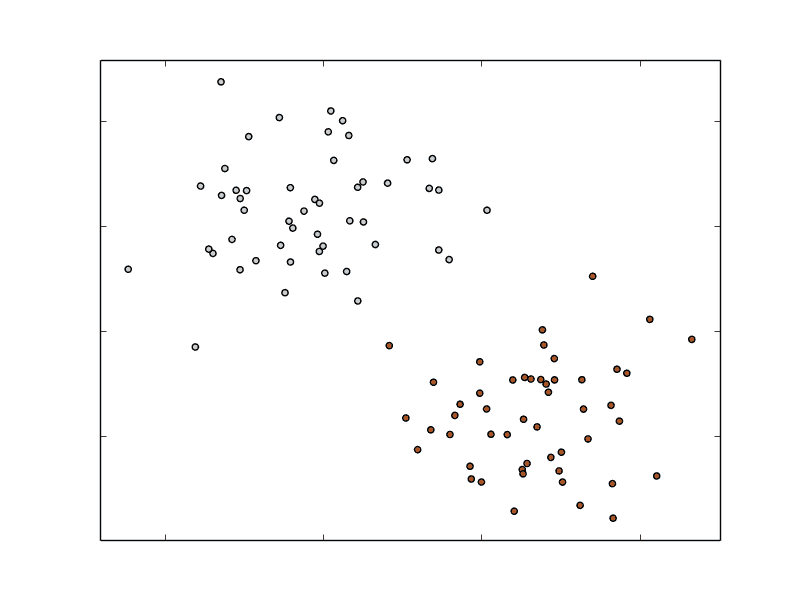
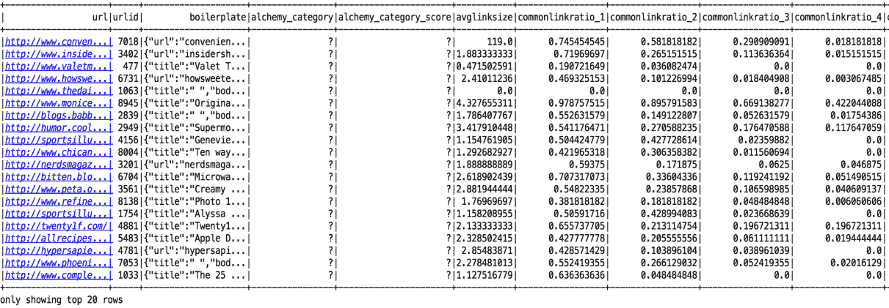
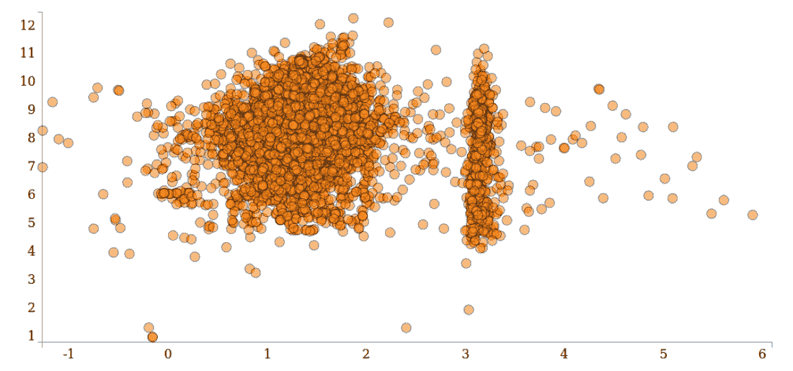
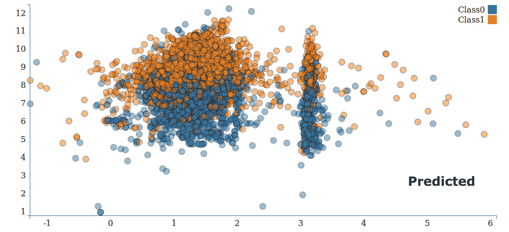
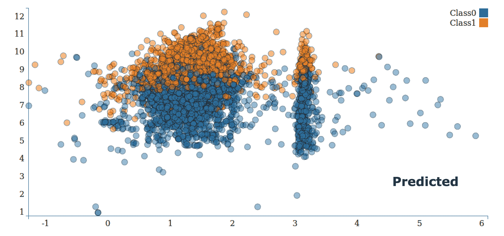
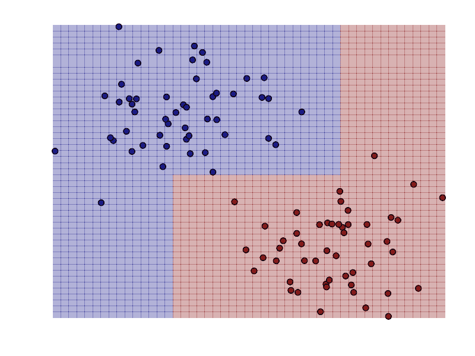
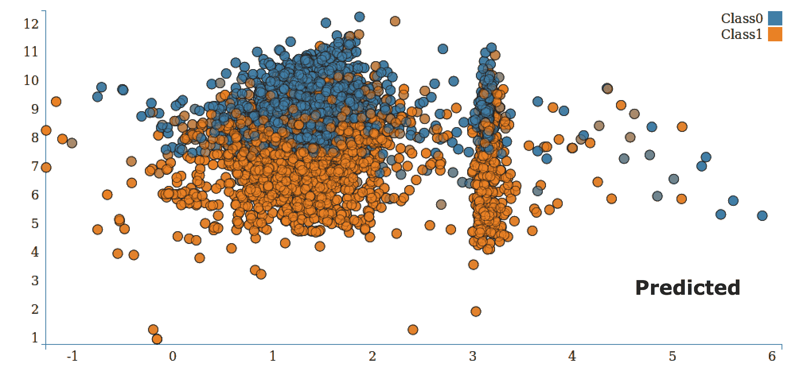
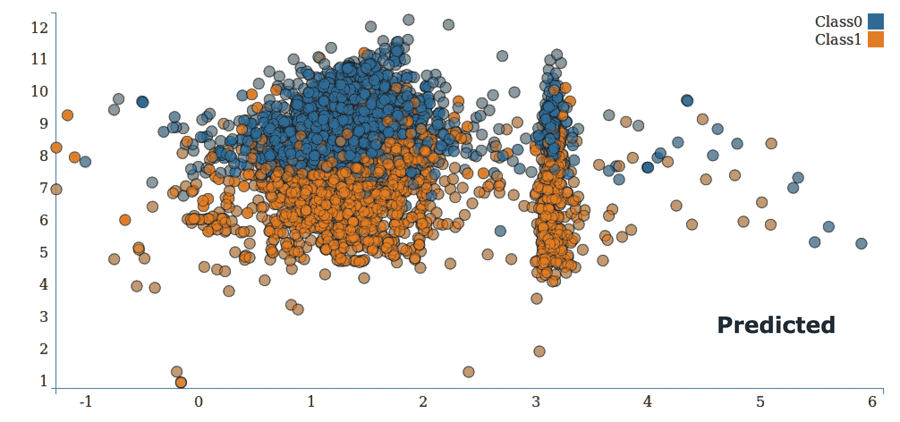
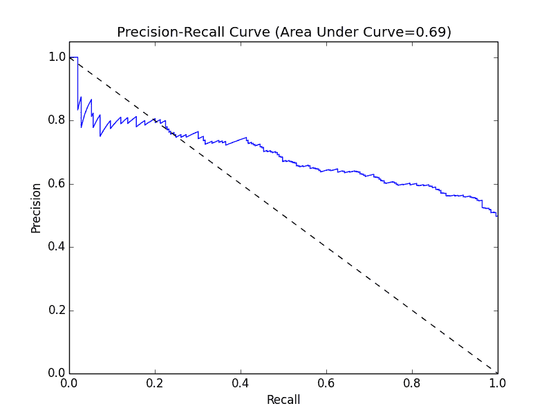

# 用 Spark 构建分类模型

在本章中，您将学习分类模型的基础知识，以及如何在各种环境中使用分类模型。 分类一般是指将事物分为不同的类别或类别。 在分类模型的情况下，我们通常希望基于一组功能来分配类。 这些特征可以表示与项目或对象、事件或上下文或这些的某种组合相关的变量。

最简单的分类形式是当我们有两个类时；这被称为**二分分类**。 其中一个类通常被标记为**正类**(分配的标签为 1)，而另一个被标记为**负的类**(分配的标签为-1，有时为 0)。 下图显示了一个包含两个类的简单示例。 在本例中，输入要素具有两个维度，并且特征值在图中的*x*和 Y 轴上表示。 我们的任务是训练一个模型，该模型可以将这个二维空间中的新数据点分类为一类(红色)或另一类(蓝色)。



A simple binary classification problem

如果我们有两个以上的类，我们将引用多类分类，并且类通常使用从 0 开始的整数来标记(例如，五个不同的类的范围从标签 0 到 4)。 下图显示了一个示例。 同样，为便于说明，假设输入要素是二维的：


A simple multiclass classification problem

分类是监督学习的一种形式，在这种情况下，我们用包括已知目标或感兴趣的结果的训练示例来训练模型(即，用这些示例结果来监督模型)。 分类模型可以在许多情况下使用，但下面列出了几个常见的示例：

*   预测互联网用户点击在线广告的概率；在这里，类本质上是二进制的(即点击或不点击)
*   检测欺诈；同样，在本例中，类通常是二进制的(欺诈或非欺诈)
*   预测贷款违约(二进制)
*   对图像、视频或声音进行分类(最常见的是多类，可能有很多不同的类)
*   为新闻文章、网页或其他内容分配类别或标签(多类)
*   发现电子邮件和 Web 垃圾邮件、网络入侵和其他恶意行为(二进制或多类)
*   检测故障情况，例如在计算机系统或网络中
*   根据客户或用户可能购买产品或使用服务的概率对他们进行排名
*   预测可能停止使用产品、服务或提供商的客户或用户(称为流失)

这些只是一些可能的用例。 事实上，可以肯定地说，分类是现代企业(特别是在线企业)中使用最广泛的机器学习和统计技术之一。

在本章中，我们将执行以下操作：

*   讨论 ML 库中可用的分类模型类型
*   使用 Spark 从原始输入数据中提取合适的要素
*   使用 ML 库训练多个分类模型
*   使用我们的分类模型进行预测
*   应用许多标准评估技术来评估我们模型的预测性能
*   说明如何使用[第 4 章](04.html)，*使用 Spark*获取、处理和准备数据中的一些特征提取方法来提高模型性能
*   了解参数调整对模型性能的影响，并了解如何使用交叉验证来选择最优的模型参数

# 分类模型的类型

我们将探索 Spark 中可用的三种常见分类模型：线性模型、决策树和朴素贝叶斯模型。 线性模型虽然不那么复杂，但相对更容易扩展到非常大的数据集。 决策树是一种强大的非线性技术，它可能更难扩展(幸运的是，ML 库为我们解决了这一问题！)。 和更多的计算密集型训练，但在许多情况下提供领先的性能。 朴素贝叶斯模型更简单，但易于高效训练和并行化(实际上，它们只需要对数据集进行一次遍历)。 在使用适当功能工程的许多情况下，它们还可以提供合理的性能。 朴素贝叶斯模型还提供了一个很好的基线模型，我们可以用它来衡量其他模型的性能。

目前，Spark 的 ML 库支持线性模型、决策树和朴素贝叶斯模型的二进制分类，以及决策树和朴素贝叶斯模型的多类分类。 在本书中，为简单起见，我们将重点介绍二进制情况。

# 线性模型

线性模型(或广义线性模型)的核心思想是，我们将感兴趣的预测结果(通常称为**目标**或**因变量**)建模为应用于输入变量(也称为特征或自变量)的简单线性预测器的函数。

*y = f(W<sup>T</sup>x)*

这里，*y*是目标变量，*w*是参数向量(称为**权重向量**)，并且*x*是输入特征的向量。

*wTx*是权重向量*w*和特征向量*x*的线性预测器(或向量点积)。 对于这个线性预测器，我们应用了函数*f*(称为**链接函数**)。

事实上，只需改变连接函数，线性模型就可以用于分类和回归。 标准线性回归(将在下一章中介绍)使用身份链接(即，*y=W<sup>T</sup>x*)，而二进制分类使用此处讨论的替代链接函数。

让我们来看看网络广告的例子。 在这种情况下，如果没有观察到网页上显示的给定广告的点击(称为**印象**)，则目标变量将为 0(在数学处理中通常被分配-1 的类别标签)。 如果发生单击，则目标变量将为 1。 每个印象的特征向量将包括与印象事件相关的变量(例如与用户、网页、广告和广告商相关的特征，以及与事件上下文相关的各种其他因素，例如所使用的设备类型、一天中的时间和地理位置)。

因此，我们希望找到一个模型，该模型将给定的输入特征向量(广告印象)映射到预测结果(点击与否)。 为了预测一个新的数据点，我们将获得新的特征向量(它是看不见的，因此我们不知道目标变量是什么)，并用我们的权重向量计算点积。 然后，我们将应用相关的链接函数，结果是我们的预测结果(在对预测应用阈值之后，在某些模型的情况下)。

给定一组特征向量和目标变量形式的输入数据，我们希望找到最适合这些数据的权重向量，在某种意义上，我们将模型预测的结果与实际观察结果之间的误差最小化。 这一过程称为模型拟合、训练或优化。

更正式地说，我们寻求在所有训练样本中寻找最小化由某些损失函数计算的损失(或误差)的总和的权重向量。 损失函数将给定训练样本的权重向量、特征向量和实际结果作为输入，并输出损失。 事实上，损失函数本身是由链接函数有效地指定的；因此，对于给定的分类或回归类型(即给定的链接函数)，存在对应的损失函数。

For further details on linear models and loss functions, see the linear methods section related to binary classification in the *Spark Programming Guide* at [http://spark.apache.org/docs/latest/mllib-linear-methods.html#binary-classification](http://spark.apache.org/docs/latest/mllib-linear-methods.html#binary-classification) and [http://spark.apache.org/docs/latest/ml-classification-regression.html#linear-methods](http://spark.apache.org/docs/latest/ml-classification-regression.html#linear-methods).
Also, see the Wikipedia entry for generalized linear models at [http://en.wikipedia.org/wiki/Generalized_linear_model](http://en.wikipedia.org/wiki/Generalized_linear_model).

虽然线性模型和损失函数的详细处理超出了本书的范围，但 Spark ML 提供了两个适合二进制分类的损失函数(您可以从 Spark 文档中了解更多信息)。 第一个是逻辑损失，相当于称为**Logistic 回归**的模型；第二个是铰链损失，相当于线性**支持向量机**(**SVM**)。 请注意，支持向量机并不严格地落入广义线性模型的统计框架中，但可以以与其本质上指定损耗和链接函数相同的方式使用。

在下图中，我们显示了相对于实际 0-1 损耗的物流损耗和铰链损耗。 0-1 损失是二进制分类的真实损失--如果模型预测正确，则为零；如果模型预测错误，则为 1。 它不被实际使用的原因是它不是一个可微的损失函数，因此不可能容易地计算梯度，因此很难进行优化。

其他损失函数是 0-1 损失的近似值，这使得优化成为可能：


The logistic, hinge, and zero-one loss functions The preceding loss diagram is adapted from the scikit-learn example at [http://scikit-learn.org/stable/auto_examples/linear_model/plot_sgd_loss_functions.html](http://scikit-learn.org/stable/auto_examples/linear_model/plot_sgd_loss_functions.html).

# Logistic 回归

Logistic 回归是一种概率模型，即它的预测范围在 0 到 1 之间，对于二分类，等于模型对数据点属于正类的概率的估计。 Logistic 回归是应用最广泛的线性分类模型之一。

如前所述，Logistic 回归中使用的链接函数是这个 logit 链接：

*1 / (1 + exp(- W<sup>T</sup>x))   a*

Logistic 回归的相关损失函数是逻辑损失：

*log(1 + exp(-y W<sup>T</sup>x)) *

这里，*y*是实际的目标变量(正类为 1，负类为-1)。

# 多项 Logistic 回归

多项 Logistic 回归将其推广到多类问题；它允许两类以上的结果变量。 与二元 Logistic 回归一样，多项 Logistic 回归也使用最大似然估计来估计概率。

多项 Logistic 回归主要用于因变量为名义变量的情况。 多项 Logistic 回归是一个分类问题，在该问题中，可以利用观测特征和参数的线性组合来计算因变量的每个特定结果的概率。

在本章中，我们将使用与推荐模型不同的数据集，因为在分类问题方面，MovieLens 数据没有太多可供我们处理的数据。 我们将使用 Kaggle 上的一场比赛的数据集。 该数据集由 StumbleUpon 提供，问题涉及对给定网页在其网页内容推荐页面上是短暂的(即，短暂的，很快就会停止流行)还是常青树(即，持久流行)进行分类。

The dataset used here can be downloaded from [http://www.kaggle.com/c/stumbleupon/data](http://www.kaggle.com/c/stumbleupon/data).
Download the training data (`train.tsv`)-you will need to accept the terms and conditions before downloading the dataset.
You can find more information about the competition at [http://www.kaggle.com/c/stumbleupon](http://www.kaggle.com/c/stumbleupon).

[https://github.com/ml-resources/spark-ml/tree/branch-ed2/Chapter_06/2.0.0/src/scala/org/sparksamples/classification/stumbleupon](https://github.com/ml-resources/spark-ml/tree/branch-ed2/Chapter_06/2.0.0/src/scala/org/sparksamples/classification/stumbleupon)提供了入门代码清单。

下面的屏幕截图显示了使用 Spark SQLContext 存储为临时表的 StumbleUpon 数据集：



# 可视化 StumbleUpon 数据集

我们运行自定义逻辑将要素数量减少到两个，这样我们就可以在二维平面上可视化数据集，同时保持数据集中的线条不变。

```scala
{ 
 val sc = new SparkContext("local[1]", "Classification") 

  // get StumbleUpon dataset 'https://www.kaggle.com/c/stumbleupon' 
  val records = sc.textFile( 
   SparkConstants.PATH + "data/train_noheader.tsv").map( 
   line => line.split("\t")) 

  val data_persistent = records.map { r => 
    val trimmed = r.map(_.replaceAll("\"", "")) 
    val label = trimmed(r.size - 1).toInt 
    val features = trimmed.slice(4, r.size - 1).map( 
     d => if (d == "?") 0.0 else d.toDouble) 
    val len = features.size.toInt 
    val len_2 = math.floor(len/2).toInt 
    val x = features.slice(0,len_2) 

    val y = features.slice(len_2 -1 ,len ) 
    var i=0 
    var sum_x = 0.0 
    var sum_y = 0.0 
    while (i < x.length) { 
    sum_x += x(i) 
    i += 1 
 } 

 i = 0 
 while (i < y.length) { 
   sum_y += y(i) 
   i += 1 
 } 

 if (sum_y != 0.0) { 
    if(sum_x != 0.0) { 
       math.log(sum_x) + "," + math.log(sum_y) 
    }else { 
       sum_x + "," + math.log(sum_y) 
    }   
 }else { 
    if(sum_x != 0.0) { 
         math.log(sum_x) + "," + 0.0 
    }else { 
        sum_x + "," + 0.0 
    } 
  } 

} 
val dataone = data_persistent.first() 
  data_persistent.saveAsTextFile(SparkConstants.PATH + 
   "/results/raw-input-log") 
  sc.stop() 

} 

```

一旦我们有了二维格式的数据，为了绘图方便，对数刻度被应用于*x*和*y*。 在我们的示例中，我们使用 D3.js 进行绘图，如下所示。 此数据将分为两类，我们将使用相同的基图来显示分类：



# 从 Kaggle/StumbleUpon 常绿分类数据集中提取特征

在开始之前，我们将删除文件第一行的列名标题，以便我们更容易处理 Spark 中的数据。 切换到下载数据的目录(这里称为`PATH`)，运行以下命令删除第一行，并将结果通过管道传输到名为`train_noheader.tsv`的新文件：

```scala
  > sed 1d train.tsv > train_noheader.tsv 

```

现在，我们已经准备好启动 Spark shell(请记住从 Spark 安装目录运行此命令)：

```scala
  >./bin/spark-shell --driver-memory 4g  

```

您可以直接在 Spark shell 中键入本章剩余部分的代码。

我们将以类似于我们在前面章节中所做的方式，将原始训练数据加载到 RDD 中，并按如下方式进行检查：

```scala
val rawData = sc.textFile("/PATH/train_noheader.tsv") 
val records = rawData.map(line => line.split("\t")) 
records.first() 

```

您将在屏幕上看到以下内容：

```scala
Array[String] = Array("http://www.bloomberg.com/news/2010-12-23/ibm-predicts-holographic-calls-air-breathing-batteries-by-2015.html", "4042", ...  

```

如前所述，您可以通过阅读数据集页面上的概述来检查可用的字段。 前两列包含页面的 URL 和 ID。 下一列包含一些原始文本内容。 下一列包含分配给页面的类别。 接下来的 22 列包含各种数字或分类特征。 最后一列包含目标--1 表示常绿，而 0 表示非常绿。

我们将从直接使用可用的数字特性的简单方法开始。 由于每个分类变量都是二进制的，我们已经对这些变量进行了*1-of-k*编码，因此我们不需要进行任何进一步的特征提取。

由于数据的格式化方式，我们必须在初始处理期间通过删除额外的引号字符(`"`)来进行一些数据清理。 数据集中也有缺失值；它们由`"?"`字符表示。 在本例中，我们将简单地将零值赋给这些缺少的值。

```scala
import org.apache.spark.mllib.regression.LabeledPoint 
import org.apache.spark.mllib.linalg.Vectors 
val data = records.map { r => 
  val trimmed = r.map(_.replaceAll("\"", "")) 
  val label = trimmed(r.size - 1).toInt 
  val features = trimmed.slice(4, r.size - 1).map(d => if (d ==   "?") 0.0 else d.toDouble) 
  LabeledPoint(label, Vectors.dense(features)) 
} 

```

在前面的代码中，我们从最后一列提取了`label`变量，并在清理和处理遗漏的值之后，从第 5 列到第 25 列提取了一个由`features`组成的数组。 我们将`label`变量转换为整数值，并将`features`变量转换为`Array[Double]`。 最后，我们将`label`和`features`包装在一个`LabeledPoint`实例中，将特性转换为 MLlib 向量。

我们还将缓存数据并计算数据点的数量，如下所示：

```scala
data.cache 
val numData = data.count 

```

您将看到`numData`的值是`7395`。

稍后我们将更详细地研究数据集，但现在我们将告诉您，数字数据中有一些负的特征值。 正如我们在前面看到的，朴素贝叶斯模型需要非负特性，如果它遇到负值，将抛出错误。 因此，目前，我们将通过将所有负特征值设置为零来为朴素贝叶斯模型创建输入特征向量的一个版本。

```scala
val nbData = records.map { r => 
  val trimmed = r.map(_.replaceAll("\"", "")) 
  val label = trimmed(r.size - 1).toInt 
  val features = trimmed.slice(4, r.size - 1).map(d => if (d ==  
  "?") 0.0 else d.toDouble).map(d => if (d < 0) 0.0 else d) 
  LabeledPoint(label, Vectors.dense(features)) 
}  

```

# StumbleUponExecutor

StumbleUponExecutor([https://github.com/ml-resources/spark-ml/blob/branch-ed2/Chapter_06/2.0.0/scala-spark-app/src/main/scala/org/sparksamples/classification/stumbleupon/StumbleUponExecutor.scala](https://github.com/ml-resources/spark-ml/blob/branch-ed2/Chapter_06/2.0.0/scala-spark-app/src/main/scala/org/sparksamples/classification/stumbleupon/StumbleUponExecutor.scala))对象可用于选择和运行各自的分类模型；例如，要运行`LogisiticRegression`和执行逻辑回归管道，请将程序参数设置为 LR。 有关其他命令，请参阅以下代码片段：

```scala
case "LR" => LogisticRegressionPipeline.logisticRegressionPipeline(vectorAssembler, dataFrame) 

case "DT" => DecisionTreePipeline.decisionTreePipeline(vectorAssembler, dataFrame) 

case "RF" => RandomForestPipeline.randomForestPipeline(vectorAssembler, dataFrame) 

case "GBT" => GradientBoostedTreePipeline.gradientBoostedTreePipeline(vectorAssembler, dataFrame) 

case "NB" => NaiveBayesPipeline.naiveBayesPipeline(vectorAssembler, dataFrame) 

case "SVM" => SVMPipeline.svmPipeline(sparkContext) 

```

让我们通过将 StumbleUpon 数据集分为 80%的训练和 20%的测试来训练它；使用来自 Spark 的`TrainValidationSplit`和`LogisticRegression`来构建模型，并获得关于测试数据的评估指标：

```scala
// create logisitic regression object 
val lr = new LogisticRegression() 

```

要创建管道对象，我们将使用`ParamGridBuilder`。 `ParamGridBuilder`用于构建参数网格，该网格是一个参数列表，可供估计器从中选择或搜索以选择最佳模型。 您可以在以下链接中找到有关它的更多详细信息：
[https://spark.apache.org/docs/2.0.0/api/java/org/apache/spark/ml/tuning/ParamGridBuilder.html](https://spark.apache.org/docs/2.0.0/api/java/org/apache/spark/ml/tuning/ParamGridBuilder.html)

```scala
-------------------------------------------------------------------------------------------
org.apache.spark.ml.tuning 
Class ParamGridBuilder 
Builder for a param grid used in grid search-based model selection. 
-------------------------------------------------------------------------------------------

// set params using ParamGrid builder 
val paramGrid = new ParamGridBuilder() 
  .addGrid(lr.regParam, Array(0.1, 0.01)) 
  .addGrid(lr.fitIntercept) 
  .addGrid(lr.elasticNetParam, Array(0.0, 0.25, 0.5, 0.75, 1.0)) 
  .build() 

// set pipeline to run the vector assembler and logistic regression // estimator 
val pipeline = new Pipeline().setStages(Array(vectorAssembler, 
 lr)) 

```

我们将使用`TrainValidationSplit`进行超参数调整。 它对每个参数组合求值一次，而不是在`CrossValidator`的情况下求值*k*次。 它创建单个训练、测试数据集对，并基于`trainRatio`参数在训练和测试之间进行拆分。

`Trainvalidationsplit`采用`Estimator`，即`estimatorParamMaps`参数中提供的一组`ParamMaps`和`Evaluator`。 有关详细信息，请参阅以下链接：
[http://spark.apache.org/docs/latest/api/scala/index.html#org.apache.spark.ml.tuning.TrainValidationSplit](http://spark.apache.org/docs/latest/api/scala/index.html#org.apache.spark.ml.tuning.TrainValidationSplit)

```scala
-------------------------------------------------------------------------------------------
org.apache.spark.ml.tuning 
Class TraiValidationSplit 
Validation for hyper-parameter tuning. Randomly splits the input dataset into train and validation sets. 
-------------------------------------------------------------------------------------------

// use train validation split and regression evaluator for //evaluation 
val trainValidationSplit = new TrainValidationSplit() 
  .setEstimator(pipeline) 
  .setEvaluator(new RegressionEvaluator) 
  .setEstimatorParamMaps(paramGrid) 
  .setTrainRatio(0.8) 

val Array(training, test) = dataFrame.randomSplit(Array(0.8, 0.2), seed = 12345) 

// run the estimator 
val model = trainValidationSplit.fit(training) 

val holdout = model.transform(test).select("prediction","label") 

// have to do a type conversion for RegressionMetrics 
val rm = new RegressionMetrics(holdout.rdd.map(x => (x(0).asInstanceOf[Double], x(1).asInstanceOf[Double]))) 

logger.info("Test Metrics") 
logger.info("Test Explained Variance:") 
logger.info(rm.explainedVariance) 
logger.info("Test R^2 Coef:") 
logger.info(rm.r2) 
logger.info("Test MSE:") 
logger.info(rm.meanSquaredError) 
logger.info("Test RMSE:") 
logger.info(rm.rootMeanSquaredError) 

val totalPoints = test.count() 
val lrTotalCorrect = holdout.rdd.map(
  x => if (x(0).asInstanceOf[Double] == x(1).asInstanceOf[Double]) 
  1 else 0).sum() 
val accuracy = lrTotalCorrect/totalPoints 
println("Accuracy of LogisticRegression is: ", accuracy) 

```

您将看到显示以下输出：

```scala
Accuracy of LogisticRegression is: ,0.6374918354016982
Mean Squared Error:,0.3625081645983018
Root Mean Squared Error:,0.6020865092312747  

```

代码清单可在此链接中找到：[https://github.com/ml-resources/spark-ml/blob/branch-ed2/Chapter_06/2.0.0/scala-spark-app/src/main/scala/org/sparksamples/classification/stumbleupon/LogisticRegressionPipeline.scala](https://github.com/ml-resources/spark-ml/blob/branch-ed2/Chapter_06/2.0.0/scala-spark-app/src/main/scala/org/sparksamples/classification/stumbleupon/LogisticRegressionPipeline.scala)

预测数据和实际数据在二维散点图中的可视化如以下两个屏幕截图所示：




# 线性支持向量机

支持向量机是一种强大而流行的回归和分类技术。 与 Logistic 回归不同的是，它不是一个概率模型，而是根据模型评估是肯定的还是否定的来预测班级。

支持向量机链接函数是身份链接，因此预测结果如下：

*y = w<sup>T</sup>x*

因此，如果*wTx*的评估大于或等于阈值 0，则支持向量机将数据点分配给类 1；否则，支持向量机将其分配给类 0

(该阈值是支持向量机的模型参数，可以调整)。

支持向量机的损失函数称为铰链损失，定义如下：

*max(0, 1 - yw<sup>T</sup>x)*

支持向量机是一种最大间隔分类器--它试图找到一个权重向量，以便将类别尽可能地分开。 它已被证明在许多分类任务中表现良好，并且线性变量可以扩展到非常大的数据集。

SVMs have a large amount of theory behind them, which is beyond the scope of this book, but you can visit [http://en.wikipedia.org/wiki/Support_vector_machine](http://en.wikipedia.org/wiki/Support_vector_machine) and [http://www.support-vector-machines.org/](http://www.support-vector-machines.org/) for more details.

在下图中，我们根据前面解释的简单二进制分类示例绘制了 Logistic 回归(蓝线)和线性支持向量机(红线)的不同决策函数。

您可以看到，支持向量机有效地聚焦于距离决策函数最近的点(边界线以红色虚线显示)：


Decision functions for logistic regression and linear SVM for binary classification

让我们对 StumbleUpon 数据集进行训练，将其分为 80%的训练和 20%的测试，使用 Spark 的 SVM 构建模型，并获得测试数据的评估指标：

```scala
// read stumble upon dataset as rdd 
val records = sc.textFile("/home/ubuntu/work/ml-resources/spark-ml/train_noheader.tsv").map(line => line.split("\t")) 

// get features and label from the rdd 
val data = records.map { r => 
    val trimmed = r.map(_.replaceAll("\"", "")) 
    val label = trimmed(r.size - 1).toInt 
    val features = trimmed.slice(4, r.size - 1).map(d => if (d == "?") 0.0 else d.toDouble) 
    LabeledPoint(label, Vectors.dense(features)) 
  } 

  // params for SVM 
  val numIterations = 10 

  // Run training algorithm to build the model 
  val svmModel = SVMWithSGD.train(data, numIterations) 

  // Clear the default threshold. 
  svmModel.clearThreshold() 

  val svmTotalCorrect = data.map { point => 
    if(svmModel.predict(point.features) == point.label) 1 else 0 
  }.sum() 

  // calculate accuracy 
  val svmAccuracy = svmTotalCorrect / data.count() 
  println(svmAccuracy) 
} 

```

您将看到显示以下输出：

```scala
 Area under ROC = 1.0  

```

代码清单位于[https://github.com/ml-resources/spark-ml/blob/branch-ed2/Chapter_06/2.0.0/scala-spark-app/src/main/scala/org/sparksamples/classification/stumbleupon/SVMPipeline.scala](https://github.com/ml-resources/spark-ml/blob/branch-ed2/Chapter_06/2.0.0/scala-spark-app/src/main/scala/org/sparksamples/classification/stumbleupon/SVMPipeline.scala)。

# 朴素贝叶斯模型

朴素贝叶斯是一种概率模型，它通过计算属于给定类别的数据点的概率来进行预测。 朴素贝叶斯模型假设每个特征对分配给类的概率有独立的贡献(它假设特征之间的条件独立)。

由于该假设，每个类别的概率成为给定类别的特征出现的概率以及该类别的概率的乘积的函数。 这使得训练模型变得容易且相对简单。 类别先验概率和特征条件概率都是从数据集中存在的频率估计的。 在给定特征和类别概率的情况下，通过选择最可能的类别来执行分类。

还对特征分布(其参数由数据估计)进行了假设。 Spark ML 实现了多项朴素贝叶斯，它假设特征分布是代表特征的非负频率计数的多项分布。

它适用于二进制特征(例如，k 中 1 编码的分类特征)，通常用于文本和文档分类(如我们在[第 4 章](04.html)，*使用 Spark*获取、处理和准备数据中看到的，词袋向量是典型的特征表示)。

Take a look at the *ML - Naive Bayes* section in the Spark documentation at [http://spark.apache.org/docs/latest/ml-classification-regression.html#naive-bayes](http://spark.apache.org/docs/latest/ml-classification-regression.html#naive-bayes) for more information. The Wikipedia page at [http://en.wikipedia.org/wiki/Naive_Bayes_classifier](http://en.wikipedia.org/wiki/Naive_Bayes_classifier) has a more detailed explanation of the mathematical formulation.

在下图中，我们在简单的二进制分类示例中展示了朴素贝叶斯的决策函数：


Decision function of naive Bayes for binary classification

让我们训练 StumbleUpon 数据集，将其分为 80%的训练和 20%的测试，使用 Spark 的朴素贝叶斯来构建模型，并获得关于测试数据的评估指标，如下所示：

```scala
// split data randomly into training and testing dataset 
val Array(training, test) = dataFrame.randomSplit(Array(0.8, 0.2), seed = 12345) 

// Set up Pipeline 
val stages = new mutable.ArrayBuffer[PipelineStage]() 

val labelIndexer = new StringIndexer() 
  .setInputCol("label") 
  .setOutputCol("indexedLabel") 
stages += labelIndexer 

// create naive bayes model 
val nb = new NaiveBayes() 

stages += vectorAssembler 
stages += nb 
val pipeline = new Pipeline().setStages(stages.toArray) 

// Fit the Pipeline 
val startTime = System.nanoTime() 
val model = pipeline.fit(training) 
val elapsedTime = (System.nanoTime() - startTime) / 1e9 
println(s"Training time: $elapsedTime seconds") 

val holdout = model.transform(test).select("prediction","label") 

// Select (prediction, true label) and compute test error 
val evaluator = new MulticlassClassificationEvaluator() 
  .setLabelCol("label") 
  .setPredictionCol("prediction") 
  .setMetricName("accuracy") 
val mAccuracy = evaluator.evaluate(holdout) 
println("Test set accuracy = " + mAccuracy) 

```

您将看到显示以下输出：

```scala
Training time: 2.114725642 seconds
Accuracy: 0.5660377358490566   

```

完整的代码清单可在[https://github.com/ml-resources/spark-ml/blob/branch-ed2/Chapter_06/2.0.0/scala-spark-app/src/main/scala/org/sparksamples/classification/stumbleupon/NaiveBayesPipeline.scala](https://github.com/ml-resources/spark-ml/blob/branch-ed2/Chapter_06/2.0.0/scala-spark-app/src/main/scala/org/sparksamples/classification/stumbleupon/NaiveBayesPipeline.scala)获得。

预测数据和实际数据在二维散点图中的可视化如下所示：




# 决策树

决策树模型是一种强大的、非概率的技术，可以捕捉更复杂的非线性模式和特征交互。 事实证明，它们在许多任务中表现良好，相对容易理解和解释，可以处理分类和数字特征，并且不需要对输入数据进行缩放或标准化。 它们非常适合包含在集成方法中(例如，决策树模型集成，称为决策森林)。

决策树模型构建了一棵树，其中树叶表示对类 0 或 1 的类分配，而分支是一组特征。 在下图中，我们展示了一个简单的决策树，其中二元结果是**呆在家里**或**去海滩！**。 这里的特色是外面的天气。


A simple decision tree

决策树算法是一种自上而下的方法，它从根节点(或特征)开始，然后在每个步骤选择一个特征，该特征给出了根据该分裂的信息增益来衡量的数据集的最佳分裂。 信息增益是通过节点杂质(这是节点处的标签相似或同质的程度)减去拆分将产生的两个子节点的杂质的加权和来计算的。 对于分类任务，有两个度量可用于选择最佳拆分。 它们是基尼杂质和熵。

See the *ML Library - Decision Tree* section in the *Spark Programming Guide* at [http://spark.apache.org/docs/latest/ml-classification-regression.html#decision-tree-classifier](http://spark.apache.org/docs/latest/ml-classification-regression.html#decision-tree-classifier) for further details on the decision tree algorithm and impurity measures for classification.

在下面的屏幕截图中，我们绘制了决策树模型的决策边界，就像我们之前对其他模型所做的那样。 我们可以看到，决策树能够适应复杂的非线性模型：



Decision function for a decision tree for binary classification

让我们训练 StumbleUpon 数据集，将其分为 80%的训练和 20%的测试，使用 Spark 中的决策树构建模型，并获得有关测试数据的评估指标，如下所示：

```scala
// split data randomly into training and testing dataset 
val Array(training, test) = dataFrame.randomSplit(Array(0.8, 0.2), seed = 12345) 

// Set up Pipeline 
val stages = new mutable.ArrayBuffer[PipelineStage]() 

val labelIndexer = new StringIndexer() 
  .setInputCol("label") 
  .setOutputCol("indexedLabel") 
stages += labelIndexer 

// create Decision Tree Model 
val dt = new DecisionTreeClassifier() 
  .setFeaturesCol(vectorAssembler.getOutputCol) 
  .setLabelCol("indexedLabel") 
  .setMaxDepth(5) 
  .setMaxBins(32) 
  .setMinInstancesPerNode(1) 
  .setMinInfoGain(0.0) 
  .setCacheNodeIds(false) 
  .setCheckpointInterval(10) 

stages += vectorAssembler 
stages += dt 
val pipeline = new Pipeline().setStages(stages.toArray) 

// Fit the Pipeline 
val startTime = System.nanoTime() 
val model = pipeline.fit(training) 
val elapsedTime = (System.nanoTime() - startTime) / 1e9 
println(s"Training time: $elapsedTime seconds") 

val holdout = model.transform(test).select("prediction","label") 

// Select (prediction, true label) and compute test error 
val evaluator = new MulticlassClassificationEvaluator() 
  .setLabelCol("label") 
  .setPredictionCol("prediction") 
  .setMetricName("accuracy") 
val mAccuracy = evaluator.evaluate(holdout) 
println("Test set accuracy = " + mAccuracy) 

```

您将看到显示以下输出：

```scala
Accuracy: 0.3786163522012579  

```

代码清单位于[https://github.com/ml-resources/spark-ml/blob/branch-ed2/Chapter_06/2.0.0/scala-spark-app/src/main/scala/org/sparksamples/classification/stumbleupon/DecisionTreePipeline.scala](https://github.com/ml-resources/spark-ml/blob/branch-ed2/Chapter_06/2.0.0/scala-spark-app/src/main/scala/org/sparksamples/classification/stumbleupon/DecisionTreePipeline.scala)。

预测数据和实际数据在二维散点图中的可视化如下图所示：




# 成群的树木

集成方法是一种机器学习算法，它创建由一组其他基本模型组成的模型。 Spark 机器学习支持两种主要的集成算法：RandomForest 和 GradientBostedTrees。

# 随机森林

随机森林称为决策树的集合，由许多决策树组合而成。 与决策树一样，随机森林可以处理分类特征，支持多类分类，并且不需要进行特征缩放。

Spark ML 支持使用连续和分类功能进行二类和多类分类和回归的随机森林。

让我们对样本库支持向量机数据进行训练，将其分为 80%的训练和 20%的测试，使用 Spark 的随机森林分类器建立模型，并获得测试数据周围的评估度量。 可以持久化和加载模型以供以后使用。

让我们训练 StumbleUpon 数据集，将其分为 80%的训练和 20%的测试，使用 Spark 的随机森林树构建模型，并获得测试数据的评估指标：

```scala
// split data randomly into training and testing dataset 
val Array(training, test) = dataFrame.randomSplit(Array(0.8, 0.2), seed = 12345) 

// Set up Pipeline 
val stages = new mutable.ArrayBuffer[PipelineStage]() 

val labelIndexer = new StringIndexer() 
  .setInputCol("label") 
  .setOutputCol("indexedLabel") 
stages += labelIndexer 

// create Random Forest Model 
val rf = new RandomForestClassifier() 
  .setFeaturesCol(vectorAssembler.getOutputCol) 
  .setLabelCol("indexedLabel") 
  .setNumTrees(20) 
  .setMaxDepth(5) 
  .setMaxBins(32) 
  .setMinInstancesPerNode(1) 
  .setMinInfoGain(0.0) 
  .setCacheNodeIds(false) 
  .setCheckpointInterval(10) 

stages += vectorAssembler 
stages += rf 
val pipeline = new Pipeline().setStages(stages.toArray) 

// Fit the Pipeline 
val startTime = System.nanoTime() 
val model = pipeline.fit(training) 
val elapsedTime = (System.nanoTime() - startTime) / 1e9 
println(s"Training time: $elapsedTime seconds") 

val holdout = model.transform(test).select("prediction","label") 

// Select (prediction, true label) and compute test error 
val evaluator = new MulticlassClassificationEvaluator() 
  .setLabelCol("label") 
  .setPredictionCol("prediction") 
  .setMetricName("accuracy") 
val mAccuracy = evaluator.evaluate(holdout) 
println("Test set accuracy = " + mAccuracy) 

```

您将看到显示以下输出：

```scala
Accuracy: 0.348  

```

完整的代码清单可在[https://github.com/ml-resources/spark-ml/blob/branch-ed2/Chapter_06/2.0.0/scala-spark-app/src/main/scala/org/sparksamples/classification/stumbleupon/RandomForestPipeline.scala](https://github.com/ml-resources/spark-ml/blob/branch-ed2/Chapter_06/2.0.0/scala-spark-app/src/main/scala/org/sparksamples/classification/stumbleupon/RandomForestPipeline.scala)获得。

预测数据和实际数据在二维散点图中的可视化如下所示：




# 梯度增强树

梯度增强树是决策树的集成。 梯度增强树迭代训练决策树以最小化损失函数。 梯度增强树处理分类特征，支持多类分类，并且不需要特征缩放。

Spark ML 使用现有的决策树实现了梯度增强树。 它既支持分类又支持回归。

让我们通过将 StumbleUpon 数据集分为 80%的训练和 20%的测试来训练它，使用 Spark 中的梯度增强树来构建模型，并获得关于测试数据的评估指标，如下所示：

```scala
// split data randomly into training and testing dataset 
val Array(training, test) = dataFrame.randomSplit(Array(0.8, 0.2), seed = 12345) 

// Set up Pipeline 
val stages = new mutable.ArrayBuffer[PipelineStage]() 

val labelIndexer = new StringIndexer() 
  .setInputCol("label") 
  .setOutputCol("indexedLabel") 
stages += labelIndexer 

// create GBT Model 
val gbt = new GBTClassifier() 
  .setFeaturesCol(vectorAssembler.getOutputCol) 
  .setLabelCol("indexedLabel") 
  .setMaxIter(10) 

stages += vectorAssembler 
stages += gbt 
val pipeline = new Pipeline().setStages(stages.toArray) 

// Fit the Pipeline 
val startTime = System.nanoTime() 
val model = pipeline.fit(training) 
val elapsedTime = (System.nanoTime() - startTime) / 1e9 
println(s"Training time: $elapsedTime seconds") 

val holdout = model.transform(test).select("prediction","label") 

// have to do a type conversion for RegressionMetrics 
val rm = new RegressionMetrics(holdout.rdd.map(x => (x(0).asInstanceOf[Double], x(1).asInstanceOf[Double]))) 

logger.info("Test Metrics") 
logger.info("Test Explained Variance:") 
logger.info(rm.explainedVariance) 
logger.info("Test R^2 Coef:") 
logger.info(rm.r2) 
logger.info("Test MSE:") 
logger.info(rm.meanSquaredError) 
logger.info("Test RMSE:") 
logger.info(rm.rootMeanSquaredError) 

val predictions = model.transform(test).select("prediction").rdd.map(_.getDouble(0)) 
val labels = model.transform(test).select("label").rdd.map(_.getDouble(0)) 
val accuracy = new MulticlassMetrics(predictions.zip(labels)).precision 
println(s"  Accuracy : $accuracy") 

```

您将看到显示以下输出：

```scala
Accuracy: 0.3647  

```

代码清单可以在[https://github.com/ml-resources/spark-ml/blob/branch-ed2/Chapter_06/2.0.0/scala-spark-app/src/main/scala/org/sparksamples/classification/stumbleupon/GradientBoostedTreePipeline.scala](https://github.com/ml-resources/spark-ml/blob/branch-ed2/Chapter_06/2.0.0/scala-spark-app/src/main/scala/org/sparksamples/classification/stumbleupon/GradientBoostedTreePipeline.scala)找到。

在二维散点图中的预测可视化如下图所示：


# 多层感知器分类器

神经网络是一个复杂的自适应系统，它根据流经它的信息使用权重来改变其内部结构。 优化多层神经网络的权值称为**反向传播**。 反向传播有点超出本书的范围，涉及激活函数和基本微积分。

多层感知器分类器基于前馈人工神经网络。 它由多个层组成。 每个神经层完全连接到网络中的下一个神经层，输入层中的节点表示输入数据。 所有其他节点通过执行输入与节点的权重和偏置的线性组合，以及通过应用激活或链接功能来将输入映射到输出。

让我们将样本`libsvm`数据分成 80%的训练和 20%的测试进行训练，使用 Spark 的多层感知器分类器进行建模，得到测试数据周围的评估指标：

```scala
package org.sparksamples.classification.stumbleupon 

import org.apache.spark.ml.classification.MultilayerPerceptronClassifier 
import org.apache.spark.ml.evaluation.MulticlassClassificationEvaluator 
import org.apache.spark.sql.SparkSession 

// set VM Option as -Dspark.master=local[1] 
object MultilayerPerceptronClassifierExample { 

  def main(args: Array[String]): Unit = { 
    val spark = SparkSession 
      .builder 
      .appName("MultilayerPerceptronClassifierExample") 
      .getOrCreate() 

    // Load the data stored in LIBSVM format as a DataFrame. 
    val data = spark.read.format("libsvm") 
      .load("/Users/manpreet.singh/Sandbox/codehub/github/machinelearning/spark-ml/Chapter_06/2.0.0/scala-spark-app/src/main/scala/org/sparksamples/classification/dataset/spark-data/sample_multiclass_classification_data.txt") 

    // Split the data into train and test 
    val splits = data.randomSplit(Array(0.8, 0.2), seed = 1234L) 
    val train = splits(0) 
    val test = splits(1) 

    // specify layers for the neural network: 
    // input layer of size 4 (features),  
    //two intermediate of size 5 and 4 
    // and output of size 3 (classes) 
    val layers = Array[Int](4, 5, 4, 3) 

    // create the trainer and set its parameters 
    val trainer = new MultilayerPerceptronClassifier() 
      .setLayers(layers) 
      .setBlockSize(128) 
      .setSeed(1234L) 
      .setMaxIter(100) 

    // train the model 
    val model = trainer.fit(train) 

    // compute accuracy on the test set 
    val result = model.transform(test) 
    val predictionAndLabels = result.select("prediction", "label") 
    val evaluator = new MulticlassClassificationEvaluator() 
      .setMetricName("accuracy") 

    println("Test set accuracy = " + 
     evaluator.evaluate(predictionAndLabels)) 

    spark.stop() 
  } 
} 

```

您将看到显示以下输出：

```scala
Precision = 1.0  

```

代码清单位于[https://github.com/ml-resources/spark-ml/blob/branch-ed2/Chapter_06/2.0.0/scala-spark-app/src/main/scala/org/sparksamples/classification/stumbleupon/MultilayerPerceptronClassifierExample.scala](https://github.com/ml-resources/spark-ml/blob/branch-ed2/Chapter_06/2.0.0/scala-spark-app/src/main/scala/org/sparksamples/classification/stumbleupon/MultilayerPerceptronClassifierExample.scala)。

Before we proceed further, please note that the following examples for Feature Extraction and Classification use the MLLib package from Spark v1.6\. Kindly follow the code listing mentioned earlier to use Spark v2.0 Dataframe-based APIs. As of Spark 2.0, RDD-based APIs have entered maintenance mode.

# 从数据中提取正确的要素

您可能还记得，在[第 4 章](04.html)，*使用 Spark*获取、处理和准备数据时，大多数机器学习模型都以特征向量的形式对数字数据进行操作。 此外，对于分类和回归等监督学习方法，我们需要提供目标变量(或多类情况下的变量)和特征向量。

MLlib 中的分类模型对`LabeledPoint`的实例进行操作，`LabeledPoint`是目标变量(称为`label`)和`feature`向量的包装器。

```scala
case class LabeledPoint(label: Double, features: Vector) 

```

虽然在大多数使用分类的示例中，您会遇到已采用矢量格式的现有数据集，但在实践中，您通常会从需要转换为要素的原始数据开始。 正如我们已经看到的，这可能涉及预处理和转换，例如对数值特征进行装箱、缩放和归一化特征，以及对分类特征使用 1-of-k 编码。

# 训练分类模型

既然我们已经从数据集中提取了一些基本特性并创建了输入 RDD，我们就可以训练一些模型了。 为了比较不同模型的性能和用途，我们将使用 Logistic 回归、SVM、朴素贝叶斯和决策树来训练模型。 您会注意到，训练每个模型看起来几乎相同，尽管每个模型都有自己的特定模型参数，这些参数可以设置。 在大多数情况下，Spark ML 会设置合理的默认值，但在实践中，应该使用求值技术选择最佳参数设置，我们将在本章后面讨论这一点。

# 在 Kaggle/StumbleUpon 常绿分类数据集上训练分类模型

现在，我们可以将 Spark ML 中的模型应用于我们的输入数据。 首先，我们需要导入所需的类，并为每个模型设置一些最小的输入参数。 对于 Logistic 回归和 SVM，这是迭代次数，而对于决策树模型，这是最大树深度。

```scala
import  
org.apache.spark.mllib.classification.LogisticRegressionWithSGD 
import org.apache.spark.mllib.classification.SVMWithSGD 
import org.apache.spark.mllib.classification.NaiveBayes 
import org.apache.spark.mllib.tree.DecisionTree 
import org.apache.spark.mllib.tree.configuration.Algo 
import org.apache.spark.mllib.tree.impurity.Entropy  
val numIterations = 10 
val maxTreeDepth = 5 

```

现在，依次训练每个模型。 首先，我们将对 Logistic 回归进行如下训练：

```scala
val lrModel = LogisticRegressionWithSGD.train(data, numIterations) 

```

您将看到以下输出：

```scala
...
14/12/06 13:41:47 INFO DAGScheduler: Job 81 finished: reduce at RDDFunctions.scala:112, took 0.011968 s
14/12/06 13:41:47 INFO GradientDescent: GradientDescent.runMiniBatchSGD finished. Last 10 stochastic losses 0.6931471805599474, 1196521.395699124, Infinity, 1861127.002201189, Infinity, 2639638.049627607, Infinity, Infinity, Infinity, Infinity
lrModel: org.apache.spark.mllib.classification.LogisticRegressionModel = (weights=[-0.11372778986947886,-0.511619752777837, 
...  

```

接下来，我们将训练一个 SVM 模型，如下所示：

```scala
val svmModel = SVMWithSGD.train(data, numIterations) 

```

现在您将看到以下输出：

```scala
...
14/12/06 13:43:08 INFO DAGScheduler: Job 94 finished: reduce at RDDFunctions.scala:112, took 0.007192 s
14/12/06 13:43:08 INFO GradientDescent: GradientDescent.runMiniBatchSGD finished. Last 10 stochastic losses 1.0, 2398226.619666797, 2196192.9647478117, 3057987.2024311484, 271452.9038284356, 3158131.191895948, 1041799.350498323, 1507522.941537049, 1754560.9909073508, 136866.76745605646
svmModel: org.apache.spark.mllib.classification.SVMModel = (weights=[-0.12218838697834929,-0.5275107581589767,
...  

```

然后，我们将训练朴素贝叶斯模型；请记住使用您的特殊非负特征数据集：

```scala
val nbModel = NaiveBayes.train(nbData) 

```

以下是输出：

```scala
...
14/12/06 13:44:48 INFO DAGScheduler: Job 95 finished: collect at NaiveBayes.scala:120, took 0.441273 s
nbModel: org.apache.spark.mllib.classification.NaiveBayesModel = org.apache.spark.mllib.classification.NaiveBayesModel@666ac612 
...  

```

最后，我们将训练决策树。

```scala
val dtModel = DecisionTree.train(data, Algo.Classification, Entropy, maxTreeDepth) 

```

输出如下：

```scala
...
14/12/06 13:46:03 INFO DAGScheduler: Job 104 finished: collectAsMap at DecisionTree.scala:653, took 0.031338 s
...
total: 0.343024
findSplitsBins: 0.119499
findBestSplits: 0.200352
chooseSplits: 0.199705
dtModel: org.apache.spark.mllib.tree.model.DecisionTreeModel = DecisionTreeModel classifier of depth 5 with 61 nodes 
...  

```

请注意，我们将决策树的模式或算法设置为`Classification`，并使用了`Entropy`杂质度量。

# 使用分类模型

现在，我们已经对四个模型进行了输入标签和功能的培训。 现在我们将了解如何使用这些模型对我们的数据集进行预测。 目前，我们将使用相同的训练数据来说明每个模型的预测方法。

# 为 Kaggle/StumbleUpon 常青树分类数据集生成预测

我们将以我们的 Logistic 回归模型为例(其他模型的使用方式相同)：

```scala
val dataPoint = data.first 
val prediction = lrModel.predict(dataPoint.features) 

```

以下是输出：

```scala
prediction: Double = 1.0  

```

我们看到，对于训练数据集中的第一个数据点，模型预测标签为 1(即常青树)。 让我们检查一下这个数据点的真实标签。

```scala
val trueLabel = dataPoint.label 

```

您可以看到以下输出：

```scala
trueLabel: Double = 0.0  

```

所以，在这种情况下，我们的模型搞错了！

我们还可以通过传入`RDD[Vector]`作为输入进行批量预测：

```scala
val predictions = lrModel.predict(data.map(lp => lp.features)) 
predictions.take(5) 

```

以下是输出：

```scala
Array[Double] = Array(1.0, 1.0, 1.0, 1.0, 1.0)  

```

# 评价分类模型的性能

当我们使用我们的模型进行预测时，就像我们前面所做的那样，我们如何知道预测是好的还是不好的呢？ 我们需要能够评估我们的模型执行得有多好。 二进制分类中常用的评价指标包括预测准确度和误差、准确率和召回率、精确度-召回率曲线下面积、接收者工作特性(ROC)曲线下面积、ROC 曲线下面积(AUC)和 F 度量。

# 准确度和预测误差

二进制分类的预测误差可能是可用的最简单的衡量标准。 它是错误分类的训练样例数量除以样例总数。 同样，准确率是正确分类的样本数除以总样本数。

我们可以通过对每个输入特征进行预测，并将它们与真实标签进行比较，来计算我们训练数据中模型的准确性。 我们将正确分类的实例数相加，然后除以数据点总数，得到平均分类准确率。

```scala
val lrTotalCorrect = data.map { point => 
  if (lrModel.predict(point.features) == point.label) 1 else 0 
}.sum  
val lrAccuracy = lrTotalCorrect / data.count 

```

输出如下：

```scala
lrAccuracy: Double = 0.5146720757268425  

```

这为我们提供了 51.5%的准确率，这看起来并不是特别令人印象深刻！ 我们的模型只有一半的训练示例是正确的，这看起来几乎是随机的。

The predictions made by the model are not naturally exactly 1 or 0\. The output is usually a real number that must be turned into a class prediction. This is done through the use of a threshold in the classifier's decision or scoring function.
For example, binary logistic regression is a probabilistic model, which returns the estimated probability of class 1 in its scoring function. Thus, a decision threshold of 0.5 is typical. That is, if the estimated probability of being in class 1 is higher than 50 percent, the model decides to classify the point as class 1; otherwise, it will be classified as class 0.
The threshold itself is effectively a model parameter that can be tuned in some models. It also plays a role in evaluation measures, as we will see now.

其他型号呢？ 让我们计算一下其他三个参数的精确度：

```scala
val svmTotalCorrect = data.map { point => 
  if (svmModel.predict(point.features) == point.label) 1 else 0 
}.sum 
val nbTotalCorrect = nbData.map { point => 
  if (nbModel.predict(point.features) == point.label) 1 else 0 
}.sum 

```

请注意，需要明确指定决策树预测阈值，如下所示：

```scala
val dtTotalCorrect = data.map { point => 
  val score = dtModel.predict(point.features) 
  val predicted = if (score > 0.5) 1 else 0  
  if (predicted == point.label) 1 else 0 
}.sum  

```

现在我们可以检查其他三种型号的准确性了。 首先是支持向量机模型，具体如下：

```scala
val svmAccuracy = svmTotalCorrect / numData 

```

以下是 SVM 模型的输出：

```scala
svmAccuracy: Double = 0.5146720757268425  

```

接下来，是我们天真的贝叶斯模型。

```scala
val nbAccuracy = nbTotalCorrect / numData 

```

输出如下：

```scala
nbAccuracy: Double = 0.5803921568627451  

```

最后，我们计算了决策树的准确度：

```scala
val dtAccuracy = dtTotalCorrect / numData 

```

输出如下：

```scala
dtAccuracy: Double = 0.6482758620689655  

```

我们可以看到，支持向量机和朴素贝叶斯都表现得相当差。 决策树模型更好，准确率为 65%，但这仍然不是特别高。

# 查准率和查全率

在信息检索中，查准率是衡量结果质量的常用标准，而查全率是衡量结果完整性的标准。

在二进制分类上下文中，精度被定义为真阳性的数量(即，正确预测为类别 1 的样本的数量)除以真阳性和假阳性的总和(即，被错误预测为类别 1 的样本的数量)。 因此，我们可以看到，如果分类器预测为类别 1 的每个示例实际上都在类别 1 中(即没有假阳性)，则可以获得 1.0(或 100%)的精度。

召回被定义为真阳性数除以真阳性和假阴性之和(即，属于 1 类但被模型预测为 0 类的例数)。 我们可以看到，如果该模型不遗漏第 1 类中的任何示例(即没有假阴性)，则召回率为 1.0(或 100%)。

一般来说，查准率和查全率是负相关的；通常情况下，查准率越高，查全率就越低，反之亦然。 为了说明这一点，假设我们构建了一个始终预测类别 1 的模型。在这种情况下，模型预测将不会有假阴性，因为该模型始终预测 1；它不会遗漏任何类别 1。因此，此模型的召回率将为 1.0。 另一方面，假阳性率可能非常高，这意味着精度会很低(这取决于数据集中类的确切分布)。

精确度和查全率作为独立指标并不特别有用，但通常一起使用以形成聚合或平均指标。 查准率和查全率还取决于为模型选择的阈值。

直观地说，以下是一些阈值水平，模型将始终预测 1 级。因此，它的召回率将为 1，但最有可能的是，它的精确度将较低。 在足够高的阈值下，模型将始终预测 0 级。 然后，该模型的召回率将为 0，因为它不能实现任何真阳性，并且可能会有许多假阴性。 此外，它的精确度分数将是未定义的，因为它将实现零真阳性和零假阳性。

**下图中所示的精度-召回**(**PR**)曲线在改变分类器的决策阈值时，将精度与给定模型的召回结果进行对比。 这条 PR 曲线下的面积称为平均精度。 直观地说，PR 曲线下的一个区域等于一个完美的分类器，它的准确率和召回率都将达到 100%。



Precision-recall curve See [http://en.wikipedia.org/wiki/Precision_and_recall](http://en.wikipedia.org/wiki/Precision_and_recall) and [http://en.wikipedia.org/wiki/Average_precision#Average_precision](http://en.wikipedia.org/wiki/Average_precision) for more details on precision, recall, and area under the PR curve.

# ROC 曲线与 AUC

ROC 曲线是一个类似于 PR 曲线的概念。 它是分类器的真阳性率与假阳性率的图形说明。

**真阳性率**(**TPR**)是真阳性数除以真阳性和假阴性之和。 换句话说，它是真正的正面与所有正面例子的比率。 这与我们之前看到的召回是一样的，也通常被称为敏感性。

**假阳性率**(**fpr**)是假阳性数除以假阳性和真阴性之和(即，正确预测为 0 类的样本数)。 换句话说，它是假阳性与所有负面例子的比率。

与查准率和查全率类似，ROC 曲线(如下图所示)表示对于不同的决策阈值，分类器在 TPR 和 FPR 之间的性能权衡。 曲线上的每个点代表分类器的决策函数中的不同阈值。


The ROC curve

ROC 曲线下的面积(通常称为 AUC)代表平均值。 同样，AUC 为 1.0 将代表一个完美的分类器。 0.5 的面积称为随机分数。 因此，AUC 达到 0.5 的模型并不比随机猜测好。

As both, the area under the PR curve and the area under the ROC curve, are effectively normalized (with a minimum of 0 and maximum of 1), we can use these measures to compare models with differing parameter settings, and even compare completely different models. Thus, these metrics are popular for model evaluation and selection purposes.

MLlib 附带了一组内置例程，用于计算 PR 和 ROC 曲线下的面积，用于二进制分类。 在这里，我们将为每个模型计算以下指标：

```scala
import org.apache.spark.mllib.evaluation.BinaryClassificationMetrics 
val metrics = Seq(lrModel, svmModel).map { model =>  
  val scoreAndLabels = data.map { point => 
    (model.predict(point.features), point.label) 
  } 
  val metrics = new BinaryClassificationMetrics(scoreAndLabels) 
  (model.getClass.getSimpleName, metrics.areaUnderPR, metrics.areaUnderROC) 
} 

```

就像我们之前训练朴素贝叶斯模型和计算精度一样，我们需要使用我们创建的数据集的特殊`nbData`版本来计算分类度量。

```scala
val nbMetrics = Seq(nbModel).map{ model => 
  val scoreAndLabels = nbData.map { point => 
    val score = model.predict(point.features) 
    (if (score > 0.5) 1.0 else 0.0, point.label) 
  } 
  val metrics = new BinaryClassificationMetrics(scoreAndLabels) 
  (model.getClass.getSimpleName, metrics.areaUnderPR,  
  metrics.areaUnderROC) 
} 

```

请注意，由于`DecisionTreeModel`模型不实现由其他三个模型实现的`ClassificationModel`接口，因此我们需要在以下代码中分别计算此模型的结果：

```scala
val dtMetrics = Seq(dtModel).map{ model => 
  val scoreAndLabels = data.map { point => 
    val score = model.predict(point.features) 
    (if (score > 0.5) 1.0 else 0.0, point.label) 
  } 
  val metrics = new BinaryClassificationMetrics(scoreAndLabels) 
  (model.getClass.getSimpleName, metrics.areaUnderPR,  
  metrics.areaUnderROC) 
} 
val allMetrics = metrics ++ nbMetrics ++ dtMetrics 
allMetrics.foreach{ case (m, pr, roc) =>  
  println(f"$m, Area under PR: ${pr * 100.0}%2.4f%%, Area under  
  ROC: ${roc * 100.0}%2.4f%%")  
} 

```

您的输出将类似于下面的输出：

```scala
LogisticRegressionModel, Area under PR: 75.6759%, Area under ROC: 50.1418%
SVMModel, Area under PR: 75.6759%, Area under ROC: 50.1418%
NaiveBayesModel, Area under PR: 68.0851%, Area under ROC: 58.3559%
DecisionTreeModel, Area under PR: 74.3081%, Area under ROC: 64.8837%  

```

我们可以看到，对于平均精度度量，所有模型都获得了大致相似的结果。

Logistic 回归和支持向量机对 AUC 的预测结果在 0.5 左右。 这表明他们并不比随机机会做得更好！ 我们的朴素贝叶斯和决策树模型表现稍好一些，AUC 分别为 0.58 和 0.65。 尽管如此，就二进制分类性能而言，这并不是一个很好的结果。

While we don't cover multiclass classification here, MLlib provides a similar evaluation class called `MulticlassMetrics`, which provides averaged versions of many common metrics.

# 改进模型性能并调整参数

那么，到底出了什么问题呢？ 为什么我们的复杂模型没有比随机机会更好的结果呢？ 我们的型号有问题吗？

回想一下，我们一开始只是把数据扔到我们的模型上。 事实上，我们甚至没有将所有数据都放在模型中，只使用了易于使用的数值列。 此外，我们没有对这些数字特征做过多的分析。

# 功能标准化

我们使用的许多模型都对输入数据的分布或规模做出了固有的假设。 最常见的假设形式之一是关于正态分布的特征。 让我们更深入地了解一下我们的功能的分布情况。

为此，我们可以使用`RowMatrix`类将特征向量表示为 MLlib 中的分布式矩阵。 `RowMatrix`是由向量组成的 RDD，其中每个向量都是矩阵的一行。

`RowMatrix`类附带了一些对矩阵进行操作的有用方法，其中之一是计算矩阵列的统计数据的实用程序。

```scala
import org.apache.spark.mllib.linalg.distributed.RowMatrix 
val vectors = data.map(lp => lp.features) 
val matrix = new RowMatrix(vectors) 
val matrixSummary = matrix.computeColumnSummaryStatistics() 

```

下面的代码语句将打印矩阵的平均值：

```scala
println(matrixSummary.mean) 

```

以下是输出：

```scala
[0.41225805299526636,2.761823191986623,0.46823047328614004, ...  

```

下面的代码语句将打印矩阵的最小值：

```scala
println(matrixSummary.min) 

```

以下是输出：

```scala
[0.0,0.0,0.0,0.0,0.0,0.0,0.0,-1.0,0.0,0.0,0.0,0.045564223,-1.0, ...  

```

下面的代码语句将打印矩阵的最大值：

```scala
println(matrixSummary.max) 

```

输出如下：

```scala
[0.999426,363.0,1.0,1.0,0.980392157,0.980392157,21.0,0.25,0.0,0.444444444, ...  

```

下面的代码语句将打印矩阵的方差：

```scala
println(matrixSummary.variance) 

```

方差的输出为：

```scala
[0.1097424416755897,74.30082476809638,0.04126316989120246, ...  

```

下面的代码语句将打印矩阵的非零数：

```scala
println(matrixSummary.numNonzeros) 

```

以下是输出：

```scala
[5053.0,7354.0,7172.0,6821.0,6160.0,5128.0,7350.0,1257.0,0.0, ...  

```

`computeColumnSummaryStatistics`方法计算每列特征(包括均值和方差)的多个统计信息，并将其中的每一列存储在一个向量中，每列一个条目(也就是在我们的例子中，每个特征一个条目)。

查看前面的均值和方差输出，我们可以非常清楚地看到，第二个特征的均值和方差比其他一些特征要高得多(您会发现一些其他类似的特征，以及一些更极端的其他特征)。 因此，我们的数据绝对不符合原始形式的标准高斯分布。 为了获得更适合我们模型的数据形式，我们可以对每个特征进行标准化，使其具有零均值和单位标准偏差。 我们可以通过从每个要素值中减去列平均值，然后将其除以要素的列标准差来缩放它，如下所示：

*(x - μ) / sqrt(variance)*

实际上，对于输入数据集中的每个特征向量，我们可以简单地从特征向量中按元素减去前面的平均向量，然后按元素将特征向量除以特征标准差向量。 标准偏差向量本身可以通过对方差向量执行逐个元素的平方根运算来获得。

正如我们在[第 4 章](04.html)，*使用 Spark*获取、处理和准备数据中提到的，幸运的是，我们可以使用 Spark 的`StandardScaler`中的一种方便的方法来实现这一点。

`StandardScaler`的工作方式与我们在该章中使用的规格化功能非常相似。 我们将通过传入两个参数来实例化它，这两个参数告诉它是否从数据中减去平均值，以及是否应用标准偏差缩放。 然后，我们将把`StandardScaler`拟合到我们的输入向量上。 最后，我们将把一个输入向量传递给转换函数，然后转换函数将返回一个标准化向量。 我们将在以下`map`函数中执行此操作，以保留数据集中的`label`：

```scala
import org.apache.spark.mllib.feature.StandardScaler 
val scaler = new StandardScaler(withMean = true, withStd = true).fit(vectors) 
val scaledData = data.map(lp => LabeledPoint(lp.label, scaler.transform(lp.features))) 

```

我们的数据现在应该标准化了。 让我们来检查一下第一排原始的和标准化的功能。

```scala
println(data.first.features) 

```

前一行代码的输出如下所示：

```scala
[0.789131,2.055555556,0.676470588,0.205882353,  

```

以下代码将是标准化功能的第一行：

```scala
println(scaledData.first.features) 

```

输出如下：

```scala
[1.1376439023494747,-0.08193556218743517,1.025134766284205,-0.0558631837375738,  

```

正如我们所看到的，第一个特征已经通过应用标准化公式进行了转换。 我们可以通过从第一个特征中减去平均值(我们早先计算的)，然后将结果除以方差的平方根(我们早先计算的)来检查这一点。

```scala
println((0.789131 - 0.41225805299526636)/ math.sqrt(0.1097424416755897)) 

```

结果应等于缩放向量的第一个元素：

```scala
1.137647336497682  

```

现在，我们可以使用标准化数据重新训练我们的模型。 我们将只使用 Logistic 回归模型来说明功能标准化的影响(因为决策树和朴素贝叶斯不受此影响)。

```scala
val lrModelScaled = LogisticRegressionWithSGD.train(scaledData, numIterations) 
val lrTotalCorrectScaled = scaledData.map { point => 
  if (lrModelScaled.predict(point.features) == point.label) 1 else  
  0 
}.sum 
val lrAccuracyScaled = lrTotalCorrectScaled / numData 
val lrPredictionsVsTrue = scaledData.map { point =>  
  (lrModelScaled.predict(point.features), point.label)  
} 
val lrMetricsScaled = new BinaryClassificationMetrics(lrPredictionsVsTrue) 
val lrPr = lrMetricsScaled.areaUnderPR 
val lrRoc = lrMetricsScaled.areaUnderROC 
println(f"${lrModelScaled.getClass.getSimpleName}\nAccuracy: ${lrAccuracyScaled * 100}%2.4f%%\nArea under PR: ${lrPr * 100.0}%2.4f%%\nArea under ROC: ${lrRoc * 100.0}%2.4f%%")  

```

结果应该如下所示：

```scala
LogisticRegressionModel
Accuracy: 62.0419%
Area under PR: 72.7254%
Area under ROC: 61.9663%   

```

仅仅通过标准化我们的功能，我们已经将 Logistic 回归的准确性和 AUC 性能从 50%提高到 62%，不比随机好。

# 附加特征

我们已经看到，我们需要小心标准化和潜在地标准化我们的特性，并且对模型性能的影响可能是严重的。 在本例中，我们只使用了部分可用的功能。 例如，我们完全忽略了类别变量和样板变量列中的文本内容。

这样做是为了便于说明，但让我们评估一下添加一个附加功能(如类别功能)的影响。

首先，我们将检查类别，并形成索引到类别的映射，您可能会认为这是对此分类特征进行 1-of-k 编码的基础：

```scala
val categories = records.map(r => r(3)).distinct.collect.zipWithIndex.toMap 
val numCategories = categories.size 
println(categories) 

```

不同类别的输出如下：

```scala
Map("weather" -> 0, "sports" -> 6, "unknown" -> 4, "computer_internet" -> 12, "?" -> 11, "culture_politics" -> 3, "religion" -> 8, "recreation" -> 2, "arts_entertainment" -> 9, "health" -> 5, "law_crime" -> 10, "gaming" -> 13, "business" -> 1, "science_technology" -> 7)  

```

以下代码将打印类别数量：

```scala
println(numCategories) 

```

以下是输出：

```scala
14  

```

因此，我们需要创建一个长度为 14 的向量来表示该特征，并为每个数据点的相关类别的索引指定值 1。 然后，我们可以将此新特征向量添加到其他数值特征的向量中，如下所示：

```scala
val dataCategories = records.map { r => 
  val trimmed = r.map(_.replaceAll("\"", "")) 
  val label = trimmed(r.size - 1).toInt 
  val categoryIdx = categories(r(3)) 
  val categoryFeatures = Array.ofDim[Double](numCategories) 
  categoryFeatures(categoryIdx) = 1.0 
  val otherFeatures = trimmed.slice(4, r.size - 1).map(d => if   (d == "?") 0.0 else d.toDouble) 
  val features = categoryFeatures ++ otherFeatures 
  LabeledPoint(label, Vectors.dense(features)) 
} 
println(dataCategories.first) 

```

您应该会看到类似于此处所示的输出。 您可以看到，我们的特征向量的第一部分现在是一个长度为 14 的向量，在相关类别索引处有一个非零条目。

```scala
LabeledPoint(0.0[0.0,1.0,0.0,0.0,0.0,0.0,0.0,0.0,0.0,0.0,0.0,0.0,0.0,0.0,0.789131,2.055555556,0.676470588,0.205882353,0.047058824,0.023529412,0.443783175,0.0,0.0,0.09077381,0.0,0.245831182,0.003883495,1.0,1.0,24.0,0.0,5424.0,170.0,8.0,0.152941176,0.079129575])  

```

同样，由于我们的原始功能没有标准化，因此我们应该使用前面使用的相同`StandardScaler`方法执行此转换，然后在此扩展数据集上训练新模型：

```scala
val scalerCats = new StandardScaler(withMean = true, withStd = true).fit(dataCategories.map(lp => lp.features)) 
val scaledDataCats = dataCategories.map(lp => LabeledPoint(lp.label, scalerCats.transform(lp.features))) 

```

我们可以像前面一样检查缩放前后的功能。

```scala
println(dataCategories.first.features) 

```

输出如下：

```scala
0.0,1.0,0.0,0.0,0.0,0.0,0.0,0.0,0.0,0.0,0.0,0.0,0.0,0.0,0.789131,2.055555556 ...  

```

以下代码将在缩放后打印功能：

```scala
println(scaledDataCats.first.features) 

```

您将在屏幕上看到以下内容：

```scala
[-0.023261105535492967,2.720728254208072,-0.4464200056407091,-0.2205258360869135, ...  

```

While the original raw features were sparse (that is, there are many entries that are zero), if we subtract the mean from each entry, we would end up with a non-sparse (dense) representation, as can be seen in the preceding example. This is not a problem in this case as the data size is small, but often large-scale real-world problems have extremely sparse input data with many features (online advertising and text classification are good examples). In this case, it is not advisable to lose this sparsity, as the memory and processing requirements for the equivalent dense representation can quickly explode with many millions of features. We can use `StandardScaler` and set `withMean` to `false` to avoid this.

我们现在已经准备好使用扩展的特征集训练一个新的 Logistic 回归模型，然后我们将评估其性能。

```scala
val lrModelScaledCats = LogisticRegressionWithSGD.train(scaledDataCats, numIterations) 
val lrTotalCorrectScaledCats = scaledDataCats.map { point => 
  if (lrModelScaledCats.predict(point.features) == point.label) 1 else 0 
}.sum 
val lrAccuracyScaledCats = lrTotalCorrectScaledCats / numData 
val lrPredictionsVsTrueCats = scaledDataCats.map { point =>  
  (lrModelScaledCats.predict(point.features), point.label)  
} 
val lrMetricsScaledCats = new BinaryClassificationMetrics(lrPredictionsVsTrueCats) 
val lrPrCats = lrMetricsScaledCats.areaUnderPR 
val lrRocCats = lrMetricsScaledCats.areaUnderROC 
println(f"${lrModelScaledCats.getClass.getSimpleName}\nAccuracy: ${lrAccuracyScaledCats * 100}%2.4f%%\nArea under PR: ${lrPrCats * 100.0}%2.4f%%\nArea under ROC: ${lrRocCats * 100.0}%2.4f%%")  

```

您应该会看到类似以下内容的输出：

```scala
LogisticRegressionModel
Accuracy: 66.5720%
Area under PR: 75.7964%
Area under ROC: 66.5483%  

```

通过对我们的数据应用特征标准化转换，我们将准确率和 AUC 度量从 50%提高到 62%，然后，通过将类别特征添加到我们的模型中，我们实现了 66%的进一步提升(记住将标准化应用于我们的新特征集)。

The best model performance in the competition was an AUC of 0.88906 (see [http://www.kaggle.com/c/stumbleupon/leaderboard/private](http://www.kaggle.com/c/stumbleupon/leaderboard/private)).
One approach to achieving performance almost as high is outlined at [http://www.kaggle.com/c/stumbleupon/forums/t/5680/beating-the-benchmark-leaderboard-auc-0-878](http://www.kaggle.com/c/stumbleupon/forums/t/5680/beating-the-benchmark-leaderboard-auc-0-878).
Notice that there are still features that we have not yet used; most notably, the text features in the boilerplate variable. The leading competition submissions predominantly use the boilerplate features and features based on the raw textual content to achieve their performance. As we saw earlier, while adding category-improved performance, it appears that most of the variables are not very useful as predictors, while the textual content turned out to be highly predictive.
Going through some of the best performing approaches for these competitions can give you a good idea as to how feature extraction and engineering play a critical role in model performance.

# 使用正确的数据格式

模型性能的另一个关键方面是为每个模型使用正确的数据形式。 在此之前，我们看到将朴素贝叶斯模型应用于我们的数字特征会导致非常差的性能。 这是否因为模式本身是有缺陷的呢？

在本例中，回想一下 MLlib 实现了一个多项式模型。 此模型适用于非零计数数据形式的输入。 这可以包括分类特征的二进制表示(例如前面介绍的 k 取 1 编码)或频率数据(例如文档中单词的出现频率)。 我们最初使用的数字特征不符合假设的输入分布，因此模型表现如此之差可能也就不足为奇了。

为了说明这一点，我们将只使用类别特性，当 k 中的 1-of-k 编码时，该特性对于模型来说是正确的形式。 我们将创建一个新的数据集，如下所示：

```scala
val dataNB = records.map { r => 
  val trimmed = r.map(_.replaceAll("\"", "")) 
  val label = trimmed(r.size - 1).toInt 
  val categoryIdx = categories(r(3)) 
  val categoryFeatures = Array.ofDim[Double](numCategories) 
  categoryFeatures(categoryIdx) = 1.0 
  LabeledPoint(label, Vectors.dense(categoryFeatures)) 
} 

```

接下来，我们将训练一种新的朴素贝叶斯模型，并对其性能进行评估。

```scala
val nbModelCats = NaiveBayes.train(dataNB) 
val nbTotalCorrectCats = dataNB.map { point => 
  if (nbModelCats.predict(point.features) == point.label) 1 else 0 
}.sum 
val nbAccuracyCats = nbTotalCorrectCats / numData 
val nbPredictionsVsTrueCats = dataNB.map { point =>  
  (nbModelCats.predict(point.features), point.label)  
} 
val nbMetricsCats = new BinaryClassificationMetrics(nbPredictionsVsTrueCats) 
val nbPrCats = nbMetricsCats.areaUnderPR 
val nbRocCats = nbMetricsCats.areaUnderROC 
println(f"${nbModelCats.getClass.getSimpleName}\nAccuracy: ${nbAccuracyCats * 100}%2.4f%%\nArea under PR: ${nbPrCats * 100.0}%2.4f%%\nArea under ROC: ${nbRocCats * 100.0}%2.4f%%") 

```

您应该会看到以下输出：

```scala
NaiveBayesModel
Accuracy: 60.9601%
Area under PR: 74.0522%
Area under ROC: 60.5138%

```

因此，通过确保使用正确的输入形式，我们将朴素贝叶斯模型的性能从 58%略微提高到了 60%。

# 调整模型参数

上一节展示了特征提取和选择对模型性能的影响，以及输入数据的形式和模型对数据分布的假设。 到目前为止，我们只是顺便讨论一下模型参数，但它们对模型性能也起着重要作用。

MLlib 的默认训练方法对每个模型的参数使用默认值。 让我们更深入地看看它们。

# 线性模型

Logistic 回归和 SVM 共享相同的参数，因为它们使用相同的基础优化技术**随机梯度下降**(**SGD**)。 它们的不同之处仅在于所应用的损失函数。 如果我们看一下 MLlib 中 Logistic 回归的类定义，我们将看到以下定义：

```scala
class LogisticRegressionWithSGD private ( 
  private var stepSize: Double, 
  private var numIterations: Int, 
  private var regParam: Double, 
  private var miniBatchFraction: Double) 
  extends GeneralizedLinearAlgorithm[LogisticRegressionModel] ... 

```

我们可以看到，可以传递给构造函数的参数是`stepSize`、`numIterations`、`regParam`和`miniBatchFraction`。 其中，除了`regParam`之外，所有这些都与底层优化技术有关。

Logistic 回归的实例化代码初始化`gradient`、`updater`和`optimizer`，并为`optimizer`(在本例中为`GradientDescent`)设置相关参数。

```scala
private val gradient = new LogisticGradient() 
private val updater = new SimpleUpdater() 
override val optimizer = new GradientDescent(gradient, updater) 
  .setStepSize(stepSize) 
  .setNumIterations(numIterations) 
  .setRegParam(regParam) 
  .setMiniBatchFraction(miniBatchFraction) 

```

`LogisticGradient`建立逻辑损失函数，它定义了我们的逻辑回归模型。

While a detailed treatment of optimization techniques is beyond the scope of this book, MLlib provides two optimizers for linear models: SGD and L-BFGS. L-BFGS is often more accurate, and has fewer parameters to tune.
SGD is the default, while L-BGFS can currently only be used directly for logistic regression via `LogisticRegressionWithLBFGS`. Try it out yourself, and compare the results to those found with SGD.
See [http://spark.apache.org/docs/latest/mllib-optimization.html](http://spark.apache.org/docs/latest/mllib-optimization.html) for further details.

为了研究其余参数设置的影响，我们将创建一个 helper 函数，该函数将训练给定一组参数输入的 Logistic 回归模型。 首先，我们将导入所需的类：

```scala
import org.apache.spark.rdd.RDD 
import org.apache.spark.mllib.optimization.Updater 
import org.apache.spark.mllib.optimization.SimpleUpdater 
import org.apache.spark.mllib.optimization.L1Updater 
import org.apache.spark.mllib.optimization.SquaredL2Updater 
import org.apache.spark.mllib.classification.ClassificationModel 

```

接下来，我们将定义帮助器函数来训练给定一组输入的模型：

```scala
def trainWithParams(input: RDD[LabeledPoint], regParam: Double, numIterations: Int, updater: Updater, stepSize: Double) = { 
  val lr = new LogisticRegressionWithSGD 
  lr.optimizer.setNumIterations(numIterations).  
  setUpdater(updater).setRegParam(regParam).setStepSize(stepSize) 
  lr.run(input) 
} 

```

最后，我们将创建第二个 helper 函数来获取输入数据和分类模型，并生成相关的 AUC 指标：

```scala
def createMetrics(label: String, data: RDD[LabeledPoint], model: ClassificationModel) = { 
  val scoreAndLabels = data.map { point => 
    (model.predict(point.features), point.label) 
  } 
  val metrics = new BinaryClassificationMetrics(scoreAndLabels) 
  (label, metrics.areaUnderROC) 
} 

```

我们还将缓存缩放后的数据集(包括类别)，以加快

我们将使用多个模型培训运行来探索这些不同的参数设置，如下所示：

```scala
scaledDataCats.cache 

```

# 迭代

许多机器学习方法本质上是迭代的，通过若干迭代步骤收敛到解(最小化所选损失函数的最优权向量)。 SGD 通常需要相对较少的迭代才能收敛到合理的解决方案，但可以运行更多的迭代来改进解决方案。 我们可以通过尝试`numIterations`参数的几个不同设置，并像这样比较 AUC 结果来看到这一点：

```scala
val iterResults = Seq(1, 5, 10, 50).map { param => 
  val model = trainWithParams(scaledDataCats, 0.0, param, new  
SimpleUpdater, 1.0) 
  createMetrics(s"$param iterations", scaledDataCats, model) 
} 
iterResults.foreach { case (param, auc) => println(f"$param, AUC =  
${auc * 100}%2.2f%%") } 

```

您的输出应该如下所示：

```scala
1 iterations, AUC = 64.97%
5 iterations, AUC = 66.62%
10 iterations, AUC = 66.55%
50 iterations, AUC = 66.81%  

```

因此，我们可以看到，一旦完成了一定次数的迭代，迭代次数对结果的影响很小。

# 步长

在 SGD 中，步长参数控制算法在每个训练示例后更新模型权重向量时在最陡梯度方向上走多远。 较大的步长可能会加快收敛速度，但步长过大可能会导致收敛问题，因为好的解决方案会过多。 学习率决定了我们达到(局部或全局)最小值所采取的步骤的大小。 换句话说，我们沿着目标函数产生的曲面坡度的方向下坡，直到我们到达山谷。

我们可以在这里看到更改步长的影响：

```scala
val stepResults = Seq(0.001, 0.01, 0.1, 1.0, 10.0).map { param => 
  val model = trainWithParams(scaledDataCats, 0.0, numIterations, new SimpleUpdater, param) 
  createMetrics(s"$param step size", scaledDataCats, model) 
} 
stepResults.foreach { case (param, auc) => println(f"$param, AUC =  
${auc * 100}%2.2f%%") } 

```

这将给我们提供以下结果，这些结果表明增加太多步长可能会开始对性能产生负面影响：

```scala
0.001 step size, AUC = 64.95%
0.01 step size, AUC = 65.00%
0.1 step size, AUC = 65.52%
1.0 step size, AUC = 66.55%
10.0 step size, AUC = 61.92%

```

# 正规化

我们在前面的逻辑回归代码中简要介绍了`Updater`类。 MLlib 中的`Updater`类实现了正则化。 正则化可以通过有效地惩罚模型的复杂性来帮助避免模型与训练数据的过度拟合。 这可以通过向损失函数添加项来实现，该损失函数作为模型权重向量的函数来增加损失。

正则化在实际用例中几乎总是需要的，但当特征维度相对于训练示例的数量非常高(即，可以学习的可变权重的有效数量很高)时，正则化尤其重要。

当没有正则化或正则化程度较低时，模型可能会过度拟合。 如果没有正则化，大多数模型将过度适合训练数据集。 这是使用交叉验证技术进行模型拟合的一个关键原因(我们现在将介绍这一点)。

在我们继续之前，让我们先定义一下数据过多和过少意味着什么。 当模型学习训练数据中的细节和噪声到一定程度，从而对模型在新数据上的性能产生负面影响时，就会发生过拟合。 模型不应该非常严格地遵循训练数据集，在欠拟合的情况下，模型既不能对训练数据建模，也不能推广到新的数据。

相反，由于应用正则化鼓励更简单的模型，当正则化程度较高时，由于数据拟合不足，模型性能可能会受到影响。

MLlib 中可用的正则化形式如下：

*   `SimpleUpdater`：这等同于没有正则化，并且是 Logistic 回归的默认值
*   `SquaredL2Updater`：这实现了基于权重向量的平方 L2 范数的正则化；这是支持向量机模型的默认设置
*   `L1Updater`：这应用了基于权重向量的 L1 范数的正则化；这可能导致权重向量中的稀疏解(因为较不重要的权重被拉向零)

Regularization and its relation to optimization is a broad and heavily researched area. Some more information is available from the following links:

*   一般正则化概述：[http://en.wikipedia.org/wiki/Regularization_(mathematics)](http://en.wikipedia.org/wiki/Regularization_(mathematics))
*   L2 正则化：[http://en.wikipedia.org/wiki/Tikhonov_regularization](http://en.wikipedia.org/wiki/Tikhonov_regularization)
*   过度拟合和不足：[http://en.wikipedia.org/wiki/Overfitting](http://en.wikipedia.org/wiki/Overfitting) 过度拟合和 L1 与 L2 正则化的详细概述：[http://citeseerx.ist.psu.edu/viewdoc/download?doi=10.1.1.92.9860&REP=REP1&TYPE=pdf](http://citeseerx.ist.psu.edu/viewdoc/download?doi=10.1.1.92.9860&rep=rep1&type=pdf) 

让我们使用`SquaredL2Updater`来探索一系列正则化参数的影响：

```scala
val regResults = Seq(0.001, 0.01, 0.1, 1.0, 10.0).map { param => 
  val model = trainWithParams(scaledDataCats, param, numIterations, new SquaredL2Updater, 1.0) 
  createMetrics(s"$param L2 regularization parameter",  
scaledDataCats, model) 
} 
regResults.foreach { case (param, auc) => println(f"$param, AUC =  
${auc * 100}%2.2f%%") } 

```

您的输出应该如下所示：

```scala
0.001 L2 regularization parameter, AUC = 66.55%
0.01 L2 regularization parameter, AUC = 66.55%
0.1 L2 regularization parameter, AUC = 66.63%
1.0 L2 regularization parameter, AUC = 66.04%
10.0 L2 regularization parameter, AUC = 35.33%  

```

正如我们所看到的，在较低的正则化水平下，对模型性能没有太大影响。 然而，随着我们增加正则化，我们可以看到欠拟合对我们的模型评估的影响。

You will find similar results when using the L1 regularization. Give it a try by performing the same evaluation of regularization parameter against the AUC measure for `L1Updater`.

# 决策树

决策树，它控制树的最大深度，从而控制模型的复杂性。 树越深，模型越复杂，能够更好地拟合数据。

对于分类问题，我们还可以在两个杂质度量之间进行选择：`Gini`和`Entropy`。

# 调整树的深度和杂质

我们将以与 Logistic 回归模型类似的方式演示树深度的影响。

首先，我们需要在 Spark shell 中创建另一个辅助函数，如下所示：

```scala
import org.apache.spark.mllib.tree.impurity.Impurity 
import org.apache.spark.mllib.tree.impurity.Entropy 
import org.apache.spark.mllib.tree.impurity.Gini 

def trainDTWithParams(input: RDD[LabeledPoint], maxDepth: Int, impurity: Impurity) = { 
  DecisionTree.train(input, Algo.Classification, impurity, maxDepth) 
} 

```

现在，我们准备好计算不同树深设置的 AUC 度量。 在本例中，我们将简单地使用原始数据集，因为我们不需要对数据进行标准化。

Note that decision tree models generally do not require features to be standardized or normalized, nor do they require categorical features to be binary-encoded.

首先，使用`Entropy`杂质度量和如下所示的变化树深度来训练模型：

```scala
val dtResultsEntropy = Seq(1, 2, 3, 4, 5, 10, 20).map { param => 
  val model = trainDTWithParams(data, param, Entropy) 
  val scoreAndLabels = data.map { point => 
    val score = model.predict(point.features) 
    (if (score > 0.5) 1.0 else 0.0, point.label) 
  } 
  val metrics = new BinaryClassificationMetrics(scoreAndLabels) 
  (s"$param tree depth", metrics.areaUnderROC) 
} 
dtResultsEntropy.foreach { case (param, auc) => println(f"$param, AUC = ${auc * 100}%2.2f%%") } 

```

上述代码应输出如下所示的结果：

```scala
1 tree depth, AUC = 59.33%
2 tree depth, AUC = 61.68%
3 tree depth, AUC = 62.61%
4 tree depth, AUC = 63.63%
5 tree depth, AUC = 64.88%
10 tree depth, AUC = 76.26%
20 tree depth, AUC = 98.45%  

```

接下来，我们将使用`Gini`杂质度量执行相同的计算(我们省略了代码，因为它非常相似，但可以在代码包中找到它)。 您的结果应该如下所示：

```scala
1 tree depth, AUC = 59.33%
2 tree depth, AUC = 61.68%
3 tree depth, AUC = 62.61%
4 tree depth, AUC = 63.63%
5 tree depth, AUC = 64.89%
10 tree depth, AUC = 78.37%
20 tree depth, AUC = 98.87%  

```

正如您可以从前面的结果中看到的，增加树深度参数会产生更精确的模型(正如预期的那样，因为允许模型随着树深度的增加而变得更复杂)。 在树深较高的情况下，模型很可能会大大超出数据集的拟合。 随着树深度的增加，泛化能力降低，其中泛化是机器学习模型学习的概念如何应用于模型从未见过的示例。

这两种杂质测量的性能差别很小。

# 朴素贝叶斯模型

最后，让我们看看更改朴素贝叶斯的`lambda`参数的影响。 此参数控制累加平滑，用于处理`class`和`feature`值未在数据集中同时出现的情况。

See [http://en.wikipedia.org/wiki/Additive_smoothing](http://en.wikipedia.org/wiki/Additive_smoothing) for more details on additive smoothing.

我们将采用与前面相同的方法，首先创建一个方便的训练函数，并使用不同级别的`lambda`训练模型，如下所示：

```scala
def trainNBWithParams(input: RDD[LabeledPoint], lambda: Double) = { 
  val nb = new NaiveBayes 
  nb.setLambda(lambda) 
  nb.run(input) 
} 
val nbResults = Seq(0.001, 0.01, 0.1, 1.0, 10.0).map { param => 
  val model = trainNBWithParams(dataNB, param) 
  val scoreAndLabels = dataNB.map { point => 
    (model.predict(point.features), point.label) 
  } 
  val metrics = new BinaryClassificationMetrics(scoreAndLabels) 
  (s"$param lambda", metrics.areaUnderROC) 
} 
nbResults.foreach { case (param, auc) => println(f"$param, AUC = ${auc * 100}%2.2f%%")  
} 

```

培训结果如下：

```scala
0.001 lambda, AUC = 60.51%
0.01 lambda, AUC = 60.51%
0.1 lambda, AUC = 60.51%
1.0 lambda, AUC = 60.51%
10.0 lambda, AUC = 60.51%  

```

我们可以看到，`lambda`在这种情况下没有影响，因为如果要素和类标签的组合不同时出现在数据集中，也不会有问题。

# 交叉验证

到目前为止，在本书中，我们只简要提到了交叉验证和样本外测试的概念。 交叉验证是真实世界机器学习的关键部分，是许多模型选择和参数调整管道的核心。

交叉验证背后的一般想法是，我们想知道我们的模型将如何处理看不见的数据。 在真实的实时数据(例如，在生产系统中)上评估这一点是有风险的，因为我们真的不知道训练的模型是否在能够对新数据做出准确预测的意义上是最好的。 正如我们之前在正则化方面看到的那样，我们的模型可能已经过度拟合了训练数据，并且在对没有接受过训练的数据进行预测方面做得很差。

交叉验证提供了一种机制，在该机制中，我们使用部分可用的数据集来训练我们的模型，并使用另一部分来评估该模型的性能。 由于模型是在训练阶段没有看到的数据上进行测试的，当在数据集的这一部分进行评估时，它的性能给出了我们的模型对新数据点的泛化程度的估计。

在这里，我们将使用训练测试拆分实现一个简单的交叉验证评估方法。 我们将把我们的数据集分为两个不重叠的部分。 第一个数据集用于训练我们的模型，称为**训练集**。 第二个数据集称为**测试集**或**坚持集**，用于使用我们选择的评估方法评估模型的性能。 实践中使用的常见拆分包括 50/50、60/40 和 80/20 拆分，但只要训练集不太小，模型无法学习(通常，至少 50%是实际最低要求)，您可以使用任何拆分。

在许多情况下，创建三个集合：训练集、评估集(与前述测试集一样用于调整诸如λ和步长的模型参数)和测试集(从不用于训练模型或调整任何参数，但仅用于在完全不可见的数据上生成估计的真实性能)。

Here, we will explore a simple train-test split approach. There are many cross-validation techniques that are more exhaustive and complex.
One popular example is the **K-fold cross-validation**, where the dataset is split into *K* non-overlapping folds. The model is trained on *K-1* folds of data, and tested on the remaining, held-out fold. This is repeated *K* times, and the results are averaged to give the cross-validation score. The train-test split is effectively like a two-fold cross-validation.
Other approaches include leave-one-out cross-validation and random sampling. See the article at [http://en.wikipedia.org/wiki/Cross-validation_(statistics)](http://en.wikipedia.org/wiki/Cross-validation_(statistics)) for further details.

首先，我们将把我们的数据集分为 60%的训练集和 40%的测试集(这里我们将使用恒定的随机种子 123，以确保我们获得相同的结果，以便于说明)。

```scala
val trainTestSplit = scaledDataCats.randomSplit(Array(0.6, 0.4), 123) 
val train = trainTestSplit(0) 
val test = trainTestSplit(1) 

```

接下来，我们将为一系列正则化参数设置计算感兴趣的评估度量(同样，我们将使用 AUC)。 请注意，这里我们将在评估的正则化参数之间使用更细粒度的步长，以更好地说明 AUC 中的差异，在这种情况下，AUC 的差异非常小。

```scala
val regResultsTest = Seq(0.0, 0.001, 0.0025, 0.005, 0.01).map { param => 
  val model = trainWithParams(train, param, numIterations, new SquaredL2Updater, 1.0) 
  createMetrics(s"$param L2 regularization parameter", test, model) 
} 
regResultsTest.foreach { case (param, auc) => println(f"$param, AUC = ${auc * 100}%2.6f%%")  
} 

```

上述代码将计算训练集的训练结果和测试集的评估结果，如下所示：

```scala
0.0 L2 regularization parameter, AUC = 66.480874%
0.001 L2 regularization parameter, AUC = 66.480874%
0.0025 L2 regularization parameter, AUC = 66.515027%
0.005 L2 regularization parameter, AUC = 66.515027%
0.01 L2 regularization parameter, AUC = 66.549180%  

```

现在，让我们将其与训练集上的训练和测试结果进行比较

(这是我们之前通过对所有数据进行训练和测试所做的工作)。 同样，我们将省略代码，因为它非常相似(但它在代码包中可用)：

```scala
0.0 L2 regularization parameter, AUC = 66.260311%
0.001 L2 regularization parameter, AUC = 66.260311%
0.0025 L2 regularization parameter, AUC = 66.260311%
0.005 L2 regularization parameter, AUC = 66.238294%
0.01 L2 regularization parameter, AUC = 66.238294%  

```

因此，我们可以看到，当我们在相同的数据集上训练和评估我们的模型时，正则化程度较低的情况下，我们通常会获得最高的性能。 这是因为我们的模型已经看到了所有的数据点，在低级正则化的情况下，它可以对数据集进行过度拟合，并获得更高的性能。

相反，当我们在一个数据集上进行训练并在另一个数据集上进行测试时，我们看到，通常情况下，稍微高一点的正则化水平会导致更好的测试集性能。

在交叉验证中，我们通常会找到产生最佳测试集性能的参数设置(包括正则化以及各种其他参数，如步长等)。 然后，我们将使用这些参数设置对所有数据重新训练模型，以便使用它对新数据进行预测。

Recall from [Chapter 5](05.html), *Building a Recommendation Engine with Spark* that we did not cover cross-validation. You can apply the same techniques we used earlier to split the ratings dataset from that chapter into a training and test dataset. You can then try out different parameter settings on the training set while evaluating the MSE and MAP performance metrics on the test set in a manner similar to what we did earlier. Give it a try!

# 简略的 / 概括的 / 简易判罪的 / 简易的

在本章中，我们介绍了 Spark MLlib 中提供的各种分类模型，并了解了如何根据输入数据训练模型，以及如何使用标准度量和度量来评估它们的性能。 我们还探讨了如何应用前面介绍的一些技术来转换我们的功能。 最后，我们调查了使用正确的输入数据格式或分布对模型性能的影响，我们还看到了向我们的模型添加更多数据、调整模型参数以及实现交叉验证的影响。

在下一章中，我们将采用类似的方法深入研究 MLlib 的回归模型。