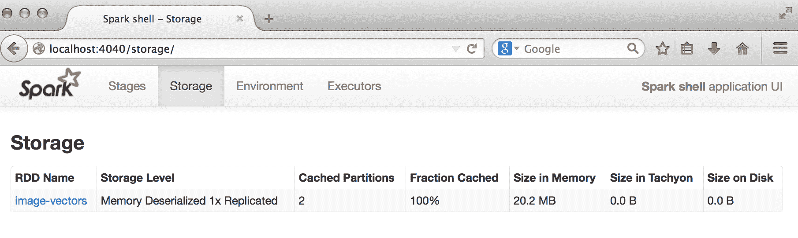
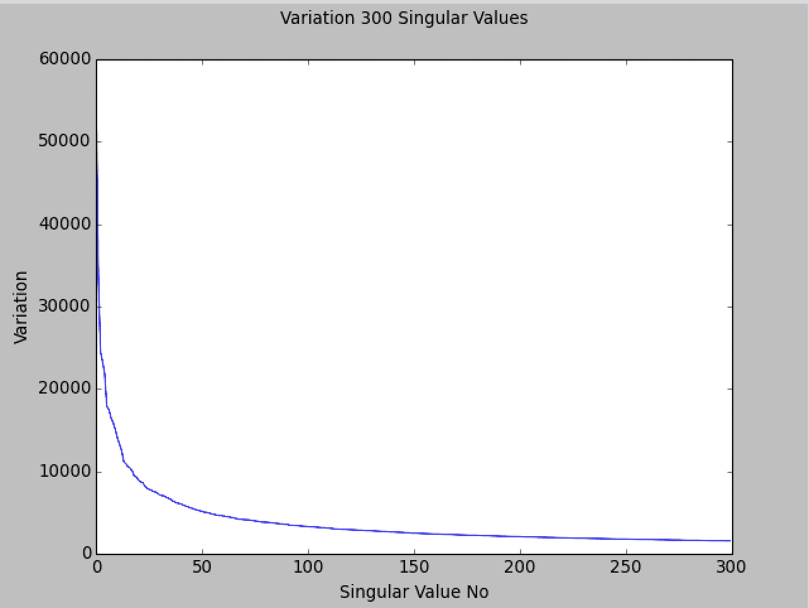
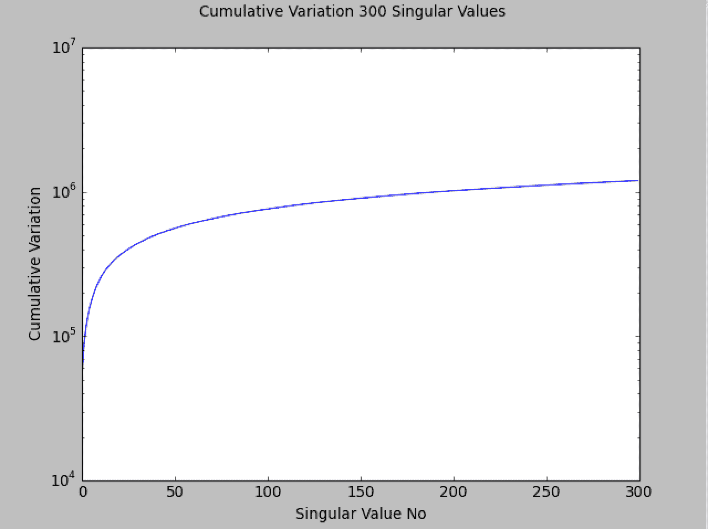

# 九、基于 Spark 的降维方法

在本章的过程中，我们将继续探索**降维**形式的无监督学习模型。

与我们到目前为止所讨论的模型(如回归、分类和聚类)不同，降维并不侧重于预测。 相反，它尝试获取一组特征维度为*D*(即特征向量的长度)的输入数据，并提取维度为*k*的数据表示，其中*k*通常明显小于*D*。 因此，它是一种预处理或特征变换的形式，而不是其本身的预测模型。

重要的是，提取的表示应该仍然能够捕获原始数据的大部分可变性或结构。 这背后的想法是，大多数数据源都将包含某种形式的底层结构。 这种结构通常是未知的(通常被称为潜在特征或潜在因素)，但如果我们能够发现一些这种结构，我们的模型就可以学习这种结构，并根据它做出预测，而不是从原始形式的数据中做出预测，因为原始形式的数据可能会有噪音，或者包含许多不相关的特征。 换句话说，降维去除了数据中的一些噪声，并保留了现有的隐藏结构。

在某些情况下，原始数据的维数远远高于我们拥有的数据点的数量，因此，如果不降维，其他机器学习模型，如分类和回归，将很难学习任何东西，因为它们需要拟合的参数数量远远大于训练样本的数量(从这个意义上说，这些方法与我们在分类和回归中看到的正则化方法有一些相似之处)。

降维技术的几个使用案例包括以下几个：

*   探索性数据分析
*   提取特征以训练其他机器学习模型
*   在预测阶段减少对超大型模型(例如，进行预测的生产系统)的存储和计算需求
*   将一大组文本文档缩减为一组隐藏的主题或概念
*   当我们的数据具有非常多的特征时(例如，在处理往往非常高维的文本、声音、图像或视频数据时)，使模型的学习和泛化变得更容易。

在本章中，我们将执行以下操作：

*   介绍 MLlib 中可用的降维模型类型
*   处理人脸图像，提取适合降维的特征
*   利用 MLlib 训练降维模型
*   可视化并评估结果
*   对我们的降维模型进行参数选择

# 降维类型

MLlib 提供了两种降维模型，这两种模型之间有着密切的联系。 这些模型是**主成分分析**(**PCA**)和**奇异值分解**(**SVD**)。

# 主成分分析

PCA 对数据矩阵*X*进行操作，并寻求从*X*中提取一组*k*主分量。 每个主成分彼此不相关，并且被计算成使得第一主成分占输入数据中的最大变化。 进而计算每个后续主分量，以使其考虑最大的变化，前提是它独立于到目前为止计算的主分量。

通过这种方式，保证返回的*k*主分量能够尽可能地解释输入数据中的最大变化量。 实际上，每个主成分具有与原始数据矩阵相同的特征维度。 因此，为了实际执行降维，需要投影步骤，其中原始数据被投影到由主成分表示的*k*维空间。

# 奇异值分解

SVD 寻求将维度为*m x n*的矩阵*X*分解为以下三个分量矩阵：

*   尺寸*m x m*的*U*
*   *S*，大小为*m x n*的对角矩阵；*S*的项称为**奇异值**
*   尺寸为*n x n*的*VT*

*X = U * S * V <sup>T</sup>*

查看前面的公式，我们似乎根本没有降低问题的维数，因为通过将*U*、*S*和*V*相乘，我们重构了原始矩阵。 在实际应用中，通常需要计算截断的奇异值分解(SVD)。 也就是说，只有表示数据中最大变化的前 k 个奇异值被保留，而其余的被丢弃。 然后，根据分量矩阵重构*X*的公式是近似的，并且给出如下公式：

*X ~ U<sub>k</sub> * S<sub>k</sub> * V<sub>k T</sub>*

截断的 SVD 如下图所示：


The truncated singular value decomposition

保留顶部的*k*奇异值类似于保留 PCA 中的顶部的*k*主成分。 事实上，奇异值分解(SVD)和主成分分析(PCA)是直接相关的，我们将在本章后面部分看到。

A detailed mathematical treatment of both PCA and SVD is beyond the scope of this book.
An overview of dimensionality reduction can be found in the Spark documentation at [http://spark.apache.org/docs/latest/mllib-dimensionality-reduction.html](http://spark.apache.org/docs/latest/mllib-dimensionality-reduction.html).
The following links contain a more in-depth mathematical overview of PCA and SVD respectively: [http://en.wikipedia.org/wiki/Principal_component_analysis](http://en.wikipedia.org/wiki/Principal_component_analysis) and [http://en.wikipedia.org/wiki/Singular_value_decomposition](http://en.wikipedia.org/wiki/Singular_value_decomposition).

# 与矩阵分解的关系

PCA 和 SVD 都是矩阵分解技术，因为它们将数据矩阵分解成子分量矩阵，每个子分量矩阵的维数(或秩)都低于原始矩阵。 许多其他降维技术都是基于矩阵因式分解的。

您可能还记得矩阵分解的另一个示例，即协作过滤，我们已经在[第 6 章](05.html)，*使用 Spark*构建分类模型中见过。 矩阵分解通过将评分矩阵分解为两个组成部分来实现协同过滤工作：用户因素矩阵和项目因素矩阵。 这些方法中的每一个都比原始数据具有更低的维数，因此这些方法也可以作为降维模型。

Many of the best performing approaches to collaborative filtering include models based on SVD. Simon Funk's approach to the Netflix prize is a famous example. You can look it up at [http://sifter.org/~simon/journal/20061211.html](http://sifter.org/~simon/journal/20061211.html).

# 聚类作为降维手段

我们在上一章中介绍的聚类模型也可以用于某种形式的降维。 其工作方式如下：

*   假设我们使用 K-均值聚类模型来聚类我们的高维特征向量，具有 k 个聚类。 结果是一组*k*簇中心。

*   我们可以用距离每个集群中心的距离来表示每个原始数据点。 也就是说，我们可以计算数据点到每个集群中心的距离。 结果是每个数据点的一组*k*距离。

*   这些*k*距离可以形成维度*k*的新矢量。 现在，我们可以将原始数据表示为相对于原始要素维度较低维度的新向量。

根据使用的距离度量，这可能会导致数据的降维和某种形式的非线性转换，使我们能够了解更复杂的模型，同时仍然受益于线性模型的速度和可扩展性。 例如，使用高斯或指数距离函数可以近似非常复杂的非线性特征变换。

# 从数据中提取正确的要素

与我们到目前为止探索的所有机器学习模型一样，降维模型也对数据的特征向量表示进行操作。

在本章中，我们将使用人脸图像的 Wild(**LFW**)数据集中的**标签人脸，深入图像处理领域。 这个数据集包含了 13000 多张人脸图像，这些图像通常是从互联网上获取的，属于知名公众人物。 面孔上标有该人的名字。**

# 从 LFW 数据集中提取要素

为了避免下载和处理非常大的数据集，我们将使用名称以 A 开头的人来处理图像的子集。此数据集可以从[http://vis-www.cs.umass.edu/lfw/lfw-a.tgz](http://vis-www.cs.umass.edu/lfw/lfw-a.tgz)下载。

For more details and other variants of the data, visit [http://vis-www.cs.umass.edu/lfw/](http://vis-www.cs.umass.edu/lfw/).
The original research paper reference is:
*Gary B. Huang*, *Manu Ramesh*, *Tamara Berg*, and *Erik Learned-Miller*. *Labeled Faces in the Wild: A Database for Studying Face Recognition in Unconstrained Environments*. University of Massachusetts, Amherst, Technical Report 07-49, October, 2007.
It can be downloaded from [http://vis-www.cs.umass.edu/lfw/lfw.pdf](http://vis-www.cs.umass.edu/lfw/lfw.pdf).

使用以下命令解压缩数据：

```scala
>tar xfvz lfw-a.tgz

```

这将创建一个名为`lfw`的文件夹，其中包含多个子文件夹，每个人一个子文件夹。

# 探索人脸数据

我们将使用 Spark 应用程序来分析数据。 确保将数据解压到`data`文件夹，如下所示：

```scala
Chapter_09
|-- 2.0.x
|   |-- python
|   |-- scala
|-- data

```

实际代码在`scala`文件夹中，但有几个图表在`python`文件夹中：

```scala
scala
|-- src
|   |-- main
|   |   |-- java
|   |   |-- resources
|   |   |-- scala
|   |   |   |-- org
|   |   |       |-- sparksamples
|   |   |           |-- ImageProcessing.scala
|   |   |           |-- Util.scala
|   |   |-- scala-2.11
|   |-- test

```

现在我们已经解压了数据，我们面临着一个小挑战。 Spark 为我们提供了一种读取文本文件和自定义 Hadoop 输入数据源的方法。 但是，没有内置的功能可以让我们读取图像。

Spark 提供了一个名为`wholeTextFiles`的方法，它允许我们一次操作整个文件，而到目前为止，我们一直在使用`textFile`方法，它操作一个文本文件(或多个文件)中的单个行。

我们将使用`wholeTextFiles`方法访问每个文件的位置。 使用这些文件路径，我们将编写自定义代码来加载和处理图像。 在下面的示例代码中，我们将使用 path 引用您解压`lfw`子目录的目录。

我们可以使用通配符路径规范(使用以下代码片段中突出显示的*字符)告诉 Spark 在`lfw`目录下的每个目录中查找文件：

```scala
val spConfig = (new SparkConf).setMaster("local[1]")
  .setAppName("SparkApp")
  .set("spark.driver.allowMultipleContexts", "true") 
val sc = new SparkContext(spConfig) 
val path = PATH +  "/lfw/*" 
val rdd = sc.wholeTextFiles(path) 
val first = rdd.first 
println(first)

```

运行`first`命令可能需要一些时间，因为 Spark 首先在指定的目录结构中扫描所有可用文件。 完成后，您应该会看到类似如下所示的输出：

```scala
first: (String, String) =  (file:/PATH/lfw/Aaron_Eckhart /Aaron_Eckhart_0001.jpg,??JFIF????? ...

```

您将看到`wholeTextFiles`返回一个包含键-值对的 RDD，其中键是文件位置，而值是整个文本文件的内容。 出于我们的目的，我们只关心文件路径，因为我们不能直接使用字符串形式的图像数据(请注意，它在 shell 输出中显示为“二进制无意义”)。

让我们从 RDD 中提取文件路径。 请注意，在前面，文件路径以`file:`文本开头。 Spark 在读取文件以区分不同的文件系统(例如，本地文件系统为`file://`，HDFS 为`hdfs://`，Amazon S3 为`s3n://`，等等)时使用该选项。

在我们的例子中，我们将使用自定义代码来读取图像，因此我们不需要路径的这一部分。 因此，我们将使用以下`map`函数将其删除：

```scala
val files = rdd.map { case (fileName, content) =>
  fileName.replace("file:", "") }

```

前面的函数将显示删除了`file:`前缀的文件位置：

```scala
/PATH/lfw/Aaron_Eckhart/Aaron_Eckhart_0001.jpg

```

接下来，我们将查看我们正在处理的文件数量：

```scala
println(files.count)

```

运行这些命令会在 Spark 中产生大量噪音输出，因为它会输出读取到控制台的所有文件路径。 忽略这一部分，但在命令完成后，输出应该如下所示：

```scala
..., /PATH/lfw/Azra_Akin/Azra_Akin_0003.jpg:0+19927,
  /PATH/lfw/Azra_Akin/Azra_Akin_0004.jpg:0+16030
...
14/09/18 20:36:25 INFO SparkContext: Job finished:
  count at  <console>:19, took 1.151955 s
1055

```

因此，我们可以看到我们有`1055`个图像要处理。

# 可视化人脸数据

尽管在 Scala 或 Java 中有一些工具可用于显示图像，但这是 Python 和`matplotlib`库的一个亮点。 我们将使用 Scala 处理和提取图像并运行我们的模型，使用 IPython 显示实际图像。

您可以通过打开新的终端窗口并启动新的笔记本来运行单独的 IPython 笔记本，如下所示：

```scala
>ipython notebook

```

If using Python Notebook, you should first execute the following code snippet to ensure that the images are displayed inline after each notebook cell (including the `%` character): `%pylab inline`

或者，您也可以在没有 Web 笔记本的情况下启动纯 IPython 控制台，使用以下命令启用`pylab`打印功能：

```scala
>ipython --pylab

```

在撰写本书时，MLlib 中的降维技术仅在 Scala 或 Java 中可用，因此我们将继续使用 Scala Spark shell 来运行模型。 因此，您不需要运行 PySpark 控制台。

We have provided the full Python code with this chapter as a Python script as well as in the IPython Notebook format. For instructions on installing IPython, see the code bundle.

让我们显示前面使用 PIL 图像库提取的第一个路径提供的图像：

```scala
from PIL import Image, ImageFilter 
path = PATH + "/lfw/Aaron_Eckhart/Aaron_Eckhart_0001.jpg" 
im = Image.open(path) 
im.show()

```

您应该会看到屏幕截图显示如下：


# 以矢量形式提取人脸图像

虽然图像处理的全面介绍超出了本书的范围，但您需要了解一些基础知识才能继续。 每个彩色图像可以表示为像素的三维阵列或矩阵。 前两个维度(即*x*和*y*轴)表示每个像素的位置，而第三个维度表示每个像素的**红色**、**蓝色**和**绿色**(**RGB**)颜色值。

灰度图像的每个像素只需要一个值(没有 RGB 值)，因此可以将其表示为纯二维矩阵。 对于许多与图像相关的图像处理和机器学习任务，通常对灰度图像进行操作。 我们将在这里通过首先将彩色图像转换为灰度来实现这一点。

将图像表示为向量而不是矩阵也是机器学习任务中的常见做法。 我们通过将矩阵的每行(或者每列)连接起来形成一个长向量(这称为`reshaping`)来实现这一点。 通过这种方式，每个原始的灰度图像矩阵被转换成特征向量，该特征向量可用作机器学习模型的输入。

幸运的是，对于我们来说，内置的 Java**抽象窗口工具包**(**AWT**)包含各种基本的图像处理功能。 我们将使用`java.awt`类定义几个实用函数来执行此处理。

# 正在加载图像

第一个是从文件中读取图像的函数。

```scala
import java.awt.image.BufferedImage 
def loadImageFromFile(path: String): BufferedImage = { 
  ImageIO.read(new File(path)) 
}

```

上述代码在`Util.scala`中提供。

这将返回存储图像数据的`java.awt.image.BufferedImage`类的实例，并提供许多有用的方法。 让我们通过将第一个图像加载到 Spark shell 中来测试它，如下所示：

```scala
val aePath = "/PATH/lfw/Aaron_Eckhart/Aaron_Eckhart_0001.jpg" 
val aeImage = loadImageFromFile(aePath)

```

您应该会看到 shell 中显示的图像详细信息。

```scala
aeImage: java.awt.image.BufferedImage = BufferedImage@f41266e: 
type =  5 ColorModel: #pixelBits = 24 numComponents = 3 color space =  java.awt.color.ICC_ColorSpace@7e420794 transparency = 1 has 
alpha =  false isAlphaPre = false ByteInterleavedRaster: 
width = 250 height =  250 #numDataElements 3 dataOff[0] = 2

```

这里有相当多的信息。 我们特别感兴趣的是，图像的宽度和高度是`250`像素，正如我们可以看到的，在前面的输出中突出显示了三个分量(即 RGB 值)。

# 转换为灰度并调整图像大小

我们将定义的下一个函数将获取前面函数加载的图像，将图像从彩色转换为灰度，并调整图像的宽度和高度。

这些步骤并不是严格必要的，但在许多情况下都是出于效率的目的而执行这两个步骤。 使用 RGB 彩色图像而不是灰度图像会将要处理的数据量增加到原来的三倍。 同样，较大的图像会显著增加处理和存储开销。 我们的原始 250x250 图像使用三种颜色分量表示每幅图像的 187,500 个数据点。 对于一组 1055 个图像，这是 197,812,500 个数据点。 即使存储为整数值，每个存储的值也需要 4 字节的内存，因此仅 1055 张图像就相当于大约 800MB 的内存！ 如您所见，图像处理任务很快就会变得非常占用内存。

如果我们转换为灰度并将图像大小调整为 50x50 像素，那么每幅图像只需要 2500 个数据点。 对于我们的 1055 个图像，这相当于 10MB 的内存，为了便于说明，这要容易得多。

让我们定义一下我们的处理函数。 我们将使用`java.awt.image`包一步完成灰度转换和大小调整：

```scala
def processImage(image: BufferedImage, width: Int, height: Int): 
  BufferedImage = { 
    val bwImage = new BufferedImage(width, height, 
    BufferedImage.TYPE_BYTE_GRAY) 
    val g = bwImage.getGraphics() 
    g.drawImage(image, 0, 0, width, height, null) 
    g.dispose() 
    bwImage 
  }

```

函数的第一行创建所需宽度和高度的新图像，并指定灰度颜色模型。 第三行将原始图像绘制到新创建的图像上。 `drawImage`方法负责为我们转换颜色和调整大小！ 最后，我们返回经过处理的新图像。

让我们在我们的样例图像上测试一下。 我们将其转换为灰度，并将其大小调整为 100 x 100 像素：

```scala
val grayImage = processImage(aeImage, 100, 100)

```

您应该在控制台上看到以下输出：

```scala
grayImage: java.awt.image.BufferedImage = BufferedImage@21f8ea3b:  
type = 10 ColorModel: #pixelBits = 8 numComponents = 1 color space =  java.awt.color.ICC_ColorSpace@5cd9d8e9 transparency = 1 has 
alpha =  false isAlphaPre = false ByteInterleavedRaster: 
width = 100 height =  100 #numDataElements 1 dataOff[0] = 0

```

从突出显示的输出中可以看到，图像的宽度和高度确实是`100`，颜色分量的数量是`1`。

接下来，我们将把处理后的图像保存到一个临时位置，这样我们就可以使用 Python 应用程序读回并显示它。

```scala
import javax.imageio.ImageIO 
import java.io.File 
ImageIO.write(grayImage, "jpg", new File("/tmp/aeGray.jpg"))

```

您应该会看到控制台上显示了`true`结果，表明您已成功将图像保存到`/tmp`目录中的`aeGray.jpg`文件。

最后，我们将在 Python 中读取图像，并使用 matplotlib 显示图像。 在 IPython 笔记本或 Shell 中键入以下代码(请记住，应在新的终端窗口中打开它)：

```scala
tmp_path = PATH + "/aeGray.jpg"
ae_gary = Image.open(tmp_path)
ae_gary.show()

```

这应该会显示图像(再次注意，我们在这里没有显示图像)。 您将看到它是灰度的，与原始图像相比质量略差。 此外，您会注意到轴的比例不同，表示新的 100 x 100 尺寸，而不是原始的 250 x 250 尺寸。


# 提取特征向量

处理流水线中的最后一步是提取实际的特征向量，这些特征向量将作为我们的降维模型的输入。 正如我们前面提到的，原始灰度像素数据将是我们的功能。 我们将通过展平二维像素矩阵来形成矢量。 `BufferedImage`类提供了执行此操作的实用程序方法，我们将按如下方式在函数中使用该方法：

```scala
def getPixelsFromImage(image: BufferedImage): Array[Double] = { 
  val width = image.getWidth 
  val height = image.getHeight 
  val pixels = Array.ofDim[Double](width * height) 
  image.getData.getPixels(0, 0, width, height, pixels) 
}

```

然后，我们可以将这三个函数组合成一个实用函数，该函数获取文件位置以及所需图像的宽度和高度，并返回包含像素数据的原始`Array[Double]`值。

```scala
def extractPixels(path: String, width: Int, height: Int):
  Array[Double] = { 
    val raw = loadImageFromFile(path) 
    val processed = processImage(raw, width, height) 
    getPixelsFromImage(processed) 
  }

```

将上述函数应用于包含所有图像文件路径的 RDD 的每个元素，将为我们提供一个新的 RDD，其中包含每个图像的像素数据。 让我们这样做，并按如下方式检查前几个元素：

```scala
val pixels = files.map(f => extractPixels(f, 50, 50)) 
println(pixels.take(10).map(_.take(10).mkString   ("", ",", ", 
  ...")).mkString("n"))

```

您应该会看到类似以下内容的输出：

```scala
0.0,0.0,0.0,0.0,0.0,0.0,1.0,1.0,0.0,0.0, ...
241.0,243.0,245.0,244.0,231.0,205.0,177.0,160.0,150.0,147.0, ...
253.0,253.0,253.0,253.0,253.0,253.0,254.0,254.0,253.0,253.0, ...
244.0,244.0,243.0,242.0,241.0,240.0,239.0,239.0,237.0,236.0, ...
44.0,47.0,47.0,49.0,62.0,116.0,173.0,223.0,232.0,233.0, ...
0.0,0.0,0.0,0.0,0.0,0.0,0.0,0.0,0.0,0.0, ...
1.0,1.0,1.0,1.0,1.0,1.0,1.0,1.0,0.0,0.0, ...
26.0,26.0,27.0,26.0,24.0,24.0,25.0,26.0,27.0,27.0, ...
240.0,240.0,240.0,240.0,240.0,240.0,240.0,240.0,240.0,240.0, ...
0.0,0.0,0.0,0.0,0.0,0.0,0.0,0.0,0.0,0.0, ...

```

最后一步是为每个映像创建一个 MLlib`vector`实例。 我们将缓存 RDD 以加快后面的计算：

```scala
import org.apache.spark.mllib.linalg.Vectors 
val vectors = pixels.map(p => Vectors.dense(p)) 
// the setName method create a human-readable name that is 
// displayed in the Spark Web UI 
vectors.setName("image-vectors") 
// remember to cache the vectors to speed up computation 
vectors.cache

```

We used the `setName` function earlier to assign an RDD a name. In this case, we called it `image-vectors`. This is so that we can later identify it more easily when looking at the Spark web interface.

# 正常化 / 正常化政策

通常的做法是在运行降维模型之前对输入数据进行标准化，特别是对于 PCA。 正如我们在[第 6 章](05.html)，*使用 Spark*构建分类模型中所做的那样，我们将使用 MLlib 的`feature`包提供的内置`StandardScaler`来实现这一点。 在这种情况下，我们只从数据中减去平均值。

```scala
import org.apache.spark.mllib.linalg.Matrix 
import org.apache.spark.mllib.linalg.distributed.RowMatrix 
import org.apache.spark.mllib.feature.StandardScaler 
val scaler = new StandardScaler(withMean = true, withStd = false)
  .fit(vectors)

```

**Standard Scalar**: It standardizes features by removing the mean, and scaling to unit standard using column summary statistics on the samples in the training set.
`@param``withMean`: `False` by default. This centers the data with the mean before scaling. It builds a dense output, so this does not work on sparse input, and raises an exception.
`@param withStd`: `True` by default. This scales the data to unit standard deviation.

```scala
class StandardScaler @Since("1.1.0") (withMean: Boolean,
  withStd: Boolean) extends Logging

```

调用`fit`会触发对我们的`RDD[Vector]`的计算。 您应该会看到类似如下所示的输出：

```scala
...
14/09/21 11:46:58 INFO SparkContext: Job finished: reduce at  
RDDFunctions.scala:111, took 0.495859 s
scaler: org.apache.spark.mllib.feature.StandardScalerModel =  org.apache.spark.mllib.feature.StandardScalerModel@6bb1a1a1

```

Note that subtracting the mean works for dense input data. In Image processing, we always have dense input data, because each pixel has a value. However, for sparse vectors, subtracting the mean vector from each input will transform the sparse data into dense data. For very high-dimensional input, this will likely exhaust the available memory resources, so it is not advisable.

最后，我们将使用返回的`scaler`将原始图像向量转换为减去列平均值的向量。

```scala
val scaledVectors = vectors.map(v => scaler.transform(v))

```

我们早些时候提到，调整大小后的灰度图像将占用大约 10MB 的内存。 事实上，你可以通过在你的网络浏览器中进入`http://localhost:4040/storage/`来查看 Spark 应用程序监视器存储页面中的内存使用情况。

由于我们为图像向量的 RDD 指定了一个友好的名称`image-vectors`，您应该会看到类似以下屏幕截图的内容(请注意，因为我们使用的是`Vector[Double]`，所以每个元素占用 8 个字节而不是 4 个字节；因此，我们实际上使用了 20MB 的内存)：



Size of image vectors in memory

# 训练降维模型

MLlib 中的降维模型需要向量作为输入。 然而，与在`RDD[Vector]`上操作的集群不同，PCA 和 SVD 计算是作为分布式`RowMatrix`上的方法提供的(这种差异在很大程度上取决于语法，因为`RowMatrix`只是一个围绕`RDD[Vector]`的包装器)。

# 在 LFW 数据集上运行 PCA

现在我们已经将图像像素数据提取到向量中，我们可以实例化一个新的`RowMatrix`。

`def computePrincipalComponents(k: Int)`: Matrix
Computes the top `k` principal components. Rows correspond to observations, and columns correspond to variables. The principal components are stored as a local matrix of size n-by-`k`. Each column corresponds for one principal component, and the columns are in descending order of component variance. The row data do not need to be "centered" first; it is not necessary for the mean of each column to be `0`.
Note that this cannot be computed on matrices with more than `65535` columns.
`K` is the number of top principal components.
It returns a matrix of size n-by-k, whose columns are principal components
Annotations
@Since( "1.0.0" )

调用`computePrincipalComponents`方法来计算分布式矩阵的前`K`个主分量：

```scala
import org.apache.spark.mllib.linalg.Matrix 
import org.apache.spark.mllib.linalg.distributed.RowMatrix 
val matrix = new RowMatrix(scaledVectors) 
val K = 10 
val pc = matrix.computePrincipalComponents(K)

```

当模型运行时，您可能会在控制台上看到相当多的输出。

If you see warnings such as WARN LAPACK: Failed to load implementation from: com.github.fommil.netlib.NativeSystemLAPACK or WARN LAPACK: Failed to load implementation from: com.github.fommil.netlib.NativeRefLAPACK, you can safely ignore these.
This means that the underlying linear algebra libraries used by MLlib could not load the native routines. In this case, a Java-based fallback will be used, which is slower, but there is nothing to worry about for the purposes of this example.

完成模型培训后，您应该会看到控制台上显示的结果类似于以下内容：

```scala
pc: org.apache.spark.mllib.linalg.Matrix = 
-0.023183157256614906  -0.010622723054037303  ... (10 total)
-0.023960537953442107  -0.011495966728461177  ...
-0.024397470862198022  -0.013512219690177352  ...
-0.02463158818330343   -0.014758658113862178  ...
-0.024941633606137027  -0.014878858729655142  ...
-0.02525998879466241   -0.014602750644394844  ...
-0.025494722450369593  -0.014678013626511024  ...
-0.02604194423255582   -0.01439561589951032   ...
-0.025942214214865228  -0.013907665261197633  ...
-0.026151551334429365  -0.014707035797934148  ...
-0.026106572186134578  -0.016701471378568943  ...
-0.026242986173995755  -0.016254664123732318  ...
-0.02573628754284022   -0.017185663918352894  ...
-0.02545319635905169   -0.01653357295561698   ...
-0.025325893980995124  -0.0157082218373399...

```

# 特征面的可视化

现在我们已经训练了 PCA 模型，结果是什么？ 让我们检查一下结果矩阵的维度：

```scala
val rows = pc.numRows 
val cols = pc.numCols 
println(rows, cols)

```

正如您应该从控制台输出中看到的那样，主成分矩阵有`2500`行和`10`列。

```scala
(2500,10)

```

回想一下，每个图像的维度是 50x50，所以在这里，我们有前 10 个主成分，每个主成分的维度都与输入图像的维度相同。 这些主成分可以被认为是捕捉原始数据中最大变化的一组潜在(或隐藏)特征。

In facial recognition and image processing, these principal components are often referred to as **Eigenfaces**, as PCA is closely related to the eigenvalue decomposition of the covariance matrix of the original data.
See [http://en.wikipedia.org/wiki/Eigenface](http://en.wikipedia.org/wiki/Eigenface) for more details.

由于每个主分量与原始图像具有相同的维度，因此每个分量本身都可以被认为是一幅图像并将其表示为一幅图像，这使得我们可以像对输入图像那样可视化特征脸。

正如我们在本书中经常做的那样，我们将使用 Breeze 线性代数库中的功能以及 Python 的 numpy 和 matplotlib 来可视化特征脸。

首先，我们将 PC 变量(MLlib 矩阵)提取到 Breeze`DenseMatrix`中，如下所示：

```scala
import breeze.linalg.DenseMatrix 
val pcBreeze = new DenseMatrix(rows, cols, pc.toArray)

```

Breeze 在`linalg`包中提供了一个有用的函数，可以将矩阵写出为 CSV 文件。 我们将使用它将主要组件保存到临时 CSV 文件。

```scala
import breeze.linalg.csvwrite 
csvwrite(new File("/tmp/pc.csv"), pcBreeze)

```

接下来，我们将在 IPython 中加载矩阵，并将主要组件可视化为图像。 幸运的是，numpy 提供了一个实用函数来从我们创建的 CSV 文件中读取矩阵。

```scala
pcs = np.loadtxt(PATH + "/pc.csv", delimiter=",") 
print(pcs.shape)

```

您应该看到以下输出，确认我们读取的矩阵与我们保存的矩阵具有相同的维度：

```scala
(2500, 10)

```

我们需要一个实用函数来显示我们在这里定义的图像：

```scala
def plot_gallery(images, h, w, n_row=2, n_col=5): 
        """Helper function to plot a gallery of portraits""" 
        plt.figure(figsize=(1.8 * n_col, 2.4 * n_row)) 
        plt.subplots_adjust(bottom=0, left=.01, right=.99, top=.90,
          hspace=.35) 
        for i in range(n_row * n_col): 
            plt.subplot(n_row, n_col, i + 1) 
            plt.imshow(images[:, i].reshape((h, w)),  
                cmap=plt.cm.gray) 
            plt.title("Eigenface %d" % (i + 1), size=12) 
            plt.xticks(()) 
            plt.yticks(()) 

  plt.show()

```

This preceding function is adapted from the LFW dataset example code in the **scikit-learn** documentation available at [http://scikit-learn.org/stable/auto_examples/applications/face_recognition.html](http://scikit-learn.org/stable/auto_examples/applications/face_recognition.html).

现在，我们将使用此函数绘制前 10 个本征面，如下所示：

```scala
plot_gallery(pcs, 50, 50)

```

最后一个命令应显示以下绘图：


Top 10 Eigenfaces

# 解读本征面

从前面的图像可以看出，PCA 模型有效地提取了代表人脸图像各种特征的反复出现的变异模式。 与群集模型一样，每个主成分都可以被解释。 同样，与聚类一样，准确解释每个主成分所代表的内容并不总是简单明了的。

从这些图像中我们可以看到，似乎有一些图像提取了方向因素(例如图像 6 和 9)，一些图像专注于头发图案(例如图像 4、5、7 和 10)，而其他图像似乎与眼睛、鼻子和嘴巴等面部特征更相关(图像 1、7 和 9)。

# 使用降维模型

能够以这种方式可视化模型的结果是很有趣的；然而，使用降维的总体目的是创建数据的更紧凑的表示，该表示仍然捕获原始数据集中的重要特征和可变性。 要做到这一点，我们需要使用经过训练的模型将原始数据投影到由主成分表示的新的低维空间中，从而转换原始数据。

# 使用 PCA 在 LFW 数据集上投影数据

我们将通过将每个 LFW 图像投影到一个十维向量来说明这一概念。 这是通过图像矩阵与主分量矩阵的矩阵相乘来实现的。 由于图像矩阵是分布式 MLlib`RowMatrix`，Spark 负责通过`multiply`函数为我们分配计算。

```scala
val projected = matrix.multiply(pc) 
println(projected.numRows, projected.numCols)

```

前面的函数将为您提供以下输出：

```scala
(1055,10)

```

注意到每个维度为 2500 的图像都被转换为大小为 10 的向量。让我们来看一下前几个向量：

```scala
println(projected.rows.take(5).mkString("n"))

```

以下是输出：

```scala
[2648.9455749636277,1340.3713412351376,443.67380716760965, -353.0021423043161,52.53102289832631,423.39861446944354, 413.8429065865399,-484.18122999722294,87.98862070273545, -104.62720604921965]
[172.67735747311974,663.9154866829355,261.0575622447282, -711.4857925259682,462.7663154755333,167.3082231097332, -71.44832640530836,624.4911488194524,892.3209964031695, -528.0056327351435]
[-1063.4562028554978,388.3510869550539,1508.2535609357597, 361.2485590837186,282.08588829583596,-554.3804376922453, 604.6680021092125,-224.16600191143075,-228.0771984153961, -110.21539201855907]
[-4690.549692385103,241.83448841252638,-153.58903325799685, -28.26215061165965,521.8908276360171,-442.0430200747375, -490.1602309367725,-456.78026845649435,-78.79837478503592, 70.62925170688868]
[-2766.7960144161225,612.8408888724891,-405.76374113178616, -468.56458995613974,863.1136863614743,-925.0935452709143, 69.24586949009642,-777.3348492244131,504.54033662376435, 257.0263568009851]

```

由于投影数据是向量的形式，我们可以使用投影作为另一个机器学习模型的输入。 例如，我们可以使用这些投影输入和从各种没有人脸的图像生成的一组输入数据来训练面部识别模型。 或者，我们可以训练一个多类分类器，其中每个人都是一个类，从而创建一个学习识别脸部所属特定人的模型。

# 主成分分析与奇异值分解的关系

我们前面提到，PCA 和 SVD 之间有密切的关系。 实际上，我们可以利用奇异值分解恢复相同的主成分，并将相同的投影应用到主成分空间。

在我们的例子中，通过计算奇异值分解得到的右奇异向量将等同于我们计算的主分量。 通过首先计算图像矩阵上的奇异值分解(SVD)，并将正确的奇异向量与 PCA 的结果进行比较，我们可以看到情况就是这样。 与 PCA 的情况一样，SVD 计算作为分布式`RowMatrix`的函数提供：

```scala
val svd = matrix.computeSVD(10, computeU = true) 
println(s"U dimension: (${svd.U.numRows}, ${svd.U.numCols})") 
println(s"S dimension: (${svd.s.size}, )") 
println(s"V dimension: (${svd.V.numRows}, ${svd.V.numCols})")

```

我们可以看到，SVD 返回 1055×10 维的矩阵`U`、长度为`10`的奇异值的向量`S`和维度为 2500×10 的右奇异向量的矩阵`V`。

```scala
U dimension: (1055, 10)
S dimension: (10, )
V dimension: (2500, 10)

```

矩阵 V 完全等同于 PCA 的结果(忽略数值和浮点公差的符号)。 我们可以使用下一个实用函数来验证这一点，通过近似比较每个矩阵的数据数组来比较两者：

```scala
def approxEqual(array1: Array[Double], array2: Array[Double],    
tolerance: Double = 1e-6): Boolean = { 
  // note we ignore sign of the principal component / 
  // singular vector elements 
  val bools = array1.zip(array2).map { case (v1, v2) => if    
    (math.abs(math.abs(v1) - math.abs(v2)) > 1e-6) false else true } 
  bools.fold(true)(_ & _) 
}

```

我们将对一些测试数据进行测试，如下所示：

```scala
println(approxEqual(Array(1.0, 2.0, 3.0), Array(1.0, 2.0, 3.0)))

```

这将为您提供以下输出：

```scala
true

```

我们再来试试另一个测试数据：

```scala
println(approxEqual(Array(1.0, 2.0, 3.0), Array(3.0, 2.0, 1.0)))

```

这将为您提供以下输出：

```scala
false

```

最后，我们可以按如下方式应用相等函数：

```scala
println(approxEqual(svd.V.toArray, pc.toArray))

```

以下是输出：

```scala
true

```

奇异值分解(SVD)和主成分分析(PCA)都可以用来计算主成分和相应的特征/奇异值；计算协方差矩阵的额外步骤可能导致在计算特征向量时的数值舍入误差。 SVD 总结了数据偏离零的方式，PCA 总结了数据偏离平均数据样本的方式。

另一个成立的关系是矩阵`U`和向量`S`(或者严格地说，对角矩阵`S`)的乘法等价于原始图像数据到前 10 个主分量空间的 PCA 投影。

我们现在将证明事实的确如此。 我们将首先使用 Breeze 逐个元素地将`U`中的每个向量乘以`S`。 然后，我们将把 PCA 投影向量中的每个向量与 SVD 投影中的等效向量进行比较，并总结相等的情况数，如下所示：

```scala
val breezeS = breeze.linalg.DenseVector(svd.s.toArray) 
val projectedSVD = svd.U.rows.map { v =>  
  val breezeV = breeze.linalg.DenseVector(v.toArray) 
  val multV = breezeV :* breezeS 
  Vectors.dense(multV.data) 
} 
projected.rows.zip(projectedSVD).map { case (v1, v2) =>
  approxEqual(v1.toArray, v2.toArray) }.filter(b => true).count

```

正如我们预期的那样，前面的代码应该显示结果 1055，确认投影 PCA 的每一行都等于`projectedSVD`的每一行。

Note that the **:*** operator, highlighted in the preceding code, represents element-wise multiplication of the vectors.

# 评价降维模型

主成分分析和奇异值分解都是确定性模型。 也就是说，给定某个输入数据集，它们将始终产生相同的结果。 这与我们到目前为止看到的许多模型形成对比，这些模型依赖于某些随机元素(最常用于模型权重向量的初始化等)。

这两个模型也都保证返回顶主成分或奇异值，因此，唯一的参数是*k*。 与聚类模型一样，增加*k*总是会提高模型性能(对于聚类，是相关的误差函数，而对于 PCA 和 SVD，则是由*k*分量解释的变异性的总量)。 因此，为*k*选择一个值是在保持投影数据的维度较低的情况下尽可能多地捕获数据结构之间的权衡。

# 在 LFW 数据集上计算奇异值分解的 k

我们将检查通过计算图像数据的奇异值获得的奇异值。 我们可以验证每个运行的奇异值是否相同，并且它们是否按降序返回，如下所示：

```scala
val sValues = (1 to 5).map { 
  i => matrix.computeSVD(i,  computeU = false).s 
} 
sValues.foreach(println)

```

最后这段代码应该会生成类似以下内容的输出：

```scala
[54091.00997110354]
[54091.00997110358,33757.702867982436]
[54091.00997110357,33757.70286798241,24541.193694775946]
[54091.00997110358,33757.70286798242,24541.19369477593, 23309.58418888302]
[54091.00997110358,33757.70286798242,24541.19369477593, 23309.584188882982,21803.09841158358]

```

# 奇异值

奇异值让我们了解了在空间和时间之间的权衡，以求简化的保真度。

与用于聚类的*k*的评估值一样，在 SVD(和 PCA)的情况下，绘制更大范围的*k*的奇异值，并查看图表上的点是每个附加奇异值所占的附加方差量开始变平的地方，通常是有用的。

我们将首先计算前 300 个奇异值，如下所示：

```scala
val svd300 = matrix.computeSVD(300, computeU = false) 
val sMatrix = new DenseMatrix(1, 300, svd300.s.toArray) 
println(sMatrix) 
csvwrite(new File("/home/ubuntu/work/ml-resources/
  spark-ml/Chapter_09/data/s.csv"), sMatrix)

```

我们将把奇异值的向量 S 写出到一个临时的 CSV 文件中(就像我们之前对特征面矩阵所做的那样)，然后在我们的 IPython 控制台中读回它，绘制每个*k*的奇异值。

```scala
file_name = '/home/ubuntu/work/ml-resources/spark-ml/Chapter_09/data/s.csv' 
data = np.genfromtxt(file_name, delimiter=',')  
plt.plot(data) 
plt.suptitle('Variation 300 Singular Values ') 
plt.xlabel('Singular Value No') 
plt.ylabel('Variation') 
plt.show()

```

您应该会看到如下所示的图像：



Top 300 singular values

在前 300 个奇异值(我们将在*y*轴的对数刻度上绘制)所占的累积变化中可以看到类似的模式。

```scala
plt.plot(cumsum(data)) 
plt.yscale('log') 
plt.suptitle('Cumulative Variation 300 Singular Values ') 
plt.xlabel('Singular Value No') 
plt.ylabel('Cumulative Variation') 
plt.show()

```

Python Plot 的完整源代码可以在以下链接中找到：[https://github.com/ml-resources/spark-ml/tree/branch-ed2/Chapter_09/data/python](https://github.com/ml-resources/spark-ml/tree/branch-ed2/Chapter_09/data/python)



Cumulative sum of top 300 singular values

我们可以看到，在*k*的某个值范围(在本例中约为 100)之后，图形变得相当平坦。 这表明，相当于*k*这个值的若干奇异值(或主成分)可能足以解释原始数据的变化。

Of course, if we are using dimensionality reduction to help improve the performance of another model, we could use the same evaluation methods used for that model to help us choose a value for *k*.
For example, we could use the AUC metric, together with cross-validation, to choose both the model parameters for a classification model as well as the value of *k* for our dimensionality reduction model. This does come at the expense of higher computation cost, however, as we would have to recompute the full model training and testing pipeline.

# 简略的 / 概括的 / 简易判罪的 / 简易的

在这一章中，我们探索了两种新的无监督学习方法，PCA 和 SVD，用于降维。 我们了解了如何使用面部图像数据为这些模型提取特征并对其进行训练。 我们以特征脸的形式可视化了模型的结果，了解了如何应用模型将原始数据转换为降维表示，并研究了主成分分析和奇异值分解之间的密切联系。

在下一章中，我们将更深入地研究使用 Spark 进行文本处理和分析的技术。