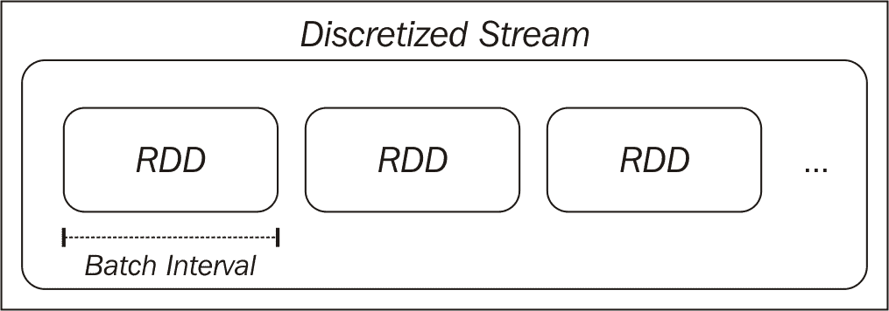

# 十一、基于Spark流的实时机器学习

到目前为止，在本书中，我们主要关注批处理数据处理。 也就是说，我们所有的分析、特征提取和模型训练都应用于一组固定的不变的数据。 这恰好符合 Spark 对 RDDS 的核心抽象，RDDS 是不可变的分布式数据集。 一旦创建，RDD 底层的数据就不会改变，尽管我们可以通过 Spark 的转换和操作操作符从原始 RDD 创建新的 RDD。

我们的注意力还放在批量机器学习模型上，其中我们在一批固定的训练数据上训练模型，这些数据通常表示为特征向量的 RDD(在有监督的学习模型的情况下，还有标签)。

在本章中，我们将：

*   引入在线学习的概念，即在新数据可用时对模型进行训练和更新
*   探索使用 Spark Streaming 进行流处理
*   了解 Spark Streaming 如何与在线学习方法相结合

*   引入非结构化流媒体的概念

以下各节使用 RDD 作为分布式数据集。 以类似的方式，我们可以对流数据使用 DataFrame 或 SQL 操作。

See [https://spark.apache.org/docs/2.0.0-preview/sql-programming-guide.html](https://spark.apache.org/docs/2.0.0-preview/sql-programming-guide.html) for more details on DataFrame and SQL operations.

# 在线学习

我们在本书中应用的批处理机器学习方法侧重于处理现有的固定训练数据集。 通常，这些技术也是迭代的，我们已经对训练数据执行了多次遍历，以便收敛到最优模型。

相比之下，在线学习的基础是以完全增量的方式在训练数据中只执行一次顺序遍历(即，一次一个训练示例)。 在看到每个训练示例之后，该模型对该示例进行预测，然后接收真实结果(例如，用于分类的标签或用于回归的真实目标)。 在线学习背后的想法是，随着新信息的接收，模型不断更新，而不是在批量培训中定期进行再培训。

在某些设置中，当数据量非常大或生成数据的过程变化很快时，在线学习方法可以更快、更接近实时地适应，而不需要在昂贵的批处理过程中进行重新培训。

然而，在线学习方法并不一定要以纯在线的方式使用。 事实上，当我们使用**随机梯度下降**(**SGD**)优化来训练我们的分类和回归模型时，我们已经看到了在批量设置中使用在线学习模型的例子。 SGD 在每个训练示例之后更新模型。 然而，为了收敛到更好的结果，我们仍然利用了对训练数据的多次遍历。

在纯在线设置中，我们不(或者可能不能)对训练数据进行多次传递；因此，我们需要在每个输入到达时对其进行处理。 在线方法还包括小批量方法，在这种方法中，我们不是一次处理一个输入，而是处理一小批训练数据。

在线方法和批处理方法在实际情况下也可以结合使用。 例如，我们可以定期使用批处理方法脱机(比如每天)重新培训我们的模型。 然后，我们可以将训练好的模型部署到生产中，并使用在线方法实时(即在白天，在批量再培训之间)更新它，以适应环境中的任何变化。 这与 lambda 架构非常相似，lambda 架构是一种同时支持批处理和流方法的数据处理架构。

正如我们将在本章中看到的，在线学习设置可以很好地适应流处理和 Spark 流框架。

See [http://en.wikipedia.org/wiki/Online_machine_learning](http://en.wikipedia.org/wiki/Online_machine_learning) for more details on online machine learning.

# 流处理

在介绍 Spark 的在线学习之前，我们将首先探讨流处理的基础知识，并介绍 Spark 流媒体库。

除了核心 Spark API 和功能之外，Spark 项目还包含另一个主要的库(与 MLlib 是主要项目库的方式相同)，称为**Spark Streaming**，它侧重于实时处理数据流。

数据流是记录的连续序列。 常见的示例包括来自 Web 或移动应用程序的活动流数据、带时间戳的日志数据、事务数据以及来自传感器或设备网络的事件流。

批处理方法通常涉及将数据流保存到中间存储系统(例如，HDFS 或数据库)，并对保存的数据运行批处理。 为了生成最新结果，必须定期(例如，每天、每小时甚至每隔几分钟)对可用的最新数据运行批处理。

相比之下，基于流的方法在数据流生成时对其进行处理。 这可以实现近乎实时的处理(时间范围为亚秒到十分之几秒，而不是典型的批处理的分钟、小时、天甚至几周)。

# Spark Streaming 简介

有几种不同的通用技术来处理流处理。 其中最常见的两种情况如下：

*   单独处理每条记录，并在看到后立即进行处理。
*   将多个记录合并为**个小批次**。 这些小批次可以通过时间或批次中的记录数量来描述。

Spark Streaming 采用第二种方法。 Spark流中的核心原语是**离散化的流**或**DStream**。 DStream 是一系列小批次，其中每个小批次表示为 Spark RDD：



The discretized stream abstraction

DStream 由其输入源和称为**批处理间隔**的时间窗口定义。 流被分成与批处理间隔相等的时间段(从应用程序的开始时间开始)。 流中的每个 RDD 将包含 Spark Streaming 应用程序在给定批处理间隔期间接收的记录。 如果在给定间隔内没有数据，则 RDD 将简单地为空。

# 输入源

Spark流**接收器**负责从**输入源**接收数据，并将原始数据转换成由 Spark RDDS 组成的 DStream。

Spark Streaming 支持各种输入源，包括基于文件的源(接收器监视到达输入位置的新文件，并根据从每个新文件读取的内容创建 DStream)和基于网络的源(例如，与基于套接字的源、Twitter API 流、Akka 参与者或消息队列进行通信的接收器，以及分布式流和日志传输框架，如 Flume、Kafka 和 Amazon Kinesis)。

See the documentation on input sources at [http://spark.apache.org/docs/latest/streaming-programming-guide.html#input-dstreams](http://spark.apache.org/docs/latest/streaming-programming-guide.html#input-dstreams) for more details and for links to various advanced sources.

# 变换

正如我们在[第 1 章](01.html)，*使用 Spark*启动和运行中看到的，在本书中，Spark 允许我们对 RDDS 应用强大的转换。 由于 DStream 由 RDDS 组成，Spark Streaming 提供了一组 DStream 上可用的转换；这些转换与 RDDS 上提供的转换类似。 其中包括`map`、`flatMap`、`filter`、`join`和`reduceByKey`。

Spark流转换(例如那些适用于 RDDS 的转换)对 DStream 底层数据的每个元素进行操作。 也就是说，转换被有效地应用于 DStream 中的每个 RDD，而 DStream 中的每个 RDD 又将转换应用于 RDD 的元素。

Spark Streaming 还提供了 Reduce 和 Count 等运算符。 这些操作符返回由单个元素组成的 DStream(例如，每个批次的计数值)。 与 RDDS 上的等效运算符不同，这些运算符不会直接触发 DStream 上的计算。 也就是说，它们不是动作，但它们仍然是转换，因为它们返回另一个 DStream。

# 跟踪状态

当我们处理 RDDS 的批处理时，保持和更新状态变量相对简单。 我们可以从某个状态(例如，值的计数或总和)开始，然后使用广播变量或累加器并行更新该状态。 通常，我们会使用 RDD 操作将更新后的状态收集到驱动程序，进而更新全局状态。

使用 DStreams，这会稍微复杂一些，因为我们需要以容错方式跟踪批处理中的状态。 方便的是，Spark Streaming 在键-值对的 DStream 上提供了`updateStateByKey`函数，它为我们解决了这一问题，允许我们创建任意状态信息流，并使用看到的每批数据对其进行更新。 例如，状态可以是每个键被看到的次数的全局计数。 因此，例如，该状态可以表示每个网页的访问量、每个广告的点击量、每个用户的推文数或每个产品的购买量。

# 一般变换

Spark Streaming API 还公开了一个通用的`transform`函数，它允许我们访问流中每个批的底层 RDD。 也就是说，在高级函数(如`map`)将一个 DStream 转换为另一个 DStream 的情况下，`transform`允许我们将函数从一个 RDD 应用到另一个 RDD。 例如，我们可以使用 RDD`join`操作符将流的每批连接到我们与流应用程序(可能是在 Spark 或其他系统中)分开计算的现有 RDD。

The full list of transformations and further information on each of them is provided in the Spark documentation at [http://spark.apache.org/docs/latest/streaming-programming-guide.html#transformations-on-dstreams](http://spark.apache.org/docs/latest/streaming-programming-guide.html#transformations-on-dstreams).

# 行动 / 活动 / 情节

虽然我们在 Spark Streaming 中看到的一些操作符(比如 Count)不是批处理 RDD 中的操作，但是 Spark Streaming 有 DStreams 上的操作的概念。 操作是输出操作符，调用时会触发 DStream 上的计算。 这些建议如下：

*   `print`：这会将每个批次的前 10 个元素打印到控制台，通常用于调试和测试。
*   `saveAsObjectFile`、`saveAsTextFiles`和`saveAsHadoopFiles`：这些函数使用从批处理开始时间戳派生的文件名(如果适用)将每个批处理输出到与 Hadoop 兼容的文件系统。
*   `forEachRDD`：这个操作符是最通用的，允许我们对每批 DStream 中的 RDDS 应用任意处理。 它用于应用副作用，例如将数据保存到外部系统、打印数据以进行测试、将数据导出到仪表板等。

Note that, like batch processing with Spark, DStream operators are **lazy**. In the same way in which we need to call an action, such as `count`, on an RDD to ensure that processing takes place, we need to call one of the preceding action operators in order to trigger computation on a DStream. Otherwise, our streaming application will not actually perform any computation.

# 窗口操作符

由于 Spark Streaming 对按时间排序的批处理数据流进行操作，因此它引入了一个新概念，即**窗口**。 `window`函数计算应用于流的滑动窗口上的变换。

窗口由窗口的长度和滑动间隔定义。 例如，对于 10 秒的窗口和 5 秒的滑动间隔，我们将根据 DStream 中最新的 10 秒数据，每 5 秒计算一次结果。 例如，我们可能希望根据过去 10 秒内的页面浏览量计算排名靠前的网站，并使用滑动窗口每 5 秒重新计算一次此指标。

下图显示了窗口 DStream：


A windowed DStream

# 通过Spark流实现缓存和容错

与 Spark RDDS 一样，DStream 也可以缓存在内存中。 缓存的用例类似于 RDDS 的用例-如果我们希望多次访问 DStream 中的数据(可能执行多种类型的分析或聚合或输出到多个外部系统)，我们将从缓存数据中获益。 有状态运算符(包括`window`函数和`updateStateByKey`)自动执行此操作以提高效率。

回想一下，RDD 是不可变的数据集，由它们的输入数据源和**谱系**(即应用于 RDD 的一组转换和操作)定义。 RDDS 中的容错是通过重新创建由于工作节点故障而丢失的 RDD(或 RDD 的分区)来实现的。

由于 DStream 本身是一批 RDDS，因此还可以根据需要重新计算它们，以处理工作节点故障。 但是，这取决于输入数据是否仍然可用。 如果数据源本身是容错的和持久的(例如 HDFS 或其他容错数据存储)，则可以重新计算 DStream。

如果数据流源是通过网络交付的(这是流处理的常见情况)，Spark Streaming 的默认持久性行为是将数据复制到两个工作节点。 这允许在出现故障的情况下重新计算网络数据流。 但是，请注意，当节点发生故障时，除*尚未复制*之外的任何节点接收的数据都可能丢失。

Spark流还支持在发生故障时恢复驱动程序节点。 然而，目前基于网络的源在这种情况下会丢失工作节点内存中的数据。 因此，Spark流在驱动程序节点或应用程序出现故障时不能完全容错。 相反，这里可以使用 lambda 架构。 例如，夜间批处理可以在失败的情况下完成并纠正问题。

See [http://spark.apache.org/docs/latest/streaming-programming-guide.html#caching-persistence](http://spark.apache.org/docs/latest/streaming-programming-guide.html#caching-persistence) and [http://spark.apache.org/docs/latest/streaming-programming-guide.html#fault-tolerance-properties](http://spark.apache.org/docs/latest/streaming-programming-guide.html#fault-tolerance-properties) for more details.

# 创建基本的流应用程序

现在，我们将创建我们的第一个 Spark Streaming 应用程序，以说明前面介绍的有关 Spark Streaming 的一些基本概念。

我们将扩展在[章](01.html)，*使用 Spark*启动和运行中使用的示例应用程序，其中我们使用了产品购买事件的一个小示例数据集。 在本例中，我们将不使用静态数据集，而是创建一个简单的生产者应用程序，该应用程序将随机生成事件并通过网络连接发送它们。 然后，我们将创建几个 Spark Streaming 使用者应用程序来处理此事件流。

本章的示例项目包含您需要的代码。 它被称为`scala-spark-streaming-app`。 它由一个 Scala SBT 项目定义文件、示例应用程序源代码和一个包含名为`names.csv`的文件的`srcmainresources`目录组成。

项目的`build.sbt`文件包含以下项目定义：

```scala
name := "scala-spark-streaming-app" 
version := "1.0" 
scalaVersion := "2.11.7"
val sparkVersion = "2.0.0" 

libraryDependencies ++= Seq(
  "org.apache.spark" %% "spark-core" % sparkVersion, 
  "org.apache.spark" %% "spark-mllib" % sparkVersion, 
  "org.jfree" % "jfreechart" % "1.0.14", 
  "com.github.wookietreiber" % "scala-chart_2.11" % "0.5.0", 
  "org.apache.spark" %% "spark-streaming" % sparkVersion 
)

```

请注意，我们添加了对 Spark MLlib 和 Spark Streaming 的依赖，其中包括对 Spark 核心的依赖。

`names.csv`文件包含一组随机生成的 20 个用户名。 我们将在生产者应用程序中使用这些名称作为数据生成函数的一部分：

```scala
Miguel,Eric,James,Juan,Shawn,James,Doug,Gary,Frank,Janet,Michael,
James,Malinda,Mike,Elaine,Kevin,Janet,Richard,Saul,Manuela

```

# 生产者应用程序

我们的生产商需要创建一个网络连接，并生成一些随机购买事件数据以通过此连接发送。 首先，我们将定义我们的对象和主方法定义。 然后，我们将从`names.csv`资源中读取随机名称，并创建一组包含价格的产品，从中我们将生成随机产品事件：

```scala
/** 
  * A producer application that generates random "product 
  * events", up to 5 per second, and sends them over a network  
  * connection 
*/ 
object StreamingProducer { 

  def main(args: Array[String]) { 

    val random = new Random() 

    // Maximum number of events per second 
    val MaxEvents = 6 

    // Read the list of possible names 
    val namesResource = 
      this.getClass.getResourceAsStream("/names.csv") 
    val names = scala.io.Source.fromInputStream(namesResource) 
      .getLines() 
      .toList 
      .head 
      .split(",") 
      .toSeq 

    // Generate a sequence of possible products 
    val products = Seq( 
      "iPhone Cover" -> 9.99, 
      "Headphones" -> 5.49, 
      "Samsung Galaxy Cover" -> 8.95, 
      "iPad Cover" -> 7.49 
    )

```

使用名称列表和产品名称到价格的映射，我们将创建一个函数，该函数将从这些来源中随机选择一个产品和名称，从而生成指定数量的产品事件：

```scala
/** Generate a number of random product events */ 
def generateProductEvents(n: Int) = { 
  (1 to n).map { i => 
    val (product, price) = 
      products(random.nextInt(products.size)) 
    val user = random.shuffle(names).head 
      (user, product, price) 
  } 
}

```

最后，我们将创建一个网络套接字，并设置我们的生产者监听该套接字。 一旦建立连接(将来自我们的消费者流媒体应用程序)，生产者将开始以每秒 0 到 5 之间的随机速率生成随机事件：

```scala
// create a network producer 
val listener = new ServerSocket(9999) 
println("Listening on port: 9999") 

while (true) { 
  val socket = listener.accept() 
  new Thread() { 
    override def run = { 
      println("Got client connected from: " + 
        socket.getInetAddress) 
      val out = new PrintWriter(socket.getOutputStream(), true) 

      while (true) { 
        Thread.sleep(1000) 
        val num = random.nextInt(MaxEvents) 
        val productEvents = generateProductEvents(num) 
        productEvents.foreach{ event => 
          out.write(event.productIterator.mkString(",")) 
          out.write("n") 
        } 
        out.flush() 
        println(s"Created $num events...") 
      } 
      socket.close() 
    } 
  }.start() 
}

```

This producer example is based on the `PageViewGenerator` example in the Spark Streaming examples.

可以通过切换到`scala-spark-streaming-app`的基目录并使用 SBT 运行应用程序来运行生成器，就像我们在[第 1 章](01.html)，*启动并使用 Spark*运行时所做的那样：

```scala
>cd scala-spark-streaming-app
>sbt
[info] ...
>

```

使用`run`命令执行应用程序：

```scala
>run

```

您应该会看到类似以下内容的输出：

```scala
...
Multiple main classes detected, select one to run:

[1] StreamingProducer
[2] SimpleStreamingApp
[3] StreamingAnalyticsApp
[4] StreamingStateApp
[5] StreamingModelProducer
[6] SimpleStreamingModel
[7] MonitoringStreamingModel

Enter number:

```

选择`StreamingProducer`选项。 应用程序将开始运行，您应该会看到以下输出：

```scala
[info] Running StreamingProducer
Listening on port: 9999

```

我们可以看到生产者正在侦听端口`9999`，等待我们的消费者应用程序连接。

# 创建基本的流应用程序

接下来，我们将创建我们的第一个流媒体节目。 我们只需连接到生产商并打印出每一批的内容即可。 我们的流代码如下所示：

```scala
/** 
  * A simple Spark Streaming app in Scala 
**/ 
object SimpleStreamingApp { 
  def main(args: Array[String]) { 
    val ssc = new StreamingContext("local[2]", "First Streaming 
      App", Seconds(10)) 
    val stream = ssc.socketTextStream("localhost", 9999) 

    // here we simply print out the first few elements of each batch 
    stream.print() 
    ssc.start() 
    ssc.awaitTermination() 
  } 
}

```

它看起来相当简单，这主要是因为 Spark Streaming 为我们解决了所有的复杂性。 首先，我们初始化了`StreamingContext`(这是我们到目前为止使用的`SparkContext`的流等效项)，指定了用于创建`SparkContext`的类似配置选项。 但是请注意，这里我们需要提供批处理间隔，我们将其设置为 10 秒。

然后，我们使用预定义的流源`socketTextStream`创建数据流，该源从套接字主机和端口读取文本并创建`DStream[String]`。 然后，我们在 DStream 上调用`print`函数；该函数打印出每个批次的前几个元素。

Calling `print` on a DStream is similar to calling `take` on an RDD. It displays only the first few elements.

我们可以使用 SBT 运行此程序。 打开第二个终端窗口，让生产者程序继续运行，然后运行`sbt`：

```scala
**>**sbt
[info] ...
>run

```

同样，您应该看到几个选项可供选择：

```scala
Multiple main classes detected, select one to run:

[1] StreamingProducer
[2] SimpleStreamingApp
[3] StreamingAnalyticsApp
[4] StreamingStateApp
[5] StreamingModelProducer
[6] SimpleStreamingModel
[7] MonitoringStreamingModel

```

运行`SimpleStreamingApp`主类。 您应该会看到流程序启动，显示如下所示的输出：

```scala
...
14/11/15 21:02:23 INFO scheduler.ReceiverTracker: ReceiverTracker 
started
14/11/15 21:02:23 INFO dstream.ForEachDStream:  
metadataCleanupDelay  
=  -1
14/11/15 21:02:23 INFO dstream.SocketInputDStream: 
metadataCleanupDelay = -1
14/11/15 21:02:23 INFO dstream.SocketInputDStream: Slide time =  
10000 ms
14/11/15 21:02:23 INFO dstream.SocketInputDStream: Storage level = 
StorageLevel(false, false, false, false, 1)
14/11/15 21:02:23 INFO dstream.SocketInputDStream: Checkpoint 
interval = null
14/11/15 21:02:23 INFO dstream.SocketInputDStream: Remember      
duration = 10000 ms
14/11/15 21:02:23 INFO dstream.SocketInputDStream: Initialized and 
validated  
org.apache.spark.streaming.dstream.SocketInputDStream@ff3436d
14/11/15 21:02:23 INFO dstream.ForEachDStream: Slide time = 
10000   
ms
14/11/15 21:02:23 INFO dstream.ForEachDStream: Storage level = 
StorageLevel(false, false, false, false, 1)
14/11/15 21:02:23 INFO dstream.ForEachDStream: Checkpoint 
interval  
=  null
14/11/15 21:02:23 INFO dstream.ForEachDStream: Remember duration = 
10000 ms
14/11/15 21:02:23 INFO dstream.ForEachDStream: Initialized and 
validated   
org.apache.spark.streaming.dstream.ForEachDStream@5a10b6e8
14/11/15 21:02:23 INFO scheduler.ReceiverTracker: Starting 1 
receivers
14/11/15 21:02:23 INFO spark.SparkContext: Starting job: runJob at 
ReceiverTracker.scala:275
...

```

同时，您应该看到运行生产者的终端窗口显示如下内容：

```scala
...
Got client connected from: /127.0.0.1
Created 2 events...
Created 2 events...
Created 3 events...
Created 1 events...
Created 5 events...
...

```

大约 10 秒之后，这是我们的流式批处理间隔时间，由于我们使用了`print`运算符，Spark Streaming 将触发对流的计算。 这应该会显示批中的前几个事件，类似以下输出：

```scala
...
14/11/15 21:02:30 INFO spark.SparkContext: Job finished: take at 
DStream.scala:608, took 0.05596 s
-------------------------------------------
Time: 1416078150000 ms
-------------------------------------------
Michael,Headphones,5.49
Frank,Samsung Galaxy Cover,8.95
Eric,Headphones,5.49
Malinda,iPad Cover,7.49
James,iPhone Cover,9.99
James,Headphones,5.49
Doug,iPhone Cover,9.99
Juan,Headphones,5.49
James,iPhone Cover,9.99
Richard,iPad Cover,7.49
...

```

Note that you might see different results, as the producer generates a random number of random events each second.

您可以通过按*Ctrl*+*C*来终止流媒体应用。 如果您愿意，您也可以终止制作人(如果您这样做，您将需要重新启动它，然后才能启动我们将创建的下一个流媒体节目)。

# 流分析

接下来，我们将创建一个稍微复杂一些的流媒体程序。 在[第 1 章](01.html)，*使用 Spark*启动和运行中，我们计算了产品购买数据集上的一些指标。 这些数据包括购买总次数、独立用户数、总收入和最受欢迎的产品(以及购买次数和总收入)。

在本例中，我们将计算购买事件流上的相同指标。 关键区别在于，这些指标将按批次计算并打印出来。

我们将在此处定义我们的流应用程序代码：

```scala
/** 
 * A more complex Streaming app, which computes statistics and 
   prints the results for each batch in a DStream 
*/ 
object StreamingAnalyticsApp { 

  def main(args: Array[String]) { 

    val ssc = new StreamingContext("local[2]", "First Streaming 
      App", Seconds(10)) 
    val stream = ssc.socketTextStream("localhost", 9999) 

    // create stream of events from raw text elements 
    val events = stream.map { record => 
      val event = record.split(",") 
      (event(0), event(1), event(2)) 
    }

```

首先，我们创建了与前面完全相同的`StreamingContext`和套接字流。 我们的下一步是对原始文本应用`map`转换，其中每条记录都是一个逗号分隔的字符串，表示购买事件。 函数的作用是：拆分文本并创建`(user, product, price)`的元组。 这说明了如何在 DStream 上使用`map`，以及它与我们在 RDD 上的操作是如何相同的。

接下来，我们将使用`foreachRDD`对流中的每个 RDD 进行任意处理，以计算我们需要的指标，并将其打印到控制台：

```scala
/* 
  We compute and print out stats for each batch. 
  Since each batch is an RDD, we call forEeachRDD on the 
  DStream, and apply the usual RDD functions 
  we used in Chapter 1\. 
*/ 
events.foreachRDD { (rdd, time) => 
  val numPurchases = rdd.count() 
  val uniqueUsers = rdd.map { case (user, _, _) => user 
    }.distinct().count() 
  val totalRevenue = rdd.map { case (_, _, price) => 
    price.toDouble }.sum() 
  val productsByPopularity = rdd 
    .map { case (user, product, price) => (product, 1) } 
    .reduceByKey(_ + _) 
    .collect() 
    .sortBy(-_._2) 
  val mostPopular = productsByPopularity(0) 

  val formatter = new SimpleDateFormat 
  val dateStr = formatter.format(new 
    Date(time.milliseconds)) 
  println(s"== Batch start time: $dateStr ==") 
  println("Total purchases: " + numPurchases) 
  println("Unique users: " + uniqueUsers) 
  println("Total revenue: " + totalRevenue) 
  println("Most popular product: %s with %d 
    purchases".format(mostPopular._1, mostPopular._2)) 
} 

// start the context 
ssc.start() 
ssc.awaitTermination() 

} 

}

```

如果将在前面的`foreachRDD`块内的 RDDS 上操作的代码与[章](01.html)，*使用 Spark*启动并运行中使用的代码进行比较，您会注意到它们实际上是相同的代码。 这表明，我们可以通过对底层 RDDS 进行操作，以及使用内置的高级流操作，在流设置中应用我们希望的任何与 RDD 相关的处理。

让我们通过调用`sbt run`并选择`StreamingAnalyticsApp`来再次运行流程序。

Remember that you might also need to restart the producer if you previously terminated the program. This should be done before starting the streaming application.

大约 10 秒后，您应该会看到流程序的输出，如下所示：

```scala
...
14/11/15 21:27:30 INFO spark.SparkContext: Job finished: collect 
at 
Streaming.scala:125, took 0.071145 s
== Batch start time: 2014/11/15 9:27 PM ==
Total purchases: 16
Unique users: 10
Total revenue: 123.72
Most popular product: iPad Cover with 6 purchases
...

```

您可以使用*Ctrl*+*C*再次终止流程序。

# 状态流

作为最后一个示例，我们将使用`updateStateByKey`函数应用**有状态**流的概念来计算全球收入状态和每个用户的购买数量，这些数据将使用每 10 秒批的新数据进行更新。 我们的`StreamingStateApp`应用程序如下所示：

```scala
object StreamingStateApp { 
  import org.apache.spark.streaming.StreamingContext

```

我们将首先定义一个`updateState`函数，该函数将根据当前批处理中的运行状态值和新数据计算新状态。 在本例中，我们的状态是一个`(number of products, revenue)`对的元组，我们将为每个用户保留它。 我们将在给定当前批次的`(product, revenue)`对集合和当前时间的累积状态的情况下计算新状态。

请注意，我们将处理当前状态的`Option`值，因为它可能为空(第一批可能为空)，并且我们需要定义一个默认值，我们将使用`getOrElse`定义一个默认值，如下所示：

```scala
def updateState(prices: Seq[(String, Double)], currentTotal: 
  Option[(Int, Double)]) = { 
  val currentRevenue = prices.map(_._2).sum 
  val currentNumberPurchases = prices.size 
  val state = currentTotal.getOrElse((0, 0.0)) 
  Some((currentNumberPurchases + state._1, currentRevenue + 
   state._2)) 
} 

def main(args: Array[String]) { 

  val ssc = new StreamingContext("local[2]", "First Streaming 
    App", Seconds(10)) 
  // for stateful operations, we need to set a checkpoint location 
  ssc.checkpoint("/tmp/sparkstreaming/") 
  val stream = ssc.socketTextStream("localhost", 9999) 

  // create stream of events from raw text elements 
  val events = stream.map { record => 
    val event = record.split(",") 
    (event(0), event(1), event(2).toDouble) 
  } 

  val users = events.map{ case (user, product, price) => 
    (user, (product, price)) } 
  val revenuePerUser = users.updateStateByKey(updateState) 
  revenuePerUser.print() 

  // start the context 
  ssc.start() 
  ssc.awaitTermination() 

  } 
}

```

在应用了我们在上一个示例中使用的相同字符串拆分转换之后，我们在 DStream 上调用了`updateStateByKey`，传入了我们定义的`updateState`函数。 然后我们将结果打印到控制台。

使用`sbt run`并通过选择`[4] StreamingStateApp`启动流示例(如有必要，还可重新启动生产者程序)。

大约 10 秒后，您将开始看到第一组状态输出。 我们将再等待 10 秒钟，看看下一组输出。 您将看到整体全局状态正在更新：

```scala
...
-------------------------------------------
Time: 1416080440000 ms
-------------------------------------------
(Janet,(2,10.98))
(Frank,(1,5.49))
(James,(2,12.98))
(Malinda,(1,9.99))
(Elaine,(3,29.97))
(Gary,(2,12.98))
(Miguel,(3,20.47))
(Saul,(1,5.49))
(Manuela,(2,18.939999999999998))
(Eric,(2,18.939999999999998))
...
-------------------------------------------
Time: 1416080441000 ms
-------------------------------------------
(Janet,(6,34.94))
(Juan,(4,33.92))
(Frank,(2,14.44))
(James,(7,48.93000000000001))
(Malinda,(1,9.99))
(Elaine,(7,61.89))
(Gary,(4,28.46))
(Michael,(1,8.95))
(Richard,(2,16.439999999999998))
(Miguel,(5,35.95))
...

```

我们可以看到，每个用户的购买数量和总收入都与每批数据相加。

Now, see if you can adapt this example to use Spark Streaming's `window` functions. For example, you can compute similar statistics per user over the past minute, sliding every 30 seconds.

# 使用 Spark Streaming 进行在线学习

正如我们已经看到的，Spark Streaming 使得以一种我们在使用 RDDS 时应该熟悉的方式处理数据流变得很容易。 使用 Spark 的流处理原语与 ML Library SGD 方法的在线学习功能相结合，我们可以创建实时机器学习模型，我们可以在流中的新数据到达时对其进行更新。

# 流式回归

Spark 在`StreamingLinearAlgorithm`类中提供了内置的流媒体机器学习模型。 目前，只有线性回归实现可用-`StreamingLinearRegressionWithSGD`-但未来的版本将包括分类。

流回归模型提供两种使用方法：

*   `trainOn`：它以`DStream[LabeledPoint]`作为参数。 这告诉模型对输入 DStream 中的每一批进行训练。 可以多次调用它以在不同的流上进行训练。
*   `predictOn`：这也需要`DStream[LabeledPoint]`。 这告诉模型对输入 DStream 进行预测，返回一个包含模型预测的新`DStream[Double]`。

在幕后，流回归模型使用`foreachRDD`和`map`来实现这一点。 它还会在每批处理后更新模型变量，并显示最新训练的模型，这样我们就可以在其他应用程序中使用该模型或将其保存到外部位置。

流式回归模型可以使用与标准批量回归相同的方式配置步长和迭代次数的参数-所使用的模型类是相同的。 我们还可以设置初始模型权重向量。

当我们第一次开始训练模型时，我们可以将初始权重设置为零向量或随机向量，或者从离线批处理的结果加载最新的模型。 我们还可以决定定期将模型保存到外部系统，并使用最新的模型状态作为起点(例如，在节点或应用程序故障后重新启动的情况下)。

# 一个简单的流式回归程序

为了说明流回归的使用，我们将创建一个类似于前面的简单示例，该示例使用模拟数据。 我们将编写一个生成器程序，在给定固定的已知权重向量的情况下，生成随机特征向量和目标变量，并将每个训练示例写入网络流。

我们的消费者应用程序将运行流回归模型，对模拟数据流进行训练，然后进行测试。 我们的第一个示例消费者只需将其预测打印到控制台。

# 创建流数据生成器

数据生成器的操作方式类似于我们的产品事件生成器示例。 回想一下[第 5 章](05.html)，*使用 Spark*构建推荐引擎，线性模型是权重向量*w*和特征向量*x*(即*wTx*)的线性组合(或向量点积)。 我们的生产商将使用固定的已知权重向量和随机生成的特征向量来生成合成数据。 该数据完全符合线性模型公式，因此我们预计我们的回归模型将相当容易地学习真实的权重向量。

首先，我们将设置每秒事件的最大数量(例如，100)和特征向量中的特征数量(在本例中也是 100)：

```scala
/** 
 * A producer application that generates random linear 
 regression data. 
*/ 
object StreamingModelProducer { 
  import breeze.linalg._ 

  def main(args: Array[String]) { 

    // Maximum number of events per second 
    val MaxEvents = 100 
    val NumFeatures = 100 

    val random = new Random()

```

函数的作用是：创建一个指定大小的数组，其中的条目是根据正态分布随机生成的。 我们最初将使用此函数来生成已知权重向量`w`，它将在生产者的整个生命周期内固定。 我们还将创建一个随机的`intercept`值，该值也将是固定的。 权重向量和`intercept`将用于生成流中的每个数据点：

```scala
/** Function to generate a normally distributed dense vector */ 
def generateRandomArray(n: Int) = Array.tabulate(n)(_ => 
  random.nextGaussian()) 

// Generate a fixed random model weight vector 
val w = new DenseVector(generateRandomArray(NumFeatures)) 
val intercept = random.nextGaussian() * 10

```

我们还需要一个函数来生成指定数量的随机数据点。 每个事件由一个随机特征向量和目标组成，该目标是通过计算已知权重向量与随机特征向量的点积并加上`intercept`值得到的：

```scala
/** Generate a number of random product events */ 
def generateNoisyData(n: Int) = { 
  (1 to n).map { i => 
    val x = new DenseVector(generateRandomArray(NumFeatures)) 
    val y: Double = w.dot(x) 
    val noisy = y + intercept //+ 0.1 * random.nextGaussian() 
    (noisy, x) 
  } 
}

```

最后，我们将使用与前面的生成器类似的代码实例化网络连接，并每秒通过网络以文本格式发送随机数量的数据点(在 0 到 100 之间)：

```scala
// create a network producer 
  val listener = new ServerSocket(9999) 
  println("Listening on port: 9999") 

  while (true) { 
    val socket = listener.accept() 
    new Thread() { 
      override def run = { 
        println("Got client connected from: " + 
          socket.getInetAddress) 
        val out = new PrintWriter(socket.getOutputStream(), 
          true) 

        while (true) { 
          Thread.sleep(1000) 
          val num = random.nextInt(MaxEvents) 
          val data = generateNoisyData(num) 
          data.foreach { case (y, x) => 
            val xStr = x.data.mkString(",") 
            val eventStr = s"$yt$xStr" 
            out.write(eventStr) 
            out.write("n") 
            } 
            out.flush() 
            println(s"Created $num events...") 
          } 
          socket.close() 
        } 
      }.start() 
    } 
  } 
}

```

您可以使用`sbt run`启动生成器，然后选择执行`StreamingModelProducer`Main 方法。 这应该会产生以下输出，从而表明生产者程序正在等待来自我们的流式回归应用程序的连接：

```scala
[info] Running StreamingModelProducer
Listening on port: 9999

```

# 创建流式回归模型

在我们示例的下一步中，我们将创建一个流式回归程序。 基本布局和设置与我们前面的流分析示例相同：

```scala
/** 
  * A simple streaming linear regression that prints out predicted   
   value for each batch 
 */ 
object SimpleStreamingModel { 

  def main(args: Array[String]) { 

  val ssc = new StreamingContext("local[2]", "First Streaming       
    App", Seconds(10)) 
  val stream = ssc.socketTextStream("localhost", 9999)

```

在这里，我们将设置与输入数据流中的记录相匹配的要素数量。 然后，我们将创建一个零向量，用作流式回归模型的初始权重向量。 最后，我们将选择迭代次数和步长：

```scala
val NumFeatures = 100 
val zeroVector = DenseVector.zeros[Double](NumFeatures) 
val model = new StreamingLinearRegressionWithSGD() 
  .setInitialWeights(Vectors.dense(zeroVector.data)) 
  .setNumIterations(1) 
  .setStepSize(0.01)

```

接下来，我们将再次使用`map`函数将输入 DStream(其中每条记录都是输入数据的字符串表示)转换为包含目标值和特征向量的`LabeledPoint`实例：

```scala
// create a stream of labeled points 
val labeledStream = stream.map { event => 
  val split = event.split("t") 
  val y = split(0).toDouble 
  val features = split(1).split(",").map(_.toDouble) 
  LabeledPoint(label = y, features = Vectors.dense(features)) 
}

```

最后一步是告诉模型在转换后的 DStream 上进行训练和测试，并打印出预测值的 DStream 中每批的前几个元素：

```scala
// train and test model on the stream, and print predictions
// for illustrative purposes 
    model.trainOn(labeledStream) 
    //model.predictOn(labeledStream).print() 
    model.predictOnValues(labeledStream.map(lp => (lp.label,       
    lp.features))).print() 

    ssc.start() 
    ssc.awaitTermination() 

  } 
}

```

请注意，因为我们使用与批处理相同的 MLlib 模型类进行流式处理，所以如果我们选择的话，可以对每个批中的训练数据执行多次迭代(这只是`LabeledPoint`个实例的 RDD)。

这里，我们将迭代次数设置为`1`，以模拟纯在线学习。 在实践中，您可以将迭代次数设置得更高，但请注意，每批的训练时间将会增加。 如果每个批次的训练时间远远高于批次间隔，则流模型将开始落后于数据流的速度。

这可以通过减少迭代次数、增加批处理间隔或通过添加更多 Spark Worker 来增加流程序的并行度来解决。

现在，我们已经准备好使用`sbt run`在第二个终端窗口中运行`SimpleStreamingModel`，运行方式与我们对生产者执行的方式相同(请记住为 SBT 选择正确的 main 方法来执行)。 一旦流程序开始运行，您应该会在生产者控制台中看到以下输出：

```scala
Got client connected from: /127.0.0.1
...
Created 10 events...
Created 83 events...
Created 75 events...
...

```

大约 10 秒后，您应该开始看到模型预测打印到流应用程序控制台，如下所示：

```scala
14/11/16 14:54:00 INFO StreamingLinearRegressionWithSGD: Model 
updated at time 1416142440000 ms
14/11/16 14:54:00 INFO StreamingLinearRegressionWithSGD: Current 
model: weights, [0.05160959387864821,0.05122747155689144,-
0.17224086785756998,0.05822993392274008,0.07848094246845688,-
0.1298315806501979,0.006059323642394124, ...
...
14/11/16 14:54:00 INFO JobScheduler: Finished job streaming job 
1416142440000 ms.0 from job set of time 1416142440000 ms
14/11/16 14:54:00 INFO JobScheduler: Starting job streaming job 
1416142440000 ms.1 from job set of time 1416142440000 ms
14/11/16 14:54:00 INFO SparkContext: Starting job: take at 
DStream.scala:608
14/11/16 14:54:00 INFO DAGScheduler: Got job 3 (take at 
DStream.scala:608) with 1 output partitions (allowLocal=true)
14/11/16 14:54:00 INFO DAGScheduler: Final stage: Stage 3(take at 
DStream.scala:608)
14/11/16 14:54:00 INFO DAGScheduler: Parents of final stage: List()
14/11/16 14:54:00 INFO DAGScheduler: Missing parents: List()
14/11/16 14:54:00 INFO DAGScheduler: Computing the requested 
partition locally
14/11/16 14:54:00 INFO SparkContext: Job finished: take at 
DStream.scala:608, took 0.014064 s
-------------------------------------------
Time: 1416142440000 ms
-------------------------------------------
-2.0851430248312526
4.609405228401022
2.817934589675725
3.3526557917118813
4.624236379848475
-2.3509098272485156
-0.7228551577759544
2.914231548990703
0.896926579927631
1.1968162940541283
...

```

祝贺你!。 您已经创建了您的第一个在线流媒体学习模式！

您可以通过在每个终端窗口中按*Ctrl*+*C*来关闭流应用程序(也可以关闭制作人)。

# 流式 K-Means 算法

MLlib 还包括 K-Means 聚类的流式版本；这称为`StreamingKMeans`。 该模型是 Mini-Batch K-Means 算法的扩展，该算法基于从先前批次计算的群集中心和为当前批次计算的群集中心之间的组合，随每批更新模型。

`StreamingKMeans`支持*健忘*参数*alpha*(使用`setDecayFactor`方法设置)；该参数控制模型在赋予较新数据权重方面的积极程度。 Alpha 值为 0 表示模型将仅使用新数据，而 Alpha 值为`1`时，将使用自流应用程序开始以来的所有数据。

这里我们将不再进一步讨论流式 K-Means(位于[http://spark.apache.org/docs/latest/mllib-clustering.html#streaming-clustering](http://spark.apache.org/docs/latest/mllib-clustering.html#streaming-clustering)的 Spark 文档包含更多细节和一个示例)。 不过，也许您可以尝试调整前面的流式回归数据生成器，为`StreamingKMeans`模型生成输入数据。 您还可以调整流回归应用程序以使用`StreamingKMeans`。

您可以通过以下方式创建群集数据生成器：首先选择多个群集*K*，然后通过以下方式生成每个数据点：

*   随机选择群集索引。
*   使用每个群集的特定正态分布参数生成随机向量。 也就是说，每个*K*簇都有一个均值和方差参数，将使用与前面的`generateRandomArray`函数类似的方法从这些参数中生成随机向量。

这样，属于同一集群的每个数据点都将从相同的分布中提取，因此我们的流聚类模型应该能够随着时间的推移学习正确的集群中心。

# 在线模型评估

将机器学习与 Spark Streaming 相结合有许多潜在的应用和用例，包括在新的训练数据到达时使一个或一组模型保持最新，从而使它们能够快速适应不断变化的情况或上下文。

另一个有用的应用是以在线方式跟踪和比较多个模型的性能，并且可能还实时地执行模型选择，以便始终使用性能最好的模型来生成实时数据的预测。

这可用于对模型进行实时“A/B 测试”，或与更先进的在线选择和学习技术相结合，如贝叶斯更新方法和强盗算法。 它还可以简单地用于实时监控模型性能，从而能够在性能因某种原因而下降时做出响应或调整。

在本节中，我们将介绍流式回归示例的一个简单扩展。 在本例中，我们将比较具有不同参数的两个模型在我们的输入流中看到越来越多的数据时的不断变化的错误率。

# 模型性能与Spark流的比较

由于我们已经使用已知权重向量和截取在我们的生产者应用程序中生成训练数据，因此我们期望我们的模型最终能够学习这个潜在的权向量(在没有随机噪声的情况下，我们在本例中没有添加随机噪声)。

因此，我们应该看到模型的错误率随着时间的推移而降低，因为它看到的数据越来越多。 我们还可以使用标准回归误差度量来比较多个模型的性能。

在本例中，我们将创建两个具有不同学习率的模型，并在同一数据流上对它们进行训练。 然后，我们将对每个模型进行预测，并测量每个批次的**均方误差**(**MSE**)和**均方根误差**(**RMSE**)指标。

我们新的监控流模型代码如下所示：

```scala
/** 
 * A streaming regression model that compares the model             
 * performance of two models, printing out metrics for 
 * each batch 
*/ 
object MonitoringStreamingModel { 
  import org.apache.spark.SparkContext._ 

  def main(args: Array[String]) { 

    val ssc = new StreamingContext("local[2]", "First Streaming 
      App", Seconds(10)) 
    val stream = ssc.socketTextStream("localhost", 9999) 

    val NumFeatures = 100 
    val zeroVector = DenseVector.zeros[Double](NumFeatures) 
    val model1 = new StreamingLinearRegressionWithSGD() 
      .setInitialWeights(Vectors.dense(zeroVector.data)) 
      .setNumIterations(1) 
      .setStepSize(0.01) 

    val model2 = new StreamingLinearRegressionWithSGD() 
      .setInitialWeights(Vectors.dense(zeroVector.data)) 
      .setNumIterations(1) 
      .setStepSize(1.0) 

    // create a stream of labeled points 
    val labeledStream = stream.map { event => 
    val split = event.split("t") 
    val y = split(0).toDouble 
    val features = split(1).split(",").map(_.toDouble) 
    LabeledPoint(label = y, features =   
      Vectors.dense(features)) 
    }

```

请注意，前面的大多数设置代码与我们的简单流模型示例相同。 但是，我们创建了`StreamingLinearRegressionWithSGD`的两个实例：一个学习率为`0.01`，另一个学习率设置为`1.0`。

接下来，我们将对每个模型进行输入流训练，并使用 Spark Streaming 的`transform`函数创建一个新的 DStream，其中包含每个模型的错误率：

```scala
// train both models on the same stream 
model1.trainOn(labeledStream) 
model2.trainOn(labeledStream) 

// use transform to create a stream with model error rates 
val predsAndTrue = labeledStream.transform { rdd => 
  val latest1 = model1.latestModel() 
  val latest2 = model2.latestModel() 
  rdd.map { point => 
    val pred1 = latest1.predict(point.features) 
    val pred2 = latest2.predict(point.features) 
    (pred1 - point.label, pred2 - point.label) 
  } 
}

```

最后，我们将使用`foreachRDD`计算每个型号的 MSE 和 RMSE 指标，并将其打印到控制台：

```scala
// print out the MSE and RMSE metrics for each model per batch 
predsAndTrue.foreachRDD { (rdd, time) => 
  val mse1 = rdd.map { case (err1, err2) => err1 * err1 
  }.mean() 
  val rmse1 = math.sqrt(mse1) 
  val mse2 = rdd.map { case (err1, err2) => err2 * err2 
  }.mean() 
  val rmse2 = math.sqrt(mse2) 
  println( 
    s""" 
       |------------------------------------------- 
       |Time: $time 
       |------------------------------------------- 
     """.stripMargin) 
  println(s"MSE current batch: Model 1: $mse1; Model 2: 
    $mse2") 
  println(s"RMSE current batch: Model 1: $rmse1; Model 2:
    $rmse2") 
  println("...n") 
} 

ssc.start() 
ssc.awaitTermination() 

  } 
}

```

如果您早先终止了生产者，请通过执行`sbt run`并选择`StreamingModelProducer`重新启动它。 一旦生产者再次运行，在您的第二个终端窗口中，执行`sbt run`并选择`MonitoringStreamingModel`的主类。

您应该会看到流程序启动，大约 10 秒后，第一批将被处理，打印输出类似于以下内容：

```scala
...
14/11/16 14:56:11 INFO SparkContext: Job finished: mean at 
StreamingModel.scala:159, took 0.09122 s

-------------------------------------------
Time: 1416142570000 ms
-------------------------------------------

MSE current batch: Model 1: 97.9475827857361; Model 2: 
97.9475827857361
RMSE current batch: Model 1: 9.896847113385965; Model 2: 
9.896847113385965
...

```

由于两个模型从相同的初始权重向量开始，我们看到它们都对第一批做出了相同的预测，因此具有相同的误差。

如果我们让流程序运行几分钟，我们最终应该会看到其中一个模型已经开始收敛，导致误差越来越小，而另一个模型由于学习率过高而倾向于偏离到更差的模型：

```scala
...
14/11/16 14:57:30 INFO SparkContext: Job finished: mean at 
StreamingModel.scala:159, took 0.069175 s

-------------------------------------------
Time: 1416142650000 ms
 -------------------------------------------

MSE current batch: Model 1: 75.54543031658632; Model 2: 
10318.213926882852
RMSE current batch: Model 1: 8.691687426304878; Model 2: 
101.57860959317593
...

```

如果让程序运行几分钟，最终应该会看到第一个模型的错误率变得非常小：

```scala
...
14/11/16 17:27:00 INFO SparkContext: Job finished: mean at 
StreamingModel.scala:159, took 0.037856 s

-------------------------------------------
Time: 1416151620000 ms
-------------------------------------------

MSE current batch: Model 1: 6.551475362521364; Model 2: 
1.057088005456417E26
RMSE current batch: Model 1: 2.559584998104451; Model 2: 
1.0281478519436867E13
...

```

Note again, that due to random data generation, you might see different results, but the overall result should be the same-in the first batch, the models will have the same error, and subsequently, the first model should start to generate to a smaller and smaller error.

# 结构化流

在 Spark version2.0 中，我们有结构化的流，它声明应用程序的输出等同于在数据的前缀上执行批处理作业。 结构化流处理引擎内部以及与外部系统交互时的一致性和可靠性。 Structure Stream 是一个简单的数据框架和数据集 API。

用户提供他们想要运行的查询以及输入和输出位置。 然后，系统以增量方式执行查询，维护足够的状态以从故障中恢复，在外部存储中保持结果的一致性，依此类推。

结构化流媒体承诺为构建实时应用程序提供一个简单得多的模型，该模型建立在 Spark Streaming 中工作得最好的功能之上。 然而，在 Spark 2.0 中，结构化流媒体是 Alpha 版本。

# 简略的 / 概括的 / 简易判罪的 / 简易的

在本章中，我们将在线机器学习和流数据分析之间的一些点联系起来。 我们介绍了基于熟悉的 RDD 功能的 Spark Streaming 库和用于连续处理数据流的 API，并介绍了说明此功能的流分析应用程序示例。

最后，我们在一个流应用程序中使用了 ML Library 的流回归模型，该应用程序涉及计算和比较输入特征向量流上的模型性能。