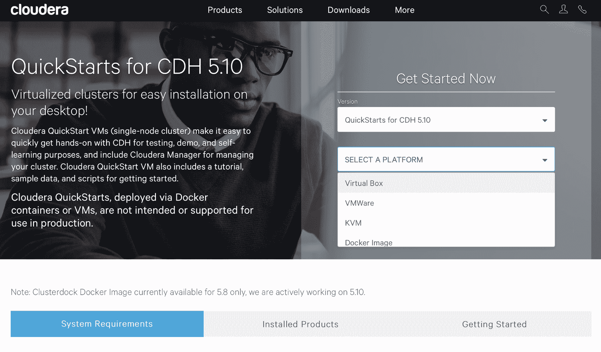
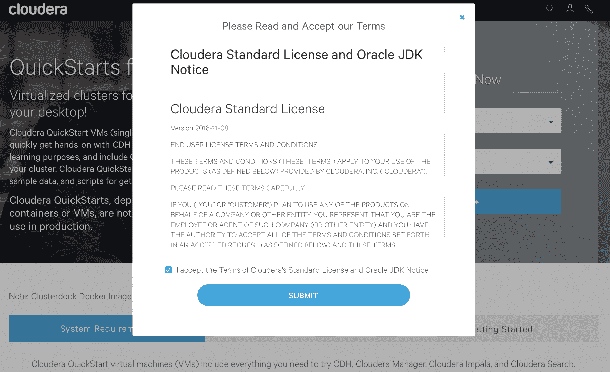
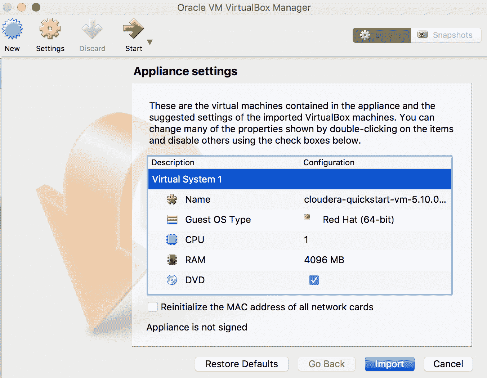
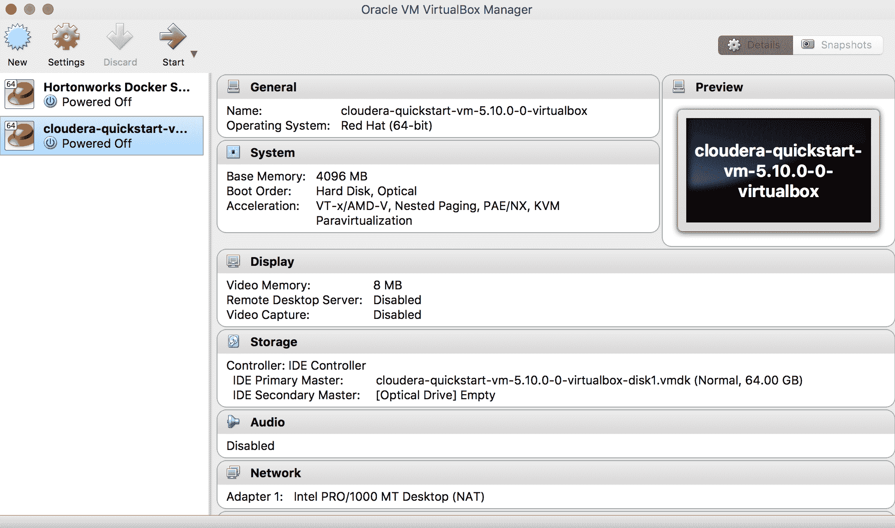
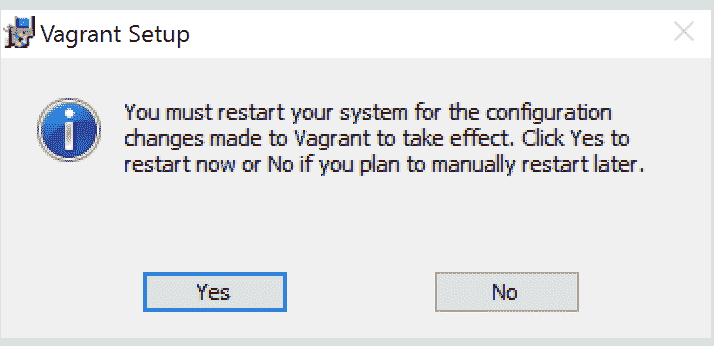
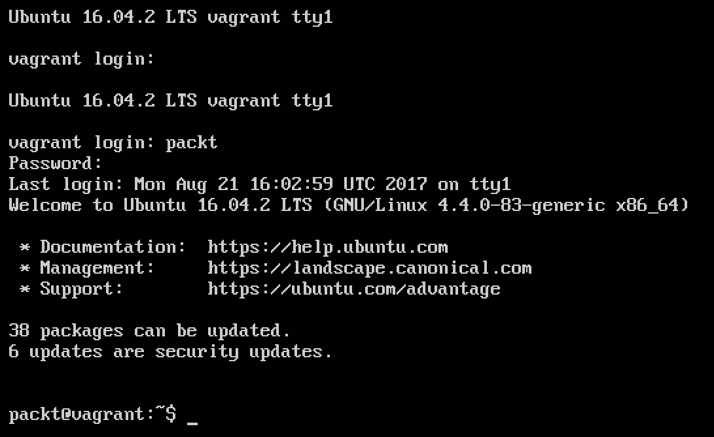
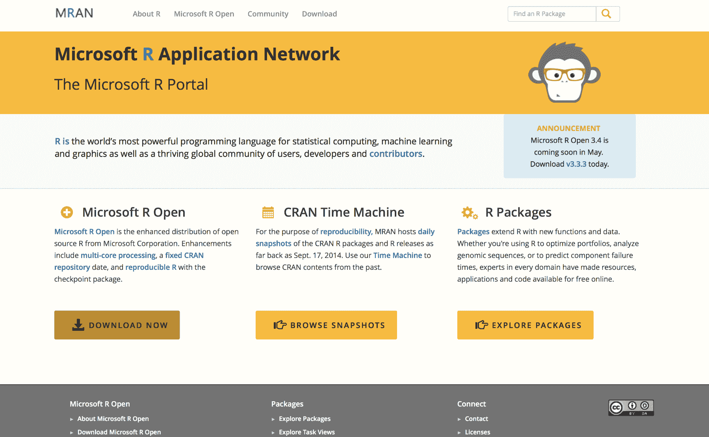
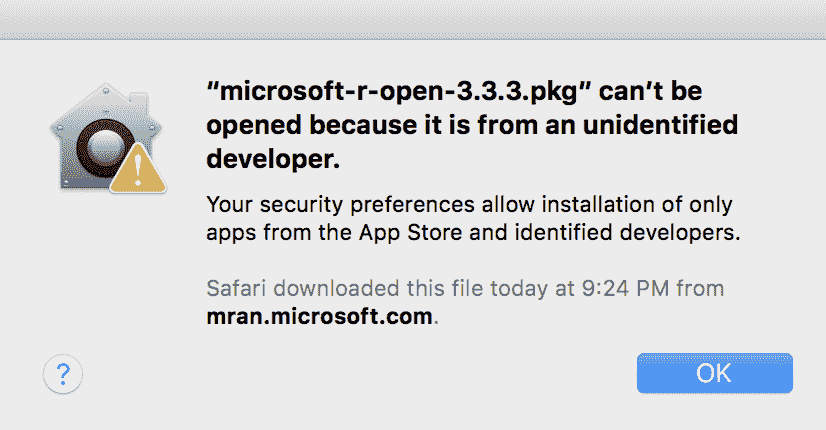
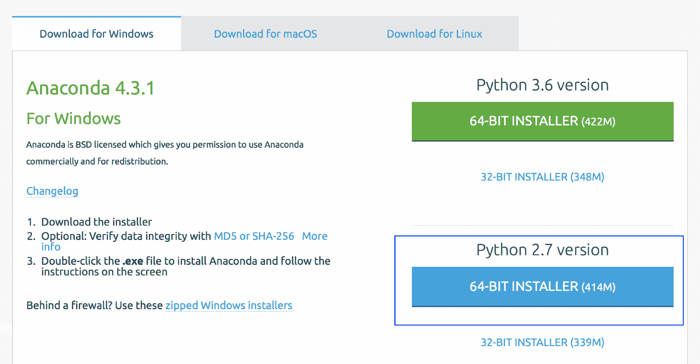
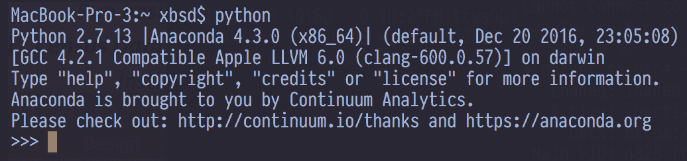

# 三、分析工具包

目前有几个平台可用于大规模数据分析。 从广义上讲，这些平台分为主要用于数据挖掘的平台(例如使用 NoSQL 平台分析大型数据集)和用于数据科学(即机器学习和预测分析)的平台。 通常情况下，解决方案可能同时具有以下两个特征：用于存储和管理数据的强大的底层平台，以及基于这些平台构建的解决方案，这些解决方案在数据科学方面提供了额外的功能。

在本章中，我们将向您展示如何安装和配置您的分析工具包，这是一组我们将在其余章节中使用的软件：

*   分析工具包的组件
*   系统建议
    *   在笔记本电脑或工作站上安装
    *   在云上安装
*   安装 Hadoop
    *   Hadoop 发行版
    *   Hadoop 的 Cloudera 分布(CDH)
*   安装 Spark
*   安装 R 和 Python

# 分析工具包的组件

本书将利用用于大数据挖掘和更广泛的数据科学的几项关键技术。 我们的分析工具包由 Hadoop 和 Spark 组成，既可以安装在用户的本地机器上，也可以安装在云上；它还有 R 和 Python，两者都可以安装在用户的机器上，也可以安装在云平台上。 您的分析工具包将包括：

| **软件/平台** | **用于数据挖掘** | **用于机器学习** |
| Hadoop | 英语字母表中第二十四个字母 / X 记号 / 成人电影 / 未知数 |  |
| 斯巴克 （人名） | 英语字母表中第二十四个字母 / X 记号 / 成人电影 / 未知数 | 英语字母表中第二十四个字母 / X 记号 / 成人电影 / 未知数 |
| 再说一遍。 | 英语字母表中第二十四个字母 / X 记号 / 成人电影 / 未知数 |  |
| MongoDB | 英语字母表中第二十四个字母 / X 记号 / 成人电影 / 未知数 |  |
| 开源 R | 英语字母表中第二十四个字母 / X 记号 / 成人电影 / 未知数 | 英语字母表中第二十四个字母 / X 记号 / 成人电影 / 未知数 |
| 蟒蛇(蟒蛇) | 英语字母表中第二十四个字母 / X 记号 / 成人电影 / 未知数 | 英语字母表中第二十四个字母 / X 记号 / 成人电影 / 未知数 |
| Vowpal Wabbit |  | 英语字母表中第二十四个字母 / X 记号 / 成人电影 / 未知数 |
| LIBSVM、LIBLINEAR |  | 英语字母表中第二十四个字母 / X 记号 / 成人电影 / 未知数 |
| 水 |  | 英语字母表中第二十四个字母 / X 记号 / 成人电影 / 未知数 |

# 系统建议

如果您要在本地计算机上安装 Hadoop，建议您的系统至少有 4-8 GB 的 RAM(内存)和至少 50 GB 的足够空闲磁盘空间。 理想情况下，对于大多数应用来说，8 GB 或更大的内存就足够了。 低于此值时，性能会较低，但不会妨碍用户进行练习。 请注意，这些数字是适用于本书中概述的练习的估计值。 生产环境自然会有更高的要求，这将在后面讨论。

安装分析软件，特别是 Hadoop 等平台，在技术复杂性方面可能相当具有挑战性，用户经常会遇到需要费力解决的错误。 用户尝试解决错误和修复安装问题的时间比理想情况下更多。 使用**个虚拟机**(**个虚拟机**)或最近的容器(如 Docker)可以很容易地减少这种额外开销。 对于更简单的平台，如 R 和 Python，我们将使用预装了各种库的开放源码版本。

# 在笔记本电脑或工作站上安装

本书中的练习可以在任何 Windows、MacOS 或 Linux 计算机上执行。 用户需要甲骨文 VirtualBox(可以从[https://www.virtualbox.org/wiki/Downloads](https://www.virtualbox.org/wiki/Downloads)安装)才能开始安装分析工具包所需的软件。

# 在云上安装

在您的物理硬件上安装软件的另一种方法是使用基于云的服务。 云服务，如 AWS(亚马逊网络服务)和微软的 Azure，提供了一个极其灵活和通用的环境，可以按需配置服务器，每小时的使用成本在几美分到几美元之间。 虽然云安装超出了本书的范围，但创建一个免费的 AWS 帐户并使用该帐户安装本书中讨论的不同分析软件是非常简单的。 请注意，如果您使用的是 AWS/Azure 或任何其他云服务，则需要使用 Cloudera Hadoop 发行版的 Docker 版本。

# 安装 Hadoop

有几种方法可以安装 Hadoop。 最常见的有：

1.  从[https://hadoop.apache.org](https://hadoop.apache.org)的源文件安装 Hadoop
2.  使用 Cloudera 和 Hortonworks 等商业供应商的开源发行版进行安装

在本练习中，我们将安装 Apache Hadoop(**CDH**)的**Cloudera 发行版，这是一个由几个 Hadoop 和 Apache 相关产品组成的集成平台。 Cloudera 是一个流行的商业 Hadoop 供应商，除了它自己发布的 Hadoop 之外，还为企业级 Hadoop 部署提供托管服务。 在我们的示例中，我们将在 VM 环境中安装 HDP 沙箱。**

# 安装 Oracle VirtualBox

VM 环境实质上是可能预装了软件的现有操作系统的副本。 虚拟机可以在单个文件中交付，这样用户只需启动一个文件即可复制整个计算机，而无需重新安装操作系统并将其配置为模拟另一个系统。 虚拟机在独立的环境中运行；也就是说，它不依赖于主机操作系统来提供其功能。

要安装 CDH Quickstart VM，我们将使用 Oracle VirtualBox，它用于从 VM 文件启动 VM。

在 VirtualBox 中安装专用宿主机的步骤：

1.  从[https://www.virtualbox.org/wiki/Downloads](https://www.virtualbox.org/wiki/Downloads)下载与您的系统(Windows、MacOS 或 Linux)相关的 Oracle VirtualBox(如果此链接不可访问，请转到[https://www.virtualbox.org/](https://www.virtualbox.org/)并选择适当的链接以转到**下载**页面)。
2.  双击 Oracle VirtualBox 可执行文件并按照屏幕上的提示进行安装(您可以接受屏幕上显示的默认值)。
3.  安装 VirtualBox 之后，还应该安装[http://www.oracle.com/technetwork/server-storage/virtualbox/downloads/index.html#extpack](http://www.oracle.com/technetwork/server-storage/virtualbox/downloads/index.html#extpack)提供的**OracleVM VirtualBox 扩展包**。

下载与您的环境相关的扩展包文件，然后单击/双击该文件。 这将打开 Oracle VM VirtualBox 应用，并在 VirtualBox 环境中安装扩展包。

**下载并安装 CDH QuickStart VM**：QuickStart VM 或 Docker Image for CDH 可从 Cloudera 网站下载。 具体步骤如下：

4.  转到[https://www.cloudera.com](https://www.cloudera.com)，然后从页面顶部的**下载**菜单中单击快速入门虚拟机。 如果导航已更改，在 Google 上搜索 Cloudera Quickstart VM 通常会直接进入 Cloudera 下载页面：


QuickStart VM Link on the Cloudera homepage

5.  这将打开 CDH 快速入门下载页面。 在 Select A Platform 菜单中，选择**VirtualBox**。 填写出现的表格，然后单击继续。 下载的文件将具有`.zip`扩展名。 解压缩文件以解压缩`.ova or .ovf`文件：



Selecting Virtualbox on the Cloudera Quickstart download options

我们会看到以下登录屏幕：


CDH Sign-up Screen

条款和条件首先列明：



CDH License Terms Acceptance

CDH 的虚拟机下载启动：


The CDH VM is more than 5 GB and can take a while to download

解压缩该文件。 该文件夹将包含如下图所示的文件：


Unzip downloaded file if it is in Zip format The download file is more than 5 GB and will take a bit of time depending on your Internet connection speed

6.  下载完成后，双击`.ova or .ovf`文件，它将在 Oracle VirtualBox 中打开：



Selecting options for the VM in Virtualbox You can also open the file manually by launching Oracle VirtualBox, going to File | Import Appliance, and selecting the `.ova/.ovf` file you downloaded as the appliance to import.

将所有选项保留为默认选项，然后单击 Import 按钮，这将启动导入过程。 在此阶段，Cloudera CDH Quickstart VM 正在加载到您的 Oracle VirtualBox 环境中。

7.  导入文件后，您可以通过单击窗口顶部的绿色箭头来启动该文件：



Oracle Virtualbox with CDH VM loaded

8.  操作系统初始化时保留默认设置：


CDH Main OS page

作为安装的最后一步，我们会看到以下屏幕：


CDH Webpage to administer Hadoop and other CDH Components

使用 Hortonworks Data 平台的 Hadoop 环境安装到此结束。

# 在其他环境中安装专用宿主机

CDH QuickStart 虚拟机也可以使用 VMWare、Docker 和云平台安装。 有关这方面的说明，请访问以下页面中提供的链接。

# 安装包数据科学盒

我们还为书中的一些练习创建了单独的虚拟机。

从[https://gitlab.com/packt_public/vm](https://gitlab.com/packt_public/vm)下载 Packt Data Science 虚拟机流浪者文件。

要加载 VM，首先从[https://www.vagrantup.com/downloads.html](https://www.vagrantup.com/downloads.html)下载**流浪者**。


Download page for Vagrant

下载完成后，通过运行下载的 Vagant 安装文件安装**Vagrant**。 安装完成后，您将得到重新启动计算机的提示。 重新启动系统，然后继续下一步加载流浪文件：


Completing the Vagrant Installation

单击最后一步中的确认以重新启动：



Restarting System

在终端或命令提示符下，转到下载 Packt Data Science Vagant 文件的目录，然后运行以下命令(如 Windows 中所示)：

```py
$ vagrant box add packtdatascience packtdatascience.box ==> box: Box file was not detected as metadata. Adding it directly... 

==> box: Adding box 'packtdatascience' (v0) for provider: 

box: Unpacking necessary files from: file://C:/Users/packt/Downloads/packt_public_vm/packtdatascience.box 

box: Progress: 100% (Rate: 435M/s, Estimated time remaining: --:--:--) 

==> box: Successfully added box 'packtdatascience' (v0) for 'virtualbox'! $ vagrant box list packtdatascience (virtualbox, 0) 

C:UsersNataraj DasguptaDownloadspackt_public_vm>vagrant up 

Bringing machine 'default' up with 'virtualbox' provider... 

==> default: Importing base box 'packtdatascience'... 

==> default: Matching MAC address for NAT networking... 

==> default: Setting the name of the VM: packt_public_vm_default_1513453154192_57570 

==> default: Clearing any previously set network interfaces... 

==> default: Preparing network interfaces based on configuration... 

    default: Adapter 1: nat 

==> default: Forwarding ports... 

    default: 22 (guest) => 2222 (host) (adapter 1) 

==> default: Booting VM...
 ...  
```

如果一切正常，您应该会在 Oracle VirtualBox 中看到一个新条目：


Oracle Virtualbox with Packt Data Science VM

双击该框的名称以启动(并测试)它。 以`packt/packt`身份使用 ID/密码登录：



Login screen on Packt VM

# 安装 Spark

CDH Quickstart VM 包含 Spark 作为组件之一，因此不需要单独安装 Spark。 我们将在专门讨论这一主题的章节中讨论更多关于 Spark 的内容。

此外，我们关于 Spark 的教程将使用可从[https://community.cloud.databricks.com/](https://community.cloud.databricks.com/)访问的 Databricks Community Edition。 有关创建帐户和执行必要步骤的说明，请参阅[第 6 章](06.html)和*Spark for Big Data Analytics*。

# 安装 R

R 是一种统计语言，在过去的 3-5 年里变得非常流行，特别是作为一个可用于各种用例的平台，从简单的数据挖掘到复杂的机器学习算法。 根据 2016 年年中发表在 IEEE Spectrum 上的一篇文章，R 在全球十大语言中排名第五。

开源 R 可以通过位于[https://www.r-project.org](https://cran.r-project.org/mirrors.html)的 CRAN 站点从[https://cran.r-project.org/mirrors.html](https://www.r-project.org)下载。

或者，您也可以从 Microsoft R 打开页面[https://mran.microsoft.com/rro/](https://mran.microsoft.com/rro/)下载 R。 它早先被称为 Revsion R Open，它是 Revsion Analytics 发布的开放源码 R 的增强版本。 在微软于 2015 年收购革命分析公司后，该公司在新的所有权下更名。

Microsoft R Open 包括 R 的所有功能，但也包括以下功能：

*   大量默认安装的 R 包，以及 Microsoft Corporation 发布的一组专用包，它们补充了开源 R 的现有功能
*   R 中用于多线程计算的多线程数学库
*   已修复的名为 mran 的 cran 存储库。 CRAN，即全面 R 档案网络，是一个包含 R 二进制文件、包和相关内容的站点集合。 CRAN 上的软件包可以持续更新。 MRAN 拍摄固定的 cran 快照，该快照在下一版本之前保持不变，因此允许重现性和一致性。

# 下载和安装 Microsoft R Open 的步骤

我们按以下步骤进行：

1.  转到[https://mran.microsoft.com](https://mran.microsoft.com)并单击**Download Now**按钮：



Microsoft Open R Homepage

2.  选择适合您的系统(Windows、MacOS 或 Linux)的发行版：


Microsoft Open R Versions

3.  下载完成后，双击下载的文件以安装**Microsoft R Open。**

4.  请注意，在 MacOS 上，您可能会收到如下错误消息：



OS X message (bypass using method below)

5.  如果发生这种情况，请右键单击下载的文件，然后从弹出的菜单中选择 Open。 这将允许您手动打开该文件并安装：


Bypassing OS X Message shown earlier

6.  安装后，双击**Microsoft R Open**启动应用：


Microsoft R Console

# 安装 RStudio

RStudio 是[rstudio.org](http://rstudio.org)发布的应用，提供了功能强大、功能丰富的图形化**IDE**(**集成开发环境**)。

以下是安装 RStudio 的步骤：

1.  转到[https://www.rstudio.com/products/rstudio/download](https://www.rstudio.com/products/rstudio/download/)：


R Studio Versions

2.  单击与您的操作系统相关的链接，下载并安装相应的文件：


Downloading RStudio

3.  请注意，在 MacOS 上，您只需将下载的文件移动到 Applications 文件夹即可。 在 Windows 和 Linux 操作系统上，双击下载的文件，完成文件安装步骤：


RStudio on the Mac (copy to Applications folder)

# 安装 Python

我们按如下方式进行安装：

1.  与 R 类似，Python 也因其多才多艺的软件包而广受欢迎。 Python 通常作为大多数基于 Linux 的现代操作系统的一部分提供。 在我们的练习中，我们将使用 Continuum Analytics®的 Anaconda，它通过许多与数据挖掘和机器学习相关的软件包(作为平台的一部分本地安装)增强了基本的开源 Python 产品。 这减轻了从业者手动下载和安装软件包的需要。 从这个意义上说，它在概念上类似于 Microsoft R Open。 正如 Microsoft R 通过附加功能增强了基础开源 R 产品一样，蟒蛇也在基础开源 Python 产品的基础上进行了改进，以提供新的功能。

2.  安装蟒蛇的步骤
3.  转到[https://www.continuum.io/downloads](https://www.continuum.io/downloads)：


Python Anaconda Homepage

4.  下载适合您的系统的发行版。 请注意，我们将下载 PythonV2.7(而不是 3.x 版本)：



Selecting the Python Anaconda Installer

5.  安装完成后，您应该能够转到终端窗口(或 Windows 中的命令窗口)并键入 Python，这将启动 Anaconda：



Launching Python Anaconda in the console

安装 Hadoop(CDH)、Spark、R 和 Python 的过程到此结束。 在后面的章节中，我们将进一步详细研究这些平台。

# 简略的 / 概括的 / 简易判罪的 / 简易的

本章介绍了一些用于数据科学的关键工具。 特别是，它演示了如何下载和安装 Hadoop(CDH)、Spark、R、RStudio 和 Python 的 Cloudera 发行版的虚拟机。 尽管用户可以下载 Hadoop 的源代码并将其安装在比如 Unix 系统上，但它通常充满了问题，需要进行大量的调试。 相反，使用 VM 允许用户以最小的努力开始使用和学习 Hadoop，因为它是一个完整的预配置环境。

此外，R 和 Python 是机器学习和一般分析中最常用的两种语言。 它们适用于所有流行的操作系统。 虽然它们可以安装在 VM 中，但如果可行，鼓励用户尝试将其安装在本地计算机(笔记本电脑/工作站)上，因为这样会有相对较高的性能。

在下一章中，我们将更深入地研究 Hadoop 及其核心组件和概念的细节。