# 四、使用 Hadoop 的大数据

Hadoop 已经成为大数据世界事实上的标准，特别是在过去的三四年里。 Hadoop 始于 2006 年，是 Apache Nutch 的一个子项目，引入了与分布式文件系统和分布式计算(也称为 MapReduce)相关的两个关键特性，这两个特性在开源社区中迅速流行起来。 今天，利用 Hadoop 的核心特性开发了数以千计的新产品，它已经发展成为一个由 150 多种相关主要产品组成的巨大生态系统。 可以说，Hadoop 是开启大数据和分析行业的主要催化剂之一。

在本章中，我们将讨论 Hadoop 的背景和核心概念，Hadoop 平台的组件，并深入研究 Hadoop 生态系统中的主要产品。 我们将学习分布式文件系统、分布式处理和优化的核心概念，以提高 Hadoop 部署的性能。 我们将使用 Hadoop 的**Cloudera 发行版**(**CDH**)来结束实际操作练习。 我们将讨论的主题包括：

*   Hadoop 基础知识
*   Hadoop 的核心组件
*   Hadoop 1 和 Hadoop 2
*   Hadoop 分布式文件系统
*   利用 MapReduce 实现分布式计算原理
*   Hadoop 生态系统
*   Hadoop 生态系统概述
*   蜂窝、HBase 等
*   Hadoop 企业部署
*   内部部署
*   云部署
*   Cloudera Hadoop 实际操作
*   使用 HDFS
*   使用蜂窝
*   使用字数计数的 MapReduce

# Hadoop 基础知识

2006 年，Hadoop 的创始人 Doug Cutting 在雅虎工作。 他积极参与了一个名为 Nutch 的开源项目，该项目涉及大规模网络爬虫的开发。 高级别的网络爬虫本质上是通常以自动方式浏览和索引互联网上的网页的软件。 直观地说，这涉及到对大量数据的高效管理和计算。 2006 年 1 月下旬，Doug 正式宣布 Hadoop 启动。 请求的第一行，仍然可以在互联网上找到[https://issues.apache.org/jira/browse/INFRA-700，](https://issues.apache.org/jira/browse/INFRA-700)是*Lucene PMC 已经投票决定将 Nutch 的一部分拆分成一个新的子项目，名为 Hadoop*。 于是，Hadoop 诞生了。

一开始，Hadoop 有两个核心组件：**Hadoop 分布式文件系统**(**HDFS**)和 MapReduce。 这是 Hadoop 的第一次迭代，现在也称为 Hadoop 1。后来，在 2012 年，添加了第三个组件，称为**纱线**(**又一个资源协商者**)，它分离了资源管理和作业调度过程。 在我们更详细地研究核心组件之前，了解 Hadoop 的基本前提会有所帮助：


Doug Cutting 在[Hadoop](https://issues.apache.org/jira/browse/NUTCH-193)的帖子中宣布，他打算将**https://issues.apache.org/jira/browse/NUTCH-193 Distributed FS**(**NDFS**)和 MapReduce 分离到一个名为 Hadoop 的新子项目中。

# Hadoop 的基本前提

Hadoop 的基本前提是，不是尝试在单个大型计算机上执行任务，而是可以将任务细分为更小的部分，然后可以将这些部分委托给多台较小的计算机。 然后，这些所谓的较小机器将对它们自己的数据部分执行任务。 一旦较小的机器完成其任务以产生分配给它们的任务的结果，单个结果单位随后将被聚合以产生最终结果。

尽管从理论上讲，这可能看起来相对简单，但有各种技术考虑因素需要牢记。 例如：

*   网络速度是否足以从每台单独的服务器收集结果？
*   每台单独的服务器能够足够快地从磁盘读取数据吗？
*   如果一台或多台服务器出现故障，我们是否必须重新开始？
*   如果有多个大型任务，应该如何确定它们的优先顺序？

在使用这种性质的分布式体系结构时，需要考虑的事项还有很多。

# Hadoop 的核心模块

Hadoop 的核心模块包括：

*   **Hadoop Common**：Hadoop 所需的库和其他通用助手实用程序
*   **HDFS**：存储数据的分布式、高可用性、容错文件系统
*   **Hadoop MapReduce**：涉及跨商用服务器(或节点)的分布式计算的编程范例
*   **Hadoop 纱线**：作业调度和资源管理框架

在这些核心组件中，纱线是在 2012 年引入的，目的是解决 Hadoop 第一版的一些缺点。 Hadoop 的第一个版本(或者相当于 Hadoop 的第一个模型)使用 HDFS 和 MapReduce 作为其主要组件。 随着 Hadoop 变得越来越流行，除了 MapReduce 提供的功能之外，使用其他功能的需求也变得越来越重要。 这一点，加上其他一些技术上的考虑，导致了纱线的发展。

现在让我们看一下前面详细说明的 Hadoop 的显著特征。

# Hadoop 分布式文件系统-HDFS

HDFS 构成了所有 Hadoop 安装的基础。 文件或更一般的数据存储在 HDFS 中，并由 Hadoop 的节点访问。

HDFS 执行两个主要功能：

*   **Namespaces**：提供保存集群元数据(即 Hadoop 集群中数据的位置)的名称空间
*   **数据存储**：用作 Hadoop 集群中使用的数据的存储

文件系统被称为分布式，因为数据在多个服务器上以块形式存储。 通过一个简单的示例可以直观地了解 HDFS，如下所示。 考虑一本由 A-Z 章组成的大型书籍。在普通文件系统中，整本书将作为单个文件存储在磁盘上。 在 HDFS 中，这本书会被分成更小的块，比如 A-H 章的一块，I-P 的一块，Q-Z 的第三块。然后这些块被存放在单独的架子上(或者类似的书架)。 此外，这些章节被复制三次，使得每个章节有三个副本。

此外，假设整本书的大小为 1 GB，每章大小约为 350MB：

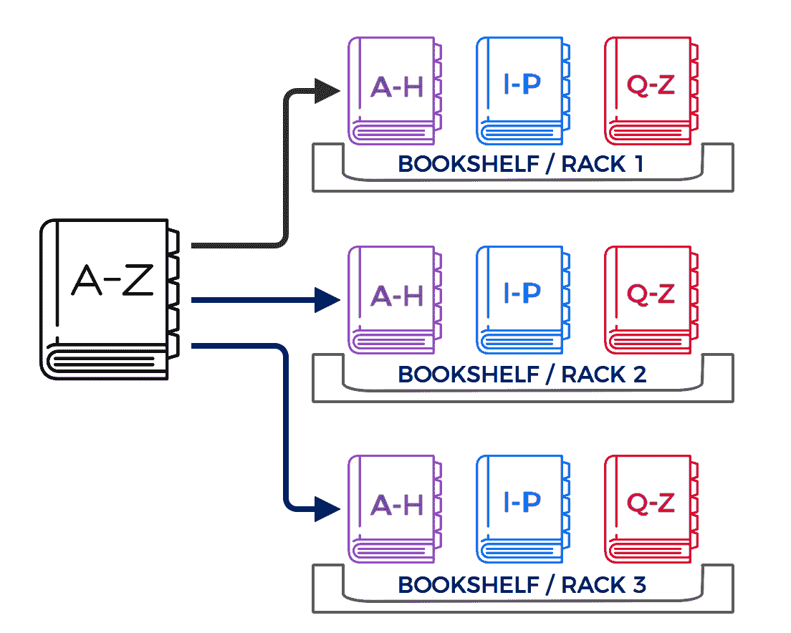

A bookshelf analogy for HDFS

以这种方式存储图书可以实现以下几个重要目标：

*   由于这本书被一组章节分成了三个部分，并且每个部分都被复制了三次，这意味着我们的流程可以通过从不同的服务器查询这些部分来并行阅读这本书。 这减少了 I/O 争用，是正确使用并行性的一个非常好的例子。
*   如果任何一个机架不可用，我们可以从任何其他机架检索章节，因为每个章节在不同的机架上都有多个副本。
*   如果分配给我的任务只要求我访问单个章节，例如 B 章，我只需要访问 A-H 章对应的文件。 由于与 A-H 章相对应的文件大小是整本书大小的三分之一，因此访问和读取该文件的时间将会短得多。
*   其他好处，如对不同章节组的选择性访问权限等，也可以使用这种模型。

这可能是对实际 HDFS 功能的过于简单化的类比，但它传达了该技术的基本原理-大型文件被细分为块(块)，并在高可用性冗余配置中分布在多个服务器上。 现在，我们将更详细地查看实际的 HDFS 体系结构：

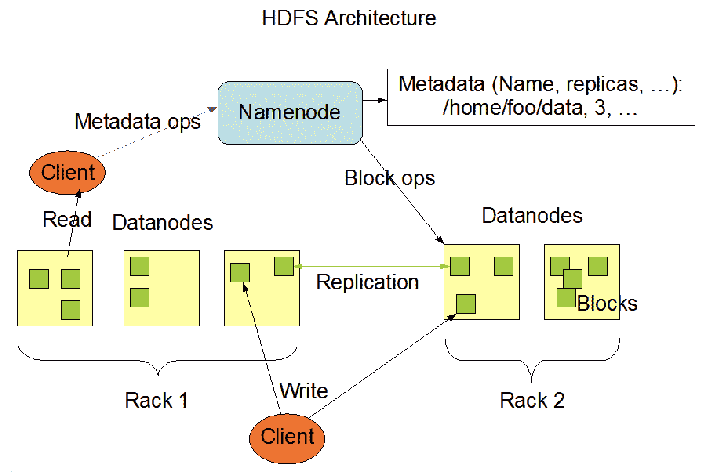

Hadoop 的 HDFS 后端包括：

*   **NameNode**：可以将其视为主节点。 NameNode 包含集群元数据，并知道哪些数据存储在哪个位置-简而言之，它保存名称空间。 它将整个命名空间存储在 RAM 中，并在请求到达时提供有关哪些服务器保存任务所需数据的信息。 在 Hadoop2 中，可以有多个 NameNode。 可以创建辅助 NameNode 作为主节点的辅助节点。 因此，它不是备份 NameNode，而是帮助保持群集元数据最新的 NameNode。
*   **DataNode**：DataNode 是独立的服务器，负责存储数据块并在收到新请求时执行计算操作。 这些服务器主要是商用服务器，在资源和容量方面不如存储集群元数据的 NameNode。

# HDFS 中的数据存储过程

以下几点应该能让您对数据存储过程有一个很好的了解：

HDFS 中的所有数据都是以块为单位写入的，通常大小为 128MB。 因此，例如大小为 512MB 的单个文件将被分成四个块(4*128MB)。 然后将这些块写入 DataNode。 为保持冗余和高可用性，复制每个数据块以创建重复拷贝。 通常，Hadoop 安装的复制系数为 3，表示每个数据块被复制三次。

这保证了冗余性，以便在其中一台服务器发生故障或停止响应的情况下，始终有第二个甚至第三个副本可用。 为确保此过程无缝运行，DataNode 将副本放置在独立的服务器中，还可以确保将数据块放置在数据中心不同机架的服务器上。 这是因为即使所有副本位于独立服务器上，但所有服务器位于同一机架上，机架电源故障也意味着没有副本可用。

将数据写入 HDFS 的一般流程如下：

1.  NameNode 接收将新文件写入 HDFS 的请求。
2.  由于数据必须以块或块的形式写入，因此 HDFS 客户端(发出请求的实体)开始将数据缓存到本地缓冲区中，一旦缓冲区达到分配的块大小(例如，128MB)，它将通知 NameNode 它已准备好写入第一个数据块(块)。
3.  NameNode 根据其可获得的有关 HDFS 群集状态的信息，使用有关需要存储数据块的目标 DataNode 的信息进行响应。
4.  HDFS 客户端将数据写入目标 DataNode，并在数据块的写入过程完成后通知 NameNode。
5.  随后，目标 DataNode 开始将其数据块的副本复制到第二个 DataNode，该第二个 DataNode 将充当当前块的副本。

6.  一旦第二个 DataNode 完成写入过程，它就会将数据块发送到第三个 DataNode。
7.  重复此过程，直到跨不同节点复制与数据(或相当于文件)对应的所有块。

请注意，块的数量将取决于文件大小。 下图显示了数据在 5 个数据节点上的分布情况。


Master Node and Data Nodes

Hadoop 第一版(也称为 Hadoop 1)中的 HDFS 体系结构具有以下特征：

*   单个 NameNode：只有一个 NameNode 可用，因此它还充当单点故障，因为它存储了所有的集群元数据。
*   存储数据块、处理客户端请求以及对块执行 I/O 操作(创建、读取、删除等)的多个 DataNode。
*   Hadoop 第二版中的 HDFS 体系结构(也称为 Hadoop 2)提供了原始 HDFS 设计的所有优点，还添加了一些新功能，最值得注意的是，能够拥有多个可以充当主 NameNode 和辅助 NameNode 的 NameNode。 其他功能包括具有多个命名空间的功能以及 HDFS 联合。
*   HDFS 联盟特别值得一提的是。 下面摘自[http://hadoop.apache.org](http://hadoop.apache.org)以非常精确的方式解释了这个主题：

The NameNodes are federated; the NameNodes are independent and do not require coordination with each other. The DataNodes are used as common storage for blocks by all the NameNodes. Each DataNode registers with all the NameNodes in the cluster. DataNodes send periodic heartbeats and block reports.

辅助 NameNode 不是备份节点，因为在 NameNode 不可用的情况下，它不能执行与 NameNode 相同的任务。 但是，它通过执行内务操作使 NameNode 重启过程更加高效。

These operations (such as merging HDFS snapshot data with information on data changes) are generally performed by the NameNode when it is restarted and can take a long time depending on the amount of changes since the last restart. The secondary NameNode can, however, perform these housekeeping operations whilst the primary NameNode is still in operation, such that in the event of a restart the primary NameNode can recover much faster. Since the secondary NameNode essentially performs a checkpoint on the HDFS data at periodic intervals, it is also known as the checkpoint node.

# Hadoop MapReduce

MapReduce 是 Hadoop 的开创性特性之一，可以说它是使其声名鹊起的最重要的特性之一。 MapReduce 的工作原理是将较大的任务划分为较小的子任务。 可以使用一组较小的机器来完成较小的子任务，而不是委托一台机器来计算大型任务。 通过以这种方式分配工作，与使用单机架构相比，可以更高效地完成任务。

这与我们在日常生活中完成工作的方式没有什么不同。 举个例子将有助于使这一点更清楚。

# MapReduce 的直观介绍

让我们以一个由 CEO、董事和经理组成的假想组织为例。 首席执行官想知道有多少新员工加入了公司。 首席执行官向他或她的董事发送请求，要求其报告其部门的招聘人数。 董事们依次向各自部门的经理发出请求，要求他们提供新员工的数量。 经理将数字提供给董事，董事随后将最终值返回给 CEO。

这可以被认为是 MapReduce 的一个真实例子。 在这个类比中，任务是找出新员工的数量。 首席执行官不是自己收集所有数据，而是将其委托给董事和经理，他们提供了自己的部门编号，如下图所示：


The Concept of MapReduce

在这个相当简单的场景中，将一个大任务(在整个公司中寻找新员工)拆分成较小的任务(每个团队中都有新员工)，然后最终重新聚合各个数字的过程类似于 MapReduce 的工作方式。

# 对 MapReduce 的技术理解

顾名思义，MapReduce 有一个映射阶段和一个减少阶段。 映射阶段通常是应用于其输入的每个元素的函数，从而修改其原始值。

MapReduce 生成键-值对作为输出。

**Key-value:** A key-value pair establishes a relationship. For example, if John is 20 years old, a simple key-value pair could be (John, 20). In MapReduce, the map operation produces such key-value pairs that have an entity and the value assigned to the entity.

实际上，地图功能可能很复杂，并且涉及高级功能。

Reduce 阶段从 map 函数获取键值输入，并执行汇总操作。 例如，考虑包含学校不同年级学生年龄的地图操作的输出：

| **学生姓名** | **类别** | **年龄** |
| 约翰 （人名） | 1 级 | 7. |
| 马利亚 （人名） | 二年级 | 8 个 |
| 少女 / 情人 / 同 gill | 1 级 | 6. |
| 汤姆 | 3 年级 | 10 个 |
| 马克 / 标志 / 符号 / 分数 | 3 年级 | 9. |

我们可以创建一个简单的键-值对，例如 Class 和 Age 的值(它可以是任何值，但我只是以它们为例)。 在本例中，我们的键值对将是(年级 1，7)、(年级 2，8)、(年级 1，6)、(年级 3，10)和(年级 3，9)。

然后，可以将计算每个年级学生平均年龄的操作定义为 Reduce 操作。

更具体地说，我们可以对输出进行排序，然后将每个年级对应的元组发送到不同的服务器。

例如，服务器 A 将接收元组(等级 1，7)和(等级 1，6)，服务器 B 将接收元组(等级 2，8)，服务器 C 将接收元组(等级 3，10)和(等级 3，9)。 然后，每个服务器(A、B 和 C)将找到元组的平均值，并报告(1 级，6.5)、(2 级，8)和(3 级，9.5)。

注意到此过程中有一个中间步骤，该步骤涉及将输出发送到特定服务器，并对输出进行排序以确定应该将其发送到哪台服务器。 事实上，MapReduce 需要一个混洗和排序阶段，从而对键-值对进行排序，以便每个减法器接收一组固定的唯一键。

在该示例中，如果假设只有两个服务器而不是三个服务器，则可以将服务器 A 分配给计算对应于等级 1 和 2 的关键字的平均值，并且可以分配服务器 B 来计算等级 3 的平均值。

在 Hadoop 中，MapReduce 过程中会发生以下过程：

1.  客户端发送任务请求。
2.  NameNode 分配将执行映射操作的 DataNode(单个服务器)和将执行 Reduce 操作的 DataNode。 请注意，DataNode 服务器的选择取决于操作所需的数据是否为服务器的本地数据。 数据所在的服务器只能执行映射操作。
3.  DataNode 执行映射阶段并生成键-值(k，v)对。

当映射器生成(k，v)对时，它们将根据节点被分配到计算的*键*被发送到这些 Reduce 节点。 向服务器分配密钥取决于分区函数，该函数可以像密钥的散列值一样简单(这是 Hadoop 中的默认设置)。

一旦 Reduce 节点接收到与其负责计算的键相对应的数据集，它就会应用 Reduce 函数并生成最终输出。

Hadoop maximizes the benefits of data locality. Map operations are performed by servers that hold the data locally, that is, on disk. More precisely, the map phase will be executed only by those servers that hold the blocks corresponding to the file. By delegating multiple individual nodes to perform computations independently, the Hadoop architecture can perform very large-scale data processing effectively.

# 块大小和映射器和缩减器的数量

MapReduce 过程中的一个重要注意事项是了解 HDFS 块大小，即文件被拆分成的块的大小。 需要访问某个文件的 MapReduce 任务需要在表示该文件的每个块上执行映射操作。 例如，假设文件大小为 512 MB，块大小为 128 MB，则需要 4 个块来存储整个文件。 因此，MapReduce 操作至少需要四个映射任务，因此每个映射操作将应用于数据的每个子集(即，四个块中的每一个)。

但是，如果文件非常大，并且需要存储比方说 10,000 个块，这意味着我们将需要 10,000 个映射操作。 但是，如果我们只有 10 台服务器，那么我们必须向每台服务器发送 1000 个地图操作。 这可能不是最优的，因为它可能会由于每个映射的磁盘 I/O 操作和资源分配设置而导致较高的代价。

Hadoop Wiki([https://wiki.apache.org/hadoop/HowManyMapsAndReduces](https://wiki.apache.org/hadoop/HowManyMapsAndReduces))上非常优雅地总结了所需的减速器数量。

The ideal reducers should be the optimal value that gets them closest to:
* A multiple of the block size * A task time between 5 and 15 minutes * Creates the fewest files possible
Anything other than that means there is a good chance your reducers are less than great. There is a tremendous tendency for users to use a REALLY high value ("More parallelism means faster!") or a REALLY low value ("I don't want to blow my namespace quota!"). Both are equally dangerous, resulting in one or more of:
* Terrible performance on the next phase of the workflow * Terrible performance due to the shuffle * Terrible overall performance because you've overloaded the namenode with objects that are ultimately useless * Destroying disk IO for no really sane reason * Lots of network transfers due to dealing with crazy amounts of CFIF/MFIF work

# Hadoop 纱线

YAR 是 Hadoop 2 中引入的一个模块。在 Hadoop 1 中，管理和监视作业的过程由称为 JobTracker 和 TaskTracker 的进程执行。 运行 JobTracker 守护进程(进程)的 NameNode 将向运行 TaskTracker 守护进程(进程)的 DataNodes 提交作业。

JobTracker 负责协调所有 MapReduce 作业，并担任管理进程、处理服务器故障、重新分配到新 DataNode 等方面的中央管理员。 TaskTracker 监视 DataNode 中其自身实例的本地作业的执行情况，并向 JobTracker 提供有关状态的反馈，如下所示：

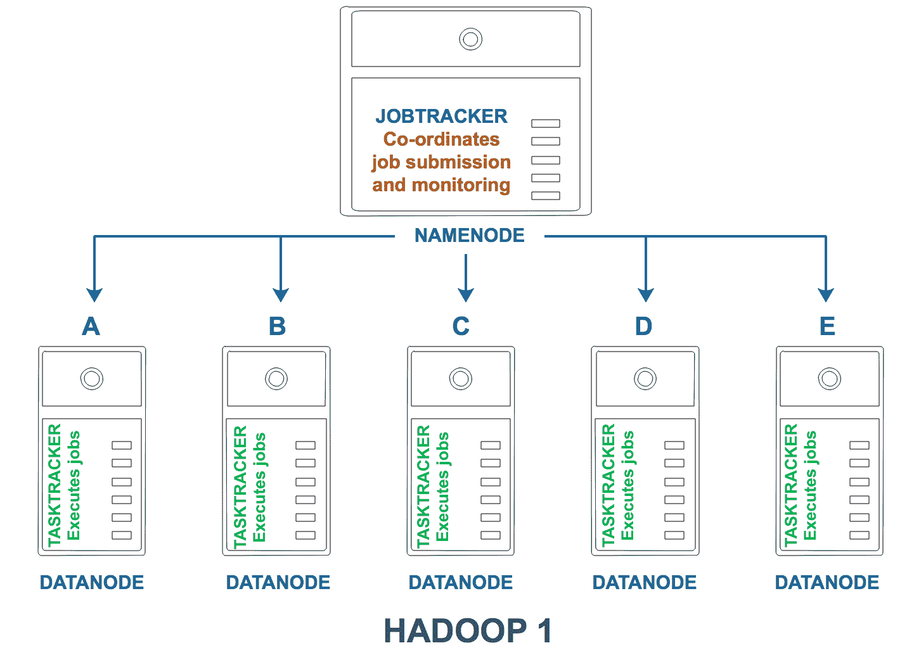

JobTracker and TaskTrackers

这种设计在很长一段时间内运行良好，但随着 Hadoop 的发展，对更复杂、更动态的功能的需求也成比例上升。 在 Hadoop1 中，NameNode 以及随后的 JobTracker 进程同时管理作业调度和资源监控。 如果 NameNode 出现故障，群集中的所有活动将立即停止。 最后，所有作业都必须用 MapReduce 术语表示-也就是说，所有代码都必须在 MapReduce 框架中编写才能执行。

Hadoop 2 缓解了所有这些担忧：

*   作业管理、调度和资源监视的流程被解耦，并委托给一个名为 YAIN 的新框架/模块
*   可以定义辅助 NameNode，该辅助 NameNode 将充当主 NameNode 的帮助器
*   此外，Hadoop2.0 将支持 MapReduce 以外的框架
*   Hadoop2 将利用容器，而不是固定的 map 和 Reduce 插槽

在 MapReduce 中，所有数据都必须从磁盘读取，这对于大型数据集的操作来说很好，但对于较小的数据集的操作来说并不是最优的。 事实上，任何需要非常快的处理(低延迟)、本质上是交互式的、或者有多次迭代(因此需要对同一数据从磁盘多次读取)的任务都会非常慢。

通过消除这些依赖关系，Hadoop 2 允许开发人员实现新的编程框架，以支持具有不同性能要求的作业，如低延迟和交互式实时查询、机器学习所需的迭代处理、不同拓扑(如流数据处理)、优化(如内存数据缓存/处理)等。

一些新术语变得突出起来：

*   **ApplicationMaster**：负责管理应用程序需要的资源。 例如，如果某个作业需要更多内存，ApplicationMaster 将负责保护所需资源。 此上下文中的应用程序指的是应用程序执行框架，如 MapReduce、Spark 等。
*   **容器**：资源分配的单位(例如，1 GB 内存和 4 个 CPU)。 一个应用程序可能需要几个这样的容器才能执行。 ResourceManager 为执行任务分配容器。 分配完成后，ApplicationMaster 请求 DataNodes 启动已分配的容器，并接管容器的管理。
*   **ResourceManager**：纱线的一个组件，其主要作用是将资源分配给应用程序，并充当 JobTracker 的替代品。 ResourceManager 进程与 JobTracker 一样在 NameNode 上运行。
*   **NodeManagers**：代替 TaskTracker，NodeManagers 负责向 ResourceManager(RM)报告作业状态并监控容器的资源利用率。

下图显示了 Hadoop 2.0 中 ResourceManager 和 NodeManager 的高级视图：


Hadoop 2.0 The prominent concepts inherent in Hadoop 2 have been illustrated in the next image:


Hadoop 2.0 Concepts

# 纱线中的作业调度

大型 Hadoop 集群同时运行多个作业的情况并不少见。 当有多个部门提交的多个作业时，资源分配成为一个重要且确实有趣的话题。 如果 A 和 B 两个部门同时提交一个作业，但每个请求都是为了获得最大可用资源，那么哪个请求应该获得优先级？ 通常，Hadoop 使用**先进先出**(**FIFO**)策略。 也就是说，谁最先提交作业，谁就可以最先使用资源。 但是，如果 A 首先提交了作业，但是完成 A 的作业需要 5 个小时，而 B 的作业将在 5 分钟内完成，那该怎么办呢？

为了处理作业调度中的这些细微差别和变量，已经实现了许多调度方法。 其中比较常用的三个是：

*   **FIFO**：如上所述，FIFO 调度使用队列来优先处理作业。 作业按照提交的顺序执行。
*   **CapacityScheduler**：CapacityScheduler 为每个部门可以提交的作业数量赋值，其中部门可以指示逻辑用户组。 这是为了确保每个部门或组都可以访问 Hadoop 群集，并且能够利用最少数量的资源。 如果服务器上有未使用的资源，计划程序还允许部门扩展到每个部门设置的最大值，超过其分配的容量。 因此，CapacityScheduler 模型提供了一个保证，即每个部门都可以在确定性的基础上访问集群。
*   **公平调度器**：这些调度器试图平衡不同应用程序之间的资源利用率。 虽然在某个给定时间点实现均衡可能不可行，但可以使用公平调度器来实现随时间分配的均衡，从而使平均值或多或少相似。

这些调度器和其他调度器提供细粒度的访问控制(例如基于每个用户或每个组)，并且主要利用队列来确定和分配资源的优先级。

# Hadoop 中的其他主题

Hadoop 的其他几个方面值得特别提及。 由于我们已经详细讨论了最重要的主题，因此本节提供了一些其他感兴趣的主题的概述。

# 编码

官方法规要求对各种类型的数据进行数据加密。 在美国，识别患者信息的数据必须符合 HIPAA 制定的规则，该规则规定了此类记录应该如何存储。 HDFS 中的数据可以在静止状态(在磁盘上)和/或在传输过程中加密。 用于解密数据的密钥通常由**密钥管理系统**(**KMSS**)管理。

# 用户身份验证

Hadoop 可以使用服务器的本地用户身份验证方法。 例如，在基于 Linux 的机器上，可以根据系统的`/etc/passwd`文件中定义的 ID 对用户进行身份验证。 换句话说，Hadoop 继承在服务器端设置的用户身份验证。

通过 Kerberos(一种跨平台身份验证协议)进行的用户身份验证也通常用于 Hadoop 集群。 Kerberos 的工作原理是票证的概念，票证根据需要临时授予用户特权。 可以使用 Kerberos 命令使票证失效，从而根据需要限制用户访问群集资源的权限。

请注意，即使用户被允许访问数据(用户身份验证)，由于另一个称为授权的功能，他或她仍然可以限制可以访问的数据。 该术语意味着，即使用户可以验证和登录到系统，用户也可能被限制为仅限于该用户被授权访问的数据。 此授权级别通常使用本地 HDFS 命令来更改指定用户的目录和文件所有权。

# Hadoop 数据存储格式

由于 Hadoop 涉及存储非常大规模的数据，因此必须选择适合您的使用情形的存储类型。 Hadoop 中有几种数据存储格式，最佳存储格式的选择取决于您对读/写 I/O 速度的要求、文件按需压缩和解压缩的程度以及拆分文件的难易程度(因为数据最终将存储为块)。

一些流行和常用的存储格式如下：

*   **text/csv**：这些是纯文本 CSV 文件，类似于 Excel 文件，但以纯文本格式保存。 由于 CSV 文件以行为单位包含记录，因此将文件拆分成数据块自然是微不足道的。
*   **avro**：avro 是为了提高跨异构系统的数据共享效率而开发的。 它使用数据序列化将模式和实际数据存储在单个压缩二进制文件中。 Avro 使用 JSON 存储数据的模式和二进制格式，并将它们序列化为单个 Avro 对象容器文件。 多种语言(如 Python、Scala、C/C++和其他语言)都有可以读取 Avro 文件的原生 API，因此，它非常可移植，非常适合跨平台数据交换。
*   **PARQUET**：PARQUE 是一种柱状数据存储格式。 这有助于提高性能，有时会通过允许按列存储和访问数据来显著提高性能。 直观地说，如果您正在处理一个有 100 列和 100 万行的 1 GB 文件，并且只想从 100 列中的一列查询数据，那么能够仅访问单个列将比必须访问整个文件效率更高。
*   **ORCFiles**：ORC 代表优化的行列。 从某种意义上说，它是对纯柱状格式(如拼花)的进一步优化。 ORC 文件不仅按列存储数据，还按行(也称为条带)存储数据。 因此，具有表格格式数据的文件可以被分成多个较小的条带，其中每个条带包括来自原始文件的行的子集。 通过以这种方式拆分数据，如果用户任务只需要访问数据的一小部分，则该过程可以询问保存数据的特定条带。
*   **SequenceFiles**：在 SequenceFiles 中，数据表示为键-值对，并以二进制序列化格式存储。 由于串行化，数据可以用紧凑的二进制格式表示，这不仅减小了数据大小，还改善了 I/O。Hadoop，更具体地说，HDFS，在存在多个小文件(如音频文件)时效率不高。 SequenceFiles 通过允许将多个小文件存储为单个单元或 SequenceFile 来解决此问题。 它们还非常适合于可拆分的并行操作，并且总体上对 MapReduce 作业是高效的。
*   **HDFS 快照：**HDFS 快照允许用户以只读模式保留给定时间点的数据。 用户可以在 HDFS 中创建快照(实质上是当时数据的副本)，以便在以后需要时进行检索。 这可确保在发生文件损坏或任何其他影响数据可用性的故障时可以恢复数据。 在这方面，它也可以被认为是一个后备。 快照位于创建它们的.snap 目录中。
*   **节点故障处理：**大型 Hadoop 群集可以包含数万个节点。 因此，在任何给定的一天都有可能出现服务器故障。 为了让 NameNode 知道集群中所有节点的状态，DataNode 会定期向 NameNode 发送心跳。 如果 NameNode 检测到某个服务器出现故障，即它已停止接收心跳信号，它会将该服务器标记为出现故障，并将该服务器本地的所有数据复制到一个新实例上。

# Hadoop 3 中预期的新功能

在撰写本书时，Hadoop3 正处于 Alpha 阶段。 有关 Hadoop3 中新变化的详细信息可以在互联网上找到。 例如，[http://hadoop.apache.org/docs/current/](http://hadoop.apache.org/docs/current/)提供有关体系结构新更改的最新信息。

# Hadoop 生态系统

本章的标题应该是“Apache生态系统”。 与本节将讨论的所有其他项目一样，Hadoop 也是一个 Apache 项目。 Apache 被松散地用作 Apache Software Foundation 支持的开放源码项目的缩写。 它最初起源于 90 年代初 Apache HTTP 服务器的开发，今天是一个协作性的全球倡议，完全由参与向全球技术社区发布开放源码软件的志愿者组成。

Hadoop 一开始是 Apache 生态系统中的一个项目，现在仍然是。 由于 Hadoop 很受欢迎，许多其他项目(也是 Apache 的一部分)已经直接或间接地链接到 Hadoop，因为它们支持 Hadoop 环境中的关键功能。 这就是说，重要的是要记住，在大多数情况下，这些项目可以作为独立的产品存在，它们可以在没有 Hadoop 环境的情况下运行。 它是否会提供最佳功能将是另一个话题。

在本节中，我们将回顾一些对 Hadoop 作为标准 IT 企业解决方案的增长和可用性产生了巨大影响和影响的 Apache 项目，如下图所示：

| **产品** | **功能** |
| Apache猪 | Apache Pig，也称为 Pig 拉丁语，是一种专门设计用于通过定义工作流的简明语句来表示 MapReduce 程序的语言。 用传统方法(比如用 Java)编写 MapReduce 程序可能相当复杂，而 Pig 通过使用简单的语义提供了一个简单的抽象来表达 MapReduce 工作流和复杂的**提取-转换-加载**(**ETL**)。 PIG 程序通过 Grunt shell 执行。 |
| Apache HBase | Apache HBase 是一个基于 HDFS 的面向列的分布式数据库。 它是以谷歌的 Bigtable 为蓝本的，数据以分栏的形式表示。 HBase 支持具有数十亿条记录的表之间的低延迟读写，非常适合需要直接随机访问数据的任务。 更具体地说，HBase 对数据进行三维索引-行、列和时间戳。 它还提供了一种表示具有任意数量的列的数据的方法，因为列值可以表示为 HBase 表的单元格内的键-值对。 |
| Apache蜂巢 | Apache Have 提供了一种类似 SQL 的方言来查询存储在 HDFS 中的数据。 配置单元在 HDFS 中以类似文件夹的结构将数据存储为序列化的二进制文件。 与传统数据库管理系统中的表类似，配置单元根据用户选择的属性以表格形式将数据存储在 HDFS 中。 因此，分区是更高级别目录或表的子文件夹。 存储桶概念提供了第三级抽象，它引用配置单元表分区中的文件。 |
| Apache Sqoop | Sqoop 用于将数据从传统数据库提取到 HDFS。 因此，将数据存储在关系数据库管理系统中的大型企业可以使用 Sqoop 将数据从其数据仓库传输到 Hadoop 实现。 |
| Apache水槽 | Flume 用于大规模日志数据的管理、聚合和分析。 |
| Apache | Kafka 是一个基于发布/订阅的中间件系统，可用于分析并随后实时持久化(在 HDFS 中)流数据。 |
| Apache Oozie | Oozie 是一个工作流管理系统，旨在调度 Hadoop 作业。 它实现了一个称为**有向非循环图**(**DAG**)的关键概念，这将在我们关于 Spark 的一节中讨论。 |
| ApacheSpark | Spark 是 Apache 中最重要的项目之一，旨在解决 HDFS-MapReduce 模型的一些缺点。 它最初是加州大学伯克利分校(UC Berkeley)的一个相对较小的项目，后来迅速发展成为使用 Hadoop 执行分析任务的最突出的替代方案之一。 Spark 已经在整个行业得到了广泛的采用，并由各种其他子项目组成，这些子项目提供了额外的功能，如机器学习、流媒体分析等。 |

# 与 CDH 的实际操作

在本节中，我们将利用 CDH QuickStart VM 完成本章中讨论的一些主题。 这些练习不一定要按时间顺序进行，也不依赖于任何其他练习的完成。

我们将完成本节中的以下练习：

*   使用 Hadoop MapReduce 进行字数统计
*   使用 HDFS
*   用 Apache Have 下载和查询数据

# 使用 Hadoop MapReduce 进行字数统计

在这个练习中，我们将尝试统计有史以来最长的小说之一中每个单词的出现次数。 在这个练习中，我们选择了乔治和/或玛德琳·德·卡德雷在 1649-1653 年间写的书*Artamène ou le Grand Cyrus*。 根据维基百科上的相关列表，这本书被认为是有史以来第二长的小说([https://en.wikipedia.org/wiki/List_of_longest_novels](https://en.wikipedia.org/wiki/List_of_longest_novels))。 这部小说共 10 卷，13905 页，近 200 万字。

首先，我们需要在 VirtualBox 中启动 Hadoop QuickStart VM 的 Cloudera 分发，然后双击 Cloudera QuickStart VM 实例：

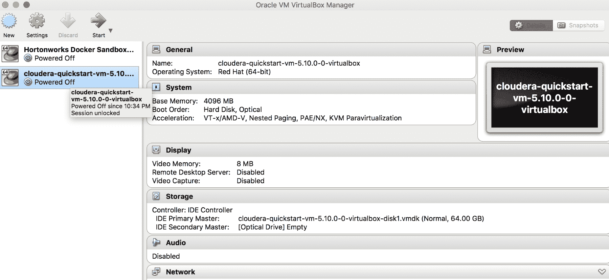

它需要一些时间才能启动，因为它会初始化所有与 CDH 相关的进程，如 DataNode、NameNode 等：


一旦该过程启动，它将启动一个默认登录页面，其中包含许多与 Hadoop 相关的教程的参考。 我们将在 Unix 终端中为这一部分编写 MapReduce 代码。 从左上角菜单启动终端，如下图所示：


现在，我们必须遵循以下步骤：

1.  创建名为`cyrus`的目录。 这是我们将存储包含书文本的所有文件的位置。
2.  如步骤 4 所示运行`getCyrusFiles.sh`。这会将图书下载到`cyrus`目录。
3.  如图所示运行`processCyrusFiles.sh`。 这本书包含各种 Unicode 和不可打印的字符。 此外，我们希望将所有单词更改为小写，以便忽略相同但大写的重复计数单词。
4.  这将生成一个名为`cyrusprint.txt`的文件。 本文档包含该书的全部正文。 我们将在此文本文件上运行 MapReduce 代码。
5.  准备`mapper.py`和`reducer.py`。 顾名思义，`mapper.py`运行 MapReduce 过程的映射部分。 类似地，`reducer.py`运行 MapReduce 过程的 Reduce 部分。 文件`mapper.py`将文档拆分成单词，并为文档中的每个单词赋值 1。 文件`reducer.py`将读入`mapper.py`的排序输出，并对同一单词的出现次数求和(首先将单词计数初始化为 1，然后为该单词的每个新出现次数递增)。 最终输出是一个文件，其中包含文档中每个单词的计数。

具体步骤如下：

1.  创建`getCyrusFiles.sh`-此脚本将用于从 Web 检索数据：

```py
[cloudera@quickstart ~]$ mkdir cyrus 
[cloudera@quickstart ~]$ vi getCyrusFiles.sh 
[cloudera@quickstart ~]$ cat getCyrusFiles.sh  
for i in `seq 10` 
do 
curl www.artamene.org/documents/cyrus$i.txt -o cyrus$i.txt 
done 
```

2.  创建`processCyrusFiles.sh`-此脚本将用于连接和清理在上一步中下载的文件：

```py
[cloudera@quickstart ~]$ vi processCyrusFiles.sh 
[cloudera@quickstart ~]$ cat processCyrusFiles.sh  
cd ~/cyrus; 
for i in `ls cyrus*.txt` do cat $i >> cyrusorig.txt; done 
cat cyrusorig.txt | tr -dc '[:print:]' | tr A-Z a-z > cyrusprint.txt  
```

3.  将权限更改为 755，以使`.sh`文件在命令提示符下可执行：

```py
[cloudera@quickstart ~]$ chmod 755 getCyrusFiles.sh  
[cloudera@quickstart ~]$ chmod 755 processCyrusFiles.sh  
```

4.  ==同步，由 Elderman 更正==@ELDER_MAN

```py
[cloudera@quickstart cyrus]$ ./getCyrusFiles.sh  
  % Total    % Received % Xferd  Average Speed   Time    Time     Time  Current 
                                 Dload  Upload   Total   Spent    Left  Speed 
100  908k  100  908k    0     0   372k      0  0:00:02  0:00:02 --:--:--  421k 
  % Total    % Received % Xferd  Average Speed   Time    Time     Time  Current 
                                 Dload  Upload   Total   Spent    Left  Speed 
100 1125k  100 1125k    0     0   414k      0  0:00:02  0:00:02 --:--:--  471k 
  % Total    % Received % Xferd  Average Speed   Time    Time     Time  Current 
                                 Dload  Upload   Total   Spent    Left  Speed 
100 1084k  100 1084k    0     0   186k      0  0:00:05  0:00:05 --:--:--  236k 
  % Total    % Received % Xferd  Average Speed   Time    Time     Time  Current 
                                 Dload  Upload   Total   Spent    Left  Speed 
100 1048k  100 1048k    0     0   267k      0  0:00:03  0:00:03 --:--:--  291k 
  % Total    % Received % Xferd  Average Speed   Time    Time     Time  Current 
                                 Dload  Upload   Total   Spent    Left  Speed 
100 1116k  100 1116k    0     0   351k      0  0:00:03  0:00:03 --:--:--  489k 
  % Total    % Received % Xferd  Average Speed   Time    Time     Time  Current 
                                 Dload  Upload   Total   Spent    Left  Speed 
100 1213k  100 1213k    0     0   440k      0  0:00:02  0:00:02 --:--:--  488k 
  % Total    % Received % Xferd  Average Speed   Time    Time     Time  Current 
                                 Dload  Upload   Total   Spent    Left  Speed 
100 1119k  100 1119k    0     0   370k      0  0:00:03  0:00:03 --:--:--  407k 
  % Total    % Received % Xferd  Average Speed   Time    Time     Time  Current 
                                 Dload  Upload   Total   Spent    Left  Speed 
100 1132k  100 1132k    0     0   190k      0  0:00:05  0:00:05 --:--:--  249k 
  % Total    % Received % Xferd  Average Speed   Time    Time     Time  Current 
                                 Dload  Upload   Total   Spent    Left  Speed 
100 1084k  100 1084k    0     0   325k      0  0:00:03  0:00:03 --:--:--  365k 
  % Total    % Received % Xferd  Average Speed   Time    Time     Time  Current 
                                 Dload  Upload   Total   Spent    Left  Speed 
100 1259k  100 1259k    0     0   445k      0  0:00:02  0:00:02 --:--:--  486k 

[cloudera@quickstart cyrus]$ ls 
cyrus10.txt  cyrus3.txt  cyrus6.txt  cyrus9.txt 
cyrus1.txt   cyrus4.txt  cyrus7.txt  getCyrusFiles.sh 
cyrus2.txt   cyrus5.txt  cyrus8.txt  processCyrusFiles.sh 

```

5.  ==同步，由 Elderman 更正==@ELDER_MAN

```py

[cloudera@quickstart cyrus]$ ./processCyrusFiles.sh  

[cloudera@quickstart cyrus]$ ls 
cyrus10.txt  cyrus3.txt  cyrus6.txt  cyrus9.txt      getCyrusFiles.sh 
cyrus1.txt   cyrus4.txt  cyrus7.txt  cyrusorig.txt   processCyrusFiles.sh 
cyrus2.txt   cyrus5.txt  cyrus8.txt  cyrusprint.txt 

[cloudera@quickstart cyrus]$ ls -altrh cyrusprint.txt  
-rw-rw-r-- 1 cloudera cloudera 11M Jun 28 20:02 cyrusprint.txt 

[cloudera@quickstart cyrus]$ wc -w cyrusprint.txt  
1953931 cyrusprint.txt 
```

6.  执行以下步骤将名为`cyrusprint.txt`的最终文件复制到 HDFS，创建`mapper.py`和`reducer.py`脚本。

Glenn Klockwood 的网站([http://www.glennklockwood.com/data-intensive/hadoop/streaming.html](http://www.glennklockwood.com/data-intensive/hadoop/streaming.html))引用了文件`mapper.py`和`reducer.py`，该网站提供了有关 MapReduce 和相关主题的丰富信息。

以下代码显示了`mapper.py`的内容：

```py
[cloudera@quickstart cyrus]$ hdfs dfs -ls /user/cloudera 

[cloudera@quickstart cyrus]$ hdfs dfs -mkdir /user/cloudera/input 

[cloudera@quickstart cyrus]$ hdfs dfs -put cyrusprint.txt /user/cloudera/input/ 

[cloudera@quickstart cyrus]$ vi mapper.py 

[cloudera@quickstart cyrus]$ cat mapper.py  
#!/usr/bin/env python 
#the above just indicates to use python to intepret this file 
#This mapper code will input a line of text and output <word, 1> # 

import sys 
sys.path.append('.') 

for line in sys.stdin: 
   line = line.strip() 
   keys = line.split() 
   for key in keys: 
          value = 1 
          print ("%s\t%d" % (key,value)) 

[cloudera@quickstart cyrus]$ vi reducer.py # Copy-Paste the content of reducer.py as shown below using the vi or nano Unix editor.

[cloudera@quickstart cyrus]$ cat reducer.py  
#!/usr/bin/env python 

import sys 
sys.path.append('.') 

last_key = None 
running_total = 0 

for input_line in sys.stdin: 
   input_line = input_line.strip() 
   this_key, value = input_line.split("\t", 1) 
   value = int(value) 

   if last_key == this_key: 
       running_total += value 
   else: 
       if last_key: 
           print("%s\t%d" % (last_key, running_total)) 
       running_total = value 
       last_key = this_key 

if last_key == this_key: 
   print( "%s\t%d" % (last_key, running_total) ) 

[cloudera@quickstart cyrus]$ chmod 755 *.py
```

7.  执行将执行 MapReduce 操作的映射器和缩减器脚本，以生成字数统计。 您可能会看到如下所示的错误消息，但出于本练习(以及生成结果)的目的，您可以忽略它们：

```py
[cloudera@quickstart cyrus]$ hadoop jar /usr/lib/hadoop-mapreduce/hadoop-streaming.jar -input /user/cloudera/input -output /user/cloudera/output -mapper /home/cloudera/cyrus/mapper.py -reducer /home/cloudera/cyrus/reducer.py 

packageJobJar: [] [/usr/lib/hadoop-mapreduce/hadoop-streaming-2.6.0-cdh5.10.0.jar] /tmp/streamjob1786353270976133464.jar tmpDir=null 
17/06/28 20:11:21 INFO client.RMProxy: Connecting to ResourceManager at /0.0.0.0:8032 
17/06/28 20:11:21 INFO client.RMProxy: Connecting to ResourceManager at /0.0.0.0:8032 
17/06/28 20:11:22 INFO mapred.FileInputFormat: Total input paths to process : 1 
17/06/28 20:11:22 INFO mapreduce.JobSubmitter: number of splits:2 
17/06/28 20:11:23 INFO mapreduce.JobSubmitter: Submitting tokens for job: job_1498704103152_0002 
17/06/28 20:11:23 INFO impl.YarnClientImpl: Submitted application application_1498704103152_0002 
17/06/28 20:11:23 INFO mapreduce.Job: The url to track the job: http://quickstart.cloudera:8088/proxy/application_1498704103152_0002/ 
17/06/28 20:11:23 INFO mapreduce.Job: Running job: job_1498704103152_0002 
17/06/28 20:11:30 INFO mapreduce.Job: Job job_1498704103152_0002 running in uber mode : false 
17/06/28 20:11:30 INFO mapreduce.Job:  map 0% reduce 0% 
17/06/28 20:11:41 INFO mapreduce.Job:  map 50% reduce 0% 
17/06/28 20:11:54 INFO mapreduce.Job:  map 83% reduce 0% 
17/06/28 20:11:57 INFO mapreduce.Job:  map 100% reduce 0% 
17/06/28 20:12:04 INFO mapreduce.Job:  map 100% reduce 100% 
17/06/28 20:12:04 INFO mapreduce.Job: Job job_1498704103152_0002 completed successfully 
17/06/28 20:12:04 INFO mapreduce.Job: Counters: 50 
   File System Counters 
          FILE: Number of bytes read=18869506 
          FILE: Number of bytes written=38108830 
          FILE: Number of read operations=0 
          FILE: Number of large read operations=0 
          FILE: Number of write operations=0 
          HDFS: Number of bytes read=16633042 
          HDFS: Number of bytes written=547815 
          HDFS: Number of read operations=9 
          HDFS: Number of large read operations=0 
          HDFS: Number of write operations=2 
   Job Counters  
          Killed map tasks=1 
          Launched map tasks=3 
          Launched reduce tasks=1 
          Data-local map tasks=3 
          Total time spent by all maps in occupied slots (ms)=39591 
          Total time spent by all reduces in occupied slots (ms)=18844 
          Total time spent by all map tasks (ms)=39591 
          Total time spent by all reduce tasks (ms)=18844 
          Total vcore-seconds taken by all map tasks=39591 
          Total vcore-seconds taken by all reduce tasks=18844 
          Total megabyte-seconds taken by all map tasks=40541184 
          Total megabyte-seconds taken by all reduce tasks=19296256 
   Map-Reduce Framework 
          Map input records=1 
          Map output records=1953931 
          Map output bytes=14961638 
          Map output materialized bytes=18869512 
          Input split bytes=236 
          Combine input records=0 
          Combine output records=0 
          Reduce input groups=45962 
          Reduce shuffle bytes=18869512 
          Reduce input records=1953931 
          Reduce output records=45962 
          Spilled Records=3907862 
          Shuffled Maps =2 
          Failed Shuffles=0 
          Merged Map outputs=2 
          GC time elapsed (ms)=352 
          CPU time spent (ms)=8400 
          Physical memory (bytes) snapshot=602038272 
          Virtual memory (bytes) snapshot=4512694272 
          Total committed heap usage (bytes)=391979008 
   Shuffle Errors 
          BAD_ID=0 
          CONNECTION=0 
          IO_ERROR=0 
          WRONG_LENGTH=0 
          WRONG_MAP=0 
          WRONG_REDUCE=0 
   File Input Format Counters  
          Bytes Read=16632806 
   File Output Format Counters  
          Bytes Written=547815 
17/06/28 20:12:04 INFO streaming.StreamJob: Output directory: /user/cloudera/output
```

8.  结果存储在 HDFS 中的`/user/cloudera/output`目录下，文件前缀为`part-`：

```py
[cloudera@quickstart cyrus]$ hdfs dfs -ls /user/cloudera/output 
Found 2 items 
-rw-r--r--   1 cloudera cloudera          0 2017-06-28 20:12 /user/cloudera/output/_SUCCESS 
-rw-r--r--   1 cloudera cloudera     547815 2017-06-28 20:12 /user/cloudera/output/part-00000  
```

9.  要查看文件内容，请使用`hdfs dfs -cat`并提供文件名。 在本例中，我们查看的是输出的前 10 行：

```py
[cloudera@quickstart cyrus]$ hdfs dfs -cat /user/cloudera/output/part-00000 | head -10 
!  1206 
!) 1 
!quoy,    1 
'  3 
'' 1 
'. 1 
'a 32 
'appelloit 1 
'auoit    1 
'auroit   10  
```

# 用蜂巢分析石油进口价格

在这一部分，我们将使用蜂巢来分析 1980-2016 年全球各国的石油进口价格。 这些数据可从**OECD**(**经济合作与发展组织**)的网站获得，网址如下：


实际的 csv 文件位于[https://stats.oecd.org/sdmx-json/data/DP_LIVE/.OILIMPPRICE.../OECD?contentType=csv&amp；Detail=CODE&and；Separator=Comma&amp；csv-lang=en](https://stats.oecd.org/sdmx-json/data/DP_LIVE/.OILIMPPRICE.../OECD?contentType=csv&detail=code&separator=comma&csv-lang=en)。

由于我们将在配置单元中加载数据，因此通过 Cloudera Quickstart CDH 环境中的终端将文件下载到我们的主目录中是有意义的。 我们要执行的步骤如下：

1.  将 CSV 文件下载到专用宿主机环境中：

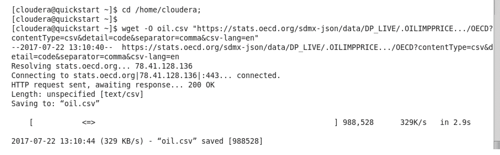

```py
# Download the csv file 
cd /home/cloudera; 
wget -O oil.csv "https://stats.oecd.org/sdmx-json/data/DP_LIVE/.OILIMPPRICE.../OECD?contentType=csv&amp;detail=code&amp;separator=comma&amp;csv-lang=en" 
```

2.  清理 CSV 文件。 数据清理是数据科学中的一个核心重要领域。 在实践中，接收需要一定级别清理的文件是非常常见的。 这是因为列中可能存在无效字符或值、缺少数据、缺少或附加分隔符等。 我们注意到不同的值括在双引号(“)中。在配置单元中，我们可以通过在创建表时指定`quoteChar`属性来忽略引号。由于 Linux 也提供了删除此类字符的简单方法，因此我们使用`sed`删除引号：

```py
[cloudera@quickstart ~]$ sed -i 's/\"//g' oil.csv 
```

此外，在我们下载的文件`oil.csv`中，我们发现有一些不可打印的字符可能会导致问题。 我们通过发出以下命令删除了它们：

```py
[cloudera@quickstart ~]$ tr -cd '\11\12\15\40-\176' oil_.csv > oil_clean.csv
```

(来源：[http：//alvinalexander.com/Blog/Post/linux-unix/how-remove-non-printable-ascii-characters-file-unix](http://alvinalexander.com/blog/post/linux-unix/how-remove-non-printable-ascii-characters-file-unix))

最后，我们将新文件(`oil_clean.csv`)复制到`oil.csv`。 由于`oil.csv`文件已存在于同一文件夹中，因此系统会提示我们覆盖消息，并输入`yes`：

```py
[cloudera@quickstart ~]$ mv oil_clean.csv oil.csv 
mv: overwrite `oil.csv'? yes 
```

3.  登录到 Cloudera Hue：

在浏览器的书签栏上单击色调。 这将调出 Cloudera 登录屏幕。 使用 ID`cloudera`和密码`cloudera`登录：


4.  从色调登录窗口顶部的快速入门下拉菜单中单击色调：

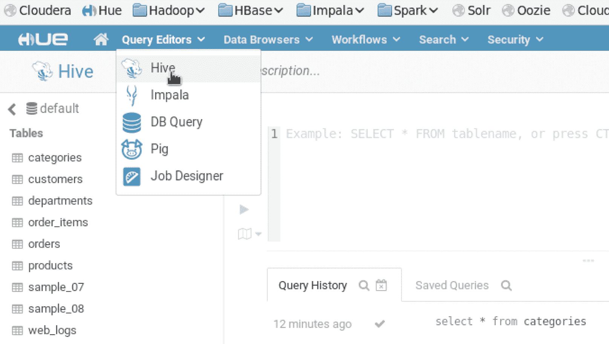

5.  创建表模式，加载 CSV 文件`oil.csv`，并查看记录：

```py
CREATE TABLE IF NOT EXISTS OIL 
   (location String, indicator String, subject String, measure String,  
   frequency String, time String, value Float, flagCode String) 
   ROW FORMAT DELIMITED 
   FIELDS TERMINATED BY ',' 
   LINES TERMINATED BY '\n' 
   STORED AS TEXTFILE 
   tblproperties("skip.header.line.count"="1"); 

LOAD DATA LOCAL INPATH '/home/cloudera/oil.csv' INTO TABLE OIL; 
SELECT * FROM OIL; 
```


6.  加载油文件。

7.  现在该表已加载到配置单元中，您可以使用 HiveQL 运行其他配置单元命令。 在[https://cwiki.apache.org/confluence/display/Hive/LanguageManual](https://cwiki.apache.org/confluence/display/Hive/LanguageManual)上提供了完整的这些命令集。

例如，要查找每个国家从 1980 年到 2015 年(数据集的日期范围)的油价的最大值、最小值和平均值，我们可以使用熟悉的 SQL 运算符。 查询将如下所示：

```py
SELECT LOCATION, MIN(value) as MINPRICE, AVG(value) as AVGPRICE,  
MAX(value) as MAXPRICE 
FROM OIL 
WHERE FREQUENCY LIKE "A" 
GROUP BY LOCATION; 
```

下面是同样的截图：

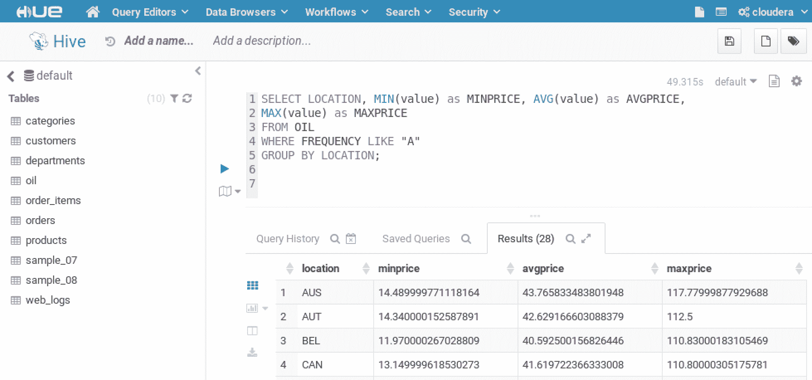

以类似的方式，我们可以使用一组其他 SQL 命令。 “蜂窝手册”深入介绍了这些命令以及保存、查询和检索数据的各种方式。

Hue 包括一组有用的功能，如数据可视化、数据下载和其他允许用户对数据执行即席分析的功能。

要访问可视化功能，请单击结果部分中网格图标下方的可视化图标，如以下屏幕截图所示：

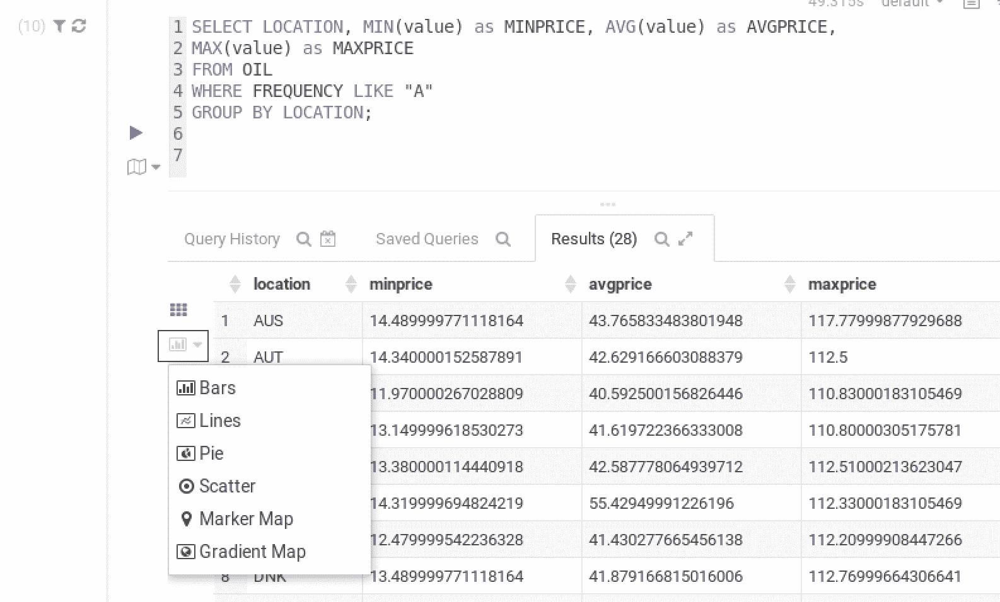

选择散布。 在色调中，这种类型的图表(通常也称为散点图)允许用户非常容易地创建多变量图表。 可以为 x 轴和 y 轴选择不同的值，以及散布大小和分组，如以下屏幕截图所示：


下面是一个简单的饼图，您可以通过在下拉菜单中选择 Pie 来构建该饼图：


# 连接配置单元中的表

配置单元支持高级加入功能。 下面说明了使用 LEFT JOIN 的过程。 如图所示，原始表包含由三个字母组成的国家代码表示的每个国家的数据。 由于 Hue 支持地图图表，我们可以添加纬度和经度的值，以便在世界地图上覆盖石油价格数据。

为此，我们需要下载一个包含纬度和经度值的数据集：

```py
# ENTER THE FOLLOWING IN THE UNIX TERMINAL 
# DOWNLOAD LATLONG CSV FILE 

cd /home/cloudera; 
wget -O latlong.csv "https://gist.githubusercontent.com/tadast/8827699/raw/7255fdfbf292c592b75cf5f7a19c16ea59735f74/countries_codes_and_coordinates.csv" 

# REMOVE QUOTATION MARKS 
sed -i 's/\"//g' latlong.csv 
```

下载并清除文件后，定义架构并在配置单元中加载数据：

```py
CREATE TABLE IF NOT EXISTS LATLONG 
   (country String, alpha2 String, alpha3 String, numCode Int, latitude Float, longitude Float) 
   ROW FORMAT DELIMITED 
   FIELDS TERMINATED BY ',' 
   LINES TERMINATED BY '\n' 
   STORED AS TEXTFILE 
   TBLPROPERTIES("skip.header.line.count"="1"); 

LOAD DATA LOCAL INPATH '/home/cloudera/latlong.csv' INTO TABLE LATLONG; 

```

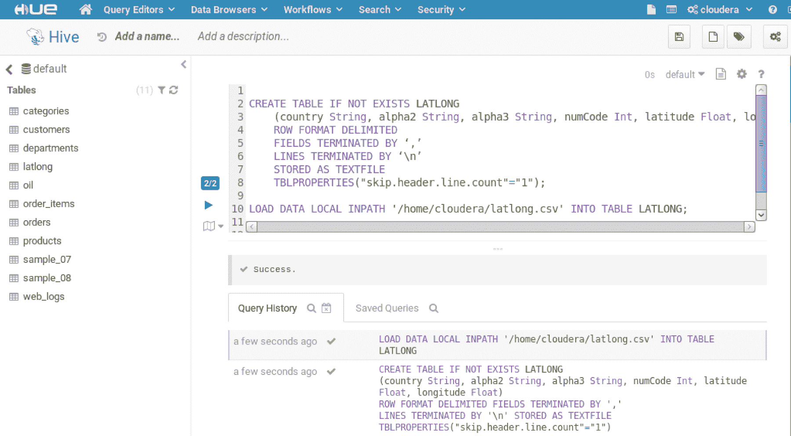

将石油数据与经度/经度数据连接起来：

```py
SELECT DISTINCT * FROM 
(SELECT location, avg(value) as AVGPRICE from oil GROUP BY location) x 
LEFT JOIN 
(SELECT TRIM(ALPHA3) AS alpha3, latitude, longitude from LATLONG) y 
ON (x.location = y.alpha3); 
```

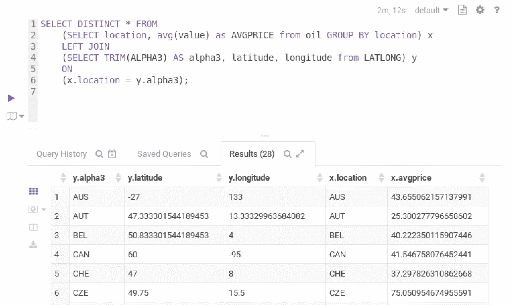

我们现在可以继续创建地理空间可视化。 请记住，这些是色调中的初步可视化，它们提供了一种非常方便的方式来查看数据，这一点非常有用。 可以使用 shapefile、多边形和其他高级图表方法在地理数据上开发更深入的可视化。

在下拉菜单中选择渐变图，输入合适的值即可创建图表，如下图所示：

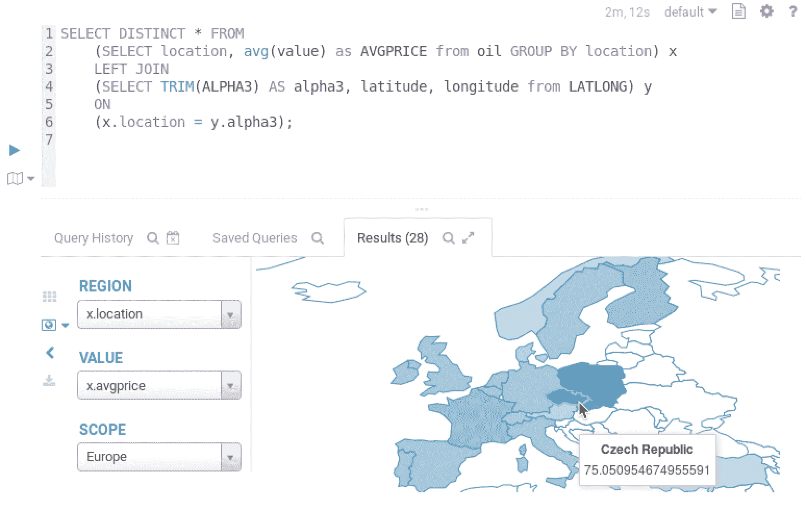

下一个图表是使用下拉菜单中的 Marker Map 选项开发的。 它使用三个字符的国家/地区代码，以便在各个地区放置标记和关联值，如下图所示：

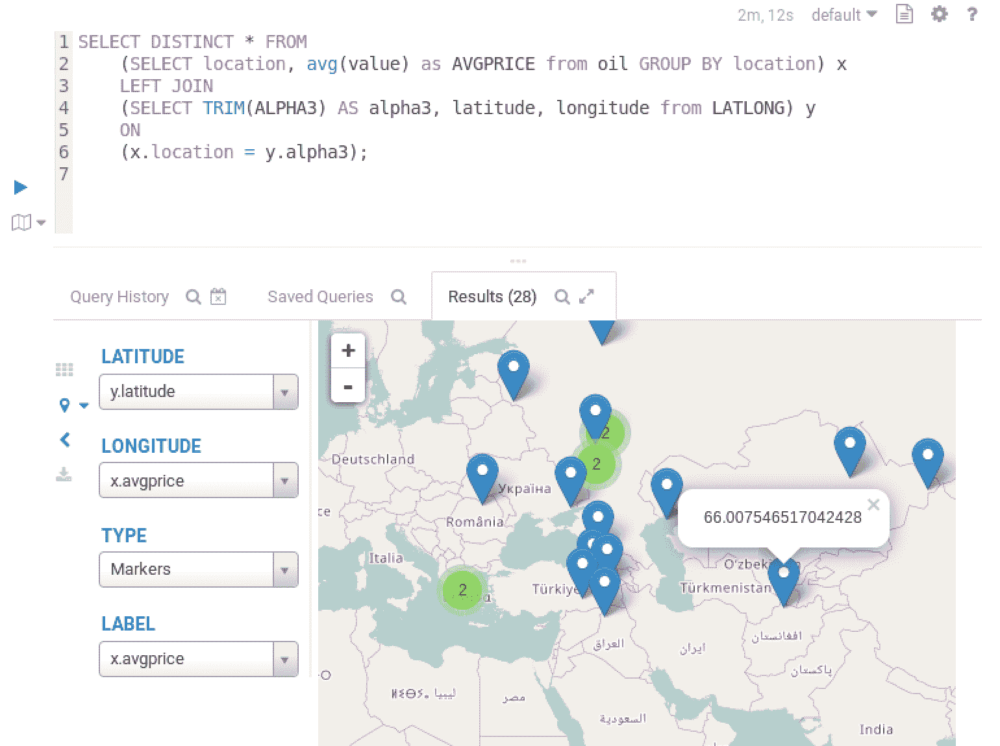

# 简略的 / 概括的 / 简易判罪的 / 简易的

本章提供了 Hadoop 的技术概述。 我们讨论了 Hadoop 的基础核心组件和核心概念，如 MapReduce 和 HDFS。 我们还研究了使用 Hadoop 的技术挑战和注意事项。 虽然在概念上看起来很简单，但 Hadoop 体系结构的内部工作和正式管理可能相当复杂。 在本章中，我们重点介绍了其中的几个。

最后，我们使用 Cloudera 发行版对 Hadoop 进行了动手练习。 在本教程中，我们使用了之前从 Cloudera 网站下载的 CDH 虚拟机。

在下一章中，我们将介绍 NoSQL，它是 Hadoop 的替代解决方案或补充解决方案，具体取决于您的个人和/或组织的需求。 虽然 Hadoop 提供了一组丰富得多的功能，但如果您的预期用例可以使用简单的 NoSQL 解决方案来完成，那么就所需的工作量而言，后者可能是一个更容易的选择。