# 五、使用 NoSQL 的大数据挖掘

术语**NoSQL**最早由 Carlo Strozzi 使用，他在 1998 年发布了 Strozzi NoSQL 开源关系数据库。 在本世纪头十年后期，数据库体系结构中出现了新的范例，其中许多范例不符合关系数据库系统所要求的严格约束。 这些数据库由于不符合标准数据库约定(如 ACID 遵从性)，很快被归入一个称为 NoSQL 的大类别。

每个 NoSQL 数据库都声称对某些用例是最佳的。 虽然它们中没有几个能满足成为通用数据库管理系统的要求，但它们都利用了 NoSQL 系统范围内的一些共同主题。

在本章中，我们将介绍一些广泛的 NoSQL 数据库管理系统。 我们将讨论启动向 NoSQL 数据库系统迁移的主要驱动因素，以及此类数据库如何解决导致其被广泛采用的特定业务需求，并以几个实际的 NoSQL 练习结束。

本章涵盖的主题包括：

*   为什么选择 NoSQL？
*   NoSQL 数据库
*   内存中数据库
*   分栏式数据库
*   面向文档的数据库
*   键值数据库
*   图形数据库
*   其他 NoSQL 类型和摘要
*   NoSQL 系统上的动手练习

# 为什么选择 NoSQL？

术语 NoSQL 通常表示*而不仅仅是 SQL*：也就是说，底层数据库具有与常见和传统数据库系统不同的属性。 因此，除了不提供符合 ACID 的特征之外，没有明确的区别将数据库限定为 NoSQL。 因此，了解几十年来一直是数据库系统主流的 ACID 属性的性质，并简要讨论 BASE 和 CAP 这两个当今数据库的核心术语的意义将是很有帮助的。

# 酸、碱和 CAP 属性

让我们首先讨论 ACID 和 SQL。

# ACID 和 SQL

ACID 代表原子性、一致性、隔离性和持久性：

*   **原子性**：这表示数据库事务要么完全执行，要么根本不执行。 换句话说，要么应该提交所有事务，也就是保持其全部事务，要么根本不提交。 事务没有部分执行的余地。
*   **一致性**：对数据的约束，即决定数据库内数据管理的规则，将在整个数据库中保持一致。 不同的实例将不遵守与数据库的其他实例中的规则有任何不同的规则。
*   **Isolation**：此属性定义并发操作(事务)如何读取和写入数据的规则。 例如，如果某个记录正在更新，而另一个进程读取相同的记录，则数据库系统的隔离级别将确定将返回给用户的数据版本。
*   **持久性**：数据库系统的持久性通常表示提交的事务即使在系统故障的情况下也将保持持久。 这通常是通过使用数据库在恢复期间可以引用的事务日志来管理的。

读者可能会注意到，这里定义的所有属性主要与数据库事务相关。 **事务**是遵守上述规则并对数据库进行更改的操作单元。 例如，典型的自动取款机取款可能具有以下逻辑路径：

1.  用户从自动取款机提取现金
2.  银行检查用户的当前余额
3.  数据库系统从用户的帐户中扣除相应的金额
4.  数据库系统更新用户帐户中的金额以反映更改

因此，在 20 世纪 90 年代中期之前流行的大多数数据库(如 Oracle、Sybase、DB2 和其他数据库)都针对记录和管理事务数据进行了优化。 在此之前，大多数数据库都负责管理事务性数据。 90 年代中期互联网的快速发展导致了新类型的数据，这些数据并不一定需要严格的酸合规性要求。 YouTube 上的视频、Pandora 上的音乐和公司电子邮件记录都是事务性数据库除了作为存储数据的技术层之外并不能增加价值的用例。

# NoSQL 的基本属性

到本世纪头十年末，数据量激增，显然需要一种新的替代模型来管理数据。 这个名为 BASE 的新模型成为取代 ACID 成为数据库管理系统首选模型的一个基础性主题。

**底座**表示**B**实质上**A**可用的**S**经常处于状态**E**的状态下的**B**A 可用的**S**。 这意味着数据库基本上*大部分时间都是可用的；也就是说，可能会有服务不可用的时间段(因此应该实施额外的冗余措施)。 *软状态*意味着无法保证系统的状态-相同数据的不同实例可能具有不同的内容，因为它可能尚未捕获群集另一部分中的最新更新。 最后，*最终*一致意味着，尽管数据库可能不是一直处于相同的状态，但它最终会达到相同的状态；也就是说，成为*一致*。*

 *# CAP 定理

CAP 定理由 Eric Allen Brewer 在 20 世纪 90 年代末首次提出，它对分布式数据库系统的约束或更一般的特征进行了分类。 简而言之，CAP 定理假设严格地说，数据库系统只能保证 CAP 定义的三个属性中的两个，如下所示：

*   **一致性**：数据应该在数据库的所有实例中保持一致，因此，在查询时，应该在所有节点上提供一致的结果
*   **可用性**：无论任何单个节点的状态如何，系统都会在执行查询时始终以结果响应(无论它是否是最近的提交)
*   **分区容差**：这意味着当节点跨网络分离时，即使任何节点失去与另一个节点的互连，系统也应该继续正常运行

由此可见，由于集群中的节点将通过*网络*连接，该网络本质上可能会中断，因此必须保证分区容错才能使系统继续正常运行。 在这种情况下，争议在于在一致性和可用性之间进行选择。 例如，如果系统必须保持一致；也就是说，显示所有节点上的最新提交，则所有节点不能同时*可用*，因为某些节点可能没有最近的提交。 在这种情况下，在使用新数据更新所有节点之前，不会执行对新更新的查询。 在可用性的情况下，换句话说，我们不能保证一致性，因为始终可用意味着如果没有将新的更新写入相应的节点，则某些节点将不会具有与另一个节点相同的数据。

在决定是确保一致性还是确保可用性之间存在很大的混乱和争执，因此数据库被归类为**CP**或**AP**。 对于本练习的目的，我们不需要纠结于术语，因为这将导致相当抽象和哲学的讨论。 提供上述术语的信息主要是为了反映推动数据库发展的一些基础理论。

# 对 NoSQL 技术的需求

虽然大多数数据库系统最初是为管理交易而设计的，但互联网相关技术和新类型数据的增长不需要交易系统的严格清教徒性质，因此有必要开发替代框架。

例如，存储以下类型的数据不一定需要复杂的*事务数据库*：

*   电子邮件
*   音频/视频文件等媒体
*   社交网络消息
*   网站 HTML 页面
*   其他许多人

此外，用户的增加，以及由此带来的数据量的增加，表明需要开发具有以下特征的更健壮的体系结构：

*   可扩展以管理不断增长的数据量
*   利用商用硬件减少对昂贵硬件的依赖
*   提供跨多个节点的分布式处理能力，以处理大规模数据集
*   容错/提供高可用性以处理节点和站点故障

Scalable 意味着系统可以通过增加节点数量(即水平扩展)来适应数据量的增加。 此外，增加节点数量对系统性能的影响应该最小。

容错意味着系统应该能够处理节点故障，这在包含数百个节点(如果不是数千个节点)的大型分布式系统中并不少见。

这导致了各种开创性的、有影响力的应用系统的开发，其中最著名的可能是 Google Bigtable 和 Amazon Dynamo。

# Google Bigtable

Bigtable 是 2004 年发起的一个项目，目的是管理谷歌各种项目使用的数据的可扩展性和性能。 描述该系统特征的开创性论文于 2006 年发布([https://static.googleusercontent.com/media/research.google.com/en//archive/bigtable-osdi06.pdf](https://static.googleusercontent.com/media/research.google.com/en//archive/bigtable-osdi06.pdf))，标题为*Bigtable：结构化数据的分布式存储系统*。 本质上，Bigtable 是一个*列存储*(稍后将详细介绍)，其中每个值都可以使用行键、列键和时间戳进行唯一标识。 它是首批集中体现以列式格式存储数据(而不是使用更常见的基于行的布局)优点的主流数据库之一。 尽管列数据库(如 kdb+和 Sybase IQ)早于 Bigtable，但行业领导者使用这种方法来管理 PB 级信息将这个概念带到了聚光灯下。

Bigtable 官网总结了关键价值主张：

Bigtable is designed to handle massive workloads at consistent low latency and high throughput, so it's a great choice for both operational and analytical applications, including IoT, user analytics, and financial data analysis.

自从引入 Bigtable 以来，其他几个 NoSQL 数据库采用了列式数据布局的约定；最著名的是 HBase 和 Acumulo，这两个都是 Apache 项目。

Bigtable 解决方案现在可以在[https://cloud.google.com/bigtable/](https://cloud.google.com/bigtable/)上使用，在那里可以订阅购买。 较小数据量的费用相当象征性且合理，而较大的安装将需要更广泛的实施。

# 亚马逊发电机

在谷歌宣布 Bigtable 后不久，亚马逊在 2007 年 10 月举行的第 21 届 ACM 操作系统原则研讨会上宣布了其内部 Dynamo 数据库([http://www.sosp2007.org](http://www.sosp2007.org))。

这篇论文现已在沃纳·沃格尔的网站[http://www.allthingsdistributed.com/files/amazon-dynamo-sosp2007.pdf](http://www.allthingsdistributed.com/files/amazon-dynamo-sosp2007.pdf)上发布。在这篇文章中，亚马逊描述了一个名为 Dynamo 的键值商店，它被用来为亚马逊一些最关键的内部服务提供支持，比如亚马逊的 S3 on AWS。 本文引入了在 Dynamo 中实现的一些关键概念，如键值存储、一致散列和矢量时钟等。

因此，Dynamo 通过引入一种利用键-值关联的根本不同的方法，为大规模数据集提供了 Bigtable 的列式存储的替代方案。

在接下来的几节中，我们将讨论各种类型的 NoSQL 技术，以及每种技术如何具有使其最适合某些用例的特性。 NoSQL 在我们对待数据库的方式上带来了范式转变，并为数据管理提供了一种亟需的替代视图，其规模在以前是不可行的。

# NoSQL 数据库

在讨论 NoSQL 类型和数据库时，我们将主要关注 NoSQL 数据库的以下特征：

*   内存中数据库
*   分栏式数据库
*   面向文档的数据库
*   键值数据库
*   图形数据库
*   其他 NoSQL 类型和摘要

目前行业中使用的大多数类型的 NoSQL 都属于这些类别中的一个或多个。 接下来的几节将讨论这些 NoSQL 产品的高级属性、它们的主要优势以及市场上属于各自类别的产品。

# 内存中数据库

**内存中的数据库**，顾名思义，就是利用计算机内存(即 RAM)来存储数据集。 在我们了解内存数据库是如何工作的之前，有必要回顾一下典型计算机中的数据传输是如何发生的：


Simple Data Flow Computer Hierarchy

如上图所示，数据从磁盘遍历到内存，再到 CPU。 这是对确切过程的一个非常高级的概括，因为在某些情况下，CPU 不需要发送指令来从内存中读取数据(例如，当数据已经存在于 CPU 二级缓存(CPU 的一部分，包含为缓存数据保留的内存)中时)，但从根本上讲，该过程在 CPU、RAM 和磁盘之间是线性的。

存储在磁盘上的数据可以按照取决于磁盘 I/O(输入/输出)吞吐量的特定速率传输到内存。 从磁盘访问数据大约需要 10-20 毫秒(Ms)。 虽然确切的数字因数据大小而异，但最小寻道时间(磁盘查找数据位置的时间)本身约为 10-15 毫秒。 将其与从内存获取数据所需的时间进行比较，后者大约为 100 纳秒。 最后，从 CPU 二级缓存读取数据大约需要 7 ns。

相比之下，15 毫秒(即 15,000,000 纳秒)的磁盘访问时间比从内存访问数据所需的时间慢 150,000 倍*。 换句话说，与磁盘相比，读取内存中已经存在的数据的速度可以达到惊人的 15 万倍。 对于读取随机数据而言，这基本上是正确的。 读取顺序数据的时间可以说没有那么耸人听闻，但仍然快了近一个数量级。*

 *如果将磁盘和 RAM 表示为汽车，那么 RAM*汽车*就会一直飞到月球上，并在磁盘汽车仅行驶两英里的时间内返回。 这就是差别有多大。

因此，很自然地得出这样的结论：如果数据存储在 RAM 中，特别是在数据集较大的情况下，访问时间将大大减少，因此处理数据的时间(至少在 I/O 级别上)将显著减少。

传统上，数据库中的所有数据都存储在磁盘上。 随着互联网的出现，业界开始利用*memcached*，它提供了一种通过 API 在内存中以键-值对存储数据的方法。 例如，MySQL 数据库利用 memcached API 在内存中缓存对象以优化读取速度并降低主(MySQL)数据库上的负载的做法过去和现在仍然很常见。

然而，随着数据量开始增加，使用数据库和 memcached 方法的复杂性开始产生影响，专为在内存(有时是在磁盘和内存中)存储数据而设计的数据库正在快速开发。

因此，Redis 等内存数据库开始取代 memcached，成为驱动网站的高速缓存存储。 在 Redis 中，尽管数据将以键-值对的形式保存在内存中，但是可以选择将数据持久保存在磁盘上。 这使其有别于 memcached 等严格属于内存缓存的解决方案。

向内存中数据库发展的主要驱动因素可以概括如下：

*   通过传统的(例如，MySQL+memcached)组合管理不断增长的数据量(如 Web 流量)的复杂性
*   降低 RAM 成本，使购买更大尺寸的产品变得更实惠
*   整个行业对 NoSQL 技术的推动，导致更多的关注和社区参与，以开发更新的、创新的数据库平台
*   在需要超高速、低延迟数据处理的情况下，内存中更快的数据操作提供了一种减少 I/O 开销的方法

目前，业界提供内存中功能的数据库的一些领先选项包括：

| **开源** | **商业** |
| 再说一遍。 | KDB+ |
| MemcacheDB | Oracle TimesTen |
| 塞斯派克 | SAP 汉字 |
| VoltDB | HP Vertica |
| Apache Ignite | 阿尔蒂贝斯 |
| Apache Geode | Oracle Exalytics |
| MonetDB | MemSQL |

Note that some of these support hybrid architectures whereby data can reside in memory as well as on disk. In general, data would be transferred from memory to disk for persistence. Also, note that some commercial in-memory databases offer community editions that can be downloaded and used at no charge within the terms of the licenses applicable to the respective solution. In these cases, they are both open source as well as commercial.

# 分栏式数据库

柱状数据库从 90 年代就开始存在了，但是在前面提到的 Google Bigtable 发布之后，它开始变得突出起来。 它们本质上是一种存储数据的方法，相对于基于行/基于元组的存储而言，该方法针对查询非常大量的数据进行了优化。

列数据库的好处，或者更具体地说，单独存储每列数据，可以用一个简单的例子来说明。

考虑一个由 1 亿个家庭地址和电话号码组成的表。 另请考虑一个简单的查询，该查询要求用户查找纽约州奥尔巴尼市 1990 年后建造的家庭数量。 我们将创建一个假设表来说明逐行查询数据与逐列查询数据的区别。

**硬件特性**：

平均磁盘读取速度：200MB/秒

**数据库特征**：

表名：`housedb`

*   总行数=1 亿
*   状态为 NY=200 万的总行
*   纽约州和奥尔巴尼市的总行数=10,000
*   纽约州和奥尔巴尼市以及 YearBuilt>1990=500 的总行

**数据大小**：

让我们假设每行的每个数据的大小如下：

*   PlotNumber，YearBuilt 每个=8 字节=总计 16 字节
*   所有者、地址、州和城市各=12 字节=总计 48 字节
*   每行净大小(字节)=16+48=64 字节

请注意，实际大小会更高，因为还有其他几个考虑因素，例如索引和其他表优化以及相关的开销，为了简单起见，我们在这里不会考虑这些问题。

我们还假设列数据库维护一个隐式行索引，该索引允许在每个列*向量*中的特定索引处查询数据。

下表显示了前 4 条记录：

| **打印编号** | **所有者** | **地址** | **状态** | **城市** | **YearBuilt** |
| 1. | 约翰 （人名） | 主街 1 号 | 佤人 / 佤语 / 佤人的 / 佤语的 | 西雅图 | 九五年 |
| 2 个 | 马利亚 （人名） | J 大道 20 号。20 号。 | 纽约 / 同 New York | 奥尔巴尼 （纽约州首府） | 一九八 0 年 |
| 3. | 女人 | 5 45<sup>第</sup>街 | 纽约 / 同 New York | 天哪。 | 2001 年 |
| 4. | 约翰 （人名） | 10.大道。 | 计算机化 X 线体层照相术 | 斯坦福德 | 2010 年 |

该表总共有 1 亿条记录。 最后几个如下所示：

| **打印编号** | **所有者** | **地址** | **状态** | **城市** | **YearBuilt** |
| 99999997 | 吉姆 | 23 B.里 | 网络计算机 / 同 numerical control | 乔伊斯 | 九五年 |
| 99999998 | 字母 M 的代称 / 扩音器 / 麦克风 / 话筒 | L 街 5 号。 | 纽约 / 同 New York | 锡拉丘兹 | 1993 年 |
| 99999999 | 时间 | 10.大道。 | 纽约 / 同 New York | 奥尔巴尼 （纽约州首府） | 2001 年 |
| 100000000 | 起重器 / 插座 / 普通人 / 千斤顶 | 10.大道。 | 计算机化 X 线体层照相术 | 斯坦福德 | 2010 年 |

我们将对此数据集运行的查询如下所示：

```py
select * from housedb where State like 'NY' and City like 'Albany' and YearBuilt > 1990 
```

**场景 A：逐行搜索**

在第一个场景中，如果我们进行简单的逐行搜索，因为每列的数据不是单独存储的，而是扫描每行的数据，所以我们必须跨行进行查询：

1 亿*64 字节(每行的大小以字节为单位)=64 亿字节=大约 6000 MB 的数据

在比方说 200 Mbps 的磁盘读取速度下，这意味着读取所有记录以找到匹配条目大约需要 6000/200=30 秒。

**场景 B：逐列搜索**

假设每列数据都驻留在代表相应列的各个文件中，我们将分别查看每个 WHERE 子句：

```py
select * from housedb where State like 'NY' and City like 'Albany' and YearBuilt > 1990 
```

1.  **WHERE 子句第 1 部分**：`where State like 'NY'`

如前所述，State 列有 1 亿个条目，每个条目的大小为 12 字节。

在这种情况下，我们只需搜索：

1 亿*12 字节=12 亿字节=1,000 MB 数据。

在 200 Mbps 的数据读取速率下，这将花费 200MB，读取该数据列将需要 1000/200=5 秒。

这将返回两百万条记录(正如前面提到的数据库特征)

2.  **WHERE 子句第 2 部分**：`City like 'Albany'`

在前一步中，我们已经将搜索窗口缩小到满足纽约州标准的 200 万条记录。 现在，在第二个 WHERE 子句步骤中，我们不需要查询所有 1 亿条记录。 取而代之的是，我们可以简单地查看满足标准的 200 万条记录，以确定哪些记录属于城市奥尔巴尼。

在这种情况下，我们只需搜索：

*200 万*12 字节=2400 万字节=大约 20MB 的数据*。

在 200 Mbps 的数据读取速率下，这将需要 0.1 秒。

这将返回 10,000 条记录(如前面在数据库特征中所述)。

3.  **WHERE 子句第 3 部分**：`YearBuilt > 1990`

在上一步中，我们进一步将搜索范围缩小到 10,000 条符合纽约州和奥尔巴尼市标准的记录。 在此步骤中，我们将查询 YearBuilt 列中的 10,000 条记录，以查找哪些记录满足 YearBuilt>1990 的条件。

在这种情况下，我们只需搜索：

*10,000*16 字节=160,000 字节=大约 150 KB 的数据*。

在 200Mbps 的数据读取速率下，这将需要 0.00075 秒，我们可以将其舍入为 0 秒。

因此，跨数据查询花费的净时间为：

*   WHERE 子句第 1 部分：`where State like 'NY'`-5 秒
*   WHERE 子句第 2 部分：`City like 'Albany'`-0.1 秒
*   WHERE 子句第 3 部分：`YearBuilt > 1990`-零秒

读取数据所用的净时间=5.1 秒。

Important: Note that the actual read or more specifically, scan performance, depends on various other factors. The **size of the tuple** (row), the time to reconstruct the tuple (**tuple reconstruction**), **bandwidth of memory** (how fast data can be read into the CPU from Main Memory, and so on), **cache line size** and other factors. In practice, there would be various levels of abstractions due to which the actual performance may be slower. Further there are other considerations such as hardware architecture and parallel operations that can affect positively or otherwise the overall performance. These topics are more advanced and require dedicated reading. The analysis here focuses exclusively on the disk I/O, which is one of the critical aspects of overall performance at a high-level.

前面的示例演示了根据数据大小从查询性能或效率的角度查询已存储在列中的数据的好处。 列数据还有另一个好处，那就是它允许存储在列中可能具有任意模式的表。

考虑上一个表的前四行。 例如，如果某些行中缺少信息，则会导致列稀疏：

| **打印编号** | **所有者** | **地址** | **状态** | **城市** | **YearBuilt** |
| 1. | 约翰 （人名） | 主街 1 号 | *空* | 西雅图 | 九五年 |
| 2 个 | 马利亚 （人名） | J 大道 20 号。20 号。 | 纽约 / 同 New York | *空* | *空* |
| 3. | 女人 | *空* | 纽约 / 同 New York | 天哪。 | *空* |
| 4. | 约翰 （人名） | 10.大道。 | 计算机化 X 线体层照相术 | *空* | *空* |

与填充空值不同，我们可以创建名为`Complete_Address`的`Column Family`，它可以包含任意数量的键-值对，仅对应于那些具有相应数据的字段：

| **打印编号** | **所有者** | **COMPLETE_ADDRESS** |  | **YearBuilt** |
| 1. | 约翰 （人名） | 地址：大街 1 号 | 城市：西雅图 | 九五年 |
| 2 个 | 马利亚 （人名） | 地址：J 大道 20 号 | 州：纽约州 | *空* |
| 3. | 女人 | 州：纽约州 | 城市：黑麦溪 | *空* |
| 4. | 约翰 （人名） | 地址：10 号大道。 | 州：CT | *空* |

列数据库提供的第三个也是非常重要的好处是能够基于三个键检索数据：行键、列键和唯一标识每条记录的时间戳，从而允许非常快速地访问相关数据。

例如，由于 Owner 字段可以在房产(PlotNumber)出售时更改，因此我们可以添加另一个字段来表示记录的日期；即记录对应的日期。 这将使我们能够在所有其他数据保持不变的情况下区分所有权发生变化的房产：

| **打印编号** | **所有者** | **地址** | **状态** | **城市** | **YearBuilt** | **记录日期** |
| 1. | 约翰 （人名） | 主街 1 号 | 佤人 / 佤语 / 佤人的 / 佤语的 | 西雅图 | 九五年 | 2001.04.02 |
| 2 个 | 马利亚 （人名） | J 大道 20 号。20 号。 | 纽约 / 同 New York | 奥尔巴尼 （纽约州首府） | 一九八 0 年 | 2007.05.30 |
| 3. | 女人 | 5 45<sup>第</sup>街 | 纽约 / 同 New York | 天哪。 | 2001 年 | 2001.10.24 |
| 4. | 约翰 （人名） | 10.大道。 | 计算机化 X 线体层照相术 | 斯坦福德 | 2010 年 | 2003.07.20 |

由于每个 PlotNumber 可以有多个记录以适应所有权的更改，因此我们现在可以定义三个键来唯一标识每个记录中的每个数据单元，如下所示：

*   行键：`PlotNumber`
*   列键：列名
*   时间戳键：`RecordDate`

因此，表中每条记录中的每个单元格都有一个唯一的三值对，将其与其他单元格区分开来。

Bigtable、Cassandra 等数据库使用这种方法快速高效地执行大规模数据分析。

下面列出了一些流行的专栏数据库。 请注意，由于数据库可以具有多个 NoSQL 属性(例如内存中和列中)，因此可能会有重复：

| **开源** | **商业** |
| Apache 检察官办公室 | KDB+ |
| MonetDB | Teradata |
| 马里亚布 | SAP 汉字 |
| 德鲁伊教团员 | HP Vertica |
| HBase | Oracle Exadata |
| Apache·库杜 | 包裹加速 |
| Apache 箭 | Actian 矢量 |

# 面向文档的数据库

**基于文档或面向文档的**数据库作为一种存储具有可变结构的数据的方式变得非常突出；也就是说，没有固定的模式可以始终容纳每条记录。 此外，文档可以同时具有结构化的和非结构化的*和非结构化的*部分。

结构化数据本质上是可以以表格格式存储的数据，例如在电子表格中。 Excel 电子表格或 MySQL 表中存储的数据都属于结构化数据集类别。 不能以严格的表格格式表示的数据(如书籍、音频文件、视频文件或社交网络消息)被视为非结构化数据。 因此，在面向文档的数据库中，我们将主要处理结构化和非结构化文本数据。

可以在**电话日记**的示例中找到对数据的直观解释，这些数据既可以包含结构化文本，也可以包含非结构化文本。 虽然随着数字数据存储的增长，这种情况变得越来越罕见，但我们中的许多人都会记得电话号码被写在钱包里的时代。 下图显示了我们如何在电话日记中存储数据：


Address Book (Semi-Structured Dataset)

在前面的示例中，可以将以下字段视为结构化字段：

*   名字 / 姓名 / 姓 / 名人
*   演说 / 写姓名地址 / 向…致辞 / 处理
*   电话和传真

在地址字段下面有一行，用户可以在其中输入任意信息，例如，她在 2015 年的一次会议上相遇，在 ABC 公司工作。 这本质上是日记员在输入特定信息时写下的便条。 由于这样的自由格式字段没有定义特征，因此它还可以包含诸如第二个电话号码之类的信息，或者备选地址和其他信息。 这将被视为非结构化文本。

此外，由于其他字段不相互依赖，因此用户可以写地址而不写电话号码，或者写姓名和电话号码但不写地址。

因此，面向文档的数据库凭借其存储无模式数据(即不符合任何固定模式的数据，例如具有固定数据类型的固定列)的能力，将是存储该信息的合适平台。

因此，由于电话日记包含的数据量要小得多，因此在实践中，我们可以用其他格式存储它，但是当我们处理同时包含结构化和非结构化信息的大规模数据时，面向文档的数据集的必要性就变得显而易见了。

以电话日记为例，可以将数据存储在 JSON 格式的面向文档的数据集中，如下所示：

```py
( 
 { 
   "name": "John", 
   "address": "1 Main St.", 
   "notes": "Met at conference in 2015", 
   "tel": 2013249978, 
 }, 
 { 
   "name": "Jack", 
   "address": "20 J. Blvd", 
   "notes": "Gym Instructor", 
   "tel": 2054584538, 
   "fax": 3482274573 
 } 
) 
```

**JSON**代表**J**AVA**S**cript**O**bject**N**otation，它提供了一种以基于可移植文本的键值对格式表示数据的方法。 今天，JSON 中的数据在整个行业中无处不在，并且已经成为存储没有固定模式的数据的标准。 它也是交换结构化数据的重要媒介，因此经常用于此类数据集。

上图提供了一个基本示例，说明面向文档的数据库是如何工作的。 因此，这是一个非常简单且有希望是直观的例子。 实际上，面向文档的数据库(如 MongoDB 和 CouchDB)用于存储千兆字节和千兆字节的信息。

例如，考虑一个网站，该网站存储有关用户及其电影首选项的数据。 每个用户可以具有他们已经观看、评级、推荐的多部电影、他们已经添加到他们的愿望列表中的电影以及其他这样的人工产物。 在这种情况下，如果数据集中有各种任意元素，其中许多元素是可选的，并且许多元素可能包含多个值(例如，用户推荐的多部电影)，则捕获信息的 JSON 格式将成为最佳选择。 这就是面向文档的数据库提供存储和交换数据的最佳平台的地方。

更具体地说，MongoDB 等数据库以 BSON 格式存储信息，BSON 格式是 JSON 文档的二进制版本，它对数据类型、Unicode 字符和其他特性进行了额外的优化，以提高基本 JSON 文档的性能。

存储在 MongoDB 中的 JSON 文档的一个更全面的示例可能是存储的有关航空公司乘客的数据，其中包含有关特定于单个乘客的许多属性的信息，例如：

```py
{ 
   "_id" : ObjectId("597cdbb193acc5c362e7ae96"), 
   "firstName" : "Rick", 
   "age" : 66, 
   "frequentFlyer" : ( 
          "Delta" 
   ), 
   "milesEarned" : ( 
          88154 
   ) 
} 
{ 
   "_id" : ObjectId("597cdbb193acc5c362e7ae97"), 
   "firstName" : "Nina", 
   "age" : 53, 
   "frequentFlyer" : ( 
          "Delta", 
          "JetBlue", 
          "Delta" 
   ), 
   "milesEarned" : ( 
          59226, 
          62025, 
          27493 
   ) 
} 
```

每个条目都由`_id`字段唯一标识，它允许我们直接查询与特定用户相关的信息并检索数据，而不必跨数百万条记录进行查询。

如今，面向文档的数据库用于存储各种不同的数据集。 以下示例包括使用此类工具：

*   日志文件和日志文件相关信息
*   文章和其他基于文本的出版材料
*   地理位置数据
*   用户/用户帐户相关信息
*   更多最适合基于文档/JSON 的存储的使用情形

众所周知的面向文档的数据库包括以下内容：

| **开源** | **商业** |
| MongoDB | 天青宇宙 DB |
| CouchDB | OrientDB |
| Couchbase 服务器 | MarkLogic |

# 键值数据库

**键值数据库**按照将数据组织为对应于键的值对的原则操作。 为了突出键值数据库的好处，重温散列映射的重要性会有所帮助，散列映射是计算机科学中流行的一个常见术语，用于指定为密钥对提供恒定时间查找的独特数据结构。

哈希表的直观示例如下：

考虑一下由 500 本书和 5 个书架组成的集合。 每个书柜有五个架子。 这些书可以按任意顺序摆放，但这会让你很难找到一本特定的书，你可能需要翻阅数百本书才能找到你需要的那本。 对图书进行分类的一种方法是将字母范围分配给每个书架，例如，A-E、F-J、K-O、P-T、U-Z，然后使用书名的第一个字母将其分配到特定的书架。 然而，假设你有不成比例的以字母 A-E 开头的书。 这意味着，与其他案例相比，分配给 A-E 的案例的图书数量要多得多。

一种更优雅的替代方法是为每本书赋值，并使用相应的值来确定该书属于哪个书架或书架。 要为每本书指定一个数字和特定值，我们可以分别使用字母 A-Z 的 1-26 范围将与书名的每个字母相对应的数字相加：


Our Simple Hash Map

因为我们有五个书柜，每个书架有五个书架，所以我们总共有 25 个书架。 将一本书分配到特定书架的一种方法是将书名中的字母相加，然后除以 26 得到该书的数值。 任何数字除以 25 都会得到 0-25 之间的余数；即 26 个唯一值。 然后，我们可以使用该值将图书分配到特定的书架。 然后，这将成为我们自创建的散列函数。

现在，在 25 个工具架中，每个工具架都被指定了一个数值，分别对应于值 0-25，最后一个工具架被指定了值 24 和 25。 例如，货架 0 被分配来存储其数值除以 26 得到 0 的图书，货架 1 被分配来存储其数值被 26 除以 26 得到 1 的图书，并且货架 25 被分配来存储其数值被 26 除以 26 得到 24 或 25 的图书。

举例将有助于更具体地说明这一概念。

书名：**哈姆雷特**

标题数值：

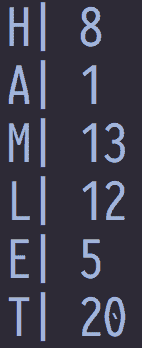

Hash values

数值总和=8+1+13+12+5+20=59

数字除以 26=2，余数为 7

因此，这本书被分配到七号书架。

我们基本上已经找到了一种有条不紊地为每一本书分配书架的方法，因为我们有一个固定的规则，当一本书的新请求到达时，我们几乎可以立即找到它，因为我们将知道与这本书对应的书架。

前面的方法说明了散列的概念，在实践中，我们将使用散列函数为每本书找到唯一的值，并假设我们可以获得任意数量的书架和插槽来放置书籍，我们可以简单地使用书籍的普通数值来识别它属于哪个书架。

在某些情况下，两本书具有相同的数值，在这种情况下，我们可以将书堆叠在与编号对应的插槽中。 在计算机科学中，对应于一个键的多个值的这种效果称为冲突，在这种情况下，我们将通过列表或类似的数据类型来分配多个项。

在现实生活中的用例中，我们要处理的项目比书籍的简单示例要复杂得多。 通常，我们会使用更复杂的散列函数来降低冲突的可能性，并相应地分配键-值对。 数据将存储在内存中的一个连续数组中，因此，当某个键的请求到达时，我们可以通过使用散列函数来识别数据在内存中驻留的位置来即时找到该值。

因此，使用键-值对来存储数据可能非常强大，因为检索与键对应的信息的时间可能非常快，因为不需要搜索长长的列表来识别匹配的键。

键值数据库使用相同的原则为每条记录分配唯一的键，对应于每个键的数据存储在相应的位置。 在我们对 MongoDB 的讨论中，我们看到记录被分配了一个由每个记录中的`_id`值标识的特定键。 在实践中，我们可以使用此值在固定时间内检索相应的数据。

如前所述，memcached 曾经是以键-值对形式存储数据的首选方法，用于需要非常快速地访问频繁使用的数据的 Web 服务。 本质上，它充当存储临时信息的内存缓存。 随着 NoSQL 数据库的出现，扩展 memcached 有限用例的新平台变得突出起来。 诸如 Redis 这样的解决方案不仅提供了在内存中以键-值对存储数据的能力，还提供了将数据持久存储在磁盘上的能力。 此外，这些键值存储支持水平缩放，从而允许跨数百个节点分布键值对。

键值存储的缺点是不能像标准数据库那样灵活地查询数据，后者支持多级索引和更丰富的 SQL 命令集。 然而，恒定时间查找的好处意味着，对于需要键值结构的用例，很少有其他解决方案在性能和效率上具有可比性。 例如，具有数千个用户的购物网站可以将用户简档信息存储在键值数据库中，并且能够通过简单地应用与例如用户 ID 相对应的散列函数来查找个人信息。

如今，键值数据库使用多种方法存储数据：

*   **SSTables**：表示为字符串(并直接映射到**Google 文件系统**(**GFS**))的排序键值对的文件。
*   **B-树**：平衡树，其中的值是通过遍历树叶/节点来标识的。
*   **Bloom Filters**：当密钥数量较多时使用的一种更优化的键值方法。 它使用多个散列函数将与键对应的数组中的位值设置为 1。
*   **shards**：涉及跨多个节点分区数据的过程。

众所周知的键值数据库包括：

| **开源** | **商业** |
| 再说一遍。 | Amazon DynamoDB |
| 卡珊德拉 | 里亚克 |
| 塞斯派克 | Oracle NoSQL |
| Apache Ignite | 天青宇宙 DB |
| Apache 积累 | Oracle Berkeley DB |

# 图形数据库

**图形数据库**提供具有相互关系的记录的数据的有效表示。 典型的例子有你的社交网络好友列表、LinkedIn 联系人、Netflix 电影订户。 通过利用优化算法在基于树/图的数据结构上进行搜索，图数据库可以相对于其他 NoSQL 解决方案以一种新颖的方式定位信息。 在这样的结构中，离散信息和属性被表示为叶、边和节点。

下图显示了网络的非典型表示，可以使用图形数据库查询该网络以发现或查找复杂的相互关系。 实际上，生产图形数据库包含数百万个节点：


Graph Database

尽管它们不像其他类型的 NoSQL 数据库那样流行，但基于图形的平台用于业务关键型领域。 例如，信用卡公司使用图形数据库来查找个人持卡人可能感兴趣的新产品，方法是查询数百万个数据点，以评估具有类似购买模式的其他持卡人的购买行为。 社交网络网站使用图形数据库来计算相似性分数、提供好友建议和其他相关度量。

知名图形数据库包括以下内容：

| **开源** | **商业** |
| Apache 图 | DataSTax 企业图 |
| ♪Neo4j♪ | Teradata ASTER |
| JanusGraph | Oracle Spatial 和 Graph |
| Apache Ignite |  |

# 其他 NoSQL 类型和其他类型数据库的摘要

本节描述了当今使用的一些常见的 NoSQL 范例。 还有其他几个新兴平台都有自己的优势和独特的特点。 以下是其中一些的简要概述：

| **类型** | **功能** |
| 面向对象的数据库 | 利用面向对象编程中的概念来存储表示为对象的数据的数据库。 |
| 云数据库 | 由 Amazon、Microsoft 和 Google 等云供应商提供的数据库，仅在其各自的云平台(如 Amazon RedShift、Azure SQL Database 和 Google BigQuery)上可用。 |
| GPU 数据库 | 利用 GPU(图形处理单元)卡处理数据的数据库世界中较新的进入者。 例如 MAPD、Kinetica 等。 |
| FPGA 加速的数据库 | 随着英特尔很快宣布发布将嵌入 FPGA 的新芯片，百度等公司已经开始开发利用 FPGA 处理能力来提高 SQL 查询性能的 FPGA 加速系统。 |
| 流处理/物联网数据库 | 数据库，或者更一般的平台，为处理诸如来自医疗设备和传感器的流数据而优化。 这类系统最流行的例子之一是 Apache Storm。 |

一个经常被问到的问题是，是否有一种 NoSQL 数据库对所有用例都是最佳的。 虽然数据库可以具有支持 NoSQL 系统(通常称为多模式数据库)的众多元素的多个功能，但在实践中，能够在广泛的用例中普遍表现良好的单一解决方案并不多见。 在现实世界的用例中，公司通常会实现多个解决方案来满足数据挖掘需求。 在下一节中，我们将使用本章讨论的 NoSQL 解决方案完成一些实际数据集的动手练习。

# 用 MongoDB 分析诺贝尔奖得主数据

在第一个练习中，我们将使用领先的面向文档的数据库之一**MongoDB**来分析 1902 年至今的诺贝尔奖得主。 MongoDB 提供了一个简单直观的界面来处理 JSON 文件。 如前所述，JSON 是一种灵活的格式，允许使用结构化方法表示数据。

# JSON 格式

请考虑下表：

| 加入时间：清华大学 2007 年 01 月 25 日下午 3：33 | **加载名称** | **信息** |
| 约翰 （人名） | 15 个 | 科目：历史，B 级 |
| 起重器 / 插座 / 普通人 / 千斤顶 | 18 岁 | 科目：物理，A 级 |
| 少女 / 情人 / 同 gill | 17 | 科目：物理，A+级 |

信息字段包含一个列，其中包含按科目和等级分类的多个值。 此类包含多个数据的列也称为具有嵌套数据的列。

可移植性一直是将数据从一个系统传输到另一个系统的一个重要方面。 通常，ODBC 连接器用于在数据库系统之间传输数据。 另一种常见格式是 CSV 文件，其数据表示为逗号分隔值。 CSV 文件最适合不包含更复杂数据结构(如嵌套值)的结构化数据。 在这种情况下，JSON 提供了一种使用键-值对语法捕获和保存信息的最佳结构化方法。

在 JSON 表示中，该表可以定义如下：

```py
( 
   { 
      "Firstname":"John", 
      "Age":15, 
      "Information":{ 
         "Subject":"History", 
         "Grade":"B" 
      } 
   }, 
   { 
      "Firstname":"Jack", 
      "Age":18, 
      "Information":{ 
         "Subject":"Physics", 
         "Grade":"A" 
      } 
   }, 
   { 
      "Firstname":"Jill", 
      "Age":17, 
      "Information":{ 
         "Subject":"Physics", 
         "Grade":"A+" 
      } 
   } 
) 
```

请注意，`Information`键包含两个键`Subject`和`Grade`，每个键都有相应的值。

如今，大多数产品开发人员和供应商都接受 JSON 格式的数据。 此外，由于可以以文本格式表示和交换复杂关系的简单方式，JSON 在开发人员社区中变得非常流行。

MongoDB 以 JSON 格式捕获数据。 它在内部将它们存储在 BSON 中，BSON 是 JSON 数据的优化二进制表示。

# 安装和使用 MongoDB

MongoDB 在所有主要平台上都受支持，例如 Windows、Linux 和 OS X 平台。

The details for installing MongoDB can be found on their official website at [https://docs.mongodb.com/manual/installation/](https://docs.mongodb.com/manual/installation/). Note that we will be using the MongoDB Community Edition.

在我们的练习中，我们将重用 Cloudera Hadoop 分发 VM 中的 Linux CentOS 环境。

但是，本练习并不依赖于安装 MongoDB 的平台。 安装完成后，您可以在任何其他受支持的平台上执行本章中指示的命令。 如果您可以访问单独的 Linux 计算机，您也可以使用它。

我们将访问 MongoDB 的一些常见语义，并下载两个数据集来计算按大陆分组的最高诺贝尔奖数量。 有关诺贝尔奖获得者的完整数据可从[nobelprize.org](https://www.nobelprize.org)获得。 这些数据包含了获奖者的所有主要属性。 我们希望将这些数据与各自国家的人口信息结合起来，以提取更多有趣的分析信息：

1.  **下载 mongoDB**：mongoDB 可以从[https://www.mongodb.com/download-center#community](https://www.mongodb.com/download-center#community)下载。

为了确定哪个版本适用于我们，我们检查了专用宿主机上安装的 Linux 版本：

```py
(cloudera@quickstart ~)$ lsb_release -a 
LSB Version:     :base-4.0-amd64:base-4.0-noarch:core-4.0-amd64:core-4.0-noarch 
Distributor ID:  CentOS 
Description:     CentOS release 6.7 (Final) 
Release:  6.7 
Codename: Final 
```

2.  根据这些信息，我们必须使用 CentOS 版本的 mongoDB，相应地，我们按照[https://docs.mongodb.com/manual/tutorial/install-mongodb-on-red-hat/](https://docs.mongodb.com/manual/tutorial/install-mongodb-on-red-hat/)中的说明安装了该软件，如下图所示：

```py
The first step involved adding the repo as follows. Type in sudo nano /etc/yum.repos.d/mongodb-org-3.4.repo on the command line and enter the text as shown. 

(root@quickstart cloudera)# sudo nano /etc/yum.repos.d/mongodb-org-3.4.repo 

### Type in the information shown below and press CTRL-X 
### When prompted to save buffer, type in yes

(mongodb-org-3.4)
name=MongoDB Repository
baseurl=https://repo.mongodb.org/yum/redhat/$releasever/mongodb-org/3.4/x86_64/
gpgcheck=1
enabled=1
gpgkey=https://www.mongodb.org/static/pgp/server-3.4.asc
```

以下屏幕截图显示了该文件的内容：

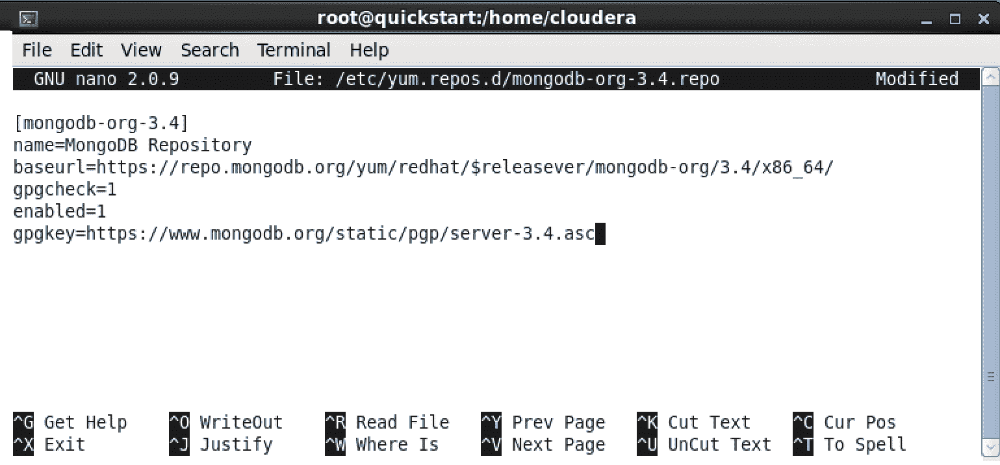

Setting up MongoDB repository

如以下屏幕截图所示，键入`Y`表示是：

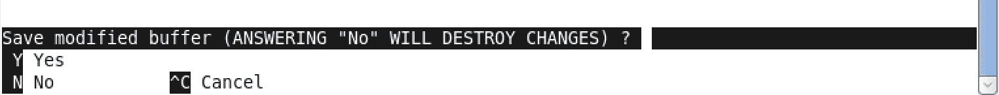

Saving the .repo file

保存文件，如下图所示。 现在，我们可以安装`mongo-db`：


Writing and Saving the .repo file

```py
# Back in terminal, type in the following

(cloudera@quickstart ~)$ sudo yum install -y mongodb-org 

(...) 

Installing: 
 mongodb-org                x86_64         3.4.6-1.el6         mongodb-org-3.4         5.8 k 
Installing for dependencies: 
 mongodb-org-mongos         x86_64         3.4.6-1.el6         mongodb-org-3.4          12 M 
 mongodb-org-server         x86_64         3.4.6-1.el6         mongodb-org-3.4          20 M 
 mongodb-org-shell          x86_64         3.4.6-1.el6         mongodb-org-3.4          11 M 
 mongodb-org-tools          x86_64         3.4.6-1.el6         mongodb-org-3.4          49 M 

Transaction Summary 
===================================================================== 
Install       5 Package(s) 

Total download size: 91 M 
Installed size: 258 M 
Downloading Packages: 
(1/5): mongodb-org-3.4.6-1.el6.x86_64.rpm                             | 5.8 kB     00:00      
(...) 

Installed: 
  mongodb-org.x86_64 0:3.4.6-1.el6                                                            

Dependency Installed: 
  mongodb-org-mongos.x86_64 0:3.4.6-1.el6       mongodb-org-server.x86_64 0:3.4.6-1.el6       
  mongodb-org-shell.x86_64 0:3.4.6-1.el6        mongodb-org-tools.x86_64 0:3.4.6-1.el6        

Complete! 

### Attempting to start mongo without first starting the daemon will produce an error message ### 
### You need to start the mongo daemon before you can use it ### 

(cloudera@quickstart ~)$ mongo MongoDB shell version v3.4.6 
connecting to: mongodb://127.0.0.1:27017 
2017-07-30T10:50:58.708-0700 W NETWORK  (thread1) Failed to connect to 127.0.0.1:27017, in(checking socket for error after poll), reason: Connection refused 
2017-07-30T10:50:58.708-0700 E QUERY    (thread1) Error: couldn't connect to server 127.0.0.1:27017, connection attempt failed : 
connect@src/mongo/shell/mongo.js:237:13 
@(connect):1:6 
exception: connect failed
```

```py
### The first step is to create the MongoDB dbpath - this is where MongoDB will store all data 

### Create a folder called, mongodata, this will be the mongo dbpath ### 

(cloudera@quickstart ~)$ mkdir mongodata
```

```py
### Start mongod ### 

(cloudera@quickstart ~)$ mongod --dbpath mongodata 
2017-07-30T10:52:17.200-0700 I CONTROL  (initandlisten) MongoDB starting : pid=16093 port=27017 dbpath=mongodata 64-bit host=quickstart.cloudera 
(...) 
2017-07-30T10:52:17.321-0700 I INDEX    (initandlisten) build index done.  scanned 0 total records. 0 secs 
2017-07-30T10:52:17.321-0700 I COMMAND  (initandlisten) setting featureCompatibilityVersion to 3.4 
2017-07-30T10:52:17.321-0700 I NETWORK  (thread1) waiting for connections on port 27017 
```

打开新终端，下载 JSON 数据文件，如下图所示：


Selecting Open Terminal from Terminal App on Mac OS X

```py
# Download Files
# laureates.json and country.json ###
# Change directory to go to the mongodata folder that you created earlier 
(cloudera@quickstart ~)$ cd mongodata 

(cloudera@quickstart mongodata)$ curl -o laureates.json "http://api.nobelprize.org/v1/laureate.json" 
  % Total    % Received % Xferd  Average Speed   Time    Time     Time  Current 
                                 Dload  Upload   Total   Spent    Left  Speed 
100  428k    0  428k    0     0   292k      0 --:--:--  0:00:01 --:--:--  354k 

### Clean the file laureates.json 
### Delete content upto the first ( on the first line of the file 
### Delete the last } character from the file 
### Store the cleansed dataset in a file called laureates.json 
```

请注意，该文件需要稍作修改。 代码如下图所示：

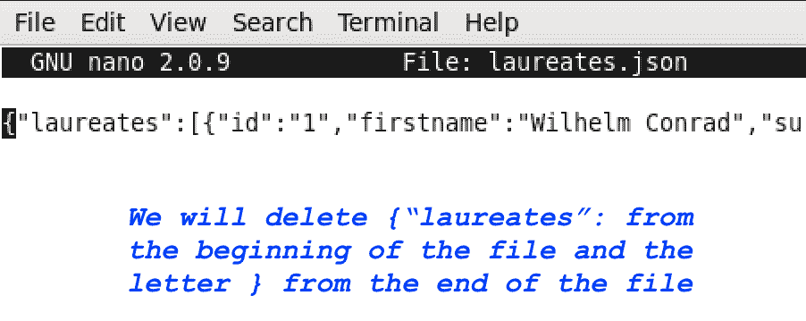

Modifying the .json file for our application

```py
(cloudera@quickstart mongodata)$ cat laureates.json | sed 's/^{"laureates"://g' | sed 's/}$//g' > mongofile.json 

### Import the file laureates.json into MongoDB 
### mongoimport is a utility that is used to import data into MongoDB 
### The command below will import data from the file, mongofile.json 
### Into a db named nobel into a collection (i.e., a table) called laureates 

(cloudera@quickstart mongodata)$ mongoimport --jsonArray --db nobel --collection laureates --file mongofile.json 2017-07-30T11:06:35.228-0700   connected to: localhost 
2017-07-30T11:06:35.295-0700   imported 910 documents 
```

为了将`laureate.json`中的数据与特定国家/地区的信息结合起来，我们需要从[geonames.org](http://geonames.org)下载`countryInfo.txt`。现在我们将下载练习所需的第二个文件`country.json`。 我们将同时使用`laureates.json`和`country.json`进行练习。

`### country.json`：从[http://www.geonames.org](http://www.geonames.org)(License：[https://creativecommons.org/licenses/by/3.0/](https://creativecommons.org/licenses/by/3.0/))下载。 修改 JSON 字符串的开头和结尾，导入 MongoDB，如下所示：

```py
# The file country.json contains descriptive information about all countries
# We will use this file for our tutorial

### Download country.json

(cloudera@quickstart mongodata)$ curl -o country.json "https://raw.githubusercontent.com/xbsd/packtbigdata/master/country.json" 
  % Total    % Received % Xferd  Average Speed   Time    Time     Time  Current 
                                 Dload  Upload   Total   Spent    Left  Speed 
100  113k  100  113k    0     0   360k      0 --:--:-- --:--:-- --:--:--  885k 

### The file, country.json has already been cleaned and can be imported directly into MongoDB 
(cloudera@quickstart mongodata)$ mongoimport --jsonArray --db nobel --collection country --file country.json 2017-07-30T12:10:35.554-0700   connected to: localhost 
2017-07-30T12:10:35.580-0700   imported 250 documents 

### MONGO SHELL ### 
(cloudera@quickstart mongodata)$ mongo MongoDB shell version v3.4.6 
connecting to: mongodb://127.0.0.1:27017 
MongoDB server version: 3.4.6 
Server has startup warnings:  
(...) 

2017-07-30T10:52:17.298-0700 I CONTROL  (initandlisten)  

### Switch to the database nobel using the 'use <databasename>' command 
> use nobel switched to db nobel 

### Show all collections (i.e., tables) 
### This will show the tables that we imported into MongoDB - country and laureates
> show collections country 
laureates 
>  

### Collections in MongoDB are the equivalent to tables in SQL 

### 1\. Common Operations 

### View collection statistics using db.<dbname>.stats() 
> db.laureates.stats() 

   "ns" : "nobel.laureates", # Name Space 
   "size" : 484053,          # Size in Bytes 
   "count" : 910,            # Number of Records 
   "avgObjSize" : 531,       # Average Object Size 
   "storageSize" : 225280,   # Data size 

# Check space used (in bytes) 
> db.laureates.storageSize() 225280 

# Check number of records
> db.laureates.count() 910 

### 2\. View data from collection 
### 
### There is an extensive list of commands that can be used in MongoDB. As such discussing them all is outside the scope of the text. However, a few of the familiar commands have been given below as a marker to help the reader get started with the platform. 

### See first record for laureates using findOne() 
### findOne() will show the first record in the collection 
> db.laureates.findOne() 

{ 
   "_id" : ObjectId("597e202bcd8724f48de485d4"), 
   "id" : "1", 
   "firstname" : "Wilhelm Conrad", 
   "surname" : "Röntgen", 
   "born" : "1845-03-27", 
   "died" : "1923-02-10", 
   "bornCountry" : "Prussia (now Germany)", 
   "bornCountryCode" : "DE", 
   "bornCity" : "Lennep (now Remscheid)", 
   "diedCountry" : "Germany", 
   "diedCountryCode" : "DE", 
   "diedCity" : "Munich", 
   "gender" : "male", 
   "prizes" : ( 
          { 
                 "year" : "1901", 
                 "category" : "physics", 
                 "share" : "1", 
                 "motivation" : "\"in recognition of the extraordinary services he has rendered by the discovery of the remarkable rays subsequently named after him\"", 
                 "affiliations" : ( 
                        { 
                               "name" : "Munich University", 
                               "city" : "Munich", 
                               "country" : "Germany" 
                        } 
                 ) 
          } 
   ) 
} 

### See all records for laureates
> db.laureates.find() 

{ "_id" : ObjectId("597e202bcd8724f48de485d4"), "id" : "1", "firstname" : "Wilhelm Conrad", "surname" : "Röntgen", "born" : "1845-03-27", "died" : "1923-02-10", "bornCountry" : "Prussia (now Germany)", "bornCountryCode" : "DE", "bornCity" : "Lennep (now Remscheid)" 
(...) 

... 

### MongoDB functions accept JSON formatted strings as parameters to options 
### Some examples are shown below for reference 

### Query a field - Find all Nobel Laureates who were male 
> db.laureates.find({"gender":"male"}) 
(...) 
{ "_id" : ObjectId("597e202bcd8724f48de485d5"), "id" : "2", "firstname" : "Hendrik Antoon", "surname" : "Lorentz", "born" : "1853-07-18", "died" : "1928-02-04", "bornCountry" : "the Netherlands", "bornCountryCode" : "NL", "bornCity" : "Arnhem", "diedCountry" : "the Netherlands", "diedCountryCode" : "NL", "gender" : "male", "prizes" : ( { "year" : "1902", "category" : "physics", "share" : "2", "motivation" : "\"in recognition of the extraordinary service they rendered by their researches into the influence of magnetism upon radiation phenomena\"", "affiliations" : ( { "name" : "Leiden University", "city" : "Leiden", "country" : "the Netherlands" } ) } ) } 
(...) 
```

查询一个领域-查找所有在美国出生并获得诺贝尔物理学奖的诺贝尔奖获得者。 请注意，这里有一个嵌套字段(如下所示，类别位于奖品下面)。 因此，我们将使用如下图所示的点符号。

该图显示了其中一个嵌套字段`category`：


Nested JSON Fields

```py
> db.laureates.find({"bornCountryCode":"US", "prizes.category":"physics", "bornCity": /Chicago/}) 

{ "_id" : ObjectId("597e202bcd8724f48de48638"), "id" : "103", "firstname" : "Ben Roy", "surname" : "Mottelson", "born" : "1926-07-09", "died" : "0000-00-00", "bornCountry" : "USA", "bornCountryCode" : "US", "bornCity" : "Chicago, IL", 
... 

### Check number of distinct prize categories using distinct 
> db.laureates.distinct("prizes.category") ( 
   "physics", 
   "chemistry", 
   "peace", 
   "medicine", 
   "literature", 
   "economics" 
) 

### Using Comparison Operators 
### MongoDB allows users to chain multiple comparison operators
### Details on MongoDB operators can be found at: https://docs.mongodb.com/manual/reference/operator/ 

# Find Nobel Laureates born in either India or Egypt using the $in operator
> db.laureates.find ( { bornCountryCode: { $in: ("IN","EG") } } ) 

{ "_id" : ObjectId("597e202bcd8724f48de485f7"), "id" : "37", "firstname" : "Sir Chandrasekhara Venkata", "surname" : "Raman", "born" : "1888-11-07", "died" : "1970-11-21", "bornCountry" : "India", "bornCountryCode" : "IN", "bornCity" : "Tiruchirappalli", "diedCountry" : "India", "diedCountryCode" : "IN", "diedCity" : "Bangalore", "gender" : "male", "prizes" : ( { "year" : "1930", "category" : "physics", "share" : "1", "motivation" : "\"for his work on the scattering of light and for the discovery of the effect named after him\"", "affiliations" : ( { "name" : "Calcutta University", "city" : "Calcutta", "country" : "India" } ) } ) } 
... 

### Using Multiple Comparison Operators 

### Find Nobel laureates who were born in either US or China and won prize in either Physics or Chemistry using the $and and $or operator 
> db.laureates.find( { 
$and : ({ $or : ( { bornCountryCode : "US" }, { bornCountryCode : "CN" } ) },
{ $or : ( { "prizes.category" : "physics" }, { "prizes.category" : "chemistry" }  ) } 
    ) 
} ) 

{ "_id" : ObjectId("597e202bcd8724f48de485ee"), "id" : "28", "firstname" : "Robert Andrews", "surname" : "Millikan", "born" : "1868-03-22", "died" : "1953-12-19", "bornCountry" : "USA", "bornCountryCode" : "US", "bornCity" : "Morrison, IL", "diedCountry" : "USA", "diedCountryCode" : "US", "diedCity" : "San Marino, CA", "gender" : "male", "prizes" : ( { "year" : "1923", "category" : "physics", "share" : "1", "motivation" : "\"for his work on the elementary charge of electricity and on the photoelectric effect\"", "affiliations" : ( { "name" : "California Institute of Technology (Caltech)", "city" : "Pasadena, CA", "country" : "USA" } ) } ) } 
... 

### Performing Aggregations is one of the common operations in MongoDB queries 
### MongoDB allows users to perform pipeline aggregations, map-reduce aggregations and single purpose aggregations 

### Details on MongoDB aggregations can be found at the URL 
### https://docs.mongodb.com/manual/aggregation/ 

### Aggregation Examples 

### Count and aggregate total Nobel laureates by year and sort in descending order 
### Step 1: Use the $group operator to indicate that prize.year will be the grouping variable 
### Step 2: Use the $sum operator (accumulator) to sum each entry under a variable called totalPrizes 
### Step 3: Use the $sort operator to rank totalPrizes 

> db.laureates.aggregate( 
  {$group: {_id: '$prizes.year', totalPrizes: {$sum: 1}}},  
  {$sort: {totalPrizes: -1}} 
); 

{ "_id" : ( "2001" ), "totalPrizes" : 15 } 
{ "_id" : ( "2014" ), "totalPrizes" : 13 } 
{ "_id" : ( "2002" ), "totalPrizes" : 13 } 
{ "_id" : ( "2000" ), "totalPrizes" : 13 } 

(...) 

### To count and aggregate total prizes by country of birth 
> db.laureates.aggregate( 
  {$group: {_id: '$bornCountry', totalPrizes: {$sum: 1}}}, 
  {$sort: {totalPrizes: -1}} 
); 

{ "_id" : "USA", "totalPrizes" : 257 } 
{ "_id" : "United Kingdom", "totalPrizes" : 84 } 
{ "_id" : "Germany", "totalPrizes" : 61 } 
{ "_id" : "France", "totalPrizes" : 51 } 
...

### MongoDB also supports PCRE (Perl-Compatible) Regular Expressions 
### For more information, see https://docs.mongodb.com/manual/reference/operator/query/regex 

### Using Regular Expressions: Find count of nobel laureates by country of birth whose prize was related to 'radiation' (as indicated in the field motivation under prizes) 

> db.laureates.aggregate( 
  {$match : { "prizes.motivation" : /radiation/ }}, 
  {$group: {_id: '$bornCountry', totalPrizes: {$sum: 1}}},  
  {$sort: {totalPrizes: -1}} 
); 

{ "_id" : "USA", "totalPrizes" : 4 } 
{ "_id" : "Germany", "totalPrizes" : 2 } 
{ "_id" : "the Netherlands", "totalPrizes" : 2 } 
{ "_id" : "United Kingdom", "totalPrizes" : 2 } 
{ "_id" : "France", "totalPrizes" : 1 } 
{ "_id" : "Prussia (now Russia)", "totalPrizes" : 1 } 

#### Result: We see that the highest number of prizes (in which radiation was mentioned as a key-word) was the US 

### Interestingly, we can also do joins and other similar operations that allow us to combine the data with other data sources 
### In this case, we'd like to join the data in laureates with the data from country information obtained earlier 
### The collection country contains many interesting fields, but for this exercise, we will show how to find the total number of nobel laureates by continent 

### The Left Join 

### Step 1: Use the $lookup operator to define the from/to fields, collection names and assign the data to a field named countryInfo 

### We can join the field bornCountryCode from laureates with the field countryCode from the collection country 
> db.laureates.aggregate( 
  {$lookup: { from: "country", localField: "bornCountryCode", foreignField: "countryCode", as: "countryInfo" }}) 

{ "_id" : ObjectId("597e202bcd8724f48de485d4"), "id" : "1", "firstname" : "Wilhelm Conrad", "surname" : "Röntgen", "born" : "1845-03-27", "died" : "1923-02-10", "bornCountry" : "Prussia (now Germany)", "bornCountryCode" : "DE", "bornCity" : "Lennep (now (..) "country" : "Germany" } ) } ), "countryInfo" : ( { "_id" : ObjectId("597e2f2bcd8724f48de489aa"), "continent" : "EU", "capital" : "Berlin", "languages" : "de", "geonameId" : 2921044, "south" : 47.2701236047002, ...

### With the data joined, we can now perform combined aggregations 

### Find the number of Nobel laureates by continent 
> db.laureates.aggregate( 
  {$lookup: { from: "country", localField: "bornCountryCode", foreignField: "countryCode", as: "countryInfo" }}, 
  {$group: {_id: '$countryInfo.continent', totalPrizes: {$sum: 1}}}, 
  {$sort: {totalPrizes: -1}} 
); 

... ); 
{ "_id" : ( "EU" ), "totalPrizes" : 478 } 
{ "_id" : ( "NA" ), "totalPrizes" : 285 } 
{ "_id" : ( "AS" ), "totalPrizes" : 67 } 
...
This indicates that Europe has by far the highest number of Nobel Laureates.  
```

还可以执行许多其他操作，但上一节的目的是通过一个简单的用例从高层次介绍 MongoDB。 本章中给出的 URL 包含有关使用 MongoDB 的更深入信息。

业界还有几个可视化工具，用于通过点击式界面与 MongoDB 集合中存储的数据进行交互和可视化。 在[https://www.mongodb.com/download-center?filter=enterprise?jmp=nav#compass.上提供了一个名为 MongoDB Compass 的简单而强大的工具。](https://www.mongodb.com/download-center?filter=enterprise?jmp=nav#compass)

导航到前面提到的 URL 并下载适合您环境的 Compass 版本：

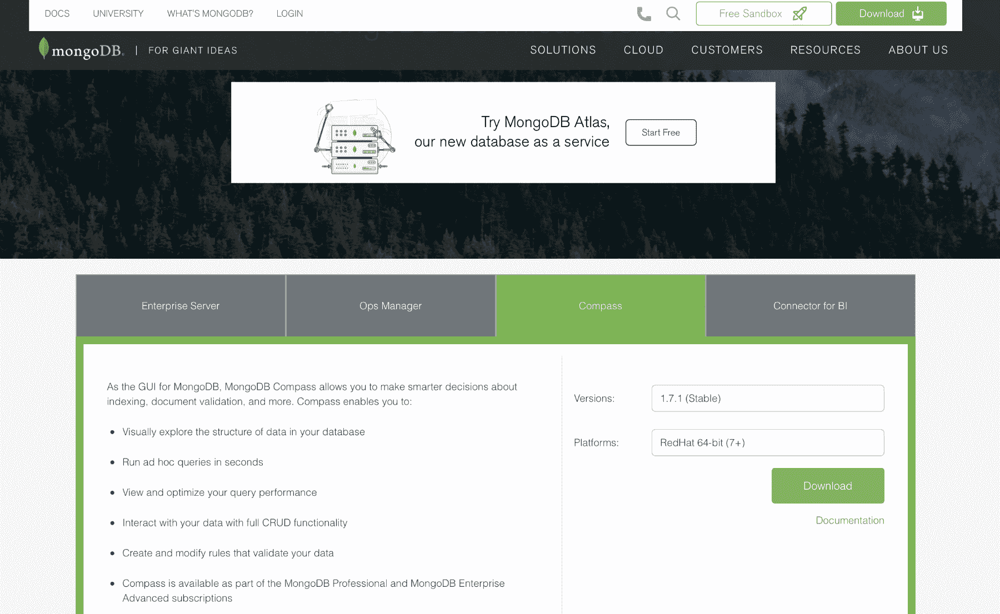

Downloading MongoDB Compass

安装后，您将看到欢迎屏幕。 单击 Next(下一步)，直到您看到主控制面板：


MongoDB Compass Screenshot

点击 Performance 查看 MongoDB 的当前状态：

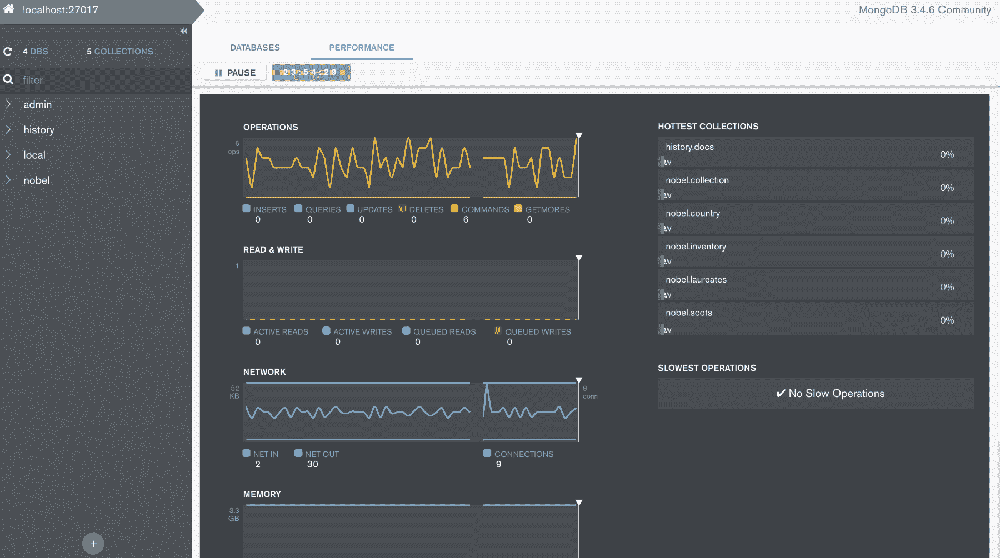

MongoDB Performance Screen

点击左边栏单词旁边的箭头，展开诺贝尔数据库。 您可以在条形图的不同部分上单击并拖动，然后运行即席查询。 如果您希望全面了解数据集，而不必手动运行所有查询，这非常有用，如以下屏幕截图所示：


Viewing our file in MongoDB Compass

# 使用真实数据跟踪医生付款

医生和医院都会从各种外部组织(如制药公司)那里获得报酬，这些组织聘请销售代表，不仅让医生了解他们的产品，而且还提供实物或其他形式的礼物或付款。 从理论上讲，向医生支付礼物或付款并不是为了影响他们的处方行为，制药公司采取了谨慎的措施，以保持对支付给医疗保健提供者的付款的制衡。

2010 年，奥巴马总统签署的**平价医疗法案**(**ACA**)生效，通俗地说就是奥巴马医改。 除了 ACA，另一项名为阳光法案的单独立法规定，制药公司和其他组织必须(直接或间接)报告有货币价值的项目。 虽然过去存在这样的规则，但在公共领域很少有这样的规则可用。 通过公开向所有医生提供详细的付款记录，阳光法案在涉及医疗保健提供者的货币交易中引入了前所未有的透明度。

这些数据可以在 CMS Open Payments 的网站[https://openpaymentsdata.cms.gov](https://openpaymentsdata.cms.gov)上免费获得。

该站点提供了查询数据的接口，但没有执行大规模数据聚合的任何手段。 例如，如果用户想要查找在 CT 状态下支付的总金额，则没有简单方便的方法通过默认的基于 Web 的工具运行查询。 提供该功能的 API 是可用的，但需要一定程度的熟悉和技术知识才能有效使用。 有提供此类功能的第三方产品，但在大多数情况下价格昂贵，并且最终用户无法根据其特定需求修改软件。

在本教程中，我们将开发一个快速、高效的基于 Web 的应用来分析数千万条记录，这些记录记录了 2016 年向医生支付的费用。 我们将使用 NoSQL 数据库、R 和 RStudio 的组合来创建最终产品-基于 Web 的门户，最终用户可以通过它实时查询数据库。

我们将用于开发该应用的技术如下：

*   帖子主题：Re：Колибриобработаетсяпрограммированияпрограммирования
*   英语字母中的第十八个字母 / R 类
*   RStudio

在本教程中，我将使用我们为 Hadoop 练习下载的 VM 映像。 这些工具还可以安装在 Windows、Mac 和其他 Linux 计算机上。 选择虚拟机主要是为了提供一致的、本地操作系统独立的平台。

# 安装 kdb+、R 和 RStudio

已提供 Packt Data Science VM 下载，其中包含本章所需的所有必要软件。 但是，如果您更喜欢在本地计算机上安装该软件，请参阅以下各节中的说明。 您可以跳过安装部分，直接转到*开发 Open Payment Application 一节。*

# 正在安装 kdb+

**kdb+**是一个时序的、内存中的、柱状的数据库，在金融行业中已经使用了近 20 年。 它是可用于执行大规模数据挖掘的速度最快的数据库平台之一，但不像其他 NoSQL 工具那样广为人知，因为它在其存在的大部分时间里几乎只由对冲基金和投资银行使用。 特别是，由于其处理海量数据的速度和开销较低，它被从事高频交易的算法交易部门使用。

使用 kdb+，在笔记本电脑上分析数千万甚至数亿条记录相当简单。 主要限制将在硬件级别上-例如可用于处理数据的内存量、磁盘空间和 CPU。 在本教程中，我们将安装可供非商业使用的免费 32 位版本的 kdb+。

KDB+不是开源的，但学术机构可以通过写信给`academic@kx.com`免费使用 64 位许可证。

Kdb+的某些关键特性使其非常适合大规模数据分析：

*   **低级实现**：数据库是用 C 语言编写的，因此减少了当前大多数严重依赖 Java 的 NoSQL 数据库性能问题的常见原因，Java 实现了多个抽象层来提供处理能力
*   **体系结构简单性**：kdb+数据库的整个二进制大小约为 500-600KB。 这是一首 MP3 歌曲的一小部分，即使在拨号连接上也可以很容易地下载
*   **MapReduce**：数据库实现内部 MapReduce 进程，允许跨多个核心同时执行查询
*   **无需安装**：数据库不需要系统级权限，用户可以在大多数系统上使用其用户帐户开始使用 kdb+
*   **Enterprise-Ready**：该数据库已使用近 20 年，是全球企业环境中用于分析高频交易数据和其他应用的非常成熟的产品
*   **接口的广泛可用性**：数据库具有广泛的接口，可用于 C、C++、C#、Java、R、Python、MATLAB 等语言，以便与现有软件轻松集成

安装 kdb+的步骤如下。 请注意，如果您使用的是 Packt Data Science VM，则无需额外安装。 这些说明主要是为想要重新安装该软件的用户提供的。

Although the instructions are for Linux, the installation process is also quite simple for both Windows and Macs. The instructions herein are geared towards the Packt Data Science VM. The instructions for downloading the Packt Data Science VM was provided in [Chapter 3](03.html), *The Analytics Toolkit*

1.  访问[www.kx.com](http://www.kx.com)，然后从 Connect With us 菜单项中单击**Download**下拉选项。 您也可以直接进入[https://kx.com/download/](https://kx.com/download/)的下载页面：

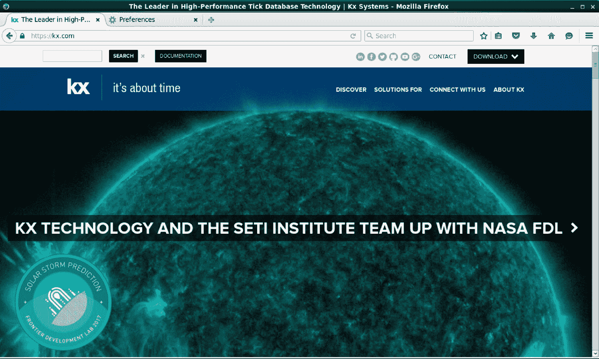

Kx Systems Homepage

下载页面如以下截图所示：


Downloading KDB+

2.  单击下一页的下载。
3.  您将被带到[https://kx.com/download/](https://kx.com/download/)，在这里您可以在同意条款后选择各自的下载。 如果您使用的是 VM，请下载*Linux-86 版本*。
4.  选择保存文件将下载的 ZIP 文件保存在下载文件夹中：

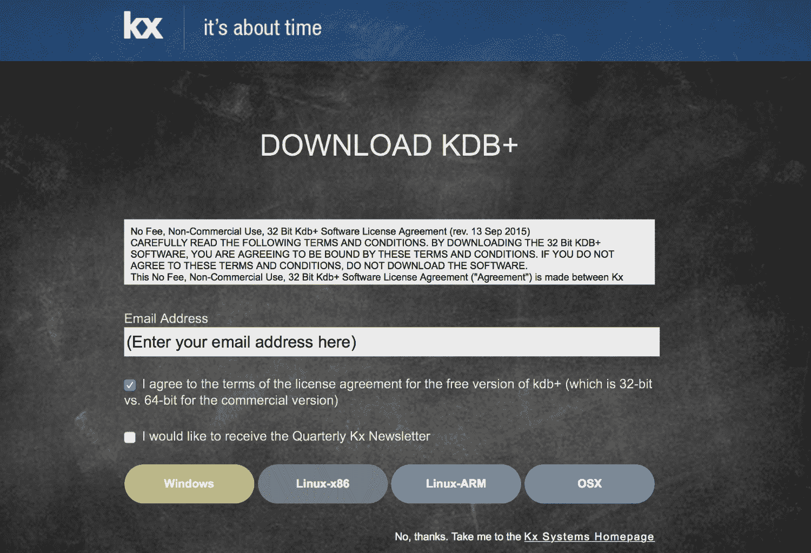

KDB+ 32-bit license terms Go to the folder where the file was downloaded and copy the ZIP file under your home directory:

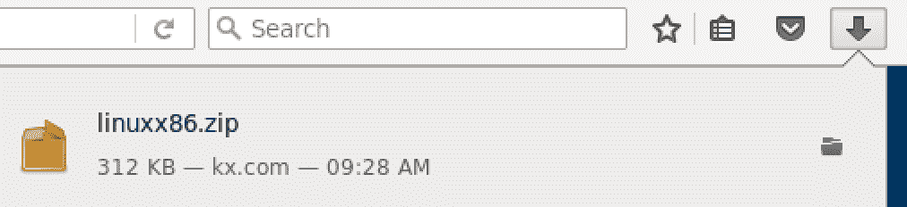

KDB+ Zip file download

对于 Mac 或 Linux 系统，这将是`~/`文件夹。 在 Windows 中，将 ZIP 文件复制到`C:\`下，然后解压缩以解压缩`q`文件夹。 以下说明主要适用于基于 Linux 的系统：

```py
$ cd Downloads/ # cd to the folder where you have downloaded the zip file 

$ unzip linuxx86.zip  
Archive:  linuxx86.zip 
  inflating: q/README.txt             
  inflating: q/l32/q                  
  inflating: q/q.q                    
  inflating: q/q.k                    
  inflating: q/s.k                    
  inflating: q/trade.q                
  inflating: q/sp.q                   

$ mv ~/Downloads/q ~/ 
$ cd ~/q 
$ cd l32 
$ ./q KDB+ 3.5 2017.06.15 Copyright (C) 1993-2017 Kx Systems 
l32/ 1()core 3830MB cloudera quickstart.cloudera 10.0.2.15 NONEXPIRE   

Welcome to kdb+ 32bit edition 
For support please see http://groups.google.com/d/forum/personal-kdbplus 
Tutorials can be found at http://code.kx.com/wiki/Tutorials 
To exit, type \\ 
To remove this startup msg, edit q.q 
q)\\
```

```py
/NOTE THAT YOU MAY NEED TO INSTALL THE FOLLOWING IF YOU GET AN ERROR MESSAGE STATING THAT THE FILE q CANNOT BE FOUND. IN THAT CASE, INSTALL THE REQUISITE SOFTWARE AS SHOWN BELOW 

$ sudo dpkg --add-architecture i386 
$ sudo apt-get update 
$ sudo apt-get install libc6:i386 libncurses5:i386 libstdc++6:i386 
```

# 安装 R

应用的前端将使用 R 进行开发。有三种安装 R 的选项可以完成本教程：

1.  如果您已从[第 3 章](03.html)、*The Analytics Toolkit*安装了 Microsoft R，并且将使用您的本地计算机完成本教程，则无需进一步安装。
2.  或者，如果您将使用 Packt Data Science VirtualBox VM，则不需要进一步安装。
3.  如果您计划从 R 官方网站安装 R，则可以从[https://cran.r-project.org/mirrors.html](https://cran.r-project.org/mirrors.html)列出的任何下载站点(镜像)下载二进制文件：

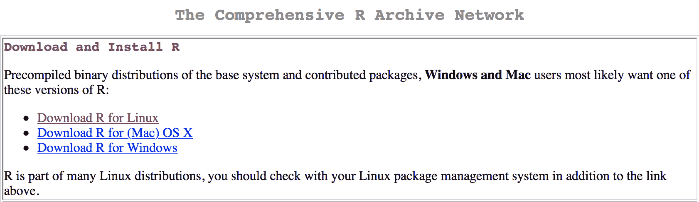

Installing Open Source R

# 安装 RStudio

我们将使用 RStudio 来构建基于 Web 的应用。 您可以从网站下载 RStudio 的二进制文件，也可以从终端安装。 RStudio 有两个版本-RStudio 桌面和 RStudio 服务器。 这两个版本都可用于构建应用。 Server 版本提供可供多个用户使用的界面，而 Desktop 版本通常在用户的计算机上本地使用。

The instructions also appear in [Chapter 3](03.html), *The Analytics Toolkit*. They have been provided here for reference.

有两种方法可以完成 R 教程的安装：

1.  如果您要使用 Packt Data Science VM，则无需进一步安装。

2.  如果您将使用本地计算机学习本教程，您可以从[https://www.rstudio.com/products/rstudio/download/#download](https://www.rstudio.com/products/rstudio/download/#download)下载 RStudio Desktop，或者从[https://www.rstudio.com/products/rstudio/download-server/](https://www.rstudio.com/products/rstudio/download-server/)下载 RStudio Server(仅适用于 Linux 用户)。

为希望从供应商网站下载 RStudio 并执行全新安装的用户提供了以下说明：

进入[https://www.rstudio.com](https://www.rstudio.com)网站，点击**产品**|**RStudio**：

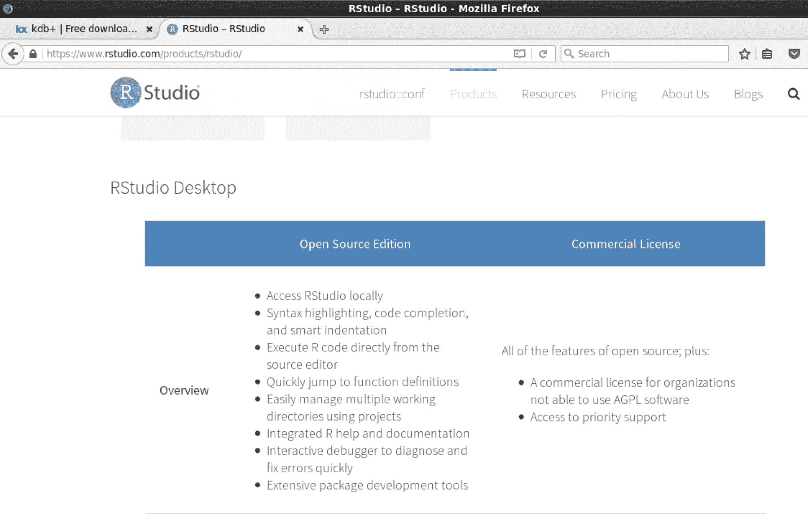

Open Source R Studio Desktop Versions

在 RStudio 页面上，单击**下载 RStudio 桌面**：

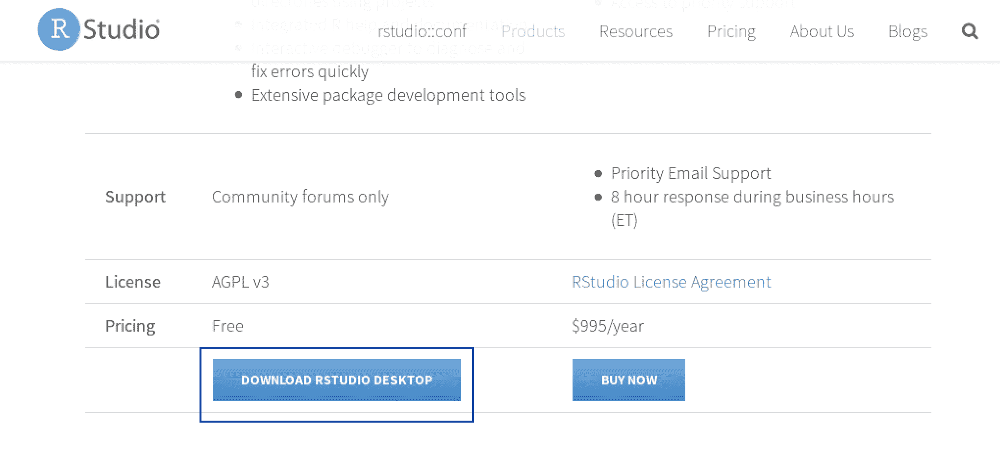

Selecting RStudio Desktop

选择 RStudio Desktop 的免费版本：


Selecting Open Source R Studio Desktop

RStudio 可用于 Windows、Mac 和 Linux。

下载适用于您的系统的可执行文件，然后继续执行安装：


RStudio Binaries (Versions)

# CMS 开放支付门户

在本节中，我们将开始开发 CMS Open Payments 的应用。

Packt Data Science VM 包含本教程所需的所有软件。 要下载 VM，请参阅[第 3 章](03.html)和*分析工具包*。

# 下载 CMS Open Payments 数据

CMS Open Payments 数据可通过网络直接从 CMS 网站下载。 我们将使用 Unix wget 实用程序下载数据，但首先我们必须在 CMS 网站注册以获得我们自己的 API 密钥：

1.  转到[https://openpaymentsdata.cms.gov](https://openpaymentsdata.cms.gov)并单击页面右上角的登录链接：


Homepage of CMS OpenPayments

*单击**注册**：


Sign-Up Page on CMS OpenPayments

输入您的信息，然后单击**创建我的帐户**按钮：

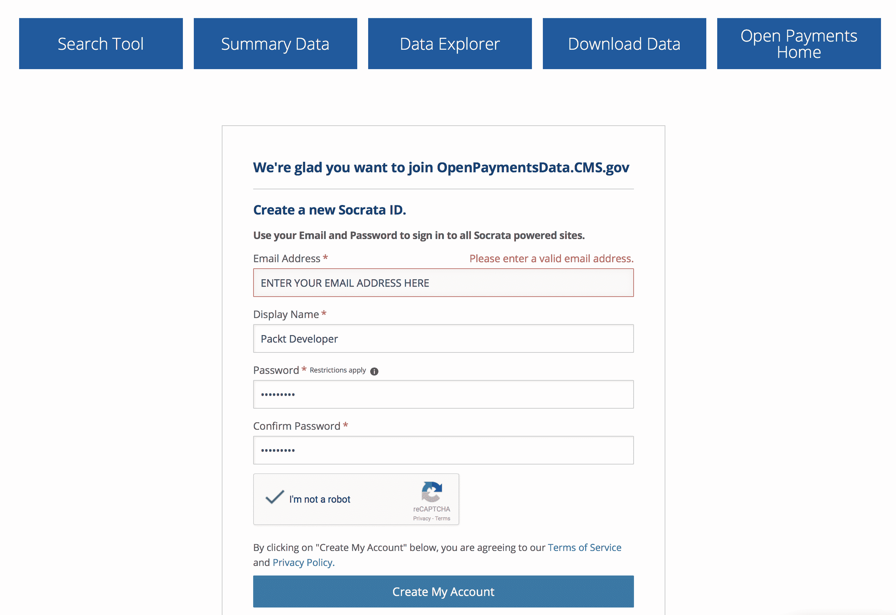

Sign-Up Form for CMS OpenPayments

_**登录到您的帐户**：

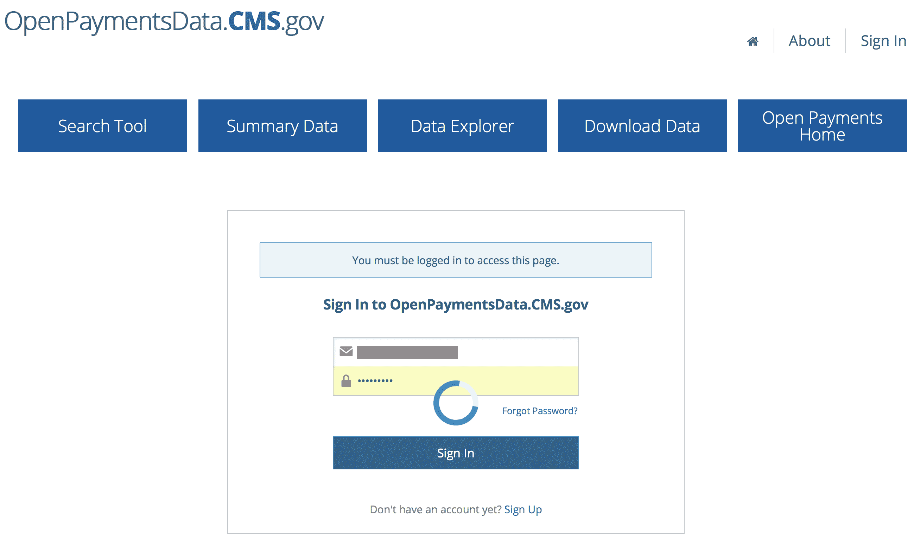

Signing into CMS OpenPayments

单击**Packt Developer‘s Applications**下的**Manage**。 请注意，此处的应用指的是您可能创建的应用，这些应用将查询 CMS 网站上提供的数据：

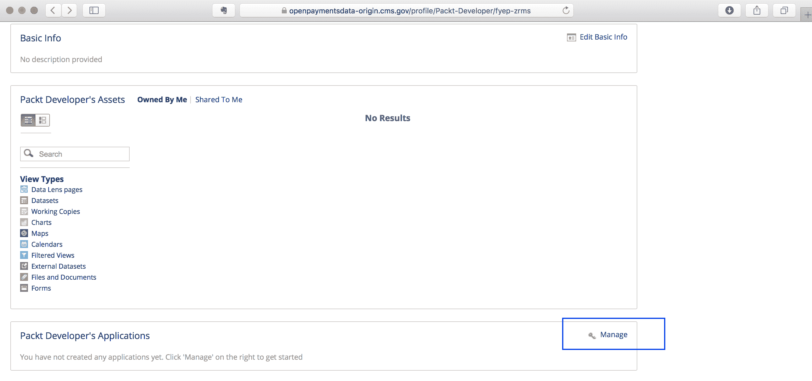

Creating 'Applications'

为应用指定名称(示例如下图所示)：


Defining an application

*您将收到**应用令牌**已创建的通知：


Creating the Application Token

系统将生成**应用令牌**。 复制**应用令牌**：


The Application Token

2.  现在，以用户 Packt 的身份登录 Packt Data Science VM，并在将术语`YOURAPPTOKEN`替换为分配给您的术语`YOURAPPTOKEN`(它将是一个很长的字符串/数字)后执行以下 shell 命令。 请注意，对于本教程，我们将只下载几个专栏，并将数据限制为只有医生(另一个选项是医院)。

您可以通过将命令末尾指定的限制值减少到一个较小的数字来减少下载的数据量。 在命令中，我们使用了`12000000`(1200 万)，这将允许我们下载代表医生付款的整个 2016 年的数据集。 例如，如果您只下载 100 万个条目，而不是大约 1100 万到 1200 万条记录，应用仍然可以工作。

Note: Two approaches are shown below. One using the Token and the other without using the Token. Application Tokens allow users to have a higher throttling limit. More information can be found at [https://dev.socrata.com/docs/app-tokens.html](https://dev.socrata.com/docs/app-tokens.html)

```py
# Replace YOURAPPTOKEN and 12000000 with your API Key and desired record limit respectively

cd /home/packt; 

time wget -O cms2016.csv 'https://openpaymentsdata.cms.gov/resource/vq63-hu5i.csv?$$app_token=YOURAPPTOKEN&$query=select Physician_First_Name as firstName,Physician_Last_Name as lastName,Recipient_City as city,Recipient_State as state,Submitting_Applicable_Manufacturer_or_Applicable_GPO_Name as company,Total_Amount_of_Payment_USDollars as payment,Date_of_Payment as date,Nature_of_Payment_or_Transfer_of_Value as paymentNature,Product_Category_or_Therapeutic_Area_1 as category,Name_of_Drug_or_Biological_or_Device_or_Medical_Supply_1 as product where covered_recipient_type like "Covered Recipient Physician" limit 12000000' 
```

**Important**: It is possible to also download the file without using an app token. However, the method should be used sparingly. The URL to download the file without using an application token is shown as follows:

```py
# Downloading without using APP TOKEN
 wget -O cms2016.csv 'https://openpaymentsdata.cms.gov/resource/vq63-hu5i.csv?$query=select Physician_First_Name as firstName,Physician_Last_Name as lastName,Recipient_City as city,Recipient_State as state,Submitting_Applicable_Manufacturer_or_Applicable_GPO_Name as company,Total_Amount_of_Payment_USDollars as payment,Date_of_Payment as date,Nature_of_Payment_or_Transfer_of_Value as paymentNature,Product_Category_or_Therapeutic_Area_1 as category,Name_of_Drug_or_Biological_or_Device_or_Medical_Supply_1 as product where covered_recipient_type like "Covered Recipient Physician" limit 12000000'
```

# 创建 Q 应用

本节介绍创建 kdb+/q 应用的过程，从从数据库加载数据并创建用作应用后端的脚本开始。

# 加载数据

使用 ID`packt`(密码：`packt`)登录到虚拟机：


Logging into the Packt VM

```py
# We will start KDB+ - the NoSQL database that we'll use for the tutorial

# Launch the Q Console by typing: 

packt@vagrant:~$ rlwrap ~/q/l32/q -s 4 -p 5001 

KDB+ 3.5 2017.06.15 Copyright (C) 1993-2017 Kx Systems 
l32/ 1()core 3951MB packt vagrant 127.0.1.1 NONEXPIRE 

Welcome to kdb+ 32bit edition 
For support please see http://groups.google.com/d/forum/personal-kdbplus 
Tutorials can be found at http://code.kx.com/wiki/Tutorials 
To exit, type \\ 
To remove this startup msg, edit q.q 
q) 
```

```py
# Enter the following at the Q console. Explanations for each of the commands have been provided in the comments (using /):/change to the home directory for user packt 
\cd /home/packt/ /Define the schema of the cms table 
d:(`category`city`company`date`firstName`lastName`payment`paymentNature`product`state)!"SSSZSSFSSS"; /Read the headersfrom the cms csv file. These will be our table column names 
 columns:system "head -1 cms2016.csv"; 
columns:`$"," vs ssr(raze columns;"\"";""); /Run Garbage Collection 
.Q.gc(); /Load the cms csv file 
\ts cms2016:(d columns;enlist",")0:`:cms2016.csv; /Add a month column to the data 
\ts cms2016: `month`date xasc update month:`month$date, date:`date$date from cms2016 

.Q.gc(); /Modify character columns to be lower case. The data contains u 
\ts update lower firstName from `cms2016 
\ts update lower lastName from `cms2016 
\ts update lower city from `cms2016 
\ts update lower state from `cms2016 
\ts update lower product from `cms2016 
\ts update lower category from `cms2016 
\ts update lower paymentNature from `cms2016 
\ts update lower company from `cms2016
.Q.gc() 

cms2016:`month`date`firstName`lastName`company`state`city`product`category`payment`paymentNature xcols cms2016 

count cms2016 /11 million /Function to save the data that was read from the CMS csv file
 savedata:{show (string .z.T)," Writing: ",string x;cms::delete month from select from cms2016 where month=x; .Q.dpft(`:cms;x;`date;`cms)} 
```

```py
/Save the data in monthly partitions in the current folder 
 savedata each 2016.01m +til 12
```

# 后端代码

脚本完成后，键入`\\`并按*Enter*退出 Q 提示符。

将以下文本复制到名为`cms.q`的文件中：

```py
system "p 5001" 

system "l /home/packt/cms" 

/firstCap: Takes a string (sym) input and capitalizes the first letter of each word separated by a blank space 
firstCap:{" " sv {@(x;0;upper)} each (" " vs string x) except enlist ""}
/VARIABLES AND HELPER TABLES 

/alldata: Aggregates data from the primary cms database 
alldata: distinct `company`product xasc update showCompany:`$firstCap each company, showProduct:`$firstCap each product from ungroup select distinct product by company from cms where not null product 

/minDate: First month 
minDate:exec date from select min date from cms where month=min month 

/maxDate: Last month 
maxDate:exec date from select max date from cms where month=max month 

/companyStateCity: Cleans and normalises the company names (capitalisations, etc) 
companyStateCity:select asc upper distinct state, asc `$firstCap each distinct city by company from cms 

/FUNCTIONS 
/getShowProduct: Function to get product list from company name  getShowProduct:{$((`$"Select All") in x;raze exec showProduct from alldata;exec showProduct from alldata where showCompany in x)}
/getShowState: Function to get state list from company name getShowState:{$((`$"Select All") in x;raze exec state from companyStateCity;exec state from companyStateCity where company = exec first company from alldata where showCompany in x)}
/getShowCity: Function to get city list from company name 
getShowCity:{$((`$"Select All") in x;raze exec city from companyStateCity;exec city from companyStateCity where company = exec first company from alldata where showCompany in x)}
/getShowInfo: Generic Function for Product, State and City 
getShowInfo:{y:`$"|" vs y;:asc distinct raze raze $(x~`product;getShowProduct each y;x~`state;getShowState each y;x~`city;getShowCity each y;"")}

/Example: Run this after loading the entire script after removing the comment mark (/) from the beginning 
/getShowInfo(`state;"Abb Con-cise Optical Group Llc|Select All|Abbott Laboratories") 

/Convert encoded URL into a Q dictionary 
decodeJSON:{.j.k .h.uh x} 

/Convert atoms to list 
ensym:{$(0>type x;enlist x;x)}

/Date functions 

withinDates:{enlist (within;`date;"D"$x(`date))} 
withinMonths:{enlist (within;`month;`month$"D"$x(`date))} 
/Helper function to remove null keys 
delNullDict:{kx!x kx:where {not x~0n} each x}
/If showdata=enlist 1, 

/Function to process the data for displaying results only 

getData:{"x is the dictionary from web";d:`$dx:lower delNullDict x; enz:`$delete showData,date,columns from dx; ?(`cms;(withinMonths x),(withinDates x),{(in;x 0;enlist 1_x)} each ((key enz),'value enz);0b;(dc)!dc:ensym `$x`columns)}

/Aggregation Function

aggDict:(`$("Total Payment";"Number of Payments";"Minimum Payment";"Maximum Payment";"Average Payment"))!((sum;`payment);(#:;`i);(min;`payment);(max;`payment);(avg;`payment))
/Function to aggregate the data 
getDataGroups:{(aggDict;x) "x is the dictionary from web";d:`$dx:lower delNullDict x; enz:`$delete showData,date,columns,aggVars,aggData from dx; ?(`cms;(withinMonths x),(withinDates x),{(in;x 0;enlist 1_x)} each ((key enz),'value enz);xv!xv:ensym `$x`aggVars;xa!aggDict xa:ensym `$x`aggData)}(aggDict;)

/Generic Function to create error messages

errtable:{tab:(()Time:enlist `$string .z.Z;Alert:enlist x);(tab;"Missing Fields")}

/Validation for input

initialValidation:{$(0n~x(`company);:errtable `$"Company must be selected";(`aggVars in key x) and ((0=count x(`aggVars)) or 0n~x(`aggData));:errtable `$"Both Metric and Aggregate Data field should be selected when using Aggregate Data option";x)}
/Special Handling for some variables, in this case month specialHandling:{0N!x;$(`month in cols x; update `$string month from x;x)}

/Normalise Columns
columnFix:{(`$firstCap each cols x) xcol x}

/Use comma separator for numeric values
commaFmt: {((x<0)#"-"),(reverse","sv 3 cut reverse string floor a),1_string(a:abs x)mod 1}

/Wrapper for show data and aggregate data options
getRes:{0N!x;.Q.gc();st:.z.t;x:decodeJSON x; if (not x ~ ix:initialValidation x;:ix); res:$(`aggData in key x;getDataGroups x;getData x);res:specialHandling res; res:columnFix res;ccms:count cms; cres:count res; en:.z.t; .Q.gc();:(res;`$(string en),": Processed ",(commaFmt ccms)," records in ",(string en - st)," seconds. Returned result with ",(commaFmt cres)," rows.\n")
```

# 创建前端 Web 门户

**R SHINY**是一个旨在简化基于 Web 的应用开发的软件包，自 2012-2013 年左右推出以来就开始获得吸引力。 一般来说，R 开发人员往往不是很懂前端开发，因为他们的主要工作领域将与统计或类似的学科相关。

随着数据科学作为一种职业和一项主流活动变得流行起来，创建复杂的基于 Web 的应用作为在动态环境中向最终用户交付结果的手段变得必要。

JavaScript 几乎失去了最初的吸引力，但它出人意料地卷土重来，很快就在网络世界掀起了轩然大波，发布了各种领先的用于 Web 开发和可视化的 JavaScript 包，如 D3、ANGLING、Ember 和其他自 2010-2011 年以来的包。

但它们主要由经验丰富的 JavaScript 开发人员使用，他们中几乎没有人精通 R。开发一种解决方案，帮助弥合基于 JavaScript Web 的应用开发和 R 编程之间的差距，成为 R 开发人员向更广泛的受众展示和分享他们的工作的必要条件。

# R 闪亮的开发者平台

R SHINY 为 R 开发人员提供了一个平台，让他们可以创建基于 JavaScript 的 Web 应用，而无需介入，甚至不需要精通 JavaScript。

为了构建我们的应用，我们将利用 R SHINY 并创建一个接口来连接到我们在上一节中设置的 CMS Open Payments 数据。

如果您正在使用自己的 R 安装(本地)，则需要安装一些 R 包。 请注意，如果您使用的是 Linux 工作站，则可能需要安装一些额外的 Linux 软件包。 例如，在 Ubuntu Linux 中，您需要安装以下程序。 您可能已经拥有一些程序包，在这种情况下，您将收到一条消息，指示不需要对相应的程序包进行进一步更改：

```py
sudo apt-get install software-properties-common libssl-dev libcurl4-openssl-dev gdebi-core rlwrap 
```

If you are using the Packt Data Science VM, you can proceed directly to developing the application as these Linux packages have already been installed for you.

这款闪亮的应用需要几个额外的 R 包来提供其所有功能。 请注意，R 包与前面描述的 Linux 包不同。 R 包的数量数以千计，它们为特定的主题领域提供专门的功能。 对于 Web 应用，我们将安装几个 R 包，使我们能够利用基于 Web 的应用中的一些功能。

以下步骤概述了创建 Web 门户的流程：

1.  登录到 RStudio。 如果您使用的是 Packt Data Science VM，请转到`http://localhost:8787/auth-sign-in`。 使用用户 ID**Packt**和密码**Packt**登录(与用户 ID 相同)。

Note that if you had installed RStudio locally, you'll not have a separate login screen. The instruction is purely for the Packt Data Science VM:


Logging into RStudio Server (Only for Packt VM)

如果您收到一条错误消息，指出站点无法加载，可能是因为尚未设置端口转发。 要解决此问题，请进行以下更改：

2.  在 VirtualBox 中，右键单击虚拟机，然后选择设置。
3.  单击设置下的网络，然后展开**高级**旁边的箭头：


Setting up the VM parameters

4.  单击 Port Forwarding 并添加将端口 8787 从 VM 转发到主机的规则。 必须添加标记为 Packt Rule 的规则，如下图所示：

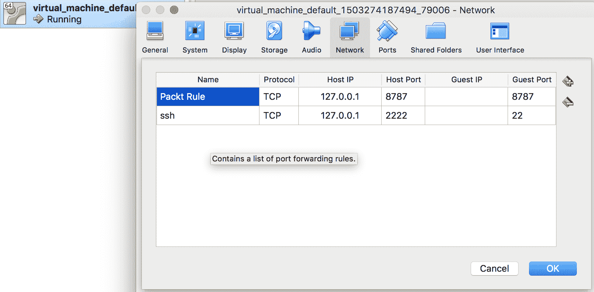

Configuring Port Forwarding

5.  登录后，您将看到以下屏幕。 这是 RStudio 的接口，您将使用它来完成练习。 我们将在后面的章节中更详细地讨论 R 和 RStudio，本节将说明创建基本 Web 应用的过程：

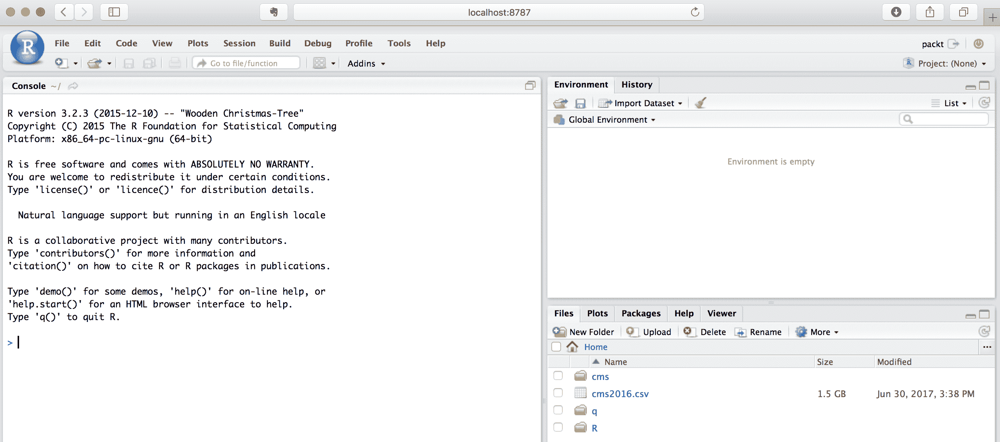

The RStudio Console

6.  安装必要的 R 包。 点击[文件]|[R 脚本]，复制并粘贴下面的代码。
7.  然后，单击源代码以执行以下行：

```py
install.packages(c("shiny","shinydashboard","data.table", 
                   "DT","rjson","jsonlite","shinyjs","devtools")) 

library(devtools) 
devtools::install_github('kxsystems/rkdb', quiet=TRUE) 
```


Installing required packages in R via RStudio

8.  点击文件|新建文件|闪亮的 Web App：

>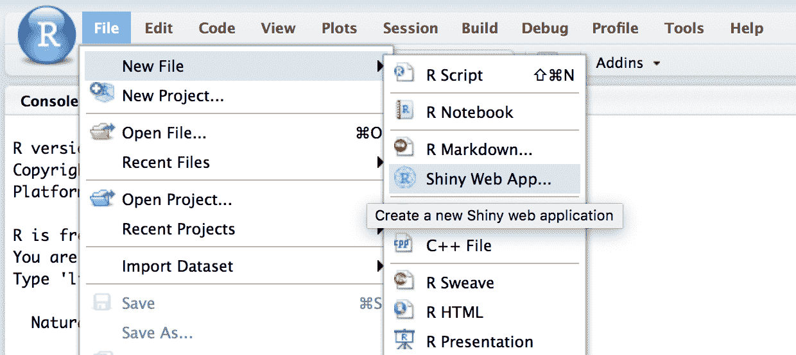 Creating a new RShiny Application

9.  在应用名称*下键入`cmspackt`，然后单击创建：

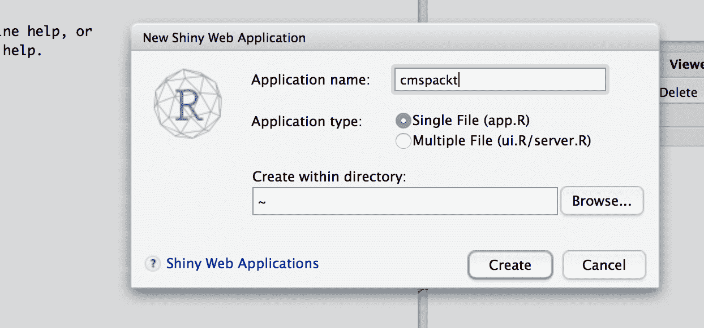

Assigning a name to the RShiny Application

这将在主目录中创建一个`cmspackt`文件夹，如下所示：


The app.R file for the R Shiny Application

10.  将以下代码复制并粘贴到`app.R`部分：

```py
# # This is a Shiny web application. You can run the application by clicking # the 'Run App' button above. # # Find out more about building applications with Shiny here: # # http://shiny.rstudio.com/ 

#
# This is a Shiny web application. You can run the application by clicking
# the 'Run App' button above.
#
# Find out more about building applications with Shiny here:
#
# http://shiny.rstudio.com/
#

library(shiny)
library(shinydashboard)
library(data.table)
library(DT)
library(rjson)
library(jsonlite)
library(shinyjs)
library(rkdb)

ui <- dashboardPage (skin="purple", dashboardHeader(title = "CMS Open Payments 2016"),
  dashboardSidebar(
  useShinyjs(),
  sidebarMenu(
  uiOutput("month"),
  uiOutput("company"),
  uiOutput("product"),
  uiOutput("state"),
  uiOutput("city"),
  uiOutput("showData"),
  uiOutput("displayColumns"),
  uiOutput("aggregationColumns"),
  actionButton("queryButton", "View Results")

  )
  ),dashboardBody(
  tags$head(tags$link(rel = "stylesheet", type = "text/css", href = "packt.css")),
  textOutput("stats"),
  dataTableOutput("tableData")
  ),
  title = "CMS Open Payments Data Mining"
)

# Define server logic required to draw a histogram
server <- function(input, output, session) {

  h <- open_connection("localhost","5001")

  minDate <- execute(h,"minDate")
  maxDate <- execute(h,"maxDate")
  startDate <- minDate
  endDate <- startDate + 31

cmsdata <- data.table(dbColumns=c("month","date","firstName","lastName","city","state","company","product","category","payment","paymentNature"), webColumns=c("Month","Date","First Name","Last Name","City","State","Company","Product","Category","Payment","Payment Nature"))

companyData <- execute(h,"exec distinct showCompany from alldata")

gbyVars <- c("Company","Product","State","City","Category","Payment Nature")

PLACEHOLDERLIST <- list(
    placeholder = 'Please select an option below',
    onInitialize = I('function() { this.setValue(""); }')
  )

PLACEHOLDERLIST2 <- list(
    placeholder = 'Select All',
    onInitialize = I('function() { this.setValue(""); }')
  )

output$month <- renderUI({
    dateRangeInput("date", label = 'PAYMENT DATE', start = startDate, end = endDate, min = minDate, max = maxDate)
  })

output$company <- renderUI({
    selectizeInput("company","COMPANY" , companyData, multiple = TRUE,options = PLACEHOLDERLIST)
  })

output$product <- renderUI({
    productQuery <- paste0("getShowInfo(`product;\"",paste(input$company,collapse="|"),"\")")
    productVals <- execute(h,productQuery)
    selectizeInput("product", "DRUG/PRODUCT" , productVals, multiple = TRUE,options = PLACEHOLDERLIST2)
  }) 

output$state <- renderUI({
    stateQuery <- paste0("getShowInfo(`state;\"",paste(input$company,collapse="|"),"\")")
    stateVals <- execute(h,stateQuery)
    selectizeInput("state", "STATE" , stateVals, multiple = TRUE,options = PLACEHOLDERLIST2)
  }) 

output$city <- renderUI({
    cityQuery <- paste0("getShowInfo(`city;\"",paste(input$company,collapse="|"),"\")")
    cityVals <- execute(h,cityQuery)
    selectizeInput("city", "CITY" , cityVals, multiple = TRUE,options = PLACEHOLDERLIST2)
  })

output$showData <- renderUI({
    selectInput("showData", label = "DISPLAY TYPE", choices = list("Show Data" = 1, "Aggregate Data" = 2), selected = 1)
  })

output$displayColumns <- renderUI({
    if (is.null(input$showData)) {selectInput("columns", "SHOW DATA",cmsdata$webColumns, selectize = FALSE, multiple = TRUE, size=11)}
    else if(input$showData == 1) {selectInput("columns", "SHOW DATA",cmsdata$webColumns, selectize = FALSE, multiple = TRUE, size=11) } 
    else if(input$showData == 2) {selectInput("aggVars", "AGGREGATE DATA",gbyVars, selectize = FALSE, multiple = TRUE, size=6) }
  }) 

output$aggregationColumns <- renderUI ({ conditionalPanel(
    condition = "input.showData != 1",
    selectInput("aggData", "CALCULATE METRICS" , c("Total Payment","Number of Payments","Minimum Payment","Maximum Payment","Average Payment"), selectize = TRUE, multiple = TRUE)
  )})

getTableData <- eventReactive(input$queryButton, {
    disable("queryButton")
    queryInfo <- (list(date=as.character(input$date),company=input$company, product=input$product, state=input$state, city=input$city,columns=cmsdata$dbColumns(cmsdata$webColumns %in% input$columns),showData=input$showData))
    if (input$showData !=1) {queryInfo <- c(queryInfo, list(aggVars=cmsdata$dbColumns(cmsdata$webColumns %in% input$aggVars), aggData=input$aggData))} else {queryInfo <- c(queryInfo)}
    JSON <- rjson::toJSON(queryInfo)
    getQuery <- paste0("getRes \"",URLencode(JSON),"\"")
    finalResults <- execute(h,getQuery)
    enable("queryButton")
    print (finalResults)
    fres <<- finalResults
    print (class(finalResults((1))))
    print (finalResults)
    finalResults
  })

 output$tableData <- renderDataTable({ datatable(getTableData()((1)))})
 output$stats <- renderText({(getTableData())((2))})

}

# Run the application 
shinyApp(ui = ui, server = server)
```

11.  单击右下框中的 New Folder(新建文件夹)：


Creating a folder for CSS files

12.  将新文件夹重命名为`cmspackt/www`，如下所示：


Assigning a name to the folder

13.  点击[文件]|[新建文件]|[文本文件]：


Creating the CSS File

14.  复制并粘贴以下代码：

```py
.shiny-text-output, .shiny-bount-output { 
  margin: 1px; 
  font-weight: bold; 
} 

.main-header .logo { 
height: 20px; 
font-size: 14px; 
font-weight: bold; 
line-height: 20px; 
} 

.main-header .sidebar-toggle { 
  padding: 0px; 
} 

.main-header .navbar { 
  min-height: 0px !important; 
} 

.left-side, .main-sidebar { 
  padding-top: 15px !important; 
} 

.form-group { 
  margin-bottom: 2px; 
} 

.selectize-input { 
  min-height: 0px !important; 
  padding-top: 1px !important; 
  padding-bottom: 1px !important; 
  padding-left: 12px !important; 
  padding-right: 12px !important; 
} 

.sidebar { 
  height: 99vh;  
  overflow-y: auto; 
} 

section.sidebar .shiny-input-container { 
    padding: 5px 15px 0px 12px; 
} 

.btn { 
  padding: 1px; 
  margin-left: 15px; 
  color:#636363; 
  background-color:#e0f3f8; 
  border-color:#e0f3f8; 
} 

.btn.focus, .btn:focus, .btn:hover { 
  color: #4575b4; 
  background-color:#fff; 
  border-color:#fff; 
} 

pre { 
    display: inline-table; 
    width: 100%; 
    padding: 2px; 
    margin: 0 0 5px; 
    font-size: 12px; 
    line-height: 1.42857143; 
    color: rgb(51, 52, 53); 
    word-break: break-all; 
    word-wrap: break-word; 
    background-color: rgba(10, 9, 9, 0.06); 
    border: 1px rgba(10, 9, 9, 0.06); 
    /* border-radius: 4px */ 
} 

.skin-red .sidebar a { 
    color: #fff; 
} 

.sidebar { 
  color: #e0f3f8; 
  background-color:#4575b4; 
  border-color:#4575b4; 
}
```

15.  单击文件|另存为保存文件，如下所示：


Select Save As for the CSS File

16.  另存为`/home/packt/cmspackt/www/packt.css`，如下图所示：


Saving the CSS File

**-**您的应用现在可以使用了！

# 把所有这些放在一起-CMS Open Payments 应用

在前面几节中，我们了解了如何执行以下操作：

*   下载数据集
*   创建后端数据库
*   为后端数据库创建代码
*   设置 RStudio
*   创建 R SHINY 应用

要启动应用，请完成以下步骤：

1.  启动 Q 应用，确保您在主目录中。 键入 pwd 并按 Enter 键。 这将显示`/home/packt`的当前工作目录，如下图所示。

2.  接下来，键入`q`并按 Enter 键。
3.  在`q`提示符下，键入`\l cms.q`。

请注意，`cms.q`是我们在前面部分开发 Q 应用时创建的文件。

脚本将加载数据库并返回到`q)`提示符：


Putting it all together: Loading the CMS KDB+ Q Script in KDB+ Session

4.  启动 CMS Open Payment 应用
5.  在 RStudio 中，打开`app.R`文件(其中包含 R 代码)，点击右上角的 Run App，如下图所示：

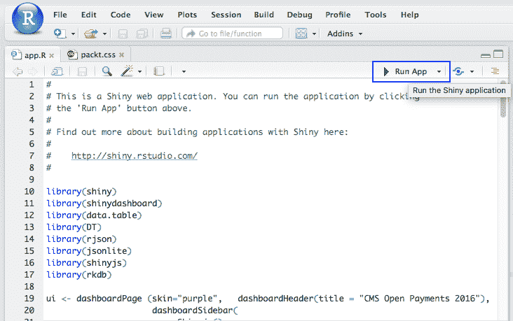

Running the RShiny Application

这将启动 Web 应用，如下所示：


The RShiny Application

现在，我们已经完成了一个完整的 CMS Open Payments 应用的开发，该应用允许最终用户过滤、聚合和分析数据。 现在，您可以通过选择屏幕上的各种选项来运行查询。 该应用有两个功能：

*   筛选数据(默认视图)
*   聚合数据(您可以通过从显示类型菜单中选择聚合数据切换到此选项)

# 应用

**过滤示例**：要查看纽约州某家公司为某一药品支付的款项，请执行以下操作：

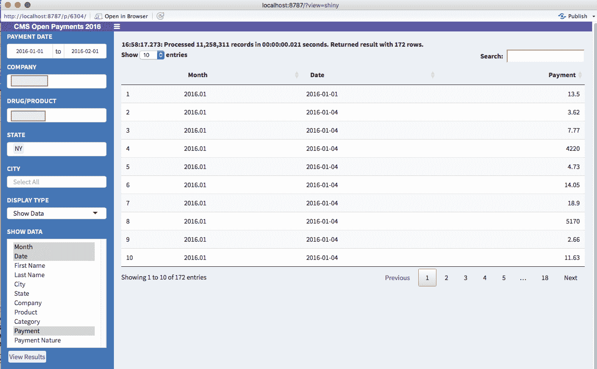

Using the RShiny Application

请注意，系统在 21 毫秒内处理了 1100 万条记录，如标题消息所示。 出于隐私考虑，公司名称和产品名称已在屏幕截图中被删除，但您可以自由尝试这两个字段的不同选项。

Note that in the default VM, we are using only one core with very limited memory, and the speed with which the data is processed using kdb+ even on a laptop with very limited resources easily exceeds the performance of many well-to-do commercial solutions.

**汇总实例**：要查看按特定公司和产品的州、付款类别和付款性质分组的总付款，请选择字段*汇总数据*和*计算指标*的选项。 请注意，出于隐私原因，截图中隐藏了公司和产品的名称。

请注意顶部的消息，该消息指出：

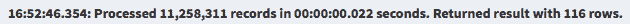

指示查询和应用性能的日志消息

这表示底层 kdb+数据库处理数据的速度。 在本例中，对于给定的选项，它在 22 毫秒内过滤和*聚合了 1100 万条记录。*

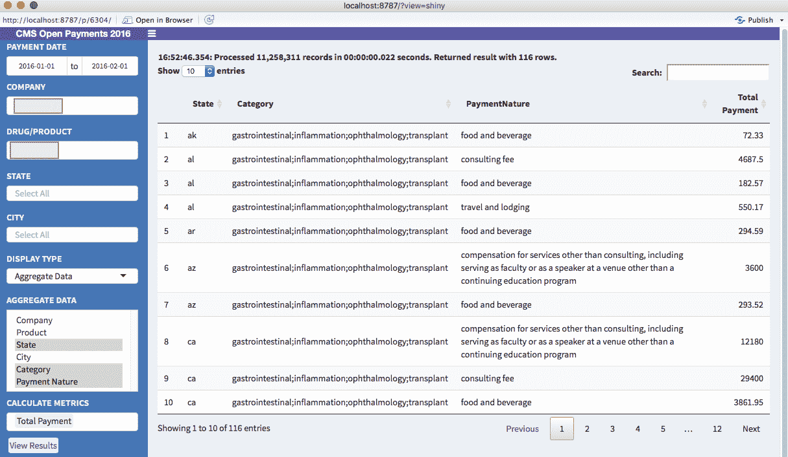

CMS OpenPayments Application Screenshot

# 简略的 / 概括的 / 简易判罪的 / 简易的

本章介绍了 NoSQL 的概念。 近年来，这个术语越来越流行，特别是因为它与**大数据**分析相关并直接应用于**大数据**分析。 我们讨论了 NoSQL 中的核心术语、它们的各种类型，以及行业中用于此类功能的流行软件。 最后，我们介绍了使用 MongoDB 和 kdb+的几个教程。

我们还使用 R 和 R SHILY 构建了一个应用，以创建一个动态 Web 界面来与 kdb+中加载的数据进行交互。

下一章将介绍当今数据科学中的另一种常见技术，即 Spark。 这是另一个工具包，赋予了当今世界各地的数据科学家力量。**