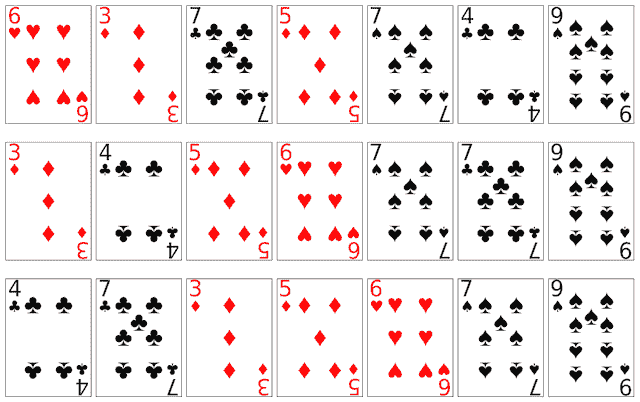
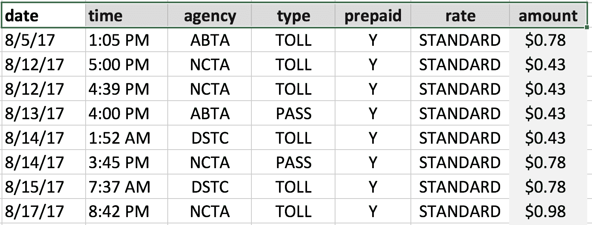
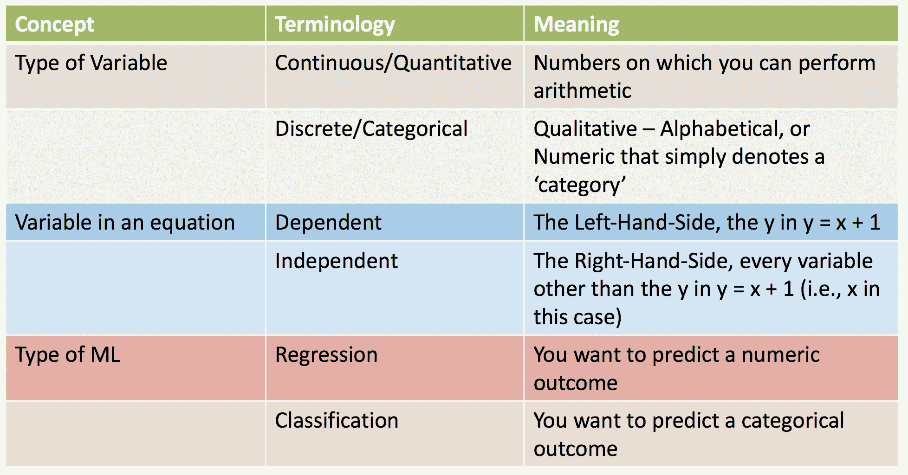
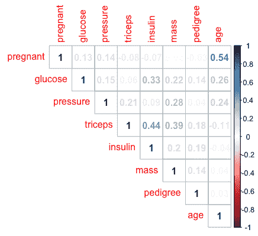
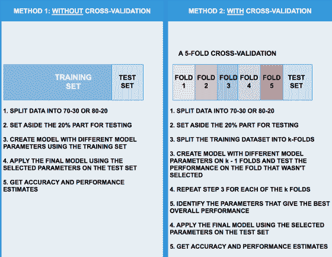
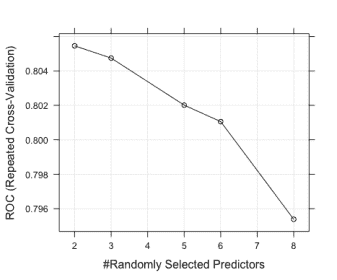
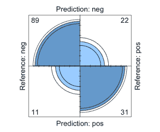
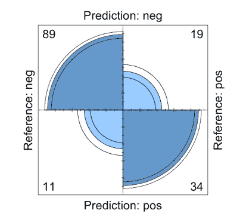

# 机器学习概念导论

机器学习在我们的日常生活中已经成为一个司空见惯的话题。 该领域的进步如此戏剧性，以至于今天，即使是手机也融入了先进的机器学习和人工智能相关设施，能够根据人类的指令做出反应并采取行动。

一个曾经局限于大学课堂的学科已经变成了一个成熟的行业，以一种我们甚至在几年前都无法想象的方式渗透到我们的日常生活中。

本章的目的是向读者介绍机器学习的基础，并用简单、清晰的术语解释概念，帮助读者熟悉本主题的核心思想。 我们将从机器学习的高级概述开始，并解释不同的类别以及如何区分它们。 我们将解释机器学习中的一些重要概念，例如数据预处理、特征工程和变量重要性。 下一章将更详细地介绍单个算法和理论机器学习。

我们将以利用真实数据集使用 R 执行机器学习操作的练习结束。

我们将在本章介绍以下主题：

*   什么是机器学习？
*   大众化的兴起
*   机器学习、统计和人工智能(AI)
*   机器学习的分类
*   机器学习中的核心概念
*   机器学习教程

# 什么是机器学习？

**机器学习**不是一门新学科；它作为一门正式学科在学术界已经存在了 70 多年，但有不同的名称：统计学，更广泛地说是数学，然后是**人工智能**(**AI**)，今天是机器学习。 虽然统计学和人工智能的其他相关学科领域也同样盛行，但机器学习已经开辟了一个单独的利基市场，并成为一门独立的学科。

简单地说，机器学习涉及到基于历史数据预测未来事件。 我们看到它体现在我们的日常生活中，事实上，我们有意无意地在日常生活中使用机器学习的原则。

当我们利用对主角个人受欢迎程度的理解，随意评论一部电影是否会在票房上取得成功时，我们是在应用机器学习，尽管是下意识的。 我们对主角角色的理解是通过多年来观看他们出现的电影而形成的。 而且，当我们决定一部由同一个人主演的未来电影的成功时，我们是在利用历史信息进行评估。

再举一个例子，如果我们有一段时间(比方说 12 个月)的温度、湿度和降雨量(雨)的数据，我们能用这些信息来预测今天是否会下雨吗？

这类似于统计中常见的回归问题。 但是，机器学习不仅基于理论计算，而且在得出结论之前，使用迭代方法对计算进行数百次或数千次验证，从而对练习应用更高级别的严谨性，以得出决定性的决定。

这里应该注意和澄清的是，术语*机器学习*涉及通常在其目标是预测结果的计算设备上执行的算法或程序。 这些算法建立了数学模型，然后可以用来进行预测。 一种常见的误解是，机器学习完全是字面上指的是*机器*，即*学习*。 正如刚才解释的那样，其实际含义远没有那么戏剧性。

# 机器学习的发展历程

维基百科([https://en.wikipedia.org/wiki/Timeline_of_machine_learning](https://en.wikipedia.org/wiki/Timeline_of_machine_learning))上提供的机器学习时间表提供了该领域发展的简明而深刻的概述。 其根源可以追溯到 18 世纪中期，当时托马斯·贝耶斯(Thomas Bayes)在伦敦皇家学会(Royal Society Of London)发表了他关于*逆概率*的论文。 逆概率，今天通常称为概率分布，处理在给定一组先前事件的情况下确定系统状态的问题。 例如，如果一个盒子里装着牛奶巧克力和白巧克力，你随机拿出几块，然后收到两块牛奶巧克力和三块白巧克力，我们能不能推断出盒子里每块巧克力有多少块？

换句话说，给出几点数据，我们可以推断出什么是未知的，我们可以用这些数据来假设一个正式的理论？ 贝叶斯的工作由 Pierre-Simon Laplace 在他的文本*Théorie Analytique des Proposités*中进一步发展为贝叶斯定理。

20 世纪初，安德烈·马尔科夫对普希金的诗歌《尤金尼·奥涅金》进行了分析，以确定俄罗斯文学中辅音和元音的头韵，这导致了一种被称为马尔可夫链的技术的发展，今天这种技术被用来模拟涉及随机事件的复杂情况。 谷歌的 PageRank 算法实现了一种形式的马尔可夫链。

机器学习的第一个正式应用，或者更广泛地说，人工智能，以及它最终作为一门学科的出现，应该归功于艾伦·图灵。 他开发了图灵测试-一种确定机器是否足够智能来模仿人类行为的方法。 图灵在他的论文*计算机器和智能*中提出了这一点，这篇论文从以下几个方面开始：

I propose to consider the question, "Can machines think?" This should begin with definitions of the meaning of the terms "machine" and "think." The definitions might be framed so as to reflect so far as possible the normal use of the words, but this attitude is dangerous, If the meaning of the words "machine" and "think" are to be found by examining how they are commonly used it is difficult to escape the conclusion that the meaning and the answer to the question, "Can machines think?" is to be sought in a statistical survey such as a Gallup poll. But this is absurd. Instead of attempting such a definition I shall replace the question by another, which is closely related to it and is expressed in relatively unambiguous words.[...]

在论文的后面，图灵写道：

*The original question, "Can machines think?" I believe to be too meaningless to deserve discussion. Nevertheless I believe that at the end of the century the use of words and general educated opinion will have altered so much that one will be able to speak of machines thinking without expecting to be contradicted. I believe further that no useful purpose is served by concealing these beliefs.*

图灵在人工智能方面的工作之后，机器学习和人工智能领域发生了一系列开创性的事件。 第一个神经网络是由 Marvin Misky 在 1951 年开发的，Arthur Samuel 在 1952 年开始了他对第一个玩跳棋的机器学习程序的研究，Rosenblatt 在 1957 年发明了感知器，这是神经网络的基本单元。 Leo Breiman、Jerome Friedman、Vladimir Vapnik 和 Alexey Chervonenkis、Geoff Hinton 和 YannLeCun 等先驱在 20 世纪 90 年代末为将机器学习带入聚光灯下做出了重大贡献。 我们非常感谢他们的工作和贡献，这些工作和贡献使机器学习成为当今一个独特的研究领域。

1997 年，IBM 的深蓝击败了卡斯帕罗夫，立即引起了全世界的轰动。 机器击败世界顶级国际象棋冠军的能力是非同寻常的成就。 这次活动为机器学习提供了一些亟需的可信度，使其成为图灵设想的智能机器的强大竞争者。

# 导致机器学习成功的因素

考虑到机器学习作为一门学科已经存在了几十年，它回避了一个问题：为什么它没有更早地像今天这样流行起来？ 事实上，神经网络等复杂机器学习算法的理论在 20 世纪 90 年代末就已经广为人知，在此之前的理论领域就已经奠定了基础。

机器学习的成功可以归因于以下几个因素：

*   **互联网**：网络在信息民主化和以前所未有的方式连接人们方面发挥了关键作用。 它使信息交换变得简单，这是通过现有的印刷媒体传播方式无法实现的。 网络不仅给信息传播带来了变革和变革，还带来了新的机遇。 正如前面提到的，谷歌的 PageRank 是应用统计模型发展一个非常成功的网络企业的第一批大规模和非常明显的成功之一。
*   **社交媒体**：虽然网络提供了一个交流平台，但它缺乏类似于现实世界中人与人之间的互动方式的灵活性。 有一个明显的，但轻描淡写的，可以说是未被探索的差距。 IRC 和 Usenet 等工具是 Myspace 等社交网站的前身，Myspace 是首批旨在创建个人网络的基于网络的平台之一。 到 2000 年年中初，Facebook 已经成为社交网络领域的领头羊。 这些平台提供了利用互联网在个人层面收集数据的独特机会。 每个用户都留下了信息的踪迹，可以使用自然语言处理和其他技术进行收集和分析。
*   **计算硬件**：用于以指数速度发展的计算机的硬件。 机器学习算法本质上是计算和资源密集型的，也就是说，它们需要强大的 CPU、快速的磁盘和高内存，具体取决于数据的大小。 在**固态硬盘**(**固态硬盘**)上存储数据的新方法的发明是对过去在旋转硬盘上存储数据过程的一次飞跃。 更快的访问意味着可以更快的速度将数据传送到 CPU，并减少 I/O 瓶颈，而 I/O 瓶颈一直是计算中的薄弱环节。 更快的 CPU 意味着可以及时执行机器学习算法要求的成百上千次迭代。 最后，需求导致了计算资源价格的降低，使更多的人能够买得起昂贵得令人望而却步的计算硬件。 算法是存在的，但是资源最终能够在合理的时间和成本内执行它们。
*   **编程语言和包**：R 和 Python 开发人员等社区抓住了这个机会，个人开始发布将他们的工作暴露给更广泛的程序员社区的包。 特别是，提供机器学习算法的软件包立即变得流行起来，并激励其他从业人员发布他们个人的代码库，使 R 等平台成为真正的全球协作努力。 今天，R 中有超过 10,000 个套餐，比 2010 年的 2000 个有所增加。

# 机器学习、统计和人工智能

机器学习是一个有各种同义词的术语--这些名称要么是企业营销活动的结果，要么就是可以互换使用的术语。 虽然有些人可能会争辩说它们有不同的含义，但他们最终都将机器学习称为一门有助于利用历史信息预测未来事件的学科。

机器学习的常用术语包括预测分析、预测分析、预测建模等。 因此，除非出版材料的实体解释他们对这个术语的解释，更具体地说，解释它的不同之处，否则通常可以放心地假设他们指的是机器学习。 这在很大程度上是因为技术术语的误用和过度使用，这往往是这个主题的新手感到困惑的一个来源。

另一方面，统计学是一个独特的学科领域，已经有 200 多年的历史了。 这个词来源于新拉丁语*Statistics ticum colcium*(国家委员会)和意大利语*Statista*，意思是政治家或政治家。 有关此主题的更多详细信息，请访问[https://en.wikipedia.org/wiki/History_of_statistics#Etymology](https://en.wikipedia.org/wiki/History_of_statistics#Etymology)。 机器学习实现了多种统计模型，由于计算的严谨性，它有别于经典统计学的一个分支。

人工智能也与机器学习密切相关，但它是一个更广泛的主题。 它可以粗略地定义为在存在不确定性的情况下，能够(通常)以负责任的和具有社会意识的方式做出具体决定，以实现目标最终目标的系统(软件/硬件)。 换句话说，人工智能的目标是通过系统地处理既涉及已知因素又涉及未知(潜在)因素的情况来产生行动。

人工智能让人联想到科幻电影中聪明的、有时甚至是叛逆的机器人的形象，就像它让我们想起了智能系统，比如 IBM Watson，它可以解析复杂的问题，处理模棱两可的语句，找到具体的答案。

机器学习有一些相同的特点--使用训练数据逐步开发模型，使用测试数据测量精确度。 然而，人工智能已经存在了几十年，一直是一个熟悉的家喻户晓的术语。 卡内基梅隆大学(Carnegie Mellon University)等美国机构在建立人工智能的关键原则和指导方针方面走在了前列。

关于人工智能和机器学习的在线资源/文章似乎没有就它们的不同之处提供任何确凿的答案。 然而，大学人工智能课程的教学大纲让这种差异非常明显。 你可以在[https://cs.brown.edu/courses/csci1410/lectures.html](https://cs.brown.edu/courses/csci1410/lectures.html)了解更多关于人工智能的知识。

人工智能指的是大量的研究领域，涉及：

*   **约束优化**：在给定情况下，在给定一组约束或限制的情况下，达到可能的最佳结果
*   **博弈论**：例如，零和博弈、均衡和其他--根据决策如何影响未来的决策和预期的最终目标来做出慎重的决策
*   **不确定性/贝叶斯规则**：给定先验信息，假设其他事情已经发生，这种情况发生的可能性有多大
*   **计划**：制定行动计划=处理情况/达到最终目标的一组路径(图)
*   **机器学习**：通过使用设计用于处理不确定性和模仿人类推理的算法来实现(实现)上述目标。 通常用于人工智能的机器学习算法包括：
    *   神经网络/深度学习(发现隐藏因素)
    *   自然语言处理(NLP)(使用语旨、语言学等理解上下文)
    *   视觉对象识别
    *   概率模型(例如，贝叶斯分类器)
    *   马尔可夫决策过程(随机事件的决策，例如赌博)
    *   各种其他机器学习算法(聚类、支持向量机)
*   **社会学**：研究机器学习决策如何影响社会并采取补救措施纠正问题

# 机器学习的分类

亚瑟·塞缪尔(Arthur Samuel)在 1959 年在 IBM 时创造了**机器学习**这个术语。 机器学习的一个流行定义要归功于亚瑟，据信，他被称为机器学习*，这是计算机科学的一个领域，它赋予计算机无需明确编程就能学习的能力*。

Tom Mitchell, in 1998, added a more specific definition to machine learning and called it a, study of algorithms that improve their performance P at some task T with experience E.

一个简单的解释将有助于说明这一概念。 到目前为止，我们大多数人都熟悉电子邮件中垃圾邮件的概念。 大多数电子邮件帐户还包含一个单独的文件夹，称为**垃圾邮件**、**垃圾邮件**或相关术语。 粗略地检查文件夹通常会显示存在几封电子邮件，其中许多可能是未经请求的，包含无意义的信息。

仅仅是将电子邮件归类为垃圾邮件并将其移动到文件夹的任务就涉及到机器学习的应用。 安德鲁·吴(Andrew Ng)在他广受欢迎的机器学习 MOOC 课程中优雅地强调了这一点。

用米切尔的话说，垃圾邮件分类过程包括：

*   **任务 T**：将电子邮件分类为垃圾邮件/非垃圾邮件
*   **性能 P**：被准确识别为垃圾邮件的邮件数量
*   **经验 E**：向模型提供已标记为垃圾邮件/非垃圾邮件的电子邮件，并使用该信息确定新电子邮件是否为垃圾邮件

一般说来，机器学习有两种截然不同的类型：

*   有监督的机器学习
*   无监督机器学习

我们将在这里轮流讨论它们。

# 有监督和无监督机器学习

让我们先从有监督机器学习开始。

# 有监督的机器学习

**有监督的机器学习**指的是涉及用标记数据预测结果的机器学习练习。 带标签的数据只是指我们用来进行预测的数据集(以及我们将要预测的结果)具有确定值(不管它是什么)。 例如，将电子邮件分类为垃圾邮件或非垃圾邮件，预测温度，以及从图像中识别人脸，都是有监督的机器学习的例子。

# 车辆里程、号码识别等示例

给出一个包含每加仑里程、气缸数等各种汽车信息的数据集，如果我们只有其他可用的值，我们能预测每加仑里程的值是多少吗？

在本例中，我们的结果是`mpg`，我们使用其他变量`cyl`(气缸)、`hp`(马力)、`gear`(齿轮数)和其他变量来构建一个模型，然后可以将该模型应用于 mpg 值标记为`MISSING`的数据集。 该模型读取数据前五行中这些列中的信息，并根据该信息预测其他行中`mpg`的值，如下图所示：


之所以认为这是受监督的，是因为在构建我们的机器学习模型的过程中，我们向模型提供了有关结果的信息。 其他示例包括：

*   **识别字母和数字**：在这种情况下，模型的输入是图像，比如字母和数字，结果是图像上显示的字母数字值。 一旦建立了模型，就可以用它来对照图片来识别和预测图片中显示的数字。 一个简单的例子，但是非常强大。 想象一下，如果给你 100,000 张带有门牌号的房屋图片。 手工识别门牌号的方法是分别检查每一幅图像，然后写下门牌号。 机器学习模型允许我们完全自动化整个操作。 无需手动查看各个图像，只需对图像运行模型，即可在很短的时间内获得结果。
*   **自动驾驶汽车**：算法的输入是图像，其中图像中的对象已被识别，例如，人、路牌、汽车、树木、商店和其他元素。 一旦显示了足够数量的图像，算法*就学习*在不同元素之间进行识别和区分，并且此后给出未标记的图像，即，其中对象尚未被识别的图像能够单独地识别它们。 公平地说，这是对一个非常复杂的主题的高度简化的解释，但总体原则是相同的。

用于号码识别的 MNIST 数据集：


# 无监督机器学习

**无监督机器学习**涉及没有标记结果的数据集。 以预测汽车的 mpg 值为例，在无人监督的练习中，我们的数据集应该如下所示：


如果所有的结果都是*缺失*，那么就不可能知道这些值可能是什么。 回想一下，机器学习的主要前提是使用历史信息对结果未知的数据集进行预测。 但是，如果历史信息本身没有任何确定的结果，那么就不可能建立模型。 在不知道任何其他信息的情况下，表中的 mpg 值可能全为 0 或全为 100；无法判断，因为我们没有任何数据点可以帮助我们找到该值。

这就是应用*无监督*机器学习的地方。 在这种类型的机器学习中，我们不会试图预测结果。 相反，我们试图确定哪些项目彼此最相似。

此类练习的常用名称是*群集*，即我们试图查找彼此最相似的*群集*或记录组。 我们可以在哪里使用这些信息？有哪些无监督学习的例子？

网站上有各种各样的新闻聚合器，它们本身并不发布信息，而是从其他新闻来源收集信息。 谷歌新闻(Google News)就是这样一个聚合器。 比方说，如果我们必须搜索土星的卡西尼号卫星拍摄的最后一张照片的信息，我们可以在谷歌新闻[https://news.google.com/news/?gl=US&amp；Ned=us&amp；hl=en](https://news.google.com/news/?gl=US&ned=us&hl=en)上搜索短语。 下面是一个示例：


请注意，在新闻文章的底部有一个 View all 链接。 单击该链接将带您进入一个包含所有其他相关新闻文章的页面。 当然，谷歌没有手动将这些文章归类为属于特定搜索词。 事实上，谷歌事先并不知道用户会搜索什么。 搜索词很可能是来自太空的土星环的*图像*。

那么，谷歌怎么知道哪些文章属于某个特定的搜索词呢？ 答案在于应用聚类或无监督学习的原则。 无监督学习检查特定数据集的属性，以确定哪些文章彼此最相似。 要做到这一点，算法甚至不需要知道上下文背景。

假设你得到两套没有封面的书，一套关于园艺的书和一套关于计算机编程的书。 虽然你可能不知道这本书的书名，但要区分电脑书籍和园艺书籍是相当容易的。 一套书会有压倒性的数量与计算有关的术语，而另一套书会有压倒性的数量的与植物相关的术语。 仅仅凭借书中的图像，区分两种不同类别的书籍并不困难，即使对于一个既不了解电脑也不了解园艺的读者来说也是如此。

无监督机器学习的其他例子包括检测恶性肿瘤和非恶性肿瘤，以及基因测序。

# 细分有监督机器学习

受监督的机器学习可以进一步细分为涉及以下任一内容的练习：

*   **分类**
*   **回归**

这些概念非常简单明了。

分类涉及具有离散结果的机器学习任务-**分类**结果。 所有的**名词**都是范畴变量，比如水果、树木、颜色和真/假。

分类练习中的结果变量也称为**离散变量或分类变量**。

一些例子包括：

*   识别给定大小、重量和形状的水果
*   在给定一组数字图像的情况下识别数字(如上一章所示)
*   辨认街道上的物体
*   识别扑克牌为方块、黑桃、红心和梅花
*   根据学生成绩确定学生的班级
*   最后一个可能看起来不明显，但是一个等级，即 1<sup xmlns:epub="http://www.idpf.org/2007/ops">st</sup>，2<sup xmlns:epub="http://www.idpf.org/2007/ops">nd</sup>，3<sup xmlns:epub="http://www.idpf.org/2007/ops">rd</sup>表示一个固定的范畴。 比方说，一个学生可以排在第一位或第二位，但不能排在 1.5 位！

下面是一些非典型分类示例的图片：

| 不同类型水果的分类 | 扑克牌的分类：方块、黑桃、红心和梅花 |

**回归**则涉及计算数值结果。 任何可以对其执行数字运算(如加法、减法、乘法和除法)的结果都将构成回归问题。

回归的示例包括：

*   预报日气温
*   计算股票价格
*   预测住宅物业及其他物业的销售价格

下面显示了一些非典型回归示例的图像。 在这两种情况下，我们都在处理连续的量化数字数据。 因此，回归的结果变量也称为**数量变量或连续变量**。

| 计算房价 | 使用其他市场数据计算股价 |

Note that the concepts of classification or regression do not as such apply to unsupervised learning. Since there are no labels in unsupervised learning, there is no discrete classification or regression in the strict sense. That said, since unsupervised learning categories data into clusters, objects in a cluster are often said to belong to the same class (as other objects in the same cluster). This is akin to classification, except that it is created after-the-fact and no classes existed prior to the objects being classified into individual clusters.

# 机器学习中的常用术语

在机器学习中，您经常会听到术语特征、预测器和因变量。 它们都是一样的。 它们都指的是用于预测结果的变量。 在我们前面的汽车示例中，变量**cyl**(气缸)、**hp**(马力)、**wt**(重量)和**齿轮**(Gear)是预测值，**mpg**(每加仑里程)是结果。

简单地说，以电子表格为例，列的名称本质上称为特征、预测器和因变量。 例如，如果我们得到一个收费站收费的数据集，并被要求根据一天中的时间和其他因素预测收费金额，则假设的例子可能如下所示：



在此电子表格中，列**日期**、**时间**、**机构**、**类型**、**预付**和**费率**是特征或预测值，而列**金额**是我们的结果或因变量(我们正在预测的)。

量*的值取决于其他变量(因此称为*自变量*)的值。*

简单的方程也反映了明显的区别，例如，在一个方程中，*y=a+b+c*，**左侧**(**LHS**)是因变量/结果变量，*a*，*b*和*c*是特征/预测变量。

总结一下：



# 机器学习中的核心概念

机器学习中有许多重要的概念；我们将回顾一些更常见的主题。 机器学习涉及一个多步骤的过程，从数据获取、数据挖掘开始，最终导致建立预测模型。

建模过程的关键方面包括：

*   **数据预处理**：预处理和特征选择(例如，居中和缩放、类别不平衡和变量重要性)
*   **培训、测试拆分和交叉验证**：
    *   创建训练集(比方说，80%的数据)
    *   创建测试集(约占数据的 20%)
    *   执行交叉验证
*   **创建模型，获取预测**：
    *   您应该尝试哪些算法？
    *   您试图优化哪些精确度指标？
    *   您应该使用哪些调优参数？

# 机器学习中的数据管理步骤

预处理，或者更一般的数据处理，是大多数机器学习练习中不可或缺的一部分。 您开始使用的数据集很少采用构建机器学习模型所依据的确切格式；在大多数情况下，它总是需要相当数量的清理。 事实上，数据清理通常是整个流程中最耗时的部分。 在本节中，我们将简要介绍您在实践中可能会遇到的几个顶级数据处理步骤。

# 预处理和特征选择技术

**数据预处理**，顾名思义，就是对数据进行整理，使其适合机器学习练习。 预处理的方法有很多种，这里说明了几种比较常见的方法。

注意，数据预处理应该作为交叉验证步骤的一部分来执行，也就是说，预处理不应该在事实之前进行*，而应该在建模过程中进行。 这将在后面更详细地解释。*

# 居中和缩放

在数值列上应用中心和小数位函数通常是为了标准化数据，消除数值大小或差异较大的影响。 你可能在学院或大学的课程中遇到过这种情况，在这些课程中，学生将根据标准化的基础或曲线进行评分。

例如，假设一份试卷异常困难，一个 10 人班所有学生中有一半的分数低于 60 分-这是为这门课程设定的及格率。 教授可以 a)决定 50%的学生应该重修这门课程，或者 b)标准化分数以找出学生之间的相对表现。

假设班级分数是：

45，66，66，55，55，52，61，64，65，49

由于及格分数设定为 60 分，这意味着得分为 45 分、55 分、55 分、52 分和 49 分的学生将无法成功完成这门课程。

然而，这可能并不能真正准确地反映它们的相对优点。 教授也可以选择使用中心比例尺方法，即通常所说的标准化方法，该方法包括：

*   求所有分数的平均值
*   从分数中减去平均数
*   将结果除以所有分数的标准差

操作说明如下，以供参考。

平均得分为 57.8 分。 因此，从每个数字中减去 57.8 得到第二行所示的数字。 但是，我们还没有完成。 我们需要将这些数字除以分数的*标准差*，以得到最终的标准化值：


除以**SD**(**标准差**)显示，在所有测试分数范围内，只有两名学生的分数低于一个标准差。 因此，我们可以把范围缩小到只有两名学生，而不是根据原始数字没有成功完成课程的五名学生。

虽然这是一个真正简单的操作，但不难看出，它在平滑数据的巨大差异方面非常有效。

在 R 中使用 SCALE 命令可以非常轻松地执行居中和缩放，如下所示：

```py
> scores <- c(45,66,66,55,55,52,61,64,65,68) 
> scale(scores) 
            [,1] 
 [1,] -1.9412062 
 [2,]  0.8319455 
 [3,]  0.8319455 
 [4,] -0.6206578 
 [5,] -0.6206578 
 [6,] -1.0168223 
 [7,]  0.1716713 
 [8,]  0.5678358 
 [9,]  0.6998907 
[10,]  1.0960552 
attr(,"scaled:center") 
[1] 59.7 
attr(,"scaled:scale") 
[1] 7.572611 
```

# 近零方差函数

在`R package, caret`的`nearZeroVar`函数中提供的近零方差用于识别方差很小或没有方差的变量。 考虑一组只有三个不同值的 10,000 个数字。 这样的变量可能给算法增加的价值很小。 为了使用`nearZeroVar`功能，首先在 RStudio(我们已经设置了[第 3 章](03.html)和*Analytics Toolkit*)中安装 R 包、插入符号。 复制使用`nearZeroVar`效果的确切代码如下所示：

```py
> library(caret) 
Loading required package: lattice 
Loading required package: ggplot2 
Need help getting started? Try the cookbook for R: http://www.cookbook-r.com/Graphs/ 

> repeated <- c(rep(100,9999),10) # 9999 values are 100 and the last value is 10 

>random<- sample(100,10000,T) # 10,000 random values from 1 - 100 

>data<- data.frame(random = random, repeated = repeated) 

>nearZeroVar(data) 
[1] 2 

> names(data)[nearZeroVar(data)] 
[1] "repeated" 
```

如示例所示，该函数能够正确检测到满足条件的变量。

# 剔除相关变量

相关变量可能会产生过分强调变量贡献的结果。 在回归练习中，这会增加 R^2 的值，并且不能准确地表示模型的实际性能。 虽然许多类别的机器学习算法都抵抗相关变量的影响，但它值得一提的是，因为它是该学科中的一个常见话题。

去除这些变量的前提是冗余变量不会给模型增加价值。 例如，如果数据集包含以英寸为单位的高度和以米为单位的高度，则这两个变量的相关性几乎为 1，使用其中一个变量与使用另一个变量一样好。 涉及我们不能直观判断的变量的实际练习，使用去除相关变量的方法，可以极大地帮助简化模型。

下面的示例说明了删除相关变量的过程。 数据集**皮马印第安人糖尿病**，包含关于皮马印第安人饮食的重要统计数据和一个称为`diabetes`的结果变量。

在后续章节的示例过程中，我们将经常参考此数据集。 数据集中不同列的含义的高级概述如下：

```py
pregnant Number of times pregnant 
glucose  Plasma glucose concentration (glucose tolerance test) 
pressure Diastolic blood pressure (mm Hg) 
triceps  Triceps skin fold thickness (mm) 
insulin  2-Hour serum insulin (mu U/ml) 
mass     Body mass index (weight in kg/(height in m)\^2) 
pedigree Diabetes pedigree function 
age            Age (years) 
diabetes Class variable (test for diabetes) 
```

我们感兴趣的是，除了糖尿病(这是我们的结果变量)之外，是否还有其他变量是相关的。 如果是这样的话，删除多余的变量可能会很有用。

在 RStudio 中安装程序包`mlbench`和`corrplot`，并执行如下所示的命令：

```py
install.packages("mlbench") 
install.packages("corrplot") 

library(corrplot) 
library(mlbench) 
data (PimaIndiansDiabetes)
diab <- PimaIndiansDiabetes # To produce a correlogram 
corrplot(cor(diab[,-ncol(diab)]), method="color", type="upper") # To get the actual numbers 
corrplot(cor(diab[,-ncol(diab)]), method="number", type="upper")
```

该命令将使用[http://www.sthda.com/english/wiki/visualize-correlation-matrix-using-correlogram](http://www.sthda.com/english/wiki/visualize-correlation-matrix-using-correlogram)中的`corrplot`包生成如下所示的绘图：

|  | > |

阴影越深，相关性越高。 在这种情况下，说明年龄与怀孕有较高的相关性。 我们可以通过使用`method="number"`找到精确的值，如图所示。 您也可以在[http://www.sthda.com/english/wiki/visualize-correlation-matrix-using-correlogram](http://www.sthda.com/english/wiki/visualize-correlation-matrix-using-correlogram)查看绘图。

我们还可以使用如下函数直接查找相关变量，而无需绘制相关图：

```py
correlated_columns<- findCorrelation(cor(diab[,-ncol(diab)]), cutoff = 0.5) 
correlated_columns 
```

# 其他常见数据转换

还有其他几种数据转换可用，并适用于不同的情况。 这些转换的摘要可以在[https://topepo.github.io/caret/pre-processing.html](https://topepo.github.io/caret/pre-processing.html)的**预处理**下的`caret`包的文档站点上找到。

通过在 RStudio 中运行命令`?preProcess`，可以从插入符号的帮助部分找到插入符号预处理功能中的可用选项。 其代码如下所示：

```py
Method 

a character vector specifying the type of processing. 

Possible values are "BoxCox", "YeoJohnson", "expoTrans", "center", "scale", "range", "knnImpute", "bagImpute", "medianImpute", "pca", "ica", "spatialSign", "corr", "zv", "nzv", and "conditionalX" (see Details below) 
```

# 数据采集

您可能会遇到具有高度不平衡结果类的数据集。 例如，如果您正在处理关于一种罕见疾病的数据集，并且您的结果变量为真或假，由于该事件的罕见程度，您可能会发现标记为假(即，此人没有患上罕见疾病)的观察次数远远高于标记为真(即，此人确实患有这种罕见疾病)的观察次数。

机器学习算法试图最大化性能，这在许多情况下可能是预测的准确性。 比方说，在 1000 条记录的样本中，只有 10 条被标记为真，其余的`990`观察结果都是假的。

如果有人将*个*个观测值随机指定为假，准确率将为：

```py
(990/1000) * 100 = 99% 
```

但是，这个练习的目的是找到患有这种罕见疾病的*人*。 我们已清楚知道，基於疾病的性质，大部分人都不会属於这类人士。

数据采样本质上是*最大化机器学习度量的过程，例如特异性、敏感度、精确度、召回率和 kappa*。 这些将在稍后的阶段讨论，但出于本节的目的，我们将展示一些方法，您可以通过这些方法对数据进行*采样*，从而生成更均衡的数据集。

R 包`caret`包含几个有用的函数，用于从不平衡的数据集创建均衡的类分布。

在这些情况下，我们需要重新采样数据以获得更好的类分布，以便构建更有效的模型。

一些常规方法包括：

*   **up-Sample**：使用较少的示例增加类的实例
*   **Down-Sample**：减少具有较高示例的类的实例
*   **创建合成示例**(例如，**Smote**(**合成少数过采样技术**))
*   随机过采样(例如，(**ROSE**)**随机过采样示例**)

我们将使用上一个示例中的相同数据创建一个模拟数据集，其中 95%的行将被标记为负数：

```py
library(mlbench) 
library(caret) 
diab<- PimaIndiansDiabetes 

diabsim<- diab 
diabrows<- nrow(diabsim) 
negrows<- floor(.95 * diabrows) 
posrows<- (diabrows - negrows) 

negrows 
[1] 729 

posrows 
[1] 39 

diabsim$diabetes[1:729]     <- as.factor("neg")
diabsim$diabetes[-c(1:729)] <- as.factor("pos")
table(diabsim$diabetes) 

neg. pos 
729  39 

# We observe that in this simulated dataset, we have 729 occurrences of positive outcome and 39 occurrences of negative outcome

# Method 1: Upsampling, i.e., increasing the number of observations marked as 'pos' (i.e., positive) 

upsampled_simdata<- upSample(diabsim[,-ncol(diabsim)], diabsim$diabetes) 
table(upsampled_simdata$Class) 

negpos 
729 729 

# NOTE THAT THE OUTCOME IS CALLED AS 'Class' and not 'diabetes' 
# This is because of the use of the variable separately 
# We can always rename the column to revert to the original name 

# Method 2: Downsampling, i.e., reducing the number of observations marked as 'pos' (i.e., positive) 

downsampled_simdata<- downSample(diabsim[,-ncol(diabsim)], diabsim$diabetes) 
table(downsampled_simdata$Class) 

neg pos 
39  39 
```

*   **Smote**(**合成少数过采样技术**)是第三种方法，它不是普通的上/下采样，而是从少数类的最近邻居创建合成记录。 在我们的模拟数据集中，很明显`neg`是少数类，也就是出现次数最少的类。
    有关 SMOTE 功能的帮助文件简明扼要地解释了这一概念：

Unbalanced classification problems cause problems to many learning algorithms. These problems are characterized by the uneven proportion of cases that are available for each class of the problem.

Smote(Chawla 等人，2002 年)是解决这个问题的著名算法。 该方法的基本思想是利用少数类的最近邻域，人工生成少数类的新实例。 此外，大多数类示例也是欠采样的，从而产生更平衡的数据集：

```py
# Method 3: SMOTE 
# The function SMOTE is available in the R Package DMwR 
# In order to use it, we first need to install DmWR as follows 

install.packages ("DMwR") 

# Once the package has been installed, we will create a synthetic 
# Dataset in which we will increase the number of 'neg' records 
# Let us check once again the distribution of neg/pos in the dataset 

table(diabsim$diabetes) 

negpos 
729  39 

# Using SMOTE we can create synthetic cases of 'pos' as follows 

diabsyn<- SMOTE(diabetes ~ ., diabsim, perc.over = 500, perc.under = 150) 

# perc.over = 500 means, increase the occurrence of the minority 
# class by 500%, i.e., 39 + 5*39 = 39 + 195 = 234 

# perc.under = 150 means, that for each new record generated for the 
# Minority class, we will generate 1.5 cases of the majority class 
# In this case, we created 195 new records (500% of 39) and hence 
# we will generate 150% of 195 records = 195 * 150% = 195 * 1.5 
# = 292.5, or 292 (rounded down) new records 

# We can verify this by running the table command against the newly 
# Created synthetic dataset, diabsyn 

table(diabsyn$diabetes) 

negpos 
292 234
```

*   **ROSE(随机过采样示例)**是本节中的最后一种方法，可通过 R 中的 ROSE 包获得。与 SMOTE 一样，它是一种生成合成样本的方法。 ROSE 的帮助文件说明了该函数的高级用法，如下所示：

Generation of synthetic data by Randomly Over Sampling Examples creates a sample of synthetic data by enlarging the features space of minority and majority class examples. Operationally, the new examples are drawn from a conditional kernel density estimate of the two classes, as described in Menardi and Torelli (2013).

```py
install.packages("ROSE") 
library(ROSE) 

# Loaded ROSE 0.0-3 
set.seed(1) 

diabsyn2 <- ROSE(diabetes ~ ., data=diabsim) 

table(diabsyn2$data$diabetes) 

# negpos 
# 395 373 
```

# 数据推算

有时，您的数据可能会有缺失值。 这可能是由于数据收集过程中的错误、真正丢失的数据或任何其他原因造成的，最终结果是信息不可用。 真实的缺失数据的例子可以在调查中找到，在调查中，受访者没有回答调查中的特定问题。

比方说，您可能有一个包含 1,000 条记录和 20 列的数据集，其中某一列有 100 个缺失值。 您可以选择完全丢弃此列，但这也意味着丢弃 90%的信息。 您还有 19 个其他列具有完整的数据。 另一种选择是简单地排除该列，但这意味着您无法利用相应列中可用数据提供的好处。

有几种数据填补方法，即填补缺失数据的过程。 我们不知道确切的值是什么，但通过查看表中的其他条目，我们也许能够对这些值可能是什么进行有知识的、系统的评估。

数据估算中的一些常用方法包括：

*   **平均值、中位数、模式值**：使用列的平均值、中位数或模式值替换缺少的值。 然而，这有一个缺点，那就是增加了被归因于的变量之间的相关性，这可能不是多变量分析所希望的。
*   **K 近邻推算**：k 近邻推算是使用机器学习方法(近邻)来推算缺失值的过程。 它的工作原理是查找 k 条与缺少值的记录最相似的记录，并使用相对于 k 条记录的欧几里德距离计算加权平均值。
*   **使用回归模型的归因**：回归方法使用 R 中的标准回归方法来预测缺失变量的值。 然而，正如维基百科[https://en.wikipedia.org/wiki/Imputation_(statistics)#Regression](https://en.wikipedia.org/wiki/Imputation_(statistics)#Regression)上关于基于回归的推算的相关章节所指出的那样，(回归推算)问题在于推算的数据在其估计中没有包含误差项。 因此，估计值完全符合回归线，没有任何残差。 这会导致过度识别关系，并表明估算的值比应有的精度更高。
*   **热插补**：用数据集本身的观测值填充缺失值的另一种技术。 这种方法虽然非常流行，但也有一定的局限性，例如，将一个单一的值赋给很大范围的缺失值，它可能会在观测中增加显著的偏差，并可能产生误导性的结果。

这里提供了一个简短的例子来演示如何使用 KNN 推算来完成推算。 我们通过将`PimaIndiansDiabetes`数据集中的大量值更改为 NA 来模拟丢失的数据。

我们在这个过程中使用了以下因素：

*   我们使用均值来填充 NA 值。
*   我们使用 KNN 推算来填充缺失值。 然后，我们比较这两种方法的执行情况：

```py
library(DMwR) 
library(caret) 

diab<- PimaIndiansDiabetes 

# In the dataset, the column mass represents the body mass index 
# Of the individuals represented in the corresponding row 

# mass: Body mass index (weight in kg/(height in m)\^2) 

# Creating a backup of the diabetes dataframe 
diabmiss_orig<- diab 

# Creating a separate dataframe which we will modify 
diabmiss<- diabmiss_orig 

# Saving the original values for body mass 
actual <- diabmiss_orig$mass 

# Change 91 values of mass to NA in the dataset 
diabmiss$mass[10:100] <- NA 

# Number of missing values in mass 
sum(is.na(diabmiss$mass)) 

# 91 

# View the missing values 
diabmiss[5:15,] 
```

我们得到的输出如下所示：


```py
# Test with using the mean, we will set all the missing values 
# To the mean value for the column 

diabmiss$mass[is.na(diabmiss$mass)] <- mean(diabmiss$mass,na.rm = TRUE) 

# Check the values that have been imputed 
data.frame(actual=actual[10:100], impute_with_mean=diabmiss$mass[10:100]) 
```

上述代码的输出如下所示：


```py
# Check the Root-Mean-Squared-Error for the entire column 
# Root Mean Squared Error provides an estimate for the 
# Difference between the actual and the predicted values 
# On 'average' 

diabmissdf<- data.frame(actual=actual, impute_with_mean=diabmiss$mass) 
rmse1 <- RMSE(diabmissdf$impute_with_mean,actual) 
rmse1 

# [1] 3.417476 

# We will re-run the exercise using knnImputation (from package DMwR) 

# Change the value of the records back to NA 
diabmiss<- diabmiss_orig 
diabmiss$mass[10:100] <- NA 

# Perform knnImputation 
diabknn<- knnImputation(diabmiss,k=25) 

# Check the RMSE value for the knnImputation method 
rmse2 <- RMSE(diabknn$mass,actual) 
rmse2 

# [1] 3.093827 

# Improvement using the knnImputation methods in percentage terms 

100 * (rmse1-rmse2)/rmse1 

[1] 22.20689 
```

虽然它可能不代表巨大的变化，但它仍然比使用简单的平均值或常量值等幼稚的方法要好。

R 中有几个用于数据补偿的软件包。 以下是几个突出的问题：

*   **Amelia II**：时间序列数据中缺少信息

[https：//gking.harvard.edu/amelia](https://gking.harvard.edu/amelia)

*   **R 包的热插补**：HotDeckInputation 和 hot.deck

[https：//cran.r-project.org/web/packages/HotDeckImputation/](https://cran.r-project.org/web/packages/HotDeckImputation/)

[https：//cran.r-project.org/web/packages/hot.deck/](https://cran.r-project.org/web/packages/hot.deck/)

*   **多变量推算(链式方程)**

[https：//cran.r-project.org/web/packages/mice/index.html](https://cran.r-project.org/web/packages/mice/index.html)

*   **用 R 包**：MI 在贝叶斯框架中输入值

[https：//cran.r-project.org/web/packages/mi/index.html](https://cran.r-project.org/web/packages/mi/index.html)

# 变量的重要性

在建模练习中，数据集可能有数十个变量。 并不是所有的方法都能增加预测模型的价值。 减少数据集以包括变量的子集并允许机器学习程序员投入更多时间来微调所选变量和建模过程，这种情况并不少见。 减少数据集中变量的数量在技术上也是合理的。 在非常大的数据集(即高维数据集)上执行机器学习建模可能是非常计算密集型的，也就是说，执行数值运算可能需要大量的时间、CPU 和 RAM。 这不仅使某些算法的应用不切实际，而且还会造成不必要的延误。 因此，有条不紊地选择变量在分析时间和算法分析的计算要求方面都有帮助。

**变量选择**也称为特征选择/属性选择。 随机森林和套索回归等算法将变量选择作为其算法操作的一部分。 但是，变量选择可以作为单独的练习来完成。

R 包`caret`为变量选择提供了一个非常简单和直观的界面。 由于我们还没有讨论建模过程，我们将学习如何找到重要的变量，并在下一章更深入地研究这个主题。

我们将使用一种常见的、众所周知的算法`RandomForest`，该算法用于构建决策树。 该算法将在下一章中更详细地描述，但这里使用它的目的只是为了说明如何执行变量选择。 该示例说明了一般流程是什么。

我们将重用我们一直使用的数据集，即来自`mlbench`包的`PimaIndiansDiabetes`数据。 我们还没有讨论模型训练过程，但是这里已经使用它来推导变量重要性的值。 在这种情况下，结果变量是糖尿病，其他变量被用作自变量。 换句话说，我们是否可以使用现有的数据来预测这个人是否患有糖尿病：

```py
diab<- PimaIndiansDiabetes 

# We will use the createDataPartition function from caret to split 
# The data. The function produces a set of indices using which we 
# will create the corresponding training and test sets 

training_index<- createDataPartition(diab$diabetes, p = 0.80, list = FALSE, times = 1) 

# Creating the training set 
diab_train<- diab[training_index,] 

# Create the test set 
diab_test<- diab[-training_index,] 

# Create the trainControl parameters for the model 
diab_control<- trainControl("repeatedcv", number = 3, repeats = 2, classProbs = TRUE, summaryFunction = twoClassSummary) 

# Build the model 
rf_model<- train(diabetes ~ ., data = diab_train, method = "rf", preProc = c("center", "scale"), tuneLength = 5, trControl = diab_control, metric = "ROC") 

# Find the Variable Importance 
varImp(rf_model) 
rf variable importance 

         Overall 
glucose  100.000 
mass      52.669 
age       39.230 
pedigree  24.885 
pressure  12.619 
pregnant   6.919 
insulin    2.294 
triceps    0.000 

# This indicates that glucose levels, body mass index and age are the top 3 predictors of diabetes. 

# caret also includes several useful plot functions. We can visualize the variable importance using the command: 

plot(varImp(rf_model)) 
```

上述代码的输出如下所示。 研究表明，葡萄糖、体重和年龄是建立模型(预测糖尿病)最重要的变量。


# 培训、测试拆分和交叉验证概念

训练、测试分割和交叉验证集是机器学习中的一个基本概念。 这是纯统计方法与机器学习方法有本质区别的领域之一。 尽管在统计建模任务中，人们可以执行回归、参数/非参数检验，并且应用其他方法，但是在机器学习中，算法方法被补充有对正在产生的结果的迭代评估的元素，以及在每次迭代中模型的后续即兴发挥的元素。

# 将数据拆分为训练集和测试集

如前所述，每个机器学习建模练习都始于数据清理过程。 下一步是将数据拆分成训练集和测试集。 这通常是通过从将用于创建模型的数据中随机选择行来完成的。 然后，未选择的行将用于测试最终模型。

通常的比例在 70%-80%之间(培训数据与测试数据)。 在 80：20 的情况下，将使用 80%的数据来创建模型。 剩下的 20%将用于测试生产的最终模型。

我们在前面的小节中应用了这一点，但是我们可以再次回顾代码。 `createDataPartition`函数与参数`p = 0.80`一起使用，以便拆分数据。 `training_index`变量保存我们将使用的训练指数(`dataset`、`diab`)：

```py
training_index<- createDataPartition(diab$diabetes, p = 0.80, list = FALSE, times = 1) 

length(training_index) # Number of items that we will select for the train set [1] 615 

nrow(diab) # The total number of rows in the dataset [1] 768 

# Creating the training set, this is the data we will use to build our model 
diab_train<- diab[training_index,] 

# Create the test set, this is the data against which we will test the performance of our model 
diab_test<- diab[-training_index,] 
```

我们不一定要使用`createDataPartition`函数，相反，使用如下所示的简单 R 命令创建的随机样本就足够了：

```py
# Create a set of random indices representing 80% of the data 
training_index2 <- sample(nrow(diab),floor(0.80*nrow(diab))) 

# Check the size of the indices just created 
length(training_index2) [1] 614 

# Create the training set 
diab_train2 <- diab[training_index2,] 

# Create the test set 
diab_test2 <- diab[-training_index2] 
```

# 交叉验证参数

交叉验证将列车测试拆分概念带到了下一阶段。 本质上，机器学习练习的目的是找出哪组模型参数将提供最佳性能。 模型参数指示函数(模型)接受的参数。 例如，对于决策树模型，参数可能包括应该构建模型的层数、拆分数量等。 假设有*n*个不同的参数，每个参数都有*k*不同的值，那么参数的总数将是*k*^*n*。 我们通常为每个参数选择一组固定的组合，并且可以很容易地以 100-1000+个组合结束。 我们将针对每个参数测试模型的性能(例如，正确预测结果的准确性)。

对于简单的训练测试拆分，比如说，如果我们选择了 500 个参数组合，我们只需要将它们与训练数据集进行比较，然后确定哪一个显示最佳性能。

通过交叉验证，我们进一步将训练集分割成更小的子集，例如，通常使用三倍或五倍。 如果有三个折叠，也就是说，我们将训练集分成三个子集，我们保留一个折叠，例如，折叠 2，并使用文件夹 1 和 3 的一组参数创建一个模型。然后，我们对照折叠 2 测试其准确性。此步骤重复多次，每个迭代代表一组唯一的折叠，训练-测试过程将在这些折叠上执行，并收集准确性度量。 最终，我们将通过选择显示最佳整体性能的参数来得出最佳组合。

标准方法可以概括如下：

1.  创建一个 80-20 的列车测试拆分
2.  使用不同的模型参数组合执行模型
3.  选择显示最佳整体性能的模型参数并创建最终模型
4.  将最终模型应用于测试集以查看结果

交叉验证方法要求我们将训练数据集进一步划分为更小的子集。 这些子集通常称为**折叠**，并且统称为**k 折叠**，其中*k*表示分裂的数量：

1.  创建一个 80-20 的列车测试拆分
2.  把训练集分成 k 折，比方说，三折
3.  将文件夹 1 放在一边，使用文件夹 2 和文件夹 3 构建模型
4.  测试您的模型在折叠 1 上的性能(例如，准确结果的百分比)
5.  将文件夹 2 放在一边，使用文件夹 1 和文件夹 3 构建模型
6.  在折叠板 2 上测试您的模型性能
7.  将文件夹 3 放在一边，使用文件夹 1 和文件夹 2 构建模型
8.  在折叠 3 上测试您的模型性能
9.  取模型在所有三个折叠中的平均性能
10.  对*每组模型参数*重复步骤 1
11.  选择显示最佳整体性能的模型参数并创建最终模型

12.  将最终模型应用于测试集以查看结果



This image illustrates the difference between using an approach without cross-validation and one with cross-validation. The cross-validation method is arguably more robust and involves a rigorous evaluation of the model. That said, it is often useful to attempt creating a model initially without cross-validation to get a sense of the kind of performance that may be expected. For example, if a model built with say 2-3 training-test splits shows a performance of say, 30% accuracy, it is unlikely that any other approach, including cross-validation would somehow make that 90%. In other words the standard approach helps to get a sense of the kind of performance that may be expected. As cross-validations can be quite compute-intensive and time consuming getting an initial feedback on performance helps in a preliminary analysis of the overall process.

R 中的插入符号包为使用交叉验证构建模型提供了一种非常用户友好的方法。 回想一下，数据预处理必须通过或成为交叉验证过程中不可或缺的一部分。 因此，假设我们必须将数据集居中并缩放，并执行五次交叉验证，我们所要做的就是定义要在插入符号的`trainControl`函数中使用的采样类型。

Caret 在`trainControl`上的网页提供了[https://topepo.github.io/caret/model-training-and-tuning.html#basic-parameter-tuning](https://topepo.github.io/caret/model-training-and-tuning.html#basic-parameter-tuning)上的函数的详细概述和经过处理的示例。

我们在前面的练习中使用了这种方法，在前面的练习中，我们在`PimaIndiansDiabetes`数据集上使用`RandomForest`构建了一个模型。 此处再次显示，以指示使用该技术的位置：

```py
# Create the trainControl parameters for the model 
# The parameters indicate that a 3-Fold CV would be created 
# and that the process would be repeated 2 times (repeats) 
# The class probabilities in each run will be stored 
# And we'll use the twoClassSummary* function to measure the model 
# Performance 
diab_control<- trainControl("repeatedcv", number = 3, repeats = 2, classProbs = TRUE, summaryFunction = twoClassSummary) 

# Build the model 
# We used the train function of caret to build the model 
# As part of the training process, we specified a tunelength** of 5 
# This parameter lets caret select a set of default model parameters 
# trControl = diab_control indicates that the model will be built 
# Using the cross-validation method specified in diab_control 
# Finally preProc = c("center", "scale") indicate that the data 
# Would be centered and scaled at each pass of the model iteration 

rf_model<- train(diabetes ~ ., data = diab_train, method = "rf", preProc = c("center", "scale"), tuneLength = 5, trControl = diab_control, metric = "ROC") 
```

您可以从[https://cran.r-project.org/web/packages/caret/vignettes/caret.pdf](https://cran.r-project.org/web/packages/caret/vignettes/caret.pdf)获得关于`summaryFunction`的更详细的解释。

`summaryFunction`参数用于传入一个函数，该函数获取观测值和预测值，并估计一些性能度量。 包中已经包含了两个这样的函数：`defaultSummary`和`twoClassSummary`。 后者将计算针对两类问题的具体度量，如 ROC 曲线下面积、灵敏度和特异度。 由于 ROC 曲线基于预测的类别概率(不是自动计算的)，因此需要另一个选项。 `classProbs = TRUE`选项用于包括这些计算。

以下是`caret`列车功能的帮助文件中对`tuneLength`的说明。

`tuneLength`是一个整数，表示调整参数网格中的粒度大小。 默认情况下，此参数是应由序列生成的每个调优参数的级别数。 如果`trainControl`具有选项`search = random`，则这是随机搜索将生成的调整参数组合的最大数量。

Note that if this argument is given it must be named.

# 创建模型

创建模型后的最后一步是针对测试数据集使用模型来获得预测。 这通常使用 R 中的`predict`函数来完成，第一个参数是创建的模型，第二个参数是您想要获得其预测的数据集。

以我们的`PimaIndiansDiabetes`数据集为例，在构建模型之后，我们可以获得对测试数据集的预测，如下所示：

```py
# Install the R Package e1071, if you haven't already 
# By running install.packages("e1071") 

# Use the predict function and the rf_model that was previously built 
# To get the predictions on the test dataset 
# Note that we are not including the column diabetes in the test 
# dataset by using diab_test[,-ncol(diab_test)] 

predictions<- predict(rf_model, diab_test[,-ncol(diab_test)]) 

# First few records predicted 
head(predictions)
[1] negnegpospospospos 
Levels: negpos 

# The confusion matrix allows us to see the number of true positives 
# False positives, True negatives and False negatives 

cf<- confusionMatrix(predictions, diab_test$diabetes) 
cf 

# Confusion Matrix and Statistics 
#  
#        Reference 
# Prediction negpos 
#        neg  89  21 
#        pos  11  32 
#  
# Accuracy : 0.7908           
# 95% CI : (0.7178, 0.8523) 
# No Information Rate : 0.6536           
# P-Value [Acc> NIR] : 0.0001499        
#  
# Kappa : 0.5167           
# Mcnemar's Test P-Value : 0.1116118        
#  
# Sensitivity : 0.8900           
# Specificity : 0.6038           
# PosPredValue : 0.8091           
# NegPredValue : 0.7442           
# Prevalence : 0.6536           
# Detection Rate : 0.5817           
# Detection Prevalence : 0.7190           
# Balanced Accuracy : 0.7469           
#  
# 'Positive' Class :neg 
```

让我们来看看混淆矩阵告诉我们什么：

```py
# This indicates that of the records that were marked negative (neg) 
# We predicted 89 of them as negative and 11 as positive (i.e., they 
# were negative but we incorrectly classified them as a positive 

# We correctly identified 32 positives but incorrectly classified 
# 21 positives as negative 

# 
#           Reference 
# Prediction neg  pos 
#        neg  89  21 
#        pos  11  32 

# The overall accuracy was 79% 
# This can be improved (significantly) by using more  
# Accuracy : 0.7908           

# We can plot the model using plot(rf_model) as follows 
plot(rf_model) 
```

剧情如下：



```py
# And finally we can also visualize our confusion matrix using the 
# inbuilt fourfoldplot function in R 

fourfoldplot(cf$table) 
```

我们得到的情节如下：



Per the documentation of *`fourfoldplot`* [Source: [https://stat.ethz.ch/R-manual/R-devel/libraimg/html/fourfoldplot.html](https://stat.ethz.ch/R-manual/R-devel/libraimg/html/fourfoldplot.html)], an association (odds ratio different from 1) between the binary row and column variables is indicated by the tendency of diagonally opposite cells in one direction to differ in size from those in the other direction; color is used to show this direction. Confidence rings for the odds ratio allow a visual test of the null of no association; the rings for adjacent quadrants overlap if and only if the observed counts are consistent with the null hypothesis.

# 在模型中利用多核处理

此处使用 PimaIndianDiabetes2 数据集重复上一节中的练习。 此数据集包含几个缺少的值。 因此，我们将首先输入缺少的值，然后运行机器学习示例。

该练习重复了一些额外的细微差别，例如使用多核/并行处理，以使交叉验证运行得更快。

要利用多核处理，请使用以下代码安装程序包`doMC`：

```py
Install.packages("doMC")  # Install package for multicore processing 
Install.packages("nnet") # Install package for neural networks in R 
```

现在，我们将运行如下代码所示的程序：

```py
# Load the library doMC 
library(doMC) 

# Register all cores 
registerDoMC(cores = 8) 

# Set seed to create a reproducible example 
set.seed(100) 

# Load the PimaIndiansDiabetes2 dataset 
data("PimaIndiansDiabetes2",package = 'mlbench') 
diab<- PimaIndiansDiabetes2 

# This dataset, unlike PimaIndiansDiabetes has 652 missing values! 
> sum(is.na(diab)) [1] 652 

# We will use knnImputation to fill in the missing values 
diab<- knnImputation(diab) 

# Create the train-test set split 
training_index<- createDataPartition(diab$diabetes, p = .8, list = FALSE, times = 1) 

# Create the training and test dataset 
diab_train<- diab[training_index,] 
diab_test<- diab[-training_index,] 

# We will use 10-Fold Cross Validations 
diab_control<- trainControl("repeatedcv", number = 10, repeats = 3, search = "random", classProbs = TRUE) 

# Create the model using methodnnet (a Neural Network package in R) 
# Note that we have changed the metric here to "Accuracy" instead of # ROC 
nn_model<- train(diabetes ~ ., data = diab_train, method = "nnet",   preProc = c("center", "scale"), trControl = diab_control, tuneLength = 10, metric = "Accuracy") 

predictions<- predict(nn_model, diab_test[,-ncol(diab_test)]) 
cf<- confusionMatrix(predictions, diab_test$diabetes) 
cf 

# >cf 
# Confusion Matrix and Statistics 
#  
#        Reference 
# Prediction negpos 
#        neg  89  19 
#        pos  11  34 
#  
# Accuracy : 0.8039           
# 95% CI : (0.7321, 0.8636) 
# No Information Rate : 0.6536           
# P-Value [Acc> NIR] : 3.3e-05          
#  
```

即使有 650 多个缺失值，我们的模型也能够达到 80%以上的准确率。

它当然可以改进，但作为基准，它显示了机器学习模型可以预期的那种性能。

在二分结果变量的情况下，随机猜测有 50%的机会是准确的。 80%的精确度明显高于我们仅使用猜测工作所能达到的精确度：

```py
 plot(nn_model) 
```

由此产生的曲线图如下所示：


```py
fourfoldplot(cf$table) 
```

结果如下图所示：



# 简略的 / 概括的 / 简易判罪的 / 简易的

在这一章中，我们了解了机器学习的基本原理，监督和非监督的不同类型，以及数据预处理、数据补偿、管理不平衡类等主要概念。

我们还了解了当今可互换使用的术语之间的关键区别，特别是人工智能和机器学习这两个术语。 我们了解到，人工智能涉及大量的主题，如博弈论、社会学、约束优化和机器学习；相对于机器学习，人工智能的范围要广得多。

机器学习促进了人工智能；也就是说，机器学习算法被用来创建*人工智能*的系统，但它们的范围不同。 回归问题(找到给定一组点的最佳拟合线)可以被视为机器学习*算法*，但它被视为 AI 算法的可能性要小得多(从概念上讲，尽管从技术上讲它是可以的)。

在下一章中，我们将研究机器学习中的一些其他概念，如偏差、方差和正则化。 我们还将阅读一些重要的算法，并学习如何使用 R 语言中的机器学习包来应用它们。