# 八、深入机器学习

关于机器学习的前一章提供了对该主题的初步概述，包括该主题领域的不同类和核心概念。 本章将更深入地探讨机器学习的理论方面，如算法的局限性以及不同算法如何工作。

**机器学习**是一个庞大而复杂的主题，为此，本章将重点放在不同主题的广度上，而不是深度上。 这些概念是在高层次上介绍的，读者可以参考其他来源来加深对主题的理解。

我们将首先讨论机器学习中的一些基本理论，如梯度下降和 VC 维度。 接下来，我们将介绍偏差和方差，这是任何建模过程中最重要的两个因素，以及偏差-方差权衡的概念。

然后我们将讨论各种机器学习算法，它们的优点和应用领域。

我们将以利用真实数据集使用 R 执行机器学习操作的练习结束。

我们将在本章介绍以下主题：

*   偏差、方差和正则化性质
*   梯度下降与 VC 维理论
*   机器学习算法
*   教程：带 R 的机器学习

# 偏差、方差和正则化性质

偏差、方差以及与之密切相关的正则化问题在机器学习领域占有非常特殊的基础地位。

当机器学习模型过于“简单”，导致结果始终偏离实际值时，就会出现偏差。

当模型过于“复杂”时，就会产生方差，从而导致在测试数据集上非常准确的结果，但在看不见的/新的数据集上表现不佳。

一旦用户熟悉了创建机器学习模型的过程，这个过程似乎相当简单--获取数据、创建训练集和测试集、创建模型、在测试数据集上应用模型，然后练习就完成了。 创建模型很容易；创建一个*好的*模型则是一个更具挑战性的主题。 但是，如何才能检验模型的质量呢？ 而且，或许更重要的是，如何建立一个“好”的模型呢？

答案在于一个叫做正规化的术语。 可以说这是一个花哨的词，但它的全部意思是，在创建模型的过程中，人们会受益于惩罚训练数据集上过于令人印象深刻的表现，而放松对表现不佳的模型的惩罚。

要理解正规化，了解过适应和不适应的概念是有帮助的。 为此，让我们看一个简单但熟悉的绘制最佳拟合线条的示例。 对于使用过 Microsoft Excel 的用户，您可能已经注意到绘制最佳拟合的*线的选项-本质上，在给定一组点的情况下，您可以绘制一条表示数据并近似于这些点所代表的函数的线。*

下表显示了几处房产的价格与面积之比。 为了确定房价和房屋大小之间的关系，我们可以画一条最佳拟合线，也就是一条趋势线，如下所示：

| **平方。 英国“金融时报”** | **价格($)** |
| 八百六十二 | 170,982 |
| 1235 | 227,932 |
| 932 | 183,280 |
| 1624 | 237,945 |
| 1757 年 | 275,921 |
| **1630** | 274,713 |
| **1236** | 201,428 |
| **1002** | 193,128 |
| **1118** | 187,073 |
| **1339** | 202,422 |
| **1753** | 283,989 |
| **1239** | 228,170 |
| **1364** | 230,662 |
| **995** | 169,369 |
| **1000** | 157,305 |

如果我们使用线性趋势线绘制一条最佳*拟合*的*线，图表将如下所示：*


Excel 提供了一个有用的附加功能，允许用户绘制趋势线的延长线，该延长线可以提供未知变量的估计或*预测*。 在这种情况下，延伸趋势线将根据功能向我们显示 1800-2000 平方米的房价。 英国“金融时报” 范围很可能是。

描述数据的线性函数如下：

*y=126.13x+54，466.81*

下图带有延伸趋势线的图表显示，价格最有可能在`$275,000`和`$300,000`之间：

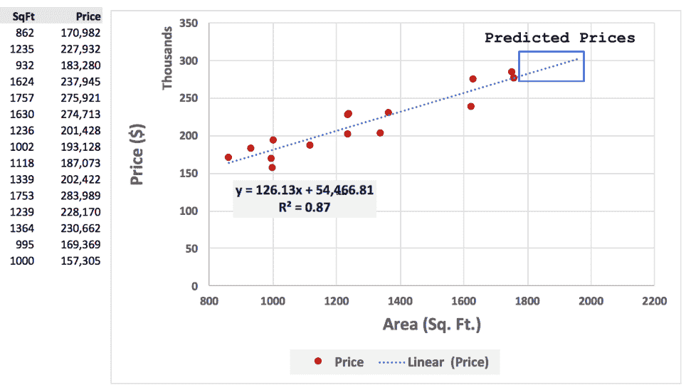

然而，有人可能会争辩说，这条线不是最佳近似值，可能会增加 R2 的值，在本例中是 0.87。 通常，R^2 越高，描述数据的模型越好。 有各种不同类型的*R<sup>2</sup>*值，但出于本节的目的，我们假设*R<sup>2</sup>*越高，模型就越好。

在下一节中，我们将使用多项式函数绘制一条新的趋势线，该趋势线的 R^2 要高得多。 此函数的 R^2 较高(0.91vs0.87)，在视觉上看起来更接近平均值。

这种情况下的函数是 6<sup>次</sup>次多项式：

*y=-0.00 x<sup>6</sup>+0.00 x<sup>5</sup>-0.00 x<sup>4</sup>+2.50 x<sup>3</sup>-2，313.40 x<sup>2</sup>+1，125，401.77 x-224，923，813.17*


但是，即使这条线有更高的 R^2，如果我们延伸趋势线，打算找出 1800-2000 平方米的房价。 英国“金融时报” 范围很可能是，我们得到以下结果。

房屋面积在 1800-2000 平方米之间。 英国“金融时报” 范围从大约。 28 万美元至负 200 万美元，在 2000<sup>平方英尺。 英国“金融时报” 换句话说，人们购买 1800 平方米的房子。 英国“金融时报” 预计将花费 28 万美元，而那些购买 2,000 平方米的住房的人。 英国“金融时报” 根据这个函数，R^2 较高的人应该得到 200 万美元！ 这当然是不准确的，但我们刚刚看到的是所谓的**过度拟合**。 下图说明了这一现象。</sup>

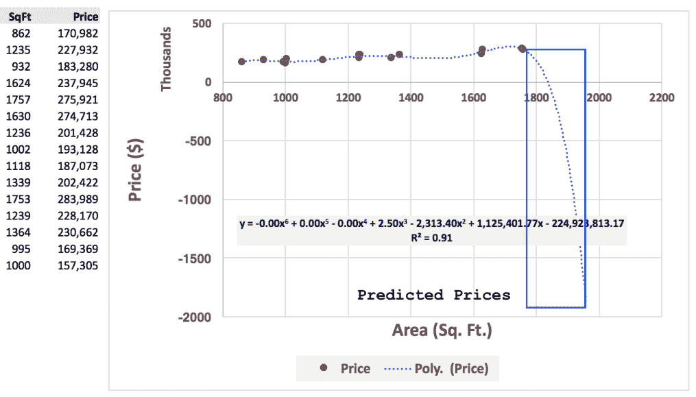

光谱的另一端是**欠拟合**。 当构建的模型不描述数据时，就会发生这种情况。 在下图中，函数 y=0.25x-200 就是这样一个例子：


简而言之，这一节可以缩写为：

*   函数太好地拟合数据，使得该函数几乎可以近似训练数据集中的所有点，则被认为是过拟合。
*   完全不符合数据的函数，或者换句话说，与训练数据集中的实际点相差甚远的函数，被认为是不符合的。
*   机器学习是在数据过度拟合和不足拟合之间取得平衡的过程。 可以说，这并不是一项容易的工作，这就是为什么尽管构建一个模型可能很琐碎，但构建一个相当好的模型却是一个困难得多的挑战。
*   欠拟合是指当你的函数是*而根本不思考*时--它有很高的偏倚。
*   过度拟合是指你的函数*想得太多了*--它的方差很大。
*   下面的示例中给出了另一个欠拟合和过拟合的示例。

假设我们的任务是确定一串水果是橙子还是苹果，并给出它们在水果篮子里的位置(左侧或右侧)、大小和重量：

|  |  |
| **篮子 1(训练数据集)** | **篮子 2(测试数据集)** |

过度拟合的一个例子可能是，基于训练数据集，关于篮子 1，我们可以得出结论，位于篮子右侧的唯一水果是橙子，而在左边的水果都是苹果。

不足的一个例子可能是，我的结论是篮子里只有橙子。

**模型 1**：在第一种情况下--为了更好地适应--我基本上记住了位置。

**模型 2**：在第二种情况下--为了不合身--我什么都记不清了。

现在，给出第二个篮子-苹果和橙子位置互换的测试数据集-如果我使用模型 1，我会错误地得出结论，认为右手边的所有水果都是橙子，左边的水果都是苹果(因为我记住了训练数据)。

如果我使用模型 2，我将再次错误地得出所有水果都是橙子的结论。

然而，有一些方法可以处理好不匹配和过度匹配之间的平衡-或者换句话说，在高偏差和高方差之间。

常用的偏差方差权衡方法之一称为正则化。 这指的是惩罚模型的过程(例如，模型在回归中的系数)，以便产生能够很好地概括一系列数据点的输出。

下一页的表格说明了偏差和方差的一些关键概念，并说明了当模型具有高偏差或高方差时的补救步骤选项：


就建模过程而言，高偏差通常由训练集误差以及测试集误差都保持一致高的事实来指示。 对于高方差(过拟合)，训练集误差迅速减小，但测试集误差保持不变。

# 梯度下降与 VC 维数理论

梯度下降和 VC 维数是机器学习中的两个基本理论。 一般而言，**梯度下降**给出了一种结构化的方法来寻找函数的最优系数。 函数的假设空间可以很大，并且随着梯度的下降，该算法试图找到代价函数(例如，误差平方和)最低的最小值(*，最小值*)。

**VC Dimension**提供了系统中可以分类的最大点数的上限。 它本质上是对函数丰富性的度量，并以结构化的方式提供对假设极限的评估。 可以通过函数或假设精确分类的点数称为假设的 VC 维度。 例如，线性边界可以准确地分类 2 或 3 个点，但不能精确地分类 4 个点。因此，这个 2 维空间的 VC 维度应该是 3。

VC Dimension 和计算学习理论中的许多其他主题一样，既复杂又有趣。 这是一个鲜为人知(和讨论)的话题，但它试图回答关于学习的极限是什么的问题，因此具有深远的含义。

# 流行的机器学习算法

有各种不同类别的机器学习算法。 因此，由于算法可以在概念层面上同时属于多个“类”或类别，因此很难明确声明一个算法只属于一个类。 在本节中，我们将简要讨论几个最常用和最知名的算法。

这些措施包括：

*   回归模型
*   关联规则
*   决策树
*   随机森林
*   助推算法
*   支持向量机
*   K-均值
*   神经网络

请注意，在示例中，我们使用整个数据集展示了 R 函数的基本用法。 在实践中，我们将数据分成训练集和测试集，一旦我们构建了一个令人满意的模型，就将同样的方法应用于测试数据集来评估模型的性能。

# 回归模型

回归模型的范围从统计学中常用的线性、逻辑和多元回归算法到岭回归和套索回归，后者通过惩罚系数来提高模型性能。

在前面的示例中，我们看到了在创建趋势线时**线性回归**的应用。 **多元线性回归**指的是创建模型的过程需要多个自变量。

例如：

**广告总成本=x*平面广告**，将是一个简单的线性回归；而

**广告总成本=X+平面广告+广播广告+电视广告**，由于存在多个自变量(平面、广播和电视)，将是多元线性回归。

**Logistic 回归**是另一种常用的统计回归建模技术，它预测离散类别值的结果，主要用于结果变量是二分法的情况(例如，0 或 1、是或否等)。 然而，可以有两个以上的离散结果(例如，纽约州、纽约州、华盛顿州)，这种类型的 Logistic 回归称为**多项 Logistic 回归**。

**岭回归和套索回归**除了线性回归的其他方面之外，还包括正则项(λ)。 正则化项，岭回归，具有降低β系数(从而“惩罚”系数)的效果。 在套索中，正则化项倾向于将某些系数降低到 0，从而消除了变量对最终模型的影响：

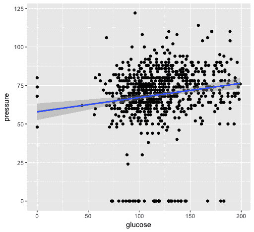

```py
# Load mlbench and create a regression model of glucose (outcome/dependent variable) with pressure, triceps and insulin as the independent variables.

> library("mlbench") 
>lm_model<- lm(glucose ~ pressure + triceps + insulin, data=PimaIndiansDiabetes[1:100,]) 
> plot(lm_model) 
```

# 关联规则

关联规则挖掘，或**先验**，试图找到数据集中变量之间的关系。 关联规则经常用于各种实际的真实世界用例。 在给定一组变量的情况下，先验可以指示事务性数据集中固有的模式。 我们的其中一个教程将基于为 apriori 实现一个 R 闪亮应用程序，因此，在这一节中将更多地强调这一点。

例如，假设一家连锁超市正在决定上架商品的顺序。 对包含销售交易的数据库运行的先验算法将识别最常一起购买的商品。 这使得超市可以确定哪些商品在战略上相互靠近时，可以产生最大的销售额。 这通常也被称为*市场篮子分析*。

反映这一点的一个简单示例可能如下所示：

```py
# The LHS (left-hand side) leads to the RHS (right-hand side) in the relationships shown below.

# For instance, {Milk, Bread} --> {Butter} indicates that someone purchasing milk and bread is also likely to purchase butter.

{Milk, Bread} --> {Butter}
{Butter, Egg} --> {Baking Tray}
{Baking Tray, Butter} --> {Sugar}
...
```

在所有这些情况下，购买左边的东西的行为导致购买表达式右边提到的物品。

也可以从不一定包含*个事务*的数据库中导出关联规则，而是使用滑动窗口沿着时间属性遍历事件，例如使用 WINEPI 算法。

在先验中有三个主要措施。 为了说明它们，让我们使用一个包含在 4 个独立交易中购买的商品的样本数据集：

| **交易** | **项目 1** | **项目 2** | **项目 3** |
| 1. | 奶 / 牛奶 / 山羊奶 / 乳液 | 面包 / 饼 / 生计 | 涂黄油于… / 涂黄油于 / 讨好 |
| 2 个 | 奶 / 牛奶 / 山羊奶 / 乳液 | 蛋 / 卵细胞 / 蛋状物 / 家伙 | 涂黄油于… / 涂黄油于 / 讨好 |
| 3. | 面包 / 饼 / 生计 | 蛋 / 卵细胞 / 蛋状物 / 家伙 | 干酪 / 奶酪 |
| 4. | 涂黄油于… / 涂黄油于 / 讨好 | 面包 / 饼 / 生计 | 蛋 / 卵细胞 / 蛋状物 / 家伙 |

# 信任 / 把握 / 自信 / 知心话

置信度是指当先验表达式的右侧有效时，右侧有效的频率。 例如，给定一个表达式：

```py
{Milk} à {Bread}
```

我们想知道购买面包的频率*，也购买牛奶的频率*。

在本例中：

*   **事务处理 1**：牛奶和面包都存在
*   **事务处理 2**：有牛奶，但没有面包
*   **交易记录 3 和 4**：不存在牛奶

因此，根据我们看到的情况，有 2 个事务存在 Milk，其中 1 个事务存在 Bread。 因此，规则{Milk}à{Bread}的置信度将为 1/2=50%

以另一个表达式为例：

```py
{Bread} à {Butter}
```

我们想知道，面包是什么时候买的，黄油也是多久买一次？

*   **事务处理 1**：面包和黄油都存在
*   **事务 2**：没有面包(黄油存在，但我们的参考点是面包，因此这不算)
*   **事务处理 3**：有面包，但没有黄油
*   **事务处理 4**：面包和黄油都存在

因此，我们在 3 个交易中有面包，在 3 个交易中有 2 个是面包和黄油。 因此，在这种情况下，规则`{Bread} à {Butter}`的‘置信度’为*2/3=66.7*。

# 支撑 / 提供帮助 / 使能够起作用 / 支持运行

支持是指满足规则的次数相对于数据集中的事务总数。

例如：

{牛奶}-->{面包}，出现在 1/4 事务中(在事务 1 中)。 因此，该规则的支持率为？=0.25(或 25%)。

{面包}-->{Butter}，出现在 4 个事务中的 2 个(在事务 1 和 4 中)。 因此，该规则的支持率为 1/2=0.50(或 50%)。

# 举起 / 振奋精神提升 / 鼓舞

Lift 可以说是这 3 个度量中最重要的一个；它衡量规则的支持度相对于表达式的各个侧面的支持度；换句话说，它衡量的是相对于表达式的 LHS 和 RHS 随机出现的规则的强度。 它的正式定义为：

*提升=支持(规则)/(支持(LHS)*支持(RHS))*

升力的低值(例如，小于或等于 1)表示 LHS 和 RHS 的出现是相互独立的，而升力测量越高，则表明 LHS 和 RHS 的共现是显著的。

在前面的示例中，

{面包}-->{Butter}的升力为：

支持({面包}-->{Butter})
支持{面包}*支持{Butter}

=0.50/((3/4)*(3/4))=0.50/(0.75*0.75)=0.89.

这表明尽管该规则的置信度很高，但该规则本身与可能高于 1 的其他规则相比并不显著。

举一个升程大于 1 的规则示例：

{第一项：面包}-->{第三项：奶酪}

这有一个提升：

支持{项 1：面包-->项 3：奶酪}/(支持{项 1：奶酪}*支持{项 3：奶酪})

=(1/4)/((1/4)*(1/4)=4。

# 决策树

决策树是一种预测性建模技术，它生成基于先前结果的可能性导出特定结果的可能性的规则。 一般而言，决策树通常类似于**流程图**，具有一系列表示父子关系的节点和树叶。 未链接到其他节点的节点称为叶。

决策树属于通常称为**CART**(**分类和回归树**)的一类算法。 如果感兴趣的结果是分类变量，则属于分类练习，而如果结果是数字，则称为回归树。

举个例子将有助于使这一概念更加清晰。 看一下图表：


图表显示了一个假设场景：如果学校停课/不停课。 矩形框(蓝色)表示节点。 第一个矩形(学校关闭)表示*根*节点，而内部矩形表示*内部*节点。 边成角度的矩形框(绿色和斜体字母)表示‘*叶*’(或*末端*节点)。

决策树简单易懂，是为数不多的不是“黑匣子”的算法之一。 像那些用来创建神经网络的算法通常被认为是黑箱，因为由于模型的复杂性，很难(如果不是不可能)直观地确定最终结果的确切路径。

在 R 中，有各种用于创建决策树的工具。 在 R 中创建它们的一个常用库是`rpart`。 我们将重新访问我们的`PimaIndiansDiabetes`数据集，以了解如何使用该包创建决策树。

我们想要建立一个模型来确定葡萄糖、胰岛素、(身体)质量和年龄与糖尿病的关系。 请注意，在数据集中，糖尿病是一个具有是/否响应的分类变量。

为了可视化决策树，我们将使用`rpart.plot`包。 其代码如下：

```py
install.packages("rpart") 
install.packages("rpart.plot") 

library(rpart) 
library(rpart.plot) 

rpart_model<- rpart (diabetes ~ glucose + insulin + mass + age, data = PimaIndiansDiabetes) 

>rpart_model 
n= 768  

node), split, n, loss, yval, (yprob) 
      * denotes terminal node 

  1) root 768 268 neg (0.6510417 0.3489583)   
    2) glucose< 127.5 485  94neg (0.8061856 0.1938144) * 
    3) glucose>=127.5 283 109 pos (0.3851590 0.6148410)   
      6) mass< 29.95 76  24neg (0.6842105 0.3157895)   
       12) glucose< 145.5 41   6 neg (0.8536585 0.1463415) * 
       13) glucose>=145.5 35  17pos (0.4857143 0.5142857)   
         26) insulin< 14.5 21   8 neg (0.6190476 0.3809524) * 
         27) insulin>=14.5 14   4 pos (0.2857143 0.7142857) * 
      7) mass>=29.95 207  57pos (0.2753623 0.7246377)   
       14) glucose< 157.5 115  45pos (0.3913043 0.6086957)   
         28) age< 30.5 50  23neg (0.5400000 0.4600000)   
           56) insulin>=199 14   3 neg (0.7857143 0.2142857) * 
           57) insulin< 199 36  16pos (0.4444444 0.5555556)   
            114) age>=27.5 10   3 neg (0.7000000 0.3000000) * 
            115) age< 27.5 26   9 pos (0.3461538 0.6538462) * 
         29) age>=30.5 65  18pos (0.2769231 0.7230769) * 
       15) glucose>=157.5 92  12pos (0.1304348 0.8695652) * 

>rpart.plot(rpart_model, extra=102, nn=TRUE)

# The plot shown below illustrates the decision tree that the model, rpart_model represents.
```

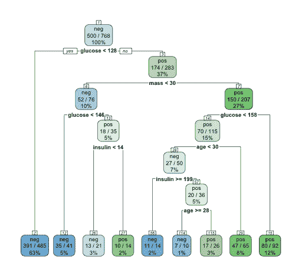

从顶部读取，该图显示数据集中有 500 个`diabetes=neg`案例(总共 768 条记录)。

```py
> sum(PimaIndiansDiabetes$diabetes=="neg") 
[1] 500 
```

在数据集中葡萄糖值<128 的记录总数(768 条)中，有 485 条记录被标记为阴性。 其中，该模型正确地预测了 391 个病例为阴性(节点编号 2，左下数第一个)。

对于葡萄糖读数大于 128 的记录，有 283 条记录被标记为阳性(节点编号 3，紧接在最上面/根节点下面的节点)。 该模型正确地对其中的 174 个案例进行了分类。

另一个更新的包含全面视觉信息的直观决策树软件包是**FFTrees**(**Fast and Frugal Decision Trees**)。 以下示例仅供参考：

```py
install.packages("FFTrees") 
library(caret) 
library(mlbench) 
library(FFTrees) 
set.seed(123) 

data("PimaIndiansDiabetes") 
diab<- PimaIndiansDiabetes 
diab$diabetes<- 1 * (diab$diabetes=="pos") 

train_ind<- createDataPartition(diab$diabetes,p=0.8,list=FALSE,times=1) 

training_diab<- diab[train_ind,] 
test_diab<- diab[-train_ind,] 

diabetes.fft<- FFTrees(diabetes ~.,data = training_diab,data.test = test_diab) 
plot(diabetes.fft)

# The plot below illustrates the decision tree representing diabetes.fft using the FFTrees package.
```


决策树的工作方式是递归地拆分数据，直到某个停止标准(如达到特定深度或案例数量低于指定值)为止。 每一次拆分都是基于将导致“更纯粹的子集”的变量来完成的。

原则上，我们可以从一组给定的变量中生长出无穷无尽的树，这使得它成为一个特别困难和棘手的问题。 存在许多算法，它们为分裂和创建决策树提供了有效的方法。 亨特的算法就是这样一种方法。

有关该算法的更多详细信息，请访问：[https://www-users.cs.umn.edu/~kumar/dmbook/ch4.pdf](https://www-users.cs.umn.edu/~kumar/dmbook/ch4.pdf)。

# 随机森林扩展

随机森林是我们刚才讨论的决策树模型的扩展。 在实践中，决策树易于理解、易于解释、使用可用算法快速创建，并且总体上是直观的。 但是，决策树对数据的微小变化很敏感，仅允许沿轴拆分(线性拆分)，并可能导致过度拟合。 为了减轻决策树的一些缺点，同时仍然获得其优雅的好处，诸如随机森林之类的算法创建了多个决策树并对随机特征进行采样，以利用并构建聚合模型。

随机森林的工作原理是**自举聚合**或**套袋**。 Bootstrap 是一个统计术语，表示随机抽样和替换。 引导给定的一组记录意味着获取随机数量的记录，并可能在样本中多次包含相同的记录。 此后，用户将在样本上测量他们感兴趣的度量，然后重复该过程。 以这种方式，根据随机样本多次计算的度量值的分布预计将代表总体的分布，从而代表整个数据集的分布。

打包一组 3 个数字(如(1，2，3，4))的示例如下：

(1，2，3)、(1，1，3)、(1，3，3)、(2，2，1)等。

引导聚合或*打包*意味着利用一次使用*个引导样本*的投票方法，在每个单独样本(n 个记录的集合)上构建模型，最后聚合结果。

随机森林还实现了除简单装袋之外的另一种级别的操作。 它还在每次拆分时随机选择要包括在模型构建过程中的变量。 例如，如果我们要使用`PimaIndiansDiabetes`数据集创建一个随机森林模型，其中变量为孕妇、葡萄糖、血压、三头肌、胰岛素、质量、系谱、年龄和糖尿病，在每个引导样本(n 个记录的绘制)中，我们将选择用于构建模型的随机特征子集--例如，葡萄糖、血压和胰岛素；胰岛素、年龄和谱系；三头肌、质量和胰岛素；以及其他。

在 R 中，通常用于 RandomForest 的包由同名的 RandomForest 调用。 我们可以按原样通过包使用它，也可以通过插入符号使用它。 这两种方法如下所示：

1.  使用 RandomForest 软件包使用随机森林：

```py
> rf_model1 <- randomForest(diabetes ~ ., data=PimaIndiansDiabetes) > rf_model1 Call: randomForest(formula = diabetes ~ ., data = PimaIndiansDiabetes) 
Type of random forest: classification Number of trees: 500 No. of variables tried at each split: 2 OOB estimate of error rate: 23.44% Confusion matrix: negposclass.error neg430 70 0.1400000 pos 110 158 0.4104478
```

2.  使用`method="rf"`函数通过插入符号使用随机森林：

```py
> library(caret) 
> library(doMC) 

# THE NEXT STEP IS VERY CRITICAL - YOU DO 'NOT' NEED TO USE MULTICORE 
# NOTE THAT THIS WILL USE ALL THE CORES ON THE MACHINE THAT YOU ARE 
# USING TO RUN THE EXERCISE 

# REMOVE THE # MARK FROM THE FRONT OF registerDoMC BEFORE RUNNING 
# THE COMMAND 

># registerDoMC(cores = 8) # CHANGE NUMBER OF CORES TO MATCH THE NUMBER OF CORES ON YOUR MACHINE  

>rf_model<- train(diabetes ~ ., data=PimaIndiansDiabetes, method="rf") 
>rf_model 
Random Forest  

768 samples 
  8 predictor 
  2 classes: 'neg', 'pos'  

No pre-processing 
Resampling: Bootstrapped (25 reps)  
Summary of sample sizes: 768, 768, 768, 768, 768, 768, ...  
Resampling results across tuning parameters: 

mtry  Accuracy   Kappa     
  2     0.7555341  0.4451835 
  5     0.7556464  0.4523084 
  8     0.7500721  0.4404318 

Accuracy was used to select the optimal model using  the largest value. 
The final value used for the model was mtry = 5\. 

>getTrainPerf(rf_model) 

TrainAccuracyTrainKappa method 
1     0.7583831  0.4524728rf 
```

还可以在原始随机森林模型(没有使用插入符号)的每棵树中查看拆分和其他相关信息。 这可以使用`getTree`函数来完成，如下所示：

```py
>getTree(rf_model1,1,labelVar = TRUE) 
    left daughter right daughter split var split point status prediction 
1               2              3      mass     27.8500      1       <NA> 
2               4              5       age     28.5000      1       <NA> 
3               6              7   glucose    155.0000      1       <NA> 
4               8              9       age     27.5000      1       <NA> 
5              10             11      mass      9.6500      1       <NA> 
6              12             13  pregnant      7.5000      1       <NA> 
7              14             15   insulin     80.0000      1       <NA> 
8               0              0      <NA>      0.0000     -1        neg 
9              16             17  pressure     68.0000      1       <NA> 
10              0              0      <NA>      0.0000     -1        pos 
11             18             19   insulin    131.0000      1       <NA> 
12             20             21   insulin     87.5000      1       <NA> 

 [...]
```

# 助推算法

Boosting 是一种使用权重和一组*弱学习器*(例如决策树)来提高模型性能的技术。 Boosting 根据模型错误分类为数据赋权，未来学习者(在 Boosting 机器学习过程中创建)的重点放在错误分类的示例上。 正确分类的示例将被重新分配新的权重，新的权重通常低于未正确分类的示例。 权重可以基于使用数据子集的成本函数，例如多数票。

在简单和非技术术语中，Boosting 使用*一系列较弱的学习者，每个学习者从先前学习者的错误中‘学习’*。

与装袋相比，Boosting 通常更受欢迎，因为它相对于模型性能分配权重，而不是像装袋那样为所有数据点分配相同的权重。 这在概念上类似于加权平均与没有加权标准的平均函数之间的差异。

在 R 中有几个用于提升算法的包，一些常用的包如下所示：

*   阿达布斯
*   **GBM**(**随机梯度提升**)
*   XGBoost

其中，XGBoost 是一个广受欢迎的机器学习包，已经在 Kaggle 等竞争对手的机器学习平台上非常成功地使用。 XGBoost 有一种非常优雅且计算高效的方法来创建整体模型。 由于 XGBoost 既准确又非常快，因此用户经常使用 XGBoost 来应对计算密集型 ML 挑战。 您可以在[http://www.kaggle.com](http://www.kaggle.com)了解更多关于 kaggle 的信息。

```py
# Creating an XGBoost model in R

library(caret)
library(xgboost) 

set.seed(123) 
train_ind<- sample(nrow(PimaIndiansDiabetes),as.integer(nrow(PimaIndiansDiabetes)*.80)) 

training_diab<- PimaIndiansDiabetes[train_ind,] 
test_diab<- PimaIndiansDiabetes[-train_ind,] 

diab_train<- sparse.model.matrix(~.-1, data=training_diab[,-ncol(training_diab)]) 
diab_train_dmatrix<- xgb.DMatrix(data = diab_train, label=training_diab$diabetes=="pos") 

diab_test<- sparse.model.matrix(~.-1, data=test_diab[,-ncol(test_diab)]) 
diab_test_dmatrix<- xgb.DMatrix(data = diab_test, label=test_diab$diabetes=="pos") 

param_diab<- list(objective = "binary:logistic", 
eval_metric = "error", 
              booster = "gbtree", 
max_depth = 5, 
              eta = 0.1) 

xgb_model<- xgb.train(data = diab_train_dmatrix, 
param_diab, nrounds = 1000, 
watchlist = list(train = diab_train_dmatrix, test = diab_test_dmatrix), 
print_every_n = 10) 

predicted <- predict(xgb_model, diab_test_dmatrix) 
predicted <- predicted > 0.5 

actual <- test_diab$diabetes == "pos" 
confusionMatrix(actual,predicted) 

# RESULT 

Confusion Matrix and Statistics 

          Reference 
Prediction FALSE TRUE 
     FALSE    80   17 
     TRUE     21   36 

Accuracy : 0.7532           
                 95% CI : (0.6774, 0.8191) 
    No Information Rate : 0.6558           
    P-Value [Acc> NIR] : 0.005956         

Kappa : 0.463            
Mcnemar's Test P-Value : 0.626496         

Sensitivity : 0.7921           
Specificity : 0.6792           
PosPredValue : 0.8247           
NegPredValue : 0.6316           
Prevalence : 0.6558           
         Detection Rate : 0.5195           
   Detection Prevalence : 0.6299           
      Balanced Accuracy : 0.7357           

       'Positive' Class : FALSE       
```

# 支持向量机

支持向量机，通常称为**支持向量机**，是另一类机器学习算法，用于使用称为**超平面**的概念将数据分类到一个或另一个类别，该概念用于定界点之间的线性边界。

例如，给定 x-y 轴上的一组黑白点，我们可以找到将它们分开的多条线。 在本例中，这条线表示描述每个点所属类别的函数。 在下图中，线 H1 和 H2 都精确地分隔点。 在这种情况下，我们如何确定 H1 和 H2 中哪一条是最佳线路？


直观地说，我们可以说离这些点最近的那条线(例如，垂直线 H1)可能*而不是*是分隔这些点的最佳直线。 由于线离点太近，因此对给定数据集上的点过于具体，如果新点稍微偏于线的右侧或左侧，则可能会被错误分类。 换句话说，线路对数据中的微小变化过于敏感(这可能是由于随机/确定性噪声，例如数据中的缺陷)。

另一方面，线 H2 设法分离数据，同时保持距离该线最近的点的最大可能距离。 数据中的细微缺陷不太可能影响点的分类到线 H1 可能已经做到的程度。 本质上，这描述了最大分离裕度的原则，如下图所示。

**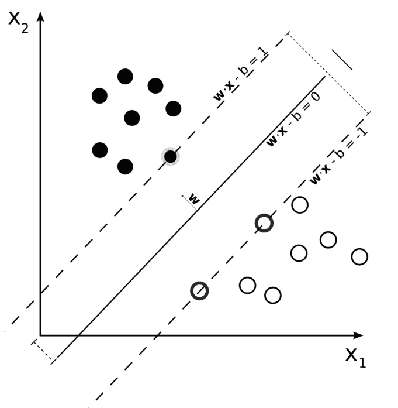**

靠近这条线的点，也称为超平面，被称为“支持向量”(因此而得名)。 因此，在图像中，位于虚线上的点是支持向量。

然而，在现实世界中，并不是所有的点都是“线性可分的”。 支持向量机利用了一个称为“内核技巧”的概念。 本质上，可能无法线性分割的点可以投影或映射到更高维的曲面上。 例如，给定二维 x-y 空间上的一组不可线性分割的点，如果我们要将这些点投影到三维空间上，则可以将它们分开，如下图所示。 红色的点不能被二维线分割，但是当映射到三维曲面时，它们可以被超平面分隔，如下图所示：


R 中有几个包可以让用户利用 SVM，比如`kernlab`、`e1071`、`klaR`等。 这里，我们演示了`e1071`包中的 SVM 的使用，如下所示：

```py
library(mlbench) 
library(caret) 
library(e1071) 
set.seed(123) 

data("PimaIndiansDiabetes") 
diab<- PimaIndiansDiabetes 

train_ind<- createDataPartition(diab$diabetes,p=0.8,list=FALSE,times=1) 

training_diab<- diab[train_ind,] 
test_diab<- diab[-train_ind,] 

svm_model<- svm(diabetes ~ ., data=training_diab) 
plot(svm_model,training_diab, glucose ~ mass) 

# The plot below illustrates the areas that are classified 'positive' and 'negative'
```


```py
# Creating and evaluating the Confusion Matrix for the SVM model

svm_predicted<- predict(svm_model,test_diab[,-ncol(test_diab)]) 
confusionMatrix(svm_predicted,test_diab$diabetes) 

Confusion Matrix and Statistics 

          Reference 
Prediction negpos 
neg  93  26 
pos7  27 

Accuracy : 0.7843           
                 95% CI : (0.7106, 0.8466) 
    No Information Rate : 0.6536           
    P-Value [Acc> NIR] : 0.0003018        

Kappa : 0.4799           
Mcnemar's Test P-Value : 0.0017280        

Sensitivity : 0.9300           
Specificity : 0.5094           
PosPredValue : 0.7815           
NegPredValue : 0.7941           
Prevalence : 0.6536           
         Detection Rate : 0.6078           
   Detection Prevalence : 0.7778           
      Balanced Accuracy : 0.7197           

       'Positive' Class :neg 
```

# K-均值机器学习技术

K-Means 是最流行的无监督机器学习技术之一，用于创建聚类，从而对数据进行分类。

下面是一个直观的例子：

假设一所大学正在开设一门关于美国历史和亚洲历史的新课程。 这所大学维持 15：1 的师生比例，因此每 15 名学生有一名教师。 它进行了一项调查，其中包含一个 10 分的数字得分，这是由每个学生根据他们对学习美国历史或亚洲历史的偏好而分配的。

我们可以使用 R 中内置的 K-Means 算法来创建 2 个簇，并且大概可以通过每个簇中的点数来估计可能注册每门课程的学生数量。 其代码如下：

```py
library(data.table) 
library(ggplot2) 
library() 

historyData<- fread("~/Desktop/history.csv") 
ggplot(historyData,aes(american_history,asian_history)) + geom_point() + geom_jitter() 

historyCluster<- kmeans(historyData,2) # Create 2 clusters 
historyData[,cluster:=as.factor(historyCluster$cluster)] 
ggplot(historyData, aes(american_history,asian_history,color=cluster)) + geom_point() + geom_jitter()

# The image below shows the output of the ggplot command. Note that the effect of geom_jitter can be seen in the image below (the points are nudged so that overlapping points can be easily visible)
```

下图可以直观地估计每门课程可能注册的学生人数(从而确定可能需要多少教师)：

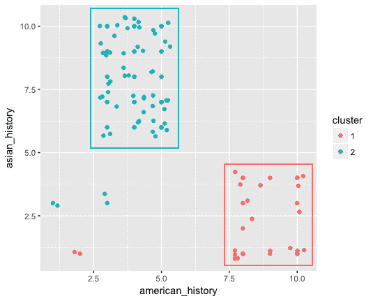

K-Means 算法有几种变体，但标准的也是最常用的一种是劳埃德算法。 算法步骤如下：

给定一组 n 个点(例如在 x-y 轴上)，以便找到 k 个群集：

1.  从数据集中随机选择 k 个点来表示 k 个簇的中点(例如，*个初始质心*)。
2.  测量从其他每个点到所选 k 个点(表示 k 个群集)的距离，并将其分配给距该点距离最小的群集。
3.  群集中心被重新计算为群集中的点的平均值。
4.  如步骤 2 所示，再次计算质心与所有其他点之间的距离，并如步骤 3 所示，计算新质心。以这种方式，重复步骤 2 和 3，直到没有新数据被重新分配为止。

存在用于聚类的各种*距离和相似性度量*，例如**欧几里德距离**(直线距离)、**余弦相似度**(矢量之间夹角的余弦)、**海明距离**(通常用于分类变量)、**马氏距离**(以 P.C.Mahalanobis 命名；这测量点与分布平均值之间的距离)，以及

虽然不能总是明确地确定最佳聚类数，但有各种方法试图找到估计值。 通常，集群可以通过集群内的点彼此之间的距离(在集群方差内，例如平方和 WSS)和集群之间的距离来衡量(因此，集群之间的距离越大，集群就更容易区分)。 其中一种用于确定最优数的方法称为**肘法**。 下图说明了这一概念：

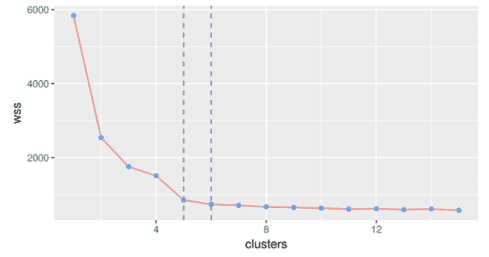

该图表显示了 WSS(在我们寻求最小化的群集平方和内)与群集数量的关系图。 很明显，将簇数从 1 增加到 2 会大大降低 WSS 值。 WSS 的值迅速减小，直到第 4<sup>第</sup>或第 5<sup>第</sup>簇，此时添加更多簇并不会显著改善 WSS。 通过视觉评估，机器学习从业者可以根据图像得出结论，可以创建的理想聚类数量在 3-5 个之间。

Note that a low WSS score is not enough to determine the optimal number of clusters. It has to be done by inspecting the improvement in the metric. The WSS will eventually reduce to 0 when each point becomes an independent cluster.

# 与神经网络相关的算法

与神经网络相关的算法已经存在了几十年。 第一个计算模型是由沃伦·麦卡洛克和沃尔特·皮茨于 1943 年在“数学生物物理公报”上描述的。

You can learn more about these concepts at [https://pdfs.semanticscholar.org/5272/8a99829792c3272043842455f3a110e841b1.pdf](https://pdfs.semanticscholar.org/5272/8a99829792c3272043842455f3a110e841b1.pdf) and [https://en.wikipedia.org/wiki/Artificial_neural_network](https://en.wikipedia.org/wiki/Artificial_neural_network).

物理世界中的各种人造物体，如飞机，都从自然中汲取了灵感。 神经网络本质上是*人类神经系统*中神经元的轴突和树突(也称为树突)之间的数据交换现象的表示。 就像数据在一个神经元之间传递到多个其他神经元以做出复杂的决定一样，人工神经网络以类似的方式创建一个神经元网络，从其他神经元接收输入。

从高层次上讲，人工神经网络由 4 个主要组件组成：

*   输入层
*   隐藏层
*   输出层
*   节点和权重

这如下图所示：


图表中的每个节点都会根据上一层的输入生成一个输出。 使用**激活功能**产生输出。 激活功能有多种类型，产生的输出取决于使用的功能类型。 示例包括二进制阶跃(0 或 1)、tanh(介于-1 和+1 之间)、Sigmoid 等。

下图说明了这一概念：

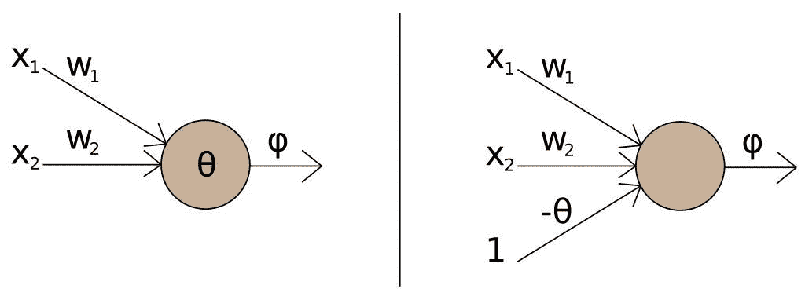

值 x1 和 x2 是输入，w1 和 w2 表示权重，节点表示评估输入及其权重并由激活函数产生特定输出的点。 因此，输出 f 可以表示为：


这里，f 表示激活函数，b 表示偏置项。 偏置项与权重和输入值无关，允许用户转换输出以获得更好的模型性能。

具有多个隐藏层(通常为 2 个或更多)的神经网络是计算密集型的，最近几天，具有多个隐藏层的神经网络(也称为深度神经网络或更普遍的深度学习)变得非常流行。

在机器学习和人工智能的推动下，该行业的许多发展都是这种多层神经网络实施的直接结果。

在 R 中，软件包`nnet`为神经网络提供了一个易于使用的接口。 尽管在实践中，神经网络通常需要复杂的硬件、GPU 卡等来进行说明，但我们已经利用`nnet`包对`PimaIndiansDiabetes`数据集运行了早期的分类练习。 在本例中，我们将利用插入符号来执行`nnet`模型：

```py
library(mlbench) 
library(caret) 
set.seed(123) 

data("PimaIndiansDiabetes") 
diab<- PimaIndiansDiabetes 

train_ind<- createDataPartition(diab$diabetes,p=0.8,list=FALSE,times=1) 

training_diab<- diab[train_ind,] 
test_diab<- diab[-train_ind,] 

nnet_grid<- expand.grid(.decay = c(0.5,0.1), .size = c(3,5,7)) 

nnet_model<- train(diabetes ~ ., data = training_diab, method = "nnet", metric = "Accuracy", maxit = 500, tuneGrid = nnet_grid) 

# Generating predictions using the neural network model
nnet_predicted <- predict(nnet_model, test_diab)

> plot (nnet_model)

```


```py
# Confusion Matrix for the Neural Network model

confusionMatrix(nnet_predicted,test_diab$diabetes)

Confusion Matrix and Statistics 

          Reference 
Prediction negpos 
neg  86  22 
pos  14  31 

Accuracy : 0.7647           
                 95% CI : (0.6894, 0.8294) 
    No Information Rate : 0.6536           
    P-Value [Acc> NIR] : 0.001988         

Kappa : 0.4613           
Mcnemar's Test P-Value : 0.243345         

Sensitivity : 0.8600           
Specificity : 0.5849           
PosPredValue : 0.7963           
NegPredValue : 0.6889           
Prevalence : 0.6536           
         Detection Rate : 0.5621           
   Detection Prevalence : 0.7059           
      Balanced Accuracy : 0.7225           

       'Positive' Class :neg 
```

# 基于 CMS 数据的教程关联规则挖掘

本教程将实现一个接口，用于访问使用 R 中的 Apriori 包创建的规则。

我们将从 CMS Open Payments 网站下载数据。 该网站提供了公司支付给医生和医院的数据：


该网站提供了多种下载数据的方式。 用户可以选择感兴趣的数据集并手动下载。 在我们的例子中，我们将使用所有用户都可以使用的基于 Web 的 API 之一来下载数据。

# 正在下载数据

数据集可以在 Unix 终端(在虚拟机中)下载，也可以通过直接从浏览器访问站点来下载。 如果要在虚拟机中下载数据集，请在终端窗口中运行以下命令：

```py
time wget -O cms2016_2.csv 'https://openpaymentsdata.cms.gov/resource/vq63-hu5i.csv?$query=select Physician_First_Name as firstName,Physician_Last_Name as lastName,Recipient_City as city,Recipient_State as state,Submitting_Applicable_Manufacturer_or_Applicable_GPO_Name as company,Total_Amount_of_Payment_USDollars as payment,Nature_of_Payment_or_Transfer_of_Value as paymentNature,Product_Category_or_Therapeutic_Area_1 as category,Name_of_Drug_or_Biological_or_Device_or_Medical_Supply_1 as product where covered_recipient_type like "Covered Recipient Physician" and Recipient_State like "NY" limit 1200000' 
```

或者，如果要从浏览器下载数据，请在浏览器窗口中输入以下 URL，然后按*Enter*：

[https://openpaymentsdata.cms.gov/resource/vq63-hu5i.csv?$query=select Physician_First_Name as firstName,Physician_Last_Name as lastName,Recipient_City as city,Recipient_State as state,Submitting_Applicable_Manufacturer_or_Applicable_GPO_Name as company,Total_Amount_of_Payment_USDollars as payment,Nature_of_Payment_or_Transfer_of_Value as paymentNature,Product_Category_or_Therapeutic_Area_1 as category,Name_of_Drug_or_Biological_or_Device_or_Medical_Supply_1 as product where covered_recipient_type like "Covered Recipient Physician" and Recipient_State like "NY"](https://openpaymentsdata.cms.gov/resource/vq63-hu5i.csv?%24query=select%20Physician_First_Name%20as%20firstName,Physician_Last_Name%20as%20lastName,Recipient_City%20as%20city,Recipient_State%20as%20state,Submitting_Applicable_Manufacturer_or_Applicable_GPO_Name%20as%20company,Total_Amount_of_Payment_USDollars%20as%20payment,Nature_of_Payment_or_Transfer_of_Value%20as%20paymentNature,Product_Category_or_Therapeutic_Area_1%20as%20category,Name_of_Drug_or_Biological_or_Device_or_Medical_Supply_1%20as%20product%20where%20covered_recipient_type%20like%20%22Covered%20Recipient%20Physician%22%20and%20Recipient_State%20like%20%22NY%22)

如下图所示：


# 编写 Apriori 的 R 代码

如前所述，Apriori 算法允许用户查找数据集中固有的关系或模式。 为此，我们将使用 R/RStudio 中的 arules 包。 代码将读取下载的数据集(在本例中称为`cms2016_2.csv`)，并运行 apriori 算法以查找关联规则。

在 RStudio 中创建一个新的 R 文件，并输入以下代码。 确保将下载的 CSV 文件的位置更改为存储该文件的相应目录：

```py
library(data.table) 
library(arules) 

cms<- fread("~/cms2016_2.csv") # CHANGE THIS TO YOUR LOCATION OF THE DATA 

cols <- c("category","city","company","firstName","lastName","paymentNature","product") 

cms[ ,(cols) := lapply(.SD, toupper), .SDcols = cols] 

cms[,payment:=as.numeric(payment)] 

quantile_values<- quantile(cms$payment,seq(0,1,.25)) 
interval_values<- findInterval(cms$payment,quantile_values,rightmost.closed=TRUE) 

cms[,quantileVal:=factor(interval_values, labels=c("0-25","25-50","50-75","75-100"))] 

rules_cols<- c("category","city","company","paymentNature","product","quantileVal") 

cms[ ,(rules_cols) := lapply(.SD, factor), .SDcols = rules_cols] 

cms_factor<- cms[,.(category,city,company,paymentNature,product,quantileVal)] 

rhsVal<- paste0("quantileVal","=",c("0-25","25-50","50-75","75-100")) 

cms_rules<- apriori(cms_factor,parameter=list(supp=0.001,conf=0.25,target="rules",minlen=3)) 

cms_rules_dt<- data.table(as(cms_rules,"data.frame")) 
cms_rules_dt[, c("LHS", "RHS") := tstrsplit(rules, "=>", fixed=TRUE)] 
num_cols<- c("support","confidence","lift") 
cms_rules_dt[,(num_cols) := lapply(.SD, function(x){round(x,2)}), .SDcols = num_cols] 

saveRDS(cms_rules_dt,"cms_rules_dt.rds") 
saveRDS(cms_factor,"cms_factor_dt.rds") 
```

# 闪亮(R 代码)

在 RStudio 中，选择文件|新建文件|闪亮的 Web App：


在`app.R`中输入以下代码：

```py
# Packt: Big Data Analytics 
# Chapter 8 Tutorial 

library(shiny) 
library(shinydashboard) 
library(data.table) 
library(DT) 
library(shinyjs) 

cms_factor_dt<- readRDS("~/r/rulespackt/cms_factor_dt.rds") 
cms_rules_dt<- readRDS("~/r/rulespackt/cms_rules_dt.rds") 

# Define UI for application that draws a histogram 
ui<- dashboardPage (skin="green",    
dashboardHeader(title = "Apriori Algorithm"), 
dashboardSidebar( 
useShinyjs(), 
sidebarMenu( 
uiOutput("company"), 
uiOutput("searchlhs"), 
uiOutput("searchrhs"), 
uiOutput("support2"), 
uiOutput("confidence"), 
uiOutput("lift"), 
downloadButton('downloadMatchingRules', "Download Rules") 

         ) 
),dashboardBody( 
tags$head( 
tags$link(rel = "stylesheet", type = "text/css", href = "packt2.css"), 
tags$link(rel = "stylesheet", type = "text/css", href = "//fonts.googleapis.com/css?family=Fanwood+Text"), 
tags$link(rel = "stylesheet", type = "text/css", href = "//fonts.googleapis.com/css?family=Varela"), 
tags$link(rel = "stylesheet", type = "text/css", href = "fonts.css"), 

tags$style(type="text/css", "select { max-width: 200px; }"), 
tags$style(type="text/css", "textarea { max-width: 185px; }"), 
tags$style(type="text/css", ".jslider { max-width: 200px; }"), 
tags$style(type='text/css', ".well { max-width: 250px; padding: 10px; font-size: 8px}"), 
tags$style(type='text/css', ".span4 { max-width: 250px; }") 

         ), 
fluidRow( 
dataTableOutput("result") 
) 
       ), 
       title = "Aprior Algorithm" 
) 

# Define server logic required to draw a histogram 
server <- function(input, output, session) { 

  PLACEHOLDERLIST2 <- list( 
    placeholder = 'Select All', 
onInitialize = I('function() { this.setValue(""); }') 
  ) 

output$company<- renderUI({ 
datasetList<- c("Select All",as.character(unique(sort(cms_factor_dt$company)))) 
selectizeInput("company", "Select Company" ,  
datasetList, multiple = FALSE,options = PLACEHOLDERLIST2,selected="Select All") 
  }) 

output$searchlhs<- renderUI({ 
textInput("searchlhs", "Search LHS", placeholder = "Search") 
  }) 

output$searchrhs<- renderUI({ 
textInput("searchrhs", "Search RHS", placeholder = "Search") 
  }) 

  output$support2 <- renderUI({ 
sliderInput("support2", label = 'Support',min=0,max=0.04,value=0.01,step=0.005) 
  }) 

output$confidence<- renderUI({ 
sliderInput("confidence", label = 'Confidence',min=0,max=1,value=0.5) 
  }) 

output$lift<- renderUI({ 
sliderInput("lift", label = 'Lift',min=0,max=10,value=0.8) 
  }) 

dataInput<- reactive({ 
    print(input$support2) 
    print(input$company) 
    print(identical(input$company,"")) 

    temp <- cms_rules_dt[support > input$support2 & confidence >input$confidence& lift >input$lift] 

    if(!identical(input$searchlhs,"")){ 
searchTerm<- paste0("*",input$searchlhs,"*") 
      temp <- temp[LHS %like% searchTerm] 
    } 

    if(!identical(input$searchrhs,"")){ 
searchTerm<- paste0("*",input$searchrhs,"*") 
      temp <- temp[RHS %like% searchTerm] 
    } 

if(!identical(input$company,"Select All")){ 
      # print("HERE") 
      temp <- temp[grepl(input$company,rules)] 
    } 
    temp[,.(LHS,RHS,support,confidence,lift)] 
  }) 

output$downloadMatchingRules<- downloadHandler( 
    filename = "Rules.csv", 
    content = function(file) { 
      write.csv(dataInput(), file, row.names=FALSE) 
    } 
  ) 

output$result<- renderDataTable({ 
    z = dataInput() 
    if (nrow(z) == 0) { 
      z <- data.table("LHS" = '', "RHS"='', "Support"='', "Confidence"='', "Lift" = '') 
    } 
setnames(z, c("LHS", "RHS", "Support", "Confidence", "Lift")) 
datatable(z,options = list(scrollX = TRUE)) 
  }) 

}  shinyApp(ui = ui, server = server)
```

下图显示了被复制并保存在名为`app.R`的文件中的代码。

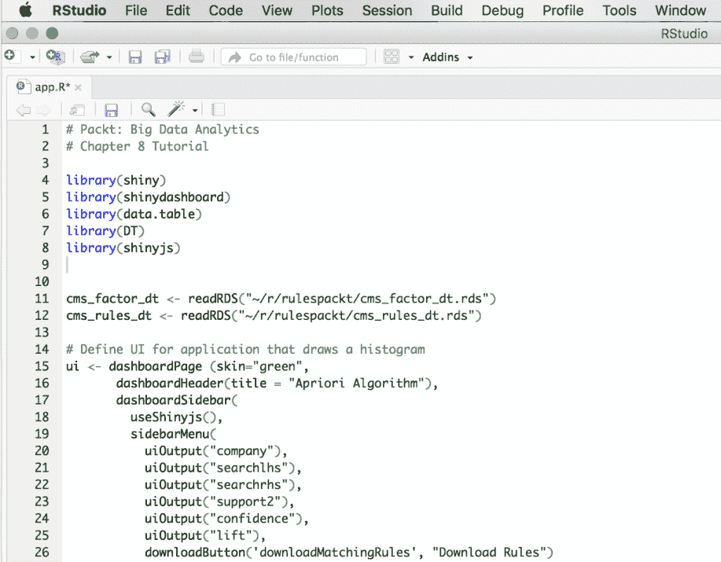

# 为应用程序使用自定义 CSS 和字体

对于我们的应用程序，我们将使用自定义 CSS 文件。 我们还将使用自定义字体，以使应用程序具有良好的外观。

您可以从本书的软件存储库中下载自定义 CSS 文件。

CSS、字体和其他相关文件应存储在创建 R SHINY 应用程序的目录中名为`www`的文件夹中：

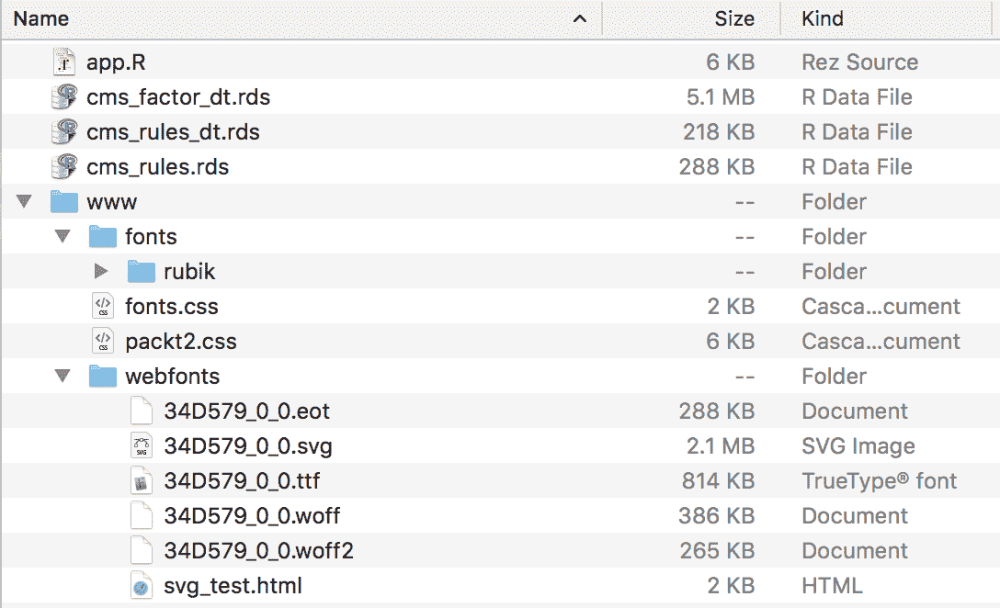

# 运行应用程序

如果一切正常，您现在应该可以通过单击页面顶部的 Run App 选项来运行应用程序，如下图所示：

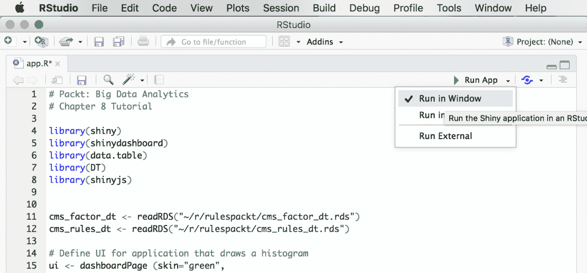

单击“Run”(运行)按钮后，用户将看到类似如下所示的弹出窗口。 请注意，应在浏览器中启用弹出窗口才能正常工作。

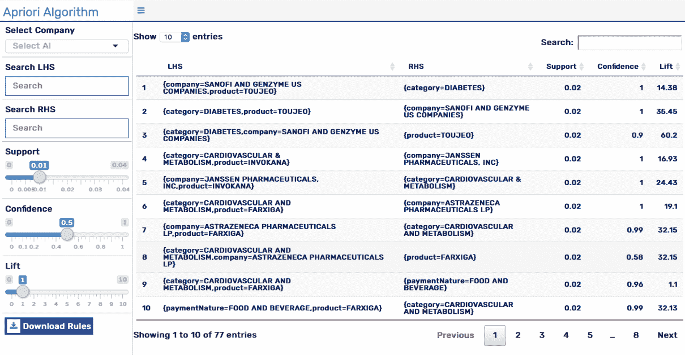

该应用程序有多个控件，例如：

*   **搜索 LHS/RHS**：在规则的左侧或右侧输入要筛选的任何测试。
*   **支持**：表示规则在数据集中的流行度。
*   **置信度**：规则中有多少条是完全匹配的。
*   **Lift**：定义规则重要性的变量。 大于 1 的数字被认为是重要的。

您可以将此应用程序用于任何其他规则文件，只要它们的处理方式类似于前面在 R 脚本部分中概述的方式即可。

# 简略的 / 概括的 / 简易判罪的 / 简易的

机器学习从业者通常认为创建模型很容易，但创建一个好的模型要困难得多。 事实上，不仅创建一个好的*好的*模型很重要，也许更重要的是，知道如何识别一个好的*好的*模型是区分机器学习成功与不成功的关键。

在本章中，我们将阅读机器学习中的一些更深层次的理论概念。 偏差、方差、正则化和其他常见概念在需要时用实例进行了解释。 通过附带的 R 代码，我们还了解了一些常见的机器学习算法，如随机森林、支持向量机等。 最后，我们介绍了如何创建一个详尽的基于 Web 的应用程序，用于针对 CMS Open Payments 数据进行关联规则挖掘。

在下一章中，我们将阅读一些在企业中用于大数据和机器学习的技术。 我们还将讨论云计算的优点以及它们如何影响企业软件和硬件堆栈的选择。