# 九、企业数据科学

到目前为止，我们已经讨论了关于数据挖掘和机器学习的各种主题。 所显示的大多数示例都是这样设计的，任何人只要有一台标准计算机就可以运行它们并完成练习。 在现实世界中，数据集将比一般家庭使用中遇到的数据集大得多。

传统上，我们依赖于 SQL Server、Oracle 等知名数据库技术来进行组织数据仓库和数据管理。 NoSQL 和基于 Hadoop 的解决方案的出现使这种操作模式发生了重大变化。 尽管公司起初并不情愿，但这些工具的普遍吸引力变得不容忽视，如今，大多数(如果不是全部)大型组织利用一个或多个非传统当代解决方案来满足其企业数据需求。

此外，云计算的出现改变了大多数企业，内部数据中心正迅速被基于云的基础设施取代。 云领域的主要市场领导者是亚马逊(Amazon Web Services)、微软(Microsoft)和谷歌(Google Compute Engine)，其次是谷歌(Google Compute Engine)。

数据仓库、数据科学和机器学习需求主要在这些平台上提供。

在本节中，我们将查看公司/企业市场上流行的各种技术平台、它们的优势、用例和潜在的缺陷。 此外，我们还将完成使用 AWS 使用试用帐户按需启动新实例的教程。

我们将在本章介绍以下主题：

*   企业数据科学概述
*   企业数据挖掘
*   企业人工智能与机器学习
*   企业基础设施
*   其他注意事项，如数据战略、治理和工具选择
*   亚马逊 Web 服务教程

# 企业数据科学概述

就企业 IT 和分析而言，数据科学是一个相对较新的话题。 传统上，研究人员和分析师大致属于以下两类之一：

*   使用复杂的计算语言和/或硬件完成其专业任务的技术含量很高的研究人员
*   可以使用 Excel 和 BI 平台等工具执行简单和复杂数据分析的分析师

组织在本世纪头十年末开始关注**大数据**，更广泛地说，是数据科学平台。 到 2013 年，当 Hadoop 和 NoSQL 平台等解决方案发布时，它已经获得了巨大的发展势头。 下表显示了数据科学的发展：

| **年** | **发展** |
| 20 世纪 70 年代至 90 年代末 | 关系数据库管理系统的广泛使用。 实体关系模型、结构化查询语言(SQL)和其他发展最终导致数据库在 90 年代后期迅速扩张。 |
| 21 世纪初 | 反气候但代价高昂的 Y2K 事件，加上互联网`bubble`的崩溃，导致了一段时间的停滞。 在数据库方面，或者更广泛地说，就数据挖掘平台而言，这意味着公司更多地关注于保持业务运营，而不是新的创新。 |
| 2005-2010 | 该行业缓慢复苏，但直到 2005 年才开始出现新的发展。 一些值得注意的事件包括：

*   2006 年：GoogleBigtable 发表论文
*   2006：亚马逊网络服务云平台发布
*   2007：亚马逊迪纳摩公司发表论文
*   2008 年：Facebook 使 Cassandra 开源
*   2009 年：MongoDB 发布
*   2009 年：Redis 上映

 |
| 2010-2012 | 2010 年：NoSQL 会议和相关活动开始流行起来，*NoSQL*成为一个普遍接受的技术术语。 与此同时，Hadoop 变得非常流行，几乎所有的大公司都开始实施 Hadoop 相关技术。2011 年：市场领导者开始采用大数据并形成大数据战略。 大量文章和研究论文声称大数据的巨大潜力使其非常受欢迎。 麦肯锡发表了一篇关于大数据的论文，称其为*创新、竞争和生产力的下一个前沿*。 2012 年 10 月版，*《哈佛商业评论》*对数据科学家的看法非常正面，这一观点立即走红。 |
| 2013-2015 | 大数据技术的发展催生了一种名为数据科学的概念，它将重点从仅仅关注数据转移到数据的价值上。 再加上机器学习的发展以及 R、Python 和其他面向数据科学的平台的流行，业界将注意力转移到从数据中获得洞察力，而不是仅仅管理数据。 机器学习是新的流行语。 |
| 2016-- | 智能设备、可穿戴设备、支持人工智能的手机、自动驾驶汽车和其他此类创新解决方案的发展，为现有的大数据和机器学习趋势增添了一个新的人工智能组成部分。 制造商开始广泛宣传技术解决方案的智能能力，而不仅仅是机器学习能力。 |

实施大数据平台或更广泛地说，实施大数据计划的责任通常委托给公司的 IT 或分析部门(如果存在这样的部门)。

在对组织中的大数据和数据科学代表团进行的总体调查中，我们观察到，在大多数情况下，首席信息官或首席数据/数字官负责**企业大数据战略**，如下图所示：


尽管分析和 IT 团队发挥了重要作用，但并不令人意外的是，最终责任被委派给公司的 C 级管理层。

企业内部对大数据的投资也各不相同，大多数组织的投资在 10 万美元到 100 万美元之间。 对中型/大型组织的分析得出了预期的结果。 不过，显而易见的是，几乎*所有受访者都至少对大数据*进行了一些投资：


大多数组织还报告了对**Advanced Analytics**的公司授权。 这有助于获得实施和推进组织内分析状态所需的预算。

此外，对数据科学收入潜力的预测在很大程度上有助于向高级管理层证明，对大数据的适当投资对公司未来的增长至关重要。

由于目前大数据和商业分析的收入已经呈指数级增长，超过 1500 亿美元，企业实施这些功能(至少在初步水平上)的压力是巨大的。

组织意识和接受大数据作为公司任务的另一个方面是对这类工具效用的文化认知。 在与大公司高层管理层进行的一项调查中，大多数受访者表示，他们部门的经理正在使用分析，但所有部门的参与度并不一致，如下图所示：

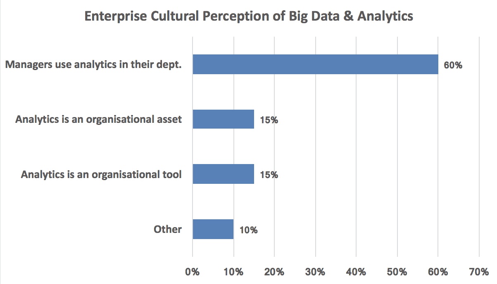

此外，整个组织的大数据合作伙伴关系战略似乎也没有构建到商业成功所需的程度。 调查受访者表示，合作伙伴关系(如分析计划的跨职能协作)定义松散：


虽然对某些问题的回答有偏差，其中一类问题占绝大多数，但对大数据和分析方面的组织挑战的反馈总体上有广泛一致的共识。 下表显示了调查中每个参与者对分析挑战的反馈：


所有这些都导致了企业中一个有趣但自相矛盾的分析困境。 尽管大数据和分析的优点已被广泛理解和接受，但对于合适的方法仍有一种模棱两可的感觉，如下图所示：


# 企业分析成功的路线图

根据我们的经验，与数据仓库等成熟术语相比，分析是一个相当新的术语，它需要谨慎的方法，以确保立竿见影的成功和由此带来的计划的持久性。

过早地试图通过大规模、高预算参与来完成初始分析项目的项目，如果项目结果不像预期的那样，可能会危及整个计划。

此外，在这类项目中，结果衡量标准没有明确定义。 换句话说，衡量结果的价值是模棱两可的。 有时候，它也不能量化。 之所以会出现这种情况，是因为分析计划的成功带来的好处不仅仅是直接的金钱或技术能力。 一个成功的分析项目通常有助于培养高管对该部门执行上述项目的能力的信心，这反过来可能导致更大的努力。

与大数据分析相关的**个常规挑战**如下：

*   几乎每家公司都在投资大数据、机器学习和人工智能
*   通常，公司有公司授权。
*   找到合适的用例可能很困难
*   即使在您*找到*它们之后，结果也可能是不确定的(这是否会引起共鸣，需要多长时间，等等)
*   即使在您*实现*目标之后，是否已经确定最佳目标也是难以捉摸的(例如，当使用 HDFS 仅存储数据时)

现在，让我们看看数据科学和分析计划的一些**一般准则**：

*   **与组织中的业务合作伙伴**召开会议并进行一对一审查，以审查他们的工作流程，并获得有关分析和/或数据挖掘将在哪些方面提供最大价值的反馈
*   **确定业务运营**中与公司*收入流重要且相关的特定方面；*一旦完成，使用案例将产生可衡量的影响
*   用例不必是*复杂的*；它们可以是简单的任务，如 ML 或数据挖掘
*   直观，易于理解，你可以向朋友和家人解释
*   理想情况下，用例需要努力才能在今天使用常规方法完成。 该解决方案不仅应使**范围的用户**受益，还应具有**高管可见性**
*   识别**低难度-高价值**(**短**)与**高难度-高价值**(**长**)用例
*   教育企业赞助商，分享想法，展示**热情**(就像一场漫长的求职面试)
*   为**低难度-高价值**打分**提前赢得**，创建**最小可行解决方案**，并在进一步增强开发的使用解决方案之前获得管理层的认可。(需要时间)

早期的胜利起到了**催化剂**的作用，a)培养高管信心，b)也更容易调整预算，从而更容易转向高难度-高价值的任务。

最后两点很重要，因为识别低难度-高价值的项目至关重要。 对于经验丰富的从业者来说，这可能是一项*基本的*任务，但对最终用户来说非常有价值。

一家大型企业组织的分析小组的一位高管曾经说过，今年最成功的项目是*更改电子邮件报告的时间*。 没有在上午发送报告，而是将时间改为下午晚些时候。 在时间改变后，对这份报告的参与似乎变得更加积极。 上午的日程安排往往非常繁忙，而下午的报告则为收件人提供了时间，让他们以更轻松的速度审阅报告。

一些*低**难度*但*p**完全 h**高价值*项目的示例可以是：

*   自动执行业务组频繁执行的手动任务；例如，使用开放源码工具和数据库的组合可以很容易地自动执行在 Excel 中创建的报告。
*   使用编程脚本将手动股票分析转换为自动化版本。 这可能涉及创建常规表、透视表和图表等任务，这些表在 Excel 中创建，但可以转换为自动化流程。
*   使用 R SHINY 为业务应用创建 Web 界面，并实施预测性分析功能。
*   将 IT 基础架构的某些部分迁移到云平台。 这似乎有悖常理，尤其是当组织不习惯在云环境中工作时。 然而，管理云部署的简单易行意味着总体拥有成本和运营开销的总体降低。

用例的最终选择将取决于各种因素，前面提到的因素是为了设定可能尝试的项目类型以及可能产生积极结果的工作流的大致想法。 在下一节中，我们将查看行业中用于数据科学的一些特定软件和硬件解决方案。

# 企业中的数据科学解决方案

正如前面所讨论的，一般来说，我们可以将数据科学大致分为两个主要部分：

*   企业数据仓库与数据挖掘
*   企业数据科学：机器学习、人工智能

在本节中，我们将分别介绍这些功能，并讨论行业中用于提供这些功能的软件和硬件解决方案。

# 企业数据仓库与数据挖掘

今天，行业中有几十个数据库作为 NoSQL 系统销售，能够运行复杂的分析查询。 它们大多具有典型 NoSQL 系统的一个或多个特性，如柱状、内存中、键值、面向文档、基于图形等。 下一节将重点介绍当今使用的一些关键企业 NoSQL 系统。

# 传统数据仓库系统

传统的数据仓库可能用词不当，因为大多数*传统的*系统也包含了 NoSQL 的核心概念。 然而，在本例中，该术语意在表示早在 NoSQL 系统出现之前就已存在的数据库，并且还添加了使其符合企业数据科学要求的功能。

# Oracle Exadata、Exalytics 和 TimesTen

Oracle Exadata、Exalytics 和 Exalogic 属于 Oracle 的 Exa 系列产品。 **Exadata**是 Oracle 的高性能*工程数据库平台*，专为资源密集型查询而设计。 一般来说，它有望显著提高非 Exadata 系统的查询性能，并支持高级软件功能(如内存计算、基于独立行和列的筛选)和其他硬件功能(如支持最新的存储设备，包括 NVMe、内存容错等)。

**Exalytics**是一个补充解决方案，主要用于**BI**工作负载。 Exa 系列产品被认为是*工程系统*，而不是*设备*。 虽然后者可以指示预置和预加载的软件-硬件堆栈，但是工程系统期望在选择根据客户需要选择性安装的已安装组件方面支持更高级别的灵活性。 企业安装中常见的 Exalytics 的关键组件之一是**OBIEE**(**Oracle Business Intelligence Enterprise Edition**)。 这是一个完整的 BI 套件，并受益于名为**Times Ten**的底层内存数据库，该数据库也是 Exalytics 生态系统的一部分。

**业务使用案例**：Oracle Exadata 用于对速度和性能至关重要的 OLTP 事务性工作负载。

另一方面，Exalytics 用于分析工作负荷。 集成的 OBIEE 界面与 TimesTen 一起提供了一个强耦合的分析环境。 Oracle Exadata 也可以作为基于云的服务提供。

# HP Vertica

HP 的 Vertica 是一个面向列的、大规模并行处理的数据库系统，具有关键的软件功能，如支持数据库内机器学习，以及与 Apache Kafka 和 Apache Spark 等开源系统的本地集成，通常部署在多节点硬件架构上。 Vertica 受流行的云环境支持，如**Amazon Web Services**(**AWS**)、Google 和 Azure。 Vertica 支持标准的交互式 SQL 界面，因此很容易与大多数当代的 BI 工具兼容。

有趣的是，HP Vertica 是为数不多的还可以作为社区版使用的企业数据库之一。 这意味着有兴趣试用 Vertica 的用户(在其许可范围内)，或者只是想了解更多关于该平台的信息的用户可以使用 Community Edition，它可以从 HP Vertica 的网站上免费下载。

**业务用例**：与本节中指出的其他数据库类似，Vertica 合并了几个值得注意的特性，如数据库内处理、并行处理能力等。 Vertica 支持广泛的分析工作负载，并附带相关的商业许可费(所有其他商业数据库产品也是如此)。 社区版的提供，加上惠普在大多数情况下愿意参与大型部署的概念验证，为企业提供了在做出决策之前尝试和测试特定于公司的使用案例的平台的充分机会。

# Teradata

Teradata 被广泛认为是企业数据库技术的领导者。 它的数据库也是同名的，与其他竞争对手的产品有几个相同的功能。 Teradata 的一些关键特性包括与许多开源解决方案(如 R、RStudio、Jupyter 和 SAS)的本机集成；时间序列支持；用于机器学习和人工智能的内置分析函数；支持多种数据类型(如 CSV、JSON 和文本)以及空间/时间数据。

分析平台也称为 Aster Analytics，可从[https://aster-community.teradata.com/community/download](https://aster-community.teradata.com/community/download)获得社区版。

虽然在传统上，Teradata 是作为设备解决方案提供的，因为在数据库和硬件中都可以作为单个集成单元使用，但如今，在云中使用 Teradata Everywhere 也是可能的。 该软件可以部署在混合架构中(既可以部署在内部部署，也可以部署在云中)，也可以部署在 AWS 和 Microsoft Azure 等公共云环境中。 提供捆绑服务、基于订阅的服务和即服务选项。 Teradata Intelicout 是 Teradata 提供的基于订阅的云产品，其中包括托管环境中来自 Teradata 生态系统的多个产品。

**业务用例**：几十年来，Teradata 一直是流行的企业数据库，在大型组织中具有很强的可信度。 近年来，Teradata 与开源系统(如 R、Jupyter 和其他产品)的主动集成使其更具吸引力，可以说有助于提高其知名度。 Teradata 设备可能相对昂贵，而且与其他商业选项一样，需要适当的 POC 来评估特定于组织的用例的适用性。

# IBM 数据仓库系统(前身为 Netezza 设备)

IBM Netezza 过去作为单独的数据仓库设备出售，在某些方面类似于 Teradata 的营销方式。 最近，Netezza 被归入更广泛的 IBM 数据仓库系统类别，更符合当代管理海量数据的大数据要求。 IBM Pure Systems、PureSystems for Analytics 和 IBM Integrated Analytics System 是一些较新的解决方案，它们在集成生态系统中提供与 Netezza 基本相同的功能。

集成分析环境包括用于机器学习的嵌入式 Apache Spark、用于数据科学工作负载的 Jupyter 笔记本、连接到其他 NoSQL 和 Hadoop 实施的通用 SQL 引擎，以及支持在高性能体系结构上部署(可选择托管的基于云的环境

**业务用例**：Netezza 一直受到那些传统上高度依赖 IBM 相关技术的公司的青睐，比如 DB2、AIX 和 IBM 的其他产品。 新的集成产品环境提供了继续使用的机会，同时将数据科学功能添加到组织中现有的 IBM 投资中。

# PostgreSQL

PostgreSQL 在本节中是一个有趣的选择，因为从技术上讲，PostgreSQL 没有单独的 NoSQL 版本，而是 PostgreSQL 在最近的版本中添加了各种特性，这些特性将 NoSQL 功能添加到现有的 Postgres 实现中。

PostgreSQL 的支持者正确地指出，PostgreSQL 是一种更古老的技术，而且经过进一步的测试，在 20 世纪 90 年代中期首次发布。 **Postgres**现在支持分层文档数据存储、JSON、键值存储(称为**HStore**)和分片，并且包括用于各种编程语言和不同数据源的接口。 换句话说，PostgreSQL 已被扩展为支持类似 NoSQL 的功能，同时保持其作为传统 RDBMS 的现有功能。

PostgreSQL 是一个功能齐全的开源产品。

**业务用例**：虽然本节中的大多数技术都是商业许可的(以获得其所有功能的访问权限)，但 PostgreSQL 是开源的，是一种非常经济高效的方式，可以在不进行大量初始投资的情况下试用成熟的数据库。 它还可以作为测试平台试用 NoSQL 特性，比如在做出最终决策之前处理 JSON 数据。 无论哪种情况，PostgreSQL 都是一个强大的平台，可以支持企业需求。 还有一些 PostgreSQL 的商业衍生品--建立在 PostgreSQL 之上的数据库，比如 Greenplum，它也是一个开源产品。

# Greenplum

**Greenplum Database**®构建于 PostgreSQL 之上，并添加了许多重要的分析功能。 其中包括创新的基于成本的查询优化器、与 Apache Madlib 的集成，以及行或列存储的选择。 它具有用于流行编程语言(如 R、Python 和 Java)的本机接口，并支持大规模并行体系结构。 Greenplum 可从[http://greenplum.org/download/](http://greenplum.org/download/)免费下载。

**业务使用案例**：**Pivotal**提供了完全支持的 Greenplum 商业分发。 Greenplum 非常成功，尤其是因为其在大型企业工作负载方面的经验证的性能。 商业支持的可用性对需要专用支持和服务级别协议(**SLA**)以保证关键业务运营的组织是有益的。

# SAP 汉字

SAP HANA 是 SAP 的分栏式内存数据库，支持 NoSQL 特性。 HANA 支持多核并行操作、多租户，完全兼容**ACID**，可以处理各种分析工作负载，包括预测建模、流分析、时间序列分析以及基于空间、文本和图形的分析。 您还可以在 SAP HANA 系统中管理基于 JSON 的非结构化数据。

HANA 还与其他 SAP 产品(如 SAP Fiori)进行本机协作，其中包括人力资源、财务、会计和其他部门中使用的各种 SAP UX 应用。

**业务用例**：几十年来，SAP 一直是企业组织的支柱，并用于广泛的应用，最显著的可能是用于制造和财务/会计需求。 SAP HANA 为现有的 SAP 安装添加了一个强大的高性能数据库。 通常，由于企业级部署涉及的成本较高，SAP 主要用于业务关键型需求。 对于依赖 SAP 的大型组织来说，HANA 的好处可能大于成本。 此外，虽然 HANA 可以提供广泛的 NoSQL 功能，但公司可能会发现，根据预算、性能需求和其他因素，他们最终会得到两个或更多不同的解决方案。

# 企业级和开源 NoSQL 数据库

上一节概述了一些著名的传统数据库/RDBMS 解决方案，它们添加了企业级 NoSQL 功能。 接下来的几节将介绍一些特定于数据库解决方案的利基业务用例。

# KDB+

Kx Systems 的**kdb+**是速度最快、效率最高、重量最轻的数据库之一，已在高频交易和其他类似环境中使用了近 20 年。 它在金融之外的受欢迎程度不那么明显，但尽管如此，它可以说是数据库世界中设计和优化最高效的系统之一。

KDB+从一开始就支持内存中的列存储，从技术上讲，它是**Q**编程语言的扩展。 Kdb+中的表本质上是 Q 语言中的数据结构。 然而，与其他编程语言中的类似概念不同，kdb+表是企业级的，可以轻松地处理 TB 和 PB 级的数据。

由于其固有的编程语言，用 Q 编写的代码可以针对存储在 kdb+中的数据运行，因此自定义*函数*可以非常轻松地在数据库中运行。

此外，kdb+二进制文件的大小约为 500 到 600KB，小到足以放入大多数现代 CPU 的 L3 缓存中。

KDB+还包括内置的 MapReduce 功能，以便跨多核 CPU 自动并行执行查询。

**业务用例**：KDB+是企业环境中存在的最强大的数据库之一。 它传统上只适用于基于核心的永久许可，但最近几天，该公司增加了对基于订阅和按需许可的支持。 它占用空间小，使用简单，非常适合企业需求。 然而，这是有一个警告的。 Q 语言非常简洁，对新用户来说可能显得晦涩难懂。 可以说，这门语言的学习曲线比其他语言略陡，需要练习和亲身体验。 也就是说，有大量的在线资源可以学习和利用数据库的功能。 用于 R、Python、C、Java 和其他编程语言的本机接口，以及用于机器学习的库，使其特别适合于涉及大型数据集的数据科学工作负载。

While kdb+ is not available as an open source product, it is generally available for personal use at no charge from: [https://kx.com/download/](https://kx.com/download/).

# MongoDB

**MongoDB**是面向文档的数据库领域的市场领导者，用于以 JSON 格式存储数据。 它支持按需查询、索引和聚合，并为 Python、Java 和 JavaScript 等语言提供了丰富的接口。 其他功能，如水平缩放和分片、高可用性、名为 Compass 的集成数据探索工具等，都增加了数据库的现有功能。

**业务用例**：考虑使用数据库存储非结构化或半结构化数据的公司可能会发现 MongoDB 的特性非常适合查询这样的数据集。 数据库一开始就不需要定义固定的模式，使其能够灵活和可扩展地支持添加到现有数据的新属性。 MongoDB 可以从[https://www.mongodb.com/download-center](https://www.mongodb.com/download-center)免费下载开源，也可以通过 MongoDB Atlas 实现为托管和托管的云解决方案。 支持内存和加密存储等功能的企业版也可订阅。

# 卡珊德拉

**Cassandra**是最成功、使用最广泛的企业级 NoSQL 系统之一。 它结合了列和键值概念，并将数据存储在基于行的分区中。 每个分区又是一个主键。 行可以有多列，每行的列数可能不同。

Cassandra 数据库可以通过 CQL 进行查询，CQL 使用类似 SQL 的语法，使数据查询、保存和其他常见任务的过程变得容易得多。 Cassandra 还使用去中心化架构；它没有任何单点故障，并支持多节点架构。

除了 Cassandra DBMS 的标准水平可伸缩性之外，该平台还支持弹性可伸缩性，并且能够根据需要透明地分配和取消分配节点。 总体而言，Cassandra 是企业级 NoSQL 系统最强大的选项之一，在全球多家大公司的生产环境中使用。

**业务用例**：Cassandra 是一个完全开源的解决方案，实现了 NoSQL 系统的多个关键特性。 它在全球生产工作负载中使用，并已成熟为稳定的企业级开源平台。 换句话说，Cassandra 非常适合管理大型组织需求，不会产生任何额外的许可成本。 Cassandra 的商业、许可和付费版本也可以从 DataStAX：https://www.datastax.com/products/datastax-enterprise 获得。 它称为**DSE**(**DataSTax****Enterprise**)。 DSE 整合了各种企业功能，如安全性和搜索，还可以使用 AWS 等流行的云提供商通过 DataSTax 托管的云环境进行访问。

# ♪Neo4j♪

**Neo4j**是一个基于图形的数据库，用于对不同实体之间的关系进行建模。 该数据库使用图论中熟悉的概念来创建互连主题的基于树的表示(带有节点和关系)。 它最常与推荐引擎结合使用。 从概念上讲，Neo4j 图形数据库可以将个体表示为节点，这些节点通过比方说它们的分离程度相互连接。 假设这将允许终端用户追踪任意节点或个人与另一个节点之间的分离程度。

在 Neo4j 平台中可以使用各种基于图形的表示，例如加权、有向、单向和标记。

**业务使用案例**：需要深入的客户级或用户级分析(如社交网络或推荐系统(如 Netflix))的公司将从部署基于图形的数据库(如 Neo4j)中获得巨大收益。 如今，该平台支持人工智能和机器学习、物联网、实时推荐等许多在企业中使用的有用特性。

Although Neo4j is available as open source software from [https://neo4j.com/download/?ref=hro](https://neo4j.com/download/?ref=hro), there is also a commercial licensed version known as Neo4j Enterprise Edition.

# 云数据库

顾名思义，云数据库指的是亚马逊、谷歌和微软等云供应商提供的数据仓库或数据库系统。

# Amazon RedShift、RedShift Spectrum 和雅典娜数据库

最常用的基于云的数据仓库平台之一是**Amazon RedShift**。 它是基于云的生态系统中最突出的数据管理平台。 它基于 PostgreSQL，主要用于分析工作负载。 RedShift 具有高度的可扩展性，与具有类似特性的内部数据库相比，所需的工作量大大减少。 它可以直接从 AWS 控制台部署(在注册 AWS 帐户之后)。 可以通过 AWS 控制台无缝添加或删除节点，以分别增加和/或减少容量。

更新版本的 RedShift 称为**RedShift Spectrum**，它允许查询已存储在 Amazon S3(AWS 中的标准存储层)中的数据。 这意味着用户可以直接查询存储在磁盘上的数据，而不必将其加载到特定于 RedShift 的实例中。 总体而言，RedShift 相对快速、便宜，更重要的是易于使用和部署。 RedShift Spectrum 采用按查询付费的模式--用户只需为所扫描的每 TB 数据象征性收费的查询付费。

**Amazon Athena**在许多方面与 Amazon RedShift Spectrum 相似，因为它还用于查询存储在 S3 上的数据。 不过，虽然如果不先购买 Amazon RedShift，就无法使用 Amazon RedShift Spectrum 的功能，但用户可以按需使用 Amazon Athena，不需要预留任何额外的硬件。 另一方面，由于亚马逊 RedShift Spectrum 与 RedShift 生态系统紧密结合，用户可以在这两个解决方案中的任何一个上分配工作负载。 需要更快处理的数据可以保留在 Amazon RedShift 上，而不太常用/不太关键的数据可以存储在 S3 上，并使用 RedShift Spectrum 进行查询：

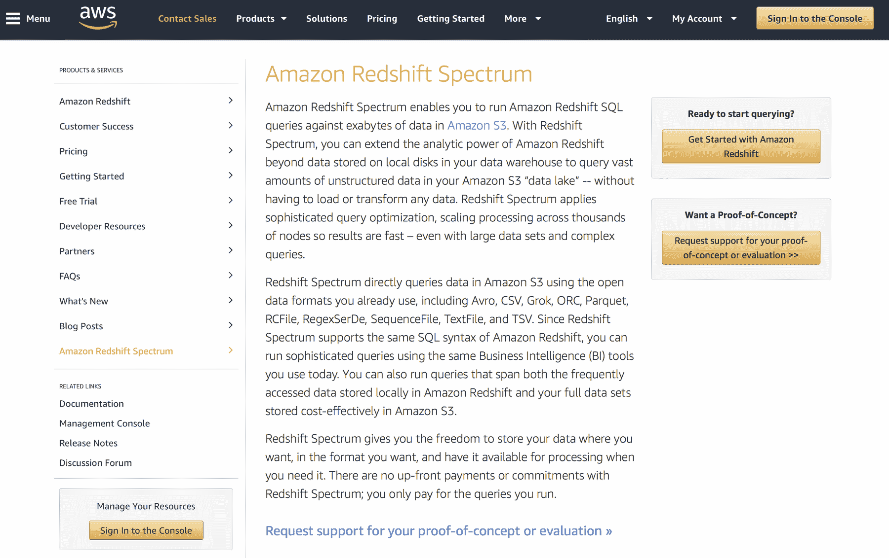

You can learn more about Amazon Redshift Spectrum at [https://aws.amazon.com/redshift/spectrum/](https://aws.amazon.com/redshift/spectrum/).

# Google BigQuery 和其他云服务

**Google BigQuery**类似于 Amazon RedShift，因为它也是一个完全基于云的大规模数据仓库系统。 然而，虽然 RedShift 需要单独配置(AWS 集群和 RedShift 资源)，但 Google BigQuery 是*即插即用*版的等价物。 要使用 BigQuery，用户只需在[https://bigquery.cloud.google.com](https://bigquery.cloud.google.com)创建一个帐户，并在加载数据集后开始运行查询。

与 RedShift 相比，BigQuery 的收费方式也有很大不同。 用户每月可免费查询累计 1TB 的数据。 BigQuery 使用按使用付费的模式，通过这种模式，查询可以分摊成本。 本质上，BigQuery 抽象了设置数据库的复杂性，并允许最终用户将时间专门用于编写查询和/或执行分析，而无需设置基础设施。 因此，扩展查询、分配资源和其他可能需要手动干预(例如由 DBA 进行)的任务就变得多余了。

Google 在其云平台上还有一套其他 NoSQL 产品，包括基于 NoSQL 文档的数据库 Google Cloud Datastore、Google Bigtable、Google Spanner 等。 下图显示了 Google BigQuery 数据库：

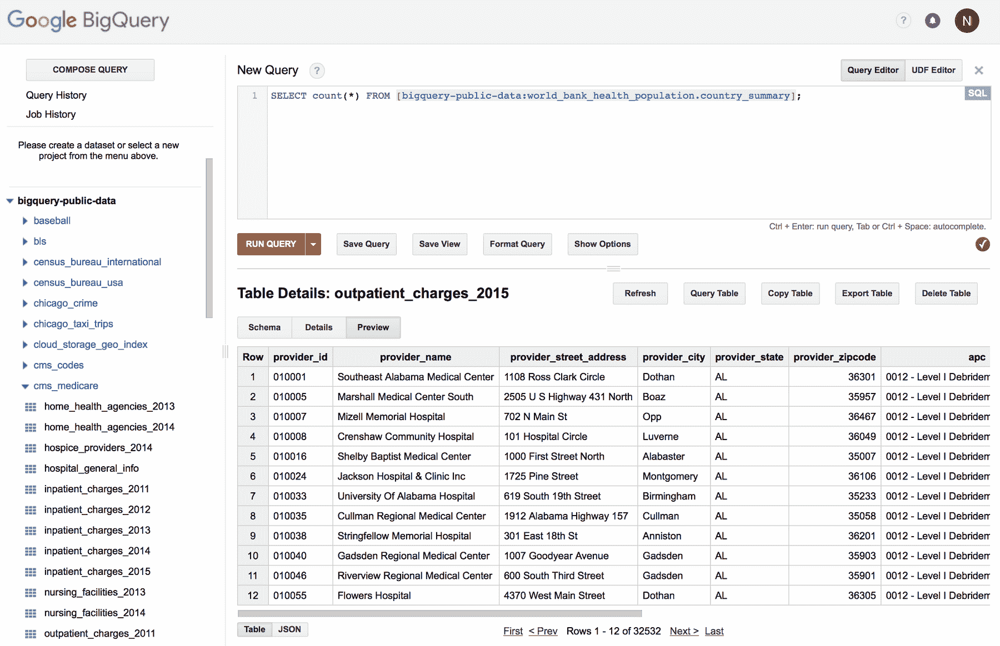

# Azure 宇宙 DB

**Azure CosmosDB**是微软的 NoSQL 云数据库之一。 Azure 中的其他 NoSQL 系统包括 Table Storage、Azure Redis Cache 等。 CosmosDB 被认为是一个*多模型*数据库；它可以支持键-值对、基于文档的查询、基于图形的模型，也可以支持关系数据库查询。

传统的 Microsoft 数据库(如 SQL Server)也可用，并在 Azure 平台上作为完全托管和托管的解决方案受到支持。 你可以在[https://azure.microsoft.com/en-in/services/cosmos-db/](https://azure.microsoft.com/en-in/services/cosmos-db/)了解更多关于 Azure 平台的信息。 下图显示了 Microsoft Azure 平台的解决方案窗口：

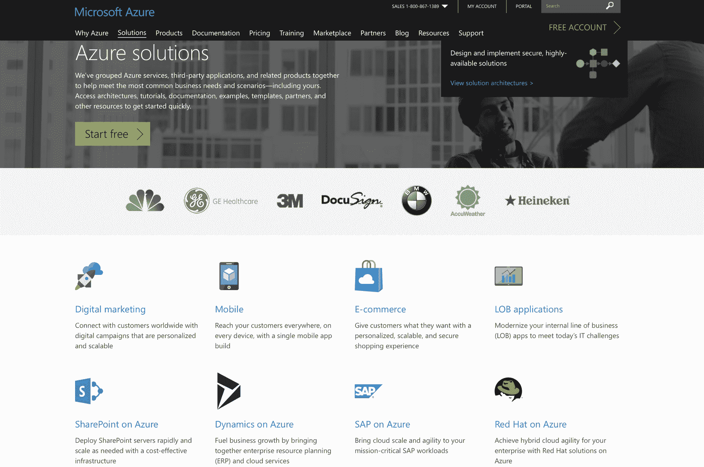

# GPU 数据库

**GPU 数据库**是随着用于数据科学相关任务(如机器学习)的图形处理单元卡的增长而出现的较新发展。 当查询可以并行化时，GPU 工作得最好。 这是因为 GPU 包含数千个内核。 通过委托每个内核处理一小部分数据，GPU 通常能够以远远超过基于 CPU 的查询性能的惊人速度进行计算。

# 布莱特利特

**Brytlyt**是 GPU 数据库领域的新近进入者。 它还得到了名为**Spotlyt**的可视化产品的补充。 早期测试显示，布莱特利特超过了几个具有挑战性的基准。 然而，它在其他用例中的推广效果如何还有待观察。

希望尝试的用户可以在 Amazon AWS Marketplace([https://aws.amazon.com/marketplace/pp/B074JZNSWZ?qid=1513342415797&sr=0-1&REF_=SRH_RES_PRODUCT_TITLE](https://aws.amazon.com/marketplace/pp/B074JZNSWZ?qid=1513342415797&sr=0-1&ref_=srh_res_product_title))中购买 Brytlyt。

# MPD

**MAPD**是商业 GPU 数据库平台的早期开发者之一。 与布莱特利特类似，它也展示了令人印象深刻的初步结果。 然而，由于基于 GPU 的数据库仍处于早期阶段，流行的使用和采用最终将决定它们是否会在企业中变得司空见惯。

基于 GPU 的数据库的主要挑战之一是需要正确配置基于 GPU 的系统。 这可能需要专门的技能，因为使用 GPU 卡进行计算与使用 GPU 卡执行常见任务(如渲染图像)截然不同。 因此，希望在采用正式版本之前试用基于 GPU 的数据库的用户会发现，利用 AWS(AMI Image)中的预配置映像会更容易，这只需要最少的系统配置。

# 其他常用数据库

还有各种其他类型的数据库，例如用于分析流数据的数据库(Amazon Kinesis)，以及使用来自百度的 FPGA 的专用加速卡处理数据的数据库。

# 企业数据科学--机器学习和人工智能

**数据科学解决方案**在过去 4-5 年中迅速成熟，类似于 NoSQL、Hadoop 和其他数据挖掘解决方案等其他数据科学领域的趋势。 尽管许多以前的数据库系统还合并了*数据科学*的关键功能，如机器学习和其他，但本节重点介绍了一些主要用于机器学习和/或人工智能(而不是数据管理)的高级别解决方案。

事实上，*大数据*产品和*数据科学*产品之间的区别已经变得模糊，因为最初用于大数据处理的产品已经包含了数据科学的关键功能，反之亦然。

# R 编程语言

**R**，正如我们在前几章中所看到的，它最初是为统计编程而设计的环境。 它来自新西兰大学的一个项目，在那里，*Ross Ihanka*和*Robert Gentleman*开发了 R 作为由 Bell Labs 的 John Chambers 开发的 S 编程语言的变体。 虽然 R 最初用于*统计编程*，但在过去的 7 到 8 年中，它已经发展成为一种成熟的、多方面的语言，增强了对各种相关学科(如机器学习、高性能计算、可视化、计量经济学、时间序列分析等)的支持。 其中一些领域也在[https://cran.r-project.org/web/views/](https://cran.r-project.org/web/views/)中进行了描述，并附有相关信息。

带有企业支持的 R 的商业版本可从 Revsion Analytics 获得。 2015 年，它更名为**Microsoft R Open**(开源版本)和**Microsoft R Server**(商业版本)。

尽管以微软品牌销售，但请注意，Microsoft R 也可用于 Linux 和 Mac OS。

R 中流行的机器学习包包括`e1071`、`randomForest`、`gbm`、`kernlab`、`arules`等。 这些列在[https://cran.r-project.org/web/views/MachineLearning.html](https://cran.r-project.org/web/views/MachineLearning.html)上。 另一个流行的包称为脱字符，它充当各种算法包的包装器，并提供了一个有用的统一接口来运行算法，而不必逐个遵循包的细微差别。

R 还支持通过`multicore`、`doMC`等软件包进行多核编程。 这些信息列在[https://cran.r-project.org/web/views/HighPerformanceComputing.html](https://cran.r-project.org/web/views/HighPerformanceComputing.html)上。

# 蟒蛇，蚺蛇 / 巨蛇

Python 中的`scikit-learn`包可以说是所有平台中最全面的机器学习包，它包含了大量的机器学习算法。 它也被认为比 R 更快，是各种企业组织的首选工具。 以下屏幕截图显示了我们可以从中下载`scikit-learn`软件包的网页：


商业支持的 Python 企业版预先配置了有用的机器学习和数据挖掘包`Anaconda`，可从 Continuum Analytics 获得。 Anaconda 的云版本名为**Anaconda Cloud**，允许新用户开始利用 Anaconda Python 的特性，而无需单独下载和安装它。

# OpenCV、Caffe 和其他

图像识别是机器学习比较成功的领域之一。 虽然大多数机器学习任务需要相对较长的时间才能测量和量化其真正的好处，但图像识别是一个很容易理解的熟悉的学科领域。 本质上，它涉及识别对象并对它们进行正确分类。 它有几个应用，从识别车牌号到人脸识别，并可用于移动设备和机器人。

OpenCV 为各种图像识别任务提供了标准接口，还可以利用硬件加速功能来优化性能。

其他用于图像处理的著名机器学习软件包括 Caffe、cuDNN、TensorFlow 等。 请注意，这些包并不局限于简单的图像识别，还可以用于其他深度学习用例。

# 斯巴克 （人名）

Spark 中的 MLlib 库提供了可在 Spark 平台中使用的各种机器学习算法的正式实现。 对于那些具有 Python 编程知识的人来说，pySpark 的可用性使得使用该功能的过程变得更容易。 如果该组织有一个现有的 Spark 平台，那么探索 MLlib 中的机器学习功能将是值得的。

下面的屏幕截图提供了 MLlib 的简要概述：

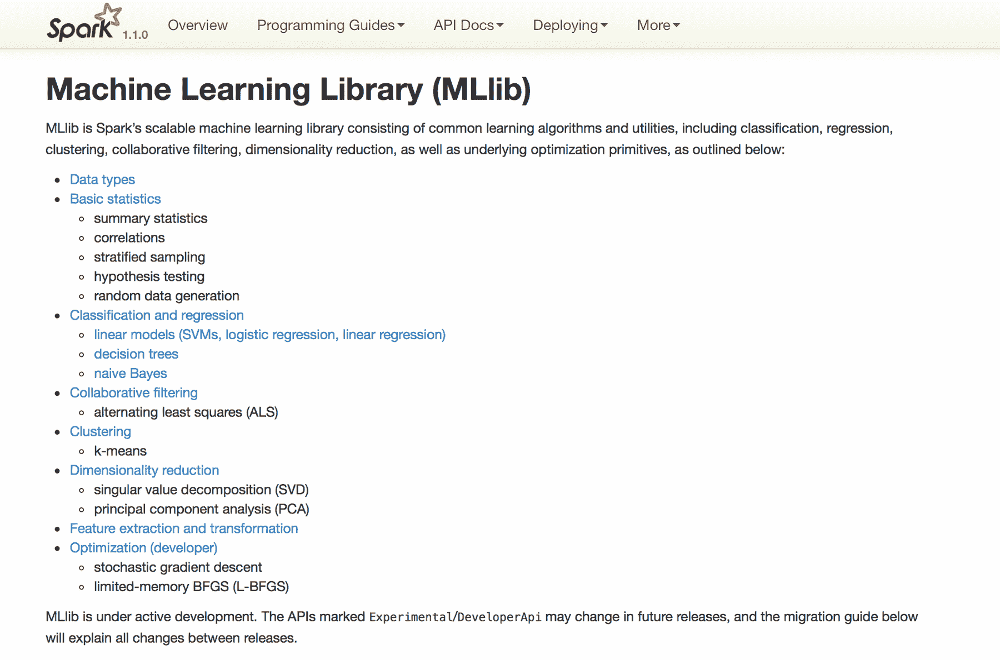

# 深度学习

具有多个隐层(通常多于两个)和/或节点的神经网络通常被归类为**深度学习**。 机器学习的几个当代进步，例如自动驾驶汽车，是深度学习用于实际日常任务的直接结果。

有各种深度学习框架/包，其中一些值得注意的包括：

*   TensorFlow
*   ==同步，由长者更正==
*   西亚诺
*   手电筒 / 火炬 / 品质 / 启发之物
*   来自百度的 PaddlePaddle

# H2O 与无人驾驶人工智能

作为 Kaggle 竞赛的流行平台，**H2O**为 R、Python、Spark 等提供了一个可大规模扩展的实时机器学习界面。 可从[https://www.h2o.ai/h2o/](https://www.h2o.ai/h2o/)免费下载。

**无人驾驶人工智能**是 H2O 系列产品的最新成员。 它的目的是通过实现一个自动界面，试图通过以自动方式构建和评估多个模型来创建模型和优化准确性，从而使从业者更容易进行机器学习。 以下截图显示了 H2O 平台的主页：

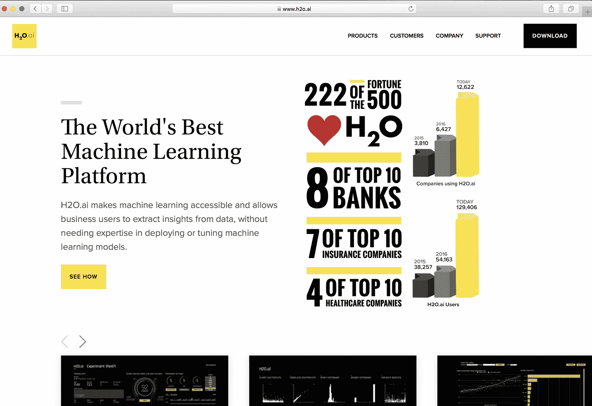

# 数据机器人

从概念上讲，Dataro**b**ot 类似于 H2O 的无人驾驶人工智能，因为它还试图通过根据给定数据集创建和评估多个模型来以自动方式构建机器学习模型。

然而，与 H2O 不同的是，尽管它可以非常强大，但 Datarobot 需要支付许可费，而且对于规模较小的公司来说可能会很昂贵。

# 命令行工具

有多个机器学习工具在 Unix 命令行上执行。 其中一些工具有 R、Python 和其他语言的现有接口，允许用户利用它们的功能，而不必从 Unix 终端使用它们。 一些流行的命令行实用程序包括：

*   LIBSVM
*   LIBLINEAR
*   Vowpal Wabbit
*   MLPACK
*   LibFM

# ApacheMADlib

一个鲜为人知但功能丰富的平台是**Apache Madlib**，它的目标是在数据库中执行分析和运行算法*，就像在中一样，它可以在本地执行功能，而不需要外部编程接口。 它支持并行处理，可以与多个数据源(如 Greenplum、PostgreSQL 等)无缝协作。*

例如，只需从[http://madlib.apache.org/docs/latest/group__grp__assoc__rules.html：](http://madlib.apache.org/docs/latest/group__grp__assoc__rules.html)运行一个 sql 命令即可创建先验模型，如下所示

```py
SELECT * FROM madlib.assoc_rules(.25,            -- Support 
                                  .5,             -- Confidence 
                                  'trans_id',     -- id col 
                                  'product',      -- Product col 
                                  'test_data',    -- Input data 
NULL,           -- Output schema 
                                  TRUE            -- Verbose output 
); 
```

有关 Apache Madlib 的更多信息(网站截图如下所示)，请访问[http://madlib.apache.org.。](http://madlib.apache.org)


# 机器学习即服务

与其他云资源集成的基于云的机器学习平台也激增。 一些著名的平台包括 AzureML、BigML、IBM Watson 等。

下面的截图来自 IBM Watson，这是最知名的机器学习和人工智能平台之一。 该平台在 2011 年赢得 Jeopardy 锦标赛后声名鹊起[来源：[https://www.techrepublic.com/article/ibm-watson-the-inside-story-of-how-the-jeopardy-winning-supercomputer-was-born-and-what-it-wants-to-do-next/](https://www.techrepublic.com/article/ibm-watson-the-inside-story-of-how-the-jeopardy-winning-supercomputer-was-born-and-what-it-wants-to-do-next/)]。 当时，机器学习的趋势还处于萌芽状态，沃森是第一批令世界震惊的人工智能技术之一。 它证明了人工智能可以成为强大而有能力的资产。 现在，用户只需在网站[https://www.ibm.com/watson/](https://www.ibm.com/watson/)上注册一个帐户，就可以利用 IBM Watson 的一些相同的计算能力。


# 企业基础架构解决方案

基础设施的正确选择在决定组织的数据科学平台的效率方面也起着关键作用。 太少，算法执行时间太长；太多，可能会有大量资源未得到利用。 因此，后者比拥有太少更可取，后者会阻碍进展和任何机器学习研究人员有效执行任务的能力。

# 云计算

在过去的 5-7 年中，组织逐渐将其资源转移到基于云的平台，如 Amazon Web Services、Microsoft Azure 和 Google Compute Engine。 今天，所有这些都包含极其复杂和广泛的体系结构，以支持企业级别的机器学习、数据挖掘和一般的*数据科学*，以满足各种规模组织的需求。

此外，*镜像*的概念，例如 Amazon 的 AWS 中的 AMI 镜像，允许用户使用预先安装的组件启动操作系统的预构建快照。 因此，用户在试用新平台之前几乎可以完全避免安装开销。

一般来说，AWS 还广泛支持 Hadoop 和 MAP-Reduce 操作。 AWS 中的**EMR**或**Elastic Map Reduce**和 Azure 中的 HDInsight 是两个知名且非常流行的大数据框架。

本章末尾的教程将演示如何设置 AWS 帐户并开始使用示例 AMI 映像。

# 虚拟化

**虚拟化**-在较大的主机中创建隔离、独立的环境的过程使组织能够整合服务器并大幅减少数据中心占用空间。 比方说，如果一个组织为其网站利用六台服务器，其中两台经常被使用，而其他的大多数时间负载相对较低，则可能将所有服务器整合到最多一到两台服务器中。 在这方面，Dell EMC 的技术(如 VxBLOCK)是物理数据中心中使用的知名企业虚拟化硬件。 这还允许公司创建自己的私有云基础设施。 然而，它可能相当昂贵，需要对成本效益比进行适当的评估。

用于创建公共云和私有云的开源软件是 OpenStack。 它是一个企业级生态系统，包含多个产品，可在 OpenStack 平台内无缝工作。 有关 OpenStack 的更多详细信息，请访问[https://www.openstack.org：](https://www.openstack.org)

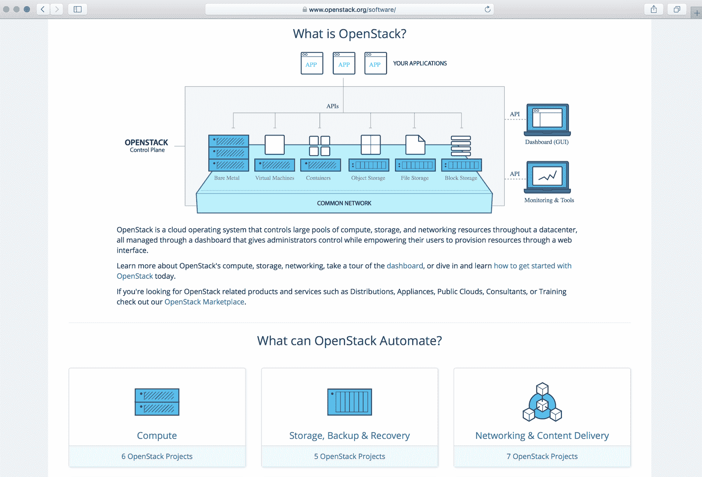

用户可能熟悉 Oracle VirtualBox，它本质上也是一种允许用户创建隔离环境的虚拟化软件。 这允许用户在 Windows 中运行 Linux，反之亦然。

专用软件或硬件(称为虚拟机管理程序)用于管理和管理虚拟机。

# 集装箱-码头、库伯内斯和梅索斯

容器与虚拟化一样，会创建隔离的来宾系统，但是，虽然虚拟机创建了一个完全独立的环境，但容器与主机系统共享相同的内核，因此被认为离硬件更近。 由于多个抽象层(主机和来宾操作系统之间的功能转换)，虚拟化和容器都会导致性能损失。 但是，容器通常具有更高级别的性能，因为它们依赖并直接使用来宾操作系统的功能，而不是创建单独的操作系统生态系统。

流行的容器包括 Docker、CoreOS 和许多其他容器。 如今，容器主要用于大规模管理与 Web 相关的服务。 与 VM 相比，Containers 可以更容易地按需启动和关闭，而且流行的云提供商已经添加了对 Containers 的专用支持，使得只需几行代码就可以轻松启动数千个 Containers 来服务于 Web 请求。 诸如 Kubernetes 这样的编排软件提供了企业级的容器管理功能。 此外，MESOS 等平台不仅提供了对容器管理的支持，还为应用感知调度和其他服务添加了管理其他遗留硬件的能力：

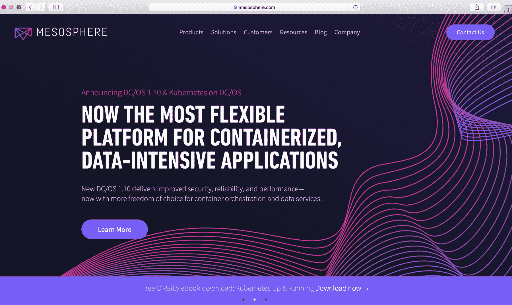

# 内部部署硬件

最后，传统数据中心等内部硬件在现代计算中仍占有一席之地。 有了物理数据中心，用户无需为基于云的服务支付经常性费用。 对于管理费用不大的中小型组织，或不需要高性能/专业计算能力的大型组织，内部部署系统完全能够提供经济高效的永久性解决方案。

ScaleMP 等公司提供用于高性能计算的专用硬件。 此类硬件的消费者通常有基于云的供应商无法提供的特定要求：


以下汇总了内部部署系统和基于云的系统之间的一些区别：

| **内部部署** | **云** |
| 硬件归你所有 | 硬件是你租的 |
| 需要全面维护 | 维护由云托管提供商管理 |
| 需要 IT 资源来管理计算硬件资源 | 管理计算硬件资源的开销少得多，因为它们可以按需添加到云中 |
| 为中小型环境提供成本效益高、数据中心运营成本低或无成本的环境 | 为希望简化数据中心运营成本的大型组织提供经济高效的服务 |
| 除管理硬件所需的资源外，使用硬件无需任何经常性成本 | 使用硬件的经常性成本；使用订阅模式定价 |
| 主要是静态架构；对 Hadoop 的新需求将需要购买完整的新产品 | 极其灵活；公司可以按需在多个操作系统中调配数千台服务器 |
| 容易被组织、法律和相关部门接受 | 由于将管理委托给第三方/云托管提供商，因此面临障碍，尤其是来自法律部门的障碍 |

# 企业大数据

在大型组织中实施大数据的总体战略取决于组织的特殊需求。 今天，在大数据、数据科学、机器学习和最近的人工智能提供商之间，有数百个选择可供选择。

因此，在大型组织中实施大数据时有两个主要考虑事项：

*   **技术**：选择合适的软件和硬件堆栈
*   **操作性**：管理组织数据，创建正式的数据治理策略，并创建适当的数据管理框架

除此之外，招聘合适的人才，并可能为公司的大数据/数据科学实施创建定义明确的角色，这些都是额外但同样重要的任务。

创建此类战略的一些关键问题包括：

*   软件/硬件许可是基于大小还是基于核心？ 如果基于数据大小，并且我的数据大小增加，我的 3 年/5 年成本将是多少？
*   该解决方案是否有企业支持？
*   我们需要雇佣外部资源吗？
*   新功能将回答哪些业务问题？
*   我们有没有做过短期和长期的成本效益分析？
*   新解决方案可以满足组织目前哪些未满足的需求？
*   该解决方案的可扩展性是否足以满足我未来的潜在需求？

In terms of technical needs, although there are many solutions in the marketplace, it is extremely essential in practice to conduct testing or proof of concept using real-world/actual data that the solution will be used for. It is not uncommon to find solutions that claim grand capabilities but do not deliver expectations. **In other words, it is crucial to gather thorough empirical results and not purchase solely on the basis of a marketing pitch.**

最后，随着大数据/数据科学的不断发展，需要适当评估解决方案的长期可扩展性和适应性。 应该考虑基于云的选择，因为它提供了一种高效的媒介，能够以简单且负担得起的方式访问和使用新的新兴解决方案。

# 教程-在云中使用 RStudio

以下教程将演示如何在**AWS**(Amazon Web Services)上创建帐户，加载适用于 RStudio 的 AMI Image，然后使用 RStudio，所有这些都是在*免费的*。 有云平台使用经验的读者可能会发现这些说明非常基础。 对于其他用户，本教程应提供有关使用 AWS 的有用初始指导。

请先阅读下面的**警告**消息，然后再继续。

***警告**：请注意，AWS 需要信用卡才能注册。 用户必须小心，只选择空闲层的选项。 AWS 协议允许亚马逊向用户收取费用。 由于这个原因，用户应该明智地使用该平台，以避免仍在运行的服务器或服务可能产生昂贵的意外费用***。**

As of this time, Azure and Google Cloud offer user signups with provisions to avoid inadvertent charges. However, AWS has the highest market share among all cloud vendors, and users are likely to encounter AWS in most workplace situations. Hence, this tutorial focuses on AWS rather than the alternatives.

如果您希望停止使用 AWS(因此也可以防止任何费用)，本教程末尾还提供了有关如何关闭您的帐户的说明：

1.  转到[AWS](https://aws.amazon.com/)并点击右上角的**Create an https://aws.amazon.com/Account**按钮：

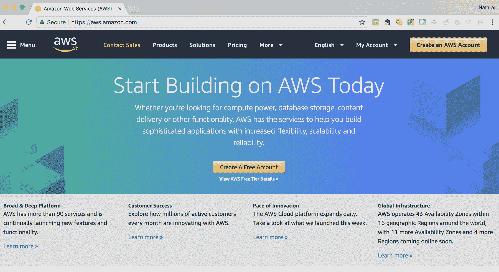

2.  AWS 帐户通常包括 12 个月的初始免费级别访问。 输入您的信息，然后单击继续：


3.  选择您的**帐户类型**(如个人)，然后输入您的联系信息：

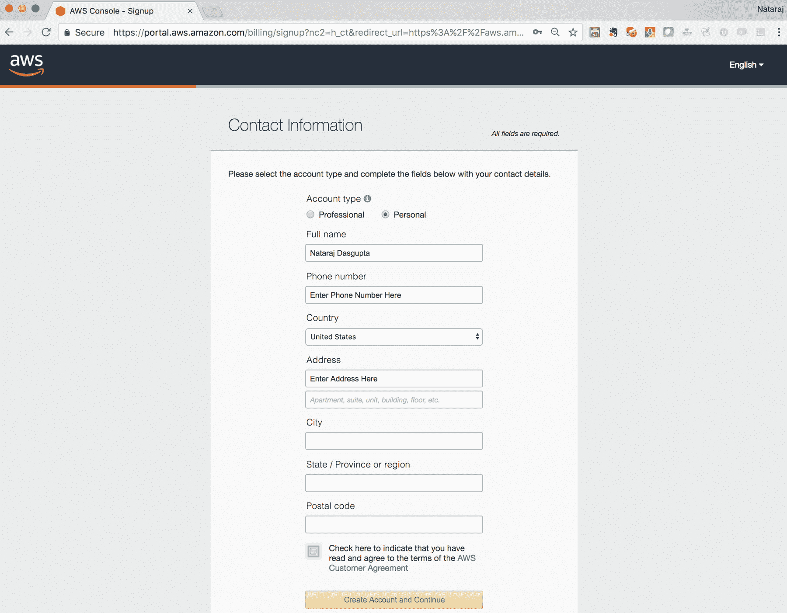

4.  输入付款信息。 AWS 需要信用卡才能注册。 请注意，用户必须非常谨慎和明智地使用 AWS 资源，以确保不会发生意外收费：

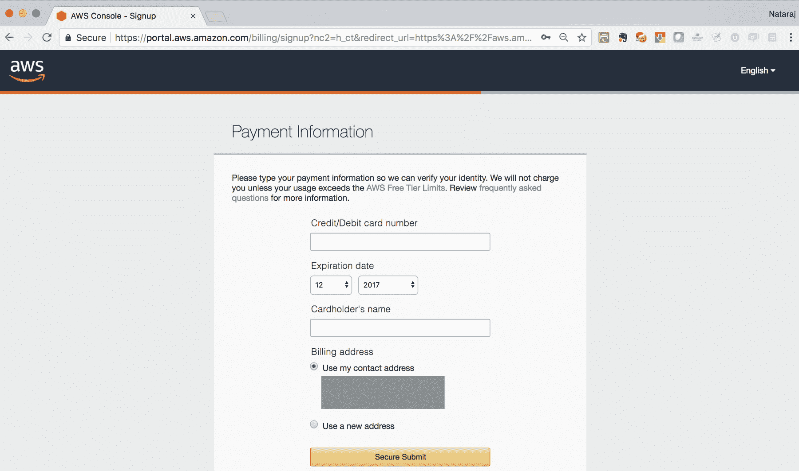

5.  *付款信息经过验证后，您将收到确认信息：


6.  选择基本计划(免费)：

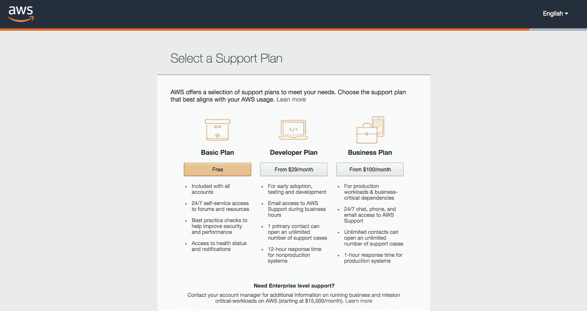

选择**基本计划**后的确认页面如下：

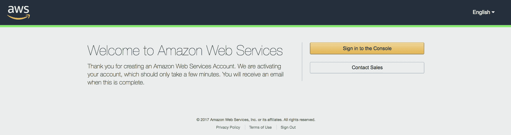

7.  使用您的凭据登录 AWS：

**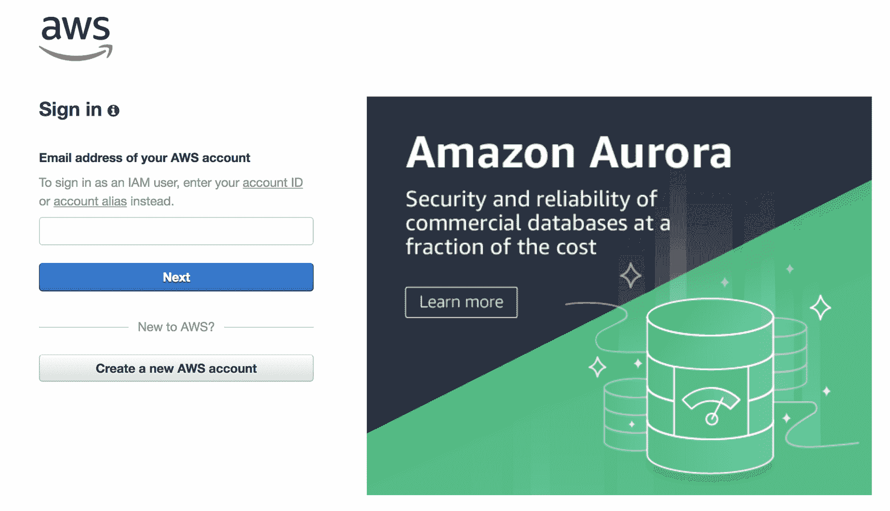** 

8.  第一页显示了 AWS 中的一些服务。 右上角显示了您的实例所在的区域。 AWS 支持多个地区，用户可以从一系列地理上分散的位置中进行选择：


9.  单击**服务**左上角的下拉菜单将调出可用的不同服务。 下面重点介绍一些重要的问题：


10.  单击 EC2：

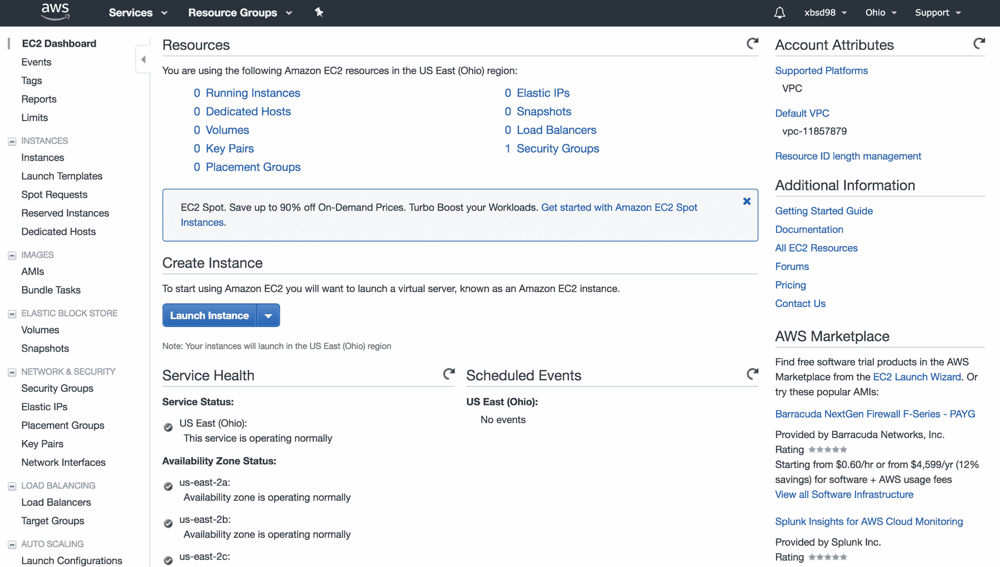

11.  AWS 提供了启动多个不同操作系统的选项。 虽然我们可以使用选定的操作系统重新启动新实例，但我们将改为使用 AMI 映像。 AMI 是安装了软件的预配置映像。 请注意，使用 AMI 映像不需要**，但在本教程中使用了一个：**

 ****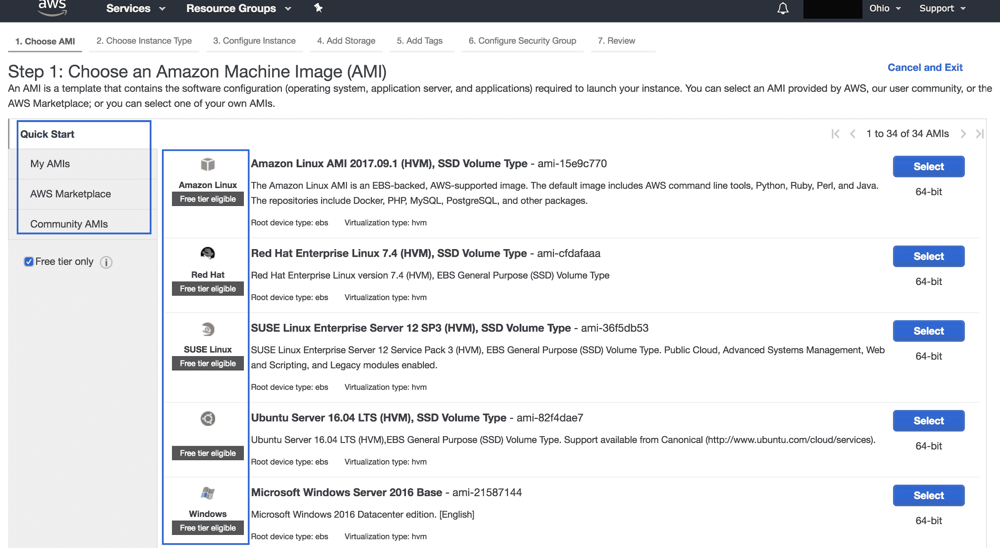**

12.  单击左侧菜单栏上的**社区 AMI**并搜索**RStudio**。 选择第一个选项，然后单击选择按钮：

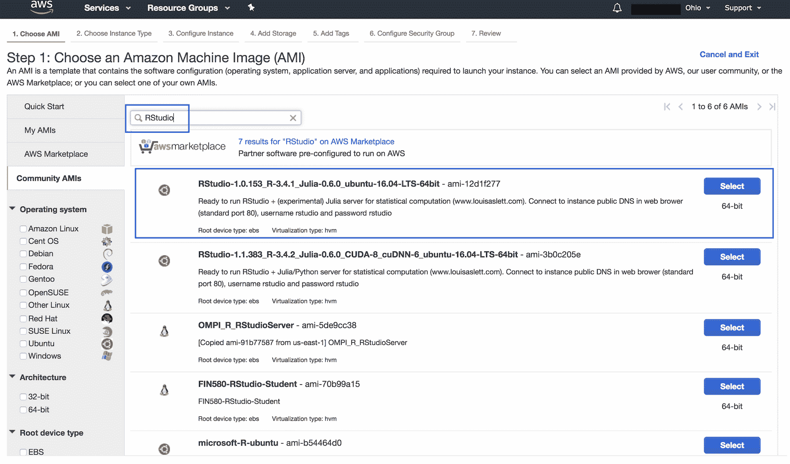

13.  选择空闲层选项(t2.Micro)，点击下一步：配置实例详情：


14.  选择下一页上的默认选项，然后单击**下一步：**添加存储：

**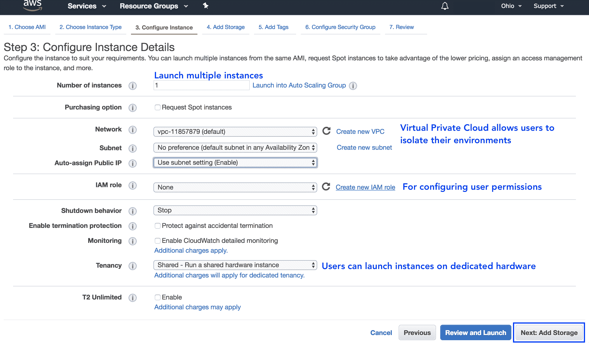**

15.  选择默认存储选项，然后单击添加标签：

****

16.  单击**下一步：**配置安全组：

**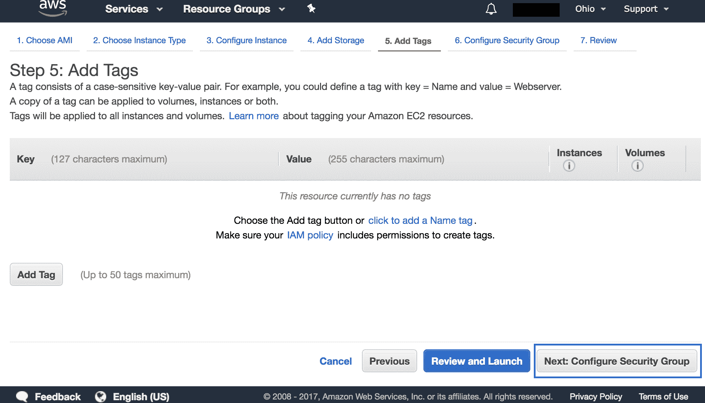**

17.  安全组指定服务器的网络访问规则。 在我们的教程中，我们将选择所有 TCP，然后单击查看并启动：

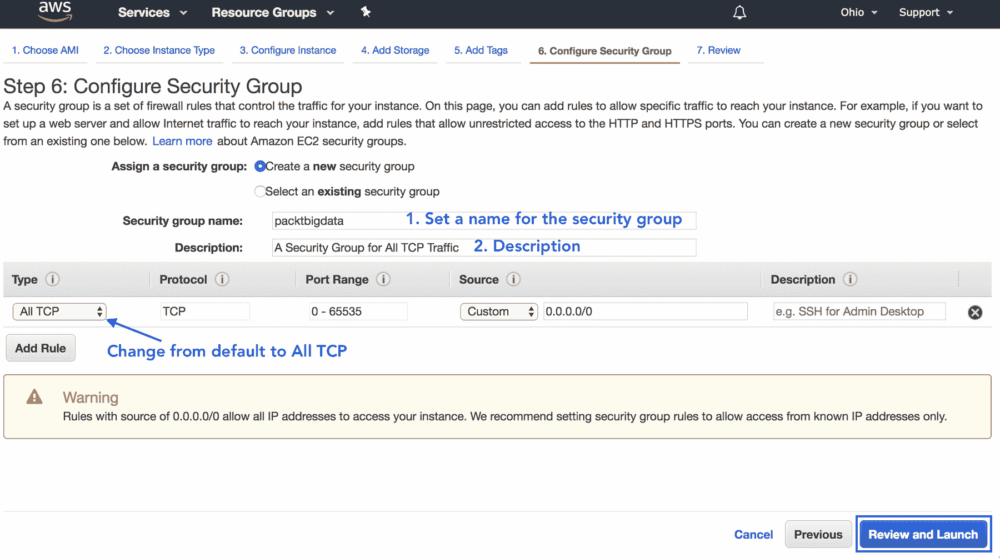

18.  单击🙂Launch：


19.  选择创建新密钥对，然后单击下载密钥对。 密钥下载完成后，单击 Launch Instance(启动实例)按钮：


20.  单击实例 ID：


21.  实例 ID 状态显示为 Running 后，复制服务器名称，可在底部面板中查看：


22.  打开新浏览器，输入服务器名称作为 URL，然后按 Enter 键。 这将打开 RStudio。 使用 ID 为**RStudio**和密码为**RStudio**登录：


23.  这将打开 RStudio 控制台。 这是一个完整的 R 环境，您可以像在 R 和 RStudio 的本地安装中一样执行 R 代码：

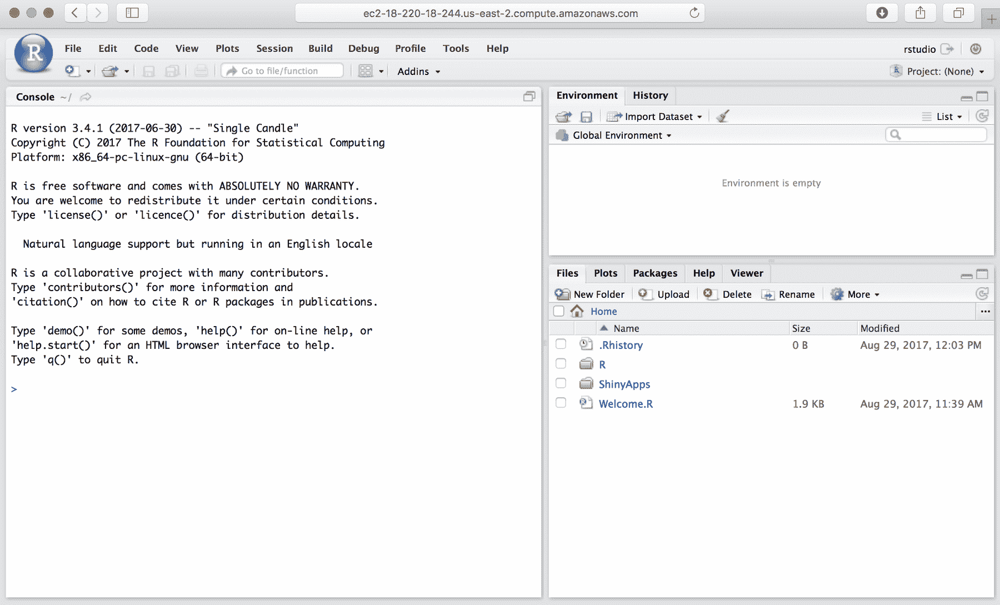

24.  使用完 R Studio 后，请确保`terminate`该实例。 终止会停止计费过程。 尽管我们使用的是免费层帐户，但最好在您完成工作后停止或终止实例：

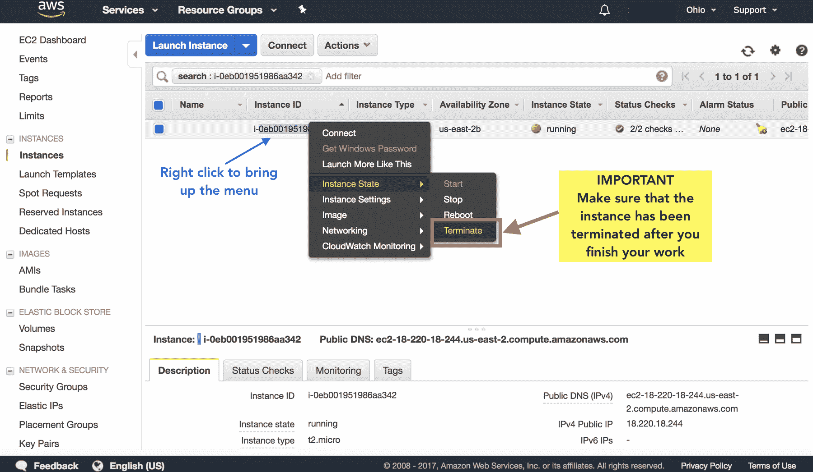

25.  单击注销以注销 AWS 控制台：


Azure 还在[https://azure.microsoft.com/en-us/free/](https://azure.microsoft.com/en-us/free/)上提供免费帐户注册，如以下屏幕截图所示：


谷歌的免费云注册表格可在[https://cloud.google.com/free/](https://cloud.google.com/free/)获取，如以下截图所示：

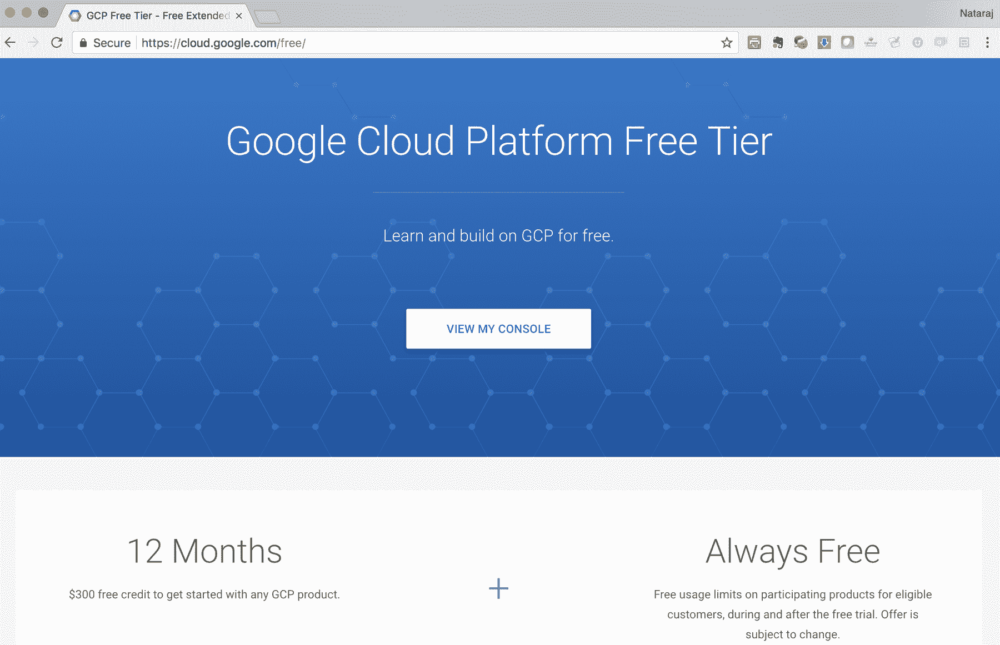

# 简略的 / 概括的 / 简易判罪的 / 简易的

在本章中，我们讨论了在软件和硬件级别部署企业级数据科学基础设施的要求。 我们在管理层分享了围绕这些倡议的关键共同问题。 紧随其后的是关于大型组织中用于数据挖掘和机器学习的关键企业解决方案的大量章节。

本教程涉及在 Amazon Web Services(基于云的系统)上启动 RStudio 服务器。 AWS 已成为当今世界领先的云服务提供商，该练习展示了在几秒钟内启动整台机器是多么简单。 他们提到了明智和谨慎地使用 AWS 来防止非常昂贵的费用的适当的利弊。

下一章也是最后一章将包括一些结束语、后续步骤和有用资源的链接，您可以使用这些链接来更多地了解本书中讨论的主题。**