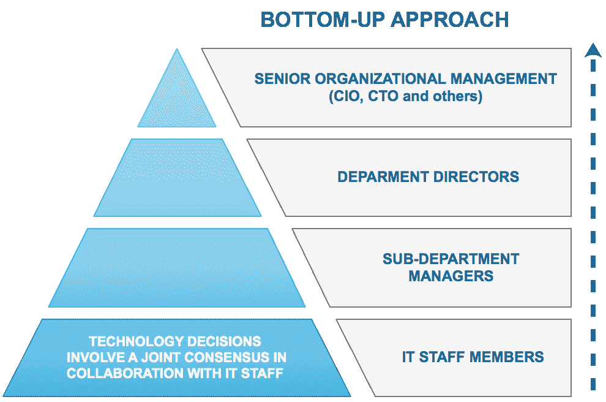
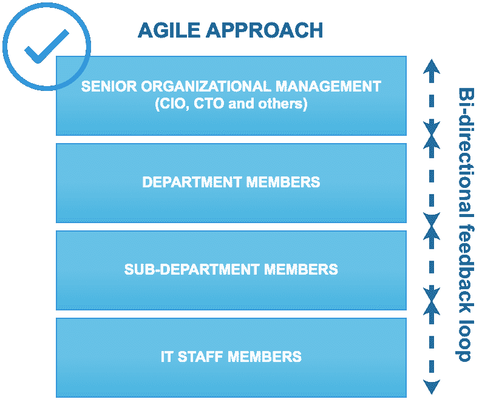

# 十、关于大数据的结束语

到目前为止，我们已经涵盖了广泛的主题。 我们研究了用于大数据、数据科学和机器学习的技术。 我们已经了解了公司如何实施其大数据企业战略。 在此过程中，我们还开发了一些实际应用程序。

本章讨论企业中大数据或数据科学计划的实际考虑事项。 随着更新的技术、更新的开源工具和数据挖掘中的新概念的引入，该领域正在不断发展。 因此，各种规模的组织都面临着共同的挑战。

数据科学的成功故事在媒体中比比皆是。 事实上，今天发生在技术上的投资中的大部分(如果不是全部)都与数据科学的各个方面有一定的联系。 事实上，资讯科技已成为资讯科技发展不可或缺的一环。

在本章中，我们将讨论实施数据科学的一些共同主题、共同的挑战，以及您可以做些什么来使您的计划取得成功。 此外，我们将看看数据科学方面的重大成功，以及数据科学未能实现其承诺的例子。 我们还将提供一组指向资源的链接，您可以访问这些资源了解相关主题的更多信息。

本章将介绍以下主题：

*   企业大数据和数据科学战略
*   伦理考量
*   硅谷与数据科学
*   人的因素
*   进一步阅读的链接

# 企业大数据和数据科学战略

你已经在报纸上读到过，你在晚间新闻上看到过，你从你的朋友那里听说过--大数据和数据科学无处不在，而且还会继续存在。

硅谷的成功故事让这种影响更加明显。 谁能想到，拼车和叫车电话应用优步(Uber)会成为世界上最受欢迎的公司之一，估值估计接近 700 亿美元。 Airbnb 等网站和应用程序将公寓分享变成了一项蓬勃发展的业务，成为估值第二高的公司，估值为 300 亿美元。

这些事件和其他类似事件将大数据和数据科学的话题从纯粹的理论和技术主题转变为人们已经将其与无限投资成功联系在一起的通用术语。

由于几乎所有主要技术供应商都已开始添加分类为*大数据*的功能，因此目前几乎所有投资于技术的公司都在有意或无意地使用大数据的某些方面。

然而，实施过程的定义非常宽松。 因此，除了 Hadoop(可能是大多数公司已经采用的事实上的框架)之外，还没有明确的框架。 高级管理层通常意识到大局，即大数据可以为其组织带来的价值。 然而，实现这一愿景的道路是具有挑战性的，因此没有确定的解决方案可以保证成功。

一般而言，实施有三个阶段：

*   **休眠**：公司尚未建立明确的授权，但有关于大数据的讨论
*   **被动**：讨论开始采取更正式的形式，通常导致委派一个或多个团队来评估对组织的影响和价值
*   **主动**：公司开始评估技术并积极实施

大数据和/或数据科学战略的所有权可能会有些混乱。 这是因为该领域既包含分析元素，也包含技术元素。 前者(分析)通常归组织中面向业务的部门所有，而技术则归 IT 部门所有。 然而，在数据科学中，这两个要素都是必需的。 是数据*专家*的个人，也就是那些非常了解领域并对领域中使用的数据有经验的人，可以成为优秀的业务主题专家。 他们还可以全面确定理想的用例以及如何最好地利用数据。 然而，如果没有很强的技术敏锐性，就很难找到正确的工具来实现这一愿景。

同样，IT 经理可能非常了解与大数据相关的技术，但需要业务利益相关者的反馈，才能有效地确定各种解决方案中哪些将满足组织的特定即时和长期需求。

换言之，要实施真正有效的组织大数据生态系统，需要多个跨学科的流进行协作。

战略的实现过程一般是*自上而下*或*自下而上*。 然而，与其采用严格的方向性方法，协作、迭代和敏捷的流程通常是最好的解决方案。 在评估大数据需求的过程中，会有决策以及基于新需求和发现的决策变更，之前的评估可能需要修改，以满足修改后的目标。

自下而上的方法涉及从 IT 级别开始组织决策。 自上而下的方法可以说是更常见的，它涉及到从管理层开始做出决策。 一般来说，两者都不是最优的。 理想的方法是有一个基于发现过程调整需求的持续反馈循环：

相比之下，自上而下的方法如下所示：

无论是自下而上还是自上而下的方法都不是成功的大数据计划的最佳选择。 更好的选择是协作流程，该流程考虑到不同部门不断变化的需求和不同的要求，这些部门将从实施大数据平台中受益：

# 伦理考量

大数据通常涉及收集可能包含用户个人信息的大量数据。 Facebook 和谷歌(Google)等公司在分析个人信息以定向广告和进行其他类型的营销方面蓬勃发展。 这显然造成了道德上的两难境地。 个人资料应该收集到什么程度？ *多大是不是太多了？*当然，这些问题没有正确的答案。 黑客活动的兴起，数亿用户账户的信息已被泄露，这在今天是如此普遍，以至于我们几乎对其后果感到自满。

2017 年 10 月，雅虎！ 据披露，30 亿个账户，实际上是雅虎！上的每个账户都遭遇了数据泄露。 **美国最大的信用报告公司之一 Equifax**遭遇数据泄露，暴露了超过 1.4 亿消费者的个人信息。 还有其他几十起类似的事件，在所有这些事件中，共同点是所有公司都直接或通过第三方收集了一定程度的用户个人信息。

本质上，每当涉及到与用户相关的信息时，都会导致实施适当的 IT 安全性，以确保数据不会被泄露。 其影响不仅限于数据的丢失，还包括对声誉和商誉的影响造成的附带损害，除了涉及到数据被泄露的真实人群这一主要事实之外。

因此，无论何时涉及敏感信息和/或任何个人信息，大数据的安全性都变得至关重要。 AWS 和 Azure 等云提供商之所以获得吸引力，部分原因是它们拥有非常严格的安全标准和认证，允许组织将责任卸给值得信赖的强大实体。

2018 年 5 月生效的欧盟**GDPR**(**一般数据隐私条例**)是保护其公民个人数据的重要一步。 简而言之，GDPR 监管任何个人数据的使用。 在这种情况下，“任何”一词都是极其宽泛的，甚至包括个人的名字。 违反规定的人将被处以最高 2000 万欧元的罚款，相当于违约组织全球营业额的 4%。

虽然这将明显减少*个大数据*个数据集的可用性，特别是那些与个人数据相关的数据集，但它也可能引发一场辩论，甚至可能引发关于如何在约束范围内充分利用数据(即在不使用个人信息的情况下从数据中获取价值)的创新。

另一方面，美国等国一直在放松有关收集个人数据的法律。 2017 年初，美国取消了对互联网服务提供商收集个人信息的隐私保护，事实上，AT&T 等互联网服务提供商不仅可以收集用户的浏览和 APP 数据，还可以出售用户的浏览和 APP 数据。

# 硅谷与数据科学

我们今天在大数据领域看到的几项关键创新都来自硅谷。 几十年来，该地区一直是一个科技中心，并推出了一些最成功的公司，如苹果、谷歌、Facebook 和 eBay。 大学的存在，如加州大学伯克利分校(University Of California At Berkeley)，使得获得人才变得相对容易。

也就是说，该地区的生活成本飙升，特别是在大数据和数据科学行业增长之后。 如今，一居室公寓的平均租金远高于每月 3500 美元，甚至比纽约市还贵。

然而，硅谷是成功的代名词，许多新的企业家被吸引到这个地区。 初创企业如雨后春笋般涌现，其中许多获得了数千万美元的风险投资。 然而，鉴于创业企业的失败率很高，创业者应该注意统计警告。 有好点子是一回事，有潜在的高商业价值。 将这个想法转化为商业成功需要一种不同的技能和商业敏锐。

对于那些感兴趣的人，Crunchbase 网站提供了一个非常全面的视角来了解创业领域的活动。 下图显示了在任何给定的 7 天内发生的投资的平均数字，可能达到数百亿美元：

# 人的因素

尽管大数据和数据科学有着显著的优势，它们的成功和突破性增长，但仍然重要的是要记住，人类思维的元素在所有努力中都是必不可少的。

大数据技术将使我们能够更高效地分析数据。 但是我们仍然需要使用适当的判断来决定我们理想的用例。 这不是一件微不足道的事。 大公司发现，主动行动与经验丰富的大数据专业人士一样具有挑战性(尽管规模更大)。

同样，数据科学和机器学习可以使我们在复杂的算法和代码的帮助下做出预测和获得远见。 然而，用户仍然有责任评估结果并做出决定，而不是仅仅基于预测的输出。 用户应运用常识和经验进行此类评估。 如果 GPS 指示司机在下雪的冬夜在某条道路上行驶，而司机知道这条路不会被扫雪机清理干净，那么盲目遵循 GPS 指示是不谨慎的。

最近一个说明这一概念的例子是 2016 年大选期间人与机器之间的脱节。 使用非常复杂的算法估计克林顿赢得选举的高概率的广泛模型都被证明是错误的。 知名数据科学家和领先的统计组织估计，克林顿当选总统的可能性为 80%-90%。 我们都错过了做决定的人的因素。 我们过于专注于模型的成熟，而不是试图理解人们的真实感受，以及他们对非正式调查的断言是否会与他们最终选择的候选人和对他们的真实感受一致。

# 成功项目的特点

数据科学项目，就其本质而言，需要很长时间才能实现投资回报。 特别是，很难准确衡量涉及长期预测的项目的成功程度。 正如前面一章所指出的，各部门要推进数据科学事业，展示早期的成功是至关重要的。 一般而言，a)短期项目；b)具有可衡量的结果；c)能够受益并将被广泛使用的项目是帮助建立可信度并确保与数据科学相关的项目成功的一些关键因素。

Arterys 就是这样一个项目的例子。Arterys 是一家基于云的公司，它在 2016 年底开发了一种深度学习算法，与传统扫描仪相比，该算法可以在很短的时间内评估流向心脏的血液。 它符合成功的所有关键标准。 好处几乎立刻就显现出来了，该算法提供了一个直接可测量的结果，因为你可以将结果与扫描仪的结果进行比较，而且它对广泛的用户(即患者)很有用。 此外，主题非常直观。

任何做过血液测试的人都能直观地联想到测量血液流量。 这种产品的好处也是相当明显的。 能够在很短的时间内取得成果可能有助于拯救生命。 2016 年 11 月，FDA 批准了该算法。 这是一项不朽的成就。

# 简略的 / 概括的 / 简易判罪的 / 简易的

总体而言，虽然通向大数据和数据科学的成功之路可能看起来很艰难，但希望前面的章节已经全面概述了大数据的各种主题。 我们讨论了数据挖掘和机器学习，了解了各自学科中的各种工具和技术，开发了真实世界数据的应用程序，并就组织大数据和数据科学计划的细微差别提出了不同的看法。

接下来的几页列出了一些资源的链接，读者可能会发现这些资源对了解更多关于各个主题领域的知识很有用。