# 三、使用数据帧抽象数据

在本章中，您将了解以下食谱:

*   创建数据帧
*   访问底层 RDDs
*   性能优化
*   使用反射推断模式
*   以编程方式指定架构
*   创建临时表
*   使用 SQL 与数据框进行交互
*   数据帧转换概述
*   数据框操作概述

# 介绍

在本章中，我们将探讨当前的基本数据结构——数据帧。数据框利用了钨项目和催化剂优化器的发展。这两项改进使 PySpark 的性能与 Scala 或 Java 不相上下。

钨项目是对 Spark 引擎的一系列改进，旨在使其执行过程更接近*裸机*。主要可交付成果包括:

*   **运行时代码生成**:这旨在利用现代编译器中实现的优化
*   **利用内存层次结构**:算法和数据结构利用内存层次结构来快速执行
*   **直接内存管理**:消除了与 Java 垃圾收集和 JVM 对象创建和管理相关的开销
*   **低级编程**:通过将即时数据加载到中央处理器寄存器来加速内存访问
*   **虚函数派单消除**:这样就消除了多次调用 CPU 的必要性

Check this blog from Databricks for more information: [https://www.databricks.com/blog/2015/04/28/project-tungsten-bringing-spark-closer-to-bare-metal.html](https://www.databricks.com/blog/2015/04/28/project-tungsten-bringing-spark-closer-to-bare-metal.html).

Catalyst Optimizer 位于 Spark SQL 的核心，为针对数据和数据帧执行的 SQL 查询提供动力。该过程从向引擎发出查询开始。执行的逻辑计划首先被优化。基于优化的逻辑计划，多个物理计划被导出并通过成本优化器推送。然后，选定的最具成本效益的计划被转换(使用作为钨项目的一部分实现的代码生成优化)为优化的基于 RDD 的执行代码。

# 创建数据帧

Spark 数据帧是分布在集群中的不可变的数据集合。数据框中的数据被组织成命名的列，这些列可以与关系数据库中的表进行比较。

在这个食谱中，我们将学习如何创建 Spark 数据帧。

# 准备好

要执行这个配方，您需要有一个工作的 Spark 2.3 环境。如果你没有，你可能想回到[第 1 章](1.html#OPEK0-dc04965c02e747b9b9a057725c821827)，*安装和配置 Spark*，并遵循你在那里找到的食谱。

本章需要的所有代码都可以在我们为该书设置的 GitHub 资源库中找到:[http://bit.ly/2ArlBck](http://bit.ly/2ArlBck)；转到`Chapter 3`打开`3\. Abstracting data with DataFrames.ipynb`笔记本。

没有其他要求。

# 怎么做...

创建数据框的方法有很多，但最简单的方法是创建 RDD 并将其转换为数据框:

```py
sample_data = sc.parallelize([(1, 'MacBook Pro', 2015, '15"', '16GB', '512GB SSD', 13.75, 9.48, 0.61, 4.02), (2, 'MacBook', 2016, '12"', '8GB', '256GB SSD', 11.04, 7.74, 0.52, 2.03), (3, 'MacBook Air', 2016, '13.3"', '8GB', '128GB SSD', 12.8, 8.94, 0.68, 2.96), (4, 'iMac', 2017, '27"', '64GB', '1TB SSD', 25.6, 8.0, 20.3, 20.8)])sample_data_df = spark.createDataFrame(sample_data, ['Id', 'Model', 'Year', 'ScreenSize', 'RAM', 'HDD', 'W', 'D', 'H', 'Weight'])
```

# 它是如何工作的...

如果您已经阅读了前一章，您可能已经知道如何创建 rdd。在这个例子中，我们简单地称之为`sc.parallelize(...)`方法。

我们的样本数据集只包含相对较新的苹果电脑的少量记录。然而，与所有关系数据库一样，很难弄清楚元组的每个元素代表什么，因为关系数据库是无模式结构。

因此，在使用`SparkSession`的`.createDataFrame(...)`方法时，我们传递一个列名列表作为第二个参数；第一个论点是我们希望转换成数据帧的 RDD。

现在，如果我们使用`sample_data.take(1)`窥视`sample_data` RDD 内部，我们将检索第一条记录:


为了比较数据帧的内容，我们可以运行`sample_data_df.take(1)`来获得以下内容:


正如你现在看到的，数据帧是`Row(...)`对象的集合。一个`Row(...)`对象由命名的数据组成，不像 RDD。

If the preceding `Row(...)` object looks similar to a dictionary to you, you are not wrong. Any `Row(...)` object can be converted into a dictionary using the `.asDict(...)` method. For more information, check out [http://spark.apache.org/docs/latest/api/python/pyspark.sql.html#pyspark.sql.Row](http://spark.apache.org/docs/latest/api/python/pyspark.sql.html#pyspark.sql.Row).

但是，如果我们使用`.show(...)`方法查看`sample_data_df`数据框中的数据，我们会看到以下内容:

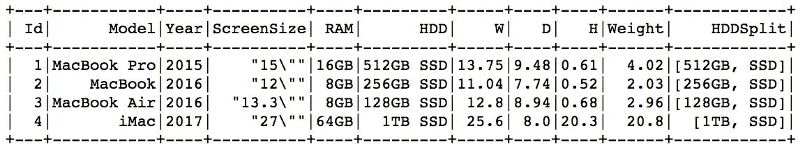

由于数据帧有模式，让我们使用`.printSchema()`方法来查看我们的`sample_data_df`的模式:


如您所见，我们的数据框中的列具有与原始`sample_data` RDD 的数据类型匹配的数据类型。

Even though Python is not a strongly-typed language, DataFrames in PySpark are. Unlike RDDs, every element of a DataFrame column has a specified type (these are all listed in the `pyspark.sql.types` submodule) and all the data must conform to the specified schema. 

# 还有更多...

当你使用`SparkSession`的`.read`属性时，它会返回一个`DataFrameReader`对象。`DataFrameReader`是将数据读入数据帧的接口。

# 来自 JSON

要从 JSON 格式的文件中读取数据，您可以简单地执行以下操作:

```py
sample_data_json_df = (spark.read.json('../Data/DataFrames_sample.json'))
```

从 JSON 格式的文件中读取数据的唯一缺点(尽管是一个小缺点)是所有的列都将按字母顺序排列。自己跑`sample_data_json_df.show()`看看:

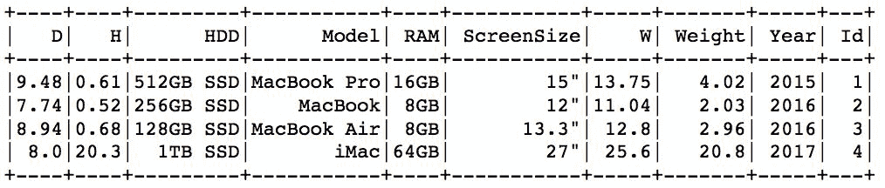

然而，数据类型保持不变:`sample_data_json_df.printSchema()`


# 来自 CSV

从 CSV 文件中读取同样简单:

```py
sample_data_csv = (spark.read.csv('../Data/DataFrames_sample.csv', header=True, inferSchema=True))
```

传递的唯一附加参数确保该方法将第一行视为列名(`header`参数)，并尝试根据内容为每一列分配正确的数据类型(`inferSchema`参数默认分配字符串)。

与从 JSON 格式的文件中读取数据不同，从 CSV 文件中读取数据会保留列的顺序。

# 请参见

*   有关支持的数据格式的完整列表，请查看 Spark 的文档:[http://Spark . Apache . org/docs/latest/API/python/pyspark . SQL . html # pyspark . SQL . data frame reader](http://spark.apache.org/docs/latest/api/python/pyspark.sql.html#pyspark.sql.DataFrameReader)

# 访问底层 RDDs

改用 DataFrames 并不意味着我们需要完全放弃 rdd。在引擎盖下，数据框仍然使用关系数据库，但如前所述，使用`Row(...)`对象。在本食谱中，我们将学习如何与数据框的底层 RDD 交互。

# 准备好

要执行这个配方，您需要有一个工作的 Spark 2.3 环境。此外，您应该已经完成了前面的配方，因为我们将重用我们在那里创建的数据。

没有其他要求。

# 怎么做...

在本例中，我们将硬盘的大小及其类型提取到单独的列中，然后计算将每台计算机放入盒子中所需的最小体积:

```py
import pyspark.sql as sqlimport pyspark.sql.functions as fsample_data_transformed = (sample_data_df.rdd.map(lambda row: sql.Row(**row.asDict(), HDD_size=row.HDD.split(' ')[0])).map(lambda row: sql.Row(**row.asDict(), HDD_type=row.HDD.split(' ')[1])).map(lambda row: sql.Row(**row.asDict(), Volume=row.H * row.D * row.W)).toDF().select(sample_data_df.columns + ['HDD_size', 'HDD_type', f.round(f.col('Volume')).alias('Volume_cuIn')]))
```

# 它是如何工作的...

如前所述，数据帧中 RDD 的每个元素都是一个`Row(...)`对象。您可以通过运行以下两个语句来检查它:

```py
sample_data_df.rdd.take(1)
```

以及:

```py
sample_data.take(1)
```

第一个产生一个单品列表，其中的元素是`Row(...)`:


另一个也产生一个单项目列表，但是项目是一个元组:


The `sample_data` RDD is the first RDD we created in the previous recipe.

考虑到这一点，现在让我们将注意力转向代码。

首先，我们加载必要的模块:为了处理`Row(...)`对象，我们需要`pyspark.sql`，稍后我们将使用`.round(...)`方法，因此我们需要`pyspark.sql.functions`子模块。

接下来，我们从`sample_data_df`中提取`.rdd`。使用`.map(...)`转换，我们首先将`HDD_size`列添加到模式中。

由于我们正在使用 rdd，我们希望保留所有其他列。因此，我们首先使用`.asDict()`方法将行(它是一个`Row(...)`对象)转换成字典，然后我们可以稍后使用`**`将其解包。

In Python, the single `*` preceding a list of tuples, if passed as a parameter to a function, passes each element of a list as a separate argument to the function. The double `**` takes the first element and turns it into a keyword parameter, and uses the second element as the value to be passed.

第二个参数遵循一个简单的约定:我们传递想要创建的列的名称(`HDD_size`)，并将其设置为所需的值。在我们的第一个例子中，我们分割`.HDD`列并提取第一个元素，因为它是`HDD_size`。

我们再重复这个步骤两次:第一次，创建`HDD_type`列，第二次，创建`Volume`列。

接下来，我们使用`.toDF(...)`方法将我们的 RDD 转换回数据帧。请注意，您仍然可以使用`.toDF(...)`方法将常规 RDD(即每个元素都不是`Row(...)`对象)转换为数据帧，但是您需要将列名列表传递给`.toDF(...)`方法，否则您将得到未命名的列。

最后，我们`.select(...)`列，这样我们就可以`.round(...)`新创建的`Volume`列。`.alias(...)`方法为结果列产生不同的名称。

生成的数据帧如下所示:

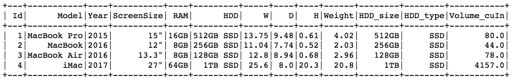

不出所料，桌面 iMac 需要最大的盒子。

# 性能优化

从 Spark 2.0 开始，使用数据帧的 PySpark 的性能与 Scala 或 Java 相当。但是，有一个例外:使用**用户定义函数**(**UDFs**)；如果用户定义了一个纯 Python 方法，并将其注册为 UDF，那么在幕后，PySpark 将不得不不断地切换运行时(Python 到 JVM，再回到 JVM)。这是与 Scala 相比性能大幅下降的主要原因，Scala 不需要将 JVM 对象转换为 Python 对象。

在 Spark 2.3 中，事情发生了显著的变化。首先，Spark 开始使用新的 Apache 项目。Arrow 创建了一个供所有环境使用的内存空间，因此无需在对象之间不断复制和转换。


Source: https://arrow.apache.org/img/shared.png For an overview of Apache Arrow, go to [https://arrow.apache.org](https://arrow.apache.org).

其次，Arrow 将柱状对象存储在内存中，大大提升了性能。因此，为了进一步利用这一点，PySpark 代码的一些部分已经被重构，这给我们带来了向量化的 UDF。

在本食谱中，我们将学习如何使用它们，并测试两者的性能:旧的、逐行的 UDF 和新的矢量化 UDF。

# 准备好了

要执行这个配方，您需要有一个工作的 Spark 2.3 环境。

没有其他要求。

# 怎么做...

在本例中，我们将使用 SciPy 为一组介于 0 和 1 之间的 1，000，000 个随机数返回正态概率分布函数(PDF)的值:

```py
import pyspark.sql.functions as fimport pandas as pdfrom scipy import statsbig_df = (spark.range(0, 1000000).withColumn('val', f.rand()))big_df.cache()big_df.show(3)@f.pandas_udf('double', f.PandasUDFType.SCALAR)def pandas_pdf(v):return pd.Series(stats.norm.pdf(v))(big_df.withColumn('probability', pandas_pdf(big_df.val)).show(5))
```

# 它是如何工作的...

首先，像往常一样，我们导入运行此示例所需的所有模块:

*   `pyspark.sql.functions`让我们可以访问 PySpark SQL 函数。我们将使用它来创建带有随机数的数据帧。
*   `pandas`框架将允许我们访问`.Series(...)`数据类型，这样我们就可以从 UDF 返回一个列。
*   `scipy.stats`让我们接触统计方法。我们将使用它来计算我们随机数的正常 PDF。

接下来，我们的`big_df`。`SparkSession`有一个方便的方法，`.range(...)`，允许我们在指定的范围内创建一个数字范围；在这个例子中，我们简单地创建了一个有一百万条记录的 DataFrame。

在下一行中，我们使用`.withColumn(...)`方法向我们的数据框中添加另一列；这个栏目的名字是`val`，它将包含一百万个`.rand()`数字。

The `.rand()` method returns pseudo-random numbers drawn from a uniform distribution that ranges between 0 and 1.

最后，我们`.cache()`数据帧，所以它完全保留在内存中(为了加速过程)。

接下来，我们定义`pandas_cdf(...)`方法。请注意方法声明前面的`@f.pandas_udf`装饰器，因为这是在 PySpark 中注册矢量化 UDF 的关键，并且仅在 Spark 2.3 中可用。

Note that we did not have to decorate our method; we could have instead registered our vectorized method as `f.pandas_udf(f=pandas_pdf, returnType='double', functionType=f.PandasUDFType.SCALAR)`. 

装饰器方法的第一个参数是 UDF 的返回类型，在我们的例子中是`double`。这可以是 DDL 格式的类型字符串或`pyspark.sql.types.DataType`。第二个参数是函数类型；如果我们从我们的方法中返回一个单独的列(比如我们例子中熊猫的`.Series(...)`，它将是`.PandasUDFType.SCALAR`(默认)。另一方面，如果我们在多个柱上操作(比如熊猫的`DataFrame(...)`，我们会定义`.PandasUDFType.GROUPED_MAP`。

我们的`pandas_pdf(...)`方法只是接受一个单独的列，并返回一个熊猫的`.Series(...)`对象，其值为正常的 CDF 对应的数字。

最后，我们简单地使用新方法来转换我们的数据。以下是前五条记录的样子(由于我们正在创建一百万个随机数，您的记录很可能会有所不同):

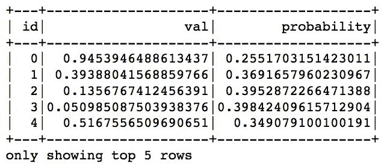

# 还有更多...

现在让我们比较两种方法的性能:

```py
def test_pandas_pdf():return (big_df.withColumn('probability', pandas_pdf(big_df.val)).agg(f.count(f.col('probability'))).show())%timeit -n 1 test_pandas_pdf()# row-by-row version with Python-JVM conversion@f.udf('double')def pdf(v):return float(stats.norm.pdf(v))def test_pdf():return (big_df.withColumn('probability', pdf(big_df.val)).agg(f.count(f.col('probability'))).show())%timeit -n 1 test_pdf()
```

`test_pandas_pdf()`方法简单地使用`pandas_pdf(...)`方法从正态分布中检索 PDF，执行`.count(...)`操作，并使用`.show(...)`方法打印出结果。`test_pdf()`方法也是这样做的，但是使用了`pdf(...)`方法，这是使用 UDF 的逐行方式。

`%timeit`装饰器简单地运行`test_pandas_pdf()`或`test_pdf()`方法七次，乘以每次执行。以下是运行`test_pandas_pdf()`方法的示例输出(如您所料，缩写为高度重复):


`test_pdf()`方法的计时引用如下:


正如您所看到的，矢量化的 UDF 提供了大约 100 倍的性能提升！不要太激动，因为这种加速只适用于更复杂的查询，比如我们之前使用的查询。

# 请参见

*   要了解更多信息，请查看 Databricks 的这篇博客文章，它宣布了矢量化 UDFs:[https://data bricks . com/blog/2017/10/30/introduction-矢量化-udfs-for-pyspark.html](https://databricks.com/blog/2017/10/30/introducing-vectorized-udfs-for-pyspark.html)

# 使用反射推断模式

数据帧有模式，关系数据库没有。也就是说，除非 RDDs 由`Row(...)`对象组成。

在本食谱中，我们将学习如何通过使用反射推断模式来创建数据帧。

# 准备好

要执行这个配方，您需要有一个工作的 Spark 2.3 环境。

没有其他要求。

# 怎么做...

在本例中，我们将首先将 CSV 样本数据读入 RDD，然后从中创建一个数据帧。下面是代码:

```py
import pyspark.sql as sqlsample_data_rdd = sc.textFile('../Data/DataFrames_sample.csv')header = sample_data_rdd.first()sample_data_rdd_row = (sample_data_rdd.filter(lambda row: row != header).map(lambda row: row.split(',')).map(lambda row:sql.Row(Id=int(row[0]), Model=row[1], Year=int(row[2]), ScreenSize=row[3], RAM=row[4], HDD=row[5], W=float(row[6]), D=float(row[7]), H=float(row[8]), Weight=float(row[9]))))
```

# 它是如何工作的...

首先，我们加载 PySpark 的 SQL 模块。

接下来，我们使用 SparkContext 的`.textFile(...)`方法读取`DataFrames_sample.csv`文件。

Review the previous chapter if you do not yet know how to read data into RDDs.

由此产生的 RDD 如下所示:

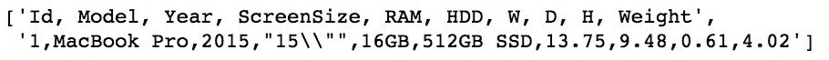

如您所见，RDD 仍然包含带有列名的行。为了消除它，我们首先使用`.first()`方法提取它，然后稍后使用`.filter(...)`转换移除任何等于标题的行。

接下来，我们用逗号分割每一行，并为每个观察创建一个`Row(...)`对象。请注意，我们将所有字段转换为正确的数据类型。例如`Id`列应该是整数，`Model`名称是字符串，`W`(宽度)是浮点数。

最后，我们简单地调用 SparkSession 的`.createDataFrame(...)`方法，将`Row(...)`对象的 RDD 转换为数据帧。最终结果如下:

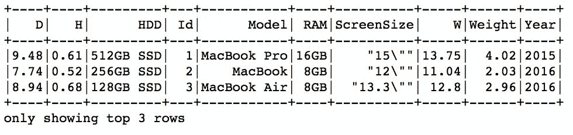

# 请参见

*   查看 Spark 的文档了解更多信息:[https://Spark . Apache . org/docs/latest/SQL-programming-guide . html #推断-模式-使用-反射](https://spark.apache.org/docs/latest/sql-programming-guide.html#inferring-the-schema-using-reflection)

# 以编程方式指定架构

在前面的食谱中，我们学习了如何使用反射来推断数据帧的模式。

在本食谱中，我们将学习如何以编程方式指定模式。

# 准备好

要执行这个配方，您需要有一个工作的 Spark 2.3 环境。

没有其他要求。

# 怎么做...

在本例中，我们将学习如何以编程方式指定模式:

```py
import pyspark.sql.types as typsch = typ.StructType([typ.StructField('Id', typ.LongType(), False), typ.StructField('Model', typ.StringType(), True), typ.StructField('Year', typ.IntegerType(), True), typ.StructField('ScreenSize', typ.StringType(), True), typ.StructField('RAM', typ.StringType(), True), typ.StructField('HDD', typ.StringType(), True), typ.StructField('W', typ.DoubleType(), True), typ.StructField('D', typ.DoubleType(), True), typ.StructField('H', typ.DoubleType(), True), typ.StructField('Weight', typ.DoubleType(), True)])sample_data_rdd = sc.textFile('../Data/DataFrames_sample.csv')header = sample_data_rdd.first()sample_data_rdd = (sample_data_rdd.filter(lambda row: row != header).map(lambda row: row.split(',')).map(lambda row: (int(row[0]), row[1], int(row[2]), row[3], row[4], row[5], float(row[6]), float(row[7]), float(row[8]), float(row[9]))))sample_data_schema = spark.createDataFrame(sample_data_rdd, schema=sch)sample_data_schema.show()
```

# 它是如何工作的...

首先，我们创建一个`.StructField(...)`对象列表。`.StructField(...)`是在 PySpark 中向模式添加字段的编程方式。第一个参数是我们要添加的列的名称。

第二个参数是我们要存储在列中的数据的数据类型；一些可用的类型包括`.LongType()`、`.StringType()`、`.DoubleType()`、`.BooleanType()`、`.DateType()`和`.BinaryType()`。

For a full list of available datatypes in PySpark, go to [http://spark.apache.org/docs/latest/api/python/pyspark.sql.html#module-pyspark.sql.types.](http://spark.apache.org/docs/latest/api/python/pyspark.sql.html#module-pyspark.sql.types.)

`.StructField(...)`的最后一个参数表示该列是否可以包含空值；如果设置为`True`，则表示可以。

接下来，我们使用 SparkContext 的`.textFile(...)`方法读入`DataFrames_sample.csv`文件。我们过滤掉标题，因为我们将显式指定模式，并且我们不需要存储在第一行中的名称列。接下来，我们用逗号分隔每一行，并在每个元素上施加正确的数据类型，使其符合我们刚刚指定的模式。

最后，我们称之为`.createDataFrame(...)`法，但这一次，与 RDD 一起，我们也通过`schema`。生成的数据帧如下所示:


# 请参见

*   查看 Spark 的文档了解更多信息:[https://Spark . Apache . org/docs/latest/SQL-programming-guide . html #以编程方式指定模式](https://spark.apache.org/docs/latest/sql-programming-guide.html#programmatically-specifying-the-schema)

# 创建临时表

在 Spark 中，可以通过 SQL 查询轻松地操作数据框。

在本食谱中，我们将学习如何创建一个临时视图，以便您可以使用 SQL 访问数据框中的数据。

# 准备好了

要执行这个配方，您需要有一个工作的 Spark 2.3 环境。你应该已经完成了前面的配方，因为我们将使用我们在那里创建的`sample_data_schema`数据帧。

没有其他要求。

# 怎么做...

我们简单地使用数据帧的`.createTempView(...)`方法:

```py
sample_data_schema.createTempView('sample_data_view')
```

# 它是如何工作的...

`.createTempView(...)`方法是创建临时视图的最简单方法，以后可以用来查询数据。唯一需要的参数是视图的名称。

让我们看看现在如何使用这样的临时视图来提取数据:

```py
spark.sql('''SELECT Model, Year, RAM, HDDFROM sample_data_view''').show()
```

我们只需使用 SparkSession 的`.sql(...)`方法，它允许我们编写 ANSI-SQL 代码来操作数据框中的数据。在这个例子中，我们只提取了四列。以下是我们得到的信息:


# 还有更多...

一旦创建了临时视图，就不能创建另一个同名视图。然而，Spark 提供了另一种允许我们创建或更新视图的方法:`.createOrReplaceTempView(...)`。顾名思义，通过调用这个方法，我们要么创建一个不存在的新视图，要么用新视图替换已经存在的视图:

```py
sample_data_schema.createOrReplaceTempView('sample_data_view')
```

像以前一样，我们现在可以使用它来使用 SQL 查询与数据进行交互:

```py
spark.sql('''SELECT Model, Year, RAM, HDD, ScreenSizeFROM sample_data_view''').show()
```

以下是我们得到的信息:


# 使用 SQL 与数据框进行交互

在前面的食谱中，我们学习了如何创建或替换临时视图。

在本食谱中，我们将学习如何使用 SQL 查询处理数据框中的数据。

# 准备好

要执行这个配方，您需要有一个工作的 Spark 2.3 环境。您应该已经通过*以编程方式指定了模式*配方，因为我们将使用我们在那里创建的`sample_data_schema`数据帧。

没有其他要求。

# 怎么做...

在本例中，我们将使用苹果电脑每种型号的外形来扩展原始数据:

```py
models_df = sc.parallelize([('MacBook Pro', 'Laptop'), ('MacBook', 'Laptop'), ('MacBook Air', 'Laptop'), ('iMac', 'Desktop')]).toDF(['Model', 'FormFactor'])models_df.createOrReplaceTempView('models')sample_data_schema.createOrReplaceTempView('sample_data_view')spark.sql('''SELECT a.*, b.FormFactorFROM sample_data_view AS aLEFT JOIN models AS bON a.Model == b.ModelORDER BY Weight DESC''').show()
```

# 它是如何工作的...

首先，我们创建一个包含两列的简单数据框:`Model`和`FormFactor`。在这个例子中，我们使用 RDD 的`.toDF(...)`方法快速将其转换为数据帧。我们传递的列表只是一个列名列表，模式将被自动推断出来。

接下来，我们创建模型视图并替换`sample_data_view`。

最后，为了将`FormFactor`追加到我们的原始数据中，我们只需将`Model`列上的两个视图连接起来。由于`.sql(...)`方法接受常规的 SQL 表达式，我们也使用`ORDER BY`子句，因此我们可以按权重排序。

以下是我们得到的信息:

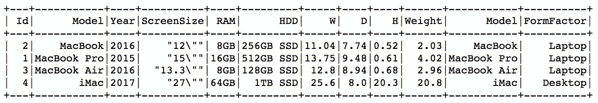

# 还有更多...

SQL 查询不仅限于提取数据。我们还可以运行一些聚合:

```py
spark.sql('''SELECT b.FormFactor, COUNT(*) AS ComputerCntFROM sample_data_view AS aLEFT JOIN models AS bON a.Model == b.ModelGROUP BY FormFactor''').show()
```

在这个简单的例子中，我们将计算我们有多少不同形状因子的不同计算机。`COUNT(*)`运算符计算我们有多少台计算机，并与指定聚合列的`GROUP BY`子句结合使用。

下面是我们从这个查询中得到的信息:


# 数据帧转换概述

就像关系数据库一样，数据帧既有转换也有动作。提醒一下，转换会将一个数据帧转换为另一个数据帧，而操作会对数据帧执行一些计算，通常会将结果返回给驱动程序。此外，就像关系数据库一样，数据帧中的转换是懒惰的。

在这个食谱中，我们将回顾最常见的转换。

# 准备好

要执行这个配方，您需要有一个工作的 Spark 2.3 环境。您应该已经完成了*以编程方式指定模式*的方法，因为我们将使用我们在那里创建的`sample_data_schema`数据帧。

没有其他要求。

# 怎么做...

在本节中，我们将列出一些最常见的数据帧转换。这个列表的目的不是提供所有可用转换的全面列举，而是给你一些最常见转换背后的直觉。

# 那个。选择(...)转换

`.select(...)`转换允许我们从数据帧中提取一列或多列。它的工作方式与 SQL 中的`SELECT`相同。

请看下面的代码片段:

```py
# select Model and ScreenSize from the DataFramesample_data_schema.select('Model', 'ScreenSize').show()
```

它产生以下输出:

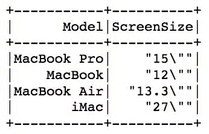

在 SQL 语法中，如下所示:

```py
SELECT Model, ScreenSizeFROM sample_data_schema;
```

# 那个。过滤器(...)转换

与`.select(...)`不同的是，`.filter(...)`变换只选择通过指定条件的行。可以和 SQL 中的`WHERE`语句相比。

请看下面的代码片段:

```py
# extract only machines from 2015 onwards(sample_data_schema.filter(sample_data_schema.Year > 2015).show())
```

它产生以下输出:

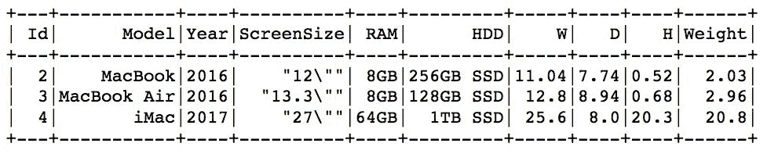

在 SQL 语法中，前面的内容相当于:

```py
SELECT *FROM sample_data_schemaWHERE Year > 2015
```

# 那个。groupBy(...)转换

`.groupBy(...)`转换基于一列(或多列)的值执行数据聚合。在 SQL 语法中，这相当于`GROUP BY`。

请看下面的代码:

```py
(sample_data_schema.groupBy('RAM').count().show())
```

它会产生以下结果:


在 SQL 语法中，这将是:

```py
SELECT RAM, COUNT(*) AS countFROM sample_data_schemaGROUP BY RAM
```

# 那个。orderBy(...)转换

`.orderBy(...)`转换对给定指定列的结果进行排序。一个来自 SQL 世界的等价物也是`ORDER BY`。

请看下面的代码片段:

```py
# sort by width (W)sample_data_schema.orderBy('W').show()
```

它产生以下输出:

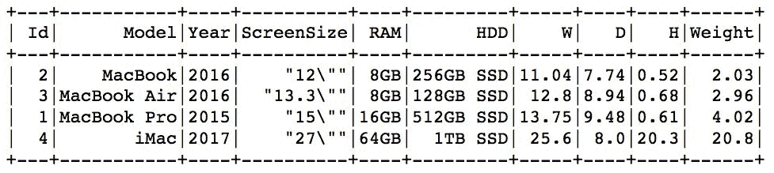

等效的 SQL 应该是:

```py
SELECT *FROM sample_data_schemaORDER BY W
```

您也可以使用一列的`.desc()`开关(即`.col(...)`方法)将排序顺序改为降序。请看下面的片段:

```py
# sort by height (H) in descending ordersample_data_schema.orderBy(f.col('H').desc()).show()
```

它产生以下输出:


用 SQL 语法来说，前面的表达式应该是:

```py
SELECT *FROM sample_data_schemaORDER BY H DESC
```

# 那个。带列(...)转换

`.withColumn(...)`转换将一个函数应用于其他一些列和/或文字(使用`.lit(...)`方法)，并将其存储为新函数。在 SQL 中，这可以是对任何列应用任何转换并使用`AS`指定新列名的任何方法。这种转换扩展了原始数据帧。

请看下面的代码片段:

```py
# split the HDD into size and type(sample_data_schema.withColumn('HDDSplit', f.split(f.col('HDD'), ' ')).show())
```

它产生以下输出:


你可以通过`.select(...)`变换获得同样的结果。以下代码将产生相同的结果:

```py
# do the same as withColumn(sample_data_schema.select(f.col('*'), f.split(f.col('HDD'), ' ').alias('HDD_Array')).show())
```

等效的 SQL 将是:

```py
SELECT *, STRING_SPLIT(HDD, ' ') AS HDD_ArrayFROM sample_data_schema
```

# 那个。加入(...)转换

`.join(...)`转换允许我们连接两个数据帧。第一个参数是我们想要连接的另一个数据框，而第二个参数指定要连接的列，最后一个参数指定连接的性质。可用类型有`inner`、`cross`、`outer`、`full`、`full_outer`、`left`、`left_outer`、`right`、`right_outer`、`left_semi`和`left_anti`。在 SQL 中，相当于`JOIN`语句。

If you're not familiar with the `ANTI` and `SEMI` joins, check out this blog: [https://blog.jooq.org/2015/10/13/semi-join-and-anti-join-should-have-its-own-syntax-in-sql/](https://blog.jooq.org/2015/10/13/semi-join-and-anti-join-should-have-its-own-syntax-in-sql/).

请看下面的代码:

```py
models_df = sc.parallelize([('MacBook Pro', 'Laptop'), ('MacBook', 'Laptop'), ('MacBook Air', 'Laptop'), ('iMac', 'Desktop')]).toDF(['Model', 'FormFactor'])(sample_data_schema.join(models_df, sample_data_schema.Model == models_df.Model, 'left').show())
```

它产生以下输出:


在 SQL 语法中，这将是:

```py
SELECT a.*, b,FormFactorFROM sample_data_schema AS aLEFT JOIN models_df AS bON a.Model == b.Model
```

如果我们有一个不会列出每个`Model`的数据帧(注意缺少`MacBook`，那么下面的代码是:

```py
models_df = sc.parallelize([('MacBook Pro', 'Laptop'), ('MacBook Air', 'Laptop'), ('iMac', 'Desktop')]).toDF(['Model', 'FormFactor'])(sample_data_schema.join(models_df, sample_data_schema.Model == models_df.Model, 'left').show())
```

这将生成一个缺少一些值的表:

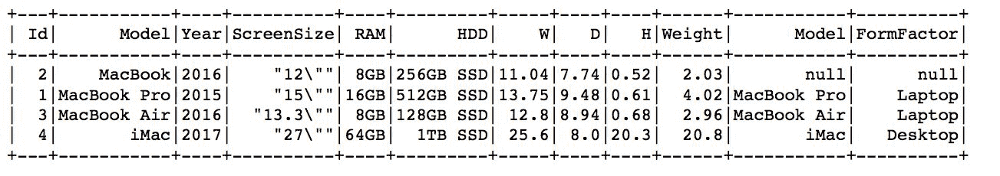

`RIGHT`连接只保留与右侧数据框中的记录相匹配的记录。因此，请看下面的代码:

```py
(sample_data_schema.join(models_df, sample_data_schema.Model == models_df.Model, 'right').show())
```

这将生成如下表:

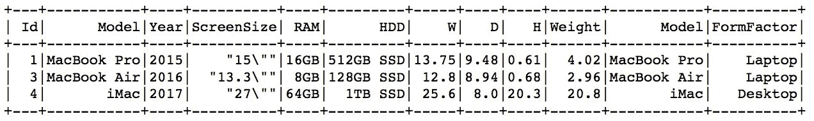

`SEMI`和`ANTI`连接是最近添加的。`SEMI`连接保留左侧数据框中与右侧数据框中的记录相匹配的所有记录(与`RIGHT`连接一样)，但*仅保留左侧数据框中的列*；`ANTI`连接与`SEMI`连接相反——它只保留在正确的数据框中找不到的记录。因此，下面的`SEMI`连接示例是:

```py
(sample_data_schema.join(models_df, sample_data_schema.Model == models_df.Model, 'left_semi').show())
```

这将产生以下结果:

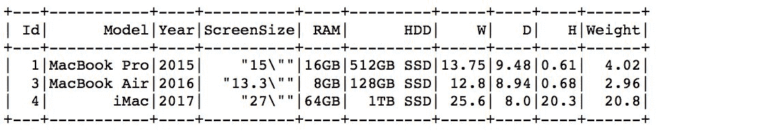

而`ANTI`连接的例子是:

```py
(sample_data_schema.join(models_df, sample_data_schema.Model == models_df.Model, 'left_anti').show())
```

这将生成以下内容:

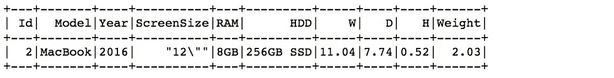

# 那个。unionAll(...)转换

`.unionAll(...)`转换从另一个数据帧追加值。SQL 语法中的一个等价词是`UNION ALL`。

请看下面的代码:

```py
another_macBookPro = sc.parallelize([(5, 'MacBook Pro', 2018, '15"', '16GB', '256GB SSD', 13.75, 9.48, 0.61, 4.02)]).toDF(sample_data_schema.columns)sample_data_schema.unionAll(another_macBookPro).show()
```

它会产生以下结果:


在 SQL 语法中，前面的内容如下:

```py
SELECT *FROM sample_data_schemaUNION ALLSELECT *FROM another_macBookPro
```

# 那个。不同的(...)转换

`.distinct(...)`转换从一列返回不同值的列表。SQL 中的一个等价物是`DISTINCT`。

请看下面的代码:

```py
# select the distinct values from the RAM columnsample_data_schema.select('RAM').distinct().show()
```

它会产生以下结果:

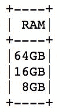

在 SQL 语法中，这将是:

```py
SELECT DISTINCT RAMFROM sample_data_schema
```

# 那个。重新分区(...)转换

`.repartition(...)`转换将集群周围的数据打乱，并将其合并到指定数量的分区中。您还可以指定要用于执行分区的一列或多列。在 SQL 世界中没有直接的等价物。

请看下面的代码:

```py
sample_data_schema_rep = (sample_data_schema.repartition(2, 'Year'))sample_data_schema_rep.rdd.getNumPartitions()
```

它产生了(如预期的)这个结果:

```py
2
```

# 那个。菲尔娜(...)转换

`.fillna(...)`变换填充数据帧中缺失的值。您可以指定一个值，然后用它来填充所有缺少的值，也可以传递一个字典，其中每个键都是列的名称，这些值用来填充相应列中缺少的值。SQL 世界中不存在直接的等价物。

请看下面的代码:

```py
missing_df = sc.parallelize([(None, 36.3, 24.2), (1.6, 32.1, 27.9), (3.2, 38.7, 24.7), (2.8, None, 23.9), (3.9, 34.1, 27.9), (9.2, None, None)]).toDF(['A', 'B', 'C'])missing_df.fillna(21.4).show()
```

它产生以下输出:


我们也可以指定字典，因为`21.4`值并不真正适合`A`列。在下面的代码中，我们首先计算每个列的平均值:

```py
miss_dict = (missing_df.agg(f.mean('A').alias('A'), f.mean('B').alias('B'), f.mean('C').alias('C'))).toPandas().to_dict('records')[0]missing_df.fillna(miss_dict).show()
```

`.toPandas()`方法是一个动作(我们将在下一个食谱中介绍)，它返回熊猫数据帧。熊猫数据框的`.to_dict(...)`方法将其转换为字典，其中`records`参数生成一个常规字典，其中每一列都是键，每一个值都是记录。

上述代码产生以下结果:

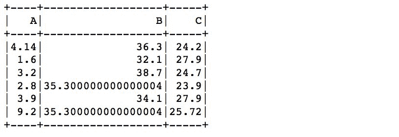

# 那个。dropna(...)转换

`.dropna(...)`转换删除了缺少值的记录。您可以指定阈值，该阈值转换为记录中符合删除条件的最少缺失观察数。就像`.fillna(...)`一样，在 SQL 世界中没有直接的等价物。

请看下面的代码:

```py
missing_df.dropna().show()
```

它会产生以下结果:


指定`thresh=2`:

```py
missing_df.dropna(thresh=2).show()
```

它保留了第一条和第四条记录:

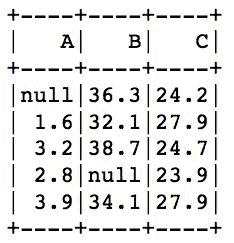

# 那个。dropDuplicates(...)转换

顾名思义，`.dropDuplicates(...)`转换会删除重复的记录。您也可以将子集参数指定为列名列表；该方法将根据在这些列中找到的值删除重复的记录。

请看下面的代码:

```py
dupes_df = sc.parallelize([(1.6, 32.1, 27.9), (3.2, 38.7, 24.7), (3.9, 34.1, 27.9), (3.2, 38.7, 24.7)]).toDF(['A', 'B', 'C'])dupes_df.dropDuplicates().show()
```

它会产生以下结果

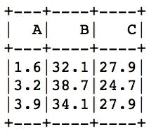

# 那个。summary()和。描述()转换

`.summary()`和`.describe()`转换产生类似的描述性统计数据，`.summary()`转换另外产生四分位数。

请看下面的代码:

```py
sample_data_schema.select('W').summary().show()sample_data_schema.select('W').describe().show()
```

它会产生以下结果:

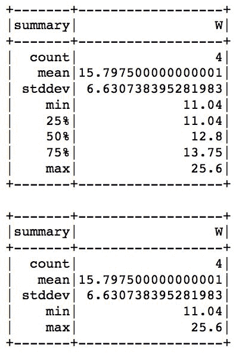

# 那个。freqItems(...)转换

`.freqItems(...)`转换从一列返回一个频繁项目列表。您还可以指定一个`minSupport`参数，该参数将丢弃低于某个阈值的项目。

请看下面的代码:

```py
sample_data_schema.freqItems(['RAM']).show()
```

它会产生以下结果:


# 请参见

*   更多转换请参考 Spark 的文档:[http://Spark . Apache . org/docs/latest/API/python/pyspark . SQL . html # pyspark . SQL . data frame](http://spark.apache.org/docs/latest/api/python/pyspark.sql.html#pyspark.sql.DataFrame)

# 数据框操作概述

上一个配方中列出的转换将一个数据帧转换成另一个。然而，只有在**数据帧**上调用一个动作时，它们才会被执行。

在本食谱中，我们将概述最受欢迎的动作。

# 准备好

要执行这个配方，您需要有一个工作的 Spark 2.3 环境。您应该已经完成了前面的配方，*通过编程指定模式*，因为我们将使用我们在那里创建的`sample_data_schema`数据帧。

没有其他要求。

# 怎么做...

在本节中，我们将列出数据框可用的一些最常见的操作。这个列表的目的不是提供所有可用转换的全面列举，而是给你一些最常见转换背后的直觉。

# 那个。显示(...)行动

默认情况下，`.show(...)`操作以表格形式显示前五行。您可以通过传递整数作为参数来指定要检索的记录数。

请看下面的代码:

```py
sample_data_schema.select('W').describe().show()
```

它会产生以下结果:

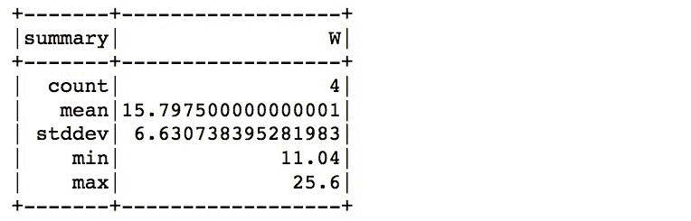

# 那个。收集()操作

`.collect()`动作，顾名思义，收集所有工作节点的所有结果，并将其返回给驱动程序。小心在大数据集上使用此方法，因为如果您试图返回数十亿条记录的整个数据帧，您的驱动程序很可能会崩溃；仅使用此方法返回小的聚合数据。

请看下面的代码:

```py
sample_data_schema.groupBy('Year').count().collect()
```

它会产生以下结果:

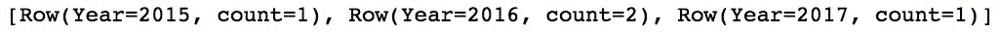

# 那个。采取(...)行动

`.take(...)`操作的工作方式与 RDDs 中相同–它将指定数量的记录返回给驱动程序节点:

```py
Look at the following code:sample_data_schema.take(2)
```

它会产生以下结果:


# 那个。toPandas()操作

顾名思义，`.toPandas()`动作将 Spark 数据帧转换成熊猫数据帧。这里需要发出与`.collect()`动作相同的警告——该`.toPandas()`动作收集所有工人的所有记录，将其返回给驾驶员，然后将结果转换成熊猫数据帧。

由于我们的样本数据很小，我们可以毫无问题地做到这一点:

```py
sample_data_schema.toPandas()
```

结果是这样的:

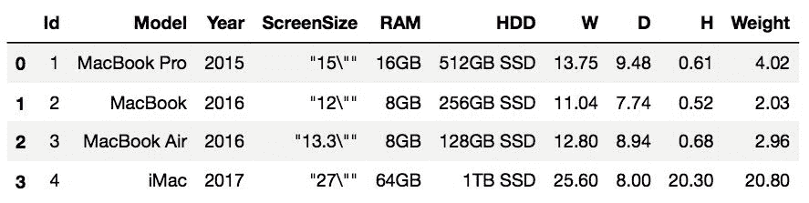

# 请参见

*   更多操作请参考 Spark 的文档:[http://Spark . Apache . org/docs/latest/API/python/pyspark . SQL . html # pyspark . SQL . data frame](http://spark.apache.org/docs/latest/api/python/pyspark.sql.html#pyspark.sql.DataFrame)