# 六、使用最大似然模块的机器学习

在本章中，我们将继续讨论 PySpark 当前支持的机器学习模块——ML 模块。像 MLLib 一样，ML 模块公开了大量的机器学习模型，几乎完全覆盖了最常用(和可用)的模型。然而，ML 模块在 Spark 数据帧上运行，使其性能更高，因为它可以利用钨执行优化。

在本章中，您将了解以下食谱:

*   介绍变压器
*   引入估计量
*   引入管道
*   选择最可预测的功能
*   预测森林覆盖类型
*   估计森林海拔
*   森林覆盖类型聚类
*   调谐超参数
*   从文本中提取特征
*   离散化连续变量
*   标准化连续变量
*   主题挖掘

在本章中，我们将使用从[https://archive.ics.uci.edu/ml/datasets/covertype](https://archive.ics.uci.edu/ml/datasets/covertype)下载的数据。数据集位于本书的 GitHub 存储库中:`/data/forest_coverage_type.csv`。

我们以与之前相同的方式加载数据:

```py
forest_path = '../data/forest_coverage_type.csv'forest = spark.read.csv(forest_path, header=True, inferSchema=True)
```

# 介绍变压器

Spark 1.3 中引入的`Transformer`类通常通过将一列或多列附加到现有的数据框中，将一个数据集转换成另一个数据集。Transformers 是对实际转换特性的方法的抽象；抽象还包括经过训练的机器学习模型(我们将在下面的食谱中看到)。

在这个食谱中，我们将介绍两个变形金刚:`Bucketizer`和`VectorAssembler`。

We will not be introducing all the Transformers; throughout the rest of this chapter, the most useful ones will show up. For the rest, the Spark documentation is a good place to learn what they do and how to use them.

以下是将一种功能转换为另一种功能的所有变形金刚的列表:

*   `Binarizer`是一种方法，在给定阈值的情况下，将连续的数字特征转换为二进制特征。
*   `Bucketizer`与`Binarizer`类似，使用阈值列表将连续的数值变量转换为离散的数值变量(级别与阈值列表的长度加 1 一样多)。
*   `ChiSqSelector`有助于选择预定义数量的特征来解释分类目标(分类模型)的大部分差异。
*   `CountVectorizer`将许多字符串列表转换为计数的`SparseVector`，其中每一列都是列表中每个不同字符串的标志，该值指示该字符串在当前列表中被找到的次数。
*   `DCT`代表**离散余弦变换**。它取一个实值向量，返回一个以不同频率振荡的余弦函数向量。
*   `ElementwiseProduct`可用于缩放您的数字要素，因为它采用一个值向量，并将其乘以另一个向量(顾名思义，逐个元素)，每个值都有权重。
*   `HashingTF`是一个散列技巧转换器，返回标记化文本的向量(指定长度)表示。
*   `IDF`计算记录列表的**反向文档频率**，其中每个记录都是文本正文的数字表示(参见`CountVectorizer`或`HashingTF`)。
*   `IndexToString`使用来自`StringIndexerModel`对象的编码将字符串索引反转为原始值。
*   `MaxAbsScaler`将数据重新缩放至`-1`至`1`范围内。
*   `MinMaxScaler`将数据重新缩放至`0`至`1`范围内。
*   `NGram`返回成对、三元组或*n*-标记化文本的后续单词的数目。
*   `Normalizer`将数据换算为单位定额(默认为`L2`)。
*   `OneHotEncoder`将分类变量编码成向量表示，其中只有一个元素是热的，即等于`1`(所有其他元素都是`0`)。
*   `PCA`是从数据中提取主成分的降维方法。
*   `PolynomialExpansion`返回输入向量的多项式展开。
*   `QuantileDiscretizer`是类似于`Bucketizer`的方法，但是不需要定义阈值，只需要指定返回的箱数；该方法将使用分位数来决定阈值。
*   `RegexTokenizer`是一个字符串标记器，使用正则表达式来处理文本。
*   `RFormula`是通过 R-语法公式来转换数据的方法。
*   `SQLTransformer`是通过 SQL 语法公式来转换数据的方法。
*   `StandardScaler`将数值特征转换为平均值为 0，标准偏差为 1。
*   `StopWordsRemover`用于从标记化文本中删除`a`或`the`等单词。
*   `StringIndexer`给定一列中所有单词的列表，产生一个索引向量。
*   `Tokenizer`是一个默认的标记器，它接受一个句子(一个字符串)，在一个空格上分割它，并将单词规范化。
*   `VectorAssembler`将指定的(单独的)特征组合成单个特征。
*   `VectorIndexer`取一个分类变量(已经编码为数字)并返回一个索引向量。
*   `VectorSlicer`可以被认为是`VectorAssembler`的反义词，因为它从给定索引的特征向量中提取数据。
*   `Word2Vec`将一个句子(或字符串)转换成`{string, vector}`表示的地图。

# 准备好了

要执行这个方法，您需要一个工作的 Spark 环境，并且已经将数据加载到了林数据框中。

不需要其他先决条件。

# 怎么做...

首先，我们来学习一下`.Bucketizer(...)`变压器的使用方法。下面是允许我们将`Horizontal_Distance_To_Hydrology`列转换为 10 个等距桶的片段:

```py
import pyspark.sql.functions as fimport pyspark.ml.feature as featimport numpy as npbuckets_no = 10dist_min_max = (forest.agg(f.min('Horizontal_Distance_To_Hydrology').alias('min'), f.max('Horizontal_Distance_To_Hydrology').alias('max')).rdd.map(lambda row: (row.min, row.max)).collect()[0])rng = dist_min_max[1] - dist_min_max[0]splits = list(np.arange(dist_min_max[0], dist_min_max[1], rng / (buckets_no + 1)))bucketizer = feat.Bucketizer(splits=splits, inputCol= 'Horizontal_Distance_To_Hydrology', outputCol='Horizontal_Distance_To_Hydrology_Bkt')(bucketizer.transform(forest).select('Horizontal_Distance_To_Hydrology','Horizontal_Distance_To_Hydrology_Bkt').show(5))
```

Any ideas why we could not use `.QuantileDiscretizer(...)` to achieve this?

# 它是如何工作的...

像往常一样，我们首先加载我们将始终使用的必要模块`pyspark.sql.functions`，这将允许我们计算`Horizontal_Distance_To_Hydrology`特征的最小值和最大值。`pyspark.ml.feature`展示`.Bucketizer(...)`变压器供我们使用，而 NumPy 将帮助我们创建一个等间距的阈值列表。

我们希望将我们的数值变量分成 10 个桶，因此我们的`buckets_no`等于`10`。接下来，我们计算`Horizontal_Distance_To_Hydrology`特征的最小值和最大值，并将这两个值返回给驾驶员。在驱动程序上，我们创建阈值列表(`splits`列表)；`np.arange(...)`方法的第一个参数是最小值，第二个参数是最大值，第三个参数定义了每个步骤的大小。

现在我们已经定义了拆分列表，我们将其传递给`.Bucketizer(...)`方法。

Each transformer (Estimators work similarly) has a very similar API, but two parameters are always required: `inputCol` and `outputCol`, which define the input and output columns to be consumed and their output, respectively. The two classes—`Transformer` and `Estimator`—also universally implement the `.getOutputCol()` method, which returns the name of the output column. 

最后，我们使用`bucketizer`对象来转换我们的数据帧。以下是我们期望看到的:


# 还有更多...

几乎唯一的是，在 ML 模块中找到的每个估计器(或者换句话说，ML 模型)都希望看到一个*单个*列作为输入；该列应该包含数据科学家希望这种模型使用的所有功能。`.VectorAssembler(...)`方法，顾名思义，将多个特征整理成一列。

考虑以下示例:

```py
vectorAssembler = (feat.VectorAssembler(inputCols=forest.columns, outputCol='feat'))pca = (feat.PCA(k=5, inputCol=vectorAssembler.getOutputCol(), outputCol='pca_feat'))(pca.fit(vectorAssembler.transform(forest)).transform(vectorAssembler.transform(forest)).select('feat','pca_feat').take(1))
```

首先，我们使用`.VectorAssembler(...)`方法整理`forest`数据框中的所有列。

Note that the  `.VectorAssembler(...)` method, unlike other Transformers, has the `inputCols` parameter, not `inputCol`, as it accepts a list of columns, not just a single column.

然后我们使用`PCA(...)`方法中的`feat`列(现在是所有特征的`SparseVector`)来提取前五个最重要的主成分。

Notice how we can now use the `.getOutputCol()` method to get the name of the output column? It should become more apparent why we do this when we introduce pipelines.

前面代码的输出应该如下所示:


# 请参见

*   关于变压器的例子(还有更多)，请查看这篇博文:[https://blog . insightdatascience . com/spark-pipelines-优雅而强大-7be93afcdd42](https://blog.insightdatascience.com/spark-pipelines-elegant-yet-powerful-7be93afcdd42)

# 引入估计量

`Estimator`类和`Transformer`类一样，是在 Spark 1.3 中引入的。顾名思义，估计器估计模型的参数，或者换句话说，使模型与数据相匹配。

在这个食谱中，我们将介绍两个模型:作为分类模型的线性 SVM 和预测森林海拔的线性回归模型。

以下是 ML 模块中可用的所有估计器或机器学习模型的列表:

*   分类:
    *   `LinearSVC`是线性可分问题的 SVM 模型。SVM 核具有形式(超平面)，其中是系数(或超平面的法向量)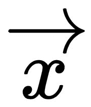是记录， *b* 是偏移量。

    *   `LogisticRegression`为默认值，*转到*线性可分问题的分类模型。它使用 logit 函数来计算记录成为特定类成员的概率。

    *   `DecisionTreeClassifier`是用于分类目的的基于决策树的模型。它构建了一个二叉树，终端节点中类的比例决定了类的成员关系。
    *   `GBTClassifier`是集合模型组的成员。**梯度增强树** ( **GBT** )构建了几个弱模型，当它们组合在一起时，就形成了一个强分类器。该模型也可用于解决回归问题。
    *   `RandomForestClassifier`也是模特合奏团的成员。然而，与 GBT 不同，随机森林生长完全生长的决策树，总误差的减少是通过减少方差来实现的(而 gbt 减少偏差)。就像 GBT 一样，这些模型也可以用来解决回归问题。
    *   `NaiveBayes`使用贝叶斯条件概率理论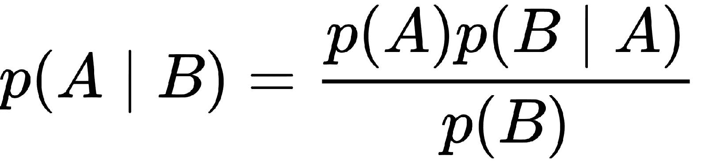，根据证据和关于概率和似然性的先验假设对观测值进行分类。
    *   `MultilayerPerceptronClassifier`来源于人工智能领域，更狭义地说，是人工神经网络。该模型由人工神经元的有向图组成，这些神经元(在某种程度上)模拟了大脑的基本构件。
    *   `OneVsRest`是一种在多项式场景中只选择一个类的约简技术。
*   回归:
    *   `AFTSurvivalRegression`是一个参数模型，预测预期寿命，并假设其中一个特征的边际效应会加速或减速过程故障。
    *   `DecisionTreeClassifier`的对应物`DecisionTreeRegressor`适用于回归问题。
    *   `GBTClassifier`的对应物`GBTRegressor`适用于回归问题。
    *   `GeneralizedLinearRegression`是一族线性模型，允许我们指定不同的内核函数(或链接函数)。与假设误差项正态性的线性回归不同，**广义线性模型** ( **GLM** )允许模型具有误差项的其他分布。
    *   `IsotonicRegression`将自由形式且不递减的线拟合到数据。
    *   `LinearRegression`是回归模型的基准。它通过数据拟合一条直线(或用线性术语定义的平面)。
    *   `RandomForestClassifier`的对应物`RandomForestRegressor`适用于回归问题。
*   聚类:
    *   `BisectingKMeans`是一个模型，从单个集群中的所有观察开始，并迭代地将数据分割成 *k* 集群。
    *   `Kmeans`通过移动聚类边界迭代寻找聚类的质心，将数据分成 *k* (定义的)聚类，从而使数据点和聚类质心之间的所有距离之和最小。
    *   `GaussianMixture`使用 *k* 高斯分布将数据集分解成聚类。
    *   `LDA`:**潜在狄利克雷分配**是主题挖掘中常用的模型。这是一个统计模型，利用一些未观察到的(或未命名的)群体来聚集观察结果。例如，`PLANE_linked`集群可以包含单词，如发动机、襟翼或机翼。

# 准备好了

要执行这个配方，您需要一个工作的 Spark 环境，并且您已经将数据加载到`forest`数据框中。

不需要其他先决条件。

# 怎么做...

首先，让我们学习如何构建 SVM 模型:

```py
import pyspark.ml.classification as clvectorAssembler = feat.VectorAssembler(inputCols=forest.columns[0:-1], outputCol='features')fir_dataset = (vectorAssembler.transform(forest).withColumn('label', (f.col('CoverType') == 1).cast('integer')).select('label', 'features'))svc_obj = cl.LinearSVC(maxIter=10, regParam=0.01)svc_model = svc_obj.fit(fir_dataset)
```

# 它是如何工作的...

`.LinearSVC(...)`方法可从`pyspark.ml.classification`获得，所以我们先加载。

接下来，我们使用`.VectorAssembler(...)`从`forest`数据框中抓取所有列，但是最后一列(T2)将被用作标签。我们将预测等于`1`的森林覆盖类型，即森林是否为云冷杉类型；我们通过检查`CoverType`是否等于`1`并将结果布尔转换为整数来实现这一点。最后，我们只选择`label`和`features`。

接下来，我们创建`LinearSVC`对象。我们将最大迭代次数指定为 10，并将正则化参数(L2 类型或岭型)设置为 1%。

If you are not familiar with regularization in terms of machine learning, check out this website: [http://enhancedatascience.com/2017/07/04/machine-learning-explained-regularization/](http://enhancedatascience.com/2017/07/04/machine-learning-explained-regularization/).

其他参数包括:

*   `featuresCol`:设置为要素列的名称，默认为`features`(和我们的数据集一样)
*   `labelCol`:如果是`label`以外的东西，则设置为标签栏的名称
*   `predictionCol`:如果要重命名为`prediction`以外的名称，则设置为预测列的名称
*   `tol`:这是一个停止参数，用代价函数来定义迭代之间的最小变化:如果变化(默认)小于 10 <sup class="calibre70">-6</sup> ，算法将假设它已经收敛
*   `rawPredictionCol`:这从生成函数返回原始值(在应用阈值之前)；您可以指定不同于`rawPrediction`的名称
*   `fitIntercept`:这指示模型也拟合截距(常数)，而不仅仅是模型系数；默认设置为`True`
*   `standardization`:默认设置为`True`，在拟合模型前对特征进行标准化
*   `threshold`:默认设置为`0.0`；这是一个决定什么被归类为`1`或`0`的参数
*   `weightCol`:如果每个观察值的权重不同，这是一个列名
*   `aggregationDepth`:这是一个用于聚合的树深度参数

最后，我们使用对象`.fit(...)`数据集；对象返回一个`.LinearSVCModel(...)`。一旦模型被估计，我们就可以像这样提取估计模型的系数:`svc_model.coefficients`。我们得到的是:


# 还有更多...

现在，让我们看看线性回归模型在估计森林海拔方面是否能达到合理的精度:

```py
import pyspark.ml.regression as rgvectorAssembler = feat.VectorAssembler(inputCols=forest.columns[1:], outputCol='features')elevation_dataset = (vectorAssembler.transform(forest).withColumn('label', f.col('Elevation').cast('float')).select('label', 'features'))lr_obj = rg.LinearRegression(maxIter=10, regParam=0.01, elasticNetParam=1.00)lr_model = lr_obj.fit(elevation_dataset)
```

前面的代码与前面的代码非常相似。顺便说一下，几乎所有的 ML 模块模型都是如此，因此测试各种模型极其简单。

区别在于`label`栏——现在，我们使用`Elevation`并将其转换为`float`(因为这是一个回归问题)。

类似地，线性回归对象`lr_obj`实例化了`.LinearRegression(...)`对象。

For the full list of parameters to `.LinearRegression(...)`, please refer to the documentation: [http://bit.ly/2J9OvEJ](http://bit.ly/2J9OvEJ).

一旦模型被估计，我们可以通过调用`lr_model.coefficients`来检查它的系数。我们得到的是:


此外，`.LinearRegressionModel(...)`计算返回基本性能统计的汇总:

```py
summary = lr_model.summaryprint(summary.r2, summary.rootMeanSquaredError, summary.meanAbsoluteError)
```

前面的代码将产生以下结果:


令人惊讶的是，线性回归在这个应用中做得很好:78%的 R 平方不是一个坏结果。

# 引入管道

`Pipeline`类有助于排序或简化导致估计模型的独立块的执行；它链接多个转换器和评估器，形成一个顺序执行的工作流。

管道很有用，因为当数据被推过整个数据转换和模型估计过程的不同部分时，它们避免显式创建多个转换的数据集。相反，管道通过自动化工作流中的数据流来抽象不同的中间阶段。这使得代码更加易读和可维护，因为它创建了系统的更高抽象，并且有助于代码调试。

在本食谱中，我们将简化广义线性回归模型的执行。

# 准备好

要执行这个配方，您需要一个工作的 Spark 环境，并且您已经将数据加载到`forest`数据框中。

不需要其他先决条件。

# 怎么做...

以下代码提供了通过 GLM 进行线性回归模型估计的简化版本:

```py
from pyspark.ml import PipelinevectorAssembler = feat.VectorAssembler(inputCols=forest.columns[1:], outputCol='features')lr_obj = rg.GeneralizedLinearRegression(labelCol='Elevation', maxIter=10, regParam=0.01, link='identity', linkPredictionCol="p")pip = Pipeline(stages=[vectorAssembler, lr_obj])(pip.fit(forest).transform(forest).select('Elevation', 'prediction').show(5))
```

# 它是如何工作的...

整个代码比我们在前面示例中使用的代码要短得多，因为我们不需要执行以下操作:

```py
elevation_dataset = (vectorAssembler.transform(forest).withColumn('label', f.col('Elevation').cast('float')).select('label', 'features'))
```

但是，和以前一样，我们指定`vectorAssembler`和`lr_obj`(T2)对象。`.GeneralizedLinearRegression(...)`不仅可以指定车型的系列，还可以指定链接功能。为了决定选择什么样的链接功能和家庭，我们可以看看我们的`Elevation`栏目的分布:

```py
import matplotlib.pyplot as plttransformed_df = forest.select('Elevation')transformed_df.toPandas().hist()plt.savefig('Elevation_histogram.png')plt.close('all')
```

下面是运行上述代码的结果:


分布有点偏斜，但在一定程度上，我们可以假设它遵循正态分布。因此，我们可以使用`family = 'gaussian'`(默认)和`link = 'identity'`。

创建了转换器(`vectorAssembler`)和估计器(`lr_obj`)之后，我们将它们放入管道中。`stages`参数是一个有序的对象列表，用于推送我们的数据；在我们的例子中，`vectorAssembler`首先进行，因为我们需要整理所有的特征，然后我们使用`lr_obj`估计我们的模型。

最后，我们同时使用管道来估计模型。管道的`.fit(...)`方法调用`.transform(...)`方法(如果对象是转换器)，或者调用`.fit(...)`方法(如果对象是估计器)。因此，在`PipelineModel`上调用`.transform(...)`方法会同时调用 Transformer 和 Estimator 对象的`.transform(...)`方法。

最终结果如下:

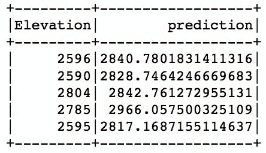

如你所见，结果和实际没有太大的不同。

# 请参见

*   查看这篇博客文章(尽管它是 Scala 特有的)，了解管道的概述:[https://databricks . com/blog/2015/01/07/ml-Pipelines-a-new-high-level-API-for-mllib . html](https://databricks.com/blog/2015/01/07/ml-pipelines-a-new-high-level-api-for-mllib.html)

# 选择最可预测的功能

(几乎)每个数据科学家的口头禅是:建立一个简单的模型，同时尽可能多地解释目标中的差异。换句话说，您可以构建一个包含所有特征的模型，但是该模型可能非常复杂，并且容易过度拟合。此外，如果其中一个变量缺失，整个模型可能会产生错误的输出，并且一些变量可能根本没有必要，因为其他变量已经解释了方差的相同部分(称为*共线性*的术语)。

在本食谱中，我们将学习如何在建立分类或回归模型时选择最佳预测模型。我们将在接下来的食谱中重复使用我们在这个食谱中学到的东西。

# 准备好

要执行这个配方，您需要一个工作的 Spark 环境，并且您已经将数据加载到`forest`数据框中。

不需要其他先决条件。

# 怎么做...

让我们从一个代码开始，该代码将有助于选择具有最大预测能力的前 10 个特征，以便为我们的`forest`数据框中的观察找到最佳类别:

```py
vectorAssembler = feat.VectorAssembler(inputCols=forest.columns[0:-1], outputCol='features')selector = feat.ChiSqSelector(labelCol='CoverType', numTopFeatures=10, outputCol='selected')pipeline_sel = Pipeline(stages=[vectorAssembler, selector])
```

# 它是如何工作的...

首先，我们使用`.VectorAssembler(...)`方法将所有特征组合成一个向量。请注意，我们不使用最后一列，因为它是`CoverType`功能，这是我们的目标。

接下来，我们使用`.ChiSqSelector(...)`方法基于每个变量和目标之间的成对卡方检验来选择最佳特征。根据测试值，选择最可预测的特征`numTopFeatures`。`selected`向量将包含前 10 个(在本例中)最可预测的特征。`labelCol`指定目标列。

You can learn more about the chi-square test here: [http://learntech.uwe.ac.uk/da/Default.aspx?pageid=1440](http://learntech.uwe.ac.uk/da/Default.aspx?pageid=1440).

让我们来看看:

```py
(pipeline_sel.fit(forest).transform(forest).select(selector.getOutputCol()).show(5))
```

下面是运行前面的代码片段应该看到的内容:

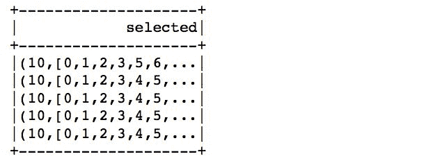

如您所见，结果`SparseVector`的长度为 10，并且仅包括最可预测的特征。

# 还有更多...

我们不能使用`.ChiSqSelector(...)`方法来针对连续的目标(即回归问题)选择特征。选择最佳特征的一种方法是检查每个特征和目标之间的相关性，并选择那些与目标相关性最高但与其他特征相关性很小或没有相关性的特征:

```py
import pyspark.ml.stat as stfeatures_and_label = feat.VectorAssembler(inputCols=forest.columns, outputCol='features')corr = st.Correlation.corr(features_and_label.transform(forest), 'features', 'pearson')print(str(corr.collect()[0][0]))
```

There is no automatic way to do this in Spark, but starting with Spark 2.2, we can now calculate correlations between features in DataFrames.

`.Correlation(...)`方法是`pyspark.ml.stat`模块的一部分，所以我们先导入。

接下来，我们创建`.VectorAssembler(...)`，它整理`forest`数据帧的所有列。我们现在可以使用 Transformer 并将结果数据框传递给`Correlation`类。`Correlation`类的`.corr(...)`方法接受一个数据帧作为它的第一个参数，接受包含所有特征的列的名称作为第二个参数，接受要计算的相关类型作为第三个参数；可用值为`pearson`(默认值)和`spearman`。

Check out this website for more information about the two correlation methods: [http://bit.ly/2xm49s7](http://bit.ly/2xm49s7).

下面是我们期望从运行该方法中看到的结果:


现在我们有了相关矩阵，我们可以用我们的标签提取前 10 个最相关的特征:

```py
num_of_features = 10cols = dict([(i, e) for i, e in enumerate(forest.columns)])corr_matrix = corr.collect()[0][0]label_corr_with_idx = [(i[0], e) for i, e in np.ndenumerate(corr_matrix.toArray()[:,0])][1:]label_corr_with_idx_sorted = sorted(label_corr_with_idx, key=lambda el: -abs(el[1]))features_selected = np.array([cols[el[0]] for el in label_corr_with_idx_sorted])[0:num_of_features]
```

首先，我们指定要提取的特征数量，并创建一个字典，其中包含我们`forest`数据帧中的所有列；注意，我们用索引压缩它，因为相关矩阵不传播特征名，只传播索引。

接下来，我们从`corr_matrix`中提取第一列(因为这是我们的目标，高程特征)；`.toArray()`方法将 DenseMatrix 转换为 NumPy 数组表示。请注意，我们还将索引附加到这个数组的元素上，这样我们就知道哪个元素与我们的目标最相关。

接下来，我们通过查看相关系数的绝对值，按降序对列表进行排序。

最后，我们遍历结果列表的前 10 个(在本例中)元素，并从`cols`字典中选择与所选索引对应的列。

对于我们旨在估计森林海拔的问题，以下是我们得到的特征列表:


# 请参见

*   如果你想了解更多关于特征选择的知识，请查看本文:[http://www.stat.wisc.edu/~loh/treeprogs/guide/lchen.pdf](http://www.stat.wisc.edu/~loh/treeprogs/guide/lchen.pdf)

# 预测森林覆盖类型

在本食谱中，我们将学习如何处理数据，并建立两个分类模型，旨在预测森林覆盖类型:基准逻辑回归模型和随机森林分类器。我们手头上的问题是*多项式*，也就是说，我们有两个以上的类，我们想把我们的观察分为。

# 准备好

要执行这个配方，您需要一个工作的 Spark 环境，并且您已经将数据加载到`forest`数据框中。

不需要其他先决条件。

# 怎么做...

以下代码将帮助我们构建逻辑回归模型:

```py
forest_train, forest_test = (forest.randomSplit([0.7, 0.3], seed=666))vectorAssembler = feat.VectorAssembler(inputCols=forest.columns[0:-1], outputCol='features')selector = feat.ChiSqSelector(labelCol='CoverType', numTopFeatures=10, outputCol='selected')logReg_obj = cl.LogisticRegression(labelCol='CoverType', featuresCol=selector.getOutputCol(), regParam=0.01, elasticNetParam=1.0, family='multinomial')pipeline = Pipeline(stages=[vectorAssembler, selector, logReg_obj])pModel = pipeline.fit(forest_train)
```

# 它是如何工作的...

首先，我们将我们拥有的数据分成两个子集:第一个，`forest_train`，我们将用于训练模型，而`forest_test`将用于测试模型的性能。

接下来，我们构建我们在本章前面已经看到的常见阶段:我们使用`.VectorAssembler(...)`整理所有想要用来构建模型的特征，然后通过`.ChiSqSelector(...)`方法传递它们，以选择前 10 个最具预测性的特征。

作为构建管道之前的最后一步，我们创建`logReg_obj`:我们将用来拟合数据的`.LogisticRegression(...)`对象。我们在这个模型中使用弹性网络类型的正则化:L2 部分在`regParam`参数中定义，L1 部分在`elasticNetParam`中定义。请注意，当我们处理一个多项式分类问题时，我们将模型族指定为`multinomial`。

You can also specify the `family` parameter to be `auto` or `binomial`, if you want the model to self-select, or if you have a binary variable.

最后，我们构建管道，并将三个对象作为阶段列表传递。接下来，我们使用`.fit(...)`方法通过管道推送数据。

现在我们已经估算了模型，我们可以检查它的性能:

```py
import pyspark.ml.evaluation as evresults_logReg = (pModel.transform(forest_test).select('CoverType', 'probability', 'prediction'))evaluator = ev.MulticlassClassificationEvaluator(predictionCol='prediction', labelCol='CoverType')(evaluator.evaluate(results_logReg), evaluator.evaluate(results_logReg, {evaluator.metricName: 'weightedPrecision'}) , evaluator.evaluate(results_logReg, {evaluator.metricName: 'accuracy'}))
```

首先，我们加载`pyspark.ml.evaluation`模块，因为它包含本章剩余部分将使用的所有评估方法。

接下来，我们将`forest_test`推过我们的`pModel`，这样我们就可以得到模型从未见过的数据集的预测。

最后，我们创建`MulticlassClassificationEvaluator(...)`对象，它将计算我们模型的性能指标。`predictionCol`指定包含观察的预测类的列的名称，`labelCol`指定真实标签。

评估者的`.evaluate(...)`方法，如果除了模型的结果没有传递其他参数，将返回 F1-score。如果要检索精度、召回率或准确度，需要分别调用`weightedPrecision`、`weightedRecall`或`accuracy`。

If you are not familiar with classification metrics, they are nicely explained here: [https://turi.com/learn/userguide/evaluation/classification.html](https://turi.com/learn/userguide/evaluation/classification.html).

以下是我们的逻辑回归模型的表现:


几乎 70%的准确率表明它不是一个完全糟糕的模型。

# 还有更多...

让我们看看随机森林模型是否能做得更好:

```py
rf_obj = cl.RandomForestClassifier(labelCol='CoverType', featuresCol=selector.getOutputCol(), minInstancesPerNode=10, numTrees=10)pipeline = Pipeline(stages=[vectorAssembler, selector, rf_obj])pModel = pipeline.fit(forest_train)
```

从前面的代码中可以看出，我们将重用已经为逻辑回归模型创建的大多数对象；我们在这里介绍的只是`.RandomForestClassifier(...)`，我们可以重用`vectorAssembler`和`selector`对象。这是使用管道是多么简单的一个例子。

`.RandomForestClassifier(...)`对象将为我们构建随机森林模型。在这个例子中，我们只指定了四个参数，其中大部分您很可能都很熟悉，比如`labelCol`和`featuresCol`。`minInstancesPerNode`指定仍然允许将节点拆分为两个子节点的最小记录数，而`numTrees`指定森林中要估计的树数。其他值得注意的参数包括:

*   `impurity`:这指定了用于信息增益的标准。默认设置为`gini`，但也可以是`entropy`。
*   `maxDepth`:指定任意一棵树的最大深度。
*   `maxBins`:这指定了任何树中的最大箱数。
*   `minInfoGain`:这指定了迭代之间的最小信息增益水平。

For a full specification of the class, see [http://bit.ly/2sgQAFa](http://bit.ly/2sgQAFa).

评估完模型后，让我们看看它的表现如何，这样我们就可以将其与逻辑回归模型进行比较:

```py
results_rf = (pModel.transform(forest_test).select('CoverType', 'probability', 'prediction'))(evaluator.evaluate(results_rf), evaluator.evaluate(results_rf, {evaluator.metricName: 'weightedPrecision'}), evaluator.evaluate(results_rf, {evaluator.metricName: 'accuracy'}))
```

前面的代码应该产生类似于下面的结果:

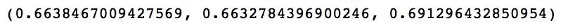

结果完全相同，这表明这两个模型表现同样出色，我们可能希望在选择器阶段增加所选功能的数量，以潜在地获得更好的结果。

# 估计森林海拔

在这个食谱中，我们将建立两个预测森林海拔的回归模型:随机森林回归模型和梯度增强树木回归器。

# 准备好

要执行这个配方，您需要一个工作的 Spark 环境，并且您已经将数据加载到`forest`数据框中。

不需要其他先决条件。

# 怎么做...

在本食谱中，我们将只构建一个具有`.VectorAssembler(...)`和`.RandomForestRegressor(...)`阶段的两阶段管道。我们将跳过特征选择阶段，因为它目前不是一个自动化的过程。

You can do this manually. Just check the *Selecting the most predictable features* recipe earlier from in this chapter.

下面是完整的代码:

```py
vectorAssembler = feat.VectorAssembler(inputCols=forest.columns[1:], outputCol='features')rf_obj = rg.RandomForestRegressor(labelCol='Elevation', maxDepth=10, minInstancesPerNode=10, minInfoGain=0.1, numTrees=10)pip = Pipeline(stages=[vectorAssembler, rf_obj])
```

# 它是如何工作的...

首先，像往常一样，我们使用`.VectorAssembler(...)`方法整理我们想要在模型中使用的所有特征。请注意，我们只使用从第二列开始的列，因为第一列是我们的目标-高程要素。

接下来，我们指定`.RandomForestRegressor(...)`对象。该对象使用与`.RandomForestClassifier(...)`几乎相同的参数列表。

See the previous recipe for a list of other notable parameters.

最后一步是构建管道对象；`pip`只有两个阶段:`vectorAssembler`和`rf_obj`。

接下来，让我们看看我们的模型与我们在*介绍估计量* 配方中估计的线性回归模型相比表现如何:

```py
results = (pip.fit(forest).transform(forest).select('Elevation', 'prediction'))evaluator = ev.RegressionEvaluator(labelCol='Elevation')evaluator.evaluate(results, {evaluator.metricName: 'r2'})
```

`.RegressionEvaluator(...)`计算回归模型的性能指标。默认情况下，它返回`rmse`，均方根误差，但它也可以返回:

*   `mse`:这是均方差
*   `r2`:这是*R<sup class="calibre70">2</sup>T4【公制】*
*   `mae`:这是平均绝对误差

从前面的代码中，我们得到:


这比我们之前建立的线性回归模型要好，这意味着我们的模型可能不像我们最初认为的那样是线性可分的。

Check out this website for more information about the different types of regression metrics: [http://bit.ly/2sgpONr](http://bit.ly/2sgpONr).

# 还有更多...

让我们看看梯度增强的树模型是否能胜过前面的结果:

```py
gbt_obj = rg.GBTRegressor(labelCol='Elevation', minInstancesPerNode=10, minInfoGain=0.1)pip = Pipeline(stages=[vectorAssembler, gbt_obj])
```

与随机森林回归器相比，唯一的变化是我们现在使用`.GBTRegressor(...)`类将梯度增强的树模型拟合到我们的数据中。该类最值得注意的参数包括:

*   `maxDepth`:指定已建树木的最大深度，默认设置为`5`
*   `maxBins`:这指定了最大箱数
*   `minInfoGain`:这指定了迭代之间的最小信息增益水平
*   `minInstancesPerNode`:这指定了树仍将执行拆分的最小实例数
*   `lossType`:指定损失类型，接受`squared`或`absolute`值
*   `impurity`:默认设置为`variance`，目前(在 Spark 2.3 中)是唯一允许的选项
*   `maxIter`:指定最大迭代次数——算法的停止标准

现在让我们检查一下性能:

```py
results = (pip.fit(forest).transform(forest).select('Elevation', 'prediction'))evaluator = ev.RegressionEvaluator(labelCol='Elevation')evaluator.evaluate(results, {evaluator.metricName: 'r2'})
```

这是我们得到的:


正如你所看到的，相对于随机森林回归器，我们仍然有(即使是非常轻微的)改进。

# 森林覆盖类型聚类

聚类是一个无监督的方法家族，它试图在数据中寻找模式，而不知道一个类可能是什么。换句话说，聚类方法找到记录之间的共性，并根据它们彼此之间的相似程度以及它们与其他聚类中发现的不同程度，将它们分组到聚类中。

在这个食谱中，我们将建立它们中最基本的模型——k-means。

# 准备好了

要执行这个配方，您需要一个工作的 Spark 环境，并且您已经将数据加载到`forest`数据框中。

不需要其他先决条件。

# 怎么做...

在 Spark 中构建聚类模型的过程不会明显偏离我们在分类或回归示例中已经看到的内容:

```py
import pyspark.ml.clustering as clustvectorAssembler = feat.VectorAssembler(inputCols=forest.columns[:-1], outputCol='features')kmeans_obj = clust.KMeans(k=7, seed=666)pip = Pipeline(stages=[vectorAssembler, kmeans_obj])
```

# 它是如何工作的...

我们一如既往地从导入相关模块开始；在这种情况下，就是`pyspark.ml.clustering`模块。

接下来，我们将使用众所周知的`.VectorAssembler(...)` Transformer 将所有用于构建模型的特征整理在一起。

接下来是实例化`.KMeans(...)`对象。我们只指定了两个参数，但最值得注意的参数列表如下:

*   `k`:指定期望的聚类数，是构建 k 均值模型唯一需要的参数
*   `initMode`:指定簇形心的初始化类型；`k-means||`使用 k 均值的平行变体，或`random`选择随机质心点
*   `initSteps`:指定初始化步骤
*   `maxIter`:这指定了算法停止的最大迭代次数，即使它没有实现收敛

最后，我们只用两个阶段来构建管道。

一旦计算出结果，我们就可以看看我们得到了什么。我们的目的是观察在森林覆盖类型中是否发现任何潜在的模式:

```py
results = (pip.fit(forest).transform(forest).select('features', 'CoverType', 'prediction'))results.show(5)
```

下面是我们通过运行前面的代码得到的结果:

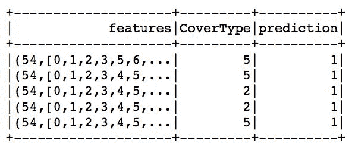

正如你所看到的，似乎没有多少模式可以区分森林覆盖类型。但是，让我们看看我们的细分是否表现不佳，这就是为什么我们没有找到任何模式，或者我们是否找到了与`CoverType`不完全一致的模式:

```py
clustering_ev = ev.ClusteringEvaluator()clustering_ev.evaluate(results)
```

`.ClusteringEvaluator(...)`是自 Spark 2.3 以来推出的新评估工具，目前仍处于试验阶段。它计算聚类结果的轮廓度量。

To learn more about the silhouette metrics, check out [http://scikit-learn.org/stable/modules/generated/sklearn.metrics.silhouette_score.html](http://scikit-learn.org/stable/modules/generated/sklearn.metrics.silhouette_score.html).

以下是我们的 k-means 模型:


如您所见，我们得到了一个不错的模型，因为 0.5 或更高的任何值都表示分离良好的集群。

# 请参见

*   查看[http://scikit-learn.org/stable/modules/clustering.html](http://scikit-learn.org/stable/modules/clustering.html)了解聚类模型的全面概述。请注意，其中许多在 Spark 中不可用。

# 调谐超参数

本章中已经提到的许多模型都有多个参数来决定模型的性能。选择一些是相对简单的，但有很多我们根本无法直观设定。这就是超参数调整发挥作用的地方。超参数调整方法帮助我们选择最佳(或接近)参数集，最大化我们定义的某些度量。

在本食谱中，我们将向您展示两种超参数调整方法。

# 准备好了

要执行这个配方，您需要一个工作的 Spark 环境，并且您已经将数据加载到`forest`数据框中。你也应该已经看完了前面所有的食谱，因为我们假设你对变形金刚、估值器、管道和一些回归模型有一定的了解。

不需要其他先决条件。

# 怎么做...

我们从网格搜索开始。这是一种蛮力方法，只需遍历特定的参数值，构建新模型，并在给定一些客观评估器的情况下比较它们的性能:

```py
import pyspark.ml.tuning as tunevectorAssembler = feat.VectorAssembler(inputCols=forest.columns[0:-1], outputCol='features')selector = feat.ChiSqSelector(labelCol='CoverType', numTopFeatures=5, outputCol='selected')logReg_obj = cl.LogisticRegression(labelCol='CoverType', featuresCol=selector.getOutputCol(), family='multinomial')logReg_grid = (tune.ParamGridBuilder().addGrid(logReg_obj.regParam, [0.01, 0.1]).addGrid(logReg_obj.elasticNetParam, [1.0, 0.5]).build())logReg_ev = ev.MulticlassClassificationEvaluator(predictionCol='prediction', labelCol='CoverType')cross_v = tune.CrossValidator(estimator=logReg_obj, estimatorParamMaps=logReg_grid, evaluator=logReg_ev)pipeline = Pipeline(stages=[vectorAssembler, selector])data_trans = pipeline.fit(forest_train)logReg_modelTest = cross_v.fit(data_trans.transform(forest_train))
```

# 它是如何工作的...

这里发生了很多事情，所以让我们一步一步打开它。

我们已经知道`.VectorAssembler(...)`、`.ChiSqSelector(...)`和`.LogisticRegression(...)`类，所以我们不会在这里重复自己。

Check out previous recipes if you are not familiar with the preceding concepts.

这个食谱的核心从`logReg_grid`对象开始。这是`.ParamGridBuilder()`类，它允许我们向算法将循环通过的网格中添加元素，并使用所有参数和指定值的所有组合来估计模型。

A word of caution: the more parameters you include and the more levels you specify, the more models you will have to estimate. The number of models grows exponentially in both the number of parameters and in the number of levels you specify for these parameters. Beware!

在这个例子中，我们循环通过两个参数:`regParam`和`elasticNetParam`。对于每个参数，我们指定两个级别，因此我们需要构建四个模型。

作为评价者，我们再次使用`.MulticlassClassificationEvaluator(...)`。

接下来，我们指定`.CrossValidator(...)`对象，它将所有这些东西绑定在一起:我们的`estimator`将是`logReg_obj`，`estimatorParamMaps`将等于建造的`logReg_grid`，`evaluator`将是`logReg_ev`。

`.CrossValidator(...)`对象将训练数据分割成一组折叠(默认为`3`)，这些折叠用作单独的训练和测试数据集来拟合模型。因此，我们不仅需要基于我们想要遍历的参数网格拟合四个模型，而且对于这四个模型中的每一个，我们用不同的训练和验证数据集构建三个模型。

请注意，我们首先构建纯粹的数据转换管道，也就是说，它只将特征整理成完整的特征向量，然后选择预测能力最强的前五个特征；现阶段我们不适合`logReg_obj`。

当我们使用`cross_v`对象拟合变换后的数据时，模型拟合开始。只有到那时，Spark 才会评估四个不同的模型，并选择表现最好的一个。

现在已经估算了模型并选择了表现最好的模型，让我们看看所选模型是否比我们在*预测森林覆盖类型*配方中估算的模型表现更好:

```py
data_trans_test = data_trans.transform(forest_test)results = logReg_modelTest.transform(data_trans_test)print(logReg_ev.evaluate(results, {logReg_ev.metricName: 'weightedPrecision'}))print(logReg_ev.evaluate(results, {logReg_ev.metricName: 'weightedRecall'}))print(logReg_ev.evaluate(results, {logReg_ev.metricName: 'accuracy'}))
```

在前面代码的帮助下，我们得到了以下结果:


如您所见，我们的表现比之前的模型稍差，但这很可能是因为我们仅用选择器选择了前 5 个(之前是 10 个)特性。

# 还有更多...

另一种旨在找到最佳表现模型的方法叫做**训练验证分割**。该方法将训练数据分成两个更小的子集:一个用于训练模型，另一个用于验证模型是否过度拟合。拆分只执行一次，因此与交叉验证相比，它的成本更低:

```py
train_v = tune.TrainValidationSplit(estimator=logReg_obj, estimatorParamMaps=logReg_grid, evaluator=logReg_ev, parallelism=4)logReg_modelTrainV = (train_v.fit(data_trans.transform(forest_train))results = logReg_modelTrainV.transform(data_trans_test)print(logReg_ev.evaluate(results, {logReg_ev.metricName: 'weightedPrecision'}))print(logReg_ev.evaluate(results, {logReg_ev.metricName: 'weightedRecall'}))print(logReg_ev.evaluate(results, {logReg_ev.metricName: 'accuracy'}))
```

前面的代码和我们用`.CrossValidator(...)`看到的没有太大区别。我们为`.TrainValidationSplit(...)`方法指定的唯一附加参数是并行度，当您选择最佳模型时，它控制了多少线程被加速。

使用`.TrainValidationSplit(...)`方法产生与`.CrossValidator(...)`方法相同的结果:

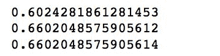

# 从文本中提取特征

通常，数据科学家需要处理非结构化数据，如自由流动的文本:公司从客户那里收到反馈或建议(除其他外)，这可能是预测客户下一步行动或他们对品牌的看法的金矿。

在这个食谱中，我们将学习如何从文本中提取特征。

# 准备好

要执行这个食谱，你需要一个工作的 Spark 环境。

不需要其他先决条件。

# 怎么做...

旨在从文本中提取数据并将其转换为机器学习模型可以使用的东西的一般过程从自由流动的文本开始。第一步是获取文本的每个句子，并将其拆分到空格字符上(最常见)。接下来，删除所有停止字。最后，简单地计算文本中不同的单词或使用散列技巧将我们带入自由流动文本的数字表示领域。

以下是如何通过 Spark 的 ML 模块实现这一点:

```py
some_text = spark.createDataFrame([['''Apache Spark achieves high performance for both batchand streaming data, using a state-of-the-art DAG scheduler, a query optimizer, and a physical execution engine.'''], ['''Apache Spark is a fast and general-purpose cluster computing system. It provides high-level APIs in Java, Scala, Python and R, and an optimized engine that supports general execution graphs. It also supports a rich set of higher-level tools including Spark SQL for SQL and structured data processing, MLlib for machine learning, GraphX for graph processing, and Spark Streaming.'''], ['''Machine learning is a field of computer science that often uses statistical techniques to give computers the ability to "learn" (i.e., progressively improve performance on a specific task) with data, without being explicitly programmed.''']], ['text'])splitter = feat.RegexTokenizer(inputCol='text', outputCol='text_split', pattern='\s+|[,.\"]')sw_remover = feat.StopWordsRemover(inputCol=splitter.getOutputCol(), outputCol='no_stopWords')hasher = feat.HashingTF(inputCol=sw_remover.getOutputCol(), outputCol='hashed', numFeatures=20)idf = feat.IDF(inputCol=hasher.getOutputCol(), outputCol='features')pipeline = Pipeline(stages=[splitter, sw_remover, hasher, idf])pipelineModel = pipeline.fit(some_text)
```

# 它是如何工作的...

如前所述，我们从一些文本开始。在我们的例子中，我们使用了一些来自 Spark 文档的摘录。

`.RegexTokenizer(...)`是使用正则表达式拆分句子的文本标记器。在我们的例子中，我们将句子分割在最少一个(或多个)空间上——这就是`\s+`表达式。然而，我们的模式也在逗号、句号或引号上分开——这就是`[,.\"]`部分。管道`|`表示在空格或标点符号上分开。通过`.RegexTokenizer(...)`后的文字如下:

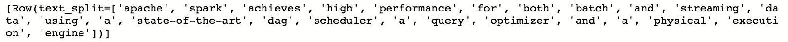

接下来，我们使用`.StopWordsRemover(...)`方法删除停止词，顾名思义。

Check out NLTK's list of the most common stop words: [https://gist.github.com/sebleier/554280](https://gist.github.com/sebleier/554280).

`.StopWordsRemover(...)`简单地扫描标记化的文本，并丢弃它遇到的任何停止词。删除停止词后，我们的文本将如下所示:

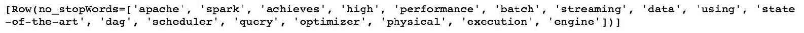

如你所见，剩下的是句子的一个本质意义；一个人可以读懂这些单词，并在一定程度上理解它。

哈希技巧(或特征哈希)是一种将任意特征列表转换为矢量形式的索引的方法。这是一种节省空间的文本标记方式，同时将文本转换为数字表示。哈希技巧使用哈希函数将一种表示形式转换为另一种表示形式。散列函数本质上是将一种表示转换成另一种表示的任何映射函数。通常，它是有损的单向映射(或转换)；不同的输入可以被散列成相同的散列(一个叫做**冲突**的术语)，一旦被散列，几乎总是难以重构输入。`.HashingTF(...)`方法从`sq_remover`对象获取输入列，并将标记化的文本转换(或编码)为 20 个特征的向量。以下是我们的文本经过哈希处理后的样子:

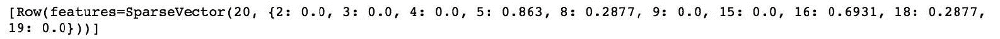

现在我们已经对这些特征进行了散列，我们可以潜在地使用这些特征来训练机器学习模型。然而，简单地计算单词的出现可能会导致误导性的结论。更好的衡量标准是**术语频率-逆文档频率** ( **TF-IDF** )。这是一种度量，它计算一个单词在整个语料库中出现的次数，然后计算单词在句子中的数量与其在整个语料库中的数量的比例。这个度量有助于评估一个单词对于整个文档集合中的一个文档有多重要。在 Spark 中，我们使用`.IDF(...)`方法，它为我们做到了这一点。

以下是我们的文本通过整个管道后的样子:


因此，实际上，我们已经将 Spark 文档中的段落编码成一个包含 20 个元素的向量，我们现在可以用它来训练一个机器学习模型。

# 还有更多...

将文本编码成数字形式的另一种方法是使用 Word2Vec 算法。该算法计算单词的分布式表示，其优点是相似的单词在向量空间中被紧密地放置在一起。

Check out this tutorial to learn more about Word2Vec and the skip-gram model: [http://mccormickml.com/2016/04/19/word2vec-tutorial-the-skip-gram-model/](http://mccormickml.com/2016/04/19/word2vec-tutorial-the-skip-gram-model/).

我们在 Spark 中是这样做的:

```py
w2v = feat.Word2Vec(vectorSize=5, minCount=2, inputCol=sw_remover.getOutputCol(), outputCol='vector')
```

我们将从`.Word2Vec(...)`方法得到一个五行向量。此外，只有在语料库中出现至少两次的单词才会被用于创建单词嵌入。以下是结果向量的样子:


# 请参见

*   要了解更多关于文本特征工程的信息，请查看帕克特的这个位置:[http://bit.ly/2IZ7ZZA](http://bit.ly/2IZ7ZZA)

# 离散化连续变量

有时候，连续变量的离散表示实际上是有用的。

在本食谱中，我们将学习如何用傅立叶级数中的一个例子来离散一个数值特征。

# 准备好

要执行这个食谱，你需要一个工作的 Spark 环境。

不需要其他先决条件。

# 怎么做...

在本食谱中，我们将使用位于`data`文件夹中的小数据集，即`fourier_signal.csv`:

```py
signal_df = spark.read.csv('../data/fourier_signal.csv', header=True, inferSchema=True)steps = feat.QuantileDiscretizer(numBuckets=10,inputCol='signal',outputCol='discretized')transformed = (steps.fit(signal_df).transform(signal_df))
```

# 它是如何工作的...

首先，我们将数据读入`signal_df`。`fourier_signal.csv`包含一个名为`signal`的单列。

接下来，我们使用`.QuantileDiscretizer(...)`方法将信号离散成 10 个桶。基于分位数选择面元范围，也就是说，每个面元将具有相同数量的观测值。

下面是原始信号的样子(黑线)，以及它的离散化表示的样子:


# 标准化连续变量

使用具有显著不同范围和分辨率的特征(如年龄和工资)构建机器学习模型不仅会带来计算问题，还会带来模型收敛和系数可解释性问题。

在这个食谱中，我们将学习如何标准化连续变量，使它们的平均值为 0，标准差为 1。

# 准备好

要执行这个食谱，你需要一个工作的 Spark 环境。你还必须执行之前的食谱。

不需要其他先决条件。

# 怎么做...

为了标准化我们在前面的配方中介绍的`signal`栏，我们将使用`.StandardScaler(...)`方法:

```py
vec = feat.VectorAssembler(inputCols=['signal'], outputCol='signal_vec')norm = feat.StandardScaler(inputCol=vec.getOutputCol(), outputCol='signal_norm', withMean=True, withStd=True)norm_pipeline = Pipeline(stages=[vec, norm])signal_norm = (norm_pipeline.fit(signal_df).transform(signal_df))
```

# 它是如何工作的...

首先，我们需要将单个特征转换为矢量表示，因为`.StandardScaler(...)`方法只接受矢量化的特征。

接下来，我们实例化`.StandardScaler(...)`对象。`withMean`参数指示用平均值对数据进行中心化的方法，而`withStd`参数缩放至等于 1 的标准偏差。

这是我们信号的标准化表示。请注意两条线的不同比例:


# 主题挖掘

有时，有必要根据文本文档的内容将文本文档聚类到桶中。

在这个食谱中，我们将通过一个例子，将一个主题分配给从维基百科中提取的一组短段落。

# 准备好

要执行这个食谱，你需要一个工作的 Spark 环境。

不需要其他先决条件。

# 怎么做...

为了对文档进行聚类，我们首先需要从文章中提取特征。请注意，出于空间方面的考虑，以下文本被缩写了—请参考 GitHub 存储库以获得完整的代码:

```py
articles = spark.createDataFrame([('''The Andromeda Galaxy, named after the mythological Princess Andromeda, also known as Messier 31, M31, or NGC 224, is a spiral galaxy approximately 780 kiloparsecs (2.5 million light-years) from Earth, and the nearest major galaxy to the Milky Way. Its name stems from the area of the sky in which it appears, the constellation of Andromeda. The 2006 observations by the Spitzer Space Telescope revealed that the Andromeda Galaxy contains approximately one trillion stars, more than twice the number of the Milky Way’s estimated 200-400 billion stars. The Andromeda Galaxy, spanning approximately 220,000 light years, is the largest galaxy in our Local Group, which is also home to the Triangulum Galaxy and other minor galaxies. The Andromeda Galaxy's mass is estimated to be around 1.76 times that of the Milky Way Galaxy (~0.8-1.5×1012 solar masses vs the Milky Way's 8.5×1011 solar masses).''','Galaxy', 'Andromeda')(...) , ('''Washington, officially the State of Washington, is a state in the Pacific Northwest region of the United States. Named after George Washington, the first president of the United States, the state was made out of the western part of the Washington Territory, which was ceded by Britain in 1846 in accordance with the Oregon Treaty in the settlement of the Oregon boundary dispute. It was admitted to the Union as the 42nd state in 1889\. Olympia is the state capital. Washington is sometimes referred to as Washington State, to distinguish it from Washington, D.C., the capital of the United States, which is often shortened to Washington.''','Geography', 'Washington State') ], ['articles', 'Topic', 'Object'])splitter = feat.RegexTokenizer(inputCol='articles', outputCol='articles_split', pattern='\s+|[,.\"]')sw_remover = feat.StopWordsRemover(inputCol=splitter.getOutputCol(), outputCol='no_stopWords')count_vec = feat.CountVectorizer(inputCol=sw_remover.getOutputCol(), outputCol='vector')lda_clusters = clust.LDA(k=3, optimizer='online', featuresCol=count_vec.getOutputCol())topic_pipeline = Pipeline(stages=[splitter, sw_remover, count_vec, lda_clusters])
```

# 它是如何工作的...

首先，我们用我们的文章创建一个数据框架。

接下来，我们将经历与从文本中提取特征的**配方中几乎相同的步骤:**

 **1.  我们用`.RegexTokenizer(...)`分割句子
2.  我们使用`.StopWordsRemover(...)`删除停止字
3.  我们使用`.CountVectorizer(...)`来计算每个单词的出现次数

为了找到数据中的聚类，我们将使用**潜在狄利克雷分配** ( **LDA** )模型。在我们的例子中，我们知道我们期望有三个集群，但是如果您不知道您可能有多少集群，您可以使用我们在本章前面的*调整超参数*配方中介绍的技术之一。

最后，为了方便起见，我们将所有内容都放在管道中。

一旦模型被评估，让我们看看它的表现。这里有一段代码可以帮助我们做到这一点；请注意 NumPy 的`.argmax(...)`方法，它可以帮助我们找到最高值的索引:

```py
for topic in ( topic_pipeline.fit(articles).transform(articles).select('Topic','Object','topicDistribution').take(10)):print(topic.Topic, topic.Object, np.argmax(topic.topicDistribution), topic.topicDistribution)
```

以下是我们得到的信息:

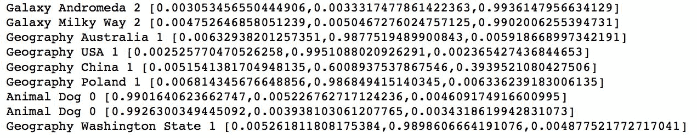

如你所见，经过适当的处理，我们可以从文章中适当地提取主题；关于星系的文章被归入第 2 类，地理在第 1 类，动物在第 0 类。**