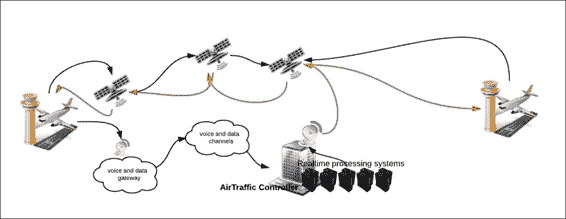
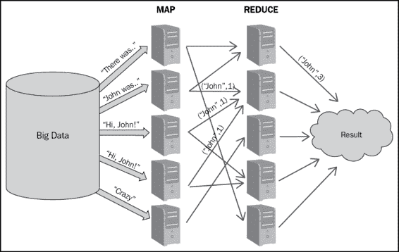
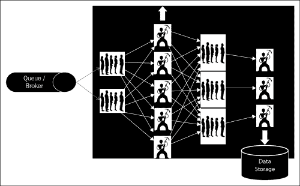

# 一、让我们了解 Storm

在本章中，您将了解需要分布式计算解决方案的问题，并了解创建和管理这样的解决方案有多复杂。我们将研究可用于解决分布式计算的选项。

本章将涉及以下主题:

*   熟悉一些需要分布式计算解决方案的问题
*   现有解决方案的复杂性
*   提供实时分布式计算的技术
*   Storm 各个组成部分的高级视图
*   快速浏览 Storm 的内部

到本章结束时，您将能够了解 Apache Storm 的实时场景和应用。您应该了解市场上可用的解决方案，以及为什么 Storm 仍然是最佳开源选择的原因。

# 分布式计算问题

让我们深入探讨并确定一些需要分布式解决方案的问题。在我们今天生活的世界里，我们非常适应现在的力量，这就是产生分布式实时计算需求的范例。银行、医疗保健、汽车制造等行业是实时计算可以优化或增强解决方案的枢纽。

## 用于信用卡或借记卡欺诈检测的实时业务解决方案

让我们熟悉下图描述的问题；当我们使用塑料货币进行任何交易并刷我们的借记卡或信用卡进行支付时，银行必须验证或拒绝交易的持续时间不到 5 秒。在不到五秒钟的时间内，数据或交易细节必须加密，通过安全网络从服务后台银行传输到开证行，然后在开证行必须计算交易接受或拒绝的整个模糊逻辑，结果必须通过安全网络传输回来:

实时信用卡欺诈检测

网络延迟和延迟等挑战可以在一定程度上得到优化，但要在不到 5 秒的时间内实现前面的特色事务，必须设计一个能够在 1 到 2 秒内搅动大量数据并生成结果的应用程序。

## 飞机通信寻址和报告系统

**飞机通信寻址和报告**系统( **ACAR** )展示了另一个典型的用例，如果没有一个可靠的实时处理系统，这个用例是无法实现的。这些飞机通信系统使用**卫星通信** ( **卫星通信**，如下图所示，它们实时收集飞行各阶段的语音和数据包数据，并能够实时对数据进行分析和警报。

让我们从上例中的图中取个例子。航班在途中遇到一些真正危险的天气，比如电 Storm，然后这些信息通过卫星链路和语音或数据网关发送到空中控制器，空中控制器实时检测并发出警报，提醒所有其他经过该地区的航班偏离航线。

## 医疗保健

在这里，让我们给你介绍另一个关于医疗保健的问题。

这是另一个非常重要的领域，在这个领域中，对大量和速度数据的实时分析为医疗保健专业人员提供了实时准确的信息，以采取明智的救生行动。

上图描述了医生可以采取知情行动来处理患者医疗情况的用例。数据来自历史患者数据库、药物数据库和患者记录。一旦收集到数据，就会对其进行处理，并根据相同的整理数据绘制患者的实时统计数据和关键参数。这些数据可用于进一步生成报告和警报，以帮助医疗保健专业人员。

## 其他应用

还有许多其他应用，实时计算的能力可以优化或帮助人们做出明智的决定。它已成为以下行业的巨大工具和辅助工具:

*   **制造**:实时缺陷检测机制可以帮助优化生产成本。一般来说，在制造环节，质量控制是在生产后进行的，由于货物中的一个类似缺陷，整个批次都被拒收。
*   **交通运输行业**:基于实时交通和天气数据，交通运输公司可以优化贸易路线，节省时间和金钱。
*   **网络优化**:基于实时网络使用提醒，公司可以针对高峰和非高峰时段设计自动升级和自动降级系统。

# 复杂分布式用例的解决方案

现在，我们已经了解了实时解决方案可以进入各种行业垂直领域的力量，让我们探索并找出我们有哪些选项来处理以非常快的速度生成的大量数据。

## Hadoop 解决方案

Hadoop 解决方案是解决需要处理海量数据的问题的解决方案之一。它通过在集群设置中执行作业来工作。

MapReduce 是一种编程范式，我们通过使用映射器函数来处理大型数据集，该函数处理键和值对，从而以键-值对的形式再次生成中间输出。然后，reduce 函数对映射器输出进行操作，合并与同一中间键相关联的值，并生成一个结果。

在上图中，我们演示了简单字数统计 MapReduce 作业，其中使用 MapReduce 演示了简单字数统计作业，其中:

*   有一个巨大的大数据存储，可以达到兆字节或千兆字节。
*   输入数据集或文件被分割成配置大小的数据块，每个数据块被复制到 Hadoop 群集中的多个节点上，具体取决于复制因子。
*   每个映射器作业都会计算分配给它的数据块的字数。
*   映射器完成后，单词(实际上是键)及其计数将存储在映射器节点上的本地文件中。然后，减速器启动减速功能，从而产生结果。
*   减少器组合映射器输出，生成最终结果。

正如我们所知，大数据确实为从海量数据中处理和生成结果提供了解决方案，但这主要是一个批处理系统，在实时用例中几乎没有任何用处。

## 自定义解决方案

在这里我们谈论一个解决方案，在我们有一个可扩展的框架如 Storm 之前，它在社交媒体世界中使用。这个问题的一个简单版本可能是，你需要实时统计每个用户的推文；Twitter 按照图中所示的机制解决了这个问题:

以下是上述机制如何工作的详细信息:

*   一个定制的解决方案创建了一个消防水龙带或队列，所有的推文都被推到上面。
*   一组工作节点从队列中读取数据，解析消息，并维护每个用户的推文计数。该解决方案是可扩展的，因为我们可以增加工作人员的数量来处理系统中更多的负载。但是用于在这些工人节点之间随机分布数据的分片算法应该确保向所有工人平等地分布数据。
*   这些工人将第一级计数同化到下一组队列中。
*   从这些队列(1 级提到的那些)第二级工人从这些队列中挑选。在这里，这些工人之间的数据分布既不平等，也不随机。负载平衡或分片逻辑必须确保来自同一个用户的推文应该总是发送给同一个工作人员，以获得正确的计数。例如，假设我们有不同的用户——“A、K、M、P、R 和 L”，我们有两个工人“工人 A”和“工人 B”。用户“A、K、M”的推文总是去“工人 A”，用户“P、R、L”的推文去“工人 B”；因此“A、K 和 M”的推文计数始终由“工人 A”维护。最后，这些计数被转储到数据存储中。

前面几点中描述的队列工作者解决方案对于我们的特定用例来说工作正常，但是它有以下严重的限制:

*   它非常复杂，并且特定于用例
*   重新部署和重新配置是一项艰巨的任务
*   缩放非常繁琐
*   该系统不能容错

## 许可的专有解决方案

在开源 Hadoop 和定制队列工作器解决方案之后，让我们讨论一下市场上许可的选项的专有解决方案，以满足分布式实时处理的需求。

大公司的阿拉巴马州职业治疗协会已经在这些产品上投资了，因为他们清楚地看到了计算的未来将走向何方。他们可以预见这种解决方案的需求，并在几乎每个垂直和领域支持它们。他们开发了这样的解决方案和产品，让我们可以进行复杂的批处理和实时计算，但这需要付出高昂的许可成本。公司提供了一些解决方案，例如:

*   **IBM** : IBM 已经开发了 InfoSphere Streams，用于实时摄取、分析和关联数据。
*   **甲骨文**:甲骨文有一款名为**实时决策** ( **RTD** )的产品，提供分析、机器学习和实时预测
*   **千兆空间**:千兆空间推出了一款名为 **XAP** 的产品，该产品提供内存计算以提供实时结果

## 其他实时处理工具

很少有其他技术具有类似的特征和特性，如雅虎的 ApacheStorm 和 S4，但它缺乏 T2 保证的处理。Spark 本质上是一个批处理系统，具有微批处理功能，可以实时使用。

# Storm 各组成部分的高级视图

在本节中，我们将让您了解 Storm 的各种组件、它们的角色以及它们在 Storm 集群中的分布。

一个 Storm 集群有三组节点(可以位于同一个位置，但通常分布在集群中)，如下所示:

*   光轮
*   动物园管理员
*   监督者

下图显示了这些节点的集成层次结构:

集成层次的详细解释如下:

*   **光轮节点**(主节点，类似 Hadoop-JobTracker):这里是 Storm 集群的心脏。可以说这是主守护进程，负责以下工作:
    *   在集群中上传和分发各种任务
    *   上传和分发拓扑会将作业分散到不同的主管
    *   根据管理节点上分配的端口启动工作程序
    *   监控拓扑执行情况，并在必要时重新分配工作人员
    *   Storm UI 也在同一个节点上执行
*   **动物园管理员节点**:动物园管理员可以被指定为 Storm 集群中的簿记员。一旦提交拓扑作业，并且从邻避节点分发，那么即使邻避死亡，拓扑也将继续执行，因为只要动物园管理员还活着，工作状态就由他们维护和记录。该组件的主要职责是维护集群的运行状态，并在需要从某些故障中恢复时恢复运行状态。它是 Storm 集群的协调者。
*   **监管节点**:这些是 Storm 拓扑中的主要处理室；所有的动作都发生在这里。这些是监听和管理分配工作的守护进程。这些通过 Zookeeper 与 Nimbus 通信，并根据 Nimbus 的信号启动和停止工人。

# 探究 Storm 的内部

现在我们知道了 Storm 集群中存在哪些物理组件，让我们了解一下提交拓扑时各种 Storm 组件内部会发生什么。当我们说拓扑提交时，它意味着我们已经向 Storm 光轮提交了一个分布式作业，以便在主管集群上执行。在本节中，我们将解释执行 Storm 拓扑时，在各种 Storm 组件中执行的各种步骤:

*   拓扑在 Nimbus 节点上提交。
*   Nimbus 将代码 jar 上传到所有主管上，并指示主管按照 Storm 中定义的`NumWorker`配置或`TOPOLOGY_WORKERS`配置启动工作人员。
*   在相同的持续时间内，所有 Storm 节点(光轮和主管)不断与动物园管理员集群协调，以维护工人及其活动的日志。

如下图所示，我们描述了拓扑和拓扑组件的分布，它们在集群中是相同的:

在我们的例子中，假设我们的集群由一个 Nimbus 节点、一个 Zookeeper 集群中的三个 Zookeeper 和一个 supervisor 节点组成。

默认情况下，我们为每个主管分配了四个插槽，因此每个 Storm 主管节点将启动四个工作人员，除非调整配置。

让我们假设所描绘的拓扑被分配了四个工人，它有两个平行度为 2 的螺栓和一个平行度为 4 的喷口。因此，我们总共有八项任务要分配给四名员工。

这就是拓扑的执行方式:每个主管上有两个工作人员，每个工作人员中有两个执行人员，如下图所示:

# 测验时间

问题 1 .尝试围绕以下领域的实时分析来表述问题:

*   网络最佳化
*   交通管理
*   遥感

# 总结

在本章中，您通过探索不同垂直领域和领域中的各种用例，了解了分布式计算的需求。我们还向您介绍了处理这些问题的各种解决方案，以及为什么 Storm 是开源世界中的最佳选择。还向您介绍了 Storm 组件以及这些组件工作时的幕后动作。

在下一章中，我们将介绍设置方面，您将通过简单的拓扑结构熟悉 Storm 中的编程结构。