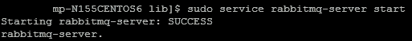
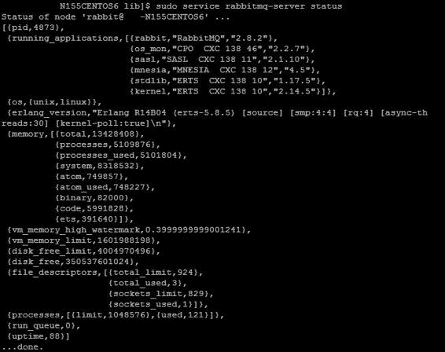
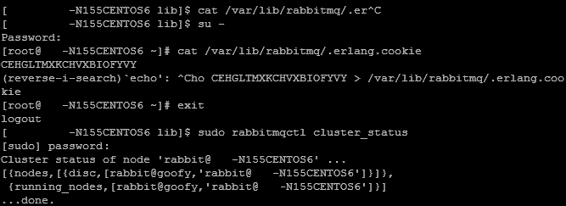
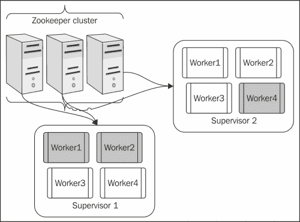
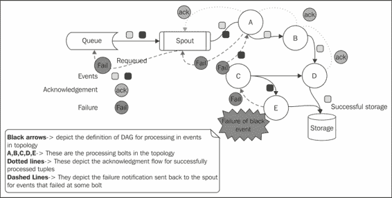

# 第五章。风暴高可用性和故障转移

本章将带您进入风暴之旅的下一个阶段，我们将让您了解风暴与生态系统中其他必要组件的集成。我们将实际介绍高可用性和可靠性的概念。

本章是理解 Storm 及其相关组件的集群模式设置的下一步。我们将了解风暴和动物园管理员中的各种配置及其背后的概念。

本章将涉及的主题如下:

*   设置 RabbitMQ(单实例和集群模式)
*   开发 AMQP 喷口，整合风暴和拉比
*   创建 RabbitMQ 进纸器组件
*   为 RabbitMQ 和风暴集群构建高可用性
*   风暴计划

到本章结束时，您将能够设置和理解 Rabbtmq，并将 Storm 与 Rabbtmq 集成在一起。此外，您将能够测试风暴集群的高可用性和有保证的处理。

# Rabbtmq 概述

RabbitMQ 的妙语是*消息传递，它只是起作用*。

RabbitMQ 是 AMQP 消息传递协议最广泛使用的实现之一，它为消息接收和传递提供了一个平台。这个内存中的队列也有能力保存和保留消息，直到它们被消费者使用。这种灵活的代理系统非常容易使用，可以在大多数操作系统上工作，如 windows、UNIX 等。

RabbitMQ 是**高级消息队列协议** ( **AMQP** )的实现。如下图所示，rabbtmq的重要组成部分是**交换**和**队列**:


发布者和消费者是两个必不可少的行动者；前者生成消息并将其发布到交易所，交易所依次(根据其类型)将消息从发布者发布到队列，并从队列发布到提取消息的消费者。

需要注意的是，这里发布者与交换交互，而不是队列。RabbitMQ 支持各种各样的交换，比如直接的、扇出的、主题的等等。交换的任务是将消息路由到一个或多个队列，这取决于交换的类型和与消息关联的路由密钥。因此，如果是直接交换，消息将被传递到绑定到交换的一个队列，其路由密钥与消息中的匹配。如果这是一个扇出交换，那么消息将被传递到绑定到该交换的所有队列，而路由将被完全忽略。

# 安装 RabbitMQ 集群

RabbitMQ 是一个消息代理——消息传递的中介。它给你的应用程序一个发送和接收消息的公共平台，你的消息在被接收之前是一个安全的地方。

## 设置 RabbitMQ 的先决条件

确保已经注意到短名称也包含在`/etc/hosts`文件中，如以下代码所示:

```scala
<ip address1>     <hostname1> <shortname1> 
<ip address2>     <hostname2> <shortname2> 
```

### 注

`/etc/hosts`中的短名称是强制性的，因为在 RabbitMQ 集群中，节间通信使用这些短名称进行。

例如，我们的群集中有两台机器，它们具有下面提到的 IP 和主机名；启动群集时，RabbitMQ 守护程序会使用此信息:

```scala
10.191.206.83     rmq-flc-1.mydomain.net rmq-flc-1 
10.73.10.63       rmq-flc-2.mydomain.net rmq-flc-2
```

如果未设置短名称，您将看到此错误:**系统未运行以使用完全限定的主机名**。

## 设置 RabbitMQ 服务器

Ubuntu 附带了和 RabbitMQ，但它通常不是的最新版本。最新的版本可以从 RabbitMQ 的 Debian 存储库中检索到。以下 shell 脚本应该为 Ubuntu 上的 RabbitMQ 安装运行:

```scala
#!/bin/sh
sudo cat <<EOF > /etc/apt/sources.list.d/rabbitmq.list
sudo deb http://www.rabbitmq.com/debian/ testing main
EOF

sudo curl http://www.rabbitmq.com/rabbitmq-signing-key-public.asc -o  /tmp/rabbitmq-signing-key-public.asc
sudo apt-key add /tmp/rabbitmq-signing-key-public.asc
sudo rm /tmp/rabbitmq-signing-key-public.asc

sudo apt-get -qy update
sudo apt-get -qy install rabbitmq-server

```

## 测试 RabbitMQ 服务器

以下步骤将为您提供要在 Ubuntu 终端上执行的命令，以启动 RabbitMQ 服务器并对其进行测试。它们如下:

1.  Start the RabbitMQ server by running the following command on the shell:

    ```scala
    sudo service rabbitmq-server start

    ```

    

2.  Check the server status by running the following command:

    ```scala
    sudo service rabbitmq-server status

    ```

    

3.  在每个 rabbtmq 实例上，要启用 rabbtmq 管理控制台，请执行以下命令，并使用以下命令重新启动在该实例上运行的 rabbtmq 服务器:

    ```scala
    sudo rabbitmq-plugins enable rabbitmq_management

    ```

4.  要启用 RabbitMQ 插件，请导航至`/usr/lib/rabbitmq/bin`并在两个节点上执行以下命令，然后重新启动它们:

    ```scala
    sudo rabbitmq-plugins enable rabbitmq_management

    ```

5.  启动、关闭和错误日志在`/var/log/rabbitmq`目录下创建。

### 创建 RabbitMQ 集群

这里是设置两个(或更多)节点的 RabbitMQ 集群需要执行的步骤:

1.  考虑到`rmq-flc-1`和`rmq-flc-2`是两个实例的短主机名，我们将使用以下命令在两个实例上启动独立的 RabbitMQ 服务器:

    ```scala
    sudo service rabbitmq-server start

    ```

2.  在`rmq-flc-2`上，我们将停止 rabbtmq 应用程序，重置节点，加入集群，并使用以下命令重新启动 rabbtmq 应用程序(所有这些都是在 rabbtmq 服务器启动并在`rmq-flc-1`上运行时完成的):

    ```scala
    sudo rabbitmqctl stop_app
    sudo rabbitmqctl join_cluster rabbit@rmq-flc-1
    sudo rabbitmqctl start_app

    ```

3.  通过在任何一台机器上运行以下命令来检查集群状态:

    ```scala
    sudo service rabbitmq-server status

    ```

4.  The following output should be seen:

    

5.  群集已成功设置。

如果启用了用户界面，集群可以在`http:/` `/<hostip>:15672`(用户名:`guest`，密码:`guest`)访问。

### 启用兔调界面

执行以下步骤，启用 RabbitMQ 用户界面:

1.  执行以下命令:

    ```scala
    sudo /usr/lib/rabbitmq/bin/rabbitmq-plugins enable  rabbitmq_management

    ```

2.  前面的命令将产生以下输出:

    ```scala
    The following plugins have been enabled:
    mochiweb
    webmachine
    rabbitmq_mochiweb
    amqp_client
    rabbitmq_management_agent
    rabbitmq_management
    Plugin configuration has changed. Restart RabbitMQ for changes to take effect.

    ```

3.  在集群的所有节点上重复上述步骤。
4.  使用以下命令重新启动每个节点:

    ```scala
    sudo service rabbitmq-server restart 

    ```

5.  使用`http:` `//<hostip>:15672`链接进入用户界面。默认的用户名和密码是`guest`。

### 为高可用性创建镜像队列

在本节中，我们将讨论一种特殊的队列，它可以保证比 RabbitMQ 默认队列更高的可用性。默认情况下，根据队列的声明顺序，我们创建的队列位于单个节点上，这可能成为单点故障。我们来看一个例子。我有一个由两个 RabbitMQ 节点组成的集群，`rabbit1`和`rabbit2`，我声明在我的集群上进行一次交换，比如说，`myrabbitxchange`。假设按照执行顺序，队列是在`rabbit1`中创建的。现在如果`rabbit1`倒下了，那么队列就没了，客户就不能向它发布了。

因此，为了避免这种情况，我们需要高度可用的队列；它们被称为镜像队列，在集群中的所有节点上复制。镜像队列有一个主队列和多个从队列，最早的一个是主队列，如果它不可用，可用节点中最早的成为主队列。消息被发布给所有的奴隶。这提高了可用性，但没有分配负载。要创建镜像队列，请使用以下步骤:

1.  可以通过使用网络用户界面添加策略来启用镜像。进入**管理**选项卡，选择**策略**，点击**添加策略**。
2.  Specify policy **Name**, **Pattern**, **Definition**, and click on **Add Policy**, as shown in the following screenshot:

    

# 将风暴与 RabbitMQ 整合

现在我们已经安装了 Storm，下一步是将 rabbtmq 与 Storm 集成在一起，为此我们必须创建一个名为 rabbtmq 喷口的定制喷口。此喷口将从指定队列中读取消息；因此，它将扮演消费者的角色，然后将这些消息推送到下游拓扑。

下面是喷口代码的外观:

```scala
public class AMQPRecvSpout implements IRichSpout{

//The constructor where we set initialize all properties
  public AMQPRecvSpout(String host, int port, String username,  String password, String vhost, boolean requeueOnFail, boolean  autoAck) {
    this.amqpHost = host;
    this.amqpPort = port;
    this.amqpUsername = username;
    this.amqpPasswd = password;
    this.amqpVhost = vhost;
    this.requeueOnFail = requeueOnFail;
    this.autoAck = autoAck;
  }
/*
Open method of the spout , here we initialize the prefetch count ,  this parameter specified how many messages would be prefetched  from the queue by the spout – to increase the efficiency of the  solution */
  public void open(@SuppressWarnings("rawtypes") Map conf,  TopologyContext context, SpoutOutputCollector collector) {
    Long prefetchCount = (Long) conf.get(CONFIG_PREFETCH_COUNT);
    if (prefetchCount == null) {
      log.info("Using default prefetch-count");
      prefetchCount = DEFAULT_PREFETCH_COUNT;
    } else if (prefetchCount < 1) {
      throw new IllegalArgumentException(CONFIG_PREFETCH_COUNT + "  must be at least 1");
    }
    this.prefetchCount = prefetchCount.intValue();

    try {
      this.collector = collector;
      setupAMQP();
    } catch (IOException e) {
      log.error("AMQP setup failed", e);
      log.warn("AMQP setup failed, will attempt to reconnect...");
      Utils.sleep(WAIT_AFTER_SHUTDOWN_SIGNAL);
      reconnect();
    }
  }

  /**
   * Reconnect to an AMQP broker.in case the connection breaks at  some point
   */
  private void reconnect() {
    log.info("Reconnecting to AMQP broker...");
    try {
      setupAMQP();
    } catch (IOException e) {
      log.warn("Failed to reconnect to AMQP broker", e);
    }
  }
  /**
   * Set up a connection with an AMQP broker.
   * @throws IOException
   *This is the method where we actually connect to the queue  using AMQP client APIs
   */
  private void setupAMQP() throws IOException{
    final int prefetchCount = this.prefetchCount;
    final ConnectionFactory connectionFactory = new  ConnectionFactory() {
      public void configureSocket(Socket socket)
          throws IOException {
        socket.setTcpNoDelay(false);
        socket.setReceiveBufferSize(20*1024);
        socket.setSendBufferSize(20*1024);
      }
    };

    connectionFactory.setHost(amqpHost);
    connectionFactory.setPort(amqpPort);
    connectionFactory.setUsername(amqpUsername);
    connectionFactory.setPassword(amqpPasswd);
    connectionFactory.setVirtualHost(amqpVhost);

    this.amqpConnection = connectionFactory.newConnection();
    this.amqpChannel = amqpConnection.createChannel();
    log.info("Setting basic.qos prefetch-count to " +  prefetchCount);
    amqpChannel.basicQos(prefetchCount);
    amqpChannel.exchangeDeclare(Constants.EXCHANGE_NAME,  "direct");
    amqpChannel.queueDeclare(Constants.QUEUE_NAME, true, false,  false, null);
    amqpChannel.queueBind(Constants.QUEUE_NAME,  Constants.EXCHANGE_NAME, "");
    this.amqpConsumer = new QueueingConsumer(amqpChannel);
    assert this.amqpConsumer != null;
    this.amqpConsumerTag =  amqpChannel.basicConsume(Constants.QUEUE_NAME, this.autoAck,  amqpConsumer);
  }

  /* 
   * Cancels the queue subscription, and disconnects from the AMQP  broker.
   */
  public void close() {
    try {
      if (amqpChannel != null) {
        if (amqpConsumerTag != null) {
          amqpChannel.basicCancel(amqpConsumerTag);
        }
        amqpChannel.close();
      }
    } catch (IOException e) {
      log.warn("Error closing AMQP channel", e);
    }

    try {
      if (amqpConnection != null) {
        amqpConnection.close();
      }
    } catch (IOException e) {
      log.warn("Error closing AMQP connection", e);
    }
  }
  /* 
   * Emit message received from queue into collector
   */
  public void nextTuple() {
    if (spoutActive && amqpConsumer != null) {
      try {
        final QueueingConsumer.Delivery delivery =  amqpConsumer.nextDelivery(WAIT_FOR_NEXT_MESSAGE);
        if (delivery == null) return;
        final long deliveryTag =  delivery.getEnvelope().getDeliveryTag();
        String message = new String(delivery.getBody());

        if (message != null && message.length() > 0) {
          collector.emit(new Values(message), deliveryTag);
        } else {
          log.debug("Malformed deserialized message, null or zero- length. " + deliveryTag);
          if (!this.autoAck) {
            ack(deliveryTag);
          }
        }
      } catch (ShutdownSignalException e) {
        log.warn("AMQP connection dropped, will attempt to  reconnect...");
        Utils.sleep(WAIT_AFTER_SHUTDOWN_SIGNAL);
        reconnect();
      } catch (ConsumerCancelledException e) {
        log.warn("AMQP consumer cancelled, will attempt to  reconnect...");
        Utils.sleep(WAIT_AFTER_SHUTDOWN_SIGNAL);
        reconnect();
      } catch (InterruptedException e) {
        log.error("Interrupted while reading a message, with  Exception : " +e);
      }
    }
  }
  /* 
   * ack method to acknowledge the message that is successfully  processed 
*/

  public void ack(Object msgId) {
    if (msgId instanceof Long) {
      final long deliveryTag = (Long) msgId;
      if (amqpChannel != null) {
        try {
          amqpChannel.basicAck(deliveryTag, false);
        } catch (IOException e) {
          log.warn("Failed to ack delivery-tag " + deliveryTag,  e);
        } catch (ShutdownSignalException e) {
          log.warn("AMQP connection failed. Failed to ack  delivery-tag " + deliveryTag, e);
        }
      }
    } else {
      log.warn(String.format("don't know how to ack(%s: %s)",  msgId.getClass().getName(), msgId));
    }
  }

  public void fail(Object msgId) {
    if (msgId instanceof Long) {
      final long deliveryTag = (Long) msgId;
      if (amqpChannel != null) {
        try {
          if (amqpChannel.isOpen()) {
            if (!this.autoAck) {
              amqpChannel.basicReject(deliveryTag, requeueOnFail);
            }
          } else {
            reconnect();
          }
        } catch (IOException e) {
          log.warn("Failed to reject delivery-tag " + deliveryTag,  e);
        }
      }
    } else {
      log.warn(String.format("don't know how to reject(%s: %s)",  msgId.getClass().getName(), msgId));
    }
  }

public void declareOutputFields(OutputFieldsDeclarer declarer) {
    declarer.declare(new Fields("messages"));
  }
}
```

项目`pom.xml`中引入所需的 AMQP·马文依赖关系，如下代码所示:

```scala
    <dependency>
      <groupId>com.rabbitmq</groupId>
      <artifactId>amqp-client</artifactId>
      <version>3.2.1</version>
    </dependency>
```

## 创建 RabbitMQ 进纸器组件

现在我们已经安装了 rabbtmq 集群，我们所需要的就是开发一个发布器组件将消息发布到 rabbtmq。这将是一个简单的 Java 组件，它将模仿 RabbitMQ 的实时提要。这方面的基本代码片段如下:

```scala
public class FixedEmitter {
  private static final String EXCHANGE_NAME = "MYExchange";
  public static void main(String[] argv) throws Exception {
    /*we are creating a new connection factory for builing  connections with exchange*/
    ConnectionFactory factory = new ConnectionFactory();
    /* we are specifying the RabbitMQ host address and port here  in */

    Address[] addressArr = {
      new Address("localhost", 5672)
    }; //specify the IP if the queue is not on local node where  this program would execute 
    Connection connection = factory.newConnection(addressArr);
    //creating a channel for rabbitMQ
    Channel channel = connection.createChannel();
    //Declaring the queue and routing key
    String queueName = "MYQueue";
    String routingKey = "MYQueue";
    //Declaring the Exchange
    channel.exchangeDeclare(EXCHANGE_NAME, "direct", false);
    Map < String, Object > args = new HashMap < String, Object >  ();
    //defining the queue policy
    args.put("x-ha-policy", "all");
    //declaring and binding the queue to the exchange
    channel.queueDeclare(queueName, true, false, false, args);
    channel.queueBind(queueName, EXCHANGE_NAME, routingKey);
    String stoppedRecord;
    int i = 0;
    //emitting sample records
    while (i < 1) {
      try {
        myRecord = "MY Sample record";
        channel.basicPublish(EXCHANGE_NAME, routingKey,
          MessageProperties.PERSISTENT_TEXT_PLAIN,
          myRecord.getBytes());
        System.out.println(" [x] Sent '" + myRecord + "' sent at "  + new Date());
        i++;
        Thread.sleep(2);
      } catch (Exception e) {
        e.printStackTrace();
      }
    }
    channel.close();
    connection.close();
  }
}
```

## 为 AMQP 喷口布线拓扑

现在我们已经准备好集群队列设置，AMQP 喷管就位，进料器组件就位；让我们将最后一个也是最后一个部分放在适当的位置，这就是 Storm 拓扑的整体集成。

让我们再次使用我们的`WordCount`拓扑，我们将使用我们在上一节中设计的`AMQPRecvSpout`*将风暴与 Rabbtmq*集成在一起。

需要修改以下代码块:

```scala
builder.setSpout("spout", new RandomSentenceSpout(), 5);
builder.setBolt("split", new SplitSentence(),  8).shuffleGrouping("spout");
We will use the new spout instead, as follows:

builder.setSpout("queue_reader", new  AMQPRecvSpout(Constants.RMQ_ADDRESS, 5672, "guest", "guest",  "/"));
```

# 构建组件的高可用性

现在我们正处于寻找集群中各种组件的高可用性的有利时机。我们将通过一系列练习来实现这一点，在这些练习中，我们假设每个组件都以集群模式安装，并且生态系统中存在多个组件实例。

只有在镜像队列就位后，才能检查 RabbitMQ 的高可用性。让我们假设:

*   我们在 RabbitMQ 集群中有两个节点:节点 1 和节点 2
*   `MyExchange`是为本练习目的而创建的交易所的名称
*   `MyQueue`是为本练习创建的镜像队列

接下来，我们将运行我们在*中创建的`fixedEmitter`代码，创建一个 RabbitMQ 馈送器组件*部分。现在进行石蕊测试:

*   让我们假设队列`MyQueue`有 100 条消息
*   现在关闭节点 2(这意味着集群中的一个节点关闭)
*   所有 100 条消息将被保留，并在控制台上可见；当节点 2 不存在时，节点 1 填充

这种行为确保了即使集群中的某个节点出现故障，服务也不会中断。

## 风暴集群的高可用性

现在让我们看看 Storm 中故障转移或高可用性的演示。Storm 框架的构建方式是，只要:

*   它具有所需数量的动物园管理员连接
*   它在一个或多个主管上有所需数量的员工

那么前面的陈述到底是什么意思呢？让我们用一个例子来理解这一点。假设我正在风暴集群上执行`WordCount`拓扑。此群集具有以下配置:

*   有两个风暴主管，每个风暴主管有四名工作人员，因此集群中总共有八名工作人员
*   有三个 Zookeeper 节点(最多 30 个连接)，因此总共 30*2*3=180 个连接
*   一个拓扑由三个工作人员分配

让我们假设，当我们将此拓扑提交到集群时，任务和流程会产生，如下图所示:



上图中的示意性地描述了集群，灰色工人是分配给拓扑的工人。现在，我们都准备好尝试风暴和动物园管理员的高可用性测试。风暴和动物园管理员的测试如下:

*   **测试 1** (所有组件启动，拓扑运行):提交拓扑后，杀死 Nimbus 节点；您会注意到拓扑将继续正常运行。
*   **测试 2** (所有组件都已启动，拓扑正在运行):杀死一个 Zookeeper 节点，你会注意到拓扑将继续正常执行，因为另外两个可用的 Zookeeper 在连接方面有足够的资源，可以保持 Storm 集群的启动和运行。
*   **测试 3** (所有组件都已启动，拓扑正在运行):杀死两个 Zookeeper 节点，您会注意到拓扑将继续正常执行，因为另外两个可用 Zookeeper 中的一个在连接方面有足够的资源，可以让 Storm 集群保持启动和运行。
*   **测试 4** (所有组件均已启动，拓扑运行):击杀主管 2；现在我们在这个节点上有一个灰色工人。因此，当这个节点关闭时，灰色工作人员死亡，然后因为第二个主管不可用，它再次产生，这次是在主管 1 上。因此，拓扑的所有工作人员现在都将在一个主管上执行，但系统将继续在有限的资源下运行，但不会失败。

## 保证风暴集群的处理

本节要讨论的下一个主题是查看 *Storm 的保证消息处理正在进行中*。我们在前面的章节中讨论了这个概念，但是为了实际理解它，我没有深入讨论，因为我想首先向大家介绍 AMQP 壶嘴。现在让我们回到我们在[第 2 章](02.html#page "Chapter 2. Getting Started with Your First Topology")*中讨论的例子，开始你的第一个拓扑*。

如下图所示，虚线箭头流显示未能处理的事件被重新排队到队列中:



现在，让我们稍微调整一下我们的`wordCount`拓扑，我们已经添加了`AMQPRecvSpout`来使事件失败，并看看它们实际上出现在哪里。假设我使用`FixedEmitter`向队列中发出 10 个事件。现在我拧动`wordCount`螺栓，在执行方法中诱导人工睡眠五分钟，这样每个项目都在那里举行 300 秒(使用`Thread.sleep(300)`)。这将导致其超时，因为默认事件超时是 60 秒。

现在，当您运行拓扑时，您将能够看到使用用户界面将事件重新排队回 RabbitMQ。

# 风暴隔离调度程序

风暴隔离调度程序在风暴版本 0.8.2 中发布。这是一个非常方便的特性，自发布以来一直被非常积极地使用，就共享风暴集群而言。让我们通过一个例子来了解它的工作原理和能力；比方说，我们有一个四个监管节点的 Storm 集群，每个集群有四个插槽，因此我总共有 16 个插槽。现在我想在这里使用三种风暴拓扑，比如拓扑 1、拓扑 2 和拓扑 3；每个小组有四名工作人员。

因此，默认情况下，风暴分布的调度行为可能如下:

<colgroup class="calibre19"><col class="calibre20"> <col class="calibre20"> <col class="calibre20"> <col class="calibre20"> <col class="calibre20"></colgroup> 
|   | 

主管 1

 | 

主管 2

 | 

主管 3

 | 

主管 4

 |
| --- | --- | --- | --- | --- |
| 顶 1 | 工人 1 | 工人 2 | 工人 3 | 工人 4 |
| **顶部 2** | 工人 2 | 工人 1 | 工人 1 | 工人 1 |
| **顶部 3** | 工人 3 | 工人 3 | 工人 2 | 工人 2 |

Storm 将尊重负载分布，并将在每个节点上为每个拓扑产生一个工作人员。

现在让我们稍微调整一下场景，并引入一个要求，即拓扑 1 是一个资源非常密集的拓扑。(我想把一个主管完全奉献给这个主管，这样可以节省网络跳数。)这可以通过使用隔离调度程序来实现。

我们必须在集群中每个风暴节点的`storm.yaml`文件中输入以下条目(Nimbus 和 supervisor):

```scala
isolation.scheduler.machines: 
    "Topol": 2
```

需要重新启动群集，此设置才能生效。此设置意味着我们为拓扑 1 指定了两个管理节点，它将不再与提交给集群的其他拓扑共享。这也将确保为生产中遇到的多租户问题提供可行的解决方案。

另外两名主管将在拓扑 2 和拓扑 3 中共享。可能的分布如下:

<colgroup class="calibre19"><col class="calibre20"> <col class="calibre20"> <col class="calibre20"> <col class="calibre20"> <col class="calibre20"></colgroup> 
|   | 

主管 1

 | 

主管 2

 | 

主管 3

 | 

主管 4

 |
| --- | --- | --- | --- | --- |
| 顶 1 | 工人 1工人 2 | 工人 1工人 2 |   |   |
| **顶部 2** |   |   | 工人 1工人 2 | 工人 1工人 2 |
| **顶部 3** |   |   | 工人 3工人 4 | 工人 3工人 4 |

因此，从上表中可以明显看出，拓扑 1 将被隔离到超级用户 1 和 2，而拓扑 2 和拓扑 3 将共享超级用户 3 和 4 上的其余八个插槽。

# 测验时间

问题 1 说明下列句子是对还是错:

1.  AMQP 协议是一个 STOMP 协议。
2.  RabbitMQ 不是故障安全的。
3.  AMQP 客户需要向 RabbitMQ 发布。
4.  镜像队列可以从集群中的节点故障中恢复。

问题 2:填空:

1.  _____ 是根据路由密钥传递消息的交换。
2.  _____ 是广播消息的交换。
3.  _____ 是 AMQP 消费者协议上风暴喷口的实现。

问题 3:在一个三节点风暴集群(一个光轮和两个管理节点)上执行`WordCount`拓扑，该集群由一个双节点拉比 tMQ 集群组成:

*   尝试*构建组件高可用性*部分中提到的各种故障场景
*   在消息处理中引入人为延迟，以校准风暴拓扑的保证处理

# 总结

在本章中，您已经了解了 AMQP 协议的拉比 tMQ 实现。我们完成了集群设置，并将 Storm 拓扑的输出与队列集成在一起。我们还探索并实际测试了 RabbitMQ 和 Storm 的高可用性和可靠性场景。我们以谈到风暴计划来结束这一章。在下一章中，我们将使用卡珊德拉熟悉风暴持久性。