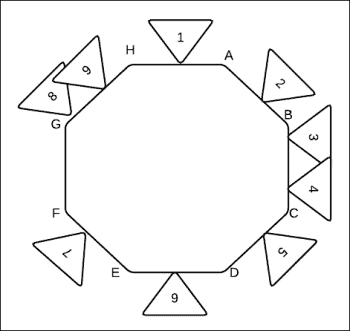
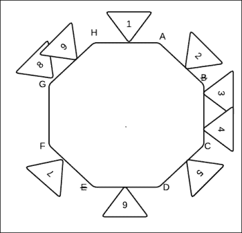
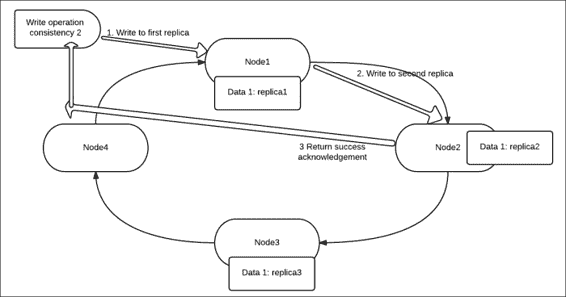

# 第七章。卡珊德拉分区、高可用性和一致性

在本章中，您将了解 Cassandra 的内部结构，以了解数据分区是如何实现的，并了解 Cassandra 的密钥集分发中采用的哈希技术。我们还将深入了解复制及其工作原理，以及暗示切换的特性。我们将涵盖以下主题:

*   数据分区和一致散列；我们将看看实际的例子
*   复制、一致性和高可用性

# 一致哈希

在您理解其含义和在 Cassandra 中的应用之前，让我们将一致哈希理解为一个概念。

一致哈希对其名称中的概念起作用，即*哈希*，正如我们所知，对于所述哈希算法，相同的密钥总是返回相同的哈希代码，因此，从本质和实现上来说，这种方法非常具有确定性。当我们使用这种方法在集群中的节点之间分割或划分密钥时，一致哈希是确定哪个节点存储在集群的哪个节点中的技术。

请看下图，了解一致哈希的概念；想象一下，下图中描绘的环表示 Cassandra 环，这里的节点用字母和数字标记，这些数字实际上标记了要映射到环上的对象(倒三角形)。



卡珊德拉集群的一致哈希

要计算对象对其所属节点的所有权，只需顺时针遍历即可遇到下一个节点。数据项后面的节点是一个倒三角形，是拥有该对象的节点，例如:

*   **1** 属于节点 **A**
*   **2** 属于节点 **B**
*   **3** 属于节点 **C**
*   **4** 属于节点 **C**
*   **5** 属于节点 **D**
*   **6** 属于节点 **E**
*   **7** 属于节点 **F**
*   **8** 属于节点 **H**
*   **9** 属于节点 **H**

如您所见，这使用简单的哈希算法根据拥有的令牌范围来计算环中密钥的所有权。

我们来看一个一致哈希的实际例子；为了解释这一点，我们来看一个示例列族，其中分区键值是名称。

假设下面是列值数据:

<colgroup class="calibre19"><col class="calibre20"> <col class="calibre20"></colgroup> 
| 

名字

 | 

性别

 |
| --- | --- |
| 海哲明 | M |
| 携带 | F |
| 耶西 | M |
| 制革时将皮弄湿 | F |

以下是哈希映射的样子:

<colgroup class="calibre19"><col class="calibre20"> <col class="calibre20"></colgroup> 
| 

分区键

 | 

哈希值

 |
| --- | --- |
| 吉姆(人名) | 2245462676723220000.00 |
| 颂歌 | 7723358927203680000.00 |
| 男人 | 6723372854036780000.00 |
| 苏西 | 1168604627387940000.00 |

假设我有四个节点，范围如下；以下是数据的分发方式:

<colgroup class="calibre19"><col class="calibre20"> <col class="calibre20"> <col class="calibre20"> <col class="calibre20"> <col class="calibre20"></colgroup> 
| 

结节

 | 

开始范围

 | 

结束范围

 | 

分区键

 | 

哈希值

 |
| --- | --- | --- | --- | --- |
| A | 9223372036854770000.00 | 4611686018427380000.00 | 海哲明 | 6723372854036780000.00 |
| B | 4611686018427380000.00 | One | 耶西 | 2245462676723220000.00 |
| C | Zero | 4611686018427380000.00 | 苏西 | 1168604627387940000.00 |
| D | 4611686018427380000.00 | 9223372036854770000.00 | 携带 | 7723358927203680000.00 |

现在，您已经理解了一致散列的概念，让我们来看看一个或多个节点关闭并恢复的场景。

## 一个或多个节点关闭

我们目前正在关注一个非常常见的场景，在这个场景中，我们设想一个节点发生故障；例如，这里我们已经捕获了其中的两个下降: **B** 和 **E** 。现在会发生什么？没什么大不了的，我们将遵循与之前相同的模式，顺时针移动以找到下一个活动节点，并将值分配给该节点。

因此，在我们的例子中，分配将变为如下:



上图中的分配如下:

*   **1** 属于 **A**
*   **2** 、 **3** 、 **4** 属于 **C**
*   **5** 属于 **D**
*   **6** ， **7** 属于 **F**
*   **8** 、 **9** 属于 **H**

## 一个或多个节点重新启动

现在让我们假设一个场景，其中节点 **2** 重新出现；嗯，接下来发生的事情还是和之前解释的一样，所有权重新建立如下:

*   **1** 属于 **A**
*   **2** 属于 **B**
*   **3** 、 **4** 属于 **C**
*   **5** 属于 **D**
*   **6** ， **7** 属于 **F**
*   **8** 、 **9** 属于 **H**

因此，我们已经证明了这种技术适用于所有情况，这就是为什么它被使用。

# 卡珊德拉的复制与策略

复制意味着创建副本。这种拷贝使数据冗余，因此即使一个节点出现故障或停机，数据也是可用的。在 Cassandra 中，您可以选择将复制因子指定为键空间创建的一部分，或者稍后对其进行修改。在此上下文中需要指定的属性如下:

*   **复制因子**:这是一个指定副本数量的数值
*   **策略**:这个可以是简单策略或者拓扑策略；这决定了副本在集群中的位置

在内部，Cassandra 使用行键跨集群中的不同节点存储数据的副本或拷贝。 *n* 的复制因子意味着在 *n* 个不同的节点上存储着 *n* 个数据副本。复制有一些经验法则，如下所示:

*   复制因子不应超过群集中的节点数，否则您将因副本不足而遇到异常，Cassandra 将开始拒绝写入和读取，尽管复制因子将不间断地继续
*   复制因子不应太小，以至于如果一个奇数节点发生故障，数据将永远丢失

**sniffer**是用来确定节点的物理位置、相互接近度等属性，这些属性在大量数据需要复制和来回移动时很有价值。在所有这些情况下，网络延迟起着非常重要的作用。卡珊德拉目前支持的两项战略如下:

*   **简单**:这是卡珊德拉为所有按键空间提供的默认策略。它雇佣了大约一个数据中心。它的操作非常简单明了；顾名思义，分区器根据节点范围检查键值，以确定第一个副本的位置。在此基础上，后续副本以顺时针顺序放置在下一个节点上。因此，如果数据项“A”具有“3”的复制，并且分割器基于密钥和所有权决定第一个节点，则在该节点上，后续的副本以顺时针顺序创建。
*   **网络**:这是拓扑，当我们有跨数据中心分布的 Cassandra 集群时使用。在这里，我们可以规划我们的副本放置，并定义我们希望在每个数据中心放置多少副本。这种方法使数据具有地理冗余性，从而在整个数据中心崩溃的情况下更加安全。在选择跨数据中心放置副本时，您应该考虑以下两件事:
    *   每个数据中心都应该能够自给自足地满足请求
    *   故障转移或崩溃情况

如果我们在一个数据中心中有 *2 个数据副本，那么我们有 4 个数据副本，并且每个数据中心对于一致性`ONE`有一个节点故障容差。如果我们进入数据中心*中的 *3 个数据副本的节点，那么我们有 6 个数据副本，并且为了`ONE`的一致性，每个数据中心具有多个节点故障的容差。这种策略也允许不对称复制。*

# 卡珊德拉一致性

正如我们在前面一章中所说，卡珊德拉最终变得一致，并遵循 CAP 定理的 AP 原理。一致性是指 Cassandra 集群中所有数据副本的信息的最新程度。卡珊德拉最终保证了一致性。现在让我们仔细看看；假设我有五个节点的 Cassandra 集群，复制因子为 3。这意味着如果我有一个*数据项 1* ，它将被复制到三个节点，比如节点 1、节点 2 和节点 3；假设这个数据的键是*键 1* 。现在，如果要重写该键的值，并且在节点 1 上执行写操作，那么 Cassandra 会在内部将这些值复制到其他副本，即节点 2 和节点 3。但是这个更新是在后台进行的，并不是即时的；这是最终一致性的机制。

Cassandra 提供了这样一个概念，即让(读和写)客户端应用程序决定使用什么样的一致性级别来读写数据存储。

## 写一致性

让我们在卡珊德拉中仔细检查一下写操作。当写操作在 Cassandra 中完成时，客户端可以指定操作应该执行的一致性。

这意味着，如果复制因子为 *x* ，并且以 *y* 的一致性执行写入操作(其中 y 小于 x)，则 Cassandra 将等待在 *y* 节点上成功写入完成，然后向客户端返回成功确认，将操作标记为完成。对于剩余的 *x-y* 副本，数据由 Cassandra 进程在内部传播和复制。

下表显示了各种一致性级别及其含义，其中`ANY`具有最高可用性和最低一致性的优势，而`ALL`具有最高一致性但可用性最低。因此，作为一个客户，在决定选择哪种一致性之前，必须审查用例。下表列出了一些热门选项和及其含义:

<colgroup class="calibre19"><col class="calibre20"> <col class="calibre20"></colgroup> 
| 

一致性水平

 | 

含义

 |
| --- | --- |
| 任何的 | 当数据被写到至少一个节点上时写操作被返回为成功，其中该节点可以是复制节点或非复制节点 |
| 一个 | 当数据被写入至少一个复制节点时，写操作返回成功 |
| 二 | 当数据被写入至少两个复制节点时，写入操作返回成功 |
| 法定人数 | 当数据被写入副本节点的仲裁时(其中仲裁是 n/2+1，n 是复制因子)，写入操作返回成功 |
| 全部 | 当数据写入所有副本节点时，写入操作返回成功 |

下图描述了四节点群集上的写操作，该群集的复制因子为 **3** ，一致性为 **2** :



如您所见，写操作分三步完成:

*   从客户端发出写操作
*   写入在**副本 1** 上执行并完成
*   写入在**副本 2** 上执行并完成
*   当写入成功完成时，会向客户端发出确认

## 读取一致性

读取一致性类似于写入一致性，它表示在结果返回到查询卡珊德拉数据存储的客户端之前，有多少副本应该响应或确认它们与被返回到读取操作的数据对齐。这意味着，如果在复制因子为 *x* 的 *N* 节点集群上，发出读取一致性为 *y* 的读取查询(y 小于 x)，则 Cassandra 将检查 *y* 副本，然后返回结果。结果是在使用最新数据来满足请求的基础上进行验证的，这通过与每个列相关联的时间戳来验证。

以下**卡珊德拉查询语言** ( **CQL** ，从仲裁一致性的列族中获取数据如下:

```scala
SELECT * FROM mytable USING CONSISTENCY QUORUM WHERE name='shilpi';

```

CQL 的职能如下:

<colgroup class="calibre19"><col class="calibre20"> <col class="calibre20"></colgroup> 
| 

一致性水平

 | 

含义

 |
| --- | --- |
| 一个 | 读取请求由最近副本的响应提供服务 |
| 二 | 读取请求由两个最接近的副本之一的最新响应提供服务 |
| 三 | 该级别从三个最接近的副本中返回最近的数据 |
| 法定人数 | 读取请求由来自法定副本的最新响应提供服务 |
| 全部 | 读取请求由来自所有副本的最新响应提供服务 |

## 一致性维护功能

在前一节中，我们深入讨论了读一致性和写一致性，有一点很清楚，在执行读或写操作时，Cassandra 不提供或不努力实现完全一致性；它按照客户端的一致性规范执行并完成请求。另一个特点是*最终一致性*，这凸显了面纱背后有某种魔力，可以保证最终所有数据都是一致的。现在，这种魔力由卡珊德拉内部的某些组件执行，其中一些组件如下所述:

*   **读取修复**:该服务确保所有副本中的数据都是最新的。这样，该行是一致的，并且已经用所有副本的最新值进行了更新。该操作由作业执行。Cassandra 正在运行以执行协调器发出的修复读取操作。
*   **反熵修复服务**:该服务确保不经常读取的数据，或者当被关闭的主机重新加入时，处于一致状态。这是常规的群集维护操作。
*   **暗示换手**:这是对卡珊德拉的又一次独特而精彩的操作。当执行写操作时，协调器向所有副本发出写操作，而不管指定的一致性如何，并等待确认。一旦确认计数达到操作一致性上提到的值，线程就完成了，并通知客户端它成功了。在剩余的副本上，使用暗示的切换来写入值。当一些节点关闭时，暗示切换方法是救星。假设其中一个副本已关闭，并且执行了一致性为`ANY`的写操作；在这种情况下，一个副本将写操作和提示带到当前关闭的相邻副本。当倒下的副本恢复时，通过从活动副本中获取提示，这些值将被写回给它们。

# 测验时间

问题 1 .陈述以下陈述是真是假:

1.  卡珊德拉的默认一致性为`ALL`。
2.  `QUORUM`是提供最高可用性的一致性级别。
3.  卡珊德拉用告密者来识别节点的接近程度。
4.  默认情况下，Cassandra 读写功能的一致性级别为 1。

问题 2 .填空:

1.  _____ 用于确定节点的物理接近度。
2.  _____ 是提供最高可用性和最低可用性的一致性。
3.  _____ 是一项服务，可确保已关闭一段时间的节点正确更新为最新的更改。

问题 3 .执行以下用例，查看 Cassandra 高可用性和复制:

1.  创建一个四节点 Cassandra 集群。
2.  创建复制因子为 3 的键空间。
3.  将一些数据添加到此键空间下的列族中。
4.  尝试使用读取一致性检索数据，在选择查询中使用`ALL`。
5.  关闭一个节点上的 Cassandra 守护程序，并在其他三个活动节点上重复步骤 4。
6.  关闭一个节点上的 Cassandra 守护程序，并使用一致性`ANY`从其他三个活动节点重复步骤 4。
7.  关闭两个节点，并使用写入一致性`ANY`更新现有值。
8.  尝试使用`ANY`进行读取。
9.  从所有四个节点中取出关闭的节点，并使用一致性`ALL`执行`read`。

# 总结

在本章中，您已经理解了 Cassandra 中复制和数据分区的概念。我们还理解了复制策略和最终一致性的概念。本章末尾的练习是一个很好的实践练习，可以帮助您以实用的方式理解本章中涵盖的概念。

在下一章中，我们将讨论流言协议、Cassandra 集群维护和管理特性。