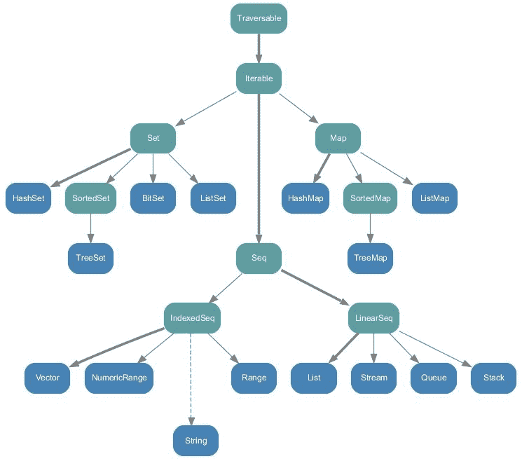

# 收集 API

"That we become depends on what we read after all of the professors have finished with us. The greatest university of all is a collection of books."

托马斯·卡莱尔

吸引大多数 Scala 用户的特性之一是它的集合 API，这些 API 非常强大、灵活，并且有许多与之相关的操作。广泛的操作将使您轻松处理任何类型的数据。我们将介绍 Scala 集合 API，包括它们的不同类型和层次结构，以便适应不同类型的数据并解决各种不同的问题。简而言之，本章将涵盖以下主题:

*   Scala 集合 API
*   类型和层次结构
*   运行特性
*   Java 互操作性
*   使用 Scala 隐式

# Scala 集合 API

Scala 集合是一个很好理解和经常使用的编程抽象，可以区分可变和不可变集合。像一个可变变量一样，一个*可变的*集合可以在必要时被改变、更新或扩展。然而，就像一个不可变的变量一样，i *mmutable* 集合是不能改变的。使用它们的大多数收集类分别位于包`scala.collection`、`scala.collection.immutable`和`scala.collection.mutable`中。

Scala 的这一极其强大的特性为您提供了以下使用和操作数据的工具:

*   **好用**:比如帮助你消除迭代器和集合更新之间的干扰。因此，包含 20-50 种方法的小词汇表应该足以解决数据分析解决方案中的大部分收集问题。
*   **简洁**:你可以用轻量级的语法来使用函数运算，并组合运算，最后，你会觉得你在使用自定义代数。
*   **Safe** :帮助你在编码时处理大部分错误。
*   **快速**:大部分采集对象都经过精心调优；这使您能够以更快的方式进行数据计算。
*   **通用**:集合可以让你在任何地方、任何类型上使用和执行相同的操作。

在下一节中，我们将探索 Scala 集合 APIs 的类型和相关层次结构。我们将看到使用集合 API 中大多数特性的几个例子。

# 类型和层次结构

Scala 集合是一个很好理解和经常使用的编程抽象，可以区分可变和不可变集合。像可变变量一样，可变集合可以在必要时更改、更新或扩展。像一个不可变的变量，不可变的集合；无法更改。大多数使用它们的收集类分别位于包`scala.collection`、`scala.collection.immutable`和`scala.collection.mutable`中。

下面的层次图(*图 1* )根据 Scala 的官方文档展示了 Scala 集合 API 层次。这些要么都是高级抽象类，要么都是特质。这些有可变的和不可变的实现。


**Figure 1:** Collections under package scala.collection

# 可穿越

**可穿越**是收藏品层次结构的根源。在 Traversable 中，Scala Collections API 提供了各种操作的定义。Traversable 中只有一个抽象的方法，那就是`foreach`方法。

```scala
def foreach[U](f: Elem => U): Unit

```

这个方法对于 Traversable 中包含的所有操作都是必不可少的。如果您已经学习了数据结构，您将熟悉遍历数据结构的元素并对每个元素执行一个函数。`foreach`方法正是这样做的，它遍历集合中的元素，并对每个元素执行函数`f`。正如我们提到的，这是一个抽象的方法，它被设计成根据使用它的底层集合有不同的定义，以确保每个集合的代码高度优化。

# 可重复的

**可迭代的**是 Scala 集合应用编程接口层次图中的第二个根。它有一个称为迭代器的抽象方法，必须在所有其他子集合中实现/定义。它还从根实现`foreach`方法，这是可遍历的。但是正如我们提到的，所有派生的子集合将覆盖这个实现，以进行与这个子集合相关的特定优化。

# 序列、线性序列和索引均衡器

序列与通常的 Iterable 有一些不同，它有一个定义的长度和顺序。Seq 有`LinearSeq`和`IndexedSeq`两个子性状。让我们快速了解一下它们。

`LinearSeq`是线性序列的基本性状。线性序列有合理有效的头、尾和`isEmpty`方法。如果这些方法提供了遍历集合的最快方法，那么扩展这个特性的集合`Coll`也应该扩展`LinearSeqOptimized[A, Coll[A]]`。`LinearSeq`有三种具体方法:

*   **isEmpty:** 检查列表是否为空
*   **头**:返回列表/序列中的第一个元素
*   **tail** :这将返回列表中除第一个元素之外的所有元素。继承`LinearSeq`的每个子集合都有自己的这些方法的实现，以确保良好的性能。继承/扩展的两个集合是流和列表。

For more on this topic, refer to this URL at [http://www.scala-lang.org/api/current/scala/collection/LinearSeq.html.](http://www.scala-lang.org/api/current/scala/collection/LinearSeq.html)

最后，`IndexedSeq`有两种方法，根据它们来定义:

*   **应用**:这将通过索引查找元素。
*   **长度**:返回序列的长度。根据元素的索引查找元素需要子集合执行良好的实现。其中两个索引序列是`Vector`和`ArrayBuffer`。

# 可变的和不可变的

在 Scala 中，您会发现可变和不可变的集合。集合可以有可变实现和不可变实现。这就是为什么在 Java 中，一个`List`不能同时是一个`LinkedList`和一个`ArrayList`，但是`List`有一个`LinkedList`实现和一个`ArrayList`实现。下图显示了包装`scala.collection.immutable`中的所有集合:



**Figure 2:** All collections in package scala.collection.immutable

默认情况下，Scala 导入不可变集合，如果您需要使用可变集合，那么您需要自己导入它。现在，要获得软件包`scala.collection.mutable`中所有集合的简要概述，请参考下图:


**Figure 3:** All collections in package Scala.collection.mutable

在每一种面向对象和函数式编程语言中，数组都是一个重要的集合包，它帮助我们存储数据对象，以便以后我们也可以非常容易地访问它们。在下一小节中，我们将通过一些例子来详细讨论数组。

# 数组

数组是可变的集合。在数组中，元素的顺序将被保留，重复的元素将被保留。由于可变，您可以通过索引号来访问数组的任何元素来更改它的值。让我们用几个例子来演示数组。使用下面一行代码来声明一个简单的数组:

```scala
val numbers: Array[Int] = Array[Int](1, 2, 3, 4, 5, 1, 2, 3, 3, 4, 5) // A simple array

```

现在，打印数组的所有元素:

```scala
println("The full array is: ")for (i <- numbers) {print(" " + i)}

```

现在，打印一个特定的元素:例如，元素 3:

```scala
println(numbers(2))

```

让我们对所有元素求和并打印总和:

```scala
var total = 0;for (i <- 0 to (numbers.length - 1)) {total = total + numbers(i)}println("Sum: = " + total)

```

寻找最小的元素:

```scala
var min = numbers(0)for (i <- 1 to (numbers.length - 1)) {if (numbers(i) < min) min = numbers(i)}println("Min is: " + min)

```

找到最大的元素:

```scala
var max = numbers(0);for (i <- 1 to (numbers.length - 1)) {if (numbers(i) > max) max = numbers(i)}println("Max is: " + max)

```

创建和定义数组的另一种方法是使用如下的`range ()`方法:

```scala
//Creating array using range() methodvar myArray1 = range(5, 20, 2)var myArray2 = range(5, 20)

```

前一行代码意味着我已经创建了一个数组，其元素在 5 到 20 之间，范围差为 2。如果不指定 3 <sup class="calibre26">rd</sup> 参数，Scala 会假设范围差为:

```scala
//Creating array using range() method without range differencevar myArray1 = range(5, 20, 2)

```

现在，让我们看看如何访问这些元素，如下所示:

```scala
// Print all the array elementsfor (x <- myArray1) {print(" " + x)}println()for (x <- myArray2) {print(" " + x)}

```

甚至可以使用如下`concat()`方法连接两个数组:

```scala
//Array concatenationvar myArray3 =  concat( myArray1, myArray2)      // Print all the array elementsfor ( x <- myArray3 ) {print(" "+ x)}

```

请注意，要使用`range()`和`concat()`方法，您需要导入 Scala `Array`包，如下所示:

```scala
Import Array._

```

最后，甚至可以定义和使用多维数组，如下所示:

```scala
var myMatrix = ofDim[Int](4,4)

```

现在，首先使用前面的数组创建矩阵，如下所示:

```scala
var myMatrix = ofDim[Int](4, 4)// build a matrixfor (i <- 0 to 3) {for (j <- 0 to 3) {myMatrix(i)(j) = j}}println()

```

按如下方式打印先前的矩阵:

```scala
// Print two dimensional arrayfor (i <- 0 to 3) {for (j <- 0 to 3) {print(" " + myMatrix(i)(j))}println()}

```

前面例子的完整源代码可以看到如下:

```scala
package com.chapter4.CollectionAPIimport Array._                                                                                         object ArrayExample {def main(args: Array[String]) {val numbers: Array[Int] = Array[Int](1, 2, 3, 4, 5, 1, 2, 3, 3, 4, 5)// A simple array// Print all the element of the arrayprintln("The full array is: ")for (i <- numbers) {print(" " + i)}//Print a particular element for example element 3println(numbers(2))//Summing all the elementsvar total = 0for (i <- 0 to (numbers.length - 1)) {total = total + numbers(i)}println("Sum: = " + total)// Finding the smallest elementvar min = numbers(0)for (i <- 1 to (numbers.length - 1)) {if (numbers(i) < min) min = numbers(i)}println("Min is: " + min)// Finding the largest elementvar max = numbers(0)for (i <- 1 to (numbers.length - 1)) {if (numbers(i) > max) max = numbers(i)}println("Max is: " + max)//Creating array using range() methodvar myArray1 = range(5, 20, 2)var myArray2 = range(5, 20)// Print all the array elementsfor (x <- myArray1) {print(" " + x)}println()for (x <- myArray2) {print(" " + x)}//Array concatenationvar myArray3 = concat(myArray1, myArray2)// Print all the array elementsfor (x <- myArray3) {print(" " + x)}//Multi-dimensional arrayvar myMatrix = ofDim[Int](4, 4)// build a matrixfor (i <- 0 to 3) {for (j <- 0 to 3) {myMatrix(i)(j) = j}}println();// Print two dimensional arrayfor (i <- 0 to 3) {for (j <- 0 to 3) {print(" " + myMatrix(i)(j))}println();}}}

```

您将获得以下输出:

```scala
The full array is: 1 2 3 4 5 1 2 3 3 4 53 Sum: = 33 Min is: 1 Max is: 5 5 7 9 11 13 15 17 19 5 6 7 8 9 10 11 12 13 14 15 16 17 18 19 5 7 9 11 13 15 17 19 5 6 7 8 9 10 11 12 13 14 15 16 17 18 19 0 1 2 3 0 1 2 3 0 1 2 3 0 1 2 3

```

在 Scala 中，列表保持顺序，保留重复的元素，并检查它们的不变性。现在，让我们在下一小节中看到一些在 Scala 中使用列表的例子。

# 列表

如前所述，Scala 提供可变和不可变的集合。默认情况下，不可变集合是导入的，但是如果您需要使用可变集合，您需要自己导入。列表是不可变的集合，如果您希望保留元素之间的顺序并保留重复项，则可以使用它。让我们演示一个例子，看看列表如何保持顺序和保持重复的元素，并检查其不变性:

```scala
scala> val numbers = List(1, 2, 3, 4, 5, 1, 2, 3, 4, 5)numbers: List[Int] = List(1, 2, 3, 4, 5, 1, 2, 3, 4, 5) scala> numbers(3) = 10 <console>:12: error: value update is not a member of List[Int] numbers(3) = 10 ^

```

您可以使用两种不同的构造块来定义列表。`Nil`代表`List`的尾部，之后是一个空的`List`。因此，前面的例子可以改写为:

```scala
scala> val numbers = 1 :: 2 :: 3 :: 4 :: 5 :: 1 :: 2 :: 3:: 4:: 5 :: Nilnumbers: List[Int] = List(1, 2, 3, 4, 5, 1, 2, 3,4, 5

```

在下面的详细示例中，让我们用它的方法检查列表:

```scala
package com.chapter4.CollectionAPIobject ListExample {def main(args: Array[String]) {// List of citiesval cities = "Dublin" :: "London" :: "NY" :: Nil// List of Even Numbersval nums = 2 :: 4 :: 6 :: 8 :: Nil// Empty List.val empty = Nil// Two dimensional listval dim = 1 :: 2 :: 3 :: Nil ::4 :: 5 :: 6 :: Nil ::7 :: 8 :: 9 :: Nil :: Nilval temp = Nil// Getting the first element in the listprintln( "Head of cities : " + cities.head )// Getting all the elements but the last oneprintln( "Tail of cities : " + cities.tail )//Checking if cities/temp list is emptyprintln( "Check if cities is empty : " + cities.isEmpty )println( "Check if temp is empty : " + temp.isEmpty )val citiesEurope = "Dublin" :: "London" :: "Berlin" :: Nilval citiesTurkey = "Istanbul" :: "Ankara" :: Nil//Concatenate two or more lists with :::var citiesConcatenated = citiesEurope ::: citiesTurkeyprintln( "citiesEurope ::: citiesTurkey : "+citiesConcatenated )// using the concat methodcitiesConcatenated = List.concat(citiesEurope, citiesTurkey)println( "List.concat(citiesEurope, citiesTurkey) : " +citiesConcatenated  )}}

```

您将获得以下输出:

```scala
Head of cities : DublinTail of cities : List(London, NY)Check if cities is empty : falseCheck if temp is empty : truecitiesEurope ::: citiesTurkey : List(Dublin, London, Berlin, Istanbul, Ankara)List.concat(citiesEurope, citiesTurkey) : List(Dublin, London, Berlin, Istanbul, Ankara)

```

现在，让我们在下一小节中看到如何在 Scala 应用程序中使用集合的另一个快速概述。

# 设置

集合是使用最广泛的集合之一。器械包中的顺序不会被保留，器械包不允许重复元素。你可以把它想象成集合的数学符号。让我们通过一个例子来演示这一点，我们将看到集合是如何不保留顺序和不允许重复的:

```scala
scala> val numbers = Set( 1, 2, 3, 4, 5, 1, 2, 3, 4, 5)numbers: scala.collection.immutable.Set[Int] = Set(5, 1, 2, 3, 4)

```

以下源代码显示了 Scala 程序中集合的不同用法:

```scala
package com.chapter4.CollectionAPIobject SetExample {def main(args: Array[String]) {// Empty set of integer typevar sInteger : Set[Int] = Set()// Set of even numbersvar sEven : Set[Int] = Set(2,4,8,10)//Or you can use this syntaxvar sEven2 = Set(2,4,8,10)val cities = Set("Dublin", "London", "NY")val tempNums: Set[Int] = Set()//Finding Head, Tail, and checking if the sets are emptyprintln( "Head of cities : " + cities.head )println( "Tail of cities : " + cities.tail )println( "Check if cities is empty : " + cities.isEmpty )println( "Check if tempNums is empty : " + tempNums.isEmpty )val citiesEurope = Set("Dublin", "London", "NY")val citiesTurkey = Set("Istanbul", "Ankara")// Sets Concatenation using ++ operatorvar citiesConcatenated = citiesEurope ++ citiesTurkeyprintln( "citiesEurope ++ citiesTurkey : " + citiesConcatenated )//Also you can use ++ as a methodcitiesConcatenated = citiesEurope.++(citiesTurkey)println( "citiesEurope.++(citiesTurkey) : " + citiesConcatenated )//Finding minimum and maximum elements in the setval evenNumbers = Set(2,4,6,8)// Using the min and max methodsprintln( "Minimum element in Set(2,4,6,8) : " + evenNumbers.min )println( "Maximum element in Set(2,4,6,8) : " + evenNumbers.max )}}

```

您将获得以下输出:

```scala
Head of cities : DublinTail of cities : Set(London, NY)Check if cities is empty : falseCheck if tempNums is empty : truecitiesEurope ++ citiesTurkey : Set(London, Dublin, Ankara, Istanbul, NY)citiesEurope.++(citiesTurkey) : Set(London, Dublin, Ankara, Istanbul, NY)Minimum element in Set(2,4,6,8) : 2Maximum element in Set(2,4,6,8) : 8

```

从我使用 Java 或 Scala 开发 Spark 应用程序的个人经验来看，我发现元组的使用非常频繁，尤其是在不使用任何显式类的情况下对元素集合进行分组。在下一小节中，我们将看到如何开始使用 Scala 中的元组。

# 元组

Scala 元组用于将固定数量的项目组合在一起。这种分组的最终目标是帮助匿名函数，以便它们可以作为一个整体传递。数组或列表的真正区别在于，元组可以保存不同类型的对象，同时维护每个元素的类型信息，而集合则不能，并且使用公共类型作为类型(例如，在前面的示例中，该集合的类型将是`Set[Any]`)。

从计算角度来看，Scala 元组也是不可变的。换句话说，元组确实使用一个类来存储元素(例如，`Tuple2`、`Tuple3`、`Tuple22`等等)。

下面是一个包含整数、字符串和控制台的元组示例:

```scala
val tuple_1 = (20, "Hello", Console)

```

以下哪个是语法糖(快捷方式):

```scala
val t = new Tuple3(20, "Hello", Console)

```

另一个例子:

```scala
scala> val cityPop = ("Dublin", 2)cityPop: (String, Int) = (Dublin,2)

```

您没有命名的访问器来访问元组数据，而是需要使用基于位置的访问器，并且是从 1 开始而不是从 0 开始的。例如:

```scala
scala> val cityPop = ("Dublin", 2)cityPop: (String, Int) = (Dublin,2)scala> cityPop._1res3: String = Dublinscala> cityPop._2res4: Int = 2

```

此外，元组可以完美地适合模式匹配。例如:

```scala
cityPop match {case ("Dublin", population) => ...case ("NY", population) => ...}

```

您甚至可以使用特殊的运算符`->`来为 2 值元组编写紧凑的语法。例如:

```scala
scala> "Dublin" -> 2res0: (String, Int) = (Dublin,2)

```

下面是演示元组功能的更详细的示例:

```scala
package com.chapter4.CollectionAPIobject TupleExample {def main(args: Array[String]) {val evenTuple = (2,4,6,8)val sumTupleElements =evenTuple._1 + evenTuple._2 + evenTuple._3 + evenTuple._4println( "Sum of Tuple Elements: "  + sumTupleElements )      // You can also iterate over the tuple and print it's element using the foreach methodevenTuple.productIterator.foreach{ evenTuple =>println("Value = " + evenTuple )}}}

```

您将获得以下输出:

```scala
Sum of Tuple Elements: 20 Value = 2 Value = 4 Value = 6 Value = 8

```

现在，让我们深入研究在 Scala 中使用映射的世界，这些映射被广泛用于保存基本的数据类型。

# 地图

映射是由键和值对组成的`Iterable`(也称为映射或关联)。地图也是最广泛使用的连接之一，因为它可以用来保存基本的数据类型。例如:

```scala
scala> Map(1 -> 2)res7: scala.collection.immutable.Map[Int,Int] = Map(1 -> 2)                                                scala> Map("X" -> "Y")res8: scala.collection.immutable.Map[String,String] = Map(X -> Y)

```

Scala 的`Predef`对象提供了一个隐式转换，允许您编写`key -> value`作为`pair (key, value)`的替代语法。例如，`Map("a" -> 10, "b" -> 15, "c" -> 16)`的意思和`Map(("a", 10), ("b", 15), ("c", 16))`完全一样，但是读起来更好。

而且一个`Map`可以简单的认为是`Tuple2s`的集合:

```scala
Map(2 -> "two", 4 -> "four")

```

前一行应理解为:

```scala
Map((2, "two"), (4, "four"))

```

在示例中，我们可以声明使用`Map`可以存储一个函数，这就是函数编程语言中函数的全部要点:它们是一等公民，可以在任何地方使用。

假设您有一种方法可以找到数组中的 max 元素，如下所示:

```scala
var myArray = range(5, 20, 2)def getMax(): Int = {// Finding the largest elementvar max = myArray(0)for (i <- 1 to (myArray.length - 1)) {if (myArray(i) > max)max = myArray(i)}max}

```

现在，让我们对其进行映射，以便使用`Map`方法可以存储:

```scala
scala> val myMax = Map("getMax" -> getMax()) scala> println("My max is: " + myMax )

```

我们再来看一个使用地图的例子，如下所示:

```scala
scala> Map( 2 -> "two", 4 -> "four")res9: scala.collection.immutable.Map[Int,String] = Map(2 -> two, 4 -> four)scala> Map( 1 -> Map("X"-> "Y"))res10: scala.collection.immutable.Map[Int,scala.collection.immutable.Map[String,String]] = Map(1 -> Map(X -> Y))

```

以下是演示`Map`功能的详细示例:

```scala
package com.chapter4.CollectionAPIimport Array._object MapExample {var myArray = range(5, 20, 2)def getMax(): Int = {// Finding the largest elementvar max = myArray(0)for (i <- 1 to (myArray.length - 1)) {if (myArray(i) > max)max = myArray(i)}max}def main(args: Array[String]) {val capitals = Map("Ireland" -> "Dublin", "Britain" -> "London", "Germany" -> "Berlin")val temp: Map[Int, Int] = Map()val myMax = Map("getMax" -> getMax())println("My max is: " + myMax )println("Keys in capitals : " + capitals.keys)println("Values in capitals : " + capitals.values)println("Check if capitals is empty : " + capitals.isEmpty)println("Check if temp is empty : " + temp.isEmpty)val capitals1 = Map("Ireland" -> "Dublin", "Turkey" -> "Ankara","Egypt" -> "Cairo")val capitals2 = Map("Germany" -> "Berlin", "Saudi Arabia" ->"Riyadh")// Map concatenation using ++ operatorvar capitalsConcatenated = capitals1 ++ capitals2println("capitals1 ++ capitals2 : " + capitalsConcatenated)// use two maps with ++ as methodcapitalsConcatenated = capitals1.++(capitals2)println("capitals1.++(capitals2)) : " + capitalsConcatenated)}}

```

您将获得以下输出:

```scala
My max is: Map(getMax -> 19)Keys in capitals : Set(Ireland, Britain, Germany)Values in capitals : MapLike(Dublin, London, Berlin)Check if capitals is empty : falseCheck if temp is empty : truecapitals1 ++ capitals2 : Map(Saudi Arabia -> Riyadh, Egypt -> Cairo, Ireland -> Dublin, Turkey -> Ankara, Germany -> Berlin)capitals1.++(capitals2)) : Map(Saudi Arabia -> Riyadh, Egypt -> Cairo, Ireland -> Dublin, Turkey -> Ankara, Germany -> Berlin)

```

现在，让我们快速概述一下在 Scala 中使用选项；这基本上是一个可以保存数据的数据容器。

# [计]选项

`Option`类型在 Scala 程序中经常使用，您可以将其与 Java 中可用的空值进行比较，空值表示没有值。Scala `Option [T]`是给定类型的零或一个元素的容器。`Option [T]`可以是`Some [T]`或`None`对象，表示缺少的值。例如，如果找到了对应于给定键的值，Scala 的`Map`的 get 方法会生成`Some`(值)，如果给定键没有在`Map`中定义，则生成`None`。

`Option`的基本特征是这样的:

```scala
trait Option[T] {def get: A // Returns the option's value.def isEmpty: Boolean // Returns true if the option is None, falseotherwise.def productArity: Int // The size of this product. For a productA(x_1, ..., x_k), returns kdef productElement(n: Int): Any // The nth element of this product,0-baseddef exists(p: (A) => Boolean): Boolean // Returns true if this optionis nonempty def filter(p: (A) => Boolean): Option[A] // Returns this Option if itis nonempty def filterNot(p: (A) => Boolean): Option[A] // Returns this Option ifit is nonempty or return None.def flatMap[B](f: (A) => Option[B]): Option[B] // Returns result ofapplying f to this Option's def foreach[U](f: (A) => U): Unit // Apply given procedure f to theoption's value, if it is nonempty.  def getOrElse[B >: A](default: => B): B // Returns the option's valueif the option is nonempty, def isDefined: Boolean // Returns true if the option is an instanceof Some, false otherwise.def iterator: Iterator[A] // Returns a singleton iterator returningOption's value if it is nonemptydef map[B](f: (A) => B): Option[B] // Returns a Some containingresult of applying f to this Option's def orElse[B >: A](alternative: => Option[B]): Option[B] // Returnsthis Option if it is nonemptydef orNull // Returns the option's value if it is nonempty,or null if it is empty.  }

```

例如，在下面的代码中，我们试图映射和显示位于一些国家的一些城市，如`India`、`Bangladesh`、`Japan`和`USA`:

```scala
object ScalaOptions {def main(args: Array[String]) {val megacity = Map("Bangladesh" -> "Dhaka", "Japan" -> "Tokyo","India" -> "Kolkata", "USA" -> "New York")println("megacity.get( \"Bangladesh\" ) : " + show(megacity.get("Bangladesh")))println("megacity.get( \"India\" ) : " + show(megacity.get("India")))}}

```

现在，为了让前面的代码工作，我们需要在某个地方定义`show()`方法。在这里，我们可以使用`Option`通过 Scala 模式匹配来实现，如下所示:

```scala
def show(x: Option[String]) = x match {case Some(s) => scase None => "?"}

```

将这些信息结合在一起，应该可以打印出我们所期望的准确和理想的结果:

```scala
package com.chapter4.CollectionAPIobject ScalaOptions {def show(x: Option[String]) = x match {case Some(s) => scase None => "?"} def main(args: Array[String]) {val megacity = Map("Bangladesh" -> "Dhaka", "Japan" -> "Tokyo","India" -> "Kolkata", "USA" -> "New York")println("megacity.get( \"Bangladesh\" ) : " +show(megacity.get("Bangladesh")))println("megacity.get( \"India\" ) : " +show(megacity.get("India")))}}

```

您将获得以下输出:

```scala
megacity.get( "Bangladesh" ) : Dhakamegacity.get( "India" ) : Kolkata

```

使用`getOrElse()`方法，可以在没有值时访问值或默认值。例如:

```scala
// Using getOrElse() method: val message: Option[String] = Some("Hello, world!")val x: Option[Int] = Some(20)val y: Option[Int] = Noneprintln("message.getOrElse(0): " + message.getOrElse(0))println("x.getOrElse(0): " + x.getOrElse(0))println("y.getOrElse(10): " + y.getOrElse(10))

```

您将获得以下输出:

```scala
message.getOrElse(0): Hello, world!x.getOrElse(0): 20y.getOrElse(10): 10

```

而且，使用`isEmpty()`方法，可以检查选项是否为`None`。例如:

```scala
println("message.isEmpty: " + message.isEmpty)println("x.isEmpty: " + x.isEmpty)println("y.isEmpty: " + y.isEmpty)

```

现在，完整的程序如下:

```scala
package com.chapter4.CollectionAPIobject ScalaOptions {def show(x: Option[String]) = x match {case Some(s) => scase None => "?"}def main(args: Array[String]) {val megacity = Map("Bangladesh" -> "Dhaka", "Japan" -> "Tokyo","India" -> "Kolkata", "USA" -> "New York")println("megacity.get( \"Bangladesh\" ) : " +show(megacity.get("Bangladesh")))println("megacity.get( \"India\" ) : " +show(megacity.get("India")))// Using getOrElse() method: val message: Option[String] = Some("Hello, world")val x: Option[Int] = Some(20)val y: Option[Int] = Noneprintln("message.getOrElse(0): " + message.getOrElse(0))println("x.getOrElse(0): " + x.getOrElse(0))println("y.getOrElse(10): " + y.getOrElse(10))// Using isEmpty()println("message.isEmpty: " + message.isEmpty)println("x.isEmpty: " + x.isEmpty)println("y.isEmpty: " + y.isEmpty)}}

```

您将获得以下输出:

```scala
megacity.get( "Bangladesh" ) : Dhakamegacity.get( "India" ) : Kolkatamessage.getOrElse(0): Hello, worldx.getOrElse(0): 20y.getOrElse(10): 10message.isEmpty: falsex.isEmpty: falsey.isEmpty: true

```

让我们看看其他关于何时使用`Option`的例子。例如，`Map.get()`方法使用`Option`来告诉用户他试图访问的元素是否存在。例如:

```scala
scala> val numbers = Map("two" -> 2, "four" -> 4)numbers: scala.collection.immutable.Map[String,Int] = Map(two -> 2, four -> 4)scala> numbers.get("four")res12: Option[Int] = Some(4)scala> numbers.get("five")res13: Option[Int] = None

```

现在，我们将看到如何使用 exists，它用于检查谓词是否适用于遍历集合中一组元素的子集。

# 存在

Exists 检查谓词是否至少包含 Traversable 集合中的一个元素。例如:

```scala
def exists(p: ((A, B)) ⇒ Boolean): Boolean  

```

**Using the fat arrow:** `=>` is called the *right arrow*, *fat arrow,* or *rocket* and is used for passing parameters by name. That means the expression will be evaluated when a parameter is accessed. It is actually syntactic sugar for a zero parameter function `call: x: () => Boolean`. Let's see an example using this operator is as follows:
`package com.chapter4.CollectionAPI`
`object UsingFatArrow {`
`def fliesPerSecond(callback: () => Unit) {`
`while (true) { callback(); Thread sleep 1000 }`
`}`
`def main(args: Array[String]): Unit= {`
`fliesPerSecond(() => println("Time and tide wait for none but fly like arrows ..."))`
`}`
`}`
You will get the following output:
`Time and tide wait for none but flies like an arrow...`
`Time and tide wait for none but flies like an arrow...`
`Time and tide wait for none but flies like an arrow...`
`Time and tide wait for none but flies like an arrow...`
`Time and tide wait for none but flies like an arrow...`
`Time and tide wait for none but flies like an arrow...`

下面的代码中可以看到一个详细的例子:

```scala
package com.chapter4.CollectionAPIobject ExistsExample {def main(args: Array[String]) {// Given a list of cities and now check if "Dublin" is included inthe list     val cityList = List("Dublin", "NY", "Cairo")val ifExisitsinList = cityList exists (x => x == "Dublin")println(ifExisitsinList)// Given a map of countries and their capitals check if Dublin isincluded in the Map val cityMap = Map("Ireland" -> "Dublin", "UK" -> "London")val ifExistsinMap =  cityMap exists (x => x._2 == "Dublin")println(ifExistsinMap)}}

```

您将获得以下输出:

```scala
truetrue

```

**Note: Using the infix operator in Scala**:

在前面的例子和后面的部分中，我们使用了 Scala 中缀符号。假设您想对复数执行一些操作，并且有一个带有加法方法的 case 类用于将两个复数相加:

```scala
case class Complex(i: Double, j: Double) {def plus(other: Complex): Complex = Complex(i + other.i, j + other.j)}

```

现在，为了访问这个类的属性，您需要创建一个如下所示的对象:

```scala
val obj = Complex(10, 20)

```

此外，假设您定义了以下两个复数:

```scala
val a = Complex(6, 9)val b = Complex(3, -6)

```

现在要从 case 类访问`plus()`方法，您将执行如下操作:

```scala
val z = obj.plus(a)

```

这应该会给你输出:`Complex(16.0,29.0)`。但是，如果只是这样调用方法，不是很好吗:

```scala
val c = a plus b

```

它真的很有魅力。下面是完整的例子:

```scala
package com.chapter4.CollectionAPIobject UsingInfix {case class Complex(i: Double, j: Double) {def plus(other: Complex): Complex = Complex(i + other.i, j + other.j)}  def main(args: Array[String]): Unit = {    val obj = Complex(10, 20)val a = Complex(6, 9)val b = Complex(3, -6)val c = a plus bval z = obj.plus(a)println(c)println(z)}}

```

**中缀运算符的优先级**:这是由运算符的第一个字符决定的。下面按优先级的递增顺序列出了字符，同一行中的字符具有相同的优先级:

```scala
(all letters)|^&= !< >:+ -* / %(all other special characters)

```

**General warning**: Using the infix notation for calling regular, non-symbolic methods is discouraged and should be used only if it significantly increases readability. One example of a sufficiently motivated use of infix notation is matchers and other parts of the tests definition in `ScalaTest`.

Scala 收集包中另一个有趣的元素是使用`forall`。它用于检查谓词是否适用于`Traversable`集合中的每个元素。在下一小节中，我们将看到一个例子。

# Forall

Forall 检查谓词是否适用于`Traversable`集合中的每个元素。它可以正式定义如下:

```scala
def forall (p: (A) ⇒ Boolean): Boolean  

```

让我们看一个如下的例子:

```scala
scala> Vector(1, 2, 8, 10) forall (x => x % 2 == 0)res2: Boolean = false

```

在编写 Scala 代码进行预处理时，我们经常需要过滤选定的数据对象。Scala 集合应用编程接口的过滤器特性就是为此而使用的。在下一小节中，我们将看到一个使用过滤器的例子。

# 过滤器

`filter`选择满足特定谓词的所有元素。它可以正式定义如下:

```scala
def filter(p: (A) ⇒ Boolean): Traversable[A]  

```

让我们看一个如下的例子:

```scala
scala> //Given a list of tuples (cities, Populations)scala> // Get all cities that has population more than 5 millionscala> List(("Dublin", 2), ("NY", 8), ("London", 8)) filter (x =>x._2 >= 5)res3: List[(String, Int)] = List((NY,8), (London,8))

```

通过遍历一个函数到集合中的所有元素，映射用于构建一个新的集合或一组元素。在下一小节中，我们将看到一个使用`Map`的例子。

# 地图

Map 用于通过遍历函数到集合的所有元素来构建新的集合或元素集。它可以正式定义如下:

```scala
def map[B](f: (A) ⇒ B): Map[B]  

```

让我们看一个如下的例子:

```scala
scala> // Given a list of integersscala> // Get a list with all the elements square.scala> List(2, 4, 5, -6) map ( x=> x * x)res4: List[Int] = List(4, 16, 25, 36)

```

在 Scala 中使用集合 API 时，您经常需要选择列表或数组的第 n <sup class="calibre26">个</sup>元素，例如。在下一小节中，我们将探索使用 take 的示例。

# 拿

Take 用于获取集合的前 n 个元素。使用`take`的正式定义如下:

```scala
def take(n: Int): Traversable[A]

```

让我们看一个如下的例子:

```scala
// Given an infinite recursive method creating a stream of odd numbers.def odd: Stream[Int] = {def odd0(x: Int): Stream[Int] =if (x%2 != 0) x #:: odd0(x+1)else odd0(x+1)odd0(1)}// Get a list of the 5 first odd numbers.odd take (5) toList

```

您将获得以下输出:

```scala
res5: List[Int] = List(1, 3, 5, 7, 9)

```

在 Scala 中，如果想要根据特定的划分函数将特定的集合划分到另一个`Traversable`集合的地图中，可以使用`groupBy()`方法。在下一小节中，我们将展示一些使用`groupBy()`的例子。

# 群组依据

GroupBy 用于根据特定的划分函数将特定的集合划分为其他可遍历集合的映射。它可以正式定义如下:

```scala
def groupBy[K](f: ((A, B)) ⇒ K): Map[K, Map[A, B]]  

```

让我们看一个如下的例子:

```scala
scala> // Given a list of numbersscala> // Group them as positive and negative numbers.scala> List(1,-2,3,-4) groupBy (x => if (x >= 0) "positive" else "negative")res6: scala.collection.immutable.Map[String,List[Int]] = Map(negative -> List(-2, -4), positive -> List(1, 3))

```

在 Scala 中，如果想要选择 Traversable 集合中除最后一个元素之外的所有元素，可以使用`init`。在下一小节中，我们将看到它的示例。

# 初始化

`init`选择`Traversable`集合中除最后一个元素以外的所有元素。它可以正式定义如下:

```scala
def init: Traversable[A]  

```

让我们看一个如下的例子:

```scala
scala> List(1,2,3,4) initres7: List[Int] = List(1, 2, 3)

```

在 Scala 中，如果想要选择除前 n 个元素之外的所有元素，应该使用 drop。在下一小节中，我们将看到如何使用 drop。

# 滴

`drop`用于选择除前 n 个元素外的所有元素。它可以正式定义如下:

```scala
def drop(n: Int): Traversable[A]  

```

让我们看一个如下的例子:

```scala
// Drop the first three elementsscala> List(1,2,3,4) drop 3res8: List[Int] = List(4)

```

在 Scala 中，如果你想获取一组元素直到满足一个谓词，你应该使用`takeWhile`。在下一小节中，我们将看到如何使用`takeWhile`。

# 趁现在

TakeWhile 用于获取一组元素，直到满足一个谓词。它可以正式定义如下:

```scala
def takeWhile(p: (A) ⇒ Boolean): Traversable[A]  

```

让我们看一个如下的例子:

```scala
// Given an infinite recursive method creating a stream of odd numbers.def odd: Stream[Int] = {def odd0(x: Int): Stream[Int] =if (x%2 != 0) x #:: odd0(x+1)else odd0(x+1)odd0(1)}// Return a list of all the odd elements until an element isn't less then 9\. odd takeWhile (x => x < 9) toList

```

您将获得以下输出:

```scala
res11: List[Int] = List(1, 3, 5, 7)

```

在 Scala 中，如果你想省略一组元素直到满足一个谓词，你应该使用`dropWhile`。我们将在下一小节中看到一些这样的例子。

# DropWhile

`dropWhile`用于省略一组元素，直到满足一个谓词。它可以正式定义如下:

```scala
def dropWhile(p: (A) ⇒ Boolean): Traversable[A]  

```

让我们看一个如下的例子:

```scala
//Drop values till reaching the border between numbers that are greater than 5 and less than 5scala> List(2,3,4,9,10,11) dropWhile(x => x <5)res1: List[Int] = List(9, 10, 11)

```

在 Scala 中，如果您想使用您的**用户定义函数** ( **UDF** )以使它在嵌套列表中将一个函数作为参数，并将输出组合在一起，`flatMap()`是一个完美的候选。我们将在下一节看到使用`flatMap()`的例子。

# 平面地图

FltatMap 以函数作为参数。赋予`flatMap()`的函数在嵌套列表上不起作用，但它产生一个新的集合。它可以正式定义如下:

```scala
def flatMap[B](f: (A) ⇒ GenTraversableOnce[B]): Traversable[B]  

```

让我们看一个如下的例子:

```scala
//Applying function on nested lists and then combining output back togetherscala> List(List(2,4), List(6,8)) flatMap(x => x.map(x => x * x))res4: List[Int] = List(4, 16, 36, 64)

```

我们刚刚介绍完 Scala 集合特性的使用。还要注意的是，诸如`Fold()`、`Reduce()`、`Aggregate()`、`Collect()`、`Count()`、`Find()`、`Zip()`等方法可以用于从一个集合传递到另一个集合(例如，`toVector`、`toSeq`、`toSet`、`toArray`)。然而，我们将在接下来的章节中看到这样的例子。目前，是时候看看不同 Scala 集合 API 的一些性能特征了。

# 运行特性

在 Scala 中，不同的集合具有不同的性能特征，这些性能特征是您选择一个集合而不是其他集合的原因。在本节中，我们将从操作和内存使用的角度来判断 Scala 集合对象的性能特征。在本节的最后，我们将提供一些指南，为您的代码和问题类型选择合适的集合对象。

# 集合对象的性能特征

以下是 Scala Collections 的性能特征，基于 Scala 的官方文档。

*   **常量**:操作只需要常量时间。
*   **eConst** :该操作实际上需要恒定的时间，但这可能取决于一些假设，例如向量的最大长度或哈希键的分布。
*   **线性**:操作随采集规模线性增长。
*   **Log** :操作随集合大小对数增长。
*   **a 运行**:运行需要摊销的恒定时间。操作的某些调用可能需要更长的时间，但是如果平均执行许多操作，则每个操作只需要恒定的时间。
*   **NA** :不支持操作。

下表显示了序列类型(不可变)的性能特征。

| **不可变 CO*** | **头** | **尾部** | **应用** | **更新** | **前置** | **追加** | **插入** |
| 目录 | 常数 | 常数 | 线性的 | 线性的 | 常数 | 线性的 | 钠 |
| 溪流 | 常数 | 常数 | 线性的 | 线性的 | 常数 | 线性的 | 钠 |
| 矢量 | 常数 | 常数 | 常数 | 常数 | 常数 | 常数 | 钠 |
| 堆 | 常数 | 常数 | 线性的 | 线性的 | 常数 | 线性的 | 线性的 |
| 长队 | 常数 | 常数 | 线性的 | 线性的 | 常数 | 常数 | 钠 |
| 范围 | 常数 | 常数 | 常数 | 钠 | 钠 | 钠 | 钠 |
| 线 | 常数 | 线性的 | 常数 | 线性的 | 线性的 | 线性的 | 钠 |

**Table 1:** Performance characteristics of sequence types (immutable) [*CO== Collection Object]

下表显示了**表 1** 和**表 3** 中描述的操作的含义:

| **头** | 用于选择现有序列的前几个元素。 |
| **尾部** | 用于选择除第一个元素之外的所有元素，并返回一个新序列。 |
| **应用** | 用于索引目的。 |
| **更新** | 它被用作不可变序列的功能更新。对于可变序列，这是一个副作用更新(可变序列的更新)。 |
| **前置** | 它用于将元素添加到现有序列的前面。为不可变序列产生一个新序列。对于可变序列，现有序列被修改。 |
| **追加** | 它用于在现有序列的末尾添加元素。为不可变序列产生一个新序列。对于可变序列，现有序列被修改。 |
| **插入** | 它用于在现有序列的任意位置插入元素。然而，对于可变序列，这可以直接完成。 |

**Table 2:** The meaning of the operation described in table 1

序列类型(可变)的性能特征如**表 3** 所示:

| **易变一氧化碳*** | **头** | **尾部** | **应用** | **更新** | **前置** | **追加** | **插入** |
| ArrayBuffer | 常数 | 线性的 | 常数 | 常数 | 线性的 | 常数 | 线性的 |
| ListBuffer(列表缓冲区) | 常数 | 线性的 | 线性的 | 线性的 | 常数 | 常数 | 线性的 |
| StringBuilder | 常数 | 线性的 | 常数 | 常数 | 线性的 | 账户 | 线性的 |
| 可变列表 | 常数 | 线性的 | 线性的 | 线性的 | 常数 | 常数 | 线性的 |
| 长队 | 常数 | 线性的 | 线性的 | 线性的 | 常数 | 常数 | 线性的 |
| ArraySeq | 常数 | 线性的 | 常数 | 常数 | 钠 | 钠 | 钠 |
| 堆 | 常数 | 线性的 | 线性的 | 线性的 | 常数 | 线性的 | 线性的 |
| ArrayStack(阵列堆栈) | 常数 | 线性的 | 常数 | 常数 | 常数 | 线性的 | 线性的 |
| 排列 | 常数 | 线性的 | 常数 | 常数 | 钠 | 钠 | 钠 |

**Table 3:** Performance characteristics of sequence types (mutable) [*CO== Collection Object] For more information about mutable collections and other types of collections, you can refer to this link ([http://docs.scala-lang.org/overviews/collections/performance-characteristics.html](http://docs.scala-lang.org/overviews/collections/performance-characteristics.html)).

集合和映射类型的性能特征如下表所示:

| **采集类型** | **查找** | **添加** | **移除** | **分钟** |
| **不可变** | - | - | - | - |
| 哈希集/哈希映射 | 常数 | 常数 | 常数 | 线性的 |
| 树/树图 | 原木 | 原木 | 原木 | 原木 |
| 结束了 | 常数 | 线性的 | 线性的 | 。经济学家 |
| 列表地图 | 线性的 | 线性的 | 线性的 | 线性的 |

| **采集类型** | **查找** | **添加** | **移除** | **分钟** |
| **易变** | - | - | - | - |
| 哈希集/哈希映射 | 常数 | 常数 | 常数 | 线性的 |
| WeakHashMap | 常数 | 常数 | 常数 | 线性的 |
| 结束了 | 常数 | 常数 | 常数 | 。经济学家 |
| TreeSet(树集) | 原木 | 原木 | 原木 | 原木 |

**Table 4:** Performance characteristics of set and map types [ * applicable only if bits are densely packed] The following table shows the meaning of each operation described in **Table 4**:

| **操作** | **表示** |
| **查找** | 用于测试集合中是否包含元素。其次，它还用于选择与特定键相关联的值。 |
| **添加** | 它用于向集合中添加新元素。其次，它还用于向映射添加新的键/值对。 |
| **移除** | 它用于从集合中移除元素或从地图中移除关键点。 |
| **分钟** | 它用于选择集合的最小元素或地图的最小关键点。 |

**Table 5:** The meaning of each operation described in Table 4

基本性能指标之一是特定集合对象的内存使用情况。在下一节中，我们将提供一些关于如何根据内存使用情况来衡量这些指标的指南。

# 集合对象的内存使用情况

有时候会出现几个标杆问题，比如:A `Lists`比`Vectors`快是因为你在做什么还是`Vectors`比`Lists`快？使用未装箱的数组存储原语可以节省多少内存？当您使用性能技巧时，例如预分配阵列或使用`while`循环而不是`foreach`调用，这真的有多重要？`var l: List`还是 val `b: mutable.Buffer`？可以使用不同的 Scala 基准代码来估计内存使用情况，例如参考[https://github.com/lihaoyi/scala-bench](https://github.com/lihaoyi/scala-bench)。

这里的表 6 显示了 0 元素、1 元素、4 元素和 4 的幂的各种不可变集合的估计大小(字节)，一直到 1，048，576 个元素。虽然大多数是确定性的，但这些可能会根据您的平台而改变:

| **尺寸** | **0** | **1** | **4** | **16** | **64** | **256** | **1，024** | **4，069** | **16，192** | **65，536** | **262，144** | **1，048，576** |
|  |  |  |  |  |  |  |  |  |  |  |  |  |
| 矢量 | Fifty-six | Two hundred and sixteen | Two hundred and sixty-four | Four hundred and fifty-six | One thousand five hundred and twelve | Five thousand four hundred and forty-eight | Twenty-one thousand one hundred and ninety-two | Eighty-four thousand three hundred and twelve | Three hundred and thirty-four thousand four hundred and forty | One million three hundred and fifty-three thousand one hundred and ninety-two | Five million four hundred and twelve thousand one hundred and sixty-eight | Twenty-one million six hundred and forty-eight thousand and seventy-two |
| 数组[对象] | Sixteen | Forty | Ninety-six | Three hundred and thirty-six | One thousand two hundred and ninety-six | Five thousand one hundred and thirty-six | Twenty thousand four hundred and ninety-six | Eighty-one thousand four hundred | Three hundred and twenty-three thousand eight hundred and fifty-six | One million three hundred and ten thousand seven hundred and thirty-six | Five million two hundred and forty-two thousand eight hundred and ninety-six | Twenty million nine hundred and seventy-one thousand five hundred and thirty-six |
| 目录 | Sixteen | Fifty-six | One hundred and seventy-six | Six hundred and fifty-six | Two thousand five hundred and seventy-six | Ten thousand two hundred and fifty-six | Forty thousand nine hundred and seventy-six | One hundred and sixty-two thousand seven hundred and seventy-six | Six hundred and forty-seven thousand six hundred and ninety-six | Two million six hundred and twenty-one thousand four hundred and fifty-six | Ten million four hundred and eighty-five thousand seven hundred and seventy-six | Forty-one million nine hundred and forty-three thousand and fifty-six |
| 流(非受迫) | Sixteen | One hundred and sixty | One hundred and sixty | One hundred and sixty | One hundred and sixty | One hundred and sixty | One hundred and sixty | One hundred and sixty | One hundred and sixty | One hundred and sixty | One hundred and sixty | One hundred and sixty |
| 流(强制) | Sixteen | Fifty-six | One hundred and seventy-six | Six hundred and fifty-six | Two thousand five hundred and seventy-six | Ten thousand two hundred and fifty-six | Forty thousand nine hundred and seventy-six | One hundred and sixty-two thousand seven hundred and seventy-six | Six hundred and forty-seven thousand six hundred and ninety-six | Two million six hundred and twenty-one thousand four hundred and fifty-six | Ten million four hundred and eighty-five thousand seven hundred and seventy-six | Forty-one million nine hundred and forty-three thousand and fifty-six |
| 一组 | Sixteen | Thirty-two | Ninety-six | Eight hundred and eighty | Three thousand seven hundred and twenty | Fourteen thousand two hundred and forty-eight | Fifty-nine thousand two hundred and eighty-eight | Two hundred and thirty-four thousand six hundred and forty-eight | Eight hundred and ninety-five thousand | Three million nine hundred and four thousand one hundred and forty-four | Fourteen million three hundred and sixty-one thousand | Sixty million eight hundred and fifty-eight thousand six hundred and sixteen |
| 地图 | Sixteen | Fifty-six | One hundred and seventy-six | One thousand six hundred and forty-eight | Six thousand eight hundred | Twenty-six thousand two hundred and eight | One hundred and nine thousand one hundred and twelve | Four hundred and twenty-eight thousand five hundred and ninety-two | One million six hundred and seventy-four thousand five hundred and sixty-eight | Seven million fifty-five thousand two hundred and seventy-two | Twenty-six million nine hundred and forty-seven thousand eight hundred and forty | One hundred and eleven million two hundred and nine thousand three hundred and sixty-eight |
| 黑色套装 | Forty | One hundred and four | Two hundred and forty-eight | Eight hundred and twenty-four | Three thousand one hundred and twenty-eight | Twelve thousand three hundred and forty-four | Forty-nine thousand two hundred and eight | One hundred and ninety-five thousand three hundred and sixty-eight | Seven hundred and seventy-seven thousand two hundred and seventy-two | Three million one hundred and forty-five thousand seven hundred and eighty-four | Twelve million five hundred and eighty-two thousand nine hundred and sixty-eight | Fifty million three hundred and thirty-one thousand seven hundred and four |
| 长队 | Forty | Eighty | Two hundred | Six hundred and eighty | Two thousand six hundred | Ten thousand two hundred and eighty | Forty-one thousand | One hundred and sixty-two thousand eight hundred | Six hundred and forty-seven thousand seven hundred and twenty | Two million six hundred and twenty-one thousand four hundred and eighty | Ten million four hundred and eighty-five thousand eight hundred | Forty-one million nine hundred and forty-three thousand and eighty |
| 线 | Forty | Forty-eight | Forty-eight | seventy-two | One hundred and sixty-eight | Five hundred and fifty-two | Two thousand and eighty-eight | Eight thousand one hundred and eighty-four | Thirty-two thousand four hundred and twenty-four | One hundred and thirty-one thousand one hundred and twelve | Five hundred and twenty-four thousand three hundred and twenty-eight | Two million ninety-seven thousand one hundred and ninety-two |

**Table 6:** The estimated size (bytes) of the various collections

下表显示了 Scala 中使用的数组的估计大小(字节)，该数组包含 0 元素、1 元素、4 元素和 4 的幂，一直到 1，048，576 个元素。虽然大多数是确定性的，但这些可能会因您的平台而异:

| **尺寸** | **0** | **1** | **4** | **16** | **64** | **256** | **1，024** | **4，069** | **16，192** | **65，536** | **262，144** | **1，048，576** |
|  |  |  |  |  |  |  |  |  |  |  |  |  |
| 数组[对象] | Sixteen | Forty | Ninety-six | Three hundred and thirty-six | One thousand two hundred and ninety-six | Five thousand one hundred and thirty-six | Twenty thousand four hundred and ninety-six | Eighty-one thousand four hundred | Three hundred and twenty-three thousand eight hundred and fifty-six | One million three hundred and ten thousand seven hundred and thirty-six | Five million two hundred and forty-two thousand eight hundred and ninety-six | Twenty million nine hundred and seventy-one thousand five hundred and thirty-six |
|  |  |  |  |  |  |  |  |  |  |  |  |  |
| **尺寸** | **0** | **1** | **4** | **16** | **64** | **256** | **1，024** | **4，069** | **16，192** | **65，536** | **262，144** | **1，048，576** |
|  |  |  |  |  |  |  |  |  |  |  |  |  |
| 数组[布尔] | Sixteen | Twenty-four | Twenty-four | Thirty-two | Eighty | Two hundred and seventy-two | One thousand and forty | Four thousand and eighty-eight | Sixteen thousand two hundred and eight | Sixty-five thousand five hundred and fifty-two | Two hundred and sixty-two thousand one hundred and sixty | One million forty-eight thousand five hundred and ninety-two |
| 数组[字节] | Sixteen | Twenty-four | Twenty-four | Thirty-two | Eighty | Two hundred and seventy-two | One thousand and forty | Four thousand and eighty-eight | Sixteen thousand two hundred and eight | Sixty-five thousand five hundred and fifty-two | Two hundred and sixty-two thousand one hundred and sixty | One million forty-eight thousand five hundred and ninety-two |
| 数组.排序 | Sixteen | Twenty-four | Twenty-four | Forty-eight | One hundred and forty-four | Five hundred and twenty-eight | Two thousand and sixty-four | Eight thousand one hundred and sixty | Thirty-two thousand four hundred | One hundred and thirty-one thousand and eighty-eight | Five hundred and twenty-four thousand three hundred and four | Two million ninety-seven thousand one hundred and sixty-eight |
| 数组[整数] | Sixteen | Twenty-four | Thirty-two | Eighty | Two hundred and seventy-two | One thousand and forty | Four thousand one hundred and twelve | Sixteen thousand two hundred and ninety-six | Sixty-four thousand seven hundred and eighty-four | Two hundred and sixty-two thousand one hundred and sixty | One million forty-eight thousand five hundred and ninety-two | Four million one hundred and ninety-four thousand three hundred and twenty |
| 数组[长] | Sixteen | Twenty-four | Forty-eight | One hundred and forty-four | Five hundred and twenty-eight | Two thousand and sixty-four | Eight thousand two hundred and eight | Thirty-two thousand five hundred and sixty-eight | One hundred and twenty-nine thousand five hundred and fifty-two | Five hundred and twenty-four thousand three hundred and four | Two million ninety-seven thousand one hundred and sixty-eight | Eight million three hundred and eighty-eight thousand six hundred and twenty-four |
| 装箱数组[布尔值] | Sixteen | Forty | Sixty-four | One hundred and twelve | Three hundred and four | One thousand and seventy-two | Four thousand one hundred and forty-four | Sixteen thousand three hundred and twenty-eight | Sixty-four thousand eight hundred and sixteen | Two hundred and sixty-two thousand one hundred and ninety-two | One million forty-eight thousand six hundred and twenty-four | Four million one hundred and ninety-four thousand three hundred and fifty-two |
| 盒装数组[字节] | Sixteen | Forty | Ninety-six | Three hundred and thirty-six | One thousand two hundred and ninety-six | Five thousand one hundred and thirty-six | Eight thousand two hundred and eight | Twenty thousand three hundred and ninety-two | Sixty-eight thousand eight hundred and eighty | Two hundred and sixty-six thousand two hundred and fifty-six | One million fifty-two thousand six hundred and eighty-eight | Four million one hundred and ninety-eight thousand four hundred and sixteen |
| 盒装数组[短] | Sixteen | Forty | Ninety-six | Three hundred and thirty-six | One thousand two hundred and ninety-six | Five thousand one hundred and thirty-six | Twenty thousand four hundred and ninety-six | Eighty-one thousand four hundred | Three hundred and twenty-three thousand eight hundred and fifty-six | One million three hundred and ten thousand seven hundred and thirty-six | Five million two hundred and thirty thousand six hundred and eight | Twenty million nine hundred and ten thousand and ninety-six |
| 盒装数组[整数] | Sixteen | Forty | Ninety-six | Three hundred and thirty-six | One thousand two hundred and ninety-six | Five thousand one hundred and thirty-six | Twenty thousand four hundred and ninety-six | Eighty-one thousand four hundred | Three hundred and twenty-three thousand eight hundred and fifty-six | One million three hundred and ten thousand seven hundred and thirty-six | Five million two hundred and forty-two thousand eight hundred and ninety-six | Twenty million nine hundred and seventy-one thousand five hundred and thirty-six |
| 盒装数组[长] | Sixteen | Forty-eight | One hundred and twenty-eight | Four hundred and sixty-four | One thousand eight hundred and eight | Seven thousand one hundred and eighty-four | Twenty-eight thousand six hundred and eighty-eight | One hundred and thirteen thousand nine hundred and fifty-two | Four hundred and fifty-three thousand three hundred and ninety-two | One million eight hundred and thirty-five thousand and twenty-four | Seven million three hundred and forty thousand and forty-eight | Twenty-nine million three hundred and sixty thousand one hundred and forty-four |

**Table 7**: The estimated size (bytes) of the arrays in Scala

然而，这本书并没有从广义上区分它们，因此我们将省略对这些主题的任何讨论。请参阅以下信息框，了解有关这些内容的更多指南:

For very detailed benchmarking for Scala Collections with timed code, refer to this link on GitHub ([https://github.com/lihaoyi/scala-bench/tree/master/bench/src/main/scala/bench](https://github.com/lihaoyi/scala-bench/tree/master/bench/src/main/scala/bench)).

正如我们在[第 1 章](01.html#KVCC1-21aec46d8593429cacea59dbdcd64e1c)、*Scala 介绍*中提到的，Scala 有非常丰富的 Collection API。这同样适用于 Java，但是这两个集合 API 之间有很多不同。在下一节中，我们将看到一些关于 Java 互操作性的例子。

# Java 互操作性

正如我们前面提到的，Scala 有非常丰富的集合 API。这同样适用于 Java，但是这两个集合 API 之间有很多不同。例如，两个 API 都有可迭代、迭代器、映射、集合和序列。但是 Scala 有优势；它更加关注不可变的集合，并为您提供更多的操作，以便生成另一个集合。有时，您希望使用或访问 Java 集合，反之亦然。

`JavaConversions` is no longer a sound choice. `JavaConverters` makes the conversion between Scala and Java collection explicit and you'll be much less likely to experience implicit conversions you didn't intend to use.

事实上，这样做很简单，因为 Scala 以隐式的方式提供了在`JavaConversion`对象中的两个 API 之间的转换。因此，您可能会发现以下类型的双向转换:

```scala
Iterator               <=>     java.util.IteratorIterator               <=>     java.util.EnumerationIterable               <=>     java.lang.IterableIterable               <=>     java.util.Collectionmutable.Buffer         <=>     java.util.Listmutable.Set            <=>     java.util.Setmutable.Map            <=>     java.util.Mapmutable.ConcurrentMap  <=>     java.util.concurrent.ConcurrentMap

```

为了能够使用这些类型的转换，您需要从`JavaConversions`对象导入它们。例如:

```scala
scala> import collection.JavaConversions._import collection.JavaConversions._

```

这样，您就可以在 Scala 集合和它们在 Java 中的对应集合之间进行自动转换:

```scala
scala> import collection.mutable._import collection.mutable._scala> val jAB: java.util.List[Int] = ArrayBuffer(3,5,7)jAB: java.util.List[Int] = [3, 5, 7]scala> val sAB: Seq[Int] = jABsAB: scala.collection.mutable.Seq[Int] = ArrayBuffer(3, 5, 7)scala> val jM: java.util.Map[String, Int] = HashMap("Dublin" -> 2, "London" -> 8)jM: java.util.Map[String,Int] = {Dublin=2, London=8}

```

您也可以尝试将其他 Scala 集合转换为 Java 集合。例如:

```scala
Seq           =>    java.util.Listmutable.Seq   =>    java.utl.ListSet           =>    java.util.SetMap           =>    java.util.Map 

```

Java 没有提供区分不可变集合和可变集合的功能。`List`将是`java.util.List`，所有试图变异其元素的行为都将引发`Exception`。下面是一个例子来说明这一点:

```scala
scala> val jList: java.util.List[Int] = List(3,5,7)jList: java.util.List[Int] = [3, 5, 7]scala> jList.add(9)java.lang.UnsupportedOperationException at java.util.AbstractList.add(AbstractList.java:148) at java.util.AbstractList.add(AbstractList.java:108) ... 33 elided

```

在[第 2 章](02.html#1NA0K1-21aec46d8593429cacea59dbdcd64e1c)*面向对象的 Scala* 中，我们简要讨论了使用隐式。然而，我们将在下一节提供关于使用隐式的详细讨论。

# 使用 Scala 隐式

在前面的章节中，我们已经讨论了隐式，但是在这里我们将看到更多的例子。隐式参数与默认参数非常相似，但是它们使用不同的机制来查找默认值。

隐式参数是传递给构造函数或方法并标记为隐式的参数，这意味着如果您不为此参数提供值，编译器将在范围内搜索隐式值。例如:

```scala
scala> def func(implicit x:Int) = print(x) func: (implicit x: Int)Unitscala> func<console>:9: error: could not find implicit value for parameter x: Int func ^scala> implicit val defVal = 2defVal: Int = 2scala> func(3)3

```

隐式对于集合 API 非常有用。例如，集合 API 使用隐式参数为这些集合中的许多方法提供`CanBuildFrom`对象。这通常是因为用户不关心这些参数。

一个限制是每个方法不能有多个隐式关键字，并且必须在参数列表的开头。以下是一些无效的例子:

```scala
scala> def func(implicit x:Int, y:Int)(z:Int) = println(y,x)<console>:1: error: '=' expected but '(' found. def func(implicit x:Int, y:Int)(z:Int) = println(y,x) ^

```

**Number of implicit parameters:** Note that you can have more than one implicit parameter. But, you cannot have more than one group of implicit parameters.

以下内容适用于 1 个以上的隐式参数:

```scala
scala> def func(implicit x:Int, y:Int)(implicit z:Int, f:Int) = println(x,y)<console>:1: error: '=' expected but '(' found. def func(implicit x:Int, y:Int)(implicit z:Int, f:Int) = println(x,y) ^

```

函数的最终参数列表可以被标识或标记为隐式的。这意味着这些值将在被调用时从上下文中获取。换句话说，如果作用域中没有确切类型的隐式值，则不会编译使用隐式的源代码。原因很简单:由于隐式值必须解析为单个值类型，因此最好使类型特定于其目的，以避免隐式冲突。

此外，您不需要方法来找到隐式。例如:

```scala
// probably in a libraryclass Prefixer(val prefix: String)def addPrefix(s: String)(implicit p: Prefixer) = p.prefix + s// then probably in your applicationimplicit val myImplicitPrefixer = new Prefixer("***")addPrefix("abc")  // returns "***abc"

```

当您的 Scala 编译器为其提供的上下文找到错误类型的表达式时，它将寻找隐式函数值来进行类型检查。因此，您的常规方法之间的区别在于，当找到`Double`但需要`Int`时，编译器会为您插入一个标记为隐式的方法。例如:

```scala
scala> implicit def doubleToInt(d: Double) = d.toIntval x: Int = 42.0

```

早期代码的工作原理与以下相同:

```scala
scala> def doubleToInt(d: Double) = d.toIntval x: Int = doubleToInt(42.0)

```

第二步，我们已经手动插入了转换。起初，编译器是自动这样做的。由于左侧的类型注释，需要进行转换。

在处理数据时，我们经常需要将一种类型转换成另一种类型。Scala 隐式类型转换为我们提供了这种便利。我们将在下一节看到几个例子。

# Scala 中的隐式转换

从类型`S`到类型`T`的隐式转换由具有函数类型`S => T`的隐式值或可转换为该类型值的隐式方法定义。隐式转换应用于两种情况(来源:[http://docs . Scala-lang . org/tutories/tour/隐式转换](http://docs.scala-lang.org/tutorials/tour/implicit-conversions)):

*   如果表达式 e 的类型为`S`，而 S 不符合表达式的预期类型`T`
*   在具有类型为`S`的`e`的选择`e.m`中，如果选择器`m`不表示`S`的成员。

好了，我们已经看到了如何在 Scala 中使用中缀运算符。现在，让我们看看 Scala 隐式转换的一些用例。假设我们有以下代码段:

```scala
class Complex(val real: Double, val imaginary: Double) {def plus(that: Complex) = new Complex(this.real + that.real, this.imaginary + that.imaginary)def minus(that: Complex) = new Complex(this.real - that.real, this.imaginary - that.imaginary)def unary(): Double = {val value = Math.sqrt(real * real + imaginary * imaginary)value}override def toString = real + " + " + imaginary + "i"}object UsingImplicitConversion {def main(args: Array[String]): Unit = {val obj = new Complex(5.0, 6.0)val x = new Complex(4.0, 3.0)val y = new Complex(8.0, -7.0)println(x) // prints 4.0 + 3.0iprintln(x plus y) // prints 12.0 + -4.0iprintln(x minus y) // -4.0 + 10.0iprintln(obj.unary) // prints 7.810249675906654}}

```

在前面的代码中，我们定义了一些对复数(即实数和虚数)执行加法、减法和一元运算的方法。在`main()`方法内部，我们用实值调用这些方法。输出如下所示:

```scala
4.0 + 3.0i12.0 + -4.0i-4.0 + 10.0i7.810249675906654

```

但是如果我们想支持将一个普通数加到一个复数上，我们会怎么做呢？我们当然可以重载我们的`plus`方法来获取一个`Double`参数，这样它将支持下面的表达式。

```scala
val sum = myComplexNumber plus 6.5

```

为此，我们可以使用 Scala 隐式转换。它支持数学运算中实数和复数的隐式转换。因此，我们可以只使用该元组作为隐式转换的参数，并将其转换为`Complex`引用如下:

```scala
implicit def Tuple2Complex(value: Tuple2[Double, Double]) = new Complex(value._1, value._2)

```

或者，对于双重到复杂转换，如下所示:

```scala
implicit def Double2Complex(value : Double) = new Complex(value,0.0) 

```

为了利用这种转换，我们需要导入以下内容:

```scala
import ComplexImplicits._ // for complex numbersimport scala.language.implicitConversions // in general

```

现在，我们可以在 Scala REPL/IDE 上执行类似这样的操作:

```scala
val z = 4 plus yprintln(z) // prints 12.0 + -7.0ival p = (1.0, 1.0) plus zprintln(p) // prints 13.0 + -6.0i 

```

您将获得以下输出:

```scala
12.0 + -7.0i13.0 + -6.0i

```

该示例的完整源代码如下所示:

```scala
package com.chapter4.CollectionAPIimport ComplexImplicits._import scala.language.implicitConversionsclass Complex(val real: Double, val imaginary: Double) {def plus(that: Complex) = new Complex(this.real + that.real, this.imaginary + that.imaginary)def plus(n: Double) = new Complex(this.real + n, this.imaginary)def minus(that: Complex) = new Complex(this.real - that.real, this.imaginary - that.imaginary)def unary(): Double = {val value = Math.sqrt(real * real + imaginary * imaginary)value}override def toString = real + " + " + imaginary + "i"}object ComplexImplicits {implicit def Double2Complex(value: Double) = new Complex(value, 0.0)implicit def Tuple2Complex(value: Tuple2[Double, Double]) = new Complex(value._1, value._2)}object UsingImplicitConversion {def main(args: Array[String]): Unit = {val obj = new Complex(5.0, 6.0)val x = new Complex(4.0, 3.0)val y = new Complex(8.0, -7.0)println(x) // prints 4.0 + 3.0iprintln(x plus y) // prints 12.0 + -4.0iprintln(x minus y) // -4.0 + 10.0iprintln(obj.unary) // prints 7.810249675906654val z = 4 plus yprintln(z) // prints 12.0 + -7.0ival p = (1.0, 1.0) plus zprintln(p) // prints 13.0 + -6.0i}} 

```

我们现在或多或少已经涵盖了 Scala 集合 APIs。还有其他功能，但页面限制使我们无法覆盖它们。有兴趣的读者如果还想探索这个，可以参考本页[http://www . Scala-lang . org/docu/files/collections-API/collections . html](http://www.scala-lang.org/docu/files/collections-api/collections.html)。

# 摘要

在本章中，我们看到了许多使用 Scala 集合应用编程接口的例子。它非常强大、灵活，并且有许多操作与之相结合。这种广泛的操作将使您轻松处理任何类型的数据。我们介绍了 Scala 集合 API 及其不同的类型和层次结构。我们还展示了 Scala collections API 的功能，以及如何使用它来适应不同类型的数据并解决各种不同的问题。总之，您了解了类型和层次结构、性能特征、Java 互操作性以及隐式的用法。所以，这或多或少是学习 Scala 的结束。然而，在接下来的章节中，您将继续学习使用 Scala 的更高级的主题和操作。

在下一章中，我们将探讨数据分析和大数据，以了解大数据带来的挑战，以及如何通过分布式计算和函数式编程建议的方法来应对这些挑战。您还将了解 MapReduce、Apache Hadoop，最后是 Apache Spark，并了解他们如何接受这种方法和这些技术。