# RDD 特别行动

"It's supposed to be automatic, but actually you have to push this button."

-约翰布伦纳

在本章中，您将了解如何根据不同的需求定制 rdd，以及这些 rdd 如何提供新的功能(和危险！)此外，我们还研究了 Spark 提供的其他有用对象，例如广播变量和累加器。简而言之，本章将涵盖以下主题:

*   关系数据库的类型
*   聚集
*   分区和洗牌
*   广播变量
*   累加器

# 关系数据库的类型

**弹性分布式数据集** ( **RDDs** )是 Apache Spark 中使用的基本对象。rdd 是表示数据集的不可变集合，具有内在的可靠性和故障恢复能力。从本质上讲，关系数据库在任何操作(如转换或操作)下都会创建新的关系数据库。它们还存储用于从故障中恢复的沿袭。我们在前面的章节中也看到了一些关于如何创建关系数据库以及什么样的操作可以应用于关系数据库的细节。

以下是 RDD 血统的简单例子:


让我们从最简单的 RDD 开始，通过从一系列数字创建一个 RDD:

```scala
scala> val rdd_one = sc.parallelize(Seq(1,2,3,4,5,6))rdd_one: org.apache.spark.rdd.RDD[Int] = ParallelCollectionRDD[28] at parallelize at <console>:25scala> rdd_one.take(100)res45: Array[Int] = Array(1, 2, 3, 4, 5, 6)

```

前面的例子展示了整数的 RDD，在 RDD 上做的任何操作都会产生另一个 RDD。例如，如果我们将每个元素乘以`3`，结果会显示在下面的代码片段中:

```scala
scala> val rdd_two = rdd_one.map(i => i * 3)rdd_two: org.apache.spark.rdd.RDD[Int] = MapPartitionsRDD[29] at map at <console>:27scala> rdd_two.take(10)res46: Array[Int] = Array(3, 6, 9, 12, 15, 18)

```

让我们再做一个操作，将`2`添加到每个元素中，并打印所有三个 rdd:

```scala
scala> val rdd_three = rdd_two.map(i => i+2)rdd_three: org.apache.spark.rdd.RDD[Int] = MapPartitionsRDD[30] at map at <console>:29scala> rdd_three.take(10)res47: Array[Int] = Array(5, 8, 11, 14, 17, 20)

```

一个有趣的事情是使用`toDebugString`函数查看每个 RDD 的血统:

```scala
scala> rdd_one.toDebugStringres48: String = (8) ParallelCollectionRDD[28] at parallelize at <console>:25 []scala> rdd_two.toDebugStringres49: String = (8) MapPartitionsRDD[29] at map at <console>:27 []| ParallelCollectionRDD[28] at parallelize at <console>:25 []scala> rdd_three.toDebugStringres50: String = (8) MapPartitionsRDD[30] at map at <console>:29 []| MapPartitionsRDD[29] at map at <console>:27 []| ParallelCollectionRDD[28] at parallelize at <console>:25 []

```

以下是Spark网络用户界面中显示的谱系:

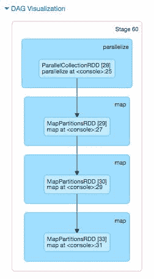

RDD 不需要与第一个 RDD(整数)是相同的数据类型。下面是一个 RDD 函数，它写了一个元组的不同数据类型(字符串，整数)。

```scala
scala> val rdd_four = rdd_three.map(i => ("str"+(i+2).toString, i-2))rdd_four: org.apache.spark.rdd.RDD[(String, Int)] = MapPartitionsRDD[33] at map at <console>:31scala> rdd_four.take(10)res53: Array[(String, Int)] = Array((str7,3), (str10,6), (str13,9), (str16,12), (str19,15), (str22,18))

```

以下是`StatePopulation`文件的 RDD，其中每个记录都被转换为`upperCase`。

```scala
scala> val upperCaseRDD = statesPopulationRDD.map(_.toUpperCase)upperCaseRDD: org.apache.spark.rdd.RDD[String] = MapPartitionsRDD[69] at map at <console>:27scala> upperCaseRDD.take(10)res86: Array[String] = Array(STATE,YEAR,POPULATION, ALABAMA,2010,4785492, ALASKA,2010,714031, ARIZONA,2010,6408312, ARKANSAS,2010,2921995, CALIFORNIA,2010,37332685, COLORADO,2010,5048644, DELAWARE,2010,899816, DISTRICT OF COLUMBIA,2010,605183, FLORIDA,2010,18849098)

```

下面是前面转换的示意图:

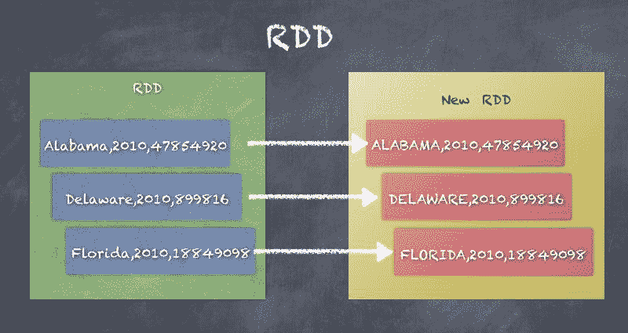

# 配对 RDD

成对关系数据库是由键值元组组成的关系数据库，适合许多用例，如聚合、排序和连接数据。键和值可以是简单的类型，如整数和字符串，也可以是更复杂的类型，如大小写类、数组、列表和其他类型的集合。基于键值的可扩展数据模型提供了许多优势，并且是 MapReduce 范例背后的基本概念。

创建一个`PairRDD`可以很容易地通过对任何 RDD 应用转换来将 RDD 转换成键值对的 RDD。

让我们使用`SparkContext`将`statesPopulation.csv`读作 RDD，它可以作为`sc`获得。

下面是一个州人口的基本 RDD 的例子，以及同一个 RDD 如何将记录拆分为州和人口的元组(对):

```scala
scala> val statesPopulationRDD = sc.textFile("statesPopulation.csv")statesPopulationRDD: org.apache.spark.rdd.RDD[String] = statesPopulation.csv MapPartitionsRDD[47] at textFile at <console>:25scala> statesPopulationRDD.firstres4: String = State,Year,Populationscala> statesPopulationRDD.take(5)res5: Array[String] = Array(State,Year,Population, Alabama,2010,4785492, Alaska,2010,714031, Arizona,2010,6408312, Arkansas,2010,2921995)scala> val pairRDD = statesPopulationRDD.map(record => (record.split(",")(0), record.split(",")(2)))pairRDD: org.apache.spark.rdd.RDD[(String, String)] = MapPartitionsRDD[48] at map at <console>:27scala> pairRDD.take(10)res59: Array[(String, String)] = Array((Alabama,4785492), (Alaska,714031), (Arizona,6408312), (Arkansas,2921995), (California,37332685), (Colorado,5048644), (Delaware,899816), (District of Columbia,605183), (Florida,18849098))

```

以下是前一示例的示意图，显示了 RDD 元素如何转换为`(key - value)`对:

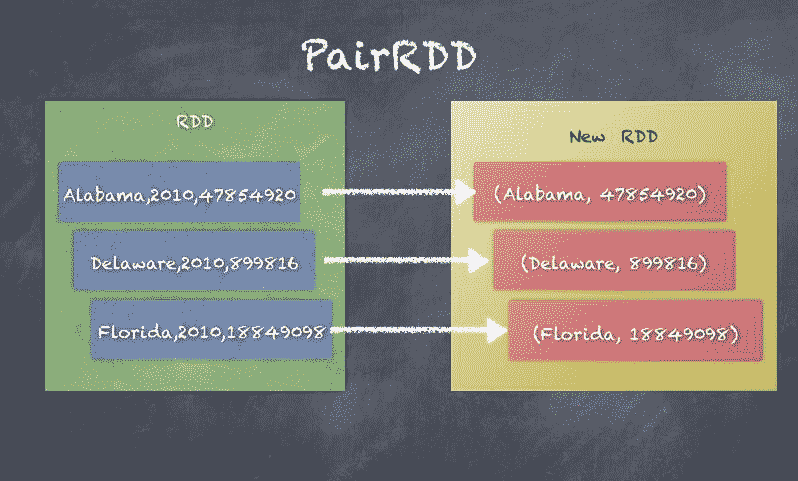

# 双红色

DoubleRDD 是一个由双值集合组成的 RDD。由于这个属性，许多统计函数可用于 DoubleRDD。

以下是 DoubleRDD 的示例，其中我们从一系列双数创建一个 RDD:

```scala
scala> val rdd_one = sc.parallelize(Seq(1.0,2.0,3.0))rdd_one: org.apache.spark.rdd.RDD[Double] = ParallelCollectionRDD[52] at parallelize at <console>:25scala> rdd_one.meanres62: Double = 2.0scala> rdd_one.minres63: Double = 1.0scala> rdd_one.maxres64: Double = 3.0scala> rdd_one.stdevres65: Double = 0.816496580927726

```

以下是双关系图以及如何在双关系图上运行`sum()`函数:


# SequenceFileRDD

`SequenceFileRDD`是从`SequenceFile`创建的，这是 Hadoop 文件系统中的一种文件格式。`SequenceFile`可以压缩或解压缩。

Map Reduce processes can use SequenceFiles, which are pairs of Keys and Values. Key and Value are of Hadoop writable datatypes, such as Text, IntWritable, and so on.

下面是一个`SequenceFileRDD`的例子，展示了我们如何读写`SequenceFile`:

```scala
scala> val pairRDD = statesPopulationRDD.map(record => (record.split(",")(0), record.split(",")(2)))pairRDD: org.apache.spark.rdd.RDD[(String, String)] = MapPartitionsRDD[60] at map at <console>:27scala> pairRDD.saveAsSequenceFile("seqfile")scala> val seqRDD = sc.sequenceFile[String, String]("seqfile")seqRDD: org.apache.spark.rdd.RDD[(String, String)] = MapPartitionsRDD[62] at sequenceFile at <console>:25scala> seqRDD.take(10)res76: Array[(String, String)] = Array((State,Population), (Alabama,4785492), (Alaska,714031), (Arizona,6408312), (Arkansas,2921995), (California,37332685), (Colorado,5048644), (Delaware,899816), (District of Columbia,605183), (Florida,18849098))

```

下面是上例中**序列的示意图**:


# CoGroupedRDD

`CoGroupedRDD`是一个 RDD，它把它的父母分组。两个父关系数据库必须是成对关系数据库才能工作，因为一个共组本质上生成了一个成对关系数据库，它由公共键和来自两个父关系数据库的值列表组成。看看下面的代码片段:

```scala
class CoGroupedRDD[K] extends RDD[(K, Array[Iterable[_]])] 

```

下面是一个共组的例子，其中我们创建了一个由两个成对的共组，一个有成对的州、人口，另一个有成对的州、年:

```scala
scala> val pairRDD = statesPopulationRDD.map(record => (record.split(",")(0), record.split(",")(2)))pairRDD: org.apache.spark.rdd.RDD[(String, String)] = MapPartitionsRDD[60] at map at <console>:27scala> val pairRDD2 = statesPopulationRDD.map(record => (record.split(",")(0), record.split(",")(1)))pairRDD2: org.apache.spark.rdd.RDD[(String, String)] = MapPartitionsRDD[66] at map at <console>:27scala> val cogroupRDD = pairRDD.cogroup(pairRDD2)cogroupRDD: org.apache.spark.rdd.RDD[(String, (Iterable[String], Iterable[String]))] = MapPartitionsRDD[68] at cogroup at <console>:31scala> cogroupRDD.take(10)res82: Array[(String, (Iterable[String], Iterable[String]))] = Array((Montana,(CompactBuffer(990641, 997821, 1005196, 1014314, 1022867, 1032073, 1042520),CompactBuffer(2010, 2011, 2012, 2013, 2014, 2015, 2016))), (California,(CompactBuffer(37332685, 37676861, 38011074, 38335203, 38680810, 38993940, 39250017),CompactBuffer(2010, 2011, 2012, 2013, 2014, 2015, 2016))),

```

以下是通过为每个键创建成对的值而得到的**对**和**对**的共组图:

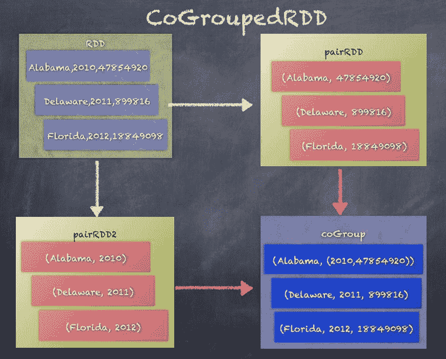

# ShuffledRDD

`ShuffledRDD`按键混洗 RDD 元素，以便在同一执行器上累加同一键的值，从而允许聚合或组合逻辑。一个很好的例子是看看当在一个 PairRDD 上调用`reduceByKey()`时会发生什么:

```scala
class ShuffledRDD[K, V, C] extends RDD[(K, C)] 

```

以下是对`pairRDD`的`reduceByKey`操作，按状态汇总记录:

```scala
scala> val pairRDD = statesPopulationRDD.map(record => (record.split(",")(0), 1))pairRDD: org.apache.spark.rdd.RDD[(String, Int)] = MapPartitionsRDD[82] at map at <console>:27scala> pairRDD.take(5)res101: Array[(String, Int)] = Array((State,1), (Alabama,1), (Alaska,1), (Arizona,1), (Arkansas,1))scala> val shuffledRDD = pairRDD.reduceByKey(_+_)shuffledRDD: org.apache.spark.rdd.RDD[(String, Int)] = ShuffledRDD[83] at reduceByKey at <console>:29scala> shuffledRDD.take(5)res102: Array[(String, Int)] = Array((Montana,7), (California,7), (Washington,7), (Massachusetts,7), (Kentucky,7))

```

下图说明了按键洗牌将相同键(状态)的记录发送到相同分区的过程:

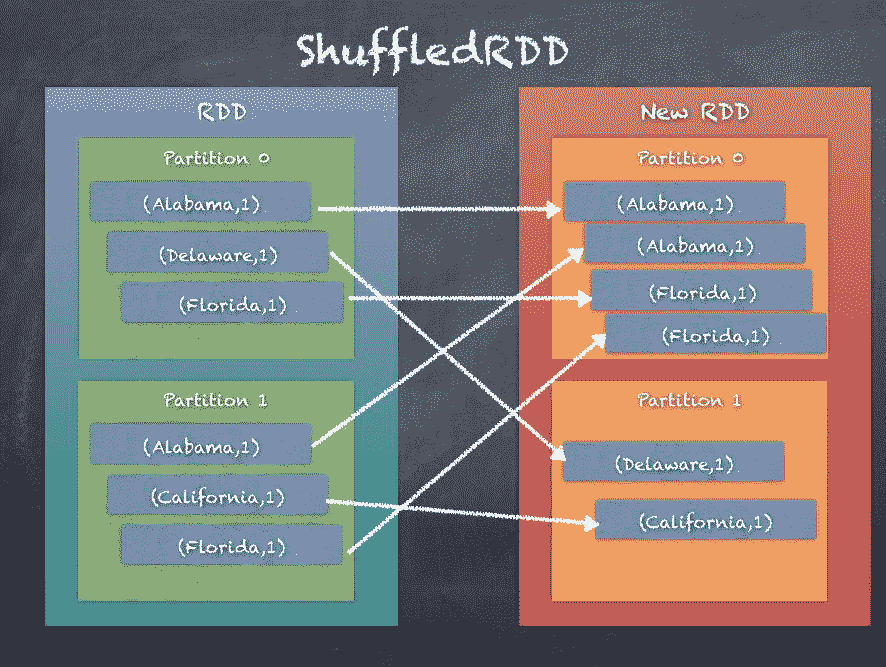

# UnionRDD

`UnionRDD`是两个 rdd 联合运算的结果。Union 只需用两个关系数据库中的元素创建一个 RDD，如下面的代码片段所示:

```scala
class UnionRDD[T: ClassTag]( sc: SparkContext, var rdds: Seq[RDD[T]]) extends RDD[T](sc, Nil)

```

下面的代码片段是通过组合两个 rdd 的元素来创建`UnionRDD`的 API 调用:

```scala
scala> val rdd_one = sc.parallelize(Seq(1,2,3))rdd_one: org.apache.spark.rdd.RDD[Int] = ParallelCollectionRDD[85] at parallelize at <console>:25scala> val rdd_two = sc.parallelize(Seq(4,5,6))rdd_two: org.apache.spark.rdd.RDD[Int] = ParallelCollectionRDD[86] at parallelize at <console>:25scala> val rdd_one = sc.parallelize(Seq(1,2,3))rdd_one: org.apache.spark.rdd.RDD[Int] = ParallelCollectionRDD[87] at parallelize at <console>:25scala> rdd_one.take(10)res103: Array[Int] = Array(1, 2, 3)scala> val rdd_two = sc.parallelize(Seq(4,5,6))rdd_two: org.apache.spark.rdd.RDD[Int] = ParallelCollectionRDD[88] at parallelize at <console>:25scala> rdd_two.take(10)res104: Array[Int] = Array(4, 5, 6)scala> val unionRDD = rdd_one.union(rdd_two)unionRDD: org.apache.spark.rdd.RDD[Int] = UnionRDD[89] at union at <console>:29scala> unionRDD.take(10)res105: Array[Int] = Array(1, 2, 3, 4, 5, 6)

```

下图说明了两个 RDD 的联合，其中来自 **RDD 1** 和 **RDD 2** 的元素被组合成一个新的 RDD **UnionRDD** :

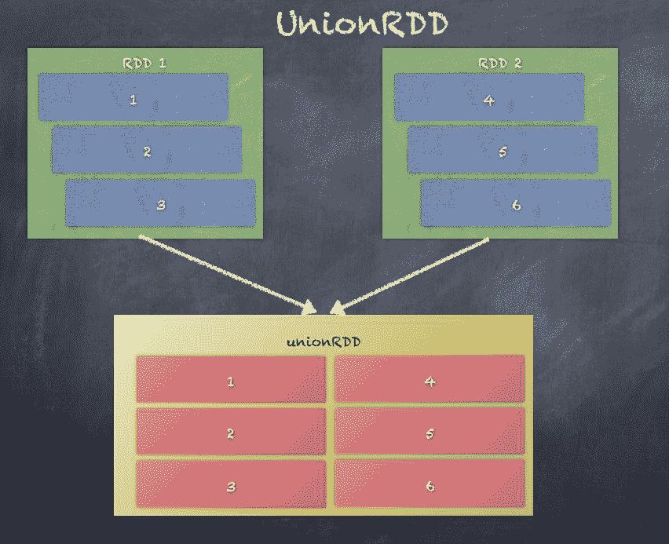

# HadoopRDD

`HadoopRDD`提供从 Hadoop 1.x 库中使用 MapReduce API 读取存储在 HDFS 的数据的核心功能。`HadoopRDD`是使用的默认值，在将数据从任何文件系统加载到 RDD 时都可以看到:

```scala
class HadoopRDD[K, V] extends RDD[(K, V)]

```

当从 CSV 加载州人口记录时，基础 RDD 实际上是`HadoopRDD`，如以下代码片段所示:

```scala
scala> val statesPopulationRDD = sc.textFile("statesPopulation.csv")statesPopulationRDD: org.apache.spark.rdd.RDD[String] = statesPopulation.csv MapPartitionsRDD[93] at textFile at <console>:25scala> statesPopulationRDD.toDebugStringres110: String =(2) statesPopulation.csv MapPartitionsRDD[93] at textFile at <console>:25 []| statesPopulation.csv HadoopRDD[92] at textFile at <console>:25 []

```

下图是通过将文件系统中的文本文件加载到 RDD 创建的 **HadoopRDD** 的示意图:

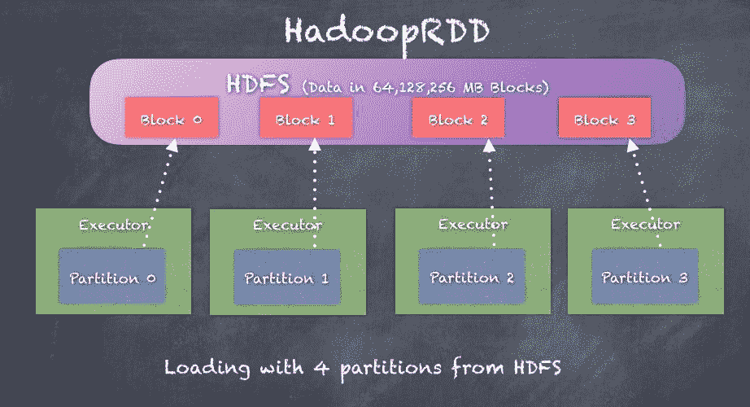

# NewHadoopRDD

`NewHadoopRDD`提供读取存储在 HDFS、HBase 表、亚马逊 S3 的数据的核心功能，使用 Hadoop 2.x 的新 MapReduce API`libraries.NewHadoopRDD`可以读取许多不同格式的数据，因此用于与多个外部系统交互。

Prior to `NewHadoopRDD`, `HadoopRDD` was the only available option which used the old MapReduce API from Hadoop 1.x

```scala
class NewHadoopRDD[K, V]( sc : SparkContext, inputFormatClass: Class[_ <: InputFormat[K, V]], keyClass: Class[K], valueClass: Class[V], @transient private val _conf: Configuration)extends RDD[(K, V)]
```

如前面的代码片段所示，`NewHadoopRDD`接受一个输入格式类、一个键类和一个值类。我们来看看`NewHadoopRDD`的例子。

最简单的例子就是使用 SparkContext 的`wholeTextFiles`函数创建`WholeTextFileRDD`。现在，`WholeTextFileRDD`实际上扩展了`NewHadoopRDD`，如下面的代码片段所示:

```scala
scala> val rdd_whole = sc.wholeTextFiles("wiki1.txt")rdd_whole: org.apache.spark.rdd.RDD[(String, String)] = wiki1.txt MapPartitionsRDD[3] at wholeTextFiles at <console>:31scala> rdd_whole.toDebugStringres9: String =(1) wiki1.txt MapPartitionsRDD[3] at wholeTextFiles at <console>:31 []| WholeTextFileRDD[2] at wholeTextFiles at <console>:31 []

```

让我们看另一个例子，其中我们将使用功能`newAPIHadoopFile`使用`SparkContext`:

```scala
import org.apache.hadoop.mapreduce.lib.input.KeyValueTextInputFormatimport org.apache.hadoop.io.Textval newHadoopRDD = sc.newAPIHadoopFile("statesPopulation.csv", classOf[KeyValueTextInputFormat], classOf[Text],classOf[Text])

```

# 聚集

聚合技术允许您以任意方式组合 RDD 中的元素来执行一些计算。事实上，聚合是大数据分析最重要的部分。如果没有聚合，我们将没有任何方法生成像*按人口排名的顶级州*这样的报告和分析，当给定过去 200 年所有州人口的数据集时，这似乎是一个合乎逻辑的问题。另一个更简单的例子是只需要计算 RDD 中的元素数量，这要求执行程序计算每个分区中的元素数量并发送给驱动程序，然后驱动程序添加子集来计算 RDD 中的元素总数。

在本节中，我们主要关注用于按键收集和组合数据的聚合函数。正如本章前面所看到的，PairRDD 是(键-值)对的 RDD，其中键和值是任意的，可以根据用例进行定制。

在我们的状态总体的例子中，一个配对关系可以是成对的`<State, <Population, Year>>`，这意味着`State`被作为关键字，元组`<Population, Year>`被认为是值。这种分解键和值的方式可以生成聚合，例如*每个州按人口排列的前几年*。相反，如果我们的聚合是在一年左右完成的，比如说*每年按人口排列的顶级州*，我们可以使用一对`<Year, <State, Population>>`的`pairRDD`。

以下是从以`State`为键和以`Year`为键的`StatePopulation`数据集中生成`pairRDD`的示例代码:

```scala
scala> val statesPopulationRDD = sc.textFile("statesPopulation.csv")statesPopulationRDD: org.apache.spark.rdd.RDD[String] = statesPopulation.csv MapPartitionsRDD[157] at textFile at <console>:26scala> statesPopulationRDD.take(5)res226: Array[String] = Array(State,Year,Population, Alabama,2010,4785492, Alaska,2010,714031, Arizona,2010,6408312, Arkansas,2010,2921995)

```

接下来，我们可以使用`State`作为关键字生成一个`pairRDD`，使用`<Year, Population>`作为值生成一个元组，如下面的代码片段所示:

```scala
scala> val pairRDD = statesPopulationRDD.map(record => record.split(",")).map(t => (t(0), (t(1), t(2))))pairRDD: org.apache.spark.rdd.RDD[(String, (String, String))] = MapPartitionsRDD[160] at map at <console>:28scala> pairRDD.take(5)res228: Array[(String, (String, String))] = Array((State,(Year,Population)), (Alabama,(2010,4785492)), (Alaska,(2010,714031)), (Arizona,(2010,6408312)), (Arkansas,(2010,2921995)))

```

如前所述，我们还可以使用`Year`作为关键字生成一个`PairRDD`，使用`<State, Population>`作为值生成一个元组，如下面的代码片段所示:

```scala
scala> val pairRDD = statesPopulationRDD.map(record => record.split(",")).map(t => (t(1), (t(0), t(2))))pairRDD: org.apache.spark.rdd.RDD[(String, (String, String))] = MapPartitionsRDD[162] at map at <console>:28scala> pairRDD.take(5)res229: Array[(String, (String, String))] = Array((Year,(State,Population)), (2010,(Alabama,4785492)), (2010,(Alaska,714031)), (2010,(Arizona,6408312)), (2010,(Arkansas,2921995)))

```

我们现在将研究如何在`<State, <Year, Population>>`的`pairRDD`上使用公共聚合函数:

*   `groupByKey`
*   `reduceByKey`
*   `aggregateByKey`
*   `combineByKey`

# groupByKey

`groupByKey`将 RDD 中每个键的值组合成一个序列。`groupByKey`还允许通过传递一个分区器来控制结果键值对 RDD 的分区。默认情况下，使用`HashPartitioner`但是可以给定一个自定义分区器作为参数。每个组中元素的顺序不能保证，甚至每次评估结果 RDD 时可能会有所不同。

`groupByKey` is an expensive operation due to all the data shuffling needed. `reduceByKey` or `aggregateByKey` provide much better performance. We will look at this later in this section.

`groupByKey`可以使用自定义分割器调用，也可以仅使用默认的`HashPartitioner`调用，如以下代码片段所示:

```scala
def groupByKey(partitioner: Partitioner): RDD[(K, Iterable[V])] def groupByKey(numPartitions: Int): RDD[(K, Iterable[V])] 

```

As currently implemented, `groupByKey` must be able to hold all the key-value pairs for any key in memory. If a key has too many values, it can result in an `OutOfMemoryError`.

`groupByKey`的工作原理是基于分区器将分区的所有元素发送到分区，以便同一密钥的所有(键值)对都收集在同一分区中。一旦完成，聚合操作就可以轻松完成。

此处显示的是调用`groupByKey`时发生的情况:

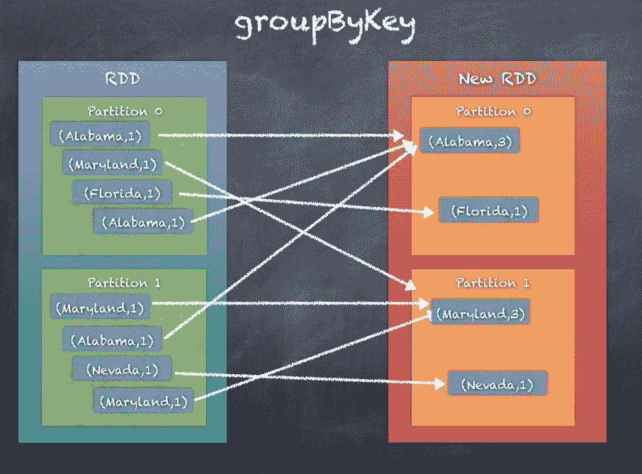

# reduceByKey

`groupByKey`涉及大量的混洗，`reduceByKey`倾向于通过不使用混洗发送`PairRDD`的所有元素来提高性能，而是使用本地组合器首先在本地进行一些基本的聚合，然后像在`groupByKey`中那样发送结果元素。这大大减少了传输的数据，因为我们不需要发送所有的东西。`reduceBykey`通过使用一个关联和交换的约简函数合并每个键的值来工作。当然，首先，在将结果发送到缩减器之前，这也将在每个映射器上本地执行合并。

If you are familiar with Hadoop MapReduce, this is very similar to a combiner in MapReduce programming.

`reduceByKey`可以使用自定义分区器或仅使用默认的 HashPartitioner 来调用，如以下代码片段所示:

```scala
def reduceByKey(partitioner: Partitioner, func: (V, V) => V): RDD[(K, V)]def reduceByKey(func: (V, V) => V, numPartitions: Int): RDD[(K, V)] def reduceByKey(func: (V, V) => V): RDD[(K, V)] 

```

`reduceByKey`的工作原理是基于`partitioner`将分区的所有元素发送到分区，这样同一密钥的所有(键值)对都被收集在同一个分区中。但是在洗牌之前，还会进行局部聚合，以减少要洗牌的数据。一旦完成，聚合操作就可以在最终分区中轻松完成。

下图说明了调用`reduceBykey`时发生的情况:


# aggregateByKey

`aggregateByKey`与`reduceByKey`非常相似，除了`aggregateByKey`允许在分区内和分区之间进行聚合的更大灵活性和定制，以允许更复杂的用例，例如在一次函数调用中生成所有`<Year, Population>`对的列表以及每个状态的总人口。

`aggregateByKey`通过使用给定的组合函数和中性初始值/零值来聚合每个键的值。这个函数返回的结果类型`U`与这个 RDD `V`中的值类型不同，这是最大的区别。因此，我们需要一个操作将一个`V`合并为一个`U`，一个操作将两个`U`合并，前者用于合并分区内的值，后者用于合并分区间的值。为了避免内存分配，允许这两个函数修改并返回它们的第一个参数，而不是创建一个新的`U`:

```scala
def aggregateByKey[U: ClassTag](zeroValue: U, partitioner: Partitioner)(seqOp: (U, V) => U, combOp: (U, U) => U): RDD[(K, U)] def aggregateByKey[U: ClassTag](zeroValue: U, numPartitions: Int)(seqOp: (U, V) => U, combOp: (U, U) => U): RDD[(K, U)] def aggregateByKey[U: ClassTag](zeroValue: U)(seqOp: (U, V) => U, combOp: (U, U) => U): RDD[(K, U)] 

```

`aggregateByKey`通过在分区内对每个分区的所有元素执行聚合来工作，然后在组合分区本身时应用另一个聚合逻辑。最终，同一密钥的所有(密钥-值)对被收集在同一个分区中；但是，关于如何进行聚合以及生成的输出并不像在`groupByKey`和`reduceByKey`中那样固定，而是在使用`aggregateByKey`时更加灵活和可定制。

下图说明了调用`aggregateByKey`时会发生什么。这里，我们为每个键生成值列表，而不是像`groupByKey`和`reduceByKey`那样累加计数:

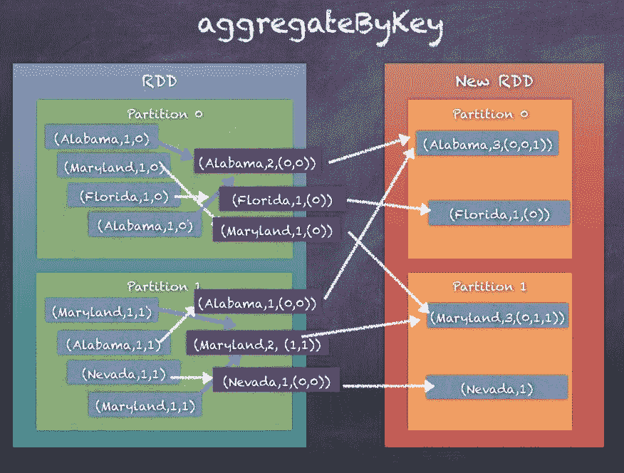

# combineByKey

`combineByKey`与`aggregateByKey`非常相似；事实上，`combineByKey`内部调用`combineByKeyWithClassTag`，这也是`aggregateByKey`调用的。与`aggregateByKey`一样，`combineByKey`也通过在每个分区内以及组合器之间应用操作来工作。

`combineByKey`将一个`RDD[K,V]`变成一个`RDD[K,C]`，其中`C`是在名称键`K`下收集或组合的 Vs 列表。

当您调用 combineByKey 时，需要三个函数。

*   `createCombiner`，将一个`V`变成`C`，这是一个单元素列表
*   `mergeValue`通过在列表末尾添加`V`将`V`合并为`C`
*   `mergeCombiners`将两个 Cs 合二为一

In `aggregateByKey`, the first argument is simply a zero value but in `combineByKey`, we provide the initial function which takes the current value as a parameter.

`combineByKey`可以使用自定义分区器或仅使用默认的 HashPartitioner 来调用，如以下代码片段所示:

```scala
def combineByKey[C](createCombiner: V => C, mergeValue: (C, V) => C, mergeCombiners: (C, C) => C, numPartitions: Int): RDD[(K, C)]def combineByKey[C](createCombiner: V => C, mergeValue: (C, V) => C, mergeCombiners: (C, C) => C, partitioner: Partitioner, mapSideCombine: Boolean = true, serializer: Serializer = null): RDD[(K, C)]

```

`combineByKey`通过在分区内对每个分区的所有元素执行聚合来工作，然后在组合分区本身时应用另一个聚合逻辑。最终，同一密钥的所有(密钥值)对都被收集在同一个分区中，但是如何进行聚合以及生成的输出并不像在`groupByKey`和`reduceByKey`中那样固定，而是在使用`combineByKey`时更加灵活和可定制。

下图说明了调用`combineBykey`时发生的情况:

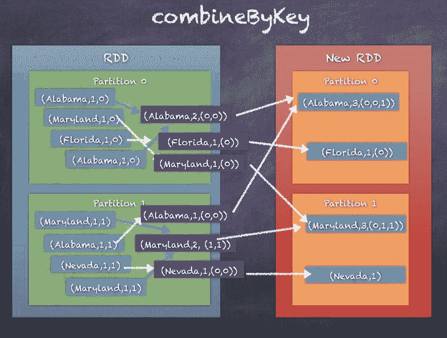

# groupByKey、reduceByKey、combineByKey 和 aggregateByKey 的比较

让我们考虑州人口 RDD 生成`<State, <Year, Population>>`的`pairRDD`的例子。

如前所述，通过生成键的 hashcode，然后对数据进行混洗以收集同一分区中每个键的值，来完成`PairRDD`的`HashPartitioning`。这显然会导致过多的洗牌。

`reduceByKey`对`groupByKey`进行了改进，使用本地组合器逻辑来最小化在混洗阶段发送的数据。结果将与`groupByKey`相同，但表现会好得多。

`aggregateByKey`在工作方式上与`reduceByKey`非常相似，但有一个很大的不同，这使得它成为三者中最强大的一个。`aggregateBykey`不需要对相同的数据类型进行操作，可以在分区内进行不同的聚合，也可以在分区之间进行不同的聚合。

`combineByKey`在性能上与`aggregateByKey`非常相似，除了创建合并器的初始功能。

要使用的功能取决于您的用例，但如果有疑问，请参考*聚合*部分，为您的用例选择正确的功能。另外，请密切关注下一部分，因为*分区和洗牌*将在该部分介绍。

以下代码显示了按州计算总人口的所有四种方法。

**第一步。初始化 RDD:**

```scala
scala> val statesPopulationRDD = sc.textFile("statesPopulation.csv").filter(_.split(",")(0) != "State") statesPopulationRDD: org.apache.spark.rdd.RDD[String] = statesPopulation.csv MapPartitionsRDD[1] at textFile at <console>:24scala> statesPopulationRDD.take(10)res27: Array[String] = Array(Alabama,2010,4785492, Alaska,2010,714031, Arizona,2010,6408312, Arkansas,2010,2921995, California,2010,37332685, Colorado,2010,5048644, Delaware,2010,899816, District of Columbia,2010,605183, Florida,2010,18849098, Georgia,2010,9713521)

```

**第二步。转换为配对 RDD:**

```scala
scala> val pairRDD = statesPopulationRDD.map(record => record.split(",")).map(t => (t(0), (t(1).toInt, t(2).toInt)))pairRDD: org.apache.spark.rdd.RDD[(String, (Int, Int))] = MapPartitionsRDD[26] at map at <console>:26scala> pairRDD.take(10)res15: Array[(String, (Int, Int))] = Array((Alabama,(2010,4785492)), (Alaska,(2010,714031)), (Arizona,(2010,6408312)), (Arkansas,(2010,2921995)), (California,(2010,37332685)), (Colorado,(2010,5048644)), (Delaware,(2010,899816)), (District of Columbia,(2010,605183)), (Florida,(2010,18849098)), (Georgia,(2010,9713521)))

```

**第三步。分组-对值进行分组，然后将总体相加:**

```scala
scala> val groupedRDD = pairRDD.groupByKey.map(x => {var sum=0; x._2.foreach(sum += _._2); (x._1, sum)})groupedRDD: org.apache.spark.rdd.RDD[(String, Int)] = MapPartitionsRDD[38] at map at <console>:28scala> groupedRDD.take(10)res19: Array[(String, Int)] = Array((Montana,7105432), (California,268280590), (Washington,48931464), (Massachusetts,46888171), (Kentucky,30777934), (Pennsylvania,89376524), (Georgia,70021737), (Tennessee,45494345), (North Carolina,68914016), (Utah,20333580))

```

**第四步。通过简单地增加人口来减少数值:**

```scala
scala> val reduceRDD = pairRDD.reduceByKey((x, y) => (x._1, x._2+y._2)).map(x => (x._1, x._2._2))reduceRDD: org.apache.spark.rdd.RDD[(String, Int)] = MapPartitionsRDD[46] at map at <console>:28scala> reduceRDD.take(10)res26: Array[(String, Int)] = Array((Montana,7105432), (California,268280590), (Washington,48931464), (Massachusetts,46888171), (Kentucky,30777934), (Pennsylvania,89376524), (Georgia,70021737), (Tennessee,45494345), (North Carolina,68914016), (Utah,20333580))

```

**第五步。aggregateBykey -汇总每个键下的种群，并将它们相加:**

```scala
Initialize the arrayscala> val initialSet = 0initialSet: Int = 0provide function to add the populations within a partitionscala> val addToSet = (s: Int, v: (Int, Int)) => s+ v._2addToSet: (Int, (Int, Int)) => Int = <function2>provide funtion to add populations between partitionsscala> val mergePartitionSets = (p1: Int, p2: Int) => p1 + p2mergePartitionSets: (Int, Int) => Int = <function2>scala> val aggregatedRDD = pairRDD.aggregateByKey(initialSet)(addToSet, mergePartitionSets)aggregatedRDD: org.apache.spark.rdd.RDD[(String, Int)] = ShuffledRDD[41] at aggregateByKey at <console>:34scala> aggregatedRDD.take(10)res24: Array[(String, Int)] = Array((Montana,7105432), (California,268280590), (Washington,48931464), (Massachusetts,46888171), (Kentucky,30777934), (Pennsylvania,89376524), (Georgia,70021737), (Tennessee,45494345), (North Carolina,68914016), (Utah,20333580))

```

**第六步。combineByKey -在分区内合并，然后合并合并器:**

```scala
createcombiner functionscala> val createCombiner = (x:(Int,Int)) => x._2createCombiner: ((Int, Int)) => Int = <function1>function to add within partitionscala> val mergeValues = (c:Int, x:(Int, Int)) => c +x._2mergeValues: (Int, (Int, Int)) => Int = <function2>function to merge combinersscala> val mergeCombiners = (c1:Int, c2:Int) => c1 + c2mergeCombiners: (Int, Int) => Int = <function2>scala> val combinedRDD = pairRDD.combineByKey(createCombiner, mergeValues, mergeCombiners)combinedRDD: org.apache.spark.rdd.RDD[(String, Int)] = ShuffledRDD[42] at combineByKey at <console>:34scala> combinedRDD.take(10)res25: Array[(String, Int)] = Array((Montana,7105432), (California,268280590), (Washington,48931464), (Massachusetts,46888171), (Kentucky,30777934), (Pennsylvania,89376524), (Georgia,70021737), (Tennessee,45494345), (North Carolina,68914016), (Utah,20333580))

```

如您所见，所有四个聚合都会产生相同的输出。只是他们的工作方式不同。

# 分区和洗牌

我们已经看到 Apache Spark 如何比 Hadoop 更好地处理分布式计算。我们还看到了内部工作方式，主要是被称为**弹性分布式数据集** ( **RDD** )的基本数据结构。rdd 是表示数据集的不可变集合，具有内在的可靠性和故障恢复能力。rdd 对数据进行操作，而不是作为单个数据块，相反，rdd 管理和操作分布在集群中的分区中的数据。因此，数据分区的概念对于 Apache Spark Jobs 的正常运行至关重要，并且会对性能以及资源的利用方式产生重大影响。

RDD 由数据分区组成，所有操作都在 RDD 的数据分区上执行。像转换这样的一些操作是由执行器在被操作的数据的特定分区上执行的功能。然而，并不是所有的操作都可以通过各自的执行器对数据分区执行独立的操作来完成。像聚合这样的操作(见上一节)需要在称为**洗牌**的阶段跨集群移动数据。在本节中，我们将更深入地研究分区和洗牌的概念。

让我们通过执行下面的代码来看一个简单的整数 RDD。Spark Context 的`parallelize`函数从整数序列中创建一个 RDD。然后，使用`getNumPartitions()`函数，我们可以得到这个 RDD 的分区数。

```scala
scala> val rdd_one = sc.parallelize(Seq(1,2,3))rdd_one: org.apache.spark.rdd.RDD[Int] = ParallelCollectionRDD[120] at parallelize at <console>:25scala> rdd_one.getNumPartitionsres202: Int = 8

```

RDD 可以可视化，如下图所示，其中显示了 RDD 的 8 个分区:


分区的数量很重要，因为这个数量直接影响将运行 RDD 转换的任务数量。如果分区数量太少，那么我们将在大量数据上仅使用几个 CPUs 内核，因此性能较低，并且集群未得到充分利用。另一方面，如果分区的数量太大，那么您将使用比实际需要更多的资源，并且在多租户环境中，可能会导致您或团队中其他人正在运行的其他作业资源不足。

# 分割器

RDDs 的分区是由分区器完成的。分区器为 RDD 中的元素分配分区索引。同一分区中的所有元素将具有相同的分区索引。

Spark有两个分割器`HashPartitioner`和`RangePartitioner`。除此之外，您还可以实现自定义分区器。

# HashPartitioner

`HashPartitioner`是 Spark 中的默认分区器，通过计算 RDD 元素的每个键的哈希值来工作。所有具有相同 hashcode 的元素最终都在同一个分区中，如下面的代码片段所示:

```scala
partitionIndex = hashcode(key) % numPartitions

```

下面是 String `hashCode()`函数的一个例子，以及我们如何生成`partitionIndex`:

```scala
scala> val str = "hello"str: String = helloscala> str.hashCoderes206: Int = 99162322scala> val numPartitions = 8numPartitions: Int = 8scala> val partitionIndex = str.hashCode % numPartitionspartitionIndex: Int = 2

```

The default number of partitions is either from the Spark configuration parameter `spark.default.parallelism` or the number of cores in the cluster

下图说明了哈希分区是如何工作的。我们有一个包含 3 个元素的 RDD**a****b**和 **e** 。使用字符串 hashcode，我们根据设置为 6 的分区数量得到每个元素的`partitionIndex`:

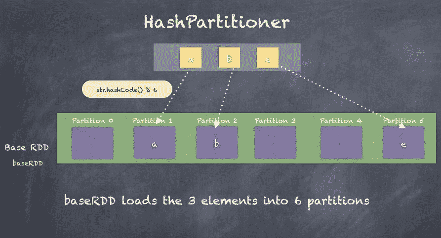

# 范围分割器

`RangePartitioner`通过将 RDD 划分为大致相等的范围来工作。由于范围必须知道任何分区的开始和结束键，所以在使用`RangePartitioner`之前，需要首先对 RDD 进行排序。

`RangePartitioning`首先需要基于 RDD 的分区的合理边界，然后创建一个从 K 键到元素所属的`partitionIndex`的函数。最后，我们需要在`RangePartitioner`的基础上重新划分 RDD，以便按照我们确定的范围正确分配 RDD 元素。

下面是我们如何使用`PairRDD`的`RangePartitioning`的一个例子。我们还可以看到分区是如何在我们使用`RangePartitioner`对 RDD 重新分区后发生变化的:

```scala
import org.apache.spark.RangePartitionerscala> val statesPopulationRDD = sc.textFile("statesPopulation.csv")statesPopulationRDD: org.apache.spark.rdd.RDD[String] = statesPopulation.csv MapPartitionsRDD[135] at textFile at <console>:26scala> val pairRDD = statesPopulationRDD.map(record => (record.split(",")(0), 1))pairRDD: org.apache.spark.rdd.RDD[(String, Int)] = MapPartitionsRDD[136] at map at <console>:28scala> val rangePartitioner = new RangePartitioner(5, pairRDD)rangePartitioner: org.apache.spark.RangePartitioner[String,Int] = org.apache.spark.RangePartitioner@c0839f25scala> val rangePartitionedRDD = pairRDD.partitionBy(rangePartitioner)rangePartitionedRDD: org.apache.spark.rdd.RDD[(String, Int)] = ShuffledRDD[130] at partitionBy at <console>:32scala> pairRDD.mapPartitionsWithIndex((i,x) => Iterator(""+i + ":"+x.length)).take(10)res215: Array[String] = Array(0:177, 1:174)scala> rangePartitionedRDD.mapPartitionsWithIndex((i,x) => Iterator(""+i + ":"+x.length)).take(10)res216: Array[String] = Array(0:70, 1:77, 2:70, 3:63, 4:71)

```

下图是上例中`RangePartitioner`的图示:

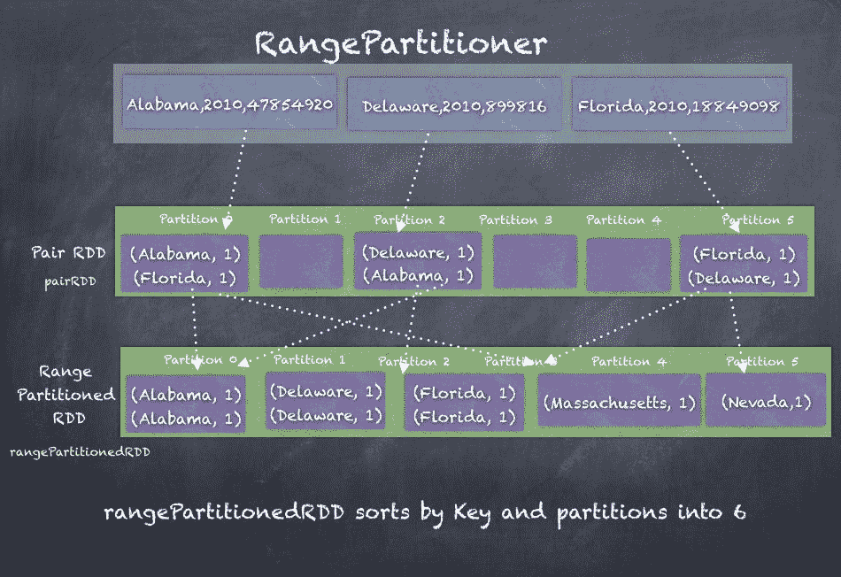

# 洗牌

无论使用哪种分区器，许多操作都会导致数据在 RDD 分区之间重新分区。可以创建新分区，也可以折叠/合并几个分区。重新分区所需的所有数据移动称为**洗牌，**这是编写 Spark Job 时需要理解的一个重要概念。由于计算不再在内存中的同一个执行器上，而是执行器通过网络交换数据，因此混洗会导致大量的性能延迟。

一个很好的例子是`groupByKey()`的例子，我们之前在*聚合*部分看到过。显然，许多数据在执行器之间流动，以确保一个键的所有值都被收集到同一个执行器上，以执行`groupBy`操作。

洗牌还决定了Spark作业的执行过程，并影响作业如何分成阶段。正如我们在本章和上一章中所看到的，Spark 持有一个 rdd 的 DAG，它代表 rdd 的谱系，这样 Spark 不仅可以使用该谱系来计划作业的执行，还可以从中恢复任何执行人员的损失。当 RDD 正在进行转换时，会尝试确保操作在与数据相同的节点上执行。然而，我们经常使用连接操作、减少操作、分组操作或聚合操作，这些操作会有意或无意地导致重新分区。这种混洗依次决定了处理中特定阶段的结束位置和新阶段的开始位置。

下图说明了如何将Spark作业分为几个阶段。这个例子显示了一个被过滤的`pairRDD`，在调用`groupByKey`之前使用贴图进行转换，然后使用`map()`进行最后一次转换:


我们的洗牌越多，作业执行中影响性能的阶段就越多。Spark驱动程序使用两个关键方面来确定阶段。这是通过定义关系数据库的两种依赖关系来实现的，窄依赖关系和宽依赖关系。

# 缩小依赖关系

当一个 RDD 可以通过简单的一对一转换从另一个 RDD 中派生出来，例如`filter()`函数、`map()`函数、`flatMap()`函数等等，那么孩子 RDD 就可以说是一对一地依赖于父母 RDD。这种依赖关系被称为狭义依赖关系，因为数据可以在包含原始 RDD/父 RDD 分区的节点上转换，而不需要在其他执行器之间进行任何数据传输。

Narrow dependencies are in the same stage of the job execution.

下图说明了一个狭窄的从属关系如何将一个 RDD 转换为另一个 RDD，并对 RDD 元素进行一对一的转换:


# 广泛的依赖性

当通过有线传输数据或交换数据以使用函数(如`aggregateByKey`、`reduceByKey`等)对数据进行重新分区或重新分布，可以从一个或多个 RDD 中导出 RDD 时，则称子 RDD 依赖于参与混洗操作的父 rdd。这种依赖关系被称为宽依赖关系，因为数据不能在包含原始 RDD/父 RDD 分区的节点上转换，因此需要在其他执行器之间通过网络传输数据。

Wide dependencies introduce new stages in the job execution.

下图说明了广泛的依赖关系如何将一个 RDD 转换为另一个 RDD，在执行器之间移动数据:


# 广播变量

广播变量是所有执行器之间的共享变量。广播变量在驱动程序中创建一次，然后在执行器上只读。虽然理解广播的简单数据类型很简单，例如`Integer`，但广播在概念上比简单变量大得多。整个数据集可以在 Spark 集群中广播，以便执行者可以访问广播的数据。执行器内运行的所有任务都可以访问广播变量。

广播使用各种优化的方法使广播数据对所有执行者都是可访问的。这是一个需要解决的重要挑战，因为如果广播的数据集的大小很大，您不能期望 100 或 1000 个执行器连接到驱动程序并提取数据集。相反，执行器通过 HTTP 连接和最近的添加(类似于 BitTorrent)来提取数据，在 BitTorrent 中，数据集本身像洪流一样分布在集群中。这使得一种可伸缩性更高的方法能够将广播的变量分配给所有执行器，而不是让每个执行器从驱动程序中一个接一个地提取数据，当有很多执行器时，这会导致驱动程序失败。

The driver can only broadcast the data it has and you cannot broadcast RDDs by using references. This is because only Driver knows how to interpret RDDs and executors only know the particular partitions of data they are handling.

如果您更深入地研究广播是如何工作的，您会发现该机制是这样工作的:首先让驱动程序将序列化的对象分成小块，然后将这些块存储在驱动程序的块管理器中。当代码被序列化为在执行器上运行时，每个执行器首先尝试从自己的内部块管理器中获取对象。如果之前提取了广播变量，它会找到并使用它。然而，如果它不存在，执行器然后使用远程获取从驱动程序和/或其他执行器(如果可用)获取小块。一旦它获得了块，它就把块放在自己的块管理器中，准备好让任何其他执行器从中获取。这防止了驱动程序成为发送广播数据的多个副本(每个执行器一个)的瓶颈。

下图说明了广播在 Spark 集群中的工作方式:

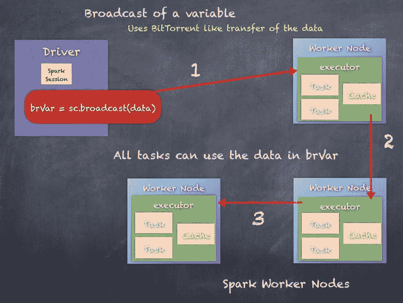

广播变量也可以被创建和销毁。我们将研究广播变量的产生和破坏。还有一种从内存中移除广播变量的方法，我们也将会看到。

# 创建广播变量

只要数据/变量是可序列化的，就可以在任何数据类型的任何数据上使用 Spark Context 的`broadcast()`函数创建广播变量。

让我们看看如何广播一个整数变量，然后在执行器上执行的转换操作中使用广播变量:

```scala
scala> val rdd_one = sc.parallelize(Seq(1,2,3))rdd_one: org.apache.spark.rdd.RDD[Int] = ParallelCollectionRDD[101] at parallelize at <console>:25scala> val i = 5i: Int = 5scala> val bi = sc.broadcast(i)bi: org.apache.spark.broadcast.Broadcast[Int] = Broadcast(147)scala> bi.valueres166: Int = 5scala> rdd_one.take(5)res164: Array[Int] = Array(1, 2, 3)scala> rdd_one.map(j => j + bi.value).take(5)res165: Array[Int] = Array(6, 7, 8)

```

广播变量也可以在不仅仅是原始数据类型上创建，如下例所示，我们将从驱动程序广播一个`HashMap`。

下面是一个简单的整数 RDD 变换，通过查找 HashMap 将每个元素与另一个整数相乘。1，2，3 的 RDD 变换为 1×2，2×3，3×4 = 2，6，12:

```scala
scala> val rdd_one = sc.parallelize(Seq(1,2,3))rdd_one: org.apache.spark.rdd.RDD[Int] = ParallelCollectionRDD[109] at parallelize at <console>:25scala> val m = scala.collection.mutable.HashMap(1 -> 2, 2 -> 3, 3 -> 4)m: scala.collection.mutable.HashMap[Int,Int] = Map(2 -> 3, 1 -> 2, 3 -> 4)scala> val bm = sc.broadcast(m)bm: org.apache.spark.broadcast.Broadcast[scala.collection.mutable.HashMap[Int,Int]] = Broadcast(178)scala> rdd_one.map(j => j * bm.value(j)).take(5)res191: Array[Int] = Array(2, 6, 12)

```

# 清除广播变量

广播变量确实会占用所有执行器的内存，根据广播变量中包含的数据大小，这可能会在某个时候导致资源问题。有一种方法可以从所有执行器的内存中移除广播变量。

对广播变量调用`unpersist()`会从所有执行器的内存缓存中移除广播变量的数据，以释放资源。如果变量被再次使用，那么数据将被重新传输到执行器，以便再次使用。然而，驱动程序保留在内存中，好像驱动程序没有数据，那么广播变量就不再有效。

We look at destroying broadcast variables next.

以下是如何在广播变量上调用`unpersist()`的示例。在调用`unpersist`之后，如果我们再次访问广播变量，它会照常工作，但是在幕后，执行器会再次为变量提取数据。

```scala
scala> val rdd_one = sc.parallelize(Seq(1,2,3))rdd_one: org.apache.spark.rdd.RDD[Int] = ParallelCollectionRDD[101] at parallelize at <console>:25scala> val k = 5k: Int = 5scala> val bk = sc.broadcast(k)bk: org.apache.spark.broadcast.Broadcast[Int] = Broadcast(163)scala> rdd_one.map(j => j + bk.value).take(5)res184: Array[Int] = Array(6, 7, 8)scala> bk.unpersistscala> rdd_one.map(j => j + bk.value).take(5)res186: Array[Int] = Array(6, 7, 8)

```

# 销毁广播变量

你也可以销毁广播变量，从所有执行器和驱动程序中完全删除它们，使它们不可访问。这对于跨集群优化管理资源非常有帮助。

对广播变量调用`destroy()`会破坏与指定广播变量相关的所有数据和元数据。一旦一个广播变量被销毁，它就不能再被使用，必须重新创建。

以下是销毁广播变量的示例:

```scala
scala> val rdd_one = sc.parallelize(Seq(1,2,3))rdd_one: org.apache.spark.rdd.RDD[Int] = ParallelCollectionRDD[101] at parallelize at <console>:25scala> val k = 5k: Int = 5scala> val bk = sc.broadcast(k)bk: org.apache.spark.broadcast.Broadcast[Int] = Broadcast(163)scala> rdd_one.map(j => j + bk.value).take(5)res184: Array[Int] = Array(6, 7, 8)scala> bk.destroy

```

If an attempt is made to use a destroyed broadcast variable, an exception is thrown

下面是一个尝试重用被破坏的广播变量的示例:

```scala
scala> rdd_one.map(j => j + bk.value).take(5)17/05/27 14:07:28 ERROR Utils: Exception encounteredorg.apache.spark.SparkException: Attempted to use Broadcast(163) after it was destroyed (destroy at <console>:30)at org.apache.spark.broadcast.Broadcast.assertValid(Broadcast.scala:144)at org.apache.spark.broadcast.TorrentBroadcast$$anonfun$writeObject$1.apply$mcV$sp(TorrentBroadcast.scala:202)at org.apache.spark.broadcast.TorrentBroadcast$$anonfun$wri

```

因此，广播功能可以用来大大提高 Spark 作业的灵活性和性能。

# 累加器

累加器是执行器之间的共享变量，通常用于向您的 Spark 程序添加计数器。如果您有一个 Spark 程序，并想知道错误或处理的总记录数，或者两者都有，您可以通过两种方式来实现。一种方法是添加额外的逻辑来计算错误或总记录，这在处理所有可能的计算时变得复杂。另一种方法是保持逻辑和代码流相当完整，并添加累加器。

Accumulators can only be updated by adding to the value.

下面是一个使用 Spark Context 和`longAccumulator`函数创建和使用长累加器的例子，该函数将新创建的累加器变量初始化为零。当累加器在映射转换中使用时，累加器递增。操作结束时，累加器的值为 351。

```scala
scala> val acc1 = sc.longAccumulator("acc1")acc1: org.apache.spark.util.LongAccumulator = LongAccumulator(id: 10355, name: Some(acc1), value: 0)scala> val someRDD = statesPopulationRDD.map(x => {acc1.add(1); x})someRDD: org.apache.spark.rdd.RDD[String] = MapPartitionsRDD[99] at map at <console>:29scala> acc1.valueres156: Long = 0  /*there has been no action on the RDD so accumulator did not get incremented*/scala> someRDD.countres157: Long = 351scala> acc1.valueres158: Long = 351scala> acc1res145: org.apache.spark.util.LongAccumulator = LongAccumulator(id: 10355, name: Some(acc1), value: 351)

```

内置累加器可用于许多用例:

*   `LongAccumulator`:用于计算 64 位整数的和、数和平均值
*   `DoubleAccumulator`:计算双精度浮点数的和、数、平均数。
*   `CollectionAccumulator[T]`:用于收集元素列表

所有前面的累加器都建立在`AccumulatorV2`类之上。通过遵循相同的逻辑，我们可以潜在地构建非常复杂和定制的累加器，以便在我们的项目中使用。

我们可以通过扩展`AccumulatorV2`类来构建一个自定义累加器。下面是一个示例，显示了要实现的必要功能。`AccumulatorV2[Int, Int]`如下代码所示，表示输入和输出都是整数类型:

```scala
class MyAccumulator extends AccumulatorV2[Int, Int] {  //simple boolean check override def isZero: Boolean = ??? //function to copy one Accumulator and create another oneoverride def copy(): AccumulatorV2[Int, Int] = ??? //to reset the valueoverride def reset(): Unit = ???//function to add a value to the accumulatoroverride def add(v: Int): Unit = ???//logic to merge two accumulatorsoverride def merge(other: AccumulatorV2[Int, Int]): Unit = ???//the function which returns the value of the accumulatoroverride def value: Int = ???}

```

接下来，我们将看一个自定义累加器的实际例子。同样，我们将为此使用`statesPopulation` CSV 文件。我们的目标是在自定义累加器中累加年的总和和人口的总和。

**第一步。导入包含累加器 V2 类的包:**

```scala
import org.apache.spark.util.AccumulatorV2

```

**第二步。包含年份和人口的案例分类:**

```scala
case class YearPopulation(year: Int, population: Long)

```

**第三步。state 累加器类扩展累加器 V2:**

```scala
class StateAccumulator extends AccumulatorV2[YearPopulation, YearPopulation] { //declare the two variables one Int for year and Long for populationprivate var year = 0       private var population:Long = 0L//return iszero if year and population are zerooverride def isZero: Boolean = year == 0 && population == 0L//copy accumulator and return a new accumulator override def copy(): StateAccumulator = {           val newAcc = new StateAccumulator             newAcc.year =     this.year             newAcc.population = this.population             newAcc        }//reset the year and population to zero override def reset(): Unit = { year = 0 ; population = 0L }//add a value to the accumulatoroverride def add(v: YearPopulation): Unit = {            year += v.year            population += v.population        }//merge two accumulators override def merge(other: AccumulatorV2[YearPopulation, YearPopulation]): Unit = {           other match {                              case o: StateAccumulator => {                            year += o.year                        population += o.population                   }                   case _ =>              }         }//function called by Spark to access the value of accumulator override def value: YearPopulation = YearPopulation(year, population)}

```

**第四步。创建一个新的状态累加器，并将其注册到 SparkContext:**

```scala
val statePopAcc = new StateAccumulatorsc.register(statePopAcc, "statePopAcc")

```

**第五步。将美国人口. csv 作为 RDD 阅读:**

```scala
val statesPopulationRDD = sc.textFile("statesPopulation.csv").filter(_.split(",")(0) != "State")scala> statesPopulationRDD.take(10)res1: Array[String] = Array(Alabama,2010,4785492, Alaska,2010,714031, Arizona,2010,6408312, Arkansas,2010,2921995, California,2010,37332685, Colorado,2010,5048644, Delaware,2010,899816, District of Columbia,2010,605183, Florida,2010,18849098, Georgia,2010,9713521)

```

**第六步。使用状态累加器:**

```scala
statesPopulationRDD.map(x => {      val toks = x.split(",")      val year = toks(1).toInt      val pop = toks(2).toLong      statePopAcc.add(YearPopulation(year, pop))      x}).count

```

**第七步。现在，我们可以检查状态累加器的值:**

```scala
scala> statePopAccres2: StateAccumulator = StateAccumulator(id: 0, name: Some(statePopAcc), value: YearPopulation(704550,2188669780))

```

在本节中，我们研究了累加器以及如何构建自定义累加器。因此，使用前面举例说明的例子，您可以创建复杂的累加器来满足您的需求。

# 摘要

本章中，我们讨论了许多类型的 rdd，如`shuffledRDD`、`pairRDD`、`sequenceFileRDD`、`HadoopRDD`等。我们还研究了三种主要的聚合类型:`groupByKey`、`reduceByKey`和`aggregateByKey`。我们研究了分区是如何工作的，以及为什么围绕分区制定适当的计划以提高性能很重要。我们还研究了洗牌以及窄依赖和宽依赖的概念，这些概念是 Spark 作业如何分成阶段的基本原则。最后，我们看了广播变量和累加器的重要概念。

RDDs 灵活性的真正力量使其能够轻松适应大多数用例，并执行必要的操作来实现目标。

在下一章中，我们将切换到添加到 RDDs 的更高抽象层，作为钨计划的一部分，称为数据框架和Spark SQL，以及如何在[第 8 章](08.html#75QNI1-21aec46d8593429cacea59dbdcd64e1c)、*中一起介绍一个小结构–Spark SQL* 。