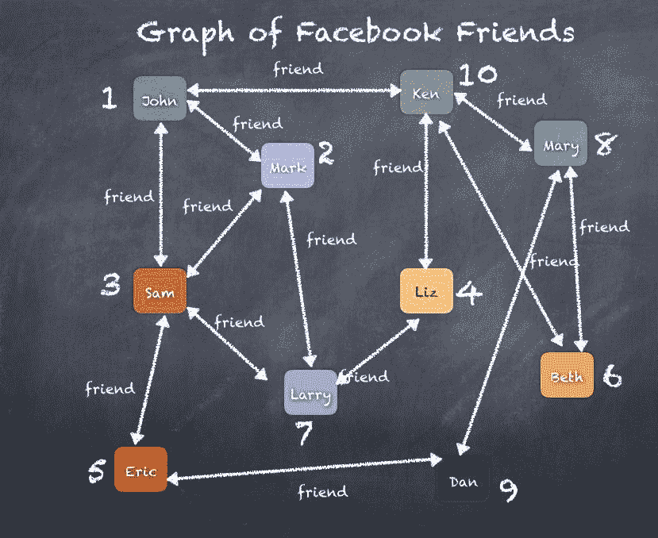
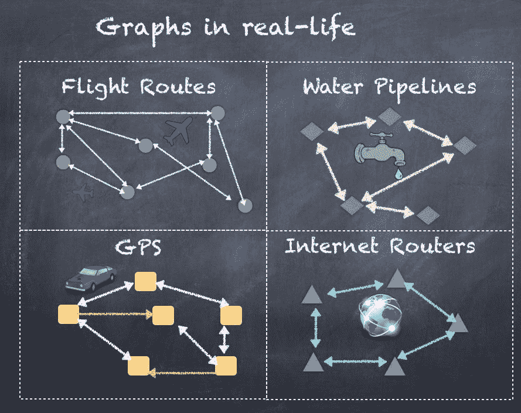
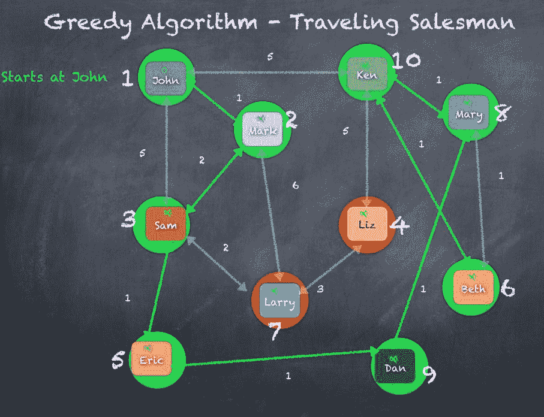
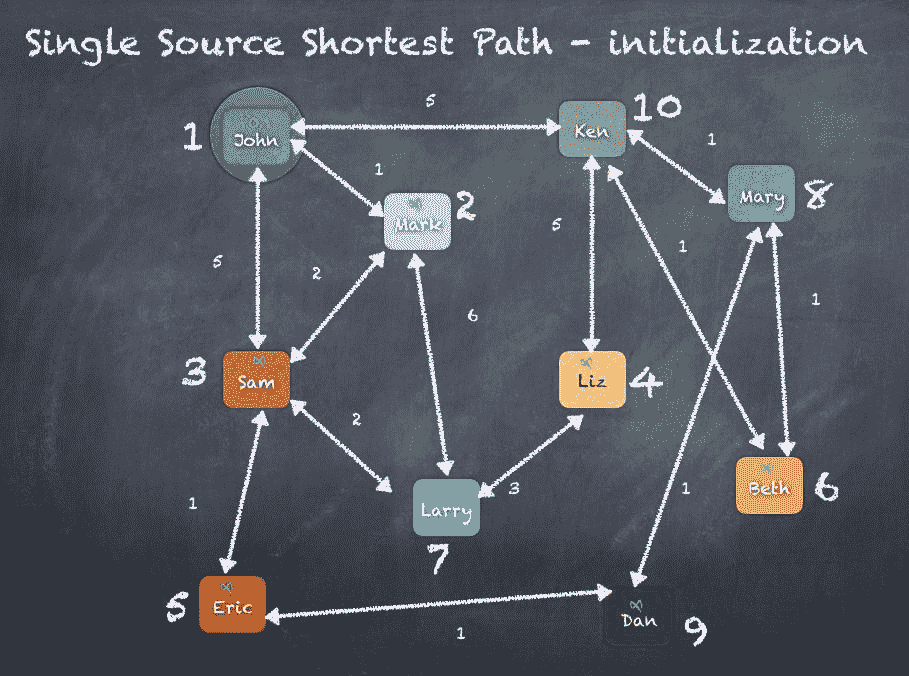
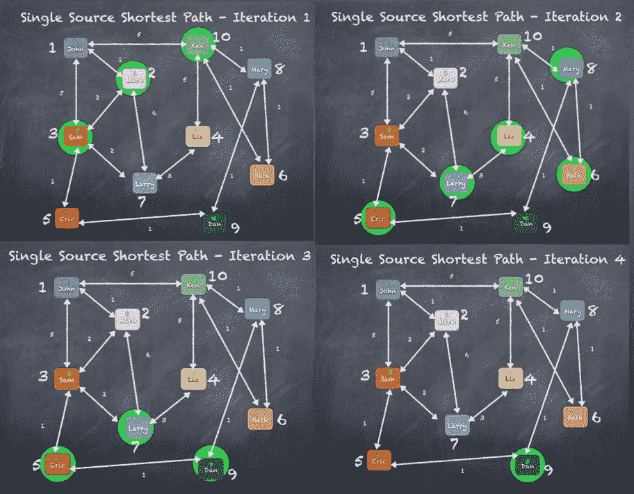

# 一切都是连通的——GraphX

"Technology made large populations possible; large populations now make technology indispensable."

-约瑟夫·伍德·克鲁奇

在这一章中，我们将学习有多少现实世界的问题可以用图来建模(和解决)。我们看到 Apache Spark 自带图形库，您所了解的 RDDs 也可以在这里使用(这次是顶点和边 RDDs)。简而言之，本章将涵盖以下主题:

*   图论简介
*   图形 x
*   VertexRDD 和 EdgeRDD
*   图形运算符
*   普瑞格原料药
*   PageRank

# 图论简介

为了更好地理解图表，让我们看看脸书和你通常如何使用脸书。每天你都用你的智能手机在你朋友的墙上发信息或者更新你的状态。你的朋友都在发布自己的信息、照片和视频。

你有朋友，你的朋友有朋友，谁有朋友，等等。脸书的设置允许您结交新朋友或从朋友列表中删除朋友。脸书也有权限，允许对谁看到什么以及谁可以与谁通信进行精细控制。

现在，当你考虑到有十亿脸书用户时，所有用户的朋友和朋友的朋友列表变得相当大和复杂。甚至很难理解和管理所有不同的关系或友谊。

所以，如果有人想知道你和另一个人 *X* 到底有没有关系，他们可以简单地从看你所有的朋友和你所有朋友的朋友开始，以此类推，并试图找到那个人 *X* 。如果人 *X* 是朋友的朋友，那么你和人 *X* 是间接联系的。

Search for a celebrity or two in your Facebook account and see if someone is a friend of your friend. Maybe you can try to add them as a friend.

我们需要建立关于人和他们的朋友的数据的存储和检索，以允许我们回答问题，例如:

*   X 是 Y 的朋友吗？
*   X 和 Y 是直接相连还是两步以内？
*   X 有几个朋友？

我们可以从尝试一个简单的数据结构开始，比如一个数组，这样每个人都有一个朋友数组。所以现在，很容易用数组的长度来回答 3。我们也可以只扫描阵列，快速回答 1。现在，问题 2 将需要更多的工作，以 *X* 的朋友阵列为例，为每个这样的朋友扫描朋友阵列。

我们通过拥有一个专门的数据结构解决了这个问题，如下例所示，我们创建了一个案例类`Person`，然后添加朋友来建立这样的关系`john` | `ken` | `mary` | `dan`:

```scala
case class Person(name: String) { val friends = scala.collection.mutable.ArrayBuffer[Person]() def numberOfFriends() = friends.length def isFriend(other: Person) = friends.find(_.name == other.name) def isConnectedWithin2Steps(other: Person) = { for {f <- friends} yield {f.name == other.name ||f.isFriend(other).isDefined} }.find(_ == true).isDefined }scala> val john = Person("John")john: Person = Person(John)scala> val ken = Person("Ken")ken: Person = Person(Ken)scala> val mary = Person("Mary")mary: Person = Person(Mary)scala> val dan = Person("Dan")dan: Person = Person(Dan)scala> john.numberOfFriendsres33: Int = 0scala> john.friends += kenres34: john.friends.type = ArrayBuffer(Person(Ken))     //john -> kenscala> john.numberOfFriendsres35: Int = 1scala> ken.friends += maryres36: ken.friends.type = ArrayBuffer(Person(Mary))    //john -> ken -> maryscala> ken.numberOfFriendsres37: Int = 1scala> mary.friends += danres38: mary.friends.type = ArrayBuffer(Person(Dan))   //john -> ken -> mary -> danscala> mary.numberOfFriendsres39: Int = 1scala> john.isFriend(ken)res40: Option[Person] = Some(Person(Ken))         //Yes, ken is a friend of johnscala> john.isFriend(mary)res41: Option[Person] = None        //No, mary is a friend of ken not johnscala> john.isFriend(dan)res42: Option[Person] = None      //No, dan is a friend of mary not johnscala> john.isConnectedWithin2Steps(ken)res43: Boolean = true     //Yes, ken is a friend of johnscala> john.isConnectedWithin2Steps(mary)res44: Boolean = true     //Yes, mary is a friend of ken who is a friend of johnscala> john.isConnectedWithin2Steps(dan)res45: Boolean = false    //No, dan is a friend of mary who is a friend of ken who is a friend of john
```

如果我们为所有脸书用户构建`Person()`实例，并将朋友添加到数组中，如前面的代码所示，那么最终，我们将能够对谁是朋友以及任何两个人之间的关系执行大量查询。

下图显示了数据结构“`Person()`实例以及它们之间的逻辑关系:



如果你想用前面的图，只找出**约翰**的朋友、**约翰**的朋友的朋友等等，这样我们就可以快速找出直接朋友、间接朋友(二级朋友)、三级朋友(朋友的朋友的朋友)，你会看到如下图:


我们可以轻松扩展`Person()`类，提供越来越多的功能来回答不同的问题。这不是这里的重点，我们想看的是前面显示`Person`和`Person`的朋友的图表，以及绘制每个`Person`的所有朋友如何产生人与人之间的网状关系。

我们现在介绍图论，它起源于数学领域。图论将图形定义为由顶点、节点或点组成的结构，这些点通过边、弧和线连接在一起。如果考虑一组`Vertices`为`V`，一组`Edges`为`E`，那么一个`Graph G`可以定义为一对有序的`V`和`E`。

```scala
Graph G = (V, E)V - set of VerticesE - set of Edges

```

在我们的脸书之友绘图示例中，我们可以简单地将每个人视为顶点集中的一个顶点，然后将任意两个人之间的每个链接视为边集中的一条边。

按照这个逻辑，我们可以列出**顶点**和**边**，如下图所示:


这种数学图形的描述产生了使用数学技术遍历和查询图形的各种方法。当这些技术被应用到计算机科学中，作为开发执行必要数学运算的编程方法的一种方式时，形式方法当然是开发算法，以可扩展的有效水平实现数学规则。

我们已经尝试过使用 case 类`Person`实现一个简单的类似于图的程序，但这只是最简单的用例，应该很明显有很多复杂的扩展是可能的，比如下面要回答的问题:

*   从 X 到 Y 最好的方法是什么？这种问题的一个例子可以是你的汽车全球定位系统告诉你去杂货店的最佳方式。
*   识别可能导致图分割的关键边？这种问题的一个例子是确定连接该州各城市的互联网服务/水管/电力线的关键链路。一条关键边打破了连通性，产生了两个连接良好的城市的子图，但这两个子图之间不会有任何交流。

回答前面的问题会产生几种算法，例如最小生成树、最短路径、页面排名、 **ALS** ( **交替最小二乘**)和最大切割最小流算法等等，它们适用于广泛的用例集。

其他的例子有 LinkedIn 个人资料和连接、Twitter 关注者、Google 页面排名、航空公司排班、你车里的 GPS 等等，在这里你可以清楚地看到一个顶点和边的图形。使用图算法，可以使用各种算法分析之前在脸书、领英、谷歌示例中看到的图，以产生不同的业务用例。

下图显示了一些图形的实际用例，显示了图形和图形算法在一些实际用例中的使用，例如:

*   帮助确定机场之间的飞行路线
*   规划如何为当地所有家庭铺设水管
*   制作你的汽车全球定位系统来规划去杂货店的路线
*   设计互联网流量如何从一个城市到另一个城市，从一个州到另一个州，从一个国家到另一个国家



现在让我们开始更深入地研究如何使用 Spark GraphX。

# 图形 x

如前一节所示，我们可以将许多实际用例建模为具有一组顶点和一组链接顶点的边的图形。我们还编写了简单的代码，试图实现一些基本的图形操作和查询，比如，*X 是 Y 的朋友吗*？然而，正如我们进一步探索的那样，算法只会随着用例变得更加复杂，而且图形的大小也比一台机器所能处理的要大得多。

It is not possible to fit one billion Facebook users along with all their friendship relations into one machine or even a few machines.

我们需要做的是超越一台机器和几台机器，而是开始考虑高度可扩展的架构来实现复杂的图形算法，它可以处理大量的数据和数据元素的复杂互连。我们已经看到了关于 Spark 的介绍，即 Spark 如何解决分布式计算和大数据分析的一些挑战。我们还看到了实时流处理和Spark SQL 以及数据帧和关系数据库。我们还能解决图算法的挑战吗？答案是 GraphX，它与 Apache Spark 一起提供，就像其他库一样，位于 Spark Core 之上。

GraphX 通过在 RDD 概念的基础上提供一个图形抽象扩展了Spark RDD。GraphX 中的图是用顶点或节点的概念来表示对象，用边或链接来描述对象之间的关系，GraphX 提供了实现许多用例的方法，适合图处理范式。在这一节中，我们将学习 GraphX，如何创建顶点、边以及包含顶点和边的图形。我们还将编写代码，通过示例学习一些围绕图形算法和处理的技术。

要开始，您需要导入下面列出的一些包:

```scala
import org.apache.spark._import org.apache.spark.graphx._import org.apache.spark.rdd.RDDimport org.apache.spark.graphx.GraphLoaderimport org.apache.spark.graphx.GraphOps

```

GraphX 的基本数据结构是一个图，它抽象地表示了一个具有与顶点和边相关联的任意对象的图。该图提供了访问和操作与顶点和边以及底层结构相关联的数据的基本操作。像 Spark RDDs 一样，图是一种功能性的数据结构，其中变异操作返回新的图。`Graph`对象的这种不可改变的特性使得大规模并行计算成为可能，而不会有遇到同步问题的风险。

Concurrent updates or modification of objects is the primary reason for complex multithreading programming done in many programs.

图定义了基本的数据结构，并且有一个助手类`GraphOps`，它包含了额外的便利操作和图算法。

图形定义如下:一个类模板，它有两个属性，指定组成图形的两个部分的数据类型，即顶点和边:

```scala
class Graph[VD: ClassTag, ED: ClassTag] 

```

正如我们已经讨论过的，图由顶点和边组成。这组顶点位于一个特殊的数据结构中，称为`VertexRDD`。类似地，这组边在一个特殊的数据结构中，称为`EdgeRDD`。顶点和边一起构成了图形，所有后续操作都可以使用这两种数据结构来完成。

所以，类`Graph`的声明是这样的:

```scala
class Graph[VD, ED] {//A RDD containing the vertices and their associated attributes.val vertices: VertexRDD[VD]//A RDD containing the edges and their associated attributes. The entries in the RDD contain just the source id and target idalong with the edge data.val edges: EdgeRDD[ED]//A RDD containing the edge triplets, which are edges along with thevertex data associated with the adjacent vertices.val triplets: RDD[EdgeTriplet[VD, ED]]}

```

现在，让我们看看`Graph`类的两个主要组件，`VertexRDD`和`EdgeRDD`。

# VertexRDD 和 EdgeRDD

一个`VertexRDD`包含一个特殊数据结构中的一组顶点或节点，一个`EdgeRDD`包含一个特殊数据结构中的节点/顶点之间的一组边或链接。`VertexRDD`和`EdgeRDD`都基于关系数据库，而`VertexRDD`处理图中的每个节点，而`EdgeRDD`包含所有节点之间的所有链接。在本节中，我们将了解如何创建`VertexRDD`和`EdgeRDD`，然后使用这些对象来构建图形。

# VertexRDD

如前所述，`VertexRDD`是包含顶点及其相关属性的 RDD。RDD 中的每个元素代表图中的一个顶点或节点。为了保持顶点的唯一性，我们需要一种为每个顶点分配唯一标识的方法。为此，GraphX 定义了一个非常重要的标识符`VertexId`。

`VertexId` is defined as a 64-bit vertex identifier that uniquely identifies a vertex within a graph. It does not need to follow any ordering or any constraints other than uniqueness.

`VertexId`的声明如下，只是 64 位`Long`数字的别名:

```scala
type VertexId = Long

```

`VertexRDD`扩展由`RDD[(VertexId, VD)]`表示的一对顶点和顶点属性的 RDD。它还确保每个顶点只有一个条目，并通过预先索引条目来实现快速、高效的连接。具有相同索引的两个顶点可以有效地连接。

```scala
class VertexRDD[VD]() extends RDD[(VertexId, VD)]

```

`VertexRDD`还实现了很多功能，提供了与图形操作相关的重要功能。每个函数通常接受由`VertexRDD`表示的顶点输入。

让我们将顶点加载到用户群`VertexRDD`中。为此，我们首先声明一个案例类`User`，如下所示:

```scala
case class User(name: String, occupation: String)

```

现在，使用文件`users.txt`，创建`VertexRDD`:

| **氧化铈** | **名称** | **职业** |
| one | 约翰 | 会计师 |
| Two | 标记 | 医生 |
| three | 萨姆（男子名） | 律师 |
| four | 莉斯 | 医生 |
| five | 埃里克 | 会计师 |
| six | 贝丝 | 会计师 |
| seven | 称量车 | 工程师 |
| eight | 结婚 | 出纳员 |
| nine | 但 | 医生 |
| Ten | 肯恩(男名) | 图书管理员 |

文件`users.txt`的每一行都包含**顶点**、**名称**和**职业**，所以我们可以在这里使用`String`拆分功能:

```scala
scala> val users = sc.textFile("users.txt").map{ line => val fields = line.split(",") (fields(0).toLong, User(fields(1), fields(2)))}users: org.apache.spark.rdd.RDD[(Long, User)] = MapPartitionsRDD[2645] at map at <console>:127scala> users.take(10)res103: Array[(Long, User)] = Array((1,User(John,Accountant)), (2,User(Mark,Doctor)), (3,User(Sam,Lawyer)), (4,User(Liz,Doctor)), (5,User(Eric,Accountant)), (6,User(Beth,Accountant)), (7,User(Larry,Engineer)), (8,User(Mary,Cashier)), (9,User(Dan,Doctor)), (10,User(Ken,Librarian)))

```

# EdgeRDD

`EdgeRDD`表示顶点之间的边集，是前面看到的图形类的成员。`EdgeRDD`和`VertexRDD`一样，从 RDD 延伸而来，同时带 Edge 属性和 Vertex 属性。

`EdgeRDD[ED, VD]`通过在每个分区上以柱状格式存储边来扩展`RDD[Edge[ED]]`以获得性能。它可以另外存储与每个边相关联的顶点属性，以提供三元组视图:

```scala
class EdgeRDD[ED]() extends RDD[Edge[ED]]

```

EdgeRDD 还实现了许多功能，这些功能提供了与图形操作相关的重要功能。每个函数通常接受 EdgeRDD 表示的边的输入。每个边包含一个源顶点、目标顶点和边属性，如`String`、`Integer`或任何案例类。在下面的例子中，我们使用一个`String`朋友作为属性。在本章的后面，我们使用以英里为单位的距离(`Integer`)作为属性。

我们可以通过读取一对顶点文件来创建 EdgeRDD:

| **源顶点标识** | **目标/目的顶点标识** | **英里距离** |
| one | three | five |
| three | one | five |
| one | Two | one |
| Two | one | one |
| four | Ten | five |
| Ten | four | five |
| one | Ten | five |
| Ten | one | five |
| Two | seven | six |
| seven | Two | six |
| seven | four | three |
| four | seven | three |
| Two | three | Two |

`friends.txt`文件的每一行都包含源`vertexId`和目的地`vertexId`，所以我们可以在这里使用`String`拆分功能:

```scala
scala> val friends = sc.textFile("friends.txt").map{ line => val fields = line.split(",") Edge(fields(0).toLong, fields(1).toLong, "friend")}friends: org.apache.spark.rdd.RDD[org.apache.spark.graphx.Edge[String]] = MapPartitionsRDD[2648] at map at <console>:125scala> friends.take(10)res109: Array[org.apache.spark.graphx.Edge[String]] = Array(Edge(1,3,friend), Edge(3,1,friend), Edge(1,2,friend), Edge(2,1,friend), Edge(4,10,friend), Edge(10,4,friend), Edge(1,10,friend), Edge(10,1,friend), Edge(2,7,friend), Edge(7,2,friend))

```

我们现在有了顶点和边，所以是时候把所有东西放在一起，探索如何从顶点和边的列表中构建一个`Graph`:

```scala
scala> val graph = Graph(users, friends)graph: org.apache.spark.graphx.Graph[User,String] = org.apache.spark.graphx.impl.GraphImpl@327b69c8scala> graph.verticesres113: org.apache.spark.graphx.VertexRDD[User] = VertexRDDImpl[2658] at RDD at VertexRDD.scala:57scala> graph.edgesres114: org.apache.spark.graphx.EdgeRDD[String] = EdgeRDDImpl[2660] at RDD at EdgeRDD.scala:41

```

使用`Graph`对象，我们可以使用`collect()`功能查看顶点和边，该功能将显示所有顶点和边。每个顶点都是形状(`VertexId`、`User`)，每个边都是形状(`srcVertexId`、`dstVertexId`、`edgeAttribute`)。

```scala
scala> graph.vertices.collectres111: Array[(org.apache.spark.graphx.VertexId, User)] = Array((4,User(Liz,Doctor)), (6,User(Beth,Accountant)), (8,User(Mary,Cashier)), (10,User(Ken,Librarian)), (2,User(Mark,Doctor)), (1,User(John,Accountant)), (3,User(Sam,Lawyer)), (7,User(Larry,Engineer)), (9,User(Dan,Doctor)), (5,User(Eric,Accountant)))scala> graph.edges.collectres112: Array[org.apache.spark.graphx.Edge[String]] = Array(Edge(1,2,friend), Edge(1,3,friend), Edge(1,10,friend), Edge(2,1,friend), Edge(2,3,friend), Edge(2,7,friend), Edge(3,1,friend), Edge(3,2,friend), Edge(3,10,friend), Edge(4,7,friend), Edge(4,10,friend), Edge(7,2,friend), Edge(7,4,friend), Edge(10,1,friend), Edge(10,4,friend), Edge(3,5,friend), Edge(5,3,friend), Edge(5,9,friend), Edge(6,8,friend), Edge(6,10,friend), Edge(8,6,friend), Edge(8,9,friend), Edge(8,10,friend), Edge(9,5,friend), Edge(9,8,friend), Edge(10,6,friend), Edge(10,8,friend))

```

现在我们已经创建了一个图表，我们将在下一节中查看各种操作。

# 图形运算符

让我们从可以直接使用`Graph`对象执行的操作开始，比如根据对象的某个属性过滤掉图的顶点和边进行过滤。我们还将看到一个`mapValues()`的例子，它可以转换图形产生一个定制的 RDD。

首先，让我们使用上一节中创建的`Graph`对象检查顶点和边，然后查看一些图形操作符。

```scala
scala> graph.vertices.collectres111: Array[(org.apache.spark.graphx.VertexId, User)] = Array((4,User(Liz,Doctor)), (6,User(Beth,Accountant)), (8,User(Mary,Cashier)), (10,User(Ken,Librarian)), (2,User(Mark,Doctor)), (1,User(John,Accountant)), (3,User(Sam,Lawyer)), (7,User(Larry,Engineer)), (9,User(Dan,Doctor)), (5,User(Eric,Accountant)))scala> graph.edges.collectres112: Array[org.apache.spark.graphx.Edge[String]] = Array(Edge(1,2,friend), Edge(1,3,friend), Edge(1,10,friend), Edge(2,1,friend), Edge(2,3,friend), Edge(2,7,friend), Edge(3,1,friend), Edge(3,2,friend), Edge(3,10,friend), Edge(4,7,friend), Edge(4,10,friend), Edge(7,2,friend), Edge(7,4,friend), Edge(10,1,friend), Edge(10,4,friend), Edge(3,5,friend), Edge(5,3,friend), Edge(5,9,friend), Edge(6,8,friend), Edge(6,10,friend), Edge(8,6,friend), Edge(8,9,friend), Edge(8,10,friend), Edge(9,5,friend), Edge(9,8,friend), Edge(10,6,friend), Edge(10,8,friend))

```

# 过滤器

对`filter()`的函数调用将顶点集限制为满足给定谓词的顶点集。此操作保留索引，以便与原始 RDD 有效连接，并且它设置位掩码中的位，而不是分配新内存:

```scala
def filter(pred: Tuple2[VertexId, VD] => Boolean): VertexRDD[VD] 

```

使用`filter`，我们可以过滤掉除了用户`Mark`的顶点之外的所有东西，这可以通过使用顶点或者`User.name`属性来完成。我们还可以过滤`User.occupation`属性。

下面是实现相同功能的代码:

```scala
scala> graph.vertices.filter(x => x._1 == 2).take(10)res118: Array[(org.apache.spark.graphx.VertexId, User)] = Array((2,User(Mark,Doctor)))scala> graph.vertices.filter(x => x._2.name == "Mark").take(10)res119: Array[(org.apache.spark.graphx.VertexId, User)] = Array((2,User(Mark,Doctor)))scala> graph.vertices.filter(x => x._2.occupation == "Doctor").take(10)res120: Array[(org.apache.spark.graphx.VertexId, User)] = Array((4,User(Liz,Doctor)), (2,User(Mark,Doctor)), (9,User(Dan,Doctor)))

```

我们也可以在边缘上执行`filter`，使用源顶点或目标顶点。所以我们可以过滤掉边缘，只显示出源自`John`(顶点= 1)的边缘:

```scala
scala> graph.edges.filter(x => x.srcId == 1)res123: org.apache.spark.rdd.RDD[org.apache.spark.graphx.Edge[String]] = MapPartitionsRDD[2672] at filter at <console>:134scala> graph.edges.filter(x => x.srcId == 1).take(10)res124: Array[org.apache.spark.graphx.Edge[String]] = Array(Edge(1,2,friend), Edge(1,3,friend), Edge(1,10,friend))

```

# 映射值

`mapValues()`映射每个顶点属性，保留索引以免改变顶点。更改顶点会对索引造成很大的改变，以至于后续操作会失败，顶点将不再可达。因此，重要的是不要改变顶点。

此函数的声明如下所示:

```scala
def mapValues[VD2: ClassTag](f: VD => VD2): VertexRDD[VD2]//A variant of the mapValues() function accepts a vertexId in addition  to the vertices.def mapValues[VD2: ClassTag](f: (VertexId, VD) => VD2): VertexRDD[VD2]

```

`mapValues()`也可以对边进行操作，并在边分割中映射值，保留结构但改变值:

```scala
def mapValues[ED2: ClassTag](f: Edge[ED] => ED2): EdgeRDD[ED2]

```

以下是在顶点和边中调用`mapValues()`的示例代码。顶点上的映射值将顶点转换为(`vertexId`、`User.name`)对的列表。边上的贴图值将边转换为三个三元组(`srcId`、`dstId`、`string`):

```scala
scala> graph.vertices.mapValues{(id, u) => u.name}.take(10)res142: Array[(org.apache.spark.graphx.VertexId, String)] = Array((4,Liz), (6,Beth), (8,Mary), (10,Ken), (2,Mark), (1,John), (3,Sam), (7,Larry), (9,Dan), (5,Eric))scala> graph.edges.mapValues(x => s"${x.srcId} -> ${x.dstId}").take(10)7), Edge(3,1,3 -> 1), Edge(3,2,3 -> 2), Edge(3,10,3 -> 10), Edge(4,7,4 -> 7))

```

# 聚合消息

GraphX 中的核心聚合操作是`aggregateMessages`，它将用户定义的`sendMsg`函数应用到图中的每个边三元组，然后使用`mergeMsg`函数将这些消息聚合到它们的目的顶点。`aggregateMessages`用在很多图算法中，我们要在顶点之间交换信息。

以下是此应用编程接口的签名:

```scala
def aggregateMessages[Msg: ClassTag]( sendMsg: EdgeContext[VD, ED, Msg] => Unit, mergeMsg: (Msg, Msg) => Msg, tripletFields: TripletFields = TripletFields.All) : VertexRDD[Msg]

```

关键功能是`sendMsg`和`mergeMsg`，它们决定发送到边的源顶点或目的顶点的内容。然后，`mergeMsg`处理从所有边接收的消息，并执行计算或聚合。

下面是在`Graph`图上调用`aggregateMessages`的一个简单例子，在这里我们向所有目的顶点发送一条消息。每个顶点的合并策略是将接收到的所有消息相加:

```scala
scala> graph.aggregateMessages[Int](_.sendToDst(1), _ + _).collectres207: Array[(org.apache.spark.graphx.VertexId, Int)] = Array((4,2), (6,2), (8,3), (10,4), (2,3), (1,3), (3,3), (7,2), (9,2), (5,2))

```

# 三角计数

如果一个顶点的两个相邻顶点通过一条边相连，就形成了一个三角形。换句话说，用户将与彼此是朋友的两个朋友创建一个三角形。

图形有一个函数`triangleCount()`，计算图形中的三角形。

下面是用于对图中的三角形进行计数的代码，首先调用`triangleCount`函数，然后将三角形与顶点(用户)连接起来，生成每个用户的输出以及用户所属的三角形:

```scala
scala> val triangleCounts = graph.triangleCount.verticestriangleCounts: org.apache.spark.graphx.VertexRDD[Int] = VertexRDDImpl[3365] at RDD at VertexRDD.scala:57scala> triangleCounts.take(10)res171: Array[(org.apache.spark.graphx.VertexId, Int)] = Array((4,0), (6,1), (8,1), (10,1), (2,1), (1,1), (3,1), (7,0), (9,0), (5,0))scala> val triangleCountsPerUser = users.join(triangleCounts).map { case(id, (User(x,y), k)) => ((x,y), k) }triangleCountsPerUser: org.apache.spark.rdd.RDD[((String, String), Int)] = MapPartitionsRDD[3371] at map at <console>:153scala> triangleCountsPerUser.collect.mkString("\n")res170: String =((Liz,Doctor),0)((Beth,Accountant),1)  *//1 count means this User is part of 1 triangle*((Mary,Cashier),1)  *//1 count means this User is part of 1 triangle*((Ken,Librarian),1)  *//1 count means this User is part of 1 triangle*((Mark,Doctor),1)  * //1 count means this User is part of 1 triangle*((John,Accountant),1)  *//1 count means this User is part of 1 triangle*((Sam,Lawyer),1)   *//1 count means this User is part of 1 triangle*((Larry,Engineer),0)((Dan,Doctor),0)((Eric,Accountant),0)

```

我们在前面的代码中计算的两个三角形的图表显示了两个三角形:(**约翰**、**马克**、**萨姆**)和(**肯**、**玛丽**、**贝丝**):


# 普瑞格原料药

图本质上是递归数据结构，因为顶点的属性依赖于其邻居的属性，而邻居的属性又依赖于其自身邻居的属性。因此，许多重要的图形算法迭代地重新计算每个顶点的属性，直到达到定点条件。已经提出了一系列图形并行抽象来表达这些迭代算法。GraphX 公开了 Pregel API 的一个变体。

在高层次上，GraphX 中的 Pregel 操作符是一个大容量同步并行消息抽象，它被限制在图的拓扑中。Pregel 操作符在一系列步骤中执行，在这些步骤中，顶点接收来自前一个超级步骤的入站消息的总和，计算顶点属性的新值，然后在下一个超级步骤中向相邻顶点发送消息。使用 Pregel，根据边三元组并行计算消息，并且消息计算可以访问源和目标顶点属性。没有接收到消息的顶点在超级步骤中被跳过。当没有剩余消息时，Pregel 操作符终止迭代并返回最终图形。

使用 Pregel 应用编程接口内置的一些算法如下:

*   连接的组件
*   最短路径
*   旅行推销员
*   PageRank(将在下一节中介绍)

下面的代码显示了 Pregel API 签名，其中显示了所需的各种参数。具体用法将在后续章节中显示，因此您可以参考此签名进行澄清:

```scala
def pregel[A] (initialMsg: A, // the initial message to all vertices maxIter: Int = Int.MaxValue, // number of iterations activeDir: EdgeDirection = EdgeDirection.Out) // incoming or outgoing edges (vprog: (VertexId, VD, A) => VD, sendMsg: EdgeTriplet[VD, ED] => Iterator[(VertexId, A)], //send message function mergeMsg: (A, A) => A) //merge strategy : Graph[VD, ED] 

```

# 连接的组件

连通分支本质上是图中的子图，其中顶点以某种方式相互连接。这意味着同一组件中的每个顶点都有一条到组件中某个其他顶点的边。只要不存在将顶点连接到组件的其他边，就会使用该特定顶点创建一个新组件。这一直持续到所有顶点都在某个组件中。

图形对象提供了一个`connectComponents()`函数来计算连接的组件。这使用下面的 Pregel 应用编程接口来计算顶点所属的组件。以下是计算图中连接组件的代码。显然，在这个例子中，我们只有一个连接的组件，所以它显示一个作为所有用户的组件号:

```scala
scala> graph.connectedComponents.vertices.collectres198: Array[(org.apache.spark.graphx.VertexId, org.apache.spark.graphx.VertexId)] = Array((4,1), (6,1), (8,1), (10,1), (2,1), (1,1), (3,1), (7,1), (9,1), (5,1))scala> graph.connectedComponents.vertices.join(users).take(10)res197: Array[(org.apache.spark.graphx.VertexId, (org.apache.spark.graphx.VertexId, User))] = Array((4,(1,User(Liz,Doctor))), (6,(1,User(Beth,Accountant))), (8,(1,User(Mary,Cashier))), (10,(1,User(Ken,Librarian))), (2,(1,User(Mark,Doctor))), (1,(1,User(John,Accountant))), (3,(1,User(Sam,Lawyer))), (7,(1,User(Larry,Engineer))), (9,(1,User(Dan,Doctor))), (5,(1,User(Eric,Accountant))))

```

# 旅行推销员问题

旅行商问题试图通过遍历每个顶点的无向图来寻找最短路径，例如，用户约翰想开车到每一个其他用户，最小化总行驶距离。随着顶点和边的数量增加，置换的数量也多项式增加，以覆盖从顶点到顶点的所有可能路径。时间复杂度多项式增加到问题可能需要很长时间才能解决的程度。不是完全准确地解决问题，而是使用一种称为**贪婪**算法的方法来尽可能优化地解决问题。

为了解决旅行推销员问题，贪婪的方法是快速选择最短的边，知道如果我们进一步深入遍历，这可能是一个非最优选择。

用户和朋友图上的贪婪算法的示意图如下，我们看到遍历在每个顶点选择最短的加权边。还要注意的是，顶点**拉里** ( **7** )和**莉兹** ( **4** )从未被访问过:



# 最短路径

最短路径算法通过从源顶点开始，然后遍历连接顶点和其他顶点的边，直到到达目标顶点，来找到两个顶点之间的路径。最短路径算法通过在不同顶点之间交换消息来工作。此外，该最短路径算法不是`Graph`或`GraphOps`对象的直接组成部分，而是必须使用`lib.ShortestPaths()`调用:

```scala
scala> lib.ShortestPaths.run(graph,Array(1)).vertices.join(users).take(10)res204: Array[(org.apache.spark.graphx.VertexId, (org.apache.spark.graphx.lib.ShortestPaths.SPMap, User))] = Array((4,(Map(1 -> 2),User(Liz,Doctor))), (6,(Map(1 -> 2),User(Beth,Accountant))), (8,(Map(1 -> 2),User(Mary,Cashier))), (10,(Map(1 -> 1),User(Ken,Librarian))), (2,(Map(1 -> 1),User(Mark,Doctor))), (1,(Map(1 -> 0),User(John,Accountant))), (3,(Map(1 -> 1),User(Sam,Lawyer))), (7,(Map(1 -> 2),User(Larry,Engineer))), (9,(Map(1 -> 3),User(Dan,Doctor))), (5,(Map(1 -> 2),User(Eric,Accountant))))

```

`ShortestPaths`根据两个顶点之间的跳数选择最短路径。下图显示了**约翰**到达**拉里**的三种方式，其中两条路径长度为 2，一条路径长度为 3。从前面代码的结果可以清楚地看出，从**拉里**到约翰的路径长度为 2。

在上述代码块的输出中，同样显示为包含路径长度和节点`(7,(Map(1 -> 2),User(Larry,Engineer)))`的向量:


我们还可以使用加权边来计算最短路径，这意味着连接用户的每条边都不一样。例如，如果我们可以将边值/权重/属性视为每个用户居住的位置之间的距离，我们就会得到一个加权图。在这种情况下，最短路径由两个用户之间的距离(以英里为单位)计算得出:

```scala
scala> val srcId = 1 //vertex ID 1 is the user JohnsrcId: Int = 1scala> val initGraph = graph.mapVertices((id, x) => if(id == srcId) 0.0 else Double.PositiveInfinity)initGraph: org.apache.spark.graphx.Graph[Double,Long] = org.apache.spark.graphx.impl.GraphImpl@2b9b8608scala> val weightedShortestPath = initGraph.pregel(Double.PositiveInfinity, 5)( | (id, dist, newDist) => math.min(dist, newDist), | triplet => { | if (triplet.srcAttr + triplet.attr < triplet.dstAttr) { | Iterator((triplet.dstId, triplet.srcAttr + triplet.attr)) | } | else { | Iterator.empty | } | }, | (a, b) => math.min(a, b) | )weightedShortestPath: org.apache.spark.graphx.Graph[Double,Long] = org.apache.spark.graphx.impl.GraphImpl@1f87fdd3scala> weightedShortestPath.vertices.take(10).mkString("\n")res247: String =(4,10.0)(6,6.0)(8,6.0)(10,5.0)(2,1.0)(1,0.0)(3,3.0)(7,7.0)(9,5.0)(5,4.0)

```

下面是一个使用 Pregel API 计算**从**约翰**到**拉里**的单源最短路径**的图，从初始化开始，一次又一次迭代，直到我们到达最佳路径。

通过将表示**约翰**的顶点的值设置为零，并将所有其他顶点设置为正无穷大来完成图形的初始化:



一旦初始化完成，我们将使用 Pregel 进行四次迭代来重新计算顶点值。在每次迭代中，我们遍历所有顶点，并在每个顶点检查从源顶点到目标顶点是否有更好的路径。如果存在这样的边/路径，则更新顶点值。

让我们定义两个函数*距离(v)* 和*距离(s，t)* ，其中*距离(v)* 给出顶点的值而*距离(s，t)* 给出连接 *s* 到 *t* 的边的值。

在迭代 1 中，除了约翰之外的每个用户都被设置为无穷大，约翰为 0，因为他是源顶点。现在，我们使用 Pregel 循环遍历顶点，检查是否有比无穷大更好的东西。以肯为例，我们将检查*距离(“约翰”)+距离(“约翰”、“肯”)<距离(“肯”)*。

这相当于检查 *0 + 5 <是否无穷大*，也就是`true`；所以我们将肯的距离更新为 *5* 。

同样，我们检查玛丽，*距离(“肯”)+距离(“肯”，“玛丽”)<距离(“玛丽”)*，结果是`false`，因为那时肯还在无穷远处。因此，在迭代 1 中，我们只能更新连接到 John 的用户。

在下一个迭代中，玛丽、莉兹、埃里克等等都被更新了，因为现在我们已经从迭代 1 中更新了肯、马克和萨姆的值。这种情况会持续到 Pregel API 调用中指定的多次迭代。

下图显示了计算图上单源最短路径时各种迭代的图示:



经过四次迭代，从**约翰**到**拉里**的最短路径显示最短路径为五英里。从**约翰**到**拉里**的路径，顺着**约翰** | **马克** | **山姆** | **拉里**就可以看到:


# PageRank

**PageRank** 是图处理空间中最重要的算法之一。该算法起源于谷歌，以谷歌创始人拉里·佩奇(Larry page)的名字命名，并基于基于关系或边对顶点或节点进行排序的概念，演变成多种类型的用例。

Google PageRank works by counting the number and quality of links to a page to determine a rough estimate of how important the website is. The underlying assumption is that more important websites are likely to receive more links from other websites. For more information, you can read the description at [https://en.wikipedia.org/wiki/PageRank](https://en.wikipedia.org/wiki/PageRank)

以谷歌 PageRank 为例，你可以通过在其他热门网站和技术博客中推广网页来提高网页在你的公司网站或博客中的相对重要性。使用这种方法，如果有很多第三方网站，显示你的博客网站和内容，你的博客网站可能会在谷歌搜索结果中出现一些高于其他类似网页的文章。

**Search Engine Optimization** (**SEO**) is one of the biggest industries in the marketing world, where pretty much every website out there is investing into this technology. SEO involves various techniques and strategies essentially to improve how far up your website appears in any search engine results when anyone searches for some relevant words. This is based on Google PageRank-like concept.

如果你把网页看作节点/顶点，把网页之间的超链接看作边，我们实际上创建了一个图。现在，如果你可以将网页的排名计算为指向的超链接/边的数量，比如你的`myblog.com`站点在`cnn.com`或`msnbc.com`上有链接，这样用户就可以点击链接并进入你的`myblog.com`页面。这可能是代表`myblog.com`顶点重要性的一个因素。如果我们递归地应用这个简单的逻辑，我们最终会为每个顶点分配一个等级，这个等级是使用输入边的数量和基于源顶点的等级计算的。由许多具有高页面排名的页面链接的页面本身会获得高排名。让我们看看如何使用 Spark GraphX 在大数据规模上解决 PageRank 问题。如我们所见，PageRank 测量图中每个顶点的重要性，假设从 **a** 到 **b** 的一条边代表 **a** 提升的 **b** 的值。例如，如果一个推特用户被许多其他人跟踪，该用户将被高度排名。

GraphX 附带了 PageRank 的静态和动态实现，作为`pageRank`对象上的方法。静态 PageRank 运行固定次数的迭代，而动态 PageRank 运行直到行列收敛。`GraphOps`允许直接调用这些算法作为图上的方法:

```scala
scala> val prVertices = graph.pageRank(0.0001).verticesprVertices: org.apache.spark.graphx.VertexRDD[Double] = VertexRDDImpl[8245] at RDD at VertexRDD.scala:57scala> prVertices.join(users).sortBy(_._2._1, false).take(10)res190: Array[(org.apache.spark.graphx.VertexId, (Double, User))] = Array((10,(1.4600029149839906,User(Ken,Librarian))), (8,(1.1424200609462447,User(Mary,Cashier))), (3,(1.1279748817993318,User(Sam,Lawyer))), (2,(1.1253662371576425,User(Mark,Doctor))), (1,(1.0986118723393328,User(John,Accountant))), (9,(0.8215535923013982,User(Dan,Doctor))), (5,(0.8186673059832846,User(Eric,Accountant))), (7,(0.8107902215195832,User(Larry,Engineer))), (4,(0.8047583729877394,User(Liz,Doctor))), (6,(0.783902117150218,User(Beth,Accountant))))

```

图表上的 PageRank 算法图示如下:


# 摘要

本章以脸书为例介绍了图论；Apache Spark 的图形处理库 GraphX、`VertexRDD`和 EdgeRDDs 图形操作符、`aggregateMessages`、`TriangleCounting`和 Pregel API 和用例，如 PageRank 算法。我们也看到了旅行推销员问题和连接组件等等。我们已经看到了如何使用 GraphX API 来大规模开发图形处理算法。

在[第 11 章](11.html#A73GU1-21aec46d8593429cacea59dbdcd64e1c)、*学习机器学习- Spark MLlib 和 ML* 中，我们将探索 Apache Spark 的机器学习库的精彩世界。