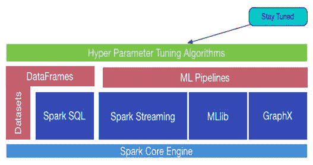
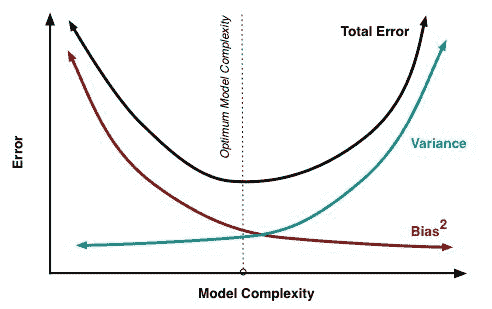
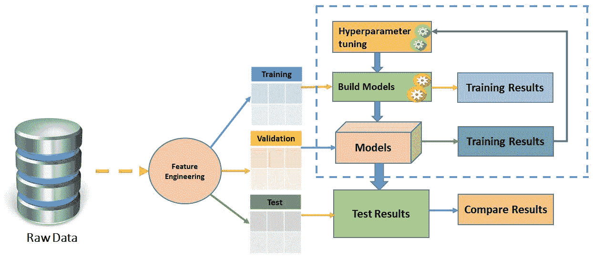
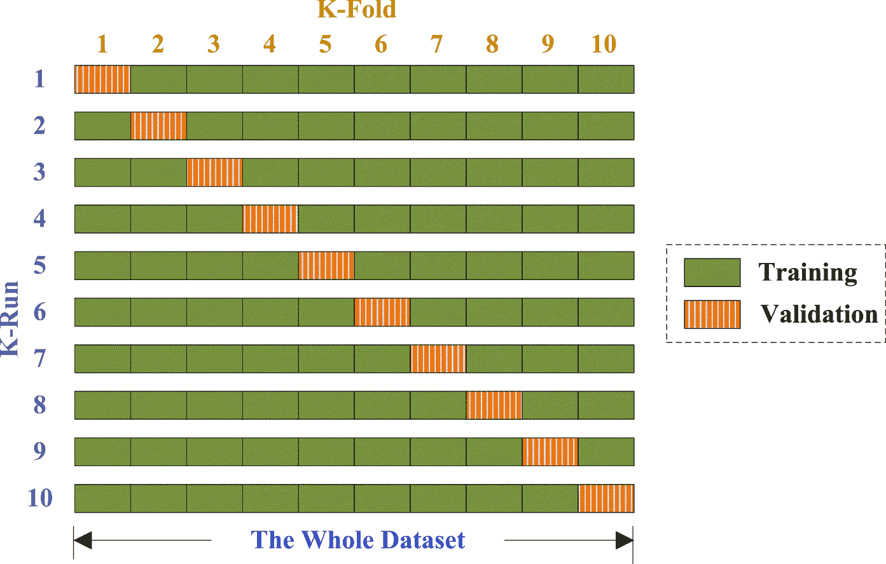
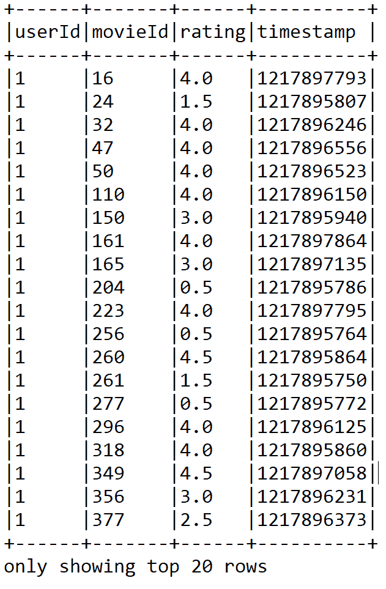
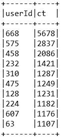
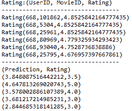
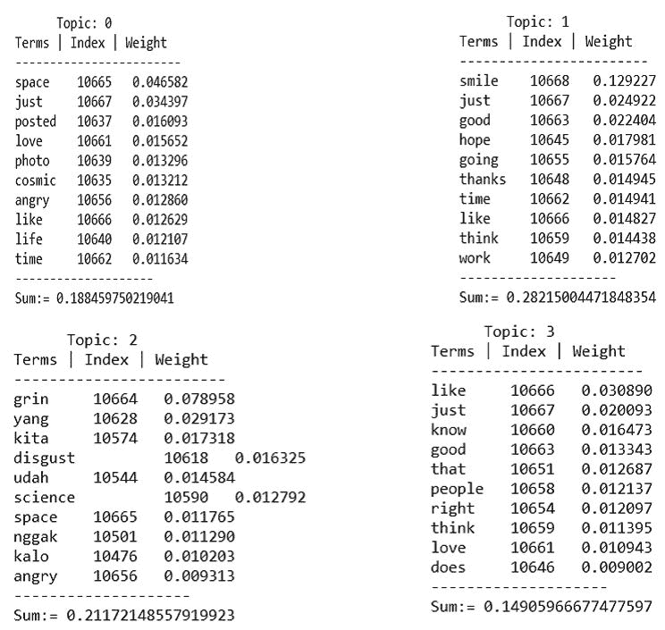

# 高级机器学习最佳实践

"Hyperparameter optimization or model selection is the problem of choosing a set of hyperparameters [when defined as?] for a learning algorithm, usually with the goal of optimizing a measure of the algorithm's performance on an independent dataset."

-机器学习模型调整报价

在本章中，我们将用 Spark 提供机器学习(ML)的一些高级主题的一些理论和实践方面。我们将看到如何使用网格搜索、交叉验证和超参数调整来调整机器学习模型以获得更好和优化的性能。在后面的部分，我们将介绍如何使用 ALS 开发一个可扩展的推荐系统，这是一个基于模型的推荐算法的例子。最后，将演示作为文本聚类技术的主题建模应用。

简而言之，我们将在本章中讨论以下主题:

*   机器学习最佳实践
*   最大似然模型的超参数调整
*   基于潜在狄利克雷分配的主题建模
*   使用协同过滤的推荐系统

# 机器学习最佳实践

有时，建议考虑错误率，而不仅仅是准确性。例如，假设一个 99%精度和 50%误差的 ML 系统比一个 90%精度但 25%误差的 ML 系统差。到目前为止，我们已经讨论了以下机器学习主题:

*   **回归**:这是为了预测线性可分的值
*   **异常检测**:这是为了发现异常数据点，通常使用聚类算法完成
*   **聚类**:这是为了发现数据集中的隐藏结构，对同类数据点进行聚类
*   **二元分类**:这是预测两类
*   **多类分类**:这是预测三个或三个以上的类别

嗯，我们也看到，对于这些任务，有一些很好的算法。然而，为您的问题类型选择正确的算法是一项棘手的任务，以便在您的最大似然算法中实现更高和突出的准确性。为此，我们需要在各个阶段采用一些好的实践，也就是说，从数据收集、特性工程、模型构建、评估、调优和部署。考虑到这些，在本节中，我们将在使用 Spark 开发您的 ML 应用时提供一些实用的建议。

# 当心过度装配和装配不足

穿过弯曲散点图的直线是拟合不足的一个很好的例子，正如我们在图中看到的。然而，如果直线与数据拟合得太好，就会出现一个相反的问题，叫做**过度拟合**。当我们说一个模型覆盖了一个数据集时，我们的意思是它可能对训练数据有一个低的错误率，但是它不能很好地概括数据中的总体。


**Figure 1**: Overfitting-underfitting trade-off (source: The book, "Deep Learning" by Adam Gibson, Josh Patterson)

更确切地说，如果你根据训练数据而不是测试或验证数据来评估你的模型，你可能无法清楚地说明你的模型是否过度拟合。常见症状如下:

*   用于训练的数据的预测准确性可能会过于准确(也就是说，有时甚至是 100%)。
*   与新数据的随机预测相比，该模型可能显示出更好的性能。
*   我们喜欢将数据集拟合到一个分布，因为如果数据集与分布相当接近，我们可以根据理论分布对如何处理数据做出假设。因此，数据中的正态分布允许我们假设统计量的抽样分布在特定条件下是正态分布的。正态分布由它的平均值和标准偏差定义，并且在所有变化中通常具有相同的形状。


**Figure 2**: Normal distribution in the data helps overcoming both the over-fitting and underfitting (source: The book, "Deep Learning" by Adam Gibson, Josh Patterson)

有时，对于特定的调优或数据点，ML 模型本身会变得不足，这意味着模型变得过于简单。我们的建议(和其他建议一样，我们认为)如下:

*   将数据集分成两组来检测过度拟合的情况——第一组用于训练和模型选择，称为训练集，第二组是测试集，用于评估代替 ML 工作流部分启动的模型。
*   或者，您也可以通过使用更简单的模型(例如，优先于高斯核 SVM 的线性分类器)或通过扩大您的最大似然模型的正则化参数(如果可用)来避免过度拟合。
*   使用正确的参数数据值调整模型，以避免过拟合和欠拟合。
*   因此，解决匹配不足是当务之急，但大多数机器学习实践者建议花费更多的时间和精力来尝试不要将线路过度匹配数据。另外，另一方面，许多机器学习实践者建议将大规模数据集分成三个集合:训练集(50%)、验证集(25%)和测试集(25%)。他们还建议使用训练集建立模型，并使用验证集计算预测误差。推荐使用测试集来评估最终模型的泛化误差。另一方面，如果在监督学习期间可用的标记数据量较小，则不建议分割数据集。在这种情况下，使用交叉验证。更具体地说，将数据集分成大小(大致)相等的 10 个部分；之后，对于这 10 个部分中的每一个，迭代训练分类器，并使用第 10 个部分来测试模型。

# 敬请关注星火 MLlib 和星火 ML

管道设计的第一步是创建构建块(作为由节点和边组成的有向或无向图)，并在这些块之间建立链接。然而，作为一名数据科学家，您也应该关注节点(原语)的扩展和优化，以便能够在后期扩展应用来处理大规模数据集，从而使 ML 管道的性能保持一致。管道过程还将帮助您使模型适应新数据集。然而，这些原语中的一些可能被明确定义为特定的域和数据类型(例如，文本、图像、视频、音频和时空)。

除了这些类型的数据，原语还应该用于通用领域统计或数学。根据这些原语来转换您的 ML 模型将使您的工作流更加透明、可解释、可访问和可解释。

最近的一个例子是 ML 矩阵，它是一个分布式矩阵库，可以在 Spark 之上使用。参考[https://issues.apache.org/jira/browse/SPARK-3434](https://issues.apache.org/jira/browse/SPARK-3434)的 JIRA 问题。



**Figure 3:** Stay tune and interoperate ML and MLlib

正如我们在上一节中已经说过的，作为一名开发人员，您可以将 Spark MLlib 中的实现技术与 Spark ML、Spark SQL、GraphX 和 Spark Streaming 中开发的算法无缝地结合起来，作为 RDD、DataFrame 和数据集之上的混合或可互操作的 ML 应用，如图 3 所示。因此，这里的建议是与您周围的最新技术保持一致或同步，以改进您的 ML 应用。

# 为您的应用选择正确的算法

“应该用什么机器学习算法？”对于天真的机器学习从业者来说是一个非常常见的问题，但答案总是*这取决于*。更精心地:

*   这取决于您必须测试/使用的数据的数量、质量、复杂性和性质
*   它取决于外部环境和参数，如计算系统的配置或底层基础架构
*   这取决于你想怎么处理这个答案
*   这取决于算法的数学和统计公式如何转化为计算机的机器指令
*   这取决于你有多少时间

现实是，即使是最有经验的数据科学家或数据工程师，在一起尝试之前，也无法直接推荐哪种 ML 算法性能最好。大多数同意/不同意的陈述以“视情况而定”开头...嗯……”习惯性地，你可能想知道是否有机器学习算法的备忘单，如果有，你应该如何使用那个备忘单？几位数据科学家说过，找到最佳算法的唯一可靠方法是尝试所有算法；因此，没有捷径的纨绔子弟！让我们说得更清楚些；假设您确实有一组数据，并且想要进行一些聚类。从技术上讲，这可能是一个分类或回归问题，如果您的数据被标记，您希望将其应用于您的数据集。但是，如果您有一个未标记的数据集，您将使用的是聚类技术。现在，你脑海中浮现的问题如下:

*   在选择合适的算法之前，我应该考虑哪些因素？还是应该随便选一个算法？
*   如何选择可应用于我的数据的任何数据预处理算法或工具？
*   我应该使用什么样的特征工程技术来提取有用的特征？
*   哪些因素可以提高我的 ML 模型的性能？
*   如何将我的 ML 应用用于新的数据类型？
*   我可以针对大规模数据集扩展我的 ML 应用吗？等等。

在本节中，我们将尝试用我们的机器学习小知识来回答这些问题。

# 选择算法时的注意事项

我们在这里提供的一条或多条建议是针对刚刚开始学习机器学习的数据科学家新手的。这些也将有助于专家数据科学家，他们正试图选择一个最佳算法来启动 Spark ML APIs。别担心，我们会指引你方向的！我们还建议在选择算法时遵循以下算法属性:

*   **准确性**:在精度、召回率、f1 评分或 AUC 等方面，获得最佳分数是目标还是近似解(*足够好*)，同时权衡过拟合。
*   **训练时间**:可用于训练模型的时间量(包括模型建立、评估和晒黑时间)。
*   **线性度**:模型复杂性的一个方面，即如何对问题建模。因为大多数非线性模型通常更难理解和调整。
*   **参数数量**
*   **特征数量**:属性多于实例的问题，即*p>T5】n*的问题。这通常需要使用降维或更好的特征工程方法的专门处理或专门技术。

# 准确(性)

从您的 ML 应用中获得最准确的结果并不总是不可或缺的。根据你想用它做什么，有时一个近似值就足够了。如果情况是这样的，您可以通过结合更好的估计方法来大大减少处理时间。当您熟悉 Spark 机器学习 API 的工作流程时，您将会享受到拥有更多近似方法的优势，因为这些近似方法将会自动避免 ML 模型的过拟合问题。现在，假设您有两个二元分类算法，其执行如下:

| **分类器** | **精度** | **召回** |
| X | 96% | 89% |
| Y | 99% | 84% |

这里，没有一个分类器是明显优越的，所以它不会立即引导你选择最优的。F1-分数是精确度和召回率的调和平均值，对你有帮助。让我们计算一下，并把它放在表中:

| **分类器** | **精度** | **召回** | **F1 得分** |
| X | 96% | 89% | 92.36% |
| Y | 99% | 84% | 90.885% |

因此，拥有 F1 分数有助于从大量分类器中进行选择。它给出了它们之间明确的偏好排序，因此也给出了明确的前进方向——即分类器 **X** 。

# 训练时间

训练时间往往与模型训练和精度密切相关。此外，通常您会发现，与其他算法相比，有些算法在数据点数量上难以捉摸。但是，当你的时间不够，但是训练集很大，有很多功能的时候，你可以选择最简单的。在这种情况下，您可能不得不在准确性上妥协。但至少能满足你的最低要求。

# 线性

最近开发了许多利用线性的机器学习算法(在 Spark MLlib 和 Spark ML 中也有)。例如，线性分类算法承诺可以通过绘制一条有区别的直线或使用更高维的等价类来分离类别。另一方面，线性回归算法假设数据趋势只是沿着一条直线。这个假设对于一些机器学习问题来说并不幼稚；然而，在其他一些情况下，精度可能会下降。尽管存在危险，但线性算法作为疫情爆发的第一线，非常受数据工程师和数据科学家的欢迎。此外，这些算法也趋于简单和快速，在整个过程中训练你的模型。

# 选择算法时检查数据

你会在加州大学欧文分校机器学习资源库找到许多机器学习数据集。以下数据属性也应优先考虑:

*   参数数量
*   特征数量
*   训练数据集的大小

# 参数数量

参数或数据属性是数据科学家在设置算法时的手柄。它们是影响算法性能的数字，例如误差容限或迭代次数，或者算法行为的变量之间的选项。算法的训练时间和精度有时会非常敏感，使得很难获得正确的设置。通常，具有大量参数的算法需要更多的反复试验才能找到最佳组合。

尽管这是一种跨越参数空间的好方法，但建模或训练时间会随着参数数量的增加而呈指数增长。这是一个两难的选择，也是时间-性能的权衡。积极的一面是:

*   具有许多特征参数表明最大似然算法具有更大的灵活性
*   您的 ML 应用实现了更好的准确性

# 你的训练集有多大？

如果您的训练集较小，则具有低方差分类器的高偏差(如朴素贝叶斯)优于具有高方差分类器的低偏差(也可用于回归)，如 **k 近邻算法** ( **kNN** )。

**Bias, Variance, and the kNN model:** In reality, *increasing k* will *decrease the variance,* but *increase the bias*. On the other hand, *decreasing k* will *increase variance* and *decrease bias*. As *k* increases, this variability is reduced. But if we increase *k* too much, then we no longer follow the true boundary line and we observe high bias. This is the nature of the Bias-Variance Trade-off.

我们已经看到了过度和不足的问题。现在，你可以假设处理偏差和差异就像处理过度和不足。相对于模型复杂性，偏差减少，方差增加。随着越来越多的参数被添加到模型中，模型的复杂性上升，方差成为我们主要关心的问题，而偏差稳步下降。换句话说，偏差对模型复杂性有负的一阶导数，而方差有正的斜率。为了更好地理解，请参考下图:



**Figure 4:** Bias and variance contributing to total error

因此，后者会过量。但是，另一方面，随着训练集线性或指数增长，高方差分类器的低偏差开始胜出，因为它们具有更低的渐近误差。高偏差分类器不够强大，无法提供准确的模型。

# 特征数量

对于某些类型的实验数据集，与数据点本身的数量相比，提取的特征的数量可能非常大。基因组学、生物医学或文本数据通常就是这种情况。大量的特征会淹没一些学习算法，使得训练时间高得离谱。**支持向量机** ( **支持向量机**)在这种情况下特别适合，因为它具有高精度、关于过拟合的良好理论保证以及适当的核。

**The SVM and the Kernel**: The task is to find a set of weight and bias such that the margin can maximize the function:
y = w*¥(x) +b,
Where *w* is the weight, *¥* is the feature vector, and *b* is the bias. Now if *y> 0*, then we classify datum to class *1*, else to class *0*, whereas, the feature vector *¥(x)* makes the data linearly separable. However, using the kernel makes the calculation process faster and easier, especially when the feature vector *¥* consisting of very high dimensional data. Let's see a concrete example. Suppose we have the following value of *x* and *y*: *x = (x1, x2, x3)* and *y = (y1, y2, y3)*, then for the function *f(x) = (x1x1, x1x2, x1x3, x2x1, x2x2, x2x3, x3x1, x3x2, x3x3)*, the kernel is *K(x, y ) = (<x, y>)<sup class="calibre45">2</sup>*. Following the above, if *x* *= (1, 2, 3)* and *y = (4, 5, 6)*, then we have the following values:
f(x) = (1, 2, 3, 2, 4, 6, 3, 6, 9)
f(y) = (16, 20, 24, 20, 25, 30, 24, 30, 36)
<f(x), f(y)> = 16 + 40 + 72 + 40 + 100+ 180 + 72 + 180 + 324 = 1024
This is a simple linear algebra that maps a 3-dimensional space to a 9 dimensional. On the other hand, the kernel is a similarity measure used for SVMs. Therefore, choosing an appropriate kernel value based on the prior knowledge of invariances is suggested. The choice of the kernel and kernel and regularization parameters can be automated by optimizing a cross-validation based model selection.
Nevertheless, an automated choice of kernels and kernel parameters is a tricky issue, as it is very easy to overfit the model selection criterion. This might result in a worse model than you started with. Now, if we use the kernel function *K(x, y), this gives the same value but with much simpler calculation -i.e. (4 + 10 + 18) ^2 = 32^2 = 1024*.

# 最大似然模型的超参数调整

调整算法只是一个过程，为了使算法在运行时和内存使用方面达到最佳性能，需要经历这个过程。在贝叶斯统计中，超参数是先验分布的参数。在机器学习方面，术语超参数是指那些不能从常规训练过程中直接学习的参数。超参数通常在实际训练过程开始之前就被固定了。这是通过为这些超参数设置不同的值，训练不同的模型，并通过测试来决定哪些模型最有效来实现的。以下是此类参数的一些典型示例:

*   树叶、箱子的数量或树的深度
*   迭代次数
*   矩阵分解中潜在因子的数量
*   学习率
*   深度神经网络中的隐藏层数
*   k-均值聚类中的聚类数等等。

在本节中，我们将讨论如何使用交叉验证技术和网格搜索来执行超参数调整。

# 超参数调谐

超参数调整是一种基于所呈现数据的性能来选择正确的超参数组合的技术。从机器学习算法中获得有意义和准确的结果是实践中的基本要求之一。下图显示了模型调优过程、考虑事项和工作流程:



**Figure 5**: The model tuning process, consideration, and workflow

例如，假设我们有两个超参数要为管道进行调整，如图 17 中[第 11 章](11.html#A73GU1-21aec46d8593429cacea59dbdcd64e1c)、*学习机器学习- Spark MLlib 和 Spark ML* 所示，Spark ML 管道模型使用逻辑回归估计器(虚线仅在管道拟合期间出现)。我们可以看到，我们已经为每个输入了三个候选值。因此，总共有九种组合。但是，图中只显示了四个，即令牌化器、哈希函数、转换器和逻辑回归。现在，我们想找到一个最终会导致最佳评估结果的模型。拟合模型由标记器、哈希函数特征提取器和拟合逻辑回归模型组成:

如果你回忆一下[第 11 章](11.html#A73GU1-21aec46d8593429cacea59dbdcd64e1c)、*学习机学习- Spark MLlib 和 Spark ML* 中的*图 17* ，然而虚线只发生在管道安装期间。如前所述，拟合的管道模型是一个变压器。Transformer 可用于预测、模型验证和模型检查。此外，我们还认为，最大似然算法的一个命运多舛的显著特征是，通常它们有许多需要调整以获得更好性能的超参数。例如，这些超参数的正则化程度不同于由 Spark MLlib 优化的模型参数。

因此，如果没有数据和算法的专家知识，就很难猜测或测量超参数的最佳组合。由于复杂数据集基于 ML 问题类型，管道的大小和超参数的数量可能呈指数级(或线性)增长；即使对于 ML 专家来说，超参数的调整也变得很麻烦，更不用说调整参数的结果可能会变得不可靠。

根据Spark应用编程接口文件，一个独特和统一的应用编程接口用于指定Spark最大似然估计器和变压器。A `ParamMap`是一组(参数、值)对，参数作为命名参数，由 Spark 提供独立的文档。从技术上讲，有两种方法可以将参数传递给算法，如以下选项中所指定的:

*   **设置参数**:如果 LR 是逻辑回归(即估计量)的一个实例，可以调用`setMaxIter()`方法如下:`LR.setMaxIter(5)`。它基本上符合指向回归实例的模型，如下所示:`LR.fit()`。在这个特定的例子中，最多有五次迭代。
*   **第二种选择**:这种包括传递一个`ParamMaps`到`fit()`或者`transform()`(详见*图 5* )。在这种情况下，任何参数都将被`ParamMaps`覆盖，该`ParamMaps`先前是通过 ML 应用特定代码或算法中的设置方法指定的。

# 网格搜索参数调整

假设您在必要的特征工程之后选择了您的超参数。在这方面，超参数和特征空间的全网格搜索计算量太大。因此，您需要执行 K 折叠交叉验证的折叠，而不是全网格搜索:

*   使用所有可用的特征，在文件夹的训练集上使用交叉验证来调整所需的超参数
*   使用这些超参数选择所需的特征
*   对 K 中的每个折叠重复计算
*   最终的模型是使用从 CV 的每个折叠中选择的 N 个最普遍的特征在所有数据上构建的

有趣的是，超参数也将使用交叉验证循环中的所有数据再次进行调整。与全网格搜索相比，这种方法会有很大的缺点吗？本质上，我是在自由参数的每个维度中进行线性搜索(在一个维度中找到最佳值，保持该常数，然后在下一个维度中找到最佳值)，而不是参数设置的每个单一组合。沿着单个参数搜索而不是一起优化它们，最重要的缺点是忽略了交互。

例如，很常见的是，不止一个参数会影响模型的复杂性。在这种情况下，您需要查看它们的相互作用，以便成功优化超参数。根据数据集的大小和比较的模型数量，返回最大观察性能的优化策略可能会遇到麻烦(网格搜索和您的策略都是如此)。

原因是，在大量性能估计中搜索最大值会忽略性能估计的差异:您可能最终得到一个偶然看起来不错的模型和训练/测试分割组合。更糟糕的是，你可能会得到几个看起来完美的组合，然后优化无法知道选择哪个模型，从而变得不稳定。

# 交叉验证

交叉验证(也称为**旋转估计** ( **RE** )是一种模型验证技术，用于评估统计分析和结果的质量。目标是使模型向独立的测试集推广。交叉验证技术的一个完美应用是从机器学习模型中进行预测。如果您希望在将预测模型部署为 ML 应用时，评估它在实践中的准确表现，这将有所帮助。在交叉验证过程中，通常使用已知类型的数据集来训练模型。相反，它使用未知类型的数据集进行测试。

在这方面，交叉验证有助于描述数据集，以便在训练阶段使用验证集测试模型。有两种类型的交叉验证可以键入如下:

*   **穷举交叉验证**:这包括留-p-out 交叉验证和留-1-out 交叉验证。
*   **非穷举交叉验证**:这包括 K 重交叉验证和重复随机子抽样交叉验证。

在大多数情况下，研究人员/数据科学家/数据工程师使用 10 倍交叉验证，而不是在验证集上进行测试。这是跨用例和问题类型最广泛使用的交叉验证技术，如下图所示:



**Figure 6:** Cross-validation basically splits your complete available training data into a number of folds. This parameter can be specified. Then the whole pipeline is run once for every fold and one machine learning model is trained for each fold. Finally, the different machine learning models obtained are joined by a voting scheme for classifiers or by averaging for regression

此外，为了减少可变性，使用不同的分区执行交叉验证的多次迭代；最后，对验证结果进行各轮平均。下图显示了使用逻辑回归优化超参数的示例:


**Figure 7:** An example of hyperparameter tuning using the logistic regression

使用交叉验证代替传统验证有两个主要优点，概述如下:

*   首先，如果没有足够的数据来划分不同的训练集和测试集，就有可能失去重要的建模或测试能力。
*   其次，K 倍交叉验证估计量的方差低于单个保持集估计量。这种低方差限制了可变性，如果可用数据量有限，这也非常重要。

在这种情况下，正确估计模型预测和相关性能的一种公平方法是使用交叉验证作为模型选择和验证的一种强大的通用技术。如果我们需要为模型调优执行手动功能和参数选择，之后，我们可以对整个数据集执行具有 10 倍交叉验证的模型评估。最好的策略是什么？我们建议您采用如下提供乐观得分的策略:

*   将数据集划分为训练集，比如 80%，测试集 20%或你选择的任何内容
*   在训练集上使用 K 折叠交叉验证来调整模型
*   重复简历，直到你发现你的模型优化，因此调整。

现在，使用您的模型在测试集上进行预测，以获得模型外误差的估计。

# 信用风险分析——超参数调整的一个例子

在本节中，我们将展示一个关于网格搜索和交叉验证技术的机器学习超参数调整的实际例子。更具体地说，首先，我们将开发一个通常用于银行和信用合作社等金融机构的信用风险管道。稍后，我们将研究如何通过调整超参数来提高预测精度。在深入讨论这个例子之前，让我们先快速了解一下什么是信用风险分析，以及它为什么重要？

# 什么是信用风险分析？为什么重要？

当申请人申请贷款，银行收到申请时，银行必须根据申请人的个人资料决定是否批准贷款申请。在这方面，有两种类型的风险与银行对贷款申请的决定有关:

*   **申请人信用风险好**:说明客户或申请人更有可能还贷。然后，如果贷款不被批准，银行可能会遭受业务损失。
*   **申请人为不良信用风险**:即客户或申请人最有可能不还款。在这种情况下，批准客户贷款将导致银行的财务损失。

该机构表示，第二家银行比第一家银行风险更大，因为银行不偿还借款金额的可能性更大。因此，大多数银行或信用合作社评估与向客户、申请人或客户贷款相关的风险。在商业分析中，最小化风险往往会使银行本身的利润最大化。

换句话说，从财务角度来看，利润最大化和损失最小化很重要。通常，银行会根据申请人的不同因素和参数(如与贷款申请相关的人口和社会经济条件)来决定是否批准贷款申请。

# 数据集探索

德国学分数据集可从 UCI 机器学习资源库[下载，网址为 https://archive . ics . UCI . edu/ml/机器学习数据库/statlog/german/](https://archive.ics.uci.edu/ml/machine-learning-databases/statlog/german/) 。虽然在链接中有数据集的详细描述，但我们在**表 3** 中提供了一些简要的见解。该数据包含 21 个变量的信用相关数据，以及对 1000 个贷款申请人来说，一个申请人被认为是好的还是坏的信用风险的分类(即二元分类问题)。

下表显示了在使数据集在线可用之前考虑的每个变量的详细信息:

| **条目** | **变量** | **解释** |
| one | 可信性 | 能够偿还:值为 1.0 或 0.0 |
| Two | 平衡 | 经常项目差额 |
| three | 期间 | 申请贷款的期限 |
| four | 历史 | 是否有不良贷款历史？ |
| five | 目的 | 贷款用途 |
| six | 数量 | 申请金额 |
| seven | 储蓄 | 每月储蓄 |
| eight | 雇用 | 就业率 |
| nine | 百分比 | 利息百分比 |
| Ten | 性结婚 | 性别和婚姻状况 |
| Eleven | 保证人 | 有担保人吗？ |
| Twelve | 驻留时间 | 在当前地址居住的时间 |
| Thirteen | 资产 | 净资产 |
| Fourteen | 年龄 | 申请人年龄 |
| Fifteen | 消费信贷 | 并行信贷 |
| Sixteen | 公寓 | 居住状况 |
| Seventeen | 信用 | 当前信用 |
| Eighteen | 职业 | 职业 |
| Nineteen | 受赡养者 | 受抚养人人数 |
| Twenty | 双耳式耳机 | 如果申请人使用电话 |
| Twenty-one | 外国的 | 如果申请人是外国人 |

注意，虽然*表 3* 描述了带有关联头的变量，但是数据集中没有关联头。在*表 3* 中，我们已经显示了变量、位置和每个变量的相关意义。

# 使用 Spark ML 的分步示例

这里，我们将提供一个使用随机森林分类器进行信用风险预测的分步示例。这些步骤包括从数据摄取、一些统计分析、训练集准备，最后是模型评估:

**第一步。**将数据集加载并解析到 RDD:

```scala
val creditRDD = parseRDD(sc.textFile("data/germancredit.csv")).map(parseCredit) 

```

对于前一行，使用`parseRDD()`方法将条目与`,`分开，然后将它们全部转换为`Double`值(即数值)。该方法如下:

```scala
def parseRDD(rdd: RDD[String]): RDD[Array[Double]] = { rdd.map(_.split(",")).map(_.map(_.toDouble)) } 

```

另一方面，`parseCredit()`方法用于基于`Credit`案例类解析数据集:

```scala
def parseCredit(line: Array[Double]): Credit = { Credit( line(0), line(1) - 1, line(2), line(3), line(4), line(5), line(6) - 1, line(7) - 1, line(8), line(9) - 1, line(10) - 1, line(11) - 1, line(12) - 1, line(13), line(14) - 1, line(15) - 1, line(16) - 1, line(17) - 1, line(18) - 1, line(19) - 1, line(20) - 1) } 

```

`Credit`案例分类如下:

```scala
case class Credit( creditability: Double, balance: Double, duration: Double, history: Double, purpose: Double, amount: Double, savings: Double, employment: Double, instPercent: Double, sexMarried: Double, guarantors: Double, residenceDuration: Double, assets: Double, age: Double, concCredit: Double, apartment: Double, credits: Double, occupation: Double, dependents: Double, hasPhone: Double, foreign: Double) 

```

**第二步。准备 ML 管道的数据帧** -获取 ML 管道的数据帧

```scala
val sqlContext = new SQLContext(sc) import sqlContext._ import sqlContext.implicits._ val creditDF = creditRDD.toDF().cache() 

```

将它们保存为临时视图，以便于查询:

```scala
creditDF.createOrReplaceTempView("credit") 

```

让我们拍一张数据帧的快照:

```scala
creditDF.show

```

上述`show()`方法打印信用数据帧:


**Figure 8:** A snap of the credit dataset

**第三步。观察相关统计** -首先，我们来看一些聚合值:

```scala
sqlContext.sql("SELECT creditability, avg(balance) as avgbalance, avg(amount) as avgamt, avg(duration) as avgdur  FROM credit GROUP BY creditability ").show 

```

让我们看看余额的统计数据:

```scala
creditDF.describe("balance").show 

```

现在，让我们看看每个平均余额的可信度:

```scala
creditDF.groupBy("creditability").avg("balance").show 

```

三行的输出:


**Figure 9:** Some statistics of the dataset

**第四步。特征向量和标签创建** -如您所见，可信度列是响应列，对于结果，我们需要在不考虑该列的情况下创建特征向量。现在，让我们创建如下特征列:

```scala
val featureCols = Array("balance", "duration", "history", "purpose", "amount", "savings", "employment", "instPercent", "sexMarried","guarantors", "residenceDuration", "assets", "age", "concCredit","apartment", "credits", "occupation", "dependents", "hasPhone","foreign") 

```

让我们使用`VectorAssembler()` API 将这些选定列的所有功能组装如下:

```scala
val assembler = new VectorAssembler().setInputCols(featureCols).setOutputCol("features") val df2 = assembler.transform(creditDF) 

```

现在让我们看看特征向量是什么样子的:

```scala
df2.select("features").show

```

上一行显示了由 VectorAssembler 转换器创建的功能:


**Figure 10:** Generating features for ML models using VectorAssembler

现在，让我们使用`StringIndexer`根据旧的响应列可信度创建一个新的列作为标签，如下所示:

```scala
val labelIndexer = new StringIndexer().setInputCol("creditability").setOutputCol("label") val df3 = labelIndexer.fit(df2).transform(df2) df3.select("label", "features").show

```

上一行显示了由`VectorAssembler`变压器创建的特征和标签:


**Figure 11:** Corresponding labels and feature for ML models using VectorAssembler

**第五步。**准备训练和测试集:

```scala
val splitSeed = 5043 val Array(trainingData, testData) = df3.randomSplit(Array(0.80, 0.20), splitSeed) 

```

**第六步。训练随机森林模型** -首先，实例化模型:

```scala
val classifier = new RandomForestClassifier() .setImpurity("gini") .setMaxDepth(30) .setNumTrees(30) .setFeatureSubsetStrategy("auto") .setSeed(1234567) .setMaxBins(40) .setMinInfoGain(0.001) 

```

有关上述参数的说明，请参考本章中的随机森林算法部分。现在，让我们使用训练集来训练模型:

```scala
val model = classifier.fit(trainingData)

```

**第七步。**计算测试集的原始预测:

```scala
val predictions = model.transform(testData) 

```

让我们看看这个数据框的前 20 行:

```scala
predictions.select("label","rawPrediction", "probability", "prediction").show()

```

前一行显示了包含标签、原始预测、概率和实际预测的数据帧:


**Figure 12:** The DataFrame containing raw and actual prediction for test set

现在，在看到最后一栏的预测后，银行可以决定接受哪些申请。

**第八步。调谐前的模型评估** -实例化二进制评估器:

```scala
val binaryClassificationEvaluator = new BinaryClassificationEvaluator() .setLabelCol("label") .setRawPredictionCol("rawPrediction") 

```

如下计算测试集的预测精度:

```scala
val accuracy = binaryClassificationEvaluator.evaluate(predictions) println("The accuracy before pipeline fitting: " + accuracy) 

```

管道安装前的精度:`0.751921784149243`

这次准确率是 75%，没那么好。让我们计算二进制分类器的其他重要性能指标，如接收机工作特性下的**区域** ( **AUROC** )和精确召回曲线下的**区域** ( **AUPRC** ):

```scala
println("Area Under ROC before tuning: " + printlnMetric("areaUnderROC"))         println("Area Under PRC before tuning: "+  printlnMetric("areaUnderPR")) **Area Under ROC before tuning: 0.8453079178885631****Area Under PRC before tuning: 0.751921784149243** 
```

 **`printlnMetric()`方法如下:

```scala
def printlnMetric(metricName: String): Double = { val metrics = binaryClassificationEvaluator.setMetricName(metricName).evaluate(predictions) metrics } 

```

最后，让我们使用`RegressionMetrics ()` API 为我们在训练中使用的随机森林模型计算一些性能指标:

```scala
val rm = new RegressionMetrics( predictions.select("prediction", "label").rdd.map(x => (x(0).asInstanceOf[Double], x(1).asInstanceOf[Double]))) 
```

现在，让我们看看我们的模型是怎样的:

```scala
println("MSE: " + rm.meanSquaredError) println("MAE: " + rm.meanAbsoluteError) println("RMSE Squared: " + rm.rootMeanSquaredError) println("R Squared: " + rm.r2) println("Explained Variance: " + rm.explainedVariance + "\n") 

```

我们得到以下输出:

```scala
MSE: 0.2578947368421053MAE: 0.2578947368421053RMSE Squared: 0.5078333750770082R Squared: -0.13758553274682295Explained Variance: 0.16083102493074794

```

没那么糟！然而，也不尽如人意，对吧？让我们使用网格搜索和交叉验证技术来调整模型。

**第九步。使用网格搜索和交叉验证的模型调整** -首先，让我们使用`ParamGridBuilder`应用编程接口构建一个参数网格来搜索由 20 到 70 棵树组成的参数网格，其中`maxBins`在 25 到 30 之间，`maxDepth`在 5 到 10 之间，杂质为熵和基尼:

```scala
val paramGrid = new ParamGridBuilder().addGrid(classifier.maxBins, Array(25, 30)).addGrid(classifier.maxDepth, Array(5, 10)).addGrid(classifier.numTrees, Array(20, 70)).addGrid(classifier.impurity, Array("entropy", "gini")).build()

```

让我们使用如下训练集来训练交叉验证器模型:

```scala
val cv = new CrossValidator().setEstimator(pipeline).setEvaluator(binaryClassificationEvaluator).setEstimatorParamMaps(paramGrid).setNumFolds(10)val pipelineFittedModel = cv.fit(trainingData)

```

计算测试集的原始预测，如下所示:

```scala
val predictions2 = pipelineFittedModel.transform(testData) 

```

**第十步。调优后对模型的评价** -让我们看看精度:

```scala
val accuracy2 = binaryClassificationEvaluator.evaluate(predictions2)println("The accuracy after pipeline fitting: " + accuracy2)

```

我们得到以下输出:

```scala
The accuracy after pipeline fitting: 0.8313782991202348

```

现在，已经超过了 83%。确实进步很大！让我们看看计算 AUROC 和 AUPRC 的另外两个指标:

```scala
def printlnMetricAfter(metricName: String): Double = { val metrics = binaryClassificationEvaluator.setMetricName(metricName).evaluate(predictions2) metrics } println("Area Under ROC after tuning: " + printlnMetricAfter("areaUnderROC"))     println("Area Under PRC after tuning: "+  printlnMetricAfter("areaUnderPR"))

```

我们得到以下输出:

```scala
Area Under ROC after tuning: 0.8313782991202345Area Under PRC after tuning: 0.7460301367852662

```

现在，基于`RegressionMetrics`应用编程接口，计算其他指标:

```scala
val rm2 = new RegressionMetrics(predictions2.select("prediction", "label").rdd.map(x => (x(0).asInstanceOf[Double], x(1).asInstanceOf[Double]))) println("MSE: " + rm2.meanSquaredError) println("MAE: " + rm2.meanAbsoluteError) println("RMSE Squared: " + rm2.rootMeanSquaredError) println("R Squared: " + rm2.r2) println("Explained Variance: " + rm2.explainedVariance + "\n")  

```

我们得到以下输出:

```scala
MSE: 0.268421052631579MAE: 0.26842105263157895RMSE Squared: 0.5180936716768301R Squared: -0.18401759530791795Explained Variance: 0.16404432132963992

```

**第 11 步。找到最佳交叉验证模型** -最后，让我们找到最佳交叉验证模型信息:

```scala
pipelineFittedModel .bestModel.asInstanceOf[org.apache.spark.ml.PipelineModel] .stages(0) .extractParamMap println("The best fitted model:" + pipelineFittedModel.bestModel.asInstanceOf[org.apache.spark.ml.PipelineModel].stages(0)) 

```

我们得到以下输出:

```scala
The best fitted model:RandomForestClassificationModel (uid=rfc_1fcac012b37c) with 70 trees

```

# 一个带有 Spark 的推荐系统

推荐系统试图基于来自其他用户的历史来预测用户可能感兴趣的潜在项目。基于模型的协同过滤常用于许多公司，如网飞。值得注意的是，网飞是一家美国娱乐公司，由雷德·哈斯汀斯和马克·伦道夫于 1997 年 8 月 29 日在加利福尼亚州斯科茨谷创立。它专门提供流媒体和在线视频点播以及邮寄 DVD。2013 年，网飞扩展到电影和电视制作，以及在线发行。截至 2017 年，该公司总部位于加州洛斯加托斯(来源维基百科)。网飞是一个实时电影推荐系统。在这一部分，我们将看到一个完整的例子，它是如何向新用户推荐电影的。

# 基于模型的推荐

Spark MLlib 中的实现支持基于模型的协同过滤。在基于模型的协同过滤技术中，用户和产品由一小组因素描述，也称为**潜在因素** ( **LFs** )。从下图中，您可以对不同的推荐系统有所了解。*图 13* 说明了为什么我们将基于模型的协同过滤用于电影推荐示例:


**Figure 13**: A comparative view of a different recommendation system

然后，LFs 用于预测缺失条目。Spark API 提供了交替最小二乘(也广泛称为 ALS)算法的实现，该算法用于通过考虑六个参数来学习这些潜在因素，包括:

*   *numBlocks* :这是用于并行化计算的块数(设置为-1 表示自动配置)。
*   *排名*:这是模型中潜在因素的数量。
*   *迭代*:这是 ALS 要运行的迭代次数。ALS 通常在 20 次或更少的迭代中收敛到合理的解。
*   *λ*:指定 ALS 中的正则化参数。
*   *隐式反馈*:指定是使用*显式反馈* ALS 变体还是适用于*隐式反馈*数据的变体。
*   *α*:这是一个适用于 ALS 隐式反馈变量的参数，它控制着偏好观察中的*基线*置信度。

请注意，要使用默认参数构造 ALS 实例；您可以根据自己的需求设置该值。默认值如下:`numBlocks: -1`、`rank: 10`、`iterations: 10`、`lambda: 0.01`、`implicitPrefs: false`和`alpha: 1.0`。

# 数据探索

电影和相应的分级数据集是从电影在线网站([https://movielens.org](https://movielens.org))下载的。根据 MovieLens 网站上的数据描述，所有的评分都在`ratings.csv`文件中描述。该文件的每一行后跟标题代表一个用户对一部电影的一个评价。

CSV 数据集有以下几列: **userId** 、 **movieId** 、**评级**、**时间戳**，如图*图 14* 。行首先由**用户标识**排序，在用户内部，由**移动标识**排序。评分以五星为单位，以半星为增量(0.5 星至 5.0 星)。时间戳代表自 1970 年 1 月 1 日午夜协调世界时(UTC)以来的秒数，在那里我们有 105，339 个收视率，来自 10，325 部电影的 668 个用户:



**Figure 14:** A snap of the ratings dataset

另一方面，电影信息包含在`movies.csv`文件中。除了标题信息之外的每一行都代表一部包含电影 Id、标题和流派的电影(参见*图 14* )。电影标题可以手动创建或插入，也可以从位于[https://www.themoviedb.org/](https://www.themoviedb.org/)的电影数据库网站导入。然而，发行年份显示在括号中。由于电影标题是手动插入的，因此这些标题中可能存在一些错误或不一致。因此，建议读者查看 IMDb 数据库([https://www.ibdb.com/](https://www.ibdb.com/))以确定其对应的发行年份是否存在不一致或不正确的标题。

流派是一个单独的列表，从以下流派类别中选择:

*   动作，冒险，动画，儿童，喜剧，犯罪
*   纪录片、戏剧、奇幻、黑色电影、恐怖、音乐剧
*   神秘，浪漫，科幻，惊悚，西部，战争


**Figure 15**: The title and genres for the top 20 movies

# 使用 ALS 的电影推荐

在本小节中，我们将通过一个从数据收集到电影推荐的分步示例，向您展示如何为其他用户推荐电影。

**第一步。加载、解析和浏览电影和分级数据集** -下面是演示的代码:

```scala
val ratigsFile = "data/ratings.csv"val df1 = spark.read.format("com.databricks.spark.csv").option("header", true).load(ratigsFile)val ratingsDF = df1.select(df1.col("userId"), df1.col("movieId"), df1.col("rating"), df1.col("timestamp"))ratingsDF.show(false)

```

这个代码段应该返回给你评级的数据帧。另一方面，下面的代码段向您展示了电影的数据帧:

```scala
val moviesFile = "data/movies.csv"val df2 = spark.read.format("com.databricks.spark.csv").option("header", "true").load(moviesFile)val moviesDF = df2.select(df2.col("movieId"), df2.col("title"), df2.col("genres"))

```

**第二步。将两个数据框注册为临时表，使查询更容易** -要注册两个数据集，我们可以使用以下代码:

```scala
ratingsDF.createOrReplaceTempView("ratings")moviesDF.createOrReplaceTempView("movies")

```

通过在最小内存中创建一个临时视图作为表，这将有助于加快内存中的查询。使用`createOrReplaceTempView ()`方法的临时表的生存期与用于创建该数据帧的`[[SparkSession]]`相关联。

**第三步。浏览查询相关统计** -我们来查看收视率相关统计。只需使用以下代码行:

```scala
val numRatings = ratingsDF.count()val numUsers = ratingsDF.select(ratingsDF.col("userId")).distinct().count()val numMovies = ratingsDF.select(ratingsDF.col("movieId")).distinct().count()println("Got " + numRatings + " ratings from " + numUsers + " users on " + numMovies + " movies.")

```

你应该在 10，325 部电影中找到来自 668 个用户的 105，339 个评价。现在，让我们得到最大和最小的收视率，以及给电影评分的用户数量。但是，您需要对我们在上一步中刚刚在内存中创建的评级表执行一个 SQL 查询。在这里进行查询很简单，它类似于从 MySQL 数据库或 RDBMS 进行查询。但是，如果您不熟悉基于 SQL 的查询，建议您查看 SQL 查询规范，了解如何使用`SELECT`从特定表中执行选择，如何使用`ORDER`执行排序，以及如何使用`JOIN`关键字执行连接操作。

如果您知道 SQL 查询，您应该通过使用复杂的 SQL 查询获得一个新的数据集，如下所示:

```scala
// Get the max, min ratings along with the count of users who have rated a movie.val results = spark.sql("select movies.title, movierates.maxr, movierates.minr, movierates.cntu "+ "from(SELECT ratings.movieId,max(ratings.rating) as maxr,"+ "min(ratings.rating) as minr,count(distinct userId) as cntu "+ "FROM ratings group by ratings.movieId) movierates "+ "join movies on movierates.movieId=movies.movieId "+ "order by movierates.cntu desc") results.show(false) 

```

我们得到以下输出:


**Figure 16:** max, min ratings along with the count of users who have rated a movie

为了获得洞察力，我们需要更多地了解用户及其评分。现在，让我们找出最活跃的用户以及他们对电影的评分次数:

```scala
// Show the top 10 mostactive users and how many times they rated a movieval mostActiveUsersSchemaRDD = spark.sql("SELECT ratings.userId, count(*) as ct from ratings "+ "group by ratings.userId order by ct desc limit 10")mostActiveUsersSchemaRDD.show(false)

```



**Figure 17:** top 10 most active users and how many times they rated a movie

让我们看一下某个特定用户，并找到电影，比如用户 668，评价高于 4:

```scala
// Find the movies that user 668 rated higher than 4val results2 = spark.sql("SELECT ratings.userId, ratings.movieId,"+ "ratings.rating, movies.title FROM ratings JOIN movies"+ "ON movies.movieId=ratings.movieId"+ "where ratings.userId=668 and ratings.rating > 4")results2.show(false)

```


**Figure 18:** movies that user 668 rated higher than 4

**第四步。准备培训和测试评级数据并查看计数** -以下代码将 RDD 的评级分为培训数据 RDD (75%)和测试数据 RDD (25%)。此处的种子是可选的，但出于重现性的目的是必需的:

```scala
// Split ratings RDD into training RDD (75%) & test RDD (25%)val splits = ratingsDF.randomSplit(Array(0.75, 0.25), seed = 12345L)val (trainingData, testData) = (splits(0), splits(1))val numTraining = trainingData.count()val numTest = testData.count()println("Training: " + numTraining + " test: " + numTest)

```

您应该会发现，培训中有 78，792 个评分，测试数据框中有 26，547 个评分。**第五步。准备使用 ALS** 构建推荐模型的数据-ALS 算法以`Rating`的 RDD 为训练目的。下面的代码演示了如何使用 API 构建推荐模型:

```scala
val ratingsRDD = trainingData.rdd.map(row => {val userId = row.getString(0)val movieId = row.getString(1)val ratings = row.getString(2)Rating(userId.toInt, movieId.toInt, ratings.toDouble)})

```

`ratingsRDD`是一个 RDD 等级，包含`userId`、`movieId`，以及我们上一步准备的训练数据集中相应的等级。另一方面，评估模型也需要测试 RDD。以下`testRDD`也包含来自我们在上一步中准备的测试数据帧的相同信息:

```scala
val testRDD = testData.rdd.map(row => {val userId = row.getString(0)val movieId = row.getString(1)val ratings = row.getString(2)Rating(userId.toInt, movieId.toInt, ratings.toDouble)}) 

```

**第六步。构建 ALS 用户产品矩阵** -通过指定最大迭代、块数、α、秩、λ、种子和`implicitPrefs`，基于`ratingsRDD`构建 ALS 用户矩阵模型。本质上，这种技术基于对其他电影进行类似评级的其他用户对这些电影的评级，预测特定电影的特定用户的缺失评级:

```scala
val rank = 20val numIterations = 15val lambda = 0.10val alpha = 1.00val block = -1val seed = 12345Lval implicitPrefs = falseval model = new ALS().setIterations(numIterations).setBlocks(block).setAlpha(alpha).setLambda(lambda).setRank(rank).setSeed(seed).setImplicitPrefs(implicitPrefs).run(ratingsRDD) 

```

最后，我们对学习模型迭代了 15 次。在此设置下，我们获得了良好的预测精度。建议读者应用超参数调整来了解这些参数的最佳值。此外，为用户块和产品块设置块数，以便将自动配置块数的计算并行化为 pass -1。该值为-1。

**第七步。做预测** -我们来看看用户 668 的前六部电影预测。以下源代码可用于进行预测:

```scala
// Making Predictions. Get the top 6 movie predictions for user 668println("Rating:(UserID, MovieID, Rating)")println("----------------------------------")val topRecsForUser = model.recommendProducts(668, 6)for (rating <- topRecsForUser) {println(rating.toString())}println("----------------------------------")

```

前面的代码段产生以下输出，其中包含该电影的评分预测`UserID`、`MovieID`和相应的`Rating`:



**Figure 19**: top six movie predictions for user 668

**第八步。评估模型** -为了验证模型的质量，**均方根误差** ( **RMSE** )用于测量模型预测值和实际观测值之间的差异。默认情况下，计算误差越小，模型越好。为了测试模型的质量，使用了测试数据(在上面的步骤 4 中进行了分割)。根据许多机器学习从业者的说法，RMSE 是一个很好的精度度量，但只是为了比较特定变量的不同模型的预测误差，而不是变量之间的预测误差，因为它与规模有关。下面一行代码计算使用训练集训练的模型的 RMSE 值:

```scala
var rmseTest = computeRmse(model, testRDD, true)println("Test RMSE: = " + rmseTest) //Less is better 

```

需要注意的是`computeRmse()`是 UDF，说明如下:

```scala
  def computeRmse(model: MatrixFactorizationModel, data: RDD[Rating], implicitPrefs: Boolean): Double = {val predictions: RDD[Rating] = model.predict(data.map(x => (x.user, x.product)))val predictionsAndRatings = predictions.map { x => ((x.user, x.product), x.rating)}.join(data.map(x => ((x.user, x.product), x.rating))).valuesif (implicitPrefs) {println("(Prediction, Rating)")println(predictionsAndRatings.take(5).mkString("\n"))}math.sqrt(predictionsAndRatings.map(x => (x._1 - x._2) * (x._1 - x._2)).mean())}

```

前面的方法计算 RMSE 来评估模型。RMSE 越少，模型及其预测能力越好。

对于前面的设置，我们得到了以下输出:

```scala
Test RMSE: = 0.9019872589764073

```

我们认为，前一种模式的性能可以进一步提高。感兴趣的读者应该参考这个网址，了解更多关于调整基于 ML 的 ALS 模型的信息。

主题建模技术广泛应用于从大量文档中挖掘文本的任务。这些主题可用于总结和组织包含主题术语及其相对权重的文档。在下一节中，我们将展示一个使用**潜在狄利克雷分配** ( **LDA** )算法的主题建模示例。

# 主题建模——文本聚类的最佳实践

主题建模技术广泛应用于从大量文档中挖掘文本的任务。这些主题可用于总结和组织包含主题术语及其相对权重的文档。然而，本例将使用的数据集只是纯文本格式，非结构化格式。现在，具有挑战性的部分是使用称为主题建模的 LDA 找到关于数据的有用模式。

# LDA 是如何工作的？

LDA 是一个主题模型，它从一组文本文档中推断主题。LDA 可以被认为是一种聚类算法，其中主题对应于聚类中心，文档对应于数据集中的示例(行)。主题和文档都存在于特征空间中，其中特征向量是字数的向量(单词包)。LDA 不是使用传统的距离来估计聚类，而是使用基于文本文档如何生成的统计模型的函数。

LDA 通过`setOptimizer`功能支持不同的推理算法。`EMLDAOptimizer`使用似然函数上的期望最大化学习聚类并产生综合结果，而`OnlineLDAOptimizer`使用迭代小批量采样进行在线变分推断，并且通常是记忆友好的。LDA 将文档集合作为字数和以下参数(使用构建器模式设置)的向量:

*   `k`:主题数(即聚类中心)。
*   `optimizer`:用于学习 LDA 模型的优化器，或者`EMLDAOptimizer`或者`OnlineLDAOptimizer`。
*   `docConcentration`:优先文档在主题上分布的狄利克雷参数。值越大，推断分布越平滑。
*   `topicConcentration`:优先主题在术语(词)上分布的狄利克雷参数。值越大，推断分布越平滑。
*   `maxIterations`:迭代次数的限制。
*   `checkpointInterval`:如果使用检查点(在Spark配置中设置)，此参数指定创建检查点的频率。如果`maxIterations`很大，使用检查点可以帮助减少磁盘上的随机文件大小，并有助于故障恢复。

特别是，我们想讨论人们在大量文本中谈论最多的话题。自 Spark 1.3 发布以来，MLlib 支持 LDA，这是文本挖掘和**自然语言处理** ( **NLP** )领域使用最成功的主题建模技术之一。而且，LDA 也是第一个采用 Spark GraphX 的 MLlib 算法。

To get more information about how the theory behind the LDA works, please refer to David M. Blei, Andrew Y. Ng and Michael I. Jordan, Latent, Dirichlet Allocation, *Journal of Machine Learning Research 3* (2003) 993-1022.

下图显示了随机生成的推文文本的主题分布:



**图 20** :话题分布和样子

在本节中，我们将看一个使用 Spark MLlib 的 LDA 算法对非结构化原始推文数据集进行主题建模的示例。请注意，这里我们使用了 LDA，这是最流行的主题建模算法之一，通常用于文本挖掘。我们可以使用更健壮的主题建模算法，如**概率潜在情感分析** ( **pLSA** )、**弹球分配模型** ( **PAM** )或**分层狄利克雷过程** ( **HDP** )算法。

然而，pLSA 存在过度拟合的问题。另一方面，HDP 和 PAM 都是用于复杂文本挖掘的更复杂的主题建模算法，例如从高维文本数据或非结构化文本的文档中挖掘主题。而且到目前为止，Spark 只实现了一个主题建模算法，那就是 LDA。因此，我们必须合理使用 LDA。

# 使用 Spark MLlib 进行主题建模

在这一小节中，我们将介绍一种使用 Spark 的半自动主题建模技术。使用其他选项作为默认值，我们在[https://GitHub . com/Ming hui/Twitter-LDA/tree/master/data/data4 model/test](https://github.com/minghui/Twitter-LDA/tree/master/data/Data4Model/test)从 GitHub URL 下载的数据集上训练 LDA。以下步骤显示了从数据读取到主题打印的主题建模，以及它们的术语权重。以下是主题建模管道的简短工作流程:

```scala
object topicModellingwithLDA {def main(args: Array[String]): Unit = {val lda = new LDAforTM() // actual computations are done hereval defaultParams = Params().copy(input = "data/docs/") // Loading the parameterslda.run(defaultParams) // Training the LDA model with the defaultparameters.}} 

```

主题建模的实际计算是在`LDAforTM`类中完成的。`Params`是一个案例类，用于加载参数来训练 LDA 模型。最后，我们通过`Params`类使用参数设置来训练线性判别分析模型。现在，我们将用一步一步的源代码广泛地解释每一步:**第 1 步。创建Spark会话** -让我们通过定义计算核心、SQL 仓库和应用名称的数量来创建Spark会话，如下所示:

```scala
val spark = SparkSession.builder.master("local[*]").config("spark.sql.warehouse.dir", "E:/Exp/").appName("LDA for topic modelling").getOrCreate() 

```

**第二步。创建词汇，令牌计数训练 LDA 经过文本预处理** -首先加载文档，为 LDA 做好如下准备:

```scala
// Load documents, and prepare them for LDA.val preprocessStart = System.nanoTime()val (corpus, vocabArray, actualNumTokens) = preprocess(params.input, params.vocabSize, params.stopwordFile)  

```

预处理方法用于处理原始文本。首先，让我们使用`wholeTextFiles()`方法阅读整篇课文，如下所示:

```scala
val initialrdd = spark.sparkContext.wholeTextFiles(paths).map(_._2)initialrdd.cache()  

```

在前面的代码中，路径是文本文件的路径。然后，我们需要基于引理文本从原始文本准备一个形态学 RDD，如下所示:

```scala
val rdd = initialrdd.mapPartitions { partition =>val morphology = new Morphology()partition.map { value => helperForLDA.getLemmaText(value, morphology) }}.map(helperForLDA.filterSpecialCharacters)

```

这里来自`helperForLDA`类的`getLemmaText()`方法在使用`filterSpaecialChatacters()`方法过滤特殊字符如`("""[! @ # $ % ^ & * ( ) _ + - − , " ' ; : . ` ? --]`作为正则表达式后提供引理文本。

需要注意的是`Morphology()`类计算英语单词的基本形式，只去除屈折变化(不是派生形态)。也就是说，它只做名词复数、代词格和动词结尾，而不做比较形容词或派生名词。这来自斯坦福 NLP 小组。要使用它，您应该在主类文件中有以下导入:`edu.stanford.nlp.process.Morphology`。在`pom.xml`文件中，您必须包含以下条目作为依赖项:

```scala
<dependency><groupId>edu.stanford.nlp</groupId><artifactId>stanford-corenlp</artifactId><version>3.6.0</version></dependency><dependency><groupId>edu.stanford.nlp</groupId><artifactId>stanford-corenlp</artifactId><version>3.6.0</version><classifier>models</classifier></dependency>

```

方法如下:

```scala
def getLemmaText(document: String, morphology: Morphology) = {val string = new StringBuilder()val value = new Document(document).sentences().toList.flatMap { a =>val words = a.words().toListval tags = a.posTags().toList(words zip tags).toMap.map { a =>val newWord = morphology.lemma(a._1, a._2)val addedWoed = if (newWord.length > 3) {newWord} else { "" }string.append(addedWoed + " ")}}string.toString()} 

```

`filterSpecialCharacters()`如下:`def filterSpecialCharacters(document: String) = document.replaceAll("""[! @ # $ % ^ & * ( ) _ + - − , " ' ; : . ` ? --]""", " ")`。一旦我们删除了 RDD 中的特殊字符，我们就可以创建一个数据框架来构建文本分析管道:

```scala
rdd.cache()initialrdd.unpersist()val df = rdd.toDF("docs")df.show() 

```

因此，数据帧仅由文档标签组成。数据帧的快照如下:


**Figure 21**: Raw texts

现在，如果您仔细检查前面的数据框，您会发现我们仍然需要标记这些项目。此外，像这样的数据帧中有停止字，所以我们也需要删除它们。首先，让我们使用`RegexTokenizer` API 对它们进行标记，如下所示:

```scala
val tokenizer = new RegexTokenizer().setInputCol("docs").setOutputCol("rawTokens") 

```

现在，让我们删除所有的停止字如下:

```scala
val stopWordsRemover = new StopWordsRemover().setInputCol("rawTokens").setOutputCol("tokens")stopWordsRemover.setStopWords(stopWordsRemover.getStopWords ++ customizedStopWords)

```

此外，我们还需要应用计数胜利来仅从令牌中找到重要特征。这将有助于在管道阶段链接管道。让我们按如下方式操作:

```scala
val countVectorizer = new CountVectorizer().setVocabSize(vocabSize).setInputCol("tokens").setOutputCol("features") 

```

现在，通过链接变压器(`tokenizer`、`stopWordsRemover`和`countVectorizer`)创建管道，如下所示:

```scala
val pipeline = new Pipeline().setStages(Array(tokenizer, stopWordsRemover, countVectorizer))

```

让我们根据词汇和标记数量来调整和转换管道:

```scala
val model = pipeline.fit(df)val documents = model.transform(df).select("features").rdd.map {case Row(features: MLVector) =>Vectors.fromML(features)}.zipWithIndex().map(_.swap)

```

最后，返回词汇和标记计数对，如下所示:

```scala
(documents, model.stages(2).asInstanceOf[CountVectorizerModel].vocabulary, documents.map(_._2.numActives).sum().toLong)

```

现在，让我们看看训练数据的统计:

```scala
println()println("Training corpus summary:")println("-------------------------------")println("Training set size: " + actualCorpusSize + " documents")println("Vocabulary size: " + actualVocabSize + " terms")println("Number of tockens: " + actualNumTokens + " tokens")println("Preprocessing time: " + preprocessElapsed + " sec")println("-------------------------------")println()
```

我们得到以下输出:

```scala
Training corpus summary:-------------------------------Training set size: 18 documentsVocabulary size: 21607 termsNumber of tockens: 75758 tokensPreprocessing time: 39.768580981 sec**-------------------------------**

```

****第四步。训练前实例化 LDA 模型****

```scala
val lda = new LDA()

```

**第五步:设置 NLP 优化器**

为了从 LDA 模型中获得更好的优化结果，我们需要为 LDA 模型设置优化器。这里我们使用`EMLDAOPtimizer`优化器。也可以使用`OnlineLDAOptimizer()`优化器。然而，你需要在`MiniBatchFraction`中添加(1.0/实际公司讨论)以在小数据集上更加健壮。整个操作如下。首先，实例化`EMLDAOptimizer`如下:

```scala
val optimizer = params.algorithm.toLowerCase match {case "em" => new EMLDAOptimizercase "online" => new OnlineLDAOptimizer().setMiniBatchFraction(0.05 + 1.0 / actualCorpusSize)case _ => throw new IllegalArgumentException("Only em is supported, got ${params.algorithm}.")}

```

现在使用 LDA API 中的`setOptimizer()`方法设置优化器，如下所示:

```scala
lda.setOptimizer(optimizer).setK(params.k).setMaxIterations(params.maxIterations).setDocConcentration(params.docConcentration).setTopicConcentration(params.topicConcentration).setCheckpointInterval(params.checkpointInterval)

```

`Params`案例类用于定义训练 LDA 模型的参数。这如下:

```scala
 //Setting the parameters before training the LDA modelcase class Params(input: String = "",k: Int = 5,maxIterations: Int = 20,docConcentration: Double = -1,topicConcentration: Double = -1,vocabSize: Int = 2900000,stopwordFile: String = "data/stopWords.txt",algorithm: String = "em",checkpointDir: Option[String] = None,checkpointInterval: Int = 10)

```

为了获得更好的结果，您可以用简单的方式设置这些参数。或者，您应该进行交叉验证以获得更好的性能。现在，如果您想要检查当前参数，请使用以下代码行:

```scala
if (params.checkpointDir.nonEmpty) {spark.sparkContext.setCheckpointDir(params.checkpointDir.get)}

```

**第六步。**训练 LDA 模型:

```scala
val startTime = System.nanoTime()//Start training the LDA model using the training corpus val ldaModel = lda.run(corpus)val elapsed = (System.nanoTime() - startTime) / 1e9println(s"Finished training LDA model.  Summary:") println(s"t Training time: $elapsed sec")

```

对于我们的文本，LDA 模型需要 6.309715286 秒来训练。请注意，这些时序代码是可选的。在这里，我们提供它们供参考，只是为了了解培训时间。

**第七步。测量数据的可能性** -现在，为了获得更多关于数据的统计数据，如最大似然或对数似然，我们可以使用以下代码:

```scala
if (ldaModel.isInstanceOf[DistributedLDAModel]) {val distLDAModel = ldaModel.asInstanceOf[DistributedLDAModel]val avgLogLikelihood = distLDAModel.logLikelihood / actualCorpusSize.toDoubleprintln("The average log likelihood of the training data: " +  avgLogLikelihood)println()}

```

如果线性判别分析模型是线性判别分析模型的分布式版本的实例，前面的代码计算平均对数似然。我们得到以下输出:

```scala
The average log-likelihood of the training data: -208599.21351837728  

```

在数据可用后，使用似然性来描述给定结果的参数(或参数向量)的函数。这尤其有助于从一组统计数据中估计参数。关于可能性测量的更多信息，感兴趣的读者可以参考[https://en.wikipedia.org/wiki/Likelihood_function](https://en.wikipedia.org/wiki/Likelihood_function)。

**第八步。准备感兴趣的话题** -准备前五个话题，每个话题有 10 个术语。包括术语及其相应的权重。

```scala
val topicIndices = ldaModel.describeTopics(maxTermsPerTopic = 10)println(topicIndices.length)val topics = topicIndices.map {case (terms, termWeights) => terms.zip(termWeights).map { case (term, weight) => (vocabArray(term.toInt), weight) } }

```

**第九步。主题建模** -打印前十个主题，显示每个主题的前十个加权术语。此外，请将每个主题的总重量包括在内，如下所示:

```scala
var sum = 0.0println(s"${params.k} topics:")topics.zipWithIndex.foreach {case (topic, i) =>println(s"TOPIC $i")println("------------------------------")topic.foreach {case (term, weight) =>println(s"$termt$weight")sum = sum + weight}println("----------------------------")println("weight: " + sum)println()

```

现在，让我们看看我们的 LDA 模型对主题建模的输出:

```scala
    5 topics:TOPIC 0------------------------------think 0.0105511077762379look  0.010393384083882656know  0.010121680765600402come  0.009999416569525854little      0.009880422850906338make  0.008982740529851225take  0.007061048216197747good  0.007040301924830752much  0.006273732732002744well  0.0062484438391950895----------------------------weight: 0.0865522792882307TOPIC 1------------------------------look  0.008658099588372216come  0.007972622171954474little      0.007596460821298818hand  0.0065409990798624565know  0.006314616294309573lorry 0.005843633203040061upon  0.005545300032552888make  0.005391780686824741take  0.00537353581562707time  0.005030870790464942----------------------------weight: 0.15082019777253794TOPIC 2------------------------------captain     0.006865463831587792nautilus    0.005175561004431676make  0.004910586984657019hepzibah    0.004378298053191463water 0.004063096964497903take  0.003959626037381751nemo  0.0037687537789531005phoebe      0.0037683642100062313pyncheon    0.003678496229955977seem  0.0034594205003318193----------------------------weight: 0.19484786536753268TOPIC 3------------------------------fogg  0.009552022075897986rodney      0.008705705501603078make  0.007016635545801613take  0.00676049232003675passepartout      0.006295907851484774leave 0.005565220660514245find  0.005077555215275536time  0.004852923943330551luke  0.004729546554304362upon  0.004707181805179265----------------------------weight: 0.2581110568409608TOPIC 4------------------------------dick  0.013754147765988699thus  0.006231933402776328ring  0.0052746290878481926bear  0.005181637978658836fate  0.004739983892853129shall 0.0046221874997173906hand  0.004610810387565958stand 0.004121100025638923name  0.0036093879729237trojan      0.0033792362039766505----------------------------weight: 0.31363611105890865

```

从前面的输出中，我们可以看到输入文档的主题是`0.31363611105890865`权重最大的主题 5。这个话题讨论的术语有爱、长、岸、淋浴、戒指、带来、承担等等。现在，为了更好地理解流程，下面是完整的源代码:

```scala
package com.chapter11.SparkMachineLearningimport edu.stanford.nlp.process.Morphologyimport edu.stanford.nlp.simple.Documentimport org.apache.log4j.{ Level, Logger }import scala.collection.JavaConversions._import org.apache.spark.{ SparkConf, SparkContext }import org.apache.spark.ml.Pipelineimport org.apache.spark.ml.feature._import org.apache.spark.ml.linalg.{ Vector => MLVector }import org.apache.spark.mllib.clustering.{ DistributedLDAModel, EMLDAOptimizer, LDA, OnlineLDAOptimizer }import org.apache.spark.mllib.linalg.{ Vector, Vectors }import org.apache.spark.rdd.RDDimport org.apache.spark.sql.{ Row, SparkSession }object topicModellingwithLDA {def main(args: Array[String]): Unit = {val lda = new LDAforTM() // actual computations are done hereval defaultParams = Params().copy(input = "data/docs/") // Loading the parameters to train the LDA modellda.run(defaultParams) // Training the LDA model with the defaultparameters.}}//Setting the parameters before training the LDA modelcaseclass Params(input: String = "",k: Int = 5,maxIterations: Int = 20,docConcentration: Double = -1,topicConcentration: Double = -1,vocabSize: Int = 2900000,stopwordFile: String = "data/docs/stopWords.txt",algorithm: String = "em",checkpointDir: Option[String] = None,checkpointInterval: Int = 10)// actual computations for topic modeling are done hereclass LDAforTM() {val spark = SparkSession.builder.master("local[*]").config("spark.sql.warehouse.dir", "E:/Exp/").appName("LDA for topic modelling").getOrCreate()def run(params: Params): Unit = {Logger.getRootLogger.setLevel(Level.WARN)// Load documents, and prepare them for LDA.val preprocessStart = System.nanoTime()val (corpus, vocabArray, actualNumTokens) = preprocess(params.input, params.vocabSize, params.stopwordFile)val actualCorpusSize = corpus.count()val actualVocabSize = vocabArray.lengthval preprocessElapsed = (System.nanoTime() - preprocessStart) / 1e9corpus.cache() //will be reused later stepsprintln()println("Training corpus summary:")println("-------------------------------")println("Training set size: " + actualCorpusSize + " documents")println("Vocabulary size: " + actualVocabSize + " terms")println("Number of tockens: " + actualNumTokens + " tokens")println("Preprocessing time: " + preprocessElapsed + " sec")println("-------------------------------")println()// Instantiate an LDA modelval lda = new LDA()val optimizer = params.algorithm.toLowerCase match {case "em" => new EMLDAOptimizer// add (1.0 / actualCorpusSize) to MiniBatchFraction be morerobust on tiny datasets.case "online" => new OnlineLDAOptimizer().setMiniBatchFraction(0.05 + 1.0 / actualCorpusSize)case _ => thrownew IllegalArgumentException("Only em, online aresupported but got ${params.algorithm}.")}lda.setOptimizer(optimizer).setK(params.k).setMaxIterations(params.maxIterations).setDocConcentration(params.docConcentration).setTopicConcentration(params.topicConcentration).setCheckpointInterval(params.checkpointInterval)if (params.checkpointDir.nonEmpty) {spark.sparkContext.setCheckpointDir(params.checkpointDir.get)}val startTime = System.nanoTime()//Start training the LDA model using the training corpusval ldaModel = lda.run(corpus)val elapsed = (System.nanoTime() - startTime) / 1e9println("Finished training LDA model. Summary:")println("Training time: " + elapsed + " sec")if (ldaModel.isInstanceOf[DistributedLDAModel]) {val distLDAModel = ldaModel.asInstanceOf[DistributedLDAModel]val avgLogLikelihood = distLDAModel.logLikelihood /actualCorpusSize.toDoubleprintln("The average log likelihood of the training data: " +avgLogLikelihood)println()}// Print the topics, showing the top-weighted terms for each topic.val topicIndices = ldaModel.describeTopics(maxTermsPerTopic = 10)println(topicIndices.length)val topics = topicIndices.map {case (terms, termWeights) =>terms.zip(termWeights).map { case (term, weight) =>(vocabArray(term.toInt), weight) } }var sum = 0.0println(s"${params.k} topics:")topics.zipWithIndex.foreach {case (topic, i) =>println(s"TOPIC $i")println("------------------------------")topic.foreach {case (term, weight) =>term.replaceAll("\\s", "")println(s"$term\t$weight")sum = sum + weight}println("----------------------------")println("weight: " + sum)println()}spark.stop()}//Pre-processing of the raw textsimport org.apache.spark.sql.functions._def preprocess(paths: String, vocabSize: Int, stopwordFile: String): (RDD[(Long, Vector)], Array[String], Long) = {import spark.implicits._//Reading the Whole Text Filesval initialrdd = spark.sparkContext.wholeTextFiles(paths).map(_._2)initialrdd.cache()val rdd = initialrdd.mapPartitions { partition =>val morphology = new Morphology()partition.map {value => helperForLDA.getLemmaText(value,morphology)}}.map(helperForLDA.filterSpecialCharacters)rdd.cache()initialrdd.unpersist()val df = rdd.toDF("docs")df.show()//Customizing the stop wordsval customizedStopWords: Array[String] = if(stopwordFile.isEmpty) {Array.empty[String]} else {val stopWordText = spark.sparkContext.textFile(stopwordFile).collect()stopWordText.flatMap(_.stripMargin.split(","))}//Tokenizing using the RegexTokenizerval tokenizer = new RegexTokenizer().setInputCol("docs").setOutputCol("rawTokens")//Removing the Stop-words using the Stop Words removerval stopWordsRemover = new StopWordsRemover().setInputCol("rawTokens").setOutputCol("tokens")stopWordsRemover.setStopWords(stopWordsRemover.getStopWords ++customizedStopWords)//Converting the Tokens into the CountVectorval countVectorizer = new CountVectorizer().setVocabSize(vocabSize).setInputCol("tokens").setOutputCol("features")val pipeline = new Pipeline().setStages(Array(tokenizer,stopWordsRemover, countVectorizer))val model = pipeline.fit(df)val documents = model.transform(df).select("features").rdd.map {case Row(features: MLVector) => Vectors.fromML(features)}.zipWithIndex().map(_.swap)//Returning the vocabulary and tocken count pairs(documents, model.stages(2).asInstanceOf[CountVectorizerModel].vocabulary, documents.map(_._2.numActives).sum().toLong)}}object helperForLDA {def filterSpecialCharacters(document: String) = document.replaceAll("""[! @ # $ % ^ & * ( ) _ + - − ," ' ; : . ` ? --]""", " ")def getLemmaText(document: String, morphology: Morphology) = {val string = new StringBuilder()val value =new Document(document).sentences().toList.flatMap{a =>val words = a.words().toListval tags = a.posTags().toList(words zip tags).toMap.map { a =>val newWord = morphology.lemma(a._1, a._2)val addedWoed = if (newWord.length > 3) {newWord} else { "" }string.append(addedWoed + " ")}}string.toString()}}

```

# LDA 的可扩展性

前面的例子展示了如何使用 LDA 算法作为独立的应用来执行主题建模。LDA 的并行化并不简单，已经有很多研究论文提出了不同的策略。这方面的主要障碍是所有方法都需要大量的沟通。根据 Databricks 网站上的博客([https://Databricks . com/blog/2015/03/25/topic-modeling-with-LDA-mllib-meets-graphx . html](https://databricks.com/blog/2015/03/25/topic-modeling-with-lda-mllib-meets-graphx.html))，以下是实验过程中使用的数据集和相关训练测试集的统计数据:

*   训练集大小:460 万个文档
*   词汇量:110 万个词汇
*   训练集大小:11 亿代币(~239 字/文档)
*   100 个主题
*   16 人 EC2 集群，例如，M4。大型或 M3。中型，取决于预算和要求

对于前面的设置，在 10 次迭代中，计时结果平均为 176 秒/迭代。从这些统计数据来看，很明显，对于大量的语料库来说，线性判别分析也是相当可扩展的。

# 摘要

在本章中，我们用 Spark 提供了机器学习的一些高级主题的理论和实践方面。我们还提供了一些关于机器学习最佳实践的建议。接下来，我们已经看到了如何使用网格搜索、交叉验证和超参数调整来调整机器学习模型以获得更好和优化的性能。在后面的部分，我们已经看到了如何使用 ALS 开发一个可扩展的推荐系统，这是一个使用基于模型的协作过滤方法的基于模型的推荐系统的例子。最后，我们已经看到了如何开发主题建模应用作为文本聚类技术。

关于机器学习最佳实践的其他方面和主题，感兴趣的读者可以参考名为《使用 Spark 进行大规模机器学习》的书，网址为[。](https://www.packtpub.com/big-data-and-business-intelligence/large-scale-machine-learning-spark)

在下一章，我们将进入更高级的Spark使用。虽然我们已经讨论并提供了对二进制和多类分类的比较分析，但我们将更多地了解带有 Spark 的其他多项式分类算法，例如朴素贝叶斯、决策树和 One-vs-Rest 分类器。**