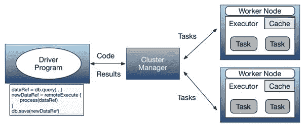
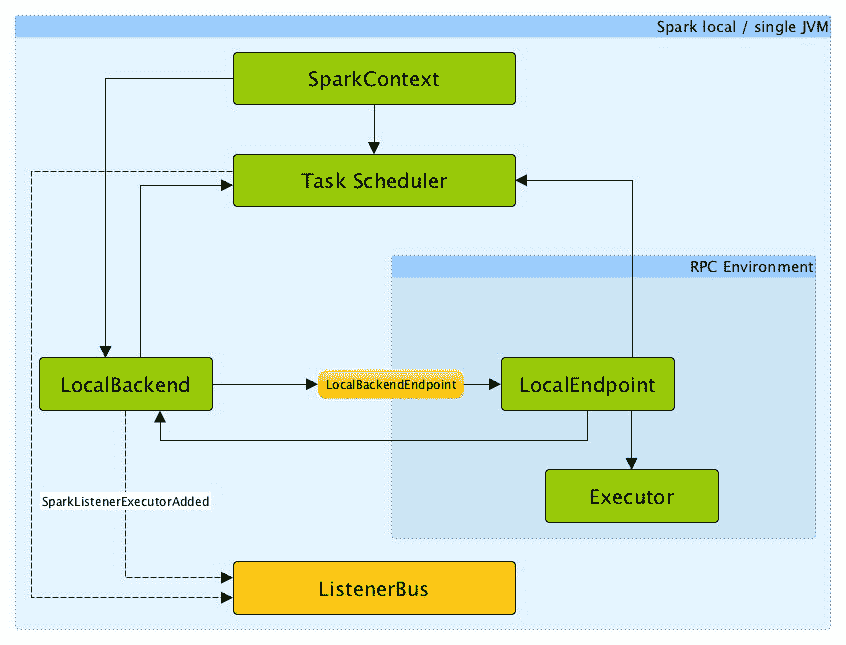
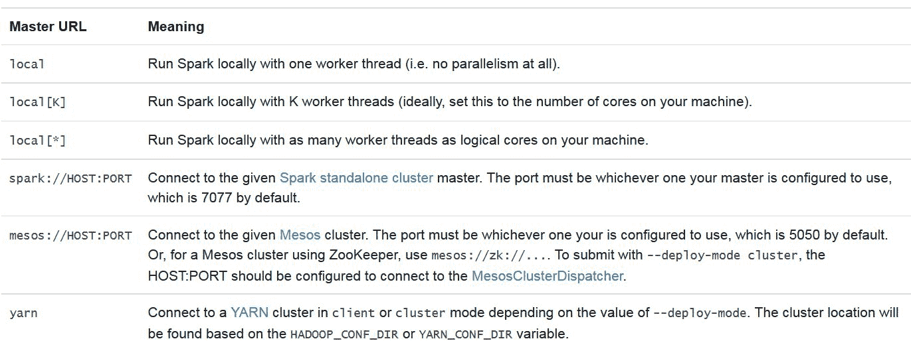
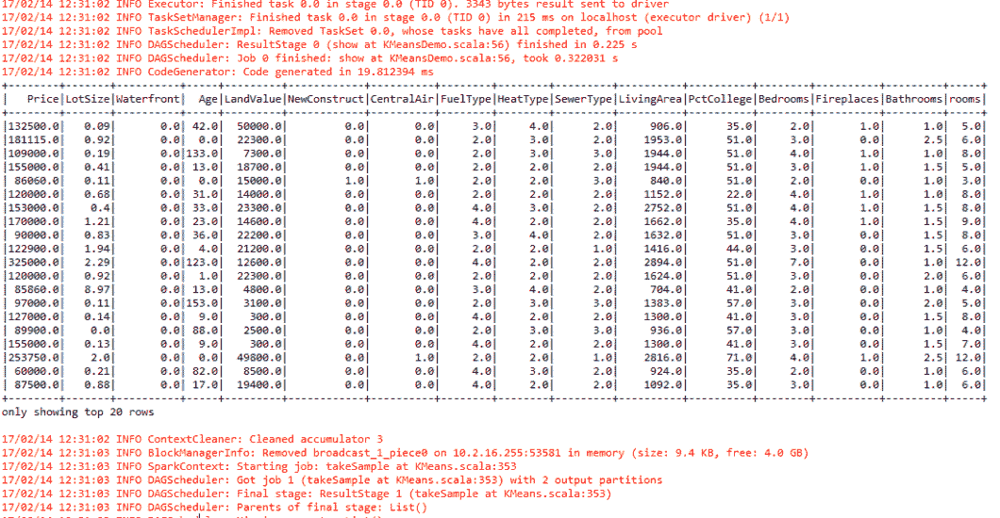
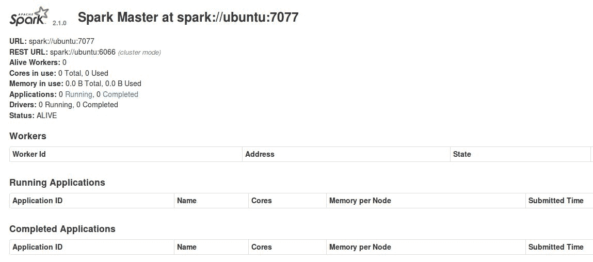
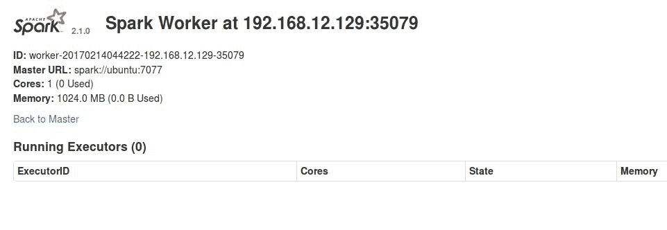
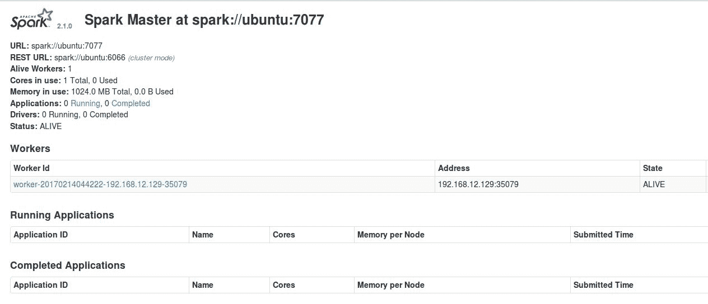
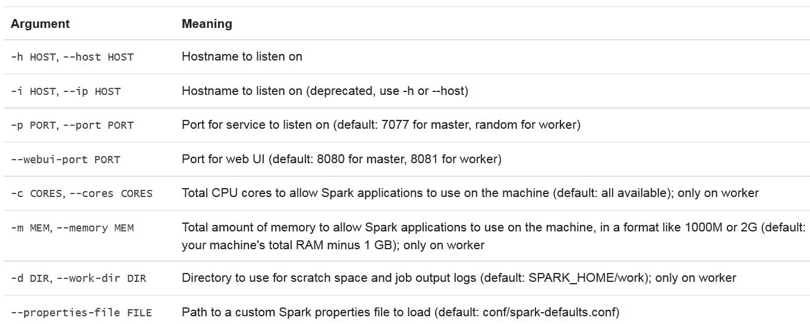
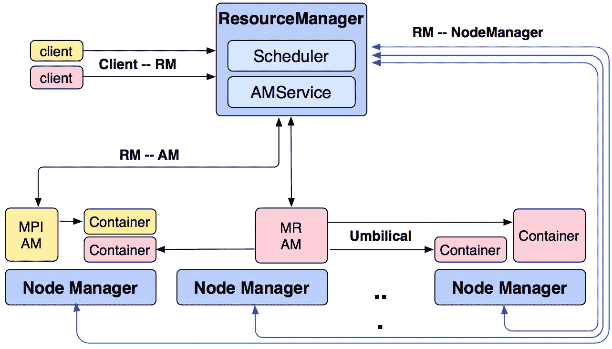
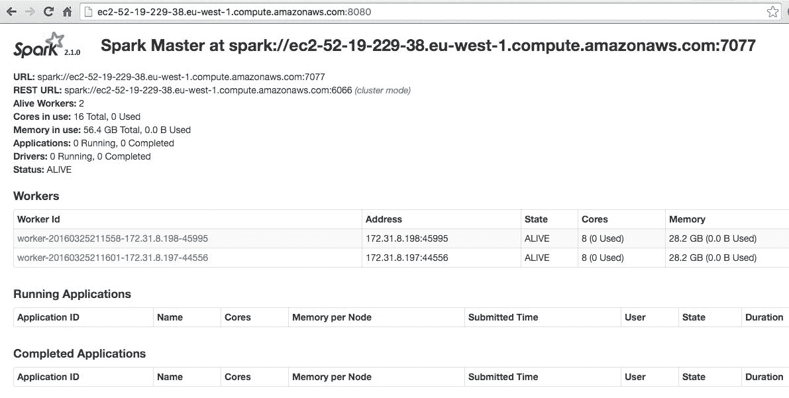

# 该去集群了-在集群上部署Spark

"I see the moon like a clipped piece of silver. Like gilded bees, the stars cluster around her"

-奥斯卡想

在前面的章节中，我们已经看到了如何使用不同的 Spark APIs 开发实际应用。然而，在本章中，我们将看到 Spark 如何在集群模式下使用其底层架构工作。最后，我们将看到如何在集群上部署完整的 Spark 应用。简而言之，本章将涵盖以下主题:

*   集群中的Spark架构
*   Spark 生态系统和集群管理
*   在集群上部署 Spark
*   在独立集群上部署 Spark
*   在介子簇上部署Spark
*   在纱簇上部署Spark
*   基于云的部署
*   在自动气象站上部署Spark

# 集群中的Spark架构

基于 Hadoop 的 **MapReduce** 框架在最近几年得到了广泛的应用；但是，它在 I/O、算法复杂性、低延迟流作业和完全基于磁盘的操作方面存在一些问题。Hadoop 提供 **Hadoop 分布式文件系统** ( **HDFS** )用于高效计算和廉价存储大数据，但您只能使用基于 Hadoop 的 MapReduce 框架用高延迟批处理模型或静态数据进行计算。Spark 为我们带来的主要大数据范例是内存计算和缓存抽象的引入。这使得 Spark 非常适合大规模数据处理，并使计算节点能够通过访问相同的输入数据来执行多个操作。

Spark 的**弹性分布式数据集** ( **RDD** )模型可以做 MapReduce 范式所能做的一切，甚至更多。然而，Spark 可以对数据集进行大规模的迭代计算。无论是否依赖 Hadoop，该选项都有助于更快地执行机器学习、通用数据处理、图形分析和**结构化查询语言** ( **SQL** )算法。因此，复兴星火生态系统是此时的需求。

对Spark的美丽和特点了解得够多了。在这一点上，复兴Spark生态系统是你需要知道Spark是如何工作的。

# Spark生态系统简介

为了向您提供更高级和额外的大数据处理能力，您的 Spark 作业可以在基于 Hadoop(又名纱)或基于 Mesos 的集群上运行。另一方面，Spark 中用 Scala 编写的核心 API 使您能够使用 Java、Scala、Python 和 r 等多种编程语言开发 Spark 应用。Spark 提供了几个属于 Spark 生态系统的库，为通用数据处理和分析、图形处理、大规模结构化 SQL 和**机器学习** ( **ML** )领域提供了额外的功能。Spark 生态系统由以下组件组成:


**Figure 1:** Spark ecosystem (up to Spark 2.1.0)

Spark 的核心引擎是用 Scala 编写的，但是支持不同的语言来开发您的 Spark 应用，例如 R、Java、Python 和 Scala。Spark 核心引擎中的主要组件/API 如下:

1.  **SparkSQL** :这有助于将 SQL 查询与 Spark 程序无缝混合，这样您就可以查询 Spark 程序内部的结构化数据。
2.  **Spark Streaming** :这是针对大规模流媒体应用开发，提供 Spark 与其他流媒体数据源如 Kafka、Flink、Twitter 的无缝集成。
3.  **SparkMLlib** 和 **SparKML** :这些是针对 RDD 和基于数据集/数据框架的机器学习和管道创建的。
4.  **GraphX** :这是为了大规模的图形计算和处理，让你的图形数据对象完全连通。
5.  **SparkR** : R on Spark 有助于基本的统计计算和机器学习。

正如我们已经说过的，无缝结合这些 API 来开发大规模的机器学习和数据分析应用是非常可能的。此外，Spark 作业可以通过集群管理器(如 Hadoop 纱、Mesos 和独立)提交和执行，也可以通过访问数据存储和来源(如 HDFS、Cassandra、HBase、亚马逊 S3，甚至 RDBMS)在云中提交和执行。然而，为了实现 Spark 的全部功能，我们需要在计算集群上部署 Spark 应用。

# 集群设计

Apache Spark 是一个分布式并行处理系统，它还提供内存计算能力。这种类型的计算范例需要一个相关的存储系统，以便您可以在大数据集群之上部署应用。要做到这一点，您必须使用分布式存储系统，如 HDFS、S3、HBase 和 Hive。为了移动数据，你将需要其他技术，如 Sqoop，驱动程序，推特，水槽和卡夫卡。

实际上，您可以非常容易地配置一个小型 Hadoop 集群。您只需要一个主节点和多个工作节点。在您的 Hadoop 集群中，主节点通常由**命名节点**、**数据节点**、**作业跟踪器**和**任务跟踪器**组成。另一方面，工作节点可以被配置为既作为数据节点又作为任务跟踪器。

出于安全原因，大多数大数据集群可能会设置在网络防火墙之后，以便计算节点可以克服或至少降低防火墙造成的复杂性。否则，计算节点无法从网络外部(即外联网)访问。下图显示了 Spark 中常用的简化大数据集群:


**Figure 2:** A general architecture for big data processing with JVM

上图显示了由五个计算节点组成的集群。这里，每个节点都有一个专用的执行器 JVM，每个 CPU 内核一个，而Spark驱动 JVM 位于集群之外。使用 **JBOD** ( **只是一堆磁盘**)方法，磁盘直接连接到节点。非常大的文件在磁盘上分区，虚拟文件系统(如 HDFS)将这些块作为一个大的虚拟文件提供。下面的简化组件模型显示了位于集群外部的驱动 JVM。它与集群管理器对话(见**图 4** )以便获得在工作节点上调度任务的许可，因为集群管理器跟踪集群上运行的所有进程的资源分配。

如果您已经使用 Scala 或 Java 开发了您的 Spark 应用，这意味着您的工作是一个基于 JVM 的过程。对于基于 JVM 的进程，您可以通过指定以下两个参数来简单地配置 Java 堆空间:

*   **-Xmx** : **T** 他的这个指定了你的 Java 堆空间的上限
*   **-Xms** :这个是 Java 堆空间的下限

一旦您提交了一个Spark作业，就需要为您的Spark作业分配堆内存。下图提供了一些关于如何:


**Figure 3:** JVM memory management

如上图所示，Spark 用 512 MB 的 JVM 堆空间启动 Spark 作业。但是，为了不间断地处理您的 Spark 作业，并避免出现**内存不足** ( **OOM** )错误，Spark 允许计算节点仅利用高达 90%的堆(即~461 MB)，这最终会通过控制 Spark 环境中的`spark.storage.safetyFraction`参数来增加或减少。更现实一点，JVM 可以看作是**Storage**(Java 堆的 60%)、用于执行的堆的 20%(也就是 **Shuffle** )以及用于其他存储的其余 20%的串联。

此外，Spark 是一个集群计算工具，它试图利用内存和基于磁盘的计算，并允许用户在内存中存储一些数据。实际上，Spark 仅将主内存用于其 LRU 缓存。对于不间断缓存机制，需要为特定于应用的数据处理保留少量内存。非正式地说，这大约是由`spark.memory.fraction`控制的 Java 堆空间的 60%。

因此，如果您想查看或计算在您的 Spark 应用中，您可以在内存中缓存多少特定于应用的数据，那么您可以将所有执行器使用的所有堆大小相加，然后乘以`safetyFraction`和`spark.memory.fraction`。实际上，您可以使用总堆大小的 54%(276.48 MB)来允许使用 Spark 计算节点。现在，随机存储器的计算如下:

```scala
Shuffle memory= Heap Size * spark.shuffle.safetyFraction * spark.shuffle.memoryFraction

```

`spark.shuffle.safetyFraction`和`spark.shuffle.memoryFraction`的默认值分别为 80%和 20%。因此，在实际中，您可以使用高达 *0.8*0.2 = 16%* 的 JVM 堆进行洗牌。最后，展开内存是展开进程可以使用的主内存量(在计算节点中)。计算如下:

```scala
Unroll memory = spark.storage.unrollFraction * spark.storage.memoryFraction * spark.storage.safetyFraction

```

以上是堆的 11%左右 *(0.2*0.6*0.9 = 10.8~11%)* ，也就是 56.32 MB 的 Java 堆空间。

More detailed discussion can be found at [http://spark.apache.org/docs/latest/configuration.html.](http://spark.apache.org/docs/latest/configuration.html)

正如我们稍后将看到的，存在各种不同的集群管理器，其中一些还能够与 Spark 执行器并行管理其他 Hadoop 工作负载甚至非 Hadoop 应用。请注意，执行器和驱动程序一直都是双向通信的，所以从网络角度来看，它们也应该坐得很近。



**Figure 4:** Driver, master, and worker architecture in Spark for cluster

Spark 使用驱动程序(也称为驱动程序)、主架构和工作架构(也称为主机、从机或计算节点)。驱动程序(或机器)与称为主节点的单个协调器对话。主节点实际上管理所有的工作节点(也称为从节点或计算节点)，其中几个执行器在集群中并行运行。需要注意的是，主节点也是具有大内存、大存储、大操作系统和底层计算资源的计算节点。从概念上讲，这个架构可以在**图 4** 中显示。更多细节将在本节后面讨论。

在真正的集群模式中，集群管理器(又称资源管理器)管理集群中计算节点的所有资源。通常，防火墙在增加集群安全性的同时，也增加了复杂性。系统组件之间的端口需要打开，以便它们可以相互通信。例如，Zookeeper 被许多组件用于配置。Apache Kafka 是一个订阅消息系统，它使用 Zookeeper 来配置它的主题、组、消费者和生产者。因此，到 Zookeeper 的客户端端口，可能会穿过防火墙，需要打开。

最后，需要考虑将系统分配给集群节点。例如，如果 Apache Spark 使用 Flume 或 Kafka，那么将使用内存通道。Apache Spark 不应该在内存使用方面与其他 Apache 组件竞争。根据您的数据流和内存使用情况，可能有必要在不同的集群节点上使用 Spark、Hadoop、Zookeeper、Flume 和其他工具。或者，资源管理器，例如纱，梅索斯，或 Docker，也可以用来解决这个问题。在标准的 Hadoop 环境中，无论如何，纱很可能是存在的。

充当工作者或 Spark 主节点的计算节点将比防火墙内的集群处理节点需要更多的资源。当许多 Hadoop 生态系统组件部署在集群上时，它们都需要主服务器上的额外内存。您应该监视工作节点的资源使用情况，并根据需要调整资源和/或应用位置。例如，纱正在处理这个问题。

本节已经从 Apache Spark、Hadoop 和其他工具的角度简要介绍了大数据集群的场景。但是，如何配置大数据集群中的 Apache Spark 集群本身？例如，可以有多种类型的 Spark 集群管理器。下一节将对此进行研究，并描述每种类型的 Apache Spark 集群管理器。

# 集群管理

Spark上下文可以通过Spark配置对象(即`SparkConf`)和Spark网址来定义。首先，Spark 上下文的目的是连接您的 Spark 作业将在其中运行的 Spark 集群管理器。然后，集群或资源管理器为您的应用跨计算节点分配所需的资源。集群管理器的第二个任务是在集群工作节点之间分配执行器，以便执行您的 Spark 作业。第三，资源管理器还将驱动程序(也称为应用 JAR 文件、R 代码或 Python 脚本)复制到计算节点。最后，资源管理器将计算任务分配给计算节点。

以下小节描述了当前 Spark 版本(即本书撰写期间的 Spark 2.1.0)可能提供的 Apache Spark 集群管理器选项。为了了解资源管理器(又称集群管理器)的资源管理，下面展示了纱是如何管理其所有底层计算资源的。但是，这对于您使用的任何集群管理器(例如，Mesos 或纱)都是一样的:


**Figure 5:** Resource management using YARN A detailed discussion can be found at [http://spark.apache.org/docs/latest/cluster-overview.html#cluster-manager-types](http://spark.apache.org/docs/latest/cluster-overview.html#cluster-manager-types).

# 伪集群模式(又名Spark本地)

正如您已经知道的，Spark 作业可以在本地模式下运行。这有时被称为伪集群执行模式。这也是非分布式和基于单个 JVM 的部署模式，其中 Spark 将所有执行组件(例如，驱动程序、执行器、本地调度包和主)发布到您的单个 JVM 中。这是驱动程序本身用作执行器的唯一模式。下图显示了提交Spark作业的本地模式的高级架构:



**Figure 6:** High-level architecture of local mode for Spark jobs (source: [https://jaceklaskowski.gitbooks.io/mastering-apache-spark/content/spark-local.html](https://jaceklaskowski.gitbooks.io/mastering-apache-spark/content/spark-local.html))

是不是太意外了？不，我想，因为您也可以实现一些短并行，其中默认并行是主网址中指定的线程数量(也称为使用的核心)，即 4 个核心/线程的本地[4]和所有可用线程的`local [*]`。我们将在本章后面讨论这个主题。

# 单独的

通过指定 Spark 配置本地 URL，可以让应用在本地运行。通过指定*本地【n】*，可以让 Spark 使用 *n* 线程在本地运行应用。这是一个有用的开发和测试选项，因为您还可以测试某种并行化场景，但将所有日志文件保留在一台机器上。独立模式使用 Apache Spark 提供的基本集群管理器。Spark主网址如下:

```scala
spark://<hostname>:7077

```

这里，`<hostname>`是运行 Spark 主机的主机的名称。我已经指定 7077 作为端口，这是默认值，但它是可配置的。这个简单的集群管理器目前只支持**先进先出** ( **先进先出**)调度。通过为每个应用设置资源配置选项，您可以设法允许并发应用调度。例如，`spark.core.max`用于在应用之间共享处理器内核。本章稍后将进行更详细的讨论。

# Apache 纱

如果Spark主值设置为纱簇，则应用可以提交到簇，然后终止。集群将负责分配资源和运行任务。但是，如果应用主文件作为纱客户端提交，那么应用在处理的生命周期中保持活动状态，并向纱请求资源。当与 Hadoop YARN 集成时，这些在更大的范围内适用。本章稍后将提供一个分步指南，用于配置单节点纱集群，以启动需要最少资源的Spark作业。

# 阿帕奇月

Apache Mesos 是一个跨集群资源共享的开源系统。它允许多个框架通过管理和调度资源来共享一个集群。它是一个集群管理器，使用 Linux 容器提供隔离，允许多个系统(如 Hadoop、Spark、Kafka、Storm 等)安全共享一个集群。这是一个基于主从的系统，使用 Zookeeper 进行配置管理。这样，您可以将您的 Spark 作业扩展到数千个节点。对于单个主节点 Mesos 集群，Spark 主 URL 将采用以下形式:

```scala
mesos://<hostname>:5050

```

下图直观地显示了通过专门使用 Mesos 提交 Spark 作业的结果:


**Figure 7:** Mesos in action (image source: [https://jaceklaskowski.gitbooks.io/mastering-apache-spark/content/spark-architecture.html](https://jaceklaskowski.gitbooks.io/mastering-apache-spark/content/spark-architecture.html))

上图中`<hostname>`为 Mesos 主服务器的主机名，端口定义为 5050，为默认的 Mesos 主端口(可配置)。如果在一个大规模高可用性 Mesos 集群中有多个 Mesos 主服务器，那么 Spark 主 URL 将如下所示:

```scala
mesos://zk://<hostname>:2181

```

所以，Mesos 主服务器的选举将由 Zookeeper 控制。`<hostname>`将是动物园管理员法定人数中的一个主人的名字。此外，端口号 2181 是 Zookeeper 的默认主端口。

# 基于云的部署

云计算范式中有三个不同的抽象层次:

*   **基础设施即服务**(又名 **IaaS** )
*   **平台即服务**(又名**平台即服务**)
*   **软件即服务**(又名 **SaaS** )

IaaS 通过空虚拟机为作为 SaaS 运行的软件提供计算基础架构。OpenStack 上的 Apache Spark 也是如此。

The advantage of OpenStack is that it can be used among multiple different cloud providers, since it is an open standard and is also based on open source. You even can use OpenStack in a local data center, and transparently and dynamically move workloads between local, dedicated, and public cloud data centers.

相比之下，PaaS 免除了您安装和操作 Apache Spark 集群的负担，因为这是作为服务提供的。换句话说，你可以像操作系统一样把它看作一个层。

Sometimes, you can even Dockerize your Spark application and deploy on the cloud platform independent manner. However, there is an ongoing discussion whether Docker is IaaS or PaaS, but in our opinion, this is just a form of a lightweight preinstalled virtual machine, so more on the IaaS.

最后，SaaS 是云计算范式提供和管理的应用层。坦率地说，您不会看到或者不必担心前两层(IaaS 和 PaaS)。

谷歌云、亚马逊 AWS、数字海洋和微软 Azure 都是云计算服务的好例子，它们提供了这三层即服务。在本章的后面，我们将展示一个如何使用亚马逊 AWS 在云之上部署您的 Spark 集群的示例。

# 在集群上部署 Spark 应用

在本节中，我们将讨论如何在计算集群上部署 Spark 作业。我们将看到如何以三种部署模式部署集群:独立模式、纱模式和中间层模式。下图总结了本章中引用集群概念所需的术语:


**Figure 8:** Terms that are needed to refer to cluster concepts (source: http://spark.apache.org/docs/latest/cluster-overview.html#glossary)

然而，在深入研究之前，我们需要知道如何提交 Spark 工作。

# 提交Spark作业

一旦 Spark 应用被捆绑为 jar 文件(用 Scala 或 Java 编写)或 Python 文件，就可以使用 Spark 分发(又名`$SPARK_HOME/bin`)中 bin 目录下的 Spark-submit 脚本提交它。根据 Spark 网站([http://Spark . Apache . org/docs/latest/submit-applications . html](http://spark.apache.org/docs/latest/submitting-applications.html)中提供的 API 文档，该脚本处理以下内容:

*   用 Spark 设置`JAVA_HOME`、`SCALA_HOME`的类路径
*   设置执行作业所需的所有依赖关系
*   管理不同的集群管理器
*   最后，部署 Spark 支持的模型

简单来说，Spark 作业提交语法如下:

```scala
$ spark-submit [options] <app-jar | python-file> [app arguments]

```

这里，`[options]`可以是:`--conf <configuration_parameters> --class <main-class> --master <master-url> --deploy-mode <deploy-mode> ... # other options`

*   `<main-class>`是主类名的名称。这实际上是我们 Spark 应用的入口点。
*   `--conf`表示所有使用的Spark参数和配置属性。配置属性的格式是键值格式。
*   `<master-url>`指定集群的主网址(例如，`spark://HOST_NAME:PORT` *)* 用于连接到 Spark 独立集群的主网址，`local`用于在本地运行 Spark 作业。默认情况下，它只允许您使用一个没有并行性的工作线程。`local [k]`可用于使用 *K* 工作线程在本地运行您的Spark作业。需要注意的是，K 是你机器上的核心数量。最后，如果您用`local[*]`指定主线程在本地运行 Spark 作业，那么您就授予了`spark-submit`脚本使用机器上所有工作线程(逻辑内核)的权限。最后，您可以将主节点指定为`mesos://IP_ADDRESS:PORT`，用于连接到可用的 Mesos 集群。或者，您可以指定使用`yarn`在基于纱的集群上运行Spark作业。

关于主网址的其他选项，请参考下图:



**Figure 9:** Details about the master URLs supported by Spark\

*   `<deploy-mode>`如果要在工作节点(集群)上部署驱动程序，或者作为外部客户端(客户端)在本地部署驱动程序，则必须指定这一点。支持四(4)种模式:本地、独立、纱和液晶。
*   `<app-jar>`是你用依赖项构建的 JAR 文件。提交作业时只需传递 JAR 文件。
*   `<python-file>`是使用 Python 编写的应用主源代码。提交工作时只需传递`.py`文件。
*   `[app-arguments]`可以是应用开发人员指定的输入或输出参数。

使用 spark-submit 脚本提交 spark 作业时，可以使用`--jars`选项指定 Spark 应用的主 jar(以及包含的其他相关 jar)。所有的 JARS 将被转移到集群。`--jars`后提供的网址必须用逗号分隔。

但是，如果您使用 URL 指定 jar，最好在`--jars`后使用逗号分隔 jar。Spark 使用以下 URL 方案来允许不同的策略来传播 JARS:

*   **文件:**指定绝对路径和`file:/`
*   **hdfs** **:** 、 **http** **:** 、 **https:** 、 **ftp** **:** JARS 或任何其他文件将按预期从您指定的 URL/URIs 下拉
*   **本地:**一个以`local:/`开头的 URI 可以用来指向每个计算节点上的本地 jar 文件

需要注意的是，相关的 JARs、R 代码、Python 脚本或任何其他相关的数据文件需要被复制或复制到计算节点上每个 SparkContext 的工作目录中。这有时会产生很大的开销，并且需要相当大的磁盘空间。磁盘使用量随着时间的推移而增加。因此，在某个时间段，需要清理未使用的数据对象或关联的代码文件。然而，这对于纱来说是非常容易的。纱处理定期清理，并可以自动处理。例如，在Spark独立模式下，提交Spark作业时，可以使用`spark.worker.cleanup.appDataTtl`属性配置自动清理。

在计算上，Spark的设计使得在作业提交期间(使用`spark-submit`脚本)，默认Spark配置值可以从属性文件加载并传播到Spark应用。主节点将从名为`spark-default.conf`的配置文件中读取指定的选项。确切的路径是`SPARK_HOME/conf/spark-defaults.conf`在你的星火发行目录中。但是，如果您在命令行中指定所有参数，这将获得更高的优先级，并将相应地使用。

# 本地和独立运行Spark作业

示例显示在[第 13 章](13.html#C9ROA1-21aec46d8593429cacea59dbdcd64e1c)、*我的名字是贝叶斯，朴素贝叶斯*，并且可以针对更大的数据集进行扩展以解决不同的目的。您可以用所有必需的依赖项打包所有这三个集群算法，并在集群中将其作为 Spark 作业提交。如果您不知道如何制作一个包并从 Scala 类中创建 jar 文件，您可以使用 SBT 或 Maven 将您的应用与所有依赖项捆绑在一起。

根据 spark 在[的文档，SBT 和 Maven 都有组装插件，可以把你的 Spark 应用打包成一个大罐子。如果您的应用已经捆绑了所有依赖项，请使用以下代码行提交您的 k-means 聚类的 Spark 作业，例如(对其他类使用类似的语法)，用于 Saratoga NY Homes 数据集。要在本地提交和运行 Spark 作业，请在 8 个内核上运行以下命令:](http://spark.apache.org/docs/latest/submitting-applications.html#advanced-dependency-management)

```scala
$ SPARK_HOME/bin/spark-submit    --class com.chapter15.Clustering.KMeansDemo    --master local[8]    KMeans-0.0.1-SNAPSHOT-jar-with-dependencies.jar    Saratoga_NY_Homes.txt

```

在前面的代码中，`com.chapter15.KMeansDemo`是用 Scala 编写的主类文件。本地[8]是利用机器八个核心的主网址。`KMeansDemo-0.1-SNAPSHOT-jar-with-dependencies.jar`是我们刚刚通过 Maven 项目生成的应用 JAR 文件；`Saratoga_NY_Homes.txt`是萨拉托加纽约家园数据集的输入文本文件。如果应用成功执行，您将在下图中找到包含输出的消息(节略):



**Figure 10:** Spark job output on terminal [local mode]

现在，让我们进入独立模式下的集群设置。要安装 Spark 独立模式，您应该在集群的每个节点上放置每个版本的 Spark 预构建版本。或者，你也可以自己建造，按照[http://spark.apache.org/docs/latest/building-spark.html](http://spark.apache.org/docs/latest/building-spark.html)的说明使用。

要将环境配置为 Spark 独立模式，您必须为集群中的每个节点提供带有所需版本的 Spark 预构建版本。或者，你也可以自己建造，按照[http://spark.apache.org/docs/latest/building-spark.html](http://spark.apache.org/docs/latest/building-spark.html)的说明使用。现在我们将看到如何手动启动独立集群。您可以通过执行以下命令来启动独立主机:

```scala
$ SPARK_HOME/sbin/start-master.sh

```

启动后，您应该在终端上观察以下日志:

```scala
Starting org.apache.spark.deploy.master.Master, logging to <SPARK_HOME>/logs/spark-asif-org.apache.spark.deploy.master.Master-1-ubuntu.out

```

默认情况下，您应该可以在`http://localhost:8080`访问 Spark 网页 UI。观察如下图所示的用户界面:



**Figure 11:** Spark master as standalone

您可以通过编辑以下参数来更改端口号:

```scala
SPARK_MASTER_WEBUI_PORT=8080

```

在`SPARK_HOME/sbin/start-master.sh`中，只需更改端口号，然后应用以下命令:

```scala
$ sudo chmod +x SPARK_HOME/sbin/start-master.sh.

```

或者，您可以重新启动Spark主控器来实现前面的更改。但是，您将不得不在`SPARK_HOME/sbin/start-slave.sh`中进行类似的更改。

正如您在这里看到的，没有与主节点相关联的活动工作人员。现在要创建从节点(也称为工作节点或计算节点)，请创建工作节点，并使用以下命令将它们连接到主节点:

```scala
$ SPARK_HOME/sbin/start-slave.sh <master-spark-URL>

```

成功完成上述命令后，您应该在终端上观察以下日志:

```scala
Starting org.apache.spark.deploy.worker.Worker, logging to <SPARK_HOME>//logs/spark-asif-org.apache.spark.deploy.worker.Worker-1-ubuntu.out 

```

一旦你启动了你的一个工作节点，你可以在`http://localhost:8081`在 Spark web UI 上查看它的状态。但是，如果您启动另一个工作节点，您可以在连续的端口(即 8082、8083 等)中访问它的状态。您还应该会看到这里列出的新节点，以及它的 CPU 和内存数量，如下图所示:



**Figure 12:** Spark worker as standalone

现在，如果您刷新`http://localhost:8080`，您应该会看到添加了一个与您的主节点相关联的工作节点，如下图所示:



**Figure 13:** Spark master has now one worker node as standalone

最后，如下图所示，这些都是可以传递给主节点和工作节点的配置选项:



**Figure 14:** Configuration options that can be passed to the master and worker nodes (source: [http://spark.apache.org/docs/latest/spark-standalone.html#starting-a-cluster-manually](http://spark.apache.org/docs/latest/spark-standalone.html#starting-a-cluster-manually))

现在，您的一个主节点和一个工作节点正在读取并处于活动状态。最后，您可以使用以下命令以独立模式而不是本地模式提交相同的 Spark 作业:

```scala
$ SPARK_HOME/bin/spark-submit  --class "com.chapter15.Clustering.KMeansDemo"  --master spark://ubuntu:7077   KMeans-0.0.1-SNAPSHOT-jar-with-dependencies.jar  Saratoga_NY_Homes.txt

```

工作开始后，在`http://localhost:80810`访问 Spark web UI，主用户为`http://localhost:80810`，工作人员为`http://localhost:8081`，您可以看到工作进度，如[第 14 章](14.html#CTSK41-21aec46d8593429cacea59dbdcd64e1c)、*整理时间-使用 Spark MLlib* 对数据进行聚类。

为了总结这一部分，我们希望将您重定向到下面的图像(即**图 15** )，该图像显示了以下 shell 脚本用于启动或停止集群的用法:


**Figure 15:** The usages of the shell scripts for launching or stopping your cluster\

# Hadoop 纱

如前所述，Apache Hadoop YARN 有两个主要组件:一个调度器和一个应用管理器，如下图所示:



**Figure 16:** Apache Hadoop YARN architecture (blue: system components; yellow and pink: two applications running)

现在，使用调度程序和应用管理器，可以配置以下两种部署模式来在基于纱的集群上启动您的Spark作业:

*   **集群模式**:在集群模式下，Spark 驱动程序在由 YARN 的应用管理器管理的应用的主进程内工作。当应用启动时，甚至客户端也可以被终止或断开连接。
*   **客户端模式**:在该模式下，Spark 驱动程序在客户端进程内部运行。之后，Spark master 仅用于向纱(纱资源管理器)请求计算节点的计算资源。

在 Spark 独立模式和 Mesos 模式下，需要在`--master`参数中指定主机的 URL(即地址)。但是，在纱模式下，资源管理器的地址是从 Hadoop 设置中的 Hadoop 配置文件中读取的。因此，`--master`参数为`yarn`。然而，在提交我们的 Spark 作业之前，我们需要您设置您的纱簇。下一小节展示了这样做的一个步骤。

# 配置单节点纱簇

在本小节中，我们将了解如何在运行纱簇上的Spark作业之前设置纱簇。有几个步骤，所以保持耐心，按部就班地做以下事情:

# 第一步:下载 Apache Hadoop

从 Hadoop 网站([http://hadoop.apache.org/](http://hadoop.apache.org/))下载最新发行版。我在 Ubuntu 14.04 上使用了最新的稳定版本 2.7.3，如下所示:

```scala
$  cd /home$  wget http://mirrors.ibiblio.org/apache/hadoop/common/hadoop-2.7.3/hadoop-2.7.3.tar.gz

```

接下来，在`/opt/yarn`中创建并提取包，如下所示:

```scala
$  mkdir –p /opt/yarn$  cd /opt/yarn$  tar xvzf /root/hadoop-2.7.3.tar.gz

```

# 步骤 2:设置 JAVA_HOME

详见[第一章](01.html#KVCC1-21aec46d8593429cacea59dbdcd64e1c)、*Scala*介绍中的 Java 设置部分，并应用相同的更改。

# 步骤 3:创建用户和组

可以如下创建`hadoop`组的以下`yarn`、`hdfs`和`mapred`用户帐户:

```scala
$  groupadd hadoop$  useradd -g hadoop yarn$  useradd -g hadoop hdfs$  useradd -g hadoop mapred

```

# 步骤 4:创建数据和日志目录

要使用 Hadoop 运行您的 Spark 作业，它需要具有不同权限的数据和日志目录。您可以使用以下命令:

```scala
$  mkdir -p /var/data/hadoop/hdfs/nn$  mkdir -p /var/data/hadoop/hdfs/snn$  mkdir -p /var/data/hadoop/hdfs/dn$  chown hdfs:hadoop /var/data/hadoop/hdfs –R$  mkdir -p /var/log/hadoop/yarn$  chown yarn:hadoop /var/log/hadoop/yarn -R

```

现在，您需要创建安装了纱的日志目录，然后如下设置所有者和组:

```scala
$  cd /opt/yarn/hadoop-2.7.3$  mkdir logs$  chmod g+w logs$  chown yarn:hadoop . -R

```

# 步骤 5:配置核心站点

需要将两个属性(即`fs.default.name`和`hadoop.http.staticuser.user`)设置到`etc/hadoop/core-site.xml`文件中。只需复制以下代码行:

```scala
<configuration><property><name>fs.default.name</name><value>hdfs://localhost:9000</value></property><property><name>hadoop.http.staticuser.user</name><value>hdfs</value></property></configuration>

```

# 步骤 6:配置 hdfs 站点

需要将五个属性(即`dfs.replication`、`dfs.namenode.name.dir`、`fs.checkpoint.dir`、`fs.checkpoint.edits.dir`和`dfs.datanode.data.dir`设置到`etc/hadoop/ hdfs-site.xml`文件中。只需复制以下代码行:

```scala
<configuration><property><name>dfs.replication</name><value>1</value></property><property><name>dfs.namenode.name.dir</name><value>file:/var/data/hadoop/hdfs/nn</value></property><property><name>fs.checkpoint.dir</name><value>file:/var/data/hadoop/hdfs/snn</value></property><property><name>fs.checkpoint.edits.dir</name><value>file:/var/data/hadoop/hdfs/snn</value></property><property><name>dfs.datanode.data.dir</name><value>file:/var/data/hadoop/hdfs/dn</value></property></configuration>

```

# 步骤 7:配置映射站点

一个属性(即`mapreduce.framework.name`)需要设置到`etc/hadoop/ mapred-site.xml`文件中。首先，将原始模板文件复制替换到`mapred-site.xml`中，如下所示:

```scala
$  cp mapred-site.xml.template mapred-site.xml

```

现在，复制下面几行代码:

```scala
<configuration><property><name>mapreduce.framework.name</name><value>yarn</value></property></configuration>

```

# 步骤 8:配置纱线站点

需要将两个属性(即`yarn.nodemanager.aux-services`和`yarn.nodemanager.aux-services.mapreduce.shuffle.class`)设置到`etc/hadoop/yarn-site.xml`文件中。只需复制以下代码行:

```scala
<configuration><property><name>yarn.nodemanager.aux-services</name><value>mapreduce_shuffle</value></property><property><name>yarn.nodemanager.aux-services.mapreduce.shuffle.class</name><value>org.apache.hadoop.mapred.ShuffleHandler</value></property></configuration>

```

# 步骤 9:设置 Java 堆空间

要在基于 Hadoop 的纱簇上运行您的Spark作业，您需要为 JVM 指定足够的堆空间。您需要编辑`etc/hadoop/hadoop-env.sh`文件。启用以下属性:

```scala
HADOOP_HEAPSIZE="500"HADOOP_NAMENODE_INIT_HEAPSIZE="500"

```

现在还需要编辑`mapred-env.sh`文件，如下行:

```scala
HADOOP_JOB_HISTORYSERVER_HEAPSIZE=250

```

最后，确保您已经编辑了`yarn-env.sh`以使 Hadoop 纱的更改永久化:

```scala
JAVA_HEAP_MAX=-Xmx500mYARN_HEAPSIZE=500

```

# 步骤 10:格式化 HDFS

如果您想启动您的 HDFS 名称节点，Hadoop 需要初始化它将存储或保存其数据的目录，以跟踪您的文件系统的所有元数据。格式化会破坏一切，并建立一个新的文件系统。然后使用在`etc/hadoop/hdfs-site.xml`中`dfs.namenode.name.dir`上设置的参数值。要进行格式化，首先，移动到`bin`目录并执行以下命令:

```scala
$  su - hdfs$ cd /opt/yarn/hadoop-2.7.3/bin$ ./hdfs namenode -format

```

如果前面的命令成功执行，您应该会在您的 Ubuntu 终端上看到以下内容:

```scala
INFO common.Storage: Storage directory /var/data/hadoop/hdfs/nn has been successfully formatted

```

# 第 11 步:启动 HDFS

在步骤 10 的`bin`目录中，执行以下命令:

```scala
$ cd ../sbin$ ./hadoop-daemon.sh start namenode

```

成功执行上述命令后，您应该会在终端上看到以下内容:

```scala
starting namenode, logging to /opt/yarn/hadoop-2.7.3/logs/hadoop-hdfs-namenode-limulus.out

```

要启动`secondarynamenode`和`datanode`，您应该使用以下命令:

```scala
$ ./hadoop-daemon.sh start secondarynamenode

```

如果前面的命令成功，您应该会在终端上收到以下消息:

```scala
Starting secondarynamenode, logging to /opt/yarn/hadoop-2.7.3/logs/hadoop-hdfs-secondarynamenode-limulus.out

```

然后使用以下命令启动数据节点:

```scala
$ ./hadoop-daemon.sh start datanode

```

如果前面的命令成功，您应该会在终端上收到以下消息:

```scala
starting datanode, logging to /opt/yarn/hadoop-2.7.3/logs/hadoop-hdfs-datanode-limulus.out

```

现在，请确保使用以下命令检查与这些节点相关的所有服务是否正在运行:

```scala
$ jps

```

您应该观察如下内容:

```scala
35180 SecondaryNameNode45915 NameNode656335 Jps75814 DataNode

```

# 步骤 12:开始纱线

为了使用纱，必须启动一个`resourcemanager`和一个节点管理器作为用户纱:

```scala
$  su - yarn$ cd /opt/yarn/hadoop-2.7.3/sbin$ ./yarn-daemon.sh start resourcemanager

```

如果前面的命令成功，您应该会在终端上收到以下消息:

```scala
starting resourcemanager, logging to /opt/yarn/hadoop-2.7.3/logs/yarn-yarn-resourcemanager-limulus.out

```

执行以下命令启动节点管理器:

```scala
$ ./yarn-daemon.sh start nodemanager

```

如果前面的命令成功，您应该会在终端上收到以下消息:

```scala
starting nodemanager, logging to /opt/yarn/hadoop-2.7.3/logs/yarn-yarn-nodemanager-limulus.out

```

如果您想确保这些节点中的每个服务都在运行，您应该使用`$jsp`命令。此外，如果您想停止您的资源管理器或`nodemanager`，请使用以下`g`命令:

```scala
$ ./yarn-daemon.sh stop nodemanager$ ./yarn-daemon.sh stop resourcemanager

```

# 步骤 13:在网络用户界面上验证

访问`http://localhost:50070`查看名称节点的状态，在浏览器上访问资源管理器的`http://localhost:8088`。

The preceding steps show how to configure a Hadoop-based YARN cluster with only a few nodes. However, if you want to configure your Hadoop-based YARN clusters ranging from a few nodes to extremely large clusters with thousands of nodes, refer to [https://hadoop.apache.org/docs/current/hadoop-project-dist/hadoop-common/ClusterSetup.html](https://hadoop.apache.org/docs/current/hadoop-project-dist/hadoop-common/ClusterSetup.html).

# 在纱簇上提交Spark作业

现在，我们具有最低要求(坦率地说，用于执行一个小的 Spark 作业)的纱簇已经准备好，可以在纱簇模式下启动 Spark 应用，您可以使用以下提交命令:

```scala
$ SPARK_HOME/bin/spark-submit --classpath.to.your.Class --master yarn --deploy-mode cluster [options] <app jar> [app options]

```

为了运行我们的`KMeansDemo`，应该这样做:

```scala
$ SPARK_HOME/bin/spark-submit  --class "com.chapter15.Clustering.KMeansDemo"  --master yarn  --deploy-mode cluster  --driver-memory 16g  --executor-memory 4g  --executor-cores 4  --queue the_queue  KMeans-0.0.1-SNAPSHOT-jar-with-dependencies.jar  Saratoga_NY_Homes.txt

```

前面的`submit`命令用默认的应用主程序启动一个纱簇模式。那么`KMeansDemo`将作为应用主线程的子线程运行。对于状态更新和在控制台中显示它们，客户端将定期轮询应用主机。当您的应用(在我们的例子中是`KMeansDemo`)完成执行时，客户端将退出。

Upon submission of your job, you might want to see the progress using the Spark web UI or Spark history server. Moreover, you should refer to [Chapter 18](18.html#GCGLC1-21aec46d8593429cacea59dbdcd64e1c), *Testing and Debugging Spark*) to know how to analyze driver and executor logs.

要在客户端模式下启动 Spark 应用，您应该使用前面的命令，只是您必须用客户端替换集群。对于希望使用 Spark shell 的用户，请在客户端模式下使用以下内容:

```scala
$ SPARK_HOME/bin/spark-shell --master yarn --deploy-mode client

```

# 在纱簇中提前提交工作

如果选择更高级的方式提交要在纱簇中计算的Spark作业，可以指定其他参数。例如，如果要启用动态资源分配，请将`spark.dynamicAllocation.enabled`参数设为真。但是，要这样做，您还需要指定`minExecutors`、`maxExecutors`和`initialExecutors`，如下所述。另一方面，如果要启用洗牌服务，将`spark.shuffle.service.enabled`设置为`true`。最后，您还可以尝试使用`spark.executor.instances`参数指定将运行多少执行器实例。

现在，为了使前面的讨论更加具体，您可以参考以下提交命令:

```scala
$ SPARK_HOME/bin/spark-submit   --class "com.chapter13.Clustering.KMeansDemo"  --master yarn  --deploy-mode cluster  --driver-memory 16g  --executor-memory 4g  --executor-cores 4  --queue the_queue  --conf spark.dynamicAllocation.enabled=true  --conf spark.shuffle.service.enabled=true  --conf spark.dynamicAllocation.minExecutors=1  --conf spark.dynamicAllocation.maxExecutors=4  --conf spark.dynamicAllocation.initialExecutors=4  --conf spark.executor.instances=4  KMeans-0.0.1-SNAPSHOT-jar-with-dependencies.jar  Saratoga_NY_Homes.txt

```

然而，前面的作业提交脚本的结果是复杂的，有时是不确定的。从我之前的经验来看，如果从代码中增加分区的数量，增加执行器的数量，那么 app 完成的速度会更快，这是可以的。但是如果只增加执行器核心，完成时间是一样的。但是，您可能希望时间比初始时间短。其次，如果您启动前面的代码两次，您可能会期望两个作业都在 60 秒内完成，但这也可能不会发生。通常，这两项工作可能会在 120 秒后完成。这有点奇怪，不是吗？然而，下面的解释将帮助您理解这个场景。

假设您的机器上有 16 个内核和 8 GB 内存。现在，如果你使用四个执行人，每个执行人有一个核心，会发生什么？当你使用一个执行器时，Spark 从 YARN 中保留它，YARN 分配内核的数量(例如，在我们的例子中是一个)和所需的内存。为了更快的处理，内存的需求比你实际要求的要多。如果您要求 1 GB，实际上它将分配近 1.5 GB，开销为 500 MB。此外，它可能会为驱动程序分配一个执行器，内存使用量可能为 1024 MB(即 1 GB)。

有时候，你的 Spark 工作想要多少内存并不重要，重要的是它能保留多少。在前面的例子中，每个执行器不需要 50 MB 的测试，而是大约 1.5 GB(包括开销)。我们将在本章后面讨论如何在 AWS 上配置 Spark 集群。

# 阿帕奇月

当使用 Mesos 时，Mesos 主机通常代替 Spark 主机作为集群管理器(也称为资源管理器)。现在，当驱动程序创建一个 Spark 作业并开始分配相关任务进行调度时，Mesos 会确定哪些计算节点处理哪些任务。我们假设您已经在机器上配置并安装了 Mesos。

To get started, following links may be helpful to install Mesos on your machine. [http://blog.madhukaraphatak.com/mesos-single-node-setup-ubuntu/,](http://blog.madhukaraphatak.com/mesos-single-node-setup-ubuntu/) [https://mesos.apache.org/gettingstarted/.](https://mesos.apache.org/gettingstarted/)

根据硬件配置，这需要一段时间。在我的机器上(Ubuntu 14.04 64 位，带酷睿 i7 和 32gb RAM)，花了 1 个小时完成构建。

要通过使用 Mesos 集群模式提交和计算您的 Spark 作业，请确保在 Mesos 可访问的地方有 Spark 二进制包。此外，确保您的 Spark 驱动程序能够以自动连接到 Mesos 的方式进行配置。第二个选项是将 Spark 安装在与 Mesos 从节点相同的位置。然后，您必须配置`spark.mesos.executor.home`参数来指出Spark分布的位置。需要注意的是，可以指向的默认位置是`SPARK_HOME`。

当 Mesos 第一次在 Mesos 工作节点(也称为计算节点)上执行 Spark 作业时，Spark 二进制包必须在该工作节点上可用。这将确保 Spark Mesos 执行器在后端运行。

The Spark binary packages can be hosted to Hadoop to make them accessible:
1\. Having the URIs/URLs (including HTTP) via `http://`,
2\. Using the Amazon S3 via `s3n://`,
3\. Using the HDFS via `hdfs://`.
If you set the `HADOOP_CONF_DIR` environment variable, the parameter is usually set as `hdfs://...`; otherwise `file://`.

您可以为 Mesos 指定主网址，如下所示:

1.  `mesos://host:5050`代表单主介子群，`mesos://zk://host1:2181,host2:2181,host3:2181/mesos`代表由动物园管理员控制的多主介子群。

For a more detailed discussion, please refer to [http://spark.apache.org/docs/latest/running-on-mesos.html](http://spark.apache.org/docs/latest/running-on-mesos.html).

# 客户端模式

在这种模式下，Mesos 框架的工作方式是直接在客户端机器上启动 Spark 作业。然后，它等待计算结果，也称为驱动程序输出。然而，为了与 Mesos 正确交互，驱动程序希望在`SPARK_HOME/conf/spark-env.sh`中指定一些特定于应用的配置。要做到这一点，请在`$SPARK_HOME /conf`修改`spark-env.sh.template`文件，在使用该客户端模式之前，在您的`spark-env.sh`中，设置以下环境变量:

```scala
$ export MESOS_NATIVE_JAVA_LIBRARY=<path to libmesos.so>

```

这条路径在 Ubuntu 上是典型的`/usr/local /lib/libmesos.so`。另一方面，在 macOS X 上，同样的库被称为`libmesos.dylib`而不是`libmesos.so`:

```scala
$ export SPARK_EXECUTOR_URI=<URL of spark-2.1.0.tar.gz uploaded above>

```

现在，当提交并启动要在集群上执行的 Spark 应用时，您必须将 Mesos `:// HOST:PORT`作为主 URL 传递。这通常是在您的 Spark 应用开发中创建`SparkContext`时完成的，如下所示:

```scala
val conf = new SparkConf()              .setMaster("mesos://HOST:5050")  .setAppName("My app")             .set("spark.executor.uri", "<path to spark-2.1.0.tar.gz uploaded above>")val sc = new SparkContext(conf)

```

这样做的第二个选项是使用`spark-submit`脚本并在`SPARK_HOME/conf/spark-defaults.conf`文件中配置`spark.executor.uri`。运行 shell 时，`spark.executor.uri`参数是从`SPARK_EXECUTOR_URI`继承的，所以不需要作为系统属性冗余传入。只需使用以下命令从您的 Spark shell 访问客户端模式:

```scala
$ SPARK_HOME/bin/spark-shell --master mesos://host:5050

```

# 集群模式

Mesos 上的 Spark 也支持集群模式。如果驱动程序已经(在集群上)启动了 Spark 作业，并且计算也完成了，那么客户端可以从 Mesos Web UI 访问(驱动程序的)结果。如果您已经通过`SPARK_HOME/sbin/start-mesos-dispatcher.sh`脚本在集群中启动了`MesosClusterDispatcher`，则可以使用集群模式。

同样，条件是在您的 Spark 应用中创建`SparkContext`时，您必须传递 Mesos 主 URL(例如，`mesos://host:5050`)。在集群模式下启动 Mesos 也会启动`MesosClusterDispatcher`作为运行在你的主机上的守护进程。

为了更灵活、更高级地执行您的 Spark 工作，您还可以使用**马拉松**。使用马拉松的好处是可以用马拉松跑`MesosClusterDispatcher`。如果这样做，请确保`MesosClusterDispatcher`正在前台运行。

**Marathon** is a framework for Mesos that is designed to launch long-running applications, and in Mesosphere, it serves as a replacement for a traditional init system. It has many features that simplify running applications in a clustered environment, such as high-availability, node constraints, application health checks, an API for scriptability and service discovery, and an easy-to-use web user interface. It adds its scaling and self-healing capabilities to the Mesosphere feature set. Marathon can be used to start other Mesos frameworks, and it can also launch any process that can be started in the regular shell. As it is designed for long-running applications, it will ensure that applications it has launched will continue running, even if the slave node(s) they are running on fails. For more information on using Marathon with the Mesosphere, refer to the GitHub page at [https://github.com/mesosphere/marathon](https://github.com/mesosphere/marathon).

更具体地说，从客户端，您可以使用`spark-submit`脚本向您的 Mesos 集群提交 Spark 作业，并将主 URL 指定到`MesosClusterDispatcher`的 URL(例如，`mesos://dispatcher:7077`)。内容如下:

```scala
$ SPARK_HOME /bin/spark-class org.apache.spark.deploy.mesos.MesosClusterDispatcher

```

您可以在Spark集群网络用户界面上查看驱动程序状态。例如，使用以下作业提交命令来执行此操作:

```scala
$ SPARK_HOME/bin/spark-submit   --class com.chapter13.Clustering.KMeansDemo   --master mesos://207.184.161.138:7077    --deploy-mode cluster   --supervise   --executor-memory 20G   --total-executor-cores 100   KMeans-0.0.1-SNAPSHOT-jar-with-dependencies.jar   Saratoga_NY_Homes.txt

```

请注意，传递给 Spark-submit 的 jars 或 Python 文件应该是 URIs 可访问的，因为 Spark 驱动程序不会自动上传本地 JARS。最后，Spark 可以在两种模式下运行 Mesos:*粗粒度*(默认)和*细粒度*(已弃用)。更多详情请参考[http://spark.apache.org/docs/latest/running-on-mesos.html](http://spark.apache.org/docs/latest/running-on-mesos.html)。

在集群模式下，Spark 驱动程序运行在不同的机器上，也就是说，驱动程序、主节点和计算节点是不同的机器。因此，如果您尝试使用`SparkContext.addJar`添加 JARS，这将不起作用。要避免此问题，请使用启动命令中的`--jars`选项，确保客户端上的 jar 文件也可用于`SparkContext.addJar`:

```scala
$ SPARK_HOME/bin/spark-submit --class my.main.Class    --master yarn    --deploy-mode cluster    --jars my-other-jar.jar, my-other-other-jar.jar    my-main-jar.jar    app_arg1 app_arg2

```

# 在 AWS 上部署

在上一节中，我们展示了如何在本地、独立或部署模式下提交Spark作业。在这里，我们将展示如何在 AWS EC2 上以真实集群模式运行 spark 应用。为了使我们的应用在 spark 集群模式下运行并获得更好的可扩展性，我们将 **Amazon 弹性计算云** ( **EC2** )服务视为 IaaS 或**平台即服务** ( **PaaS** )。定价及相关信息请参考[https://aws.amazon.com/ec2/pricing/](https://aws.amazon.com/ec2/pricing/)。

# 步骤 1:密钥对和访问密钥配置

我们假设您已经创建了 EC2 帐户。嗯！第一个要求是创建 EC2 密钥对和 AWS 访问密钥。EC2 密钥对是您在通过 SSH 与 EC2 服务器或实例建立安全连接时需要的私钥。要制作密钥，您必须通过 AWS 控制台，网址为[。请参考下图，该图显示了 EC2 帐户的密钥对创建页面:](http://docs.aws.amazon.com/AWSEC2/latest/UserGuide/ec2-key-pairs.html#having-ec2-create-your-key-pair)


**Figure 17:** AWS key-pair generation window

下载后命名为`aws_key_pair.pem`并保存在本地机器上。然后通过执行以下命令来确保权限(出于安全目的，您应该将该文件存储在安全的位置，比如`/usr/local/key`):

```scala
$ sudo chmod 400 /usr/local/key/aws_key_pair.pem

```

现在您需要的是 AWS 访问密钥和您的帐户凭据。如果您想使用`spark-ec2`脚本从本地机器向计算节点提交您的 Spark 作业，则需要这些。要生成和下载密钥，请登录您的 AWS IAM 服务，网址为[。](http://docs.aws.amazon.com/IAM/latest/UserGuide/id_credentials_access-keys.html#Using_CreateAccessKey)

下载完成后(即`/usr/local/key`)，需要在本地机器中设置两个环境变量。只需执行以下命令:

```scala
$ echo "export AWS_ACCESS_KEY_ID=<access_key_id>" >> ~/.bashrc $ echo " export AWS_SECRET_ACCESS_KEY=<secret_access_key_id>" >> ~/.bashrc $ source ~/.bashrc

```

# 步骤 2:在 EC2 上配置Spark集群

在 Spark 1.6.3 版本之前，Spark 发行版(即`/SPARK_HOME/ec2`)提供了一个名为 **spark-ec2** 的 shell 脚本，用于从本地机器启动 ec2 实例中的 Spark Cluster。这最终有助于启动、管理和关闭您将在 AWS 上使用的Spark集群。然而，自从 Spark 2.x 以来，相同的脚本被移动到 AMPLab，这样就更容易修复 bug 和单独维护脚本本身。

该脚本可以在[https://github.com/amplab/spark-ec2](https://github.com/amplab/spark-ec2)从 GitHub repo 访问和使用。

Starting and using a cluster on AWS will cost money. Therefore, it is always a good practice to stop or destroy a cluster when the computation is done. Otherwise, it will incur additional cost to you. For more about AWS pricing, please refer to [https://aws.amazon.com/ec2/pricing/](https://aws.amazon.com/ec2/pricing/).

您还需要为您的亚马逊 EC2 实例(控制台)创建一个 IAM 实例配置文件。详见[http://docs . AWS . Amazon . com/codedeploy/latest/user guide/入门-create-iam-instance-profile . html](https://github.com/amplab/spark-ec2)。为了简单起见，让我们下载脚本并将其放在 Spark home ( `$SPARK_HOME/ec2`)中的目录`ec2`下。执行以下命令启动新实例后，它会自动在群集上设置 Spark、HDFS 和其他依赖项:

```scala
$ SPARK_HOME/spark-ec2 --key-pair=<name_of_the_key_pair> --identity-file=<path_of_the key_pair>  --instance-type=<AWS_instance_type > --region=<region> zone=<zone> --slaves=<number_of_slaves> --hadoop-major-version=<Hadoop_version> --spark-version=<spark_version> --instance-profile-name=<profile_name>launch <cluster-name>

```

我们认为这些参数是不言自明的。或者，更多详情请参考[https://github.com/amplab/spark-ec2#readme](https://github.com/amplab/spark-ec2#readme)。

**If you already have a Hadoop cluster and want to deploy spark on it:** If you are using Hadoop-YARN (or even Apache Mesos), running a spark job is relatively easier. Even if you don't use either, Spark can run in standalone mode. Spark runs a driver program, which, in turn, invokes spark executors. This means that you need to tell Spark the nodes where you want your spark daemons to run (in terms of master/slave). In your `spark/conf` directory, you can see a file `slaves`. Update it to mention all the machines you want to use. You can set up spark from source or use a binary from the website. You always should use the **Fully Qualified Domain Names** (**FQDN**) for all your nodes, and make sure that each of those machines are passwordless SSH accessible from your master node.

假设您已经创建并配置了实例配置文件。现在，您已经准备好启动 EC2 集群。就我们的情况而言，它类似于以下内容:

```scala
$ SPARK_HOME/spark-ec2 --key-pair=aws_key_pair --identity-file=/usr/local/aws_key_pair.pem --instance-type=m3.2xlarge --region=eu-west-1 --zone=eu-west-1a --slaves=2 --hadoop-major-version=yarn --spark-version=2.1.0 --instance-profile-name=rezacsedu_awslaunch ec2-spark-cluster-1

```

下图显示了您在 AWS 上的 Spark 主页:



**Figure 18:** Cluster home on AWS

成功完成后，spark 集群将在您的 EC2 帐户上实例化两个工作(从)节点。但是，根据您的互联网速度和硬件配置，这项任务有时可能需要大约半小时。因此，你很想喝杯咖啡休息一下。集群设置成功竞争后，您将在终端上获得Spark集群的网址。要确定集群是否真的在运行，请检查浏览器上的`https://<master-hostname>:8080`，其中`master-hostname`是您在终端上收到的 URL。如果一切顺利，你会发现你的集群正在运行；参见**集群之家图 18** 。

# 步骤 3:在 AWS 集群上运行Spark作业

现在您的主节点和工作节点都处于活动状态并正在运行。这意味着您可以将您的 Spark 作业提交给他们进行计算。但是，在此之前，您需要使用 SSH 登录远程节点。为此，对 SSH 远程 Spark 集群执行以下命令:

```scala
$ SPARK_HOME/spark-ec2 --key-pair=<name_of_the_key_pair> --identity-file=<path_of_the _key_pair> --region=<region> --zone=<zone>login <cluster-name> 

```

对于我们的情况，它应该如下所示:

```scala
$ SPARK_HOME/spark-ec2 --key-pair=my-key-pair --identity-file=/usr/local/key/aws-key-pair.pem --region=eu-west-1 --zone=eu-west-1login ec2-spark-cluster-1

```

现在，通过执行以下命令(在新终端中)，将您的应用，即 JAR 文件(或 python/R 脚本)复制到远程实例(在我们的例子中，即`ec2-52-48-119-121.eu-west-1.compute.amazonaws.com`):

```scala
$ scp -i /usr/local/key/aws-key-pair.pem /usr/local/code/KMeans-0.0.1-SNAPSHOT-jar-with-dependencies.jar ec2-user@ec2-52-18-252-59.eu-west-1.compute.amazonaws.com:/home/ec2-user/

```

然后，您需要通过执行以下命令将您的数据(在我们的例子中是`/usr/local/data/Saratoga_NY_Homes.txt`)复制到同一个远程实例:

```scala
$ scp -i /usr/local/key/aws-key-pair.pem /usr/local/data/Saratoga_NY_Homes.txt ec2-user@ec2-52-18-252-59.eu-west-1.compute.amazonaws.com:/home/ec2-user/

```

Note that if you have already configured HDFS on your remote machine and put your code/data file, you don't need to copy the JAR and data files to the slaves; the master will do it automatically.

干得好！你快完成了！现在，最后，您必须提交您的 Spark 作业，由从属节点或工作节点进行计算。为此，只需执行以下命令:

```scala
$SPARK_HOME/bin/spark-submit --class com.chapter13.Clustering.KMeansDemo --master spark://ec2-52-48-119-121.eu-west-1.compute.amazonaws.com:7077 file:///home/ec2-user/KMeans-0.0.1-SNAPSHOT-jar-with-dependencies.jar file:///home/ec2-user/Saratoga_NY_Homes.txt

```

Place your input file under `file:///input.txt` if HDFS is not set on your machine.

如果您已经将数据放在 HDFS 上，您应该发出类似下面这样的提交命令:

```scala
$SPARK_HOME/bin/spark-submit --class com.chapter13.Clustering.KMeansDemo --master spark://ec2-52-48-119-121.eu-west-1.compute.amazonaws.com:7077 hdfs://localhost:9000/KMeans-0.0.1-SNAPSHOT-jar-with-dependencies.jar hdfs://localhost:9000//Saratoga_NY_Homes.txt

```

成功完成作业计算后，您应该会在端口 8080 看到作业的状态和相关统计信息。

# 步骤 4:暂停、重新启动和终止Spark集群

计算完成后，最好停止集群以避免额外成本。要停止集群，请从本地计算机执行以下命令:

```scala
$ SPARK_HOME/ec2/spark-ec2 --region=<ec2-region> stop <cluster-name>

```

就我们的情况而言，应该是这样的:

```scala
$ SPARK_HOME/ec2/spark-ec2 --region=eu-west-1 stop ec2-spark-cluster-1

```

要稍后重新启动群集，请执行以下命令:

```scala
$ SPARK_HOME/ec2/spark-ec2 -i <key-file> --region=<ec2-region> start <cluster-name>

```

对于我们的情况，它将类似于以下内容:

```scala
$ SPARK_HOME/ec2/spark-ec2 --identity-file=/usr/local/key/-key-pair.pem --region=eu-west-1 start ec2-spark-cluster-1

```

最后，要在 AWS 上终止您的 Spark 集群，我们使用以下代码:

```scala
$ SPARK_HOME/ec2/spark-ec2 destroy <cluster-name>

```

在我们的情况下，应该是以下内容:

```scala
$ SPARK_HOME /spark-ec2 --region=eu-west-1 destroy ec2-spark-cluster-1

```

现货实例对于降低 AWS 成本非常有用，有时可以将实例成本降低一个数量级。可在[http://blog.insightdatalabs.com/spark-cluster-step-by-step/](http://blog.insightdatalabs.com/spark-cluster-step-by-step/)访问使用该设施的逐步指南。

有时，很难移动大型数据集，比如 1 TB 的原始数据文件。在这种情况下，如果您希望您的应用针对大规模数据集进行更大规模的扩展，最快的方法是将它们从亚马逊 S3 或 EBS 设备加载到节点上的 HDFS，并使用`hdfs://`指定数据文件路径。

The data files or any other files (data, jars, scripts, and so on) can be hosted on HDFS to make them highly accessible:
1\. Having the URIs/URLs (including HTTP) via `http://`
2\. Using the Amazon S3 via `s3n://`
3\. Using the HDFS via `hdfs://`
If you set `HADOOP_CONF_DIR` environment variable, the parameter is usually set as `hdfs://...`; otherwise `file://`.

# 摘要

在本章中，我们讨论了 Spark 如何在其底层架构下以集群模式工作。您还看到了如何在集群上部署完整的 Spark 应用。您看到了如何部署集群，以便在不同的集群模式下运行 Spark 应用，例如本地、独立、纱和 Mesos。最后，您看到了如何使用 EC2 脚本在 AWS 上配置 Spark 集群。我们相信这一章会帮助你对 Spark 有一些很好的了解。然而，由于页面限制，我们无法涵盖许多 API 及其底层功能。

如果您遇到任何问题，请不要忘记在`user@spark.apache.org`向 Spark 用户邮件列表报告。在这样做之前，请确保您已经订阅了它。在下一章中，您将看到如何测试和调试 Spark 应用。