# 十九、PySpark 和 SparkR

在本章中，我们将讨论另外两个流行的 API:PySpark 和 SparkR，它们分别用于用 Python 和 R 编程语言编写 Spark 代码。本章的第一部分将介绍使用 PySpark 使用 Spark 时的一些技术方面。然后我们将转到 SparkR，看看如何轻松使用它。本章将讨论以下主题:

*   PySpark 简介
*   PySpark 的安装和入门
*   与数据框 API 交互
*   带 PySpark 的 UDF
*   使用 PySpark 进行数据分析
*   SparkR 简介
*   为什么是 SparkR？
*   安装和开始使用 SparkR
*   数据处理和操作
*   使用 SparkR 处理 RDD 和数据框
*   使用 SparkR 实现数据可视化

# PySpark 简介

Python 是最流行的通用编程语言之一，具有许多令人兴奋的数据处理和机器学习功能。为了使用来自 Python 的 Spark，PySpark 最初是作为 Python 到 Apache Spark 的轻量级前端开发的，并使用 Spark 的分布式计算引擎。在本章中，我们将讨论从 Python IDE(如 PyCharm)中使用 Spark 的几个技术方面。

许多数据科学家使用 Python，因为它有丰富的数字库，侧重于统计、机器学习或优化。然而，在 Python 中处理大规模数据集通常是乏味的，因为运行时是单线程的。因此，只能处理适合主存储器的数据。考虑到这一限制，为了在 Python 中获得 Spark 的全部味道，PySpark 最初是作为 Python 的轻量级前端开发给 Apache Spark 的，并使用 Spark 的分布式计算引擎。通过这种方式，Spark 提供了像 Python 这样的非 JVM 语言的 API。

本 PySpark 部分的目的是使用 PySpark 提供基本的分布式算法。请注意，PySpark 是一个用于基本测试和调试的交互式外壳，不应该用于生产环境。

# 安装和配置

在 Python IDEs 上安装和配置 PySpark 的方法有很多，比如 PyCharm、Spider 等等。或者，如果您已经安装了 Spark 并配置了`SPARK_HOME`，则可以使用 PySpark。第三，您也可以使用 Python 外壳中的 PySpark。下面我们将看到如何配置 PySpark 来运行独立作业。

# 通过设置 Spark _ 主页

首先，下载 Spark 发行版，放在你喜欢的地方，说`/home/asif/Spark`。现在我们将`SPARK_HOME`设置如下:

```scala
echo "export SPARK_HOME=/home/asif/Spark" >> ~/.bashrc

```

现在我们来设置`PYTHONPATH`如下:

```scala
echo "export PYTHONPATH=$SPARK_HOME/python/" >> ~/.bashrcecho "export PYTHONPATH=$SPARK_HOME/python/lib/py4j-0.10.1-src.zip" >> ~/.bashrc

```

现在，我们需要向环境路径添加以下两条路径:

```scala
echo "export PATH=$PATH:$SPARK_HOME" >> ~/.bashrcecho "export PATH=$PATH:$PYTHONPATH" >> ~/.bashrc

```

最后，让我们刷新当前终端，以便使用新修改的`PATH`变量:

```scala
source ~/.bashrc

```

PySpark 依赖于`py4j` Python 包。它帮助 Python 解释器从 JVM 动态访问 Spark 对象。该软件包可以安装在 Ubuntu 上，如下所示:

```scala
$ sudo pip install py4j

```

或者，也可以使用已经包含在 Spark ( `$SPARK_HOME/python/lib`)中的默认`py4j`。

# 使用 Python 外壳

像 Scala 交互式外壳一样，Python 也有交互式外壳。您可以从 Spark 根文件夹执行 Python 代码，如下所示:

```scala
$ cd $SPARK_HOME$ ./bin/pyspark

```

如果命令运行正常，您应该在终端(Ubuntu)上看到以下屏幕:


**Figure 1**: Getting started with PySpark shell

现在，您可以使用 Python 交互式外壳享受 Spark 了。这个外壳可能足以进行实验和开发。但是，对于生产级别，您应该使用独立的应用。

PySpark 现在应该可以在系统路径中使用了。编写完 Python 代码后，可以简单地使用 Python 命令运行代码，然后在本地 Spark 实例中使用默认配置运行代码:

```scala
$ python <python_file.py>

```

注意，目前 Spark 的发行版只有 Python 2.7+兼容。因此，我们将对此严格要求。

此外，如果想在运行时传递配置值，最好使用`spark-submit`脚本。该命令与 Scala 命令非常相似:

```scala
$ cd $SPARK_HOME$ ./bin/spark-submit  --master local[*] <python_file.py>

```

配置值可以在运行时传递，或者在`conf/spark-defaults.conf`文件中更改。配置完 Spark 配置文件后，在使用简单的 Python 命令运行 PySpark 应用时，这些更改也会得到反映。

然而，不幸的是，在撰写本文时，使用 PySpark 没有 pip 安装优势。但预计会在 Spark 2.2.0 版本中提供(更多内容请参考[https://issues.apache.org/jira/browse/SPARK-1267](https://issues.apache.org/jira/browse/SPARK-1267))。PySpark 没有 pip 安装的原因可以在[https://issues.apache.org/jira/browse/SPARK-1267](https://issues.apache.org/jira/browse/SPARK-1267)的 JIRA 门票中找到。

# 通过在 Python IDEs 上设置 PySpark

我们还可以从 Python IDEs(如 PyCharm)中配置和运行 PySpark。在本节中，我们将展示如何做到这一点。如果你是一名学生，一旦你使用你在[https://www.jetbrains.com/student/](https://www.jetbrains.com/student/)的大学/学院/学院电子邮件地址注册，你就可以获得 PyCharm 的免费授权副本。此外，PyCharm 还有一个社区版(即免费版)，所以你不需要成为学生就可以使用它。

最近 PySpark 已经发布了 Spark 2.2.0 PyPI(参见[https://pypi.python.org/pypi/pyspark](https://pypi.python.org/pypi/pyspark)/)。这已经过去了很长时间(以前的版本包括 pip 可安装的工件，由于各种原因无法发布到 PyPI)。因此，如果您(或您的朋友)希望能够在笔记本上本地使用 PySpark，那么您有一个更简单的入门途径，只需执行以下命令:

```scala
$ sudo pip install pyspark # for python 2.7 $ sudo pip3 install pyspark # for python 3.3+

```

但是，如果您使用的是 Windos 7、8 或 10，则应该手动安装 pyspark。例如，使用 PyCharm，您可以按如下方式操作:

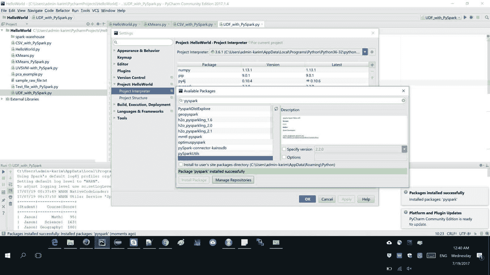

**Figure 2:** Installing PySpark on Pycharm IDE on Windows 10

首先，您应该使用项目解释器作为 Python 2.7+创建一个 Python 脚本。然后，您可以导入 pyspark 以及其他所需的模型，如下所示:

```scala
import osimport sysimport pyspark

```

现在如果你是 Windows 用户，Python 也需要有 Hadoop 运行时；你应该把`winutils.exe`文件放到`SPARK_HOME/bin`文件夹里。然后创建一个环境变量，如下所示:

选择您的 python 文件|运行|编辑配置|创建一个环境变量，它的键是`HADOOP_HOME`，值是`PYTHON_PATH`，例如，在我的例子中是`C:\Users\admin-karim\Downloads\spark-2.1.0-bin-hadoop2.7`。最后，按“确定”，就完成了:


**Figure 3:** Setting Hadoop runtime env on Pycharm IDE on Windows 10

这就是你所需要的。现在，如果您开始编写 Spark 代码，您应该首先将导入放在`try`块中，如下所示(仅作为示例):

```scala
try: from pyspark.ml.featureimport PCAfrom pyspark.ml.linalgimport Vectorsfrom pyspark.sqlimport SparkSessionprint ("Successfully imported Spark Modules")

```

`catch`块可以如下放置:

```scala
ExceptImportErroras e: print("Can not import Spark Modules", e)sys.exit(1)

```

请参考下图，该图显示了在 PySpark 外壳中导入和放置 Spark 包:

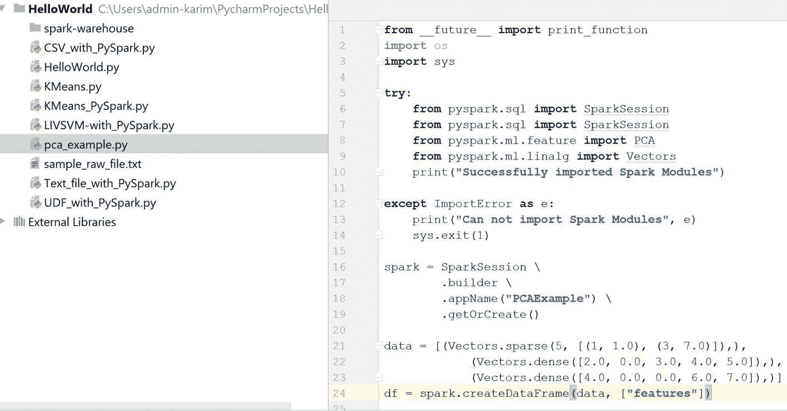

**Figure 4**: Importing and placing Spark packages in PySpark shell

如果这些块成功执行，您应该会在控制台上看到以下消息:


**Figure 5**: PySpark package has been imported successfully

# PySpark 入门

在深入之前，首先，我们需要了解如何创建 Spark 会话。可以通过以下方式完成:

```scala
spark = SparkSession\.builder\.appName("PCAExample")\.getOrCreate()

```

现在，在这个代码块下，您应该放置您的代码，例如:

```scala
data = [(Vectors.sparse(5, [(1, 1.0), (3, 7.0)]),),(Vectors.dense([2.0, 0.0, 3.0, 4.0, 5.0]),),(Vectors.dense([4.0, 0.0, 0.0, 6.0, 7.0]),)]df = spark.createDataFrame(data, ["features"])pca = PCA(k=3, inputCol="features", outputCol="pcaFeatures")model = pca.fit(df)result = model.transform(df).select("pcaFeatures")result.show(truncate=False)

```

前面的代码演示了如何计算行矩阵的主成分，并使用它们将向量投影到低维空间中。要获得更清晰的图片，请参考下面的代码，该代码显示了如何在 PySpark 上使用 PCA 算法:

```scala
import osimport systry:from pyspark.sql import SparkSessionfrom pyspark.ml.feature import PCAfrom pyspark.ml.linalg import Vectorsprint ("Successfully imported Spark Modules")except ImportErrorase:print ("Can not import Spark Modules", e)sys.exit(1)spark = SparkSession\.builder\.appName("PCAExample")\.getOrCreate()data = [(Vectors.sparse(5, [(1, 1.0), (3, 7.0)]),),(Vectors.dense([2.0, 0.0, 3.0, 4.0, 5.0]),),(Vectors.dense([4.0, 0.0, 0.0, 6.0, 7.0]),)]df = spark.createDataFrame(data, ["features"])pca = PCA(k=3, inputCol="features", outputCol="pcaFeatures")model = pca.fit(df)result = model.transform(df).select("pcaFeatures")result.show(truncate=False)spark.stop()

```

输出如下:

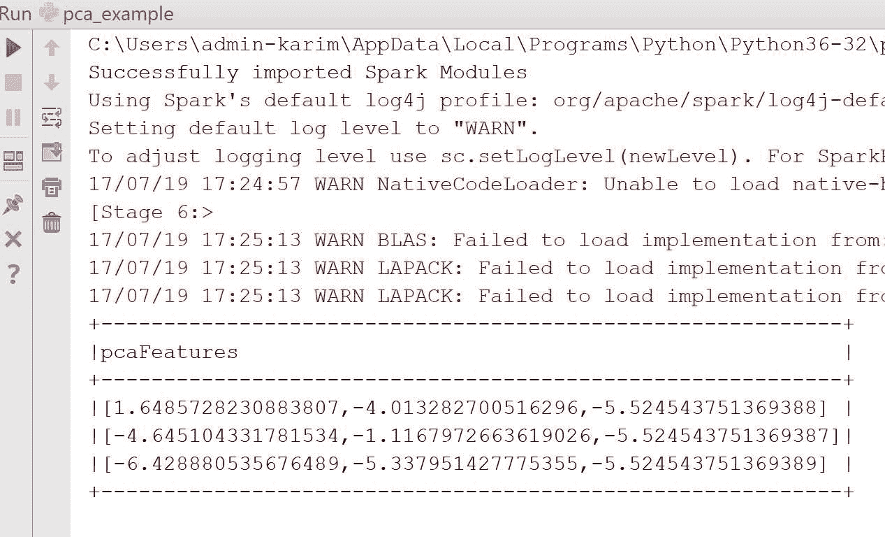

**Figure 6**: PCA result after successful execution of the Python script

# 使用数据框和关系数据库

SparkDataFrame 是命名列下的行的分布式集合。从技术上讲，它可以被认为是一个带有列标题的关系数据库中的表。此外，PySpark 数据框类似于 Python 熊猫。然而，它也与 RDD 有一些共同的特点:

*   **不变**:就像一个 RDD，一旦创建了一个数据帧，就不能改变。在应用转换后，我们可以将数据帧转换为 RDD，反之亦然。
*   **偷懒评价:**其本质是偷懒评价。换句话说，直到一个动作被执行，任务才被执行。
*   **分布式:**RDD 和数据帧都是自然分布的。

就像 Java/Scala 的 DataFrames 一样，PySpark DataFrames 是为处理大量结构化数据而设计的；你甚至可以处理千兆字节的数据。表格结构帮助我们理解数据框架的模式，这也有助于优化 SQL 查询的执行计划。此外，它还有广泛的数据格式和来源。

您可以使用 PySpark 以多种方式创建关系数据库、数据集和数据框。在下面的小节中，我们将展示一些这样做的例子。

# 读取 Libsvm 格式的数据集

让我们看看如何通过指定数据的格式(即`libsvm`)使用读取 API 和`load()`方法读取 LIBSVM 格式的数据，如下所示:

```scala
# Creating DataFrame from libsvm datasetmyDF = spark.read.format("libsvm").load("C:/Exp//mnist.bz2")

```

上述 MNIST 数据集可从[https://www . csie . NTU . edu . tw/~ cjlin/libsvmtols/datasets/multi class/mnist . bz2](https://www.csie.ntu.edu.tw/~cjlin/libsvmtools/datasets/multiclass/mnist.bz2)下载。这将返回一个数据帧，通过调用`show()`方法可以看到内容，如下所示:

```scala
myDF.show() 

```

输出如下:


**Figure 7**: A snap of the handwritten dataset in LIBSVM format

您还可以指定其他选项，例如您希望为数据框提供多少原始数据集要素，如下所示:

```scala
myDF= spark.read.format("libsvm").option("numFeatures", "780").load("data/Letterdata_libsvm.data")

```

现在，如果您想从同一个数据集创建一个 RDD，您可以从`pyspark.mllib.util`使用 MLUtils 应用编程接口，如下所示:

```scala
*Creating RDD from the libsvm data file*myRDD = MLUtils.loadLibSVMFile(spark.sparkContext, "data/Letterdata_libsvm.data")

```

现在，您可以将 RDD 保存在您的首选位置，如下所示:

```scala
myRDD.saveAsTextFile("data/myRDD")

```

# 正在读取 CSV 文件

让我们从加载、解析和查看简单的飞行数据开始。首先，从[https://S3-us-west-2 . amazonaws . com/sparkr-data/nychflights 13 . CSV](https://s3-us-west-2.amazonaws.com/sparkr-data/nycflights13.csv)下载纽约航班数据集作为 CSV。现在让我们使用 PySpark 的`read.csv()` API 来加载和解析数据集:

```scala
# Creating DataFrame from data file in CSV format*df = spark.read.format(**"com.databricks.spark.csv"**).option(**"header"**, **"true"**).load(**"data/nycflights13.csv"**)* 
```

 *这与阅读 libsvm 格式非常相似。现在，您可以看到结果数据框的结构如下:

```scala
df.printSchema() 

```

输出如下:


**Figure 8**: Schema of the NYC flight dataset

现在让我们使用`show()`方法查看数据集的快照，如下所示:

```scala
df.show() 

```

现在让我们按如下方式查看数据示例:


**Figure 9**: Sample of the NYC flight dataset

# 读取和操作原始文本文件

您可以使用`textFile()`方法读取原始文本数据文件。假设您有一些购买日志:

```scala
number\tproduct_name\ttransaction_id\twebsite\tprice\tdate0\tjeans\t30160906182001\tebay.com\t100\t12-02-20161\tcamera\t70151231120504\tamazon.com\t450\t09-08-20172\tlaptop\t90151231120504\tebay.ie\t1500\t07--5-20163\tbook\t80151231120506\tpackt.com\t45\t03-12-20164\tdrone\t8876531120508\talibaba.com\t120\t01-05-2017

```

现在阅读和创作 RDD 非常简单，使用`textFile()`方法如下:

```scala
myRDD = spark.sparkContext.textFile("sample_raw_file.txt")$cd myRDD$ cat part-00000  number\tproduct_name\ttransaction_id\twebsite\tprice\tdate  0\tjeans\t30160906182001\tebay.com\t100\t12-02-20161\tcamera\t70151231120504\tamazon.com\t450\t09-08-2017

```

正如你所看到的，结构不是那么可读。因此，我们可以考虑通过将文本转换为数据帧来给出更好的结构。首先，我们需要收集标题信息，如下所示:

```scala
header = myRDD.first() 

```

现在过滤掉标题，确保其余部分看起来正确，如下所示:

```scala
textRDD = myRDD.filter(lambda line: line != header)newRDD = textRDD.map(lambda k: k.split("\\t"))

```

我们还有 RDD，但数据结构稍好一些。然而，将其转换为数据框架将提供事务数据的更好视图。

下面的代码通过指定`header.split`提供列的名称来创建数据帧:

```scala
 textDF = newRDD.toDF(header.split("\\t"))textDF.show()

```

输出如下:

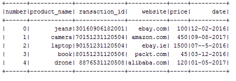

**Figure 10**: Sample of the transactional data

现在，您可以将这个数据框保存为一个视图，并进行一个 SQL 查询。现在让我们用这个数据框做一个查询:

```scala
textDF.createOrReplaceTempView("transactions")spark.sql("SELECT *** FROM transactions").show()spark.sql("SELECT product_name, price FROM transactions WHERE price >=500 ").show()spark.sql("SELECT product_name, price FROM transactions ORDER BY price DESC").show()

```

输出如下:


**Figure 11**: Query result on the transactional data using Spark SQL

# 在 PySpark 上写 UDF

像 Scala 和 Java 一样，你也可以使用**用户定义函数**(又名。 **UDF** 上的 PySpark。下面我们来看一个例子。假设我们想根据一些在大学上过课的学生的分数来看分数分布。

我们可以将它们存储在两个独立的数组中，如下所示:

```scala
# Let's generate somerandom listsstudents = ['Jason', 'John', 'Geroge', 'David']courses = ['Math', 'Science', 'Geography', 'History', 'IT', 'Statistics']

```

现在让我们声明一个空数组来存储关于课程和学生的数据，以便稍后可以将两者都附加到这个数组中，如下所示:

```scala
rawData = []for (student, course) in itertools.product(students, courses):rawData.append((student, course, random.randint(0, 200)))

```

请注意，要使前面的代码起作用，请在文件的开头导入以下内容:

```scala
import itertoolsimport random

```

现在让我们从这两个对象创建一个数据框架，根据每个对象的分数转换相应的分数。为此，我们需要定义一个显式模式。让我们假设在您计划的数据框中，将有三个名为`Student`、`Course`和`Score`的列。

首先，让我们导入必要的模块:

```scala
from pyspark.sql.typesimport StructType, StructField, IntegerType, StringType

```

现在模式可以定义如下:

```scala
schema = StructType([StructField("Student", StringType(), nullable=False),StructField("Course", StringType(), nullable=False),StructField("Score", IntegerType(), nullable=False)])

```

现在，让我们根据原始数据创建一个 RDD，如下所示:

```scala
courseRDD = spark.sparkContext.parallelize(rawData)

```

现在让我们将 RDD 转换为数据帧，如下所示:

```scala
courseDF = spark.createDataFrame(courseRDD, schema) coursedDF.show() 

```

输出如下:

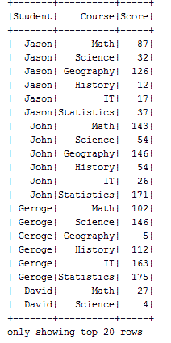

**Figure 12**: Sample of the randomly generated score for students in subjects

现在我们有三列了。然而，我们需要把分数转化为分数。假设您有以下分级模式:

*   *90~100= > A*
*   *80~89 = > B*
*   *60~79 = > C*
*   *0~59 = > D*

为此，我们可以创建自己的 UDF，这样就可以将数字分数转换为分数。有几种方法可以做到。下面是这样做的一个例子:

```scala
# Define udf***def** scoreToCategory(grade): **if** grade >= 90: **return** **'A'** **elif** grade >= 80: **return** **'B'** **elif** grade >= 60: **return** **'C'** **else**: **return** **'D'*** 
```

 *现在我们可以拥有自己的 UDF，如下所示:

```scala
from pyspark.sql.functionsimport udfudfScoreToCategory = udf(scoreToCategory, StringType())

```

`udf()`方法中的第二个参数是方法的返回类型(即`scoreToCategory`)。现在你可以把这个叫做 UDF，用一种非常简单的方法把分数转换成分数。让我们看一个例子:

```scala
courseDF.withColumn("Grade", udfScoreToCategory("Score")).show(100)

```

前一行将把分数作为所有条目的输入，并将分数转换为分数。此外，将添加一个新的数据框，其列名为`Grade`。

输出如下:


**Figure 13**: Assigned grades

现在我们也可以在 SQL 语句中使用 UDF。然而，为此，我们需要对 UDF 进行如下登记:

```scala
spark.udf.register("udfScoreToCategory", scoreToCategory, StringType()) 

```

默认情况下，前一行会将 UDF 注册为数据库中的临时函数。现在我们需要创建一个团队视图来允许执行 SQL 查询:

```scala
courseDF.createOrReplaceTempView("score")

```

现在让我们在视图`score`上执行一个 SQL 查询，如下所示:

```scala
spark.sql("SELECT Student, Score, udfScoreToCategory(Score) as Grade FROM score").show() 

```

输出如下:

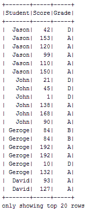

**Figure 14**: Query on the students score and corresponding grades

此示例的完整源代码如下:

```scala
import osimport sysimport itertoolsimport randomfrom pyspark.sql import SparkSessionfrom pyspark.sql.types import StructType, StructField, IntegerType, StringTypefrom pyspark.sql.functions import udfspark = SparkSession \.builder \.appName("PCAExample") \.getOrCreate()# Generate Random RDDstudents = ['Jason', 'John', 'Geroge', 'David']courses = ['Math', 'Science', 'Geography', 'History', 'IT', 'Statistics']rawData = []for (student, course) in itertools.product(students, courses):rawData.append((student, course, random.randint(0, 200)))# Create Schema Objectschema = StructType([StructField("Student", StringType(), nullable=False),StructField("Course", StringType(), nullable=False),StructField("Score", IntegerType(), nullable=False)])courseRDD = spark.sparkContext.parallelize(rawData)courseDF = spark.createDataFrame(courseRDD, schema)courseDF.show()# Define udfdef scoreToCategory(grade):if grade >= 90:return 'A'elif grade >= 80:return 'B'elif grade >= 60:return 'C'else:return 'D'udfScoreToCategory = udf(scoreToCategory, StringType())courseDF.withColumn("Grade", udfScoreToCategory("Score")).show(100)spark.udf.register("udfScoreToCategory", scoreToCategory, StringType())courseDF.createOrReplaceTempView("score")spark.sql("SELECT Student, Score, udfScoreToCategory(Score) as Grade FROM score").show()spark.stop()

```

A more detailed discussion on using UDF can be found at [https://jaceklaskowski.gitbooks.io/mastering-apache-spark/content/spark-sql-udfs.html.](https://jaceklaskowski.gitbooks.io/mastering-apache-spark/content/spark-sql-udfs.html)

现在让我们在 PySpark 上做一些分析任务。在下一节中，我们将展示一个使用 PySpark 的聚类任务的 k-means 算法的例子。

# 让我们用 k 均值聚类做一些分析

异常数据是指与正态分布不同的数据。因此，检测异常是网络安全的一项重要任务，异常数据包或请求可能被标记为错误或潜在攻击。

在这个例子中，我们将使用 KDD-99 数据集(可以在这里下载:[http://kdd.ics.uci.edu/databases/kddcup99/kddcup99.html](http://kdd.ics.uci.edu/databases/kddcup99/kddcup99.html))。将根据数据点的特定标准过滤掉许多列。这将有助于我们理解这个例子。其次，对于无监督的任务；我们将不得不删除标记的数据。让我们将数据集作为简单的文本进行加载和解析。然后让我们看看数据集中有多少行:

```scala
INPUT = "C:/Users/rezkar/Downloads/kddcup.data"spark = SparkSession\.builder\.appName("PCAExample")\.getOrCreate()kddcup_data = spark.sparkContext.textFile(INPUT)

```

这实际上返回了一个 RDD。让我们看看数据集中有多少行使用`count()`方法，如下所示:

```scala
count = kddcup_data.count()print(count)>>4898431

```

因此，数据集非常大，有很多特征。因为我们已经将数据集解析为简单的文本，所以我们不应该期望看到数据集更好的结构。因此，让我们努力将 RDD 转换为数据帧，如下所示:

```scala
kdd = kddcup_data.map(lambda l: l.split(","))from pyspark.sql import SQLContextsqlContext = SQLContext(spark)df = sqlContext.createDataFrame(kdd)

```

然后让我们在数据框中看到一些选定的列，如下所示:

```scala
df.select("_1", "_2", "_3", "_4", "_42").show(5)

```

输出如下:

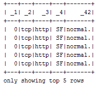

**Figure 15**: Sample of the KKD cup 99 dataset

因此，这个数据集已经被标记。这意味着恶意网络行为的类型已经被分配到标签是最后一列的行(即`_42`)。数据框的前五行标记为正常。这意味着这些数据点是正常的。现在，我们需要确定每种标签类型的整个数据集的标签计数:

```scala
#Identifying the labels for unsupervised task*labels = kddcup_data.map(**lambda** line: line.strip().split(**","**)[-1])**from** time **import** timestart_label_count = time()label_counts = labels.countByValue()label_count_time = time()-start_label_count**from** collections **import** OrderedDictsorted_labels = OrderedDict(sorted(label_counts.items(), key=**lambda** t: t[1], reverse=**True**))**for** label, count **in** sorted_labels.items(): **print** label, count* 
```

 *输出如下:


**Figure 16**: Available labels (attack types) in the KDD cup dataset

我们可以看到有 23 个不同的标签(数据对象的行为)。最多的数据点属于蓝精灵。这是一种异常行为，也称为 DoS 数据包泛洪。海王星是第二高的异常行为。*正常*事件是数据集中出现次数第三多的事件类型。但是，在真实的网络数据集中，您将看不到任何这样的标签。

此外，正常流量将远远高于任何异常流量。因此，从大规模未标记数据中识别异常攻击或异常将是乏味的。为了简单起见，让我们忽略最后一列(即标签)，并认为这个数据集也没有标签。在这种情况下，将异常检测概念化的唯一方法是使用无监督学习算法，如 k-means 进行聚类。

现在，让我们努力将数据点进行聚类。K-means 有一点很重要，它只接受数值进行建模。然而，我们的数据集也包含一些分类特征。现在我们可以根据类别特征是否为 *TCP* 来分配类别特征二进制值 1 或 0。这可以通过以下方式实现:

```scala
from numpy import arraydef parse_interaction(line):line_split = line.split(",")clean_line_split = [line_split[0]]+line_split[4:-1]return (line_split[-1], array([float(x) for x in clean_line_split]))parsed_data = kddcup_data.map(parse_interaction)pd_values = parsed_data.values().cache()

```

因此，我们的数据集几乎准备好了。现在，我们可以轻松准备训练和测试集来训练 k-means 模型:

```scala
 kdd_train = pd_values.sample(False, .75, 12345)kdd_test = pd_values.sample(False, .25, 12345)print("Training set feature count: " + str(kdd_train.count()))print("Test set feature count: " + str(kdd_test.count()))

```

输出如下:

```scala
Training set feature count: 3674823Test set feature count: 1225499

```

然而，也需要一些标准化，因为我们将一些分类特征转换为数字特征。标准化可以提高优化过程中的收敛速度，还可以防止差异非常大的特征在模型训练过程中产生影响。

现在我们将使用 StandardScaler，这是一个特性转换器。它通过将特征按单位差异进行缩放来帮助我们标准化特征。然后，它使用训练集样本中的列汇总统计信息将平均值设置为零:

```scala
standardizer = StandardScaler(True, True) 

```

现在，让我们通过如下拟合前面的转换器来计算汇总统计数据:

```scala
standardizer_model = standardizer.fit(kdd_train) 

```

现在的问题是，我们用来训练 k 均值的数据没有正态分布。因此，我们需要标准化训练集中的每个特征，以获得单位标准差。为了实现这一点，我们需要进一步改造前面的标准化器模型，如下所示:

```scala
data_for_cluster = standardizer_model.transform(kdd_train) 

```

干得好！现在训练集终于准备好训练 k-means 模型了。正如我们在聚类一章中所讨论的，聚类算法中最棘手的事情是通过设置 K 的值来找到最佳的聚类数，以便数据对象自动聚类。

一种被认为是蛮力的天真方法是设置`K=2`并观察结果，然后尝试，直到你得到一个最优的。然而，一种更好的方法是肘关节方法，在这种方法中，我们可以不断增加`K`的值，并计算**在误差平方和** ( **WSSSE** )内作为聚类成本。简而言之，我们将寻找最优`K`值，该值也将最小化 WSSSE。只要观察到急剧下降，我们就会知道`K`的最佳值:

```scala
import numpyour_k = numpy.arange(10, 31, 10)metrics = []def computeError(point):center = clusters.centers[clusters.predict(point)]denseCenter = DenseVector(numpy.ndarray.tolist(center))return sqrt(sum([x**2 for x in (DenseVector(point.toArray()) - denseCenter)]))for k in our_k:clusters = KMeans.train(data_for_cluster, k, maxIterations=4, initializationMode="random")WSSSE = data_for_cluster.map(lambda point: computeError(point)).reduce(lambda x, y: x + y)results = (k, WSSSE)metrics.append(results)print(metrics)

```

输出如下:

```scala
[(10, 3364364.5203123973), (20, 3047748.5040717563), (30, 2503185.5418753517)]

```

在这种情况下，30 是 k 的最佳值。当我们有 30 个集群时，让我们检查每个数据点的集群分配。下一个测试将运行 30、35 和 40 的`k`值。k 的三个值不是您在一次运行中测试最多的，但仅用于本例:

```scala
modelk30 = KMeans.train(data_for_cluster, 30, maxIterations=4, initializationMode="random")cluster_membership = data_for_cluster.map(lambda x: modelk30.predict(x))cluster_idx = cluster_membership.zipWithIndex()cluster_idx.take(20)print("Final centers: " + str(modelk30.clusterCenters))

```

输出如下:


**Figure 17**: Final cluster centers for each attack type (abridged)

现在，让我们计算并打印整个集群的总成本，如下所示:

```scala
print("Total Cost: " + str(modelk30.computeCost(data_for_cluster)))

```

输出如下:

```scala
Total Cost: 68313502.459

```

最后，我们的 k 均值模型的 WSSSE 可以计算和打印如下:

```scala
WSSSE = data_for_cluster.map(lambda point: computeError(point)).reduce(lambda x, y: x + y)print("WSSSE: " + str(WSSSE))

```

输出如下:

```scala
WSSSE: 2503185.54188

```

你的结果可能略有不同。这是由于我们第一次开始聚类算法时质心的随机放置。多次执行此操作可以让您看到数据中的点如何改变它们的 k 值或保持不变。下面给出了该解决方案的完整源代码:

```scala
import osimport sysimport numpy as npfrom collections import OrderedDicttry:from collections import OrderedDictfrom numpy import arrayfrom math import sqrtimport numpyimport urllibimport pysparkfrom pyspark.sql import SparkSessionfrom pyspark.mllib.feature import StandardScalerfrom pyspark.mllib.clustering import KMeans, KMeansModelfrom pyspark.mllib.linalg import DenseVectorfrom pyspark.mllib.linalg import SparseVectorfrom collections import OrderedDictfrom time import timefrom pyspark.sql.types import *from pyspark.sql import DataFramefrom pyspark.sql import SQLContextfrom pyspark.sql import Rowprint("Successfully imported Spark Modules")except ImportError as e:print ("Can not import Spark Modules", e)sys.exit(1)spark = SparkSession\.builder\.appName("PCAExample")\.getOrCreate()INPUT = "C:/Exp/kddcup.data.corrected"kddcup_data = spark.sparkContext.textFile(INPUT)count = kddcup_data.count()print(count)kddcup_data.take(5)kdd = kddcup_data.map(lambda l: l.split(","))sqlContext = SQLContext(spark)df = sqlContext.createDataFrame(kdd)df.select("_1", "_2", "_3", "_4", "_42").show(5)#Identifying the leabels for unsupervised tasklabels = kddcup_data.map(lambda line: line.strip().split(",")[-1])start_label_count = time()label_counts = labels.countByValue()label_count_time = time()-start_label_countsorted_labels = OrderedDict(sorted(label_counts.items(), key=lambda t: t[1], reverse=True))for label, count in sorted_labels.items():print(label, count)def parse_interaction(line):line_split = line.split(",")clean_line_split = [line_split[0]]+line_split[4:-1]return (line_split[-1], array([float(x) for x in clean_line_split]))parsed_data = kddcup_data.map(parse_interaction)pd_values = parsed_data.values().cache()kdd_train = pd_values.sample(False, .75, 12345)kdd_test = pd_values.sample(False, .25, 12345)print("Training set feature count: " + str(kdd_train.count()))print("Test set feature count: " + str(kdd_test.count()))standardizer = StandardScaler(True, True)standardizer_model = standardizer.fit(kdd_train)data_for_cluster = standardizer_model.transform(kdd_train)initializationMode="random"our_k = numpy.arange(10, 31, 10)metrics = []def computeError(point):center = clusters.centers[clusters.predict(point)]denseCenter = DenseVector(numpy.ndarray.tolist(center))return sqrt(sum([x**2 for x in (DenseVector(point.toArray()) - denseCenter)]))for k in our_k:clusters = KMeans.train(data_for_cluster, k, maxIterations=4, initializationMode="random")WSSSE = data_for_cluster.map(lambda point: computeError(point)).reduce(lambda x, y: x + y)results = (k, WSSSE)metrics.append(results)print(metrics)modelk30 = KMeans.train(data_for_cluster, 30, maxIterations=4, initializationMode="random")cluster_membership = data_for_cluster.map(lambda x: modelk30.predict(x))cluster_idx = cluster_membership.zipWithIndex()cluster_idx.take(20)print("Final centers: " + str(modelk30.clusterCenters))print("Total Cost: " + str(modelk30.computeCost(data_for_cluster)))WSSSE = data_for_cluster.map(lambda point: computeError(point)).reduce(lambda x, y: x + y)print("WSSSE" + str(WSSSE))

```

A more comprehensive discussion on this topic can be found at [https://github.com/jadianes/kdd-cup-99-spark](https://github.com/jadianes/kdd-cup-99-spark). Also, interested readers can refer to the main and latest documentation on PySpark APIs at [http://spark.apache.org/docs/latest/api/python/](http://spark.apache.org/docs/latest/api/python/).

好了，现在是时候转向 SparkR 了，SparkR 是另一个 Spark API，用来处理人口统计编程语言 r。

# SparkR 简介

r 是最流行的统计编程语言之一，具有许多令人兴奋的特性，支持统计计算、数据处理和机器学习任务。然而，在 R 中处理大规模数据集通常是乏味的，因为运行时是单线程的。因此，只有适合某人机器内存的数据集才能被处理。考虑到这一限制，为了在 R 中获得 Spark 的全部味道，SparkR 最初是在 AMPLab 开发的，作为 R 到 Apache Spark 的轻量级前端，并使用 Spark 的分布式计算引擎。

通过这种方式，它使 R 程序员能够使用来自 RStudio 的 Spark 从 R shell 进行大规模数据分析。在 Spark 2.1.0 中，SparkR 提供了一个支持选择、过滤和聚合等操作的分布式数据框架实现。这有点类似于像`dplyr`这样的 R 数据帧，但是可以针对大规模数据集进行放大。

# 为什么是 SparkR？

您也可以使用 SparkR 编写 Spark 代码，它支持使用 MLlib 的分布式机器学习。总之，SparkR 从与 Spark 紧密集成中继承了许多优势，包括:

*   **支持各种数据源 API** : SparkR 可以用来读入各种来源的数据，包括 Hive 表、JSON 文件、RDBMS 和 Parquet 文件。
*   **数据帧优化** : SparkR 数据帧还继承了计算引擎在代码生成、内存管理等方面的所有优化。从下图可以看出，Spark 的优化引擎使 SparkR 能够胜任 Scala 和 Python:

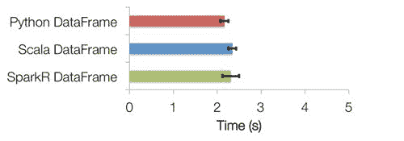

**Figure 18:** SparkR DataFrame versus Scala/Python DataFrame

*   **可扩展性:**在 Spark 数据帧上执行的操作会自动分布在 Spark 集群上所有可用的内核和机器上。因此，SparkR 数据帧可以在万亿字节的数据上使用，并在拥有数千台机器的集群上运行。

# 安装和入门

使用 SparkR 的最好方法是来自 RStudio。您的 R 程序可以使用 R shell、Rescript 或其他 R IDEs 从 RStudio 连接到 Spark 集群。

**选项 1。**在环境中设置`SPARK_HOME`(可以勾选[https://stat . ethz . ch/R-manual/R-dev/library/base/html/sys . getenv . html](https://stat.ethz.ch/R-manual/R-devel/library/base/html/Sys.getenv.html)，加载 SparkR 包，调用`sparkR.session`如下。它将检查 Spark 安装，如果没有找到，将自动下载并缓存:

```scala
if (nchar(Sys.getenv("SPARK_HOME")) < 1) { Sys.setenv(SPARK_HOME = "/home/spark") } library(SparkR, lib.loc = c(file.path(Sys.getenv("SPARK_HOME"), "R", "lib"))) 

```

**选项 2。**也可以在 RStudio 上手动配置 SparkR。为此，创建一个 R 脚本，并在 RStudio 上执行以下几行 R 代码:

```scala
SPARK_HOME = "spark-2.1.0-bin-hadoop2.7/R/lib" HADOOP_HOME= "spark-2.1.0-bin-hadoop2.7/bin" Sys.setenv(SPARK_MEM = "2g") Sys.setenv(SPARK_HOME = "spark-2.1.0-bin-hadoop2.7") .libPaths(c(file.path(Sys.getenv("SPARK_HOME"), "R", "lib"), .libPaths())) 

```

现在按如下方式加载 SparkR 库:

```scala
library(SparkR, lib.loc = SPARK_HOME)

```

现在，像 Scala/Java/PySpark 一样，您的 SparkR 程序的入口点是 SparkR 会话，可以通过调用`sparkR.session`来创建，如下所示:

```scala
sparkR.session(appName = "Hello, Spark!", master = "local[*]")

```

此外，如果需要，还可以指定某些 Spark 驱动程序属性。通常，这些应用属性和运行时环境不能以编程方式设置，因为驱动程序 JVM 进程已经启动；在这种情况下，SparkR 会为您处理此事。要设置它们，将它们传递给`sparkConfig`参数中的其他配置属性，如下所示:

```scala
sparkR.session(master = "local[*]", sparkConfig = list(spark.driver.memory = "2g")) 

```

此外，以下 Spark 驱动程序属性可通过 RStudio 的`sparkR.session`在`sparkConfig`中设置:

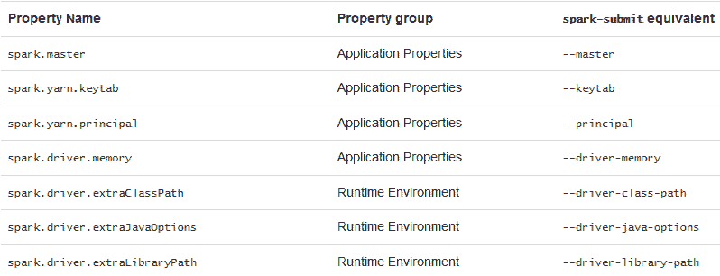

**Figure 19**: Spark driver properties can be set in `sparkConfig` with `sparkR.session` from RStudio

# 入门指南

让我们从加载、解析和查看简单的飞行数据开始。首先，从[https://S3-us-west-2 . amazonaws . com/sparkr-data/NYC flights 13 . CSV](https://s3-us-west-2.amazonaws.com/sparkr-data/nycflights13.csv)下载纽约航班数据集作为 CSV。现在让我们使用 R 的`read.csv()` API 来加载和解析数据集:

```scala
#Creating R data framedataPath<- "C:/Exp/nycflights13.csv"df<- read.csv(file = dataPath, header = T, sep =",")

```

现在我们使用 R 的`View()`方法来查看数据集的结构，如下所示:

```scala
View(df)

```

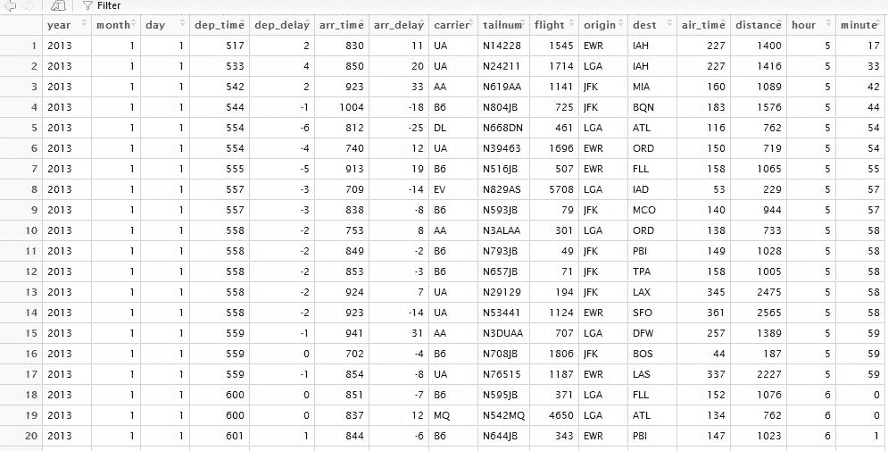

**Figure 20**: A snap of the NYC flight dataset

现在让我们从 R 数据帧创建 Spark 数据帧，如下所示:

```scala
##Converting Spark DataFrame flightDF<- as.DataFrame(df)

```

让我们通过探索数据框架的模式来看看这个结构:

```scala
printSchema(flightDF)

```

输出如下:


**Figure 21**: The schema of the NYC flight dataset

现在让我们看看数据框的前 10 行:

```scala
showDF(flightDF, numRows = 10)

```

输出如下:

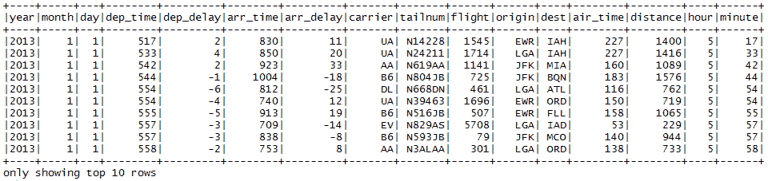

**Figure 22**: The first 10 rows of the NYC flight dataset

所以，你可以看到同样的结构。但是，这是不可扩展的，因为我们使用标准的 R API 加载了 CSV 文件。为了使它更快、更具可伸缩性，就像在 Scala 中一样，我们可以使用外部数据源 API。

# 使用外部数据源 API

如前所述，我们也可以使用外部数据源 API 创建数据框架。对于下面的例子，我们使用`com.databricks.spark.csv` API 如下:

```scala
flightDF<- read.df(dataPath,  header='true',  source = "com.databricks.spark.csv",  inferSchema='true') 

```

让我们通过探索数据框架的模式来看看这个结构:

```scala
printSchema(flightDF)

```

输出如下:


**Figure 23**: The same schema of the NYC flight dataset using external data source API

现在让我们看看数据框的前 10 行:

```scala
showDF(flightDF, numRows = 10)

```

输出如下:


**Figure 24**: Same sample data from NYC flight dataset using external data source API

所以，你可以看到同样的结构。干得好！现在是时候探索更多的东西了，比如使用 SparkR 进行数据操作。

# 数据操作

在 SparkDataFrame 中显示列名，如下所示:

```scala
columns(flightDF)[1] "year" "month" "day" "dep_time" "dep_delay" "arr_time" "arr_delay" "carrier" "tailnum" "flight" "origin" "dest" [13] "air_time" "distance" "hour" "minute" 

```

显示迷你图数据框中的行数，如下所示:

```scala
count(flightDF)[1] 336776

```

过滤目的地仅为迈阿密的航班数据，并按如下方式显示前六项:

```scala
 showDF(flightDF[flightDF$dest == "MIA", ], numRows = 10)

```

输出如下:


**Figure 25**: Flights with destination Miami only

选择特定的列。例如，让我们选择所有延迟的飞往爱荷华州的航班。此外，包括出发地机场名称:

```scala
delay_destination_DF<- select(flightDF, "flight", "dep_delay", "origin", "dest") delay_IAH_DF<- filter(delay_destination_DF, delay_destination_DF$dest == "IAH") showDF(delay_IAH_DF, numRows = 10)

```

输出如下:


**Figure 26**: All the flights that are going to Iowa that are delayed

我们甚至可以用它来链接数据帧操作。举个例子，首先，按日期对航班进行分组，然后找出平均每日延误。最后，将结果写入 SparkDataFrame，如下所示:

```scala
install.packages(c("magrittr")) library(magrittr) groupBy(flightDF, flightDF$day) %>% summarize(avg(flightDF$dep_delay), avg(flightDF$arr_delay)) ->dailyDelayDF 

```

现在打印计算的数据帧:

```scala
head(dailyDelayDF)

```

输出如下:

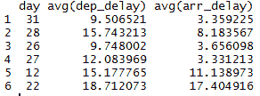

**Figure 27**: Group the flights by date and then find the average daily delay

让我们看另一个示例，它汇总了整个目的地机场的平均到达延迟:

```scala
avg_arr_delay<- collect(select(flightDF, avg(flightDF$arr_delay))) head(avg_arr_delay)avg(arr_delay)1 6.895377

```

甚至可以执行更复杂的聚合。例如，以下代码汇总了每个目的地机场的平均、最大和最小延迟。它还显示了在这些机场降落的航班数量:

```scala
flight_avg_arrival_delay_by_destination<- collect(agg( groupBy(flightDF, "dest"), NUM_FLIGHTS=n(flightDF$dest), AVG_DELAY = avg(flightDF$arr_delay), MAX_DELAY=max(flightDF$arr_delay), MIN_DELAY=min(flightDF$arr_delay) ))head(flight_avg_arrival_delay_by_destination)

```

输出如下:


**Figure 28**: Maximum and minimum delay per each destination airport

# 查询迷你图数据框

与 Scala 类似，一旦数据帧被保存为`TempView`，我们可以使用`createOrReplaceTempView()`方法对其执行一次 SQL 查询。让我们来看一个例子。首先，让我们将战斗数据框(即`flightDF`)保存如下:

```scala
# First, register the flights SparkDataFrame as a tablecreateOrReplaceTempView(flightDF, "flight")

```

现在让我们选择所有航班的目的地和目的地及其相关承运人信息，如下所示:

```scala
destDF<- sql("SELECT dest, origin, carrier FROM flight") showDF(destDF, numRows=10)

```

输出如下:


**Figure 29**: All the flights with their associated carrier information

现在让我们将 SQL 变得更复杂一点，例如找到所有延迟至少 120 分钟的航班的目的地机场，如下所示:

```scala
selected_flight_SQL<- sql("SELECT dest, origin, arr_delay FROM flight WHERE arr_delay>= 120")showDF(selected_flight_SQL, numRows = 10)

```

前面的代码段查询并显示了延迟至少 2 小时的所有航班的机场名称:


**Figure 30**: Destination airports of all the flights that are delayed by at least 2 hours

现在让我们做一个更复杂的查询。让我们找出所有延误至少 2 小时的飞往爱荷华州的航班的始发地。最后，按照到达延迟对它们进行排序，并将计数限制为 20，如下所示:

```scala
selected_flight_SQL_complex<- sql("SELECT origin, dest, arr_delay FROM flight WHERE dest='IAH' AND arr_delay>= 120 ORDER BY arr_delay DESC LIMIT 20")showDF(selected_flight_SQL_complex, numRows=20)

```

前面的代码段查询并显示了所有延迟至少 2 小时到达爱荷华州的航班的机场名称:


**Figure 31**: Origins of all the flights that are delayed by at least 2 hours where the destination is Iowa

# 在 RStudio 上可视化您的数据

在前一节中，我们已经看到了如何加载、解析、操作和查询数据帧。现在，如果我们能展示数据以获得更好的可视性，那就太好了。例如，可以为航空公司做些什么？我是说，有没有可能从剧情中找到最频繁的带菌者？让我们试一试。首先，加载相同的库:

```scala
library(ggplot2) 

```

现在我们已经有了 SparkDataFrame。如果我们直接尝试在`ggplot2`中使用我们的 SparkSQL DataFrame 类会怎么样？

```scala
my_plot<- ggplot(data=flightDF, aes(x=factor(carrier)))>>ERROR: ggplot2 doesn't know how to deal with data of class SparkDataFrame.

```

显然，它不是那样工作的，因为`ggplot2`函数不知道如何处理那些类型的分布式数据帧(Spark 帧)。相反，我们需要在本地收集数据，并将其转换回传统的 R 数据帧，如下所示:

```scala
flight_local_df<- collect(select(flightDF,"carrier"))

```

现在让我们看看使用`str()`方法得到的结果，如下所示:

```scala
str(flight_local_df)

```

输出如下:

```scala
'data.frame':  336776 obs. of 1 variable: $ carrier: chr "UA" "UA" "AA" "B6" ...

```

这很好，因为当我们从 SparkSQL 数据框中收集结果时，我们会得到一个常规的 R `data.frame`。它也非常方便，因为我们可以根据需要操纵它。现在我们准备如下创建`ggplot2`对象:

```scala
my_plot<- ggplot(data=flight_local_df, aes(x=factor(carrier)))

```

最后，让我们将该图适当地表示为条形图，如下所示:

```scala
my_plot + geom_bar() + xlab("Carrier")

```

输出如下:

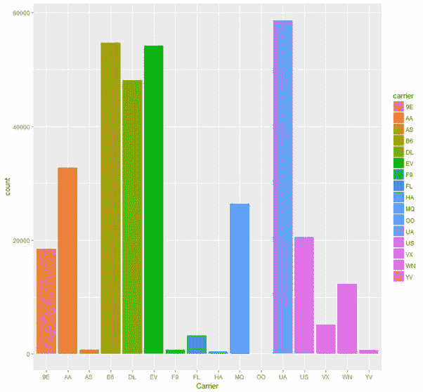

**Figure 32**: Most frequent carriers are UA, B6, EV, and DL

从图中可以明显看出，最频繁的运营商是 UA、B6、EV 和 DL。从 R 中的下面一行代码可以更清楚地看到这一点:

```scala
carrierDF = sql("SELECT carrier, COUNT(*) as cnt FROM flight GROUP BY carrier ORDER BY cnt DESC")showDF(carrierDF)

```

输出如下:


**Figure 33:** Most most frequent carriers are UA, B6, EV, and DL

为了理解代码的流程，下面给出了前面分析的完整源代码:

```scala
#Configure SparkRSPARK_HOME = "C:/Users/rezkar/Downloads/spark-2.1.0-bin-hadoop2.7/R/lib"HADOOP_HOME= "C:/Users/rezkar/Downloads/spark-2.1.0-bin-hadoop2.7/bin"Sys.setenv(SPARK_MEM = "2g")Sys.setenv(SPARK_HOME = "C:/Users/rezkar/Downloads/spark-2.1.0-bin-hadoop2.7").libPaths(c(file.path(Sys.getenv("SPARK_HOME"), "R", "lib"), .libPaths()))#Load SparkRlibrary(SparkR, lib.loc = SPARK_HOME)# Initialize SparkSessionsparkR.session(appName = "Example", master = "local[*]", sparkConfig = list(spark.driver.memory = "8g"))# Point the data file path:dataPath<- "C:/Exp/nycflights13.csv"#Creating DataFrame using external data source APIflightDF<- read.df(dataPath,header='true',source = "com.databricks.spark.csv",inferSchema='true')printSchema(flightDF)showDF(flightDF, numRows = 10)# Using SQL to select columns of data# First, register the flights SparkDataFrame as a tablecreateOrReplaceTempView(flightDF, "flight")destDF<- sql("SELECT dest, origin, carrier FROM flight")showDF(destDF, numRows=10)#And then we can use SparkR sql function using condition as follows:selected_flight_SQL<- sql("SELECT dest, origin, arr_delay FROM flight WHERE arr_delay>= 120")showDF(selected_flight_SQL, numRows = 10)#Bit complex query: Let's find the origins of all the flights that are at least 2 hours delayed where the destiantionn is Iowa. Finally, sort them by arrival delay and limit the count upto 20 and the destinationsselected_flight_SQL_complex<- sql("SELECT origin, dest, arr_delay FROM flight WHERE dest='IAH' AND arr_delay>= 120 ORDER BY arr_delay DESC LIMIT 20")showDF(selected_flight_SQL_complex)# Stop the SparkSession nowsparkR.session.stop()

```

# 摘要

在本章中，我们展示了一些如何用 Python 和 r 编写 Spark 代码的示例。这些是数据科学家社区中最流行的编程语言。

我们介绍了使用 PySpark 和 SparkR 进行大数据分析的动机，其简单程度与 Java 和 Scala 几乎相同。我们讨论了如何将这些 API 安装在它们流行的版本上，比如 PySpark 的 PyCharm 和 SparkR 的 RStudio。我们还展示了如何使用这些集成开发环境中的数据框架和关系数据库。此外，我们还讨论了如何执行来自 PySpark 和 SparkR 的 Spark SQL 查询。然后，我们还讨论了如何使用数据集可视化来执行一些分析。最后，我们通过示例看到了如何将 UDF 与 PySpark 一起使用。

因此，我们讨论了两个 Spark 的 API 的几个方面；PySpark 和 SparkR。还有更多要探索的。感兴趣的读者应该参考他们的网站了解更多信息:

*   PySpark:[http://spark.apache.org/docs/latest/api/python/](http://spark.apache.org/docs/latest/api/python/)
*   SparkR:[https://spark.apache.org/docs/latest/sparkr.html](https://spark.apache.org/docs/latest/sparkr.html)****