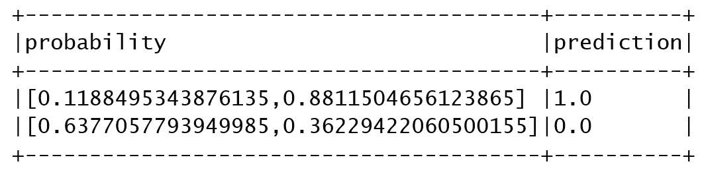
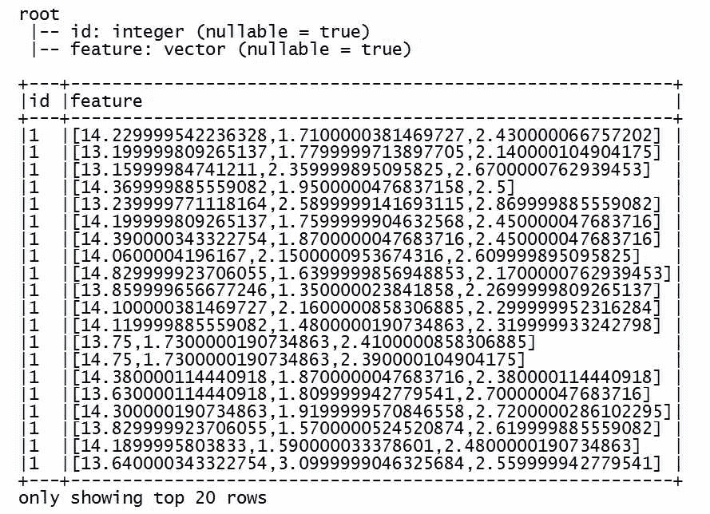
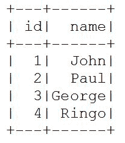
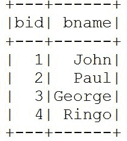
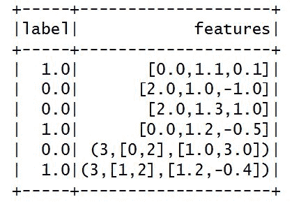
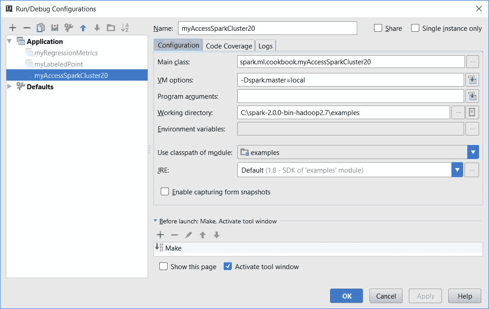
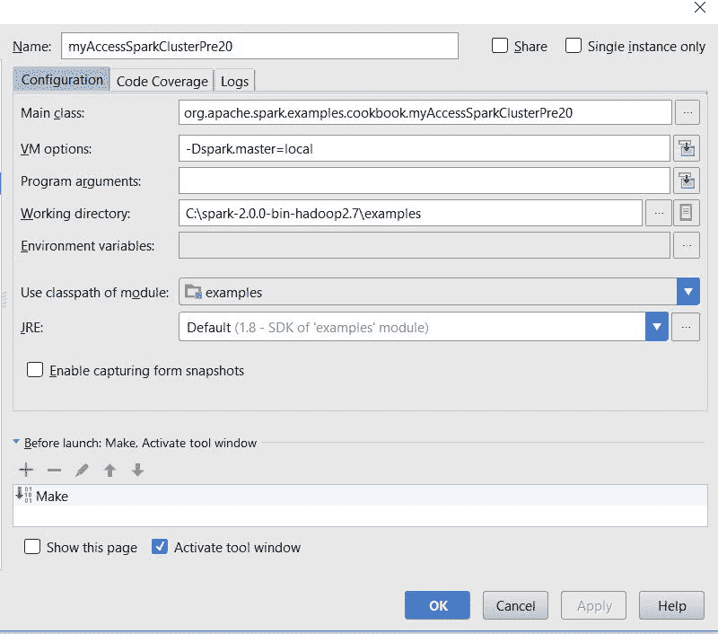
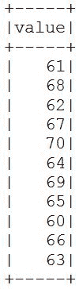
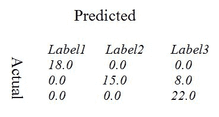
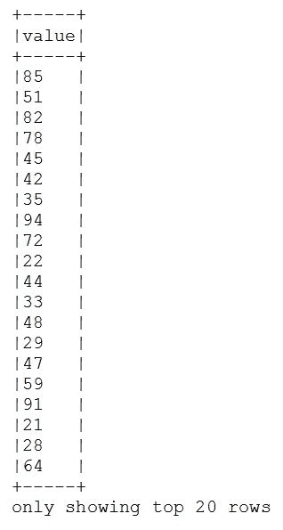

# 四、实现健壮机器学习系统的通用方法

在本章中，我们将介绍:

*   Spark 的基本统计 API，帮助您构建自己的算法
*   真实机器学习应用的最大似然流水线
*   用 Spark 规范数据
*   分割数据用于培训和测试
*   新数据集应用编程接口的常见操作
*   在 Spark 2.0 中创建和使用文本文件中的 RDD 对数据框对数据集
*   Spark毫升的标记点数据结构
*   在 Spark 2.0+中访问 Spark 集群
*   获得对Spark 2.0 之前的Spark集群的访问
*   在 Spark 2.0 中获得对 SparkContext 和 SparkSession 对象的访问
*   Spark 2.0 中的新模型导出和 PMML 标记
*   使用 Spark 2.0 的回归模型评估
*   使用 Spark 2.0 的二元分类模型评估
*   使用 Spark 2.0 的多标签分类模型评估
*   使用 Spark 2.0 的多类分类模型评估
*   在 Spark 2.0 中使用 Scala Breeze 库做图形

# 介绍

在从运营小型企业到创建和管理任务关键型应用的每一个业务领域，都有许多常见的任务，需要作为执行功能过程中所需的几乎每个工作流的一部分。即使对于构建健壮的机器学习系统也是如此。在 Spark 机器学习中，这些任务中的一些从分割数据用于模型开发(训练、测试、验证)到标准化输入特征向量数据，再到通过 Spark API 创建 ML 管道。在本章中，我们提供了一套方法，让读者能够思考实现端到端机器学习系统实际上需要什么。

本章试图演示任何健壮的Spark机器学习系统实现中存在的许多常见任务。为了避免在本书涵盖的每个食谱中重复引用这些常见任务，我们在本章中排除了一些常见任务，如简短的食谱，在阅读其他章节时可以根据需要加以利用。这些配方可以是独立的，也可以作为流水线子任务包含在更大的系统中。请注意，在后面的章节中，这些常见的方法在机器学习算法的大背景下得到强调，同时为了完整起见，也将它们作为独立的方法包含在本章中。

# Spark 的基本统计 API，帮助您构建自己的算法

在这个食谱中，我们涵盖了 Spark 的多元统计总结(即 *Statistics.colStats* )，如相关性、分层抽样、假设检验、随机数据生成、核密度估计器等等，这些可以应用于非常大的数据集，同时通过 RDDs 利用并行性和弹性。

# 怎么做...

1.  在 IntelliJ 或您选择的 IDE 中启动一个新项目。确保包含必要的 JAR 文件。

2.  设置程序将驻留的包位置:

```scala
package spark.ml.cookbook.chapter4
```

3.  导入Spark会话所需的包以访问集群并`log4j.Logger`减少Spark产生的输出量:

```scala
import org.apache.spark.mllib.linalg.Vectorsimport org.apache.spark.mllib.stat.Statisticsimport org.apache.spark.sql.SparkSessionimport org.apache.log4j.Loggerimport org.apache.log4j.Level
```

4.  将输出级别设置为`ERROR`以减少 Spark 的日志输出:

```scala
Logger.getLogger("org").setLevel(Level.ERROR)Logger.getLogger("akka").setLevel(Level.ERROR)
```

5.  使用构建器模式初始化指定配置的Spark会话，从而为Spark集群提供入口点:

```scala
val spark = SparkSession.builder.master("local[*]").appName("Summary Statistics").config("spark.sql.warehouse.dir", ".").getOrCreate()
```

6.  让我们检索生成关系数据库时要使用的Spark上下文的Spark会话:

```scala
val sc = spark.sparkContext
```

7.  现在，我们用手工制作的数据创建一个 RDD，以说明汇总统计的用法:

```scala
val rdd = sc.parallelize(Seq(Vectors.dense(0, 1, 0),Vectors.dense(1.0, 10.0, 100.0),Vectors.dense(3.0, 30.0, 300.0),Vectors.dense(5.0, 50.0, 500.0),Vectors.dense(7.0, 70.0, 700.0),Vectors.dense(9.0, 90.0, 900.0),Vectors.dense(11.0, 110.0, 1100.0)))
```

8.  我们通过调用方法`colStats()`并传递 RDD 作为参数来使用 Spark 的统计对象:

```scala
val summary = Statistics.colStats(rdd)
```

`colStats()`方法将返回一个`MultivariateStatisticalSummary`，其中包含计算出的汇总统计:

```scala
println("mean:" + summary.mean)println("variance:" +summary.variance)println("none zero" + summary.numNonzeros)println("min:" + summary.min)println("max:" + summary.max)println("count:" + summary.count)mean:[5.142857142857142,51.57142857142857,514.2857142857142]variance:[16.80952380952381,1663.952380952381,168095.2380952381]none zero[6.0,7.0,6.0]min:[0.0,1.0,0.0]max:[11.0,110.0,1100.0]count:7
```

9.  我们通过停止Spark会话来关闭程序:

```scala
spark.stop()
```

# 它是如何工作的...

我们从密集矢量数据创建了一个 RDD，然后使用统计对象对其生成汇总统计。一旦`colStats()`方法返回，我们检索汇总统计数据，如平均值、方差、最小值、最大值等。

# 还有更多...

统计应用编程接口在大型数据集上的效率如何强调都不为过。这些 API 将为您提供从零开始实现任何统计学习算法的基本元素。根据我们对半矩阵分解和全矩阵分解的研究和经验，我们鼓励您首先阅读源代码，并确保在实现自己的功能之前，Spark 中没有已经实现的等效功能。

虽然我们在此仅展示基本的统计摘要，但 Spark 开箱即用，配备了:

*   相关性:`Statistics.corr(seriesX, seriesY, "type of correlation")`:
    *   皮尔森(默认)
    *   斯皮尔曼
*   分层抽样- RDD 空气污染指数:
    *   换成 RDD
    *   没有替换-需要额外的通行证
*   假设检验:
    *   向量- `Statistics.chiSqTest( vector )`
    *   矩阵- `Statistics.chiSqTest( dense matrix )`
*   **科尔莫戈罗夫-斯米尔诺夫** ( **KS** )平等测试-单侧或双侧:
    *   `Statistics.kolmogorovSmirnovTest(RDD, "norm", 0, 1)`
*   随机数据生成器- `normalRDD()`:
    *   正常-可以指定一个参数
    *   大量选项加上`map()`可以生成任何分布
*   核密度估计器- `KernelDensity().estimate( data )`

在[https://en.wikipedia.org/wiki/Goodness_of_fit](https://en.wikipedia.org/wiki/Goodness_of_fit)链接中可以找到对统计学中*拟合优度*概念的快速引用。

# 请参见

更多多元统计汇总的文档:

*   [https://spark . Apache . org/docs/latest/API/Scala/index . html # org . Apache . spark . mllib . stat . multi variativestatiticalssummary](https://spark.apache.org/docs/latest/api/scala/index.html#org.apache.spark.mllib.stat.MultivariateStatisticalSummary)

# 真实机器学习应用的最大似然流水线

这是 Spark 2.0 中涵盖 ML 管道的两个食谱中的第一个。对于 ML 管道的更高级的处理，以及诸如 API 调用和参数提取等附加细节，请参见本书后面的章节。

在这个方法中，我们尝试使用一个管道来标记文本，使用 HashingTF(一个老技巧)来映射术语频率，运行回归来拟合模型，然后预测新术语属于哪个组(例如，新闻过滤、手势分类等)。

# 怎么做...

1.  在 IntelliJ 或您选择的 IDE 中启动一个新项目。确保包含必要的 JAR 文件。

2.  设置程序将驻留的包位置:

```scala
package spark.ml.cookbook.chapter4
```

3.  导入Spark会话所需的包以访问集群并`log4j.Logger`减少Spark产生的输出量:

```scala
import org.apache.spark.ml.Pipelineimport org.apache.spark.ml.classification.LogisticRegressionimport org.apache.spark.ml.feature.{HashingTF, Tokenizer}import org.apache.spark.sql.SparkSessionimport org.apache.log4j.{Level, Logger}
```

4.  将输出级别设置为`ERROR`以减少 Spark 的日志输出:

```scala
Logger.getLogger("org").setLevel(Level.ERROR)Logger.getLogger("akka").setLevel(Level.ERROR)
```

5.  使用构建器模式初始化指定配置的Spark会话，从而为Spark集群提供入口点:

```scala
val spark = SparkSession.builder.master("local[*]").appName("My Pipeline").config("spark.sql.warehouse.dir", ".").getOrCreate()
```

6.  让我们用几个随机的文本文档创建一个训练集 DataFrame:

```scala
val trainset = spark.createDataFrame(Seq((1L, 1, "spark rocks"),(2L, 0, "flink is the best"),(3L, 1, "Spark rules"),(4L, 0, "mapreduce forever"),(5L, 0, "Kafka is great"))).toDF("id", "label", "words")
```

7.  创建标记器，将文本文档解析为单个术语:

```scala
val tokenizer = new Tokenizer().setInputCol("words").setOutputCol("tokens")
```

8.  创建一个哈希函数，用于将术语转换为特征向量:

```scala
val hashingTF = new HashingTF().setNumFeatures(1000).setInputCol(tokenizer.getOutputCol).setOutputCol("features")
```

9.  创建一个逻辑回归类，生成一个模型来预测新文本文档属于哪个组:

```scala
val lr = new LogisticRegression().setMaxIter(15).setRegParam(0.01)
```

10.  接下来，我们构建一个包含三个阶段的数据管道:

```scala
val pipeline = new Pipeline().setStages(Array(tokenizer, hashingTF, lr))
```

11.  现在，我们训练这个模型，这样我们以后就可以进行预测:

```scala
val model = pipeline.fit(trainset)
```

12.  让我们创建一个测试数据集来验证我们的训练模型:

```scala
val testSet = spark.createDataFrame(Seq((10L, 1, "use spark please"), (11L, 2, "Kafka"))).toDF("id", "label", "words")
```

13.  最后，我们使用训练好的模型转换测试集，生成预测:

```scala
model.transform(testSet).select("probability", "prediction").show(false)
```



14.  我们通过停止Spark会话来关闭程序:

```scala
spark.stop()
```

# 它是如何工作的...

在这一节中，我们研究了用 Spark 构建一个简单的机器学习管道。我们从创建一个由两组文本文档组成的数据框架开始，然后开始建立一个管道。

首先，我们创建了一个标记器来将文本文档解析成术语，然后创建哈希函数来将术语转换成特征。然后，我们创建了一个逻辑回归对象来预测新文本文档属于哪个组。

其次，我们通过向管道传递一个参数数组来构建管道，指定三个执行阶段。您会注意到，每个后续阶段都将结果作为指定的列提供，同时使用前一阶段的输出列作为输入。

最后，我们通过在管道对象上调用`fit()`并定义一组测试数据进行验证来训练模型。接下来，我们用模型转换测试集，产生测试集中的文本文档属于定义的两个组中的哪一个。

# 还有更多...

Spark ML 中的管道的灵感来自 Python 中的 scikit-learn，为了完整起见，这里引用了它:

[http://scikit-learn.org/stable/](http://scikit-learn.org/stable/)

ML 管道使得在 Spark 中组合用于实现生产任务的多种算法变得容易。在现实生活中看到由单一算法组成的用例是不寻常的。通常，许多协作的 ML 算法一起工作来实现一个复杂的用例。例如，在基于 LDA 的系统(例如，新闻简报)或人类情感检测中，在核心系统之前和之后有许多步骤要作为单个管道来实现，以产生任何有意义和有生产价值的系统。请参见以下链接，了解需要管道来实现健壮系统的实际用例:

[https://www.thinkmind.org/index.php?view=article&文章 id=achi_2013_15_50_20241](https://www.thinkmind.org/index.php?view=article&articleid=achi_2013_15_50_20241)

# 请参见

更多多元统计汇总的文档:

*   管道文件可在[https://spark . Apache . org/docs/latest/API/Scala/index . html # org . Apache . spark . ml . pipeline](https://spark.apache.org/docs/latest/api/scala/index.html#org.apache.spark.ml.Pipeline)查阅
*   当我们加载和保存`.load()`、`.save() methods` : [时有用的管道模型](https://spark.apache.org/docs/latest/api/scala/index.html#org.apache.spark.ml.PipelineModel)
*   管道阶段信息见[https://spark . Apache . org/docs/latest/API/Scala/index . html # org . Apache . spark . ml . pipelinestage](https://spark.apache.org/docs/latest/api/scala/index.html#org.apache.spark.ml.PipelineStage)
*   在文本分析中，将一个序列映射到它们的术语频率的一个不错的老技巧可以在[https://spark . Apache . org/docs/latest/API/Scala/index . html # org . Apache . spark . mllib . feature . HashingTF](https://spark.apache.org/docs/latest/api/scala/index.html#org.apache.spark.mllib.feature.HashingTF)上找到

# 用 Spark 规范数据

在这个配方中，我们演示了在将数据导入到 ML 算法之前对数据进行标准化(缩放)。有很多 ML 算法，如**支持向量机** ( **SVM** )在缩放输入向量时比在原始值时工作得更好。

# 怎么做...

1.  进入 UCI 机器学习资源库，下载[文件。](http://archive.ics.uci.edu/ml/machine-learning-databases/wine/wine.data)

2.  在 IntelliJ 或您选择的 IDE 中启动一个新项目。确保包含必要的 JAR 文件。

3.  设置程序将驻留的包位置:

```scala
package spark.ml.cookbook.chapter4
```

4.  导入Spark会话所需的包以访问集群并`log4j.Logger`减少Spark产生的输出量:

```scala
import org.apache.spark.sql.SparkSessionimport org.apache.spark.ml.linalg.{Vector, Vectors}import org.apache.spark.ml.feature.MinMaxScaler
```

5.  定义一种将葡萄酒数据解析为元组的方法:

```scala
def parseWine(str: String): (Int, Vector) = {val columns = str.split(",")(columns(0).toInt, Vectors.dense(columns(1).toFloat, columns(2).toFloat, columns(3).toFloat))}
```

6.  将输出级别设置为`ERROR`以减少 Spark 的日志输出:

```scala
Logger.getLogger("org").setLevel(Level.ERROR)Logger.getLogger("akka").setLevel(Level.ERROR)
```

7.  使用构建器模式初始化指定配置的Spark会话，从而为Spark集群提供入口点:

```scala
val spark = SparkSession.builder.master("local[*]").appName("My Normalize").getOrCreate()
```

8.  导入`spark.implicits`，因此仅用`import`添加行为:

```scala
import spark.implicits._
```

9.  让我们将葡萄酒数据加载到内存中，只获取前四列，并将后三列转换为新的特征向量:

```scala
val data = Spark.read.text("../data/sparkml2/chapter4/wine.data").as[String].map(parseWine)
```

10.  接下来，我们生成一个包含两列的数据帧:

```scala
val df = data.toDF("id", "feature")
```

11.  现在，我们将打印出数据框模式，并显示数据框中包含的数据:

```scala
df.printSchema()df.show(false)
```



12.  最后，我们生成缩放模型，并将特征转换为负和正之间的公共范围，显示结果:

```scala
val scale = new MinMaxScaler().setInputCol("feature").setOutputCol("scaled").setMax(1).setMin(-1)scale.fit(df).transform(df).select("scaled").show(false)
```


13.  我们通过停止Spark会话来关闭程序:

```scala
spark.stop()
```

# 它是如何工作的...

在这个例子中，我们探索了特征缩放，这是大多数机器学习算法中的关键步骤，例如**分类器**。我们首先加载葡萄酒数据文件，提取一个标识符，并使用接下来的三列创建一个特征向量。

然后，我们创建了一个`MinMaxScaler`对象，配置一个最小和最大范围来缩放我们的值。我们通过在 scaler 类上执行`fit()`方法来调用缩放模型，然后我们使用该模型来缩放数据框中的值。

最后，我们显示了结果数据帧，并注意到特征向量值范围在负 1 和正 1 之间。

# 还有更多...

通过考察线性代数入门中**单位向量**的概念，可以更好地理解归一化和缩放的根源。有关单位向量的一些常见参考，请参见以下链接:

*   可以参考[https://en.wikipedia.org/wiki/Unit_vector](https://en.wikipedia.org/wiki/Unit_vector)的单位向量
*   标量可以参考[https://en . Wikipedia . org/wiki/Scalar _(数学)](https://en.wikipedia.org/wiki/Scalar_(mathematics))

在输入敏感算法的情况下，例如 SVM，建议在特征的缩放值(例如，范围从 0 到 1)上训练算法，而不是在由原始向量表示的绝对值上训练算法。

# 请参见

`MinMaxScaler`的文档可在[获取](https://spark.apache.org/docs/latest/api/scala/index.html#org.apache.spark.ml.feature.MinMaxScaler)

我们要强调的是`MinMaxScaler`是扩展`Estimator`(来自 ML 管道的一个概念)的广泛 API，正确使用可以带来编码效率和高精度结果。

# 分割数据用于培训和测试

在本食谱中，您将学习使用 Spark 的 API 将可用的输入数据分割成不同的数据集，这些数据集可用于训练和验证阶段。使用 80/20 分割是很常见的，但是根据您的偏好，也可以考虑分割数据的其他变化。

# 怎么做...

1.  进入 UCI 机器学习资源库，下载[文件。](http://archive.ics.uci.edu/ml/machine-learning-databases/00359/NewsAggregatorDataset.zip)

2.  在 IntelliJ 或您选择的 IDE 中启动一个新项目。确保包含必要的 JAR 文件。
3.  设置程序将驻留的包位置:

```scala
package spark.ml.cookbook.chapter4
```

4.  导入Spark会话所需的包以访问集群并`log4j.Logger`减少Spark产生的输出量:

```scala
import org.apache.spark.sql.SparkSessionimport org.apache.log4j.{ Level, Logger}
```

5.  将输出级别设置为`ERROR`以减少 Spark 的日志输出:

```scala
Logger.getLogger("org").setLevel(Level.ERROR)Logger.getLogger("akka").setLevel(Level.ERROR)
```

6.  使用构建器模式初始化指定配置的Spark会话，从而为Spark集群提供入口点:

```scala
val spark = SparkSession.builder.master("local[*]").appName("Data Splitting").getOrCreate()
```

7.  我们首先通过 Spark 会话的`csv()`方法加载数据文件，以解析数据并将数据加载到数据集中:

```scala
val data = spark.read.csv("../data/sparkml2/chapter4/newsCorpora.csv")
```

8.  现在，我们计算 CSV 加载器解析并加载到内存中的项目数。稍后我们将需要这个值来协调数据拆分。

```scala
val rowCount = data.count()println("rowCount=" + rowCount)
```

9.  接下来，我们利用数据集的`randomSplit`方法将数据分成两个桶，每个桶分配 80%和 20%的数据:

```scala
val splitData = data.randomSplit(Array(0.8, 0.2))
```

10.  `randomSplit`方法返回一个包含两组数据的数组，第一组 80%的数据是训练集，下一组 20%的数据是测试集:

```scala
val trainingSet = splitData(0)val testSet = splitData(1)
```

11.  让我们为训练集和测试集生成计数:

```scala
val trainingSetCount = trainingSet.count()val testSetCount = testSet.count()
```

12.  现在我们协调这些值，并注意到原始行数为`415606`，训练集和测试集的最终总和等于`415606`:

```scala
println("trainingSetCount=" + trainingSetCount)println("testSetCount=" + testSetCount)println("setRowCount=" + (trainingSetCount+testSetCount))rowCount=415606trainingSetCount=332265testSetCount=83341setRowCount=415606
```

13.  我们通过停止Spark会话来关闭程序:

```scala
spark.stop()
```

# 它是如何工作的...

我们从加载数据文件`newsCorpora.csv`开始，然后通过附加到数据集对象的`randomSplit()`方法，我们分割数据集。

# 还有更多...

为了验证结果，我们必须建立一个德尔菲技术，其中测试数据是绝对未知的模型。详见[https://www.kaggle.com/competitions](https://www.kaggle.com/competitions)卡格尔赛事。

健壮的 ML 系统需要三种类型的数据集:

*   **训练数据集**:用于拟合模型进行采样
*   **验证数据集**:用于估计拟合模型(由训练集训练)的增量或预测误差
*   **测试数据集**:用于评估最终模型选定后的模型泛化误差

# 请参见

`randomSplit()`的文档可在[https://spark . Apache . org/docs/latest/API/Scala/index . html # org . Apache . spark . API . Java . javardd @ randomSplit(权重:Array % 5b double % 5D):Array % 5 Borg . Apache . spark . API . Java . javardd % 5BT % 5D % 5D](https://spark.apache.org/docs/latest/api/scala/index.html#org.apache.spark.api.java.JavaRDD@randomSplit(weights:Array%5BDouble%5D):Array%5Borg.apache.spark.api.java.JavaRDD%5BT%5D%5D)。

`randomSplit()`是 RDD 内的一个方法调用。虽然 RDD 方法调用的数量可能非常多，但是掌握这个 Spark 概念和 API 是必须的。

API 签名如下:

```scala
def randomSplit(weights: Array[Double]): Array[JavaRDD[T]]
```

用提供的权重随机分割这个 RDD。

# 新数据集应用编程接口的常见操作

在本食谱中，我们介绍了数据集应用编程接口，这是 Spark 2.0 及更高版本中数据争论的前进方向。在[第 3 章](03.html#3EK180-4d291c9fed174a6992fd24938c2f9c77)、 *Spark 的机器学习的三个数据火枪手-完美结合*中，我们介绍了数据集的三个详细配方，在这一章中，我们介绍了使用这些新的 API 集所需的一些常见的重复操作。此外，我们演示了由 Spark SQL Catalyst 优化器生成的查询计划。

# 怎么做...

1.  在 IntelliJ 或您选择的 IDE 中启动一个新项目。确保包含必要的 JAR 文件。

2.  我们将使用一个名为`cars.json`的 JSON 数据文件，它是为本例创建的:

```scala
name,cityBears,ChicagoPackers,Green BayLions,DetroitVikings,Minnesota
```

3.  设置程序将驻留的包位置:

```scala
package spark.ml.cookbook.chapter4
```

4.  导入 Spark 会话所需的包以访问集群并`log4j.Logger`减少 Spark 产生的输出量:

```scala
import org.apache.spark.ml.Pipelineimport org.apache.spark.ml.classification.LogisticRegressionimport org.apache.spark.ml.feature.{HashingTF, Tokenizer}import org.apache.spark.sql.SparkSessionimport org.apache.log4j.{Level, Logger}
```

5.  定义一个 Scala `case class`来建模数据:

```scala
case class Team(name: String, city: String)
```

6.  将输出级别设置为`ERROR`以减少 Spark 的日志输出:

```scala
Logger.getLogger("org").setLevel(Level.ERROR)Logger.getLogger("akka").setLevel(Level.ERROR)
```

7.  使用构建器模式初始化指定配置的Spark会话，从而为Spark集群提供入口点:

```scala
val spark = SparkSession.builder.master("local[*]").appName("My Dataset").config("spark.sql.warehouse.dir", ".").getOrCreate()
```

8.  导入`spark.implicits`，因此仅用`import`添加行为:

```scala
import spark.implicits._
```

9.  让我们从 Scala 列表中创建一个数据集，并打印出结果:

```scala
val champs = spark.createDataset(List(Team("Broncos", "Denver"), Team("Patriots", "New England")))champs.show(false)
```


10.  接下来，我们将把一个 CSV 加载到内存中，并将其转换为类型为`Team`的数据集:

```scala
val teams = spark.read.option("Header", "true").csv("../data/sparkml2/chapter4/teams.csv").as[Team]teams.show(false)
```


11.  现在，我们使用`map`函数演示了团队数据集的横截面，生成了一个新的城市名称数据集:

```scala
val cities = teams.map(t => t.city)cities.show(false)
```


12.  显示检索城市名称的执行计划:

```scala
cities.explain()== Physical Plan ==*SerializeFromObject [staticinvoke(class org.apache.spark.unsafe.types.UTF8String, StringType, fromString, input[0, java.lang.String, true], true) AS value#26]+- *MapElements <function1>, obj#25: java.lang.String+- *DeserializeToObject newInstance(class Team), obj#24: Team+- *Scan csv [name#9,city#10] Format: CSV, InputPaths: file:teams.csv, PartitionFilters: [], PushedFilters: [], ReadSchema: struct<name:string,city:string>
```

13.  最后，我们将`teams`数据集保存到一个 JSON 文件中:

```scala
teams.write.mode(SaveMode.Overwrite).json("../data/sparkml2/chapter4/teams.json"){"name":"Bears","city":"Chicago"}{"name":"Packers","city":"Green Bay"}{"name":"Lions","city":"Detroit"}{"name":"Vikings","city":"Minnesota"}
```

14.  我们通过停止Spark会话来关闭程序:

```scala
spark.stop()
```

# 它是如何工作的...

首先，我们从 Scala 列表中创建了一个数据集，并显示了输出来验证数据集的创建是否符合预期。其次，我们将一个**逗号分隔值** ( **CSV** )文件加载到内存中，将其转换为类型为`Team`的数据集。第三，我们在数据集上执行`map()`函数来构建团队城市名称列表，并打印出用于生成数据集的执行计划。最后，我们将之前加载的`teams`数据集保存到一个 JSON 格式的文件中，以备将来使用。

# 还有更多...

请注意数据集上一些有趣的点:

*   数据集使用*惰性*评估
*   数据集利用了Spark SQL Catalyst 优化器
*   数据集利用了钨堆外内存管理
*   有很多系统将在未来 2 年保持在 Spark 2.0 之前，因此出于实际原因，您仍然必须学习和掌握 RDDs 和 DataFrame。

# 请参见

数据集的文档可在[https://spark . Apache . org/docs/latest/API/Scala/index . html # org . Apache . spark . SQL . Dataset](https://spark.apache.org/docs/latest/api/scala/index.html#org.apache.spark.sql.Dataset)上获得。

# 在 Spark 2.0 中创建和使用文本文件中的 RDD 对数据框对数据集

在本食谱中，我们通过一个简短的示例代码，探讨了从文本文件创建 RDD、数据框和数据集的细微差异及其相互关系:

```scala
Dataset: spark.read.textFile()RDD: spark.sparkContext.textFile()DataFrame: spark.read.text()
```

Assume `spark` is the session name

# 怎么做...

1.  在 IntelliJ 或您选择的 IDE 中启动一个新项目。确保包含必要的 JAR 文件。
2.  设置程序将驻留的包位置:

```scala
package spark.ml.cookbook.chapter4
```

3.  导入Spark会话所需的包以访问集群并`log4j.Logger`减少Spark产生的输出量:

```scala
import org.apache.log4j.{Level, Logger}import org.apache.spark.sql.SparkSession
```

4.  我们还定义了一个`case class`来承载所使用的数据:

```scala
case class Beatle(id: Long, name: String)
```

5.  将输出级别设置为`ERROR`以减少 Spark 的日志输出:

```scala
Logger.getLogger("org").setLevel(Level.ERROR)
```

6.  使用构建器模式初始化指定配置的Spark会话，从而为Spark集群提供入口点:

```scala
val spark = SparkSession.builder.master("local[*]").appName("DatasetvsRDD").config("spark.sql.warehouse.dir", ".").getOrCreate()
```

7.  在下面的块中，我们让 Spark *从文本文件创建一个数据集*对象。

文本文件包含非常简单的数据(每行包含一个由逗号分隔的标识和名称):

```scala
import spark.implicits._val ds = spark.read.textFile("../data/sparkml2/chapter4/beatles.txt").map(line => {val tokens = line.split(",")Beatle(tokens(0).toLong, tokens(1))}).as[Beatle]
```

我们读入文件并解析文件中的数据。数据集对象由Spark创建。我们在控制台中确认类型，然后显示数据:

```scala
println("Dataset Type: " + ds.getClass)ds.show()
```

从控制台输出:

```scala
Dataset Type: class org.apache.spark.sql.Dataset
```



8.  现在，我们用相同的数据文件创建一个 RDD，方式与上一步非常相似:

```scala
val rdd = spark.sparkContext.textFile("../data/sparkml2/chapter4/beatles.txt").map(line => {val tokens = line.split(",")Beatle(tokens(0).toLong, tokens(1))})
```

然后，我们确认它是 RDD，并在控制台中显示数据:

```scala
println("RDD Type: " + rdd.getClass)rdd.collect().foreach(println)
```

Note that the method is very similar but different.

从控制台输出:

```scala
RDD Type: class org.apache.spark.rdd.MapPartitionsRDDBeatle(1,John)Beatle(2,Paul)Beatle(3,George)Beatle(4,Ringo)
```

9.  DataFrame 是 Spark 社区使用的另一种常见数据结构。我们展示了一种基于相同数据文件使用类似方法创建数据帧的类似方法:

```scala
val df = spark.read.text("../data/sparkml2/chapter4/beatles.txt").map(row => { // Dataset[Row]val tokens = row.getString(0).split(",")Beatle(tokens(0).toLong, tokens(1))}).toDF("bid", "bname")
```

然后，我们确认它是一个数据帧。

```scala
 println("DataFrame Type: " + df.getClass)df.show()
```

Note that `DataFrame = Dataset[Row]`, so the type is Dataset.

从控制台输出:

```scala
DataFrame Type: class org.apache.spark.sql.Dataset
```



10.  我们通过停止Spark会话来关闭程序:

```scala
spark.stop()
```

# 它是如何工作的...

我们使用类似的方法从相同的文本文件创建一个 RDD、数据帧和数据集对象，并使用`getClass`方法确认类型:

```scala
Dataset: spark.read.textFileRDD: spark.sparkContext.textFileDataFrame: spark.read.text
```

请注意，它们非常相似，有时会令人困惑。Spark 2.0 将 DataFrame 转换为`Dataset[Row]`的别名，使其成为真正的数据集。我们展示了前面的方法，让用户选择一个例子来创建他们自己的数据类型风格。

# 还有更多...

数据类型的文档可在[http://spark . Apache . org/docs/latest/SQL-programming-guide . html](http://spark.apache.org/docs/latest/sql-programming-guide.html)获得。

如果不确定手头有什么样的数据结构(有时差别不明显)，可以使用`getClass`方法进行验证。

Spark 2.0 已经将 DataFrame 转换为`Dataset[Row]`的别名。虽然 RDD 和数据内存在不久的将来仍然完全可行，但最好使用数据集学习和编码新项目。

# 请参见

RDD 和数据集的文档可在以下网站获得:

*   [http://spark . Apache . org/docs/latest/API/Scala/index . html # org . Apache . spark . rdd . rdd](http://spark.apache.org/docs/latest/api/scala/index.html#org.apache.spark.rdd.RDD)
*   [http://spark . Apache . org/docs/latest/API/Scala/index . html # org . Apache . spark . SQL . dataset](http://spark.apache.org/docs/latest/api/scala/index.html#org.apache.spark.sql.Dataset)

# Spark毫升的标记点数据结构

**LabeledPoint** 是一种数据结构，从早期就已经存在，用于将特征向量与标签打包在一起，以便在无监督学习算法中使用。我们演示了一个使用 LabeledPoint、 **Seq** 数据结构和 DataFrame 对数据进行二元分类的逻辑回归的简单方法。这里的重点是标注点，回归算法在[第 5 章](05.html#8CTUK0-4d291c9fed174a6992fd24938c2f9c77)、*Spark 2.0 中带回归和分类的实用机器学习-第一部分*和[第 6 章](06.html#9PO920-4d291c9fed174a6992fd24938c2f9c77)、*Spark 2.0 中带回归和分类的实用机器学习-第二部分*中有更深入的介绍。

# 怎么做...

1.  在 IntelliJ 或您选择的 IDE 中启动一个新项目。确保包含必要的 JAR 文件。

2.  设置程序将驻留的包位置:

```scala
package spark.ml.cookbook.chapter4
```

3.  为 SparkContext 导入必要的包以访问群集:

```scala
import org.apache.spark.ml.feature.LabeledPointimport org.apache.spark.ml.linalg.Vectorsimport org.apache.spark.ml.classification.LogisticRegressionimport org.apache.spark.sql._
```

4.  创建Spark的配置和Spark上下文，以便我们可以访问集群:

```scala
val spark = SparkSession.builder.master("local[*]").appName("myLabeledPoint").config("spark.sql.warehouse.dir", ".").getOrCreate()
```

5.  我们使用`SparseVector`和`DenseVector`创建标记点。在下面的代码块中，前四个标记点由`DenseVector`创建，最后两个标记点由`SparseVector`创建:

```scala
val myLabeledPoints = spark.createDataFrame(Seq(LabeledPoint(1.0, Vectors.dense(0.0, 1.1, 0.1)),LabeledPoint(0.0, Vectors.dense(2.0, 1.0, -1.0)),LabeledPoint(0.0, Vectors.dense(2.0, 1.3, 1.0)),LabeledPoint(1.0, Vectors.dense(0.0, 1.2, -0.5)),LabeledPoint(0.0, Vectors.sparse(3, Array(0,2), Array(1.0,3.0))),LabeledPoint(1.0, Vectors.sparse(3, Array(1,2), Array(1.2,-0.4)))))
```

数据框对象是从前面的标记点创建的。

6.  我们验证原始数据计数和过程数据计数。

7.  您可以对创建的数据帧进行`show()`函数调用:

```scala
myLabeledPoints.show()
```

8.  You will see the following in the console:

    

9.  我们从刚刚创建的数据结构中创建了一个简单的物流配送模型:

```scala
val lr = new LogisticRegression()lr.setMaxIter(5).setRegParam(0.01)val model = lr.fit(myLabeledPoints)println("Model was fit using parameters: " + model.parent.extractParamMap())
```

在控制台中，将显示以下`model`参数:

```scala
Model was fit using parameters: {logreg_6aebbb683272-elasticNetParam: 0.0,logreg_6aebbb683272-featuresCol: features,logreg_6aebbb683272-fitIntercept: true,logreg_6aebbb683272-labelCol: label,logreg_6aebbb683272-maxIter: 5,logreg_6aebbb683272-predictionCol: prediction,logreg_6aebbb683272-probabilityCol: probability,logreg_6aebbb683272-rawPredictionCol: rawPrediction,logreg_6aebbb683272-regParam: 0.01,logreg_6aebbb683272-standardization: true,logreg_6aebbb683272-threshold: 0.5,logreg_6aebbb683272-tol: 1.0E-6}
```

10.  然后，我们通过停止Spark会话来关闭程序:

```scala
spark.stop()
```

# 它是如何工作的...

我们使用标记点数据结构来建模特征，并驱动物流回归模型的训练。我们从定义一组标记点开始，这些标记点用于创建一个数据帧以供进一步处理。然后，我们创建了一个逻辑回归对象，并将标记点数据框作为参数传递给它，这样我们就可以训练我们的模型。Spark ML APIs 被设计成可以很好地与 LabeledPoint 格式一起工作，并且只需要很少的干预。

# 还有更多...

标签点是一种流行的结构，用于将数据打包为`Vector` +一个`Label`，可用于有监督的机器学习算法。这里给出了标记点的典型布局:

```scala
Seq( 
LabeledPoint (Label, Vector(data, data, data)) 
...... 
LabeledPoint (Label, Vector(data, data, data)) 
) 
```

请注意，标签点不仅可以使用密集向量，还可以使用稀疏向量，这将极大地提高效率，尤其是在测试和开发过程中，如果您的驱动程序中包含大型稀疏数据集。

# 请参见

*   LabeledPoint API 文档可在[https://spark . Apache . org/docs/latest/API/Scala/index . html # org . Apache . spark . ml . feature . labeled point](https://spark.apache.org/docs/latest/api/scala/index.html#org.apache.spark.ml.feature.LabeledPoint)上获得
*   DenseVector API 文档可在[https://spark . Apache . org/docs/latest/API/Scala/index . html # org . Apache . spark . ml . linalg . DenseVector](https://spark.apache.org/docs/latest/api/scala/index.html#org.apache.spark.ml.linalg.DenseVector)获得
*   SparseVector API 文档可在[https://spark . Apache . org/docs/latest/API/Scala/index . html # org . Apache . spark . ml . linalg . SparseVector](https://spark.apache.org/docs/latest/api/scala/index.html#org.apache.spark.ml.linalg.SparseVector)获得

# 在 Spark 2.0 中访问 Spark 集群

在本食谱中，我们演示了如何使用名为`SparkSession`的单点访问来访问 Spark 集群。Spark 2.0 将多个上下文(如 SQLContext、HiveContext)抽象为单个入口点`SparkSession`，这样就可以统一访问所有 Spark 子系统。

# 怎么做...

1.  在 IntelliJ 或您选择的 IDE 中启动一个新项目。确保包含必要的 JAR 文件。
2.  设置程序将驻留的包位置:

```scala
package spark.ml.cookbook.chapter4
```

3.  为 SparkContext 导入必要的包以访问群集。
4.  在 Spark 2.x 中，更常用`SparkSession`来代替。

```scala
import org.apache.spark.sql.SparkSession
```

5.  创建 Spark 的配置和`SparkSession`以便我们可以访问集群:

```scala
val spark = SparkSession.builder.master("local[*]") // if use cluster master("spark://master:7077").appName("myAccesSparkCluster20").config("spark.sql.warehouse.dir", ".").getOrCreate()
```

上述代码利用`master()`功能将集群类型设置为`local`。提供了一个注释来说明如何运行在特定端口上运行的本地集群。

The `-D` option value will be overridden by the cluster master parameter set in the code if both exist.
In a `SparkSession` object, we typically use the `master()` function, while pre-Spark 2.0, in the `SparkConf` object, uses the `setMaster()` function.

以下是以不同模式连接到集群的三种示例方法:

1.  在`local`模式下运行:

```scala
master("local") 
```

2.  以集群模式运行:

```scala
master("spark://yourmasterhostIP:port") 
```

3.  将主值传入:

```scala
 -Dspark.master=local
```



4.  我们在中读取一个 CSV 文件，并使用以下代码将该 CSV 文件解析为 Spark:

```scala
val df = spark.read.option("header","True").csv("../data/sparkml2/chapter4/mySampleCSV.csv")
```

5.  我们在控制台中显示数据框:

```scala
df.show()
```

6.  And you will see the following in the console:

    

7.  然后，我们通过停止Spark会话来关闭程序:

```scala
spark.stop()
```

# 它是如何工作的...

在本例中，我们展示了如何使用应用的本地和远程选项连接到 Spark 集群。首先，我们创建一个`SparkSession`对象，通过使用`master()`函数指定集群是本地的还是远程的，该对象将授予我们对 Spark 集群的访问权限。您也可以在启动客户端程序时通过传递 JVM 参数来指定主位置。此外，您可以配置应用名称和工作数据目录。接下来，您调用`getOrCreate()`方法来创建一个新的`SparkSession`或者给你一个已经存在的会话的引用。最后，我们执行一个小示例程序来证明我们的`SparkSession`对象创建是有效的。

# 还有更多...

Spark 会话有许多可以设置和执行的参数和 API，但是值得参考 Spark 文档，因为一些方法/参数被标记为“实验性”或留空-用于非实验性状态(从我们上次检查开始，最少 15 个)。

另一个需要注意的变化是使用`spark.sql.warehouse.dir`作为表格的位置。Spark 2.0 使用`spark.sql.warehouse.dir`而不是`hive.metastore.warehouse.dir`设置仓库位置来存储表格。`spark.sql.warehouse.dir`的默认值为`System.getProperty("user.dir")`。

详见`spark-defaults.conf`。

同样值得注意的是:

*   Spark 2.0 文档中一些我们最喜欢和感兴趣的 API:

```scala
Def version: String
```

运行此应用的 Spark 版本:

*   def**SQL**(SQL text:string):[data frame](https://spark.apache.org/docs/latest/api/scala/org/apache/spark/sql/package.html#DataFrame=org.apache.spark.sql.Dataset%5Borg.apache.spark.sql.Row%5D)

使用 Spark 执行一个 SQL 查询，将结果作为[数据框](https://spark.apache.org/docs/latest/api/scala/org/apache/spark/sql/package.html#DataFrame=org.apache.spark.sql.Dataset%5Borg.apache.spark.sql.Row%5D) - **首选 Spark 2.0** 返回

*   Val **sqlContext** ： [SQLContext](https://spark.apache.org/docs/latest/api/scala/org/apache/spark/sql/SQLContext.html)

为了向后兼容，该会话的包装版本采用 [SQLContext](https://spark.apache.org/docs/latest/api/scala/org/apache/spark/sql/SQLContext.html) 的形式。

*   懒惰值**设定** : [运行时间配置](https://spark.apache.org/docs/latest/api/scala/org/apache/spark/sql/RuntimeConfig.html)

Spark的运行时配置界面。

*   懒人瓦尔**目录** : [目录](https://spark.apache.org/docs/latest/api/scala/org/apache/spark/sql/catalog/Catalog.html)

用户可以通过它创建、删除、更改或查询底层数据库、表、函数等的接口。

*   **定义新闻会话():Spark会话**

使用隔离的 SQL 配置和临时表启动新会话；注册的函数是隔离的，但是共享底层的 [SparkContext](https://spark.apache.org/docs/latest/api/scala/org/apache/spark/SparkContext.html) 和缓存的数据。

*   def**UDF**:[udfrerecord](https://spark.apache.org/docs/latest/api/scala/org/apache/spark/sql/UDFRegistration.html)

注册用户定义函数的方法集合(UDF)。

我们可以通过Spark会话直接创建数据框和数据集。它可以工作，但是在 Spark 2.0.0 中被标记为实验性的。

如果您要做任何与 SQL 相关的工作，SparkSession 现在是 Spark SQL 的入口点。Spark会话是创建Spark SQL 应用必须创建的第一个对象。

# 请参见

`SparkSession` API 文档的文档可在[https://spark . Apache . org/docs/latest/API/Scala/index . html # org . Apache . spark . SQL . sparksession](https://spark.apache.org/docs/latest/api/scala/index.html#org.apache.spark.sql.SparkSession)获得。

# 获得对Spark 2.0 之前的Spark集群的访问

这是一个*Spark 2.0 之前的配方*，但是对于那些想要快速比较和对比集群访问的开发人员来说，将 Spark 2.0 之前的程序移植到 Spark 2.0 的新范式中会很有帮助。

# 怎么做...

1.  在 IntelliJ 或您选择的 IDE 中启动一个新项目。确保包含必要的 JAR 文件。

2.  设置程序将驻留的包位置:

```scala
package spark.ml.cookbook.chapter4
```

3.  为 SparkContext 导入必要的包以访问群集:

```scala
import org.apache.spark.{SparkConf, SparkContext}
```

4.  创建Spark的配置和Spark上下文，以便我们可以访问集群:

```scala
val conf = new SparkConf().setAppName("MyAccessSparkClusterPre20").setMaster("local[4]") // if cluster setMaster("spark://MasterHostIP:7077").set("spark.sql.warehouse.dir", ".")val sc = new SparkContext(conf)
```

上述代码利用`setMaster()`功能设置集群主位置。如您所见，我们正在`local`模式下运行代码。

The `-D` option value will be overridden by the cluster master parameter set in the code if both exist).

以下是以不同模式连接到集群的三种示例方法:

1.  在本地模式下运行:

```scala
setMaster("local")
```

2.  以集群模式运行:

```scala
setMaster("spark://yourmasterhostIP:port")
```

3.  将主值传入:

```scala
-Dspark.master=local
```



4.  我们使用前面的 SparkContext 读取 CSV 文件，并使用以下代码将 CSV 文件解析为 Spark:

```scala
val file = sc.textFile("../data/sparkml2/chapter4/mySampleCSV.csv")val headerAndData = file.map(line => line.split(",").map(_.trim))val header = headerAndData.firstval data = headerAndData.filter(_(0) != header(0))val maps = data.map(splits => header.zip(splits).toMap)
```

5.  我们获取样本结果并在控制台中打印出来:

```scala
val result = maps.take(4)result.foreach(println)
```

6.  And you will see the following in the console:

    

7.  然后，我们通过停止 SparkContext 来关闭程序:

```scala
sc.stop()
```

# 它是如何工作的...

在本例中，我们展示了如何在 Spark 2.0 之前使用本地和远程模式连接到 Spark 集群。首先，我们创建一个`SparkConf`对象并配置所有需要的参数。我们将指定主位置、应用名称和工作数据目录。接下来，我们创建一个 SparkContext，传递`SparkConf`作为访问 Spark 集群的参数。此外，您可以在启动客户端程序时通过传递 JVM 参数来指定主位置。最后，我们执行一个小示例程序来证明我们的 SparkContext 运行正常。

# 还有更多...

在 Spark 2.0 之前，访问 Spark 集群是通过 **SparkContext** 完成的。

对子系统(如 SQL)的访问是基于特定名称上下文的(例如，SQLContext **)** 。

Spark 2.0 改变了我们通过创建单一统一接入点(即`SparkSession`)来访问集群的方式。

# 请参见

SparkContext 的文档可在[https://spark . Apache . org/docs/latest/API/Scala/index . html # org . Apache . spark . SparkContext](https://spark.apache.org/docs/latest/api/scala/index.html#org.apache.spark.SparkContext)获得。

# 在 Spark 2.0 中获得对 SparkContext 和 SparkSession 对象的访问

在这个食谱中，我们演示了如何在 Spark 2.0 中使用 SparkSession 对象获得 SparkContext。该配方将演示 RDD 到数据集的创建、使用和来回转换。这一点很重要的原因是，即使我们更喜欢数据集，我们仍然必须能够使用和扩充主要利用 RDD 的遗留(Spark 2.0 之前)代码。

# 怎么做...

1.  在 IntelliJ 或您选择的 IDE 中启动一个新项目。确保包含必要的 JAR 文件。
2.  设置程序将驻留的包位置:

```scala
package spark.ml.cookbook.chapter4
```

3.  导入Spark会话所需的包以访问集群并`log4j.Logger`减少Spark产生的输出量:

```scala
import org.apache.log4j.{Level, Logger}import org.apache.spark.sql.SparkSessionimport scala.util.Random
```

4.  将输出级别设置为`ERROR`以减少 Spark 的日志输出:

```scala
Logger.getLogger("org").setLevel(Level.ERROR)
```

5.  使用构建器模式初始化指定配置的Spark会话，从而为Spark集群提供入口点:

```scala
val session = SparkSession.builder.master("local[*]").appName("SessionContextRDD").config("spark.sql.warehouse.dir", ".").getOrCreate()
```

6.  我们首先展示如何使用`sparkContext`来创建 RDD。以下代码示例在 Spark 1.x 中非常常见:

```scala
import session.implicits._// SparkContextval context = session.sparkContext
```

我们得到`SparkContext`对象:

```scala
println("SparkContext")val rdd1 = context.makeRDD(Random.shuffle(1 to 10).toList)rdd1.collect().foreach(println)println("-" * 45)val rdd2 = context.parallelize(Random.shuffle(20 to 30).toList)rdd2.collect().foreach(println)println("\n End of SparkContext> " + ("-" * 45))
```

我们首先从`makeRDD`方法创建`rdd1`，并在控制台中显示 RDD:

```scala
SparkContext46110527398
```

然后用`parallelize`方法生成`rdd2`，在控制台显示 RDD 的数据。

从控制台输出:

```scala
2528302920222723242621End of SparkContext
```

7.  现在我们展示使用`session`对象创建数据集的方法:

```scala
val dataset1 = session.range(40, 50)dataset1.show()val dataset2 = session.createDataset(Random.shuffle(60 to 70).toList)dataset2.show()
```

我们用不同的方法生成了`dataset1`和`dataset2`。

从控制台输出:

对于数据集 1:


对于数据集 2:



8.  我们展示了从数据集中检索底层 RDD 的方法:

```scala
// retrieve underlying RDD from Datasetval rdd3 = dataset2.rddrdd3.collect().foreach(println)
```

从控制台输出:

```scala
6168626770646965606663
```

9.  以下块显示了将 RDD 转换为数据集对象的方法:

```scala
// convert rdd to Datasetval rdd4 = context.makeRDD(Random.shuffle(80 to 90).toList)val dataset3 = session.createDataset(rdd4)dataset3.show()
```

从控制台输出:


10.  我们通过停止Spark会话来关闭程序:

```scala
session.stop()
```

# 它是如何工作的...

我们使用迷你上下文创建了 RDD；这在 Spark 1.x 中被广泛使用。我们还演示了一种在 Spark 2.0 中使用 Session 对象创建 Dataset 的方法。来回转换对于处理今天生产中的 Spark 2.0 之前的代码是必要的。

从这个配方中得到的技术信息是，虽然数据集是数据争论的首选方法，但我们总是可以使用应用编程接口往返于 RDD，反之亦然。

# 还有更多...

有关数据类型的更多信息，请访问[http://spark . Apache . org/docs/latest/SQL-programming-guide . html](http://spark.apache.org/docs/latest/sql-programming-guide.html)。

# 请参见

以下网站提供了迷你图上下文和迷你图会话的文档:

*   [http://spark . Apache . org/docs/latest/API/Scala/index . html # org . Apache . spark . sparkcontext](http://spark.apache.org/docs/latest/api/scala/index.html#org.apache.spark.SparkContext)
*   [http://spark . Apache . org/docs/latest/API/Scala/index . html # org . Apache . spark . SQL . sparksession](http://spark.apache.org/docs/latest/api/scala/index.html#org.apache.spark.sql.SparkSession)

# Spark 2.0 中的新模型导出和 PMML 标记

在本食谱中，我们探索了 Spark 2.0 中可用的模型导出工具，以使用**预测模型标记语言** ( **PMML** )。这种标准的基于 XML 的语言允许您在其他系统上导出和运行您的模型(有些限制适用)。你可以探索*还有更多...*部分了解更多信息。

# 怎么做...

1.  在 IntelliJ 或您选择的 IDE 中启动一个新项目。确保包含必要的 JAR 文件。
2.  设置程序将驻留的包位置:

```scala
package spark.ml.cookbook.chapter4
```

3.  为 SparkContext 导入必要的包以访问群集:

```scala
import org.apache.spark.mllib.linalg.Vectorsimport org.apache.spark.sql.SparkSessionimport org.apache.spark.mllib.clustering.KMeans
```

4.  创建Spark的配置和Spark上下文:

```scala
val spark = SparkSession.builder.master("local[*]")   // if use cluster master("spark://master:7077").appName("myPMMLExport").config("spark.sql.warehouse.dir", ".").getOrCreate()
```

5.  我们从文本文件中读取数据；数据文件包含 KMeans 模型的示例数据集:

```scala
val data = spark.sparkContext.textFile("../data/sparkml2/chapter4/my_kmeans_data_sample.txt")val parsedData = data.map(s => Vectors.dense(s.split(' ').map(_.toDouble))).cache()
```

6.  我们为 KMeans 模型设置参数，并使用前面的数据集和参数训练模型:

```scala
val numClusters = 2val numIterations = 10val model = KMeans.train(parsedData, numClusters, numIterations)
```

7.  我们从刚刚创建的数据结构中有效地创建了一个简单的 KMeans 模型(通过将集群数量设置为 2)。

```scala
println("MyKMeans PMML Model:\n" + model.toPMML)
```

在控制台中，它将显示以下模型:

```scala
MyKMeans PMML Model:<?xml version="1.0" encoding="UTF-8" standalone="yes"?><PMML version="4.2" ><Header description="k-means clustering"><Application name="Apache Spark MLlib" version="2.0.0"/><Timestamp>2016-11-06T13:34:57</Timestamp></Header><DataDictionary numberOfFields="3"><DataField name="field_0" optype="continuous" dataType="double"/><DataField name="field_1" optype="continuous" dataType="double"/><DataField name="field_2" optype="continuous" dataType="double"/></DataDictionary><ClusteringModel modelName="k-means" functionName="clustering" modelClass="centerBased" numberOfClusters="2"><MiningSchema><MiningField name="field_0" usageType="active"/><MiningField name="field_1" usageType="active"/><MiningField name="field_2" usageType="active"/></MiningSchema><ComparisonMeasure kind="distance"><squaredEuclidean/></ComparisonMeasure><ClusteringField field="field_0" compareFunction="absDiff"/><ClusteringField field="field_1" compareFunction="absDiff"/><ClusteringField field="field_2" compareFunction="absDiff"/><Cluster name="cluster_0"><Array n="3" type="real">9.06 9.179999999999998 9.12</Array></Cluster><Cluster name="cluster_1"><Array n="3" type="real">0.11666666666666665 0.11666666666666665 0.13333333333333333</Array></Cluster></ClusteringModel></PMML>
```

8.  然后，我们将 PMML 导出到数据目录中的一个 XML 文件中:

```scala
model.toPMML("../data/sparkml2/chapter4/myKMeansSamplePMML.xml")
```


9.  然后，我们通过停止Spark会话来关闭程序:

```scala
spark.stop()
```

# 它是如何工作的...

在你花时间训练一个模型之后，下一步将是持久化这个模型以备将来使用。在这个食谱中，我们从训练一个 KMeans 模型开始，为后面的步骤生成模型信息。一旦我们有了训练好的模型，我们调用模型上的`toPMML()`方法，将其转换成 PMML 存储。方法的调用会生成一个 XML 文档，然后 XML 文档文本可以很容易地保存到一个文件中。

# 还有更多...

PMML 是由**数据挖掘集团** ( **DMG** )开发的标准。该标准允许您在一个系统上构建，然后在生产中部署到另一个系统，从而实现平台间的互操作性。PMML 标准势头强劲，已被大多数供应商采用。该标准的核心是基于具有以下内容的 XML 文档:

*   带有一般信息的标题
*   描述第三个组件(模型)使用的字段级定义的字典
*   模型结构和参数

截至本文撰写之时，Spark 2.0 机器库对 PMML 出口的支持目前仅限于:

*   线性回归
*   逻辑回归
*   里脊回归
*   套索
*   SVM
*   KMeans

您可以将模型导出到 Spark 中的以下文件类型:

*   本地文件系统:

```scala
Model_a.toPMML("/xyz/model-name.xml")
```

*   分布式文件系统:

```scala
Model_a.toPMML(SparkContext, "/xyz/model-name")
```

*   输出流-充当管道:

```scala
Model_a.toPMML(System.out)
```

# 请参见

`PMMLExportable` API 文档在[的文档。](http://spark.apache.org/docs/latest/api/scala/index.html#org.apache.spark.mllib.pmml.PMMLExportable)

# 使用 Spark 2.0 的回归模型评估

在这个食谱中，我们探索如何评估回归模型(在这个例子中是回归决策树)。Spark 提供了**回归度量**工具，该工具具有基本的统计功能，如**均方误差** ( **均方误差**)、R 平方等，开箱即用。

本食谱的目标是了解 Spark 提供的开箱即用的评估指标。最好集中在第 8 步，因为我们在 Spark 2.0 -第一部分和[第 6 章](06.html#9PO920-4d291c9fed174a6992fd24938c2f9c77)、*Spark 2.0-第二部分*和整本书中更详细地介绍了回归第 5 章、*回归分类实用机器学习。*

# 怎么做...

1.  在 IntelliJ 或您选择的 IDE 中启动一个新项目。确保包含必要的 JAR 文件。

2.  设置程序将驻留的包位置:

```scala
package spark.ml.cookbook.chapter4
```

3.  为 SparkContext 导入必要的包以访问群集:

```scala
import org.apache.spark.mllib.evaluation.RegressionMetricsimport org.apache.spark.mllib.linalg.Vectorsimport org.apache.spark.mllib.regression.LabeledPointimport org.apache.spark.mllib.tree.DecisionTreeimport org.apache.spark.sql.SparkSession
```

4.  创建Spark的配置和Spark上下文:

```scala
val spark = SparkSession.builder.master("local[*]").appName("myRegressionMetrics").config("spark.sql.warehouse.dir", ".").getOrCreate()
```

5.  我们利用威斯康星乳腺癌数据集作为回归模型的示例数据集。

威斯康星乳腺癌数据集是从威斯康星大学医院的威廉·沃尔伯格博士那里获得的。沃尔伯格医生在报告他的临床病例时，会定期获取数据集。

关于数据集的更多细节可以在[第 9 章](09.html#D0O5Q0-4d291c9fed174a6992fd24938c2f9c77)、*优化-带梯度下降下山*中找到。

```scala
val rawData = spark.sparkContext.textFile("../data/sparkml2/chapter4/breast-cancer-wisconsin.data")val data = rawData.map(_.trim).filter(text => !(text.isEmpty || text.indexOf("?") > -1)).map { line => val values = line.split(',').map(_.toDouble) val slicedValues = values.slice(1, values.size) val featureVector = Vectors.dense(slicedValues.init) val label = values.last / 2 -1LabeledPoint(label, featureVector)}
```

我们将数据加载到 Spark 中，并过滤数据中缺失的值。

6.  我们以 70:30 的比例分割数据集，以创建两个数据集，一个用于训练模型，另一个用于测试模型:

```scala
val splits = data.randomSplit(Array(0.7, 0.3))val (trainingData, testData) = (splits(0), splits(1))
```

7.  我们设置参数并使用`DecisionTree`模型，在训练数据集之后，我们使用测试数据集来做预测:

```scala
val categoricalFeaturesInfo = Map[Int, Int]()val impurity = "variance"val maxDepth = 5val maxBins = 32val model = DecisionTree.trainRegressor(trainingData, categoricalFeaturesInfo, impurity,maxDepth, maxBins)val predictionsAndLabels = testData.map(example =>(model.predict(example.features), example.label))
```

8.  我们实例化`RegressionMetrics`对象并开始评估:

```scala
val metrics = new RegressionMetrics(predictionsAndLabels)
```

9.  我们在控制台中打印出统计值:

```scala
// Squared errorprintln(s"MSE = ${metrics.meanSquaredError}")println(s"RMSE = ${metrics.rootMeanSquaredError}")// R-squaredprintln(s"R-squared = ${metrics.r2}")// Mean absolute errorprintln(s"MAE = ${metrics.meanAbsoluteError}")// Explained varianceprintln(s"Explained variance = ${metrics.explainedVariance}")
```

从控制台输出:

```scala
MSE = 0.06071332254584681RMSE = 0.2464007356844675R-squared = 0.7444017305996473MAE = 0.0691747572815534Explained variance = 0.22591111058744653
```

10.  然后，我们通过停止Spark会话来关闭程序:

```scala
spark.stop()
```

# 它是如何工作的...

在这个食谱中，我们探索了回归度量的生成，以帮助我们评估我们的回归模型。我们开始加载一个乳腺癌数据文件，然后以 70/30 的比例分割它，以创建训练和测试数据集。接下来，我们训练了一个`DecisionTree`回归模型，并利用它对我们的测试集进行预测。最后，我们进行预测并生成回归指标，这些指标给出了平方误差、R 平方、平均绝对误差，并解释了方差。

# 还有更多...

我们可以使用`RegressionMetrics()`来产生以下统计度量:

*   均方误差(mean square error)
*   均方根误差
*   r 平方
*   平均绝对误差
*   解释的差异

回归验证的文档可在[https://en.wikipedia.org/wiki/Regression_validation](https://en.wikipedia.org/wiki/Regression_validation)获得。

r 平方/测定系数可在[https://en.wikipedia.org/wiki/Coefficient_of_determination](https://en.wikipedia.org/wiki/Coefficient_of_determination)获得。

# 请参见

*   威斯康星乳腺癌数据集可通过[FTP://FTP . cs . wisc . edu/math-Prog/CPO-dataset/machine-learn/cancer/cancer 1/data cum](ftp://ftp.cs.wisc.edu/math-prog/cpo-dataset/machine-learn/cancer/cancer1/datacum)下载
*   回归度量文档可在[http://spark . Apache . org/docs/latest/API/Scala/index . html # org . Apache . spark . mllib . evaluation . revolutionmetrics](http://spark.apache.org/docs/latest/api/scala/index.html#org.apache.spark.mllib.evaluation.RegressionMetrics)上获得

# 使用 Spark 2.0 的二元分类模型评估

在本食谱中，我们演示了 Spark 2.0 中`BinaryClassificationMetrics`工具的使用及其在评估具有二元结果的模型(例如，逻辑回归)中的应用。

这里的目的不是展示回归本身，而是演示如何使用常见的指标进行评估，例如**接收器操作特性** ( **ROC** )、ROC 曲线下面积、阈值等。

我们建议您专注于第 8 步，因为我们在 Spark 2.0 -第一部分和[第 6 章](06.html#9PO920-4d291c9fed174a6992fd24938c2f9c77)、*Spark 2.0-第二部分*中更详细地介绍了回归第 5 章、*回归分类实用机器学习。*

# 怎么做...

1.  在 IntelliJ 或您选择的 IDE 中启动一个新项目。确保包含必要的 JAR 文件。

2.  设置程序将驻留的包位置:

```scala
package spark.ml.cookbook.chapter4
```

3.  为 SparkContext 导入必要的包以访问群集:

```scala
import org.apache.spark.sql.SparkSessionimport org.apache.spark.mllib.classification.LogisticRegressionWithLBFGSimport org.apache.spark.mllib.evaluation.BinaryClassificationMetricsimport org.apache.spark.mllib.regression.LabeledPointimport org.apache.spark.mllib.util.MLUtils
```

4.  创建Spark的配置和Spark上下文:

```scala
val spark = SparkSession.builder.master("local[*]").appName("myBinaryClassification").config("spark.sql.warehouse.dir", ".").getOrCreate()
```

5.  我们下载了最初来自 UCI 的数据集，并对其进行了修改，以满足对代码的需求:

```scala
// Load training data in LIBSVM format//https://www.csie.ntu.edu.tw/~cjlin/libsvmtools/datasets/binary.htmlval data = MLUtils.loadLibSVMFile(spark.sparkContext, "../data/sparkml2/chapter4/myBinaryClassificationData.txt")
```

数据集是修改后的数据集。原始成人数据集有 14 个特征，其中 6 个是连续的，8 个是分类的。在该数据集中，连续特征被离散化为分位数，每个分位数由一个二进制特征表示。我们修改了数据以符合代码的目的。数据集特征的细节可以在[http://archive.ics.uci.edu/ml/index.php](http://archive.ics.uci.edu/ml/index.php)UCI 站点找到。

6.  我们将数据集按照 60:40 的比例随机分割成训练部分和测试部分，然后得到模型:

```scala
val Array(training, test) = data.randomSplit(Array(0.6, 0.4), seed = 11L)training.cache()// Run training algorithm to build the modelval model = new LogisticRegressionWithLBFGS().setNumClasses(2).run(training)
```

7.  我们使用训练数据集创建的模型来创建预测:

```scala
val predictionAndLabels = test.map { case LabeledPoint(label, features) =>val prediction = model.predict(features)(prediction, label)}
```

8.  我们根据预测创建`BinaryClassificationMetrics`对象，并开始对度量进行评估:

```scala
val metrics = new BinaryClassificationMetrics(predictionAndLabels)
```

9.  我们在控制台通过`Threashold`打印出精度:

```scala
val precision = metrics.precisionByThresholdprecision.foreach { case (t, p) =>println(s"Threshold: $t, Precision: $p")}
```

从控制台输出:

```scala
Threshold: 2.9751613212299755E-210, Precision: 0.5405405405405406Threshold: 1.0, Precision: 0.4838709677419355Threshold: 1.5283665404870175E-268, Precision: 0.5263157894736842Threshold: 4.889258814400478E-95, Precision: 0.5
```

10.  我们在控制台打印出`recallByThreshold`:

```scala
val recall = metrics.recallByThresholdrecall.foreach { case (t, r) =>println(s"Threshold: $t, Recall: $r")}
```

从控制台输出:

```scala
Threshold: 1.0779893231660571E-300, Recall: 0.6363636363636364Threshold: 6.830452412352692E-181, Recall: 0.5151515151515151Threshold: 0.0, Recall: 1.0Threshold: 1.1547199216963482E-194, Recall: 0.5757575757575758
```

11.  我们在控制台打印出`fmeasureByThreshold`:

```scala
val f1Score = metrics.fMeasureByThresholdf1Score.foreach { case (t, f) =>println(s"Threshold: $t, F-score: $f, Beta = 1")}
```

从控制台输出:

```scala
Threshold: 1.0, F-score: 0.46874999999999994, Beta = 1Threshold: 4.889258814400478E-95, F-score: 0.49230769230769234, Beta = 1Threshold: 2.2097791212639423E-117, F-score: 0.48484848484848486, Beta = 1val beta = 0.5val fScore = metrics.fMeasureByThreshold(beta)f1Score.foreach { case (t, f) =>println(s"Threshold: $t, F-score: $f, Beta = 0.5")}
```

从控制台输出:

```scala
Threshold: 2.9751613212299755E-210, F-score: 0.5714285714285714, Beta = 0.5Threshold: 1.0, F-score: 0.46874999999999994, Beta = 0.5Threshold: 1.5283665404870175E-268, F-score: 0.5633802816901409, Beta = 0.5Threshold: 4.889258814400478E-95, F-score: 0.49230769230769234, Beta = 0.5
```

12.  我们在控制台打印出`Area Under Precision Recall Curve`:

```scala
val auPRC = metrics.areaUnderPRprintln("Area under precision-recall curve = " + auPRC)
```

从控制台输出:

```scala
Area under precision-recall curve = 0.5768388996048239
```

13.  我们在控制台中打印出 ROC 曲线下的面积:

```scala
val thresholds = precision.map(_._1)val roc = metrics.rocval auROC = metrics.areaUnderROCprintln("Area under ROC = " + auROC)
```

从控制台输出:

```scala
Area under ROC = 0.6983957219251337
```

14.  然后，我们通过停止Spark会话来关闭程序:

```scala
spark.stop()
```

# 它是如何工作的...

在这个配方中，我们研究了二元分类的度量评估。首先，我们加载了`libsvm`格式的数据，并以 60:40 的比例对其进行拆分，从而创建了一个训练数据集和一个测试数据集。接下来，我们训练一个逻辑回归模型，然后从我们的测试集中生成预测。

一旦我们有了预测，我们就创建了一个二元分类度量对象。最后，我们检索真实阳性率、阳性预测值、受试者操作曲线、受试者操作曲线下面积、精确召回曲线下面积和 F-measure 来评估我们的模型是否适合。

# 还有更多...

Spark 提供了以下指标来促进评估:

*   真实阳性率
*   阳性预测值
*   衡量
*   接收器工作曲线
*   接收器工作曲线下的面积
*   精确召回曲线下的面积

以下链接应该为指标提供了一个很好的介绍材料:

*   [https://en . Wikipedia . org/wiki/Receiver _ operating _ feature](https://en.wikipedia.org/wiki/Receiver_operating_characteristic)
*   [https://en.wikipedia.org/wiki/Sensitivity_and_specificity](https://en.wikipedia.org/wiki/Sensitivity_and_specificity)
*   https://en . Wikipedia . org/wiki/f1 _ score

# 请参见

原始数据集信息的文档可通过以下链接获得:

*   [https://www . csie . NTU . edu . tw/~ cjlin/libsvmtols/datasets/binary . html](https://www.csie.ntu.edu.tw/~cjlin/libsvmtools/datasets/binary.html)
*   [http://archive.ics.uci.edu/ml/datasets.html](http://archive.ics.uci.edu/ml/datasets.html)

二进制分类度量的文档可在[http://spark . Apache . org/docs/latest/API/Scala/index . html # org . Apache . spark . mllib . evaluation . binary classificationmetrics](http://spark.apache.org/docs/latest/api/scala/index.html#org.apache.spark.mllib.evaluation.BinaryClassificationMetrics)获得。

# 使用 Spark 2.0 的多类分类模型评估

在本食谱中，我们探索`MulticlassMetrics`，它允许您评估一个模型，该模型将输出分类为两个以上的标签(例如，红色、蓝色、绿色、紫色、未知)。它突出了混淆矩阵(`confusionMatrix`)的使用和模型的准确性。

# 怎么做...

1.  在 IntelliJ 或您选择的 IDE 中启动一个新项目。确保包含必要的 JAR 文件。

2.  设置程序将驻留的包位置:

```scala
package spark.ml.cookbook.chapter4
```

3.  为 SparkContext 导入必要的包以访问群集:

```scala
import org.apache.spark.sql.SparkSessionimport org.apache.spark.mllib.classification.LogisticRegressionWithLBFGSimport org.apache.spark.mllib.evaluation.MulticlassMetricsimport org.apache.spark.mllib.regression.LabeledPointimport org.apache.spark.mllib.util.MLUtils
```

4.  创建Spark的配置和Spark上下文:

```scala
val spark = SparkSession.builder.master("local[*]").appName("myMulticlass").config("spark.sql.warehouse.dir", ".").getOrCreate()
```

5.  我们下载最初来自 UCI 的数据集，并对其进行修改以适应代码的需要:

```scala
// Load training data in LIBSVM format//https://www.csie.ntu.edu.tw/~cjlin/libsvmtools/datasets/multiclass.htmlval data = MLUtils.loadLibSVMFile(spark.sparkContext, "../data/sparkml2/chapter4/myMulticlassIrisData.txt")
```

数据集是修改后的数据集。原始的鸢尾植物数据集有四个特征。我们修改了数据以符合代码的目的。数据集要素的详细信息可在 UCI 网站上找到。

6.  我们以 60%对 40%的随机分割比例将数据集分割成训练和测试部分，然后得到模型:

```scala
val Array(training, test) = data.randomSplit(Array(0.6, 0.4), seed = 11L)training.cache()// Run training algorithm to build the modelval model = new LogisticRegressionWithLBFGS().setNumClasses(3).run(training)
```

7.  我们计算测试数据集的原始分数:

```scala
val predictionAndLabels = test.map { case LabeledPoint(label, features) =>val prediction = model.predict(features)(prediction, label)}
```

8.  我们根据预测创建`MulticlassMetrics`对象，并开始对度量进行评估:

```scala
val metrics = new MulticlassMetrics(predictionAndLabels)
```

9.  我们在控制台中打印出混淆矩阵:

```scala
println("Confusion matrix:")println(metrics.confusionMatrix)
```

从控制台输出:

```scala
Confusion matrix: 18.0 0.0 0.0 0.0 15.0 8.0 0.0 0.0 22.0
```

10.  我们在控制台中打印出总体统计数据:

```scala
val accuracy = metrics.accuracyprintln("Summary Statistics")println(s"Accuracy = $accuracy")
```

从控制台输出:

```scala
Summary StatisticsAccuracy = 0.873015873015873
```

11.  我们在控制台中按标签值打印精度:

```scala
val labels = metrics.labelslabels.foreach { l =>println(s"Precision($l) = " + metrics.precision(l))}
```

从控制台输出:

```scala
Precision(0.0) = 1.0Precision(1.0) = 1.0Precision(2.0) = 0.7333333333333333
```

12.  我们在控制台中按标签打印召回:

```scala
labels.foreach { l =>println(s"Recall($l) = " + metrics.recall(l))}
```

从控制台输出:

```scala
Recall(0.0) = 1.0Recall(1.0) = 0.6521739130434783Recall(2.0) = 1.0
```

13.  我们在控制台中通过标签打印出假阳性率:

```scala
labels.foreach { l =>println(s"FPR($l) = " + metrics.falsePositiveRate(l))}
```

从控制台输出:

```scala
FPR(0.0) = 0.0FPR(1.0) = 0.0FPR(2.0) = 0.1951219512195122
```

14.  我们通过控制台中的标签打印出 F-measure:

```scala
labels.foreach { l =>println(s"F1-Score($l) = " + metrics.fMeasure(l))}
```

从控制台输出:

```scala
F1-Score(0.0) = 1.0F1-Score(1.0) = 0.7894736842105263F1-Score(2.0) = 0.846153846153846
```

15.  我们在控制台中打印出加权统计值:

```scala
println(s"Weighted precision: ${metrics.weightedPrecision}")println(s"Weighted recall: ${metrics.weightedRecall}")println(s"Weighted F1 score: ${metrics.weightedFMeasure}")println(s"Weighted false positive rate: ${metrics.weightedFalsePositiveRate}")
```

从控制台输出:

```scala
Weighted precision: 0.9068783068783068Weighted recall: 0.873015873015873Weighted F1 score: 0.8694171325750273Weighted false positive rate: 0.06813782423538521
```

16.  然后，我们通过停止Spark会话来关闭程序:

```scala
spark.stop()
```

# 它是如何工作的...

在本食谱中，我们探索了为多分类模型生成评估指标。首先，我们将 Iris 数据加载到内存中，并以 60:40 的比例进行拆分。第二，我们训练了一个逻辑回归模型，分类数设置为 3。第三，我们利用测试数据集进行预测，并利用`MultiClassMetric`生成评估测量值。最后，我们评估了模型精度、加权精度、加权召回率、加权 F1 评分、加权假阳性率等指标。

# 还有更多...

虽然本书的范围不允许对混淆矩阵进行完整的处理，但提供了简短的解释和链接作为快速参考。

混淆矩阵只是一个错误矩阵的奇特名称。它主要用于无监督学习中，以可视化性能。它是一种布局，通过一组相同的二维标签来捕获实际结果和预测结果:

**混淆矩阵**



要快速了解无监督和有监督统计学习系统中的混淆矩阵，请参见[https://en.wikipedia.org/wiki/Confusion_matrix](https://en.wikipedia.org/wiki/Confusion_matrix)。

# 请参见

原始数据集信息的文档可在以下网站获得:

*   [https://www . csie . NTU . edu . tw/~ cjlin/libsvmttools/datasets/multicclass . html](https://www.csie.ntu.edu.tw/~cjlin/libsvmtools/datasets/multiclass.html)
*   [http://archive.ics.uci.edu/ml/datasets/Iris](http://archive.ics.uci.edu/ml/datasets/Iris)

多类分类指标的文档可在以下网站获得:

*   [http://spark . Apache . org/docs/latest/API/Scala/index . html # org . Apache . spark . mllib . evaluation . multiclass metrics](http://spark.apache.org/docs/latest/api/scala/index.html#org.apache.spark.mllib.evaluation.MulticlassMetrics)

# 使用 Spark 2.0 的多标签分类模型评估

在这个配方中，我们探索了 Spark 2.0 中的多标签分类`MultilabelMetrics`，它不应该与之前处理多类别分类的配方`MulticlassMetrics`相混淆。探索这种方法的关键是专注于评估指标，如汉明损失、准确性、f1-measure 等，以及它们测量的内容。

# 怎么做...

1.  在 IntelliJ 或您选择的 IDE 中启动一个新项目。确保包含必要的 JAR 文件。

2.  设置程序将驻留的包位置:

```scala
package spark.ml.cookbook.chapter4
```

3.  为 SparkContext 导入必要的包以访问群集:

```scala
import org.apache.spark.sql.SparkSessionimport org.apache.spark.mllib.evaluation.MultilabelMetricsimport org.apache.spark.rdd.RDD
```

4.  创建Spark的配置和Spark上下文:

```scala
val spark = SparkSession.builder.master("local[*]").appName("myMultilabel").config("spark.sql.warehouse.dir", ".").getOrCreate()
```

5.  我们为评估模型创建数据集:

```scala
val data: RDD[(Array[Double], Array[Double])] = spark.sparkContext.parallelize(Seq((Array(0.0, 1.0), Array(0.1, 2.0)),(Array(0.0, 2.0), Array(0.1, 1.0)),(Array.empty[Double], Array(0.0)),(Array(2.0), Array(2.0)),(Array(2.0, 0.0), Array(2.0, 0.0)),(Array(0.0, 1.0, 2.0), Array(0.0, 1.0)),(Array(1.0), Array(1.0, 2.0))), 2)
```

6.  我们根据预测创建`MultilabelMetrics`对象，并开始对度量进行评估:

```scala
val metrics = new MultilabelMetrics(data)
```

7.  我们在控制台中打印出总体统计摘要:

```scala
println(s"Recall = ${metrics.recall}")println(s"Precision = ${metrics.precision}")println(s"F1 measure = ${metrics.f1Measure}")println(s"Accuracy = ${metrics.accuracy}")
```

从控制台输出:

```scala
Recall = 0.5Precision = 0.5238095238095238F1 measure = 0.4952380952380952Accuracy = 0.4523809523809524
```

8.  我们在控制台中打印出单个标签值:

```scala
metrics.labels.foreach(label =>println(s"Class $label precision = ${metrics.precision(label)}"))metrics.labels.foreach(label => println(s"Class $label recall = ${metrics.recall(label)}"))metrics.labels.foreach(label => println(s"Class $label F1-score = ${metrics.f1Measure(label)}"))
```

从控制台输出:

```scala
Class 0.0 precision = 0.5Class 1.0 precision = 0.6666666666666666Class 2.0 precision = 0.5Class 0.0 recall = 0.6666666666666666Class 1.0 recall = 0.6666666666666666Class 2.0 recall = 0.5Class 0.0 F1-score = 0.5714285714285715Class 1.0 F1-score = 0.6666666666666666Class 2.0 F1-score = 0.5
```

9.  我们在控制台中打印出微观统计值:

```scala
println(s"Micro recall = ${metrics.microRecall}")println(s"Micro precision = ${metrics.microPrecision}")println(s"Micro F1 measure = ${metrics.microF1Measure}")From the console output:Micro recall = 0.5Micro precision = 0.5454545454545454Micro F1 measure = 0.5217391304347826
```

10.  我们从控制台中的指标打印出汉明损失和子集精度:

```scala
println(s"Hamming loss = ${metrics.hammingLoss}")println(s"Subset accuracy = ${metrics.subsetAccuracy}")From the console output:Hamming loss = 0.39285714285714285Subset accuracy = 0.2857142857142857
```

11.  然后，我们通过停止Spark会话来关闭程序。

```scala
spark.stop()
```

# 它是如何工作的...

在这个配方中，我们研究了为多标签分类模型生成评估指标。我们从手动为模型评估创建数据集开始。接下来，我们将数据集作为参数传递给`MultilabelMetrics`并生成评估指标。最后，我们打印出了各种指标，如微召回率、微精度、微 f1 度量、汉明损失、子集精度等。

# 还有更多...

请注意，multilabel 和 multiclass 分类听起来很相似，但它们是两个不同的东西。

所有 multilabel `MultilabelMetrics()`方法试图实现的是将多个输入(x)映射到一个二进制向量(y)，而不是典型分类系统中的数值。

与多标签分类相关的重要指标有(参见前面的代码):

*   准确(性)
*   海明损失
*   精确
*   回忆
*   子一代

对每个参数的完整解释超出了范围，但以下链接提供了对多标签指标的简短说明:

[https://en . Wikipedia . org/wiki/multi-label _ class ification](https://en.wikipedia.org/wiki/Multi-label_classification)

# 请参见

多标签分类指标的文档:

*   [http://spark . Apache . org/docs/latest/API/Scala/index . html # org . Apache . spark . mllib . evaluation . multilbelmights](http://spark.apache.org/docs/latest/api/scala/index.html#org.apache.spark.mllib.evaluation.MultilabelMetrics)

# 在 Spark 2.0 中使用 Scala Breeze 库做图形

在本食谱中，我们将使用 Scala Breeze 线性代数库中的函数`scatter()`和`plot()`(的一部分)从二维数据中绘制散点图。一旦在 Spark 集群上计算出结果，就可以在驱动程序中使用可操作的数据进行绘图，或者在后端生成 JPEG 或 GIF，并向前推进以提高效率和速度(在基于 GPU 的分析数据库(如 MapD)中很受欢迎)

# 怎么做...

1.  首先，我们需要下载必要的 ScalaNLP 库。从[https://repo 1 . Maven . org/Maven 2/org/scalanlp/breeze-viz _ 2.11/0.12/breeze-viz _ 2.11-0.12 . JAR](https://repo1.maven.org/maven2/org/scalanlp/breeze-viz_2.11/0.12/breeze-viz_2.11-0.12.jar)上可获得的 Maven 资源库下载 JAR。

2.  将 JAR 放在 Windows 机器上的`C:\spark-2.0.0-bin-hadoop2.7\examples\jars`目录中:
3.  在 macOS 中，请将 JAR 放在正确的路径中。对于我们的设定示例，路径是`/Users/USERNAME/spark/spark-2.0.0-bin-hadoop2.7/examples/jars/`。
4.  以下是显示 JARs 的示例屏幕截图:
5.  在 IntelliJ 或您选择的 IDE 中启动一个新项目。确保包含必要的 JAR 文件。

6.  设置程序将驻留的包位置:

```scala
package spark.ml.cookbook.chapter4
```

7.  导入Spark会话所需的包以访问集群并`log4j.Logger`减少Spark产生的输出量:

```scala
import org.apache.log4j.{Level, Logger}import org.apache.spark.sql.SparkSessionimport breeze.plot._import scala.util.Random
```

8.  将输出级别设置为`ERROR`以减少 Spark 的日志输出:

```scala
Logger.getLogger("org").setLevel(Level.ERROR)
```

9.  通过使用构建器模式指定配置来初始化Spark会话，从而为Spark集群提供入口点:

```scala
val spark = SparkSession.builder.master("local[*]").appName("myBreezeChart").config("spark.sql.warehouse.dir", ".").getOrCreate()
```

10.  现在我们创建图形对象，并为图形设置参数:

```scala
import spark.implicits._val fig = Figure()val chart = fig.subplot(0)chart.title = "My Breeze-Viz Chart"chart.xlim(21,100)chart.ylim(0,100000)
```

11.  我们根据随机数创建一个数据集，并显示该数据集。
12.  数据集将在以后使用。

```scala
val ages = spark.createDataset(Random.shuffle(21 to 100).toList.take(45)).as[Int]ages.show(false)
```

从控制台输出:



13.  我们采集数据集，设置 *x* 和 *y* 轴。
14.  对于照片部分，我们将数据类型转换为 double，并将值导出为`y2`。
15.  我们使用 Breeze 库的散点图方法将数据放入图表中，并使用 Breeze 的绘图方法绘制对角线:

```scala
val x = ages.collect()val y = Random.shuffle(20000 to 100000).toList.take(45)val x2 = ages.collect().map(xx => xx.toDouble)val y2 = x2.map(xx => (1000 * xx) + (xx * 2))chart += scatter(x, y, _ => 0.5)chart += plot(x2, y2)chart.xlabel = "Age"chart.ylabel = "Income"fig.refresh()
```

16.  我们为 *x* 轴和 *y* 轴设置标签，并刷新图形对象。
17.  以下是生成的微风图表:


18.  我们通过停止Spark会话来关闭程序:

```scala
spark.stop()
```

# 它是如何工作的...

在这个食谱中，我们在 Spark 中用随机数创建了一个数据集。然后，我们创建了一个微风图，并设置了基本参数。我们从创建的数据集中导出了 *x* 、 *y* 数据。

我们使用了 Breeze 的`scatter()`和`plot()`功能来使用 Breeze 库做图形。

# 还有更多...

人们可以使用 Breeze 作为更复杂和强大的图表库(如 JFreeChart)的替代，如前一章所述。ScalaNLP 项目倾向于使用 Scala 的优点进行优化，例如隐式转换，这使得编码相对容易。

Breeze 图形 JAR 文件可在[http://central . maven . org/maven 2/org/scalanlp/Breeze-viz _ 2.11/0.12/Breeze-viz _ 2.11-0.12 . JAR](http://central.maven.org/maven2/org/scalanlp/breeze-viz_2.11/0.12/breeze-viz_2.11-0.12.jar)下载。

更多关于微风图形的信息可以在[https://github.com/scalanlp/breeze/wiki/Quickstart](https://github.com/scalanlp/breeze/wiki/Quickstart)找到。

原料药文件(请注意，原料药文件不一定是最新的)可以在[http://www.scalanlp.org/api/breeze/#package](http://www.scalanlp.org/api/breeze/#package)找到。

Note that once you are in the root package, you need click on Breeze to see the details.

# 请参见

更多关于 Breeze 的信息，请看[https://github.com/scalanlp/breeze](https://github.com/scalanlp/breeze)GitHub 上的原创素材。

Note that once you are in the root package, you need to click on Breeze to see the details.

有关 Breeze API 文档的更多信息，请下载[https://repo 1 . maven . org/maven 2/org/scalanlp/Breeze-viz _ 2.11/0.12/Breeze-viz _ 2.11-0.12-javadoc . JAR](https://repo1.maven.org/maven2/org/scalanlp/breeze-viz_2.11/0.12/breeze-viz_2.11-0.12-javadoc.jar)JAR。