# 基于 Apache Spark 2.0 的无监督聚类

在本章中，我们将介绍:

*   在 Spark 2.0 中构建知识管理系统分类系统
*   平分 KMeans，Spark 2.0 中的新成员
*   在 Spark 2.0 中使用高斯混合和期望最大化对数据进行分类
*   在 Spark 2.0 中使用幂迭代聚类对图的顶点进行分类
*   利用潜在狄利克雷分配将文档和文本分类为主题
*   流式知识管理意味着近乎实时地对数据进行分类

# 介绍

无监督机器学习是一种学习技术，我们试图从一组未标记的观察中直接或间接(通过潜在因素)得出推论。简单来说，我们试图在一组数据中找到隐藏的知识或结构，而不需要对训练数据进行初始标记。

虽然大多数机器学习库实现在应用于大型数据集(迭代、多遍、大量中间写入)时会崩溃，但 Apache Spark 机器库通过提供为并行性设计的机器库算法以及使用内存进行即时中间写入的超大数据集而取得了成功。

在最抽象的层面上，我们可以把无监督学习想象成:

*   **聚类系统**:使用硬分类(仅属于单个聚类)或软分类(概率隶属和重叠)将输入分类。
*   **降维系统**:利用原始数据的精简表示找到隐藏因素。

下图展示了机器学习技术的前景。在前几章中，我们集中讨论了监督机器学习技术。在这一章中，我们使用 Spark 的 ML/MLIB 库 API 专注于从聚类到潜在因素模型的无监督机器学习技术:


聚类通常使用聚类内相似性度量来建模，例如欧几里德或概率技术。Spark 提供了一套完整且高性能的算法，适合大规模并行实现。它们不仅提供了 API，还提供了完整的源代码，这对于理解瓶颈并解决它们(分叉到 GPU)以满足您的需求非常有帮助。

机器学习的应用非常广泛，可以想象得到。一些最广为人知的例子和用例是:

*   欺诈检测(金融、执法)
*   网络安全(入侵检测、流量分析)
*   模式识别(营销、智能社区、银行)
*   推荐系统(零售、娱乐)
*   亲和营销(电子商务、推荐者、深度个性化)
*   医学信息学(疾病检测、患者护理、资产管理)
*   图像处理(对象/子对象检测、放射学)

A word of caution on ML versus MLIB usage and future direction in Spark:

While the MLIB is and will remain viable for the time being, there is a gradual movement towards Spark's ML library for future development rather than MLIB in Spark. The `org.apache.spark.ml.clustering` is a high-level machine learning package and the API is more focused on the DataFrame. The `org.apache.spark.mllib.clustering` is a lower-level machine learning package and the API is directly on RDD. While both packages will get the benefit of Spark's high performance and scalability, the main difference is the DataFrame. The `org.apache.spark.ml` will be the preferred method going forward.

For example, we encourage the developer to look at why the introduction of KMeans classifying system exists in both ML and MLLIB: `org.apache.spark.ml.clustering` and `org.apache.spark.mllib.clustering`

# 在 Spark 2.0 中构建一个知识管理系统分类系统

在本食谱中，我们将使用 LIBSVM 文件加载一组特征(例如，x，y，z 坐标)，然后继续使用`KMeans()`实例化一个对象。然后我们将所需的聚类数设置为 3，然后使用`kmeans.fit()`来执行算法。最后，我们将打印我们找到的三个集群的中心。

需要特别注意的是，Spark *并没有*实现 KMeans++，与流行的文献相反，它反而实现了 KMeans ||(发音为 KMeans Parallel)。有关在 Spark 中实现的算法的完整解释，请参见下面的配方和代码后面的部分。

# 怎么做...

1.  在 IntelliJ 或您选择的 IDE 中启动一个新项目。确保包含必要的 JAR 文件。

2.  设置程序将驻留的包位置:

```scala
package spark.ml.cookbook.chapter8
```

3.  导入 Spark 上下文所需的包以访问集群并`Log4j.Logger`减少 Spark 产生的输出量:

```scala
import org.apache.log4j.{Level, Logger}import org.apache.spark.ml.clustering.KMeansimport org.apache.spark.sql.SparkSession
```

4.  将输出级别设置为`ERROR`以减少 Spark 的日志输出:

```scala
Logger.getLogger("org").setLevel(Level.ERROR)
```

5.  创建Spark的会话对象:

```scala
val spark = SparkSession.builder*.master(**"local[*]"**).appName(**"myKMeansCluster"**).config(**"spark.sql.warehouse.dir"**, **"."**).getOrCreate()*
```

 *6.  我们从`libsvm`格式的文件中创建一个训练数据集，并在控制台上显示该文件:

```scala
val trainingData = spark.read.format("libsvm").load("../data/sparkml2/chapter8/my_kmeans_data.txt")trainingData.show()
```

从控制台，您将看到:


以下公式通过等高线图可视化数据，该等高线图描绘了三维和平面等高线图中每个要素向量(每行)与三个唯一要素的对比:


7.  然后我们创建一个 KMeans 对象，为 KMeans 模型设置一些关键参数，并设置参数。

在这种情况下，我们将`K`值设置为`3`，并将*特征*列设置为列“特征”，这在上一步中已定义。这一步是主观的，最佳值会因具体数据集而异。我们建议您使用 2 到 50 之间的值进行实验，并检查集群中心以获得最终值。

我们还将最大迭代次数设置为`10`。大多数值都有默认设置作为注释，如以下代码所示:

```scala
// Trains a k-means model***val** kmeans = **new** KMeans().setK(3) // default value is 2*.setFeaturesCol(**"features"**).setMaxIter(10) // default Max Iteration is 20*.setPredictionCol(**"prediction"**).setSeed(1L)***
```

 ***8.  然后我们训练数据集。`fit()`功能将运行算法并执行计算。它基于前面步骤中创建的数据集。这些步骤在 Spark 的 ML 中很常见，并且通常不会因算法而异:

```scala
val model = kmeans.fit(trainingData)
```

我们还在控制台上显示模型的预测:

```scala
model.summary.predictions.show()
```

从控制台:


9.  然后，我们使用包含的`computeCost(x)`函数计算成本。

10.  在设定的误差平方和 ( **WSSSE** )内计算出平均成本**。该值将在程序的控制台中打印出来:**

```scala
println("KMeans Cost:" +model.computeCost(trainingData))
```

控制台输出将显示以下信息:

```scala
KMeans Cost:4.137499999999979
```

11.  然后，我们根据模型的计算打印出集群的中心:

```scala
println("KMeans Cluster Centers: ")model.clusterCenters.foreach(println)
```

12.  控制台输出将显示以下信息:

```scala
The centers for the 3 cluster (i.e. K= 3) 
KMeans Cluster Centers:  
[1.025,1.075,1.15] 
[9.075,9.05,9.025] 
[3.45,3.475,3.55] 
```

基于 KMeans 聚类的设置，我们将`K`值设置为`3`；该模型将基于我们适合的训练数据集计算三个中心。

13.  然后，我们通过停止 Spark 上下文来关闭程序:

```scala
spark.stop()
```

# 它是如何工作的...

我们读取了一个带有一组坐标的 LIBSVM 文件(可以解释为三个数字的元组)，然后创建了一个`KMean()`对象，但出于演示目的，将默认的聚类数从 2(开箱即用)更改为 3。我们使用`.fit()`来创建模型，然后使用`model.summary.predictions.show()`来显示哪个元组属于哪个聚类。在最后一步中，我们打印了三个集群的成本和中心。从概念上来说，它可以被认为是拥有一组 3D 坐标作为数据，然后使用 KMeans 算法将每个单独的坐标分配给三个集群之一。

KMeans 是无监督机器学习算法的一种形式，其根源在于信号处理(矢量量化)和压缩(将项目的相似矢量分组在一起以实现更高的压缩率)。一般来说，KMeans 算法试图将一系列观测值{X <sub class="calibre64">1、</sub> X <sub class="calibre64">2</sub> 分组，....，X <sub class="calibre64">n</sub> 成一系列簇{C <sub class="calibre64">1，</sub> C <sub class="calibre64">2.....</sub> C <sub class="calibre64">n</sub> 使用一种以迭代方式优化的距离度量形式(局部优化)。

有三种主要类型的 KMeans 算法正在使用。在一个简单的调查中，我们发现了 12 种专门的 KMeans 算法变体。需要注意的是，Spark 实现了一个名为 KMeans || (KMeans Parallel)的版本，而不是一些文献或视频中提到的*KMeans ++或标准 KMeans。*

下图简要描述了知识管理工具:

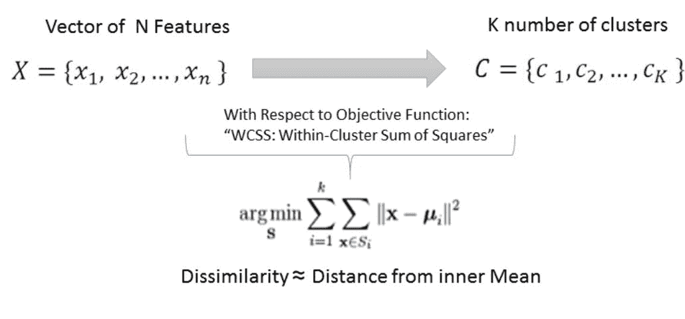

Source: Spark documentation

# 劳埃德算法

基本 KMeans 实现(劳埃德算法)的步骤如下:

1.  从观测值中随机选择 K 个数据中心作为初始质心。
2.  继续迭代，直到满足收敛标准:
    *   测量从一个点到每个质心的距离
    *   包括聚类中最接近质心的每个数据点
    *   基于距离公式(相异度的代理)计算新的聚类质心
    *   用新的中心点更新算法

下图描述了三代人:

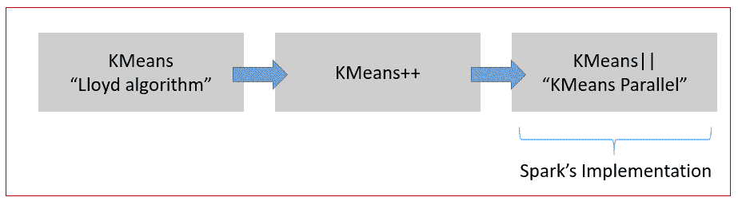

# KMeans++(亚瑟算法)

对标准 KMeans 的下一个改进是大卫·阿瑟和谢尔盖·瓦西里维茨基在 2007 年提出的 KMeans+。亚瑟的算法通过在播种过程(初始步骤)中更有选择性来改进初始劳埃德 KMeans。

KMeans++，不是选取随机中心(随机质心)作为起点，而是随机选取第一个质心，然后逐个选取数据点，计算`D(x)`。然后，它随机选择一个以上的数据点，并使用比例概率分布`D(x)2`，然后继续重复最后两个步骤，直到所有的 *K* 号都被选中。在初始播种之后，我们最终用新播种的质心运行 KMeans 或变体。KMeans++算法保证能够以*ω= O(log k)*的复杂度找到解决方案。尽管最初的播种需要额外的步骤，但精度的提高是显著的。

# KMeans||(发音为 KMeans Parallel)

KMeans ||被优化为并行运行，可以比劳埃德原始算法提高一到两个数量级。KMeans++的局限性在于它需要对数据集进行 K 次遍历，这可能会严重限制在大型或极端数据集上运行 KMeans 的性能和实用性。Spark 的 KMeans||并行实现运行得更快，因为它通过对 m 个点进行采样并在此过程中进行过采样，对数据进行的处理次数更少(少得多)。

下图描述了算法和数学的核心:

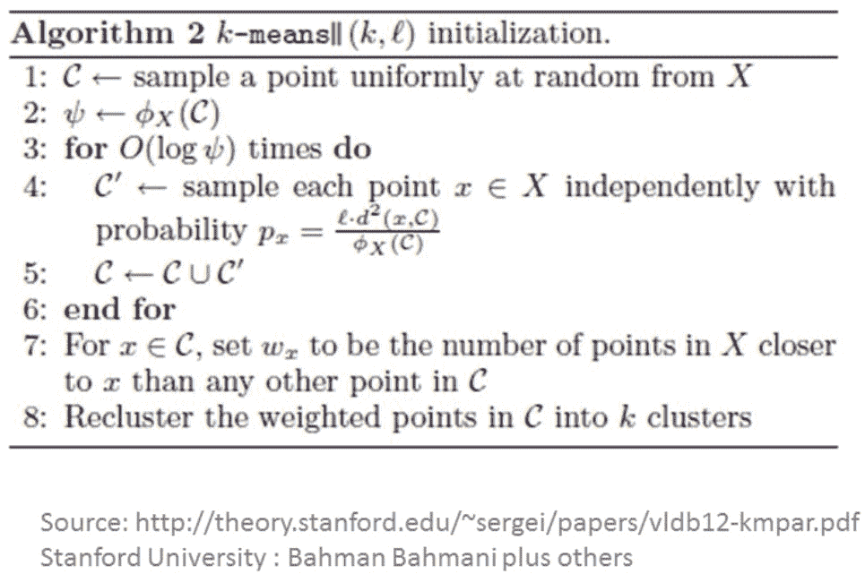

简而言之，KMeans ||(平行 KMeans)的亮点是在 *log(n)* 回合中重复的过程粒度采样，最后我们剩下 *k * log(n)* 个剩余点，它们距离最优解有一个 C(常数)距离！这种实现对离群数据点也不太敏感，离群数据点会扭曲 KMeans 和 KMeans++中的聚类结果。

为了更深入地理解算法，读者可以在[http://theory.stanford.edu/~sergei/papers/vldb12-kmpar.pdf](http://theory.stanford.edu/~sergei/papers/vldb12-kmpar.pdf)查阅巴赫曼·巴赫马尼的论文。

# 还有更多...

Spark 中还有一个流版本的 KMeans 实现，允许您动态地对功能进行分类。KMeans 的流版本在[第 13 章](13.html#G12EK0-4d291c9fed174a6992fd24938c2f9c77)、*Spark流和机器学习库*中有更详细的介绍。

还有一个类可以帮助您为 KMeans 生成 RDD 数据。我们发现这在我们的应用程序开发过程中非常有用:

```scala
def generateKMeansRDD(sc: SparkContext, numPoints: Int, k: Int, d: Int, r: Double, numPartitions: Int = 2): RDD[Array[Double]] 
```

这个调用使用 Spark 上下文来创建 rdd，同时允许您指定点、集群、维度和分区的数量。

一个有用的相关 API 是:`generateKMeansRDD()`。`generateKMeansRDD`的文档可在[http://spark . Apache . org/docs/latest/API/Scala/index . html # org . Apache . spark . mllib . util . kmeandtaggenerator $](http://spark.apache.org/docs/latest/api/scala/index.html#org.apache.spark.mllib.util.KMeansDataGenerator%24)上找到，用于生成包含 KMeans 测试数据的 RDD。

# 请参见

我们需要两个对象来编写、测量和操作 Spark 中 KMeans ||算法的参数。这两件物品的详情可在以下网站找到:

*   `KMeans()`:[http://spark . Apache . org/docs/latest/API/Scala/index . html # org . Apache . spark . ml . clustering . kmeans](http://spark.apache.org/docs/latest/api/scala/index.html#org.apache.spark.ml.clustering.KMeans)
*   `KMeansModel()`:[http://spark . Apache . org/docs/latest/API/Scala/index . html # org . Apache . spark . ml . clustering . kmeansmodel](http://spark.apache.org/docs/latest/api/scala/index.html#org.apache.spark.ml.clustering.KMeansModel)

# 平分 KMeans，Spark 2.0 中的新成员

在本食谱中，我们将下载玻璃数据集，并尝试使用平分 KMeans 算法来识别和标记每个玻璃。二分 KMeans 是使用`BisectingKMeans()` API 在 Spark 中实现的 K 均值算法的分层版本。虽然这种算法在概念上类似于 KMeans，但是对于存在分层路径的一些用例，它可以提供相当快的速度。

我们用于此配方的数据集是玻璃鉴定数据库。对玻璃类型分类的研究是由犯罪学研究推动的。如果正确识别，玻璃可以被视为证据。数据可以在 NTU(台湾)找到，已经是 LIBSVM 格式。

# 怎么做...

1.  我们从:[https://www . csie . NTU . edu . tw/~ cjlin/libsvmtols/datasets/multi class/glass . scale](https://www.csie.ntu.edu.tw/~cjlin/libsvmtools/datasets/multiclass/glass.scale)下载了 LIBSVM 中准备好的数据文件

数据集包含 11 个要素和 214 行。

2.  原始数据集和数据字典也可在 UCI 网站获得:[http://archive.ics.uci.edu/ml/datasets/Glass+Identification](http://archive.ics.uci.edu/ml/datasets/Glass+Identification)
    *   身份证号码:1 至 214
    *   折射率
    *   钠:钠(单位:相应氧化物的重量百分比，属性 4-10 也是)
    *   镁:镁
    *   铝:铝
    *   硅:硅
    *   钾:钾
    *   钙:钙
    *   钡
    *   铁

玻璃类型:将使用`BisectingKMeans()`找到我们的类属性或簇:

*   `building_windows_float_processed`
*   `building_windows_non-_float_processed`
*   `vehicle_windows_float_processed`
*   `vehicle_windows_non-_float_processed`(本数据库无)
*   `Containers`
*   `Tableware`
*   `Headlamps`

3.  在 IntelliJ 或您选择的 IDE 中启动一个新项目。确保包含必要的 JAR 文件。

4.  设置程序将驻留的包位置:

```scala
package spark.ml.cookbook.chapter8
```

5.  导入必要的包:

```scala
import org.apache.spark.ml.clustering.BisectingKMeansimport org.apache.spark.sql.SparkSessionimport org.apache.log4j.{Level, Logger}
```

6.  将输出级别设置为`ERROR`以减少 Spark 的日志输出:

```scala
Logger.getLogger("org").setLevel(Level.ERROR)
```

7.  创建Spark的会话对象:

```scala
val spark = SparkSession.builder*.master(**"local[*]"**).appName(**"MyBisectingKMeans"**).config(**"spark.sql.warehouse.dir"**, **"."**).getOrCreate()*
```

 *8.  我们从 libsvm 格式的文件创建数据集，并在控制台上显示该数据集:

```scala
val dataset = spark.read.format("libsvm").load("../data/sparkml2/chapter8/glass.scale")dataset.show(false)
```

从控制台，您将看到:


9.  然后，我们以 80%和 20%的比例将数据集随机分成两部分:

```scala
val splitData = dataset.randomSplit(Array(80.0, 20.0))val training = splitData(0)val testing = splitData(1)println(training.count())println(testing.count())
```

从控制台输出(总数为 214):

```scala
18034
```

10.  然后我们创建一个`BisectingKMeans`对象，并为模型设置一些关键参数。

在这种情况下，我们将`K`值设置为`6`，并将`Feature`列设置为“特征”列，这在上一步中进行了定义。此步骤是主观的，最佳值将根据特定数据集而有所不同。我们建议您使用 2 到 50 之间的值进行实验，并检查集群中心以获得最终值。

11.  我们还将最大迭代次数设置为`65`。大多数值都有默认设置，如以下代码所示:

```scala
// Trains a k-means model***val** bkmeans = **new** BisectingKMeans().setK(6).setMaxIter(65).setSeed(1)*
```

 *12.  然后我们训练数据集。`fit()`函数将运行算法并进行计算。它基于前面步骤中创建的数据集。我们还打印出模型参数:

```scala
val bisectingModel = bkmeans.fit(training)println("Parameters:")println(bisectingModel.explainParams())
```

从控制台输出:

```scala
Parameters:featuresCol: features column name (default: features)k: The desired number of leaf clusters. Must be > 1\. (default: 4, current: 6)maxIter: maximum number of iterations (>= 0) (default: 20, current: 65)minDivisibleClusterSize: The minimum number of points (if >= 1.0) or the minimum proportion of points (if < 1.0) of a divisible cluster. (default: 1.0)predictionCol: prediction column name (default: prediction)seed: random seed (default: 566573821, current: 1)
```

13.  然后，我们使用包含的 computeCost(x)函数计算成本:

```scala
val cost = bisectingModel.computeCost(training)println("Sum of Squared Errors = " + cost)
```

控制台输出将显示以下信息:

```scala
Sum of Squared Errors = 70.38842983516193
```

14.  然后，我们根据模型的计算打印出集群的中心:

```scala
println("Cluster Centers:")val centers = bisectingModel.clusterCenterscenters.foreach(println)
```

控制台输出将显示以下信息:

```scala
The centers for the 6 cluster (i.e. K= 6) 
KMeans Cluster Centers: 
```

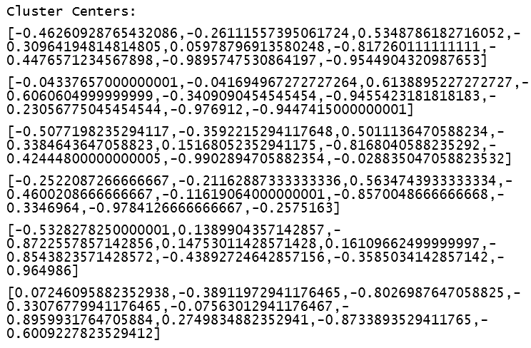

15.  然后，我们使用训练好的模型对测试数据集进行预测:

```scala
val predictions = bisectingModel.transform(testing)predictions.show(false)
```

从控制台输出:

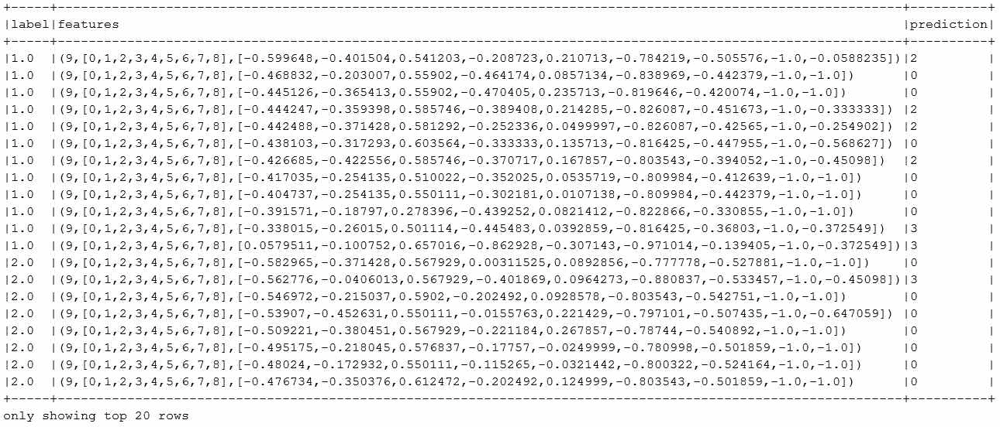

16.  然后，我们通过停止 Spark 上下文来关闭程序:

```scala
spark.stop()
```

# 它是如何工作的...

在本课程中，我们探讨了平分 KMeans 模型，这在 Spark 2.0 中是新的。我们在本课程中使用了玻璃数据集，并尝试使用`BisectingKMeans()`分配玻璃类型，但将 k 更改为 6，因此我们有足够的聚类。像往常一样，我们使用 Spark 的 libsvm 加载机制将数据加载到数据集。我们将数据集随机分为 80%和 20%，其中 80%用于训练模型，20%用于测试模型。

我们创建了`BiSectingKmeans()`对象，并使用`fit(x)`函数创建了模型。然后，我们使用测试数据集的`transform(x)`函数来探索模型预测，并在控制台输出中打印出结果。我们还输出计算集群的成本(误差平方和)，然后显示集群中心。最后，我们用分配的集群号打印特征并停止操作。

分层聚类的方法包括:

*   **分裂**:自上而下的方法(Apache Spark 实现)
*   **凝聚**:自下而上的方法

# 还有更多...

有关将知识产权一分为二的更多信息，请访问:

*   [http://spark . Apache . org/docs/latest/API/Scala/index . html # org . Apache . spark . ml . clustering .平分 KMeans](http://spark.apache.org/docs/latest/api/scala/index.html#org.apache.spark.ml.clustering.BisectingKMeans)
*   [http://spark . Apache . org/docs/latest/API/Scala/index . html # org . Apache . spark . ml . clustering .平分 KMeansModel](http://spark.apache.org/docs/latest/api/scala/index.html#org.apache.spark.ml.clustering.BisectingKMeansModel)

我们使用聚类来探索数据，并感受聚类的结果。将知识管理实体一分为二是分层分析与知识管理实体聚类的一个有趣案例。

概念化的最好方法是将知识管理实体一分为二，作为递归的分层知识管理实体。二分 KMeans 算法使用类似 KMeans 的相似性度量技术来划分数据，但使用分层方案来提高准确性。这在文本挖掘中尤其普遍，其中分层方法将最小化文档之间的语料库主体的簇内依赖性。

二分 KMeans 算法首先将所有观测值放在一个集群中，然后使用 KMeans 方法将集群分成 n 个分区(K=n)。然后，它继续选择最相似的集群(最高的内部集群分数)作为父集群(根集群)，同时递归地分割其他集群，直到以分层方式导出集群的目标数量。

二分 KMeans 是一个强大的工具，用于文本分析，以降低特征向量的维数，智能文本/主题分类。通过使用这种聚类技术，我们最终将相似的单词/文本/文档/证据分组到相似的组中。最终，如果你开始探索文本分析、主题传播和评分(例如，什么文章会像病毒一样传播？)，你必然会在旅程的早期遇到这种技巧。

描述将 KMeans 二等分用于文本聚类的白皮书可在以下网站获得:http://www . ijarcsse . com/docs/papers/Volume _ 5/2 _ 2015 年 2 月/V5I2-0229.pdf

# 请参见

实现分层聚类有两种方法——Spark 使用递归的自顶向下方法，在这种方法中，选择一个聚类，然后在算法向下移动时执行拆分:

*   关于层次聚类方法的细节可以在[https://en.wikipedia.org/wiki/Hierarchical_clustering](https://en.wikipedia.org/wiki/Hierarchical_clustering)找到
*   平分 K-Mean 的 Spark 2.0 文档可以在[http://spark . Apache . org/docs/latest/ml-clustering . html #平分 K-Mean](http://spark.apache.org/docs/latest/ml-clustering.html#bisecting-k-means)找到
*   描述如何使用二分 KMeans 对网络日志进行分类的论文可在[http://research . ijcaonline . org/volume 116/number 19/pxc 3902799 . pdf](http://research.ijcaonline.org/volume116/number19/pxc3902799.pdf)上找到

# 利用 Spark 中的高斯混合和期望最大化对数据进行分类

在本食谱中，我们将探索 Spark 对**期望最大化** ( **EM** ) `GaussianMixture()` *、*的实现，该实现计算给定一组特征作为输入的最大似然。它假设一个高斯混合模型，其中每个点可以从 K 个子分布(聚类成员)中采样。

# 怎么做...

1.  在 IntelliJ 或您选择的 IDE 中启动一个新项目。确保包含必要的 JAR 文件。

2.  设置程序将驻留的包位置:

```scala
package spark.ml.cookbook.chapter8.
```

3.  导入矢量和矩阵操作所需的包:

```scala
 import org.apache.log4j.{Level, Logger}import org.apache.spark.mllib.clustering.GaussianMixtureimport org.apache.spark.mllib.linalg.Vectorsimport org.apache.spark.sql.SparkSession
```

4.  创建Spark的会话对象:

```scala
val spark = SparkSession.builder*.master(**"local[*]"**).appName(**"myGaussianMixture"**).config(**"spark.sql.warehouse.dir"**, **"."**).getOrCreate()*
```

 *5.  让我们看一下数据集并检查输入文件。模拟 SOCR 膝关节疼痛质心位置数据代表 1000 名受试者假设膝关节疼痛位置的质心位置。数据包括质心的 X 和 Y 坐标。

该数据集可用于说明高斯混合和期望最大化。数据见:[http://wiki . stat . UCLA . edu/socr/index . PHP/SOCR _ Data _ knepipaindata _ 041409](http://wiki.stat.ucla.edu/socr/index.php/SOCR_Data_KneePainData_041409)

示例数据如下所示:

*   **X** :一个主体一个视图的质心位置的 *x* 坐标。
*   **Y** :一个主体一个视图的质心位置的 *y* 坐标。

x，Y

11 73

20 88

19 73

15 65

21 57

26 101

24 117

35 106

37 96

35 147

41 151

42 137

43 127

41 206

47 213

49 238

40 229

下图描绘了基于来自`wiki.stat.ucla`的 SOCR 数据集的膝盖疼痛图:

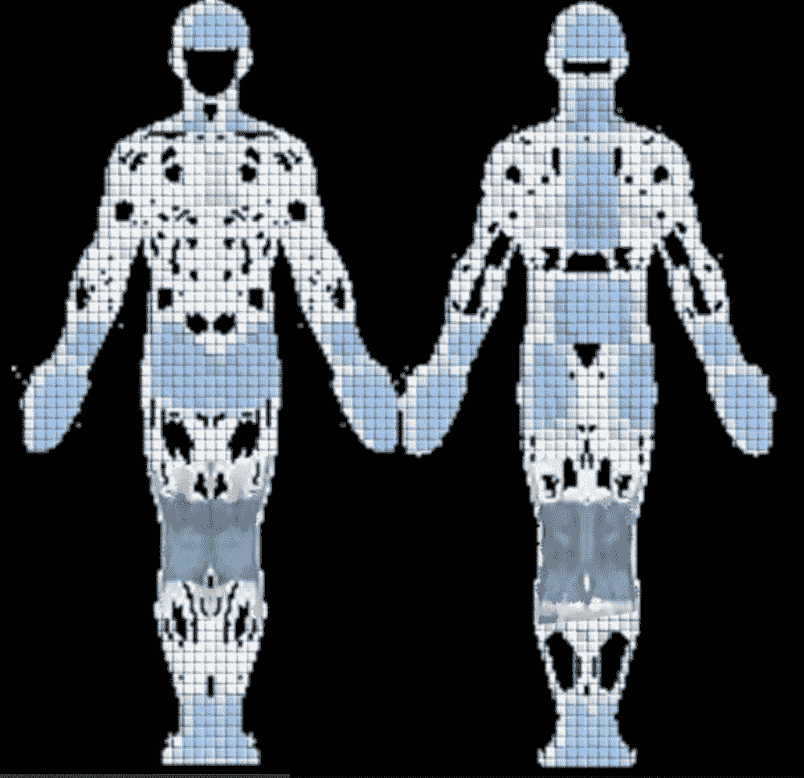

6.  我们将数据文件放在数据目录中(您可以将数据文件复制到您喜欢的任何位置)。

数据文件包含 8，666 个条目:

```scala
val dataFile ="../data/sparkml2/chapter8/socr_data.txt"
```

7.  然后，我们将数据文件加载到 RDD:

```scala
val trainingData = spark.sparkContext.textFile(dataFile).map { line =>Vectors.dense(line.trim.split(' ').map(_.toDouble))}.cache()
```

8.  我们现在创建一个高斯混合模型，并为模型设置参数。我们将 K 值设置为 4，因为数据是通过四个视图收集的:**左前方**(**LF**)**左后方**(**LB**)**右前**(**RF**)**右后方** ( **RB** )。我们将收敛设置为默认值 0.01，最大迭代次数设置为 100:

```scala
val myGM = new GaussianMixture().setK(4 ) // default value is 2, LF, LB, RF, RB.setConvergenceTol(0.01) // using the default value.setMaxIterations(100) // max 100 iteration
```

9.  我们运行模型算法:

```scala
val model = myGM.run(trainingData)
```

10.  训练结束后，我们打印出高斯混合模型的关键值:

```scala
println("Model ConvergenceTol: "+ myGM.getConvergenceTol)println("Model k:"+myGM.getK)println("maxIteration:"+myGM.getMaxIterations)for (i <- 0 until model.k) {println("weight=%f\nmu=%s\nsigma=\n%s\n" format(model.weights(i), model.gaussians(i).mu, model.gaussians(i).sigma))}
```

11.  由于我们将 K 值设置为 4，我们将在控制台记录器中打印出四组值:


12.  我们还根据高斯混合模型的预测打印出了前 50 个聚类标签:

```scala
println("Cluster labels (first <= 50):")val clusterLabels = model.predict(trainingData)clusterLabels.take(50).foreach { x =>*print*(" " + x)}
```

13.  控制台中的示例输出将显示以下内容:

```scala
Cluster labels (first <= 50):1 1 1 1 1 1 1 1 1 0 0 0 0 0 0 0 0 0 0 0 0 0 0 0 0 0 0 0 0 0 0 0 0 0 0 0 0 0 0 0 0 0 0 0 0 0 0 0 0 0
```

14.  然后，我们通过停止 Spark 上下文来关闭程序:

```scala
spark.stop()
```

# 它是如何工作的...

在前面的方法中，我们观察到 KMeans 可以基于使用相似性的迭代方法(欧几里德等)发现成员资格并将其分配给一个且仅一个集群。人们可以把高斯混合模型和电磁模型看作是一个专门的版本，在电磁模型中，离散(硬)成员是强制的。

但是也有重叠的情况，这在医学或信号处理中经常发生，如下图所示:


在这种情况下，我们需要一个概率密度函数来表示每个子分布的隶属度。带有**期望最大化** ( **EM** )的高斯混合模型是 Spark 中可以处理这个用例的算法`GaussianMixture()`。

这是 Spark 的 API，用于实现期望最大化(对数似然最大化)的高斯混合。

# 新高斯混合物()

这将构造一个默认实例。控制模型行为的默认参数是:


期望最大化的高斯混合模型是软聚类的一种形式，其中可以使用对数最大似然函数来推断隶属度。在这种情况下，使用具有均值和协方差的概率密度函数来定义 K 个聚类的成员或成员可能性。它是灵活的，因为成员资格没有量化，这允许基于概率的重叠成员资格(索引到多个子分布)。

下图是电磁算法的快照:


以下是电磁算法的步骤:

1.  假设 *N* 个数为高斯分布。
2.  迭代直到我们收敛:
    1.  对于从分布中抽取的条件概率绘制的每个点 Z，Xi 写成 *P (Z | Xi)*
    2.  调整参数的均值和方差，使它们适合分配给子分布的点

更多的数学解释，包括最大似然的详细工作，见以下链接:[http://www . ee . iisc . ernet . in/new/people/faculty/prasantg/downloads/GMM _ Tutorial _ Reynolds . pdf](http://www.ee.iisc.ernet.in/new/people/faculty/prasantg/downloads/GMM_Tutorial_Reynolds.pdf)

# 还有更多...

下图提供了一个快速参考点，突出显示了硬群集和软群集之间的一些差异:

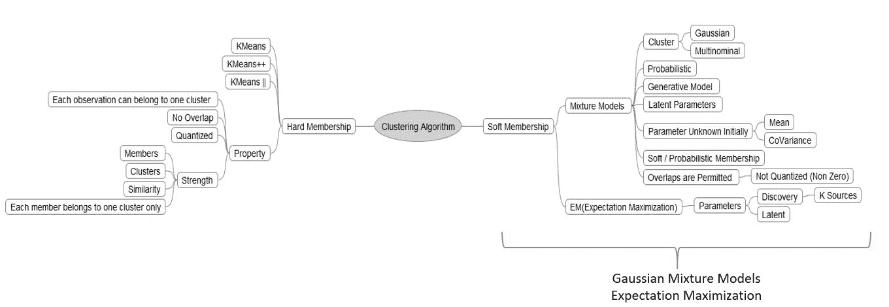

# 请参见

*   构造函数 GaussianMixture 的文档可以在[http://spark . Apache . org/docs/latest/API/Scala/index . html # org . Apache . spark . mllib . clustering . Gaussian mixture](http://spark.apache.org/docs/latest/api/scala/index.html#org.apache.spark.mllib.clustering.GaussianMixture)找到

*   构造函数 GaussianMixtureModel 的文档可以在[http://spark . Apache . org/docs/latest/API/Scala/index . html # org . Apache . spark . mllib . clustering . Gaussian mixturemodel](http://spark.apache.org/docs/latest/api/scala/index.html#org.apache.spark.mllib.clustering.GaussianMixtureModel)找到

# 在 Spark 2.0 中使用幂迭代聚类对图的顶点进行分类

这是一种给定图的顶点的分类方法，这些顶点的相似性由它们的边来定义。它使用随 Spark 一起开箱即用的 GraphX 库来实现该算法。幂迭代聚类类似于其他特征向量/特征值分解算法，但没有矩阵分解的开销。当您有一个大的稀疏矩阵(例如，描述为稀疏矩阵的图形)时，它是合适的。

GraphFrames 将是 GraphX 库未来的替代/接口(https://databricks . com/blog/2016/03/03/introduction-graph frames . html)。

# 怎么做...

1.  在 IntelliJ 或您选择的 IDE 中启动一个新项目。确保包含必要的 JAR 文件。

2.  设置程序将驻留的包位置:

```scala
package spark.ml.cookbook.chapter8
```

3.  导入 Spark 上下文所需的包以访问集群并`Log4j.Logger`减少 Spark 产生的输出量:

```scala
 import org.apache.log4j.{Level, Logger}import org.apache.spark.mllib.clustering.PowerIterationClusteringimport org.apache.spark.sql.SparkSession
```

4.  将记录器级别设置为 ERROR 只是为了减少输出:

```scala
Logger.getLogger("org").setLevel(Level.*ERROR*)
```

5.  创建 Spark 的配置和 SQL 上下文，以便我们能够访问集群，并能够根据需要创建和使用数据框:

```scala
// setup SparkSession to use for interactions with Spark***val** spark = SparkSession.builder*.master(**"local[*]"**).appName(**"myPowerIterationClustering"**).config(**"spark.sql.warehouse.dir"**, **"."**).getOrCreate()**
```

 **6.  我们使用数据集列表创建一个训练数据集，并使用 Spark `sparkContext.parallelize()`函数创建 Spark RDD:

```scala
val trainingData =spark.sparkContext.parallelize(*List*((0L, 1L, 1.0),(0L, 2L, 1.0),(0L, 3L, 1.0),(1L, 2L, 1.0),(1L, 3L, 1.0),(2L, 3L, 1.0),(3L, 4L, 0.1),(4L, 5L, 1.0),(4L, 15L, 1.0),(5L, 6L, 1.0),(6L, 7L, 1.0),(7L, 8L, 1.0),(8L, 9L, 1.0),(9L, 10L, 1.0),(10L,11L, 1.0),(11L, 12L, 1.0),(12L, 13L, 1.0),(13L,14L, 1.0),(14L,15L, 1.0)))
```

7.  我们创建一个`PowerIterationClustering`对象并设置参数。我们将`K`值设置为`3`，将最大迭代次数设置为`15`:

```scala
val pic = new PowerIterationClustering().setK(3).setMaxIterations(15)
```

8.  然后我们让模型运行:

```scala
val model = pic.run(trainingData)
```

9.  我们根据训练数据的模型打印出集群分配:

```scala
model.assignments.foreach { a =>println(s"${a.id} -> ${a.cluster}")}
```

10.  控制台输出将显示以下信息:

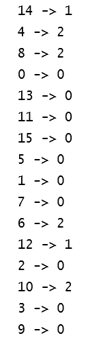

11.  我们还打印出每个集群集合中的模型分配数据:

```scala
val clusters = model.assignments.collect().groupBy(_.cluster).mapValues(_.map(_.id))val assignments = clusters.toList.sortBy { case (k, v) => v.length }val assignmentsStr = assignments.map { case (k, v) =>s"$k -> ${v.sorted.mkString("[", ",", "]")}"}.mkString(", ")val sizesStr = assignments.map {_._2.length}.sorted.mkString("(", ",", ")")println(s"Cluster assignments: $assignmentsStr\ncluster sizes: $sizesStr")
```

12.  控制台输出将显示以下信息(总的来说，我们有三个在前面参数中设置的集群):

```scala
Cluster assignments: 1 -> [12,14], 2 -> [4,6,8,10], 0 -> [0,1,2,3,5,7,9,11,13,15]cluster sizes: (2,4,10)
```

13.  然后，我们通过停止 Spark 上下文来关闭程序:

```scala
spark.stop()
```

# 它是如何工作的...

我们为一个图形创建了一个边和顶点列表，然后继续创建对象并设置参数:

```scala
new PowerIterationClustering().setK(3).setMaxIterations(15)
```

下一步是训练数据的模型:

```scala
val model = pic.run(trainingData)
```

然后输出集群进行检查。接近末尾的代码使用 Spark 转换运算符打印出每个集群集合中的模型分配数据。

核心 **PIC** ( **幂迭代聚类**)是一种特征值类算法，通过产生特征值加上特征向量来满足 *Av* = λ *v.* 来避免矩阵分解，因为 PIC 避免了矩阵 A 的分解，所以它适用于输入矩阵 A(在 Spark 的 PIC 的情况下描述一个图)是大稀疏矩阵的情况。

下图描述了图像处理(纸张后增强)中的 PIC 示例:


PIC 算法的 Spark 实现是对以前的通用实现(NCut)的改进，通过计算相似性的伪特征向量，该相似性被定义为给定 N 个顶点的边(类似于亲和矩阵)。

下图中描述的输入是描述该图的三元组关系数据库。输出是一个模型，每个节点都有一个集群分配。假设算法相似性(边)是正的和对称的(未示出):


# 还有更多...

有关该主题的更详细的数学处理(幂迭代)，请参见卡内基梅隆大学的以下白皮书:[http://www . cs . CMU . edu/~ WCO hen/postscript/icml 2010-pic-final . pdf](http://www.cs.cmu.edu/~wcohen/postscript/icml2010-pic-final.pdf)

# 请参见

*   构造器的文档`PowerIterationClustering()`可以在[上找到](http://spark.apache.org/docs/latest/api/scala/index.html#org.apache.spark.mllib.clustering.PowerIterationClustering)

*   构造器`PowerIterationClusteringModel()`的文档可以在[上找到](http://spark.apache.org/docs/latest/api/scala/index.html#org.apache.spark.mllib.clustering.PowerIterationClusteringModel)

# 潜在狄利克雷分配(LDA)将文档和文本分类为主题

在本食谱中，我们将探索 Spark 2.0 中的**潜在狄利克雷分配** ( **LDA** )算法。我们在这个配方中使用的 LDA 与线性判别分析完全不同。潜在狄利克雷分配和线性判别分析都被称为线性判别分析，但它们是极其不同的技术。在这个配方中，当我们使用线性判别分析时，我们指的是潜在狄利克雷分配。关于文本分析的章节也与理解 LDA 相关。

LDA 通常用于自然语言处理，它试图将大量文档(例如安然欺诈案中的电子邮件)分类为离散数量的主题，以便可以理解。LDA 也是在给定杂志文章或页面中根据个人兴趣(例如，当你翻页并花时间在特定主题上)选择文章的好候选人。

# 怎么做...

1.  在 IntelliJ 或您选择的 IDE 中启动一个新项目。确保包含必要的 JAR 文件。

2.  设置程序将驻留的包位置:

```scala
package spark.ml.cookbook.chapter8
```

3.  导入必要的包:

```scala
import org.apache.log4j.{Level, Logger}import org.apache.spark.sql.SparkSessionimport org.apache.spark.ml.clustering.LDA
```

4.  我们设置了必要的Spark会话来访问集群:

```scala
val spark = SparkSession.builder*.master(**"local[*]"**).appName(**"MyLDA"**).config(**"spark.sql.warehouse.dir"**, **"."**).getOrCreate()*
```

 *5.  我们有一个样本 LDA 数据集，它位于以下相对路径(您可以使用绝对路径)。示例文件随任何 Spark 发行版一起提供，并且可以在数据目录内的 Spark 主目录下找到(参见下文)。假设输入是 LDA 方法的一组输入特征:

```scala
val input = "../data/sparkml2/chapter8/my_lda_data.txt"
```

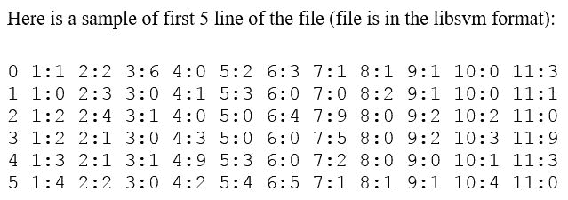

6.  在这一步中，我们读取文件并从输入文件创建必要的数据集，并在控制台中显示前五行:

```scala
val dataset = spark.read.format("libsvm").load(input)dataset.show(5)
```

从控制台输出:

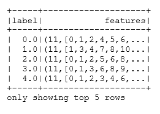

7.  我们创建 LDA 对象，并为该对象设置参数:

```scala
val lda = new LDA().setK(5).setMaxIter(10).setFeaturesCol("features").setOptimizer("online").setOptimizeDocConcentration(true)
```

8.  然后，我们使用包中的高级应用编程接口运行模型:

```scala
val ldaModel = lda.fit(dataset)val ll = ldaModel.logLikelihood(dataset)val lp = ldaModel.logPerplexity(dataset)println(s"\t Training data log likelihood: $ll")println(s"\t Training data log Perplexity: $lp")
```

从控制台输出:

```scala
Training data log likelihood: -762.2149142231476Training data log Perplexity: 2.8869048032045974
```

9.  我们从 LDA 模型中获取每组特征的主题分布，并显示主题。

10.  我们将`maxTermsPerTopic`值设置为`3`:

```scala
val topics = ldaModel.describeTopics(3)topics.show(false) // false is Boolean value for truncation for the dataset
```

11.  在控制台上，输出将显示以下信息:

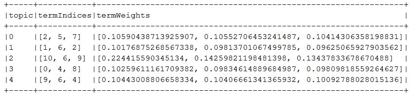

12.  我们还转换了 LDA 模型的训练数据集，并显示了结果:

```scala
val transformed = ldaModel.transform(dataset)transformed.show(false)
```

输出将显示以下内容:

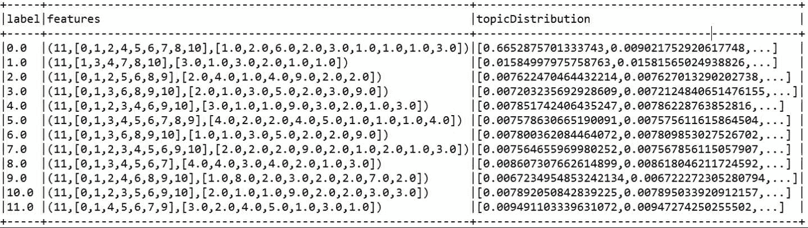

如果前面的方法更改为:

```scala
transformed.show(true)
```

13.  结果将显示为截断:

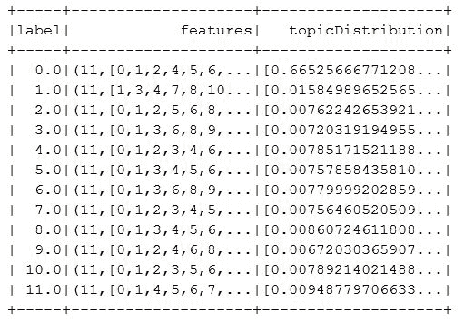

14.  我们关闭 Spark 上下文以结束该计划:

```scala
spark.stop()
```

# 它是如何工作的...

LDA 假设文档是具有狄利克雷先验分布的不同主题的混合。假设文档中的单词与特定主题具有相似性，这允许 LDA 对与主题最匹配的整个文档进行分类(构建和分配分布)。

主题模型是一种生成性潜在模型，用于发现文档主体中出现的抽象主题(主题)(通常太大，人类无法处理)。这些模型是对大量未标记文档及其内容进行总结、搜索和浏览的预检工具。一般来说，我们试图找到一起出现的一组特征(单词、子图像等)。

下图描述了整体线性判别分析方案:

为完整起见，请务必参考此处引用的白皮书[http://ai.stanford.edu/~ang/papers/nips01-lda.pdf](http://ai.stanford.edu/~ang/papers/nips01-lda.pdf)


线性判别分析算法的步骤如下:

1.  初始化以下参数(控制浓度和平滑):

    1.  Alpha 参数(高 alpha 使文档彼此更加相似，并包含相似的主题)

    2.  Beta 参数(高 beta 表示每个主题最有可能包含大部分单词的混合)

2.  随机初始化主题分配。

3.  迭代:

    1.  对于每个文档。

        1.  对于文档中的每个单词。

        2.  对每个单词的主题重新取样。

            1.  关于所有其他单词及其当前赋值(对于当前迭代)。

4.  得到结果。

5.  模型评估

在统计学中，Dirichlet 分布 Dir(α)是由正实数的向量α参数化的一族连续多元概率分布。有关 LDA 的更深入的讨论，请参阅

http://www.jmlr.org/papers/volume3/blei03a/blei03a.pdf 机器学习杂志

LDA 不为主题分配任何语义，也不关心主题被称为什么。它只是一个生成模型，使用细粒度项目的分布(例如，关于猫、狗、鱼、汽车的单词)来分配一个得分最高的整体主题。它不知道，不关心，也不理解所谓的狗或猫的话题。

在输入到一个线性判别分析算法之前，我们经常需要通过 TF-IDF 对文档进行标记化和矢量化。

# 还有更多...

下图简要描述了 LDA:

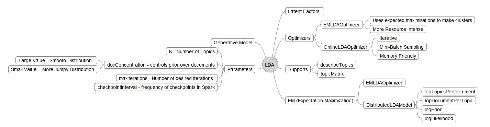

文档分析有两种方法。我们可以简单地使用矩阵分解将一个大的数据集矩阵分解成一个较小的矩阵(主题分配)乘以一个向量(主题本身):

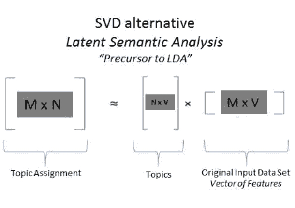

# 请参见

*   **LDA** :构造函数的文档可以在以下网址找到:[http://spark . Apache . org/docs/latest/API/Scala/index . html # org . Apache . spark . ml . clustering . LDA](http://spark.apache.org/docs/latest/api/scala/index.html#org.apache.spark.ml.clustering.LDA)
*   [**LDAModel** :构造函数的文档可以在](http://spark.apache.org/docs/latest/api/scala/index.html#org.apache.spark.ml.clustering.LDA)T4【http://spark . Apache . org/docs/latest/API/Scala/index . html # org . Apache . spark . ml . clustering . LDAModel 找到

也可以通过 Spark 的 Scala 应用编程接口查看以下文档链接:

*   分布式数据模型
*   EMLDAOptimizer
*   lanoptimizer
*   LocalLDAModel
*   在线优化器

# 流式知识管理意味着近乎实时地对数据进行分类

Spark streaming 是一个强大的工具，可以让您在同一个范例中结合近实时和批处理。流 KMeans 接口位于 ML 集群和 Spark 流的交叉点，充分利用了 Spark 流本身提供的核心设施(例如容错、恰好一次传递语义等)。

# 怎么做...

1.  在 IntelliJ 或您选择的 IDE 中启动一个新项目。确保包含必要的 JAR 文件。

2.  导入流 KMeans 所需的包:

`package spark.ml.cookbook.chapter8`。

3.  导入流 KMeans 所需的包:

```scala
import org.apache.log4j.{Level, Logger}import org.apache.spark.mllib.clustering.StreamingKMeansimport org.apache.spark.mllib.linalg.Vectorsimport org.apache.spark.mllib.regression.LabeledPointimport org.apache.spark.sql.SparkSessionimport org.apache.spark.streaming.{Seconds, StreamingContext}
```

4.  我们为流式 KMeans 程序设置了以下参数。培训目录将是发送培训数据文件的目录。KMeans 聚类模型利用训练数据来运行算法和计算。`testDirectory`将是预测的测试数据。`batchDuration`是批量运行的秒数。在以下情况下，程序将每 10 秒检查一次，看是否有任何新的数据文件需要重新计算。

5.  集群设置为`2`，数据维度为`3`:

```scala
val trainingDir = "../data/sparkml2/chapter8/trainingDir"val testDir = "../data/sparkml2/chapter8/testDir"val batchDuration = 10val numClusters = 2val numDimensions = 3
```

6.  通过上述设置，样本训练数据将包含如下数据(格式为[ *X <sub class="calibre64">1</sub> ，X <sub class="calibre64">2</sub> ，...X <sub class="calibre64">n</sub>* 】，其中 *n* 为`numDimensions`:

[0.0,0.0,0.0]

[0.1,0.1,0.1]

[0.2,0.2,0.2]

[9.0,9.0,9.0]

[9.1,9.1,9.1]

[9.2,9.2,9.2]

[0.1,0.0,0.0]

[0.2,0.1,0.1]

....

测试数据文件将包含如下数据(格式为( *y、[X1、X2、..Xn]* )，其中 *n* 为`numDimensions`，`y`为标识符:

(7,[0.4,0.4,0.4])

(8,[0.1,0.1,0.1])

(9,[0.2,0.2,0.2])

(10,[1.1,1.0,1.0])

(11,[9.2,9.1,9.2])

(12,[9.3,9.2,9.3])

7.  我们设置了必要的 Spark 上下文来访问集群:

```scala
val spark = SparkSession.builder*.master(**"local[*]"**).appName(**"myStreamingKMeans"**).config(**"spark.sql.warehouse.dir"**, **"."**).getOrCreate()*
```

 *8.  定义流上下文和微批处理窗口:

```scala
val ssc = new StreamingContext(spark.sparkContext, Seconds(batchDuration.toLong))
```

9.  下面的代码将通过将前面两个目录中的数据文件解析成`trainingData`和`testData RDDs`来创建数据:

```scala
val trainingData = ssc.textFileStream(trainingDir).map(Vectors.parse)val testData = ssc.textFileStream(testDir).map(LabeledPoint.parse)
```

10.  我们创建`StreamingKMeans`模型并设置参数:

```scala
val model = new StreamingKMeans().setK(numClusters).setDecayFactor(1.0).setRandomCenters(numDimensions, 0.0)
```

11.  该程序将使用训练数据集训练模型，并使用测试数据集进行预测:

```scala
model.trainOn(trainingData)model.predictOnValues(testData.map(lp => (lp.label, lp.features))).print()
```

12.  我们启动流上下文，程序将每 10 秒运行一次批处理，看看是否有新的数据集可用于训练，以及是否有任何新的测试数据集用于预测。如果收到终止信号，程序将退出(退出批处理运行):

```scala
ssc.start()ssc.awaitTermination()
```

13.  我们将`testKStreaming1.txt`数据文件复制到前面的`testDir`集合中，并在控制台日志中看到以下内容:

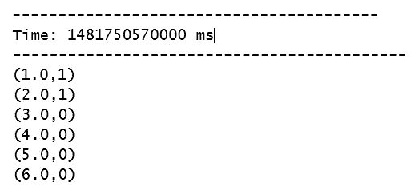

14.  对于 Windows 机器，我们将`testKStreaming1.txt`文件复制到目录:`C:\spark-2.0.0-bin-hadoop2.7\data\sparkml2\chapter8\testDir\`。

15.  我们还可以查看 SparkUI 了解更多信息:`http://localhost:4040/`。

作业面板将显示流式作业，如下图所示:


如下图所示，流面板将显示前面的流 KMeans 矩阵作为显示的矩阵，在这种情况下，批处理作业每 10 秒运行一次:


您可以通过单击任何一个批处理来获得更多有关流式批处理的详细信息，如下图所示:

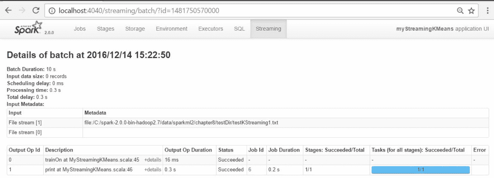

# 它是如何工作的...

在某些情况下，我们不能使用批处理方法来加载和捕获事件，然后对它们做出反应。我们可以使用创造性的方法来捕获内存或着陆数据库中的事件，然后快速将其发送到另一个系统进行处理，但是这些系统中的大多数都不能充当流式系统，并且构建成本通常非常高。

Spark 提供了一种近实时(也称为主观实时)，可以通过连接器(例如，卡夫卡连接器)接收传入的源，如推特订阅源、信号等，然后将其处理并呈现为 RDD 界面。

这些是在 Spark 中构建和构建流式 KMeans 所需的元素:

1.  使用流上下文，而不是目前使用的常规 Spark 上下文:

```scala
val ssc = new StreamingContext(conf, Seconds(batchDuration.toLong))
```

2.  选择要连接到数据源并接收事件的连接器:

    *   推特
    *   卡夫卡
    *   第三方
    *   泽姆 q
    *   传输控制协议（Transmission Control Protocol）
    *   ........
3.  创建您的流式 KMeans 模型；根据需要设置参数:

```scala
model = new StreamingKMeans()
```

4.  照常训练和预测:

    *   请记住，不能在运行中更改 K

5.  启动上下文并等待终止信号退出:

    *   `ssc.start()`

    *   `ssc.awaitTermination()`

# 还有更多...

流 KMeans 是 KMeans 实现的特殊情况，在这种情况下，数据可以接近实时到达，并根据需要分类到一个集群中(硬分类)。应用程序非常广泛，可以从接近实时的异常检测(欺诈、犯罪、情报、监控和监视)到金融领域的沃罗诺伊图细粒度微部门旋转可视化。[第 13 章](13.html#G12EK0-4d291c9fed174a6992fd24938c2f9c77)、*Spark流和机器学习库*提供了更详细的流覆盖。

关于沃罗诺伊图的参考，见以下网址:[https://en.wikipedia.org/wiki/Voronoi_diagram](https://en.wikipedia.org/wiki/Voronoi_diagram)

目前Spark机器库中除了流 KMeans 还有其他算法，如下图所示:


# 请参见

*   Streaming KMeans 的文档可在以下网址找到:[http://spark . Apache . org/docs/latest/API/Scala/index . html # org . Apache . spark . mllib . clustering . Streaming KMeans](http://spark.apache.org/docs/latest/api/scala/index.html#org.apache.spark.mllib.clustering.StreamingKMeans)

*   流 KMeans 模型的文档可在以下网址找到:http://spark . Apache . org/docs/latest/API/Scala/index . html # org . Apache . spark . mllib . stat . test . streamingtest

*   Streaming Test 的文档-对数据生成非常有用-可在以下网址找到:http://spark . Apache . org/docs/latest/API/Scala/index . html # org . Apache . spark . mllib . clustering . streamingkmeansmodel***********