# 九、优化——使用梯度下降下山

在本章中，我们将介绍:

*   优化一个二次成本函数，用数学方法找到最小值来获得洞察力
*   从头开始使用梯度下降编码二次成本函数优化
*   编码梯度下降优化从头开始求解线性回归
*   在 Spark 2.0 中用正规方程代替线性回归

# 介绍

理解优化是如何工作的，是机器学习事业成功的基础。我们选择**梯度下降** ( **GD** )方法进行端到端深潜，以演示优化技术的内部工作原理。我们将使用三种方法来开发这个概念，这三种方法将开发人员从零开始引导到完全开发的代码，以解决真实世界数据的实际问题。第四个配方探索了 GD 的替代方案，使用 Spark 和正规方程(大数据问题的有限缩放)来解决回归问题。

我们开始吧。机器到底是如何学习的？它真的从错误中吸取教训了吗？当机器使用优化找到解决方案时，意味着什么？

在高层次上，机器基于以下五种技术之一进行学习:

*   **基于误差的学习**:在这种技术中，我们在域空间中搜索参数值(权重)的组合，该组合最小化训练数据上的总误差(预测与实际)。
*   **信息论学习**:该方法使用经典香农信息论中的熵和信息增益等概念。基于树的 ML 系统，经典地植根于 ID3 算法，很适合这个类别。系综树模型将是这一类别的最高成就。我们将在[第 10 章](10.html#DMM2O0-4d291c9fed174a6992fd24938c2f9c77)、*中讨论使用决策树和集成模型*构建机器学习系统。
*   **概率空间学习**:机器学习的这个分支是基于贝叶斯定理([https://en.wikipedia.org/wiki/Bayes'_theorem)](https://en.wikipedia.org/wiki/Bayes'_theorem))。机器学习中最著名的方法是朴素贝叶斯(多重变异)。朴素的贝叶斯最终引入了贝叶斯网络，允许对模型进行更多的控制。
*   **相似性度量学习** *:* 该方法通过尝试定义相似性度量，然后基于该度量拟合观察的分组来工作。最著名的方法是 KNN(最近邻居)，这是任何 ML 工具包中的标准。Spark ML 实现了 K-means++的并行性，称为 K-Means | |(K-Means Parallel)。
*   **遗传算法(GA)和进化学习**:这可以看作是达尔文的理论(《物种起源》)应用于优化和机器学习。遗传算法背后的思想是使用递归生成算法创建一组初始候选，然后使用反馈(适应度景观)消除远处的候选，折叠相似的候选，同时向不太可能的候选随机引入突变(数字或符号抖动)，然后重复直到找到解决方案。

一些数据科学家和 ML 工程师更愿意把优化看作是最大化对数似然性，而不是最小化成本函数——他们实际上是同一枚硬币的两面！在本章中，我们将重点介绍基于错误的学习，尤其是**梯度下降**。

为了提供一个坚实的理解，我们将通过三个应用于优化的梯度下降法来深入研究梯度下降法。然后，我们将提供 Spark 的正规方程方法作为数值优化方法的替代，例如梯度下降(GD)或**有限记忆 Broyden-Fletcher-Goldfarb-Shanno**(**LBFGS**)算法。

Apache Spark 为所有类别提供了出色的覆盖范围。下图描述了一个分类法，它将指导您完成在数值优化领域的旅程，这是在 ML 中实现卓越的基础。

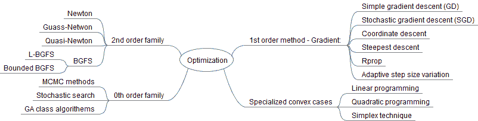

# 机器如何使用基于错误的系统学习？

机器学习的方式和我们差不多——它们从错误中学习。他们首先进行初步猜测(参数的随机权重)。其次，他们使用他们的模型(例如，GLM、RRN 等渗回归)来做出预测(例如，一个数字)。第三，他们看答案应该是什么(训练集)。第四，他们使用各种技术(如最小二乘法、相似度等)来衡量实际答案和预测答案之间的差异。

一旦所有这些机制到位，他们就在整个训练数据集上不断重复这个过程，同时试图在考虑整个训练数据集时得出误差最小的参数组合。有趣的是，机器学习的每个分支都使用数学或领域已知事实来避免在现实环境中不会终止的强力组合学方法。

基于误差的最大似然优化是数学规划的一个分支，通过算法实现，但精度有限(精度从 10 <sup class="calibre28">-2</sup> 到 10 <sup class="calibre28">-6</sup> 不等)。大多数(如果不是全部的话)这类方法利用简单的微积分事实，如一阶导数(斜率)，如 GD 技术，和二阶导数(曲率)，如 BFGS 技术，来最小化成本函数。在 BFGS 的情况下，看不见的手是更新器函数(L1 更新器)，等级(二级等级更新)，使用黑森自由技术([https://en.wikipedia.org/wiki/Hessian_matrix](https://en.wikipedia.org/wiki/Hessian_matrix))近似最终答案/解决方案，而没有实际的二阶导数矩阵。

下图描述了 Spark 中涉及优化的一些工具:

****

进行 SGD 和 LBFGS 优化的功能可以在 Spark 中自行获得。为了利用它们，你应该能够编写和提供你自己的成本函数。功能，如`runMiniBatchSGD()`，不仅标记为私有，还要求对两种算法的实现有很好的理解。

由于这是一本烹饪书，我们无法深入探讨优化理论，作为背景和参考，我们从我们的图书馆推荐以下书籍:

*   **优化(2013)**:*[https://www . Amazon . com/Optimization-Springer-Texts-Statistics-Kenneth/DP/1461458374/ref = Sr _ 1 _ 8？ie = UTF8&qid = 1485744639&Sr = 8-8&关键词=优化](https://www.amazon.com/Optimization-Springer-Texts-Statistics-Kenneth/dp/1461458374/ref=sr_1_8?ie=UTF8&qid=1485744639&sr=8-8&keywords=optimization)*
**   **机器学习优化(2011)**:*[https://www . Amazon . com/Optimization-机器学习-信息-处理/dp/026201646X/ref=sr_1_1？ie = UTF8&qid = 1485744817&Sr = 8-1&关键词=优化+for+机器+学习](https://www.amazon.com/Optimization-Machine-Learning-Information-Processing/dp/026201646X/ref=sr_1_1?ie=UTF8&qid=1485744817&sr=8-1&keywords=optimization+for+machine+learning)***   **凸优化(2004)**:*[https://www . Amazon . com/凸-优化-Stephen-Boyd/DP/0521833787/ref = PD _ sim _ 14 _ 2？_ encoding = UTF8&PSC = 1&refRID = 7t 88 djy5zwberegj4wt 4](https://www.amazon.com/Convex-Optimization-Stephen-Boyd/dp/0521833787/ref=pd_sim_14_2?_encoding=UTF8&psc=1&refRID=7T88DJY5ZWBEREGJ4WT4)***   **搜索、优化和机器学习中的遗传算法(1989)——经典！**:*[https://www . Amazon . com/Genetic-Algorithms-Optimization-Machine-Learning/DP/0201157675/ref = Sr _ 1 _ 5？s = books&ie = UTF8&qid = 1485745151&Sr = 1-5&关键词=遗传+编程](https://www.amazon.com/Genetic-Algorithms-Optimization-Machine-Learning/dp/0201157675/ref=sr_1_5?s=books&ie=UTF8&qid=1485745151&sr=1-5&keywords=genetic+programming)***   **从自然到人工系统的群体智能(1999)**:*[https://www . Amazon . com/Swarm-Intelligence-manual-Institute-Complexity/DP/0195131592/ref = Sr _ 1 _ 3？s = books&ie = UTF8&qid = 1485745559&Sr = 1-3&关键词=群体+智能](https://www.amazon.com/Swarm-Intelligence-Artificial-Institute-Complexity/dp/0195131592/ref=sr_1_3?s=books&ie=UTF8&qid=1485745559&sr=1-3&keywords=swarm+intelligence)*****

 ***# 优化一个二次成本函数，用数学方法找到最小值来获得洞察力

在本食谱中，我们将在引入梯度下降(一阶导数)和 L-BFGS(一种无黑森的拟牛顿方法)之前，探索使用简单导数的数学优化背后的基本概念。

我们将研究一个样本二次成本/误差函数，并展示如何仅通过数学计算找到最小值或最大值。


我们将使用封闭形式(顶点公式)和导数方法(斜率)来寻找最小值，但是我们将在本章的后面介绍数值优化技术，例如梯度下降及其在回归中的应用。

# 怎么做...

1.  假设我们有一个二次成本函数，我们找到它的最小值:


2.  当我们在搜索空间中移动时，统计机器学习算法中的成本函数充当难度、消耗的能量或总误差的代理。

3.  我们要做的第一件事是绘制函数图，并对其进行可视化检查。


4.  目测是凹函数，最小值在(2，1)。

5.  我们的下一步是通过优化函数来找到最小值。在机器学习中呈现成本或误差函数的一些例子可以是平方误差、欧几里德距离、MSSE 或任何其他能够捕捉我们离最佳数字答案有多远的相似性度量。

6.  下一步是在我们的 ML 技术中搜索最大限度减少错误(例如，成本)的最佳参数值。例如，通过优化线性回归成本函数(误差平方和)，我们可以得到其参数的最佳值。
    *   导数法:将一阶导数设为零求解
    *   顶点法:使用封闭代数形式
7.  首先，我们通过计算一阶导数，将其设置为零，并求解 *x* 和 *y* ，使用导数法求解最小值。

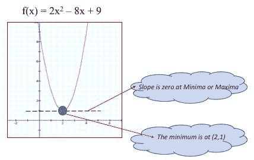

给定 f(x) = 2x <sup class="calibre28">2</sup> - 8x +9 作为我们的成本/误差函数，导数可以计算为:


[权力规则: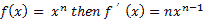 ]

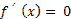【我们设置导数等于 0，求解为】


我们现在使用顶点公式方法验证最小值。要使用代数方法计算最小值，请参见以下步骤。

8.  给定函数，顶点可以在以下位置找到:


9.  让我们使用顶点代数公式来计算最小值:


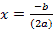


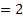


```scala
2(2)2 + (-8) (2) +9
```


10.  作为最后一步，我们检查步骤 4 和 5 的结果，以确保我们使用产生最小值(2，1)的封闭代数形式的答案与也产生(2，1)的导数方法一致。

11.  最后一步，我们在左侧面板展示 *f(x)* 的示意图，同时在右侧面板展示它的导数，这样你就可以自己直观的检查答案了。


12.  如你所见，一个不经意的观察描绘了最小顶点在左手边的(2，1)*{ X = 2，f(x)=1 }* ，而右手边的图表显示了函数相对于 *X* (仅参数)的导数，其最小值在 *X=2* 。正如在前面的步骤中看到的，我们将函数的导数设置为零，并求解 *X* ，得到数字 2。您也可以目视检查两个面板和方程，以确保 *X=2* 是真实的，并且在两种情况下都有意义。

# 它是如何工作的...

我们有两种方法可以不用数值方法来求二次函数的最小值。在实际的统计机器学习优化中，我们使用导数来寻找凸函数的最小值。如果函数是凸的(或者优化是结合的)，则只有一个局部极小值，因此工作比深度学习中存在的非线性/非凸问题简单得多。

使用前面配方中的衍生方法:

*   首先，我们通过应用导数规则(例如，指数)找到导数。
*   其次，我们利用了这样一个事实:对于给定的简单二次函数(凸优化)，当一阶导数的斜率为零时，出现最小值。
*   第三，我们简单地通过遵循和应用机械微积分规则来找到导数。
*   第四，我们将函数的导数设置为零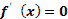并求解 x
*   第五，我们使用 x 值，并将其插入到原始方程中以找到 y。使用步骤 1 到 5，我们以点(2，1)处的最小值结束。

# 还有更多...

大多数统计机器学习算法定义和搜索域空间，同时使用成本或误差函数来获得最佳的数值近似解(例如，回归的参数)。函数具有最小值(最小化成本/误差)或最大值(最大化对数似然)的点是具有最小误差的最佳解(最佳近似值)存在的地方。

有关差异化规则的快速复习，请访问:[https://en.wikipedia.org/wiki/Differentiation_rules](https://en.wikipedia.org/wiki/Differentiation_rules)[和](https://en.wikipedia.org/wiki/Differentiation_rules)

关于最小化二次函数的一个更数学的描述可以在:[http://www.cis.upenn.edu/~cis515/cis515-11-sl12.pdf](http://www.cis.upenn.edu/~cis515/cis515-11-sl12.pdf)找到

麻省理工学院关于二次函数优化和形式的科学文章可以在以下网址找到:https://OCW . MIT . edu/courses/Sloan-school-of-management/15-084j-非线性规划-spring-2004/课堂讲稿/lec4_quad_form.pdf

# 请参见

*   UCSC 关于二次方程的长篇文章可以在 https://people.ucsc.edu/~miglior/chapter%20pdf/Ch08_SE.pdf 找到
*   二次函数可以表示为以下形式之一:

| **二次函数 ax <sup class="calibre28">2</sup> + bx + c 形** | **二次函数的标准形式** |
|  |  |

其中 *a、b* 和 *c* 为实数。

下图提供了最小值/最大值的快速参考，以及调节函数凸/凹外观和感觉的参数:

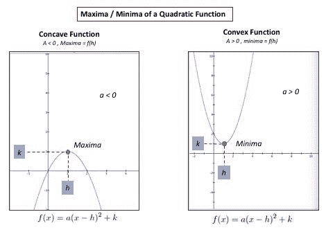

# 从头开始使用梯度下降编码二次成本函数优化

在本食谱中，我们将编写一种称为梯度下降(GD)的迭代数值优化技术，以找到二次函数 *f(x) = 2x <sup class="calibre28">2</sup> - 8x +9* 的最小值。

这里的重点从使用数学来求解最小值(将一阶导数设置为零)转移到一种称为梯度下降(GD)的迭代数值方法，该方法从猜测开始，然后在每次迭代中使用成本/误差函数作为指导来更接近解。

# 怎么做...

1.  在 IntelliJ 或您选择的 IDE 中启动一个新项目。确保包含必要的 JAR 文件。

2.  使用包指令`package spark.ml.cookbook.chapter9`设置路径。

3.  导入必要的包。

`scala.util.control.Breaks`将允许我们跳出程序。只有当程序无法收敛或陷入永无止境的过程时(例如，当步长太大时)，我们才会在调试阶段使用它。

```scala
import scala.collection.mutable.ArrayBufferimport scala.util.control.Breaks._
```

4.  这一步定义了我们试图最小化的实际二次函数:

```scala
def quadratic_function_itself(x:Double):Double = {// the function being differentiated// f(x) = 2x^2 - 8x + 9return 2 * math.pow(x,2) - (8*x) + 9}
```

5.  这一步定义了函数的导数。这就是所谓的点 x 处的梯度，它是函数 *f(x) = 2x^2 - 8x + 9* 的一阶导数。

```scala
def derivative_of_function(x:Double):Double = {// The derivative of f(x)return 4 * x - 8}
```

6.  在这一步中，我们设置一个随机的起点(这里设置为 13)。这将成为我们在 *x* 轴上的初始起点。

```scala
var currentMinimumValue = 13.0 // just pick up a random value
```

7.  我们继续设置根据之前的配方计算出的实际最小值， *O* *优化一个二次成本函数，并仅使用数学方法找到最小值以获得洞察力*，因此我们可以计算每次迭代相对于实际值的估计值。

```scala
val actualMinima = 2.0 // proxy for a label in training phase
```

这一点试图充当您在 ML 算法的训练阶段提供的标签。在现实环境中，我们会有一个带有标签的训练数据集，并让算法进行训练并相应地调整其参数。

8.  设置簿记变量并声明`ArrayBuffer`数据结构，以存储成本(误差)加上检验和绘图的估计最小值:

```scala
var oldMinimumValue = 0.0var iteration = 0;var minimumVector = ArrayBuffer[Double]()var costVector = ArrayBuffer[Double]()
```

9.  梯度下降算法的内部控制变量在此步骤中设置:

```scala
val stepSize = .01val tolerance = 0.0001
```

`stepSize`，也称为学习率，指导程序每次移动多少，而当我们足够接近最小值时，容差帮助算法停止。

10.  我们首先设置一个循环，当我们足够接近最小值时，基于期望的容差进行迭代和停止:

```scala
while (math.abs(currentMinimumValue - oldMinimumValue) > tolerance) {iteration +=1 //= iteration + 1 for debugging when non-convergence
```

11.  我们每次都更新最小值，并调用函数计算并返回当前更新点的导数值:

```scala
oldMinimumValue = currentMinimumValueval gradient_value_at_point = derivative_of_function(oldMinimumValue)
```

12.  我们决定移动多少，首先取最后一步返回的导数值，然后乘以步长(也就是说，我们缩放它)。然后，我们继续更新当前最小值，并通过移动减小它(导数值 x 步长):

```scala
val move_by_amount = gradient_value_at_point * stepSizecurrentMinimumValue = oldMinimumValue - move_by_amount
```

13.  我们通过使用一个非常简单的平方距离公式来计算我们的成本函数值(误差)。在现实生活中，实际的最小值将从训练中获得，但在这里，我们使用来自先前配方的值，*优化一个二次成本函数，并仅使用数学来找到最小值，以获得洞察力*。

```scala
costVector += math.pow(actualMinima - currentMinimumValue, 2)minimumVector += currentMinimumValue
```

14.  我们产生了一些中间输出结果，因此您可以在每次迭代中观察 currentMinimum 的行为:

```scala
print("Iteration= ",iteration," currentMinimumValue= ", currentMinimumValue)print("\n")
```

输出如下:

```scala
(Iteration= ,1, currentMinimumValue= ,12.56)(Iteration= ,2, currentMinimumValue= ,12.1376)(Iteration= ,3, currentMinimumValue= ,11.732096)(Iteration= ,4, currentMinimumValue= ,11.342812160000001)(Iteration= ,5, currentMinimumValue= ,10.9690996736)(Iteration= ,6, currentMinimumValue= ,10.610335686656)(Iteration= ,7, currentMinimumValue= ,10.265922259189761)(Iteration= ,8, currentMinimumValue= ,9.935285368822171)..............................(Iteration= ,203, currentMinimumValue= ,2.0027698292180602)(Iteration= ,204, currentMinimumValue= ,2.0026590360493377)(Iteration= ,205, currentMinimumValue= ,2.0025526746073643)(Iteration= ,206, currentMinimumValue= ,2.00245056762307)(Iteration= ,207, currentMinimumValue= ,2.002352544918147)
```

15.  以下陈述旨在提醒您，无论优化算法如何实现，它都应该始终提供退出非收敛算法的方法(也就是说，它应该防止用户输入和边缘情况):

```scala
if (iteration == 1000000) break //break if non-convergence - debugging}
```

16.  我们在每次迭代中收集的输出成本和最小向量用于以后的分析和绘图，它们是:

```scala
print("\n Cost Vector: "+ costVector)print("\n Minimum Vactor" + minimumVector)
```

输出结果是:

```scala
Cost vector: ArrayBuffer(111.51360000000001, 102.77093376000002, 94.713692553216, 87.28813905704389, ........7.0704727116774655E-6, 6.516147651082496E-6, 6.005281675238673E-6, 5.534467591900128E-6)Minimum VactorArrayBuffer(12.56, 12.1376, 11.732096, 11.342812160000001, 10.9690996736, 10.610335686656, 10.265922259189761, 9.935285368822171, ........2.0026590360493377, 2.0025526746073643, 2.00245056762307, 2.002352544918147)
```

17.  我们定义并设置最终最小值和实际函数值 *f(最小值)*的变量。它们充当最小值所在位置的(X，Y):

```scala
var minimaXvalue= currentMinimumValuevar minimaYvalue= quadratic_function_itself(currentMinimumValue)
```

18.  我们在配方中打印与我们的计算相匹配的最终结果，*优化一个二次成本函数，并使用迭代方法仅使用数学来获得洞察力*来找到最小值。最终的输出应该是我们的最小值位于(2，1)，这可以通过配方视觉或计算检查，*优化一个二次成本函数和寻找最小值仅使用数学获得洞察力*。

```scala
print("\n\nGD Algo: Local minimum found at X="+f"$minimaXvalue%1.2f")print("\nGD Algo: Y=f(x)= : "+f"$minimaYvalue%1.2f")}
```

输出结果是:

```scala
GD Algo: Local minimum found at X = : 2.00GD Algo: Y=f(x)= : 1.00
```

进程以退出代码 0 结束

# 它是如何工作的...

梯度下降技术利用了函数的梯度(在这种情况下为一阶导数)指向下降方向的事实。从概念上来说，梯度下降(GD)优化了成本或误差函数，以搜索模型的最佳参数。下图展示了梯度下降的迭代性质:


我们从定义步长(学习速率)、容差、要微分的函数和函数的一阶导数开始，然后继续迭代，从最初的猜测(本例中为 13)越来越接近零的目标最小值。

在每次迭代中，我们计算该点的梯度(该点的一阶导数)，然后使用步长对其进行缩放，以调整每次移动的量。由于我们是下降的，我们从旧点减去缩放的梯度，以找到更接近解的下一个点(以最小化误差)。

对于应该增加还是减少梯度值以到达新的点，存在一些混淆，我们接下来试图澄清这一点。指导原则应该是斜率是负的还是正的。要向正确的方向移动，必须向一阶导数(梯度)的方向移动。

下表和图提供了 GD 更新步骤的指南:

|  ***< 0*** *负梯度* |  ***> 0*** *正梯度* |
|  |  |

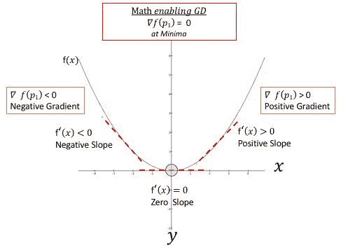

下图描述了单个步骤的内部工作方式(描述的负斜率)，在这个步骤中，我们要么从起点减去梯度，要么增加梯度，以到达下一个点，这将使我们离二次函数的最小值更近一步。例如，在这个食谱中，我们从 13 开始，经过 200+次迭代(取决于学习速率)，我们最终到达(2，1)的最小值，这与食谱中找到的解相匹配，*优化一个二次成本函数，仅使用数学来找到最小值，以获得本章的洞察力*。


为了更好地理解这些步骤，让我们试着从前面图表的左侧跟随一个简单的函数的步骤。在这种情况下，我们在曲线的左侧(最初的猜测是一个负数)，我们试图沿着梯度方向(一阶导数)每次迭代向下爬升并增加 X

以下步骤将引导您完成下一个图形，以演示核心概念和配方中的步骤:

1.  计算给定点的导数-梯度。
2.  使用步骤 1 中的渐变，并按步长缩放-移动量。

3.  通过减去移动量找到新位置:
    *   **负梯度情况**:在下图中，我们将负梯度(有效地增加了梯度)减去原始点，因此最终朝着零处的的最小值向下爬升。图中描绘的图表与这种情况相符。
    *   **正梯度情况**:如果我们在正梯度曲线的另一侧，那么我们从之前的位置减去正梯度数(有效地减去梯度)向最小值爬升。这个配方中的代码与这种情况相匹配，在这种情况下，我们试图从正数 13(最初的猜测)开始，以迭代的方式向 0 处的最小值移动。
4.  更新参数并移动到新点。
5.  我们不断重复这些步骤，直到我们收敛到一个解决方案，从而最小化函数。

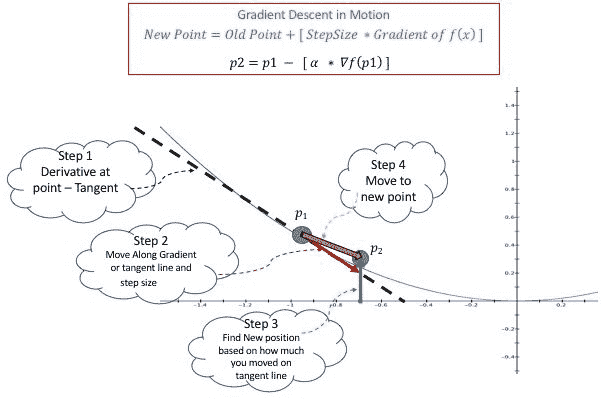

6.  值得注意的是，梯度下降(GD)及其变体使用一阶导数，这意味着它们是曲率无知的，而二阶导数算法，如牛顿或拟牛顿(BFGS，LBFGS)方法使用梯度和曲率，有或没有海森矩阵(关于每个变量的部分指令矩阵)。

GD 的替代方案是在整个域空间中搜索最佳设置，由于现实生活中大数据 ML 问题的规模和规模，这既不实际，也不会在实际意义上终止。

# 还有更多...

刚开始用 GD 的时候，步长或者学习速率是非常重要的要掌握的。如果步长过小，会导致计算量的浪费，并导致梯度下降没有收敛到一个解。虽然设置步长对于演示和小项目来说是微不足道的，但是将其设置为错误的值会导致大型 ML 项目的高计算损失。另一方面，如果步长太大，我们最终会陷入乒乓状态，或者远离收敛，这通常表现为放大的误差曲线，这意味着误差随着每次迭代而增加，而不是减少。

根据我们的经验，最好查看误差与迭代图表，并使用拐点来确定正确的值。另一种方法是尝试. 01 . . 001，......0001，并查看每次迭代的收敛情况(步长太小或太大)。记住步长只是一个比例因子是有帮助的，因为点上的实际梯度对于移动来说可能太大了(它会跳过最小值)。

总结一下:

*   如果步长太小，那么你的收敛速度就会很慢。
*   如果步长太大，你最终会跳过最小值(过度拍摄)，导致计算缓慢或乒乓效应(卡住)。

下图描述了基于不同步长的变化，以演示前面提到的要点。

*   **场景 1** :步长= .01 -步长是合适的-只是有点太小了，但是它在大约 200 次迭代中完成了工作。我们不喜欢看到 200 以下的东西，因为它必须有足够的通用目的才能在现实生活中生存。
*   **场景 2** :步长= .001 -步长过小导致收敛缓慢。虽然它看起来没有那么糟糕(1，500 多次迭代)，但它可能被认为过于细粒度。
*   **场景 3** :步长= .05 -步长过大。在这种情况下，算法会卡住，并不断地来回移动，而不会收敛。再怎么强调都不为过，你必须想出退出政策，以防这种情况在现实生活中发生(数据的性质和分布变化很大，所以要做好准备)。
*   **场景 4** :步长= .06 -步长太大导致不收敛和爆破。误差曲线爆炸(它以非线性方式增加)意味着误差随着每次迭代变大而不是变小。实际上，我们看到的这种情况(场景 4)比前面的场景更多，但是两种情况都可能发生，所以您应该为两种情况做好准备。如您所见，场景 3 和场景 4 之间步长的 0.01 微小差异对 GD 的行为产生了影响。这也是让算法交易变得困难的问题(优化)。

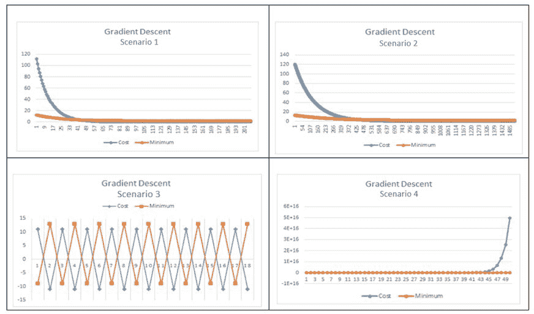

值得一提的是，对于这类光滑凸优化问题，局部极小值往往与全局极小值相同。您可以将局部最小值/最大值视为给定范围内的极值。对于同一函数，全局最小值/最大值是指函数整个范围内的全局或最大绝对值。

# 请参见

随机梯度下降:梯度下降(GD)有多种变体，其中随机梯度下降(SGD)最受关注。Apache Spark 支持随机梯度下降(SGD)变体，在这种变体中，我们用训练数据的子集更新参数——这有点具有挑战性，因为我们需要同时更新参数。SGD 和 GD 有两个主要区别。第一个区别是 SGD 是一种在线学习/优化技术，而 GD 更多的是一种离线学习/优化技术。SGD 和 GD 的第二个区别是收敛速度，因为在更新任何参数之前不需要检查整个数据集。下图描述了这种差异:


我们可以在 Apache Spark 中设置批处理窗口的大小，使算法对大规模数据集更加敏感(不需要一次遍历整个数据集)。SGD 会有一些随机性，但总的来说，这是目前使用的“事实上”的方法。它速度快得多，收敛速度也快得多。

在 GD 和 SGD 两种情况下，您可以通过更新原始参数来搜索模型的最佳参数。不同之处在于，在核心 GD 中，您必须遍历所有数据点，以便在给定迭代中对参数进行单次更新，这与 SGD 不同，在 SGD 中，您查看训练数据集中的每个单个(或小批量)样本来更新参数。

对于简短的一般性总结，一个好的开始是以下几点:

*   GD:[https://en . Wikipedia . org/wiki/gradient _ descent](https://en.wikipedia.org/wiki/Gradient_descent)
*   SGD:[https://en.wikipedia.org/wiki/Stochastic_gradient_descent](https://en.wikipedia.org/wiki/Stochastic_gradient_descent)

来自 CMU、微软和统计软件杂志的更多数学处理可以在以下网站找到:

*   CMU:[https://www . cs . CMU . edu/~ ggordon/10725-F12/slides/05-GD-reviewed . pdf](https://www.cs.cmu.edu/~ggordon/10725-F12/slides/05-gd-revisited.pdf)
*   [MS:](https://www.cs.cmu.edu/~ggordon/10725-F12/slides/05-gd-revisited.pdf)[http://cil VR . cs . NYU . edu/diglib/lsml/bottou-SGD-ticks-2012 . pdf](http://cilvr.cs.nyu.edu/diglib/lsml/bottou-sgd-tricks-2012.pdf)
*   jstat:https://arxiv . org/pdf/1509.06459 v1 . pdf

# 编码梯度下降优化从头开始求解线性回归

在这个食谱中，我们将探索如何编码梯度下降来解决线性回归问题。在前面的配方中，我们演示了如何对 GD 进行编码以找到二次函数的最小值。

这个配方演示了一个更现实的优化问题，其中我们优化(最小化)最小平方成本函数来解决 Apache Spark 2.0+上 Scala 中的线性回归问题。我们将使用真实数据，运行我们的算法，并将结果与第 1 级商业统计软件进行比较，以证明准确性和速度。

# 怎么做...

1.  我们首先从普林斯顿大学下载包含以下数据的文件:


Source: Princeton University

2.  下载来源:[http://data.princeton.edu/wws509/datasets/#salary](http://data.princeton.edu/wws509/datasets/#salary)。

3.  为了简单起见，我们选择`yr`和`sl`来研究职级年限如何影响工资。为了减少数据争论代码，我们将这两列保存在一个文件(`Year_Salary.csv`)中，如下表所示，以研究它们的线性关系:


4.  我们通过使用来自 IBM SPSS 软件包的散点图来直观地检查数据。视觉检查应该是任何数据科学项目的第一步，这一点怎么强调都不为过。


5.  在 IntelliJ 或您选择的 IDE 中启动一个新项目。确保包含必要的 JAR 文件。

6.  我们使用导入包将代码放在所需的位置:

`package spark.ml.cookbook.chapter9`。

前四个语句为 JFree 图表包导入了必要的包，这样我们就可以在同一个代码库中绘制 GD 错误和收敛。第五个导入负责`ArrayBuffer`，我们用它来存储中间结果:

```scala
import java.awt.Colorimport org.jfree.chart.plot.{XYPlot, PlotOrientation}import org.jfree.chart.{ChartFactory, ChartFrame, JFreeChart}import org.jfree.data.xy.{XYSeries, XYSeriesCollection}import scala.collection.mutable.ArrayBuffer
```

7.  定义数据结构以保存中间结果，因为我们可以最小化误差并收敛到斜率(`mStep`)和截距(`bStep`)的解:

```scala
val gradientStepError = ArrayBuffer[(Int, Double)]()val bStep = ArrayBuffer[(Int, Double)]()val mStep = ArrayBuffer[(Int, Double)]()
```

8.  通过 JFree 图表定义绘图功能。第一个只显示图表，第二个设置图表属性。这是一个锅炉板代码，您可以根据自己的喜好进行自定义:

```scala
def show(chart: JFreeChart) {val frame = new ChartFrame("plot", chart)frame.pack()frame.setVisible(true)}def configurePlot(plot: XYPlot): Unit = {plot.setBackgroundPaint(Color.WHITE)plot.setDomainGridlinePaint(Color.BLACK)plot.setRangeGridlinePaint(Color.BLACK)plot.setOutlineVisible(false)}
```

8.  该函数基于最小二乘法原理计算误差，我们将其最小化以找到最佳拟合解。该函数通过训练数据找出我们预测的值和实际值(工资)之间的差异。找到差异后，将其平方以计算总误差。power()函数是一个 Scala 数学函数，用于计算平方。


Source: Wikipedia

```scala
Beta : Slope (m variable)Alpha : Intercept b variable)def compute_error_for_line_given_points(b:Double, m:Double, points: Array[Array[Double]]):Double = {var totalError = 0.0for( point <- points ) {var x = point(0)var y = point(1)totalError += math.pow(y - (m * x + b), 2)}return totalError / points.length}
```

9.  下一个函数计算 *f(x)= b + mx* 的两个梯度(一阶导数)，并在域(所有点)上对它们进行平均。这与第二个配方中的过程相同，只是我们需要偏导数(梯度)，因为我们正在最小化两个参数`m`和`b`(斜率和截距)，而不仅仅是一个。

在最后两行中，我们通过将梯度乘以学习速率(步长)来缩放梯度。我们这样做的原因是为了确保我们不会以大步长结束，也不会超过最小值，从而导致乒乓场景或错误爆炸，如前面的配方中所讨论的。

```scala
def step_gradient(b_current:Double, m_current:Double, points:Array[Array[Double]], learningRate:Double): Array[Double]= {var b_gradient= 0.0var m_gradient= 0.0var N = points.length.toDoublefor (point <- points) {var x = point(0)var y = point(1)b_gradient += -(2 / N) * (y - ((m_current * x) + b_current))m_gradient += -(2 / N) * x * (y - ((m_current * x) + b_current))}var result = new Array[Double](2)result(0) = b_current - (learningRate * b_gradient)result(1) = m_current - (learningRate * m_gradient)return result}
```

10.  该函数读取并解析 CSV 文件:

```scala
def readCSV(inputFile: String) : Array[Array[Double]] = {scala.io.Source.fromFile(inputFile).getLines().map(_.split(",").map(_.trim.toDouble)).toArray}
```

11.  下面是一个包装函数，它循环 N 次迭代，并调用`step_gradient()`函数来计算给定点的梯度。然后我们继续一个接一个地存储每一步的结果，以便以后处理(例如，绘图)。

值得注意的是使用`Tuple2()`保存`step_gradient()`函数的返回值。

在函数的最后步骤中，我们调用`compute_error_for_line_given_points()`函数来计算给定斜率和截距组合的误差，并将其存储在`gradientStepError`中。

```scala
def gradient_descent_runner(points:Array[Array[Double]], starting_b:Double, starting_m:Double, learning_rate:Double, num_iterations:Int):Array[Double]= {var b = starting_bvar m = starting_mvar result = new Array[Double](2)var error = 0.0result(0) =bresult(1) =mfor (i <-0 to num_iterations) {result = step_gradient(result(0), result(1), points, learning_rate)bStep += Tuple2(i, result(0))mStep += Tuple2(i, result(1))error = compute_error_for_line_given_points(result(0), result(1), points)gradientStepError += Tuple2(i, error)}
```

12.  最后也是最后一步是主程序，它设置斜率、截距、迭代次数和学习速率的初始起点。我们特意选择较小的学习速率和较大的迭代次数来证明准确性和速度。
    1.  首先，我们从 GD 的关键控制变量(学习速率、迭代次数和起点)的初始化开始。
    2.  其次，我们继续显示起点(0，0)，并调用`compute_error_for_line_given_points()`显示起始误差。应该注意的是，在我们运行完 GD 并在最后一步显示结果后，误差应该会更低。

```scala
def main(args: Array[String]): Unit = {val input = "../data/sparkml2/chapter9/Year_Salary.csv"val points = readCSV(input)val learning_rate = 0.001val initial_b = 0val initial_m = 0val num_iterations = 30000println(s"Starting gradient descent at b = $initial_b, m =$initial_m, error = "+ compute_error_for_line_given_points(initial_b, initial_m, points))println("Running...")val result= gradient_descent_runner(points, initial_b, initial_m, learning_rate, num_iterations)var b= result(0)var m = result(1)println( s"After $num_iterations iterations b = $b, m = $m, error = "+ compute_error_for_line_given_points(b, m, points))val xy = new XYSeries("")gradientStepError.foreach{ case (x: Int,y: Double) => xy.add(x,y) }val dataset = new XYSeriesCollection(xy)val chart = ChartFactory.createXYLineChart("Gradient Descent", // chart title"Iteration", // x axis label"Error", // y axis labeldataset, // dataPlotOrientation.VERTICAL,false, // include legendtrue, // tooltipsfalse // urls)val plot = chart.getXYPlot()configurePlot(plot)show(chart)val bxy = new XYSeries("b")bStep.foreach{ case (x: Int,y: Double) => bxy.add(x,y) }val mxy = new XYSeries("m")mStep.foreach{ case (x: Int,y: Double) => mxy.add(x,y) }val stepDataset = new XYSeriesCollection()stepDataset.addSeries(bxy)stepDataset.addSeries(mxy)val stepChart = ChartFactory.createXYLineChart("Gradient Descent Steps", // chart title"Iteration", // x axis label"Steps", // y axis labelstepDataset, // dataPlotOrientation.VERTICAL,true, // include legendtrue, // tooltipsfalse // urls)val stepPlot = stepChart.getXYPlot()configurePlot(stepPlot)show(stepChart)}
```

13.  以下是该配方的输出。

首先我们显示误差为 6.006 的起点 0，0，然后允许算法运行并在完成迭代次数后显示结果:

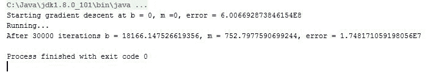

值得注意的是开始和结束的错误数量，以及它是如何随着时间的推移由于优化而减少的。

14.  我们用 IBM SPSS 作为控制点，说明我们放在一起的 GD 算法与 SPSS 包产生的结果(几乎是 1:1)相匹配——几乎是精确的！

下图显示了用于比较结果的 IBM SPSS 的输出:


15.  最后一步，程序并排生成两个图表。

下图显示了在迭代过程中，斜率 *(m)* 和截距( *b* )如何收敛到使误差最小的最佳组合:

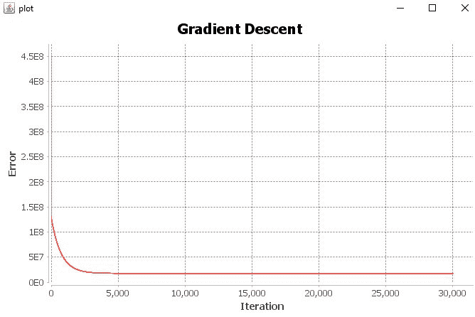

下图显示了在迭代过程中，斜率( *m* )和截距( *b* )如何收敛到最小化误差的最佳组合。


# 它是如何工作的...

梯度下降是一种迭代数值方法，从最初的猜测开始，然后通过查看误差函数来问自己我做得有多差，该误差函数是训练文件中预测数据与实际数据的平方距离。

在这个程序中，我们选择了一条简单的直线 *f(x) = b + mx* 方程作为我们的模型。为了优化并得出我们模型的斜率 m、截距 b 的最佳组合，我们有 52 对实际数据(年龄、工资)可以插入到我们的线性模型中(*预测工资=斜率 x 年龄+截距*)。简而言之，我们希望找到斜率和截距的最佳组合，帮助我们拟合一条最小化平方距离的直线。平方函数给我们所有正值，让我们只关注误差的大小。

*   `ReadCSV()`:读取数据文件并解析到我们的数据集:

*(x<sub class="calibre77">1</sub>, y<sub class="calibre77">1</sub>), (x<sub class="calibre77">2</sub>, y<sub class="calibre77">2</sub>), (x<sub class="calibre77">3</sub>, y<sub class="calibre77">4</sub>), ... (x<sub class="calibre77">52</sub>, y<sub class="calibre77">52</sub>)*

*   `Compute_error_for_line_given_points()`:该功能实现成本或误差功能。我们使用线性模型(直线方程)来预测，然后测量与实际数字的平方距离。将误差相加后，我们取平均值并返回总误差:


y<sub class="calibre77">i</sub> = mx<sub class="calibre77">i</sub> + b : for all data pair (*x, y)*

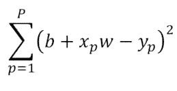

函数内值得注意的代码:第一行代码计算预测( *m * x + b* )和实际( *y* )之间的平方距离。第二行代码取平均值并返回:

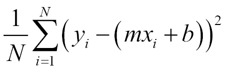

*totalError += math.pow(y - (m * x + b), 2)* *....* *return totalError / points.length*

下图显示了最小二乘的基本概念。简而言之，我们取一个点的实际训练数据与我们的模型预测值之间的距离，将它们平方，然后相加。我们将它们平方的原因是为了避免使用绝对值函数`abs()`，这在计算上是不可取的。平方差具有更好的数学性质，因为它提供了一个连续可微的性质，当您想要最小化它时，这是首选的。


*   `step_gradient()`:这个函数是使用我们正在迭代的当前点计算梯度(一阶导数)的地方( *x <sub class="calibre64">i</sub> ，y <sub class="calibre64">i</sub> )。*需要注意的是，与之前的配方不同，我们有两个参数，因此我们需要计算截距(`b_gradient`)和斜率(`m_gradient`)的偏导数。然后我们需要除以平均点数。

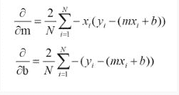

*   使用关于截距的偏导数( *b* ):

*b_gradient += -(2 / N) * (y - ((m_current * x) + b_current))*

*   使用关于斜率的偏导数( *m* ):

*m_gradient += -(2 / N) * x * (y - ((m_current * x) + b_current))*

*   最后一步是根据学习速率(步长)缩放计算的梯度，然后移动到斜率(m_current)和截距(b_current)的新估计位置:*结果(0) = b_current -(学习速率* b _ 梯度)* *结果(1) = m_current -(学习速率* m _ 梯度)*
*   `gradient_descent_runner()`:这是针对定义的迭代次数执行`step_gradient()`和`compute_error_for_line_given_points()`的驱动程序:

```scala
r (i <-0 to num_iterations) {step_gradient()...compute_error_for_line_given_points()...}
```

# 还有更多...

虽然这个方法能够处理现实生活中的数据，并匹配商业软件包的估计，但实际上你需要实现随机梯度下降。

Spark 2.0 提供了带有小批量窗口的随机梯度下降(SGD)(用于效率控制)。

Spark 提供了两种利用 SGD 的方法。第一种选择是使用独立的优化技术，在其中传递优化函数。见以下链接:[https://spark . Apache . org/docs/latest/API/Scala/index . html # org . Apache . spark . mllib . optimizer](https://spark.apache.org/docs/latest/api/scala/index.html#org.apache.spark.mllib.optimization.Optimizer)和[https://spark . Apache . org/docs/latest/API/Scala/index . html # org . Apache . spark . mllib . optimization . gradientDecement](https://spark.apache.org/docs/latest/api/scala/index.html#org.apache.spark.mllib.optimization.GradientDescent)

第二种选择是使用已经内置了 SGD 的专用 API 作为优化技术:

*   `LogisticRegressionWithSGD()`
*   `StreamingLogisticRegressionWithSGD()`
*   `LassoWithSGD()`
*   `LinearRegressionWithSGD()`
*   `RidgeRegressionWithSGD()`
*   `SVMWithSGD()`

As of Spark 2.0, all RDD-based regression is in maintenance mode only.

# 请参见

*   用 Spark 2.0 优化:[https://Spark . Apache . org/docs/latest/mllib-optimization . html #随机-梯度-下降-sgd](https://spark.apache.org/docs/latest/mllib-optimization.html#stochastic-gradient-descent-sgd)

# 在 Spark 2.0 中用正规方程代替线性回归

在这个食谱中，我们提出了一个替代梯度下降(GD)和 LBFGS 使用正规方程解决线性回归。在正规方程的情况下，您将回归设置为特征矩阵和标签向量(因变量)，同时尝试使用矩阵运算(如求逆、转置等)进行求解。

这里的重点是突出Spark的设施，使用法向方程来解决线性回归，而不是模型的细节或生成的系数。

# 怎么做...

1.  我们使用了相同的房屋数据集，我们在[第 5 章](05.html#8CTUK0-4d291c9fed174a6992fd24938c2f9c77)、*Spark 2.0 中的回归分类实用机器学习-第一部分*和[第 6 章](06.html#9PO920-4d291c9fed174a6992fd24938c2f9c77)、*Spark 2.0 中的回归分类实用机器学习-第二部分*中详细介绍了这些数据集，它们将各种属性(例如房间数量等)与房屋价格联系起来。

数据可在`Chapter 9`数据目录下作为`housing8.csv`获得。

2.  我们使用包指令来处理放置:

```scala
package spark.ml.cookbook.chapter9
```

3.  然后，我们导入必要的库:

```scala
import org.apache.spark.ml.feature.LabeledPointimport org.apache.spark.ml.linalg.Vectorsimport org.apache.spark.ml.regression.LinearRegressionimport org.apache.spark.sql.SparkSessionimport org.apache.log4j.{Level, Logger}import spark.implicits._
```

4.  通过将记录器信息级别设置为`Level.ERROR`，减少Spark产生的额外输出:

```scala
Logger.getLogger("org").setLevel(Level.ERROR)Logger.getLogger("akka").setLevel(Level.ERROR)
```

5.  使用适当的属性设置迷你会话:

```scala
val spark = SparkSession.builder.master("local[*]").appName("myRegressNormal").config("spark.sql.warehouse.dir", ".").getOrCreate()
```

6.  读取输入文件并将其解析为数据集:

```scala
val data = spark.read.text("../data/sparkml2/housing8.csv").as[String]val RegressionDataSet = data.map { line => val columns = line.split(',')LabeledPoint(columns(13).toDouble , Vectors.dense(columns(0).toDouble,columns(1).toDouble, columns(2).toDouble, columns(3).toDouble,columns(4).toDouble,columns(5).toDouble,columns(6).toDouble, columns(7).toDouble))}
```

7.  显示以下数据集内容，但仅限于前三行进行检查:


8.  我们创建一个线性回归对象，并设置迭代次数、弹性和正则化参数。最后一步是通过选择`setSolver("normal")`设置正确的求解方法:

```scala
val lr = new LinearRegression()                                      .setMaxIter(1000)                                   .setElasticNetParam(0.0)  .setRegParam(0.01)                                    .setSolver("normal")
```

请确保将“弹性”参数设置为 0.0，以便“正常”解算器工作。

9.  使用以下方法将`LinearRegressionModel`拟合到数据:

```scala
val myModel = lr.fit(RegressionDataSet)Extract the model summary:val summary = myModel.summary
```

运行程序时会生成以下输出:

```scala
training Mean Squared Error = 13.609079490110766training Root Mean Squared Error = 3.6890485887435482
```

读者可以输出更多的信息，但模型摘要在 Spark 2.0 -第一部分中的[第 5 章](05.html#8CTUK0-4d291c9fed174a6992fd24938c2f9c77)、*回归分类实用机器学习和 Spark 2.0 -第二部分*中的[第 6 章](06.html#9PO920-4d291c9fed174a6992fd24938c2f9c77)、*回归分类实用机器学习通过其他技术进行了介绍。*

# 它是如何工作的...

我们最终尝试使用封闭形式的公式来求解以下线性回归方程:


Spark 提供了一个开箱即用的完全并行的方法来求解这个方程，允许你设置`setSolver("normal")`。

# 还有更多...

如果您未能将 ElasticNet 参数设置为 0.0，您将会得到一个错误，因为在 Spark 中通过正规方程求解时使用了 L2 正则化(从本文开始)。

Spark 2.0 与等渗回归相关的文档可在以下网址找到:[http://Spark . Apache . org/docs/latest/API/Scala/index . html # org . Apache . Spark . ml . revolution . linear revolution](http://spark.apache.org/docs/latest/api/scala/index.html#org.apache.spark.ml.regression.LinearRegression)和[http://Spark . Apache . org/docs/latest/API/Scala/index . html # org . Apache . Spark . ml . revolution . linear revolutionmodel](http://spark.apache.org/docs/latest/api/scala/index.html#org.apache.spark.ml.regression.LinearRegressionModel)

模型总结见:[http://spark . Apache . org/docs/latest/API/Scala/index . html # org . Apache . spark . ml . revolution . lineargetionsummary](http://spark.apache.org/docs/latest/api/scala/index.html#org.apache.spark.ml.regression.LinearRegressionSummary)

[](http://spark.apache.org/docs/latest/api/scala/index.html#org.apache.spark.ml.regression.LinearRegressionSummary)

# 请参见

另请参考下表:

| 迭代方法(新加坡政府、黎巴嫩联邦政府) | 闭型正态方程 |
| 选择学习速度 | 无参数 |
| 迭代可能很大 | 不迭代 |
| 在大型特征集上表现良好 | 在大型特征集上缓慢且不切实际 |
| 容易出错:由于参数选择不佳而卡住 | (x <sup class="calibre28">T</sup> x) <sup class="calibre28">-1</sup> 计算量很大-数量级为 n <sup class="calibre28">3</sup> |

这里有一个关于线性回归对象配置的快速参考，但请务必查看Spark 2.0 -第一部分中的[第 5 章](05.html#8CTUK0-4d291c9fed174a6992fd24938c2f9c77)、*回归分类实用机器学习和Spark 2.0 -第二部分*中的[第 6 章](06.html#9PO920-4d291c9fed174a6992fd24938c2f9c77)、*回归分类实用机器学习。*

*   L1:套索回归
*   L2:岭回归
*   L1 - L2:可以调节刻度盘的弹性网

以下链接是哥伦比亚大学的一篇文章，解释了与解决线性回归问题相关的正规方程:

*   [http://www . stat . Columbia . edu/~ fwood/Teaching/w 4315/fall 2009/讲座 _11](http://www.stat.columbia.edu/~fwood/Teaching/w4315/Fall2009/lecture_11)
*   来自 GNU 的[Octave(](http://www.stat.columbia.edu/~fwood/Teaching/w4315/Fall2009/lecture_11)[)是一个流行的矩阵操纵软件，你应该把它放在你的工具包里。](http://www.stat.columbia.edu/~fwood/Teaching/w4315/Fall2009/lecture_11)
*   以下链接包含快速入门教程:[http://www . lauradhamilton . com/tutorial-linear-revolution-with-octave](http://www.lauradhamilton.com/tutorial-linear-regression-with-octave)***