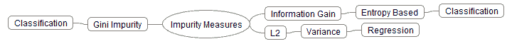
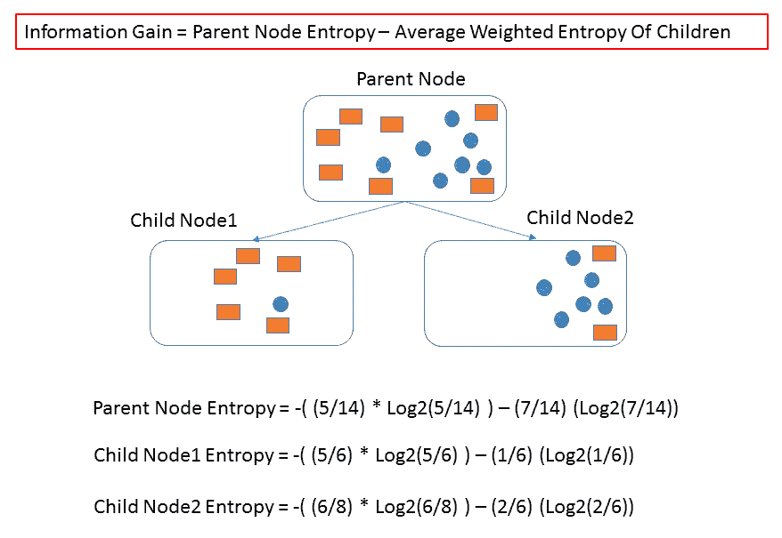
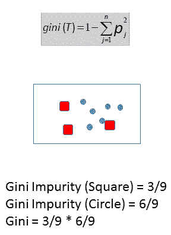
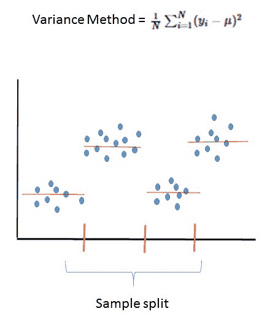
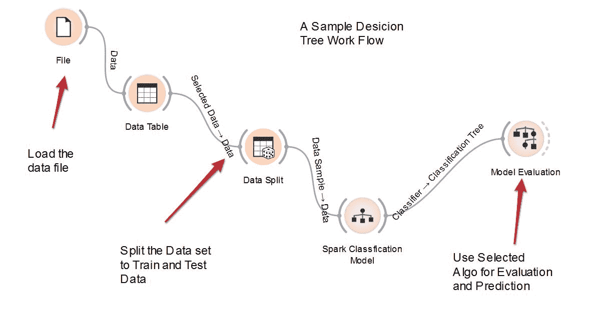

# 十、使用决策树和集成模型构建机器学习系统

在本章中，我们将介绍:

*   获取和准备真实世界的医疗数据，用于探索 Spark 2.0 中的决策树和集成模型
*   在 Spark 2.0 中用决策树构建分类系统
*   在 Spark 2.0 中用决策树解决回归问题
*   在 Spark 2.0 中用随机森林树构建分类系统
*   在 Spark 2.0 中用随机森林树解决回归问题
*   在 Spark 2.0 中使用梯度增强树(GBT)构建分类系统
*   用 Spark 2.0 中的梯度增强树(GBT)解决回归问题

# 介绍

决策树是商业中最古老、应用最广泛的机器学习方法之一。使它们受欢迎的不仅是它们处理更复杂的划分和分割的能力(它们比线性模型更灵活)，而且它们能够解释我们是如何得出解决方案的，以及“为什么”结果被预测或分类为类/标签。

Apache Spark 提供了基于决策树的算法的良好组合，完全能够利用 Spark 中的并行性。实现范围从直接的单决策树(CART 类型算法)到集成树，例如随机森林树和 **GBT** ( **梯度增强树**)。它们都有不同的风格，便于分类(例如，分类的，如身高=矮/高)或回归(例如，连续的，如身高= 2.5 米)。

下图描绘了一个思维导图，显示了撰写本文时决策树算法的 Spark ML 库覆盖范围:


快速思考决策树算法的一种方法是将其作为一种智能划分算法，该算法试图最小化损失函数(例如，L2 或最小二乘法)，因为它划分范围以得到最适合数据决策边界的分段空间。通过应用采样数据和尝试特征组合来组装更复杂的集成模型，算法变得更加复杂，其中每个学习者(部分样本或特征组合)都可以投票决定最终结果。

下图描述了一个简化版本，其中训练了一个简单的二叉树(树桩)来将数据分成属于两种不同颜色的段(例如，健康患者/患病患者)。该图描绘了一个简单的算法，该算法在每次建立决策边界(因此分类)时将 x/y 特征空间分成两半，同时将错误数量降至最低(例如，L2 最小二乘度量):


下图提供了一个相应的树，因此我们可以根据建议的分割空间可视化算法(在本例中，是一个简单的分治法)。决策树算法之所以受欢迎，是因为它们能够以一种无需太多数学运算就能轻松传达给业务用户的语言来显示分类结果:


Spark 中的决策树是一种并行算法，旨在将单个树拟合并成长为可以分类(分类)或连续(回归)的数据集。这是一种基于树桩(二进制分割等)的贪婪算法，它递归地划分解空间，同时尝试使用信息增益最大化(基于熵)在所有可能的分割中选择最佳分割。

# 集合模型

看待 Spark 提供的决策树的另一种方式是将该算法视为属于两个阵营。我们在前面的介绍中看到的第一个阵营关注的是单个树，它试图找到各种技术来为数据集找到最佳的单个树。虽然这对于许多数据集来说是可以的，但是算法的贪婪本质会导致意想不到的后果，例如过度拟合和过深以至于无法捕获训练数据中的所有边界(也就是说，它被过度优化)。

为了克服过拟合问题并提高预测的准确性和质量，Spark 实现了两类集成决策树模型，试图创建许多不完美的学习者，这些学习者要么看到数据子集(有或没有替换的采样)和/或特征子集。虽然每个单独的树不太精确，但是树的集合投票(或者在连续变量的情况下的平均概率)和结果平均比任何单独的树精确得多:

*   **随机森林**:该方法并行创建多棵树，然后对结果进行投票/平均，以最小化单棵树算法中容易出现的过拟合问题。它们能够捕捉非线性和特征交互，无需任何缩放。它们应该被认真考虑，至少作为第一批用来剖析数据和理解其构成的工具集之一。下图为 Spark 中的这一实施提供了直观的指导:


*   **梯度增强树** : 这种方法是另一种集成模型，其中许多树的平均值(即使它们不太完美)提高了预测的准确性和质量。它们与随机森林的不同之处在于，它们一次构建一棵树，并且每棵树都试图通过最小化损失函数来学习前一棵树的缺点。它们类似于梯度下降的概念，但它们使用最小化(类似于梯度)来选择和改进下一棵树(它们沿着创建最佳精度的树的方向行走)。

损失函数的三个选项是:

*   **日志丢失**:分类可能性为负
*   **L2** :回归最小二乘法
*   **L1** :回归绝对误差

下图提供了一个易于使用的可视化参考:


Spark 中决策树的主要包在 ML 中，如下所示:

```scala
org.apache.spark.mllib.treeorg.apache.spark.mllib.tree.configurationorg.apache.spark.mllib.tree.impurityorg.apache.spark.mllib.tree.model
```

# 杂质的测量

利用所有的机器学习算法，我们试图最小化一组成本函数，帮助我们选择最佳的移动。Spark 使用三种可能的选择来实现最大化功能。下图描述了替代方案:



在本节中，我们将讨论三种可能的选择:

*   **信息增益** : 粗略地说，这是基于熵的概念来衡量一个群体中的杂质水平——见香农信息论，然后正如昆兰后来在他的 ID3 算法中所建议的那样。

熵的计算如下式所示:


信息增益帮助我们在每个特征向量空间中选择一个属性，该属性最有助于将类彼此分开。我们使用这个属性来决定如何对给定树的节点中的属性进行排序(从而影响决策边界)。

下图直观地描述了计算过程，便于理解。在第一步中，我们希望选择一个属性，以便在根或父节点中最大化 IG(信息增益)，然后为所选属性的每个值(它们的关联向量)构建子节点。我们不断递归地重复算法，直到我们看不到任何收益:



*   **基尼指数:**这试图通过隔离阶层来提高 IG(信息增益)，从而将最大的阶层从人口中分离出来。基尼指数与熵有点不同，因为你试图进行 50/50 的分割，然后应用进一步的分割来推断解决方案。它旨在反映一个变量的影响，而不是将其范围扩展到多属性状态。它对人口使用简单的频率计数。对于更高维、更嘈杂的数据，使用基尼系数。

如果你有复杂的多维数据，并且你试图从集合中剖析一个简单的信号，那么使用基尼杂质。

另一方面，使用信息增益(或任何基于熵的系统)，在那里你有一个更干净和低维的数据集，但你正在寻找一个更复杂(在准确性和质量方面)的数据集:



*   **方差**:方差用于表示树算法的回归模型。简而言之，我们仍然试图最小化 L2 函数，但不同的是，这里我们寻求最小化观测值的距离平方和所考虑的节点(段)的平均值。

下图描述了可视化的简化版本:



用于评估分类和树模型回归的Spark模型评估工具如下所示:

混淆矩阵是一个表，用于描述分类模型的性能，测试数据集中的真实值是已知的。混淆矩阵本身比较简单；它是一个 2 x 2 矩阵:

|  |  | **预测** | **值** |
|  |  | 是 | 不 |
| **实际** | 是 | 真阳性 | 假阴性 |
| **值** | 不 | 假阳性 | 真负值 |

对于我们的癌症数据集:

*   **真阳性(TP):** 这些是我们预测是的病例，他们确实患有乳腺癌
*   **真阴性(TN):** 那些是我们预测没有的病例，他们没有乳腺癌
*   **假阳性(FP):** 我们预测是的，但是他们没有乳腺癌
*   **假阴性(FN):** 我们预测没有，但他们确实患有乳腺癌

一个好的分类系统应该与现实紧密匹配，有好的总磷和总氮值，而有较少的磷和氮值。

总体而言，以下术语也用作分类模型的标记:

1.  **精度**:模型的正确率:
    *   (TP+TN)/合计
2.  **错误**:总体来说，模型错误的百分比:
    *   (FP+fn)/合计
    *   也等于 1 -精度

在Spark机器学习库中，有一个实用程序类来处理上述公共矩阵的计算:

```scala
   org.apache.spark.mllib.evaluation.MulticlassMetrics 
```

我们将在下面的示例代码中使用实用程序类。

类似地，对于回归算法，**均方误差(MSE)**或误差平方的平均值被很好地用作模型测量的关键参数。在Spark机器学习库中，也有一个实用程序类，它将提供回归模型的关键指标:

```scala
   org.apache.spark.mllib.evaluation.RegressionMetrics 
```

Spark Matrix Evaluator 的文档可在[http://Spark . Apache . org/docs/latest/API/Scala/index . html # org . Apache . Spark . mllib . evaluation . multi classmetrics](http://spark.apache.org/docs/latest/api/scala/index.html#org.apache.spark.mllib.evaluation.MulticlassMetrics)和[http://Spark . Apache . org/docs/latest/API/Scala/index . html # org . Apache . Spark . mllib . evaluation . reversionmetrics](http://spark.apache.org/docs/latest/api/scala/index.html#org.apache.spark.mllib.evaluation.RegressionMetrics)[找到。](http://spark.apache.org/docs/latest/api/scala/index.html#org.apache.spark.mllib.evaluation.MulticlassMetrics)

# 获取和准备真实世界的医疗数据，用于探索 Spark 2.0 中的决策树和集成模型

所使用的数据集描述了决策树在机器学习中的实际应用。我们使用癌症数据集来预测是什么使患者的病例恶性与否。为了探索决策树的真正功能，我们使用了一个医学数据集，该数据集展示了具有复杂误差表面的真实非线性。

# 怎么做...

威斯康星乳腺癌数据集是从威斯康星大学医院的威廉·沃尔伯格博士那里获得的。沃尔伯格医生在报告他的临床病例时，会定期获取数据集。

该数据集可以从多个来源检索，并可直接从加州大学欧文分校的网络服务器[获得](http://archive.ics.uci.edu/ml/machine-learning-databases/breast-cancer-wisconsin/breast-cancer-wisconsin.data)

这些数据也可以从威斯康星大学的网络服务器[上获得](ftp://ftp.cs.wisc.edu/math-prog/cpo-dataset/machine-learn/cancer/cancer1/datacum)

该数据集目前包含 1989 年至 1991 年的临床病例。共 699 例，其中 458 例为良性肿瘤，241 例为恶性肿瘤。每个实例由 9 个属性描述，这些属性具有 1 到 10 范围内的整数值和一个二进制类标签。在 699 个实例中，有 16 个实例缺少某些属性。

我们将从内存中删除这 16 个实例，并为模型计算处理其余的实例(总共 683 个实例)。

原始数据示例如下所示:

```scala
1000025,5,1,1,1,2,1,3,1,1,21002945,5,4,4,5,7,10,3,2,1,21015425,3,1,1,1,2,2,3,1,1,21016277,6,8,8,1,3,4,3,7,1,21017023,4,1,1,3,2,1,3,1,1,21017122,8,10,10,8,7,10,9,7,1,4...
```

属性信息如下:

| **#** | **属性** | **域** |
| one | 样本代码号 | 识别号 |
| Two | 团块厚度 | 1 - 10 |
| three | 细胞大小的均匀性 | 1 - 10 |
| four | 细胞形状的均匀性 | 1 - 10 |
| five | 边缘附着力 | 1 - 10 |
| six | 单个上皮细胞大小 | 1 - 10 |
| seven | 裸核 | 1 - 10 |
| eight | 淡黄色染色质 | 1 - 10 |
| nine | 正常核仁 | 1 - 10 |
| Ten | 神话故事 | 1 - 10 |
| Eleven | 班级 | (良性 2 例，恶性 4 例) |

如果在正确的列中显示，它将如下所示:

| **IDNumber** | **团块厚度** | **细胞大小的均匀性** | **细胞形状的均匀性** | **边缘附着力** | **单个上皮细胞大小** | **裸核仁** | **平淡无奇的染色质** | **正常核仁** | **神话** | **级** |
| One million and twenty-five | five | one | one | one | Two | one | three | one | one | Two |
| One million two thousand nine hundred and forty-five | five | four | four | five | seven | Ten | three | Two | one | Two |
| One million fifteen thousand four hundred and twenty-five | three | one | one | one | Two | Two | three | one | one | Two |
| One million sixteen thousand two hundred and seventy-seven | six | eight | eight | one | three | four | three | seven | one | Two |
| One million seventeen thousand and twenty-three | four | one | one | three | Two | one | three | one | one | Two |
| One million seventeen thousand one hundred and twenty-two | eight | Ten | Ten | eight | seven | Ten | nine | seven | one | four |
| One million eighteen thousand and ninety-nine | one | one | one | one | Two | Ten | three | one | one | Two |
| One million eighteen thousand five hundred and sixty-one | Two | one | Two | one | Two | one | three | one | one | Two |
| One million thirty-three thousand and seventy-eight | Two | one | one | one | Two | one | one | one | five | Two |
| One million thirty-three thousand and seventy-eight | four | Two | one | one | Two | one | Two | one | one | Two |
| One million thirty-five thousand two hundred and eighty-three | one | one | one | one | one | one | three | one | one | Two |
| One million thirty-six thousand one hundred and seventy-two | Two | one | one | one | Two | one | Two | one | one | Two |
| One million forty-one thousand eight hundred and one | five | three | three | three | Two | three | four | four | one | four |
| One million forty-three thousand nine hundred and ninety-nine | one | one | one | one | Two | three | three | one | one | Two |
| One million forty-four thousand five hundred and seventy-two | eight | seven | five | Ten | seven | nine | five | five | four | four |
| ... | ... | ... | ... | ... | ... | ... | ... | ... | ... | ... |

# 还有更多...

威斯康星乳腺癌数据集广泛用于机器学习社区。数据集包含有限的属性，并且大多数是离散的数字。将分类算法和回归模型应用于数据集非常容易。

已经有 20 多篇研究论文和出版物引用了这个数据集，它是公开的，非常容易使用。

数据集具有多元数据类型，其中属性是整数，并且属性的数量只有 10。这使得它成为本章分类和回归分析的典型数据集之一。

# 在 Spark 2.0 中用决策树构建分类系统

在本食谱中，我们将使用乳腺癌数据并使用分类来演示决策树在 Spark 中的植入。我们将使用 IG 和 Gini 来展示如何使用 Spark 已经提供的设施，以避免冗余编码。该方法试图使用二元分类来拟合单个树，以训练和预测数据集的标签(良性(0.0)和恶性(1.0))。

# 怎么做

1.  在 IntelliJ 或您选择的 IDE 中启动一个新项目。确保包含必要的 JAR 文件。

2.  设置程序将驻留的包位置:

```scala
package spark.ml.cookbook.chapter10
```

3.  为 Spark 上下文导入必要的包以访问集群并`Log4j.Logger`减少 Spark 产生的输出量:

```scala
import org.apache.spark.mllib.evaluation.MulticlassMetricsimport org.apache.spark.mllib.tree.DecisionTreeimport org.apache.spark.mllib.linalg.Vectorsimport org.apache.spark.mllib.regression.LabeledPointimport org.apache.spark.mllib.tree.model.DecisionTreeModelimport org.apache.spark.rdd.RDDimport org.apache.spark.sql.SparkSessionimport org.apache.log4j.{Level, Logger} 
```

4.  创建Spark的配置和Spark会话，以便我们可以访问集群:

```scala
Logger.getLogger("org").setLevel(Level.ERROR)val spark = SparkSession.builder*.master(**"local[*]"**).appName(**"MyDecisionTreeClassification"**).config(**"spark.sql.warehouse.dir"**, **"."**).getOrCreate()*
```

 *5.  我们在原始原始数据文件中读到:

```scala
val rawData = spark.sparkContext.textFile("../data/sparkml2/chapter10/breast-cancer-wisconsin.data")
```

6.  我们预处理数据集:

```scala
val data = rawData.map(_.trim).filter(text => !(text.isEmpty || text.startsWith("#") || text.indexOf("?") > -1)).map { line =>val values = line.split(',').map(_.toDouble)val slicedValues = values.slice(1, values.size)val featureVector = Vectors.dense(slicedValues.init)val label = values.last / 2 -1LabeledPoint(label, featureVector)}
```

首先，我们修剪线条并删除任何空白。一旦该行准备好进行下一步，如果它是空的，或者如果它包含缺少的值("？"，我们就删除该行).在此步骤之后，将从内存中的数据集中删除 16 行缺失的数据。

然后，我们将逗号分隔值读入 RDD。由于数据集中的第一列只包含实例的标识号，因此最好从实际计算中删除该列。我们用下面的命令将它分割开来，这将从 RDD 中删除第一列:

```scala
val slicedValues = values.slice(1, values.size)
```

然后我们把剩下的数字放入一个密集的向量中。

由于威斯康星乳腺癌数据集的分类器要么是良性病例(最后一列值= 2)，要么是恶性病例(最后一列值= 4)，因此我们使用以下命令转换前面的值:

```scala
val label = values.last / 2 -1
```

因此良性病例 2 转换为 0，恶性病例值 4 转换为 1，这将使后面的计算更加容易。然后，我们将前一行放入一个`Labeled Points`:

```scala
    Raw data: 1000025,5,1,1,1,2,1,3,1,1,2Processed Data: 5,1,1,1,2,1,3,1,1,0Labeled Points: (0.0, [5.0,1.0,1.0,1.0,2.0,1.0,3.0,1.0,1.0])
```

7.  我们验证原始数据计数并处理数据计数:

```scala
println(rawData.count())println(data.count())
```

您将在控制台上看到以下内容:

```scala
699683
```

8.  我们将整个数据集随机分为训练数据(70%)和测试数据(30%)。请注意，随机拆分将生成大约 211 个测试数据集。它大约是但不完全是数据集的 30%:

```scala
val splits = data.randomSplit(Array(0.7, 0.3))val (trainingData, testData) = (splits(0), splits(1))
```

9.  我们定义了一个度量计算函数，它利用了 Spark `MulticlassMetrics`:

```scala
def getMetrics(model: DecisionTreeModel, data: RDD[LabeledPoint]): MulticlassMetrics = {val predictionsAndLabels = data.map(example =>(model.predict(example.features), example.label))new MulticlassMetrics(predictionsAndLabels)}
```

这个函数将读入模型和测试数据集，并创建一个包含前面提到的混淆矩阵的度量。它将包含模型精度，这是分类模型的指标之一。

10.  我们定义了一个评估函数，它可以为决策树模型获取一些可调参数，并对数据集进行训练:

```scala
def evaluate(trainingData: RDD[LabeledPoint],testData: RDD[LabeledPoint],numClasses: Int,categoricalFeaturesInfo: Map[Int,Int],impurity: String,maxDepth: Int,maxBins:Int) :Unit = {val model = DecisionTree.*trainClassifier*(trainingData, numClasses,categoricalFeaturesInfo,impurity, maxDepth, maxBins)val metrics = getMetrics(model, testData)println("Using Impurity :"+ impurity)println("Confusion Matrix :")println(metrics.confusionMatrix)println("Decision Tree Accuracy: "+metrics.*precision*)println("Decision Tree Error: "+ (1-metrics.*precision*))}
```

评估函数将读入几个参数，包括杂质类型(模型的基尼系数或熵值)，并生成评估指标。

11.  我们设置了以下参数:

```scala
val numClasses = 2val categoricalFeaturesInfo = *Map*[Int, Int]()val maxDepth = 5val maxBins = 32
```

因为我们只有良性(0.0)和恶性(1.0)，所以我们把 numClasses 设为 2。其他参数是可调的，其中一些是算法停止标准。

12.  我们先评价基尼杂质:

```scala
evaluate(trainingData, testData, numClasses, categoricalFeaturesInfo,"gini", maxDepth, maxBins)
```

从控制台输出:

```scala
Using Impurity :giniConfusion Matrix :115.0 5.00 88.0Decision Tree Accuracy: 0.9620853080568721Decision Tree Error: 0.03791469194312791To interpret the above Confusion metrics, Accuracy is equal to (115+ 88)/ 211 all test cases, and error is equal to 1 -accuracy
```

13.  我们评估熵杂质:

```scala
evaluate(trainingData, testData, numClasses, categoricalFeaturesInfo,"entropy", maxDepth, maxBins)
```

从控制台输出:

```scala
Using Impurity:entropyConfusion Matrix:116.0 4.09.0 82.0Decision Tree Accuracy: 0.9383886255924171Decision Tree Error: 0.06161137440758291To interpret the preceding confusion metrics, accuracy is equal to (116+ 82)/ 211 for all test cases, and error is equal to 1 - accuracy
```

14.  然后，我们通过停止会话来关闭程序:

```scala
spark.stop()
```

# 它是如何工作的...

数据集比通常的要复杂一点，但是除了一些额外的步骤之外，解析它仍然和前面章节中介绍的其他方法一样。解析以原始形式获取数据，并将其转换为中间格式，最终形成标签点数据结构，这在 Spark ML 方案中很常见:

```scala
     Raw data: 1000025,5,1,1,1,2,1,3,1,1,2Processed Data: 5,1,1,1,2,1,3,1,1,0
     Labeled Points: (0.0, [5.0,1.0,1.0,1.0,2.0,1.0,3.0,1.0,1.0])
```

我们使用`DecisionTree.trainClassifier()`在训练集上训练分类器树。接下来，我们通过检查各种杂质和混淆矩阵的测量来演示如何测量树模型的有效性。

鼓励读者查看输出并查阅其他机器学习书籍，以理解混淆矩阵和杂质测量的概念，从而掌握决策树和 Spark 中的变化。

# 还有更多...

为了更好地可视化它，我们在 Spark 中包含了一个示例决策树工作流，它将首先将数据读入 Spark。在我们的例子中，我们从文件中创建 RDD。然后，我们使用随机采样函数将数据集分为训练数据和测试数据。

分割数据集后，我们使用训练数据集来训练模型，然后使用测试数据来测试模型的准确性。一个好的模型应该有一个有意义的精度值(接近 1)。下图描述了工作流程:



基于威斯康星乳腺癌数据集生成了一个样本树。红色的点代表恶性病例，蓝色的代表良性病例。我们可以在下图中直观地检查树:


# 请参见

*   构造器的文档可在以下网址找到:[http://spark . Apache . org/docs/latest/API/Scala/index . html # org . Apache . spark . mllib . tree . decision tree](http://spark.apache.org/docs/latest/api/scala/index.html#org.apache.spark.mllib.tree.DecisionTree)和[http://spark . Apache . org/docs/latest/API/Scala/index . html # org . Apache . spark . mllib . tree . model . decision tree model](http://spark.apache.org/docs/latest/api/scala/index.html#org.apache.spark.mllib.tree.model.DecisionTreeModel)
*   Spark矩阵评估器的文档可在[http://Spark . Apache . org/docs/latest/API/Scala/index . html # org . Apache . Spark . mllib . evaluation . multiclass metrics](http://spark.apache.org/docs/latest/api/scala/index.html#org.apache.spark.mllib.evaluation.MulticlassMetrics)上找到

# 在 Spark 2.0 中用决策树解决回归问题

类似于前面的食谱，我们将使用`DecisionTree()`类来训练和预测使用回归树模型的结果。刷新所有这些模型是 **CART** ( **分类和回归树**的变体，有两种模式。在这个配方中，我们探索了用于 Spark 中决策树实现的回归 API。

# 怎么做...

1.  在 IntelliJ 或您选择的 IDE 中启动一个新项目。确保包含必要的 JAR 文件。

2.  设置程序将驻留的包位置:

```scala
package spark.ml.cookbook.chapter10
```

3.  为 Spark 上下文导入必要的包以访问集群并`Log4j.Logger`减少 Spark 产生的输出量:

```scala
import org.apache.spark.mllib.evaluation.RegressionMetricsimport org.apache.spark.mllib.linalg.Vectorsimport org.apache.spark.mllib.regression.LabeledPointimport org.apache.spark.mllib.tree.DecisionTreeimport org.apache.spark.mllib.tree.model.DecisionTreeModelimport org.apache.spark.rdd.RDDimport org.apache.spark.sql.SparkSessionimport org.apache.log4j.{Level, Logger}
```

4.  创建Spark的配置和Spark会话，以便我们可以访问集群:

```scala
Logger.getLogger("org").setLevel(Level.*ERROR*)val spark = SparkSession.builder*.master(**"local[*]"**).appName(**"MyDecisionTreeRegression"**).config(**"spark.sql.warehouse.dir"**, **"."**).getOrCreate()*
```

 *5.  我们在原始原始数据文件中读到:

```scala
val rawData = spark.sparkContext.textFile("../data/sparkml2/chapter10/breast-cancer-wisconsin.data")
```

6.  我们预处理数据集(有关详细信息，请参见前面的代码):

```scala
val data = rawData.map(_.trim).filter(text => !(text.isEmpty || text.startsWith("#") || text.indexOf("?") > -1)).map { line =>val values = line.split(',').map(_.toDouble)val slicedValues = values.slice(1, values.size)val featureVector = Vectors.dense(slicedValues.init)val label = values.last / 2 -1LabeledPoint(label, featureVector)}
```

7.  我们验证原始数据计数并处理数据计数:

```scala
println(rawData.count())println(data.count())
```

您将在控制台上看到以下内容:

```scala
699683
```

8.  我们将整个数据集分为训练数据(70%)和测试数据(30%)集:

```scala
val splits = data.randomSplit(Array(0.7, 0.3))val (trainingData, testData) = (splits(0), splits(1))
```

9.  我们定义了一个度量计算函数，它利用了 Spark `RegressionMetrics`:

```scala
def getMetrics(model: DecisionTreeModel, data: RDD[LabeledPoint]): RegressionMetrics = {val predictionsAndLabels = data.map(example =>(model.predict(example.features), example.label))new RegressionMetrics(predictionsAndLabels)}
```

10.  我们设置了以下参数:

```scala
val categoricalFeaturesInfo = Map[Int, Int]()val impurity = "variance"val maxDepth = 5val maxBins = 32
```

11.  我们先评价基尼杂质:

```scala
val model = DecisionTree.trainRegressor(trainingData, categoricalFeaturesInfo, impurity, maxDepth, maxBins)val metrics = getMetrics(model, testData)println("Test Mean Squared Error = " + metrics.meanSquaredError)println("My regression tree model:\n" + model.toDebugString)
```

从控制台输出:

```scala
Test Mean Squared Error = 0.037363769271664016My regression tree model:DecisionTreeModel regressor of depth 5 with 37 nodesIf (feature 1 <= 3.0)If (feature 5 <= 3.0)If (feature 0 <= 6.0)If (feature 7 <= 3.0)Predict: 0.0Else (feature 7 > 3.0)If (feature 0 <= 4.0)Predict: 0.0Else (feature 0 > 4.0)Predict: 1.0Else (feature 0 > 6.0)If (feature 2 <= 2.0)Predict: 0.0Else (feature 2 > 2.0)If (feature 4 <= 2.0)Predict: 0.0Else (feature 4 > 2.0)Predict: 1.0Else (feature 5 > 3.0)If (feature 1 <= 1.0)If (feature 0 <= 5.0)Predict: 0.0Else (feature 0 > 5.0)Predict: 1.0Else (feature 1 > 1.0)If (feature 0 <= 6.0)If (feature 7 <= 4.0)Predict: 0.875Else (feature 7 > 4.0)Predict: 0.3333333333333333Else (feature 0 > 6.0)Predict: 1.0Else (feature 1 > 3.0)If (feature 1 <= 4.0)If (feature 4 <= 6.0)If (feature 5 <= 7.0)If (feature 0 <= 8.0)Predict: 0.3333333333333333Else (feature 0 > 8.0)Predict: 1.0Else (feature 5 > 7.0)Predict: 1.0Else (feature 4 > 6.0)Predict: 0.0Else (feature 1 > 4.0)If (feature 3 <= 1.0)If (feature 0 <= 6.0)If (feature 0 <= 5.0)Predict: 1.0Else (feature 0 > 5.0)Predict: 0.0Else (feature 0 > 6.0)Predict: 1.0Else (feature 3 > 1.0)Predict: 1.0
```

12.  然后，我们通过停止Spark会话来关闭程序:

```scala
spark.stop()
```

# 它是如何工作的...

我们使用相同的数据集，但这次我们使用决策树来解决数据的回归问题。值得注意的是指标计算功能的创建，它利用了 Spark `RegressionMetrics()`:

```scala
def getMetrics(model: DecisionTreeModel, data: RDD[LabeledPoint]): RegressionMetrics = {val predictionsAndLabels = data.map(example =>(model.predict(example.features), example.label))new RegressionMetrics(predictionsAndLabels)}
```

然后，我们使用`DecisionTree.trainRegressor()`进行实际回归，并获得杂质测量值(GINI)。然后，我们继续输出实际的回归，它是一系列决策节点/分支以及用于在给定分支做出决策的值:

```scala
If (feature 0 <= 4.0)Predict: 0.0Else (feature 0 > 4.0)Predict: 1.0Else (feature 0 > 6.0)If (feature 2 <= 2.0)Predict: 0.0Else (feature 2 > 2.0)If (feature 4 <= 2.0).......................
```

# 请参见

*   构造器的文档可以在以下网址中找到[http://spark . Apache . org/docs/latest/API/Scala/index . html # org . Apache . spark . mllib . tree . decision tree](http://spark.apache.org/docs/latest/api/scala/index.html#org.apache.spark.mllib.tree.DecisionTree)和[http://spark . Apache . org/docs/latest/API/Scala/index . html # org . Apache . spark . mllib . tree . model . decision tree model](http://spark.apache.org/docs/latest/api/scala/index.html#org.apache.spark.mllib.tree.model.DecisionTreeModel)
*   Spark矩阵评估器的文档可在[上找到](http://spark.apache.org/docs/latest/api/scala/index.html#org.apache.spark.mllib.evaluation.RegressionMetrics)

# 在 Spark 2.0 中用随机森林树构建分类系统

在这个食谱中，我们将探索Spark中的随机森林实现。我们将使用随机森林技术来解决离散分类问题。由于 Spark 对并行性的利用(一次生长许多树)，我们发现随机森林实现非常快。我们也不需要太担心超参数，从技术上来说，我们只需要设置树的数量就可以了。

# 怎么做...

1.  在 IntelliJ 或您选择的 IDE 中启动一个新项目。确保包含必要的 JAR 文件。

2.  设置程序将驻留的包位置:

```scala
package spark.ml.cookbook.chapter10
```

3.  为 Spark 上下文导入必要的包以访问集群并`Log4j.Logger`减少 Spark 产生的输出量:

```scala
import org.apache.spark.mllib.evaluation.MulticlassMetricsimport org.apache.spark.mllib.linalg.Vectorsimport org.apache.spark.mllib.regression.LabeledPointimport org.apache.spark.mllib.tree.model.RandomForestModelimport org.apache.spark.rdd.RDDimport org.apache.spark.mllib.tree.RandomForestimport org.apache.spark.sql.SparkSessionimport org.apache.log4j.{Level, Logger}
```

4.  创建Spark的配置和Spark会话，以便我们可以访问集群:

```scala
Logger.getLogger("org").setLevel(Level.*ERROR*)val spark = SparkSession.builder*.master(**"local[*]"**).appName(**"MyRandomForestClassification"**).config(**"spark.sql.warehouse.dir"**, **"."**).getOrCreate()*
```

 *5.  我们在原始原始数据文件中读到:

```scala
val rawData = spark.sparkContext.textFile("../data/sparkml2/chapter10/breast-cancer-wisconsin.data")
```

6.  我们对数据集进行预处理(有关详细信息，请参见前面的会话):

```scala
val data = rawData.map(_.trim).filter(text => !(text.isEmpty || text.startsWith("#") || text.indexOf("?") > -1)).map { line =>val values = line.split(',').map(_.toDouble)val slicedValues = values.slice(1, values.size)val featureVector = Vectors.*dense*(slicedValues.init)val label = values.last / 2 -1LabeledPoint(label, featureVector)}
```

7.  我们验证原始数据计数并处理数据计数:

```scala
println("Training Data count:"+trainingData.count())println("Test Data Count:"+testData.count())
```

您将在控制台中看到以下内容:

```scala
Training Data count: 501 
Test Data Count: 182
```

8.  我们将整个数据集随机分为训练数据(70%)和测试数据(30%):

```scala
val splits = data.randomSplit(Array(0.7, 0.3))val (trainingData, testData) = (splits(0), splits(1))
```

9.  我们定义了一个度量计算函数，它利用了 Spark `MulticlassMetrics`:

```scala
def getMetrics(model: RandomForestModel, data: RDD[LabeledPoint]): MulticlassMetrics = {val predictionsAndLabels = data.map(example =>(model.predict(example.features), example.label))new MulticlassMetrics(predictionsAndLabels)}
```

这个函数将读入模型和测试数据集，并创建包含前面提到的混淆矩阵的度量。它将包含模型精度，这是分类模型的指标之一。

10.  我们定义了一个评估函数，它可以为随机森林模型获取一些可调参数，并对数据集进行训练:

```scala
def evaluate(trainingData: RDD[LabeledPoint],testData: RDD[LabeledPoint],numClasses: Int,categoricalFeaturesInfo: Map[Int,Int],numTrees: Int,featureSubsetStrategy: String,impurity: String,maxDepth: Int,maxBins:Int) :Unit = {val model = RandomForest.*trainClassifier*(trainingData, numClasses, categoricalFeaturesInfo, numTrees, featureSubsetStrategy,impurity, maxDepth, maxBins)val metrics = *getMetrics*(model, testData)println("Using Impurity :"+ impurity)println("Confusion Matrix :")println(metrics.confusionMatrix)println("Model Accuracy: "+metrics.*precision*)println("Model Error: "+ (1-metrics.*precision*))}
```

评估函数将读入几个参数，包括杂质类型(模型的基尼系数或熵值)，并生成评估指标。

11.  我们设置了以下参数:

```scala
val numClasses = 2val categoricalFeaturesInfo = *Map*[Int, Int]()val numTrees = 3 *// Use more in practice.*val featureSubsetStrategy = "auto" *// Let the algorithm choose.* val maxDepth = 4val maxBins = 32
```

12.  我们先评价基尼杂质:

```scala
evaluate(trainingData, testData, numClasses,categoricalFeaturesInfo,numTrees,featureSubsetStrategy, "gini", maxDepth, maxBins)
```

从控制台输出:

```scala
Using Impurity :giniConfusion Matrix :118.0 1.04.0 59.0Model Accuracy: 0.9725274725274725Model Error: 0.027472527472527486To interpret the above Confusion metrics, Accuracy is equal to (118+ 59)/ 182 all test cases, and error is equal to 1 -accuracy
```

13.  我们评估熵杂质:

```scala
evaluate(trainingData, testData, numClasses, categoricalFeaturesInfo,"entropy", maxDepth, maxBins)
```

从控制台输出:

```scala
Using Impurity :entropyConfusion Matrix :115.0  4.0   0.0    63.0Model Accuracy: 0.978021978021978Model Error: 0.02197802197802201             To interpret the above Confusion metrics, Accuracy is equal to (115+ 63)/ 182 all test cases, and error is equal to 1 -accuracy
```

14.  然后，我们通过停止Spark会话来关闭程序:

```scala
spark.stop()
```

# 它是如何工作的...

数据与前面配方中的数据相同，但我们使用随机森林和多指标应用编程接口来解决分类问题:

*   `RandomForest.trainClassifier()`
*   `MulticlassMetrics()`

对于随机森林树，我们有很多选择，可以调整这些选择来获得正确的边缘，以便对复杂的表面进行分类。这里列出了一些参数:

```scala
 val numClasses = 2val categoricalFeaturesInfo = *Map*[Int, Int]()val numTrees = 3 // Use more in practice. ***val** featureSubsetStrategy = **"auto"** // Let the algorithm choose. ***val** maxDepth = 4**val** maxBins = 32**
```

 **值得注意的是这个食谱中的混乱矩阵。混淆矩阵通过`MulticlassMetrics()` API 调用获得。为了解释前面的混淆度量，所有测试用例的准确度等于(118+ 59)/ 182，误差等于 1-准确度:

```scala
Confusion Matrix :118.0 1.04.0 59.0Model Accuracy: 0.9725274725274725Model Error: 0.027472527472527486
```

# 请参见

*   构造器的文档可在以下网址中找到[http://spark . Apache . org/docs/latest/API/Scala/index . html # org . Apache . spark . mllib . tree . randomforest $](http://spark.apache.org/docs/latest/api/scala/index.html#org.apache.spark.mllib.tree.RandomForest%24)[和](http://spark.apache.org/docs/latest/api/scala/index.html#org.apache.spark.mllib.tree.RandomForest%24)[http://spark . Apache . org/docs/latest/API/Scala/index . html # org . Apache . spark . mllib . tree . model . randomforestmodel](http://spark.apache.org/docs/latest/api/scala/index.html#org.apache.spark.mllib.tree.model.RandomForestModel)
*   Spark矩阵评估器的文档可在[http://Spark . Apache . org/docs/latest/API/Scala/index . html # org . Apache . Spark . mllib . evaluation . multiclass metrics](http://spark.apache.org/docs/latest/api/scala/index.html#org.apache.spark.mllib.evaluation.MulticlassMetrics)上找到

# 在 Spark 2.0 中用随机森林树解决回归问题

这类似于前面的食谱，但是我们使用随机森林树来解决回归问题(连续的)。以下参数用于指导算法应用回归而不是分类。我们再次将班级数量限制为两个:

```scala
val impurity = "variance" // USE variance for regression
```

# 怎么做...

1.  在 IntelliJ 或您选择的 IDE 中启动一个新项目。确保包含必要的 JAR 文件。

2.  设置程序将驻留的包位置:

```scala
package spark.ml.cookbook.chapter10
```

3.  从 Spark 导入必要的包:

```scala
import org.apache.spark.mllib.evaluation.RegressionMetricsimport org.apache.spark.mllib.linalg.Vectorsimport org.apache.spark.mllib.regression.LabeledPointimport org.apache.spark.mllib.tree.model.RandomForestModelimport org.apache.spark.rdd.RDDimport org.apache.spark.mllib.tree.RandomForestimport org.apache.spark.sql.SparkSessionimport org.apache.log4j.{Level, Logger}
```

4.  创建Spark的配置和Spark会话:

```scala
Logger.getLogger("org").setLevel(Level.*ERROR*)val spark = SparkSession.builder*.master(**"local[*]"**).appName(**"MyRandomForestRegression"**).config(**"spark.sql.warehouse.dir"**, **"."**).getOrCreate()*
```

 *5.  我们在原始原始数据文件中读到:

```scala
val rawData = spark.sparkContext.textFile("../data/sparkml2/chapter10/breast-cancer-wisconsin.data")
```

6.  我们对数据集进行预处理(有关详细信息，请参见前面的会话):

```scala
val data = rawData.map(_.trim).filter(text => !(text.isEmpty || text.startsWith("#") || text.indexOf("?") > -1)).map { line =>val values = line.split(',').map(_.toDouble)val slicedValues = values.slice(1, values.size)val featureVector = Vectors.dense(slicedValues.init)val label = values.last / 2 -1LabeledPoint(label, featureVector)}
```

7.  我们将整个数据集随机分为训练数据(70%)和测试数据(30%):

```scala
val splits = data.randomSplit(Array(0.7, 0.3))val (trainingData, testData) = (splits(0), splits(1))println("Training Data count:"+trainingData.count())println("Test Data Count:"+testData.count())
```

您将在控制台上看到以下内容:

```scala
Training Data count:473Test Data Count:210
```

8.  我们定义了一个度量计算函数，它利用了 Spark `RegressionMetrics`:

```scala
def getMetrics(model: RandomForestModel, data: RDD[LabeledPoint]): RegressionMetrics = {val predictionsAndLabels = data.map(example =>(model.predict(example.features), example.label))new RegressionMetrics(predictionsAndLabels)}
```

9.  我们设置了以下参数:

```scala
val numClasses = 2val categoricalFeaturesInfo = Map[Int, Int]()val numTrees = 3 // Use more in practice.***val** featureSubsetStrategy = **"auto"** // Let the algorithm choose.***val** impurity = **"variance"** **val** maxDepth = 4**val** maxBins = 32**val** model = RandomForest.trainRegressor(trainingData, categoricalFeaturesInfo,numTrees, featureSubsetStrategy, impurity, maxDepth, maxBins)**val** metrics = getMetrics(model, testData)println("**Test Mean Squared Error = "** + metrics.meanSquaredError)println(**"My Random Forest model:\n"** + model.toDebugString)**
```

 **从控制台输出:

```scala
Test Mean Squared Error = 0.028681825568809653My Random Forest model:TreeEnsembleModel regressor with 3 treesTree 0:If (feature 2 <= 3.0)If (feature 7 <= 3.0)If (feature 4 <= 5.0)If (feature 0 <= 8.0)Predict: 0.006825938566552901Else (feature 0 > 8.0)Predict: 1.0Else (feature 4 > 5.0)Predict: 1.0Else (feature 7 > 3.0)If (feature 6 <= 3.0)If (feature 0 <= 6.0)Predict: 0.0Else (feature 0 > 6.0)Predict: 1.0Else (feature 6 > 3.0)Predict: 1.0Else (feature 2 > 3.0)If (feature 5 <= 3.0)If (feature 4 <= 3.0)If (feature 7 <= 3.0)Predict: 0.1Else (feature 7 > 3.0)Predict: 1.0Else (feature 4 > 3.0)If (feature 3 <= 3.0)Predict: 0.8571428571428571Else (feature 3 > 3.0)Predict: 1.0Else (feature 5 > 3.0)If (feature 5 <= 5.0)If (feature 1 <= 4.0)Predict: 0.75Else (feature 1 > 4.0)Predict: 1.0Else (feature 5 > 5.0)Predict: 1.0Tree 1:...
```

10.  然后，我们通过停止Spark会话来关闭程序:

```scala
spark.stop()
```

# 它是如何工作的...

我们使用数据集和随机森林树来解决数据的回归问题。解析和分离的机制保持不变，但是我们使用以下两个 API 进行树回归并评估结果:

*   `RandomForest.trainRegressor()`
*   `RegressionMetrics()`

值得注意的是利用 Spark 中的`RegressionMetrics()`设施的`getMetrics()`功能的定义:

```scala
def getMetrics(model: RandomForestModel, data: RDD[LabeledPoint]): RegressionMetrics = {val predictionsAndLabels = data.map(example =>(model.predict(example.features), example.label))new RegressionMetrics(predictionsAndLabels)}
```

我们还将杂质值设置为“方差”，这样我们就可以使用方差来测量误差:

```scala
val impurity = "variance" // use variance for regression
```

# 请参见

*   构造器的文档可在以下网址找到[http://spark . Apache . org/docs/latest/API/Scala/index . html # org . Apache . spark . mllib . tree . randomforest $](http://spark.apache.org/docs/latest/api/scala/index.html#org.apache.spark.mllib.tree.RandomForest%24)和[http://spark . Apache . org/docs/latest/API/Scala/index . html # org . Apache . spark . mllib . tree . model . randomforestmodel](http://spark.apache.org/docs/latest/api/scala/index.html#org.apache.spark.mllib.tree.model.RandomForestModel)
*   Spark Matrix Evaluator 文档:[http://Spark . Apache . org/docs/latest/API/Scala/index . html # org . Apache . Spark . mllib . evaluation . reversionmetrics](http://spark.apache.org/docs/latest/api/scala/index.html#org.apache.spark.mllib.evaluation.RegressionMetrics)

# 在 Spark 2.0 中使用梯度增强树(GBT)构建分类系统

在这个食谱中，我们将探索在 Spark 中梯度增强树(GBT)分类的实现。在决定最终结果之前，GBT 需要对超参数和多次尝试更加小心。人们必须记住，如果使用 GBT，种植矮树是完全可以的。

# 怎么做...

1.  在 IntelliJ 或您选择的 IDE 中启动一个新项目。确保包含必要的 JAR 文件。

2.  设置程序将驻留的包位置:

```scala
package spark.ml.cookbook.chapter10
```

3.  为Spark上下文导入必要的包:

```scala
import org.apache.spark.mllib.evaluation.MulticlassMetricsimport org.apache.spark.mllib.linalg.Vectorsimport org.apache.spark.mllib.regression.LabeledPointimport org.apache.spark.mllib.tree.model.GradientBoostedTreesModelimport org.apache.spark.rdd.RDDimport org.apache.spark.mllib.tree.GradientBoostedTreesimport org.apache.spark.mllib.tree.configuration.BoostingStrategyimport org.apache.spark.sql.SparkSessionimport org.apache.log4j.{Level, Logger}
```

4.  创建Spark的配置和Spark会话，以便我们可以访问集群:

```scala
Logger.getLogger("org").setLevel(Level.*ERROR*)val spark = SparkSession.builder*.master(**"local[*]"**).appName(**"MyGradientBoostedTreesClassification"**).config(**"spark.sql.warehouse.dir"**, **"."**).getOrCreate()*
```

 *5.  我们在原始原始数据文件中读到:

```scala
val rawData = spark.sparkContext.textFile("../data/sparkml2/chapter10/breast-cancer-wisconsin.data")
```

6.  我们对数据集进行预处理(有关详细信息，请参见前面的会话):

```scala
val data = rawData.map(_.trim).filter(text => !(text.isEmpty || text.startsWith("#") || text.indexOf("?") > -1)).map { line =>val values = line.split(',').map(_.toDouble)val slicedValues = values.slice(1, values.size)val featureVector = Vectors.*dense*(slicedValues.init)val label = values.last / 2 -1LabeledPoint(label, featureVector)}
```

7.  我们将整个数据集随机分为训练数据(70%)和测试数据(30%)。请注意，随机拆分将生成大约 211 个测试数据集。它约占数据集的 30%，但不完全是 30%:

```scala
val splits = data.randomSplit(Array(0.7, 0.3))val (trainingData, testData) = (splits(0), splits(1))println("Training Data count:"+trainingData.count())println("Test Data Count:"+testData.count())
```

您会在控制台上看到:

```scala
Training Data count:491Test Data Count:192
```

8.  我们定义了一个度量计算函数，它利用了 Spark `MulticlassMetrics`:

```scala
def getMetrics(model: GradientBoostedTreesModel, data: RDD[LabeledPoint]): MulticlassMetrics = {val predictionsAndLabels = data.map(example =>(model.predict(example.features), example.label))new MulticlassMetrics(predictionsAndLabels)}
```

9.  我们定义了一个评估函数，它可以为梯度增强树模型获取一些可调参数，并对数据集进行训练:

```scala
def evaluate(trainingData: RDD[LabeledPoint],testData: RDD[LabeledPoint],boostingStrategy : BoostingStrategy) :Unit = {val model = GradientBoostedTrees.*train*(trainingData, boostingStrategy)val metrics = getMetrics(model, testData)println("Confusion Matrix :")println(metrics.confusionMatrix)println("Model Accuracy: "+metrics.*precision*)println("Model Error: "+ (1-metrics.*precision*))*}*
```

 *10.  我们设置了以下参数:

```scala
val algo = "Classification"val numIterations = 3val numClasses = 2val maxDepth = 5val maxBins = 32val categoricalFeatureInfo = *Map*[Int,Int]()val boostingStrategy = BoostingStrategy.*defaultParams*(algo)boostingStrategy.setNumIterations(numIterations)boostingStrategy.treeStrategy.setNumClasses(numClasses) boostingStrategy.treeStrategy.setMaxDepth(maxDepth)boostingStrategy.treeStrategy.setMaxBins(maxBins) boostingStrategy.treeStrategy.categoricalFeaturesInfo = categoricalFeatureInfo
```

11.  我们使用前面的策略参数评估模型:

```scala
evaluate(trainingData, testData, boostingStrategy)
```

从控制台输出:

```scala
Confusion Matrix :124.0 2.02.0 64.0Model Accuracy: 0.9791666666666666Model Error: 0.02083333333333337To interpret the above Confusion metrics, Accuracy is equal to (124+ 64)/ 192 all test cases, and error is equal to 1 -accuracy
```

12.  然后，我们通过停止Spark会话来关闭程序:

```scala
spark.stop()
```

# 它是如何工作的....

我们跳过数据摄取和解析，因为它类似于以前的食谱，但不同的是我们如何设置参数，特别是使用“分类”作为我们传递到`BoostingStrategy.defaultParams()`的参数:

```scala
val algo = "Classification"val numIterations = 3val numClasses = 2val maxDepth = 5val maxBins = 32val categoricalFeatureInfo = Map[Int,Int]()val boostingStrategy = BoostingStrategy.*defaultParams*(algo)
```

我们还使用`evaluate()`函数通过查看杂质和混淆矩阵来评估参数:

```scala
evaluate(trainingData, testData, boostingStrategy)
```

```scala
Confusion Matrix :124.0 2.02.0 64.0Model Accuracy: 0.9791666666666666Model Error: 0.02083333333333337
```

# 还有更多...

重要的是要记住，GBT 是一个多代算法，我们一次生长一棵树，从错误中学习，然后以迭代的方式构建下一棵树。

# 请参见

*   构造器的文档可在以下网址找到[http://spark . Apache . org/docs/latest/API/Scala/index . html # org . Apache . spark . mllib . tree . gradientboosttedtrees](http://spark.apache.org/docs/latest/api/scala/index.html#org.apache.spark.mllib.tree.GradientBoostedTrees)，[http://spark . Apache . org/docs/latest/API/Scala/index . html # org . Apache . spark . mllib . tree . configuration . boostingstrategy](http://spark.apache.org/docs/latest/api/scala/index.html#org.apache.spark.mllib.tree.configuration.BoostingStrategy)和[http://spark . Apache . org/org](http://spark.apache.org/docs/latest/api/scala/index.html#org.apache.spark.mllib.tree.model.GradientBoostedTreesModel)
*   Spark矩阵评估器的文档可在[http://Spark . Apache . org/docs/latest/API/Scala/index . html # org . Apache . Spark . mllib . evaluation . multiclass metrics](http://spark.apache.org/docs/latest/api/scala/index.html#org.apache.spark.mllib.evaluation.MulticlassMetrics)上找到

# 用 Spark 2.0 中的梯度增强树(GBT)解决回归问题

这个方法类似于 GBT 分类问题，但是我们将使用回归代替。我们将使用`BoostingStrategy.defaultParams()`来指示 GBT 使用回归:

```scala
algo = "Regression"val boostingStrategy = BoostingStrategy.defaultParams(algo)
```

 **# 怎么做...

1.  在 IntelliJ 或您选择的 IDE 中启动一个新项目。确保包含必要的 JAR 文件。

2.  设置程序将驻留的包位置:

``package spark.ml.cookbook.chapter10`` 。

3.  为Spark上下文导入必要的包:

```scala
import org.apache.spark.mllib.evaluation.RegressionMetricsimport org.apache.spark.mllib.linalg.Vectorsimport org.apache.spark.mllib.regression.LabeledPointimport org.apache.spark.mllib.tree.model.GradientBoostedTreesModelimport org.apache.spark.rdd.RDDimport org.apache.spark.mllib.tree.GradientBoostedTreesimport org.apache.spark.mllib.tree.configuration.BoostingStrategyimport org.apache.spark.sql.SparkSessionimport org.apache.log4j.{Level, Logger}
```

4.  创建Spark的配置和Spark会话:

```scala
Logger.getLogger("org").setLevel(Level.ERROR)val spark = SparkSession.builder *.master(**"local[*]"**).appName(**"MyGradientBoostedTreesRegression"**).config(**"spark.sql.warehouse.dir"**, **"."**).getOrCreate()*
```

 *5.  我们在原始原始数据文件中读到:

```scala
val rawData = spark.sparkContext.textFile("../data/sparkml2/chapter10/breast-cancer-wisconsin.data")
```

6.  我们对数据集进行预处理(有关详细信息，请参见前面的会话):

```scala
val data = rawData.map(_.trim).filter(text => !(text.isEmpty || text.startsWith("#") || text.indexOf("?") > -1)).map { line =>val values = line.split(',').map(_.toDouble)val slicedValues = values.slice(1, values.size)val featureVector = Vectors.*dense*(slicedValues.init)val label = values.last / 2 -1*LabeledPoint*(label, featureVector)}
```

7.  我们将整个数据集随机分为训练数据(70%)和测试数据(30%):

```scala
val splits = data.randomSplit(Array(0.7, 0.3))val (trainingData, testData) = (splits(0), splits(1))println("Training Data count:"+trainingData.count())println("Test Data Count:"+testData.count())
```

您将在控制台中看到以下内容:

```scala
Training Data count:469Test Data Count:214
```

8.  我们定义了一个度量计算函数，它利用了 Spark `RegressionMetrics`:

```scala
def getMetrics(model: GradientBoostedTreesModel, data: RDD[LabeledPoint]): RegressionMetrics = {val predictionsAndLabels = data.map(example =>(model.predict(example.features), example.label))new RegressionMetrics(predictionsAndLabels)}
```

9.  我们设置了以下参数:

```scala
val algo = "Regression"val numIterations = 3val maxDepth = 5val maxBins = 32val categoricalFeatureInfo = Map[Int,Int]()val boostingStrategy = BoostingStrategy.defaultParams(algo)boostingStrategy.setNumIterations(numIterations)boostingStrategy.treeStrategy.setMaxDepth(maxDepth) boostingStrategy.treeStrategy.setMaxBins(maxBins) boostingStrategy.treeStrategy.categoricalFeaturesInfo = categoricalFeatureInfo
```

10.  我们使用前面的策略参数评估模型:

```scala
val model = GradientBoostedTrees.train(trainingData, boostingStrategy)val metrics = getMetrics(model, testData)println("Test Mean Squared Error = " + metrics.meanSquaredError)println("My regression GBT model:\n" + model.toDebugString)
```

从控制台输出:

```scala
Test Mean Squared Error = 0.05370763765769276My regression GBT model:TreeEnsembleModel regressor with 3 treesTree 0:If (feature 1 <= 2.0)If (feature 0 <= 6.0)If (feature 5 <= 5.0)If (feature 5 <= 4.0)Predict: 0.0Else (feature 5 > 4.0)...
```

11.  然后，我们通过停止Spark会话来关闭程序:

```scala
spark.stop()
```

# 它是如何工作的...

我们使用了与前一个配方相同的 GBT 树，但是我们调整了参数来指导 GBT API 执行回归，而不是分类。值得注意的是，将下面的代码与前面的配方进行比较。“回归”用于指导 GBT 对数据进行回归:

```scala
 val algo = "Regression"val numIterations = 3val maxDepth = 5val maxBins = 32val categoricalFeatureInfo = *Map*[Int,Int]()val boostingStrategy = BoostingStrategy.*defaultParams*(algo)
```

我们使用以下应用编程接口来训练和评估模型中的指标:

*   `GradientBoostedTrees.train()`
*   `getMetrics()`

下面的代码片段显示了检查模型所需的典型输出:

```scala
Test Mean Squared Error = 0.05370763765769276My regression GBT model:Tree 0:If (feature 1 <= 2.0)If (feature 0 <= 6.0)If (feature 5 <= 5.0)If (feature 5 <= 4.0)Predict: 0.0Else (feature 5 > 4.0)...
```

# 还有更多...

GBT 可以像随机森林一样捕捉非线性和变量交互，也可以处理多类标签。

# 请参见

*   构造器的文档可以在以下网址找到:[http://spark . Apache . org/docs/latest/API/Scala/index . html # org . Apache . spark . mllib . tree . gradientboostedttrees](http://spark.apache.org/docs/latest/api/scala/index.html#org.apache.spark.mllib.tree.GradientBoostedTrees)、[http://spark . Apache . org/docs/latest/API/Scala/index . html # org . Apache . spark . mllib . tree . configuration . boostingstrategy](http://spark.apache.org/docs/latest/api/scala/index.html#org.apache.spark.mllib.tree.configuration.BoostingStrategy)，以及 [http://spark.apache。](http://spark.apache.org/docs/latest/api/scala/index.html#org.apache.spark.mllib.tree.model.GradientBoostedTreesModel)
*   Spark矩阵评估器的文档可在[上找到](http://spark.apache.org/docs/latest/api/scala/index.html#org.apache.spark.mllib.evaluation.RegressionMetrics)*************