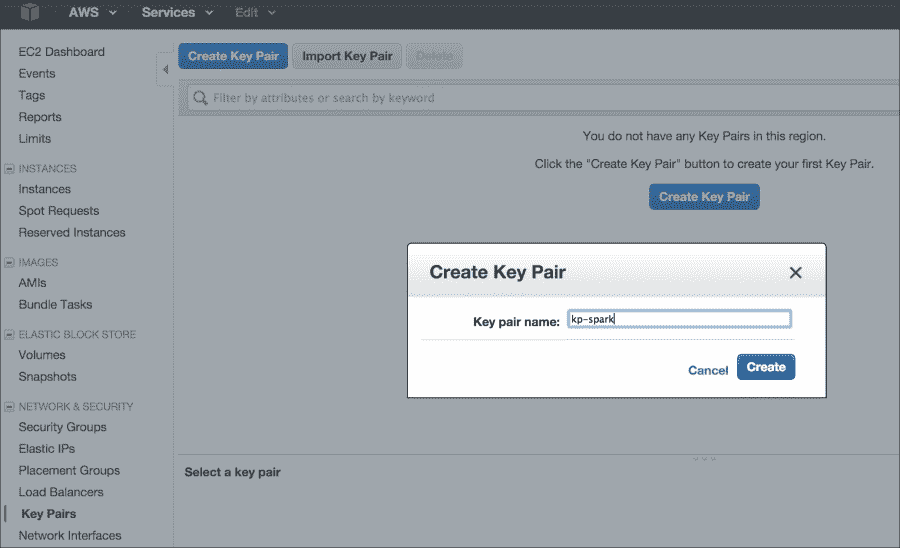
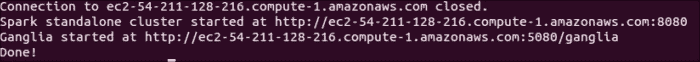
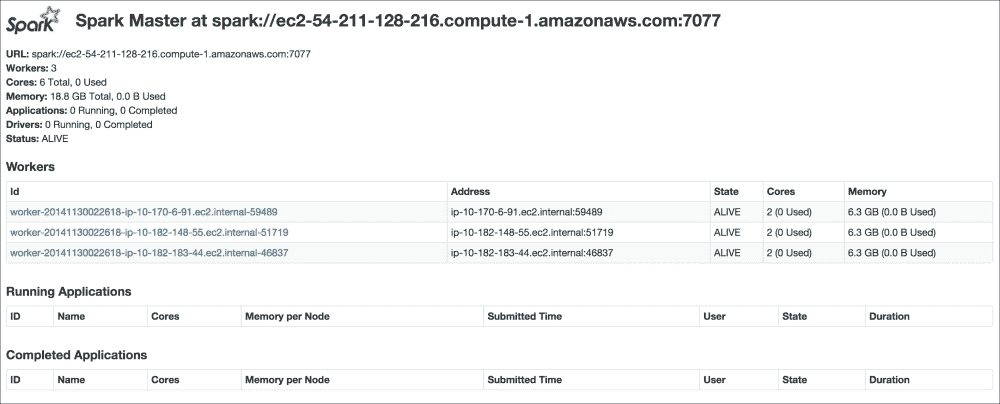
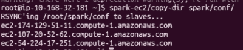
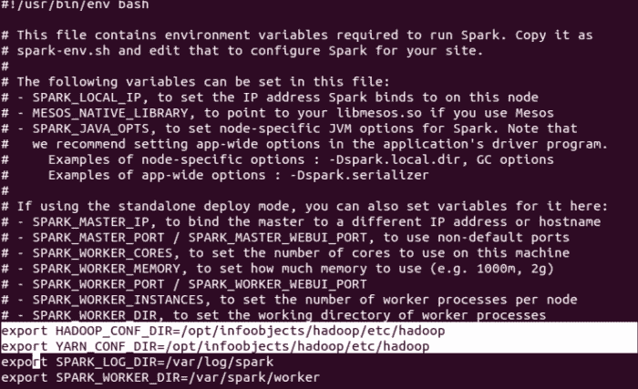
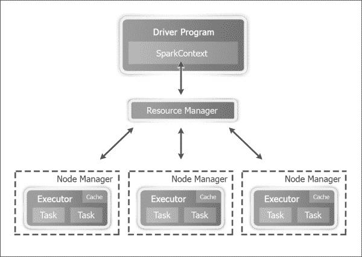
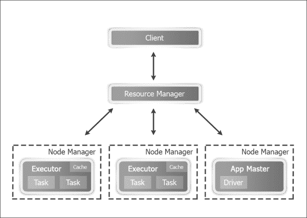
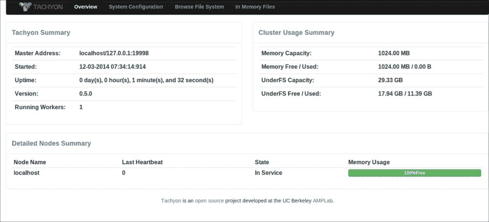

# 第 1 章：Apache Spark 入门

在本章中，我们将设置 Spark 并对其进行配置。 本章分为以下食谱：

*   从二进制文件安装 Spark
*   用 Maven 构建 Spark 源代码
*   在 Amazon EC2 上推出 Spark
*   在独立模式下在群集上部署 Spark
*   在使用 MESOS 的群集上部署 Spark
*   使用纱线在群集上部署 Spark
*   使用 Tachyon 作为堆外存储层

# 简介

Apache Spark是一个处理大数据工作负载的通用集群计算系统。 Spark 与 MapReduce 等前身的不同之处在于它的速度、易用性和复杂的分析能力。

Apache Spark 最初是在 2009 年由加州大学伯克利分校 AMPLab 开发的。 它于 2010 年在 BSD 许可下开放源码，并于 2013 年切换到 Apache2.0 许可。 2013 年下半年，Spark 的创建者创建了 Databricks，专注于 Spark 的开发和未来的发布。

说到速度，Spark 可以在大数据工作负载上实现亚秒级延迟。 为了实现如此低的延迟，Spark 利用内存进行存储。 在 MapReduce 中，内存主要用于实际计算。 Spark 使用内存来计算和存储对象。

Spark 还提供了连接到各种大数据存储源(如 HDFS、Cassandra、HBase 和 S3)的统一运行时。 它还为不同的大数据计算任务(如机器学习、SQL 处理、图形处理和实时流)提供了一组丰富的高级库。 这些库可以加快开发速度，并且可以以任意方式组合。

虽然 Spark 是用 Scala 编写的，而且本书只关注 Scala 的食谱，但 Spark 也支持 Java 和 Python。

Spark 是一个开源社区项目，每个人都使用纯开源 Apache 发行版进行部署，这与 Hadoop 不同，Hadoop 有多个发行版可供供应商增强。

下图显示了 Spark 生态系统：


Spark 运行时运行在各种集群管理器之上，包括 Yar(Hadoop 的计算框架)、Mesos 和 Spark 自己的集群管理器，称为**独立模式**。 Tachyon是一个以内存为中心的分布式文件系统，支持跨集群框架以内存速度可靠地共享文件。 简而言之，它是内存中的堆外存储层，有助于跨作业和用户共享数据。 Mesos是一个集群管理器，它正在演变为一个数据中心操作系统。 Yar是 Hadoop 的计算框架，它具有 Spark 可以无缝使用的健壮的资源管理特性。

# 从二进制文件安装 Spark

Spark 可以从源代码构建，也可以从[http://spark.apache.org](http://spark.apache.org)下载预编译的二进制文件。 对于标准用例，二进制文件就足够好了，本食谱将重点介绍如何使用二进制文件安装 Spark。

## 做好准备

本书中的所有食谱都是使用 Ubuntu Linux开发的，但是应该可以在任何 POSIX 环境中很好地工作。 Spark 期望安装 Java 并设置`JAVA_HOME`环境变量。

在 Linux/Unix 系统中，文件和目录的位置有特定的标准，我们将在本书中遵循这些标准。 以下是快速小抄：

<colgroup><col style="text-align: left"> <col style="text-align: left"></colgroup> 
| 

目录

 | 

描述 / 描写 / 形容 / 类别

 |
| --- | --- |
| `/bin` | 基本命令二进制文件 |
| `/etc` | 特定于主机的系统配置 |
| `/opt` | 附加应用程序软件包 |
| `/var` | 可变数据 |
| `/tmp` | 临时文件 |
| `/home` | 用户主目录 |

## 怎么做……

在撰写本文时，Spark 的当前版本是 1.4。 请在[http://spark.apache.org/downloads.html](http://spark.apache.org/downloads.html)的 Spark 下载页面查看最新版本。 二进制文件是使用最新且稳定的 Hadoop 版本开发的。 要使用特定版本的 Hadoop，推荐的方法是从源代码构建，这将在下一个食谱中介绍。

以下是安装步骤：

1.  打开终端，使用以下命令下载二进制文件：

    ```scala
    $ wget http://d3kbcqa49mib13.cloudfront.net/spark-1.4.0-bin-hadoop2.4.tgz

    ```

2.  解压二进制文件：

    ```scala
    $ tar -zxf spark-1.4.0-bin-hadoop2.4.tgz

    ```

3.  通过剥离版本信息来重命名包含二进制文件的文件夹：

    ```scala
    $ sudo mv spark-1.4.0-bin-hadoop2.4 spark

    ```

4.  将配置文件夹移动到`/etc`文件夹，以便以后可以将其设置为符号链接：

    ```scala
    $ sudo mv spark/conf/* /etc/spark

    ```

5.  在`/opt`下创建特定于您公司的安装目录。 由于本书中的食谱在`infoobjects`沙箱上进行了测试，因此我们将使用`infoobjects`作为目录名。 创建`/opt/infoobjects`目录：

    ```scala
    $ sudo mkdir -p /opt/infoobjects

    ```

6.  将`spark`目录移动到`/opt/infoobjects`，因为它是一个附加软件包：

    ```scala
    $ sudo mv spark /opt/infoobjects/

    ```

7.  将`spark`主目录的所有权更改为`root`：

    ```scala
    $ sudo chown -R root:root /opt/infoobjects/spark

    ```

8.  更改`spark`主目录的权限，`0755 = user:read-write-execute group:read-execute world:read-execute`：

    ```scala
    $ sudo chmod -R 755 /opt/infoobjects/spark

    ```

9.  移至`spark`主目录：

    ```scala
    $ cd /opt/infoobjects/spark

    ```

10.  创建符号链接：

    ```scala
    $ sudo ln -s /etc/spark conf

    ```

11.  追加到`.bashrc`中的`PATH`：

    ```scala
    $ echo "export PATH=$PATH:/opt/infoobjects/spark/bin" >> /home/hduser/.bashrc

    ```

12.  打开一个新的航站楼。
13.  在`/var`：

    ```scala
    $ sudo mkdir -p /var/log/spark

    ```

    中创建`log`目录
14.  使`hduser`成为 Spark`log`目录的所有者。

    ```scala
    $ sudo chown -R hduser:hduser /var/log/spark

    ```

15.  创建 Spark`tmp`目录：

    ```scala
    $ mkdir /tmp/spark

    ```

16.  借助以下命令行配置Spark：

    ```scala
    $ cd /etc/spark
    $ echo "export HADOOP_CONF_DIR=/opt/infoobjects/hadoop/etc/hadoop" >> spark-env.sh
    $ echo "export YARN_CONF_DIR=/opt/infoobjects/hadoop/etc/Hadoop" >> spark-env.sh
    $ echo "export SPARK_LOG_DIR=/var/log/spark" >> spark-env.sh
    $ echo "export SPARK_WORKER_DIR=/tmp/spark" >> spark-env.sh

    ```

# 用 Maven 构建 Spark 源代码

使用二进制文件安装Spark 在大多数情况下运行良好。 对于高级情况，如以下(但不限于)，从源代码编译是更好的选择：

*   针对特定 Hadoop 版本进行编译
*   添加配置单元集成
*   添加纱线集成

## 做好准备

以下是此食谱生效的前提条件：

*   Java 1.6 或更高版本
*   Maven 3.x

## 怎么做……

以下是使用 Maven 构建 Spark 源代码的步骤：

1.  增加堆的`MaxPermSize`：

    ```scala
    $ echo "export _JAVA_OPTIONS=\"-XX:MaxPermSize=1G\""  >> /home/hduser/.bashrc

    ```

2.  打开一个新的终端窗口，从 GitHub：

    ```scala
    $ wget https://github.com/apache/spark/archive/branch-1.4.zip

    ```

    下载 Spark 源代码
3.  解压存档文件：

    ```scala
    $ gunzip branch-1.4.zip

    ```

4.  移至`spark`目录：

    ```scala
    $ cd spark

    ```

5.  使用以下标志编译源代码：YAINE ENABLED、Hadoop Version 2.4、HIVE ENABLED 和跳过测试以加快编译速度：

    ```scala
    $ mvn -Pyarn -Phadoop-2.4 -Dhadoop.version=2.4.0 -Phive -DskipTests clean package

    ```

6.  将`conf`文件夹移动到`etc`文件夹，使其成为符号链接：

    ```scala
    $ sudo mv spark/conf /etc/

    ```

7.  将`spark`目录移动到`/opt`，因为它是一个附加软件包：

    ```scala
    $ sudo mv spark /opt/infoobjects/spark

    ```

8.  将`spark`主目录的所有权更改为`root`：

    ```scala
    $ sudo chown -R root:root /opt/infoobjects/spark

    ```

9.  更改`spark`主目录`0755 = user:rwx group:r-x world:r-x`的权限：

    ```scala
    $ sudo chmod -R 755 /opt/infoobjects/spark

    ```

10.  移至`spark`主目录：

    ```scala
    $ cd /opt/infoobjects/spark

    ```

11.  创建符号链接：

    ```scala
    $ sudo ln -s /etc/spark conf

    ```

12.  通过编辑`.bashrc`：

    ```scala
    $ echo "export PATH=$PATH:/opt/infoobjects/spark/bin" >> /home/hduser/.bashrc

    ```

    将 Spark 可执行文件放入路径中
13.  在`/var`：

    ```scala
    $ sudo mkdir -p /var/log/spark

    ```

    中创建`log`目录
14.  使`hduser`成为 Spark`log`目录的所有者：

    ```scala
    $ sudo chown -R hduser:hduser /var/log/spark

    ```

15.  创建 Spark`tmp`目录：

    ```scala
    $ mkdir /tmp/spark

    ```

16.  借助以下命令行配置 Spark：

    ```scala
    $ cd /etc/spark
    $ echo "export HADOOP_CONF_DIR=/opt/infoobjects/hadoop/etc/hadoop" >> spark-env.sh
    $ echo "export YARN_CONF_DIR=/opt/infoobjects/hadoop/etc/Hadoop" >> spark-env.sh
    $ echo "export SPARK_LOG_DIR=/var/log/spark" >> spark-env.sh
    $ echo "export SPARK_WORKER_DIR=/tmp/spark" >> spark-env.sh

    ```

# 在 Amazon EC2 上启动 Spark

**Amazon Elastic Compute Cloud**(**Amazon EC2**)是一项 Web 服务，可在云中提供可调整大小的计算实例。 Amazon EC2 提供以下功能：

*   通过互联网按需交付 IT 资源
*   提供任意数量的实例
*   为您使用的小时数支付，例如您的水电费账单
*   没有安装成本，没有安装，也没有任何开销
*   当您不再需要实例时，您可以关闭或终止并退出
*   这些实例在所有熟悉的操作系统上的可用性

EC2 提供不同类型的实例来满足所有计算需求，如通用实例、微型实例、内存优化实例、存储优化实例等。 他们有一层免费的微型实例可供尝试。

## 做好准备

`spark-ec2`脚本与 Spark 捆绑在一起，便于在 Amazon EC2 上启动、管理和关闭集群。

在开始之前，您需要做以下事情：

1.  登录 Amazon AWS 帐户([http://aws.amazon.com](http://aws.amazon.com))。
2.  单击右上角您的帐户名称下的**安全凭证**。
3.  Click on **Access Keys** and **Create New Access Key**:

    

4.  记下访问密钥 ID 和秘密访问密钥。
5.  现在转到**服务**|**EC2**。
6.  单击左侧菜单中网络&安全下的**密钥对**。
7.  Click on **Create Key Pair** and enter `kp-spark` as key-pair name:

    

8.  下载私钥文件并将其复制到`/home/hduser/keypairs folder`中。
9.  将密钥文件的权限设置为`600`。
10.  设置环境变量以反映访问密钥 ID 和秘密访问密钥(请用您自己的值替换示例值)：

    ```scala
    $ echo "export AWS_ACCESS_KEY_ID=\"AKIAOD7M2LOWATFXFKQ\"" >> /home/hduser/.bashrc
    $ echo "export AWS_SECRET_ACCESS_KEY=\"+Xr4UroVYJxiLiY8DLT4DLT4D4sxc3ijZGMx1D3pfZ2q\"" >> /home/hduser/.bashrc
    $ echo "export PATH=$PATH:/opt/infoobjects/spark/ec2" >> /home/hduser/.bashrc

    ```

## 怎么做……

1.  Spark 与脚本捆绑在一起，可以在 Amazon EC2 上启动 Spark 集群。 让我们使用以下命令启动群集：

    ```scala
    $ cd /home/hduser
    $ spark-ec2 -k <key-pair> -i <key-file> -s <num-slaves> launch <cluster-name>

    ```

2.  使用示例值

    ```scala
    $ spark-ec2 -k kp-spark -i /home/hduser/keypairs/kp-spark.pem --hadoop-major-version 2  -s 3 launch spark-cluster

    ```

    ### 备注

    启动群集
    *   `<key-pair>`：这是在 AWS 中创建的 EC2 密钥对的名称
    *   `<key-file>`：这是您下载的私钥文件
    *   `<num-slaves>`：这是要启动的从节点数
    *   `<cluster-name>`：这是群集的名称
3.  有时，默认可用区不可用；在这种情况下，请通过指定您正在请求的特定可用区来重试发送请求：

    ```scala
    $ spark-ec2 -k kp-spark -i /home/hduser/keypairs/kp-spark.pem -z us-east-1b --hadoop-major-version 2  -s 3 launch spark-cluster

    ```

4.  如果您的应用程序在实例关闭后需要保留数据，请将 EBS 卷附加到它(例如，10 GB 空间)：

    ```scala
    $ spark-ec2 -k kp-spark -i /home/hduser/keypairs/kp-spark.pem --hadoop-major-version 2 -ebs-vol-size 10 -s 3 launch spark-cluster

    ```

5.  If you use Amazon spot instances, here's the way to do it:

    ```scala
    $ spark-ec2 -k kp-spark -i /home/hduser/keypairs/kp-spark.pem -spot-price=0.15 --hadoop-major-version 2  -s 3 launch spark-cluster

    ```

    ### 备注

    Spot 实例允许您为 Amazon EC2 计算能力指定自己的价格。 您只需对备用 Amazon EC2 实例进行投标，并在您的出价超过当前现货价格时运行它们，当前现货价格会根据供需情况实时变化(来源：[Amazon.com](http://amazon.com))。

6.  After everything is launched, check the status of the cluster by going to the web UI URL that will be printed at the end.

    

7.  Check the status of the cluster:

    

8.  Now, to access the Spark cluster on EC2, let's connect to the master node using **secure shell protocol** (**SSH**):

    ```scala
    $ spark-ec2 -k kp-spark -i /home/hduser/kp/kp-spark.pem  login spark-cluster

    ```

    您应该得到如下内容：

    

9.  Check directories in the master node and see what they do: .

    `spark`

    `tachyon`

    this is the Tachyon installation

    <colgroup><col style="text-align: left"> <col style="text-align: left"></colgroup> 
    | 

    catalogue

     | 

    description / category

     |
    | --- | --- |
    | `ephemeral-hdfs` | this is a Hadoop instance. The data is short-lived and is deleted when you stop or restart the machine. |
    | `persistent-hdfs` | each node has a very small amount of persistent storage (about 3 GB). If you use this instance, the data will remain in that space. |
    | `hadoop-native` | these are native libraries that support Hadoop, such as Snappy compression libraries. |
    | `Scala` | this is a Scala installation. |
    | `shark` | this is a Shark installation (Shark is no longer supported and replaced by Spark SQL). |
    | this is the spark installation |
    | `spark-ec2` | these . Is a file that supports this cluster deployment. |

10.  检查临时实例中的HDFS 版本：

    ```scala
    $ ephemeral-hdfs/bin/hadoop version
    Hadoop 2.0.0-chd4.2.0

    ```

11.  使用以下命令检查持久实例中的 HDFS 版本：

    ```scala
    $ persistent-hdfs/bin/hadoop version
    Hadoop 2.0.0-chd4.2.0

    ```

12.  更改日志中的配置级别：

    ```scala
    $ cd spark/conf

    ```

13.  The default log level information is too verbose, so let's change it to Error:

    

    1.  通过重命名模板创建`log4.properties`文件：

        ```scala
        $ mv log4j.properties.template log4j.properties

        ```

    2.  在 vi 或您最喜欢的编辑器中打开`log4j.properties`：

        ```scala
        $ vi log4j.properties

        ```

    3.  将第二行从`| log4j.rootCategory=INFO, console`更改为`| log4j.rootCategory=ERROR, console`。
14.  Copy the configuration to all slave nodes after the change:

    ```scala
    $ spark-ec2/copydir spark/conf

    ```

    你应该得到这样的东西：

    

15.  销毁Spark群集：

    ```scala
    $ spark-ec2 destroy spark-cluster

    ```

### 另请参阅

*   [http：//aws.amazon.com/ec2](http://aws.amazon.com/ec2)

# 以独立模式在群集上部署

分布式环境中的计算资源需要进行管理，以便资源利用率达到高效，并且每个作业都有公平的机会运行。 Spark 附带了自己的集群管理器，方便地称为**独立模式**。 Spark 还支持使用纱线和 Mesos 集群管理器。

应该选择的集群管理器主要受遗留问题和其他框架(如 MapReduce)是否共享相同计算资源池的驱动。 如果您的集群有旧的 MapReduce 作业在运行，并且所有这些作业都不能转换为 Spark 作业，那么最好使用 YAINE 作为集群管理器。 Mesos 正在成为一个数据中心操作系统，可以方便地跨框架管理作业，并且与 Spark 非常兼容。

如果 Spark 框架是集群中唯一的框架，那么独立模式就足够好了。 随着 Spark 作为技术的发展，您将看到越来越多的 Spark 被用作满足所有大数据计算需求的独立框架。 例如，一些作业目前可能正在使用 Apache Mahout，因为 MLlib 没有该作业需要的特定机器学习库。 一旦 MLlib 获得这个库，这个特定的作业就可以转移到 Spark。

## 做好准备

让我们考虑一个由六个节点组成的集群作为示例设置：一个主节点和五个从节点(将它们替换为集群中的实际节点名称)：

```scala
Master
m1.zettabytes.com
Slaves
s1.zettabytes.com
s2.zettabytes.com
s3.zettabytes.com
s4.zettabytes.com
s5.zettabytes.com

```

## 怎么做……

1.  因为 Spark 的独立模式是默认模式，所以您需要做的就是在主计算机和从计算机上安装 Spark 二进制文件。 将`/opt/infoobjects/spark/sbin`放入每个节点的路径中：

    ```scala
    $ echo "export PATH=$PATH:/opt/infoobjects/spark/sbin" >> /home/hduser/.bashrc

    ```

2.  Start the standalone master server (SSH to master first):

    ```scala
    hduser@m1.zettabytes.com~] start-master.sh

    ```

    默认情况下，主机从端口 7077 开始，从机使用该端口连接到主机。 它还在端口 8088 上有一个 Web 用户界面。

3.  Please SSH to master node and start slaves:

    ```scala
    hduser@s1.zettabytes.com~] spark-class org.apache.spark.deploy.worker.Worker spark://m1.zettabytes.com:7077

    ```

    <colgroup><col style="text-align: left"> <col style="text-align: left"></colgroup> 
    | 

    parameters (for fine-grained configurations. The following parameters apply to both master and slave devices)

     | 

    meaning / implied meaning / connotation / purpose

     |
    | --- | --- |
    | `-i <ipaddress>,-ip <ipaddress>` | IP address / DNS. Service listens on the port of |
    | `-p <port>, --port <port>` | Port Service listens on the port of |
    | `--webui-port <port>` | Web UI (by default). The primary port is 8080\. Auxiliary port is 8081) |
    | `-c <cores>,--cores <cores>` | Total number of CPU core Spark applications that can be used on one computer (staff only) |
    | `-m <memory>,--memory <memory>`. | Total number of RAM Spark applications available on computers (staff only) |
    | `-d <dir>,--work-dir <dir>` | directory for temporary space and job output logs[. T83] |

4.  除了在每个节点上手动启动主守护进程和从守护进程之外，还可以使用集群启动脚本来完成。
5.  First, create the `conf/slaves` file on a master node and add one line per slave hostname (using an example of five slaves nodes, replace with the DNS of slave nodes in your cluster):

    ```scala
    hduser@m1.zettabytes.com~] echo "s1.zettabytes.com" >> conf/slaves
    hduser@m1.zettabytes.com~] echo "s2.zettabytes.com" >> conf/slaves
    hduser@m1.zettabytes.com~] echo "s3.zettabytes.com" >> conf/slaves
    hduser@m1.zettabytes.com~] echo "s4.zettabytes.com" >> conf/slaves
    hduser@m1.zettabytes.com~] echo "s5.zettabytes.com" >> conf/slaves

    ```

    一旦设置好从机，您就可以调用以下脚本来启动/停止集群：

    <colgroup><col style="text-align: left"> <col style="text-align: left"></colgroup> 
    | 

    脚本名称

     | 

    意图 / 意志 / 决断 / 决心

     |
    | --- | --- |
    | `start-master.sh` | 在主机上启动主实例 |
    | `start-slaves.sh` | 在从文件中的每个节点上启动从实例 |
    | `start-all.sh` | 同时启动主设备和从设备 |
    | `stop-master.sh` | 停止主机上的主实例 |
    | `stop-slaves.sh` | 停止从文件中所有节点上的从实例 |
    | `stop-all.sh` | 同时停止主机和从机 |

6.  通过 Scala 代码将应用程序连接到群集：

    ```scala
    val sparkContext = new SparkContext(new SparkConf().setMaster("spark://m1.zettabytes.com:7077")

    ```

7.  通过 Spark shell 连接到群集：

    ```scala
    $ spark-shell --master spark://master:7077

    ```

## 它是如何工作的.

在独立模式下，Spark 遵循主从体系结构，非常类似于 Hadoop、MapReduce 和纱线。 计算主守护进程称为**Spark Master**，在一个主节点上运行。 使用动物园看守人可以使Spark大师高度可用。 如果需要，您还可以动态添加更多备用主机。

计算从守护进程名为，称为**Worker**，位于每个从节点上。 Worker 守护程序执行以下操作：

*   向 Spark Master 报告从节点上计算资源的可用性，例如内核、内存和其他资源的数量
*   当Spark大师要求生成执行器时，它会派生执行器。
*   如果 Executor 死了，则重新启动该 Executor

每个从属机器上的每个应用程序最多有一个执行器。

Spark大师和工人都是非常轻便的。 通常，500 MB 到 1 GB 之间的内存分配就足够了。 该值可以通过设置`SPARK_DAEMON_MEMORY`参数在`conf/spark-env.sh`中设置。 例如，以下配置将主守护进程和辅助守护进程的内存都设置为 1 GB。 在运行它之前，请确保您已将`sudo`作为超级用户：

```scala
$ echo "export SPARK_DAEMON_MEMORY=1g" >> /opt/infoobjects/spark/conf/spark-env.sh

```

默认情况下，每个从节点上都运行一个工作实例。 有时，您可能有几台比其他计算机更强大的计算机。 在这种情况下，您可以通过以下配置(仅在这些计算机上)在该计算机上派生多个工作进程：

```scala
$ echo "export SPARK_WORKER_INSTANCES=2" >> /opt/infoobjects/spark/conf/spark-env.sh

```

默认情况下，Spark Worker 使用从属计算机上的所有内核作为其执行器。 如果您想要限制工作人员可以使用的核心数量，可以通过以下配置将其设置为该数量(例如，12 个)：

```scala
$ echo "export SPARK_WORKER_CORES=12" >> /opt/infoobjects/spark/conf/spark-env.sh

```

默认情况下，Spark Worker 使用所有可用的 RAM(执行器使用 1 GB)。 请注意，您不能分配每个特定执行器将使用多少内存(您可以通过驱动程序配置来控制)。 要为所有执行器合并使用的总内存分配另一个值(例如，24 GB)，请执行以下设置：

```scala
$ echo "export SPARK_WORKER_MEMORY=24g" >> /opt/infoobjects/spark/conf/spark-env.sh

```

您可以在驱动程序级别进行一些设置：

*   要指定给定应用程序在整个集群中使用的最大 CPU 核心数，您可以在 Spark Submit 或 Spark Shell 中设置`spark.cores.max`配置，如下所示：

    ```scala
    $ spark-submit --conf spark.cores.max=12

    ```

*   要指定每个执行器应该分配的内存量(最低建议为 8 GB)，可以在 Spark Submit 或 Spark Shell 中设置`spark.executor.memory`配置，如下所示：

    ```scala
    $ spark-submit --conf spark.executor.memory=8g

    ```

下图描述了 Spark 集群的高级体系结构：


## 另请参阅

*   [http://spark.apache.org/docs/latest/spark-standalone.html](http://spark.apache.org/docs/latest/spark-standalone.html)查找更多配置选项

# 在使用 Mesos 的群集上部署

Mesos正在慢慢成为一个数据中心操作系统，用于管理整个数据中心的所有计算资源。 Mesos 可以在任何运行 Linux 操作系统的计算机上运行。 Mesos 的构建原理与 Linux 内核相同。 让我们看看如何安装 Mesos。

## 怎么做……

中间层提供了中层的二元分布。 通过执行以下步骤，可以从中间层存储库安装 Mesos 发行版的最新软件包：

1.  在可信版本的 Ubuntu 操作系统上执行 Mesos：

    ```scala
    $ sudo apt-key adv --keyserver keyserver.ubuntu.com --recv E56151BF DISTRO=$(lsb_release -is | tr '[:upper:]' '[:lower:]') CODENAME=$(lsb_release -cs)
    $ sudo vi /etc/apt/sources.list.d/mesosphere.list

    deb http://repos.mesosphere.io/Ubuntu trusty main

    ```

2.  更新存储库：

    ```scala
    $ sudo apt-get -y update

    ```

3.  发帖主题：Re：Колибри0.7.0
4.  要将 Spark 连接到 Mesos 以集成 Spark 和 Mesos，请使 Spark 二进制文件可用于 Mesos，并配置 Spark 驱动程序以连接到 Mesos。
5.  使用第一个配方中的 Spark 二进制文件并上传到 HDFS：

    ```scala
    $ 
    hdfs dfs
     -put spark-1.4.0-bin-hadoop2.4.tgz spark-1.4.0-bin-hadoop2.4.tgz

    ```

6.  单个主 Mesos 的主 URL 是`mesos://host:5050`，而 ZooKeeper 管理的 Mesos 集群的主 URL 是`mesos://zk://host:2181`。
7.  在`spark-env.sh`中设置以下变量：

    ```scala
    $ sudo vi spark-env.sh
    export MESOS_NATIVE_LIBRARY=/usr/local/lib/libmesos.so
    export SPARK_EXECUTOR_URI= hdfs://localhost:9000/user/hduser/spark-1.4.0-bin-hadoop2.4.tgz

    ```

8.  从 Scala 程序运行：

    ```scala
    val conf = new SparkConf().setMaster("mesos://host:5050")
    val sparkContext = new SparkContext(conf)

    ```

9.  Run from the Spark shell:

    ```scala
    $ spark-shell --master mesos://host:5050

    ```

    ### 备注

    MESOS有两种运行模式：

    **细粒度**：在细粒度(默认)模式下，每个 Spark 任务都作为单独的 Mesos 任务运行

    **粗粒度**：此模式将在每台 Mesos 计算机上仅启动一个长期运行的 Spark 任务

10.  要在粗粒度模式下运行，请设置`spark.mesos.coarse`属性：

    ```scala
    conf.set("spark.mesos.coarse","true")

    ```

# 使用纱线在群集上部署

**另一个资源谈判者**(**纱线**)是Hadoop 的计算框架，它运行在 HDFS 之上，HDFS 是 Hadoop 的存储层。

Yar遵循主从体系结构。 主守护进程称为`ResourceManager`，从守护进程称为`NodeManager`。 除了此应用程序，生命周期管理由`ApplicationMaster`完成，它可以在任何从节点上派生，并且在应用程序的生命周期内都是有效的。

当 Spark 在纱线上运行时，`ResourceManager`执行 Spark Master 的角色，`NodeManagers`作为执行器节点工作。

在使用纱线运行 Spark 时，每个 Spark Executor 都作为纱线容器运行。

## 做好准备

在纱线上运行 Spark 需要具有纱线支撑的 Spark 的二进制分布。 在这两个Spark安装食谱中，我们都解决了这个问题。

## 怎么做……

1.  To run Spark on YARN, the first step is to set the configuration:

    ```scala
    HADOOP_CONF_DIR: to write to HDFS
    YARN_CONF_DIR: to connect to YARN ResourceManager
    $ cd /opt/infoobjects/spark/conf (or /etc/spark)
    $ sudo vi spark-env.sh
    export HADOOP_CONF_DIR=/opt/infoobjects/hadoop/etc/Hadoop
    export YARN_CONF_DIR=/opt/infoobjects/hadoop/etc/hadoop

    ```

    您可以在下面的屏幕截图中看到这一点：

    

2.  The following command launches YARN Spark in the `yarn-client` mode:

    ```scala
    $ spark-submit --class path.to.your.Class --master yarn-client [options] <app jar> [app options]

    ```

    下面是一个例子：

    ```scala
    $ spark-submit --class com.infoobjects.TwitterFireHose --master yarn-client --num-executors 3 --driver-memory 4g --executor-memory 2g --executor-cores 1 target/sparkio.jar 10

    ```

3.  以下命令在`yarn-client`模式下启动 Spark shell：

    ```scala
    $ spark-shell --master yarn-client

    ```

4.  The command to launch in the `yarn-cluster` mode is as follows:

    ```scala
    $ spark-submit --class path.to.your.Class --master yarn-cluster [options] <app jar> [app options]

    ```

    下面是一个例子：

    ```scala
    $ spark-submit --class com.infoobjects.TwitterFireHose --master yarn-cluster --num-executors 3 --driver-memory 4g --executor-memory 2g --executor-cores 1 targe
    t/sparkio.jar 10

    ```

## …的工作原理

纱线上的 Spark应用程序以两种模式运行：

*   `yarn-client`：Spark 驱动程序在纱线群集之外的客户端进程中运行，`ApplicationMaster`仅用于协商来自 ResourceManager 的资源
*   `yarn-cluster`：Spark驱动程序在从节点上由`NodeManager`派生的`ApplicationMaster`中运行

对于生产部署，建议使用`yarn-cluster`模式，而当您希望看到即时输出时，y`arn-client`模式适合开发和调试。 不需要在这两种模式中指定 Spark master，因为它是从 Hadoop 配置中选择的，并且 master 参数是`yarn-client`或`yarn-cluster`。

下图显示了 Spark 是如何在客户端模式下使用纱线运行的：



下图显示了 Spark 是如何在簇模式下使用纱线运行的：



在纱线模式下，可以设置以下配置参数：

*   `--num-executors`：配置将分配多少执行者
*   `--executor-memory`：每个执行器的 RAM
*   `--executor-cores`：每个执行器的 CPU 核心数

# 使用 Tachyon 作为堆外存储层

Spark RDDS是在内存中存储数据集的一种很好的方式，同时在不同的应用程序中得到相同数据的多个副本。 Tachyon 使用 Spark RDD 管理解决了一些挑战。 其中几个是：

*   RDD 仅在 Spark 应用程序的持续时间内存在
*   相同的进程执行计算和 RDD 内存中存储；因此，如果进程崩溃，内存中存储也会消失
*   不同的作业不能共享 RDD，即使它们针对相同的底层数据，例如，HDFS 块导致：
    *   写入磁盘速度较慢
    *   内存中的数据重复，占用的内存更高
*   如果一个应用程序的输出需要与另一个应用程序共享，则会因为磁盘中的复制而变慢

Tachyon 提供了一个堆外内存层来解决这些问题。 这一层位于堆外，不会受到进程崩溃的影响，也不会受到垃圾回收的影响。 这还允许跨应用程序共享 RDDS，并使其持续时间超过特定作业或会话；实质上，数据的单个副本驻留在内存中，如下图所示：


## 怎么做……

1.  让我们下载并编译 Tachyon(默认情况下，Tachyon 是为 Hadoop 1.0.4 配置的，因此需要从源代码编译以获得正确的 Hadoop 版本)。 用当前版本替换该版本。 撰写本书时的当前版本是 0.6.4：

    ```scala
    $ wget https://github.com/amplab/tachyon/archive/v<version>.zip

    ```

2.  解压源代码：

    ```scala
    $ unzip  v-<version>.zip

    ```

3.  为方便起见，从`tachyon`源文件夹名中删除版本：

    ```scala
    $ mv tachyon-<version> tachyon

    ```

4.  将目录更改为`tachyon`文件夹：

    ```scala
    $ cd tachyon
    $ mvn -Dhadoop.version=2.4.0 clean package -DskipTests=true
    $ cd conf
    $ sudo mkdir -p /var/tachyon/journal
    $ sudo chown -R hduser:hduser /var/tachyon/journal
    $ sudo mkdir -p /var/tachyon/ramdisk
    $ sudo chown -R hduser:hduser /var/tachyon/ramdisk

    $ mv tachyon-env.sh.template tachyon-env.sh
    $ vi tachyon-env.sh

    ```

5.  注释以下行：

    ```scala
    export TACHYON_UNDERFS_ADDRESS=$TACHYON_HOME/underfs

    ```

6.  取消注释以下行：

    ```scala
    export TACHYON_UNDERFS_ADDRESS=hdfs://localhost:9000

    ```

7.  更改以下属性：

    ```scala
    -Dtachyon.master.journal.folder=/var/tachyon/journal/

    export TACHYON_RAM_FOLDER=/var/tachyon/ramdisk

    $ sudo mkdir -p /var/log/tachyon
    $ sudo chown -R hduser:hduser /var/log/tachyon
    $ vi log4j.properties

    ```

8.  将`${tachyon.home}`替换为`/var/log/tachyon`。
9.  在`conf`目录中新建`core-site.xml`文件：

    ```scala
    $ sudo vi core-site.xml
    <configuration>
    <property>
     <name>fs.tachyon.impl</name>
     <value>tachyon.hadoop.TFS</value>
     </property>
    </configuration>
    $ cd ~
    $ sudo mv tachyon /opt/infoobjects/
    $ sudo chown -R root:root /opt/infoobjects/tachyon
    $ sudo chmod -R 755 /opt/infoobjects/tachyon

    ```

10.  将`<tachyon home>/bin`添加到路径：

    ```scala
    $ echo "export PATH=$PATH:/opt/infoobjects/tachyon/bin" >> /home/hduser/.bashrc

    ```

11.  Restart the shell and format Tachyon:

    ```scala
    $ tachyon format
    $ tachyon-start.sh local //you need to enter root password as RamFS needs to be formatted

    ```

    Tachyon 的 Web 界面是`http://hostname:19999`：

    

12.  Run the sample program to see whether Tachyon is running fine:

    ```scala
    $ tachyon runTest Basic CACHE_THROUGH

    ```

    

13.  您可以通过运行以下命令随时停止 Tachyon：

    ```scala
    $ tachyon-stop.sh

    ```

14.  在 Tachyon 上运行 Spark：

    ```scala
    $ spark-shell
    scala> val words = sc.textFile("tachyon://localhost:19998/words")
    scala> words.count
    scala> words.saveAsTextFile("tachyon://localhost:19998/w2")
    scala> val person = sc.textFile("hdfs://localhost:9000/user/hduser/person")
    scala> import org.apache.spark.api.java._
    scala> person.persist(StorageLevels.OFF_HEAP)

    ```

## 另请参阅

*   [http://www.cs.berkeley.edu/~haoyuan/papers/2013_ladis_tachyon.pdf](http://www.cs.berkeley.edu/~haoyuan/papers/2013_ladis_tachyon.pdf)了解快子的起源
*   [http：//www.tachyonnexus.com](http://www.tachyonnexus.com)