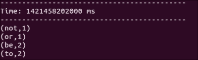
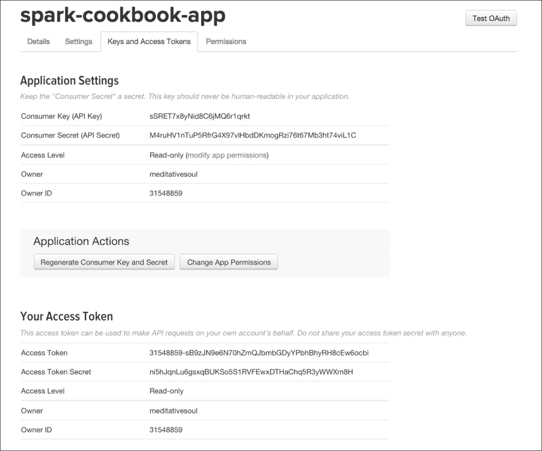
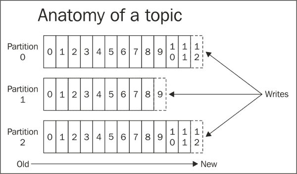
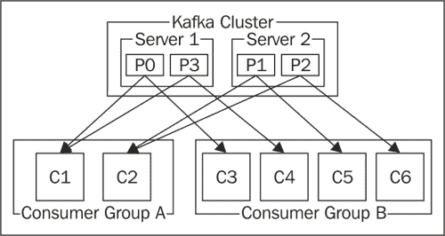

# 五、Spark流

Spark Streaming 为 Apache Spark 添加了大数据处理(即实时分析)的圣杯。 它使 Spark 能够接收实时数据流，并以几秒的极低延迟提供实时情报。

在本章中，我们将介绍以下食谱：

*   使用流的字数统计
*   流式传输推特数据
*   使用Kafka进行流媒体传输

# 简介

流式处理是将连续流动的输入数据划分为离散单元以便于处理的过程。 现实生活中熟悉的例子是流视频和音频内容(虽然用户可以在观看之前下载完整的电影，但更快的解决方案是将数据分成小块开始为用户播放，而其余数据则在后台下载)。

除了多媒体之外，现实世界中的流媒体还包括市场提要、天气数据、电子股票交易数据等的处理。 所有这些应用都以非常快的速度产生大量数据，并且需要对数据进行特殊处理，以便能够实时从数据中获得洞察力。

Spark Streaming 有几个基本概念，在我们关注 Spark Streaming 之前，最好先理解这些概念。 流应用接收数据的速率称为**数据速率**，并且以**千字节/秒**(**kbps**)或**兆字节/秒**(**Mbps**)的形式表示。

流的一个重要的用例是**复杂事件处理**(**CEP**)。 在 CEP 中，控制正在处理的数据的范围很重要。 此范围称为窗口，可以基于时间或大小。 基于时间的窗口的一个示例是分析过去一分钟内传入的数据。 基于大小的窗口的一个示例可以是给定股票的最后 100 笔交易的平均要价。

Spark Streaming 是Spark 的库，它提供对处理实时数据的支持。 此流可以来自任何来源，如 Twitter、Kafka 或 Flume。

Spark Streaming 有几个基本的构建块，在我们深入研究食谱之前，我们需要很好地理解它们。

Spark Streaming 有一个名为`StreamingContext`的上下文包装器，它围绕`SparkContext`，是 Spark Streaming 功能的入口点。 根据定义，流数据是连续的，需要对其进行时间切片才能处理。 这段时间称为**批处理间隔**，它是在创建`StreamingContext`时指定的。 存在 RDD 和批处理的一对一映射，即每个批处理产生一个 RDD。 正如您在下图中所看到的，Spark Streaming 获取连续的数据，将其分成批次并提供给 Spark。


批处理间隔对于优化流应用非常重要。 理想情况下，您希望处理数据的速度至少与接收数据的速度一样快；否则，您的应用将出现积压。 Spark流在批处理间隔的持续时间内收集数据，比方说 2 秒。 当这 2 秒间隔结束时，在该间隔内收集的数据将被交给 Spark 进行处理，而流将专注于收集下一批间隔的数据。 现在，这 2 秒的批处理间隔是 Spark 处理数据的全部，因为它应该可以自由地接收来自下一批的数据。 如果 Spark 可以更快地处理数据，您可以将批处理间隔缩短到比方说 1 秒。 如果 Spark 无法跟上此速度，则必须增加批处理间隔。

Spark流中的连续 RDDS 流需要以抽象的形式表示，通过该抽象可以对其进行处理。 这种抽象称为**离散化的流**(**DStream**)。 对 DStream 应用的任何操作都会导致对个底层 RDDS 的操作。

每个输入数据流都与一个接收器关联(文件流除外)。 接收器从输入源接收数据，并将其存储在 Spark 的存储器中。 有两种类型的流媒体源：

*   基本源，如文件和套接字连接
*   高级来源，如Kafka(Kafka)和水槽(Flume)

Spark流还提供了窗口计算，您可以在其中对数据的滑动窗口应用变换。 滑动窗口操作基于两个参数：

*   **窗口长度**：此是窗口的持续时间。 例如，如果要获取最后 1 分钟数据的分析，则窗口长度将为 1 分钟。
*   **滑动间隔**：这描述了您希望执行操作的频率。 假设您想要每 10 秒执行一次操作；这意味着每 10 秒，1 分钟的窗口将有 50 秒的数据与上一个窗口相同，10 秒的新数据。

这两个参数都作用于底层的 RDDS，显然不能拆分；因此，这两个参数都应该是批处理间隔的倍数。 窗口长度也必须是滑动间隔的倍数。

DStream 还具有输出操作，允许将数据推送到外部系统。 它们类似于 RDDS 上的操作(RDDS 对 DStream 中的操作进行了更高级别的抽象)。

除了 DStream 的 Print to Print 内容外，类似的对应物(如`saveAsTextFiles`、`saveAsObjectFiles`和`saveAsHadoopFiles`)还支持标准的 RDD 操作，如`saveAsTextFile`、`saveAsObjectFile`和`saveAsHadoopFile`。

一个非常有用的输出操作是`foreachRDD(func)`，它将任意函数应用于所有 RDDS。

# 使用流的字数统计

让我们从一个简单的流媒体示例开始，在一个终端中，我们将键入一些文本，流媒体应用将在另一个窗口中捕获它。

## 怎么做……

1.  启动 Spark shell 并给它一些额外的内存：

    ```scala
    $ spark-shell --driver-memory 1G

    ```

2.  流特定导入：

    ```scala
    scala> import org.apache.spark.SparkConf
    scala> import org.apache.spark.streaming.{Seconds, StreamingContext}
    scala> import org.apache.spark.storage.StorageLevel
    scala> import StorageLevel._

    ```

3.  隐式转换的导入：

    ```scala
    scala> import org.apache.spark._
    scala> import org.apache.spark.streaming._
    scala> import org.apache.spark.streaming.StreamingContext._

    ```

4.  创建`StreamingContext`，批次间隔为 2 秒：

    ```scala
    scala> val ssc = new StreamingContext(sc, Seconds(2))

    ```

5.  在端口为`8585`、缓存为`MEMORY_ONLY`的本地主机上创建`SocketTextStream`数据流：

    ```scala
    scala> val lines = ssc.socketTextStream("localhost",8585,MEMORY_ONLY)

    ```

6.  将行分割为多个单词：

    ```scala
    scala> val wordsFlatMap = lines.flatMap(_.split(" "))

    ```

7.  将单词转换为(单词，1)，即，输出`1`作为关键字的每次出现的值：

    ```scala
    scala> val wordsMap = wordsFlatMap.map( w => (w,1))

    ```

8.  使用`reduceByKey`方法为每个单词添加出现的次数作为键(该函数一次处理两个连续的值，由`a`和`b`表示)：

    ```scala
    scala> val wordCount = wordsMap.reduceByKey( (a,b) => (a+b))

    ```

9.  打印`wordCount`：

    ```scala
    scala> wordCount.print

    ```

10.  启动`StreamingContext`；记住，在启动`StreamingContext`之前什么都不会发生：

    ```scala
    scala> ssc.start

    ```

11.  现在，在单独的窗口中，启动 Netcat 服务器：

    ```scala
    $ nc -lk 8585

    ```

12.  输入不同行，如`to be or not to be`：

    ```scala
    to be or not to be

    ```

13.  Check the Spark shell, and you will see word count results like the following screenshot:

    

# 推特数据流传输

推特是一个著名的微博平台。 它产生了海量的数据，每天大约发送 5 亿条推文。 Twitter 允许通过 API 访问其数据，这使其成为测试任何大数据流媒体应用的典范。

在本食谱中，我们将了解如何使用 Twitter 流媒体库在 Spark 中直播流数据。 Twitter 只是向 Spark 提供流媒体数据的一个来源，没有特殊地位。 因此，Twitter 没有内置的库。 不过，Spark 确实提供了一些 API 来促进与 Twitter 库的集成。

Twitter 实时数据馈送的一个例子是查找过去 5 分钟内的热门推文。

## 怎么做……

1.  如果您还没有Twitter 帐户，请创建一个 Twitter 帐户。
2.  转到[http://apps.twitter.com](http://apps.twitter.com)。
3.  单击**创建新应用**。
4.  Enter **Name**, **Description**, **Website**, and **Callback URL**, and then click on **Create your Twitter Application**.

    

5.  您将进入**应用管理**屏幕。
6.  Navigate to **Keys and Access Tokens** | **Create my access Token**.

    

7.  Note down the four values in this screen that we will use in step 14:

    **消费者密钥(API 密钥)**

    **消费者机密(API Secret)**

    **访问令牌**

    **访问令牌密码**

8.  稍后我们将需要在此屏幕中提供值，但现在，让我们从 Maven Central 下载所需的第三方库：

    ```scala
    $ wget http://central.maven.org/maven2/org/apache/spark/spark-streaming-twitter_2.10/1.2.0/spark-streaming-twitter_2.10-1.2.0.jar
    $ wget http://central.maven.org/maven2/org/twitter4j/twitter4j-stream/4.0.2/twitter4j-stream-4.0.2.jar
    $ wget http://central.maven.org/maven2/org/twitter4j/twitter4j-core/4.0.2/twitter4j-core-4.0.2.jar

    ```

9.  打开Spark shell，提供前面三个 JAR 作为依赖项：

    ```scala
    $ spark-shell --jars spark-streaming-twitter_2.10-1.2.0.jar, twitter4j-stream-4.0.2.jar,twitter4j-core-4.0.2.jar

    ```

10.  执行特定于 Twitter 的导入：

    ```scala
    scala> import org.apache.spark.streaming.twitter._
    scala> import twitter4j.auth._
    scala> import twitter4j.conf._

    ```

11.  流特定导入：

    ```scala
    scala> import org.apache.spark.streaming.{Seconds, StreamingContext}

    ```

12.  隐式转换的导入：

    ```scala
    scala> import org.apache.spark._
    scala> import org.apache.spark.streaming._
    scala> import org.apache.spark.streaming.StreamingContext._

    ```

13.  创建`StreamingContext`，批次间隔为 10 秒：

    ```scala
    scala> val ssc = new StreamingContext(sc, Seconds(10))

    ```

14.  Create `StreamingContext` with a 2 second batch interval:

    ```scala
    scala> val cb = new ConfigurationBuilder
    scala> cb.setDebugEnabled(true)
    .setOAuthConsumerKey("FKNryYEKeCrKzGV7zuZW4EKeN")
    .setOAuthConsumerSecret("x6Y0zcTBOwVxpvekSCnGzbi3NYNrM5b8ZMZRIPI1XRC3pDyOs1")
     .setOAuthAccessToken("31548859-DHbESdk6YoghCLcfhMF88QEFDvEjxbM6Q90eoZTGl")
    .setOAuthAccessTokenSecret("wjcWPvtejZSbp9cgLejUdd6W1MJqFzm5lByUFZl1NYgrV")
    val auth = new OAuthAuthorization(cb.build)

    ```

    ### 备注

    这些是示例值，您应该放入您自己的值。

15.  创建 Twitter 数据流：

    ```scala
    scala> val tweets = TwitterUtils.createStream(ssc,auth)

    ```

16.  过滤掉英文推文：

    ```scala
    scala> val englishTweets = tweets.filter(_.getLang()=="en")

    ```

17.  从推文中获取文本：

    ```scala
    scala> val status = englishTweets.map(status => status.getText)

    ```

18.  设置检查点目录：

    ```scala
    scala> ssc.checkpoint("hdfs://localhost:9000/user/hduser/checkpoint")

    ```

19.  开始`StreamingContext`：

    ```scala
    scala> ssc.start
    scala> ssc.awaitTermination

    ```

20.  您可以使用`:paste`：

    ```scala
    scala> :paste
    import org.apache.spark.streaming.twitter._
    import twitter4j.auth._
    import twitter4j.conf._
    import org.apache.spark.streaming.{Seconds, StreamingContext}
    import org.apache.spark._
    import org.apache.spark.streaming._
    import org.apache.spark.streaming.StreamingContext._
    val ssc = new StreamingContext(sc, Seconds(10))
    val cb = new ConfigurationBuilder
    cb.setDebugEnabled(true).setOAuthConsumerKey("FKNryYEKeCrKzGV7zuZW4EKeN")
     .setOAuthConsumerSecret("x6Y0zcTBOwVxpvekSCnGzbi3NYNrM5b8ZMZRIPI1XRC3pDyOs1")
     .setOAuthAccessToken("31548859-DHbESdk6YoghCLcfhMF88QEFDvEjxbM6Q90eoZTGl")
     .setOAuthAccessTokenSecret("wjcWPvtejZSbp9cgLejUdd6W1MJqFzm5lByUFZl1NYgrV")
    val auth = new OAuthAuthorization(cb.build)
    val tweets = TwitterUtils.createStream(ssc,Some(auth))
    val englishTweets = tweets.filter(_.getLang()=="en")
    val status = englishTweets.map(status => status.getText)
    status.print
    ssc.checkpoint("hdfs://localhost:9000/checkpoint")
    ssc.start
    ssc.awaitTermination

    ```

    将所有这些命令放在一起

# 使用 Kafka 进行流媒体

Kafka 是一种分布式、分区、复制的提交日志服务。 简而言之，它是一个分布式消息传递服务器。 Kafka 将消息提要保存在称为**主题**的类别中。 该主题的一个示例可以是您希望了解的公司的股票代码，例如思科的 CSCO。

产生消息的进程称为**生产者**，使用消息的进程称为**消费者**。 在传统的消息传递中，消息传递服务有一个中央消息传递服务器，也称为**Broker**。 由于 Kafka 是分布式消息服务，所以它有一个 Broker 集群，这些 Broker 在功能上相当于一个 Kafka Broker，如下所示：


对于每个主题，Kafka维护分区日志。 此分区日志由分布在集群中的一个或多个分区组成，如下图所示：



Kafka 大量借鉴了 Hadoop 和其他大数据框架的概念。 分区的概念与 Hadoop 中的`InputSplit`概念非常相似。 在最简单的形式中，使用`TextInputFormat`时，`InputSplit`与块相同。 块在`TextInputFormat`中以键-值对的形式读取，其中键是行的字节偏移量，值是行本身的内容。 同样，在 Kafka 分区中，记录以键-值对的形式存储和检索，其中键是称为偏移量的连续 ID 号，值是实际的消息。

在Kafka中，消息保留不依赖于消费者的消费。 消息将保留一段可配置的时间。 每个消费者都可以自由地以他们喜欢的任何顺序阅读消息。 它需要保留的只是一个偏移量。 另一个类比可以是阅读一本书，其中页码类似于偏移量，而页面内容类似于消息。 读者可以自由地阅读任何他/她想要的方式，只要他们记得书签(当前偏移量)。

为了提供类似于传统消息传递系统中的发布/订阅和 PTP(队列)的功能，Kafka 提出了消费者组的概念。 消费者组是一组消费者，Kafka 集群将其视为单个单元。 在一个消费者组中，只有一个消费者需要接收消息。 如果消费者 C1(在下图中)接收到主题 T1 的第一条消息，则关于该主题的所有后续消息也将传递给该消费者。 使用这一策略，Kafka 保证了给定主题的消息传递顺序。

在极端情况下，当所有消费者都在一个消费者组中时，Kafka 集群的行为类似于 PTP/Queue。 在另一种极端情况下，如果每个消费者属于不同的群体，它的行为就像酒吧/订阅者。 实际上，每个消费群体的消费者数量都是有限的。



本食谱将向您展示如何使用来自 Kafka 的数据执行字数统计。

## 做好准备

本食谱假设已经安装了Kafka(Kafka)。 Kafka和动物园管理员捆绑在一起。 我们假设Kafka的家在`/opt/infoobjects/kafka`：

1.  启动 ZooKeeper：

    ```scala
    $ /opt/infoobjects/kafka/bin/zookeeper-server-start.sh /opt/infoobjects/kafka/config/zookeeper.properties

    ```

2.  启动 Kafka 服务器：

    ```scala
    $ /opt/infoobjects/kafka/bin/kafka-server-start.sh /opt/infoobjects/kafka/config/server.properties

    ```

3.  创建`test`主题：

    ```scala
    $ /opt/infoobjects/kafka/bin/kafka-topics.sh --create --zookeeper localhost:2181 --replication-factor 1 --partitions 1 --topic test

    ```

## 怎么做……

1.  下载`spark-streaming-kafka`库及其依赖项：

    ```scala
    $ wget http://central.maven.org/maven2/org/apache/spark/spark-streaming-kafka_2.10/1.2.0/spark-streaming-kafka_2.10-1.2.0.jar
    $ wget http://central.maven.org/maven2/org/apache/kafka/kafka_2.10/0.8.1/kafka_2.10-0.8.1.jar
    $ wget http://central.maven.org/maven2/com/yammer/metrics/metrics-core/2.2.0/metrics-core-2.2.0.jar
    $ wget http://central.maven.org/maven2/com/101tec/zkclient/0.4/zkclient-0.4.jar

    ```

2.  启动 Spark shell 并提供`spark-streaming-kafka`库：

    ```scala
    $ spark-shell --jars spark-streaming-kafka_2.10-1.2.0.jar, kafka_2.10-0.8.1.jar,metrics-core-2.2.0.jar,zkclient-0.4.jar

    ```

3.  流特定导入：

    ```scala
    scala> import org.apache.spark.streaming.{Seconds, StreamingContext}

    ```

4.  导入以进行隐式转换：

    ```scala
    scala> import org.apache.spark._
    scala> import org.apache.spark.streaming._
    scala> import org.apache.spark.streaming.StreamingContext._
    scala> import org.apache.spark.streaming.kafka.KafkaUtils

    ```

5.  创建`StreamingContext`，批次间隔为 2 秒：

    ```scala
    scala> val ssc = new StreamingContext(sc, Seconds(2))

    ```

6.  设置Kafka特定变量：

    ```scala
    scala> val zkQuorum = "localhost:2181"
    scala> val group = "test-group"
    scala> val topics = "test"
    scala> val numThreads = 1

    ```

7.  创建`topicMap`：

    ```scala
    scala> val topicMap = topics.split(",").map((_,numThreads.toInt)).toMap

    ```

8.  创建 Kafka 数据流：

    ```scala
    scala> val lineMap = KafkaUtils.createStream(ssc, zkQuorum, group, topicMap)

    ```

9.  从 lineMap 中提取值：

    ```scala
    scala> val lines = lineMap.map(_._2)

    ```

10.  创建`flatMap`个值：

    ```scala
    scala> val words = lines.flatMap(_.split(" "))

    ```

11.  创建(单词，匹配项)的键值对：

    ```scala
    scala> val pair = words.map( x => (x,1))

    ```

12.  计算滑动窗口的字数：

    ```scala
    scala> val wordCounts = pair.reduceByKeyAndWindow(_ + _, _ - _, Minutes(10), Seconds(2), 2)
    scala> wordCounts.print

    ```

13.  设置`checkpoint`目录：

    ```scala
    scala> ssc.checkpoint("hdfs://localhost:9000/user/hduser/checkpoint")

    ```

14.  开始`StreamingContext`：

    ```scala
    scala> ssc.start
    scala> ssc.awaitTermination

    ```

15.  在另一个窗口中以 Kafka 发布关于`test`主题的消息：

    ```scala
    $ /opt/infoobjects/kafka/bin/kafka-console-producer.sh --broker-list localhost:9092 --topic test

    ```

16.  现在，在步骤 15 和每条消息之后按*Enter*在 Kafka 上发布消息。
17.  Now, as you publish messages on Kafka, you will see them in the Spark shell:

    

## 还有更多的…

假设您想要维护每个单词出现的连续计数。 Spark流有一个称为`updateStateByKey`操作的功能。 `updateStateByKey`操作允许您在使用提供的新信息更新任意状态时保持任意状态。

这种任意状态可以是聚合值，也可以只是状态的改变(就像 Twitter 上用户的心情)。 执行以下步骤：

1.  Let's call `updateStateByKey` on pairs RDD:

    ```scala
    scala> val runningCounts = wordCounts.updateStateByKey( (values: Seq[Int], state: Option[Int]) => Some(state.sum + values.sum))

    ```

    ### 备注

    `updateStateByKey`操作返回一个新的“状态”DStream，其中通过对键的先前状态和键的新值应用给定函数来更新每个键的状态。 这可用于维护每个键的任意状态数据。

    要使此操作正常工作，需要执行两个步骤：

    *   定义州/州
    *   定义 STATE`update`函数

    为每个键调用一次`updateStateByKey`操作，值表示与该键相关联的值序列，非常类似于 MapReduce，状态可以是任意状态，我们选择将其设置为`Option[Int]`。 对于步骤 18 中的每个调用，通过将当前值之和添加到先前状态来更新先前状态。

2.  打印结果：

    ```scala
    scala> runningCounts.print

    ```

3.  下面的是使用`updateStateByKey`操作来保持任意状态的所有步骤组合在一起：

    ```scala
    Scala> :paste
    import org.apache.spark.streaming.{Seconds, StreamingContext}
     import org.apache.spark._
     import org.apache.spark.streaming._
     import org.apache.spark.streaming.kafka._
     import org.apache.spark.streaming.StreamingContext._
     val ssc = new StreamingContext(sc, Seconds(2))
     val zkQuorum = "localhost:2181"
     val group = "test-group"
     val topics = "test"
     val numThreads = 1
     val topicMap = topics.split(",").map((_,numThreads.toInt)).toMap
     val lineMap = KafkaUtils.createStream(ssc, zkQuorum, group, topicMap)
     val lines = lineMap.map(_._2)
     val words = lines.flatMap(_.split(" "))
     val pairs = words.map(x => (x,1))
     val runningCounts = pairs.updateStateByKey( (values: Seq[Int], state: Option[Int]) => Some(state.sum + values.sum))
     runningCounts.print
    ssc.checkpoint("hdfs://localhost:9000/user/hduser/checkpoint")
     ssc.start
     ssc.awaitTermination

    ```

4.  按*Ctrl*+*D*(执行使用`:paste`粘贴的代码)来运行它。