# 第 8 章：基于 MLlib 分类的监督学习

本章分为以下食谱：

*   用 Logistic 回归进行分类
*   利用支持向量机进行二值分类
*   使用决策树进行分类
*   使用随机森林进行分类
*   利用梯度增强树进行分类
*   用朴素贝叶斯进行分类

# 简介

分类问题类似于上一章中讨论的回归问题，不同之处在于结果变量*y*只有几个离散值。 在二进制分类中，*y*只接受两个值：0 或 1。您还可以将响应变量在分类中可以接受的值视为代表类别。

# 用 Logistic 回归进行分类

在分类中，响应变量*y*具有与连续值相反的离散值。 例如电子邮件(垃圾邮件/非垃圾邮件)、事务(安全/欺诈性)等等。

以下公式中的*y*变量可以有两个值，0 或 1：

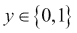

这里，0 指的是负类，1 指的是正类。 虽然我们称他们为正面或负面的阶级，但这只是为了方便起见。 算法对这项任务是中立的。

线性回归虽然在回归任务中工作得很好，但在分类任务中遇到了一些限制。 这些措施包括：

*   拟合过程很容易受到异常值的影响。
*   不能保证假设函数*h(X)*符合 0(负类)到 1(正类)的范围

Logistic 回归保证*h(X)*在 0 到 1 之间。虽然 Logistic 回归中有回归一词，但它更多的是一个错误的名称，它在很大程度上是一种分类算法：

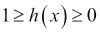

在线性回归中，假设函数如下：


在 Logistic 回归中，我们稍微修改了假设方程，如下所示：

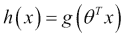

*g*函数称为，称为**Sigmoid 函数**或**Logistic 函数**，并且对于实数*t*定义如下：

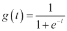

这是 Sigmoid 函数在图形中的样子：


如您所见，当*t*接近负无穷大时，*g(T)*接近 0，而当*t*接近无穷大时，*g(T)*接近 1。因此，这保证了假设函数输出永远不会落在 0 到 1 的范围之外。

现在，假设函数可以重写为：

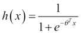

*h(X)*是给定预测器*x*的*y=1*的估计概率，因此*h(X)*也可以重写为：

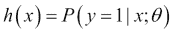

换言之，假设函数表示*y*是由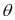参数化的 1 个给定特征矩阵*x*的概率。 这个概率可以是 0 到 1 之间的任何实数，但是我们的分类目标不允许我们有连续的值；我们只能有两个值 0 或 1 来表示负值或正值。

假设我们预测*y=1*如果

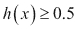

否则*y=0*。 如果我们再次查看 Sigmoid 函数图，我们意识到，当Sigmoid 函数为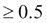时，也就是说，对于*t*的正值，它将预测正类别：

由于，这意味着对于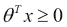，将预测正类别。 为了更好地说明这一点，让我们将其扩展为双变量情况的非矩阵形式：


由等式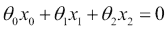表示的平面将决定给定的向量属于正类还是负类。 这条线称为决策边界。

根据训练集的不同，该边界不必是线性的。 如果训练数据没有跨越线性边界分离，可以添加更高级别的多项式特征来促进它。 例如，可以通过平方 x1 和 x2 来添加两个新功能，如下所示：

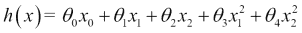

请注意，对于学习算法，此增强与以下公式完全相同：


学习算法将多项式的引入视为另一个特征。 这在试衣过程中给了你很大的力量。 这意味着只要正确选择多项式和参数，就可以创建任何复杂的决策边界。

让我们花一些时间来了解我们如何选择正确的参数值，就像我们在线性回归的情况下所做的那样。 线性回归情况下的成本函数*J*为：


正如你知道的，我们在这个成本函数中平均成本。 让我们用成本项来表示：


换句话说，成本项是算法在预测实际响应变量值*y*为*h(X)*时必须支付的成本：

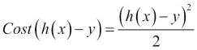

这个成本对于线性回归很有效，但是对于 Logistic 回归，这个成本函数是非凸的(也就是说，它会导致多个局部最小值)，我们需要找到一种更好的凸方法来估计成本。

适用于 Logistic 回归的成本函数如下：


让我们将这两个成本函数合并为一个：


让我们将此成本函数放回*J*：


目标是最小化成本，即最小化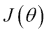的价值。 这是使用梯度下降算法完成的。 Spark 有两个支持逻辑回归的类：

*   `LogisticRegressionWithSGD`
*   `LogisticRegressionWithLBFGS`

最好使用`LogisticRegressionWithLBFGS`类，因为它省去了优化步长的步骤。

## 做好准备

2006 年，铃木、Tsurusaki 和 KoDama 对一种濒危洞穴蜘蛛在日本不同海滩上的分布进行了一些研究([https://www.jstage.jst.go.jp/article/asjaa/55/2/55_2_79/_pdf](https://www.jstage.jst.go.jp/article/asjaa/55/2/55_2_79/_pdf))。

让我们来看看一些关于颗粒大小和蜘蛛存在的数据：

<colgroup><col style="text-align: left"> <col style="text-align: left"></colgroup> 
| 

粒度(毫米)

 | 

蜘蛛礼物

 |
| --- | --- |
| 0.245 | 缺席的 / 走神的 / 缺少的 / 心不在焉的 |
| 0.247 | 缺席的 / 走神的 / 缺少的 / 心不在焉的 |
| 0.285 | 郑重赠与 / 介绍 / 呈现 / 赠送 |
| 0.299 | 郑重赠与 / 介绍 / 呈现 / 赠送 |
| 0.327 | 郑重赠与 / 介绍 / 呈现 / 赠送 |
| 0.347 | 郑重赠与 / 介绍 / 呈现 / 赠送 |
| 0.356 | 缺席的 / 走神的 / 缺少的 / 心不在焉的 |
| 0.36 | 郑重赠与 / 介绍 / 呈现 / 赠送 |
| 0.363 | 缺席的 / 走神的 / 缺少的 / 心不在焉的 |
| 0.364 | 郑重赠与 / 介绍 / 呈现 / 赠送 |
| 0.398 | 缺席的 / 走神的 / 缺少的 / 心不在焉的 |
| 0.4 | 郑重赠与 / 介绍 / 呈现 / 赠送 |
| 0.409 | 缺席的 / 走神的 / 缺少的 / 心不在焉的 |
| 0.421 | 郑重赠与 / 介绍 / 呈现 / 赠送 |
| 0.432 | 缺席的 / 走神的 / 缺少的 / 心不在焉的 |
| 0.473 | 郑重赠与 / 介绍 / 呈现 / 赠送 |
| 0.509 | 郑重赠与 / 介绍 / 呈现 / 赠送 |
| 0.529 | 郑重赠与 / 介绍 / 呈现 / 赠送 |
| 0.561 | 缺席的 / 走神的 / 缺少的 / 心不在焉的 |
| 0.569 | 缺席的 / 走神的 / 缺少的 / 心不在焉的 |
| 0.594 | 郑重赠与 / 介绍 / 呈现 / 赠送 |
| 0.638 | 郑重赠与 / 介绍 / 呈现 / 赠送 |
| 0.656 | 郑重赠与 / 介绍 / 呈现 / 赠送 |
| 0.816 | 郑重赠与 / 介绍 / 呈现 / 赠送 |
| 0.853 | 郑重赠与 / 介绍 / 呈现 / 赠送 |
| 0.938 | 郑重赠与 / 介绍 / 呈现 / 赠送 |
| 1.036 | 郑重赠与 / 介绍 / 呈现 / 赠送 |
| 1.045 | 郑重赠与 / 介绍 / 呈现 / 赠送 |

我们将使用该数据来训练算法。 缺席将表示为 0，出席将表示为 1。

## How to Do It…

1.  启动 Spark Shell：

    ```scala
    $ spark-shell

    ```

2.  导入统计信息及相关类：

    ```scala
    scala> import org.apache.spark.mllib.linalg.Vectors
    scala> import org.apache.spark.mllib.regression.LabeledPoint
    scala> import org.apache.spark.mllib.classification.LogisticRegressionWithLBFGS

    ```

3.  创建一个`LabeledPoint`数组，是否有蜘蛛作为标签：

    ```scala
    scala> val points = Array(
    LabeledPoint(0.0,Vectors.dense(0.245)),
    LabeledPoint(0.0,Vectors.dense(0.247)),
    LabeledPoint(1.0,Vectors.dense(0.285)),
    LabeledPoint(1.0,Vectors.dense(0.299)),
    LabeledPoint(1.0,Vectors.dense(0.327)),
    LabeledPoint(1.0,Vectors.dense(0.347)),
    LabeledPoint(0.0,Vectors.dense(0.356)),
    LabeledPoint(1.0,Vectors.dense(0.36)),
    LabeledPoint(0.0,Vectors.dense(0.363)),
    LabeledPoint(1.0,Vectors.dense(0.364)),
    LabeledPoint(0.0,Vectors.dense(0.398)),
    LabeledPoint(1.0,Vectors.dense(0.4)),
    LabeledPoint(0.0,Vectors.dense(0.409)),
    LabeledPoint(1.0,Vectors.dense(0.421)),
    LabeledPoint(0.0,Vectors.dense(0.432)),
    LabeledPoint(1.0,Vectors.dense(0.473)),
    LabeledPoint(1.0,Vectors.dense(0.509)),
    LabeledPoint(1.0,Vectors.dense(0.529)),
    LabeledPoint(0.0,Vectors.dense(0.561)),
    LabeledPoint(0.0,Vectors.dense(0.569)),
    LabeledPoint(1.0,Vectors.dense(0.594)),
    LabeledPoint(1.0,Vectors.dense(0.638)),
    LabeledPoint(1.0,Vectors.dense(0.656)),
    LabeledPoint(1.0,Vectors.dense(0.816)),
    LabeledPoint(1.0,Vectors.dense(0.853)),
    LabeledPoint(1.0,Vectors.dense(0.938)),
    LabeledPoint(1.0,Vectors.dense(1.036)),
    LabeledPoint(1.0,Vectors.dense(1.045)))

    ```

4.  创建前面数据的 RDD：

    ```scala
    scala> val spiderRDD = sc.parallelize(points)

    ```

5.  使用此数据训练模型(Intercept 是所有预测值为零时的值)：

    ```scala
    scala> val lr = new LogisticRegressionWithLBFGS().setIntercept(true)
    scala> val model = lr.run(spiderRDD)

    ```

6.  根据粒度预测蜘蛛的存在`0.938`：

    ```scala
    scala> val predict = model.predict(Vectors.dense(0.938))

    ```

# 使用支持向量机进行二值分类

分类是一种根据数据的效用将数据放入不同的类的技术。 例如，一家电商公司可以给潜在访问者贴上两个标签“将购买”或“不会购买”。

这种分类是通过向机器学习算法提供一些已经标记的数据(称为**训练数据**)来完成的。 挑战在于如何标记两个班级之间的边界。 我们举一个简单的例子，如下图所示：


在上述情况下，我们将灰色和黑色指定为“不会购买”和“将购买”标签。 这里，在两个类之间绘制一条线非常简单，如下所示：

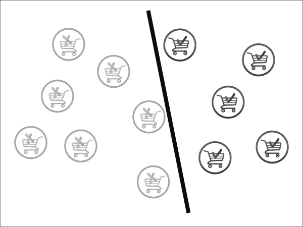

这就是我们能做的最好的了吗？ 不尽然，让我们试着把工作做得更好。 黑色分类器与“将买”和“不买”购物车的距离并不相等。 让我们做一个更好的尝试，如下所示：


现在这个看起来不错。 这实际上就是SVM 算法所做的事情。 您可以在上图中看到，实际上只有三个手推车决定了线路的斜率：两个黑色手推车在线路上方，一个灰色手推车在线路下方。 这些购物车被称为**支持向量**，其余的购物车，也就是向量，是无关紧要的。

有时，要绘制一条直线和一条曲线来分隔两个类并不容易，如下所示：


有时即使这样也是不够的。 在这种情况下，我们需要两个以上的维度来解决问题。 我们需要的不是一条机密线路，而是一架超飞机。 事实上，每当数据过于杂乱时，添加额外的维度有助于找到一个超平面来分隔类。 下图说明了这一点：

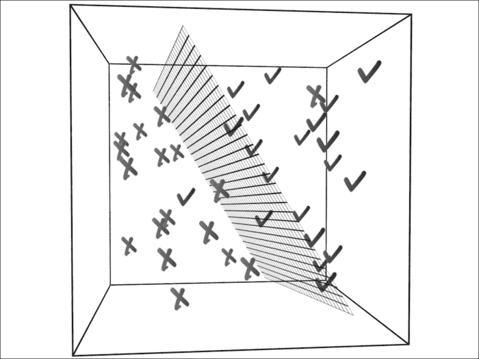

这并不意味着添加额外的维度总是一个好主意。 大多数情况下，我们的目标是降低维度，只保留相关的维度/特征。 一套完整的算法致力于降维；我们将在后面的章节中讨论这些问题。

## How to Do It…

1.  Spark 库自带样本`libsvm`数据。 我们将使用此命令并将数据加载到 HDFS：

    ```scala
    $ hdfs dfs -put /opt/infoobjects/spark/data/mllib/sample_libsvm_data.txt /user/hduser/sample_libsvm_data.txt

    ```

2.  启动 Spark Shell：

    ```scala
    $ spark-shell

    ```

3.  执行所需的导入：

    ```scala
    scala> import org.apache.spark.mllib.classification.SVMWithSGD
    scala> import org.apache.spark.mllib.evaluation.BinaryClassificationMetrics
    scala> import org.apache.spark.mllib.regression.LabeledPoint
    scala> import org.apache.spark.mllib.linalg.Vectors
    scala> import org.apache.spark.mllib.util.MLUtils

    ```

4.  将数据加载为 RDD：

    ```scala
    scala> val svmData = MLUtils.loadLibSVMFile(sc,"sample_libsvm_data.txt")

    ```

5.  统计记录数：

    ```scala
    scala> svmData.count

    ```

6.  现在让我们将数据集分为一半的训练数据和一半的测试数据：

    ```scala
    scala> val trainingAndTest = svmData.randomSplit(Array(0.5,0.5))

    ```

7.  分配`training`和`test`数据：

    ```scala
    scala> val trainingData = trainingAndTest(0)
    scala> val testData = trainingAndTest(1)

    ```

8.  训练算法并为 100 次迭代构建模型(您可以尝试不同的迭代，但您会看到，在某个点上，结果开始收敛，这是一个很好的选择)：

    ```scala
    scala> val model = SVMWithSGD.train(trainingData,100)

    ```

9.  现在，我们可以使用此模型来预测任何数据集的标签。 让我们预测测试数据中第一个点的标签：

    ```scala
    scala> val label = model.predict(testData.first.features)

    ```

10.  让我们创建一个元组，其中第一个值作为测试数据的预测值，第二个值实际标签，这将帮助我们计算算法的精度：

    ```scala
    scala> val predictionsAndLabels = testData.map( r => (model.predict(r.features),r.label))

    ```

11.  您可以统计有多少条记录的预测和实际标签不匹配：

    ```scala
    scala> predictionsAndLabels.filter(p => p._1 != p._2).count

    ```

# 使用决策树进行分类

决策树是机器学习算法中最直观的一种。 我们在日常生活中一直使用决策树。

决策树算法有很多有用的功能：

*   易于理解和解释
*   同时使用分类要素和连续要素
*   使用缺少的要素
*   不需要功能缩放

决策树算法以倒置的顺序工作，在每个级别评估包含特征的表达式，并将数据集分成两类。 我们将通过一个简单的例子来帮助你理解这一点，这是我们大多数人在大学里玩的一个愚蠢的字谜游戏。 我猜出了一只动物，然后让我的同事问我一些问题来做出我的选择。 以下是她的提问过程：

问 1：它是一种大型动物吗？

A：是的

问 2：这种动物能活到 40 岁以上吗？

A：是的

问题 3：这只动物是大象吗？

A：是的

这显然是一个过于简单化的案例，她知道我假设了一头大象(在大数据世界里你还会猜到什么呢？)。 让我们扩展此示例以包括更多动物，如下图所示(灰色框是类)：


上面的例子是一个多类分类的例子。 在本食谱中，我们将重点介绍二进制分类。

## 做好准备

每当我们的儿子早上必须上网球课时，教练就会在前一天晚上查看天气预报，决定第二天早上是否适合打网球。 本食谱将使用此示例构建决策树。

让我们来决定一下影响上午是否打网球的天气特征：

*   雨水 / 下雨 / 雨天 / 雨季
*   风速
*   温度 / 气温 / 体温 / 发烧

让我们构建一个包含不同组合的表：

<colgroup><col style="text-align: left"> <col style="text-align: left"> <col style="text-align: left"> <col style="text-align: left"></colgroup> 
| 

雨水 / 下雨 / 雨天 / 雨季

 | 

风大的 / 肠胃气胀的 / 腹胀的 / 吹牛的

 | 

温度 / 气温 / 体温 / 发烧

 | 

打网球?

 |
| --- | --- | --- | --- |
| 肯定的回答 / 赞成 / 是 | 肯定的回答 / 赞成 / 是 | 热 | 不 / 否决票 / 同 Noh |
| 肯定的回答 / 赞成 / 是 | 肯定的回答 / 赞成 / 是 | 标准的 / 常见的 / 正常的 / 正规的 | 不 / 否决票 / 同 Noh |
| 肯定的回答 / 赞成 / 是 | 肯定的回答 / 赞成 / 是 | 凉爽的 | 不 / 否决票 / 同 Noh |
| 不 / 否决票 / 同 Noh | 肯定的回答 / 赞成 / 是 | 热 | 不 / 否决票 / 同 Noh |
| 不 / 否决票 / 同 Noh | 肯定的回答 / 赞成 / 是 | 凉爽的 | 不 / 否决票 / 同 Noh |
| 不 / 否决票 / 同 Noh | 不 / 否决票 / 同 Noh | 热 | 肯定的回答 / 赞成 / 是 |
| 不 / 否决票 / 同 Noh | 不 / 否决票 / 同 Noh | 标准的 / 常见的 / 正常的 / 正规的 | 肯定的回答 / 赞成 / 是 |
| 不 / 否决票 / 同 Noh | 不 / 否决票 / 同 Noh | 凉爽的 | 不 / 否决票 / 同 Noh |

现在，我们如何构建决策树？ 我们可以从以下三个特征中的一个开始：下雨、刮风或温度。 规则是从一个功能开始，这样才有可能获得最大的信息增益。

在下雨天，正如您在表中看到的那样，其他功能都无关紧要，也就没有什么可玩的了。 对于高风速也是如此。

像大多数其他算法一样，决策树只将特征值作为双精度值。 因此，让我们进行映射：

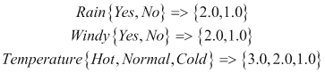

正级为 1.0，负级为 0.0。 让我们使用 CSV 格式加载数据，并使用第一个值作为标签：

```scala
$vi tennis.csv
0.0,1.0,1.0,2.0
0.0,1.0,1.0,1.0
0.0,1.0,1.0,0.0
0.0,0.0,1.0,2.0
0.0,0.0,1.0,0.0
1.0,0.0,0.0,2.0
1.0,0.0,0.0,1.0
0.0,0.0,0.0,0.0

```

## How to Do It…

1.  启动 Spark Shell：

    ```scala
    $ spark-shell

    ```

2.  执行所需的导入：

    ```scala
    scala> import org.apache.spark.mllib.tree.DecisionTree
    scala> import org.apache.spark.mllib.regression.LabeledPoint
    scala> import org.apache.spark.mllib.linalg.Vectors
    scala> import org.apache.spark.mllib.tree.configuration.Algo._
    scala> import org.apache.spark.mllib.tree.impurity.Entropy

    ```

3.  加载文件：

    ```scala
    scala> val data = sc.textFile("tennis.csv")
    ```

4.  解析数据并将其加载到`LabeledPoint`：

    ```scala
    scala> val parsedData = data.map {
    line =>  val parts = line.split(',').map(_.toDouble)
     LabeledPoint(parts(0), Vectors.dense(parts.tail)) }

    ```

5.  使用此数据训练算法：

    ```scala
    scala> val model = DecisionTree.train(parsedData, Classification, Entropy, 3)

    ```

6.  创建无雨、大风和凉爽温度的矢量：

    ```scala
    scala> val v=Vectors.dense(0.0,1.0,0.0)

    ```

7.  预测是否应该打网球：

    ```scala
    scala> model.predict(v)

    ```

## …的工作原理

让我们画一下我们在这个食谱中创建的网球决策树：

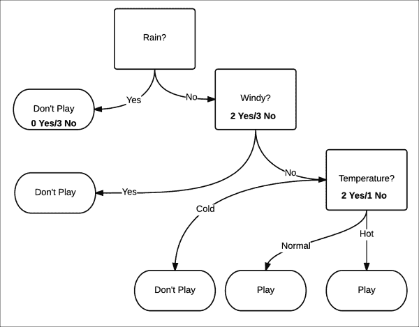

这个模型有三个层次的深度。 选择哪个属性取决于我们如何最大化信息增益。 的测量方式是通过测量裂解的纯度。 纯度意味着，无论确定性是否增加，给定的数据集都将被认为是正的或负的。 在这个例子中，这等同于玩游戏的几率在增加，还是不玩游戏的几率在增加。

纯度是用熵来衡量的。 熵是衡量系统无序程度的指标。 在这种情况下，更容易将其理解为不确定性的衡量标准：

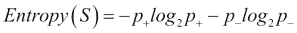

纯度最高为 0，最低为 1。让我们试着用这个公式来确定纯度。

当下雨时，打网球的概率是*p+*是 0/3=0。 不打网球的概率*p_*是 3/3=1：


这是一套纯粹的套装。

当雨为为否时，打网球的概率为*p+*为 2/5=0.4。 不打网球的概率*p_*是 3/5=0.6：


这几乎是一套不纯正的布景。 最不纯的是概率为 0.5 的情况。

Spark 使用三种方法来确定杂质：

*   基尼杂质(分类)
*   熵(分类)
*   方差(回归)

信息增益是父节点杂质与两个子节点杂质的加权和之间的差值。 让我们看一下第一个拆分，它将大小为 8 的数据划分为大小为 3(左)和 5(右)的两个数据集。 让我们将第一个分裂*S1*、父节点*RAIN*、左子节点*无雨*和右子节点*Wind*命名为。 因此，信息收益将是：

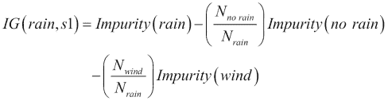

由于我们为熵计算了*无雨*和*风*的杂质，让我们计算*雨*的熵：


现在让我们计算一下信息增益：

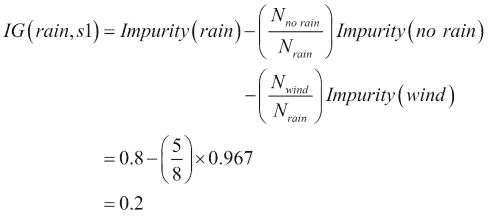

因此，在第一次拆分中，信息增益为 0.2。 这就是我们所能做到的最好结果吗？ 让我们看看我们的算法会得出什么结果。 首先，我们来了解一下这棵树的深度：

```scala
scala> model.depth
Int = 2

```

这里，与我们直观地构建的`3`相比，深度是`2`，所以这个模型似乎得到了更好的优化。 让我们看看树的结构：

```scala
scala> model.toDebugString
String =  "DecisionTreeModel classifier of depth 2 with 5 nodes
If (feature 1 <= 0.0)
 If (feature 2 <= 0.0)
 Predict: 0.0
 Else (feature 2 > 0.0)
 Predict: 1.0
Else (feature 1 > 0.0)
 Predict: 0.0

```

让我们直观地构建它，以便更好地理解：


我们将不再详细介绍，因为我们已经在前面的模型中做了这项工作。 我们将直接计算信息增益：0.44

正如您在本例中看到的，信息增益为 0.44，是第一个模型的两倍多。

如果你看第二级节点，杂质是零。 在这种情况下，它很棒，因为我们在深度 2 得到了它。想象一下深度是 50 的情况。 在这种情况下，决策树对于训练数据将工作得很好，而对于测试数据将会很差。 这种情况称为**过拟合**。

避免过度适应的一种解决方案是修剪。 您可以将训练数据分为两个集合：训练集和验证集。 您可以使用训练集训练模型。 现在，您可以通过慢慢删除左边的节点来针对验证集测试模型。 如果删除叶节点(主要是单例节点，即它只包含一个数据点)可以提高模型的性能，则将从模型中修剪此叶节点。

# 使用随机森林进行分类

有时一棵决策树是不够的，因此需要使用一组决策树来生成更强大的模型。 这些称为**集成学习算法**。 集成学习算法并不局限于使用决策树作为基本模型。

在集成学习算法中最流行的是随机森林。 在随机森林中，种植的不是一棵树，而是*K*棵树。 每棵树被给予训练数据的随机子集*S*。 此外，每棵树都只使用部分功能。 当涉及到预测时，多数投票是在树木上进行的，这就成为了预测。

让我们用一个例子来解释这一点。 它的目标是为给定的人预测他/她的信用是好是坏。

为此，我们将提供带标签的训练数据-在本例中，即具有特征和标签的人，无论他/她拥有良好的信用还是不良的信用。 现在我们不想创建特征偏差，因此我们将提供随机选择的特征集。 提供随机选择的特征子集还有另一个原因，那就是大多数现实世界的数据即使没有数千个特征，也有数百个。 例如，文本分类算法通常具有 50K-100K 特征。

在这种情况下，为了增加故事的趣味性，我们不打算提供功能，但我们将询问不同的人，为什么他们认为一个人的信用是好是坏。 现在，根据定义，不同的人接触到一个人的不同特征(有时是重叠的)，这给了我们与随机选择的特征相同的功能。

我们的第一个例子是杰克，他被贴上了“不良信用”的标签。 我们先从在杰克最喜欢的酒吧大象酒吧工作的乔伊开始。 一个人可以推断为什么给出一个标签的唯一方法就是问是/不是的问题。 让我们看看乔伊怎么说：

问题 1：杰克小费给得好吗？ (特写：慷慨)

A：没有，没有

问 2：杰克每次访问至少花费 60 美元吗？ (特点：挥霍无度)

A：是的

问题 3：即使是最小的挑衅，他也会卷入酒吧斗殴吗？ (功能：易失性)

A：是的

这就解释了为什么杰克的信用不好。

我们现在问问杰克的女朋友史黛西：

问题 1：当我们一起玩的时候，杰克总是买单吗？ (特写：慷慨)

A：没有，没有

问 2：杰克还了他欠我的 500 美元了吗？ (特点：责任)

A：没有，没有

问题 3：他有时会为了炫耀而超支吗？ (特点：挥霍无度)

A：是的

这就解释了为什么杰克的信用不好。

现在我们请杰克最好的朋友乔治：

问 1：当杰克和我在我的公寓里闲逛时，他会自己打扫卫生吗？ (功能：有条理)

A：没有，没有

问 2：杰克是不是在我的超级碗聚餐时空手而归？ (功能：关爱)

A：是的

问 3：他有没有用“我把钱包忘在家里了”的借口让我在餐馆为他买单？ (特点：责任)

A：是的

这就解释了为什么杰克的信用不好。

现在我们来谈谈信用良好的杰西卡。 让我们问问斯泰西，她恰好是杰西卡的妹妹：

问题 1：每当我缺钱的时候，杰西卡会主动提供帮助吗？ (特写：慷慨)

A：是的

问题 2：杰西卡按时付账吗？ (特点：责任)

A：是的

问题 3：杰西卡愿意帮我照看孩子吗？ (功能：关爱)

A：是的

这就解释了为什么杰西卡有很好的信誉。

现在我们问乔治，谁恰好是她的丈夫：

问题 1：杰西卡保持房子整洁吗？ (功能：有条理)

A：是的

问题 2：她(T0)期待昂贵的礼物吗？ (特点：挥霍无度)

A：没有，没有

问题 3：当你忘了修剪草坪时，她会不会不高兴？ (功能：易失性)

A：没有，没有

这就解释了为什么杰西卡有很好的信誉。

现在让我们问问大象酒吧的调酒师乔伊：

问题 1：每当她和朋友一起来酒吧时，她大多是指定的司机吗？ (特点：负责任)

A：是的

问题 2：她总是把剩菜带回家吗？ (特点：挥霍无度)

A：是的

问题 3：她的小费给得好吗？ (特写：慷慨)

A：是的

随机森林的工作方式是在两个级别上进行随机选择：

*   数据的子集
*   分割该数据的要素子集

这两个子集都可以重叠。

在我们的示例中，我们有六个功能，我们将为每个树分配三个功能。 这样，我们很有可能会有重叠。

让我们再向我们的培训数据集中添加 8 个人：

<colgroup><col style="text-align: left"> <col style="text-align: left"> <col style="text-align: left"> <col style="text-align: left"> <col style="text-align: left"> <col style="text-align: left"> <col style="text-align: left"> <col style="text-align: left"></colgroup> 
| 

名字 / 姓名 / 姓 / 名人

 | 

给…贴标签 / 把…归类 / 标注 / 贴标签于

 | 

慷慨 / 大方 / 丰富 / 宽宏大量

 | 

责任 / 职责 / 道德义务 / 义务

 | 

照料 / 谨慎 / 烦恼事

 | 

组织 / 机构 / 体制 / 条理

 | 

挥霍者，浪费者

 | 

易挥发的 / 易变的 / 不稳定的 / 反复无常的

 |
| --- | --- | --- | --- | --- | --- | --- | --- |
| 起重器 / 插座 / 普通人 / 千斤顶 | 0 | 0 | 0 | 0 | 0 | 1. | 1. |
| 杰西卡 | 1. | 1. | 1. | 1. | 1. | 0 | 0 |
| 母驴 / 詹妮 / spinning jenny 的简称 | 0 | 0 | 0 | 1. | 0 | 1. | 1. |
| 把…堆成垛 / 堆叠 / 将（脖子，背部）轻微扭伤 | 1. | 1. | 1. | 0 | 1. | 0 | 0 |
| 爱尔兰人的绰号 | 0 | 0 | 0 | 0 | 0 | 1. | 1. |
| 杰布 | 1. | 1. | 1. | 1. | 0 | 0 | 0 |
| 鸦 / 爱唠叨的人 / 鸟 / 松鸡 | 1. | 0 | 1. | 1. | 1. | 0 | 0 |
| 纳特 | 0 | 1. | 0 | 0 | 0 | 1. | 1. |
| 罗恩 | 1. | 0 | 1. | 1. | 1. | 0 | 0 |
| 基质 / 模型 / 垫 / 衬边 | 0 | 1. | 0 | 0 | 0 | 1. | 1. |

## 做好准备

让我们将创建的数据放入以下文件中的`libsvm`格式：

```scala
rf_libsvm_data.txt
0 5:1 6:1
1 1:1 2:1 3:1 4:1
0 3:1 5:1 6:1
1 1:1 2:1 4:1
0 5:1 6:1
1 1:1 2:1 3:1 4:1
0 1:1 5:1 6:1
1 2:1 3:1 4:1
0 1:1 5:1 6:1

```

现在上传到 HDFS：

```scala
$ hdfs dfs -put rf_libsvm_data.txt

```

## How to Do It…

1.  启动 Spark Shell：

    ```scala
    $ spark-shell

    ```

2.  执行所需的导入：

    ```scala
    scala> import org.apache.spark.mllib.tree.RandomForest
    scala> import org.apache.spark.mllib.tree.configuration.Strategy
    scala> import org.apache.spark.mllib.util.MLUtils

    ```

3.  加载并解析数据：

    ```scala
    scala> val data =
     MLUtils.loadLibSVMFile(sc, "rf_libsvm_data.txt")

    ```

4.  将数据拆分为`training`和`test`数据集：

    ```scala
    scala> val splits = data.randomSplit(Array(0.7, 0.3))
    scala> val (trainingData, testData) = (splits(0), splits(1))

    ```

5.  创建分类为树策略(随机森林也支持回归)：

    ```scala
    scala> val treeStrategy = Strategy.defaultStrategy("Classification")

    ```

6.  训练模型：

    ```scala
    scala> val model = RandomForest.trainClassifier(trainingData,
     treeStrategy, numTrees=3, featureSubsetStrategy="auto", seed = 12345)

    ```

7.  在测试实例上评估模型并计算测试误差：

    ```scala
    scala> val testErr = testData.map { point =>
     val prediction = model.predict(point.features)
     if (point.label == prediction) 1.0 else 0.0
    }.mean()
    scala> println("Test Error = " + testErr)

    ```

8.  检查型号：

    ```scala
    scala> println("Learned Random Forest:n" + model.toDebugString)
    Learned Random Forest:nTreeEnsembleModel classifier with 3 trees
     Tree 0:
     If (feature 5 <= 0.0)
     Predict: 1.0
     Else (feature 5 > 0.0)
     Predict: 0.0
     Tree 1:
     If (feature 3 <= 0.0)
     Predict: 0.0
     Else (feature 3 > 0.0)
     Predict: 1.0
     Tree 2:
     If (feature 0 <= 0.0)
     Predict: 0.0
     Else (feature 0 > 0.0)
     Predict: 1.0

    ```

## …的工作原理

正如您在这样一个小示例中看到的那样，三个树使用不同的功能。 在拥有数千个功能和训练数据的真实使用案例中，这种情况不会发生，但大多数树在看待功能的方式上会有所不同，大多数人的投票将获胜。 请记住，在回归的情况下，对树进行平均以得到最终值。

# 使用梯度增强树进行分类

另一种集成学习算法是**梯度增强树**(**GBTS**)。 GBTS 一次训练一棵树，其中每棵新树都在先前训练树的缺点的基础上改进。

由于 GBT 一次训练一棵树，它们可能比随机森林花费更长的时间。

## 做好准备

我们将使用上一个食谱中使用的相同数据。

## How to Do It…

1.  启动 Spark Shell：

    ```scala
    $ spark-shell

    ```

2.  执行所需的导入：

    ```scala
    scala> import org.apache.spark.mllib.tree.GradientBoostedTrees
    scala> import org.apache.spark.mllib.tree.configuration.BoostingStrategy
    scala> import org.apache.spark.mllib.util.MLUtils

    ```

3.  加载并解析数据：

    ```scala
    scala> val data =
     MLUtils.loadLibSVMFile(sc, "rf_libsvm_data.txt")

    ```

4.  将数据拆分为`training`和`test`数据集：

    ```scala
    scala> val splits = data.randomSplit(Array(0.7, 0.3))
    scala> val (trainingData, testData) = (splits(0), splits(1))

    ```

5.  创建分类作为提升策略，并将迭代次数设置为`3`：

    ```scala
    scala> val boostingStrategy =
     BoostingStrategy.defaultParams("Classification")
    scala> boostingStrategy.numIterations = 3

    ```

6.  训练模型：

    ```scala
    scala> val model = GradientBoostedTrees.train(trainingData, boostingStrategy)

    ```

7.  在测试实例上评估模型并计算测试误差：

    ```scala
    scala> val testErr = testData.map { point =>
     val prediction = model.predict(point.features)
     if (point.label == prediction) 1.0 else 0.0
    }.mean()
    scala> println("Test Error = " + testErr)

    ```

8.  检查型号：

    ```scala
    scala> println("Learned Random Forest:n" + model.toDebugString)

    ```

在这种情况下，模型的精度是 0.9，这比我们在随机森林的情况下得到的结果要差。

# 用朴素贝叶斯进行分类

让我们考虑使用机器学习构建一个电子邮件垃圾邮件过滤器。 在这里，我们对两个类别感兴趣：针对未经请求的消息的垃圾邮件和针对常规电子邮件的非垃圾邮件：


第一个挑战是，当给定一封电子邮件时，我们如何将其表示为特征向量*x*。 一封电子邮件只是一串文本或一组单词(因此，这个问题领域属于一个更广泛的类别，称为**文本分类**)。 让我们用一个长度等于字典大小的特征向量来表示一封电子邮件。 如果词典中的给定单词出现在电子邮件中，则值为 1；否则为 0。 让我们构建一个用内容*在线药房销售*表示电子邮件的向量：


该特征向量中的词典称为，称为*词汇表*，并且向量的维度与词汇量的大小相同。 如果词汇表大小为 10,000，则此特征向量中的可能值将为 210,000。

我们的目标是对给定*y*的*x*的概率进行建模。 为了对*P(x|y)*建模，我们将做一个强有力的假设，该假设是*x*的条件独立的，这个假设称为，称为**朴素贝叶斯假设**，基于该假设的算法称为**朴素贝叶斯分类器**。

例如，对于表示垃圾邮件的*y=1*，“在线”出现的概率和“药房出现”的概率是独立的。 这是一个强有力的假设，与现实无关，但在获得准确预测方面效果非常好。

## 做好准备

Spark 与一个样本数据集捆绑在一起，以便与朴素贝叶斯一起使用。 让我们将此数据集加载到 HDFS：

```scala
$ hdfs dfs -put /opt/infoobjects/spark/data/mllib/sample_naive_bayes_data.txt
 sample_naive_bayes_data.txt

```

## How to Do It…

1.  启动 Spark Shell：

    ```scala
    $ spark-shell

    ```

2.  执行所需的导入：

    ```scala
    scala> import org.apache.spark.mllib.classification.NaiveBayes
    scala> import org.apache.spark.mllib.linalg.Vectors
    scala> import org.apache.spark.mllib.regression.LabeledPoint

    ```

3.  将数据加载到 RDD：

    ```scala
    scala> val data = sc.textFile("sample_naive_bayes_data.txt")

    ```

4.  将数据解析为`LabeledPoint`：

    ```scala
    scala> val parsedData = data.map { line =>
     val parts = line.split(',')
     LabeledPoint(parts(0).toDouble, Vectors.dense(parts(1).split(' ').map(_.toDouble)))
    }

    ```

5.  将数据对半分割为`training`和`test`数据集：

    ```scala
    scala> val splits = parsedData.randomSplit(Array(0.5, 0.5), seed = 11L)
    scala> val training = splits(0)
    scala> val test = splits(1)

    ```

6.  使用`training`数据集

    ```scala
    val model = NaiveBayes.train(training, lambda = 1.0)

    ```

    训练模型
7.  预测`test`数据集的标签：

    ```scala
    val predictionAndLabel = test.map(p => (model.predict(p.features), p.label))

    ```