# 第 9 章：使用 MLlib 进行无监督学习

本章将介绍如何使用 Spark 的机器学习库 MLlib 进行无监督学习。

本章分为以下食谱：

*   使用 k-均值进行聚类
*   主成分分析在降维中的应用
*   基于奇异值分解的降维方法

# 简介

以下是维基百科对无监督学习的定义：

> *“在机器学习中，无监督学习的问题是试图在未标记的数据中发现隐藏的结构。”*

与监督学习不同，在监督学习中，我们已经标记数据来训练算法，在非监督学习中，我们要求算法自己找到结构。 让我们来看一下以下示例数据集：

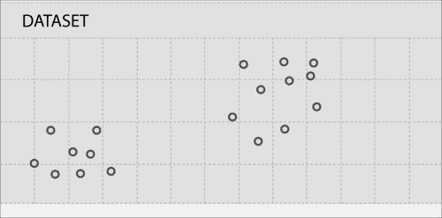

正如您从上图中可以看到的，数据点正在形成两个群集，如下所示：


事实上，聚类是最常见的无监督学习算法。

# 使用 k-均值进行聚类

聚类分析或聚类是将数据分组到多个组以使一个组中的数据与其他组中的数据相似的过程。

以下是使用群集的几个示例：

*   **市场细分**：将目标市场划分为多个细分市场，以便更好地满足每个细分市场的需求
*   **社交网络分析**：在社交网络中找到一组连贯的人，以便通过 Facebook 等社交网站进行广告投放
*   **数据中心计算集群**：将一组计算机放在一起以提高性能
*   **天文数据分析**：了解天文数据和事件，如星系形成
*   **房地产**：基于相似特征识别个社区
*   **文本分析**：将文本文档(如小说或散文)划分为体裁

K-Means算法使用图像进行了最好的说明，因此让我们再次查看我们的样例图：


K-Means的第一步是随机选择两个称为**簇质心**的点：

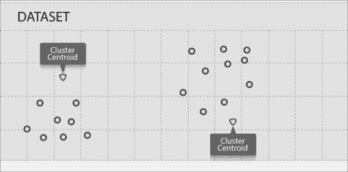

K-Means 算法是一种迭代算法，分两步工作：

*   **集群分配步骤**：该算法将遍历每个数据点，并且根据它更接近哪个质心，它将被分配到该质心，进而被分配到它所代表的集群
*   **移动质心步骤**：此算法将获取每个质心，并将其移动到簇中数据点的平均值

让我们来看看我们的数据在集群分配之后是什么样子：

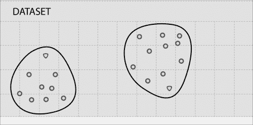

现在，让我们将集群质心移动到集群中个数据点的平均值，如下所示：


在这种情况下，一次迭代就足够了，进一步的迭代不会移动集群质心。 对于大多数真实数据，需要多次迭代才能将质心移动到最终位置。

K-Means 算法将多个簇作为输入。

## 做好准备

让我们使用加利福尼亚州萨拉托加市的一些不同的住房数据。 这一次，我们将考虑地块大小和房价：

<colgroup><col style="text-align: left"> <col style="text-align: left"></colgroup> 
| 

对你来说是天赐良机

 | 

房价(单位：1,000 美元)

 |
| --- | --- |
| 12839 | 2405 |
| 10000 | 2200 |
| 8040 | 一千四百 |
| 13104 | 1800 |
| 10000 | 2351 |
| 3049 | 795 |
| 38768 | 2725 |
| 16250 | 2150 |
| 43026 | 2724 |
| 44431 | 2675 |
| 40000 | 2930 |
| 1260 | 八百七十 |
| 15000 | 2210 |
| 10032 | 1145 |
| 12420 | 2419 |
| 69696 | 2750 |
| 12600 | 2035 年 |
| 10240 | 一一五零 |
| 876 | 665 |
| 8125 | 1430 |
| 11792 | 1920 年 |
| 1512 | 一二三零 |
| 1276 | 975 |
| 67518 | 2400 |
| 9810 | 1725 |
| 6324 | 二三零零 |
| 12510 | 一七零零 |
| 15616 | 一九一五年 |
| 15476 | 2278 |
| 13390 | 2497.5 |
| 1158 | 七百二十五 |
| 2000 年 | 八百七十 |
| 2614 | 730 |
| 13433 | 2050 年 |
| 12500 | 3330 |
| 15750 | 1120 |
| 13996 | 4100 |
| 10450 | 1655 |
| 七千五百 | 1550 |
| 12125 | 2100 |
| 14500 | 2100 |
| 10000 | 1175 |
| 10019 | 2047.5 |
| 48787 | 3998 |
| 53579 | 2688 |
| 10788 | 2251 |
| 11865 | 1906 年 |

让我们将此数据转换为名为`saratoga.c``sv`的**逗号分隔值**(**CSV**)文件，并将其绘制为散点图：

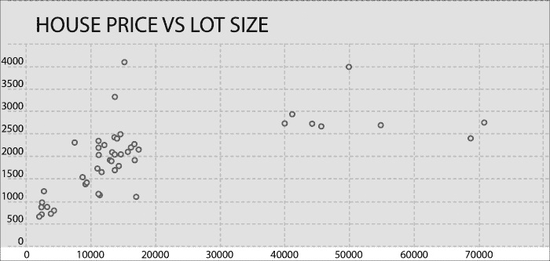

寻找多个星系团是一项棘手的任务。 在这里，我们有目视检查的优势，这对于超平面(三维以上)上的数据是不可用的。 让我们将数据大致划分为四个集群，如下所示：

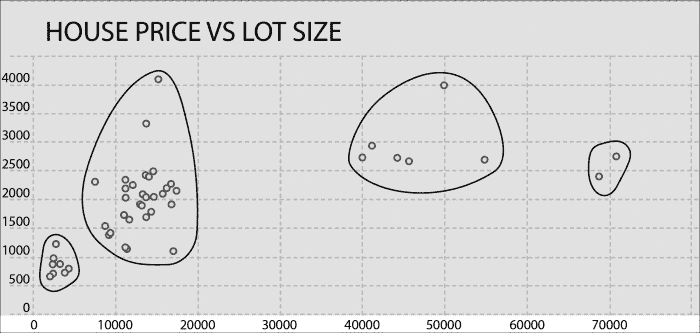

我们将运行 k-Means 算法来做同样的事情，看看我们的结果有多接近。

## How to Do It…

1.  将`sarataga.csv`加载到 HDFS：

    ```scala
    $ hdfs dfs -put saratoga.csv saratoga.csv

    ```

2.  启动 Spark Shell：

    ```scala
    $ spark-shell

    ```

3.  导入统计信息及相关类：

    ```scala
    scala> import org.apache.spark.mllib.linalg.Vectors
    scala> import org.apache.spark.mllib.clustering.KMeans

    ```

4.  将`saratoga.csv`加载为 RDD：

    ```scala
    scala> val data = sc.textFile("saratoga.csv")

    ```

5.  将数据转换为密集向量的 RDD：

    ```scala
    scala> val parsedData = data.map( line => Vectors.dense(line.split(',').map(_.toDouble)))

    ```

6.  针对四个群集和五个迭代训练模型：

    ```scala
    scala> val kmmodel= KMeans.train(parsedData,4,5)

    ```

7.  将`parsedData`收集为本地 Scala 集合：

    ```scala
    scala> val houses = parsedData.collect

    ```

8.  预测第 0 个元素的群集：

    ```scala
    scala> val prediction = kmmodel.predict(houses(0))

    ```

9.  现在，让我们将 k-Means 的群集分配与我们单独完成的群集分配进行比较。 K-Means 算法提供从 0 开始的群集 ID。 检查数据后，您会发现我们给出的 A 到 D 集群 ID 与 k-Means 之间的映射如下：A=>3，B=>1，C=>0，D=>2。
10.  现在，让我们从图表的不同部分挑选一些数据，并预测它属于哪个集群。
11.  让我们看看房子(18)的数据，它的批量大小为 876 平方英尺，定价为 665k 美元：

    ```scala
    scala> val prediction = kmmodel.predict(houses(18))
    resxx: Int = 3

    ```

12.  现在，看看房屋(35)的数据，成交量为 15,750 平方英尺，价格为 112 万美元：

    ```scala
    scala> val prediction = kmmodel.predict(houses(35))
    resxx: Int = 1

    ```

13.  现在看看房子(6)的数据，它的地块大小为 38,768 平方英尺，定价为 272.5 万美元：

    ```scala
    scala> val prediction = kmmodel.predict(houses(6))
    resxx: Int = 0

    ```

14.  现在看看房屋(15)的数据，它的地块大小为 69,696 平方英尺，定价为 275 万美元：

    ```scala
    scala>  val prediction = kmmodel.predict(houses(15))
    resxx: Int = 2

    ```

您可以使用更多的数据来测试预测能力。 让我们做一些邻域分析，看看这些群集有什么意义。 第三组的大部分房子都在市中心附近。 第二组房屋位于丘陵地带。

在本例中，我们处理了一组非常小的特性；常识和视觉检查也会使我们得出相同的结论。 K-Means 算法的优点在于它对具有无限多个特征的数据进行聚类。 当您有原始数据并想知道数据中的模式时，它是一个很好的工具。

# 主成分分析降维

降维是降低维度或特征数量的过程。 大量的真实数据包含非常多的特征。 拥有数以千计的功能并不少见。 现在，我们需要深入到重要的功能。

降维用于几个目的，例如：

*   数据压缩
*   可视化

当维度数量减少时，它会减少磁盘占用空间和内存占用空间。 最后但并非最不重要的一点是，它有助于算法运行得更快。 它还有助于将高度相关的维度减少到一个维度。

人类只能可视化三个维度，但是数据可以有更多的维度。 可视化可以帮助发现数据中隐藏的模式。 降维通过将多个特征压缩成一个来帮助可视化。

最流行的降维算法是**主成分分析**(**PCA**)。

让我们看一下以下数据集：

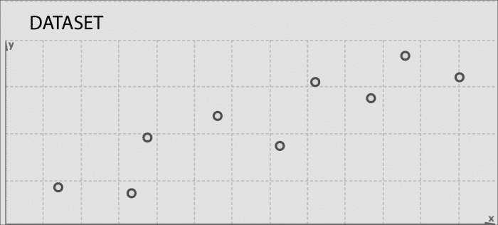

假设的目标是将这个二维数据分成一维。 做到这一点的方法是找到一条线，我们可以在其上投射这些数据。 让我们找一条适合将此数据投影到以下位置的行：


这是距数据点的投影距离最短的线。 让我们进一步解释一下，将每个数据点的最短行放到这条投影线上：


另一种看待它的方法是，即我们必须找到一条直线来投影数据，以便使数据点与这条直线的平方距离之和最小化。 这些灰色线段也称为**投影误差**。

## 做好准备

让我们来看看加利福尼亚州萨拉托加市的住房数据的三个特征，即房屋大小、地块大小和价格。 使用 PCA，我们将把房屋大小和批量特征合并为一个特征-*z*。 让我们把这个特征称为房屋的**z 密度**。

值得注意的是，并不总是可以为创建的新功能赋予意义。 在这种情况下，这很容易，因为我们只有两个功能可以组合，我们可以用我们的常识来组合这两个功能的效果。 在更实际的情况下，您可能会尝试将 1000 个功能投影到 100 个功能。 可能不可能给这 100 个功能中的每一个赋予真正的意义。

在本练习中，我们将使用 PCA 推导住房密度，然后进行线性回归，以了解该密度如何影响房价。

在我们深入研究 PCA 之前有一个预处理阶段：**特征缩放**。 当两个要素的范围具有非常不同的比例时，要素缩放就会出现在图片中。 在这里，房屋面积由 800 平方呎至 7 000 平方呎不等，而土地面积则由 800 平方呎至数英亩不等。

为什么之前不必进行功能缩放？ 答案是，我们真的没有必要把功能放在一个公平的竞争环境中。 梯度下降是特征缩放非常有用的另一个领域。

有种不同的功能缩放方式：

*   将要素值除以最大值会将每个要素置于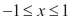范围内
*   将要素值除以范围，即最大值-最小值
*   用要素值的平均值减去其值，然后除以该范围
*   用要素值的平均值减去其值，然后除以标准差

我们将使用第四种选择以最好的方式进行扩展。 以下是我们将用于此食谱的数据：

<colgroup><col style="text-align: left"> <col style="text-align: left"> <col style="text-align: left"> <col style="text-align: left"> <col style="text-align: left"></colgroup> 
| 

房屋大小

 | 

对你来说是天赐良机

 | 

按比例调整的房屋大小

 | 

按比例批量

 | 

房价(单位：1,000 美元)

 |
| --- | --- | --- | --- | --- |
| 2524 | 12839 | -0.025 | -0.231 | 2405 |
| 2937 | 10000 | 0.323 | -0.4； | 2200 |
| 1778 年 | 8040 | -0.654 | -0.517 | 一千四百 |
| 1242 | 13104 | -1.105 | -0.215 | 1800 |
| 二九零零 | 10000 | 0.291 | -0.4； | 2351 |
| 一二一八 | 3049 | -1.126 | -0.814 | 795 |
| 2722 | 38768 | 0.142 | 1.312 | 2725 |
| 2553 | 16250 | -0.001-0.001 | -0.028 | 2150 |
| 3681 | 43026 | 0.949 | 1.566 | 2724 |
| 3032 | 44431 | 0.403 | 1.649 | 2675 |
| 3437 | 40000 | 0.744 | 1.385 | 2930 |
| 一六八零 | 1260 | -0.736 | -0.92 | 八百七十 |
| 2260 | 15000 | -0.248 | -0.103 | 2210 |
| 1660 | 10032 | -0.753 | -0.398 | 1145 |
| 3251 | 12420 | 0.587 | -0.256 | 2419 |
| 3039 | 69696 | 0.409 | 3.153 | 2750 |
| 3401 | 12600 | 0.714 | -0.245 | 2035 年 |
| 1620 | 10240 | -0.787 | -0.386 | 一一五零 |
| 876 | 876 | -1.414 | -0.943 | 665 |
| 1889 年 | 8125 | -0.56 | -0.512 | 1430 |
| 4406 | 11792 | 1.56 | -0.294 | 1920 年 |
| 1885 年 | 1512 | -0.564 | -0.905 | 一二三零 |
| 1276 | 1276 | -1.077 | -0.92 | 975 |
| 3053 | 67518 | 0.42 | 3.023 | 2400 |
| 2323 | 9810 | -0.195 | -0.412 | 1725 |
| 3139 | 6324 | 0.493 | -0.619 | 二三零零 |
| 2293 | 12510 | -0.22 | -0.251 | 一七零零 |
| 2635 | 15616 | 0.068 | -0.066 | 一九一五年 |
| 2298 | 15476 | -0.216 | -0.074 | 2278 |
| 2656 | 13390 | 0.086 | -0.198 | 2497.5 |
| 1158 | 1158 | -1.176 | -0.927 | 七百二十五 |
| 1511 | 2000 年 | -0.879 | -0.876 | 八百七十 |
| 1252 | 2614 | -1.097 | -0.84 | 730 |
| 2141 | 13433 | -0.348 | -0.196 | 2050 年 |
| 3565 | 12500 | 0.852 | -0.251 | 3330 |
| 1368 | 15750 | -0.999 | -0.058 | 1120 |
| 5726 | 13996 | 2.672 | -0.162 | 4100 |
| 2563 | 10450 | 0.008 | -0.373 | 1655 |
| 1551 | 七千五百 | -0.845 | -0.549 | 1550 |
| 1993 年 | 12125 | -0.473 | -0.274 | 2100 |
| 2555 | 14500 | 0.001 | -0.132 | 2100 |
| 1572 | 10000 | -0.827 | -0.4； | 1175 |
| 2764 | 10019 | 0.177 | -0.399 | 2047.5 |
| 7168 | 48787 | 3.887 | 1.909 | 3998 |
| 4392 | 53579 | 1.548 | 2.194 | 2688 |
| 3096 | 10788 | 0.457 | -0.353 | 2251 |
| 2003 年 | 11865 | -0.464 | -0.289 | 1906 年 |

让我们将缩放后的房屋大小和缩放后的房价数据保存为`scaledhousedata.csv`。

## How to Do It…

1.  将`scaledhousedata.csv`加载到 HDFS：

    ```scala
    $ hdfs dfs -put scaledhousedata.csv scaledhousedata.csv

    ```

2.  启动火花外壳：

    ```scala
    $ spark-shell

    ```

3.  导入统计信息及相关类：

    ```scala
    scala> import org.apache.spark.mllib.linalg.Vectors
    scala> import org.apache.spark.mllib.linalg.distributed.RowMatrix

    ```

4.  将`saratoga.csv`加载为 RDD：

    ```scala
    scala> val data = sc.textFile("scaledhousedata.csv")

    ```

5.  将数据转换为密集向量的 RDD：

    ```scala
    scala> val parsedData = data.map( line => Vectors.dense(line.split(',').map(_.toDouble)))

    ```

6.  从`parsedData`：

    ```scala
    scala> val mat = new RowMatrix(parsedData)

    ```

    创建`RowMatrix`
7.  计算一个主成分：

    ```scala
    scala> val pc= mat.computePrincipalComponents(1)

    ```

8.  将行投影到主分量所跨的线性空间：

    ```scala
    scala> val projected = mat.multiply(pc)

    ```

9.  将投影的`RowMatrix`转换回 RDD：

    ```scala
    scala> val projectedRDD = projected.rows

    ```

10.  将`projectedRDD`保存回 HDFS：

    ```scala
    scala> projectedRDD.saveAsTextFile("phdata")

    ```

现在，我们将使用这个投影功能，我们决定将其称为住房密度，将其与房价进行对比，看看是否会出现新的模式：

1.  将 HDFS 目录`phdata`下载到本地目录`phdata`：

    ```scala
    scala> hdfs dfs -get phdata phdata

    ```

2.  修剪数据中的起始和结束括号，并将数据加载到房价旁边的 MS Excel 中。

以下是房价与住房密度的关系曲线图：

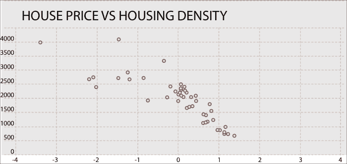

让我们在此数据中绘制一些模式，如下所示：


我们在这里看到的模式是什么？ 为了从非常高密度的住房搬到低密度住房，人们已经准备好支付高昂的溢价。 随着住房密度的降低，这一溢价将趋于平缓。 例如，人们从共管公寓和城镇住宅搬到独栋住宅时会支付很高的溢价，但 3 英亩地块的独户住宅的溢价与同等建成区 2 英亩地块的独户住宅的溢价没有太大区别。

# 奇异值分解降维

通常，原始维度并不能以最好的方式表示数据。 正如我们在 PCA 中看到的，有时您可以将数据投影到更少的维度，同时仍然保留大部分有用的信息。

有时，最好的方法是将尺寸与显示大多数变化的特征对齐。 此方法有助于消除不能代表数据的维度。

让我们再看一遍下图，它显示了两个维度上最适合的线：


投影线显示一维的原始数据的最佳近似值。 如果我们取灰线与黑线相交的点并隔离黑线，我们将减少原始数据的表示，并保留尽可能多的变化，如下图所示：


让我们画一条与第一条投影线垂直的线，如下图所示：


这条线捕获沿原始数据集的第二维尽可能多的变化。 它在近似原始数据方面做得很差，因为这个维度从一开始就表现出较小的变化。 可以使用这些投影线来生成一组不相关的数据点，这些数据点将显示原始数据中的子分组，这些分组乍一看是不可见的。

这是 SVD 背后的基本理念。 取一个高维、一组高度可变的数据点，并将其降低到一个低维空间，该空间可以更清楚地暴露原始数据的结构，并将其从最大变化到最小排序。 奇异值分解非常有用，特别是对于 NLP 应用，你可以简单地忽略低于某个阈值的变化，以大量减少原始数据，确保保留原始关系利益。

现在让我们稍微深入了解一下这个理论。 奇异值分解基于线性代数中的一个定理，即一个矩形矩阵 A 可以分解成三个矩阵的乘积-一个正交矩阵 U、一个对角矩阵 S 和一个正交矩阵 V 的转置。我们可以展示如下：


*U*和*V*是正交矩阵：


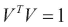

*U*的列是的正交特征向量，*V*的列是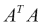的正交特征向量。 *S*是包含从*U*或*V*的特征值的平方根按降序排列的对角矩阵。

## 做好准备

让我们看一个术语文档矩阵的示例。 我们来看两条有关美国总统选举的新消息。 以下是这两份文件的链接：

*   **FOX**：[http://www.foxnews.com/politics/2015/03/08/top-2016-gop-presidential-hopefuls-return-to-iowa-to-hone-message-including/](http://www.foxnews.com/politics/2015/03/08/top-2016-gop-presidential-hopefuls-return-to-iowa-to-hone-message-including/)
*   **Npr**：[http：//www.npr.org/blogs/itsallpolitics/2015/03/09/391704815/in-iowa-2016-has-begun-at-least-for-the-republican-party](http://www.npr.org/blogs/itsallpolitics/2015/03/09/391704815/in-iowa-2016-has-begun-at-least-for-the-republican-party)

让我们根据这两条新闻构建总统候选人矩阵：

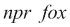


让我们将此矩阵放入CSV 文件中，然后将其放入 HDFS 中。 我们将对该矩阵进行奇异值分解，并对结果进行分析。

## How to Do It…

1.  将`scaledhousedata.csv`加载到 HDFS：

    ```scala
    $ hdfs dfs -put pres.csv scaledhousedata.csv

    ```

2.  启动 Spark Shell：

    ```scala
    $ spark-shell

    ```

3.  导入统计信息及相关类：

    ```scala
    scala> import org.apache.spark.mllib.linalg.Vectors
    scala> import org.apache.spark.mllib.linalg.distributed.RowMatrix

    ```

4.  将`pres.csv`加载为 RDD：

    ```scala
    scala> val data = sc.textFile("pres.csv")

    ```

5.  将数据转换为密集向量的 RDD：

    ```scala
    scala> val parsedData = data.map( line => Vectors.dense(line.split(',').map(_.toDouble)))

    ```

6.  从`parsedData`：

    ```scala
    scala> val mat = new RowMatrix(parsedData)

    ```

    创建`RowMatrix`
7.  计算`svd`：

    ```scala
    scala> val svd = mat.computeSVD(2,true)

    ```

8.  计算`U`因子(特征向量)：

    ```scala
    scala> val U = svd.U

    ```

9.  计算奇异值(特征值)矩阵：

    ```scala
    scala> val s = svd.s

    ```

10.  计算`V`因子(特征向量)：

    ```scala
    scala> val s = svd.s

    ```

如果你看`s`，你就会意识到它给 npr 的文章打了比给福克斯的文章高得多的分数。