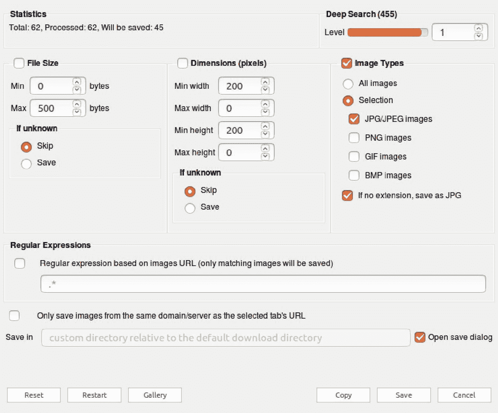
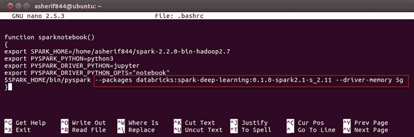
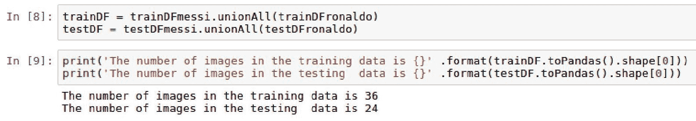
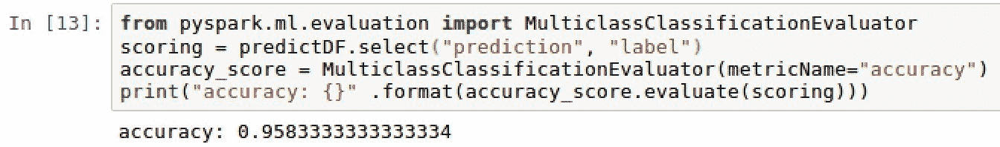
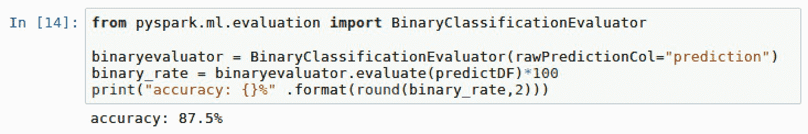
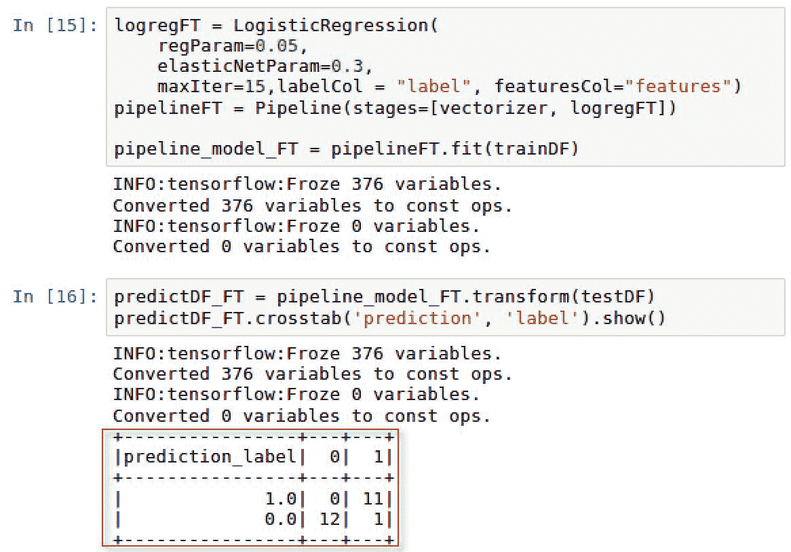

# 基于火花张量流的图像分类

本章将介绍以下配方:

*   下载梅西和 c 罗各 30 张图片
*   使用深度学习包配置 PySpark 安装
*   将图像加载到 PySpark 数据帧上
*   理解迁移学习
*   为图像分类训练创建管道
*   评估模型性能
*   微调模型参数

# 介绍

在过去的几年里，图像识别软件的需求越来越大。这种需求与大数据存储的进步同时出现并非巧合。谷歌照片、脸书和苹果都利用图像分类软件为用户标记照片。这些公司使用的许多图像识别软件都是由建立在热门库(如 TensorFlow)之上的深度学习模型驱动的。本章通过将一组图像的训练运用到另一组图像的学习或识别中，扩展了深度学习的技术。这个概念被称为迁移学习。在本章中，我们将重点介绍如何利用转移学习来识别世界上排名前两位的足球运动员:

1.  莱诺·梅西
2.  克里斯蒂亚诺·罗纳尔多

看看这张照片:


# 下载梅西和 c 罗各 30 张图片

在对图片进行分类之前，我们必须先从网上下载我们足球运动员的图片。

# 准备好了

浏览器有几个插件可以批量下载图像。由于 Ubuntu 预装了 Mozilla Firefox 作为浏览器，我们将使用它作为我们选择的浏览器来安装批量映像下载器扩展。

# 怎么做...

下一节说明如何批量下载图像。看看这些步骤:

1.  请访问以下网站下载和安装火狐插件:

[https://addons . Mozilla . org/en-us/Firefox/](https://addons.mozilla.org/en-US/firefox/)

2.  搜索并选择下载所有图像加载项，如下图所示:


3.  这将把我们带到安装页面。此时，选择添加到火狐，如下图所示:


4.  请确认您的安装，因为此加载项需要权限才能访问浏览器的下载历史记录、访问所有网站的数据并向您发送通知。
5.  完成后，您应该会在浏览器的右上角看到“下载所有图像”的小图片图标，如下图所示:


6.  我们现在准备开始下载我们的足球运动员的图像，使用火狐新增加的扩展。我们可以访问很多不同的网站下载图片，比如[https://www.google.com](https://www.google.com)。在本章中，搜索 c 罗并使用[https://www.pexels.com](https://www.pexels.com)下载他的图片，如下图所示:


7.  接下来，单击下载所有图像图标，并为图像指定以下下载设置，如下图所示:



8.  点击保存，因为你可以选择将所有图片作为`.zip`文件下载到本地目录。然后，您可以将文件解压缩到一个文件夹中，仔细阅读所有图像。在我们的示例中，图像已经全部提取到`/Home/sparkNotebooks/Ch13/football/ronaldo/`，如下图所示:


9.  在文件夹中所有可用的图片中，选择 30 张罗纳尔多的图片并命名为`ronaldo1.jpg`、`ronaldo2.jpg`....`ronaldo30.jpg`，如下图截图所示:


10.  再次重复上述步骤，这一次让梅西获得每张的 30 张图片。最终的文件夹结构应该如下所示:


# 它是如何工作的...

本节说明了加载项如何将图像批量下载到我们所需位置的过程:

1.  批量图像下载软件现在很容易获得，并集成在浏览器中。我们将使用下载所有图片作为火狐插件，快速下载梅西和 c 罗的图片。
2.  我们想在 app 中指定下载低质量图像的设置，所以我们设置了 0 字节的最小阈值，500 字节的最大阈值，以及`jpg`或`jpeg`的图像类型。
3.  最后，我们希望只挑选最能代表每个玩家的 30 幅图像，因为其中 20 幅将作为我们的训练数据集，其余 10 幅将作为我们的测试数据集。所有其他图像都可以删除。
4.  出于训练目的，所有图像都将通过其姓氏和 1 到 30 之间的数字进行标记。例如:`Messi1.jpg`、`Messi2.jpg`、`Ronaldo1.jpg`、`Ronaldo2.jpg`等等。

# 还有更多...

虽然您可以使用自己使用“下载所有图片”下载的图片，但您也可以通过访问以下网站下载 c 罗和梅西的相同图片，这些图片将用于本章的训练目的:

对于梅西来说:

[https://github . com/asherif 844/apachestarkdeeplearningcookbook/tree/master/CH13/football/梅西](https://github.com/asherif844/ApacheSparkDeepLearningCookbook/tree/master/CH13/football/messi)

对于 c 罗来说:

[https://github . com/asherif 844/ApacheSparkDeepLearningCookbook/tree/master/CH13/football/c 罗](https://github.com/asherif844/ApacheSparkDeepLearningCookbook/tree/master/CH13/football/ronaldo)

# 请参见

其他浏览器也有类似的附加组件和扩展。如果你正在使用谷歌 Chrome，有一个类似的插件叫做*D*own load ' All，可以从以下网站下载:

[https://chrome . Google . com/Webster/detail/downloads m-all/ccdfjnnilfbpa plifdilfmcebce？hl=en-US](https://chrome.google.com/webstore/detail/downloadem-all/ccdfjnniglfbpaplecpifdiglfmcebce?hl=en-US)

# 使用深度学习包配置 PySpark 安装

PySpark 中需要进行一些额外的配置，以实现名为`spark-deep-learning`的数据库深度学习包。这些都是在[第 1 章](01.html#OPEK0-3be7262ff9a54db3b2ea862fdce1797b)、*中为深度学习设置火花环境*时所做的配置。

# 准备好了

该配置需要在终端中进行更改，使用 **bash** 。

# 怎么做...

下一节将介绍使用深度学习包配置 PySpark 的步骤:

1.  打开终端应用程序并键入以下命令:

```py
nano .bashrc.
```

2.  一直滚动到文档底部，寻找我们在[第 1 章](01.html#OPEK0-3be7262ff9a54db3b2ea862fdce1797b)、*中创建的`sparknotebook()`功能，为深度学习*设置您的火花环境。

3.  更新函数的最后一行。当前应该如下所示:

```py
$SPARK_HOME/bin/pyspark.
```

将其更改为以下内容:

```py
$SPARK_HOME/bin/pyspark --packages databricks:spark-deep-learning:0.1.0-spark2.1-s_2.11.
```

4.  进行配置更改后，退出文档并执行以下脚本，以确认所有必要的更改都已保存:

```py
source .bashrc.
```

# 它是如何工作的...

下一节解释了如何修改 PySpark 以包含深度学习包。请看这些步骤:

1.  访问 bash 允许我们在命令行进行配置，如下图所示:


2.  在我们文档的最后，我们可以看到我们原来的功能，`sparknotebook()`，仍然完好无损；但是，我们需要对其进行修改以纳入`spark-deep-learning`包。
3.  由于这种修改是直接对 PySpark 进行的，而不是对 Python 库进行的，因此我们不能使用典型的`pip`安装将其合并到我们的框架中。相反，我们将修改我们的 PySpark 配置，以显示如下截图所示:



4.  我们现在已经将我们的 PySpark 安装配置为包含深度学习库，该库包含有助于为所有类型的解决方案(如图像分类)构建模型的 API。

# 还有更多...

该套餐`spark-deep-learning`由`Databricks`管理。Databricks 由 Spark 的联合创始人之一阿里·戈德西创建，用于通过统一的平台交付托管 Spark 产品。

# 请参见

要了解为 Spark 开发的其他第三方软件包的更多信息，请访问以下网站:

[https://spark-packages.org/](https://spark-packages.org/)。

# 将图像加载到 PySpark 数据帧

我们现在准备开始将图像导入笔记本进行分类。

# 准备好

在本节中，我们将使用几个库及其依赖项，这将要求我们通过 Ubuntu 桌面内的终端上的`pip install`安装以下包:

```py
pip install tensorflow==1.4.1pip install keras==2.1.5pip install sparkdlpip install tensorframespip install kafkapip install py4jpip install tensorflowonsparkpip install jieba
```

# 怎么做...

以下步骤将演示如何将图像解码为 Spark 数据帧:

1.  使用以下脚本启动`spark`会话:

```py
spark = SparkSession.builder \.master("local") \.appName("ImageClassification") \.config("spark.executor.memory", "6gb") \.getOrCreate()
```

2.  使用以下脚本从 PySpark 导入以下库以创建数据帧:

```py
import pyspark.sql.functions as fimport sparkdl as dl
```

3.  使用每个球员的主文件夹位置，执行以下脚本为梅西和 c 罗创建两个数据帧:

```py
dfMessi = dl.readImages('football/messi/').withColumn('label', f.lit(0))dfRonaldo = dl.readImages('football/ronaldo/').withColumn('label',             f.lit(1))
```

4.  使用以下脚本，将每个数据帧按照`66.7/33.3`比率分割成训练和测试集，并将随机种子集设置为`12`:

```py
trainDFmessi, testDFmessi = dfMessi.randomSplit([66.7, 33.3], seed = 12)trainDFronaldo, testDFronaldo = dfRonaldo.randomSplit([66.7, 33.3], seed =     12)
```

5.  最后，使用以下脚本将训练数据帧和测试数据帧分别合并到一个新的数据帧`trainDF`和`testDF`中:

```py
trainDF = trainDFmessi.unionAll(trainDFronaldo)testDF = testDFmessi.unionAll(testDFronaldo)
```

# 它是如何工作的...

以下部分解释了如何将图像加载并读入 Jupyter 笔记本。看看这些步骤:

1.  我们总是通过启动火花会话来设置应用程序名称以及火花执行器内存来开始火花项目。
2.  我们导入`pyspark.sql.functions`和`sparkdl`来帮助构建基于编码图像的数据帧。当`sparkdl`导入后，我们看到它正在后端使用 TensorFlow，如下图截图所示:


3.  数据帧使用`sparkdl`创建，有三列:文件路径、图像和标签。Sparkdl 用于导入每个图像，并按颜色和形状进行编码。此外，一个函数`lit`用于为标签列下的两个数据帧中的每一个标记一个文字值(0 或 1)，以便进行训练，如下图所示:


4.  由于每个足球运动员有 30 幅图像，因此使用 66.7/33.3 的分割来创建 18 幅训练图像和 12 幅测试图像，如下图所示:

Please note that the more images used in the training process the better when using deep learning. However, the point we will try and prove in this chapter is that with transfer learning being implemented as an extension of deep learning, we can classify images using fewer training samples, as is the case in this chapter with only 30 images for Ronaldo and Messi each.


5.  为了构建我们的模型，我们只对创建一个包含 36 个图像的训练数据帧以及一个包含其余 24 个图像的测试数据帧感兴趣。合并数据帧后，我们可以确认它们的大小是否正确，如下图所示:



# 还有更多...

在这个过程中可能会丢失，但需要注意的是，将图像加载到数据帧很容易，使用`sparkdl.readImages`只需几行代码。这展示了 Spark 提供的机器学习管道的强大功能。

# 请参见

要了解更多关于`sparkdl`包的信息，请访问以下存储库:

[https://databricks . github . io/spark-deep-learning/site/API/python/sparkdl . html](https://databricks.github.io/spark-deep-learning/site/api/python/sparkdl.html)

# 理解迁移学习

本章的其余部分将涉及迁移学习技巧；因此，我们将在这一部分解释迁移学习在我们的体系结构中是如何工作的。

# 准备好

此部分不需要依赖项。

# 怎么做...

本节将介绍迁移学习的工作步骤:

1.  确定一个预先培训的模型，该模型将被用作将被转移到我们选择的任务的培训方法。在我们的案例中，任务将是识别梅西和 c 罗的图像。
2.  有几种可用的预训练模型可以使用。最受欢迎的有:
    1.  感知
    2.  不规则 3
    3.  ResNet50
    4.  VGG16
    5.  VGG19
3.  从预先训练的卷积神经网络中提取特征，并通过几层过滤和汇集为某组图像保存。
4.  预训练卷积神经网络的最后一层被我们希望基于数据集进行分类的特定特征所替代。

# 它是如何工作的...

本节解释了迁移学习的方法:

1.  在前面的章节中，我们讨论了机器学习模型，更重要的是深度学习模型，如何最好地使用更大的样本进行训练。其实深学的总格言是越多越好。
2.  然而，在某些情况下，大量的数据或图像并不能用来训练模型。正是在这种情况下，我们希望转移一个领域的学习来预测另一个领域的结果。已经开发了许多预训练模型(如 InceptionV3 和 ResNet50)的机构已经完成了在卷积神经网络中提取特征和逐层过滤的繁重工作:
    1.  InceptionV3 是在谷歌开发的，比 ResNet50 和 VGG 的权重更小
    2.  ResNet50 使用 50 个重量层
    3.  VGG16 和 VGG19 分别有 16 和 19 个重量层
3.  几个更高级别的深度学习库，如 Keras，现在已经预建了这些预训练的网络，通过指定模型名称来简化应用程序。

# 还有更多...

确定哪种预训练模型最适合所讨论的数据或图像集将取决于所使用的图像类型。最好尝试不同的预训练集，并确定哪一个提供最好的准确性。

# 请参见

要了解更多关于盗梦空间 V3 预训练模型的信息，请阅读以下文章:

[https://arxiv.org/abs/1409.4842](https://arxiv.org/abs/1409.4842)

要了解有关 VGG 预培训模型的更多信息，请阅读以下文章:

[https://arxiv.org/abs/1409.1556](https://arxiv.org/abs/1409.1556)

# 为图像分类训练创建管道

我们现在准备构建深度学习管道来训练数据集。

# 准备好

将导入以下库以帮助管道开发:

*   `LogisticRegression`
*   `Pipeline`

# 怎么做...

以下部分介绍了创建图像分类管道的以下步骤:

1.  执行以下脚本开始深度学习管道并配置分类参数:

```py
from pyspark.ml.classification import LogisticRegressionfrom pyspark.ml import Pipelinevectorizer = dl.DeepImageFeaturizer(inputCol="image", outputCol="features", modelName="InceptionV3")logreg = LogisticRegression(maxIter=30, labelCol="label")pipeline = Pipeline(stages=[vectorizer, logreg])pipeline_model = pipeline.fit(trainDF)
```

2.  使用以下脚本创建一个包含原始测试标签和新预测分数的新数据框`predictDF`:

```py
predictDF = pipeline_model.transform(testDF)predictDF.select('prediction', 'label').show(n = testDF.toPandas().shape[0], truncate=False)
```

# 它是如何工作的...

以下部分解释了如何配置图像分类管道以获得最佳性能:

1.  `LogisticRegression`是导入的，因为它将是用于区分梅西和 c 罗图像的主要分类算法。`DeepImageFeaturizer`从`sparkdl`导入，根据图像创建特征，用作逻辑回归算法的最终输入。

It is important to note that the features created from `DeepImageFeaturizer` will be using a pre-trained model based on `InceptionV3`, and assigned a variable of `vectorizer`.

逻辑回归模型被调整为最多运行 30 次迭代。最后，管道吸收`vectorizer`和`LogisticRegression`变量，并将其放入训练数据框`trainDF`。`vectorizer`用于从图像中创建数值。`DeepImageFeaturizer`的输出可以在下面的截图中看到:


2.  通过应用拟合的管道模型`pipeline_model`，测试数据帧`testDF`被转换成新的数据帧`predictDF`，这创建了称为预测的新列。然后，我们可以将标签列与预测列进行比较，如下图所示:


# 还有更多...

`InceptionV3`是我们用来对图像进行分类的图像分类器模型；然而，我们可以非常容易地选择其他预先训练的模型，并在我们的管道内比较精度。

# 请参见

要了解有关迁移学习的更多信息，请阅读威斯康星大学的以下文章:

[http://FTP . cs . wisc . edu/机器学习/shav lik-group/torrey . hanbook 09 . pdf](http://ftp.cs.wisc.edu/machine-learning/shavlik-group/torrey.handbook09.pdf)

# 评估模型性能

我们已经准备好评估我们的模型，看看我们能在多大程度上区分梅西和 c 罗。

# 准备好

由于我们将进行一些模型评估，我们需要导入以下库:

*   `MulticlassClassificationEvaluator`

# 怎么做...

以下部分将介绍评估模型性能的以下步骤:

1.  执行以下脚本从`predictDF`数据帧创建混淆矩阵:

```py
predictDF.crosstab('prediction', 'label').show().
```

2.  通过执行以下脚本，根据我们对 c 罗和梅西的 24 张测试图像计算准确度分数:

```py
from pyspark.ml.evaluation import MulticlassClassificationEvaluatorscoring = predictDF.select("prediction", "label")accuracy_score = MulticlassClassificationEvaluator(metricName="accuracy")rate = accuracy_score.evaluate(scoring)*100print("accuracy: {}%" .format(round(rate,2))).
```

# 它是如何工作的...

下一节解释我们如何评估模型性能。看看这些图像:

1.  我们可以将我们的数据帧 predictDF 转换成交叉表来创建一个混淆矩阵。这使我们能够了解我们的模型中有多少真阳性、假阳性、真阴性和假阴性，如下图所示:


2.  在这一点上，我们已经准备好计算我们的模型在使用 36 张训练图像来准确分类剩余的 24 张 c 罗和梅西的测试图像方面做得有多好。从前面的截图来看，它显示我们在 24 个分类中有 21 个是准确的。我们有 2 张梅西被误分类为 c 罗的照片，只有一张 c 罗被误分类为梅西的照片。这个结果的准确率应该是 88%。我们可以看到，多类分类评估器的准确率得分也达到了 87.5%，如下图所示:



# 还有更多...

虽然我们最终确实使用准确性作为我们的模型表现如何的基准指标，但我们也可以同样容易地使用精确度或召回率。此外，我们使用`MulticlassClassificationEvaluator`来评估模型的准确性。由于我们在这个特定的例子中只处理了 c 罗或梅西的两种图像的二元结果，我们也可以只使用`BinaryClassificationEvaluator`，如下面的截图所示:



我们最终的准确率仍然是 87.5%。

# 请参见

要从 PySpark 中的逻辑回归函数了解更多关于`MulticlassClassificationEvaluator`的信息，请访问以下网站:

[https://spark . Apache . org/docs/2 . 2 . 0/ml-分类-回归. html](https://spark.apache.org/docs/2.2.0/ml-classification-regression.html)

# 微调模型参数

任何模型的准确性总有改进的余地。在本节中，我们将讨论一些可以调整的参数，以提高我们从上一节中获得的 87.5%的模型精度分数。

# 准备好

本部分不需要任何新的先决条件。

# 怎么做...

本节将介绍微调模型的步骤。

1.  定义一个新的逻辑回归模型，并为`regParam`和`elasticNetParam`添加参数，如以下脚本所示:

```py
logregFT = LogisticRegression(regParam=0.05, elasticNetParam=0.3,maxIter=15,labelCol = "label", featuresCol="features")
```

2.  使用以下脚本创建为新创建的模型配置的新管道:

```py
pipelineFT = Pipeline(stages=[vectorizer, logregFT])
```

3.  使用以下脚本将管道拟合到训练数据集`trainDF`:

```py
pipeline_model_FT = pipelineFT.fit(trainDF)
```

4.  将模型转换应用于测试数据集`testDF`，以便能够使用以下脚本比较实际分数和预测分数:

```py
predictDF_FT = pipeline_model_FT.transform(testDF)predictDF_FT.crosstab('prediction', 'label').show()
```

5.  最后，使用以下脚本评估新模型的准确率`binary_rate_FT`:

```py
binary_rate_FT = binaryevaluator.evaluate(predictDF_FT)*100print("accuracy: {}%" .format(round(binary_rate_FT,2)))
```

# 它是如何工作的...

本节解释如何微调模型:

1.  逻辑回归模型`logregFT`使用`regParam`和`elasticNetParam`参数进行微调。两个参数都对应于逻辑回归模型的γ和α参数。正则化参数`regParam`用于在最小化损失函数和最小化模型过拟合之间找到平衡。我们建立的模型越复杂，就越有可能过度拟合而不一般化，但我们也有可能得到更低的训练误差。此外，我们制作的模型越不复杂，它就越不可能过度拟合，但越有可能有更高的训练误差。
2.  弹性网络参数或`elasticNetParam`是另一种正则化技术，用于组合多个正则化因子，L1 和 L2，以最小化模型中的过拟合。此外，我们已经将迭代次数从 20 次减少到 15 次，看看我们是否可以通过同时包含正则化和减少迭代次数来获得更好的精度分数。
3.  再次，正如我们在本章前面所做的，我们创建了一个管道，该管道结合了我们从图像生成的数字特征`vectorizer`，以及我们的逻辑回归模型`logregFT`。
4.  然后将模型拟合到训练数据`trainDF`，并将模型的变换应用到测试数据`testDF`。
5.  我们可以在交叉表中再次比较模型结果的实际结果和预测结果，如下图所示:



6.  我们现在只有 1 张误分类图像，而前一部分只有 3 张。我们通过将最大速度降低到`15`跑，并将`regParam`设置为`0.05`，将`elasticNetParam`设置为`0.3`来实现这一点。
7.  我们的新准确率现在在`95.83%`处，如下图所示:


# 还有更多...

当然，我们已经将我们的比率从 87.5%提高到了 95.83%，这仅仅是通过在我们的模型中加入特定的参数。可以对我们的参数进行额外的微调和调整，以确定我们的图像分类模型是否可以达到 100%的精度。

# 请参见

要了解有关逻辑回归中正则化和弹性网络参数的更多信息，请访问以下网站:

[https://spark . Apache . org/docs/2 . 2 . 0/mllib-linear-methods . html # logistic-回归](https://spark.apache.org/docs/2.2.0/mllib-linear-methods.html#logistic-regression)