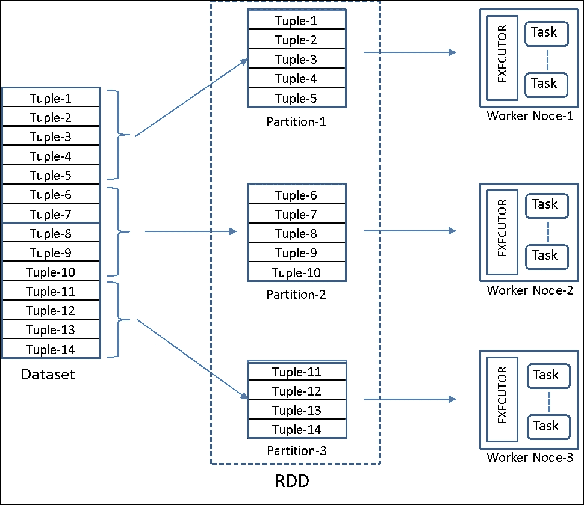
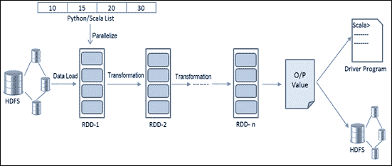

# 第二章。火花编程模型

由于开源框架的可用性，使用具有内置容错能力的数千个节点的大规模数据处理已经变得普遍，Hadoop 是一种流行的选择。这些框架在执行特定任务方面相当成功，例如**提取、转换和加载** ( **ETL** )以及处理网络规模数据的存储应用程序。然而，除了完善的 Hadoop 生态系统之外，开发人员还有无数的工具可以使用。需要一个单一的通用开发平台来满足批处理、流、交互和迭代需求。这就是火花背后的动机。

前一章概述了大数据分析的挑战，以及 Spark 如何在非常高的层面上解决其中的大部分挑战。在本章中，我们将考察制作 Spark 所涉及的设计目标和选择，以更清楚地了解其作为大数据数据科学平台的适用性。我们还将通过示例深入介绍核心抽象**弹性分布式数据集** ( **RDD** )。

作为本章的先决条件，需要对 Python 或 Scala 有一个基本的了解，以及对 Spark 的基本了解。本章涵盖的主题如下:

*   The programming paradigm - language support and design benefits
    *   支持的编程语言
    *   选择正确的语言

*   The Spark engine - Spark core components and their implications
    *   驱动程序
    *   火花壳
    *   sparks context(储蓄上下文)
    *   工作节点
    *   实施者
    *   共享变量
    *   执行流程
*   The RDD API - understanding the RDD fundamentals
    *   RDD 基础
    *   坚持
*   RDD operations - let's get your hands dirty
    *   开始使用外壳
    *   创建 RDDs
    *   普通关系数据库上的转换
    *   对关系数据库的转换
    *   行动

# 编程范式

对于 Spark 来说，为了应对大数据挑战并作为数据科学和其他可扩展应用程序的平台，它采用了经过深思熟虑的设计考虑和语言支持。

有专为各种应用程序开发人员设计的 Spark APIs，用于使用标准 API 接口创建基于 Spark 的应用程序。Spark 为 Scala、Java、R 和 Python 编程语言提供了 API，下面几节将对此进行解释。

## 支持的编程语言

由于内置了对这么多语言的支持，Spark 可以通过一个 shell 进行交互使用，这个 shell 又被称为**Read-Evaluate-Print-Loop**(**REPL**)，任何语言的开发者都会觉得熟悉。开发人员可以使用他们选择的语言，利用现有的库，并与 Spark 及其生态系统无缝交互。让我们看看 Spark 支持的产品，以及它们如何融入 Spark 生态系统。

### 斯卡拉

Spark 本身是用 Scala 编写的，Scala 是一种基于 **Java 虚拟机** ( **JVM** )的功能编程语言。Scala 编译器生成在 JVM 上执行的字节码。因此，它可以与任何其他基于 JVM 的系统无缝集成，如 HDFS、Cassandra、HBase 等。Scala 之所以成为首选语言，是因为它简洁的编程界面、交互式外壳，以及它能够捕获函数并在集群中的节点间高效地传递函数的能力。Scala 是一种可扩展的(可伸缩的，因此得名)，静态类型的，高效的多范例语言，支持功能和面向对象的语言特性。

除了成熟的应用程序之外，Scala 还支持 shell (Spark shell)，用于 Spark 上的交互式数据分析。

### 爪哇

由于 Spark 是基于 JVM 的，所以它自然支持 Java。这有助于现有的 Java 开发人员开发数据科学应用程序以及其他可扩展的应用程序。几乎所有的内置库函数都可以从 Java 中访问。在 Spark 中，用 Java 编写数据科学作业相对较难，但是非常熟悉 Java 的人可能会发现这很容易。

这个 Java API 只缺少一个基于 shell 的接口，用于 Spark 上的交互式数据分析。

### 蟒蛇

Python 通过 PySpark 在 Spark 上得到支持，PySpark 是建立在 Spark 的 Java API 之上的(使用 Py4J)。从现在开始，我们将使用术语 **PySpark** 来指代 Spark 上的 Python 环境。Python 在开发人员中已经非常流行，用于数据争论、数据管理和其他与数据科学相关的任务。Spark 上对 Python 的支持变得更加流行，因为 Spark 可以解决可扩展计算的挑战。

通过 Python 在 Spark (PySpark)上的交互式外壳，可以进行大规模的交互式数据分析。

### R

R 通过 SparkR 在 Spark 上得到支持，SparkR 是一个 R 包，通过它可以通过 R 访问 SparkR 的可伸缩性。SparkR 使 R 能够解决其单线程运行时的限制，因为计算仅限于单个节点。

由于 R 最初只是为统计分析和机器学习而设计的，它已经被大部分软件包所丰富。数据科学家现在可以用最小的学习曲线大规模地处理大量数据。r 仍然是许多数据科学家的默认选择。

## 选择正确的语言

除了开发人员的语言偏好之外，有时还有其他约束可能会引起注意。在选择一种语言时，以下方面可以补充您的开发经验:

*   开发复杂逻辑时，交互式外壳会派上用场。除了 Java 之外，Spark 支持的所有语言都有一个交互外壳。
*   r 是数据科学家的通用语言。它肯定更适合纯数据分析，因为它有更丰富的库集。在 Spark 1.4.0 中增加了 r 支持，这样 Spark 就可以接触到从事 r 工作的数据科学家
*   Java 有更广泛的开发者基础。Java 8 包含了 lambda 表达式，因此也包含了函数式编程方面。然而，Java 往往是冗长的。
*   Python 在数据科学领域逐渐变得越来越受欢迎。熊猫和其他数据处理库的可用性，以及它的简单和表达性，使 Python 成为一个强有力的候选对象。在不同来源的数据聚合、数据清理、自然语言处理等场景中，Python 给出了比 R 更大的灵活性。
*   Scala 可能是实时分析的最佳选择，因为它最接近 Spark。来自其他语言的开发人员的初始学习曲线不应该成为严肃的生产系统的障碍。Spark 的最新内含物通常首先在 Scala 中提供。它的静态类型和复杂的类型推断提高了效率和编译时检查。Scala 可以借鉴 Java 的库，因为 Scala 自己的库基础还处于早期阶段，但正在迎头赶上。

# 火花发动机

要使用 Spark 编程，需要对 Spark 组件有基本的了解。在本节中，将解释一些重要的 Spark 组件及其执行机制，以便开发人员和数据科学家可以编写程序和构建应用程序。

在进入细节之前，我们建议您看一下下图，以便在进一步阅读时更容易理解火花齿轮的描述:


## 驱动程序

火花外壳是驱动程序的一个例子。驱动程序是在 JVM 中执行的进程，并在其上运行用户的*主*功能。它有一个 SparkContext 对象，该对象是到底层集群管理器的连接。当驾驶员启动时，火花应用程序启动，当驾驶员停止时，火花应用程序完成。驱动程序通过 SparkContext 的实例来协调 Spark 应用程序中的所有进程。

首先，一个 RDD 谱系**有向无环图** ( **DAG** )是在驱动端用数据源(可能是 RDDs)和转换构建的。当遇到*动作*方法时，该 DAG 被提交给 DAG 调度器。然后，DAG 调度器将 DAG 分成称为阶段的逻辑工作单元(例如，映射或缩减)。每个阶段又是一组任务，任务调度器将每个任务分配给一个执行者(工作者)。根据配置，作业可以按先进先出顺序或循环执行。

### 类型

在单个 Spark 应用程序中，如果多个并行作业是从不同的线程提交的，它们可以同时运行。

## 火花壳

Spark shell 不是别人，正是 Scala 和 Python 提供的接口。它看起来非常类似于任何其他交互式外壳。它有一个 SparkContext 对象(默认为您创建)，允许您利用分布式集群。交互式外壳对于探索性或临时分析非常有用。您可以通过 shell 一步一步地开发复杂的脚本，而无需经历编译-构建-执行周期。

## 火花上下文

SparkContext 是 Spark 核心引擎的入口点。创建和操作 rdd 以及在集群上创建共享变量都需要这个对象。SparkContext 对象连接到负责资源分配的集群管理器。Spark 自带独立的集群管理器。由于集群管理器是 Spark 中的一个可插拔组件，因此可以通过外部集群管理器(如 Apache Mesos 或纱)进行管理。

启动火花壳时，默认情况下会为您创建一个火花上下文对象。您也可以通过传递一个 SparkConf 对象来创建它，该对象用于将各种 Spark 配置参数设置为键值对。请注意，一个 JVM 中只能有一个 SparkContext 对象。

## 工作节点

工作节点是在集群中运行应用程序代码的节点，遵循驱动程序。真正的工作实际上是由工作节点执行的。群集中的每台计算机可能有一个或多个工作实例(默认为一个)。工作节点执行属于一个或多个 Spark 应用程序的一个或多个执行器。它包括一个*块管理器*组件，负责管理数据块。这些块可以是缓存的 RDD 数据、中间混洗数据或广播数据。当可用内存不足时，它会自动将一些数据块移动到磁盘。跨节点的数据复制是数据块管理器的另一项职责。

## 执行者

每个应用程序都有一组执行器进程。执行器驻留在工作节点上，一旦集群管理器建立连接，执行器就直接与驱动程序通信。所有执行者都由 SparkContext 管理。执行器是服务于单个 Spark 应用程序的单个 JVM 实例。执行器负责通过每个工作节点上的任务、存储和缓存来管理计算。它可以同时运行多个任务。

## 共享变量

通常，代码和变量的单独副本一起被发送到分区。这些变量不能用于将结果(例如，中间工作计数)传播回驱动程序。共享变量用于此目的。共有两种共享变量，**广播变量**和**累加器**。

广播变量使程序员能够保留缓存在每个节点上的只读副本，而不是将其副本与任务一起发送。如果在多个操作中使用大型只读数据，则可以将其指定为广播变量，并且只向所有工作节点发送一次。以这种方式广播的数据以序列化形式缓存，并在运行每个任务之前反序列化。后续操作可以访问这些变量以及随代码一起移动的局部变量。并非所有情况下都需要创建广播变量，但跨多个阶段的任务需要相同的只读数据副本的情况除外。

累加器是始终递增的变量，例如计数器或累计总和。Spark 本身支持数字类型的累加器，但允许程序员添加对新类型的支持。请注意，工作节点无法读取累加器的值；他们只能修改自己的价值观。

## 执行流程

Spark 应用程序由一组带有一个*驱动程序*程序和多个*工作程序* ( *执行器*)程序的进程组成。驱动程序包含应用程序的*主功能*和一个 SparkContext 对象，该对象表示与 Spark 集群的连接。驱动程序和其他进程之间的协调通过 SparkContext 对象进行。

典型的 Spark 客户端程序执行以下步骤:

1.  当一个程序在 Spark shell 上运行时，它被称为驱动程序，其中有用户的`main`方法。它在运行驱动程序的系统的 JVM 中执行。
2.  第一步是用所需的配置参数创建一个 SparkContext 对象。当您运行 PySpark 或 Spark shell 时，默认情况下它是实例化的，但是对于其他应用程序，您必须显式创建它。SparkContext 实际上是通向 Spark 的门户。
3.  下一步是定义一个或多个 rdd，要么通过加载文件，要么通过传递一个称为并行集合的项目数组以编程方式进行
4.  然后可以通过一系列转换来定义更多的关系数据库，这些转换由**谱系图**来跟踪和管理。这些 RDD 转换可以看作管道 UNIX 命令，其中一个命令的输出变成下一个命令的输入，依此类推。一个*变换*步骤的每个结果 RDD 都有一个指向其父 RDD 的指针，并且还有一个计算其数据的函数。RDD 是在遇到*行动*声明后才被执行的。因此，*转换*是用于定义新 RDDs 的惰性操作，*动作*启动计算以向程序返回值或将数据写入外部存储器。我们将在接下来的章节中更多地讨论这个方面。
5.  在这个阶段，Spark 创建了一个执行图，其中节点代表 RDDs，边代表转换步骤。Spark 将作业分成多个任务，在不同的机器上运行。这就是 Spark 如何将**计算**发送到集群中的节点上的数据，而不是将所有数据聚集在一起进行计算。

# RDD 空气污染指数

RDD 是一个只读、分区、容错的记录集合。从设计的角度来看，需要一个单一的数据结构抽象来隐藏处理各种数据源的复杂性，无论是 HDFS、文件系统、关系数据库管理系统、NOSQL 数据结构还是任何其他数据源。用户应该能够从这些来源中定义 RDD。目标是支持各种各样的操作，让用户以任何顺序组合它们。

## RDD 基础

每个数据集在 Spark 的名为 RDD 的编程接口中表示为一个对象。Spark 提供了两种创建 RDD 的方法。一种方法是并行化现有集合。另一种方法是引用外部存储系统(如文件系统)中的数据集。

RDD 是由一个或多个数据源组成的，可能是在执行了包括几个运算符的一系列转换之后。每个 RDD 或 RDD 的分区都知道如何在失败的情况下重建自己。它有转换日志，或者是从稳定存储或另一个 RDD 重建自身所需的*谱系*。因此，使用 Spark 的任何程序都可以保证内置的容错能力，而不管底层数据源和 RDD 类型如何。

RDDs 上有两种可用的方法:转换和动作。转换是用于创建关系数据库的方法。动作是利用关系数据库的方法。rdd 通常是分区的。用户可以选择保留可以在程序中重用的关系数据库。

RDDs 是不可变的(只读)数据结构，因此任何转换都会导致新 RDD 的创建。只有在对其应用任何操作时，而不是在定义 RDD 时，变换才会被延迟应用。RDD 每次在动作中使用时都会被重新计算，除非用户在内存中明确地保留了 RDD。在内存中保存可以节省很多时间。如果内存不足以完全容纳 RDD，RDD 的剩余部分将自动存储(溢出)在硬盘上。惰性转换的一个优点是可以优化转换步骤。例如，如果操作是返回第一行，Spark 只计算一个分区并跳过其余的。

一个 RDD 可以被看作是一组分区(分割)，它有一个依赖于父 rdd 的列表和一个给定父 rdd 计算分区的函数。有时，父 RDD 的每个分区被一个孩子 RDD 使用。这叫*狭义依赖*。窄相关性是可取的，因为当父 RDD 分区丢失时，只需要重新计算一个子分区。另一方面，计算单个子 RDD 分区涉及的操作，如*按键分组*依赖于几个父 RDD 分区。在几个子 RDD 分区中创建数据时，需要来自每个父 RDD 分区的数据。这样的属地叫做*广属地*。在狭义依赖的情况下，可以在单个节点上同时保留父 RDD 分区和子分区(共分区)。但是在广泛依赖的情况下这是不可能的，因为父数据分散在几个分区中。在这种情况下，数据应该跨分区进行*混洗*。数据混排是一项资源密集型操作，应尽可能避免。广泛依赖性的另一个问题是，即使当单个父 RDD 分区丢失时，也需要重新计算所有子 RDD 分区。

## 坚持

每次通过操作方法对 rdd 进行操作时，都会动态计算 rdd。开发人员能够覆盖这个默认行为，并指示*跨分区在内存中持久化*或*缓存*数据集。如果需要该数据集参与多个操作，那么持久化可以节省大量时间、CPU 周期、磁盘 I/O 和网络带宽。容错机制也适用于缓存分区。当任何分区由于节点故障而丢失时，将使用沿袭图重新计算。如果可用内存不足，Spark 会适度地将持久化分区溢出到磁盘上。开发者可以使用*卸载程序*移除不需要的 rdd。不过，Spark 会自动监控缓存，并使用**最近最少使用的** ( **LRU** )算法删除旧分区。

### 类型

`Cache()`同`persist()`或`persist (MEMORY_ONLY)`。虽然`persist()`方法对于不同级别的持久性可以有许多其他参数，例如只有内存、内存和磁盘、只有磁盘等等，但是`cache()`方法只针对内存中的持久性而设计。

# RDD 运营

Spark 编程通常是从选择一个你觉得合适的界面开始的。如果您打算进行交互式数据分析，那么外壳提示将是显而易见的选择。然而，选择 Python shell (PySpark)还是 Scala shell (Spark-Shell)在某种程度上取决于你对这些语言的熟练程度。如果您正在构建一个成熟的可扩展应用程序，那么熟练程度非常重要，所以您应该使用您在 Scala、Java 和 Python 之间选择的语言开发应用程序，并将其提交给 Spark。我们将在本书后面更详细地讨论这一方面。

## 创建 rdd

在本节中，我们将使用 Python 外壳(PySpark)和 Scala 外壳(Spark-Shell)来创建 RDD。这两个外壳都有一个预定义的、解释器感知的 SparkContext，它被分配给一个变量`sc`。

让我们从一些简单的代码示例开始。请注意，代码假设当前工作目录是 Spark 的主目录。下面的代码片段启动 Spark 交互式 shell，从本地文件系统中读取一个文件，并打印该文件的第一行:

**蟒蛇**:

```scala
> bin/pyspark  // Start pyspark shell  
>>> _         // For simplicity sake, no Log messages are shown here 

>>> type(sc)    //Check the type of Predefined SparkContext object 
<class 'pyspark.context.SparkContext'> 

//Pass the file path to create an RDD from the local file system 
>>> fileRDD = sc.textFile('RELEASE') 

>>> type(fileRDD)  //Check the type of fileRDD object  
<class 'pyspark.rdd.RDD'> 

>>>fileRDD.first()   //action method. Evaluates RDD DAG and also returns the first item in the RDD along with the time taken 
took 0.279229 s 
u'Spark Change Log' 

```

**Scala** :

```scala
> bin/Spark-Shell  // Start Spark-shell  
Scala> _      // For simplicity sake, no Log messages are shown here 

Scala> sc   //Check the type of Predefined SparkContext object 
res1: org.apache.spark.SparkContext = org.apache.spark.SparkContext@70884875 

//Pass the file path to create an RDD from the local file system 

Scala> val fileRDD = sc.textFile("RELEASE") 

Scala> fileRDD  //Check the type of fileRDD object  
res2: org.apache.spark.rdd.RDD[String] = ../ RELEASE
MapPartitionsRDD[1] at textFile at <console>:21 

Scala>fileRDD.first()   //action method. Evaluates RDD DAG and also returns the first item in the RDD along with the time taken 
0.040965 s 
res6: String = Spark Change Log 

```

在前面的两个例子中，第一行调用了交互式外壳。SparkContext 变量`sc`已经按照预期定义。我们创建了一个名为`fileRDD`的 RDD，它指向一个文件`RELEASE`。该语句只是一个转换，在遇到操作之前不会执行。您可以尝试给出一个不存在的文件名，但是在您执行下一个语句之前，您不会得到任何错误，下一个语句恰好是 *action* 语句。

我们已经完成了启动 Spark 应用程序(shell)、创建 RDD 和消费它的整个周期。由于每次执行动作时都会重新计算 rdd，因此`fileRDD`不会保存在内存或硬盘中。这使得 Spark 能够优化步骤顺序并智能执行。事实上，在前面的例子中，优化器只会读取输入文件的一个分区，因为`first()`不需要完整的文件扫描。

回想一下，创建 RDD 有两种方法:一种是创建指向数据源的指针，另一种是并行化现有集合。前面的示例介绍了一种方法，即从存储系统加载文件。我们现在将看到第二种方法，即并行化现有集合。通过传递内存中的集合来创建 RDD 很简单，但是对于大型集合来说可能不太适用，因为输入集合应该完全适合驱动程序节点的内存。

以下示例通过传递带有`parallelize`函数的 Python/Scala 列表来创建 RDD:

**蟒蛇**:

```scala
// Pass a Python collection to create an RDD 
>>> numRDD = sc.parallelize([1,2,3,4],2) 
>>> type(numRDD) 
<class 'pyspark.rdd.RDD'> 
>>> numRDD 
ParallelCollectionRDD[1] at parallelize at PythonRDD.scala:396 
>>> numRDD.first() 
1 
>>> numRDD.map(lambda(x) : x*x).collect() 
[1,4,9,16] 
>>> numRDD.map(lambda(x) : x * x).reduce(lambda a,b: a+b) 
30 

```

### 类型

lambda 函数是一个未命名的函数，通常用作其他函数的函数参数。Python lambda 函数只能是一个表达式。如果您的逻辑需要多个步骤，创建一个单独的函数并在 lambda 表达式中使用它。

**Scala** :

```scala
// Pass a Scala collection to create an RDD 
Scala> val numRDD = sc.parallelize(List(1,2,3,4),2) 
numRDD: org.apache.spark.rdd.RDD[Int] = ParallelCollectionRDD[8] at parallelize at <console>:21 

Scala> numRDD 
res15: org.apache.spark.rdd.RDD[Int] = ParallelCollectionRDD[8] at parallelize at <console>:21 

Scala> numRDD.first() 
res16: Int = 1 

Scala> numRDD.map(x => x*x).collect() 
res2: Array[Int] = Array(1, 4, 9, 16) 

Scala> numRDD.map(x => x * x).reduce(_+_) 
res20: Int = 30 

```

正如我们在前面的例子中所看到的，我们能够传递一个 Scala/Python 集合来创建一个 RDD，并且我们还可以自由地指定将这些集合分割成多少个分区。Spark 为集群的每个分区运行一个任务，因此必须谨慎决定优化计算工作。虽然 Spark 会根据集群自动设置分区数量，但我们可以通过将其作为第二个参数传递给`parallelize`函数(例如`sc.parallelize(data, 3)`)来手动设置分区数量。下面是一个 RDD 的图示，它是用一个数据集创建的，比如说，有 14 个记录(或元组)，并被分成 3 个，分布在 3 个节点上:



编写一个 Spark 程序通常由转换和动作组成。转换是定义如何构建 RDD 的惰性操作。大多数转换都接受单个函数参数。所有这些方法都将一个数据源转换为另一个数据源。每次在任何 RDD 上执行转换时，都会生成一个新的 RDD，即使这是一个小的更改，如下图所示:



这是因为 RDDs 根据设计是不可变的(只读的)抽象。动作产生的输出可以写回存储系统，也可以返回给驱动程序进行本地计算(如果需要的话)，以产生最终输出。

到目前为止，我们已经看到了一些定义 rdd 的简单转换，以及一些处理它们并生成一些输出的动作。让我们快速浏览一些方便的转换和动作，然后是对关系数据库的转换。

## 正常 RDDs 上的变换

Spark API 包含一组丰富的转换操作符，开发人员可以以任意方式组合它们。在交互式外壳上尝试以下示例，以更好地理解这些操作。

### 过滤操作

`filter`操作返回一个 RDD，只有那些满足`filter`条件的元素，类似于 SQL 中的`WHERE`条件。

**蟒蛇**:

```scala
a = sc.parallelize([1,2,3,4,5,6], 3) 
b = a.filter(lambda x: x % 3 == 0) 
b.collect() 
[3,6] 

```

**Scala** :

```scala
val a = sc.parallelize(1 to 10, 3) 
val b = a.filter(_ % 3 == 0) 
b.collect 

res0: Array[Int] = Array(3, 6, 9) 

```

### 截然不同的操作

distinct ( `[numTasks]`)操作会在消除重复项后返回具有新数据集的 RDD:

**蟒蛇**:

```scala
c = sc.parallelize(["John", "Jack", "Mike", "Jack"], 2) 
c.distinct().collect() 

['Mike', 'John', 'Jack'] 

```

**Scala** :

```scala
val c = sc.parallelize(List("John", "Jack", "Mike", "Jack"), 2) 
c.distinct.collect 
res6: Array[String] = Array(Mike, John, Jack) 

val a = sc.parallelize(List(11,12,13,14,15,16,17,18,19,20)) 
a.distinct(2).partitions.length      //create 2 tasks on two partitions of the same RDD for parallel execution 

res16: Int = 2 

```

### 路口操作

交集操作将另一个数据集作为输入。它返回包含公共元素的数据集:

**蟒蛇**:

```scala
x = sc.parallelize([1,2,3,4,5,6,7,8,9,10]) 
y = sc.parallelize([5,6,7,8,9,10,11,12,13,14,15]) 
z = x.intersection(y) 
z.collect() 

[8, 9, 10, 5, 6, 7] 

```

**Scala** :

```scala
val x = sc.parallelize(1 to 10) 
val y = sc.parallelize(5 to 15) 
val z = x.intersection(y) 
z.collect 

res74: Array[Int] = Array(8, 9, 5, 6, 10, 7) 

```

### 工会运作

联合操作将另一个数据集作为输入。它返回一个数据集，该数据集包含自身的元素和提供给它的输入数据集。如果两个集合中有共同的值，则它们将在联合后的结果集合中显示为重复值:

**蟒蛇**:

```scala
a = sc.parallelize([3,4,5,6,7], 1) 
b = sc.parallelize([7,8,9], 1) 
c = a.union(b) 
c.collect() 

[3, 4, 5, 6, 7, 7, 8, 9] 

```

**Scala** :

```scala
val a = sc.parallelize(3 to 7, 1) 
val b = sc.parallelize(7 to 9, 1) 
val c = a.union(b)     // An alternative way is (a ++ b).collect 

res0: Array[Int] = Array(3, 4, 5, 6, 7, 7, 8, 9) 

```

### 地图操作

map 操作返回通过对输入数据集中的每个元素执行输入函数而形成的分布式数据集:

**蟒蛇**:

```scala
a = sc.parallelize(["animal", "human", "bird", "rat"], 3) 
b = a.map(lambda x: len(x)) 
c = a.zip(b) 
c.collect() 

[('animal', 6), ('human', 5), ('bird', 4), ('rat', 3)] 

```

**Scala** :

```scala
val a = sc.parallelize(List("animal", "human", "bird", "rat"), 3) 
val b = a.map(_.length) 
val c = a.zip(b) 
c.collect 

res0: Array[(String, Int)] = Array((animal,6), (human,5), (bird,4), (rat,3)) 

```

### 平面图操作

平面图操作类似于`map`操作。`map`为每个输入元素返回一个元素，而`flatMap`为每个输入元素返回零个或多个元素的列表:

**蟒蛇**:

```scala
a = sc.parallelize([1,2,3,4,5], 4) 
a.flatMap(lambda x: range(1,x+1)).collect() 
   // Range(1,3) returns 1,2 (excludes the higher boundary element) 
[1, 1, 2, 1, 2, 3, 1, 2, 3, 4, 1, 2, 3, 4, 5] 

sc.parallelize([5, 10, 20], 2).flatMap(lambda x:[x, x, x]).collect() 
[5, 5, 5, 10, 10, 10, 20, 20, 20] 

```

**Scala** :

```scala
val a = sc.parallelize(1 to 5, 4) 
a.flatMap(1 to _).collect 
res47: Array[Int] = Array(1, 1, 2, 1, 2, 3, 1, 2, 3, 4, 1, 2, 3, 4, 5) 

//One more example 
sc.parallelize(List(5, 10, 20), 2).flatMap(x => List(x, x, x)).collect 
res85: Array[Int] = Array(5, 5, 5, 10, 10, 10, 20, 20, 20) 

```

### 按键操作

keys 操作使用每个元组的密钥返回一个 RDD:

**蟒蛇**:

```scala
a = sc.parallelize(["black", "blue", "white", "green", "grey"], 2) 
b = a.map(lambda x:(len(x), x)) 
c = b.keys() 
c.collect() 

[5, 4, 5, 5, 4] 

```

**Scala** :

```scala
val a = sc.parallelize(List("black", "blue", "white", "green", "grey"), 2) 
val b = a.map(x => (x.length, x)) 
b.keys.collect 

res2: Array[Int] = Array(5, 4, 5, 5, 4) 

```

### 笛卡尔运算

`cartesian`操作以另一个数据集为参数，返回两个数据集的笛卡儿积。这可能是一个昂贵的操作，返回大小为`m` x `n`的数据集，其中`m`和`n`是输入数据集的大小:

**蟒蛇**:

```scala
x = sc.parallelize([1,2,3]) 
y = sc.parallelize([10,11,12]) 
x.cartesian(y).collect() 

[(1, 10), (1, 11), (1, 12), (2, 10), (2, 11), (2, 12), (3, 10), (3, 11), (3, 12)] 

```

**Scala** :

```scala
val x = sc.parallelize(List(1,2,3)) 
val y = sc.parallelize(List(10,11,12)) 
x.cartesian(y).collect 

res0: Array[(Int, Int)] = Array((1,10), (1,11), (1,12), (2,10), (2,11), (2,12), (3,10), (3,11), (3,12))  

```

## 成对 rdd 上的转换

一些 Spark 操作仅在键值对的 rdd 上可用。请注意，除了计数操作之外，大多数这些操作通常都涉及洗牌，因为与某个键相关的数据可能并不总是驻留在单个分区上。

### 组合键操作

类似于 SQL `groupBy`操作，该操作根据键对输入数据进行分组，您可以使用`aggregateKey`或`reduceByKey`执行聚合操作:

**蟒蛇**:

```scala
a = sc.parallelize(["black", "blue", "white", "green", "grey"], 2) 
b = a.groupBy(lambda x: len(x)).collect() 
sorted([(x,sorted(y)) for (x,y) in b]) 

[(4, ['blue', 'grey']), (5, ['black', 'white', 'green'])] 

```

**Scala** :

```scala
val a = sc.parallelize(List("black", "blue", "white", "green", "grey"), 2) 
val b = a.keyBy(_.length) 
b.groupByKey.collect 

res11: Array[(Int, Iterable[String])] = Array((4,CompactBuffer(blue, grey)), (5,CompactBuffer(black, white, green))) 

```

### 连接操作

联接操作将另一个数据集作为输入。两个数据集都应该是键值对类型。生成的数据集是另一个键值数据集，它具有来自两个数据集的键和值:

**蟒蛇**:

```scala
a = sc.parallelize(["blue", "green", "orange"], 3) 
b = a.keyBy(lambda x: len(x)) 
c = sc.parallelize(["black", "white", "grey"], 3) 
d = c.keyBy(lambda x: len(x)) 
b.join(d).collect() 
[(4, ('blue', 'grey')), (5, ('green', 'black')), (5, ('green', 'white'))] 

//leftOuterJoin 
b.leftOuterJoin(d).collect() 
[(6, ('orange', None)), (4, ('blue', 'grey')), (5, ('green', 'black')), (5, ('green', 'white'))] 

//rightOuterJoin 
b.rightOuterJoin(d).collect() 
[(4, ('blue', 'grey')), (5, ('green', 'black')), (5, ('green', 'white'))] 

//fullOuterJoin 
b.fullOuterJoin(d).collect() 
[(6, ('orange', None)), (4, ('blue', 'grey')), (5, ('green', 'black')), (5, ('green', 'white'))] 

```

**Scala** :

```scala
val a = sc.parallelize(List("blue", "green", "orange"), 3) 
val b = a.keyBy(_.length) 
val c = sc.parallelize(List("black", "white", "grey"), 3) 
val d = c.keyBy(_.length) 
b.join(d).collect 
res38: Array[(Int, (String, String))] = Array((4,(blue,grey)), (5,(green,black)), (5,(green,white))) 

//leftOuterJoin 
b.leftOuterJoin(d).collect 
res1: Array[(Int, (String, Option[String]))] = Array((6,(orange,None)), (4,(blue,Some(grey))), (5,(green,Some(black))), (5,(green,Some(white)))) 

//rightOuterJoin 
b.rightOuterJoin(d).collect 
res1: Array[(Int, (Option[String], String))] = Array((4,(Some(blue),grey)), (5,(Some(green),black)), (5,(Some(green),white))) 

//fullOuterJoin 
b.fullOuterJoin(d).collect 
res1: Array[(Int, (Option[String], Option[String]))] = Array((6,(Some(orange),None)), (4,(Some(blue),Some(grey))), (5,(Some(green),Some(black))), (5,(Some(green),Some(white))))  

```

### 减少键操作

reduceByKey 操作使用关联的 reduce 函数合并每个键的值。这还将在将结果发送到缩减器并生成哈希分区输出之前，在每个映射器上本地执行合并:

**蟒蛇**:

```scala
a = sc.parallelize(["black", "blue", "white", "green", "grey"], 2) 
b = a.map(lambda x: (len(x), x)) 
b.reduceByKey(lambda x,y: x + y).collect() 
[(4, 'bluegrey'), (5, 'blackwhitegreen')] 

a = sc.parallelize(["black", "blue", "white", "orange"], 2) 
b = a.map(lambda x: (len(x), x)) 
b.reduceByKey(lambda x,y: x + y).collect() 
[(4, 'blue'), (6, 'orange'), (5, 'blackwhite')] 

```

**Scala** :

```scala
val a = sc.parallelize(List("black", "blue", "white", "green", "grey"), 2) 
val b = a.map(x => (x.length, x)) 
b.reduceByKey(_ + _).collect 
res86: Array[(Int, String)] = Array((4,bluegrey), (5,blackwhitegreen)) 

val a = sc.parallelize(List("black", "blue", "white", "orange"), 2) 
val b = a.map(x => (x.length, x)) 
b.reduceByKey(_ + _).collect 
res87: Array[(Int, String)] = Array((4,blue), (6,orange), (5,blackwhite))  

```

### 聚合操作

聚合操作返回一个包含每个元组密钥的 RDD:

**蟒蛇**:

```scala
z = sc.parallelize([1,2,7,4,30,6], 2) 
z.aggregate(0,(lambda x, y: max(x, y)),(lambda x, y: x + y)) 
37 
z = sc.parallelize(["a","b","c","d"],2) 
z.aggregate("",(lambda x, y: x + y),(lambda x, y: x + y)) 
'abcd' 
z.aggregate("s",(lambda x, y: x + y),(lambda x, y: x + y)) 
'ssabsscds' 
z = sc.parallelize(["12","234","345","56789"],2) 
z.aggregate("",(lambda x, y: str(max(len(str(x)), len(str(y))))),(lambda x, y: str(y) + str(x))) 
'53' 
z.aggregate("",(lambda x, y: str(min(len(str(x)), len(str(y))))),(lambda x, y: str(y) + str(x))) 
'11' 
z = sc.parallelize(["12","234","345",""],2) 
z.aggregate("",(lambda x, y: str(min(len(str(x)), len(str(y))))),(lambda x, y: str(y) + str(x))) 
'01' 

```

**Scala** :

```scala
val z = sc.parallelize(List(1,2,7,4,30,6), 2) 
z.aggregate(0)(math.max(_, _), _ + _) 
res40: Int = 37 

val z = sc.parallelize(List("a","b","c","d"),2) 
z.aggregate("")(_ + _, _+_) 
res115: String = abcd 

z.aggregate("x")(_ + _, _+_) 
res116: String = xxabxcd 

val z = sc.parallelize(List("12","234","345","56789"),2) 
z.aggregate("")((x,y) => math.max(x.length, y.length).toString, (x,y) => x + y) 
res141: String = 53 

z.aggregate("")((x,y) => math.min(x.length, y.length).toString, (x,y) => x + y) 
res142: String = 11 

val z = sc.parallelize(List("12","234","345",""),2) 
z.aggregate("")((x,y) => math.min(x.length, y.length).toString, (x,y) => x + y) 
res143: String = 01 

```

### 注

请注意，在前面的聚合示例中，您得到的结果字符串(例如，`abcd`、`xxabxcd`、`53`、`01`)不需要与这里显示的输出完全匹配。这取决于各个任务返回输出的顺序。

## 行动

一旦创建了 RDD，各种转换只有在对其执行*操作*时才会执行。操作的结果可以是写回存储系统的数据，也可以是返回到启动该操作的驱动程序，以便在本地进行进一步计算，从而产生最终结果。

在前面的转换示例中，我们已经介绍了一些动作函数。以下是一些更多的，但还有很多你必须探索的。

### 收集()功能

`collect()`函数将 RDD 运算的所有结果作为数组返回给驱动程序。这通常对于生成足够小的数据集的操作很有用。理想情况下，结果应该可以很容易地存储在驱动程序所在系统的内存中。

### 计数()功能

这将返回数据集中的元素数量或 RDD 运算的结果输出。

### 取(n)函数

`take(n)`函数返回数据集的第一个(`n`)元素或 RDD 运算的结果输出。

### 第一个()函数

`first()`函数返回数据集的第一个元素或 RDD 运算的结果输出。它的工作原理类似于`take(1)`功能。

### take sample()函数

`takeSample(withReplacement, num, [seed])`函数从数据集中返回一个带有随机元素样本的数组。它有以下三个论点:

*   `withReplacement` / `withoutReplacement`:表示取样有无更换(取多个样品时，表示是将旧样品更换回样品组，再取新鲜样品还是不更换样品)。对于`withReplacement`，论点应该是`True`和`False`否则。
*   `num`:表示样品中元素的数量。
*   `Seed`:这是一个随机数发生器种子(可选)。

### countByKey()函数

`countByKey()`功能仅在键值类型的 rdd 上可用。它返回一个包含(`K`、`Int`)对以及每个键的计数的表。

以下是 Python 和 Scala 上的一些示例代码片段:

**蟒蛇**:

```scala
>>> sc.parallelize([2, 3, 4]).count() 
3 

>>> sc.parallelize([2, 3, 4]).collect() 
[2, 3, 4] 

>>> sc.parallelize([2, 3, 4]).first() 
2 

>>> sc.parallelize([2, 3, 4]).take(2) 
[2, 3] 

```

**Scala** :

```scala
Scala> sc.parallelize(List(2, 3, 4)).count() 
res0: Long = 3 

Scala> sc.parallelize(List(2, 3, 4)).collect() 
res1: Array[Int] = Array(2, 3, 4) 

Scala> sc.parallelize(List(2, 3, 4)).first() 
res2: Int = 2 

Scala> sc.parallelize(List(2, 3, 4)).take(2) 
res3: Array[Int] = Array(2, 3)  

```

# 总结

在这一章中，我们谈到了支持的编程语言、它们的优势以及何时选择一种语言。我们讨论了火花引擎的设计及其核心组件和执行机制。我们看到了 Spark 如何跨多个集群节点发送要计算的数据。然后我们讨论了一些 RDD 的概念。我们学习了如何通过 Scala 和 Python 创建关系数据库，并对它们执行转换和操作。我们还讨论了 RDDs 上的一些高级操作。

在下一章中，我们将详细了解数据框架，以及它们如何证明自己适合各种数据科学需求。

# 参考文献

Scala 语言:

*   [http://www.scala-lang.org](http://www.scala-lang.org)

Apache Spark 架构:

*   [http://lintool . github . io/SparkTutorial/slides/day 1 _ context . pdf](http://lintool.github.io/SparkTutorial/slides/day1_context.pdf)

Spark 编程指南是概念的主要资源；有关可用操作的完整列表，请参考特定于语言的 API 文档:

*   [http://spark.apache.org/docs/latest/programming-guide.html](http://spark.apache.org/docs/latest/programming-guide.html)

弹性分布式数据集:Matei Zaharia 等人的内存集群计算容错抽象是 RDD 基础的原始来源:

*   [https://people . csail . com . edu/matei/papers/2012/nsdi _ spark . pdf](https://people.csail.mit.edu/matei/papers/2012/nsdi_spark.pdf)
*   [http://www . eecs . Berkeley . edu/Pubs/TechRpts/2014/EECS-2014-12 . pdf](http://www.eecs.berkeley.edu/Pubs/TechRpts/2014/EECS-2014-12.pdf)

Apache Spark 的官方活动系列 Spark Summit 有丰富的最新信息。查看过去事件的演示和视频:

*   [https://spark-summit.org/2016/](https://spark-summit.org/2016/)