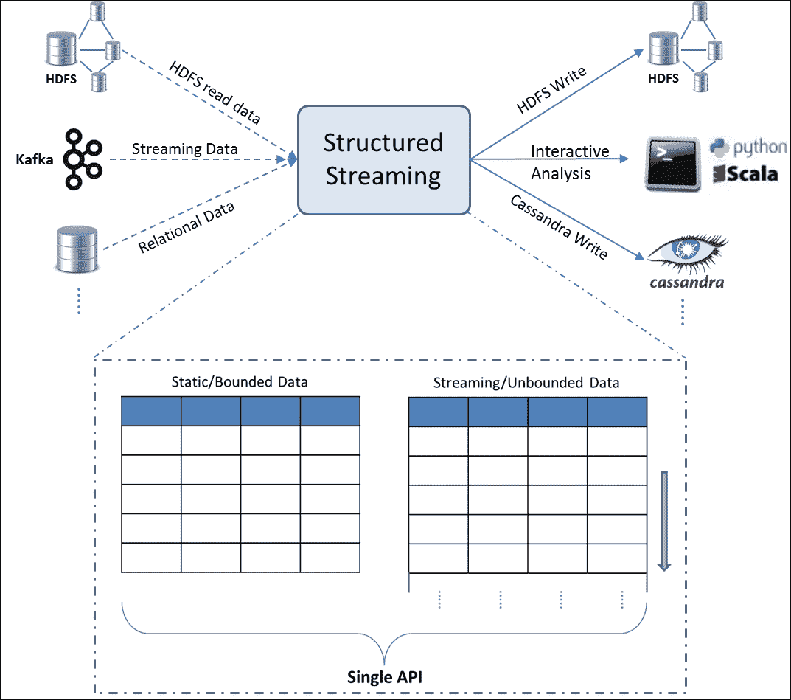
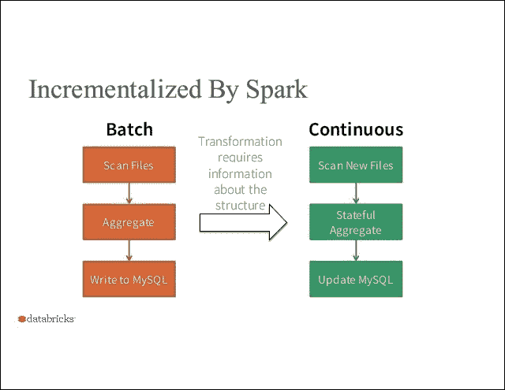
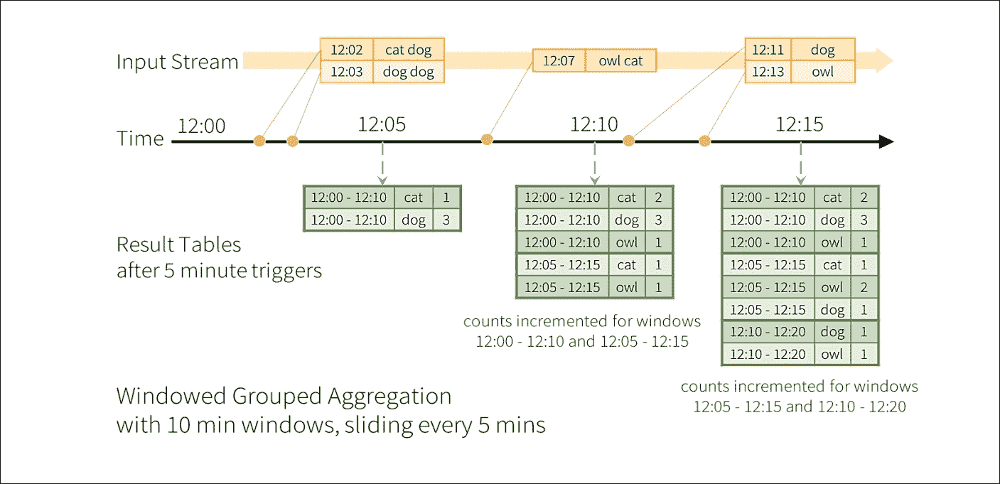
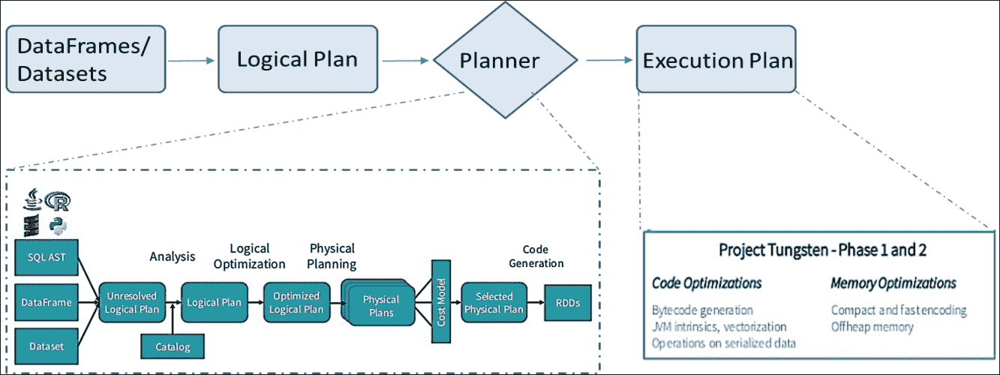
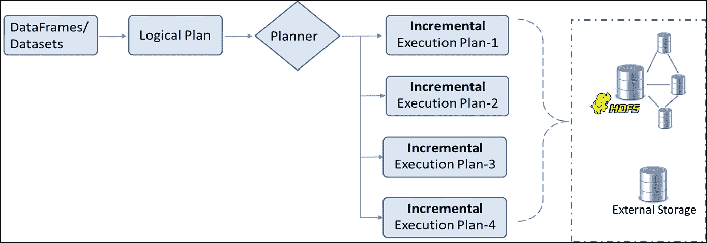

# 四、统一数据访问

来自不同数据源的数据集成一直是一项艰巨的任务。大数据的三个“V”和不断缩短的处理时间框架使得这项任务更具挑战性。对企业来说，以近乎实时的方式提供精心策划的数据的清晰视图极其重要。然而，实时精选数据以及以统一方式执行不同操作(如 ETL、临时查询和机器学习)的能力正在成为关键的业务优势。

创建 Apache Spark 是为了提供一个通用引擎，可以处理来自各种数据源的数据，并支持各种不同操作的大规模数据处理。Spark 使开发人员能够将 SQL、Streaming、图形和机器学习算法结合到一个工作流中！

在前面的章节中，我们讨论了**弹性分布式数据集** ( **关系数据库**)以及数据帧。在[第 3 章](03.html "Chapter 3.  Introduction to DataFrames")、*数据框架介绍*中，我们介绍了 Spark SQL 和 Catalyst 优化器。本章以此为基础，深入探讨这些主题，帮助您了解统一数据访问的真正本质。我们将引入新的结构，如数据集和结构化流。具体来说，我们将讨论以下内容:

*   Apache Spark 中的数据抽象
*   Datasets
    *   使用数据集
    *   数据集应用编程接口限制
*   Spark SQL
    *   SQL 操作
    *   在后台

*   Structured Streaming
    *   Spark流编程模型
    *   在后台
    *   与其他流引擎的比较
*   连续应用
*   摘要

# Apache Spark 中的数据抽象

在过去的十年里，MapReduce 框架及其流行的开源实现 Hadoop 得到了广泛的采用。然而，迭代算法和交互式自组织查询没有得到很好的支持。算法中作业或阶段之间的任何数据共享都是通过磁盘读写进行的，而不是内存中的数据共享。因此，合乎逻辑的下一步将是建立一种机制，促进跨多个作业重用中间结果。RDD 是一个通用的数据抽象，它是为了解决这个需求而开发的。

RDD 是 Apache Spark 中的核心抽象。它是静态类型对象的不可变、容错分布式集合，通常存储在内存中。RDD 应用编程接口提供简单操作，如映射、简化和过滤，这些操作可以任意组合。

数据框架抽象建立在 RDD 之上，它增加了“命名”列。因此，一个 Spark 数据框架有行命名列，类似于关系数据库表和 R 和 Python 中的数据框架(熊猫)。这种熟悉的更高层次的抽象使开发工作变得容易得多，因为它让您能够感知像 SQL 表或 Excel 文件这样的数据。此外，Catalyst 优化器在幕后编译操作并生成 JVM 字节码，以便高效执行。然而，命名列方法产生了一个新问题。静态类型信息对编译器不再可用，因此我们失去了编译时类型安全的优势。

引入数据集应用编程接口是为了结合关系数据库和数据框架的最佳特性，再加上一些自己的特性。数据集提供类似于数据框的行和列数据抽象，但在它们之上定义了一个结构。这种结构可以由 Scala 中的 case 类或 Java 中的类来定义。它们像 RDDs 一样提供类型安全和 lambda 函数。因此，它们既支持类型化方法如`map`、`groupByKey`，也支持非类型化方法如`select`、`groupBy`。除了 Catalyst 优化器之外，数据集还利用了钨执行引擎提供的内存编码，这进一步提高了性能。

到目前为止引入的数据抽象构成了核心抽象。有一些更专业的数据抽象在这些抽象之上工作。引入流应用编程接口来处理来自各种来源的实时流数据，如 Flume 和 Kafka。这些应用编程接口共同为数据工程师提供了一个统一、连续的数据框架抽象，可用于交互式和批处理查询。另一个专门化数据抽象的例子是 GraphFrame。这使开发人员能够分析社交网络和任何其他图形以及类似 Excel 的二维数据。

现在，考虑到可用数据抽象的基础，让我们理解统一数据访问平台的确切含义:


这个统一平台背后的意图是，它不仅让您将静态和流式数据结合在一起，还允许以统一的方式对数据进行各种不同的操作！从开发人员的角度来看，数据集是要使用的核心抽象，而Spark SQL 是Spark功能的主要接口。二维数据结构与 SQL 声明性编程接口相结合是处理数据的常见方式，从而缩短了数据工程师的学习曲线。因此，理解统一平台意味着理解数据集和Spark SQL。

# 数据集

Apache Spark **数据集**是 DataFrame API 的扩展，提供了类型安全的面向对象编程接口。这个应用编程接口最初是在 1.6 版本中引入的。Spark 2.0 版本实现了数据框架和数据集应用编程接口的统一。数据框成为一个通用的、非类型化的数据集；或者数据集是添加了结构的数据框。本文中的术语“结构”指的是底层数据的模式或组织，更像是关系数据库管理系统中的表模式。该结构对底层数据中可以表达或包含的内容施加了限制。这反过来又能在内存组织和物理执行方面实现更好的优化。编译时类型检查导致比运行时更早地捕获错误。例如，SQL 比较中的类型不匹配直到运行时才会被捕获，而如果它被表示为数据集上的一系列操作，它将在编译时被捕获。然而，Python 和 R 固有的动态特性意味着没有编译时类型安全，因此数据集的概念不适用于这些语言。数据集和数据框架的统一仅适用于 Scala 和 Java API。

数据集抽象的核心是**编码器**。这些编码器在 JVM 对象和 Spark 的内部钨二进制格式之间进行转换。这种内部表示绕过了 JVM 的内存管理和垃圾收集。Spark 有自己的 C 风格内存访问，专门为解决其支持的工作流类型而编写。由此产生的内部表示占用更少的内存，并具有高效的内存管理。紧凑的内存表示减少了洗牌操作期间的网络负载。编码器生成紧凑的字节代码，无需反序列化就可以直接对序列化对象进行操作，从而提高性能。在缓存数据集时，尽早了解模式会使内存布局更加优化。

## 使用数据集

在本节中，我们将创建数据集并执行转换和操作，非常类似于数据框架和关系数据库。

示例 1-从简单集合创建数据集:

**斯卡拉:**

```scala
//Create a Dataset from a simple collection 
scala> val ds1 = List.range(1,5).toDS() 
ds1: org.apache.spark.sql.Dataset[Int] = [value: int] 
//Perform an action 
scala> ds1.collect() 
res3: Array[Int] = Array(1, 2, 3, 4) 

//Create from an RDD 
scala> val colors = List("red","orange","blue","green","yellow") 
scala> val color_ds = sc.parallelize(colors).map(x => 
     (x,x.length)).toDS() 
//Add a case class 
case class Color(var color: String, var len: Int) 
val color_ds = sc.parallelize(colors).map(x => 
     Color(x,x.length)).toDS() 

```

如前面代码的最后一个例子所示，`case class`添加了结构信息。Spark 使用这种结构来创建最佳的数据布局和编码。下面的代码向我们展示了结构和执行计划:

**斯卡拉:**

```scala
//Examine the structure 
scala> color_ds.dtypes 
res26: Array[(String, String)] = Array((color,StringType), (len,IntegerType)) 
scala> color_ds.schema 
res25: org.apache.spark.sql.types.StructType = StructType(StructField(color,StringType,true), 
StructField(len,IntegerType,false)) 
//Examine the execution plan 
scala> color_ds.explain() 
== Physical Plan == 
Scan ExistingRDD[color#57,len#58] 

```

前面的示例显示了预期的结构和实施物理计划。如果你想得到一个更详细的执行计划，你必须通过解释(true)，它打印扩展的信息，也包括逻辑计划。

我们已经检查了从简单集合和关系数据库创建数据集。我们已经讨论过数据帧只是无类型数据集。以下示例显示了数据集和数据帧之间的转换。

示例 2-将数据集转换为数据帧

**斯卡拉:**

```scala
//Convert the dataset to a DataFrame 
scala> val color_df = color_ds.toDF() 
color_df: org.apache.spark.sql.DataFrame = [color: string, len: int] 

scala> color_df.show() 
+------+---+ 
| color|len| 
+------+---+ 
|   red|  3| 
|orange|  6| 
|  blue|  4| 
| green|  5| 
|yellow|  6| 
+------+---+ 

```

这个例子看起来很像我们在[第 3 章](03.html "Chapter 3.  Introduction to DataFrames")*数据帧介绍*中看到的例子。这些转换在现实世界中变得非常方便。考虑给不完美的数据添加一个结构(又名 case 类)。您可以首先将该数据读入数据框，执行清理，然后将其转换为数据集。另一个用例可能是，您希望基于一些运行时信息，例如`user_id`，只公开数据的子集(行和列)。您可以将数据读入数据框，将其注册为临时表，应用条件，并将子集公开为数据集。以下示例首先创建一个`DataFrame`，然后将其转换为`Dataset`。请注意，数据框列名必须与大小写类匹配。

示例 3-将数据框转换为数据集

```scala
//Construct a DataFrame first 
scala> val color_df = sc.parallelize(colors).map(x => 
           (x,x.length)).toDF("color","len") 
color_df: org.apache.spark.sql.DataFrame = [color: string, len: int] 
//Convert the DataFrame to a Dataset with a given structure 
scala> val ds_from_df = color_df.as[Color] 
ds_from_df: org.apache.spark.sql.Dataset[Color] = [color: string, len: int] 
//Check the execution plan 
scala> ds_from_df.explain 
== Physical Plan == 
WholeStageCodegen 
:  +- Project [_1#102 AS color#105,_2#103 AS len#106] 
:     +- INPUT 
+- Scan ExistingRDD[_1#102,_2#103] 

```

解释命令响应显示`WholeStageCodegen`，将多个操作融合成一个 Java 函数调用。由于减少了多个虚函数调用，这提高了性能。从 1.1 开始，代码生成就出现在 Spark 引擎中，但当时仅限于表达式求值和少量操作，如筛选。相比之下，从钨生成的整个阶段代码为整个查询计划生成代码。

### 从 JSON 创建数据集

数据集可以从 JSON 文件创建，类似于数据帧。请注意，一个 JSON 文件可能包含几条记录，但是每条记录必须在一行上。如果您的源 JSON 有换行符，您必须以编程方式删除它们。JSON 记录可能有数组，也可能是嵌套的。它们不需要统一的模式。以下示例文件包含 JSON 记录，其中一条记录包含附加标记和数据数组。

示例 4-从 JSON 创建数据集

**斯卡拉:**

```scala
//Set filepath 
scala> val file_path = <Your path> 
file_path: String = ./authors.json 
//Create case class to match schema 
scala> case class Auth(first_name: String, last_name: String,books: Array[String]) 
defined class Auth 

//Create dataset from json using case class 
//Note that the json document should have one record per line 
scala> val auth = spark.read.json(file_path).as[Auth] 
auth: org.apache.spark.sql.Dataset[Auth] = [books: array<string>, firstName: string ... 1 more field] 

//Look at the data 
scala> auth.show() 
+--------------------+----------+---------+ 
|               books|first_name|last_name| 
+--------------------+----------+---------+ 
|                null|      Mark|    Twain| 
|                null|   Charles|  Dickens| 
|[Jude the Obscure...|    Thomas|    Hardy| 
+--------------------+----------+---------+ 

//Try explode to see array contents on separate lines 

scala> auth.select(explode($"books") as "book", 
            $"first_name",$"last_name").show(2,false) 
+------------------------+----------+---------+ 
|book                    |first_name|last_name| 
+------------------------+----------+---------+ 
|Jude the Obscure        |Thomas    |Hardy    | 
|The Return of the Native|Thomas    |Hardy    | 
+------------------------+----------+---------+ 

```

## 数据集 API 的局限性

尽管数据集应用编程接口是使用最好的关系数据库和数据框架创建的，但就其当前的发展阶段而言，它仍有一些局限性:

*   在查询数据集时，应该像 case 类那样给选定的字段指定特定的数据类型，否则输出将变成一个 DataFrame。一个例子是`auth.select(col("first_name").as[String])`。
*   Python 和 R 本质上是动态的，因此类型化数据集不适合。

# Spark SQL

**Spark SQL** 是 Spark 1.0 中引入的用于结构化数据处理的 Spark 模块。这个模块是一个紧密集成的关系引擎，使用核心的 Spark API 进行惰性操作。它使数据工程师能够编写应用程序，从不同的来源加载结构化数据，并将它们连接为统一的、可能是连续的、类似 Excel 的数据框架；然后他们可以实现复杂的 ETL 工作流和高级分析。

Spark 2.0 版本带来了 API 的显著统一，并扩展了 SQL 功能，包括对子查询的支持。数据集应用编程接口和数据框架应用编程接口现在是统一的，数据框架是数据集的一种。统一的应用编程接口为 Spark 的未来奠定了基础，跨越了所有的库。开发人员可以将“结构”强加到他们的数据上，并且可以使用高级声明性 API，从而提高性能和生产力。性能提升是底层优化层的结果。数据帧、数据集和 SQL 共享相同的优化和执行管道。

## SQL 操作

SQL 操作是最广泛使用的数据操作构造。一些最常用的操作是，选择全部或部分列，基于一个或多个条件进行过滤，排序和分组操作，以及计算汇总函数，如 GroupedData 上的`average`。多个数据源上的`JOIN`操作和`union`、`intersect`、`minus`等`set`操作是其他一些广泛执行的操作。此外，数据帧被注册为临时表，并通过传统的 SQL 语句来执行上述操作。**用户定义的功能** ( **UDF** )在注册和不注册的情况下定义和使用。我们将关注窗口操作，这在 Spark 2.0 中刚刚引入。它们处理滑动窗口操作。例如，如果你想报告过去七天每天的平均峰值温度，那么你在一个滑动窗口上操作七天，直到今天。下面是一个计算过去三个月每月平均销售额的例子。数据文件包含 24 项观察数据，显示了 P1 和 P2 两种产品的月销售额。

示例 5-具有移动平均计算的窗口示例

**斯卡拉:**

```scala
scala> import org.apache.spark.sql.expressions.Window 
import org.apache.spark.sql.expressions.Window 
//Create a DataFrame containing monthly sales data for two products 
scala> val monthlySales = spark.read.options(Map({"header"->"true"},{"inferSchema" -> "true"})). 
                            csv("<Your Path>/MonthlySales.csv") 
monthlySales: org.apache.spark.sql.DataFrame = [Product: string, Month: int ... 1 more field] 

//Prepare WindowSpec to create a 3 month sliding window for a product 
//Negative subscript denotes rows above current row 
scala> val w = Window.partitionBy(monthlySales("Product")).orderBy(monthlySales("Month")).rangeBetween(-2,0) 
w: org.apache.spark.sql.expressions.WindowSpec = org.apache.spark.sql.expressions.WindowSpec@3cc2f15 

//Define compute on the sliding window, a moving average in this case 
scala> val f = avg(monthlySales("Sales")).over(w) 
f: org.apache.spark.sql.Column = avg(Sales) OVER (PARTITION BY Product ORDER BY Month ASC RANGE BETWEEN 2 PRECEDING AND CURRENT ROW) 
//Apply the sliding window and compute. Examine the results 
scala> monthlySales.select($"Product",$"Sales",$"Month", bround(f,2).alias("MovingAvg")). 
                    orderBy($"Product",$"Month").show(6) 
+-------+-----+-----+---------+                                                  
|Product|Sales|Month|MovingAvg| 
+-------+-----+-----+---------+ 
|     P1|   66|    1|     66.0| 
|     P1|   24|    2|     45.0| 
|     P1|   54|    3|     48.0| 
|     P1|    0|    4|     26.0| 
|     P1|   56|    5|    36.67| 
|     P1|   34|    6|     30.0| 
+-------+-----+-----+---------+ 

```

**蟒蛇:**

```scala
    >>> from pyspark.sql import Window
    >>> import pyspark.sql.functions as func
    //Create a DataFrame containing monthly sales data for two products
    >> file_path = <Your path>/MonthlySales.csv"
    >>> monthlySales = spark.read.csv(file_path,header=True, inferSchema=True)

    //Prepare WindowSpec to create a 3 month sliding window for a product
    //Negative subscript denotes rows above current row
    >>> w = Window.partitionBy(monthlySales["Product"]).orderBy(monthlySales["Month"]).rangeBetween(-2,0)
    >>> w
    <pyspark.sql.window.WindowSpec object at 0x7fdc33774a50>
    >>>
    //Define compute on the sliding window, a moving average in this case
    >>> f = func.avg(monthlySales["Sales"]).over(w)
    >>> f
    Column<avg(Sales) OVER (PARTITION BY Product ORDER BY Month ASC RANGE BETWEEN 2 PRECEDING AND CURRENT ROW)>
    >>>
    //Apply the sliding window and compute. Examine the results
    >>> monthlySales.select(monthlySales.Product,monthlySales.Sales,monthlySales.Month,
                          func.bround(f,2).alias("MovingAvg")).orderBy(
                          monthlySales.Product,monthlySales.Month).show(6)
    +-------+-----+-----+---------+                                                 
    |Product|Sales|Month|MovingAvg|
    +-------+-----+-----+---------+
    |     P1|   66|    1|     66.0|
    |     P1|   24|    2|     45.0|
    |     P1|   54|    3|     48.0|
    |     P1|    0|    4|     26.0|
    |     P1|   56|    5|    36.67|
    |     P1|   34|    6|     30.0|
    +-------+-----+-----+---------+

```

## 在引擎盖下

当开发人员使用 RDD 应用编程接口编写程序时，他/她有责任高效地执行手头的工作负载。数据类型和计算不适用于 Spark。相反，当开发人员使用数据框架和Spark SQL 时，底层引擎拥有关于模式和操作的信息。在这种情况下，开发人员可以编写更少的代码，而优化器可以完成所有的艰苦工作。

Catalyst 优化器包含用于表示树和应用规则来转换树的库。这些树转换被用于创建最优化的逻辑和物理执行计划。在最后一个阶段，它使用 Scala 语言的一个特殊特性生成 Java 字节码，这个特性叫做**准引号**。优化器还使外部开发人员能够通过添加特定于数据源的规则来扩展优化器，从而将操作推送到外部系统，或者支持新的数据类型。

Catalyst 优化器会得出执行现有操作的最佳计划。钨发动机提供了实际的执行和相关的改进。wow 的目标是提高 Spark 后端执行的内存和 CPU 效率。以下是该引擎的一些显著特征:

*   通过绕过(堆外)Java 内存管理，减少内存占用并消除垃圾收集开销。
*   代码生成融合了多个操作符，避免了过多的虚函数调用。生成的代码看起来像手动优化的代码。
*   内存布局采用柱状内存拼花格式，因为这样可以进行矢量化处理，也更接近于通常的数据访问操作。
*   使用编码器的内存编码。编码器使用运行时代码生成来构建自定义字节代码，以实现更快、更紧凑的序列化和反序列化。许多操作无需反序列化就可以就地执行，因为它们已经是钨二进制格式。

# 结构化流

流媒体是一个看似宽泛的话题！如果你仔细看看现实世界的问题，企业不仅仅希望流媒体引擎能够实时做出决策。一直需要集成批处理堆栈和流堆栈，并与外部存储系统和应用程序集成。此外，解决方案应该能够适应业务逻辑的动态变化，以满足新的和不断变化的业务需求。

Apache Spark 2.0 拥有第一个被称为**结构化流**引擎的高级流处理 API 版本。这个可扩展且容错的引擎依靠 Spark SQL API 来简化实时、连续大数据应用程序的开发。这可能是在统一批处理和流计算方面的第一次成功尝试。

在技术层面上，结构化流依赖于 Spark SQL API，它扩展了数据框架/数据集，我们在前面的章节中已经讨论过了。Spark 2.0 允许您以统一的方式执行完全不同的活动，例如:

*   构建最大似然模型并将其应用于流数据
*   将流数据与其他静态数据相结合
*   执行临时、交互式和批处理查询
*   运行时更改查询
*   使用 Spark SQL JDBC 聚合数据流和服务

与其他流引擎不同，Spark 允许您将实时**流数据**与**静态数据**相结合，并允许您执行前面的操作。



从根本上说，结构化流是由 Spark SQL 的 Catalyst 优化器提供的。因此，它让开发人员不必担心在处理静态或实时数据流时如何提高查询效率。

截至本文撰写之时，Spark 2.0 的结构化流专注于 ETL，以后的版本将会有更多的操作符和库。

让我们看一个简单的例子。以下示例在本地机器上监听 Linux 上的**系统活动报告** ( **sar** )并计算平均可用内存。系统活动报告提供系统活动统计信息，当前示例收集内存使用情况，每 2 秒报告 20 次。Spark流读取该流输出并计算平均内存。我们使用方便的网络工具 **netcat** ( **nc** )将`sar`输出重定向到给定端口。选项`l`和`k`指定`nc`应该监听一个传入的连接，并且它必须继续监听另一个连接，即使在它当前的连接完成之后。

**斯卡拉:**

示例 6-流示例

```scala
//Run the following command from one terminal window 
sar -r 2 20 | nc -lk 9999 

//In spark-shell window, do the following 
//Read stream 
scala> val myStream = spark.readStream.format("socket"). 
                       option("host","localhost"). 
                       option("port",9999).load() 
myStream: org.apache.spark.sql.DataFrame = [value: string] 

//Filter out unwanted lines and then extract free memory part as a float 
//Drop missing values, if any 
scala> val myDF = myStream.filter($"value".contains("IST")). 
               select(substring($"value",15,9).cast("float").as("memFree")). 
               na.drop().select($"memFree") 
myDF: org.apache.spark.sql.DataFrame = [memFree: float] 

//Define an aggregate function 
scala> val avgMemFree = myDF.select(avg("memFree")) 
avgMemFree: org.apache.spark.sql.DataFrame = [avg(memFree): double] 

//Create StreamingQuery handle that writes on to the console 
scala> val query = avgMemFree.writeStream. 
          outputMode("complete"). 
          format("console"). 
          start() 
query: org.apache.spark.sql.streaming.StreamingQuery = Streaming Query - query-0 [state = ACTIVE] 

Batch: 0 
------------------------------------------- 
+-----------------+ 
|     avg(memFree)| 
+-----------------+ 
|4116531.380952381| 
+-----------------+ 
.... 

```

**蟒蛇:**

```scala
    //Run the following command from one terminal window
     sar -r 2 20 | nc -lk 9999

    //In another window, open pyspark shell and do the following
    >>> import pyspark.sql.functions as func
    //Read stream
    >>> myStream = spark.readStream.format("socket"). \
                           option("host","localhost"). \
                           option("port",9999).load()
    myStream: org.apache.spark.sql.DataFrame = [value: string]

    //Filter out unwanted lines and then extract free memory part as a float
    //Drop missing values, if any
    >>> myDF = myStream.filter("value rlike 'IST'"). \
               select(func.substring("value",15,9).cast("float"). \
               alias("memFree")).na.drop().select("memFree")

    //Define an aggregate function
    >>> avgMemFree = myDF.select(func.avg("memFree"))

    //Create StreamingQuery handle that writes on to the console
    >>> query = avgMemFree.writeStream. \
              outputMode("complete"). \
              format("console"). \
              start()
    Batch: 0
    -------------------------------------------
    +------------+
    |avg(memFree)|
    +------------+
    |   4042749.2|
    +------------+
    .....

```

前面的例子定义了一个连续的数据帧(也称为流)来监听特定的端口，执行一些转换和聚合，并显示连续的输出。

## Spark流编程模型

正如本章前面所演示的，只有一个 API 来处理静态和流数据。其思想是将实时数据流视为一个不断追加的表，如下图所示:


因此，无论是静态数据还是流数据，您只需像在静态数据表上一样启动类似批处理的查询，Spark 将其作为无界输入表上的增量查询运行，如下图所示:



因此，开发人员在输入表上定义了一个查询，对于静态有界表和动态无界表都是如此。让我们了解整个过程的各种技术术语，以了解其工作原理:

*   **输入:**来自源的数据，作为仅附加的表
*   **触发:**何时检查输入新数据
*   **查询:**对数据进行什么操作，如过滤、分组等
*   **结果:**每个触发间隔的结果表
*   **输出:**选择每次触发后将结果的哪一部分写入数据接收器

现在让我们看看 Spark SQL 计划员如何处理整个过程:


礼貌:数据专线

前面的截图在 Apache Spark 官方网站的结构化编程指南中有非常简单的解释，如*参考文献*部分所示。



此时，我们需要了解支持的输出模型。每次更新结果表时，都需要将更改写入外部系统，如 HDFS、S3 或任何其他数据库。我们通常更喜欢增量写入输出。为此，结构化流提供三种输出模式:

*   **追加:**在外部存储器中，只写入自上次触发后追加到结果表的新行。这仅适用于结果表中现有行无法更改的查询(例如，输入流上的映射)。
*   **完成:**在外部存储器中，整个更新后的结果表将按原样写入。
*   **更新:**在外部存储器中，只有自上次触发以来在结果表中被更新的行将被改变。这种模式适用于可以就地更新的输出接收器，例如 MySQL 表。

在我们的例子中，我们使用了完整模式，即直接写入控制台。您可能想写入一些外部文件，如拼花，以获得更好的理解。

## 在引擎盖下

如果您查看在**数据帧/数据集**上执行的操作的“幕后”执行机制，它将如下图所示:



这里请注意**计划者**预先知道如何将流式**逻辑计划**转换为连续的一系列**增量执行计划**。这可以由下图表示:



**计划器**可以轮询数据源中的新数据，以便能够以优化的方式计划执行。

## 与其他流媒体引擎的对比

我们已经讨论了结构化流的许多独特特性。现在让我们与其他可用的流媒体引擎进行比较:


礼貌:数据专线

# 连续应用

我们讨论了 Spark 如何支持统一数据访问。它允许您以多种方式处理数据，通过支持各种分析工作负载(如 ETL 处理、临时查询、在线机器学习建模)或生成必要的报告来构建端到端的连续应用程序...所有这些都是以一种统一的方式实现的，它允许您使用高级的、类似 SQL 的 API 来处理静态数据和流数据。通过这种方式，结构化流大大简化了实时、连续应用程序的开发和维护。


礼貌:数据专线

# 总结

在本章中，我们讨论了统一数据访问的真正含义，以及 Spark 如何实现这一目的。我们仔细研究了数据集应用编程接口，以及如何通过它实现实时流。我们了解了数据集的优势及其局限性。我们还研究了连续应用背后的基础。

在下一章中，我们将探讨利用 Spark 平台进行大规模数据分析操作的各种方法。

# 参考文献

*   [http://people . csail . MIT . edu/matei/papers/2015/sigmod _ Spark _ SQL . pdf](http://people.csail.mit.edu/matei/papers/2015/sigmod_spark_sql.pdf):Spark SQL:Spark 中的关系数据处理
*   [https://databricks . com/blog/2016/07/14/A-Tale-of-Three-Apache-Spark-API-RDDs-dataframes-和-dataset . html](https://databricks.com/blog/2016/07/14/a-tale-of-three-apache-spark-apis-rdds-dataframes-and-datasets.html):A-Tale-of-Three-Apache-Spark API:RDDs、data frames 和 Datasets 何时使用它们以及为什么使用它们
*   [https://databricks . com/blog/2016/01/04/introduction-Apache-Spark-Datasets . html](https://databricks.com/blog/2016/01/04/introducing-apache-spark-datasets.html):introduction Apache Spark 数据集
*   [https://databricks . com/blog/2015/04/13/Deep-Dive-in-Spark-SQL-Catalyst-Optimizer . html](https://databricks.com/blog/2015/04/13/deep-dive-into-spark-sqls-catalyst-optimizer.html):Deep-in-Spark-SQL 的 Catalyst Optimizer
*   [https://databricks . com/blog/2016/05/23/Apache-Spark 作为编译器-在笔记本电脑上每秒加入十亿行. html](https://databricks.com/blog/2016/05/23/apache-spark-as-a-compiler-joining-a-billion-rows-per-second-on-a-laptop.html) : Apache Spark 作为编译器:在笔记本电脑上每秒加入十亿行
*   [https://databricks . com/blog/2015/04/28/project-钨-带Spark-更接近裸机. html](https://databricks.com/blog/2015/04/28/project-tungsten-bringing-spark-closer-to-bare-metal.html) :带Spark更接近裸机
*   [https://databricks . com/blog/2016/07/28/Structured-Streaming-in-Apache-spark . html](https://databricks.com/blog/2016/07/28/structured-streaming-in-apache-spark.html):Structured Streaming API 详细信息
*   [https://Spark . Apache . org/docs/latest/Structured-Streaming-Programming-Guide . html](https://spark.apache.org/docs/latest/structured-streaming-programming-guide.html):Spark 结构化流编程指南
*   [https://Spark-summit . org/east-2016/events/structure-Spark-dataframes-dataset-and-streaming/](https://spark-summit.org/east-2016/events/structuring-spark-dataframes-datasets-and-streaming/):结构化 Apache Spark SQL、data frames、dataset 和 Streaming 作者:迈克尔·阿姆布鲁斯特
*   [https://databricks . com/blog/2016/06/22/Apache-Spark-Key-terms-explained . html](https://databricks.com/blog/2016/06/22/apache-spark-key-terms-explained.html):Apache Spark Key terms explained