# 五、Spark数据分析

大规模数据分析领域的发展前所未有。开发了各种各样的库和工具来进行数据分析，并有一套丰富的算法。与此同时，分布式计算技术也在随着时间的推移而发展，以大规模处理庞大的数据集。这两个特征必须融合，这是 Spark 发展背后的主要意图。

前两章概述了数据科学的技术方面。它涵盖了数据框架应用编程接口、数据集、流数据的一些基础知识，以及它如何通过 R 和 Python 用户熟悉的数据框架促进数据表示。在介绍了这个应用编程接口之后，我们看到了如何在数据集上操作变得比以往任何时候都更容易。我们还研究了Spark SQL 如何通过其强大的特性和优化技术在支持数据框架应用编程接口方面发挥背景作用。在本章中，我们将涵盖大数据分析的科学方面，并学习可以在 Spark 上执行的各种数据分析技术。

作为本章的先决条件，对数据框架应用编程接口和统计基础有一个基本的了解是很好的。然而，我们已经试图使内容尽可能简单，并详细涵盖了一些重要的基础知识，以便任何人都可以开始对 Spark 进行统计分析。本章涵盖的主题如下:

*   数据分析生命周期
*   数据采集
*   Data preparation
    *   数据整合
    *   数据清理
    *   数据转换

*   Basics of statistics
    *   抽样
    *   数据分布
*   Descriptive statistics
    *   位置测量
    *   传播尺度
    *   汇总统计
    *   图形技术
*   Inferential statistics
    *   离散概率分布
    *   连续概率分布
    *   标准误差
    *   可信度
    *   误差幅度和置信区间
    *   人口变化
    *   估计样本量
    *   假设检验
    *   卡方检验
    *   f 检验
    *   相关

# 数据分析生命周期

对于大多数现实世界的项目来说，都有一些明确的步骤要遵循。然而，数据分析和数据科学并没有普遍认同的定义或界限。一般来说，“数据分析”这个术语包含了检查数据、发现有用的见解以及传达这些见解所涉及的技术和过程。“数据科学”一词最好被视为一个跨学科的领域，来源于*统计学*、*计算机科学*和*数学*。这两个术语都涉及处理原始数据以获得知识或见解，通常是以迭代的方式，有些人可以互换使用。

基于不同的业务需求，有不同的方法来处理问题，但是没有一个独特的标准流程能够很好地适应所有可能的场景。一个典型的流程工作流可以概括为一个制定问题、探索、假设、验证假设、分析结果以及重新开始的循环。下图中用粗箭头描述了这一点。从数据角度来看，工作流包括数据采集、预处理、探索数据、建模和结果交流。这在图中显示为圆圈。分析和可视化发生在每个阶段，从数据收集到结果交流。数据分析工作流包含两个视图中显示的所有活动:


整个生命周期中最重要的是手头的问题。可能包含答案的数据(相关数据！)接下来是这个问题。根据问题的不同，第一个任务是根据需要从一个或多个数据源收集正确的数据。组织通常维护**数据湖**，它们是原始格式的巨大数据存储库。

下一步是将数据清理/转换为所需的格式。数据清理也称为数据蒙骗、数据扯皮或数据挖掘。这包括在评估手头数据质量时的缺失值处理和异常值处理等活动。为了更好地理解，您可能还需要汇总/绘制数据。制定最终数据矩阵的过程被认为是最耗时的一步。这也恰好是一个被低估的组件，被认为是预处理的一部分，以及其他活动，如特征提取和数据转换。

接下来是数据科学的关键，即训练模型和提取模式，这需要大量使用统计和机器学习。最后一步是公布结果。

本章的其余部分将深入研究这些步骤，以及如何使用 Spark 实现它们。还包括一些基本的统计数据，以便读者能够轻松地理解代码片段。

# 数据采集

数据采集是任何数据科学项目的第一步。通常，您不会在一个地方找到完整的所需数据集合，因为它分布在**业务线** ( **LOB** )应用程序和系统中。

这一部分的大部分内容已经在上一章中介绍过了，该章概述了如何从不同的数据源获取数据，并将数据存储在数据框中以便于分析。Spark 中有一个内置机制，可以从一些常见的数据源中获取数据，并且为 Spark 上不支持的数据源提供了*数据源 API* 。

为了更好地理解数据获取和准备阶段，让我们假设一个场景，并尝试解决示例代码片段涉及的所有步骤。该场景是这样的，员工数据存在于本地 RDD、JSON 文件和一个 SQL 服务器上。那么，让我们来看看如何将这些应用到 Spark 数据框中:

**蟒蛇**

```scala
// From RDD: Create an RDD and convert to DataFrame
>>> employees = sc.parallelize([(1, "John", 25), (2, "Ray", 35), (3, "Mike", 24), (4, "Jane", 28), (5, "Kevin", 26), (6, "Vincent", 35), (7, "James", 38), (8, "Shane", 32), (9, "Larry", 29), (10, "Kimberly", 29), (11, "Alex", 28), (12, "Garry", 25), (13, "Max", 31)]).toDF(["emp_id","name","age"])
>>>

// From JSON: reading a JSON file
>>> salary = sqlContext.read.json("./salary.json")
>>> designation = sqlContext.read.json("./designation.json")
```

**斯卡拉**

```scala
// From RDD: Create an RDD and convert to DataFrame
scala> val employees = sc.parallelize(List((1, "John", 25), (2, "Ray", 35), (3, "Mike", 24), (4, "Jane", 28), (5, "Kevin", 26), (6, "Vincent", 35), (7, "James", 38), (8, "Shane", 32), (9, "Larry", 29), (10, "Kimberly", 29), (11, "Alex", 28), (12, "Garry", 25), (13, "Max", 31))).toDF("emp_id","name","age")
employees: org.apache.spark.sql.DataFrame = [emp_id: int, name: string ... 1 more field]
scala> // From JSON: reading a JSON file
scala> val salary = spark.read.json("./salary.json")
salary: org.apache.spark.sql.DataFrame = [e_id: bigint, salary: bigint]
scala> val designation = spark.read.json("./designation.json")
designation: org.apache.spark.sql.DataFrame = [id: bigint, role: string]
```

# 数据准备

数据质量一直是行业中普遍存在的问题。存在不正确或不一致的数据可能会对您的分析产生误导性结果。如果数据没有按照要求清理和准备好，实现更好的算法或构建更好的模型也不会有多大帮助。有一个行业术语叫做**数据工程**，指的是数据来源和准备。这通常是由数据科学家完成的，在一些组织中，有专门的团队来完成这项工作。然而，在准备数据时，通常需要科学的观点来做好。举个例子，你可能不只是做*均值替换*来处理缺失的值，并查看数据分布来找到更合适的值来替换。另一个这样的例子是，您可能不仅仅是查看箱线图或散点图来寻找异常值，因为如果您绘制单个变量，可能会有不可见的多元异常值。有不同的方法，例如**高斯混合模型** ( **GMMs** )和**期望最大化** ( **EM** )算法，它们使用**马氏距离**来寻找多元异常值。

数据准备阶段是一个极其重要的阶段，这不仅是为了让算法正常工作，也是为了让您更好地理解您的数据，以便在实施算法时采取正确的方法。

一旦从不同的来源获取了数据，下一步就是整合它们，以便数据作为一个整体可以被清理、格式化，并转换为您的分析所需的格式。请注意，根据具体情况，您可能需要从数据源中提取数据样本，然后准备数据进行进一步分析。本章稍后将讨论可以使用的各种采样技术。

## 数据整合

在本节中，我们将了解如何组合从各种数据源获取的数据:

**蟒蛇**

```scala
// Creating the final data matrix using the join operation
>>> final_data = employees.join(salary, employees.emp_id == salary.e_id).join(designation, employees.emp_id == designation.id).select("emp_id", "name", "age", "role", "salary")
>>> final_data.show(5)
+------+-----+---+---------+------+
|emp_id| name|age|     role|salary|
+------+-----+---+---------+------+
|     1| John| 25|Associate| 10000|
|     2|  Ray| 35|  Manager| 12000|
|     3| Mike| 24|  Manager| 12000|
|     4| Jane| 28|Associate|  null|
|     5|Kevin| 26|  Manager|   120|
+------+-----+---+---------+------+
only showing top 5 rows
```

**斯卡拉**

```scala
// Creating the final data matrix using the join operation
scala> val final_data = employees.join(salary, $"emp_id" === $"e_id").join(designation, $"emp_id" === $"id").select("emp_id", "name", "age", "role", "salary")
final_data: org.apache.spark.sql.DataFrame = [emp_id: int, name: string ... 3 more fields]
```

整合这些来源的数据后，最终数据集(在本例中为`final_data`)应为以下格式(仅示例数据):

<colgroup><col> <col> <col> <col> <col></colgroup> 
| **emp_id** | **名称** | **年龄** | **角色** | **工资** |
| one | 约翰 | Twenty-five | 联想 | 10,000 $ |
| Two | 光线 | Thirty-five | 经理 | 12,000 $ |
| three | 迈克 | Twenty-four | 经理 | 12,000 $ |
| four | 简（女子名） | Twenty-eight | 联想 | 空 |
| five | 凯文 | Twenty-six | 经理 | 12,000 $ |
| six | 文森特 | Thirty-five | 高级经理 | 22,000 $ |
| seven | 詹姆斯 | Thirty-eight | 高级经理 | 20,000 $ |
| eight | 谢恩 | Thirty-two | 经理 | 12,000 $ |
| nine | 称量车 | Twenty-nine | 经理 | 10,000 $ |
| Ten | 金伯利 | Twenty-nine | 联想 | 8,000 $ |
| Eleven | 亚历克斯 | Twenty-eight | 经理 | 12,000 $ |
| Twelve | 胡玮铭 | Twenty-five | 经理 | 12.000 $ |
| Thirteen | 最大 | Thirty-one | 经理 | 12,000 $ |

## 数据清理

一旦您将数据整合到一个地方，在分析之前花足够的时间和精力清理数据是非常重要的。这是一个反复的过程，因为你必须验证你对数据采取的行动，并一直持续到你对数据质量满意为止。建议您花时间分析您在数据中检测到的异常的原因。

任何数据集中通常都存在一定程度的数据杂质。数据可能有各种各样的问题，但我们将讨论一些常见的情况，例如缺少值、重复值、转换或格式化(从数字中添加或删除数字、将一列拆分为两列、将两列合并为一列)。

### 缺失值处理

有各种方法来处理丢失的值。一种方法是删除包含缺失值的行。即使单个列缺少值，我们也可能希望删除一行，或者可能对不同的列有不同的策略。只要该行中缺失值的总数低于阈值，我们就可能希望保留该行。另一种方法是用一个常数值代替空值，比如数值变量的平均值。

在本节中，我们不会同时提供 Scala 和 Python 中的一些示例，我们将尝试涵盖各种场景，为您提供更广阔的视角。

**蟒蛇**

```scala
// Dropping rows with missing value(s)
>>> clean_data = final_data.na.drop()
>>> 
// Replacing missing value by mean
>>> import math
>>> from pyspark.sql import functions as F
>>> mean_salary = math.floor(salary.select(F.mean('salary')).collect()[0][0])
>>> clean_data = final_data.na.fill({'salary' : mean_salary})
>>> 
//Another example for missing value treatment
>>> authors = [['Thomas','Hardy','June 2, 1840'],
       ['Charles','Dickens','7 February 1812'],
        ['Mark','Twain',None],
        ['Jane','Austen','16 December 1775'],
      ['Emily',None,None]]
>>> df1 = sc.parallelize(authors).toDF(
       ["FirstName","LastName","Dob"])
>>> df1.show()
+---------+--------+----------------+
|FirstName|LastName|             Dob|
+---------+--------+----------------+
|   Thomas|   Hardy|    June 2, 1840|
|  Charles| Dickens| 7 February 1812|
|     Mark|   Twain|            null|
|     Jane|  Austen|16 December 1775|
|    Emily|    null|            null|
+---------+--------+----------------+

// Drop rows with missing values
>>> df1.na.drop().show()
+---------+--------+----------------+
|FirstName|LastName|             Dob|
+---------+--------+----------------+
|   Thomas|   Hardy|    June 2, 1840|
|  Charles| Dickens| 7 February 1812|
|     Jane|  Austen|16 December 1775|
+---------+--------+----------------+

// Drop rows with at least 2 missing values
>>> df1.na.drop(thresh=2).show()
+---------+--------+----------------+
|FirstName|LastName|             Dob|
+---------+--------+----------------+
|   Thomas|   Hardy|    June 2, 1840|
|  Charles| Dickens| 7 February 1812|
|     Mark|   Twain|            null|
|     Jane|  Austen|16 December 1775|
+---------+--------+----------------+

// Fill all missing values with a given string
>>> df1.na.fill('Unknown').show()
+---------+--------+----------------+
|FirstName|LastName|             Dob|
+---------+--------+----------------+
|   Thomas|   Hardy|    June 2, 1840|
|  Charles| Dickens| 7 February 1812|
|     Mark|   Twain|         Unknown|
|     Jane|  Austen|16 December 1775|
|    Emily| Unknown|         Unknown|
+---------+--------+----------------+

// Fill missing values in each column with a given string
>>> df1.na.fill({'LastName':'--','Dob':'Unknown'}).show()
+---------+--------+----------------+
|FirstName|LastName|             Dob|
+---------+--------+----------------+
|   Thomas|   Hardy|    June 2, 1840|
|  Charles| Dickens| 7 February 1812|
|     Mark|   Twain|         Unknown|
|     Jane|  Austen|16 December 1775|
|    Emily|      --|         Unknown|
+---------+--------+----------------+
```

**斯卡拉**

```scala
//Missing value treatment
// Dropping rows with missing value(s)
scala> var clean_data = final_data.na.drop() //Note the var declaration instead of val
clean_data: org.apache.spark.sql.DataFrame = [emp_id: int, name: string ... 3 more fields]
scala>

// Replacing missing value by mean
scal> val mean_salary = final_data.select(floor(avg("salary"))).
            first()(0).toString.toDouble
mean_salary: Double = 20843.0
scal> clean_data = final_data.na.fill(Map("salary" -> mean_salary)) 

//Reassigning clean_data
clean_data: org.apache.spark.sql.DataFrame = [emp_id: int, name: string ... 3 more fields]
scala>

//Another example for missing value treatment
scala> case class Author (FirstName: String, LastName: String, Dob: String)
defined class Author
scala> val authors = Seq(
        Author("Thomas","Hardy","June 2, 1840"),
        Author("Charles","Dickens","7 February 1812"),
        Author("Mark","Twain",null),
        Author("Emily",null,null))
authors: Seq[Author] = List(Author(Thomas,Hardy,June 2, 1840),
   Author(Charles,Dickens,7 February 1812), Author(Mark,Twain,null),
   Author(Emily,null,null))
scala> val ds1 = sc.parallelize(authors).toDS()
ds1: org.apache.spark.sql.Dataset[Author] = [FirstName: string, LastName: string ... 1 more field]
scala> ds1.show()
+---------+--------+---------------+
|FirstName|LastName|            Dob|
+---------+--------+---------------+
|   Thomas|   Hardy|   June 2, 1840|
|  Charles| Dickens|7 February 1812|
|     Mark|   Twain|           null|
|    Emily|    null|           null|
+---------+--------+---------------+
scala>

// Drop rows with missing values
scala> ds1.na.drop().show()
+---------+--------+---------------+
|FirstName|LastName|            Dob|
+---------+--------+---------------+
|   Thomas|   Hardy|   June 2, 1840|
|  Charles| Dickens|7 February 1812|
+---------+--------+---------------+
scala>

//Drop rows with at least 2 missing values
//Note that there is no direct scala function to drop rows with at least n missing values
//However, you can drop rows containing under specified non nulls
//Use that function to achieve the same result
scala> ds1.na.drop(minNonNulls = df1.columns.length - 1).show()
//Fill all missing values with a given string
scala> ds1.na.fill("Unknown").show()
+---------+--------+---------------+
|FirstName|LastName|            Dob|
+---------+--------+---------------+
|   Thomas|   Hardy|   June 2, 1840|
|  Charles| Dickens|7 February 1812|
|     Mark|   Twain|        Unknown|
|    Emily| Unknown|        Unknown|
+---------+--------+---------------+
scala>

//Fill missing values in each column with a given string
scala> ds1.na.fill(Map("LastName"->"--",
                    "Dob"->"Unknown")).show()
+---------+--------+---------------+
|FirstName|LastName|            Dob|
+---------+--------+---------------+
|   Thomas|   Hardy|   June 2, 1840|
|  Charles| Dickens|7 February 1812|
|     Mark|   Twain|        Unknown|
|    Emily|      --|        Unknown|
+---------+--------+---------------+
```

### 异常值处理

理解什么是异常值对善待它也很重要。简单地说，离群点是指与其他数据点不具有相同特征的数据点。例如:如果你有一个学生数据集，并且有几个年龄值在 30-40 岁之间，那么它们可能是异常值。现在让我们来看一个不同的例子:如果您有一个数据集，其中一个变量只能在两个范围内有数据点，比如说在 10-20 或 80-90 范围内，那么在这两个范围之间有值的数据点(比如说 40 或 55)也可能是异常值。在本例中，40 或 55 不属于 10-20 范围，也不属于 80-90 范围，是异常值。

此外，可能存在单变量异常值，也可能存在多变量异常值。为了简单起见，我们将在本书中关注单变量异常值，因为在编写本书时，Spark MLlib 可能没有所需的所有算法。

为了处理异常值，您必须首先查看是否有异常值。有不同的方法，如汇总统计和绘图技术，来寻找异常值。你可以使用 Python 的`matplotlib`等内置库函数来可视化你的数据。您可以通过笔记本(例如，Jupyter)连接到 Spark 来实现这一点，这样就可以生成视觉效果，而这在命令外壳上可能是不可能的。

一旦发现异常值，您可以删除包含异常值的行，或者估算平均值来代替异常值，或者根据您的情况做一些更相关的事情。让我们看一下均值替代法:

**蟒蛇**

```scala
// Identify outliers and replace them with mean
//The following example reuses the clean_data dataset and mean_salary computed in previous examples
>>> mean_salary
20843.0
>>> 
//Compute deviation for each row
>>> devs = final_data.select(((final_data.salary - mean_salary) ** 2).alias("deviation"))

//Compute standard deviation
>>> stddev = math.floor(math.sqrt(devs.groupBy().
          avg("deviation").first()[0]))

//check standard deviation value
>>> round(stddev,2)
30351.0
>>> 
//Replace outliers beyond 2 standard deviations with the mean salary
>>> no_outlier = final_data.select(final_data.emp_id, final_data.name, final_data.age, final_data.salary, final_data.role, F.when(final_data.salary.between(mean_salary-(2*stddev), mean_salary+(2*stddev)), final_data.salary).otherwise(mean_salary).alias("updated_salary"))
>>> 
//Observe modified values
>>> no_outlier.filter(no_outlier.salary != no_outlier.updated_salary).show()
+------+----+---+------+-------+--------------+
|emp_id|name|age|salary|   role|updated_salary|
+------+----+---+------+-------+--------------+
|    13| Max| 31|120000|Manager|       20843.0|
+------+----+---+------+-------+--------------+
>>>

```

**斯卡拉**

```scala
// Identify outliers and replace them with mean
//The following example reuses the clean_data dataset and mean_salary computed in previous examples
//Compute deviation for each row
scala> val devs = clean_data.select(((clean_data("salary") - mean_salary) *
        (clean_data("salary") - mean_salary)).alias("deviation"))
devs: org.apache.spark.sql.DataFrame = [deviation: double]

//Compute standard deviation
scala> val stddev = devs.select(sqrt(avg("deviation"))).
            first().getDouble(0)
stddev: Double = 29160.932595617614

//If you want to round the stddev value, use BigDecimal as shown
scala> scala.math.BigDecimal(stddev).setScale(2,
             BigDecimal.RoundingMode.HALF_UP)
res14: scala.math.BigDecimal = 29160.93
scala>

//Replace outliers beyond 2 standard deviations with the mean salary
scala> val outlierfunc = udf((value: Long, mean: Double) => {if (value > mean+(2*stddev)
            || value < mean-(2*stddev)) mean else value})

//Use the UDF to compute updated_salary
//Note the usage of lit() to wrap a literal as a column
scala> val no_outlier = clean_data.withColumn("updated_salary",
            outlierfunc(col("salary"),lit(mean_salary)))

//Observe modified values
scala> no_outlier.filter(no_outlier("salary") =!=  //Not !=
             no_outlier("updated_salary")).show()
+------+----+---+-------+------+--------------+
|emp_id|name|age|   role|salary|updated_salary|
+------+----+---+-------+------+--------------+
|    13| Max| 31|Manager|120000|       20843.0|
+------+----+---+-------+------+--------------+
```

### 重复值处理

有不同的方法来处理数据集中的重复记录。我们将在下面的代码片段中演示这些功能:

**蟒蛇**

```scala
// Deleting the duplicate rows
>>> authors = [['Thomas','Hardy','June 2,1840'],
    ['Thomas','Hardy','June 2,1840'],
    ['Thomas','H',None],
    ['Jane','Austen','16 December 1775'],
    ['Emily',None,None]]
>>> df1 = sc.parallelize(authors).toDF(
      ["FirstName","LastName","Dob"])
>>> df1.show()
+---------+--------+----------------+
|FirstName|LastName|             Dob|
+---------+--------+----------------+
|   Thomas|   Hardy|    June 2, 1840|
|   Thomas|   Hardy|    June 2, 1840|
|   Thomas|       H|            null|
|     Jane|  Austen|16 December 1775|
|    Emily|    null|            null|
+---------+--------+----------------+

// Drop duplicated rows
>>> df1.dropDuplicates().show()
+---------+--------+----------------+
|FirstName|LastName|             Dob|
+---------+--------+----------------+
|    Emily|    null|            null|
|     Jane|  Austen|16 December 1775|
|   Thomas|       H|            null|
|   Thomas|   Hardy|    June 2, 1840|
+---------+--------+----------------+

// Drop duplicates based on a sub set of columns
>>> df1.dropDuplicates(subset=["FirstName"]).show()
+---------+--------+----------------+
|FirstName|LastName|             Dob|
+---------+--------+----------------+
|    Emily|    null|            null|
|   Thomas|   Hardy|    June 2, 1840|
|     Jane|  Austen|16 December 1775|
+---------+--------+----------------+
>>> 
```

**斯卡拉:**

```scala
//Duplicate values treatment
// Reusing the Author case class
// Deleting the duplicate rows
scala> val authors = Seq(
            Author("Thomas","Hardy","June 2,1840"),
            Author("Thomas","Hardy","June 2,1840"),
            Author("Thomas","H",null),
            Author("Jane","Austen","16 December 1775"),
            Author("Emily",null,null))
authors: Seq[Author] = List(Author(Thomas,Hardy,June 2,1840), Author(Thomas,Hardy,June 2,1840), Author(Thomas,H,null), Author(Jane,Austen,16 December 1775), Author(Emily,null,null))
scala> val ds1 = sc.parallelize(authors).toDS()
ds1: org.apache.spark.sql.Dataset[Author] = [FirstName: string, LastName: string ... 1 more field]
scala> ds1.show()
+---------+--------+----------------+
|FirstName|LastName|             Dob|
+---------+--------+----------------+
|   Thomas|   Hardy|     June 2,1840|
|   Thomas|   Hardy|     June 2,1840|
|   Thomas|       H|            null|
|     Jane|  Austen|16 December 1775|
|    Emily|    null|            null|
+---------+--------+----------------+
scala>

// Drop duplicated rows
scala> ds1.dropDuplicates().show()
+---------+--------+----------------+                                          
|FirstName|LastName|             Dob|
+---------+--------+----------------+
|     Jane|  Austen|16 December 1775|
|    Emily|    null|            null|
|   Thomas|   Hardy|     June 2,1840|
|   Thomas|       H|            null|
+---------+--------+----------------+
scala>

// Drop duplicates based on a sub set of columns
scala> ds1.dropDuplicates("FirstName").show()
+---------+--------+----------------+                                           
|FirstName|LastName|             Dob|
+---------+--------+----------------+
|    Emily|    null|            null|
|     Jane|  Austen|16 December 1775|
|   Thomas|   Hardy|     June 2,1840|
+---------+--------+----------------+
```

## 数据转换

可以有各种各样的数据转换需求，每个案例都是独一无二的。我们将介绍一些基本类型的转换，如下所示:

*   将两列合并为一列
*   向现有字符/数字添加字符/数字
*   删除或替换现有字符/数字
*   更改日期格式

**蟒蛇**

```scala
// Merging columns
//Create a udf to concatenate two column values
>>> import pyspark.sql.functions
>>> concat_func = pyspark.sql.functions.udf(lambda name, age: name + "_" + str(age))

//Apply the udf to create merged column
>>> concat_df = final_data.withColumn("name_age", concat_func(final_data.name, final_data.age))
>>> concat_df.show(4)
+------+----+---+---------+------+--------+
|emp_id|name|age|     role|salary|name_age|
+------+----+---+---------+------+--------+
|     1|John| 25|Associate| 10000| John_25|
|     2| Ray| 35|  Manager| 12000|  Ray_35|
|     3|Mike| 24|  Manager| 12000| Mike_24|
|     4|Jane| 28|Associate|  null| Jane_28|
+------+----+---+---------+------+--------+
only showing top 4 rows
// Adding constant to data
>>> data_new = concat_df.withColumn("age_incremented",concat_df.age + 10)
>>> data_new.show(4)
+------+----+---+---------+------+--------+---------------+
|emp_id|name|age|     role|salary|name_age|age_incremented|
+------+----+---+---------+------+--------+---------------+
|     1|John| 25|Associate| 10000| John_25|             35|
|     2| Ray| 35|  Manager| 12000|  Ray_35|             45|
|     3|Mike| 24|  Manager| 12000| Mike_24|             34|
|     4|Jane| 28|Associate|  null| Jane_28|             38|
+------+----+---+---------+------+--------+---------------+
only showing top 4 rows
>>> 

//Replace values in a column
>>> df1.replace('Emily','Charlotte','FirstName').show()
+---------+--------+----------------+
|FirstName|LastName|             Dob|
+---------+--------+----------------+
|   Thomas|   Hardy|    June 2, 1840|
|  Charles| Dickens| 7 February 1812|
|     Mark|   Twain|            null|
|     Jane|  Austen|16 December 1775|
|Charlotte|    null|            null|
+---------+--------+----------------+

// If the column name argument is omitted in replace, then replacement is applicable to all columns
//Append new columns based on existing values in a column
//Give 'LastName' instead of 'Initial' if you want to overwrite
>>> df1.withColumn('Initial',df1.LastName.substr(1,1)).show()
+---------+--------+----------------+-------+
|FirstName|LastName|             Dob|Initial|
+---------+--------+----------------+-------+
|   Thomas|   Hardy|    June 2, 1840|      H|
|  Charles| Dickens| 7 February 1812|      D|
|     Mark|   Twain|            null|      T|
|     Jane|  Austen|16 December 1775|      A|
|    Emily|    null|            null|   null|
+---------+--------+----------------+-------+
```

**斯卡拉:**

```scala
// Merging columns
//Create a udf to concatenate two column values
scala> val concatfunc = udf((name: String, age: Integer) =>
                           {name + "_" + age})
concatfunc: org.apache.spark.sql.expressions.UserDefinedFunction = UserDefinedFunction(<function2>,StringType,Some(List(StringType, IntegerType)))
scala>

//Apply the udf to create merged column
scala> val concat_df = final_data.withColumn("name_age",
                         concatfunc($"name", $"age"))
concat_df: org.apache.spark.sql.DataFrame =
         [emp_id: int, name: string ... 4 more fields]
scala> concat_df.show(4)
+------+----+---+---------+------+--------+
|emp_id|name|age|     role|salary|name_age|
+------+----+---+---------+------+--------+
|     1|John| 25|Associate| 10000| John_25|
|     2| Ray| 35|  Manager| 12000|  Ray_35|
|     3|Mike| 24|  Manager| 12000| Mike_24|
|     4|Jane| 28|Associate|  null| Jane_28|
+------+----+---+---------+------+--------+
only showing top 4 rows
scala>

// Adding constant to data
scala> val addconst = udf((age: Integer) => {age + 10})
addconst: org.apache.spark.sql.expressions.UserDefinedFunction =
      UserDefinedFunction(<function1>,IntegerType,Some(List(IntegerType)))
scala> val data_new = concat_df.withColumn("age_incremented",
                 addconst(col("age")))
data_new: org.apache.spark.sql.DataFrame =
     [emp_id: int, name: string ... 5 more fields]
scala> data_new.show(4)
+------+----+---+---------+------+--------+---------------+
|emp_id|name|age|     role|salary|name_age|age_incremented|
+------+----+---+---------+------+--------+---------------+
|     1|John| 25|Associate| 10000| John_25|             35|
|     2| Ray| 35|  Manager| 12000|  Ray_35|             45|
|     3|Mike| 24|  Manager| 12000| Mike_24|             34|
|     4|Jane| 28|Associate|  null| Jane_28|             38|
+------+----+---+---------+------+--------+---------------+
only showing top 4 rows

// Replace values in a column
//Note: As of Spark 2.0.0, there is no replace on DataFrame/ Dataset does not work so .na. is a work around
scala> ds1.na.replace("FirstName",Map("Emily" -> "Charlotte")).show()
+---------+--------+---------------+
|FirstName|LastName|            Dob|
+---------+--------+---------------+
|   Thomas|   Hardy|   June 2, 1840|
|  Charles| Dickens|7 February 1812|
|     Mark|   Twain|           null|
|Charlotte|    null|           null|
+---------+--------+---------------+
scala>

// If the column name argument is "*" in replace, then replacement is applicable to all columns
//Append new columns based on existing values in a column
//Give "LastName" instead of "Initial" if you want to overwrite
scala> ds1.withColumn("Initial",ds1("LastName").substr(1,1)).show()
+---------+--------+---------------+-------+
|FirstName|LastName|            Dob|Initial|
+---------+--------+---------------+-------+
|   Thomas|   Hardy|   June 2, 1840|      H|
|  Charles| Dickens|7 February 1812|      D|
|     Mark|   Twain|           null|      T|
|    Emily|    null|           null|   null|
+---------+--------+---------------+-------+
```

现在我们已经熟悉了基本的例子，让我们一起来看一个有点复杂的例子。您可能已经注意到作者数据中的日期列有不同的日期格式。在某些情况下，月之后是日，反之亦然。这种异常在现实世界中很常见，因为数据可能是从不同的来源收集的。这里，我们看一个例子，其中日期列有许多不同日期格式的数据点。我们需要将所有不同的日期格式标准化为一种格式。为此，我们首先必须创建一个**用户定义函数** ( **udf** )来处理不同的格式，并将它们转换为一种通用格式。

```scala
// Date conversions
//Create udf for date conversion that converts incoming string to YYYY-MM-DD format
// The function assumes month is full month name and year is always 4 digits
// Separator is always a space or comma
// Month, date and year may come in any order
//Reusing authors data
>>> authors = [['Thomas','Hardy','June 2, 1840'],
        ['Charles','Dickens','7 February 1812'],
        ['Mark','Twain',None],
        ['Jane','Austen','16 December 1775'],
        ['Emily',None,None]]
>>> df1 = sc.parallelize(authors).toDF(
      ["FirstName","LastName","Dob"])
>>> 

// Define udf
//Note: You may create this in a script file and execute with execfile(filename.py)
>>> def toDate(s):
 import re
 year = month = day = ""
 if not s:
  return None
 mn = [0,'January','February','March','April','May',
  'June','July','August','September',
  'October','November','December']

 //Split the string and remove empty tokens
 l = [tok for tok in re.split(",| ",s) if tok]

//Assign token to year, month or day
 for a in l:
  if a in mn:
   month = "{:0>2d}".format(mn.index(a))
  elif len(a) == 4:
   year = a
  elif len(a) == 1:
   day = '0' + a
  else:
   day = a
 return year + '-' + month + '-' + day
>>> 

//Register the udf
>>> from pyspark.sql.functions import udf
>>> from pyspark.sql.types import StringType
>>> toDateUDF = udf(toDate, StringType())

//Apply udf
>>> df1.withColumn("Dob",toDateUDF("Dob")).show()
+---------+--------+----------+
|FirstName|LastName|       Dob|
+---------+--------+----------+
|   Thomas|   Hardy|1840-06-02|
|  Charles| Dickens|1812-02-07|
|     Mark|   Twain|      null|
|     Jane|  Austen|1775-12-16|
|    Emily|    null|      null|
+---------+--------+----------+
>>> 
```

**斯卡拉**

```scala
//Date conversions
//Create udf for date conversion that converts incoming string to YYYY-MM-DD format
// The function assumes month is full month name and year is always 4 digits
// Separator is always a space or comma
// Month, date and year may come in any order
//Reusing authors case class and data
>>> val authors = Seq(
        Author("Thomas","Hardy","June 2, 1840"),
        Author("Charles","Dickens","7 February 1812"),
        Author("Mark","Twain",null),
        Author("Jane","Austen","16 December 1775"),
        Author("Emily",null,null))
authors: Seq[Author] = List(Author(Thomas,Hardy,June 2, 1840), Author(Charles,Dickens,7 February 1812), Author(Mark,Twain,null), Author(Jane,Austen,16 December 1775), Author(Emily,null,null))
scala> val ds1 = sc.parallelize(authors).toDS()
ds1: org.apache.spark.sql.Dataset[Author] = [FirstName: string, LastName: string ... 1 more field]
scala>

// Define udf
//Note: You can type :paste on REPL to paste  multiline code. CTRL + D signals end of paste mode
def toDateUDF = udf((s: String) => {
    var (year, month, day) = ("","","")
    val mn = List("","January","February","March","April","May",
        "June","July","August","September",
        "October","November","December")
    //Tokenize the date string and remove trailing comma, if any
    if(s != null) {
      for (x <- s.split(" ")) {
        val token = x.stripSuffix(",")
        token match {
        case "" =>
        case x if (mn.contains(token)) =>
            month = "%02d".format(mn.indexOf(token))
        case x if (token.length() == 4) =>
            year = token
        case x =>
            day = token
        }
     }   //End of token processing for
     year + "-" + month + "-" + day=
   } else {
       null
   }
})
toDateUDF: org.apache.spark.sql.expressions.UserDefinedFunction
scala>

//Apply udf and convert date strings to standard form YYYY-MM-DD
scala> ds1.withColumn("Dob",toDateUDF(ds1("Dob"))).show()
+---------+--------+----------+
|FirstName|LastName|       Dob|
+---------+--------+----------+
|   Thomas|   Hardy| 1840-06-2|
|  Charles| Dickens| 1812-02-7|
|     Mark|   Twain|      null|
|     Jane|  Austen|1775-12-16|
|    Emily|    null|      null|
+---------+--------+----------+
```

把出生日期排成整齐的一行。当我们遇到更多种类的日期格式时，我们可以继续微调 udf。

在这个阶段，在开始数据分析之前，您应该暂停一会儿，重新评估您从开始数据采集到清理和转换数据所采取的行动，这一点非常重要。已经有很多这样的情况:由于被分析和建模的数据不正确，投入大量的时间和精力导致项目失败。这样的案例成为了一个著名的计算机格言的完美例子- **垃圾输入，垃圾输出** ( **GIGO** )。

# 统计学基础

统计学领域是关于使用数学程序以某种有意义的方式总结数据集的原始事实和数字，以便对你有意义。这包括但不限于:收集数据、分析数据、解释数据和表示数据。

统计领域的存在主要是因为通常不可能收集整个人口的数据。因此，使用统计技术，我们通过解决不确定性，使用样本统计估计总体参数。

在这一节中，我们将介绍一些基本的统计和分析技术，在这些技术的基础上，我们将建立对本书所涵盖的概念的完整理解。

统计学的研究可以大致分为两个主要分支:

*   描述统计学
*   推论统计

下图描述了这两个术语，并显示了我们如何根据样本估计总体参数:

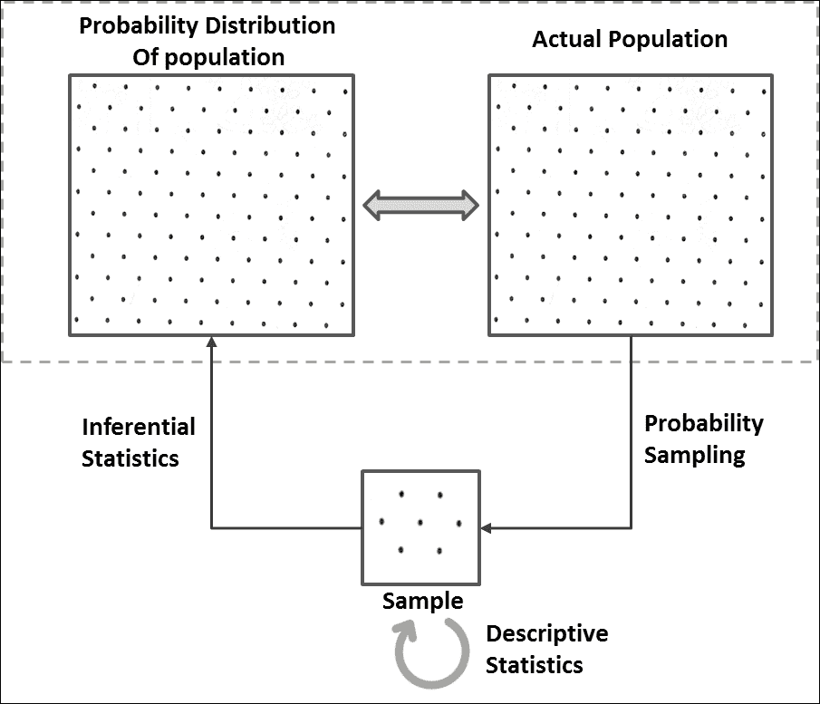

在我们开始这些之前，熟悉一下抽样和分布是很重要的。

## 采样

通过采样技术，我们只需获取一部分人口数据集并对其进行处理:


但是我们为什么要取样呢？以下是取样的各种原因:

*   很难获得全部人口的数据；例如，任何国家公民的身高。
*   难以处理整个数据集。当我们谈论 Spark 这样的大数据计算平台时，这种挑战的范围几乎消失了。但是，在某些情况下，您必须将手头的整个数据视为样本，并将分析结果外推至未来时间或更大的人群。
*   很难绘制大量数据来可视化它。这可能有技术上的限制。
*   用于验证您的分析或验证您的预测模型-特别是当您处理小数据集并且您必须依赖交叉验证时。

对于有效的采样，有两个重要的限制:一个是确定样本量，另一个是选择采样的技术。样本量对总体参数的估计有很大影响。在本章的后面，我们将在介绍一些先决基础知识之后介绍这一方面。在本节中，我们将重点介绍采样技术。

有各种基于概率(每个样本被选择的概率是已知的)和非基于概率(每个样本被选择的概率是未知的)的采样技术可用，但是我们将把我们的讨论仅限于基于概率的技术。

### 简单随机样本

**简单随机抽样** ( **SRS** )是最基本的概率抽样方法类型，其中每个元素都有相同的被选择概率。这意味着 *n* 元素的每个可能样本都有同等的选择机会。

### 系统采样

系统抽样可能是所有基于概率的抽样技术中最简单的，在这种技术中，人口的每一个 *kth* 元素都被抽样。这就是所谓的区间采样。它从随机选择的固定起点开始，然后估计一个区间(第 *kth* 元素，其中 *k =(总体大小)/(样本大小)*)。这里，元素的进展被圈起来，从开始到结束，直到达到你的样本量。

### 分层抽样

当群体内的子群体或亚群体发生变化时，这种采样技术是优选的，因为其他采样技术可能无助于提取出很好地代表群体的样本。通过分层抽样，将人群分为称为**层**的同质亚组，并通过按人口比例从这些层中随机选择受试者来抽取样本。因此，样本中的阶层规模与人口规模之比也保持不变:

**蟒蛇**

```scala
/* ”Sample” function is defined for DataFrames (not RDDs) which takes three parameters:
withReplacement - Sample with replacement or not (input: True/False)
fraction - Fraction of rows to generate (input: any number between 0 and 1 as per your requirement of sample size)
seed - Seed for sampling (input: Any random seed)
*/
>>> sample1 = data_new.sample(False, 0.6) //With random seed as no seed value specified
>>> sample2 = data_new.sample(False, 0.6, 10000) //With specific seed value of 10000
```

**Scala** :

```scala
scala> val sample1 = data_new.sample(false, 0.6) //With random seed as no seed value specified
sample1: org.apache.spark.sql.Dataset[org.apache.spark.sql.Row] = [emp_id: int, name: string ... 5 more fields]
scala> val sample2 = data_new.sample(false, 0.6, 10000) //With specific seed value of 10000
sample2: org.apache.spark.sql.Dataset[org.apache.spark.sql.Row] = [emp_id: int, name: string ... 5 more fields]
```

### 注

我们只关注数据帧上的采样；有`sampleByKey`、`sampleByKeyExact`等 MLlib 库函数对键值对的 rdd 做分层抽样。查看`spark.util.random`包中的伯努利、泊松或随机采样器。

## 数据分布

了解数据是如何分布的是将数据转化为信息所需执行的主要任务之一。分析变量的分布有助于发现异常值，可视化数据的趋势，还可以帮助你更好地理解手头的数据。这有助于正确思考和采取正确的方法解决业务问题。绘制分布图使它在视觉上更加直观，我们将在*描述性统计*部分介绍这一方面。

### 频率分布

频率分布解释了变量取哪些值以及取这些值的频率。它通常用一个表来表示，每个可能的值都有相应的出现次数。

让我们考虑一个例子，其中我们滚动六边形芯片 100 次，并观察以下频率:

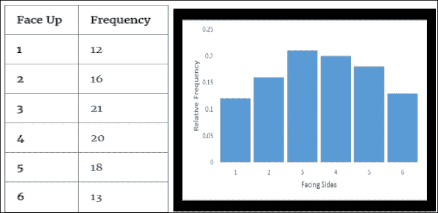

频率表

类似地，你可能会在每一组 100 卷骰子上观察到不同的分布，因为这取决于机会。

有时，你可能对事件的比例感兴趣，而不仅仅是事件。在前面的模具轧制示例中，我们总共轧制了模具 100 次，因此**相对频率分布**的比例分布如下所示:

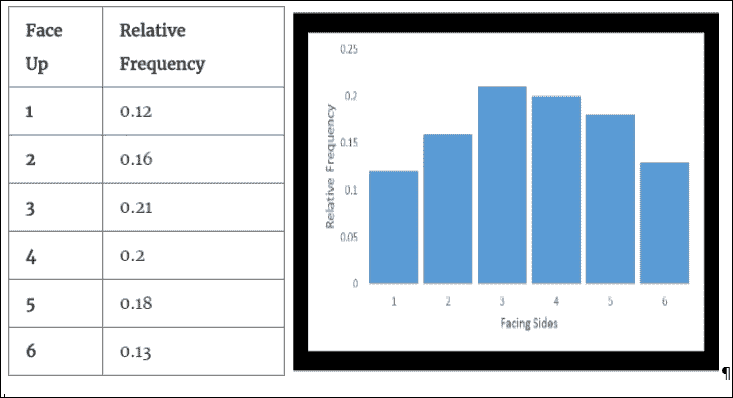

相对频率表

### 概率分布

在模具轧制的同一个例子中，我们知道 1 的总概率分布在模具的所有面上。这意味着 1/6(大约 0.167)的概率与面 1 到面 6 相关联。不考虑你掷骰子的次数(一个公平的骰子！)，相同概率的 1/6 将均匀分布在芯片的所有侧面。因此，如果绘制这个分布，它将如下所示:

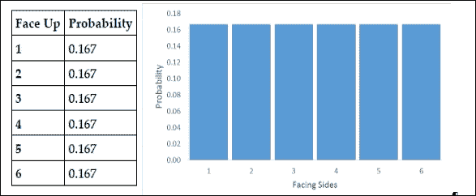

概率分布

我们在这里看了三种分布——频率分布、相对频率分布和概率分布。

这个概率分布实际上就是人口的分布。在现实世界的情况下，有时我们对人口分布有先验知识(在我们的例子中，在一个公平死亡的所有六个边上的概率是 0.167)，有时我们没有。在我们没有人口分布的情况下，找到人口分布本身就成为你推理统计的一部分。此外，与公平骰子的例子不同，在公平骰子的例子中，相同的概率与所有的边相关联，不同的概率与变量可以取的值相关联，并且它们也可以遵循特定类型的分布。

现在是时候揭开秘密了！相对频率分布和概率分布之间的关系是统计推断的基础。相对频率分布也称为经验分布，基于我们在样本中观察到的情况(这里是 100 的样本)。如前所述，每 100 卷模具的经验分布会因机会而异。现在，辊数越大，相对频率分布越接近概率分布。所以，无限多个模辊的相对频率是概率分布，而概率分布又是总体分布。

有各种各样的概率分布，根据变量的类型——分类的或连续的，又分为两类。我们将在本章的后续章节中详细介绍这些发行版。但是，我们应该知道这些类别意味着什么！分类变量只能有几个类别；例如，通过/失败、零/一、癌症/恶性是具有两个类别的分类变量的例子。同样，一个分类变量可以有更多的类别，如红色/绿色/蓝色、类型 1/类型 2/类型 3/类型 4 等。连续变量可以采用给定范围内的任何值，并以连续的尺度进行测量，例如年龄、身高、工资等。理论上，连续变量的任意两个值之间可以有无限多个可能值。例如，在 5'6 "和 6'4 "高度值(英尺和英寸刻度)之间，可能有许多小数值。当以厘米为单位测量时也是如此。

# 描述性统计

在上一节中，我们学习了分布是如何形成的。在本节中，我们将学习如何通过描述性统计来描述它们。分布有两个重要的组成部分可以帮助描述它，它们是它的位置和它的传播。

## 位置测量

位置度量是描述数据中心位置的单一值。三种最常见的位置度量是平均值、中位数和众数。

### 平均值

到目前为止，最常见和最广泛使用的衡量中心趋势的方法是**平均值**，也就是我们所知道的平均值。无论是样本还是总体，平均值都是所有元素的总和除以元素总数。

### 中位数

**中值**是以任意顺序排序时一系列数据的中间值，这样一半数据大于中值，另一半数据小于中值。当有两个中间值(数据项为偶数)时，中间值是这两个中间值的平均值。当数据有异常值(极值)时，中位数是更好的位置度量。

### 模式

**模式**是最常出现的数据项。定性和定量数据都可以确定。

**蟒蛇**

//重用在重复值处理中创建的数据 _new

```scala
>>> mean_age = data_new.agg({'age': 'mean'}).first()[0]
>>> age_counts = data_new.groupBy("age").agg({"age": "count"}).alias("freq")
>>> mode_age = age_counts.sort(age_counts["COUNT(age)"].desc(), age_counts.age.asc()).first()[0]
>>> print(mean_age, mode_age)
(29.615384615384617, 25)
>>> age_counts.sort("count(age)",ascending=False).show(2)
+---+----------+                                                               
|age|count(age)|
+---+----------+
| 28|         3|
| 29|         2|
+---+----------+
only showing top 2 rows
```

**斯卡拉**

```scala
//Reusing data_new created 
scala> val mean_age = data_new.select(floor(avg("age"))).first().getLong(0)
mean_age: Long = 29
scala> val mode_age = data_new.groupBy($"age").agg(count($"age")).
                 sort($"count(age)".desc, $"age").first().getInt(0)
mode_age: Int = 28
scala> val age_counts = data_new.groupBy("age").agg(count($"age") as "freq")
age_counts: org.apache.spark.sql.DataFrame = [age: int, freq: bigint]
scala> age_counts.sort($"freq".desc).show(2)
+---+----+                                                                     
|age|freq|
+---+----+
| 35|   2|
| 28|   2|
+---+----+
```

## 传播措施

分布度量描述了特定变量或数据项的数据有多接近或分散。

### 范围

范围是变量的最小值和最大值之间的差值。它的一个缺点是它没有考虑数据中的每个值。

### 方差

为了找到数据集中的可变性，我们可以从平均值中减去每个值，将它们平方，这样就可以去掉负号(也可以放大幅度)，然后将它们相加并除以值的总数:


如果数据更分散，方差会很大。它的一个缺点是给了异常值不适当的权重。

### 标准偏差

和方差一样，标准差也是数据内离差的一种度量。方差的局限性在于数据的单位也是和数据一起平方的，所以很难将方差和数据集中的值联系起来。因此，标准差计算为方差的平方根:

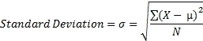

**蟒蛇**

```scala
//Reusing data_new created before
import math
>>> range_salary = data_new.agg({'salary': 'max'}).first()[0] - data_new.agg({'salary': 'min'}).first()[0]
>>> mean_salary = data_new.agg({'salary': 'mean'}).first()[0]
>>> salary_deviations = data_new.select(((data_new.salary - mean_salary) *
       (data_new.salary - mean_salary)).alias("deviation"))
>>> stddev_salary = math.sqrt(salary_deviations.agg({'deviation' : 
'avg'}).first()[0])
>>> variance_salary = salary_deviations.groupBy().avg("deviation").first()[0]
>>> print(round(range_salary,2), round(mean_salary,2),
      round(variance_salary,2), round(stddev_salary,2))
(119880.0, 20843.33, 921223322.22, 30351.66)
>>> 
```

**斯卡拉**

```scala
//Reusing data_new created before
scala> val range_salary = data_new.select(max("salary")).first().
          getLong(0) - data_new.select(min("salary")).first().getLong(0)
range_salary: Long = 119880
scala> val mean_salary = data_new.select(floor(avg("salary"))).first().getLong(0)
mean_salary: Long = 20843
scala> val salary_deviations = data_new.select(((data_new("salary") - mean_salary)
                     * (data_new("salary") - mean_salary)).alias("deviation"))
salary_deviations: org.apache.spark.sql.DataFrame = [deviation: bigint]
scala> val variance_salary = { salary_deviations.select(avg("deviation"))
                                       .first().getDouble(0) }
variance_salary: Double = 9.212233223333334E8
scala> val stddev_salary = { salary_deviations
                    .select(sqrt(avg("deviation")))
                    .first().getDouble(0) }
stddev_salary: Double = 30351.660948510435
```

## 汇总统计

数据集的汇总统计数据是非常有用的信息，可以让我们快速了解手头的数据。使用统计学中可用的函数`colStats`，我们可以获得`RDD[Vector]`的多元统计汇总，其中包含列方式的最大值、最小值、平均值、方差、非零数和总计数。让我们通过一些代码示例来探讨这一点:

**蟒蛇**

```scala
>>> import numpy
>>> from pyspark.mllib.stat import Statistics
// Create an RDD of number vectors
//This example creates an RDD with 5 rows with 5 elements each
>>> observations = sc.parallelize(numpy.random.random_integers(0,100,(5,5)))
// Compute column summary statistics.
//Note that the results may vary because of random numbers
>>> summary = Statistics.colStats(observations)
>>> print(summary.mean())       // mean value for each column
>>> print(summary.variance())  // column-wise variance
>>> print(summary.numNonzeros())// number of nonzeros in each column
```

**斯卡拉**

```scala
scala> import org.apache.spark.mllib.linalg.Vectors
import org.apache.spark.mllib.linalg.Vectors
scala> import org.apache.spark.mllib.stat.{
          MultivariateStatisticalSummary, Statistics}
import org.apache.spark.mllib.stat.{MultivariateStatisticalSummary, Statistics}
// Create an RDD of number vectors
//This example creates an RDD with 5 rows with 5 elements each
scala> val observations = sc.parallelize(Seq.fill(5)(Vectors.dense(Array.fill(5)(
                    scala.util.Random.nextDouble))))
observations: org.apache.spark.rdd.RDD[org.apache.spark.mllib.linalg.Vector] = ParallelCollectionRDD[43] at parallelize at <console>:27
scala>
// Compute column summary statistics.
//Note that the results may vary because of random numbers
scala> val summary = Statistics.colStats(observations)
summary: org.apache.spark.mllib.stat.MultivariateStatisticalSummary = org.apache.spark.mllib.stat.MultivariateOnlineSummarizer@36836161
scala> println(summary.mean)  // mean value for each column
[0.5782406967737089,0.5903954680966121,0.4892908815930067,0.45680701799234835,0.6611492334819364]
scala> println(summary.variance)    // column-wise variance
[0.11893608153330748,0.07673977181967367,0.023169197889513014,0.08882605965192601,0.08360159585590332]
scala> println(summary.numNonzeros) // number of nonzeros in each column
[5.0,5.0,5.0,5.0,5.0]
```

### 类型

从 Spark 2.0 开始，基于 Apache Spark MLlib RDD 的 API 处于维护模式。预计它们将在 2.2+中被弃用，并在 Spark 3.0 中被删除。

## 图形技术

为了理解数据点的行为，您可能需要绘制它们并查看。然而，你需要一个平台来可视化你的数据，例如*方块图*、*散点图*或*直方图*。iPython/Jupyter 笔记本或 Spark 支持的任何其他第三方笔记本都可以用于浏览器本身的数据可视化。Databricks 提供自己的笔记本。可视化包含在它自己的一章中，这一章关注完整的生命周期。但是，Spark 提供了现成的直方图数据准备，以便可以将桶范围和频率传输到客户端机器，而不是整个数据集。以下示例显示了相同的内容。

**蟒蛇**

```scala
//Histogram
>>>from random import randint
>>> numRDD = sc.parallelize([randint(0,9) for x in xrange(1,1001)])
// Generate histogram data for given bucket count
>>> numRDD.histogram(5)
([0.0, 1.8, 3.6, 5.4, 7.2, 9], [202, 213, 215, 188, 182])
//Alternatively, specify ranges
>>> numRDD.histogram([0,3,6,10])
([0, 3, 6, 10], [319, 311, 370])
```

**斯卡拉:**

```scala
//Histogram
scala> val numRDD = sc.parallelize(Seq.fill(1000)(
                    scala.util.Random.nextInt(10)))
numRDD: org.apache.spark.rdd.RDD[Int] =
     ParallelCollectionRDD[0] at parallelize at <console>:24
// Generate histogram data for given bucket count
scala> numRDD.histogram(5)
res10: (Array[Double], Array[Long]) = (Array(0.0, 1.8, 3.6, 5.4, 7.2, 9.0),Array(194, 209, 215, 195, 187))
scala>
//Alternatively, specify ranges
scala> numRDD.histogram(Array(0,3.0,6,10))
res13: Array[Long] = Array(293, 325, 382)
```

# 推理统计

我们看到描述性统计在描述和呈现数据方面非常有用，但是它们没有提供一种方法来使用样本统计来推断总体参数或验证我们可能做出的任何假设。因此，推理统计技术出现来解决这些需求。推理统计的一些重要用途是:

*   人口参数估计
*   假设检验

请注意，一个样本永远不能完美地代表一个群体，因为每次我们采样，它自然会引起采样误差，因此需要推理统计！让我们花一些时间来了解各种类型的概率分布，这有助于推断人口参数。

## 离散概率分布

离散概率分布用于模拟本质上是离散的数据，这意味着数据只能采用某些值，如整数。与分类变量不同，离散变量只能接受数字数据，尤其是来自一组不同整数值的计数数据。此外，随机变量所有可能值的概率总和是 1。离散概率分布用概率质量函数来描述。可以有各种类型的离散概率分布。以下是几个例子。

### 伯努利分布

伯努利分布是一种描述只有两种可能结果的试验的分布类型，例如成功/失败、头/尾、六面骰子的面值是否为 4、发送的消息是否被接收等等。伯努利分布可以推广到具有两个或更多可能结果的任何分类变量。

我们以“学生考试通过率”为例，其中 0.6(60%)是学生通过考试的概率 **P** ，0.4(40%)是学生考试不及格的概率( **1-P** )。让我们将失败表示为 **0** ，将通过表示为 **1** :

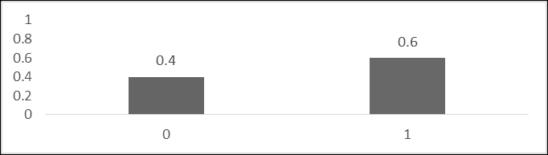

这样的分布不能回答诸如学生的预期通过率之类的问题，因为预期值(μ)将是这个分布不能接受的某个分数。这只能意味着，如果你抽样调查 1000 名学生，那么 600 人会通过，400 人会失败。

### 二项分布

这种分布可以描述一系列伯努利试验(每个试验只有两种可能的结果)。此外，它假设一个试验的结果不影响后续试验，并且任何事件发生的概率在每个试验中都是相同的。二项式分布的一个例子是抛硬币五次。这里，第一次投掷的结果不影响第二次投掷的结果，并且与每个结果相关联的概率在所有投掷中都是相同的。

如果 *n* 是试验次数， *p* 是每次试验成功的概率，那么这个二项分布的平均值(μ)将由下式给出:

μ= n * p

方差(σ2x)由下式给出:

*σ2x = n*p*(1-p)。*

一般来说，一个服从二项分布的随机变量 *X* 加上参数 *n* 和 *p* ，我们可以写成 *X ~ B(n，p)* 。对于这样的分布，在 *n* 试验中准确获得 *k* 成功的概率可以用概率质量函数描述如下:


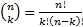

这里，k = 0，1，2，...，n

#### 样本问题

让我们假设一个假设的场景。假设一个城市中有 24%的公司宣布将向该国受海啸影响的地区提供支持，作为其企业社会责任活动的一部分。在随机选择的 20 家公司样本中，找出宣布将帮助海啸受灾地区的公司数量的概率:

*   正好三个
*   不到三个
*   三个或更多

**解决方案**:

样本量= *n* = 20。

随机选择的公司宣布会有帮助的概率= *P = 0.24* 。

a)P(x = 3)=<sup>20</sup>C<sub>3</sub>(0.24)<sup>3</sup>(0.76)<sup>17</sup>= 0.15

b) P(x < 3) = P(0) + P(1) + P(2)

=(0.76)<sup>20</sup>+<sup>20</sup>C<sub>1</sub>(0.24)(0.76)<sup>19</sup>+<sup>20</sup>C<sub>2</sub>(0.24)<sup>2</sup>(0.76)<sup>18</sup>

= 0.0041 + 0.0261 + 0.0783 = 0.11

c)P(x > = 3)= 1-P(x < = 2)= 1-0.11 = 0.89

请注意，二项式分布广泛用于您希望对从具有替换的大小为 *N* 的人群中抽取的大小为 *n* 的样本中的成功率进行建模的场景。如果在没有替换的情况下完成，那么抽签将不再是独立的，因此不会正确地遵循二项式分布。然而，这样的场景确实存在，并且可以使用不同类型的分布来建模，例如超几何分布。

### 泊松分布

泊松分布可以描述给定数量的独立事件在固定的时间或空间间隔内以已知的平均速率发生的概率。请注意，事件应该只有二进制结果，如成功或失败，例如，您每天接到的电话数量或每小时通过信号的汽车数量。你需要仔细仔细看看这些例子。这里请注意，你没有这个信息的另一半，即你每天没有接到多少电话，或者有多少辆车没有通过那个信号。这样的数据点没有另一半的信息。相反，如果我说 50 个学生中有 30 个通过了一次考试，你很容易推断出 20 个学生不及格！你有另一半的信息。

如果是事件发生的平均数(在固定的时间或空间间隔内的已知平均速率)，那么 *k* 事件在相同间隔内发生的概率可以用概率质量函数来描述:

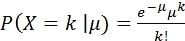

这里， *k* = 0，1，2，3...

前面的等式描述了泊松分布。

对于泊松分布，平均值和方差是相同的。此外，泊松分布随着其平均值或方差的增加而趋于更加对称。

#### 样本问题

假设你知道工作日打电话到消防站的平均次数是八次。在给定的工作日有 11 个电话的概率是多少？这个问题可以使用基于泊松分布的以下公式来解决:


## 连续概率分布

连续概率分布用于对本质上连续的数据进行建模，这意味着数据只能采用指定范围内的任何值。所以我们处理与区间相关的概率，而不是任何特定的值，因为它是零。连续概率分布是实验的理论模型；这是一个相对频率分布，是由无限多的观测值建立起来的。这意味着当你缩小区间时，观测值的数量会增加，随着观测值的增加越来越多，越来越接近无穷大，就形成了一个连续的概率分布。曲线下的总面积为 1，为了找到与任何特定范围相关的概率，我们必须找到曲线下的面积。因此，连续分布通常用以下类型的**概率密度函数** ( **PDF** )来描述:

p(a≤x≤b)= a∨t0〖b〗t1〗f(x)dx

可以有各种类型的连续概率分布。以下几节是几个例子。

### 正态分布

正态分布是一种简单、直接但非常重要的连续概率分布。它也称为高斯分布或**钟形曲线**，因为它在绘制时会出现。此外，对于完美的正态分布，平均值、中位数和众数都是相同的。

许多自然发生的现象遵循正态分布(它们也可能遵循不同的分布！)，比如人的身高，测量的误差等等。然而，正态分布不适合建模高度偏斜或固有正态的变量(例如，股票价格或学生考试分数，其中难度水平最低)。这种变量可以用不同的分布或数据变换后的正态分布(如对数变换)更好地描述。

正态分布可以用两个描述符来描述:中心位置的平均值和分布的标准偏差(高度和宽度)。代表正态分布的概率密度函数如下:

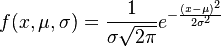

这种正态分布在流行度排行榜上名列前茅的原因之一是因为**中心极限定理** ( **CLT** )。它指出，无论总体分布如何，从同一总体分布中独立抽取的样本的平均值几乎呈正态分布，并且这种正态性随着样本量的增加而越来越大。这种行为实际上是统计假设检验的基础。

此外，每一个正态分布，无论其平均值和标准偏差如何，都遵循一个经验规则(68-95-99.7 规则)，该规则规定曲线下约 68%的面积落在平均值的一个标准偏差内，曲线下 95%的面积落在平均值的两个标准偏差内，曲线下约 99.7%的面积落在平均值的三个标准偏差内。

现在，要找到一个事件的概率，你可以使用积分学或者将分布转换成标准的正态分布，如下一节所述。

### 标准正态分布

标准正态分布是一种均值为 *0* 且标准差为 *1* 的正态分布。这样的分布自然很少发现。它主要是为了寻找正态分布曲线下的区域(而不是使用微积分进行积分)或对数据点进行归一化。

假设一个随机变量 *X* 正态分布有均值( *μ* )和标准差( *σ* ，那么随机变量 *Z* 将有一个标准正态分布有均值 *0* 和标准差 *1* 。 *Z* 的值可以找到:

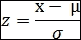

由于数据可以以这种方式标准化，数据点可以被表示和解释为*它们位于分布中距离平均值*多少个标准偏差。它有助于比较两种不同尺度的分布。

假设正态分布是近似正态的，你可以发现正态分布在一些场景中的应用，在这些场景中，你想知道什么百分比会落在一个特定的范围内。

考虑以下示例:

如果一个店主在某一天开店的时间遵循 *μ* = *8* 小时， *σ* = *0.5* 小时的正态分布，他在店停留的时间少于 7.5 小时的概率是多少？

概率分布如下:


数据分布

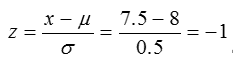

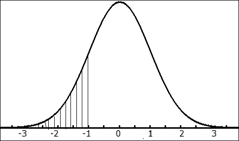

标准正态分布

因此，店主在商店停留少于 7.5 小时的概率由下式给出:

*P(z = -1) = 0.1587 = 15.87*

### 注

这是用 Z 表算出来的。

请注意，数据集中的正态性主要是近似值。你首先需要检查数据的正态性，如果你的分析是基于数据正态性的假设，那么就要进一步进行。有各种不同的方法来检查正态性:您可以选择直方图(用数据的平均值和标准差拟合曲线)、正态概率图或 QQ 图等技术。

### 卡方分布

卡方分布是统计推断中应用最广泛的分布之一。这是伽玛分布的一种特殊情况，在建模非负变量的偏斜分布时非常有用。它规定，如果随机变量 *X* 正态分布， *Z* 是其标准正态变量之一，那么 *Z <sub>2</sub>* 将具有一个自由度的 X <sub><sup>2</sup></sub> 分布。同样，如果我们从同一个分布中取出许多这样的随机独立标准正态变量，对它们进行平方并相加，那么也将遵循如下 X <sub><sup>2</sup></sub> 分布:

*Z <sub>12</sub> + Z <sub>22</sub> +...+ Z <sub>k2</sub>* 将具有 X <sub>2</sub> 分布与 *k* 自由度。

卡方分布主要用于在给定样本方差或标准差的情况下推断总体方差或总体标准差。这是因为 X <sub>2</sub> 分布是以另一种方式定义的，即样本方差与总体方差之比。

为了证明这一点，让我们随机抽取一个样本(*x<sub>1</sub>T3、*x<sub>2</sub>T7)、...， *xn* 来自方差的正态分布**

样本平均值由下式给出:

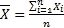

然而，样本方差由下式给出:


考虑到前面提到的事实，我们可以将卡方统计定义如下:

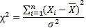

(记住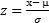和*Z<sub>2</sub>T4】会有 X <sub>2</sub> 分布。)*

所以，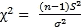

因此，卡方统计量的抽样分布将遵循具有 *(n-1)* 自由度的卡方分布。

具有 *n* 自由度的卡方分布的概率密度函数和伽玛函数*г*由下式给出:

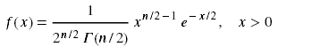

对于具有 *k* 自由度的 *χ2* 分布，均值() = *k* 和方差( *σ2* ) = *2k。*

请注意，卡方分布是正偏斜的，但偏斜度随着自由度的增加而降低，并接近正态分布。

#### 样本问题

找出成人单人电影票美元价格的方差和标准差的 90%置信区间。给出的数据代表了全国电影院的选定样本。假设变量是正态分布的。

给定样本(以美元计):10，08，07，11，12，06，05，09，15，12

解决方案:

*N* = *10*

样本平均值:


样本方差:

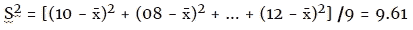

样品的标准偏差:

S = sqrt(9.61)

自由度:

10-1 = 9

现在我们需要找到 90%的置信区间，这意味着 10%的数据将留在尾部。

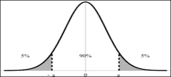

现在，让我们使用公式:


然后，我们可以使用表格或计算机程序找到卡方值。

为了找到中间的 90%置信区间，我们可以考虑左边的 95%和右边的 5%。

所以代入数字后，我们得到:

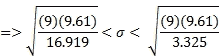


因此，我们可以得出结论，我们有 90%的信心，基于全国 10 张电影票价格的样本，人口(全国所有票)的单张电影票价格的标准差在 2.26 美元到 5.10 美元之间。

### 学生的 t 分布

在总体标准差未知或样本量太小的情况下，学生 t 分布用于估计正态分布总体的均值。在这种情况下， *μ* 和 *σ* 都是未知的，种群参数只能通过样本来估计。

这种分布呈钟形，像正态分布一样对称，但尾部较重。当样本量较大时，t 分布变为正态分布。

让我们随机抽取一个样本( *x1* ， *x2* ，...， *xn* )的正态分布，均值 *μ* 和方差 *σ2* 。

样本平均值将是和样本方差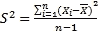

考虑到上述事实，t 统计量可以定义为:

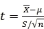

t 统计量的抽样分布将遵循具有 *(n-1)* **自由度** ( **df** )的 t 分布。自由度越高，t 分布越接近标准正态分布。

t 分布的平均值( *μ* ) = *0* 和方差 *(σ2) = df/df-2*

现在，为了让事情更清楚，让我们回顾一下，考虑人口 *σ* 已知的场景。当总体呈正态分布时，无论样本大小如何，样本均值 *x̄* 大多呈正态分布，而 *x̄* 如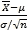的任何线性变换也将遵循正态分布。

如果人口不是正态分布呢？即便如此，当样本量足够大时， *x̄* (即抽样分布)或的分布将按照 CLT 遵循正态分布！

另一种情况是人口 *σ* 未知。有了这个，如果总体是正态分布，样本均值 *x̄* 大部分是正态分布，但是随机变量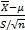不会遵循正态分布；它遵循具有 *(n-1)* 自由度的 t 型分布。原因是因为分母中 *S* 的随机性，对于不同的样本是不一样的。

在上述情况下，如果总体不是正态分布，的分布将遵循 CLT 的正态分布，具有足够大的样本量(而不是小样本量！).因此，在样本量较大的情况下，的分布遵循正态分布，并且假设它遵循 t 分布是安全的，因为 t 分布随着样本量的增加而接近正态。

### F-分布

在统计推断中，F 分布用于研究两个正态分布总体的方差。它指出，具有相同总体方差的两个独立正态分布总体的样本方差的抽样分布遵循 f 分布。

如果样本 1 的样本方差为，样本 2 的样本方差为，则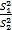将具有 F 分布( *σ12 = σ22* )。

从以上事实，我们也可以说也会遵循 F-分布。

在前面的卡方分布部分，我们也可以这样说

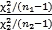也将遵循 F 分布，具有 *n1-1* 和 *n2-1* 自由度。对于这些自由度的每个组合，会有不同的 F 分布。

## 标准误差

统计量(如平均值或方差)的抽样分布的标准偏差被称为**标准误差** ( **SE** )，一种可变性的度量。换句话说，平均值 ( **SEM** )的**标准误差可以定义为样本平均值对总体平均值的估计的标准偏差。**

随着样本量的增加，均值的抽样分布越来越正常，标准差越来越小。事实证明:


( *n* 为样本量)

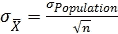

标准误差越小，样本在总体中的代表性越强。此外，样本量越大，标准误差越小。

SE 在统计推断的其他度量中非常重要，例如误差幅度和置信区间。

## 置信水平

它是通过样本统计估计总体参数时，您希望自己有多确定(概率)的一种度量，以便期望值落在期望的范围或置信区间内。通过从 *1* 中减去显著性水平( *α* )(即*置信水平= 1 - α* )计算得出。所以，如果 *α = 0.05* ，置信度为 *1-0.05 = 0.95*

通常，置信水平越高，所需的样本量就越高。然而，经常会有权衡，你必须决定你想要多自信，这样你才能估计出你的自信水平所需的样本量。

## 误差范围和置信区间

如前所述，由于样本不可能 100%代表总体，因此通过推断估计总体参数时，由于采样误差，总会有一定的误差幅度。通常，样本量越大，误差幅度越小。然而，你必须决定允许多大的误差，估计一个合适的样本大小将取决于此。

因此，基于误差范围的样本统计量以下和以上的数值范围称为**置信区间**。换句话说，置信区间是一个数字范围，在这个范围内，我们认为真实的总体参数在一定时间内会下降一定的百分比(置信水平)。

请注意，像“我对置信区间包含真实值有 95%的信心”这样的说法可能会产生误导！正确的表述方式可能是“*如果我取无限个相同大小的样本，那么 95%的时间置信区间将包含真值”。*

例如，当您将样本统计 58 的置信水平设置为 95%，置信区间设置为 4%时(这里，58 是任何样本统计，如平均值、方差或标准差)，您可以说 95%确定总体的真实百分比在 58-4 = 54%和 58+4 = 62%之间。

## 种群的变异性

人口的可变性是我们在推理统计中应该考虑的最重要的因素之一。它在估计样本量方面起着重要的作用。无论你选择哪种最能代表总体的采样算法，样本量仍然起着至关重要的作用——这是显而易见的！

如果总体的变化更多，那么所需的样本量也会更多。

## 估计样本量

我们已经在前面的章节中介绍了采样技术。在本节中，我们将讨论如何估计样本量。假设你必须证明一个概念或评估某个行动的结果，那么你就拿一些相关的数据来试着证明你的观点。但是，您如何确保您有足够的数据？过大的样本浪费时间和资源，过小的样本可能导致误导结果。估计样本量主要取决于误差幅度或置信区间、置信水平和总体可变性等因素。

考虑以下示例:

大学校长要求统计老师估计他们学校学生的平均年龄。样本需要多大？统计老师希望 99%的人相信这个估计在一年内是准确的。根据之前的研究，年龄的标准偏差是 3 年。

解决方案:


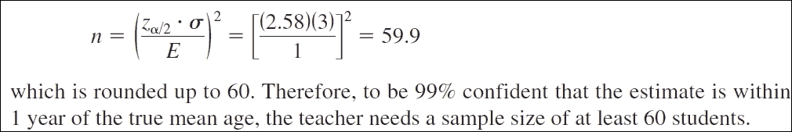

## 假设检验

假设检验是关于检验对人口参数所做的假设。这有助于确定结果是否具有统计学意义，或者是否偶然出现。它是最重要的统计研究工具。我们将讨论一些测试，看看变量在群体中是如何相互关联的。

### 无效假设和替代假设

零假设(表示为 H0)通常是关于人口参数的初始主张，它大多表示*无影响*或*无关系*。在我们的假设检验中，我们的目标是无效和拒绝零假设，以便能够接受替代假设(表示为 H1)。替代假设表明了你的实验中的一些效果。实验时，请注意，你要么拒绝零假设，要么没有拒绝零假设。如果你成功地拒绝了零假设，那么替代假设将被考虑，如果你没有拒绝零假设，那么零假设将被考虑(尽管它可能不是真的！).

所以，我们通常希望得到一个非常小的 P 值(低于定义的显著性水平α)，以便能够拒绝零假设。如果 P 值大于α，那么你不能拒绝零假设。

### 卡方检验

大多数统计推断技术用于估计总体参数或使用样本统计量(如*均值*)检验假设。然而，卡方统计通过检查整个分布或两个分布之间的关系采取了完全不同的方法。在推理统计领域，许多测试统计类似卡方分布。使用这种分布的最常见的测试是拟合优度的卡方测试(单向表)和独立性的卡方测试(双向表)。当您想要查看样本数据在人群中是否遵循相同的分布时，会进行*拟合优度*测试；当您想要查看两个分类变量在人群中是否相互关联时，会进行*独立性*测试。

输入数据类型决定是否进行*拟合优度*或*独立性*测试，而无需将它们明确指定为开关。所以，如果你提供一个向量作为输入，那么进行*拟合优度*测试，如果你提供一个矩阵作为输入，那么进行*独立性*测试。在这两种情况下，都会提供一个事件频率向量或一个应急矩阵作为输入，您需要首先计算。让我们通过例子来探讨这些问题:

**蟒蛇**

```scala
 //Chi-Square test
>>> from pyspark.mllib.linalg import Vectors, Matrices
>>> from pyspark.mllib.stat import Statistics
>>> import random
>>> 
//Make a vector of frequencies of events
>>> vec = Vectors.dense( random.sample(xrange(1,101),10))
>>> vec
DenseVector([45.0, 40.0, 93.0, 66.0, 56.0, 82.0, 36.0, 30.0, 85.0, 15.0])
// Get Goodnesss of fit test results
>>> GFT_Result = Statistics.chiSqTest(vec)
// Here the ‘goodness of fit test’ is conducted because your input is a vector
//Make a contingency matrix
>>> mat = Matrices.dense(5,6,random.sample(xrange(1,101),30))\
//Get independense test results\\
>>> IT_Result = Statistics.chiSqTest(mat)
// Here the ‘independence test’ is conducted because your input is a vector
//Examine the independence test results
>>> print(IT_Result)
Chi squared test summary:
method: pearson
degrees of freedom = 20
statistic = 285.9423808343265
pValue = 0.0
Very strong presumption against null hypothesis: the occurrence of the outcomes is statistically independent..
```

**斯卡拉**

```scala
scala> import org.apache.spark.mllib.linalg.{Vectors, Matrices}
import org.apache.spark.mllib.linalg.{Vectors, Matrices} 

scala> import org.apache.spark.mllib.stat.Statistics 

scala> val vec = Vectors.dense( Array.fill(10)(               scala.util.Random.nextDouble))vec: org.apache.spark.mllib.linalg.Vector = [0.4925741159101148,....] 

scala> val GFT_Result = Statistics.chiSqTest(vec)GFT_Result: org.apache.spark.mllib.stat.test.ChiSqTestResult =Chi squared test summary:
method: pearson
degrees of freedom = 9
statistic = 1.9350768763253192
pValue = 0.9924531181394086
No presumption against null hypothesis: observed follows the same distribution as expected..
// Here the ‘goodness of fit test’ is conducted because your input is a vector
scala> val mat = Matrices.dense(5,6, Array.fill(30)(scala.util.Random.nextDouble)) // a contingency matrix
mat: org.apache.spark.mllib.linalg.Matrix =..... 
scala> val IT_Result = Statistics.chiSqTest(mat)
IT_Result: org.apache.spark.mllib.stat.test.ChiSqTestResult =Chi squared test summary:
method: pearson
degrees of freedom = 20
statistic = 2.5401190679900663
pValue = 0.9999990459111089
No presumption against null hypothesis: the occurrence of the outcomes is statistically independent..
// Here the ‘independence test’ is conducted because your input is a vector

```

### F 检验

在前面几节中，我们已经讨论了如何计算 F 统计量。现在我们来解决一个样本问题。

#### 问题:

你想测试硕士学位持有者的收入比学士学位持有者的收入显示出更大的可变性的信念。随机抽取了 21 名毕业生和 30 名硕士。毕业生样本的标准偏差为 180 美元，硕士样本的标准偏差为 112 美元。

解决方案:

无效假设为:*H<sub>0</sub>:σ<sub>1</sub>T5】2=σ<sub>2</sub>T9】2T11】*

鉴于 *S <sub>1</sub> = $180* ， *n <sub>1</sub> = 21* ， *S <sub>2</sub> = $112* ， *n <sub>2</sub> = 30*

考虑显著性水平为 *α = 0.05*

*F = S<sub>1</sub><sup>2</sup>/S<sub>2</sub><sup>2</sup>= 180<sup>2</sup>/112<sup>2</sup>= 2.58*

从显著性水平为 0.05，df1=20，df2=29 的 F 表中，我们可以看到 F 值为 1.94

由于 F 的计算值大于 F 的表值，我们可以拒绝零假设，得出*σ<sub>1</sub>T3】2T12】σ<sub>2</sub>T7<sup>T9】2</sup>*T11】的结论。

### 相关性

相关性提供了一种方法来衡量两个本质上是数值的随机变量之间的统计相关性。这显示了这两个变量相互变化的程度。基本上有两种类型的相关度量:皮尔逊和斯皮尔曼。皮尔逊更适合区间尺度的数据，比如温度、身高等等。Spearman 更适合序数量表，例如满意度调查，其中 1 表示不太满意，5 表示最满意。此外，皮尔逊基于真值计算，有助于找到线性关系，而斯皮尔曼基于等级顺序，有助于找到单调关系。单调关系意味着变量确实一起变化，但不是以恒定的速率变化。请注意，这两种相关性度量只能度量线性或单调关系，不能描述任何其他类型的关系，如非线性关系。

在 Spark 中，这两者都受到支持。如果输入两个`RDD[Double]`，输出是一个*双*，如果输入一个`RDD[Vector]`，输出是一个*相关矩阵*。在 Scala 和 Python 实现中，如果您不提供相关类型作为输入，那么考虑的默认值总是皮尔逊。

**蟒蛇**

```scala
>>> from pyspark.mllib.stat import Statistics
>>> import random 
// Define two series
//Number of partitions and cardinality of both Ser_1 and Ser_2 should be the same
>>> Ser_1 = sc.parallelize(random.sample(xrange(1,101),10))       
// Define Series_1>>> Ser_2 = sc.parallelize(random.sample(xrange(1,101),10))       
// Define Series_2 
>>> correlation = Statistics.corr(Ser_1, Ser_2, method = "pearson") 
//if you are interested in Spearman method, use “spearman” switch instead
>>> round(correlation,2)-0.14
>>> correlation = Statistics.corr(Ser_1, Ser_2, method ="spearman")
>>> round(correlation,2)-0.19//Check on matrix//The following statement creates 100 rows of 5 elements each
>>> data = sc.parallelize([random.sample(xrange(1,51),5) for x in range(100)])
>>> correlMatrix = Statistics.corr(data, method = "pearson") 
//method may be spearman as per you requirement
>>> correlMatrix
array([[ 1.        ,  0.09889342, -0.14634881,  0.00178334,  0.08389984],       [ 0.09889342,  1.        , -0.07068631, -0.02212963, -0.1058252 ],       [-0.14634881, -0.07068631,  1.        , -0.22425991,  0.11063062],       [ 0.00178334, -0.02212963, -0.22425991,  1.        , -0.04864668],       [ 0.08389984, -0.1058252 ,  0.11063062, -0.04864668,  1.        
]])
>>> 

```

**斯卡拉**

```scala
scala> val correlation = Statistics.corr(Ser_1, Ser_2, "pearson")correlation: Double = 0.43217145308272087 
//if you are interested in Spearman method, use “spearman” switch instead
scala> val correlation = Statistics.corr(Ser_1, Ser_2, "spearman")correlation: Double = 0.4181818181818179 
scala>
//Check on matrix
//The following statement creates 100 rows of 5 element Vectors
scala> val data = sc.parallelize(Seq.fill(100)(Vectors.dense(Array.fill(5)(              scala.util.Random.nextDouble))))
data: org.apache.spark.rdd.RDD[org.apache.spark.mllib.linalg.Vector] = ParallelCollectionRDD[37] at parallelize at <console>:27 
scala> val correlMatrix = Statistics.corr(data, method="pearson") 
//method may be spearman as per you requirement
correlMatrix: org.apache.spark.mllib.linalg.Matrix =1.0                    -0.05478051936343809  ... (5 total)-0.05478051936343809   1.0                   ..........
```

# 总结

在本章中，我们简要介绍了数据科学生命周期中涉及的步骤，如数据获取、数据准备和通过描述性统计进行数据探索。我们还学会了使用一些流行的工具和技术通过样本统计来估计人口参数。

我们从理论和实践两个方面解释了统计学的基础知识，通过深入几个领域的基础知识来解决商业问题。最后，我们学习了一些关于如何利用开箱即用的特性在 Apache Spark 上执行统计分析的示例，这基本上是本章的目标。

我们将在下一章讨论数据科学的机器学习部分的更多细节，因为我们已经在这一章建立了统计理解。本章中的知识应该有助于以更明智的方式连接到机器学习算法。

# 参考文献

Spark 支持的统计数据:

[http://spark.apache.org/docs/latest/mllib-statistics.html](http://spark.apache.org/docs/latest/mllib-statistics.html)

绘制数据块的特征:

[https://docs . cloud . databricks . com/docs/latest/databricks _ guide/04% 20 visualizations/4% 20Matplotlib % 20 和%20GGPlot.html](https://docs.cloud.databricks.com/docs/latest/databricks_guide/04%20Visualizations/4%20Matplotlib%20and%20GGPlot.html)

关于 MLLIB 统计的 OOTB 库函数的详细信息:

[http://spark . Apache . org/docs/latest/API/Scala/index . html # org . Apache . spark . mllib . stat . statistics $](http://spark.apache.org/docs/latest/api/scala/index.html#org.apache.spark.mllib.stat.Statistics%24)