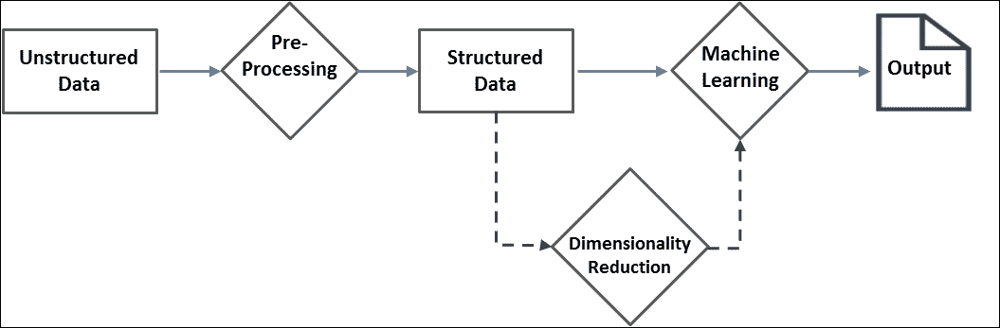

# 八、分析非结构化数据

在这个大数据时代，非结构化数据的激增势不可挡。数据挖掘、**自然语言处理** ( **自然语言处理**)、信息检索等众多方法都存在，用于分析非结构化数据。由于各种业务中非结构化数据的快速增长，可扩展解决方案已成为当务之急。Apache Spark 配备了用于文本分析的现成算法，它还支持默认情况下不可用的算法的自定义开发。

在前一章中，我们已经展示了 SparkR，一个为 R 程序员设计的 Spark 的 R API，如何在不学习新语言的情况下利用 Spark 的力量。在本章中，我们将进入一个全新的维度，探索通过利用 Spark 从非结构化数据中提取信息的算法和技术。

作为本章的先决条件，对 Python 或 Scala 编程的基本理解以及对文本分析和机器学习的全面理解是很好的。然而，我们已经用一组正确的实际例子覆盖了一些理论基础，以使这些更容易理解和实施。本章涵盖的主题有:

*   非结构化数据的来源
*   Processing unstructured data
    *   计数矢量器
    *   TF-以色列国防军
    *   停止词删除
    *   标准化/缩放
    *   Word2Vec
    *   n-gram 建模

*   Text classification
    *   朴素贝叶斯分类器
*   Text clustering
    *   k 均值
*   Dimensionality reduction
    *   奇异值分解
    *   主成分分析
*   摘要

# 非结构化数据的来源

自从八九十年代出现电子表格和商业智能工具以来，数据分析已经取得了长足的进步。计算能力、复杂算法和开源文化的巨大进步推动了数据分析以及其他领域前所未有的增长。这些技术进步为新机遇和新挑战铺平了道路。企业开始考虑从迄今为止无法处理的数据源(如内部备忘录、电子邮件、客户满意度调查等)中获取见解。数据分析现在包含这种非结构化的、通常基于文本的数据以及传统的数据行和列。在关系数据库管理系统表中存储的高度结构化数据和完全非结构化的纯文本之间，我们有 NoSQL 数据存储中的半结构化数据源、XML 或 JSON 文档以及图形或网络数据源。根据目前的估计，非结构化数据约占企业数据的 80%，并且正在快速增长。卫星图像、大气数据、社交网络、博客和其他网页、患者记录和医生笔记、公司内部通信等等——所有这些加起来只是非结构化数据源的一个子集。

我们已经看到了利用非结构化数据和结构化数据的成功数据产品。一些公司利用社交网络的力量向客户提供可操作的见解。诸如**情感分析**和**多媒体分析**等新领域正在出现，以从非结构化数据中获取见解。然而，分析非结构化数据仍然是一项艰巨的任务。例如，当代文本分析工具和技术无法识别讽刺。然而，潜在的好处无疑超过了局限性。

# 处理非结构化数据

非结构化数据不适用于大多数编程任务。它必须以各种适用的不同方式进行处理，以便能够作为任何机器学习算法的输入或用于视觉分析。一般来说，非结构化数据分析可以视为一系列步骤，如下图所示:



数据预处理是任何非结构化数据分析中最重要的步骤。幸运的是，随着时间的推移，已经有几项成熟的技术派上了用场。Spark 通过`ml.features`套装提供了大部分开箱即用的技术。大多数技术旨在将文本数据转换为机器学习算法易于使用的简明数字向量。开发人员应该了解其组织的具体要求，以获得最佳的预处理工作流。请记住，更好的相关数据是产生更好见解的关键。

让我们探索几个处理原始文本并将其转换为数据帧的示例。第一个示例将一些文本作为输入，并提取所有类似日期的字符串，而第二个示例从 twitter 文本中提取标签。第一个例子只是一个预热，使用一个简单的 regex(正则表达式)标记器特性转换器，而不使用任何特定于 spark 的库。这也让你注意到误解的可能性。例如，表格 1-11-1111 的产品代码可以解释为日期。第二个示例说明了一个非平凡的多步骤提取过程，它只生成所需的标签。**用户自定义函数** ( **自定义函数**)和 ML 管道在开发这种多步提取过程中派上了用场。本节的剩余部分描述了 apache Spark 中提供的一些更方便的现成工具。

**示例-1:** **从文本中提取类似日期的字符串**

**斯卡拉:**

```scala
scala> import org.apache.spark.ml.feature.RegexTokenizer
import org.apache.spark.ml.feature.RegexTokenizer
scala> val date_pattern: String = "\\d{1,4}[/ -]\\d{1,4}[/ -]\\d{1,4}"
date_pattern: String = \d{1,4}[/ -]\d{1,4}[/ -]\d{1,4}
scala> val textDF  = spark.createDataFrame(Seq(
    (1, "Hello 1996-12-12 this 1-21-1111 is a 18-9-96 text "),
    (2, "string with dates in different 01/02/89 formats"))).
    toDF("LineNo","Text")
textDF: org.apache.spark.sql.DataFrame = [LineNo: int, Text: string]
scala> val date_regex = new RegexTokenizer().
        setInputCol("Text").setOutputCol("dateStr").
        setPattern(date_pattern).setGaps(false)
date_regex: org.apache.spark.ml.feature.RegexTokenizer = regexTok_acdbca6d1c4c
scala> date_regex.transform(textDF).select("dateStr").show(false)
+--------------------------------+
|dateStr                         |
+--------------------------------+
|[1996-12-12, 1-21-1111, 18-9-96]|
|[01/02/89]                      |
+--------------------------------+
```

**蟒蛇:**

```scala
// Example-1: Extract date like strings from text
>>> from pyspark.ml.feature import RegexTokenizer
>>> date_pattern = "\\d{1,4}[/ -]\\d{1,4}[/ -]\\d{1,4}"
>>> textDF  = spark.createDataFrame([
        [1, "Hello 1996-12-12 this 1-21-1111 is a 18-9-96 text "],
        [2, "string with dates in different 01/02/89 formats"]]).toDF(
        "LineNo","Text")
>>> date_regex = RegexTokenizer(inputCol="Text",outputCol="dateStr",
            gaps=False, pattern=date_pattern)
>>> date_regex.transform(textDF).select("dateStr").show(5,False)
+--------------------------------+
|dateStr                         |
+--------------------------------+
|[1996-12-12, 1-21-1111, 18-9-96]|
|[01/02/89]                      |
+--------------------------------+
```

前面的示例定义了一个正则表达式模式来识别日期字符串。正则表达式模式和示例文本数据帧被传递到`RegexTokenizer`以提取匹配的类似日期的字符串。`gaps=False`选项选择匹配的字符串，值`False`将使用给定的模式作为分隔符。注意，显然不是日期的`1-21-1111`也被选中。

下一个例子从 twitter 文本中提取标签，并识别最流行的标签。您也可以使用相同的方法来收集散列(`#`)标签。

这个例子使用了一个内置函数`explode`，它将一个值数组的单行转换成多行，每个数组元素一个值。

**示例-2:从推特“文本”中提取标签**

**斯卡拉:**

```scala
//Step1: Load text containing @ from source file
scala> val path = "<Your path>/tweets.json"
path: String = <Your path>/tweets.json
scala> val raw_df = spark.read.text(path).filter($"value".contains("@"))
raw_df: org.apache.spark.sql.Dataset[org.apache.spark.sql.Row] = [value: string]
//Step2: Split the text to words and filter out non-tag words
scala> val df1 = raw_df.select(explode(split('value, " ")).as("word")).
        filter($"word".startsWith("@"))
df1: org.apache.spark.sql.Dataset[org.apache.spark.sql.Row] = [word: string]
//Step3: compute tag-wise counts and report top 5
scala> df1.groupBy($"word").agg(count($"word")).
        orderBy($"count(word)".desc).show(5)
+------------+-----------+
+                                                     
|        word|count(word)|
+------------+-----------+
|@ApacheSpark|         15|
|    @SSKapci|          9|
|@databricks:|          4|
|     @hadoop|          4|
| @ApacheApex|          4|
+------------+-----------+
```

**蟒蛇**:

```scala
>> from pyspark.sql.functions import explode, split
//Step1: Load text containing @ from source file
>>> path ="<Your path>/tweets.json"
>>> raw_df1 = spark.read.text(path)
>>> raw_df = raw_df1.where("value like '%@%'")
>>> 
//Step2: Split the text to words and filter out non-tag words
>>> df = raw_df.select(explode(split("value"," ")))
>>> df1 = df.where("col like '@%'").toDF("word")
>>> 
//Step3: compute tag-wise counts and report top 5
>>> df1.groupBy("word").count().sort(
     "count",ascending=False).show(5)
+------------+-----+
+                                                        
|        word|count|
+------------+-----+
|@ApacheSpark|   15|
|    @SSKapci|    9|
|@databricks:|    4|
| @ApacheApex|    4|
|     @hadoop|    4|
+------------+-----+

```

## 计数矢量器

计数向量器从文档中提取词汇(标记)，并在先验词典不可用时生成`CountVectorizerModel`模型。顾名思义，文本文档被转换成一个令牌和计数的向量。该模型在词汇表上产生文档的稀疏表示。

您可以对行为进行微调，以限制词汇大小、最小标记数，以及适用于您的业务案例的更多内容。

//示例 3:计数矢量器示例

**斯卡拉**

```scala
scala> import org.apache.spark.ml.feature.{CountVectorizer, CountVectorizerModel}
import org.apache.spark.ml.feature.{CountVectorizer, CountVectorizerModel}
scala> import org.apache.spark.sql.DataFrame
import org.apache.spark.sql.DataFrame
scala> import org.apache.spark.ml.linalg.Vector
import org.apache.spark.ml.linalg.Vector
scala> val df: DataFrame = spark.createDataFrame(Seq(
  (0, Array("ant", "bat", "cat", "dog", "eel")),
  (1, Array("dog","bat", "ant", "bat", "cat"))
)).toDF("id", "words")
df: org.apache.spark.sql.DataFrame = [id: int, words: array<string>]
scala>
// Fit a CountVectorizerModel from the corpus 
// Minimum occurrences (DF) is 2 and pick 10 top words(vocabsize) only scala> val cvModel: CountVectorizerModel = new CountVectorizer().
        setInputCol("words").setOutputCol("features").
        setMinDF(2).setVocabSize(10).fit(df)
cvModel: org.apache.spark.ml.feature.CountVectorizerModel = cntVec_7e79157ba561
// Check vocabulary. Words are arranged as per frequency 
// eel is dropped because it is below minDF = 2 scala> cvModel.vocabulary
res6: Array[String] = Array(bat, dog, cat, ant)
//Apply the model on document
scala> val cvDF: DataFrame = cvModel.transform(df)
cvDF: org.apache.spark.sql.DataFrame = [id: int, words: array<string> ... 1 more field]
//Check the word count scala> cvDF.select("features").collect().foreach(row =>
println(row(0).asInstanceOf[Vector].toDense))

[1.0,1.0,1.0,1.0]
[2.0,1.0,1.0,1.0]
```

**蟒蛇**:

```scala
>>> from pyspark.ml.feature import CountVectorizer,CountVectorizerModel
>>> from pyspark.ml.linalg import Vector
>>> 
// Define source DataFrame
>>> df = spark.createDataFrame([
    [0, ["ant", "bat", "cat", "dog", "eel"]],
    [1, ["dog","bat", "ant", "bat", "cat"]]
  ]).toDF("id", "words")
>>> 
// Fit a CountVectorizerModel from the corpus
// Minimum occorrences (DF) is 2 and pick 10 top words(vocabsize) only
>>> cvModel = CountVectorizer(inputCol="words", outputCol="features",
        minDF = 2, vocabSize = 10).fit(df)
>>> 
// Check vocabulary. Words are arranged as per frequency
// eel is dropped because it is below minDF = 2
>>> cvModel.vocabulary
[u'bat', u'ant', u'cat', u'dog']
//Apply the model on document
>>> cvDF = cvModel.transform(df)
//Check the word count
>>> cvDF.show(2,False)
+---+-------------------------+-------------------------------+
|id |words                    |features                       |
+---+-------------------------+-------------------------------+
|0  |[ant, bat, cat, dog, eel]|(4,[0,1,2,3],[1.0,1.0,1.0,1.0])|
|1  |[dog, bat, ant, bat, cat]|(4,[0,1,2,3],[2.0,1.0,1.0,1.0])|
+---+-------------------------+-------------------------------+
```

**输入**:

```scala
 |id | text                  
 +---+-------------------------+-------------------------------+
 |0  | "ant", "bat", "cat", "dog", "eel"     
 |1  | "dog","bat", "ant", "bat", "cat"
```

**输出**:

```scala
id| text                               | Vector 
--|------------------------------------|-------------------- 
0 | "ant", "bat", "cat", "dog", "eel" |[1.0,1.0,1.0,1.0] 
1 | "dog","bat", "ant", "bat", "cat"   |[2.0,1.0,1.0,1.0]

```

前面的例子演示了`CountVectorizer`如何作为一个估计器来提取词汇并生成`CountVectorizerModel`。请注意，特征向量顺序对应于词汇，而不是输入序列。让我们也看看如何通过先验地建立字典来达到同样的目的。但是，请记住，它们有自己的用例。

示例 4:用先验词汇定义 CountVectorizerModel

**斯卡拉:**

```scala
// Example 4: define CountVectorizerModel with a-priori vocabulary
scala> val cvm: CountVectorizerModel = new CountVectorizerModel(
        Array("ant", "bat", "cat")).
        setInputCol("words").setOutputCol("features")
cvm: org.apache.spark.ml.feature.CountVectorizerModel = cntVecModel_ecbb8e1778d5

//Apply on the same data. Feature order corresponds to a-priory vocabulary order scala> cvm.transform(df).select("features").collect().foreach(row =>
        println(row(0).asInstanceOf[Vector].toDense))
[1.0,1.0,1.0]
[1.0,2.0,1.0]
```

**蟒蛇**:

自 Spark 2.0.0 起不可用

## TF-IDF

**术语频率-反向文档频率** ( **TF-IDF** )可能是文本分析中最流行的度量方法之一。该指标表示一组文档中给定文档中给定术语的重要性。这包括两个测量值，**术语频率** ( **TF** )和**反向文档频率** ( **IDF** )。让我们逐一讨论，然后看看它们的综合效果。

TF 是文档中某个术语相对重要性的度量，通常是该术语出现的频率除以该文档中的术语数量。考虑一个包含 100 个单词的文本文档，其中单词 *apple* 出现了 8 次。*苹果*的 TF 为 *TF = (8 / 100) = 0.08* 。因此，一个术语在文档中出现的频率越高，它的 TF 系数就越大。

IDF 是对特定术语在整个文档集合中的重要性的度量，即该词在所有文档中出现的频率。一个术语的重要性与其出现的频率成反比。Spark 提供了两种独立的方法来执行这些任务。假设我们有 600 万个文档，其中 6000 个文档中出现了单词 *apple* 。然后，IDF 计算为 *IDF = Log(6，000，000 / 6，000) = 3* 。如果仔细观察，分母越低，IDF 值越高。这意味着包含特定单词的文档数量越少，其重要性就越高。

因此，TF-IDF 得分将为 *TF * IDF = 0.08 * 3 = 0.24* 。请注意，它会惩罚在文档中出现频率较高且不太重要的单词，如*、*、 *a* 等，并对重要的单词给予更多权重。**

 **在 Spark 中，TF 实现为 HashingTF。它采用一系列术语(通常是标记器的输出)并产生一个固定长度的特征向量。它执行特征散列将术语转换成固定长度的索引。然后，IDF 将该特征向量(HashingTF 的输出)作为输入，并根据文档集中的术语频率对其进行缩放。前一章有一个这种转换的例子。

## 停止词删除

像*这样的常用词是*、*是*、*和*被称为停止词。它们通常不会增加分析的价值，应该在数据准备步骤中删除。Spark 提供了`StopWordsRemover`变压器，就是这么做的。它将一系列标记作为一系列字符串输入，例如标记器的输出，并删除所有停止字。默认情况下，Spark 有一个停止词列表，您可以通过提供自己的停止词列表作为参数来覆盖它。您可以选择打开`caseSensitive`匹配，默认情况下是关闭的。

示例 5:停用词移除器

**斯卡拉:**

```scala
scala> import org.apache.spark.ml.feature.StopWordsRemover
import org.apache.spark.ml.feature.StopWordsRemover
scala> import org.apache.spark.sql.DataFrame
import org.apache.spark.sql.DataFrame
scala> import org.apache.spark.ml.linalg.Vector
import org.apache.spark.ml.linalg.Vector
scala> val rawdataDF = spark.createDataFrame(Seq(
        (0, Array("I", "ate", "the", "cake")),
        (1, Array("John ", "had", "a", " tennis", "racquet")))).
        toDF("id","raw_text")
rawdataDF: org.apache.spark.sql.DataFrame = [id: int, raw_text: array<string>]
scala> val remover = new StopWordsRemover().setInputCol("raw_text").
                setOutputCol("processed_text")
remover: org.apache.spark.ml.feature.StopWordsRemover = stopWords_55edbac88edb
scala> remover.transform(rawdataDF).show(truncate=false)
+---+---------------------------------+-------------------------+
|id |raw_text                         |processed_text           |
+---+---------------------------------+-------------------------+
|0  |[I, ate, the, cake]              |[ate, cake]              |
|1  |[John , had, a,  tennis, racquet]|[John ,  tennis, racquet]|
+---+---------------------------------+-------------------------+
```

**蟒蛇:**

```scala
>>> from pyspark.ml.feature import StopWordsRemover
>>> RawData = sqlContext.createDataFrame([
    (0, ["I", "ate", "the", "cake"]),
    (1, ["John ", "had", "a", " tennis", "racquet"])
    ], ["id", "raw_text"])
>>> 
>>> remover = StopWordsRemover(inputCol="raw_text",
        outputCol="processed_text")
>>> remover.transform(RawData).show(truncate=False)
+---+---------------------------------+-------------------------+
|id |raw_text                         |processed_text           |
+---+---------------------------------+-------------------------+
|0  |[I, ate, the, cake]              |[ate, cake]              |
|1  |[John , had, a,  tennis, racquet]|[John ,  tennis, racquet]|
+---+---------------------------------+-------------------------+
```

假设我们有以下带有列`id`和`raw_text`的数据帧:

```scala
 id | raw_text 
----|---------- 
 0  | [I, ate, the, cake] 
 1  | [John, had, a, tennis, racquet] 

```

对于前面的示例，在应用以`raw_text`为输入列、`processed_text`为输出列的`StopWordsRemover` 后，我们应该会得到以下输出:

```scala

 id | raw_text                       | processed_text 
----|--------------------------------|-------------------- 
 0  | [I, ate, the, cake]            |  [ate, cake] 
 1  |[John, had, a, tennis, racquet] |[John, tennis, racquet] 

```

## 标准化/缩放

标准化是数据准备中常见的初步步骤。当所有特征都在同一尺度上时，大多数机器学习算法工作得更好。例如，如果有两个特征，其中一个的值大约是另一个的 100 倍，将它们带到相同的尺度反映了两个变量之间有意义的相对活动。任何非数字值，如高、中、低，都应该理想地转换为适当的数字量化，作为最佳实践。但是，您需要小心这样做，因为这可能需要领域专业知识。例如，如果分别为高、中和低指定 3、2 和 1，则应检查这三个单位是否彼此等距。

特征归一化的常用方法有*缩放*、*均值相减*、*特征标准化*等等。在缩放中，每个数字特征向量被重新缩放，使得其值范围在 *-1* 到 *+1* 或 *0* 到 *1* 或类似的值之间。在平均值减法中，计算数字特征向量的平均值，并从每个值中减去平均值。我们感兴趣的是相对于平均值的偏差，而绝对值可能并不重要。特征标准化是指将数据设置为零均值和单位(1)方差。

Spark 提供一个`Normalizer`特征变换器，将每个向量归一化为单位范数；`StandardScaler`要有单位范数和零均值；和`MinMaxScaler`将每个特征重新缩放到特定的值范围。默认情况下，最小值和最大值分别为 0 和 1，但您可以根据数据要求自行设置值参数。

## Word2Vec

Word2Vec 是一种 PCA(您将很快了解到这方面的更多信息)，它采用一系列单词并生成一个(字符串、向量)图。字符串是单词，向量是唯一的固定大小的向量。得到的词向量表示在许多机器学习和自然语言处理应用中是有用的，例如命名实体识别和标记。让我们看一个例子。

**例 6: Word2Vec**

**斯卡拉**

```scala
scala> import org.apache.spark.ml.feature.Word2Vec
import org.apache.spark.ml.feature.Word2Vec

//Step1: Load text file and split to words scala> val path = "<Your path>/RobertFrost.txt"
path: String = <Your path>/RobertFrost.txt
scala> val raw_text = spark.read.text(path).select(
        split('value, " ") as "words")
raw_text: org.apache.spark.sql.DataFrame = [words: array<string>]

//Step2: Prepare features vector of size 4 scala> val resultDF = new Word2Vec().setInputCol("words").
        setOutputCol("features").setVectorSize(4).
        setMinCount(2).fit(raw_text).transform(raw_text)
resultDF: org.apache.spark.sql.DataFrame = [words: array<string>, features: vector]

//Examine results scala> resultDF.show(5)
+--------------------+--------------------+
|               words|            features|
+--------------------+--------------------+
|[Whose, woods, th...|[-0.0209098898340...|
|[His, house, is, ...|[-0.0013444167044...|
|[He, will, not, s...|[-0.0058525378408...|
|[To, watch, his, ...|[-0.0189630933296...|
|[My, little, hors...|[-0.0084691265597...|
+--------------------+--------------------+
```

**蟒蛇:**

```scala
>>> from pyspark.ml.feature import Word2Vec
>>> from pyspark.sql.functions import explode, split
>>>

//Step1: Load text file and split to words >>> path = "<Your path>/RobertFrost.txt"
>>> raw_text = spark.read.text(path).select(
        split("value"," ")).toDF("words")

//Step2: Prepare features vector of size 4 >>> resultDF = Word2Vec(inputCol="words",outputCol="features",
                 vectorSize=4, minCount=2).fit(
                 raw_text).transform(raw_text)

//Examine results scala> resultDF.show(5)
+--------------------+--------------------+
|               words|            features|
+--------------------+--------------------+
|[Whose, woods, th...|[-0.0209098898340...|
|[His, house, is, ...|[-0.0013444167044...|
|[He, will, not, s...|[-0.0058525378408...|
|[To, watch, his, ...|[-0.0189630933296...|
|[My, little, hors...|[-0.0084691265597...|
+--------------------+--------------------+
```

## n-gram 建模

n-gram 是来自给定文本或语音序列的 *n* 个项目的连续序列。一个 n 克大小的 *1* 被称为一个*单码*，大小 *2* 是一个*二元模型*，大小 *3* 是一个*三元模型*。或者，它们可以由 *n* 的值来引用，例如，四克、五克等等。让我们看一个例子来理解这个模型的可能结果:

```scala

 input |1-gram sequence  | 2-gram sequence | 3-gram sequence 
-------|-----------------|-----------------|--------------- 
 apple | a,p,p,l,e       |  ap,pp,pl,le    |  app,ppl,ple 

```

这是单词到 n-gram 字母的例子。句子(或标记化单词)到 n-gram 单词也是如此。例如，相当于 2 克的句子*孩子爱吃巧克力*是:

孩子爱吃，爱吃，吃巧克力。

n-gram 建模在文本挖掘和自然语言处理中有各种各样的应用。其中一个例子是预测每个单词在给定的上下文中出现的概率(条件概率)。

在 Spark 中，`NGram`是一个特征转换器，它将字符串的输入数组(例如，Tokenizer 的输出)转换为 n 克数组。默认情况下，输入数组中的空值被忽略。它返回一个 n-gram 数组，其中每个 n-gram 由一个用空格分隔的字符串表示。

**例 7: NGram**

**斯卡拉**

```scala
scala> import org.apache.spark.ml.feature.NGram
import org.apache.spark.ml.feature.NGram
scala> val wordDF = spark.createDataFrame(Seq(
        (0, Array("Hi", "I", "am", "a", "Scientist")),
        (1, Array("I", "am", "just", "learning", "Spark")),
        (2, Array("Coding", "in", "Scala", "is", "easy"))
        )).toDF("label", "words")

//Create an ngram model with 3 words length (default is 2) scala> val ngramModel = new NGram().setInputCol(
                "words").setOutputCol("ngrams").setN(3)
ngramModel: org.apache.spark.ml.feature.NGram = ngram_dc50209cf693

//Apply on input data frame scala> ngramModel.transform(wordDF).select("ngrams").show(false)
+--------------------------------------------------+
|ngrams                                            |
+--------------------------------------------------+
|[Hi I am, I am a, am a Scientist]                 |
|[I am just, am just learning, just learning Spark]|
|[Coding in Scala, in Scala is, Scala is easy]     |
+--------------------------------------------------+

//Apply the model on another dataframe, Word2Vec raw_text scala>ngramModel.transform(raw_text).select("ngrams").take(1).foreach(println)
[WrappedArray(Whose woods these, woods these are, these are I, are I think, I think I, think I know.)]
```

**蟒蛇:**

```scala
>>> from pyspark.ml.feature import NGram
>>> wordDF = spark.createDataFrame([
         [0, ["Hi", "I", "am", "a", "Scientist"]],
         [1, ["I", "am", "just", "learning", "Spark"]],
         [2, ["Coding", "in", "Scala", "is", "easy"]]
         ]).toDF("label", "words")

//Create an ngram model with 3 words length (default is 2) >>> ngramModel = NGram(inputCol="words", outputCol= "ngrams",n=3)
>>> 

//Apply on input data frame >>> ngramModel.transform(wordDF).select("ngrams").show(4,False)
+--------------------------------------------------+
|ngrams                                            |
+--------------------------------------------------+
|[Hi I am, I am a, am a Scientist]                 |
|[I am just, am just learning, just learning Spark]|
|[Coding in Scala, in Scala is, Scala is easy]     |
+--------------------------------------------------+

//Apply the model on another dataframe from Word2Vec example >>> ngramModel.transform(resultDF).select("ngrams").take(1)
[Row(ngrams=[u'Whose woods these', u'woods these are', u'these are I', u'are I think', u'I think I', u'think I know.'])]
```

# 文本分类

文本分类是指分配一个主题、主题类别、流派或类似于文本块的东西。例如，垃圾邮件过滤器将垃圾邮件或非垃圾邮件分配给电子邮件。

Apache Spark 通过 MLlib 和 ML 包支持各种分类器。SVM 分类器和朴素贝叶斯分类器是流行的分类器，前一章已经介绍了前者。现在我们来看看后者。

## 朴素贝叶斯分类器

**朴素贝叶斯** ( **NB** )分类器是一个多类概率分类器，是最好的分类算法之一。它假设每对特征之间都有很强的独立性。它计算每个特征和给定标签的条件概率分布，然后应用贝叶斯定理计算给定观察的标签的条件概率。就文档分类而言，观察是要分类到某个类中的文档。尽管它对数据有很强的假设，但它相当受欢迎。它可以处理少量的训练数据——无论是真实的还是离散的。它的工作效率非常高，因为它只需通过一次训练数据；一个限制是特征向量必须是非负的。默认情况下，ML 包支持多项式 NB。但是，如果需要伯努利 NB，可以将参数`modelType`设置为`Bernoulli`。

**拉普拉斯平滑**技术可以通过指定平滑参数来应用，并且在您想要将小的非零概率分配给稀有单词或新单词以便后验概率不会突然下降到零的情况下非常有用。

Spark 还提供了一些其他的超参数，例如`thresholds`来获得精细的颗粒控制。下面是一个将 twitter 文本分类的例子。本示例包含一些手动编码的规则，这些规则为列车数据指定了一个类别。如果在文本中找到任何相应的单词，则指定一个特定的类别。例如，如果文本包含“调查”或“投票”，则类别为“调查”。该模型基于该训练数据进行训练，并在不同时间收集的不同文本样本上进行评估:

**例 8:朴素贝叶斯**

**斯卡拉:**

```scala
// Step 1: Define a udf to assign a category // One or more similar words are treated as one category (eg survey, poll)
// If input list contains any of the words in a category list, it is assigned to that category
// "General" is assigned if none of the categories matched
scala> import scala.collection.mutable.WrappedArray
import scala.collection.mutable.WrappedArray
scala> val findCategory = udf ((words: WrappedArray[String]) =>
    { var idx = 0; var category : String = ""
    val categories : List[Array[String]] =  List(
     Array("Python"), Array("Hadoop","hadoop"),
     Array("survey","poll"),
      Array("event","training", "Meetup", "summit",
          "talk", "talks", "Setting","sessions", "workshop"),
     Array("resource","Guide","newsletter", "Blog"))
    while(idx < categories.length && category.isEmpty ) {
        if (!words.intersect(categories(idx)).isEmpty) {
         category = categories(idx)(0) }  //First word in the category list
     idx += 1 }
    if (category.isEmpty) {
    category = "General"  }
    category
  })
findCategory: org.apache.spark.sql.expressions.UserDefinedFunction = UserDefinedFunction(<function1>,StringType,Some(List(ArrayType(StringType,true))))

//UDF to convert category to a numerical label scala> val idxCategory = udf ((category: String) =>
        {val catgMap = Map({"General"->1},{"event"->2},{"Hadoop"->3},
                             {"Python"->4},{"resource"->5})
         catgMap(category)})
idxCategory: org.apache.spark.sql.expressions.UserDefinedFunction =
UserDefinedFunction(<function1>,IntegerType,Some(List(StringType)))
scala> val labels = Array("General","event","Hadoop","Python","resource")
 //Step 2: Prepare train data 
//Step 2a: Extract "text" data and split to words scala> val path = "<Your path>/tweets_train.txt"
path: String = <Your path>../work/tweets_train.txt
scala> val pattern = ""text":"
pattern: String = "text":
scala> val raw_text = spark.read.text(path).filter($"value".contains(pattern)).
               select(split('value, " ") as "words")
raw_text: org.apache.spark.sql.DataFrame = [words: array<string>]
scala>

//Step 2b: Assign a category to each line scala> val train_cat_df = raw_text.withColumn("category",

findCategory(raw_text("words"))).withColumn("label",idxCategory($"category"))
train_cat_df: org.apache.spark.sql.DataFrame = [words: array<string>, category:
string ... 1 more field]

//Step 2c: Examine categories scala> train_cat_df.groupBy($"category").agg(count("category")).show()
+--------+---------------+                                                     
|category|count(category)|
+--------+---------------+
| General|            146|
|resource|              1|
|  Python|              2|
|   event|             10|
|  Hadoop|              6|
+--------+---------------+ 

//Step 3: Build pipeline scala> import org.apache.spark.ml.Pipeline
import org.apache.spark.ml.Pipeline
scala> import org.apache.spark.ml.feature.{StopWordsRemover, CountVectorizer,
                  IndexToString}
import org.apache.spark.ml.feature.{StopWordsRemover, CountVectorizer,
StringIndexer, IndexToString}
scala> import org.apache.spark.ml.classification.NaiveBayes
import org.apache.spark.ml.classification.NaiveBayes
scala>

//Step 3a: Define pipeline stages 
//Stop words should be removed first scala> val stopw = new StopWordsRemover().setInputCol("words").
                setOutputCol("processed_words")
stopw: org.apache.spark.ml.feature.StopWordsRemover = stopWords_2fb707daa92e
//Terms to term frequency converter scala> val cv = new CountVectorizer().setInputCol("processed_words").
             setOutputCol("features")
cv: org.apache.spark.ml.feature.CountVectorizer = cntVec_def4911aa0bf
//Define model scala> val model = new NaiveBayes().
                setFeaturesCol("features").
                setLabelCol("label")
model: org.apache.spark.ml.classification.NaiveBayes = nb_f2b6c423f12c
//Numerical prediction label to category converter scala> val lc = new IndexToString().setInputCol("prediction").
              setOutputCol("predictedCategory").
              setLabels(labels)
lc: org.apache.spark.ml.feature.IndexToString = idxToStr_3d71be25382c
 //Step 3b: Build pipeline with desired stages scala> val p = new Pipeline().setStages(Array(stopw,cv,model,lc))
p: org.apache.spark.ml.Pipeline = pipeline_956942e70b3f
 //Step 4: Process train data and get predictions 
//Step 4a: Execute pipeline with train data scala> val resultsDF = p.fit(train_cat_df).transform(train_cat_df)
resultsDF: org.apache.spark.sql.DataFrame = [words: array<string>, category:
string ... 7 more fields]

//Step 4b: Examine results scala> resultsDF.select("category","predictedCategory").show(3)
+--------+-----------------+
|category|predictedCategory|
+--------+-----------------+
|   event|            event|
|   event|            event|
| General|          General|
+--------+-----------------+
 //Step 4c: Look for prediction mismatches scala> resultsDF.filter("category != predictedCategory").select(
         "category","predictedCategory").show(3)
+--------+-----------------+
|category|predictedCategory|
+--------+-----------------+
| General|            event|
| General|           Hadoop|
|resource|           Hadoop|
+--------+-----------------+
 //Step 5: Evaluate model using test data 
//Step5a: Prepare test data scala> val path = "<Your path> /tweets.json"
path: String = <Your path>/tweets.json
scala> val raw_test_df =
spark.read.text(path).filter($"value".contains(pattern)).
               select(split('value, " ") as "words"

raw_test_df: org.apache.spark.sql.DataFrame = [words: array<string>]
scala> val test_cat_df = raw_test_df.withColumn("category",

findCategory(raw_test_df("words")))withColumn("label",idxCategory($"category"))
test_cat_df: org.apache.spark.sql.DataFrame = [words: array<string>, category:
string ... 1 more field]
scala> test_cat_df.groupBy($"category").agg(count("category")).show()
+--------+---------------+                                                     
|category|count(category)|
+--------+---------------+
| General|              6|
|   event|             11|
+--------+---------------+
 //Step 5b: Run predictions on test data scala> val testResultsDF = p.fit(test_cat_df).transform(test_cat_df)
testResultsDF: org.apache.spark.sql.DataFrame = [words: array<string>,
category: string ... 7 more fields]
//Step 5c:: Examine results
scala> testResultsDF.select("category","predictedCategory").show(3)
+--------+-----------------+
|category|predictedCategory|
+--------+-----------------+
| General|            event|
|   event|          General|
|   event|          General|
+--------+-----------------+

//Step 5d: Look for prediction mismatches scala> testResultsDF.filter("category != predictedCategory").select(
         "category","predictedCategory").show()
+--------+-----------------+
|category|predictedCategory|
+--------+-----------------+
|   event|          General|
|   event|          General|
+--------+-----------------+
```

**蟒蛇:**

```scala
// Step 1: Initialization 
//Step1a: Define a udfs to assign a category // One or more similar words are treated as one category (eg survey, poll)
// If input list contains any of the words in a category list, it is assigned to that category
// "General" is assigned if none of the categories matched
>>> def findCategory(words):
        idx = 0; category  = ""
        categories = [["Python"], ["Hadoop","hadoop"],
          ["survey","poll"],["event","training", "Meetup", "summit",
          "talk", "talks", "Setting","sessions", "workshop"],
          ["resource","Guide","newsletter", "Blog"]]
        while(not category and idx < len(categories)):
          if len(set(words).intersection(categories[idx])) > 0:
             category = categories[idx][0] #First word in the category list
          else:
             idx+=1
        if not category:   #No match found
          category = "General"
        return category
>>> 
//Step 1b: Define udf to convert string category to a numerical label >>> def idxCategory(category):
       catgDict = {"General" :1, "event" :2, "Hadoop" :2,
             "Python": 4, "resource" : 5}
       return catgDict[category]
>>> 
//Step 1c: Register UDFs >>> from pyspark.sql.functions import udf
>>> from pyspark.sql.types import StringType, IntegerType
>>> findCategoryUDF = udf(findCategory, StringType())
>>> idxCategoryUDF = udf(idxCategory, IntegerType())

//Step 1d: List categories >>> categories =["General","event","Hadoop","Python","resource"]
//Step 2: Prepare train data 
//Step 2a: Extract "text" data and split to words >>> from pyspark.sql.functions import split
>>> path = "../work/tweets_train.txt"
>>> raw_df1 = spark.read.text(path)
>>> raw_df = raw_df1.where("value like '%"text":%'").select(
             split("value", " ")).toDF("words")

//Step 2b: Assign a category to each line >>> train_cat_df = raw_df.withColumn("category",\
        findCategoryUDF("words")).withColumn(
        "label",idxCategoryUDF("category"))

//Step 2c: Examine categories scala> train_cat_df.groupBy("category").count().show()
+--------+---------------+                                                     
|category|count(category)|
+--------+---------------+
| General|            146|
|resource|              1|
|  Python|              2|
|   event|             10|
|  Hadoop|              6|
+--------+---------------+

//Step 3: Build pipeline >>> from pyspark.ml import Pipeline
>>> from pyspark.ml.feature import StopWordsRemover, CountVectorizer,
IndexToString
>>> from pyspark.ml.classification import NaiveBayes
>>>

//Step 3a: Define pipeline stages 
//Stop words should be removed first >>> stopw = StopWordsRemover(inputCol = "words",
                  outputCol = "processed_words")
//Terms to term frequency converter >>> cv = CountVectorizer(inputCol = "processed_words",
             outputCol = "features")
//Define model >>> model = NaiveBayes(featuresCol="features",
                   labelCol = "label")
//Numerical prediction label to category converter >>> lc = IndexToString(inputCol = "prediction",
           outputCol = "predictedCategory",
           labels = categories)
>>> 

//Step 3b: Build pipeline with desired stages >>> p = Pipeline(stages = [stopw,cv,model,lc])
>>> 
 //Step 4: Process train data and get predictions 
//Step 4a: Execute pipeline with train data >>> resultsDF = p.fit(train_cat_df).transform(train_cat_df)

//Step 4b: Examine results >>> resultsDF.select("category","predictedCategory").show(3)
+--------+-----------------+
|category|predictedCategory|
+--------+-----------------+
|   event|            event|
|   event|            event|
| General|          General|
+--------+-----------------+
 //Step 4c: Look for prediction mismatches >>> resultsDF.filter("category != predictedCategory").select(
         "category","predictedCategory").show(3)
+--------+-----------------+
|category|predictedCategory|
+--------+-----------------+
|  Python|           Hadoop|
|  Python|           Hadoop|
|  Hadoop|            event|
+--------+-----------------+
 //Step 5: Evaluate model using test data 
//Step5a: Prepare test data >>> path = "<Your path>/tweets.json">>> raw_df1 = spark.read.text(path)
>>> raw_test_df = raw_df1.where("va
ue like '%"text":%'").select(
               split("value", " ")).toDF("words")
>>> test_cat_df = raw_test_df.withColumn("category",
        findCategoryUDF("words")).withColumn(
        "label",idxCategoryUDF("category"))
>>> test_cat_df.groupBy("category").count().show()
+--------+---------------+                                                     
|category|count(category)|
+--------+---------------+
| General|              6|
|   event|             11|
+--------+---------------+
 //Step 5b: Run predictions on test data >>> testResultsDF = p.fit(test_cat_df).transform(test_cat_df)
//Step 5c:: Examine results >>> testResultsDF.select("category","predictedCategory").show(3)
+--------+-----------------+
|category|predictedCategory|
+--------+-----------------+
| General|          General|
|   event|            event|
|   event|            event|
+--------+-----------------+
//Step 5d: Look for prediction mismatches >>> testResultsDF.filter("category != predictedCategory").select(
         "category","predictedCategory").show()
+--------+-----------------+
|category|predictedCategory|
+--------+-----------------+
|   event|          General|
|   event|          General|
+--------+-----------------+
```

一旦这样做了，就可以用这个步骤的输出来训练一个模型，它可以对文本斑点或文件进行分类。

# 文本聚类

聚类是一种无监督的学习技术。直观地说，聚类将对象分组为不相交的集合。我们不知道数据中存在多少组，也不知道这些组(集群)中的共性是什么。

文本聚类有几种应用。例如，组织实体可能希望基于某种相似性度量将其内部文档组织成相似的集群。相似性或距离的概念是聚类过程的核心。常用的度量是 TF-IDF 和余弦相似度。余弦相似度或余弦距离是两个文档的词频向量的 cos 乘积。Spark 提供了多种聚类算法，可以有效地用于文本分析。

## K-均值

也许 K-means 是所有聚类算法中最直观的。其思想是基于某种相似性度量，比如余弦距离或欧几里德距离，将数据点分离为不同的聚类。该算法从 *K* 随机单点聚类开始，剩余的每个数据点被分配到最近的聚类。然后重新计算聚类中心，算法再次循环通过数据点。这个过程反复进行，直到没有重新分配或者达到预定义的迭代次数。

如何固定簇数( *K* )不明显。识别初始聚类中心也不明显。有时业务需求可能决定集群的数量；例如，将所有现有文档划分为 10 个不同的部分。但是在现实世界的大部分场景中，我们需要通过试错找到 *K* 。一种方法是逐步增加 *K* 值并计算聚类质量，如聚类方差。超过一定的 *K、*值，质量不再有明显的提高，这可能是你理想的 *K* 。还有各种其他技术，如肘形法、**阿卡克信息准则** ( **AIC** )、**贝叶斯信息准则** ( **BIC** )。

同样，从不同的起点开始，直到集群质量令人满意。然后，您可能希望使用剪影评分等技术来验证您的结果。然而，这些活动是计算密集型的。

Spark 提供了来自 MLlib 和 ml 包的 K-means。您可以指定最大迭代次数或收敛容差来微调算法性能。

# 降维

想象一个有许多行和列的大矩阵。在许多矩阵应用中，这个大矩阵可以用一些具有少量行和列的窄矩阵来表示，这些矩阵仍然代表原始矩阵。然后处理这个较小的矩阵可以产生与原始矩阵相似的结果。这在计算上是高效的。

降维就是找到那个小矩阵。MLLib 支持两种算法，SVD 和 PCA 对 RowMatrix 类进行降维。这两种算法都允许我们指定我们感兴趣保留的维数。让我们先看例子，然后深入研究潜在的理论。

**例 9:降维**

**斯卡拉:**

```scala
scala> import scala.util.Random
import scala.util.Random
scala> import org.apache.spark.mllib.linalg.{Vector, Vectors}
import org.apache.spark.mllib.linalg.{Vector, Vectors}
scala> import org.apache.spark.mllib.linalg.distributed.RowMatrix
import org.apache.spark.mllib.linalg.distributed.RowMatrix

//Create a RowMatrix of 6 rows and 5 columns scala> var vlist: Array[Vector] = Array()
vlist: Array[org.apache.spark.mllib.linalg.Vector] = Array()
scala> for (i <- 1 to 6) vlist = vlist :+ Vectors.dense(
       Array.fill(5)(Random.nextInt*1.0))
scala> val rows_RDD = sc.parallelize(vlist)
rows_RDD: org.apache.spark.rdd.RDD[org.apache.spark.mllib.linalg.Vector] =
ParallelCollectionRDD[0] at parallelize at <console>:29
scala> val row_matrix = new RowMatrix(rows_RDD)
row_matrix: org.apache.spark.mllib.linalg.distributed.RowMatrix = org.apache.spark.mllib.linalg.distributed.RowMatrix@348a6639
 //SVD example for top 3 singular values scala> val SVD_result = row_matrix.computeSVD(3)
SVD_result:
org.apache.spark.mllib.linalg.SingularValueDecomposition[org.apache.spark.mlli
.linalg.distributed.RowMatrix,org.apache.spark.mllib.linalg.Matrix] =
SingularValueDecomposition(null,
[4.933482776606544E9,3.290744495921952E9,2.971558550447048E9],
-0.678871347405378    0.054158900880961904  -0.23905281217240534
0.2278187940802       -0.6393277579229861   0.078663353163388
0.48824560481341733   0.3139021297613471    -0.7800061948839081
-0.4970903877201546   2.366428606359744E-4  -0.3665502780139027
0.041829015676406664  0.6998515759330556    0.4403374382132576    )

scala> SVD_result.s   //Show the singular values (strengths)
res1: org.apache.spark.mllib.linalg.Vector =
[4.933482776606544E9,3.290744495921952E9,2.971558550447048E9]

//PCA example to compute top 2 principal components scala> val PCA_result = row_matrix.computePrincipalComponents(2)
PCA_result: org.apache.spark.mllib.linalg.Matrix =
-0.663822435334425    0.24038790854106118
0.3119085619707716    -0.30195355896094916
0.47440026368044447   0.8539858509513869
-0.48429601343640094  0.32543904517535094
-0.0495437635382354   -0.12583837216152594
```

**蟒蛇:**

自 Spark 2.0.0 起，Python 中不可用

# 奇异值分解

**奇异值分解** ( **奇异值分解**)是线性代数的核心之一，广泛用于许多现实世界的建模需求。它提供了一种将矩阵分解成更简单、更小的矩阵的便捷方法。这导致高维矩阵的低维表示。它帮助我们消除矩阵中不太重要的部分，以产生一个近似表示。这种技术在降维和数据压缩方面很有用。

设 *M* 为 M 行 n 列大小的矩阵。矩阵的秩是线性独立的行数。如果一行至少有一个非零元素，并且不是一行或多行的线性组合，则该行被视为独立的。如果我们考虑列而不是行，就可以得到同样的秩，就像线性代数一样。

如果一行的元素是两行的和，那么该行就不是独立的。然后作为奇异值分解的结果，我们找到三个矩阵， *U* 、 *∑* 和 *V* 满足以下等式:

【T0 米= u】

这三个矩阵具有以下特性:

*   **U** :这是一个 m 行 r 列的列正交矩阵。正交矩阵意味着每一列都是一个单位向量，并且任意两列之间的成对点积为 0。
*   **V** :这是一个列正交矩阵，有 *n* 行和 *r* 列。
*   **∑** :这是一个 *r* x *r* 对角矩阵，以非负实数为主对角值，降序排列。在对角矩阵中，除主对角线上的元素外，所有元素都为零。

*∑* 矩阵中的主对角线值称为奇异值。它们被认为是连接矩阵行和列的底层*概念*或*组件*。它们的大小代表相应部件的强度。例如，假设前面例子中的矩阵包含六个读者对五本书的评分。SVD 允许我们将它们拆分成三个矩阵: *∑* 包含表示底层主题*强度*的奇异值； *U* 连接人与概念；和 *V* 把概念和书本联系起来。

在一个大矩阵中，我们可以将较低幅度的奇异值替换为零，从而减少剩余两个矩阵中的相应行。请注意，如果我们重新计算右侧的矩阵乘积，并将该值与左侧的原始矩阵进行比较，它们将几乎相似。我们可以使用这种技术来保留所需的维数。

## 主成分分析

**主成分分析** ( **主成分分析**)是一种采用 n 维数据点并投影到信息损失最小的更小(维数更少)的子空间的技术。高维空间中的一组数据点找到了这些元组最佳排列的方向。换句话说，我们需要找到一个旋转，使得第一个坐标具有最大的可能方差，并且每个后续坐标依次具有最大的可能方差。其思想是将元组集视为矩阵 *M* 和 MMT 的第一特征向量。

如果 *A* 为正方形矩阵， *e* 为与 *A* 行数相同的列矩阵， *λ* 为常数使得 *Me = λe* ，则 *e* 称为 *M* 的特征向量， *λ* 称为 *M* 的特征值。就 n 维平面而言，特征向量是方向，特征值是沿该方向的方差的度量。我们可以用低特征值降维，从而找到一个更小的子空间而不丢失信息。

# 总结

在本章中，我们研究了非结构化数据的来源以及分析非结构化数据背后的动机。我们解释了预处理非结构化数据所需的各种技术，以及 Spark 如何开箱即用地提供大多数这些工具。我们还介绍了 Spark 支持的一些可用于文本分析的算法。

在下一章中，我们将介绍在数据分析生命周期的不同阶段具有洞察力的不同类型的可视化技术。

# 参考文献:

以下是参考资料:

*   [http://tototoharyanto . staff . ipb . AC . id/files/2012/10/Building-Machine-Learning-system-with-Python-里歇特-Coelho.pdf](http://totoharyanto.staff.ipb.ac.id/files/2012/10/Building-Machine-Learning-Systems-with-Python-Richert-Coelho.pdf)
*   [https://www . cs . NYU . edu/web/Research/thesis/borthwick _ Andrew . pdf](https://www.cs.nyu.edu/web/Research/Theses/borthwick_andrew.pdf)
*   [https://web.stanford.edu/class/cs124/lec/naivebayes.pdf](https://web.stanford.edu/class/cs124/lec/naivebayes.pdf)
*   [http://NLP . Stanford . edu/IR-book/html/html ledition/朴素贝叶斯-文本-分类-1.html](http://nlp.stanford.edu/IR-book/html/htmledition/naive-bayes-text-classification-1.html)
*   [http://www.mmds.org/](http://www.mmds.org/)
*   [http://sebastiaranaschka . com/Articles/2014 _ PCA _ step _ by _ step . html](http://sebastianraschka.com/Articles/2014_pca_step_by_step.html)
*   [http://arxiv.org/pdf/1404.1100.pdf](http://arxiv.org/pdf/1404.1100.pdf)
*   [http://spark . Apache . org/docs/latest/mllib-降维. html](http://spark.apache.org/docs/latest/mllib-dimensionality-reduction.html)

计数矢量器:

*   [https://spark . Apache . org/docs/1 . 6 . 1/API/Java/org/Apache/spark/ml/feature/countvectorizer . html](https://spark.apache.org/docs/1.6.1/api/java/org/apache/spark/ml/feature/CountVectorizer.html)

n-gram 建模:

*   [https://en . Wikipedia . org/wiki/n-gram](https://en.wikipedia.org/wiki/N-gram)**