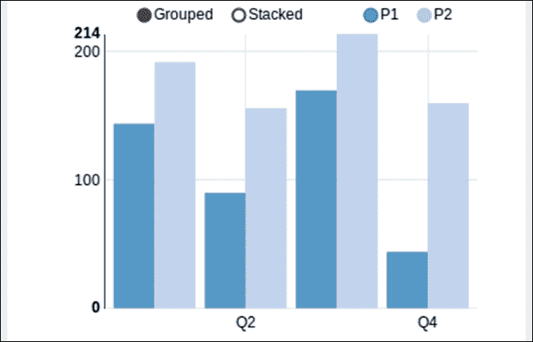
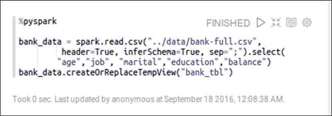
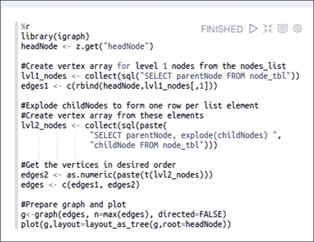
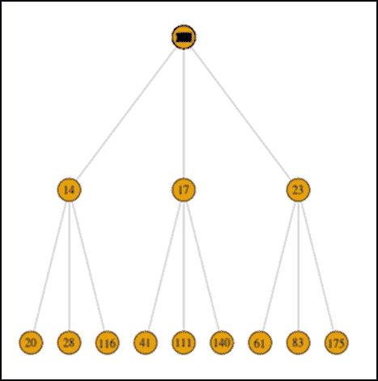
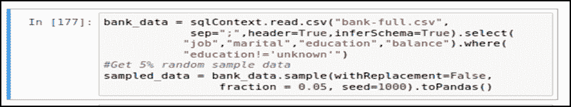
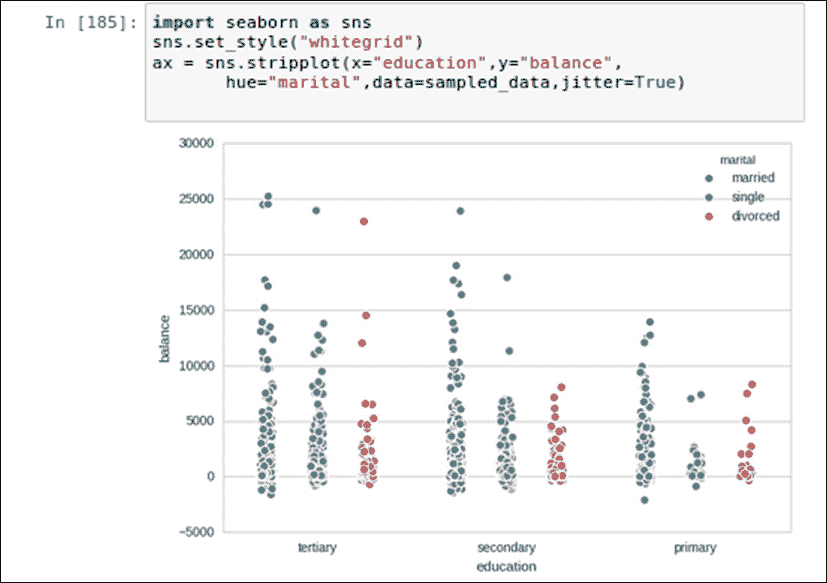
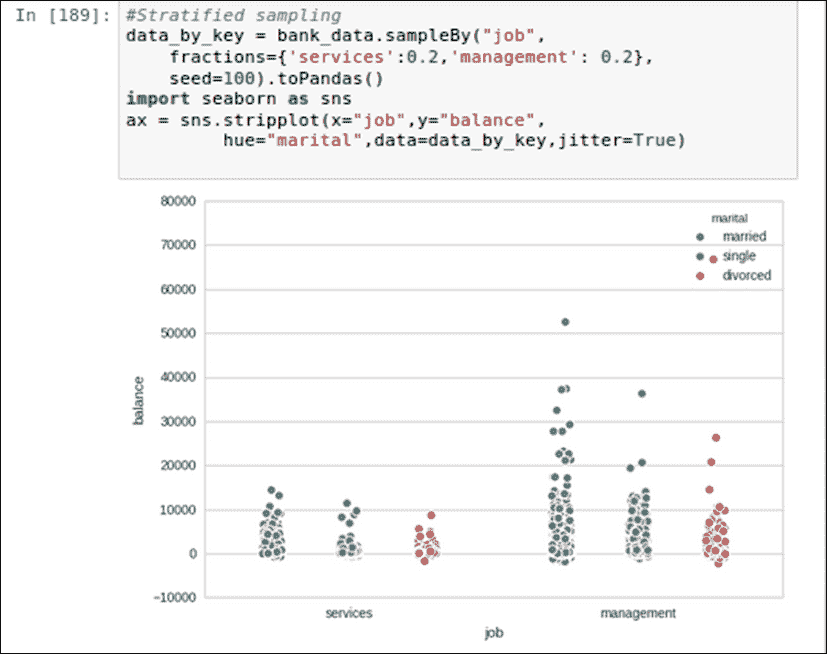
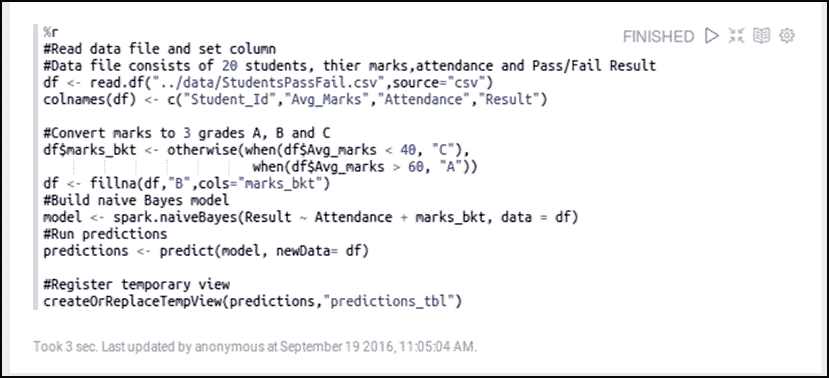
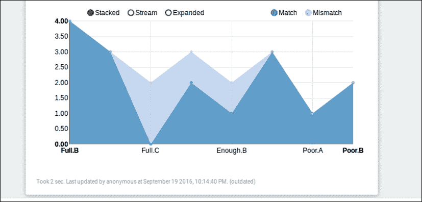

# 九、可视化大数据

适当的数据可视化在过去解决了许多业务问题，但没有涉及太多的统计或机器学习。即使在今天，有如此多的技术进步、应用统计和机器学习，适当的视觉效果是业务用户消费信息或某些分析输出的最终交付物。以正确的格式传达正确的信息是数据科学家所渴望的，一个有效的视觉效果胜过百万字。此外，以业务易于使用的方式来表示模型和生成的见解是极其重要的。尽管如此，直观地探索大数据是非常麻烦和具有挑战性的。由于 Spark 是为大数据处理而设计的，因此它也支持大数据可视化。为此，在 Spark 上构建了许多工具和技术。

前面几章概述了如何对结构化和非结构化数据建模，并从中获得见解。在这一章中，我们将从两个广泛的角度来看数据可视化——一个是从数据科学家的角度来看——其中可视化是有效探索和理解数据的基本需求，另一个是从业务用户的角度来看，其中视觉是业务的最终交付物，必须易于理解。我们将探索各种数据可视化工具，如 *IPythonNotebook* 和*齐柏林*，它们可以在 Apache Spark 上使用。

作为本章的先决条件，对 Python、Scala 或其他此类框架中的 SQL 和编程有一个基本的了解是很好的。本章涵盖的主题如下:

*   Why visualize data?
    *   数据工程师的观点
    *   数据科学家的观点
    *   商业用户的视角

*   Data visualization tools
    *   IPython 笔记型电脑
    *   Apache 人齐柏林
    *   第三方工具
*   Data visualization techniques
    *   总结和可视化
    *   子集化和可视化
    *   采样和可视化
    *   建模和可视化

# 为什么要可视化数据？

数据可视化处理以可视化的形式表示数据，从而使人们能够理解潜在的模式和趋势。地理地图，十七世纪的条形图和折线图，是早期数据可视化的一些例子。Excel 也许是我们大多数人已经使用过的熟悉的数据可视化工具。所有数据分析工具都配备了复杂的交互式数据可视化仪表盘。然而，最近大数据、流和实时分析的激增已经突破了这些工具的界限，它们似乎已经达到了极限。这个想法是让可视化看起来简单、准确、相关，同时隐藏所有的复杂性。根据业务需求，任何可视化解决方案都应该具备以下特征:

*   交互性
*   再现性
*   对细节的控制

除此之外，如果该解决方案允许用户在视觉效果或报告上进行协作并相互共享，那么这将构成一个端到端的可视化解决方案。

尤其是大数据可视化带来了它自己的挑战，因为我们最终可能会得到比屏幕上像素更多的数据。处理大数据通常需要内存和 CPU 密集型处理，并且可能会有很长的延迟。将实时或流式数据添加到组合中，问题变得更具挑战性。Apache Spark 从头开始设计，就是为了通过并行化 CPU 和内存使用来解决这种延迟。在探索可视化和处理大数据的工具和技术之前，让我们首先了解数据工程师、数据科学家和业务用户的可视化需求。

## 数据工程师的视角

数据工程师在几乎每一个数据驱动的需求中都扮演着至关重要的角色:从不同的数据源中获取数据，整合它们，清理和预处理它们，分析它们，然后通过视觉效果和仪表板进行最终报告。他们的活动大致如下:

*   可视化来自不同来源的数据，以便能够集成和整合数据，形成一个单一的数据矩阵
*   可视化并发现数据中的各种异常，如缺失值、异常值等(这可能是在刮擦、寻源、ETLing 等过程中)，并修复这些异常
*   就数据集的属性和特征向数据科学家提供建议
*   探索可视化数据的各种可能方式，并根据业务需求最终确定信息更丰富、更直观的方式

请注意，数据工程师不仅在获取和准备数据方面发挥着关键作用，而且还需要为业务用户提供最合适的可视化输出。他们通常与业务密切合作，对业务需求和手头的具体问题有非常清晰的理解。

## 数据科学家的视角

数据科学家对可视化数据的需求不同于数据工程师。请注意，在一些业务中，有专业人士扮演着数据工程师和数据科学家的双重角色。

数据科学家需要可视化数据，以便能够在执行统计分析时做出正确的决策，并确保分析项目的正确执行。他们希望以各种可能的方式对数据进行切片和切割，以找到隐藏的见解。让我们看一下数据科学家可能必须可视化数据的一些示例需求:

*   查看单个变量的数据分布
*   可视化数据中的异常值
*   可视化数据集中所有变量缺失数据的百分比
*   绘制相关矩阵，找出相关变量
*   绘制回归后残差的行为
*   在数据清理或转换活动之后，再次绘制变量并查看它的行为

请注意，刚才提到的一些事情与数据工程师的情况非常相似。然而，数据科学家在这种分析背后可能有更科学/统计的意图。例如，数据科学家可能会从不同的角度看到一个异常值，并对其进行统计处理，但数据工程师可能会想到引发这种情况的各种选项。

## 商业用户的视角

业务用户的观点与数据工程师或数据科学家的观点完全不同。商业用户通常是信息的消费者！他们希望从数据中提取越来越多的信息，为此，正确的视觉效果起着关键作用。此外，如今大多数商业问题都更加复杂和具有因果关系。旧的报告已经不够了。让我们看一些业务用户希望从报告、视觉效果和仪表板中提取的示例查询:

*   谁是某某地区的高价值客户？
*   这些客户的共同特点是什么？
*   预测新客户是否具有高价值
*   哪种媒体的广告能带来最大的投资回报？
*   如果我不在报纸上做广告呢？
*   影响顾客购买行为的因素有哪些？

# 数据可视化工具

在众多不同的可视化选项中，选择合适的可视化取决于具体要求。同样，选择可视化工具取决于目标受众和业务需求。

数据科学家或数据工程师更喜欢更具交互性的控制台，以进行快速而肮脏的分析。他们使用的视觉效果通常不是为商业用户设计的。他们希望以各种可能的方式剖析数据，以获得更有意义的见解。所以，他们通常更喜欢支持这些活动的笔记本型界面。笔记本是一个交互式的计算环境，在这里他们可以组合代码块和绘图数据进行探索。有诸如 **IPython** / **Jupyter** 或 **DataBricks** 等笔记本电脑，仅举几个可用的选项。

业务用户更喜欢更直观、信息更丰富的视觉效果，他们可以互相分享或用来生成报告。他们希望通过视觉效果获得最终结果。有成百上千的工具，包括一些商家常用的 **Tableau** 等工具；但通常情况下，开发人员必须为一些独特的需求定制特定的类型，并通过 web 应用程序公开它们。微软的 **PowerBI** 和开源解决方案如**齐柏林**就是几个例子。

## IPython 笔记本电脑

Spark**PySpark**API 之上的 IPython/Jupyter 笔记本是数据科学家探索和可视化数据的绝佳组合。笔记本在内部启动了一个新的 PySpark 内核实例。还有其他内核可用；例如，Apache **Toree** 内核也可以用来支持 Scala。

对于许多数据科学家来说，它是默认的选择，因为它能够将文本、代码、公式和图形集成在一个 JSON 文档文件中。IPython 笔记本支持`matplotlib`，这是一个 2D 可视化库，可以产生生产质量的视觉效果。生成图、直方图、散点图、图表等变得简单易行。它还支持`seaborn`库，该库实际上是建立在 matplotlib 之上的，但是很容易使用，因为它提供了更高层次的抽象并隐藏了底层的复杂性。

## Apache Zeppelin

Apache Zeppelin 建立在 JVM 之上，与 Apache Spark 集成良好。这是一个基于浏览器或前端的开源工具，有自己的笔记本。它支持 Scala、Python、R、SQL 和其他图形模块，不仅可以作为业务用户的可视化解决方案，也可以作为数据科学家的可视化解决方案。在下面关于可视化技术的部分，我们将看看齐柏林飞艇如何支持 Apache Spark 代码来生成有趣的视觉效果。你需要下载齐柏林飞艇([https://zeppelin.apache.org/](https://zeppelin.apache.org/))才能试用示例。

## 第三方工具

有许多产品支持 Apache Spark 作为底层数据处理引擎，并且是为适应组织大数据生态系统而构建的。在利用 Spark 的处理能力的同时，它们提供了支持各种交互式视觉效果的可视化界面，并且它们还支持协作。Tableau 就是利用 Spark 的工具的一个例子。

# 数据可视化技术

数据可视化是数据分析生命周期中每个阶段的核心。这对探索性分析和交流结果尤其重要。无论是哪种情况，目标都是将数据转换成一种对人类消费有效的格式。将转换委托给客户端库的方法不适用于大型数据集。转换必须发生在服务器端，只将相关数据发送到客户端进行呈现。大多数常见的转换都在 Apache Spark 中开箱即用。让我们仔细看看这些转换。

## 总结和可视化

**总结和可视化**是许多**商业智能** ( **BI** )工具使用的技术。因为无论底层数据集的大小如何，摘要都是一个简洁的数据集，所以图形看起来足够简单，易于呈现。有多种方法可以汇总数据，如聚合、旋转等。如果渲染工具支持交互性并具有深入查看功能，用户可以从完整的数据中探索感兴趣的子集。我们将通过齐柏林飞艇笔记本展示如何使用 Spark 快速交互地进行总结。

下图显示了带有源代码和分组条形图的齐柏林飞艇笔记本。数据集包含 24 个观察值，包含两种产品的销售信息，分别是 **P1** 和 **P2** ，为期 12 个月。第一个单元格包含读取文本文件并将数据注册为临时表的代码。这个单元使用 Scala 的默认 Spark 解释器。第二个单元格使用现成的可视化选项支持的 SQL 解释器。您可以通过单击右侧图标来切换图表类型。请注意，对于 Scala 或 Python 或 R 解释器，可视化是相似的。

总结示例如下:

1.  The source code to read data and register as a SQL View:

    **Scala(默认)**:

    

    **【pyspark】**:

    

    **R** :

    

    这三个都在读取数据文件并注册为临时的 SQL 视图。请注意，前面三个脚本中存在细微差异。例如，我们需要删除 R 的标题行并设置列名。下一步是产生可视化，它从`%sql`解释器工作。下面的第一张图片显示了生成每种产品季度销售额的脚本。它还显示了现成可用的图表类型，然后是设置及其选择。您可以在选择后折叠设置。你甚至可以利用齐柏林飞艇内置的动态表单，比如在运行时接受一个产品。第二张图片显示了实际输出。

2.  The script to produce quarterly sales for two products:

    

3.  The output produced:

    

在前面的例子中，我们已经看到了齐柏林飞艇的内置可视化。但是我们也可以使用其他绘图库。我们的下一个例子利用齐柏林飞艇中的 PySpark 解释器和 matplotlib 绘制了一个直方图。此示例代码使用 RDD 直方图函数计算面元间隔和面元计数，并将汇总数据引入驱动程序节点。绘制面元时，频率作为权重提供，以给出与正常直方图相同的视觉理解，但数据传输量非常低。

直方图示例如下:


这是生成的输出(它可能作为单独的窗口出现):


在前面准备直方图的例子中，注意桶计数可以使用内置的动态表单支持参数化。

## 子集化和可视化

有时，我们可能有一个大数据集，但我们可能只对其中的一个子集感兴趣。分治法是我们一次探索一小部分数据的一种方法。Spark 允许在行-列数据集和图形数据上使用类似 SQL 的过滤器和聚合进行数据子集设置。让我们先执行 SQL 子集设置，然后是一个 GraphX 示例。

以下示例采用齐柏林飞艇提供的银行数据，并提取了一些仅与经理相关的相关数据列。它使用`google visualization library`绘制气泡图。数据是用 PySpark 读取的。数据子集化和可视化是使用 r 实现的。注意，我们可以选择这些任务的任何解释器，这里的选择只是任意的。

使用 SQL 的数据子集设置示例如下:

1.  Read data and register the SQL view:

    

2.  Subset managers' data and show a bubble plot:

    

下一个例子演示了一些使用由**斯坦福网络分析项目** ( **SNAP** )提供的数据的 GraphX 处理。该脚本提取覆盖给定节点集的子图。这里，每个节点代表一个脸书标识，一条边代表两个节点(或人)之间的连接。此外，该脚本识别给定节点(id: 144)的直接连接。这些是 1 级节点。然后它识别到这些*一级节点*的直接连接，这些节点形成到给定节点的*二级节点*。即使第二级触点可以连接到一个以上的第一级触点，它也只显示一次，从而形成没有交叉边缘的连接树。由于连接树可能有太多的节点，脚本在 1 级和 2 级限制最多三个连接，从而在给定的根节点下只显示 12 个节点(一个根+三个 1 级节点+每个 2 级节点三个)。

**斯卡拉**

```scala
//Subset and visualize 
//GraphX subset example 
//Datasource: http://snap.stanford.edu/data/egonets-Facebook.html  
import org.apache.spark.graphx._ 
import org.apache.spark.graphx.util.GraphGenerators 
//Load edge file and create base graph 
val base_dir = "../data/facebook" 
val graph = GraphLoader.edgeListFile(sc,base_dir + "/0.edges") 

//Explore subgraph of a given set of nodes 
val circle = "155  99  327  140  116  147  144  150  270".split("\t").map( 
       x=> x.toInt) 
val subgraph = graph.subgraph(vpred = (id,name) 
     => circle.contains(id)) 
println("Edges: " + subgraph.edges.count +  
       " Vertices: " + subgraph.vertices.count) 

//Create a two level contact tree for a given node  
//Step1: Get all edges for a given source id 
val subgraph_level1 = graph.subgraph(epred= (ed) =>  
    ed.srcId == 144) 

//Step2: Extract Level 1 contacts 
import scala.collection.mutable.ArrayBuffer 
val lvl1_nodes : ArrayBuffer[Long] = ArrayBuffer() 
subgraph_level1.edges.collect().foreach(x=> lvl1_nodes+= x.dstId) 

//Step3: Extract Level 2 contacts, 3 each for 3 lvl1_nodes 
import scala.collection.mutable.Map 
val linkMap:Map[Long, ArrayBuffer[Long]] = Map() //parent,[Child] 
val lvl2_nodes : ArrayBuffer[Long] = ArrayBuffer() //1D Array 
var n : ArrayBuffer[Long] = ArrayBuffer() 
for (i <- lvl1_nodes.take(3)) {    //Limit to 3 
    n = ArrayBuffer() 
    graph.subgraph(epred = (ed) => ed.srcId == i && 
        !(lvl2_nodes contains ed.dstId)).edges.collect(). 
             foreach(x=> n+=x.dstId) 
    lvl2_nodes++=n.take(3)    //Append to 1D array. Limit to 3 
  linkMap(i) = n.take(3)  //Assign child nodes to its parent 
 } 

 //Print output and examine the nodes 
 println("Level1 nodes :" + lvl1_nodes) 
 println("Level2 nodes :" + lvl2_nodes) 
 println("Link map :" + linkMap) 

 //Copy headNode to access from another cell 
 z.put("headNode",144) 
 //Make a DataFrame out of lvl2_nodes and register as a view 
 val nodeDF = sc.parallelize(linkMap.toSeq).toDF("parentNode","childNodes") 
 nodeDF.createOrReplaceTempView("node_tbl") 

```

### 注

注意`z.put`和`z.get`的使用。这是一种在齐柏林飞艇的细胞/解释器之间交换数据的机制。

现在，我们已经创建了一个包含 1 级联系人及其直接联系人的数据框，我们已经准备好绘制树了。以下脚本使用图形可视化库 igraph 和 Spark R。

提取节点和边。绘制树:



前面的脚本从节点表中获取父节点，这些节点是 2 级节点的父节点，也是给定头节点的直接连接。创建有序的头部节点和一级节点对，并将其分配给`edges1`。下一步分解第 2 级节点的数组，每个数组元素形成一行。如此获得的数据帧被转置和粘贴以形成边缘对。由于 paste 将数据转换为字符串，因此它们被重新转换为数字。这些是 2 级边。第 1 级和第 2 级边连接在一起，形成一个边列表。这些被馈送以形成如下所示的图表。注意`headNode`中的污迹是 144，虽然下图中看不到:



给定节点的连接树

## 采样和可视化

采样和可视化已经被统计学家使用了很长时间。通过采样技术，我们获取数据集的一部分并对其进行处理。我们将展示 Spark 如何支持不同的采样技术，如**随机采样**、**分层采样**、 **sampleByKey** 等等。以下示例是使用 Jupyter 笔记本、PySpark 内核和`seaborn`库创建的。数据文件是齐柏林飞艇提供的银行数据集。第一个图显示了每个教育类别的平衡。颜色表示婚姻状况。

读取数据并随机抽取 5%的样本:



使用`stripplot`渲染数据:



前面的示例显示了可用数据的随机样本，这比完全绘制人口图要好得多。但是如果感兴趣的分类变量(在本例中为`education`)中的级别太多，那么这个图就变得很难阅读。例如，如果我们想为 job 而不是`education`绘制平衡，会有太多条，使图片看起来混乱。相反，我们可以只提取期望分类水平的期望样本，然后检查数据。请注意，这与子集设置不同，因为我们无法使用 SQL `WHERE`子句指定正常子集设置中的样本比率。我们需要为此使用`sampleByKey`，如下所示。以下示例仅采用两个作业，并且具有特定的采样比率:



分层抽样

## 建模和可视化

使用 Spark 的 **MLLib** 和 **ML** 模块可以进行建模和可视化。Spark 的统一编程模型和多样的编程接口使得将这些技术结合到一个环境中能够从数据中获得见解。在前几章中，我们已经介绍了大多数建模技术。不过，这里有几个例子供你参考:

*   **聚类** : K 均值，高斯混合建模
*   **分类和回归**:线性模型，决策树，朴素贝叶斯，SVM
*   **降维**:奇异值分解，主成分分析
*   **协同过滤**
*   **统计检验**:相关性、假设检验

以下示例采用了[第 7 章](07.html "Chapter 7.  Extending Spark with SparkR")*中的模型，该模型试图使用天真的贝叶斯模型预测学生的及格或不及格结果。这个想法是利用齐柏林飞艇提供的现成功能，并检查模型行为。因此，我们加载数据，执行数据准备，构建模型，并运行预测。然后，我们将预测注册为一个 SQL 视图，以便利用内置的可视化:*

```scala
//Model visualization example using zeppelin visualization  
 Prepare Model and predictions 

```



下一步是编写所需的 SQL 查询并定义适当的设置。请注意 UNION 运算符在 SQL 中的使用以及匹配列的定义方式。

定义 SQL 以查看模型性能:


下图有助于我们理解模型预测与实际数据的偏差。这种可视化有助于获取业务用户的输入，因为它们不需要任何数据科学的先验知识来理解:



可视化模型性能

我们通常用误差度量来评估统计模型，但是用图形而不是数字来可视化它们会使它们更直观，因为通常比表格中的数字更容易理解图表。例如，前面的可视化也很容易被数据科学社区之外的人理解。

# 总结

在本章中，我们探讨了大数据环境中 Spark 支持的大多数广泛使用的可视化工具和技术。我们用代码片段解释了一些技术，以便更好地理解数据分析生命周期不同阶段的可视化需求。我们还看到了如何通过适当的可视化技术来应对大数据的挑战，从而满足业务需求。

下一章是迄今为止解释的所有概念的高潮。我们将通过一个示例数据集浏览完整的数据分析生命周期。

# 参考文献

*   21 必备数据可视化工具:[http://www . kdkings . com/2015/05/21-必备-数据-可视化-工具. html](http://www.kdnuggets.com/2015/05/21-essential-data-visualization-tools.html)
*   Apache 齐柏林飞艇笔记本主页:[https://zeppelin.apache.org/](https://zeppelin.apache.org/)
*   Jupyter 笔记本首页： [https://jupyter.org/](https://jupyter.org/)
*   使用带 Apache Spark 的 IPython 笔记本:[http://hortonworks . com/Hadoop-教程/使用-IPython-笔记本-带 apache-spark/](http://hortonworks.com/hadoop-tutorial/using-ipython-notebook-with-apache-spark/)
*   Apache Toree，支持应用程序和 Spark 集群之间的交互工作负载。可以和 jupyter 一起运行 Scala 代码:[https://toree.incubator.apache.org/](https://toree.incubator.apache.org/)
*   GoogleVis 包使用 R:[https://cran . rproject . org/web/packages/Google Vis/晕映/googleVis_examples.html](https://cran.rproject.org/web/packages/googleVis/vignettes/googleVis_examples.html)
*   GraphX 编程指南:[http://spark . Apache . org/docs/latest/GraphX-编程-指南. html](http://spark.apache.org/docs/latest/graphx-programming-guide.html)
*   用 R 的 igraph 包进行病毒传播:[https://www . R-bloggers . com/用 rs-igraph 包进行病毒传播/](https://www.r-bloggers.com/going-viral-with-rs-igraph-package/)
*   用分类数据绘图:[https://Stanford . edu/~ mwascom/software/seaborn/tutorial/classic . html # classic-tutorial](https://stanford.edu/~mwaskom/software/seaborn/tutorial/categorical.html#categorical-tutorial)

## 数据来源引用

**银行数据来源(引用)**

*   [Moro 等人，2011 年] S. Moro，R. Laureano 和 P. Cortez。数据挖掘在银行直销中的应用
*   在 P. Novais 等人(编辑。)，2011 年欧洲模拟和建模会议记录，第 117-121 页，葡萄牙吉马雷斯，2011 年 10 月。欧洲危机
*   可在[pdf][http://hdl.handle.net/1822/14838](http://hdl.handle.net/1822/14838)获得
*   [bib]http://www . DSI . umim ho . pt/pcortez/bib/2011-ESM-1 . txt

**脸书数据来源(引用)**

*   J.麦考利和莱斯科维奇。学会发现自我网络中的社交圈。国家实施计划，2012 年。